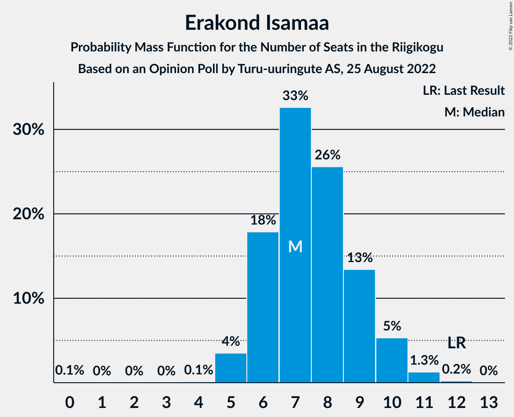
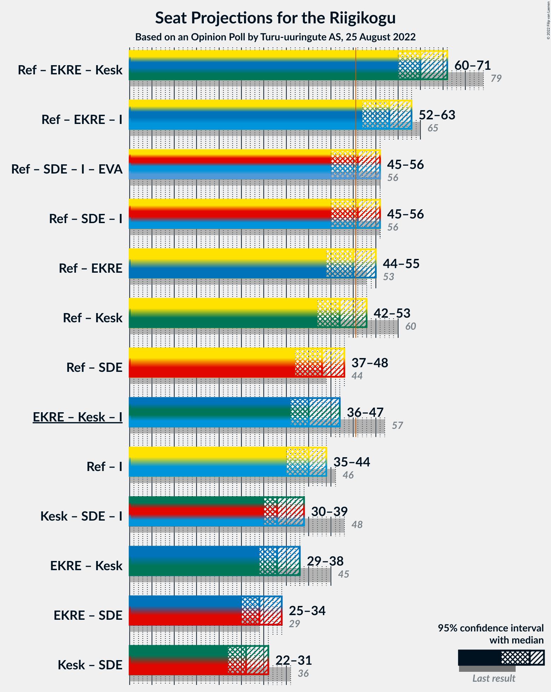

# Opinion Poll by Turu-uuringute AS, 25 August 2022

<a href="#voting-intentions">Voting Intentions</a> | <a href="#seats">Seats</a> | <a href="#coalitions">Coalitions</a> | <a href="#technical-information">Technical Information</a>

## Voting Intentions

### Confidence Intervals

| Party | Last Result | Poll Result | 80% Confidence Interval | 90% Confidence Interval | 95% Confidence Interval | 99% Confidence Interval |
|:-----:|:-----------:|:-----------:|:-----------------------:|:-----------------------:|:-----------------------:|:-----------------------:|
| Eesti Reformierakond | 28.9% | 28.0% | 25.7–30.4% |25.1–31.1% |24.6–31.7% |23.5–32.9% |
| Eesti Konservatiivne Rahvaerakond | 17.8% | 17.0% | 15.2–19.1% |14.6–19.7% |14.2–20.2% |13.4–21.3% |
| Eesti Keskerakond | 23.1% | 15.0% | 13.3–17.0% |12.8–17.6% |12.4–18.1% |11.6–19.1% |
| Eesti 200 | 4.4% | 14.0% | 12.3–16.0% |11.8–16.5% |11.4–17.0% |10.7–18.0% |
| Sotsiaaldemokraatlik Erakond | 9.8% | 11.0% | 9.5–12.8% |9.1–13.3% |8.7–13.8% |8.1–14.7% |
| Erakond Isamaa | 11.4% | 8.0% | 6.7–9.6% |6.4–10.1% |6.1–10.5% |5.5–11.3% |
| Erakond Eestimaa Rohelised | 1.8% | 2.0% | 1.4–3.0% |1.3–3.2% |1.1–3.5% |0.9–4.0% |

*Note:* The poll result column reflects the actual value used in the calculations. Published results may vary slightly, and in addition be rounded to fewer digits.

## Seats

### Confidence Intervals

| Party | Last Result | Median | 80% Confidence Interval | 90% Confidence Interval | 95% Confidence Interval | 99% Confidence Interval |
|:-----:|:-----------:|:------:|:-----------------------:|:-----------------------:|:-----------------------:|:-----------------------:|
| <a href="#eesti-reformierakond">Eesti Reformierakond</a> | 34 | 32 | 29–35 |28–36 |27–36 |25–37 |
| <a href="#eesti-konservatiivne-rahvaerakond">Eesti Konservatiivne Rahvaerakond</a> | 19 | 18 | 16–20 |15–21 |14–22 |13–23 |
| <a href="#eesti-keskerakond">Eesti Keskerakond</a> | 26 | 15 | 13–18 |13–19 |12–19 |12–21 |
| <a href="#eesti-200">Eesti 200</a> | 0 | 14 | 12–17 |12–17 |11–18 |10–19 |
| <a href="#sotsiaaldemokraatlik-erakond">Sotsiaaldemokraatlik Erakond</a> | 10 | 11 | 9–13 |9–14 |8–14 |7–15 |
| <a href="#erakond-isamaa">Erakond Isamaa</a> | 12 | 7 | 6–9 |6–10 |5–10 |5–11 |
| <a href="#erakond-eestimaa-rohelised">Erakond Eestimaa Rohelised</a> | 0 | 0 | 0 |0 |0 |0 |

### Eesti Reformierakond

*For a full overview of the results for this party, see the [Eesti Reformierakond](party-eestireformierakond.html) page.*

| Number of Seats | Probability | Accumulated | Special Marks |
|:---------------:|:-----------:|:-----------:|:-------------:|
| 24 | 0.1% | 100% |  |
| 25 | 0.5% | 99.9% |  |
| 26 | 1.1% | 99.4% |  |
| 27 | 3% | 98% |  |
| 28 | 4% | 96% |  |
| 29 | 5% | 92% |  |
| 30 | 8% | 87% |  |
| 31 | 13% | 78% |  |
| 32 | 19% | 65% | Median |
| 33 | 18% | 46% |  |
| 34 | 15% | 28% | Last Result |
| 35 | 8% | 13% |  |
| 36 | 4% | 5% |  |
| 37 | 1.0% | 1.4% |  |
| 38 | 0.3% | 0.4% |  |
| 39 | 0.1% | 0.2% |  |
| 40 | 0% | 0.1% |  |
| 41 | 0% | 0% |  |

### Eesti Konservatiivne Rahvaerakond

*For a full overview of the results for this party, see the [Eesti Konservatiivne Rahvaerakond](party-eestikonservatiivnerahvaerakond.html) page.*

| Number of Seats | Probability | Accumulated | Special Marks |
|:---------------:|:-----------:|:-----------:|:-------------:|
| 12 | 0.1% | 100% |  |
| 13 | 0.5% | 99.9% |  |
| 14 | 2% | 99.5% |  |
| 15 | 6% | 97% |  |
| 16 | 12% | 91% |  |
| 17 | 20% | 80% |  |
| 18 | 22% | 60% | Median |
| 19 | 18% | 38% | Last Result |
| 20 | 11% | 20% |  |
| 21 | 5% | 10% |  |
| 22 | 3% | 4% |  |
| 23 | 1.0% | 1.3% |  |
| 24 | 0.3% | 0.3% |  |
| 25 | 0.1% | 0.1% |  |
| 26 | 0% | 0% |  |

### Eesti Keskerakond

*For a full overview of the results for this party, see the [Eesti Keskerakond](party-eestikeskerakond.html) page.*

| Number of Seats | Probability | Accumulated | Special Marks |
|:---------------:|:-----------:|:-----------:|:-------------:|
| 11 | 0.4% | 100% |  |
| 12 | 3% | 99.5% |  |
| 13 | 11% | 97% |  |
| 14 | 21% | 86% |  |
| 15 | 25% | 65% | Median |
| 16 | 18% | 39% |  |
| 17 | 10% | 22% |  |
| 18 | 5% | 12% |  |
| 19 | 4% | 6% |  |
| 20 | 2% | 2% |  |
| 21 | 0.5% | 0.7% |  |
| 22 | 0.1% | 0.2% |  |
| 23 | 0% | 0% |  |
| 24 | 0% | 0% |  |
| 25 | 0% | 0% |  |
| 26 | 0% | 0% | Last Result |

### Eesti 200

*For a full overview of the results for this party, see the [Eesti 200](party-eesti200.html) page.*

| Number of Seats | Probability | Accumulated | Special Marks |
|:---------------:|:-----------:|:-----------:|:-------------:|
| 0 | 0% | 100% | Last Result |
| 1 | 0% | 100% |  |
| 2 | 0% | 100% |  |
| 3 | 0% | 100% |  |
| 4 | 0% | 100% |  |
| 5 | 0% | 100% |  |
| 6 | 0% | 100% |  |
| 7 | 0% | 100% |  |
| 8 | 0% | 100% |  |
| 9 | 0.1% | 100% |  |
| 10 | 0.6% | 99.9% |  |
| 11 | 3% | 99.4% |  |
| 12 | 9% | 97% |  |
| 13 | 19% | 88% |  |
| 14 | 21% | 69% | Median |
| 15 | 21% | 48% |  |
| 16 | 16% | 27% |  |
| 17 | 7% | 11% |  |
| 18 | 3% | 4% |  |
| 19 | 1.1% | 1.4% |  |
| 20 | 0.3% | 0.3% |  |
| 21 | 0.1% | 0.1% |  |
| 22 | 0% | 0% |  |

### Sotsiaaldemokraatlik Erakond

*For a full overview of the results for this party, see the [Sotsiaaldemokraatlik Erakond](party-sotsiaaldemokraatlikerakond.html) page.*

| Number of Seats | Probability | Accumulated | Special Marks |
|:---------------:|:-----------:|:-----------:|:-------------:|
| 7 | 0.5% | 100% |  |
| 8 | 4% | 99.5% |  |
| 9 | 12% | 96% |  |
| 10 | 22% | 84% | Last Result |
| 11 | 26% | 62% | Median |
| 12 | 20% | 36% |  |
| 13 | 10% | 16% |  |
| 14 | 4% | 5% |  |
| 15 | 1.2% | 2% |  |
| 16 | 0.3% | 0.3% |  |
| 17 | 0% | 0.1% |  |
| 18 | 0% | 0% |  |

### Erakond Isamaa

*For a full overview of the results for this party, see the [Erakond Isamaa](party-erakondisamaa.html) page.*

| Number of Seats | Probability | Accumulated | Special Marks |
|:---------------:|:-----------:|:-----------:|:-------------:|
| 0 | 0.1% | 100% |  |
| 1 | 0% | 99.9% |  |
| 2 | 0% | 99.9% |  |
| 3 | 0% | 99.9% |  |
| 4 | 0.1% | 99.9% |  |
| 5 | 4% | 99.8% |  |
| 6 | 18% | 96% |  |
| 7 | 33% | 78% | Median |
| 8 | 26% | 46% |  |
| 9 | 13% | 20% |  |
| 10 | 5% | 7% |  |
| 11 | 1.3% | 2% |  |
| 12 | 0.2% | 0.2% | Last Result |
| 13 | 0% | 0% |  |

### Erakond Eestimaa Rohelised

*For a full overview of the results for this party, see the [Erakond Eestimaa Rohelised](party-erakondeestimaarohelised.html) page.*

| Number of Seats | Probability | Accumulated | Special Marks |
|:---------------:|:-----------:|:-----------:|:-------------:|
| 0 | 100% | 100% | Last Result, Median |

## Coalitions

### Confidence Intervals

| Coalition | Last Result | Median | Majority? | 80% Confidence Interval | 90% Confidence Interval | 95% Confidence Interval | 99% Confidence Interval |
|:---------:|:-----------:|:------:|:---------:|:-----------------------:|:-----------------------:|:-----------------------:|:-----------------------:|
| Eesti Reformierakond – Eesti Konservatiivne Rahvaerakond – Eesti Keskerakond | 79 | 65 | 100% | 62–69 | 61–70 | 60–71 | 59–72 |
| Eesti Reformierakond – Eesti Konservatiivne Rahvaerakond – Erakond Isamaa | 65 | 58 | 99.5% | 54–61 | 53–62 | 52–63 | 50–64 |
| Eesti Reformierakond – Sotsiaaldemokraatlik Erakond – Erakond Isamaa | 56 | 51 | 50% | 47–54 | 46–55 | 45–56 | 43–57 |
| Eesti Reformierakond – Eesti Konservatiivne Rahvaerakond | 53 | 50 | 47% | 47–53 | 45–54 | 44–55 | 43–56 |
| Eesti Reformierakond – Eesti Keskerakond | 60 | 47 | 13% | 44–51 | 43–52 | 42–53 | 41–54 |
| Eesti Reformierakond – Sotsiaaldemokraatlik Erakond | 44 | 43 | 0.1% | 40–46 | 38–47 | 37–48 | 36–49 |
| Eesti Konservatiivne Rahvaerakond – Eesti Keskerakond – Erakond Isamaa | 57 | 40 | 0% | 38–44 | 37–46 | 36–47 | 35–48 |
| Eesti Reformierakond – Erakond Isamaa | 46 | 40 | 0% | 36–43 | 35–44 | 35–44 | 33–46 |
| Eesti Keskerakond – Sotsiaaldemokraatlik Erakond – Erakond Isamaa | 48 | 33 | 0% | 31–37 | 30–38 | 30–39 | 29–41 |
| Eesti Konservatiivne Rahvaerakond – Eesti Keskerakond | 45 | 33 | 0% | 30–36 | 30–38 | 29–38 | 28–40 |
| Eesti Konservatiivne Rahvaerakond – Sotsiaaldemokraatlik Erakond | 29 | 29 | 0% | 26–32 | 25–33 | 25–34 | 23–35 |
| Eesti Keskerakond – Sotsiaaldemokraatlik Erakond | 36 | 26 | 0% | 24–29 | 23–30 | 22–31 | 21–33 |

### Eesti Reformierakond – Eesti Konservatiivne Rahvaerakond – Eesti Keskerakond

| Number of Seats | Probability | Accumulated | Special Marks |
|:---------------:|:-----------:|:-----------:|:-------------:|
| 57 | 0.1% | 100% |  |
| 58 | 0.3% | 99.9% |  |
| 59 | 1.0% | 99.5% |  |
| 60 | 2% | 98% |  |
| 61 | 5% | 97% |  |
| 62 | 7% | 92% |  |
| 63 | 10% | 85% |  |
| 64 | 14% | 75% |  |
| 65 | 13% | 62% | Median |
| 66 | 15% | 49% |  |
| 67 | 12% | 34% |  |
| 68 | 8% | 22% |  |
| 69 | 7% | 14% |  |
| 70 | 3% | 7% |  |
| 71 | 3% | 4% |  |
| 72 | 0.9% | 1.4% |  |
| 73 | 0.3% | 0.4% |  |
| 74 | 0.1% | 0.1% |  |
| 75 | 0% | 0% |  |
| 76 | 0% | 0% |  |
| 77 | 0% | 0% |  |
| 78 | 0% | 0% |  |
| 79 | 0% | 0% | Last Result |

### Eesti Reformierakond – Eesti Konservatiivne Rahvaerakond – Erakond Isamaa

| Number of Seats | Probability | Accumulated | Special Marks |
|:---------------:|:-----------:|:-----------:|:-------------:|
| 48 | 0% | 100% |  |
| 49 | 0.2% | 99.9% |  |
| 50 | 0.3% | 99.8% |  |
| 51 | 1.0% | 99.5% | Majority |
| 52 | 2% | 98% |  |
| 53 | 4% | 97% |  |
| 54 | 5% | 93% |  |
| 55 | 9% | 88% |  |
| 56 | 13% | 79% |  |
| 57 | 13% | 66% | Median |
| 58 | 18% | 54% |  |
| 59 | 11% | 36% |  |
| 60 | 10% | 25% |  |
| 61 | 7% | 14% |  |
| 62 | 4% | 8% |  |
| 63 | 2% | 4% |  |
| 64 | 0.7% | 1.1% |  |
| 65 | 0.3% | 0.4% | Last Result |
| 66 | 0.1% | 0.1% |  |
| 67 | 0% | 0% |  |

### Eesti Reformierakond – Sotsiaaldemokraatlik Erakond – Erakond Isamaa

| Number of Seats | Probability | Accumulated | Special Marks |
|:---------------:|:-----------:|:-----------:|:-------------:|
| 41 | 0% | 100% |  |
| 42 | 0.1% | 99.9% |  |
| 43 | 0.4% | 99.8% |  |
| 44 | 0.9% | 99.5% |  |
| 45 | 2% | 98.6% |  |
| 46 | 4% | 97% |  |
| 47 | 6% | 93% |  |
| 48 | 9% | 88% |  |
| 49 | 11% | 79% |  |
| 50 | 17% | 68% | Median |
| 51 | 13% | 50% | Majority |
| 52 | 15% | 38% |  |
| 53 | 9% | 23% |  |
| 54 | 8% | 14% |  |
| 55 | 4% | 7% |  |
| 56 | 2% | 3% | Last Result |
| 57 | 0.9% | 1.2% |  |
| 58 | 0.3% | 0.3% |  |
| 59 | 0.1% | 0.1% |  |
| 60 | 0% | 0% |  |

### Eesti Reformierakond – Eesti Konservatiivne Rahvaerakond

| Number of Seats | Probability | Accumulated | Special Marks |
|:---------------:|:-----------:|:-----------:|:-------------:|
| 41 | 0.1% | 100% |  |
| 42 | 0.3% | 99.9% |  |
| 43 | 0.8% | 99.6% |  |
| 44 | 2% | 98.8% |  |
| 45 | 3% | 97% |  |
| 46 | 4% | 95% |  |
| 47 | 6% | 90% |  |
| 48 | 10% | 85% |  |
| 49 | 13% | 75% |  |
| 50 | 16% | 62% | Median |
| 51 | 18% | 47% | Majority |
| 52 | 11% | 29% |  |
| 53 | 9% | 18% | Last Result |
| 54 | 4% | 9% |  |
| 55 | 3% | 4% |  |
| 56 | 1.2% | 2% |  |
| 57 | 0.3% | 0.5% |  |
| 58 | 0.1% | 0.1% |  |
| 59 | 0% | 0% |  |

### Eesti Reformierakond – Eesti Keskerakond

| Number of Seats | Probability | Accumulated | Special Marks |
|:---------------:|:-----------:|:-----------:|:-------------:|
| 39 | 0.1% | 100% |  |
| 40 | 0.2% | 99.9% |  |
| 41 | 0.7% | 99.7% |  |
| 42 | 2% | 98.9% |  |
| 43 | 4% | 97% |  |
| 44 | 7% | 93% |  |
| 45 | 10% | 86% |  |
| 46 | 13% | 76% |  |
| 47 | 16% | 63% | Median |
| 48 | 13% | 47% |  |
| 49 | 13% | 34% |  |
| 50 | 9% | 22% |  |
| 51 | 7% | 13% | Majority |
| 52 | 3% | 6% |  |
| 53 | 2% | 3% |  |
| 54 | 0.6% | 0.9% |  |
| 55 | 0.3% | 0.4% |  |
| 56 | 0.1% | 0.1% |  |
| 57 | 0% | 0% |  |
| 58 | 0% | 0% |  |
| 59 | 0% | 0% |  |
| 60 | 0% | 0% | Last Result |

### Eesti Reformierakond – Sotsiaaldemokraatlik Erakond

| Number of Seats | Probability | Accumulated | Special Marks |
|:---------------:|:-----------:|:-----------:|:-------------:|
| 34 | 0.1% | 100% |  |
| 35 | 0.3% | 99.9% |  |
| 36 | 0.7% | 99.7% |  |
| 37 | 2% | 99.0% |  |
| 38 | 3% | 97% |  |
| 39 | 4% | 95% |  |
| 40 | 6% | 91% |  |
| 41 | 9% | 85% |  |
| 42 | 14% | 76% |  |
| 43 | 16% | 62% | Median |
| 44 | 16% | 46% | Last Result |
| 45 | 13% | 30% |  |
| 46 | 9% | 17% |  |
| 47 | 5% | 8% |  |
| 48 | 2% | 3% |  |
| 49 | 0.7% | 1.0% |  |
| 50 | 0.2% | 0.3% |  |
| 51 | 0.1% | 0.1% | Majority |
| 52 | 0% | 0% |  |

### Eesti Konservatiivne Rahvaerakond – Eesti Keskerakond – Erakond Isamaa

| Number of Seats | Probability | Accumulated | Special Marks |
|:---------------:|:-----------:|:-----------:|:-------------:|
| 33 | 0% | 100% |  |
| 34 | 0.1% | 99.9% |  |
| 35 | 0.6% | 99.8% |  |
| 36 | 2% | 99.2% |  |
| 37 | 5% | 97% |  |
| 38 | 10% | 92% |  |
| 39 | 14% | 82% |  |
| 40 | 18% | 68% | Median |
| 41 | 14% | 50% |  |
| 42 | 12% | 36% |  |
| 43 | 9% | 24% |  |
| 44 | 6% | 15% |  |
| 45 | 4% | 9% |  |
| 46 | 2% | 5% |  |
| 47 | 2% | 3% |  |
| 48 | 0.8% | 1.2% |  |
| 49 | 0.3% | 0.4% |  |
| 50 | 0.1% | 0.1% |  |
| 51 | 0% | 0% | Majority |
| 52 | 0% | 0% |  |
| 53 | 0% | 0% |  |
| 54 | 0% | 0% |  |
| 55 | 0% | 0% |  |
| 56 | 0% | 0% |  |
| 57 | 0% | 0% | Last Result |

### Eesti Reformierakond – Erakond Isamaa

| Number of Seats | Probability | Accumulated | Special Marks |
|:---------------:|:-----------:|:-----------:|:-------------:|
| 31 | 0.1% | 100% |  |
| 32 | 0.3% | 99.9% |  |
| 33 | 0.7% | 99.6% |  |
| 34 | 1.4% | 98.9% |  |
| 35 | 3% | 98% |  |
| 36 | 5% | 95% |  |
| 37 | 8% | 90% |  |
| 38 | 14% | 81% |  |
| 39 | 15% | 67% | Median |
| 40 | 17% | 52% |  |
| 41 | 14% | 35% |  |
| 42 | 9% | 21% |  |
| 43 | 7% | 13% |  |
| 44 | 4% | 6% |  |
| 45 | 1.4% | 2% |  |
| 46 | 0.6% | 0.8% | Last Result |
| 47 | 0.2% | 0.2% |  |
| 48 | 0% | 0.1% |  |
| 49 | 0% | 0% |  |

### Eesti Keskerakond – Sotsiaaldemokraatlik Erakond – Erakond Isamaa

| Number of Seats | Probability | Accumulated | Special Marks |
|:---------------:|:-----------:|:-----------:|:-------------:|
| 27 | 0.1% | 100% |  |
| 28 | 0.3% | 99.9% |  |
| 29 | 1.4% | 99.5% |  |
| 30 | 5% | 98% |  |
| 31 | 10% | 94% |  |
| 32 | 16% | 84% |  |
| 33 | 18% | 68% | Median |
| 34 | 16% | 50% |  |
| 35 | 12% | 34% |  |
| 36 | 7% | 22% |  |
| 37 | 6% | 14% |  |
| 38 | 4% | 9% |  |
| 39 | 3% | 5% |  |
| 40 | 1.4% | 2% |  |
| 41 | 0.5% | 0.8% |  |
| 42 | 0.2% | 0.3% |  |
| 43 | 0% | 0.1% |  |
| 44 | 0% | 0% |  |
| 45 | 0% | 0% |  |
| 46 | 0% | 0% |  |
| 47 | 0% | 0% |  |
| 48 | 0% | 0% | Last Result |

### Eesti Konservatiivne Rahvaerakond – Eesti Keskerakond

| Number of Seats | Probability | Accumulated | Special Marks |
|:---------------:|:-----------:|:-----------:|:-------------:|
| 26 | 0.1% | 100% |  |
| 27 | 0.3% | 99.9% |  |
| 28 | 1.0% | 99.7% |  |
| 29 | 3% | 98.6% |  |
| 30 | 7% | 95% |  |
| 31 | 11% | 89% |  |
| 32 | 17% | 77% |  |
| 33 | 16% | 60% | Median |
| 34 | 15% | 44% |  |
| 35 | 11% | 29% |  |
| 36 | 8% | 18% |  |
| 37 | 5% | 10% |  |
| 38 | 3% | 5% |  |
| 39 | 1.5% | 2% |  |
| 40 | 0.6% | 1.0% |  |
| 41 | 0.3% | 0.4% |  |
| 42 | 0.1% | 0.1% |  |
| 43 | 0% | 0% |  |
| 44 | 0% | 0% |  |
| 45 | 0% | 0% | Last Result |

### Eesti Konservatiivne Rahvaerakond – Sotsiaaldemokraatlik Erakond

| Number of Seats | Probability | Accumulated | Special Marks |
|:---------------:|:-----------:|:-----------:|:-------------:|
| 22 | 0.1% | 100% |  |
| 23 | 0.5% | 99.8% |  |
| 24 | 1.3% | 99.3% |  |
| 25 | 4% | 98% |  |
| 26 | 8% | 94% |  |
| 27 | 12% | 87% |  |
| 28 | 17% | 74% |  |
| 29 | 16% | 58% | Last Result, Median |
| 30 | 17% | 42% |  |
| 31 | 11% | 25% |  |
| 32 | 7% | 14% |  |
| 33 | 4% | 7% |  |
| 34 | 2% | 3% |  |
| 35 | 0.7% | 1.1% |  |
| 36 | 0.3% | 0.4% |  |
| 37 | 0.1% | 0.1% |  |
| 38 | 0% | 0% |  |

### Eesti Keskerakond – Sotsiaaldemokraatlik Erakond

| Number of Seats | Probability | Accumulated | Special Marks |
|:---------------:|:-----------:|:-----------:|:-------------:|
| 20 | 0.1% | 100% |  |
| 21 | 1.0% | 99.9% |  |
| 22 | 2% | 98.9% |  |
| 23 | 5% | 97% |  |
| 24 | 16% | 92% |  |
| 25 | 10% | 76% |  |
| 26 | 25% | 66% | Median |
| 27 | 16% | 42% |  |
| 28 | 9% | 26% |  |
| 29 | 9% | 17% |  |
| 30 | 4% | 8% |  |
| 31 | 1.5% | 4% |  |
| 32 | 2% | 2% |  |
| 33 | 0.3% | 0.5% |  |
| 34 | 0.1% | 0.2% |  |
| 35 | 0.1% | 0.1% |  |
| 36 | 0% | 0% | Last Result |

## Technical Information

### Opinion Poll

+ **Polling firm:** Turu-uuringute AS
+ **Commissioner(s):** —
+ **Fieldwork period:** 25 August 2022

### Calculations

+ **Sample size:** 600
+ **Simulations done:** 1,048,576
+ **Error estimate:** 1.84%

