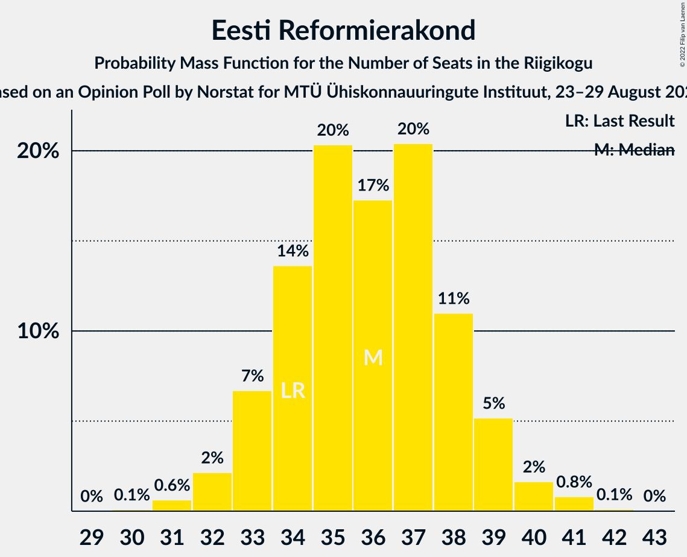

# Opinion Poll by Norstat for MTÜ Ühiskonnauuringute Instituut, 23–29 August 2022

<a href="#voting-intentions">Voting Intentions</a> | <a href="#seats">Seats</a> | <a href="#coalitions">Coalitions</a> | <a href="#technical-information">Technical Information</a>

## Voting Intentions

### Confidence Intervals

| Party | Last Result | Poll Result | 80% Confidence Interval | 90% Confidence Interval | 95% Confidence Interval | 99% Confidence Interval |
|:-----:|:-----------:|:-----------:|:-----------------------:|:-----------------------:|:-----------------------:|:-----------------------:|
| Eesti Reformierakond | 28.9% | 32.0% | 30.1–33.9% |29.6–34.5% |29.2–35.0% |28.3–35.9% |
| Eesti Konservatiivne Rahvaerakond | 17.8% | 24.9% | 23.2–26.7% |22.7–27.2% |22.3–27.7% |21.5–28.6% |
| Eesti Keskerakond | 23.1% | 16.0% | 14.6–17.6% |14.2–18.0% |13.9–18.4% |13.2–19.2% |
| Eesti 200 | 4.4% | 9.6% | 8.5–10.9% |8.2–11.3% |7.9–11.6% |7.4–12.2% |
| Erakond Isamaa | 11.4% | 7.5% | 6.5–8.7% |6.2–9.0% |6.0–9.3% |5.6–9.9% |
| Sotsiaaldemokraatlik Erakond | 9.8% | 6.5% | 5.6–7.6% |5.3–7.9% |5.1–8.2% |4.7–8.8% |
| Erakond Eestimaa Rohelised | 1.8% | 1.5% | 1.1–2.1% |1.0–2.3% |0.9–2.5% |0.7–2.8% |
| Erakond Parempoolsed | 0.0% | 0.9% | 0.6–1.4% |0.5–1.6% |0.5–1.7% |0.4–2.0% |

*Note:* The poll result column reflects the actual value used in the calculations. Published results may vary slightly, and in addition be rounded to fewer digits.

## Seats

### Confidence Intervals

| Party | Last Result | Median | 80% Confidence Interval | 90% Confidence Interval | 95% Confidence Interval | 99% Confidence Interval |
|:-----:|:-----------:|:------:|:-----------------------:|:-----------------------:|:-----------------------:|:-----------------------:|
| <a href="#eesti-reformierakond">Eesti Reformierakond</a> | 34 | 36 | 34–38 |33–39 |32–40 |31–41 |
| <a href="#eesti-konservatiivne-rahvaerakond">Eesti Konservatiivne Rahvaerakond</a> | 19 | 27 | 25–29 |24–30 |24–30 |23–31 |
| <a href="#eesti-keskerakond">Eesti Keskerakond</a> | 26 | 16 | 15–18 |14–19 |14–19 |13–20 |
| <a href="#eesti-200">Eesti 200</a> | 0 | 9 | 8–11 |7–11 |7–11 |7–12 |
| <a href="#erakond-isamaa">Erakond Isamaa</a> | 12 | 7 | 6–8 |5–8 |5–9 |5–9 |
| <a href="#sotsiaaldemokraatlik-erakond">Sotsiaaldemokraatlik Erakond</a> | 10 | 6 | 5–7 |4–7 |4–8 |0–8 |
| <a href="#erakond-eestimaa-rohelised">Erakond Eestimaa Rohelised</a> | 0 | 0 | 0 |0 |0 |0 |
| <a href="#erakond-parempoolsed">Erakond Parempoolsed</a> | 0 | 0 | 0 |0 |0 |0 |

### Eesti Reformierakond

*For a full overview of the results for this party, see the [Eesti Reformierakond](party-eestireformierakond.html) page.*

| Number of Seats | Probability | Accumulated | Special Marks |
|:---------------:|:-----------:|:-----------:|:-------------:|
| 30 | 0.1% | 100% |  |
| 31 | 0.6% | 99.9% |  |
| 32 | 2% | 99.3% |  |
| 33 | 7% | 97% |  |
| 34 | 14% | 90% | Last Result |
| 35 | 20% | 77% |  |
| 36 | 17% | 56% | Median |
| 37 | 20% | 39% |  |
| 38 | 11% | 19% |  |
| 39 | 5% | 8% |  |
| 40 | 2% | 3% |  |
| 41 | 0.8% | 1.0% |  |
| 42 | 0.1% | 0.1% |  |
| 43 | 0% | 0% |  |

### Eesti Konservatiivne Rahvaerakond

*For a full overview of the results for this party, see the [Eesti Konservatiivne Rahvaerakond](party-eestikonservatiivnerahvaerakond.html) page.*

| Number of Seats | Probability | Accumulated | Special Marks |
|:---------------:|:-----------:|:-----------:|:-------------:|
| 19 | 0% | 100% | Last Result |
| 20 | 0% | 100% |  |
| 21 | 0% | 100% |  |
| 22 | 0.2% | 100% |  |
| 23 | 1.1% | 99.8% |  |
| 24 | 4% | 98.6% |  |
| 25 | 11% | 94% |  |
| 26 | 22% | 83% |  |
| 27 | 22% | 61% | Median |
| 28 | 17% | 38% |  |
| 29 | 14% | 21% |  |
| 30 | 5% | 7% |  |
| 31 | 1.5% | 2% |  |
| 32 | 0.4% | 0.5% |  |
| 33 | 0.1% | 0.1% |  |
| 34 | 0% | 0% |  |

### Eesti Keskerakond

*For a full overview of the results for this party, see the [Eesti Keskerakond](party-eestikeskerakond.html) page.*

| Number of Seats | Probability | Accumulated | Special Marks |
|:---------------:|:-----------:|:-----------:|:-------------:|
| 12 | 0.1% | 100% |  |
| 13 | 1.2% | 99.9% |  |
| 14 | 6% | 98.7% |  |
| 15 | 22% | 92% |  |
| 16 | 25% | 70% | Median |
| 17 | 24% | 45% |  |
| 18 | 14% | 21% |  |
| 19 | 5% | 7% |  |
| 20 | 2% | 2% |  |
| 21 | 0.2% | 0.2% |  |
| 22 | 0% | 0% |  |
| 23 | 0% | 0% |  |
| 24 | 0% | 0% |  |
| 25 | 0% | 0% |  |
| 26 | 0% | 0% | Last Result |

### Eesti 200

*For a full overview of the results for this party, see the [Eesti 200](party-eesti200.html) page.*

| Number of Seats | Probability | Accumulated | Special Marks |
|:---------------:|:-----------:|:-----------:|:-------------:|
| 0 | 0% | 100% | Last Result |
| 1 | 0% | 100% |  |
| 2 | 0% | 100% |  |
| 3 | 0% | 100% |  |
| 4 | 0% | 100% |  |
| 5 | 0% | 100% |  |
| 6 | 0.2% | 100% |  |
| 7 | 5% | 99.8% |  |
| 8 | 21% | 95% |  |
| 9 | 34% | 73% | Median |
| 10 | 29% | 40% |  |
| 11 | 9% | 11% |  |
| 12 | 1.4% | 2% |  |
| 13 | 0.2% | 0.2% |  |
| 14 | 0% | 0% |  |

### Erakond Isamaa

*For a full overview of the results for this party, see the [Erakond Isamaa](party-erakondisamaa.html) page.*

| Number of Seats | Probability | Accumulated | Special Marks |
|:---------------:|:-----------:|:-----------:|:-------------:|
| 4 | 0.1% | 100% |  |
| 5 | 8% | 99.8% |  |
| 6 | 31% | 92% |  |
| 7 | 39% | 61% | Median |
| 8 | 18% | 22% |  |
| 9 | 3% | 4% |  |
| 10 | 0.3% | 0.4% |  |
| 11 | 0% | 0% |  |
| 12 | 0% | 0% | Last Result |

### Sotsiaaldemokraatlik Erakond

*For a full overview of the results for this party, see the [Sotsiaaldemokraatlik Erakond](party-sotsiaaldemokraatlikerakond.html) page.*

| Number of Seats | Probability | Accumulated | Special Marks |
|:---------------:|:-----------:|:-----------:|:-------------:|
| 0 | 2% | 100% |  |
| 1 | 0% | 98% |  |
| 2 | 0% | 98% |  |
| 3 | 0% | 98% |  |
| 4 | 4% | 98% |  |
| 5 | 34% | 94% |  |
| 6 | 38% | 60% | Median |
| 7 | 19% | 22% |  |
| 8 | 2% | 3% |  |
| 9 | 0.2% | 0.2% |  |
| 10 | 0% | 0% | Last Result |

### Erakond Eestimaa Rohelised

*For a full overview of the results for this party, see the [Erakond Eestimaa Rohelised](party-erakondeestimaarohelised.html) page.*

| Number of Seats | Probability | Accumulated | Special Marks |
|:---------------:|:-----------:|:-----------:|:-------------:|
| 0 | 100% | 100% | Last Result, Median |

### Erakond Parempoolsed

*For a full overview of the results for this party, see the [Erakond Parempoolsed](party-erakondparempoolsed.html) page.*

| Number of Seats | Probability | Accumulated | Special Marks |
|:---------------:|:-----------:|:-----------:|:-------------:|
| 0 | 100% | 100% | Last Result, Median |

## Coalitions

### Confidence Intervals

| Coalition | Last Result | Median | Majority? | 80% Confidence Interval | 90% Confidence Interval | 95% Confidence Interval | 99% Confidence Interval |
|:---------:|:-----------:|:------:|:---------:|:-----------------------:|:-----------------------:|:-----------------------:|:-----------------------:|
| Eesti Reformierakond – Eesti Konservatiivne Rahvaerakond – Eesti Keskerakond | 79 | 79 | 100% | 77–82 | 77–82 | 76–83 | 75–85 |
| Eesti Reformierakond – Eesti Konservatiivne Rahvaerakond – Erakond Isamaa | 65 | 70 | 100% | 68–72 | 67–73 | 66–74 | 65–75 |
| Eesti Reformierakond – Eesti Konservatiivne Rahvaerakond | 53 | 63 | 100% | 60–65 | 60–66 | 59–67 | 58–68 |
| Eesti Reformierakond – Eesti Keskerakond | 60 | 52 | 80% | 50–55 | 49–55 | 49–56 | 47–57 |
| Eesti Konservatiivne Rahvaerakond – Eesti Keskerakond – Erakond Isamaa | 57 | 50 | 43% | 48–53 | 47–54 | 46–54 | 46–56 |
| Eesti Reformierakond – Erakond Isamaa – Sotsiaaldemokraatlik Erakond | 56 | 48 | 15% | 46–51 | 45–52 | 45–52 | 43–54 |
| Eesti Konservatiivne Rahvaerakond – Eesti Keskerakond | 45 | 43 | 0% | 41–46 | 40–47 | 40–47 | 39–49 |
| Eesti Reformierakond – Erakond Isamaa | 46 | 43 | 0% | 40–45 | 40–46 | 39–47 | 38–48 |
| Eesti Reformierakond – Sotsiaaldemokraatlik Erakond | 44 | 42 | 0% | 39–44 | 38–45 | 38–46 | 36–47 |
| Eesti Konservatiivne Rahvaerakond – Sotsiaaldemokraatlik Erakond | 29 | 33 | 0% | 31–35 | 30–36 | 29–36 | 28–37 |
| Eesti Keskerakond – Erakond Isamaa – Sotsiaaldemokraatlik Erakond | 48 | 29 | 0% | 27–31 | 26–32 | 25–32 | 24–33 |
| Eesti Keskerakond – Sotsiaaldemokraatlik Erakond | 36 | 22 | 0% | 20–24 | 19–25 | 18–25 | 16–26 |

### Eesti Reformierakond – Eesti Konservatiivne Rahvaerakond – Eesti Keskerakond

| Number of Seats | Probability | Accumulated | Special Marks |
|:---------------:|:-----------:|:-----------:|:-------------:|
| 74 | 0.1% | 100% |  |
| 75 | 0.6% | 99.9% |  |
| 76 | 4% | 99.3% |  |
| 77 | 7% | 95% |  |
| 78 | 19% | 88% |  |
| 79 | 28% | 69% | Last Result, Median |
| 80 | 21% | 42% |  |
| 81 | 9% | 20% |  |
| 82 | 8% | 11% |  |
| 83 | 2% | 4% |  |
| 84 | 0.4% | 1.1% |  |
| 85 | 0.5% | 0.7% |  |
| 86 | 0.2% | 0.2% |  |
| 87 | 0.1% | 0.1% |  |
| 88 | 0% | 0% |  |

### Eesti Reformierakond – Eesti Konservatiivne Rahvaerakond – Erakond Isamaa

| Number of Seats | Probability | Accumulated | Special Marks |
|:---------------:|:-----------:|:-----------:|:-------------:|
| 64 | 0.1% | 100% |  |
| 65 | 0.6% | 99.9% | Last Result |
| 66 | 3% | 99.2% |  |
| 67 | 6% | 96% |  |
| 68 | 16% | 90% |  |
| 69 | 19% | 74% |  |
| 70 | 22% | 55% | Median |
| 71 | 18% | 33% |  |
| 72 | 8% | 15% |  |
| 73 | 4% | 7% |  |
| 74 | 1.4% | 3% |  |
| 75 | 0.9% | 1.2% |  |
| 76 | 0.3% | 0.4% |  |
| 77 | 0.1% | 0.1% |  |
| 78 | 0% | 0% |  |

### Eesti Reformierakond – Eesti Konservatiivne Rahvaerakond

| Number of Seats | Probability | Accumulated | Special Marks |
|:---------------:|:-----------:|:-----------:|:-------------:|
| 53 | 0% | 100% | Last Result |
| 54 | 0% | 100% |  |
| 55 | 0% | 100% |  |
| 56 | 0% | 100% |  |
| 57 | 0.1% | 100% |  |
| 58 | 0.7% | 99.9% |  |
| 59 | 3% | 99.2% |  |
| 60 | 7% | 96% |  |
| 61 | 10% | 89% |  |
| 62 | 16% | 78% |  |
| 63 | 24% | 62% | Median |
| 64 | 18% | 39% |  |
| 65 | 12% | 20% |  |
| 66 | 5% | 8% |  |
| 67 | 2% | 3% |  |
| 68 | 0.8% | 1.0% |  |
| 69 | 0.2% | 0.3% |  |
| 70 | 0.1% | 0.1% |  |
| 71 | 0% | 0% |  |

### Eesti Reformierakond – Eesti Keskerakond

| Number of Seats | Probability | Accumulated | Special Marks |
|:---------------:|:-----------:|:-----------:|:-------------:|
| 46 | 0.1% | 100% |  |
| 47 | 0.5% | 99.9% |  |
| 48 | 2% | 99.4% |  |
| 49 | 5% | 98% |  |
| 50 | 12% | 92% |  |
| 51 | 15% | 80% | Majority |
| 52 | 20% | 65% | Median |
| 53 | 17% | 45% |  |
| 54 | 15% | 27% |  |
| 55 | 8% | 13% |  |
| 56 | 3% | 5% |  |
| 57 | 1.0% | 1.4% |  |
| 58 | 0.3% | 0.4% |  |
| 59 | 0.1% | 0.1% |  |
| 60 | 0.1% | 0.1% | Last Result |
| 61 | 0% | 0% |  |

### Eesti Konservatiivne Rahvaerakond – Eesti Keskerakond – Erakond Isamaa

| Number of Seats | Probability | Accumulated | Special Marks |
|:---------------:|:-----------:|:-----------:|:-------------:|
| 44 | 0.1% | 100% |  |
| 45 | 0.4% | 99.9% |  |
| 46 | 2% | 99.5% |  |
| 47 | 5% | 97% |  |
| 48 | 13% | 92% |  |
| 49 | 15% | 79% |  |
| 50 | 21% | 64% | Median |
| 51 | 18% | 43% | Majority |
| 52 | 13% | 26% |  |
| 53 | 8% | 13% |  |
| 54 | 4% | 5% |  |
| 55 | 0.9% | 1.4% |  |
| 56 | 0.4% | 0.5% |  |
| 57 | 0.1% | 0.1% | Last Result |
| 58 | 0% | 0% |  |

### Eesti Reformierakond – Erakond Isamaa – Sotsiaaldemokraatlik Erakond

| Number of Seats | Probability | Accumulated | Special Marks |
|:---------------:|:-----------:|:-----------:|:-------------:|
| 41 | 0% | 100% |  |
| 42 | 0.1% | 99.9% |  |
| 43 | 0.6% | 99.8% |  |
| 44 | 1.3% | 99.2% |  |
| 45 | 5% | 98% |  |
| 46 | 9% | 93% |  |
| 47 | 16% | 84% |  |
| 48 | 21% | 67% |  |
| 49 | 19% | 47% | Median |
| 50 | 13% | 28% |  |
| 51 | 9% | 15% | Majority |
| 52 | 4% | 6% |  |
| 53 | 1.1% | 2% |  |
| 54 | 0.6% | 0.7% |  |
| 55 | 0% | 0.1% |  |
| 56 | 0% | 0% | Last Result |

### Eesti Konservatiivne Rahvaerakond – Eesti Keskerakond

| Number of Seats | Probability | Accumulated | Special Marks |
|:---------------:|:-----------:|:-----------:|:-------------:|
| 37 | 0% | 100% |  |
| 38 | 0.3% | 99.9% |  |
| 39 | 2% | 99.7% |  |
| 40 | 4% | 98% |  |
| 41 | 11% | 94% |  |
| 42 | 15% | 83% |  |
| 43 | 20% | 68% | Median |
| 44 | 19% | 48% |  |
| 45 | 16% | 29% | Last Result |
| 46 | 7% | 13% |  |
| 47 | 4% | 6% |  |
| 48 | 0.9% | 1.5% |  |
| 49 | 0.5% | 0.6% |  |
| 50 | 0.1% | 0.1% |  |
| 51 | 0% | 0% | Majority |

### Eesti Reformierakond – Erakond Isamaa

| Number of Seats | Probability | Accumulated | Special Marks |
|:---------------:|:-----------:|:-----------:|:-------------:|
| 36 | 0% | 100% |  |
| 37 | 0.1% | 99.9% |  |
| 38 | 1.3% | 99.8% |  |
| 39 | 2% | 98.5% |  |
| 40 | 8% | 96% |  |
| 41 | 14% | 88% |  |
| 42 | 21% | 74% |  |
| 43 | 21% | 53% | Median |
| 44 | 14% | 31% |  |
| 45 | 10% | 18% |  |
| 46 | 5% | 7% | Last Result |
| 47 | 2% | 3% |  |
| 48 | 0.9% | 1.0% |  |
| 49 | 0.1% | 0.1% |  |
| 50 | 0% | 0% |  |

### Eesti Reformierakond – Sotsiaaldemokraatlik Erakond

| Number of Seats | Probability | Accumulated | Special Marks |
|:---------------:|:-----------:|:-----------:|:-------------:|
| 35 | 0.1% | 100% |  |
| 36 | 0.5% | 99.9% |  |
| 37 | 1.4% | 99.4% |  |
| 38 | 4% | 98% |  |
| 39 | 9% | 94% |  |
| 40 | 15% | 85% |  |
| 41 | 18% | 70% |  |
| 42 | 19% | 52% | Median |
| 43 | 15% | 33% |  |
| 44 | 10% | 17% | Last Result |
| 45 | 5% | 8% |  |
| 46 | 2% | 3% |  |
| 47 | 0.4% | 0.5% |  |
| 48 | 0.1% | 0.1% |  |
| 49 | 0% | 0% |  |

### Eesti Konservatiivne Rahvaerakond – Sotsiaaldemokraatlik Erakond

| Number of Seats | Probability | Accumulated | Special Marks |
|:---------------:|:-----------:|:-----------:|:-------------:|
| 26 | 0.2% | 100% |  |
| 27 | 0.3% | 99.8% |  |
| 28 | 0.7% | 99.5% |  |
| 29 | 3% | 98.8% | Last Result |
| 30 | 5% | 95% |  |
| 31 | 14% | 90% |  |
| 32 | 18% | 76% |  |
| 33 | 24% | 58% | Median |
| 34 | 19% | 34% |  |
| 35 | 9% | 15% |  |
| 36 | 4% | 6% |  |
| 37 | 1.4% | 2% |  |
| 38 | 0.3% | 0.4% |  |
| 39 | 0.1% | 0.1% |  |
| 40 | 0% | 0% |  |

### Eesti Keskerakond – Erakond Isamaa – Sotsiaaldemokraatlik Erakond

| Number of Seats | Probability | Accumulated | Special Marks |
|:---------------:|:-----------:|:-----------:|:-------------:|
| 22 | 0.1% | 100% |  |
| 23 | 0.2% | 99.9% |  |
| 24 | 1.3% | 99.6% |  |
| 25 | 2% | 98% |  |
| 26 | 5% | 97% |  |
| 27 | 14% | 92% |  |
| 28 | 23% | 78% |  |
| 29 | 22% | 55% | Median |
| 30 | 13% | 34% |  |
| 31 | 12% | 21% |  |
| 32 | 6% | 8% |  |
| 33 | 2% | 2% |  |
| 34 | 0.2% | 0.3% |  |
| 35 | 0.1% | 0.1% |  |
| 36 | 0% | 0% |  |
| 37 | 0% | 0% |  |
| 38 | 0% | 0% |  |
| 39 | 0% | 0% |  |
| 40 | 0% | 0% |  |
| 41 | 0% | 0% |  |
| 42 | 0% | 0% |  |
| 43 | 0% | 0% |  |
| 44 | 0% | 0% |  |
| 45 | 0% | 0% |  |
| 46 | 0% | 0% |  |
| 47 | 0% | 0% |  |
| 48 | 0% | 0% | Last Result |

### Eesti Keskerakond – Sotsiaaldemokraatlik Erakond

| Number of Seats | Probability | Accumulated | Special Marks |
|:---------------:|:-----------:|:-----------:|:-------------:|
| 15 | 0.1% | 100% |  |
| 16 | 0.7% | 99.9% |  |
| 17 | 0.7% | 99.1% |  |
| 18 | 1.0% | 98% |  |
| 19 | 4% | 97% |  |
| 20 | 11% | 93% |  |
| 21 | 18% | 82% |  |
| 22 | 20% | 64% | Median |
| 23 | 26% | 44% |  |
| 24 | 12% | 19% |  |
| 25 | 5% | 6% |  |
| 26 | 1.4% | 2% |  |
| 27 | 0.3% | 0.3% |  |
| 28 | 0% | 0.1% |  |
| 29 | 0% | 0% |  |
| 30 | 0% | 0% |  |
| 31 | 0% | 0% |  |
| 32 | 0% | 0% |  |
| 33 | 0% | 0% |  |
| 34 | 0% | 0% |  |
| 35 | 0% | 0% |  |
| 36 | 0% | 0% | Last Result |

## Technical Information

### Opinion Poll

+ **Polling firm:** Norstat
+ **Commissioner(s):** MTÜ Ühiskonnauuringute Instituut
+ **Fieldwork period:** 23–29 August 2022

### Calculations

+ **Sample size:** 1000
+ **Simulations done:** 1,048,576
+ **Error estimate:** 1.65%

