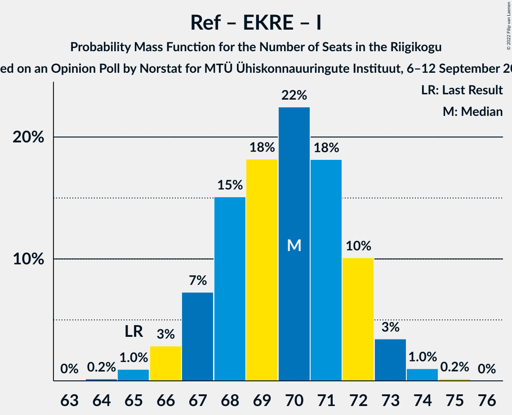
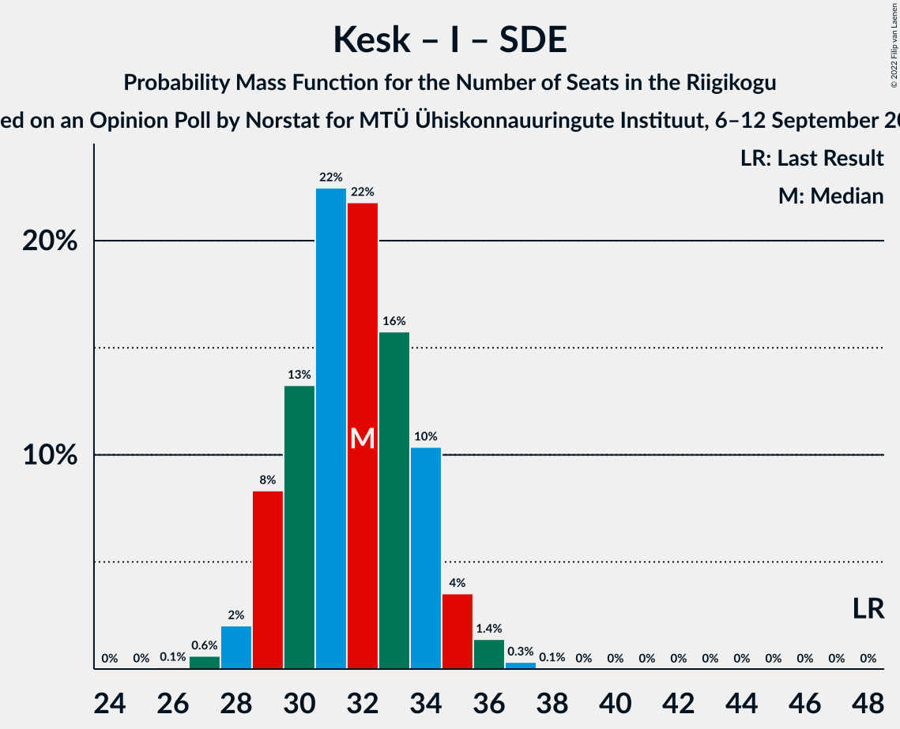

# Opinion Poll by Norstat for MTÜ Ühiskonnauuringute Instituut, 6–12 September 2022

<a href="#voting-intentions">Voting Intentions</a> | <a href="#seats">Seats</a> | <a href="#coalitions">Coalitions</a> | <a href="#technical-information">Technical Information</a>

## Voting Intentions

### Confidence Intervals

| Party | Last Result | Poll Result | 80% Confidence Interval | 90% Confidence Interval | 95% Confidence Interval | 99% Confidence Interval |
|:-----:|:-----------:|:-----------:|:-----------------------:|:-----------------------:|:-----------------------:|:-----------------------:|
| Eesti Reformierakond | 28.9% | 30.4% | 28.6–32.3% |28.1–32.9% |27.6–33.3% |26.8–34.3% |
| Eesti Konservatiivne Rahvaerakond | 17.8% | 24.7% | 23.0–26.5% |22.5–27.0% |22.1–27.5% |21.3–28.3% |
| Eesti Keskerakond | 23.1% | 15.4% | 14.0–16.9% |13.6–17.4% |13.3–17.8% |12.7–18.5% |
| Erakond Isamaa | 11.4% | 8.4% | 7.4–9.6% |7.1–10.0% |6.8–10.3% |6.4–10.9% |
| Sotsiaaldemokraatlik Erakond | 9.8% | 8.3% | 7.3–9.5% |7.0–9.9% |6.7–10.2% |6.3–10.8% |
| Eesti 200 | 4.4% | 8.1% | 7.1–9.3% |6.8–9.7% |6.6–10.0% |6.1–10.6% |
| Erakond Eestimaa Rohelised | 1.8% | 1.7% | 1.3–2.4% |1.2–2.5% |1.1–2.7% |0.9–3.1% |

*Note:* The poll result column reflects the actual value used in the calculations. Published results may vary slightly, and in addition be rounded to fewer digits.

## Seats

### Confidence Intervals

| Party | Last Result | Median | 80% Confidence Interval | 90% Confidence Interval | 95% Confidence Interval | 99% Confidence Interval |
|:-----:|:-----------:|:------:|:-----------------------:|:-----------------------:|:-----------------------:|:-----------------------:|
| <a href="#eesti-reformierakond">Eesti Reformierakond</a> | 34 | 34 | 32–37 |31–37 |31–38 |30–39 |
| <a href="#eesti-konservatiivne-rahvaerakond">Eesti Konservatiivne Rahvaerakond</a> | 19 | 27 | 25–29 |24–30 |24–31 |23–32 |
| <a href="#eesti-keskerakond">Eesti Keskerakond</a> | 26 | 16 | 14–18 |14–18 |14–19 |13–19 |
| <a href="#erakond-isamaa">Erakond Isamaa</a> | 12 | 8 | 7–9 |6–10 |6–10 |6–11 |
| <a href="#sotsiaaldemokraatlik-erakond">Sotsiaaldemokraatlik Erakond</a> | 10 | 8 | 7–9 |6–9 |6–10 |5–11 |
| <a href="#eesti-200">Eesti 200</a> | 0 | 8 | 6–9 |6–9 |6–10 |5–10 |
| <a href="#erakond-eestimaa-rohelised">Erakond Eestimaa Rohelised</a> | 0 | 0 | 0 |0 |0 |0 |

### Eesti Reformierakond

*For a full overview of the results for this party, see the [Eesti Reformierakond](party-eestireformierakond.html) page.*

| Number of Seats | Probability | Accumulated | Special Marks |
|:---------------:|:-----------:|:-----------:|:-------------:|
| 29 | 0.2% | 100% |  |
| 30 | 1.3% | 99.7% |  |
| 31 | 4% | 98% |  |
| 32 | 8% | 94% |  |
| 33 | 15% | 86% |  |
| 34 | 21% | 71% | Last Result, Median |
| 35 | 22% | 50% |  |
| 36 | 16% | 28% |  |
| 37 | 8% | 12% |  |
| 38 | 3% | 4% |  |
| 39 | 0.8% | 1.1% |  |
| 40 | 0.2% | 0.3% |  |
| 41 | 0% | 0% |  |

### Eesti Konservatiivne Rahvaerakond

*For a full overview of the results for this party, see the [Eesti Konservatiivne Rahvaerakond](party-eestikonservatiivnerahvaerakond.html) page.*

| Number of Seats | Probability | Accumulated | Special Marks |
|:---------------:|:-----------:|:-----------:|:-------------:|
| 19 | 0% | 100% | Last Result |
| 20 | 0% | 100% |  |
| 21 | 0% | 100% |  |
| 22 | 0.1% | 100% |  |
| 23 | 0.9% | 99.8% |  |
| 24 | 4% | 98.9% |  |
| 25 | 10% | 95% |  |
| 26 | 18% | 85% |  |
| 27 | 25% | 67% | Median |
| 28 | 20% | 42% |  |
| 29 | 13% | 22% |  |
| 30 | 6% | 9% |  |
| 31 | 2% | 3% |  |
| 32 | 0.5% | 0.6% |  |
| 33 | 0.1% | 0.1% |  |
| 34 | 0% | 0% |  |

### Eesti Keskerakond

*For a full overview of the results for this party, see the [Eesti Keskerakond](party-eestikeskerakond.html) page.*

| Number of Seats | Probability | Accumulated | Special Marks |
|:---------------:|:-----------:|:-----------:|:-------------:|
| 12 | 0.2% | 100% |  |
| 13 | 2% | 99.7% |  |
| 14 | 15% | 98% |  |
| 15 | 31% | 83% |  |
| 16 | 21% | 52% | Median |
| 17 | 14% | 31% |  |
| 18 | 13% | 17% |  |
| 19 | 3% | 4% |  |
| 20 | 0.4% | 0.5% |  |
| 21 | 0.1% | 0.1% |  |
| 22 | 0% | 0% |  |
| 23 | 0% | 0% |  |
| 24 | 0% | 0% |  |
| 25 | 0% | 0% |  |
| 26 | 0% | 0% | Last Result |

### Erakond Isamaa

*For a full overview of the results for this party, see the [Erakond Isamaa](party-erakondisamaa.html) page.*

| Number of Seats | Probability | Accumulated | Special Marks |
|:---------------:|:-----------:|:-----------:|:-------------:|
| 5 | 0.3% | 100% |  |
| 6 | 6% | 99.7% |  |
| 7 | 26% | 94% |  |
| 8 | 37% | 68% | Median |
| 9 | 24% | 31% |  |
| 10 | 6% | 7% |  |
| 11 | 0.7% | 0.8% |  |
| 12 | 0.1% | 0.1% | Last Result |
| 13 | 0% | 0% |  |

### Sotsiaaldemokraatlik Erakond

*For a full overview of the results for this party, see the [Sotsiaaldemokraatlik Erakond](party-sotsiaaldemokraatlikerakond.html) page.*

| Number of Seats | Probability | Accumulated | Special Marks |
|:---------------:|:-----------:|:-----------:|:-------------:|
| 5 | 0.5% | 100% |  |
| 6 | 6% | 99.5% |  |
| 7 | 28% | 93% |  |
| 8 | 45% | 66% | Median |
| 9 | 16% | 21% |  |
| 10 | 4% | 5% | Last Result |
| 11 | 0.7% | 0.7% |  |
| 12 | 0% | 0% |  |

### Eesti 200

*For a full overview of the results for this party, see the [Eesti 200](party-eesti200.html) page.*

| Number of Seats | Probability | Accumulated | Special Marks |
|:---------------:|:-----------:|:-----------:|:-------------:|
| 0 | 0% | 100% | Last Result |
| 1 | 0% | 100% |  |
| 2 | 0% | 100% |  |
| 3 | 0% | 100% |  |
| 4 | 0% | 100% |  |
| 5 | 0.8% | 100% |  |
| 6 | 11% | 99.2% |  |
| 7 | 34% | 88% |  |
| 8 | 35% | 54% | Median |
| 9 | 15% | 19% |  |
| 10 | 3% | 3% |  |
| 11 | 0.3% | 0.3% |  |
| 12 | 0% | 0% |  |

### Erakond Eestimaa Rohelised

*For a full overview of the results for this party, see the [Erakond Eestimaa Rohelised](party-erakondeestimaarohelised.html) page.*

| Number of Seats | Probability | Accumulated | Special Marks |
|:---------------:|:-----------:|:-----------:|:-------------:|
| 0 | 100% | 100% | Last Result, Median |

## Coalitions

### Confidence Intervals

| Coalition | Last Result | Median | Majority? | 80% Confidence Interval | 90% Confidence Interval | 95% Confidence Interval | 99% Confidence Interval |
|:---------:|:-----------:|:------:|:---------:|:-----------------------:|:-----------------------:|:-----------------------:|:-----------------------:|
| Eesti Reformierakond – Eesti Konservatiivne Rahvaerakond – Eesti Keskerakond | 79 | 77 | 100% | 76–80 | 75–80 | 75–81 | 73–82 |
| Eesti Reformierakond – Eesti Konservatiivne Rahvaerakond – Erakond Isamaa | 65 | 70 | 100% | 67–72 | 67–72 | 66–73 | 65–74 |
| Eesti Reformierakond – Eesti Konservatiivne Rahvaerakond | 53 | 62 | 100% | 59–64 | 59–65 | 58–65 | 57–66 |
| Eesti Konservatiivne Rahvaerakond – Eesti Keskerakond – Erakond Isamaa | 57 | 51 | 61% | 48–54 | 48–54 | 47–55 | 46–56 |
| Eesti Reformierakond – Eesti Keskerakond | 60 | 50 | 43% | 48–53 | 47–54 | 47–54 | 45–55 |
| Eesti Reformierakond – Erakond Isamaa – Sotsiaaldemokraatlik Erakond | 56 | 50 | 48% | 48–53 | 47–53 | 46–54 | 45–55 |
| Eesti Konservatiivne Rahvaerakond – Eesti Keskerakond | 45 | 43 | 0% | 41–46 | 40–47 | 40–47 | 39–48 |
| Eesti Reformierakond – Erakond Isamaa | 46 | 43 | 0% | 40–45 | 39–45 | 39–46 | 38–47 |
| Eesti Reformierakond – Sotsiaaldemokraatlik Erakond | 44 | 42 | 0% | 40–45 | 39–45 | 39–46 | 37–47 |
| Eesti Konservatiivne Rahvaerakond – Sotsiaaldemokraatlik Erakond | 29 | 35 | 0% | 33–37 | 32–38 | 31–39 | 30–40 |
| Eesti Keskerakond – Erakond Isamaa – Sotsiaaldemokraatlik Erakond | 48 | 32 | 0% | 29–34 | 29–35 | 28–35 | 27–36 |
| Eesti Keskerakond – Sotsiaaldemokraatlik Erakond | 36 | 24 | 0% | 22–26 | 21–27 | 21–27 | 20–28 |

### Eesti Reformierakond – Eesti Konservatiivne Rahvaerakond – Eesti Keskerakond

| Number of Seats | Probability | Accumulated | Special Marks |
|:---------------:|:-----------:|:-----------:|:-------------:|
| 72 | 0.1% | 100% |  |
| 73 | 0.4% | 99.9% |  |
| 74 | 2% | 99.5% |  |
| 75 | 6% | 98% |  |
| 76 | 18% | 91% |  |
| 77 | 26% | 74% | Median |
| 78 | 21% | 47% |  |
| 79 | 14% | 26% | Last Result |
| 80 | 9% | 12% |  |
| 81 | 3% | 3% |  |
| 82 | 0.5% | 0.5% |  |
| 83 | 0.1% | 0.1% |  |
| 84 | 0% | 0% |  |

### Eesti Reformierakond – Eesti Konservatiivne Rahvaerakond – Erakond Isamaa

| Number of Seats | Probability | Accumulated | Special Marks |
|:---------------:|:-----------:|:-----------:|:-------------:|
| 64 | 0.2% | 100% |  |
| 65 | 1.0% | 99.8% | Last Result |
| 66 | 3% | 98.8% |  |
| 67 | 7% | 96% |  |
| 68 | 15% | 89% |  |
| 69 | 18% | 74% | Median |
| 70 | 22% | 55% |  |
| 71 | 18% | 33% |  |
| 72 | 10% | 15% |  |
| 73 | 3% | 5% |  |
| 74 | 1.0% | 1.2% |  |
| 75 | 0.2% | 0.2% |  |
| 76 | 0% | 0% |  |

### Eesti Reformierakond – Eesti Konservatiivne Rahvaerakond

| Number of Seats | Probability | Accumulated | Special Marks |
|:---------------:|:-----------:|:-----------:|:-------------:|
| 53 | 0% | 100% | Last Result |
| 54 | 0% | 100% |  |
| 55 | 0% | 100% |  |
| 56 | 0.2% | 100% |  |
| 57 | 1.1% | 99.8% |  |
| 58 | 3% | 98.7% |  |
| 59 | 7% | 96% |  |
| 60 | 16% | 88% |  |
| 61 | 17% | 73% | Median |
| 62 | 24% | 56% |  |
| 63 | 16% | 32% |  |
| 64 | 10% | 16% |  |
| 65 | 4% | 6% |  |
| 66 | 1.4% | 2% |  |
| 67 | 0.3% | 0.3% |  |
| 68 | 0% | 0.1% |  |
| 69 | 0% | 0% |  |

### Eesti Konservatiivne Rahvaerakond – Eesti Keskerakond – Erakond Isamaa

| Number of Seats | Probability | Accumulated | Special Marks |
|:---------------:|:-----------:|:-----------:|:-------------:|
| 45 | 0.1% | 100% |  |
| 46 | 0.6% | 99.9% |  |
| 47 | 2% | 99.2% |  |
| 48 | 7% | 97% |  |
| 49 | 12% | 90% |  |
| 50 | 17% | 78% |  |
| 51 | 20% | 61% | Median, Majority |
| 52 | 17% | 40% |  |
| 53 | 12% | 23% |  |
| 54 | 7% | 11% |  |
| 55 | 3% | 4% |  |
| 56 | 1.1% | 1.4% |  |
| 57 | 0.2% | 0.2% | Last Result |
| 58 | 0% | 0% |  |

### Eesti Reformierakond – Eesti Keskerakond

| Number of Seats | Probability | Accumulated | Special Marks |
|:---------------:|:-----------:|:-----------:|:-------------:|
| 44 | 0.1% | 100% |  |
| 45 | 0.4% | 99.9% |  |
| 46 | 2% | 99.5% |  |
| 47 | 4% | 98% |  |
| 48 | 8% | 94% |  |
| 49 | 18% | 86% |  |
| 50 | 26% | 69% | Median |
| 51 | 22% | 43% | Majority |
| 52 | 11% | 21% |  |
| 53 | 5% | 10% |  |
| 54 | 3% | 6% |  |
| 55 | 2% | 2% |  |
| 56 | 0.3% | 0.4% |  |
| 57 | 0% | 0% |  |
| 58 | 0% | 0% |  |
| 59 | 0% | 0% |  |
| 60 | 0% | 0% | Last Result |

### Eesti Reformierakond – Erakond Isamaa – Sotsiaaldemokraatlik Erakond

| Number of Seats | Probability | Accumulated | Special Marks |
|:---------------:|:-----------:|:-----------:|:-------------:|
| 44 | 0.1% | 100% |  |
| 45 | 0.9% | 99.9% |  |
| 46 | 2% | 99.0% |  |
| 47 | 6% | 97% |  |
| 48 | 9% | 91% |  |
| 49 | 16% | 82% |  |
| 50 | 18% | 66% | Median |
| 51 | 20% | 48% | Majority |
| 52 | 15% | 28% |  |
| 53 | 9% | 13% |  |
| 54 | 3% | 4% |  |
| 55 | 0.7% | 0.9% |  |
| 56 | 0.2% | 0.2% | Last Result |
| 57 | 0% | 0% |  |

### Eesti Konservatiivne Rahvaerakond – Eesti Keskerakond

| Number of Seats | Probability | Accumulated | Special Marks |
|:---------------:|:-----------:|:-----------:|:-------------:|
| 37 | 0.1% | 100% |  |
| 38 | 0.2% | 99.9% |  |
| 39 | 2% | 99.7% |  |
| 40 | 6% | 98% |  |
| 41 | 15% | 92% |  |
| 42 | 18% | 77% |  |
| 43 | 20% | 58% | Median |
| 44 | 15% | 38% |  |
| 45 | 10% | 23% | Last Result |
| 46 | 7% | 13% |  |
| 47 | 4% | 6% |  |
| 48 | 1.3% | 2% |  |
| 49 | 0.2% | 0.2% |  |
| 50 | 0% | 0% |  |

### Eesti Reformierakond – Erakond Isamaa

| Number of Seats | Probability | Accumulated | Special Marks |
|:---------------:|:-----------:|:-----------:|:-------------:|
| 36 | 0% | 100% |  |
| 37 | 0.4% | 99.9% |  |
| 38 | 2% | 99.6% |  |
| 39 | 5% | 98% |  |
| 40 | 10% | 93% |  |
| 41 | 13% | 82% |  |
| 42 | 17% | 69% | Median |
| 43 | 21% | 52% |  |
| 44 | 19% | 32% |  |
| 45 | 8% | 13% |  |
| 46 | 4% | 4% | Last Result |
| 47 | 0.7% | 0.9% |  |
| 48 | 0.2% | 0.3% |  |
| 49 | 0% | 0.1% |  |
| 50 | 0% | 0% |  |

### Eesti Reformierakond – Sotsiaaldemokraatlik Erakond

| Number of Seats | Probability | Accumulated | Special Marks |
|:---------------:|:-----------:|:-----------:|:-------------:|
| 36 | 0.1% | 100% |  |
| 37 | 0.5% | 99.9% |  |
| 38 | 2% | 99.4% |  |
| 39 | 5% | 98% |  |
| 40 | 12% | 93% |  |
| 41 | 14% | 81% |  |
| 42 | 21% | 67% | Median |
| 43 | 20% | 46% |  |
| 44 | 13% | 26% | Last Result |
| 45 | 9% | 13% |  |
| 46 | 3% | 4% |  |
| 47 | 0.9% | 1.2% |  |
| 48 | 0.2% | 0.2% |  |
| 49 | 0% | 0% |  |

### Eesti Konservatiivne Rahvaerakond – Sotsiaaldemokraatlik Erakond

| Number of Seats | Probability | Accumulated | Special Marks |
|:---------------:|:-----------:|:-----------:|:-------------:|
| 29 | 0.1% | 100% | Last Result |
| 30 | 0.4% | 99.9% |  |
| 31 | 2% | 99.5% |  |
| 32 | 4% | 97% |  |
| 33 | 10% | 93% |  |
| 34 | 19% | 83% |  |
| 35 | 26% | 64% | Median |
| 36 | 19% | 38% |  |
| 37 | 12% | 19% |  |
| 38 | 4% | 7% |  |
| 39 | 2% | 3% |  |
| 40 | 0.8% | 0.9% |  |
| 41 | 0.2% | 0.2% |  |
| 42 | 0% | 0% |  |

### Eesti Keskerakond – Erakond Isamaa – Sotsiaaldemokraatlik Erakond

| Number of Seats | Probability | Accumulated | Special Marks |
|:---------------:|:-----------:|:-----------:|:-------------:|
| 26 | 0.1% | 100% |  |
| 27 | 0.6% | 99.9% |  |
| 28 | 2% | 99.3% |  |
| 29 | 8% | 97% |  |
| 30 | 13% | 89% |  |
| 31 | 22% | 76% |  |
| 32 | 22% | 53% | Median |
| 33 | 16% | 31% |  |
| 34 | 10% | 16% |  |
| 35 | 4% | 5% |  |
| 36 | 1.4% | 2% |  |
| 37 | 0.3% | 0.4% |  |
| 38 | 0.1% | 0.1% |  |
| 39 | 0% | 0% |  |
| 40 | 0% | 0% |  |
| 41 | 0% | 0% |  |
| 42 | 0% | 0% |  |
| 43 | 0% | 0% |  |
| 44 | 0% | 0% |  |
| 45 | 0% | 0% |  |
| 46 | 0% | 0% |  |
| 47 | 0% | 0% |  |
| 48 | 0% | 0% | Last Result |

### Eesti Keskerakond – Sotsiaaldemokraatlik Erakond

| Number of Seats | Probability | Accumulated | Special Marks |
|:---------------:|:-----------:|:-----------:|:-------------:|
| 19 | 0.2% | 100% |  |
| 20 | 1.3% | 99.8% |  |
| 21 | 6% | 98% |  |
| 22 | 16% | 92% |  |
| 23 | 25% | 76% |  |
| 24 | 21% | 51% | Median |
| 25 | 14% | 30% |  |
| 26 | 10% | 16% |  |
| 27 | 4% | 5% |  |
| 28 | 1.1% | 1.3% |  |
| 29 | 0.2% | 0.2% |  |
| 30 | 0% | 0% |  |
| 31 | 0% | 0% |  |
| 32 | 0% | 0% |  |
| 33 | 0% | 0% |  |
| 34 | 0% | 0% |  |
| 35 | 0% | 0% |  |
| 36 | 0% | 0% | Last Result |

## Technical Information

### Opinion Poll

+ **Polling firm:** Norstat
+ **Commissioner(s):** MTÜ Ühiskonnauuringute Instituut
+ **Fieldwork period:** 6–12 September 2022

### Calculations

+ **Sample size:** 1000
+ **Simulations done:** 1,048,576
+ **Error estimate:** 0.91%

