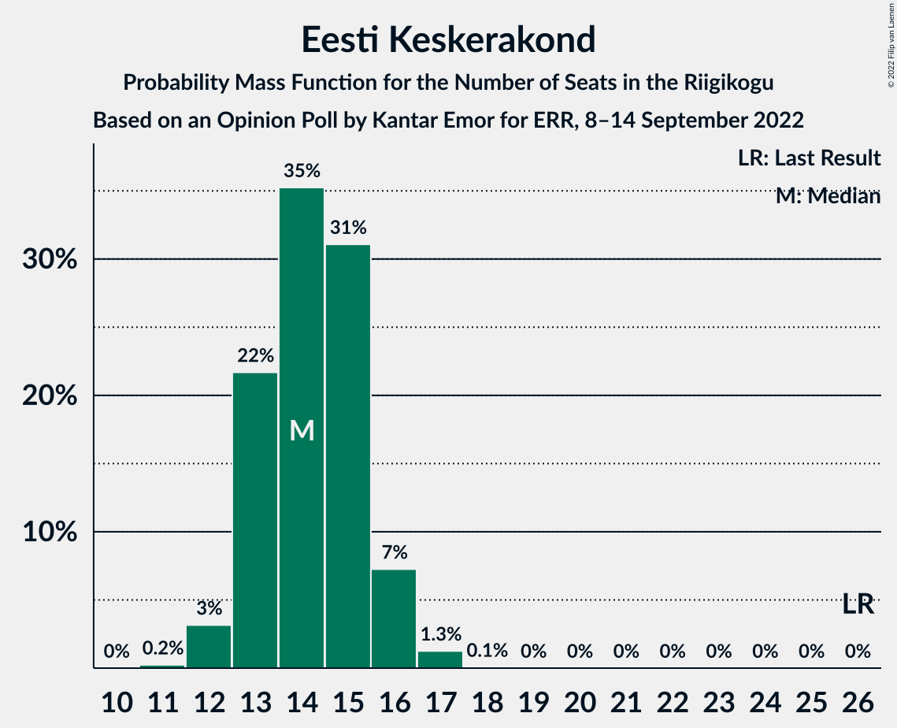
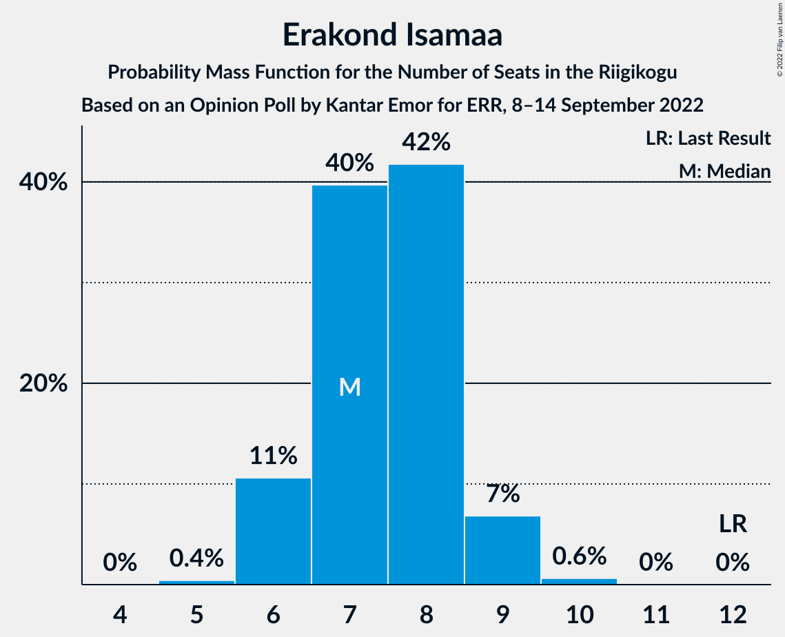

# Opinion Poll by Kantar Emor for ERR, 8–14 September 2022

<a href="#voting-intentions">Voting Intentions</a> | <a href="#seats">Seats</a> | <a href="#coalitions">Coalitions</a> | <a href="#technical-information">Technical Information</a>

## Voting Intentions

### Confidence Intervals

| Party | Last Result | Poll Result | 80% Confidence Interval | 90% Confidence Interval | 95% Confidence Interval | 99% Confidence Interval |
|:-----:|:-----------:|:-----------:|:-----------------------:|:-----------------------:|:-----------------------:|:-----------------------:|
| Eesti Reformierakond | 28.9% | 28.7% | 27.2–30.3% |26.8–30.7% |26.4–31.1% |25.7–31.9% |
| Eesti Konservatiivne Rahvaerakond | 17.8% | 22.8% | 21.4–24.2% |21.0–24.7% |20.7–25.0% |20.0–25.7% |
| Eesti Keskerakond | 23.1% | 13.8% | 12.7–15.1% |12.4–15.4% |12.1–15.7% |11.6–16.3% |
| Sotsiaaldemokraatlik Erakond | 9.8% | 10.9% | 9.9–12.0% |9.6–12.3% |9.4–12.6% |8.9–13.2% |
| Eesti 200 | 4.4% | 10.9% | 9.9–12.0% |9.6–12.3% |9.4–12.6% |8.9–13.2% |
| Erakond Isamaa | 11.4% | 7.9% | 7.0–8.9% |6.8–9.2% |6.6–9.4% |6.2–9.9% |
| Erakond Eestimaa Rohelised | 1.8% | 3.0% | 2.5–3.7% |2.3–3.9% |2.2–4.0% |2.0–4.4% |
| Erakond Parempoolsed | 0.0% | 1.0% | 0.7–1.4% |0.6–1.5% |0.6–1.6% |0.5–1.9% |

*Note:* The poll result column reflects the actual value used in the calculations. Published results may vary slightly, and in addition be rounded to fewer digits.

## Seats

### Confidence Intervals

| Party | Last Result | Median | 80% Confidence Interval | 90% Confidence Interval | 95% Confidence Interval | 99% Confidence Interval |
|:-----:|:-----------:|:------:|:-----------------------:|:-----------------------:|:-----------------------:|:-----------------------:|
| <a href="#eesti-reformierakond">Eesti Reformierakond</a> | 34 | 33 | 31–35 |30–35 |30–35 |29–36 |
| <a href="#eesti-konservatiivne-rahvaerakond">Eesti Konservatiivne Rahvaerakond</a> | 19 | 25 | 23–27 |23–27 |23–28 |22–29 |
| <a href="#eesti-keskerakond">Eesti Keskerakond</a> | 26 | 14 | 13–15 |13–16 |12–16 |12–17 |
| <a href="#sotsiaaldemokraatlik-erakond">Sotsiaaldemokraatlik Erakond</a> | 10 | 11 | 10–12 |9–12 |9–13 |9–13 |
| <a href="#eesti-200">Eesti 200</a> | 0 | 11 | 10–12 |10–12 |10–12 |9–13 |
| <a href="#erakond-isamaa">Erakond Isamaa</a> | 12 | 7 | 6–8 |6–9 |6–9 |6–10 |
| <a href="#erakond-eestimaa-rohelised">Erakond Eestimaa Rohelised</a> | 0 | 0 | 0 |0 |0 |0 |
| <a href="#erakond-parempoolsed">Erakond Parempoolsed</a> | 0 | 0 | 0 |0 |0 |0 |

### Eesti Reformierakond

*For a full overview of the results for this party, see the [Eesti Reformierakond](party-eestireformierakond.html) page.*

| Number of Seats | Probability | Accumulated | Special Marks |
|:---------------:|:-----------:|:-----------:|:-------------:|
| 28 | 0.2% | 100% |  |
| 29 | 2% | 99.8% |  |
| 30 | 5% | 98% |  |
| 31 | 14% | 93% |  |
| 32 | 25% | 79% |  |
| 33 | 28% | 54% | Median |
| 34 | 15% | 26% | Last Result |
| 35 | 9% | 11% |  |
| 36 | 2% | 2% |  |
| 37 | 0.4% | 0.4% |  |
| 38 | 0.1% | 0.1% |  |
| 39 | 0% | 0% |  |

### Eesti Konservatiivne Rahvaerakond

*For a full overview of the results for this party, see the [Eesti Konservatiivne Rahvaerakond](party-eestikonservatiivnerahvaerakond.html) page.*

| Number of Seats | Probability | Accumulated | Special Marks |
|:---------------:|:-----------:|:-----------:|:-------------:|
| 19 | 0% | 100% | Last Result |
| 20 | 0% | 100% |  |
| 21 | 0.3% | 100% |  |
| 22 | 2% | 99.7% |  |
| 23 | 9% | 98% |  |
| 24 | 24% | 89% |  |
| 25 | 28% | 64% | Median |
| 26 | 21% | 36% |  |
| 27 | 11% | 15% |  |
| 28 | 4% | 4% |  |
| 29 | 0.6% | 0.7% |  |
| 30 | 0.1% | 0.1% |  |
| 31 | 0% | 0% |  |

### Eesti Keskerakond

*For a full overview of the results for this party, see the [Eesti Keskerakond](party-eestikeskerakond.html) page.*

| Number of Seats | Probability | Accumulated | Special Marks |
|:---------------:|:-----------:|:-----------:|:-------------:|
| 11 | 0.2% | 100% |  |
| 12 | 3% | 99.8% |  |
| 13 | 22% | 97% |  |
| 14 | 35% | 75% | Median |
| 15 | 31% | 40% |  |
| 16 | 7% | 9% |  |
| 17 | 1.3% | 1.3% |  |
| 18 | 0.1% | 0.1% |  |
| 19 | 0% | 0% |  |
| 20 | 0% | 0% |  |
| 21 | 0% | 0% |  |
| 22 | 0% | 0% |  |
| 23 | 0% | 0% |  |
| 24 | 0% | 0% |  |
| 25 | 0% | 0% |  |
| 26 | 0% | 0% | Last Result |

### Sotsiaaldemokraatlik Erakond

*For a full overview of the results for this party, see the [Sotsiaaldemokraatlik Erakond](party-sotsiaaldemokraatlikerakond.html) page.*

| Number of Seats | Probability | Accumulated | Special Marks |
|:---------------:|:-----------:|:-----------:|:-------------:|
| 8 | 0.3% | 100% |  |
| 9 | 6% | 99.7% |  |
| 10 | 35% | 94% | Last Result |
| 11 | 38% | 59% | Median |
| 12 | 18% | 21% |  |
| 13 | 3% | 3% |  |
| 14 | 0.3% | 0.3% |  |
| 15 | 0% | 0% |  |

### Eesti 200

*For a full overview of the results for this party, see the [Eesti 200](party-eesti200.html) page.*

| Number of Seats | Probability | Accumulated | Special Marks |
|:---------------:|:-----------:|:-----------:|:-------------:|
| 0 | 0% | 100% | Last Result |
| 1 | 0% | 100% |  |
| 2 | 0% | 100% |  |
| 3 | 0% | 100% |  |
| 4 | 0% | 100% |  |
| 5 | 0% | 100% |  |
| 6 | 0% | 100% |  |
| 7 | 0% | 100% |  |
| 8 | 0.2% | 100% |  |
| 9 | 1.4% | 99.8% |  |
| 10 | 26% | 98% |  |
| 11 | 61% | 73% | Median |
| 12 | 11% | 12% |  |
| 13 | 0.5% | 0.8% |  |
| 14 | 0.2% | 0.3% |  |
| 15 | 0% | 0% |  |

### Erakond Isamaa

*For a full overview of the results for this party, see the [Erakond Isamaa](party-erakondisamaa.html) page.*

| Number of Seats | Probability | Accumulated | Special Marks |
|:---------------:|:-----------:|:-----------:|:-------------:|
| 5 | 0.4% | 100% |  |
| 6 | 11% | 99.6% |  |
| 7 | 40% | 89% | Median |
| 8 | 42% | 49% |  |
| 9 | 7% | 7% |  |
| 10 | 0.6% | 0.7% |  |
| 11 | 0% | 0% |  |
| 12 | 0% | 0% | Last Result |

### Erakond Eestimaa Rohelised

*For a full overview of the results for this party, see the [Erakond Eestimaa Rohelised](party-erakondeestimaarohelised.html) page.*

| Number of Seats | Probability | Accumulated | Special Marks |
|:---------------:|:-----------:|:-----------:|:-------------:|
| 0 | 100% | 100% | Last Result, Median |

### Erakond Parempoolsed

*For a full overview of the results for this party, see the [Erakond Parempoolsed](party-erakondparempoolsed.html) page.*

| Number of Seats | Probability | Accumulated | Special Marks |
|:---------------:|:-----------:|:-----------:|:-------------:|
| 0 | 100% | 100% | Last Result, Median |

## Coalitions

### Confidence Intervals

| Coalition | Last Result | Median | Majority? | 80% Confidence Interval | 90% Confidence Interval | 95% Confidence Interval | 99% Confidence Interval |
|:---------:|:-----------:|:------:|:---------:|:-----------------------:|:-----------------------:|:-----------------------:|:-----------------------:|
| Eesti Reformierakond – Eesti Konservatiivne Rahvaerakond – Eesti Keskerakond | 79 | 72 | 100% | 70–73 | 70–74 | 69–75 | 68–75 |
| Eesti Reformierakond – Eesti Konservatiivne Rahvaerakond – Erakond Isamaa | 65 | 65 | 100% | 63–67 | 63–68 | 62–68 | 61–69 |
| Eesti Reformierakond – Eesti Konservatiivne Rahvaerakond | 53 | 58 | 100% | 56–60 | 55–60 | 55–61 | 54–62 |
| Eesti Reformierakond – Sotsiaaldemokraatlik Erakond – Erakond Isamaa | 56 | 51 | 61% | 49–53 | 48–53 | 48–54 | 47–55 |
| Eesti Konservatiivne Rahvaerakond – Eesti Keskerakond – Erakond Isamaa | 57 | 47 | 0.8% | 45–49 | 44–49 | 44–50 | 43–51 |
| Eesti Reformierakond – Eesti Keskerakond | 60 | 47 | 0.5% | 45–49 | 44–49 | 44–50 | 43–51 |
| Eesti Reformierakond – Sotsiaaldemokraatlik Erakond | 44 | 43 | 0% | 42–45 | 41–46 | 40–46 | 40–47 |
| Eesti Reformierakond – Erakond Isamaa | 46 | 40 | 0% | 38–42 | 38–43 | 37–43 | 36–44 |
| Eesti Konservatiivne Rahvaerakond – Eesti Keskerakond | 45 | 39 | 0% | 37–41 | 37–42 | 36–42 | 35–43 |
| Eesti Konservatiivne Rahvaerakond – Sotsiaaldemokraatlik Erakond | 29 | 36 | 0% | 34–38 | 33–38 | 33–39 | 32–40 |
| Eesti Keskerakond – Sotsiaaldemokraatlik Erakond – Erakond Isamaa | 48 | 32 | 0% | 31–34 | 30–35 | 30–35 | 29–36 |
| Eesti Keskerakond – Sotsiaaldemokraatlik Erakond | 36 | 25 | 0% | 24–26 | 23–27 | 23–27 | 22–28 |

### Eesti Reformierakond – Eesti Konservatiivne Rahvaerakond – Eesti Keskerakond

| Number of Seats | Probability | Accumulated | Special Marks |
|:---------------:|:-----------:|:-----------:|:-------------:|
| 67 | 0% | 100% |  |
| 68 | 0.8% | 99.9% |  |
| 69 | 2% | 99.1% |  |
| 70 | 12% | 97% |  |
| 71 | 20% | 85% |  |
| 72 | 31% | 65% | Median |
| 73 | 24% | 34% |  |
| 74 | 7% | 10% |  |
| 75 | 2% | 3% |  |
| 76 | 0.3% | 0.3% |  |
| 77 | 0% | 0% |  |
| 78 | 0% | 0% |  |
| 79 | 0% | 0% | Last Result |

### Eesti Reformierakond – Eesti Konservatiivne Rahvaerakond – Erakond Isamaa

| Number of Seats | Probability | Accumulated | Special Marks |
|:---------------:|:-----------:|:-----------:|:-------------:|
| 60 | 0.1% | 100% |  |
| 61 | 0.6% | 99.9% |  |
| 62 | 3% | 99.3% |  |
| 63 | 7% | 96% |  |
| 64 | 22% | 89% |  |
| 65 | 26% | 67% | Last Result, Median |
| 66 | 23% | 41% |  |
| 67 | 13% | 18% |  |
| 68 | 5% | 6% |  |
| 69 | 0.9% | 1.1% |  |
| 70 | 0.1% | 0.1% |  |
| 71 | 0% | 0% |  |

### Eesti Reformierakond – Eesti Konservatiivne Rahvaerakond

| Number of Seats | Probability | Accumulated | Special Marks |
|:---------------:|:-----------:|:-----------:|:-------------:|
| 53 | 0.2% | 100% | Last Result |
| 54 | 2% | 99.7% |  |
| 55 | 5% | 98% |  |
| 56 | 15% | 93% |  |
| 57 | 20% | 78% |  |
| 58 | 30% | 58% | Median |
| 59 | 15% | 28% |  |
| 60 | 8% | 12% |  |
| 61 | 4% | 4% |  |
| 62 | 0.6% | 0.7% |  |
| 63 | 0.1% | 0.1% |  |
| 64 | 0% | 0% |  |

### Eesti Reformierakond – Sotsiaaldemokraatlik Erakond – Erakond Isamaa

| Number of Seats | Probability | Accumulated | Special Marks |
|:---------------:|:-----------:|:-----------:|:-------------:|
| 46 | 0.2% | 100% |  |
| 47 | 1.3% | 99.7% |  |
| 48 | 4% | 98% |  |
| 49 | 12% | 94% |  |
| 50 | 21% | 82% |  |
| 51 | 29% | 61% | Median, Majority |
| 52 | 17% | 32% |  |
| 53 | 11% | 15% |  |
| 54 | 3% | 4% |  |
| 55 | 0.7% | 0.8% |  |
| 56 | 0.1% | 0.2% | Last Result |
| 57 | 0% | 0% |  |

### Eesti Konservatiivne Rahvaerakond – Eesti Keskerakond – Erakond Isamaa

| Number of Seats | Probability | Accumulated | Special Marks |
|:---------------:|:-----------:|:-----------:|:-------------:|
| 42 | 0.2% | 100% |  |
| 43 | 2% | 99.8% |  |
| 44 | 5% | 98% |  |
| 45 | 12% | 93% |  |
| 46 | 27% | 81% | Median |
| 47 | 23% | 55% |  |
| 48 | 19% | 31% |  |
| 49 | 8% | 12% |  |
| 50 | 3% | 4% |  |
| 51 | 0.7% | 0.8% | Majority |
| 52 | 0.1% | 0.1% |  |
| 53 | 0% | 0% |  |
| 54 | 0% | 0% |  |
| 55 | 0% | 0% |  |
| 56 | 0% | 0% |  |
| 57 | 0% | 0% | Last Result |

### Eesti Reformierakond – Eesti Keskerakond

| Number of Seats | Probability | Accumulated | Special Marks |
|:---------------:|:-----------:|:-----------:|:-------------:|
| 42 | 0.2% | 100% |  |
| 43 | 1.1% | 99.8% |  |
| 44 | 4% | 98.7% |  |
| 45 | 13% | 95% |  |
| 46 | 20% | 81% |  |
| 47 | 29% | 61% | Median |
| 48 | 20% | 33% |  |
| 49 | 10% | 13% |  |
| 50 | 2% | 3% |  |
| 51 | 0.4% | 0.5% | Majority |
| 52 | 0.1% | 0.1% |  |
| 53 | 0% | 0% |  |
| 54 | 0% | 0% |  |
| 55 | 0% | 0% |  |
| 56 | 0% | 0% |  |
| 57 | 0% | 0% |  |
| 58 | 0% | 0% |  |
| 59 | 0% | 0% |  |
| 60 | 0% | 0% | Last Result |

### Eesti Reformierakond – Sotsiaaldemokraatlik Erakond

| Number of Seats | Probability | Accumulated | Special Marks |
|:---------------:|:-----------:|:-----------:|:-------------:|
| 38 | 0% | 100% |  |
| 39 | 0.4% | 99.9% |  |
| 40 | 2% | 99.5% |  |
| 41 | 6% | 97% |  |
| 42 | 18% | 91% |  |
| 43 | 25% | 73% |  |
| 44 | 25% | 48% | Last Result, Median |
| 45 | 13% | 22% |  |
| 46 | 7% | 9% |  |
| 47 | 2% | 2% |  |
| 48 | 0.3% | 0.4% |  |
| 49 | 0% | 0% |  |

### Eesti Reformierakond – Erakond Isamaa

| Number of Seats | Probability | Accumulated | Special Marks |
|:---------------:|:-----------:|:-----------:|:-------------:|
| 35 | 0.1% | 100% |  |
| 36 | 0.8% | 99.9% |  |
| 37 | 4% | 99.1% |  |
| 38 | 10% | 95% |  |
| 39 | 17% | 85% |  |
| 40 | 33% | 68% | Median |
| 41 | 16% | 35% |  |
| 42 | 14% | 20% |  |
| 43 | 5% | 6% |  |
| 44 | 1.1% | 1.3% |  |
| 45 | 0.1% | 0.2% |  |
| 46 | 0% | 0% | Last Result |

### Eesti Konservatiivne Rahvaerakond – Eesti Keskerakond

| Number of Seats | Probability | Accumulated | Special Marks |
|:---------------:|:-----------:|:-----------:|:-------------:|
| 35 | 0.5% | 100% |  |
| 36 | 2% | 99.4% |  |
| 37 | 8% | 97% |  |
| 38 | 21% | 89% |  |
| 39 | 24% | 68% | Median |
| 40 | 23% | 44% |  |
| 41 | 14% | 21% |  |
| 42 | 5% | 7% |  |
| 43 | 2% | 2% |  |
| 44 | 0.3% | 0.3% |  |
| 45 | 0% | 0% | Last Result |

### Eesti Konservatiivne Rahvaerakond – Sotsiaaldemokraatlik Erakond

| Number of Seats | Probability | Accumulated | Special Marks |
|:---------------:|:-----------:|:-----------:|:-------------:|
| 29 | 0% | 100% | Last Result |
| 30 | 0% | 100% |  |
| 31 | 0.1% | 100% |  |
| 32 | 0.8% | 99.9% |  |
| 33 | 5% | 99.1% |  |
| 34 | 12% | 94% |  |
| 35 | 27% | 82% |  |
| 36 | 23% | 56% | Median |
| 37 | 18% | 33% |  |
| 38 | 10% | 15% |  |
| 39 | 4% | 5% |  |
| 40 | 0.8% | 0.9% |  |
| 41 | 0.1% | 0.1% |  |
| 42 | 0% | 0% |  |

### Eesti Keskerakond – Sotsiaaldemokraatlik Erakond – Erakond Isamaa

| Number of Seats | Probability | Accumulated | Special Marks |
|:---------------:|:-----------:|:-----------:|:-------------:|
| 28 | 0.1% | 100% |  |
| 29 | 1.2% | 99.9% |  |
| 30 | 5% | 98.7% |  |
| 31 | 16% | 94% |  |
| 32 | 32% | 78% | Median |
| 33 | 26% | 46% |  |
| 34 | 14% | 20% |  |
| 35 | 5% | 6% |  |
| 36 | 1.0% | 1.1% |  |
| 37 | 0.2% | 0.2% |  |
| 38 | 0% | 0% |  |
| 39 | 0% | 0% |  |
| 40 | 0% | 0% |  |
| 41 | 0% | 0% |  |
| 42 | 0% | 0% |  |
| 43 | 0% | 0% |  |
| 44 | 0% | 0% |  |
| 45 | 0% | 0% |  |
| 46 | 0% | 0% |  |
| 47 | 0% | 0% |  |
| 48 | 0% | 0% | Last Result |

### Eesti Keskerakond – Sotsiaaldemokraatlik Erakond

| Number of Seats | Probability | Accumulated | Special Marks |
|:---------------:|:-----------:|:-----------:|:-------------:|
| 21 | 0.1% | 100% |  |
| 22 | 1.0% | 99.9% |  |
| 23 | 7% | 98.9% |  |
| 24 | 25% | 92% |  |
| 25 | 37% | 67% | Median |
| 26 | 21% | 30% |  |
| 27 | 7% | 8% |  |
| 28 | 1.2% | 1.4% |  |
| 29 | 0.2% | 0.2% |  |
| 30 | 0% | 0% |  |
| 31 | 0% | 0% |  |
| 32 | 0% | 0% |  |
| 33 | 0% | 0% |  |
| 34 | 0% | 0% |  |
| 35 | 0% | 0% |  |
| 36 | 0% | 0% | Last Result |

## Technical Information

### Opinion Poll

+ **Polling firm:** Kantar Emor
+ **Commissioner(s):** ERR
+ **Fieldwork period:** 8–14 September 2022

### Calculations

+ **Sample size:** 1431
+ **Simulations done:** 1,048,576
+ **Error estimate:** 0.99%

