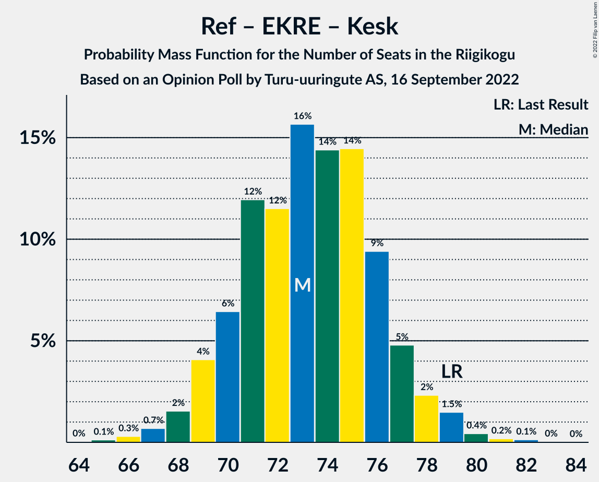

# Opinion Poll by Turu-uuringute AS, 16 September 2022

<a href="#voting-intentions">Voting Intentions</a> | <a href="#seats">Seats</a> | <a href="#coalitions">Coalitions</a> | <a href="#technical-information">Technical Information</a>

## Voting Intentions

### Confidence Intervals

| Party | Last Result | Poll Result | 80% Confidence Interval | 90% Confidence Interval | 95% Confidence Interval | 99% Confidence Interval |
|:-----:|:-----------:|:-----------:|:-----------------------:|:-----------------------:|:-----------------------:|:-----------------------:|
| Eesti Reformierakond | 28.9% | 33.0% | 30.4–35.8% |29.6–36.6% |29.0–37.3% |27.8–38.6% |
| Eesti Konservatiivne Rahvaerakond | 17.8% | 18.0% | 15.9–20.4% |15.4–21.0% |14.9–21.6% |13.9–22.8% |
| Eesti Keskerakond | 23.1% | 15.0% | 13.1–17.2% |12.6–17.8% |12.1–18.4% |11.3–19.5% |
| Eesti 200 | 4.4% | 12.0% | 10.3–14.1% |9.8–14.6% |9.4–15.2% |8.7–16.2% |
| Sotsiaaldemokraatlik Erakond | 9.8% | 9.0% | 7.5–10.9% |7.1–11.4% |6.8–11.8% |6.2–12.8% |
| Erakond Isamaa | 11.4% | 7.0% | 5.7–8.7% |5.4–9.2% |5.1–9.6% |4.5–10.5% |
| Erakond Eestimaa Rohelised | 1.8% | 2.0% | 1.4–3.1% |1.2–3.4% |1.1–3.6% |0.9–4.2% |
| Erakond Parempoolsed | 0.0% | 0.8% | 0.5–1.6% |0.4–1.8% |0.3–2.0% |0.2–2.5% |

*Note:* The poll result column reflects the actual value used in the calculations. Published results may vary slightly, and in addition be rounded to fewer digits.

## Seats

### Confidence Intervals

| Party | Last Result | Median | 80% Confidence Interval | 90% Confidence Interval | 95% Confidence Interval | 99% Confidence Interval |
|:-----:|:-----------:|:------:|:-----------------------:|:-----------------------:|:-----------------------:|:-----------------------:|
| <a href="#eesti-reformierakond">Eesti Reformierakond</a> | 34 | 38 | 35–42 |34–43 |33–44 |32–45 |
| <a href="#eesti-konservatiivne-rahvaerakond">Eesti Konservatiivne Rahvaerakond</a> | 19 | 19 | 17–22 |16–23 |15–24 |14–25 |
| <a href="#eesti-keskerakond">Eesti Keskerakond</a> | 26 | 16 | 13–18 |13–19 |12–20 |11–21 |
| <a href="#eesti-200">Eesti 200</a> | 0 | 12 | 10–15 |10–15 |9–16 |8–17 |
| <a href="#sotsiaaldemokraatlik-erakond">Sotsiaaldemokraatlik Erakond</a> | 10 | 9 | 7–11 |7–11 |6–12 |5–13 |
| <a href="#erakond-isamaa">Erakond Isamaa</a> | 12 | 6 | 5–8 |5–9 |4–9 |0–10 |
| <a href="#erakond-eestimaa-rohelised">Erakond Eestimaa Rohelised</a> | 0 | 0 | 0 |0 |0 |0 |
| <a href="#erakond-parempoolsed">Erakond Parempoolsed</a> | 0 | 0 | 0 |0 |0 |0 |

### Eesti Reformierakond

*For a full overview of the results for this party, see the [Eesti Reformierakond](party-eestireformierakond.html) page.*

| Number of Seats | Probability | Accumulated | Special Marks |
|:---------------:|:-----------:|:-----------:|:-------------:|
| 30 | 0.1% | 100% |  |
| 31 | 0.3% | 99.9% |  |
| 32 | 1.0% | 99.6% |  |
| 33 | 3% | 98.5% |  |
| 34 | 5% | 96% | Last Result |
| 35 | 8% | 91% |  |
| 36 | 11% | 83% |  |
| 37 | 14% | 73% |  |
| 38 | 15% | 59% | Median |
| 39 | 11% | 44% |  |
| 40 | 14% | 33% |  |
| 41 | 9% | 19% |  |
| 42 | 5% | 10% |  |
| 43 | 3% | 5% |  |
| 44 | 2% | 3% |  |
| 45 | 0.5% | 0.8% |  |
| 46 | 0.2% | 0.3% |  |
| 47 | 0.1% | 0.1% |  |
| 48 | 0% | 0.1% |  |
| 49 | 0% | 0% |  |

### Eesti Konservatiivne Rahvaerakond

*For a full overview of the results for this party, see the [Eesti Konservatiivne Rahvaerakond](party-eestikonservatiivnerahvaerakond.html) page.*

| Number of Seats | Probability | Accumulated | Special Marks |
|:---------------:|:-----------:|:-----------:|:-------------:|
| 13 | 0.1% | 100% |  |
| 14 | 0.6% | 99.9% |  |
| 15 | 2% | 99.3% |  |
| 16 | 5% | 97% |  |
| 17 | 9% | 92% |  |
| 18 | 18% | 83% |  |
| 19 | 18% | 65% | Last Result, Median |
| 20 | 17% | 46% |  |
| 21 | 11% | 29% |  |
| 22 | 11% | 18% |  |
| 23 | 5% | 8% |  |
| 24 | 2% | 3% |  |
| 25 | 0.6% | 0.9% |  |
| 26 | 0.3% | 0.3% |  |
| 27 | 0.1% | 0.1% |  |
| 28 | 0% | 0% |  |

### Eesti Keskerakond

*For a full overview of the results for this party, see the [Eesti Keskerakond](party-eestikeskerakond.html) page.*

| Number of Seats | Probability | Accumulated | Special Marks |
|:---------------:|:-----------:|:-----------:|:-------------:|
| 10 | 0.1% | 100% |  |
| 11 | 0.8% | 99.9% |  |
| 12 | 3% | 99.0% |  |
| 13 | 9% | 96% |  |
| 14 | 14% | 87% |  |
| 15 | 19% | 74% |  |
| 16 | 22% | 55% | Median |
| 17 | 16% | 33% |  |
| 18 | 9% | 18% |  |
| 19 | 5% | 8% |  |
| 20 | 2% | 3% |  |
| 21 | 0.7% | 1.0% |  |
| 22 | 0.2% | 0.3% |  |
| 23 | 0.1% | 0.1% |  |
| 24 | 0% | 0% |  |
| 25 | 0% | 0% |  |
| 26 | 0% | 0% | Last Result |

### Eesti 200

*For a full overview of the results for this party, see the [Eesti 200](party-eesti200.html) page.*

| Number of Seats | Probability | Accumulated | Special Marks |
|:---------------:|:-----------:|:-----------:|:-------------:|
| 0 | 0% | 100% | Last Result |
| 1 | 0% | 100% |  |
| 2 | 0% | 100% |  |
| 3 | 0% | 100% |  |
| 4 | 0% | 100% |  |
| 5 | 0% | 100% |  |
| 6 | 0% | 100% |  |
| 7 | 0.1% | 100% |  |
| 8 | 0.8% | 99.9% |  |
| 9 | 4% | 99.2% |  |
| 10 | 12% | 96% |  |
| 11 | 18% | 84% |  |
| 12 | 23% | 65% | Median |
| 13 | 20% | 43% |  |
| 14 | 12% | 23% |  |
| 15 | 7% | 10% |  |
| 16 | 2% | 3% |  |
| 17 | 1.0% | 1.3% |  |
| 18 | 0.2% | 0.2% |  |
| 19 | 0.1% | 0.1% |  |
| 20 | 0% | 0% |  |

### Sotsiaaldemokraatlik Erakond

*For a full overview of the results for this party, see the [Sotsiaaldemokraatlik Erakond](party-sotsiaaldemokraatlikerakond.html) page.*

| Number of Seats | Probability | Accumulated | Special Marks |
|:---------------:|:-----------:|:-----------:|:-------------:|
| 5 | 0.7% | 100% |  |
| 6 | 4% | 99.3% |  |
| 7 | 14% | 96% |  |
| 8 | 29% | 82% |  |
| 9 | 23% | 53% | Median |
| 10 | 17% | 30% | Last Result |
| 11 | 9% | 14% |  |
| 12 | 4% | 4% |  |
| 13 | 0.7% | 0.9% |  |
| 14 | 0.2% | 0.2% |  |
| 15 | 0% | 0% |  |

### Erakond Isamaa

*For a full overview of the results for this party, see the [Erakond Isamaa](party-erakondisamaa.html) page.*

| Number of Seats | Probability | Accumulated | Special Marks |
|:---------------:|:-----------:|:-----------:|:-------------:|
| 0 | 2% | 100% |  |
| 1 | 0% | 98% |  |
| 2 | 0% | 98% |  |
| 3 | 0% | 98% |  |
| 4 | 1.4% | 98% |  |
| 5 | 15% | 96% |  |
| 6 | 33% | 81% | Median |
| 7 | 24% | 48% |  |
| 8 | 15% | 24% |  |
| 9 | 7% | 9% |  |
| 10 | 1.4% | 2% |  |
| 11 | 0.3% | 0.3% |  |
| 12 | 0.1% | 0.1% | Last Result |
| 13 | 0% | 0% |  |

### Erakond Eestimaa Rohelised

*For a full overview of the results for this party, see the [Erakond Eestimaa Rohelised](party-erakondeestimaarohelised.html) page.*

| Number of Seats | Probability | Accumulated | Special Marks |
|:---------------:|:-----------:|:-----------:|:-------------:|
| 0 | 100% | 100% | Last Result, Median |

### Erakond Parempoolsed

*For a full overview of the results for this party, see the [Erakond Parempoolsed](party-erakondparempoolsed.html) page.*

| Number of Seats | Probability | Accumulated | Special Marks |
|:---------------:|:-----------:|:-----------:|:-------------:|
| 0 | 100% | 100% | Last Result, Median |

## Coalitions

### Confidence Intervals

| Coalition | Last Result | Median | Majority? | 80% Confidence Interval | 90% Confidence Interval | 95% Confidence Interval | 99% Confidence Interval |
|:---------:|:-----------:|:------:|:---------:|:-----------------------:|:-----------------------:|:-----------------------:|:-----------------------:|
| Eesti Reformierakond – Eesti Konservatiivne Rahvaerakond – Eesti Keskerakond | 79 | 73 | 100% | 70–76 | 69–77 | 68–78 | 67–80 |
| Eesti Reformierakond – Eesti Konservatiivne Rahvaerakond – Erakond Isamaa | 65 | 64 | 100% | 61–67 | 60–68 | 59–69 | 57–70 |
| Eesti Reformierakond – Eesti Konservatiivne Rahvaerakond | 53 | 58 | 99.5% | 54–61 | 53–62 | 52–63 | 51–65 |
| Eesti Reformierakond – Eesti Keskerakond | 60 | 54 | 89% | 50–58 | 49–59 | 49–59 | 47–61 |
| Eesti Reformierakond – Sotsiaaldemokraatlik Erakond – Erakond Isamaa | 56 | 53 | 86% | 50–57 | 49–58 | 48–59 | 46–60 |
| Eesti Reformierakond – Sotsiaaldemokraatlik Erakond | 44 | 47 | 10% | 43–50 | 43–52 | 42–52 | 40–54 |
| Eesti Reformierakond – Erakond Isamaa | 46 | 45 | 2% | 41–48 | 40–49 | 39–50 | 37–52 |
| Eesti Konservatiivne Rahvaerakond – Eesti Keskerakond – Erakond Isamaa | 57 | 42 | 0% | 38–45 | 37–46 | 36–47 | 34–49 |
| Eesti Konservatiivne Rahvaerakond – Eesti Keskerakond | 45 | 35 | 0% | 32–38 | 31–39 | 30–40 | 29–42 |
| Eesti Keskerakond – Sotsiaaldemokraatlik Erakond – Erakond Isamaa | 48 | 31 | 0% | 28–35 | 27–35 | 26–36 | 24–38 |
| Eesti Konservatiivne Rahvaerakond – Sotsiaaldemokraatlik Erakond | 29 | 28 | 0% | 25–31 | 24–32 | 24–33 | 22–35 |
| Eesti Keskerakond – Sotsiaaldemokraatlik Erakond | 36 | 24 | 0% | 22–28 | 21–28 | 20–29 | 19–31 |

### Eesti Reformierakond – Eesti Konservatiivne Rahvaerakond – Eesti Keskerakond

| Number of Seats | Probability | Accumulated | Special Marks |
|:---------------:|:-----------:|:-----------:|:-------------:|
| 64 | 0% | 100% |  |
| 65 | 0.1% | 99.9% |  |
| 66 | 0.3% | 99.8% |  |
| 67 | 0.7% | 99.5% |  |
| 68 | 2% | 98.8% |  |
| 69 | 4% | 97% |  |
| 70 | 6% | 93% |  |
| 71 | 12% | 87% |  |
| 72 | 12% | 75% |  |
| 73 | 16% | 63% | Median |
| 74 | 14% | 48% |  |
| 75 | 14% | 33% |  |
| 76 | 9% | 19% |  |
| 77 | 5% | 9% |  |
| 78 | 2% | 5% |  |
| 79 | 1.5% | 2% | Last Result |
| 80 | 0.4% | 0.8% |  |
| 81 | 0.2% | 0.4% |  |
| 82 | 0.1% | 0.2% |  |
| 83 | 0% | 0.1% |  |
| 84 | 0% | 0% |  |

### Eesti Reformierakond – Eesti Konservatiivne Rahvaerakond – Erakond Isamaa

| Number of Seats | Probability | Accumulated | Special Marks |
|:---------------:|:-----------:|:-----------:|:-------------:|
| 55 | 0.1% | 100% |  |
| 56 | 0.2% | 99.9% |  |
| 57 | 0.6% | 99.7% |  |
| 58 | 1.0% | 99.1% |  |
| 59 | 3% | 98% |  |
| 60 | 4% | 95% |  |
| 61 | 9% | 91% |  |
| 62 | 7% | 83% |  |
| 63 | 17% | 76% | Median |
| 64 | 17% | 59% |  |
| 65 | 10% | 42% | Last Result |
| 66 | 14% | 32% |  |
| 67 | 9% | 18% |  |
| 68 | 5% | 9% |  |
| 69 | 2% | 4% |  |
| 70 | 2% | 2% |  |
| 71 | 0.2% | 0.4% |  |
| 72 | 0.1% | 0.2% |  |
| 73 | 0% | 0% |  |

### Eesti Reformierakond – Eesti Konservatiivne Rahvaerakond

| Number of Seats | Probability | Accumulated | Special Marks |
|:---------------:|:-----------:|:-----------:|:-------------:|
| 49 | 0.1% | 100% |  |
| 50 | 0.3% | 99.9% |  |
| 51 | 0.8% | 99.5% | Majority |
| 52 | 2% | 98.7% |  |
| 53 | 4% | 97% | Last Result |
| 54 | 7% | 93% |  |
| 55 | 10% | 86% |  |
| 56 | 11% | 76% |  |
| 57 | 13% | 65% | Median |
| 58 | 15% | 53% |  |
| 59 | 13% | 38% |  |
| 60 | 12% | 25% |  |
| 61 | 6% | 13% |  |
| 62 | 4% | 7% |  |
| 63 | 2% | 4% |  |
| 64 | 0.8% | 1.4% |  |
| 65 | 0.4% | 0.6% |  |
| 66 | 0.1% | 0.2% |  |
| 67 | 0% | 0.1% |  |
| 68 | 0% | 0% |  |

### Eesti Reformierakond – Eesti Keskerakond

| Number of Seats | Probability | Accumulated | Special Marks |
|:---------------:|:-----------:|:-----------:|:-------------:|
| 45 | 0.1% | 100% |  |
| 46 | 0.2% | 99.9% |  |
| 47 | 0.6% | 99.7% |  |
| 48 | 1.5% | 99.1% |  |
| 49 | 3% | 98% |  |
| 50 | 6% | 95% |  |
| 51 | 8% | 89% | Majority |
| 52 | 12% | 82% |  |
| 53 | 15% | 70% |  |
| 54 | 14% | 55% | Median |
| 55 | 12% | 40% |  |
| 56 | 14% | 29% |  |
| 57 | 5% | 15% |  |
| 58 | 4% | 10% |  |
| 59 | 4% | 6% |  |
| 60 | 1.1% | 2% | Last Result |
| 61 | 0.6% | 0.9% |  |
| 62 | 0.2% | 0.3% |  |
| 63 | 0.1% | 0.1% |  |
| 64 | 0% | 0% |  |

### Eesti Reformierakond – Sotsiaaldemokraatlik Erakond – Erakond Isamaa

| Number of Seats | Probability | Accumulated | Special Marks |
|:---------------:|:-----------:|:-----------:|:-------------:|
| 44 | 0.1% | 100% |  |
| 45 | 0.1% | 99.9% |  |
| 46 | 0.4% | 99.8% |  |
| 47 | 0.9% | 99.4% |  |
| 48 | 2% | 98.5% |  |
| 49 | 4% | 96% |  |
| 50 | 6% | 92% |  |
| 51 | 10% | 86% | Majority |
| 52 | 13% | 76% |  |
| 53 | 14% | 63% | Median |
| 54 | 13% | 50% |  |
| 55 | 13% | 36% |  |
| 56 | 10% | 24% | Last Result |
| 57 | 6% | 13% |  |
| 58 | 4% | 7% |  |
| 59 | 2% | 3% |  |
| 60 | 0.8% | 1.3% |  |
| 61 | 0.3% | 0.4% |  |
| 62 | 0.1% | 0.2% |  |
| 63 | 0% | 0% |  |

### Eesti Reformierakond – Sotsiaaldemokraatlik Erakond

| Number of Seats | Probability | Accumulated | Special Marks |
|:---------------:|:-----------:|:-----------:|:-------------:|
| 38 | 0.1% | 100% |  |
| 39 | 0.1% | 99.9% |  |
| 40 | 0.5% | 99.8% |  |
| 41 | 1.3% | 99.2% |  |
| 42 | 3% | 98% |  |
| 43 | 7% | 95% |  |
| 44 | 7% | 88% | Last Result |
| 45 | 12% | 81% |  |
| 46 | 13% | 69% |  |
| 47 | 14% | 56% | Median |
| 48 | 13% | 42% |  |
| 49 | 9% | 29% |  |
| 50 | 10% | 19% |  |
| 51 | 4% | 10% | Majority |
| 52 | 3% | 5% |  |
| 53 | 1.3% | 2% |  |
| 54 | 0.5% | 0.8% |  |
| 55 | 0.2% | 0.4% |  |
| 56 | 0.1% | 0.1% |  |
| 57 | 0% | 0% |  |

### Eesti Reformierakond – Erakond Isamaa

| Number of Seats | Probability | Accumulated | Special Marks |
|:---------------:|:-----------:|:-----------:|:-------------:|
| 35 | 0% | 100% |  |
| 36 | 0.2% | 99.9% |  |
| 37 | 0.3% | 99.8% |  |
| 38 | 0.9% | 99.5% |  |
| 39 | 1.4% | 98.6% |  |
| 40 | 4% | 97% |  |
| 41 | 6% | 93% |  |
| 42 | 8% | 87% |  |
| 43 | 10% | 79% |  |
| 44 | 18% | 69% | Median |
| 45 | 13% | 51% |  |
| 46 | 12% | 38% | Last Result |
| 47 | 10% | 26% |  |
| 48 | 8% | 16% |  |
| 49 | 5% | 8% |  |
| 50 | 2% | 3% |  |
| 51 | 1.3% | 2% | Majority |
| 52 | 0.4% | 0.6% |  |
| 53 | 0.1% | 0.2% |  |
| 54 | 0.1% | 0.1% |  |
| 55 | 0% | 0% |  |

### Eesti Konservatiivne Rahvaerakond – Eesti Keskerakond – Erakond Isamaa

| Number of Seats | Probability | Accumulated | Special Marks |
|:---------------:|:-----------:|:-----------:|:-------------:|
| 32 | 0% | 100% |  |
| 33 | 0.1% | 99.9% |  |
| 34 | 0.3% | 99.8% |  |
| 35 | 0.7% | 99.5% |  |
| 36 | 2% | 98.8% |  |
| 37 | 3% | 97% |  |
| 38 | 8% | 94% |  |
| 39 | 9% | 86% |  |
| 40 | 13% | 78% |  |
| 41 | 13% | 65% | Median |
| 42 | 11% | 52% |  |
| 43 | 13% | 40% |  |
| 44 | 12% | 28% |  |
| 45 | 8% | 16% |  |
| 46 | 5% | 8% |  |
| 47 | 2% | 3% |  |
| 48 | 0.8% | 1.4% |  |
| 49 | 0.4% | 0.6% |  |
| 50 | 0.1% | 0.2% |  |
| 51 | 0% | 0% | Majority |
| 52 | 0% | 0% |  |
| 53 | 0% | 0% |  |
| 54 | 0% | 0% |  |
| 55 | 0% | 0% |  |
| 56 | 0% | 0% |  |
| 57 | 0% | 0% | Last Result |

### Eesti Konservatiivne Rahvaerakond – Eesti Keskerakond

| Number of Seats | Probability | Accumulated | Special Marks |
|:---------------:|:-----------:|:-----------:|:-------------:|
| 27 | 0.1% | 100% |  |
| 28 | 0.3% | 99.9% |  |
| 29 | 0.7% | 99.6% |  |
| 30 | 2% | 99.0% |  |
| 31 | 5% | 97% |  |
| 32 | 8% | 92% |  |
| 33 | 12% | 84% |  |
| 34 | 15% | 72% |  |
| 35 | 13% | 57% | Median |
| 36 | 12% | 44% |  |
| 37 | 12% | 32% |  |
| 38 | 11% | 20% |  |
| 39 | 5% | 10% |  |
| 40 | 3% | 5% |  |
| 41 | 1.0% | 2% |  |
| 42 | 0.6% | 1.0% |  |
| 43 | 0.3% | 0.4% |  |
| 44 | 0.1% | 0.1% |  |
| 45 | 0% | 0% | Last Result |

### Eesti Keskerakond – Sotsiaaldemokraatlik Erakond – Erakond Isamaa

| Number of Seats | Probability | Accumulated | Special Marks |
|:---------------:|:-----------:|:-----------:|:-------------:|
| 21 | 0% | 100% |  |
| 22 | 0.1% | 99.9% |  |
| 23 | 0.2% | 99.8% |  |
| 24 | 0.4% | 99.7% |  |
| 25 | 0.9% | 99.3% |  |
| 26 | 2% | 98% |  |
| 27 | 4% | 96% |  |
| 28 | 8% | 92% |  |
| 29 | 9% | 84% |  |
| 30 | 18% | 75% |  |
| 31 | 16% | 57% | Median |
| 32 | 12% | 41% |  |
| 33 | 12% | 29% |  |
| 34 | 7% | 17% |  |
| 35 | 6% | 10% |  |
| 36 | 2% | 4% |  |
| 37 | 1.4% | 2% |  |
| 38 | 0.3% | 0.5% |  |
| 39 | 0.1% | 0.2% |  |
| 40 | 0% | 0% |  |
| 41 | 0% | 0% |  |
| 42 | 0% | 0% |  |
| 43 | 0% | 0% |  |
| 44 | 0% | 0% |  |
| 45 | 0% | 0% |  |
| 46 | 0% | 0% |  |
| 47 | 0% | 0% |  |
| 48 | 0% | 0% | Last Result |

### Eesti Konservatiivne Rahvaerakond – Sotsiaaldemokraatlik Erakond

| Number of Seats | Probability | Accumulated | Special Marks |
|:---------------:|:-----------:|:-----------:|:-------------:|
| 21 | 0.1% | 100% |  |
| 22 | 0.4% | 99.8% |  |
| 23 | 1.5% | 99.4% |  |
| 24 | 4% | 98% |  |
| 25 | 7% | 94% |  |
| 26 | 12% | 87% |  |
| 27 | 14% | 75% |  |
| 28 | 18% | 62% | Median |
| 29 | 14% | 43% | Last Result |
| 30 | 13% | 30% |  |
| 31 | 9% | 17% |  |
| 32 | 4% | 8% |  |
| 33 | 2% | 4% |  |
| 34 | 1.2% | 2% |  |
| 35 | 0.4% | 0.6% |  |
| 36 | 0.1% | 0.2% |  |
| 37 | 0% | 0.1% |  |
| 38 | 0% | 0% |  |

### Eesti Keskerakond – Sotsiaaldemokraatlik Erakond

| Number of Seats | Probability | Accumulated | Special Marks |
|:---------------:|:-----------:|:-----------:|:-------------:|
| 18 | 0.2% | 100% |  |
| 19 | 0.8% | 99.8% |  |
| 20 | 3% | 98.9% |  |
| 21 | 5% | 96% |  |
| 22 | 10% | 91% |  |
| 23 | 13% | 81% |  |
| 24 | 22% | 68% |  |
| 25 | 13% | 47% | Median |
| 26 | 14% | 34% |  |
| 27 | 9% | 19% |  |
| 28 | 5% | 10% |  |
| 29 | 3% | 5% |  |
| 30 | 1.0% | 2% |  |
| 31 | 0.5% | 0.7% |  |
| 32 | 0.2% | 0.3% |  |
| 33 | 0% | 0.1% |  |
| 34 | 0% | 0% |  |
| 35 | 0% | 0% |  |
| 36 | 0% | 0% | Last Result |

## Technical Information

### Opinion Poll

+ **Polling firm:** Turu-uuringute AS
+ **Commissioner(s):** —
+ **Fieldwork period:** 16 September 2022

### Calculations

+ **Sample size:** 500
+ **Simulations done:** 1,048,576
+ **Error estimate:** 3.35%

