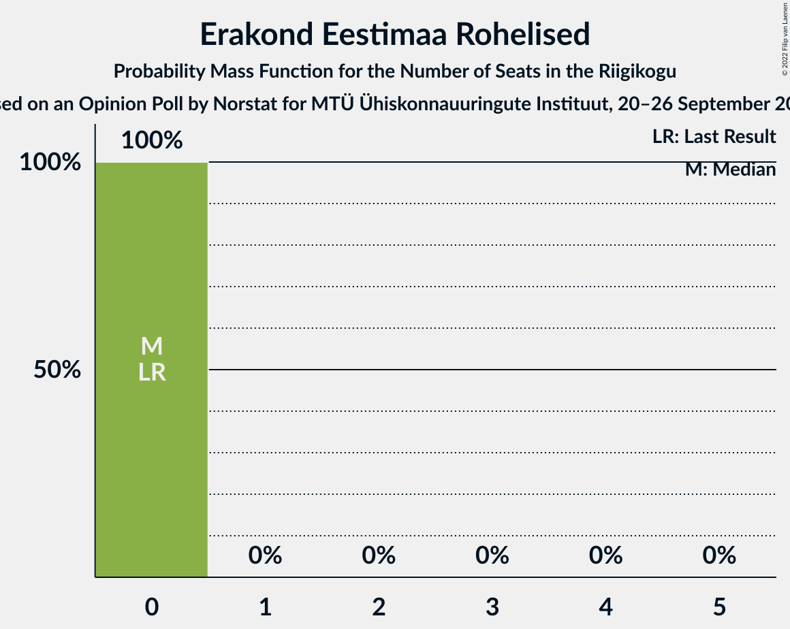

# Opinion Poll by Norstat for MTÜ Ühiskonnauuringute Instituut, 20–26 September 2022

<a href="#voting-intentions">Voting Intentions</a> | <a href="#seats">Seats</a> | <a href="#coalitions">Coalitions</a> | <a href="#technical-information">Technical Information</a>

## Voting Intentions

### Confidence Intervals

| Party | Last Result | Poll Result | 80% Confidence Interval | 90% Confidence Interval | 95% Confidence Interval | 99% Confidence Interval |
|:-----:|:-----------:|:-----------:|:-----------------------:|:-----------------------:|:-----------------------:|:-----------------------:|
| Eesti Reformierakond | 28.9% | 28.3% | 26.5–30.2% |26.0–30.7% |25.6–31.2% |24.8–32.1% |
| Eesti Konservatiivne Rahvaerakond | 17.8% | 27.4% | 25.6–29.3% |25.1–29.8% |24.7–30.3% |23.9–31.2% |
| Eesti Keskerakond | 23.1% | 19.6% | 18.1–21.3% |17.6–21.8% |17.3–22.2% |16.5–23.0% |
| Eesti 200 | 4.4% | 8.7% | 7.7–10.0% |7.3–10.3% |7.1–10.6% |6.6–11.2% |
| Sotsiaaldemokraatlik Erakond | 9.8% | 6.3% | 5.4–7.4% |5.2–7.7% |5.0–8.0% |4.6–8.5% |
| Erakond Isamaa | 11.4% | 5.9% | 5.0–7.0% |4.8–7.3% |4.6–7.5% |4.2–8.1% |
| Erakond Eestimaa Rohelised | 1.8% | 1.5% | 1.1–2.1% |1.0–2.3% |0.9–2.5% |0.7–2.8% |
| Erakond Parempoolsed | 0.0% | 0.6% | 0.4–1.1% |0.3–1.2% |0.3–1.3% |0.2–1.6% |

*Note:* The poll result column reflects the actual value used in the calculations. Published results may vary slightly, and in addition be rounded to fewer digits.

## Seats

### Confidence Intervals

| Party | Last Result | Median | 80% Confidence Interval | 90% Confidence Interval | 95% Confidence Interval | 99% Confidence Interval |
|:-----:|:-----------:|:------:|:-----------------------:|:-----------------------:|:-----------------------:|:-----------------------:|
| <a href="#eesti-reformierakond">Eesti Reformierakond</a> | 34 | 31 | 29–34 |29–35 |28–35 |27–37 |
| <a href="#eesti-konservatiivne-rahvaerakond">Eesti Konservatiivne Rahvaerakond</a> | 19 | 30 | 28–33 |27–33 |27–34 |26–35 |
| <a href="#eesti-keskerakond">Eesti Keskerakond</a> | 26 | 21 | 19–23 |18–23 |18–24 |17–25 |
| <a href="#eesti-200">Eesti 200</a> | 0 | 8 | 7–10 |7–10 |6–10 |6–11 |
| <a href="#sotsiaaldemokraatlik-erakond">Sotsiaaldemokraatlik Erakond</a> | 10 | 6 | 5–7 |4–7 |0–7 |0–8 |
| <a href="#erakond-isamaa">Erakond Isamaa</a> | 12 | 5 | 0–6 |0–7 |0–7 |0–7 |
| <a href="#erakond-eestimaa-rohelised">Erakond Eestimaa Rohelised</a> | 0 | 0 | 0 |0 |0 |0 |
| <a href="#erakond-parempoolsed">Erakond Parempoolsed</a> | 0 | 0 | 0 |0 |0 |0 |

### Eesti Reformierakond

*For a full overview of the results for this party, see the [Eesti Reformierakond](party-eestireformierakond.html) page.*

| Number of Seats | Probability | Accumulated | Special Marks |
|:---------------:|:-----------:|:-----------:|:-------------:|
| 26 | 0.2% | 100% |  |
| 27 | 1.0% | 99.8% |  |
| 28 | 3% | 98.7% |  |
| 29 | 10% | 96% |  |
| 30 | 17% | 86% |  |
| 31 | 21% | 69% | Median |
| 32 | 21% | 48% |  |
| 33 | 12% | 27% |  |
| 34 | 8% | 15% | Last Result |
| 35 | 5% | 7% |  |
| 36 | 1.3% | 2% |  |
| 37 | 0.4% | 0.6% |  |
| 38 | 0.1% | 0.2% |  |
| 39 | 0% | 0% |  |

### Eesti Konservatiivne Rahvaerakond

*For a full overview of the results for this party, see the [Eesti Konservatiivne Rahvaerakond](party-eestikonservatiivnerahvaerakond.html) page.*

| Number of Seats | Probability | Accumulated | Special Marks |
|:---------------:|:-----------:|:-----------:|:-------------:|
| 19 | 0% | 100% | Last Result |
| 20 | 0% | 100% |  |
| 21 | 0% | 100% |  |
| 22 | 0% | 100% |  |
| 23 | 0% | 100% |  |
| 24 | 0% | 100% |  |
| 25 | 0.2% | 100% |  |
| 26 | 1.3% | 99.7% |  |
| 27 | 6% | 98% |  |
| 28 | 9% | 93% |  |
| 29 | 19% | 84% |  |
| 30 | 19% | 65% | Median |
| 31 | 20% | 46% |  |
| 32 | 12% | 26% |  |
| 33 | 9% | 14% |  |
| 34 | 3% | 5% |  |
| 35 | 1.0% | 1.3% |  |
| 36 | 0.3% | 0.3% |  |
| 37 | 0.1% | 0.1% |  |
| 38 | 0% | 0% |  |

### Eesti Keskerakond

*For a full overview of the results for this party, see the [Eesti Keskerakond](party-eestikeskerakond.html) page.*

| Number of Seats | Probability | Accumulated | Special Marks |
|:---------------:|:-----------:|:-----------:|:-------------:|
| 16 | 0.1% | 100% |  |
| 17 | 1.1% | 99.8% |  |
| 18 | 6% | 98.8% |  |
| 19 | 13% | 92% |  |
| 20 | 19% | 79% |  |
| 21 | 28% | 60% | Median |
| 22 | 19% | 32% |  |
| 23 | 9% | 14% |  |
| 24 | 3% | 4% |  |
| 25 | 1.3% | 2% |  |
| 26 | 0.2% | 0.2% | Last Result |
| 27 | 0% | 0% |  |

### Eesti 200

*For a full overview of the results for this party, see the [Eesti 200](party-eesti200.html) page.*

| Number of Seats | Probability | Accumulated | Special Marks |
|:---------------:|:-----------:|:-----------:|:-------------:|
| 0 | 0% | 100% | Last Result |
| 1 | 0% | 100% |  |
| 2 | 0% | 100% |  |
| 3 | 0% | 100% |  |
| 4 | 0% | 100% |  |
| 5 | 0.1% | 100% |  |
| 6 | 5% | 99.9% |  |
| 7 | 22% | 95% |  |
| 8 | 39% | 74% | Median |
| 9 | 24% | 34% |  |
| 10 | 9% | 10% |  |
| 11 | 2% | 2% |  |
| 12 | 0.1% | 0.1% |  |
| 13 | 0% | 0% |  |

### Sotsiaaldemokraatlik Erakond

*For a full overview of the results for this party, see the [Sotsiaaldemokraatlik Erakond](party-sotsiaaldemokraatlikerakond.html) page.*

| Number of Seats | Probability | Accumulated | Special Marks |
|:---------------:|:-----------:|:-----------:|:-------------:|
| 0 | 3% | 100% |  |
| 1 | 0% | 97% |  |
| 2 | 0% | 97% |  |
| 3 | 0% | 97% |  |
| 4 | 5% | 97% |  |
| 5 | 35% | 91% |  |
| 6 | 43% | 56% | Median |
| 7 | 11% | 13% |  |
| 8 | 2% | 2% |  |
| 9 | 0.1% | 0.1% |  |
| 10 | 0% | 0% | Last Result |

### Erakond Isamaa

*For a full overview of the results for this party, see the [Erakond Isamaa](party-erakondisamaa.html) page.*

| Number of Seats | Probability | Accumulated | Special Marks |
|:---------------:|:-----------:|:-----------:|:-------------:|
| 0 | 11% | 100% |  |
| 1 | 0% | 89% |  |
| 2 | 0% | 89% |  |
| 3 | 0% | 89% |  |
| 4 | 12% | 89% |  |
| 5 | 44% | 77% | Median |
| 6 | 26% | 33% |  |
| 7 | 6% | 7% |  |
| 8 | 0.3% | 0.3% |  |
| 9 | 0% | 0% |  |
| 10 | 0% | 0% |  |
| 11 | 0% | 0% |  |
| 12 | 0% | 0% | Last Result |

### Erakond Eestimaa Rohelised

*For a full overview of the results for this party, see the [Erakond Eestimaa Rohelised](party-erakondeestimaarohelised.html) page.*

| Number of Seats | Probability | Accumulated | Special Marks |
|:---------------:|:-----------:|:-----------:|:-------------:|
| 0 | 100% | 100% | Last Result, Median |

### Erakond Parempoolsed

*For a full overview of the results for this party, see the [Erakond Parempoolsed](party-erakondparempoolsed.html) page.*

| Number of Seats | Probability | Accumulated | Special Marks |
|:---------------:|:-----------:|:-----------:|:-------------:|
| 0 | 100% | 100% | Last Result, Median |

## Coalitions

### Confidence Intervals

| Coalition | Last Result | Median | Majority? | 80% Confidence Interval | 90% Confidence Interval | 95% Confidence Interval | 99% Confidence Interval |
|:---------:|:-----------:|:------:|:---------:|:-----------------------:|:-----------------------:|:-----------------------:|:-----------------------:|
| Eesti Reformierakond – Eesti Konservatiivne Rahvaerakond – Eesti Keskerakond | 79 | 82 | 100% | 80–86 | 80–87 | 79–88 | 78–89 |
| Eesti Reformierakond – Eesti Konservatiivne Rahvaerakond – Erakond Isamaa | 65 | 66 | 100% | 64–69 | 63–70 | 63–71 | 61–73 |
| Eesti Reformierakond – Eesti Konservatiivne Rahvaerakond | 53 | 62 | 100% | 59–65 | 58–66 | 58–66 | 57–68 |
| Eesti Konservatiivne Rahvaerakond – Eesti Keskerakond – Erakond Isamaa | 57 | 56 | 99.5% | 53–58 | 52–59 | 52–60 | 51–62 |
| Eesti Reformierakond – Eesti Keskerakond | 60 | 52 | 81% | 49–55 | 49–56 | 48–57 | 47–58 |
| Eesti Konservatiivne Rahvaerakond – Eesti Keskerakond | 45 | 51 | 60% | 49–54 | 48–55 | 47–56 | 46–57 |
| Eesti Reformierakond – Sotsiaaldemokraatlik Erakond – Erakond Isamaa | 56 | 42 | 0% | 39–44 | 38–45 | 37–46 | 35–47 |
| Eesti Reformierakond – Sotsiaaldemokraatlik Erakond | 44 | 37 | 0% | 34–40 | 34–40 | 33–41 | 31–42 |
| Eesti Konservatiivne Rahvaerakond – Sotsiaaldemokraatlik Erakond | 29 | 36 | 0% | 33–38 | 32–39 | 32–40 | 30–41 |
| Eesti Reformierakond – Erakond Isamaa | 46 | 36 | 0% | 33–39 | 32–40 | 31–40 | 30–42 |
| Eesti Keskerakond – Sotsiaaldemokraatlik Erakond – Erakond Isamaa | 48 | 31 | 0% | 28–33 | 27–34 | 26–35 | 24–36 |
| Eesti Keskerakond – Sotsiaaldemokraatlik Erakond | 36 | 26 | 0% | 24–29 | 23–29 | 22–30 | 20–31 |

### Eesti Reformierakond – Eesti Konservatiivne Rahvaerakond – Eesti Keskerakond

| Number of Seats | Probability | Accumulated | Special Marks |
|:---------------:|:-----------:|:-----------:|:-------------:|
| 77 | 0.1% | 100% |  |
| 78 | 0.5% | 99.9% |  |
| 79 | 3% | 99.4% | Last Result |
| 80 | 10% | 96% |  |
| 81 | 20% | 86% |  |
| 82 | 22% | 67% | Median |
| 83 | 15% | 45% |  |
| 84 | 14% | 29% |  |
| 85 | 3% | 15% |  |
| 86 | 5% | 12% |  |
| 87 | 4% | 7% |  |
| 88 | 2% | 3% |  |
| 89 | 0.8% | 1.1% |  |
| 90 | 0.1% | 0.3% |  |
| 91 | 0.1% | 0.2% |  |
| 92 | 0.1% | 0.1% |  |
| 93 | 0% | 0% |  |

### Eesti Reformierakond – Eesti Konservatiivne Rahvaerakond – Erakond Isamaa

| Number of Seats | Probability | Accumulated | Special Marks |
|:---------------:|:-----------:|:-----------:|:-------------:|
| 60 | 0.1% | 100% |  |
| 61 | 0.6% | 99.9% |  |
| 62 | 1.4% | 99.3% |  |
| 63 | 4% | 98% |  |
| 64 | 9% | 94% |  |
| 65 | 14% | 85% | Last Result |
| 66 | 23% | 71% | Median |
| 67 | 18% | 48% |  |
| 68 | 13% | 30% |  |
| 69 | 10% | 17% |  |
| 70 | 4% | 7% |  |
| 71 | 2% | 3% |  |
| 72 | 0.5% | 1.3% |  |
| 73 | 0.6% | 0.7% |  |
| 74 | 0.1% | 0.1% |  |
| 75 | 0% | 0% |  |

### Eesti Reformierakond – Eesti Konservatiivne Rahvaerakond

| Number of Seats | Probability | Accumulated | Special Marks |
|:---------------:|:-----------:|:-----------:|:-------------:|
| 53 | 0% | 100% | Last Result |
| 54 | 0% | 100% |  |
| 55 | 0.1% | 100% |  |
| 56 | 0.4% | 99.9% |  |
| 57 | 1.1% | 99.5% |  |
| 58 | 4% | 98% |  |
| 59 | 7% | 94% |  |
| 60 | 17% | 87% |  |
| 61 | 18% | 70% | Median |
| 62 | 18% | 52% |  |
| 63 | 14% | 34% |  |
| 64 | 8% | 21% |  |
| 65 | 5% | 13% |  |
| 66 | 5% | 7% |  |
| 67 | 1.4% | 2% |  |
| 68 | 0.6% | 0.9% |  |
| 69 | 0.2% | 0.4% |  |
| 70 | 0.1% | 0.1% |  |
| 71 | 0% | 0% |  |

### Eesti Konservatiivne Rahvaerakond – Eesti Keskerakond – Erakond Isamaa

| Number of Seats | Probability | Accumulated | Special Marks |
|:---------------:|:-----------:|:-----------:|:-------------:|
| 49 | 0.1% | 100% |  |
| 50 | 0.4% | 99.9% |  |
| 51 | 2% | 99.5% | Majority |
| 52 | 4% | 98% |  |
| 53 | 7% | 94% |  |
| 54 | 12% | 86% |  |
| 55 | 17% | 75% |  |
| 56 | 16% | 58% | Median |
| 57 | 20% | 41% | Last Result |
| 58 | 12% | 22% |  |
| 59 | 7% | 10% |  |
| 60 | 2% | 3% |  |
| 61 | 0.8% | 1.3% |  |
| 62 | 0.4% | 0.5% |  |
| 63 | 0.1% | 0.1% |  |
| 64 | 0% | 0% |  |

### Eesti Reformierakond – Eesti Keskerakond

| Number of Seats | Probability | Accumulated | Special Marks |
|:---------------:|:-----------:|:-----------:|:-------------:|
| 46 | 0.1% | 100% |  |
| 47 | 0.7% | 99.8% |  |
| 48 | 3% | 99.2% |  |
| 49 | 7% | 96% |  |
| 50 | 9% | 90% |  |
| 51 | 20% | 81% | Majority |
| 52 | 13% | 61% | Median |
| 53 | 19% | 48% |  |
| 54 | 14% | 28% |  |
| 55 | 8% | 14% |  |
| 56 | 3% | 7% |  |
| 57 | 2% | 3% |  |
| 58 | 0.7% | 1.1% |  |
| 59 | 0.3% | 0.4% |  |
| 60 | 0.1% | 0.2% | Last Result |
| 61 | 0% | 0% |  |

### Eesti Konservatiivne Rahvaerakond – Eesti Keskerakond

| Number of Seats | Probability | Accumulated | Special Marks |
|:---------------:|:-----------:|:-----------:|:-------------:|
| 45 | 0.1% | 100% | Last Result |
| 46 | 1.1% | 99.8% |  |
| 47 | 3% | 98.7% |  |
| 48 | 6% | 96% |  |
| 49 | 13% | 90% |  |
| 50 | 18% | 78% |  |
| 51 | 18% | 60% | Median, Majority |
| 52 | 14% | 41% |  |
| 53 | 14% | 27% |  |
| 54 | 7% | 14% |  |
| 55 | 4% | 6% |  |
| 56 | 2% | 3% |  |
| 57 | 0.7% | 1.0% |  |
| 58 | 0.2% | 0.3% |  |
| 59 | 0.1% | 0.1% |  |
| 60 | 0% | 0% |  |

### Eesti Reformierakond – Sotsiaaldemokraatlik Erakond – Erakond Isamaa

| Number of Seats | Probability | Accumulated | Special Marks |
|:---------------:|:-----------:|:-----------:|:-------------:|
| 33 | 0% | 100% |  |
| 34 | 0.1% | 99.9% |  |
| 35 | 0.7% | 99.8% |  |
| 36 | 0.9% | 99.1% |  |
| 37 | 2% | 98% |  |
| 38 | 5% | 96% |  |
| 39 | 6% | 92% |  |
| 40 | 13% | 86% |  |
| 41 | 15% | 72% |  |
| 42 | 20% | 57% | Median |
| 43 | 18% | 38% |  |
| 44 | 11% | 20% |  |
| 45 | 5% | 8% |  |
| 46 | 2% | 3% |  |
| 47 | 0.9% | 1.1% |  |
| 48 | 0.1% | 0.2% |  |
| 49 | 0% | 0% |  |
| 50 | 0% | 0% |  |
| 51 | 0% | 0% | Majority |
| 52 | 0% | 0% |  |
| 53 | 0% | 0% |  |
| 54 | 0% | 0% |  |
| 55 | 0% | 0% |  |
| 56 | 0% | 0% | Last Result |

### Eesti Reformierakond – Sotsiaaldemokraatlik Erakond

| Number of Seats | Probability | Accumulated | Special Marks |
|:---------------:|:-----------:|:-----------:|:-------------:|
| 29 | 0.1% | 100% |  |
| 30 | 0.1% | 99.9% |  |
| 31 | 0.4% | 99.8% |  |
| 32 | 1.0% | 99.3% |  |
| 33 | 2% | 98% |  |
| 34 | 6% | 96% |  |
| 35 | 12% | 90% |  |
| 36 | 19% | 78% |  |
| 37 | 21% | 59% | Median |
| 38 | 18% | 38% |  |
| 39 | 9% | 21% |  |
| 40 | 7% | 11% |  |
| 41 | 3% | 4% |  |
| 42 | 0.9% | 1.3% |  |
| 43 | 0.4% | 0.4% |  |
| 44 | 0% | 0.1% | Last Result |
| 45 | 0% | 0% |  |

### Eesti Konservatiivne Rahvaerakond – Sotsiaaldemokraatlik Erakond

| Number of Seats | Probability | Accumulated | Special Marks |
|:---------------:|:-----------:|:-----------:|:-------------:|
| 28 | 0.1% | 100% |  |
| 29 | 0.2% | 99.9% | Last Result |
| 30 | 0.5% | 99.7% |  |
| 31 | 1.2% | 99.2% |  |
| 32 | 4% | 98% |  |
| 33 | 9% | 94% |  |
| 34 | 11% | 86% |  |
| 35 | 18% | 75% |  |
| 36 | 19% | 57% | Median |
| 37 | 19% | 39% |  |
| 38 | 11% | 20% |  |
| 39 | 5% | 9% |  |
| 40 | 3% | 4% |  |
| 41 | 0.7% | 0.9% |  |
| 42 | 0.1% | 0.2% |  |
| 43 | 0% | 0.1% |  |
| 44 | 0% | 0% |  |

### Eesti Reformierakond – Erakond Isamaa

| Number of Seats | Probability | Accumulated | Special Marks |
|:---------------:|:-----------:|:-----------:|:-------------:|
| 29 | 0.2% | 100% |  |
| 30 | 0.9% | 99.8% |  |
| 31 | 2% | 98.9% |  |
| 32 | 3% | 97% |  |
| 33 | 4% | 94% |  |
| 34 | 9% | 90% |  |
| 35 | 17% | 80% |  |
| 36 | 17% | 64% | Median |
| 37 | 19% | 46% |  |
| 38 | 14% | 28% |  |
| 39 | 7% | 13% |  |
| 40 | 4% | 6% |  |
| 41 | 1.2% | 2% |  |
| 42 | 0.7% | 0.8% |  |
| 43 | 0.1% | 0.1% |  |
| 44 | 0% | 0% |  |
| 45 | 0% | 0% |  |
| 46 | 0% | 0% | Last Result |

### Eesti Keskerakond – Sotsiaaldemokraatlik Erakond – Erakond Isamaa

| Number of Seats | Probability | Accumulated | Special Marks |
|:---------------:|:-----------:|:-----------:|:-------------:|
| 21 | 0% | 100% |  |
| 22 | 0% | 99.9% |  |
| 23 | 0.1% | 99.9% |  |
| 24 | 0.4% | 99.8% |  |
| 25 | 1.1% | 99.5% |  |
| 26 | 2% | 98% |  |
| 27 | 5% | 96% |  |
| 28 | 5% | 91% |  |
| 29 | 9% | 87% |  |
| 30 | 13% | 78% |  |
| 31 | 18% | 65% |  |
| 32 | 19% | 47% | Median |
| 33 | 18% | 28% |  |
| 34 | 6% | 10% |  |
| 35 | 3% | 4% |  |
| 36 | 0.8% | 1.1% |  |
| 37 | 0.2% | 0.2% |  |
| 38 | 0% | 0% |  |
| 39 | 0% | 0% |  |
| 40 | 0% | 0% |  |
| 41 | 0% | 0% |  |
| 42 | 0% | 0% |  |
| 43 | 0% | 0% |  |
| 44 | 0% | 0% |  |
| 45 | 0% | 0% |  |
| 46 | 0% | 0% |  |
| 47 | 0% | 0% |  |
| 48 | 0% | 0% | Last Result |

### Eesti Keskerakond – Sotsiaaldemokraatlik Erakond

| Number of Seats | Probability | Accumulated | Special Marks |
|:---------------:|:-----------:|:-----------:|:-------------:|
| 19 | 0.2% | 100% |  |
| 20 | 0.7% | 99.8% |  |
| 21 | 0.8% | 99.1% |  |
| 22 | 2% | 98% |  |
| 23 | 3% | 97% |  |
| 24 | 8% | 94% |  |
| 25 | 17% | 85% |  |
| 26 | 20% | 68% |  |
| 27 | 23% | 48% | Median |
| 28 | 14% | 25% |  |
| 29 | 8% | 12% |  |
| 30 | 3% | 4% |  |
| 31 | 0.8% | 1.0% |  |
| 32 | 0.2% | 0.2% |  |
| 33 | 0% | 0% |  |
| 34 | 0% | 0% |  |
| 35 | 0% | 0% |  |
| 36 | 0% | 0% | Last Result |

## Technical Information

### Opinion Poll

+ **Polling firm:** Norstat
+ **Commissioner(s):** MTÜ Ühiskonnauuringute Instituut
+ **Fieldwork period:** 20–26 September 2022

### Calculations

+ **Sample size:** 1000
+ **Simulations done:** 1,048,576
+ **Error estimate:** 1.75%

