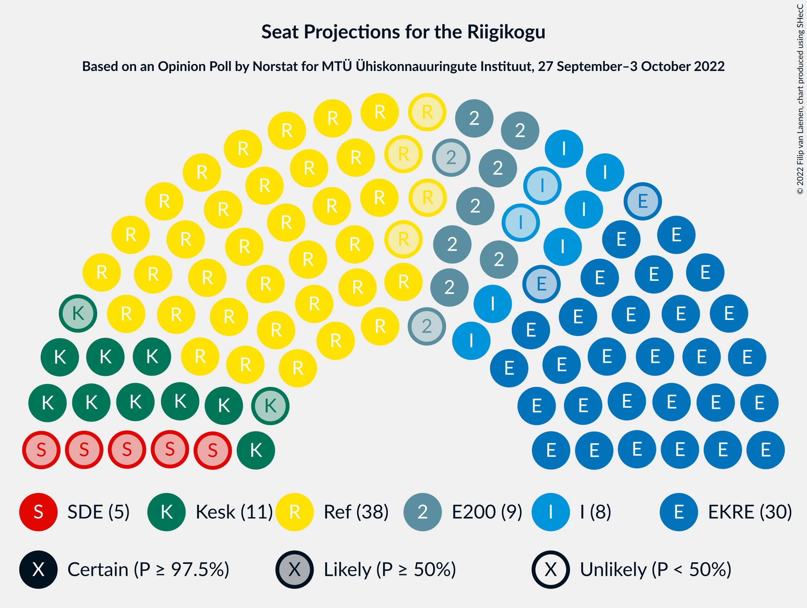
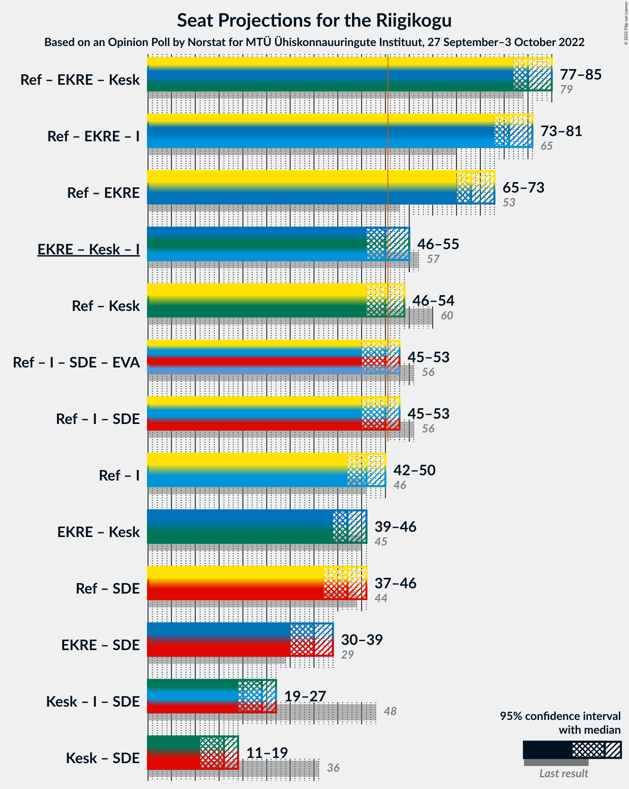

# Opinion Poll by Norstat for MTÜ Ühiskonnauuringute Instituut, 27 September–3 October 2022

<a href="#voting-intentions">Voting Intentions</a> | <a href="#seats">Seats</a> | <a href="#coalitions">Coalitions</a> | <a href="#technical-information">Technical Information</a>

## Voting Intentions

### Confidence Intervals

| Party | Last Result | Poll Result | 80% Confidence Interval | 90% Confidence Interval | 95% Confidence Interval | 99% Confidence Interval |
|:-----:|:-----------:|:-----------:|:-----------------------:|:-----------------------:|:-----------------------:|:-----------------------:|
| Eesti Reformierakond | 28.9% | 33.5% | 31.6–35.5% |31.1–36.0% |30.6–36.5% |29.8–37.4% |
| Eesti Konservatiivne Rahvaerakond | 17.8% | 27.8% | 26.0–29.7% |25.5–30.2% |25.1–30.7% |24.3–31.6% |
| Eesti Keskerakond | 23.1% | 11.9% | 10.7–13.3% |10.3–13.7% |10.0–14.1% |9.5–14.8% |
| Eesti 200 | 4.4% | 9.4% | 8.3–10.7% |8.0–11.1% |7.7–11.4% |7.2–12.0% |
| Erakond Isamaa | 11.4% | 8.3% | 7.3–9.5% |7.0–9.9% |6.7–10.2% |6.3–10.8% |
| Sotsiaaldemokraatlik Erakond | 9.8% | 5.5% | 4.7–6.5% |4.4–6.8% |4.3–7.1% |3.9–7.6% |
| Erakond Eestimaa Rohelised | 1.8% | 1.4% | 1.0–2.0% |0.9–2.2% |0.8–2.3% |0.7–2.7% |
| Erakond Parempoolsed | 0.0% | 0.7% | 0.5–1.2% |0.4–1.3% |0.3–1.4% |0.2–1.7% |

*Note:* The poll result column reflects the actual value used in the calculations. Published results may vary slightly, and in addition be rounded to fewer digits.

## Seats

### Confidence Intervals

| Party | Last Result | Median | 80% Confidence Interval | 90% Confidence Interval | 95% Confidence Interval | 99% Confidence Interval |
|:-----:|:-----------:|:------:|:-----------------------:|:-----------------------:|:-----------------------:|:-----------------------:|
| <a href="#eesti-reformierakond">Eesti Reformierakond</a> | 34 | 38 | 36–40 |35–42 |34–42 |33–43 |
| <a href="#eesti-konservatiivne-rahvaerakond">Eesti Konservatiivne Rahvaerakond</a> | 19 | 30 | 28–33 |28–34 |28–35 |26–36 |
| <a href="#eesti-keskerakond">Eesti Keskerakond</a> | 26 | 12 | 10–13 |10–14 |9–14 |9–15 |
| <a href="#eesti-200">Eesti 200</a> | 0 | 9 | 8–10 |7–11 |7–11 |7–12 |
| <a href="#erakond-isamaa">Erakond Isamaa</a> | 12 | 8 | 7–9 |6–9 |6–10 |5–11 |
| <a href="#sotsiaaldemokraatlik-erakond">Sotsiaaldemokraatlik Erakond</a> | 10 | 5 | 0–6 |0–6 |0–6 |0–7 |
| <a href="#erakond-eestimaa-rohelised">Erakond Eestimaa Rohelised</a> | 0 | 0 | 0 |0 |0 |0 |
| <a href="#erakond-parempoolsed">Erakond Parempoolsed</a> | 0 | 0 | 0 |0 |0 |0 |

### Eesti Reformierakond

*For a full overview of the results for this party, see the [Eesti Reformierakond](party-eestireformierakond.html) page.*

| Number of Seats | Probability | Accumulated | Special Marks |
|:---------------:|:-----------:|:-----------:|:-------------:|
| 32 | 0.2% | 100% |  |
| 33 | 0.9% | 99.8% |  |
| 34 | 2% | 98.9% | Last Result |
| 35 | 6% | 97% |  |
| 36 | 14% | 90% |  |
| 37 | 15% | 76% |  |
| 38 | 25% | 61% | Median |
| 39 | 14% | 36% |  |
| 40 | 12% | 22% |  |
| 41 | 4% | 10% |  |
| 42 | 4% | 5% |  |
| 43 | 1.2% | 2% |  |
| 44 | 0.3% | 0.4% |  |
| 45 | 0.1% | 0.1% |  |
| 46 | 0% | 0% |  |

### Eesti Konservatiivne Rahvaerakond

*For a full overview of the results for this party, see the [Eesti Konservatiivne Rahvaerakond](party-eestikonservatiivnerahvaerakond.html) page.*

| Number of Seats | Probability | Accumulated | Special Marks |
|:---------------:|:-----------:|:-----------:|:-------------:|
| 19 | 0% | 100% | Last Result |
| 20 | 0% | 100% |  |
| 21 | 0% | 100% |  |
| 22 | 0% | 100% |  |
| 23 | 0% | 100% |  |
| 24 | 0% | 100% |  |
| 25 | 0.1% | 100% |  |
| 26 | 0.6% | 99.9% |  |
| 27 | 2% | 99.3% |  |
| 28 | 9% | 98% |  |
| 29 | 14% | 89% |  |
| 30 | 26% | 75% | Median |
| 31 | 21% | 48% |  |
| 32 | 12% | 27% |  |
| 33 | 10% | 15% |  |
| 34 | 3% | 6% |  |
| 35 | 2% | 3% |  |
| 36 | 0.6% | 0.8% |  |
| 37 | 0.1% | 0.2% |  |
| 38 | 0% | 0.1% |  |
| 39 | 0% | 0% |  |

### Eesti Keskerakond

*For a full overview of the results for this party, see the [Eesti Keskerakond](party-eestikeskerakond.html) page.*

| Number of Seats | Probability | Accumulated | Special Marks |
|:---------------:|:-----------:|:-----------:|:-------------:|
| 8 | 0.2% | 100% |  |
| 9 | 2% | 99.8% |  |
| 10 | 10% | 97% |  |
| 11 | 28% | 88% |  |
| 12 | 31% | 60% | Median |
| 13 | 19% | 28% |  |
| 14 | 7% | 9% |  |
| 15 | 1.3% | 2% |  |
| 16 | 0.2% | 0.2% |  |
| 17 | 0% | 0% |  |
| 18 | 0% | 0% |  |
| 19 | 0% | 0% |  |
| 20 | 0% | 0% |  |
| 21 | 0% | 0% |  |
| 22 | 0% | 0% |  |
| 23 | 0% | 0% |  |
| 24 | 0% | 0% |  |
| 25 | 0% | 0% |  |
| 26 | 0% | 0% | Last Result |

### Eesti 200

*For a full overview of the results for this party, see the [Eesti 200](party-eesti200.html) page.*

| Number of Seats | Probability | Accumulated | Special Marks |
|:---------------:|:-----------:|:-----------:|:-------------:|
| 0 | 0% | 100% | Last Result |
| 1 | 0% | 100% |  |
| 2 | 0% | 100% |  |
| 3 | 0% | 100% |  |
| 4 | 0% | 100% |  |
| 5 | 0% | 100% |  |
| 6 | 0.5% | 100% |  |
| 7 | 6% | 99.5% |  |
| 8 | 27% | 94% |  |
| 9 | 38% | 66% | Median |
| 10 | 20% | 28% |  |
| 11 | 6% | 8% |  |
| 12 | 1.1% | 1.2% |  |
| 13 | 0.1% | 0.1% |  |
| 14 | 0% | 0% |  |

### Erakond Isamaa

*For a full overview of the results for this party, see the [Erakond Isamaa](party-erakondisamaa.html) page.*

| Number of Seats | Probability | Accumulated | Special Marks |
|:---------------:|:-----------:|:-----------:|:-------------:|
| 5 | 0.8% | 100% |  |
| 6 | 6% | 99.2% |  |
| 7 | 27% | 93% |  |
| 8 | 48% | 65% | Median |
| 9 | 15% | 18% |  |
| 10 | 2% | 3% |  |
| 11 | 0.6% | 0.6% |  |
| 12 | 0% | 0% | Last Result |

### Sotsiaaldemokraatlik Erakond

*For a full overview of the results for this party, see the [Sotsiaaldemokraatlik Erakond](party-sotsiaaldemokraatlikerakond.html) page.*

| Number of Seats | Probability | Accumulated | Special Marks |
|:---------------:|:-----------:|:-----------:|:-------------:|
| 0 | 23% | 100% |  |
| 1 | 0% | 77% |  |
| 2 | 0% | 77% |  |
| 3 | 0% | 77% |  |
| 4 | 17% | 77% |  |
| 5 | 41% | 59% | Median |
| 6 | 17% | 18% |  |
| 7 | 1.3% | 1.4% |  |
| 8 | 0.1% | 0.1% |  |
| 9 | 0% | 0% |  |
| 10 | 0% | 0% | Last Result |

### Erakond Eestimaa Rohelised

*For a full overview of the results for this party, see the [Erakond Eestimaa Rohelised](party-erakondeestimaarohelised.html) page.*

| Number of Seats | Probability | Accumulated | Special Marks |
|:---------------:|:-----------:|:-----------:|:-------------:|
| 0 | 100% | 100% | Last Result, Median |

### Erakond Parempoolsed

*For a full overview of the results for this party, see the [Erakond Parempoolsed](party-erakondparempoolsed.html) page.*

| Number of Seats | Probability | Accumulated | Special Marks |
|:---------------:|:-----------:|:-----------:|:-------------:|
| 0 | 100% | 100% | Last Result, Median |

## Coalitions

### Confidence Intervals

| Coalition | Last Result | Median | Majority? | 80% Confidence Interval | 90% Confidence Interval | 95% Confidence Interval | 99% Confidence Interval |
|:---------:|:-----------:|:------:|:---------:|:-----------------------:|:-----------------------:|:-----------------------:|:-----------------------:|
| Eesti Reformierakond – Eesti Konservatiivne Rahvaerakond – Eesti Keskerakond | 79 | 80 | 100% | 78–84 | 77–85 | 77–85 | 76–86 |
| Eesti Reformierakond – Eesti Konservatiivne Rahvaerakond – Erakond Isamaa | 65 | 76 | 100% | 74–80 | 73–81 | 73–81 | 72–82 |
| Eesti Reformierakond – Eesti Konservatiivne Rahvaerakond | 53 | 68 | 100% | 66–72 | 65–73 | 65–73 | 64–75 |
| Eesti Konservatiivne Rahvaerakond – Eesti Keskerakond – Erakond Isamaa | 57 | 50 | 42% | 48–53 | 47–54 | 46–55 | 45–56 |
| Eesti Reformierakond – Eesti Keskerakond | 60 | 50 | 37% | 47–52 | 46–53 | 46–54 | 45–56 |
| Eesti Reformierakond – Erakond Isamaa – Sotsiaaldemokraatlik Erakond | 56 | 50 | 36% | 47–52 | 46–53 | 45–53 | 44–55 |
| Eesti Reformierakond – Erakond Isamaa | 46 | 46 | 1.4% | 43–48 | 43–49 | 42–50 | 41–51 |
| Eesti Konservatiivne Rahvaerakond – Eesti Keskerakond | 45 | 42 | 0% | 40–45 | 39–46 | 39–46 | 38–48 |
| Eesti Reformierakond – Sotsiaaldemokraatlik Erakond | 44 | 42 | 0% | 38–45 | 38–45 | 37–46 | 36–47 |
| Eesti Konservatiivne Rahvaerakond – Sotsiaaldemokraatlik Erakond | 29 | 35 | 0% | 32–37 | 31–38 | 30–39 | 29–40 |
| Eesti Keskerakond – Erakond Isamaa – Sotsiaaldemokraatlik Erakond | 48 | 24 | 0% | 20–26 | 19–27 | 19–27 | 17–28 |
| Eesti Keskerakond – Sotsiaaldemokraatlik Erakond | 36 | 16 | 0% | 12–18 | 11–19 | 11–19 | 10–20 |

### Eesti Reformierakond – Eesti Konservatiivne Rahvaerakond – Eesti Keskerakond

| Number of Seats | Probability | Accumulated | Special Marks |
|:---------------:|:-----------:|:-----------:|:-------------:|
| 75 | 0.2% | 100% |  |
| 76 | 1.3% | 99.8% |  |
| 77 | 5% | 98% |  |
| 78 | 13% | 93% |  |
| 79 | 19% | 80% | Last Result |
| 80 | 22% | 61% | Median |
| 81 | 11% | 40% |  |
| 82 | 10% | 29% |  |
| 83 | 8% | 19% |  |
| 84 | 6% | 12% |  |
| 85 | 4% | 6% |  |
| 86 | 1.1% | 1.4% |  |
| 87 | 0.2% | 0.3% |  |
| 88 | 0.1% | 0.1% |  |
| 89 | 0% | 0% |  |

### Eesti Reformierakond – Eesti Konservatiivne Rahvaerakond – Erakond Isamaa

| Number of Seats | Probability | Accumulated | Special Marks |
|:---------------:|:-----------:|:-----------:|:-------------:|
| 65 | 0% | 100% | Last Result |
| 66 | 0% | 100% |  |
| 67 | 0% | 100% |  |
| 68 | 0% | 100% |  |
| 69 | 0% | 100% |  |
| 70 | 0.1% | 100% |  |
| 71 | 0.4% | 99.9% |  |
| 72 | 1.2% | 99.5% |  |
| 73 | 5% | 98% |  |
| 74 | 17% | 93% |  |
| 75 | 19% | 77% |  |
| 76 | 17% | 57% | Median |
| 77 | 11% | 40% |  |
| 78 | 9% | 29% |  |
| 79 | 8% | 20% |  |
| 80 | 5% | 12% |  |
| 81 | 6% | 8% |  |
| 82 | 1.2% | 2% |  |
| 83 | 0.3% | 0.4% |  |
| 84 | 0% | 0.1% |  |
| 85 | 0% | 0% |  |

### Eesti Reformierakond – Eesti Konservatiivne Rahvaerakond

| Number of Seats | Probability | Accumulated | Special Marks |
|:---------------:|:-----------:|:-----------:|:-------------:|
| 53 | 0% | 100% | Last Result |
| 54 | 0% | 100% |  |
| 55 | 0% | 100% |  |
| 56 | 0% | 100% |  |
| 57 | 0% | 100% |  |
| 58 | 0% | 100% |  |
| 59 | 0% | 100% |  |
| 60 | 0% | 100% |  |
| 61 | 0% | 100% |  |
| 62 | 0.1% | 100% |  |
| 63 | 0.3% | 99.9% |  |
| 64 | 1.1% | 99.6% |  |
| 65 | 4% | 98.5% |  |
| 66 | 12% | 94% |  |
| 67 | 21% | 82% |  |
| 68 | 15% | 61% | Median |
| 69 | 13% | 47% |  |
| 70 | 13% | 34% |  |
| 71 | 7% | 20% |  |
| 72 | 8% | 13% |  |
| 73 | 3% | 5% |  |
| 74 | 1.3% | 2% |  |
| 75 | 0.5% | 0.7% |  |
| 76 | 0.1% | 0.1% |  |
| 77 | 0% | 0% |  |

### Eesti Konservatiivne Rahvaerakond – Eesti Keskerakond – Erakond Isamaa

| Number of Seats | Probability | Accumulated | Special Marks |
|:---------------:|:-----------:|:-----------:|:-------------:|
| 44 | 0.2% | 100% |  |
| 45 | 0.6% | 99.7% |  |
| 46 | 3% | 99.1% |  |
| 47 | 6% | 96% |  |
| 48 | 11% | 90% |  |
| 49 | 21% | 80% |  |
| 50 | 16% | 59% | Median |
| 51 | 14% | 42% | Majority |
| 52 | 12% | 28% |  |
| 53 | 8% | 16% |  |
| 54 | 5% | 8% |  |
| 55 | 2% | 3% |  |
| 56 | 0.7% | 1.0% |  |
| 57 | 0.2% | 0.3% | Last Result |
| 58 | 0.1% | 0.1% |  |
| 59 | 0% | 0% |  |

### Eesti Reformierakond – Eesti Keskerakond

| Number of Seats | Probability | Accumulated | Special Marks |
|:---------------:|:-----------:|:-----------:|:-------------:|
| 43 | 0.1% | 100% |  |
| 44 | 0.4% | 99.9% |  |
| 45 | 1.4% | 99.6% |  |
| 46 | 4% | 98% |  |
| 47 | 7% | 94% |  |
| 48 | 13% | 87% |  |
| 49 | 18% | 74% |  |
| 50 | 18% | 55% | Median |
| 51 | 18% | 37% | Majority |
| 52 | 11% | 20% |  |
| 53 | 4% | 9% |  |
| 54 | 3% | 5% |  |
| 55 | 0.8% | 1.3% |  |
| 56 | 0.4% | 0.6% |  |
| 57 | 0.1% | 0.1% |  |
| 58 | 0% | 0% |  |
| 59 | 0% | 0% |  |
| 60 | 0% | 0% | Last Result |

### Eesti Reformierakond – Erakond Isamaa – Sotsiaaldemokraatlik Erakond

| Number of Seats | Probability | Accumulated | Special Marks |
|:---------------:|:-----------:|:-----------:|:-------------:|
| 42 | 0.1% | 100% |  |
| 43 | 0.2% | 99.9% |  |
| 44 | 1.1% | 99.7% |  |
| 45 | 3% | 98.6% |  |
| 46 | 5% | 96% |  |
| 47 | 8% | 91% |  |
| 48 | 9% | 83% |  |
| 49 | 20% | 73% |  |
| 50 | 17% | 53% |  |
| 51 | 16% | 36% | Median, Majority |
| 52 | 11% | 20% |  |
| 53 | 6% | 8% |  |
| 54 | 1.4% | 2% |  |
| 55 | 0.5% | 0.6% |  |
| 56 | 0.1% | 0.1% | Last Result |
| 57 | 0% | 0% |  |

### Eesti Reformierakond – Erakond Isamaa

| Number of Seats | Probability | Accumulated | Special Marks |
|:---------------:|:-----------:|:-----------:|:-------------:|
| 39 | 0.1% | 100% |  |
| 40 | 0.3% | 99.9% |  |
| 41 | 1.0% | 99.6% |  |
| 42 | 4% | 98.6% |  |
| 43 | 6% | 95% |  |
| 44 | 19% | 89% |  |
| 45 | 15% | 70% |  |
| 46 | 21% | 55% | Last Result, Median |
| 47 | 15% | 34% |  |
| 48 | 10% | 19% |  |
| 49 | 6% | 9% |  |
| 50 | 3% | 4% |  |
| 51 | 1.0% | 1.4% | Majority |
| 52 | 0.3% | 0.4% |  |
| 53 | 0.1% | 0.1% |  |
| 54 | 0% | 0% |  |

### Eesti Konservatiivne Rahvaerakond – Eesti Keskerakond

| Number of Seats | Probability | Accumulated | Special Marks |
|:---------------:|:-----------:|:-----------:|:-------------:|
| 36 | 0.1% | 100% |  |
| 37 | 0.3% | 99.9% |  |
| 38 | 1.3% | 99.6% |  |
| 39 | 4% | 98% |  |
| 40 | 12% | 94% |  |
| 41 | 14% | 82% |  |
| 42 | 20% | 68% | Median |
| 43 | 20% | 48% |  |
| 44 | 12% | 27% |  |
| 45 | 7% | 15% | Last Result |
| 46 | 6% | 8% |  |
| 47 | 2% | 2% |  |
| 48 | 0.7% | 1.0% |  |
| 49 | 0.2% | 0.2% |  |
| 50 | 0.1% | 0.1% |  |
| 51 | 0% | 0% | Majority |

### Eesti Reformierakond – Sotsiaaldemokraatlik Erakond

| Number of Seats | Probability | Accumulated | Special Marks |
|:---------------:|:-----------:|:-----------:|:-------------:|
| 34 | 0.1% | 100% |  |
| 35 | 0.2% | 99.9% |  |
| 36 | 0.9% | 99.7% |  |
| 37 | 2% | 98.8% |  |
| 38 | 7% | 97% |  |
| 39 | 7% | 90% |  |
| 40 | 9% | 82% |  |
| 41 | 13% | 73% |  |
| 42 | 20% | 60% |  |
| 43 | 15% | 40% | Median |
| 44 | 15% | 25% | Last Result |
| 45 | 5% | 10% |  |
| 46 | 4% | 5% |  |
| 47 | 0.7% | 1.0% |  |
| 48 | 0.3% | 0.3% |  |
| 49 | 0% | 0% |  |

### Eesti Konservatiivne Rahvaerakond – Sotsiaaldemokraatlik Erakond

| Number of Seats | Probability | Accumulated | Special Marks |
|:---------------:|:-----------:|:-----------:|:-------------:|
| 27 | 0.1% | 100% |  |
| 28 | 0.4% | 99.9% |  |
| 29 | 0.8% | 99.6% | Last Result |
| 30 | 3% | 98.8% |  |
| 31 | 5% | 95% |  |
| 32 | 8% | 91% |  |
| 33 | 12% | 82% |  |
| 34 | 19% | 70% |  |
| 35 | 20% | 51% | Median |
| 36 | 16% | 32% |  |
| 37 | 9% | 15% |  |
| 38 | 4% | 6% |  |
| 39 | 2% | 3% |  |
| 40 | 0.5% | 0.7% |  |
| 41 | 0.2% | 0.2% |  |
| 42 | 0% | 0% |  |

### Eesti Keskerakond – Erakond Isamaa – Sotsiaaldemokraatlik Erakond

| Number of Seats | Probability | Accumulated | Special Marks |
|:---------------:|:-----------:|:-----------:|:-------------:|
| 16 | 0.1% | 100% |  |
| 17 | 0.8% | 99.9% |  |
| 18 | 0.8% | 99.1% |  |
| 19 | 4% | 98% |  |
| 20 | 7% | 95% |  |
| 21 | 10% | 87% |  |
| 22 | 7% | 77% |  |
| 23 | 17% | 71% |  |
| 24 | 15% | 54% |  |
| 25 | 19% | 39% | Median |
| 26 | 13% | 19% |  |
| 27 | 5% | 6% |  |
| 28 | 0.9% | 1.2% |  |
| 29 | 0.2% | 0.2% |  |
| 30 | 0% | 0% |  |
| 31 | 0% | 0% |  |
| 32 | 0% | 0% |  |
| 33 | 0% | 0% |  |
| 34 | 0% | 0% |  |
| 35 | 0% | 0% |  |
| 36 | 0% | 0% |  |
| 37 | 0% | 0% |  |
| 38 | 0% | 0% |  |
| 39 | 0% | 0% |  |
| 40 | 0% | 0% |  |
| 41 | 0% | 0% |  |
| 42 | 0% | 0% |  |
| 43 | 0% | 0% |  |
| 44 | 0% | 0% |  |
| 45 | 0% | 0% |  |
| 46 | 0% | 0% |  |
| 47 | 0% | 0% |  |
| 48 | 0% | 0% | Last Result |

### Eesti Keskerakond – Sotsiaaldemokraatlik Erakond

| Number of Seats | Probability | Accumulated | Special Marks |
|:---------------:|:-----------:|:-----------:|:-------------:|
| 9 | 0.2% | 100% |  |
| 10 | 0.9% | 99.8% |  |
| 11 | 6% | 98.9% |  |
| 12 | 8% | 93% |  |
| 13 | 6% | 85% |  |
| 14 | 5% | 79% |  |
| 15 | 12% | 74% |  |
| 16 | 18% | 62% |  |
| 17 | 23% | 45% | Median |
| 18 | 15% | 22% |  |
| 19 | 6% | 7% |  |
| 20 | 0.9% | 1.1% |  |
| 21 | 0.2% | 0.2% |  |
| 22 | 0% | 0% |  |
| 23 | 0% | 0% |  |
| 24 | 0% | 0% |  |
| 25 | 0% | 0% |  |
| 26 | 0% | 0% |  |
| 27 | 0% | 0% |  |
| 28 | 0% | 0% |  |
| 29 | 0% | 0% |  |
| 30 | 0% | 0% |  |
| 31 | 0% | 0% |  |
| 32 | 0% | 0% |  |
| 33 | 0% | 0% |  |
| 34 | 0% | 0% |  |
| 35 | 0% | 0% |  |
| 36 | 0% | 0% | Last Result |

## Technical Information

### Opinion Poll

+ **Polling firm:** Norstat
+ **Commissioner(s):** MTÜ Ühiskonnauuringute Instituut
+ **Fieldwork period:** 27 September–3 October 2022

### Calculations

+ **Sample size:** 1000
+ **Simulations done:** 1,048,576
+ **Error estimate:** 1.10%

