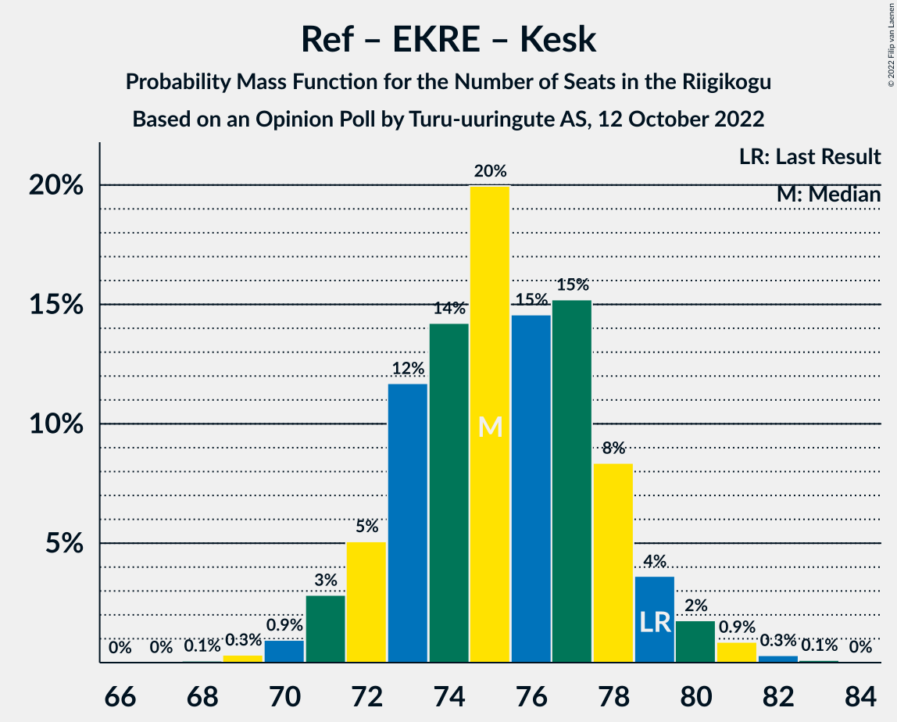

# Opinion Poll by Turu-uuringute AS, 12 October 2022

<a href="#voting-intentions">Voting Intentions</a> | <a href="#seats">Seats</a> | <a href="#coalitions">Coalitions</a> | <a href="#technical-information">Technical Information</a>

## Voting Intentions

### Confidence Intervals

| Party | Last Result | Poll Result | 80% Confidence Interval | 90% Confidence Interval | 95% Confidence Interval | 99% Confidence Interval |
|:-----:|:-----------:|:-----------:|:-----------------------:|:-----------------------:|:-----------------------:|:-----------------------:|
| Eesti Reformierakond | 28.9% | 29.0% | 26.7–31.5% |26.1–32.2% |25.5–32.8% |24.4–34.0% |
| Eesti Konservatiivne Rahvaerakond | 17.8% | 28.0% | 25.7–30.4% |25.1–31.1% |24.6–31.7% |23.5–32.9% |
| Eesti Keskerakond | 23.1% | 12.0% | 10.4–13.9% |10.0–14.4% |9.6–14.9% |8.9–15.8% |
| Eesti 200 | 4.4% | 12.0% | 10.4–13.9% |10.0–14.4% |9.6–14.9% |8.9–15.8% |
| Erakond Isamaa | 11.4% | 8.0% | 6.7–9.6% |6.4–10.1% |6.1–10.5% |5.5–11.3% |
| Sotsiaaldemokraatlik Erakond | 9.8% | 7.0% | 5.8–8.5% |5.5–8.9% |5.2–9.3% |4.7–10.1% |
| Erakond Eestimaa Rohelised | 1.8% | 1.0% | 0.6–1.8% |0.5–2.0% |0.5–2.2% |0.3–2.6% |
| Erakond Parempoolsed | 0.0% | 0.2% | 0.1–0.7% |0.0–0.8% |0.0–0.9% |0.0–1.2% |

*Note:* The poll result column reflects the actual value used in the calculations. Published results may vary slightly, and in addition be rounded to fewer digits.

## Seats

### Confidence Intervals

| Party | Last Result | Median | 80% Confidence Interval | 90% Confidence Interval | 95% Confidence Interval | 99% Confidence Interval |
|:-----:|:-----------:|:------:|:-----------------------:|:-----------------------:|:-----------------------:|:-----------------------:|
| <a href="#eesti-reformierakond">Eesti Reformierakond</a> | 34 | 32 | 29–35 |29–36 |28–37 |27–39 |
| <a href="#eesti-konservatiivne-rahvaerakond">Eesti Konservatiivne Rahvaerakond</a> | 19 | 31 | 28–34 |28–35 |27–36 |25–37 |
| <a href="#eesti-keskerakond">Eesti Keskerakond</a> | 26 | 12 | 10–14 |10–15 |9–15 |8–16 |
| <a href="#eesti-200">Eesti 200</a> | 0 | 12 | 10–14 |10–14 |9–15 |8–16 |
| <a href="#erakond-isamaa">Erakond Isamaa</a> | 12 | 7 | 6–9 |6–9 |5–10 |5–11 |
| <a href="#sotsiaaldemokraatlik-erakond">Sotsiaaldemokraatlik Erakond</a> | 10 | 6 | 5–8 |5–8 |4–9 |0–10 |
| <a href="#erakond-eestimaa-rohelised">Erakond Eestimaa Rohelised</a> | 0 | 0 | 0 |0 |0 |0 |
| <a href="#erakond-parempoolsed">Erakond Parempoolsed</a> | 0 | 0 | 0 |0 |0 |0 |

### Eesti Reformierakond

*For a full overview of the results for this party, see the [Eesti Reformierakond](party-eestireformierakond.html) page.*

| Number of Seats | Probability | Accumulated | Special Marks |
|:---------------:|:-----------:|:-----------:|:-------------:|
| 25 | 0.1% | 100% |  |
| 26 | 0.3% | 99.9% |  |
| 27 | 1.2% | 99.6% |  |
| 28 | 3% | 98% |  |
| 29 | 6% | 95% |  |
| 30 | 10% | 90% |  |
| 31 | 16% | 79% |  |
| 32 | 18% | 63% | Median |
| 33 | 20% | 46% |  |
| 34 | 12% | 26% | Last Result |
| 35 | 7% | 14% |  |
| 36 | 4% | 7% |  |
| 37 | 2% | 3% |  |
| 38 | 0.7% | 1.3% |  |
| 39 | 0.4% | 0.5% |  |
| 40 | 0.1% | 0.1% |  |
| 41 | 0% | 0% |  |

### Eesti Konservatiivne Rahvaerakond

*For a full overview of the results for this party, see the [Eesti Konservatiivne Rahvaerakond](party-eestikonservatiivnerahvaerakond.html) page.*

| Number of Seats | Probability | Accumulated | Special Marks |
|:---------------:|:-----------:|:-----------:|:-------------:|
| 19 | 0% | 100% | Last Result |
| 20 | 0% | 100% |  |
| 21 | 0% | 100% |  |
| 22 | 0% | 100% |  |
| 23 | 0% | 100% |  |
| 24 | 0.1% | 100% |  |
| 25 | 0.4% | 99.9% |  |
| 26 | 1.2% | 99.5% |  |
| 27 | 3% | 98% |  |
| 28 | 7% | 95% |  |
| 29 | 11% | 88% |  |
| 30 | 17% | 77% |  |
| 31 | 19% | 60% | Median |
| 32 | 13% | 41% |  |
| 33 | 16% | 28% |  |
| 34 | 6% | 12% |  |
| 35 | 3% | 6% |  |
| 36 | 2% | 3% |  |
| 37 | 0.5% | 0.8% |  |
| 38 | 0.2% | 0.2% |  |
| 39 | 0.1% | 0.1% |  |
| 40 | 0% | 0% |  |

### Eesti Keskerakond

*For a full overview of the results for this party, see the [Eesti Keskerakond](party-eestikeskerakond.html) page.*

| Number of Seats | Probability | Accumulated | Special Marks |
|:---------------:|:-----------:|:-----------:|:-------------:|
| 7 | 0.1% | 100% |  |
| 8 | 0.7% | 99.9% |  |
| 9 | 4% | 99.3% |  |
| 10 | 11% | 95% |  |
| 11 | 25% | 85% |  |
| 12 | 23% | 60% | Median |
| 13 | 21% | 37% |  |
| 14 | 10% | 15% |  |
| 15 | 4% | 5% |  |
| 16 | 0.9% | 1.2% |  |
| 17 | 0.3% | 0.3% |  |
| 18 | 0% | 0.1% |  |
| 19 | 0% | 0% |  |
| 20 | 0% | 0% |  |
| 21 | 0% | 0% |  |
| 22 | 0% | 0% |  |
| 23 | 0% | 0% |  |
| 24 | 0% | 0% |  |
| 25 | 0% | 0% |  |
| 26 | 0% | 0% | Last Result |

### Eesti 200

*For a full overview of the results for this party, see the [Eesti 200](party-eesti200.html) page.*

| Number of Seats | Probability | Accumulated | Special Marks |
|:---------------:|:-----------:|:-----------:|:-------------:|
| 0 | 0% | 100% | Last Result |
| 1 | 0% | 100% |  |
| 2 | 0% | 100% |  |
| 3 | 0% | 100% |  |
| 4 | 0% | 100% |  |
| 5 | 0% | 100% |  |
| 6 | 0% | 100% |  |
| 7 | 0% | 100% |  |
| 8 | 0.6% | 100% |  |
| 9 | 4% | 99.3% |  |
| 10 | 13% | 95% |  |
| 11 | 23% | 82% |  |
| 12 | 26% | 59% | Median |
| 13 | 18% | 33% |  |
| 14 | 10% | 15% |  |
| 15 | 3% | 5% |  |
| 16 | 1.3% | 2% |  |
| 17 | 0.2% | 0.3% |  |
| 18 | 0% | 0% |  |

### Erakond Isamaa

*For a full overview of the results for this party, see the [Erakond Isamaa](party-erakondisamaa.html) page.*

| Number of Seats | Probability | Accumulated | Special Marks |
|:---------------:|:-----------:|:-----------:|:-------------:|
| 0 | 0.1% | 100% |  |
| 1 | 0% | 99.9% |  |
| 2 | 0% | 99.9% |  |
| 3 | 0% | 99.9% |  |
| 4 | 0.2% | 99.9% |  |
| 5 | 4% | 99.7% |  |
| 6 | 17% | 96% |  |
| 7 | 34% | 79% | Median |
| 8 | 26% | 45% |  |
| 9 | 15% | 19% |  |
| 10 | 4% | 5% |  |
| 11 | 0.8% | 1.0% |  |
| 12 | 0.2% | 0.2% | Last Result |
| 13 | 0% | 0% |  |

### Sotsiaaldemokraatlik Erakond

*For a full overview of the results for this party, see the [Sotsiaaldemokraatlik Erakond](party-sotsiaaldemokraatlikerakond.html) page.*

| Number of Seats | Probability | Accumulated | Special Marks |
|:---------------:|:-----------:|:-----------:|:-------------:|
| 0 | 2% | 100% |  |
| 1 | 0% | 98% |  |
| 2 | 0% | 98% |  |
| 3 | 0% | 98% |  |
| 4 | 2% | 98% |  |
| 5 | 15% | 97% |  |
| 6 | 39% | 81% | Median |
| 7 | 28% | 42% |  |
| 8 | 10% | 14% |  |
| 9 | 3% | 4% |  |
| 10 | 0.4% | 0.5% | Last Result |
| 11 | 0.1% | 0.1% |  |
| 12 | 0% | 0% |  |

### Erakond Eestimaa Rohelised

*For a full overview of the results for this party, see the [Erakond Eestimaa Rohelised](party-erakondeestimaarohelised.html) page.*

| Number of Seats | Probability | Accumulated | Special Marks |
|:---------------:|:-----------:|:-----------:|:-------------:|
| 0 | 100% | 100% | Last Result, Median |

### Erakond Parempoolsed

*For a full overview of the results for this party, see the [Erakond Parempoolsed](party-erakondparempoolsed.html) page.*

| Number of Seats | Probability | Accumulated | Special Marks |
|:---------------:|:-----------:|:-----------:|:-------------:|
| 0 | 100% | 100% | Last Result, Median |

## Coalitions

### Confidence Intervals

| Coalition | Last Result | Median | Majority? | 80% Confidence Interval | 90% Confidence Interval | 95% Confidence Interval | 99% Confidence Interval |
|:---------:|:-----------:|:------:|:---------:|:-----------------------:|:-----------------------:|:-----------------------:|:-----------------------:|
| Eesti Reformierakond – Eesti Konservatiivne Rahvaerakond – Eesti Keskerakond | 79 | 75 | 100% | 73–78 | 72–79 | 71–80 | 70–81 |
| Eesti Reformierakond – Eesti Konservatiivne Rahvaerakond – Erakond Isamaa | 65 | 71 | 100% | 68–74 | 67–75 | 66–76 | 65–77 |
| Eesti Reformierakond – Eesti Konservatiivne Rahvaerakond | 53 | 63 | 100% | 61–66 | 60–67 | 59–68 | 57–70 |
| Eesti Konservatiivne Rahvaerakond – Eesti Keskerakond – Erakond Isamaa | 57 | 50 | 50% | 48–53 | 46–54 | 46–55 | 44–57 |
| Eesti Reformierakond – Erakond Isamaa – Sotsiaaldemokraatlik Erakond | 56 | 46 | 3% | 43–49 | 42–50 | 41–51 | 40–52 |
| Eesti Reformierakond – Eesti Keskerakond | 60 | 44 | 0.9% | 41–47 | 40–48 | 39–49 | 38–51 |
| Eesti Konservatiivne Rahvaerakond – Eesti Keskerakond | 45 | 43 | 0.1% | 40–46 | 39–47 | 38–48 | 37–49 |
| Eesti Reformierakond – Erakond Isamaa | 46 | 40 | 0% | 37–43 | 36–44 | 35–44 | 34–46 |
| Eesti Reformierakond – Sotsiaaldemokraatlik Erakond | 44 | 39 | 0% | 36–41 | 35–42 | 34–43 | 32–45 |
| Eesti Konservatiivne Rahvaerakond – Sotsiaaldemokraatlik Erakond | 29 | 37 | 0% | 34–40 | 33–41 | 32–42 | 31–43 |
| Eesti Keskerakond – Erakond Isamaa – Sotsiaaldemokraatlik Erakond | 48 | 26 | 0% | 23–28 | 22–29 | 21–30 | 20–31 |
| Eesti Keskerakond – Sotsiaaldemokraatlik Erakond | 36 | 18 | 0% | 16–21 | 15–21 | 14–22 | 12–23 |

### Eesti Reformierakond – Eesti Konservatiivne Rahvaerakond – Eesti Keskerakond

| Number of Seats | Probability | Accumulated | Special Marks |
|:---------------:|:-----------:|:-----------:|:-------------:|
| 68 | 0.1% | 100% |  |
| 69 | 0.3% | 99.9% |  |
| 70 | 0.9% | 99.6% |  |
| 71 | 3% | 98.6% |  |
| 72 | 5% | 96% |  |
| 73 | 12% | 91% |  |
| 74 | 14% | 79% |  |
| 75 | 20% | 65% | Median |
| 76 | 15% | 45% |  |
| 77 | 15% | 30% |  |
| 78 | 8% | 15% |  |
| 79 | 4% | 7% | Last Result |
| 80 | 2% | 3% |  |
| 81 | 0.9% | 1.3% |  |
| 82 | 0.3% | 0.5% |  |
| 83 | 0.1% | 0.1% |  |
| 84 | 0% | 0% |  |

### Eesti Reformierakond – Eesti Konservatiivne Rahvaerakond – Erakond Isamaa

| Number of Seats | Probability | Accumulated | Special Marks |
|:---------------:|:-----------:|:-----------:|:-------------:|
| 63 | 0% | 100% |  |
| 64 | 0.2% | 99.9% |  |
| 65 | 0.7% | 99.7% | Last Result |
| 66 | 2% | 99.1% |  |
| 67 | 4% | 97% |  |
| 68 | 7% | 93% |  |
| 69 | 13% | 86% |  |
| 70 | 23% | 74% | Median |
| 71 | 17% | 51% |  |
| 72 | 10% | 34% |  |
| 73 | 12% | 23% |  |
| 74 | 6% | 11% |  |
| 75 | 3% | 5% |  |
| 76 | 2% | 3% |  |
| 77 | 0.6% | 0.9% |  |
| 78 | 0.2% | 0.3% |  |
| 79 | 0.1% | 0.1% |  |
| 80 | 0% | 0% |  |

### Eesti Reformierakond – Eesti Konservatiivne Rahvaerakond

| Number of Seats | Probability | Accumulated | Special Marks |
|:---------------:|:-----------:|:-----------:|:-------------:|
| 53 | 0% | 100% | Last Result |
| 54 | 0% | 100% |  |
| 55 | 0% | 100% |  |
| 56 | 0.1% | 100% |  |
| 57 | 0.5% | 99.8% |  |
| 58 | 1.3% | 99.4% |  |
| 59 | 2% | 98% |  |
| 60 | 5% | 96% |  |
| 61 | 15% | 90% |  |
| 62 | 9% | 75% |  |
| 63 | 19% | 66% | Median |
| 64 | 18% | 47% |  |
| 65 | 12% | 29% |  |
| 66 | 9% | 17% |  |
| 67 | 4% | 9% |  |
| 68 | 2% | 4% |  |
| 69 | 1.4% | 2% |  |
| 70 | 0.5% | 0.6% |  |
| 71 | 0.1% | 0.1% |  |
| 72 | 0% | 0% |  |

### Eesti Konservatiivne Rahvaerakond – Eesti Keskerakond – Erakond Isamaa

| Number of Seats | Probability | Accumulated | Special Marks |
|:---------------:|:-----------:|:-----------:|:-------------:|
| 42 | 0% | 100% |  |
| 43 | 0.1% | 99.9% |  |
| 44 | 0.6% | 99.8% |  |
| 45 | 1.2% | 99.2% |  |
| 46 | 3% | 98% |  |
| 47 | 4% | 95% |  |
| 48 | 8% | 91% |  |
| 49 | 17% | 82% |  |
| 50 | 16% | 66% | Median |
| 51 | 16% | 50% | Majority |
| 52 | 13% | 34% |  |
| 53 | 12% | 21% |  |
| 54 | 4% | 9% |  |
| 55 | 3% | 5% |  |
| 56 | 1.2% | 2% |  |
| 57 | 0.5% | 0.8% | Last Result |
| 58 | 0.2% | 0.3% |  |
| 59 | 0% | 0.1% |  |
| 60 | 0% | 0% |  |

### Eesti Reformierakond – Erakond Isamaa – Sotsiaaldemokraatlik Erakond

| Number of Seats | Probability | Accumulated | Special Marks |
|:---------------:|:-----------:|:-----------:|:-------------:|
| 38 | 0.1% | 100% |  |
| 39 | 0.2% | 99.8% |  |
| 40 | 0.7% | 99.6% |  |
| 41 | 2% | 98.9% |  |
| 42 | 5% | 97% |  |
| 43 | 6% | 93% |  |
| 44 | 15% | 87% |  |
| 45 | 13% | 72% | Median |
| 46 | 16% | 58% |  |
| 47 | 15% | 42% |  |
| 48 | 14% | 27% |  |
| 49 | 6% | 13% |  |
| 50 | 4% | 7% |  |
| 51 | 2% | 3% | Majority |
| 52 | 1.0% | 1.3% |  |
| 53 | 0.2% | 0.3% |  |
| 54 | 0.1% | 0.1% |  |
| 55 | 0% | 0% |  |
| 56 | 0% | 0% | Last Result |

### Eesti Reformierakond – Eesti Keskerakond

| Number of Seats | Probability | Accumulated | Special Marks |
|:---------------:|:-----------:|:-----------:|:-------------:|
| 37 | 0.1% | 100% |  |
| 38 | 0.7% | 99.8% |  |
| 39 | 2% | 99.1% |  |
| 40 | 4% | 97% |  |
| 41 | 7% | 93% |  |
| 42 | 10% | 86% |  |
| 43 | 8% | 76% |  |
| 44 | 19% | 68% | Median |
| 45 | 24% | 49% |  |
| 46 | 13% | 25% |  |
| 47 | 6% | 12% |  |
| 48 | 3% | 6% |  |
| 49 | 1.5% | 4% |  |
| 50 | 1.2% | 2% |  |
| 51 | 0.7% | 0.9% | Majority |
| 52 | 0.2% | 0.2% |  |
| 53 | 0% | 0.1% |  |
| 54 | 0% | 0% |  |
| 55 | 0% | 0% |  |
| 56 | 0% | 0% |  |
| 57 | 0% | 0% |  |
| 58 | 0% | 0% |  |
| 59 | 0% | 0% |  |
| 60 | 0% | 0% | Last Result |

### Eesti Konservatiivne Rahvaerakond – Eesti Keskerakond

| Number of Seats | Probability | Accumulated | Special Marks |
|:---------------:|:-----------:|:-----------:|:-------------:|
| 35 | 0.1% | 100% |  |
| 36 | 0.2% | 99.9% |  |
| 37 | 0.8% | 99.8% |  |
| 38 | 2% | 98.9% |  |
| 39 | 4% | 97% |  |
| 40 | 6% | 93% |  |
| 41 | 11% | 86% |  |
| 42 | 21% | 76% |  |
| 43 | 10% | 55% | Median |
| 44 | 17% | 45% |  |
| 45 | 10% | 28% | Last Result |
| 46 | 11% | 18% |  |
| 47 | 4% | 7% |  |
| 48 | 1.4% | 3% |  |
| 49 | 0.8% | 1.2% |  |
| 50 | 0.3% | 0.4% |  |
| 51 | 0.1% | 0.1% | Majority |
| 52 | 0% | 0.1% |  |
| 53 | 0% | 0% |  |

### Eesti Reformierakond – Erakond Isamaa

| Number of Seats | Probability | Accumulated | Special Marks |
|:---------------:|:-----------:|:-----------:|:-------------:|
| 32 | 0.1% | 100% |  |
| 33 | 0.2% | 99.9% |  |
| 34 | 0.9% | 99.7% |  |
| 35 | 2% | 98.8% |  |
| 36 | 5% | 97% |  |
| 37 | 8% | 91% |  |
| 38 | 18% | 84% |  |
| 39 | 10% | 65% | Median |
| 40 | 22% | 56% |  |
| 41 | 12% | 34% |  |
| 42 | 12% | 22% |  |
| 43 | 5% | 10% |  |
| 44 | 3% | 6% |  |
| 45 | 1.2% | 2% |  |
| 46 | 0.9% | 1.2% | Last Result |
| 47 | 0.3% | 0.4% |  |
| 48 | 0.1% | 0.1% |  |
| 49 | 0% | 0% |  |

### Eesti Reformierakond – Sotsiaaldemokraatlik Erakond

| Number of Seats | Probability | Accumulated | Special Marks |
|:---------------:|:-----------:|:-----------:|:-------------:|
| 30 | 0.1% | 100% |  |
| 31 | 0.2% | 99.9% |  |
| 32 | 0.5% | 99.8% |  |
| 33 | 1.3% | 99.3% |  |
| 34 | 2% | 98% |  |
| 35 | 4% | 96% |  |
| 36 | 7% | 92% |  |
| 37 | 15% | 84% |  |
| 38 | 17% | 70% | Median |
| 39 | 23% | 53% |  |
| 40 | 13% | 30% |  |
| 41 | 6% | 16% |  |
| 42 | 6% | 10% |  |
| 43 | 2% | 4% |  |
| 44 | 2% | 2% | Last Result |
| 45 | 0.7% | 0.9% |  |
| 46 | 0.1% | 0.2% |  |
| 47 | 0.1% | 0.1% |  |
| 48 | 0% | 0% |  |

### Eesti Konservatiivne Rahvaerakond – Sotsiaaldemokraatlik Erakond

| Number of Seats | Probability | Accumulated | Special Marks |
|:---------------:|:-----------:|:-----------:|:-------------:|
| 29 | 0.1% | 100% | Last Result |
| 30 | 0.2% | 99.9% |  |
| 31 | 0.5% | 99.7% |  |
| 32 | 2% | 99.1% |  |
| 33 | 3% | 97% |  |
| 34 | 5% | 95% |  |
| 35 | 7% | 90% |  |
| 36 | 18% | 83% |  |
| 37 | 16% | 65% | Median |
| 38 | 15% | 48% |  |
| 39 | 15% | 33% |  |
| 40 | 10% | 18% |  |
| 41 | 4% | 8% |  |
| 42 | 2% | 4% |  |
| 43 | 1.1% | 2% |  |
| 44 | 0.3% | 0.4% |  |
| 45 | 0.1% | 0.1% |  |
| 46 | 0% | 0% |  |

### Eesti Keskerakond – Erakond Isamaa – Sotsiaaldemokraatlik Erakond

| Number of Seats | Probability | Accumulated | Special Marks |
|:---------------:|:-----------:|:-----------:|:-------------:|
| 17 | 0% | 100% |  |
| 18 | 0.1% | 99.9% |  |
| 19 | 0.2% | 99.9% |  |
| 20 | 0.7% | 99.6% |  |
| 21 | 2% | 99.0% |  |
| 22 | 3% | 97% |  |
| 23 | 6% | 94% |  |
| 24 | 11% | 88% |  |
| 25 | 24% | 77% | Median |
| 26 | 21% | 53% |  |
| 27 | 13% | 32% |  |
| 28 | 11% | 20% |  |
| 29 | 4% | 8% |  |
| 30 | 3% | 4% |  |
| 31 | 1.0% | 1.3% |  |
| 32 | 0.3% | 0.4% |  |
| 33 | 0.1% | 0.1% |  |
| 34 | 0% | 0% |  |
| 35 | 0% | 0% |  |
| 36 | 0% | 0% |  |
| 37 | 0% | 0% |  |
| 38 | 0% | 0% |  |
| 39 | 0% | 0% |  |
| 40 | 0% | 0% |  |
| 41 | 0% | 0% |  |
| 42 | 0% | 0% |  |
| 43 | 0% | 0% |  |
| 44 | 0% | 0% |  |
| 45 | 0% | 0% |  |
| 46 | 0% | 0% |  |
| 47 | 0% | 0% |  |
| 48 | 0% | 0% | Last Result |

### Eesti Keskerakond – Sotsiaaldemokraatlik Erakond

| Number of Seats | Probability | Accumulated | Special Marks |
|:---------------:|:-----------:|:-----------:|:-------------:|
| 10 | 0.1% | 100% |  |
| 11 | 0.3% | 99.9% |  |
| 12 | 0.4% | 99.6% |  |
| 13 | 0.5% | 99.2% |  |
| 14 | 1.3% | 98.7% |  |
| 15 | 4% | 97% |  |
| 16 | 9% | 94% |  |
| 17 | 15% | 85% |  |
| 18 | 25% | 70% | Median |
| 19 | 21% | 44% |  |
| 20 | 12% | 24% |  |
| 21 | 7% | 11% |  |
| 22 | 3% | 4% |  |
| 23 | 1.2% | 2% |  |
| 24 | 0.3% | 0.4% |  |
| 25 | 0.1% | 0.1% |  |
| 26 | 0% | 0% |  |
| 27 | 0% | 0% |  |
| 28 | 0% | 0% |  |
| 29 | 0% | 0% |  |
| 30 | 0% | 0% |  |
| 31 | 0% | 0% |  |
| 32 | 0% | 0% |  |
| 33 | 0% | 0% |  |
| 34 | 0% | 0% |  |
| 35 | 0% | 0% |  |
| 36 | 0% | 0% | Last Result |

## Technical Information

### Opinion Poll

+ **Polling firm:** Turu-uuringute AS
+ **Commissioner(s):** —
+ **Fieldwork period:** 12 October 2022

### Calculations

+ **Sample size:** 600
+ **Simulations done:** 1,048,576
+ **Error estimate:** 2.61%

