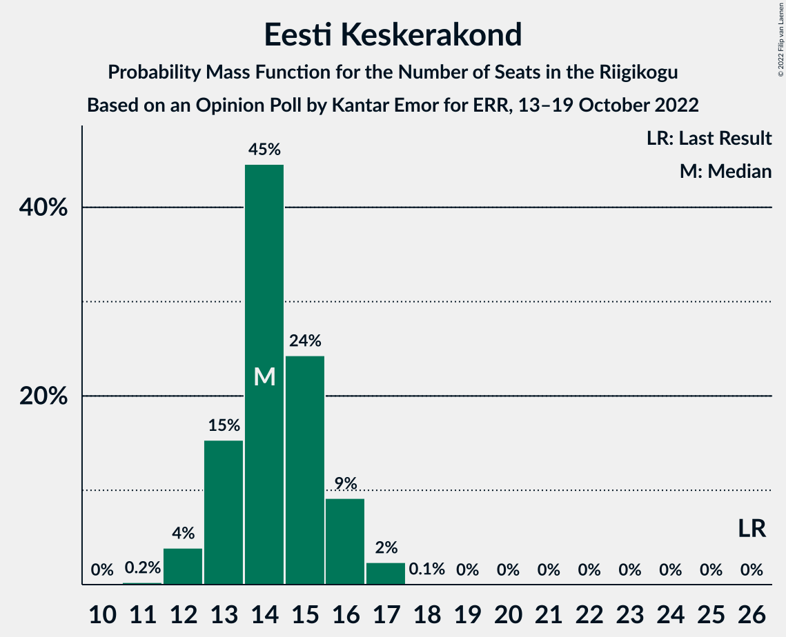
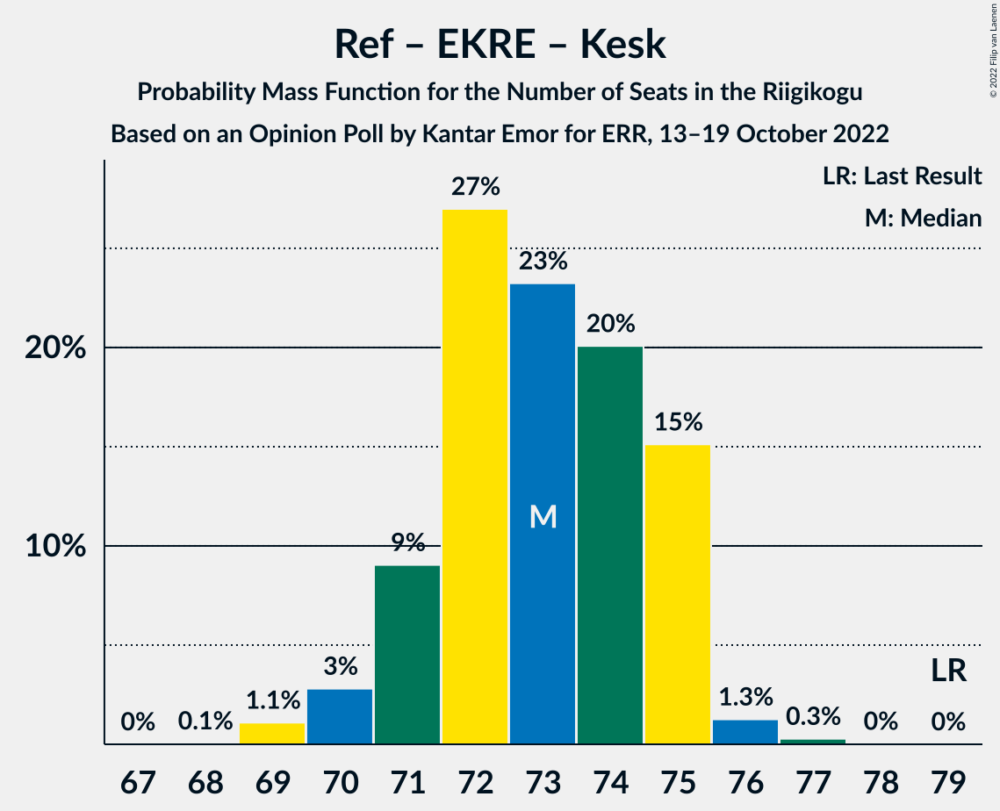

# Opinion Poll by Kantar Emor for ERR, 13–19 October 2022

<a href="#voting-intentions">Voting Intentions</a> | <a href="#seats">Seats</a> | <a href="#coalitions">Coalitions</a> | <a href="#technical-information">Technical Information</a>

## Voting Intentions

### Confidence Intervals

| Party | Last Result | Poll Result | 80% Confidence Interval | 90% Confidence Interval | 95% Confidence Interval | 99% Confidence Interval |
|:-----:|:-----------:|:-----------:|:-----------------------:|:-----------------------:|:-----------------------:|:-----------------------:|
| Eesti Reformierakond | 28.9% | 28.2% | 26.7–29.7% |26.3–30.2% |25.9–30.5% |25.2–31.3% |
| Eesti Konservatiivne Rahvaerakond | 17.8% | 25.2% | 23.8–26.7% |23.4–27.1% |23.0–27.5% |22.4–28.2% |
| Eesti Keskerakond | 23.1% | 14.1% | 13.0–15.3% |12.7–15.7% |12.4–16.0% |11.9–16.6% |
| Eesti 200 | 4.4% | 14.1% | 13.0–15.3% |12.7–15.7% |12.4–16.0% |11.9–16.6% |
| Sotsiaaldemokraatlik Erakond | 9.8% | 8.0% | 7.2–9.0% |7.0–9.3% |6.8–9.5% |6.4–10.0% |
| Erakond Isamaa | 11.4% | 7.1% | 6.3–8.0% |6.1–8.3% |5.9–8.5% |5.5–9.0% |
| Erakond Eestimaa Rohelised | 1.8% | 2.0% | 1.6–2.6% |1.5–2.8% |1.4–2.9% |1.3–3.2% |
| Erakond Parempoolsed | 0.0% | 1.0% | 0.7–1.4% |0.7–1.6% |0.6–1.7% |0.5–1.9% |

*Note:* The poll result column reflects the actual value used in the calculations. Published results may vary slightly, and in addition be rounded to fewer digits.

## Seats

### Confidence Intervals

| Party | Last Result | Median | 80% Confidence Interval | 90% Confidence Interval | 95% Confidence Interval | 99% Confidence Interval |
|:-----:|:-----------:|:------:|:-----------------------:|:-----------------------:|:-----------------------:|:-----------------------:|
| <a href="#eesti-reformierakond">Eesti Reformierakond</a> | 34 | 31 | 29–33 |29–34 |29–34 |28–35 |
| <a href="#eesti-konservatiivne-rahvaerakond">Eesti Konservatiivne Rahvaerakond</a> | 19 | 28 | 26–29 |25–30 |25–30 |24–31 |
| <a href="#eesti-keskerakond">Eesti Keskerakond</a> | 26 | 14 | 13–16 |13–16 |12–16 |12–17 |
| <a href="#eesti-200">Eesti 200</a> | 0 | 14 | 13–16 |13–16 |12–16 |12–17 |
| <a href="#sotsiaaldemokraatlik-erakond">Sotsiaaldemokraatlik Erakond</a> | 10 | 7 | 6–8 |6–9 |6–9 |6–10 |
| <a href="#erakond-isamaa">Erakond Isamaa</a> | 12 | 6 | 6–7 |5–8 |5–8 |5–8 |
| <a href="#erakond-eestimaa-rohelised">Erakond Eestimaa Rohelised</a> | 0 | 0 | 0 |0 |0 |0 |
| <a href="#erakond-parempoolsed">Erakond Parempoolsed</a> | 0 | 0 | 0 |0 |0 |0 |

### Eesti Reformierakond

*For a full overview of the results for this party, see the [Eesti Reformierakond](party-eestireformierakond.html) page.*

| Number of Seats | Probability | Accumulated | Special Marks |
|:---------------:|:-----------:|:-----------:|:-------------:|
| 27 | 0.4% | 100% |  |
| 28 | 2% | 99.6% |  |
| 29 | 13% | 98% |  |
| 30 | 17% | 85% |  |
| 31 | 28% | 68% | Median |
| 32 | 25% | 40% |  |
| 33 | 10% | 15% |  |
| 34 | 4% | 5% | Last Result |
| 35 | 1.3% | 1.4% |  |
| 36 | 0.1% | 0.1% |  |
| 37 | 0% | 0% |  |

### Eesti Konservatiivne Rahvaerakond

*For a full overview of the results for this party, see the [Eesti Konservatiivne Rahvaerakond](party-eestikonservatiivnerahvaerakond.html) page.*

| Number of Seats | Probability | Accumulated | Special Marks |
|:---------------:|:-----------:|:-----------:|:-------------:|
| 19 | 0% | 100% | Last Result |
| 20 | 0% | 100% |  |
| 21 | 0% | 100% |  |
| 22 | 0% | 100% |  |
| 23 | 0.1% | 100% |  |
| 24 | 1.4% | 99.9% |  |
| 25 | 5% | 98% |  |
| 26 | 17% | 94% |  |
| 27 | 24% | 77% |  |
| 28 | 28% | 53% | Median |
| 29 | 16% | 25% |  |
| 30 | 8% | 9% |  |
| 31 | 1.2% | 1.4% |  |
| 32 | 0.3% | 0.3% |  |
| 33 | 0% | 0% |  |

### Eesti Keskerakond

*For a full overview of the results for this party, see the [Eesti Keskerakond](party-eestikeskerakond.html) page.*

| Number of Seats | Probability | Accumulated | Special Marks |
|:---------------:|:-----------:|:-----------:|:-------------:|
| 11 | 0.2% | 100% |  |
| 12 | 4% | 99.7% |  |
| 13 | 15% | 96% |  |
| 14 | 45% | 81% | Median |
| 15 | 24% | 36% |  |
| 16 | 9% | 12% |  |
| 17 | 2% | 2% |  |
| 18 | 0.1% | 0.1% |  |
| 19 | 0% | 0% |  |
| 20 | 0% | 0% |  |
| 21 | 0% | 0% |  |
| 22 | 0% | 0% |  |
| 23 | 0% | 0% |  |
| 24 | 0% | 0% |  |
| 25 | 0% | 0% |  |
| 26 | 0% | 0% | Last Result |

### Eesti 200

*For a full overview of the results for this party, see the [Eesti 200](party-eesti200.html) page.*

| Number of Seats | Probability | Accumulated | Special Marks |
|:---------------:|:-----------:|:-----------:|:-------------:|
| 0 | 0% | 100% | Last Result |
| 1 | 0% | 100% |  |
| 2 | 0% | 100% |  |
| 3 | 0% | 100% |  |
| 4 | 0% | 100% |  |
| 5 | 0% | 100% |  |
| 6 | 0% | 100% |  |
| 7 | 0% | 100% |  |
| 8 | 0% | 100% |  |
| 9 | 0% | 100% |  |
| 10 | 0% | 100% |  |
| 11 | 0.3% | 100% |  |
| 12 | 4% | 99.7% |  |
| 13 | 16% | 96% |  |
| 14 | 42% | 80% | Median |
| 15 | 26% | 38% |  |
| 16 | 10% | 12% |  |
| 17 | 2% | 2% |  |
| 18 | 0.1% | 0.1% |  |
| 19 | 0% | 0% |  |

### Sotsiaaldemokraatlik Erakond

*For a full overview of the results for this party, see the [Sotsiaaldemokraatlik Erakond](party-sotsiaaldemokraatlikerakond.html) page.*

| Number of Seats | Probability | Accumulated | Special Marks |
|:---------------:|:-----------:|:-----------:|:-------------:|
| 5 | 0.3% | 100% |  |
| 6 | 14% | 99.7% |  |
| 7 | 42% | 86% | Median |
| 8 | 37% | 44% |  |
| 9 | 6% | 7% |  |
| 10 | 0.5% | 0.5% | Last Result |
| 11 | 0% | 0% |  |

### Erakond Isamaa

*For a full overview of the results for this party, see the [Erakond Isamaa](party-erakondisamaa.html) page.*

| Number of Seats | Probability | Accumulated | Special Marks |
|:---------------:|:-----------:|:-----------:|:-------------:|
| 4 | 0.2% | 100% |  |
| 5 | 7% | 99.8% |  |
| 6 | 55% | 93% | Median |
| 7 | 30% | 38% |  |
| 8 | 8% | 8% |  |
| 9 | 0.2% | 0.2% |  |
| 10 | 0% | 0% |  |
| 11 | 0% | 0% |  |
| 12 | 0% | 0% | Last Result |

### Erakond Eestimaa Rohelised

*For a full overview of the results for this party, see the [Erakond Eestimaa Rohelised](party-erakondeestimaarohelised.html) page.*

| Number of Seats | Probability | Accumulated | Special Marks |
|:---------------:|:-----------:|:-----------:|:-------------:|
| 0 | 100% | 100% | Last Result, Median |

### Erakond Parempoolsed

*For a full overview of the results for this party, see the [Erakond Parempoolsed](party-erakondparempoolsed.html) page.*

| Number of Seats | Probability | Accumulated | Special Marks |
|:---------------:|:-----------:|:-----------:|:-------------:|
| 0 | 100% | 100% | Last Result, Median |

## Coalitions

### Confidence Intervals

| Coalition | Last Result | Median | Majority? | 80% Confidence Interval | 90% Confidence Interval | 95% Confidence Interval | 99% Confidence Interval |
|:---------:|:-----------:|:------:|:---------:|:-----------------------:|:-----------------------:|:-----------------------:|:-----------------------:|
| Eesti Reformierakond – Eesti Konservatiivne Rahvaerakond – Eesti Keskerakond | 79 | 73 | 100% | 71–75 | 71–75 | 70–75 | 69–76 |
| Eesti Reformierakond – Eesti Konservatiivne Rahvaerakond – Erakond Isamaa | 65 | 65 | 100% | 63–67 | 63–67 | 62–68 | 61–69 |
| Eesti Reformierakond – Eesti Konservatiivne Rahvaerakond | 53 | 59 | 100% | 57–61 | 56–61 | 56–62 | 55–63 |
| Eesti Konservatiivne Rahvaerakond – Eesti Keskerakond – Erakond Isamaa | 57 | 48 | 5% | 46–50 | 46–50 | 45–51 | 44–52 |
| Eesti Reformierakond – Eesti Keskerakond | 60 | 45 | 0.1% | 43–47 | 43–48 | 42–48 | 41–50 |
| Eesti Reformierakond – Sotsiaaldemokraatlik Erakond – Erakond Isamaa | 56 | 45 | 0% | 43–47 | 43–47 | 42–48 | 41–49 |
| Eesti Konservatiivne Rahvaerakond – Eesti Keskerakond | 45 | 42 | 0% | 40–44 | 39–44 | 39–44 | 38–46 |
| Eesti Reformierakond – Sotsiaaldemokraatlik Erakond | 44 | 39 | 0% | 37–40 | 36–41 | 36–42 | 35–43 |
| Eesti Reformierakond – Erakond Isamaa | 46 | 37 | 0% | 35–39 | 35–40 | 35–41 | 34–42 |
| Eesti Konservatiivne Rahvaerakond – Sotsiaaldemokraatlik Erakond | 29 | 35 | 0% | 33–37 | 32–37 | 32–38 | 31–39 |
| Eesti Keskerakond – Sotsiaaldemokraatlik Erakond – Erakond Isamaa | 48 | 28 | 0% | 26–30 | 26–30 | 25–31 | 25–32 |
| Eesti Keskerakond – Sotsiaaldemokraatlik Erakond | 36 | 22 | 0% | 20–23 | 20–24 | 19–24 | 19–25 |

### Eesti Reformierakond – Eesti Konservatiivne Rahvaerakond – Eesti Keskerakond

| Number of Seats | Probability | Accumulated | Special Marks |
|:---------------:|:-----------:|:-----------:|:-------------:|
| 68 | 0.1% | 100% |  |
| 69 | 1.1% | 99.9% |  |
| 70 | 3% | 98.9% |  |
| 71 | 9% | 96% |  |
| 72 | 27% | 87% |  |
| 73 | 23% | 60% | Median |
| 74 | 20% | 37% |  |
| 75 | 15% | 17% |  |
| 76 | 1.3% | 2% |  |
| 77 | 0.3% | 0.3% |  |
| 78 | 0% | 0% |  |
| 79 | 0% | 0% | Last Result |

### Eesti Reformierakond – Eesti Konservatiivne Rahvaerakond – Erakond Isamaa

| Number of Seats | Probability | Accumulated | Special Marks |
|:---------------:|:-----------:|:-----------:|:-------------:|
| 60 | 0.1% | 100% |  |
| 61 | 0.8% | 99.9% |  |
| 62 | 3% | 99.1% |  |
| 63 | 10% | 96% |  |
| 64 | 20% | 86% |  |
| 65 | 24% | 65% | Last Result, Median |
| 66 | 24% | 41% |  |
| 67 | 14% | 17% |  |
| 68 | 3% | 4% |  |
| 69 | 0.8% | 0.9% |  |
| 70 | 0.1% | 0.1% |  |
| 71 | 0% | 0% |  |

### Eesti Reformierakond – Eesti Konservatiivne Rahvaerakond

| Number of Seats | Probability | Accumulated | Special Marks |
|:---------------:|:-----------:|:-----------:|:-------------:|
| 53 | 0% | 100% | Last Result |
| 54 | 0.4% | 100% |  |
| 55 | 2% | 99.6% |  |
| 56 | 6% | 98% |  |
| 57 | 13% | 92% |  |
| 58 | 23% | 79% |  |
| 59 | 27% | 56% | Median |
| 60 | 16% | 29% |  |
| 61 | 10% | 13% |  |
| 62 | 3% | 4% |  |
| 63 | 0.5% | 0.5% |  |
| 64 | 0.1% | 0.1% |  |
| 65 | 0% | 0% |  |

### Eesti Konservatiivne Rahvaerakond – Eesti Keskerakond – Erakond Isamaa

| Number of Seats | Probability | Accumulated | Special Marks |
|:---------------:|:-----------:|:-----------:|:-------------:|
| 43 | 0.1% | 100% |  |
| 44 | 0.6% | 99.9% |  |
| 45 | 4% | 99.2% |  |
| 46 | 8% | 95% |  |
| 47 | 21% | 88% |  |
| 48 | 23% | 67% | Median |
| 49 | 21% | 44% |  |
| 50 | 19% | 23% |  |
| 51 | 3% | 5% | Majority |
| 52 | 1.3% | 1.5% |  |
| 53 | 0.2% | 0.2% |  |
| 54 | 0% | 0% |  |
| 55 | 0% | 0% |  |
| 56 | 0% | 0% |  |
| 57 | 0% | 0% | Last Result |

### Eesti Reformierakond – Eesti Keskerakond

| Number of Seats | Probability | Accumulated | Special Marks |
|:---------------:|:-----------:|:-----------:|:-------------:|
| 40 | 0% | 100% |  |
| 41 | 0.5% | 99.9% |  |
| 42 | 3% | 99.5% |  |
| 43 | 9% | 97% |  |
| 44 | 13% | 88% |  |
| 45 | 28% | 75% | Median |
| 46 | 26% | 47% |  |
| 47 | 10% | 20% |  |
| 48 | 7% | 10% |  |
| 49 | 2% | 2% |  |
| 50 | 0.6% | 0.6% |  |
| 51 | 0.1% | 0.1% | Majority |
| 52 | 0% | 0% |  |
| 53 | 0% | 0% |  |
| 54 | 0% | 0% |  |
| 55 | 0% | 0% |  |
| 56 | 0% | 0% |  |
| 57 | 0% | 0% |  |
| 58 | 0% | 0% |  |
| 59 | 0% | 0% |  |
| 60 | 0% | 0% | Last Result |

### Eesti Reformierakond – Sotsiaaldemokraatlik Erakond – Erakond Isamaa

| Number of Seats | Probability | Accumulated | Special Marks |
|:---------------:|:-----------:|:-----------:|:-------------:|
| 40 | 0.1% | 100% |  |
| 41 | 0.8% | 99.9% |  |
| 42 | 3% | 99.1% |  |
| 43 | 17% | 96% |  |
| 44 | 18% | 79% | Median |
| 45 | 28% | 61% |  |
| 46 | 20% | 33% |  |
| 47 | 8% | 13% |  |
| 48 | 3% | 5% |  |
| 49 | 1.3% | 2% |  |
| 50 | 0.3% | 0.3% |  |
| 51 | 0% | 0% | Majority |
| 52 | 0% | 0% |  |
| 53 | 0% | 0% |  |
| 54 | 0% | 0% |  |
| 55 | 0% | 0% |  |
| 56 | 0% | 0% | Last Result |

### Eesti Konservatiivne Rahvaerakond – Eesti Keskerakond

| Number of Seats | Probability | Accumulated | Special Marks |
|:---------------:|:-----------:|:-----------:|:-------------:|
| 37 | 0.3% | 100% |  |
| 38 | 1.2% | 99.7% |  |
| 39 | 6% | 98.5% |  |
| 40 | 11% | 93% |  |
| 41 | 21% | 82% |  |
| 42 | 28% | 61% | Median |
| 43 | 17% | 32% |  |
| 44 | 13% | 16% |  |
| 45 | 2% | 2% | Last Result |
| 46 | 0.5% | 0.6% |  |
| 47 | 0.1% | 0.1% |  |
| 48 | 0% | 0% |  |

### Eesti Reformierakond – Sotsiaaldemokraatlik Erakond

| Number of Seats | Probability | Accumulated | Special Marks |
|:---------------:|:-----------:|:-----------:|:-------------:|
| 34 | 0.2% | 100% |  |
| 35 | 1.3% | 99.8% |  |
| 36 | 7% | 98.5% |  |
| 37 | 20% | 92% |  |
| 38 | 21% | 72% | Median |
| 39 | 28% | 52% |  |
| 40 | 15% | 23% |  |
| 41 | 6% | 9% |  |
| 42 | 3% | 3% |  |
| 43 | 0.5% | 0.6% |  |
| 44 | 0% | 0% | Last Result |

### Eesti Reformierakond – Erakond Isamaa

| Number of Seats | Probability | Accumulated | Special Marks |
|:---------------:|:-----------:|:-----------:|:-------------:|
| 33 | 0.3% | 100% |  |
| 34 | 1.2% | 99.7% |  |
| 35 | 10% | 98% |  |
| 36 | 11% | 89% |  |
| 37 | 29% | 77% | Median |
| 38 | 21% | 48% |  |
| 39 | 19% | 27% |  |
| 40 | 6% | 8% |  |
| 41 | 2% | 3% |  |
| 42 | 0.6% | 0.6% |  |
| 43 | 0.1% | 0.1% |  |
| 44 | 0% | 0% |  |
| 45 | 0% | 0% |  |
| 46 | 0% | 0% | Last Result |

### Eesti Konservatiivne Rahvaerakond – Sotsiaaldemokraatlik Erakond

| Number of Seats | Probability | Accumulated | Special Marks |
|:---------------:|:-----------:|:-----------:|:-------------:|
| 29 | 0% | 100% | Last Result |
| 30 | 0.1% | 100% |  |
| 31 | 0.9% | 99.9% |  |
| 32 | 6% | 99.0% |  |
| 33 | 8% | 93% |  |
| 34 | 21% | 85% |  |
| 35 | 28% | 64% | Median |
| 36 | 22% | 36% |  |
| 37 | 11% | 14% |  |
| 38 | 2% | 3% |  |
| 39 | 0.7% | 0.9% |  |
| 40 | 0.1% | 0.1% |  |
| 41 | 0% | 0% |  |

### Eesti Keskerakond – Sotsiaaldemokraatlik Erakond – Erakond Isamaa

| Number of Seats | Probability | Accumulated | Special Marks |
|:---------------:|:-----------:|:-----------:|:-------------:|
| 23 | 0% | 100% |  |
| 24 | 0.3% | 99.9% |  |
| 25 | 3% | 99.7% |  |
| 26 | 8% | 96% |  |
| 27 | 25% | 88% | Median |
| 28 | 30% | 63% |  |
| 29 | 18% | 33% |  |
| 30 | 10% | 15% |  |
| 31 | 4% | 5% |  |
| 32 | 0.5% | 0.6% |  |
| 33 | 0.1% | 0.1% |  |
| 34 | 0% | 0% |  |
| 35 | 0% | 0% |  |
| 36 | 0% | 0% |  |
| 37 | 0% | 0% |  |
| 38 | 0% | 0% |  |
| 39 | 0% | 0% |  |
| 40 | 0% | 0% |  |
| 41 | 0% | 0% |  |
| 42 | 0% | 0% |  |
| 43 | 0% | 0% |  |
| 44 | 0% | 0% |  |
| 45 | 0% | 0% |  |
| 46 | 0% | 0% |  |
| 47 | 0% | 0% |  |
| 48 | 0% | 0% | Last Result |

### Eesti Keskerakond – Sotsiaaldemokraatlik Erakond

| Number of Seats | Probability | Accumulated | Special Marks |
|:---------------:|:-----------:|:-----------:|:-------------:|
| 18 | 0.4% | 100% |  |
| 19 | 3% | 99.6% |  |
| 20 | 14% | 96% |  |
| 21 | 29% | 82% | Median |
| 22 | 30% | 53% |  |
| 23 | 17% | 24% |  |
| 24 | 6% | 7% |  |
| 25 | 1.1% | 1.2% |  |
| 26 | 0.2% | 0.2% |  |
| 27 | 0% | 0% |  |
| 28 | 0% | 0% |  |
| 29 | 0% | 0% |  |
| 30 | 0% | 0% |  |
| 31 | 0% | 0% |  |
| 32 | 0% | 0% |  |
| 33 | 0% | 0% |  |
| 34 | 0% | 0% |  |
| 35 | 0% | 0% |  |
| 36 | 0% | 0% | Last Result |

## Technical Information

### Opinion Poll

+ **Polling firm:** Kantar Emor
+ **Commissioner(s):** ERR
+ **Fieldwork period:** 13–19 October 2022

### Calculations

+ **Sample size:** 1469
+ **Simulations done:** 1,048,576
+ **Error estimate:** 1.20%

