# Opinion Poll by Norstat for MTÜ Ühiskonnauuringute Instituut, 1–6 November 2022

<a href="#voting-intentions">Voting Intentions</a> | <a href="#seats">Seats</a> | <a href="#coalitions">Coalitions</a> | <a href="#technical-information">Technical Information</a>

## Voting Intentions

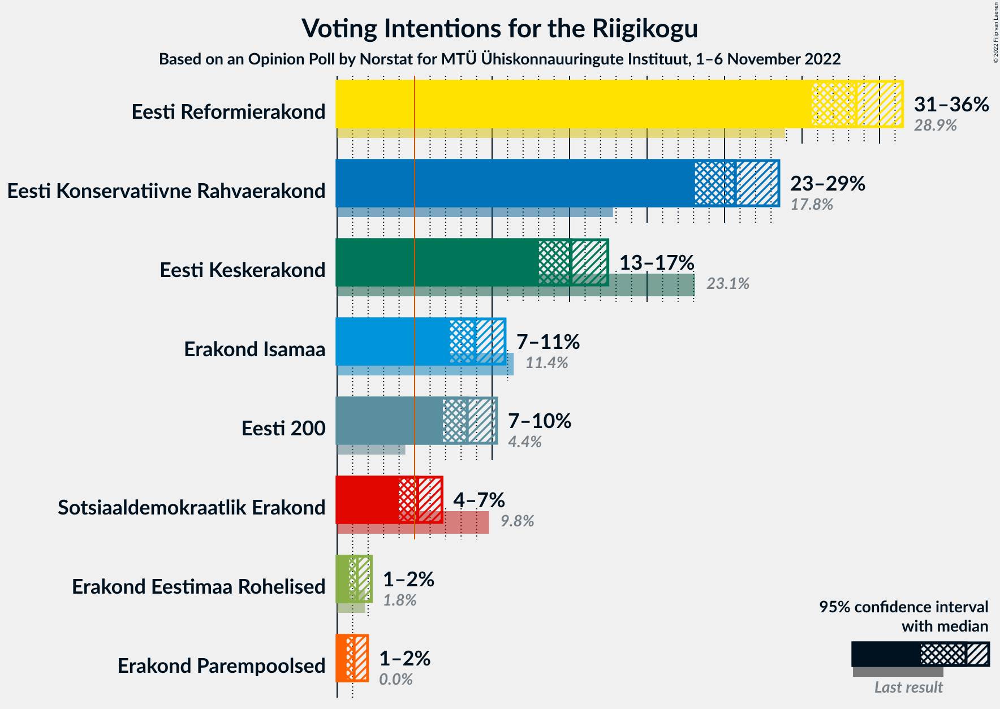

### Confidence Intervals

| Party | Last Result | Poll Result | 80% Confidence Interval | 90% Confidence Interval | 95% Confidence Interval | 99% Confidence Interval |
|:-----:|:-----------:|:-----------:|:-----------------------:|:-----------------------:|:-----------------------:|:-----------------------:|
| Eesti Reformierakond | 28.9% | 33.5% | 31.6–35.5% |31.1–36.0% |30.6–36.5% |29.8–37.4% |
| Eesti Konservatiivne Rahvaerakond | 17.8% | 25.7% | 24.0–27.5% |23.5–28.1% |23.1–28.5% |22.3–29.4% |
| Eesti Keskerakond | 23.1% | 15.1% | 13.7–16.6% |13.3–17.1% |13.0–17.5% |12.4–18.2% |
| Erakond Isamaa | 11.4% | 8.9% | 7.8–10.2% |7.5–10.5% |7.3–10.8% |6.8–11.5% |
| Eesti 200 | 4.4% | 8.4% | 7.4–9.6% |7.1–10.0% |6.8–10.3% |6.4–10.9% |
| Sotsiaaldemokraatlik Erakond | 9.8% | 5.2% | 4.4–6.2% |4.2–6.5% |4.0–6.8% |3.6–7.3% |
| Erakond Eestimaa Rohelised | 1.8% | 1.3% | 0.9–1.9% |0.8–2.1% |0.8–2.2% |0.6–2.5% |
| Erakond Parempoolsed | 0.0% | 1.1% | 0.8–1.7% |0.7–1.8% |0.6–2.0% |0.5–2.3% |

*Note:* The poll result column reflects the actual value used in the calculations. Published results may vary slightly, and in addition be rounded to fewer digits.

## Seats

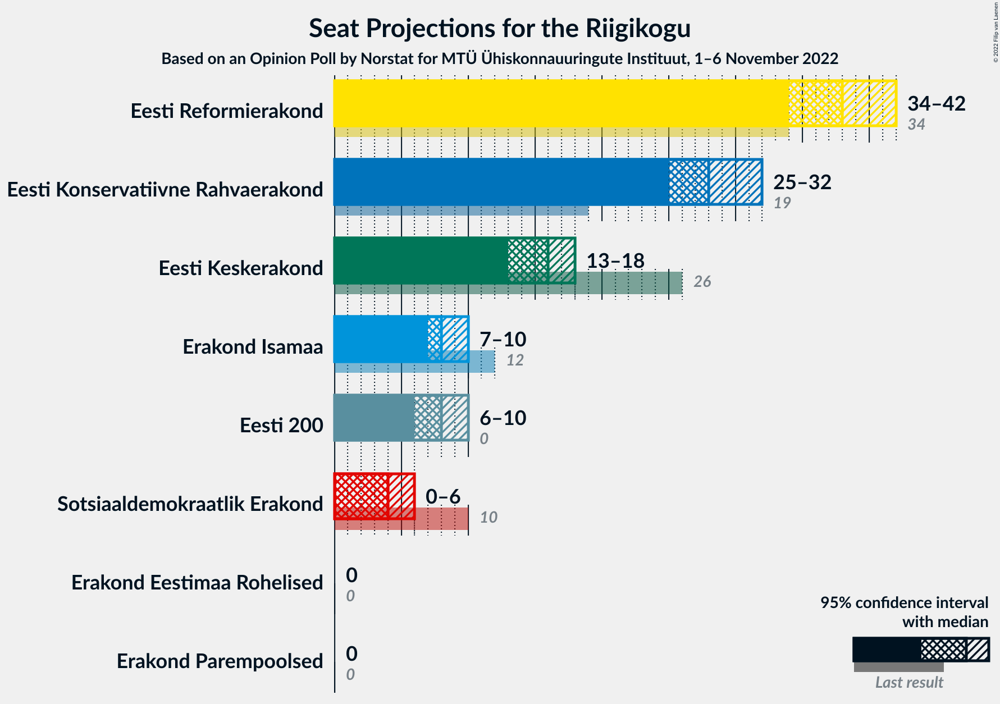

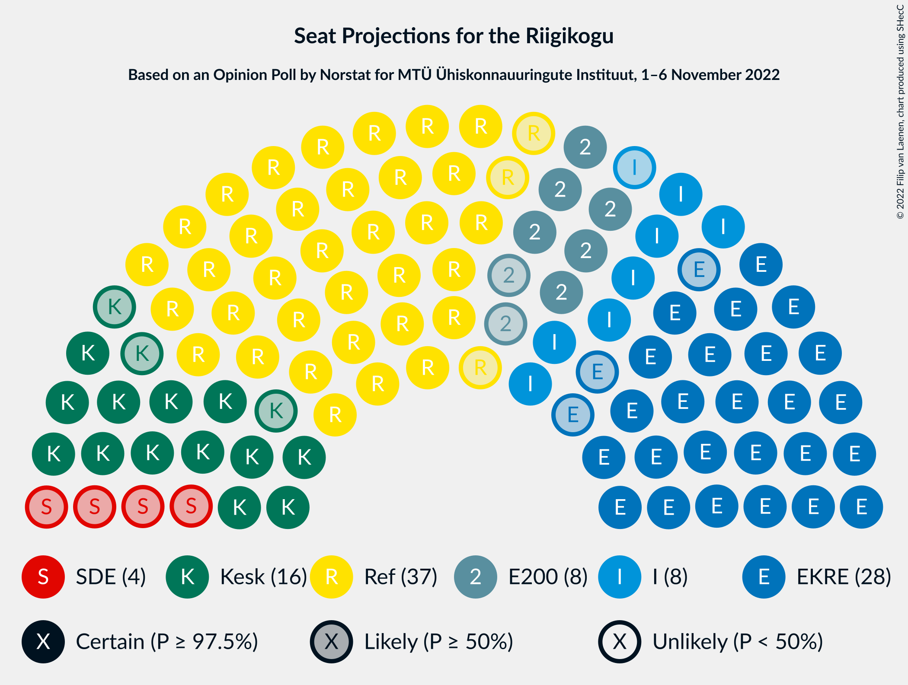

### Confidence Intervals

| Party | Last Result | Median | 80% Confidence Interval | 90% Confidence Interval | 95% Confidence Interval | 99% Confidence Interval |
|:-----:|:-----------:|:------:|:-----------------------:|:-----------------------:|:-----------------------:|:-----------------------:|
| <a href="#eesti-reformierakond">Eesti Reformierakond</a> | 34 | 38 | 36–41 |35–42 |34–42 |33–43 |
| <a href="#eesti-konservatiivne-rahvaerakond">Eesti Konservatiivne Rahvaerakond</a> | 19 | 28 | 26–31 |25–32 |25–32 |24–33 |
| <a href="#eesti-keskerakond">Eesti Keskerakond</a> | 26 | 16 | 14–17 |13–18 |13–18 |12–19 |
| <a href="#erakond-isamaa">Erakond Isamaa</a> | 12 | 8 | 7–10 |7–10 |7–10 |6–11 |
| <a href="#eesti-200">Eesti 200</a> | 0 | 8 | 7–9 |6–10 |6–10 |6–11 |
| <a href="#sotsiaaldemokraatlik-erakond">Sotsiaaldemokraatlik Erakond</a> | 10 | 4 | 0–5 |0–6 |0–6 |0–6 |
| <a href="#erakond-eestimaa-rohelised">Erakond Eestimaa Rohelised</a> | 0 | 0 | 0 |0 |0 |0 |
| <a href="#erakond-parempoolsed">Erakond Parempoolsed</a> | 0 | 0 | 0 |0 |0 |0 |

### Eesti Reformierakond

*For a full overview of the results for this party, see the [Eesti Reformierakond](party-eestireformierakond.html) page.*

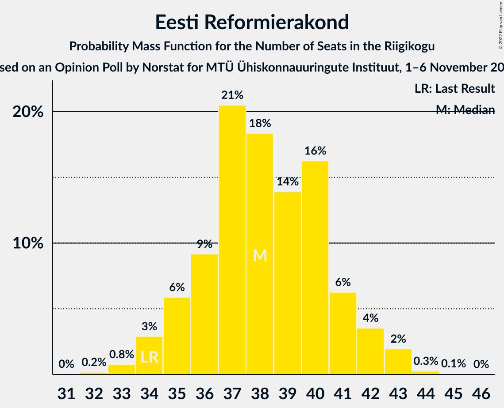

| Number of Seats | Probability | Accumulated | Special Marks |
|:---------------:|:-----------:|:-----------:|:-------------:|
| 32 | 0.2% | 100% |  |
| 33 | 0.8% | 99.8% |  |
| 34 | 3% | 99.0% | Last Result |
| 35 | 6% | 96% |  |
| 36 | 9% | 90% |  |
| 37 | 21% | 81% |  |
| 38 | 18% | 61% | Median |
| 39 | 14% | 42% |  |
| 40 | 16% | 28% |  |
| 41 | 6% | 12% |  |
| 42 | 4% | 6% |  |
| 43 | 2% | 2% |  |
| 44 | 0.3% | 0.3% |  |
| 45 | 0.1% | 0.1% |  |
| 46 | 0% | 0% |  |

### Eesti Konservatiivne Rahvaerakond

*For a full overview of the results for this party, see the [Eesti Konservatiivne Rahvaerakond](party-eestikonservatiivnerahvaerakond.html) page.*

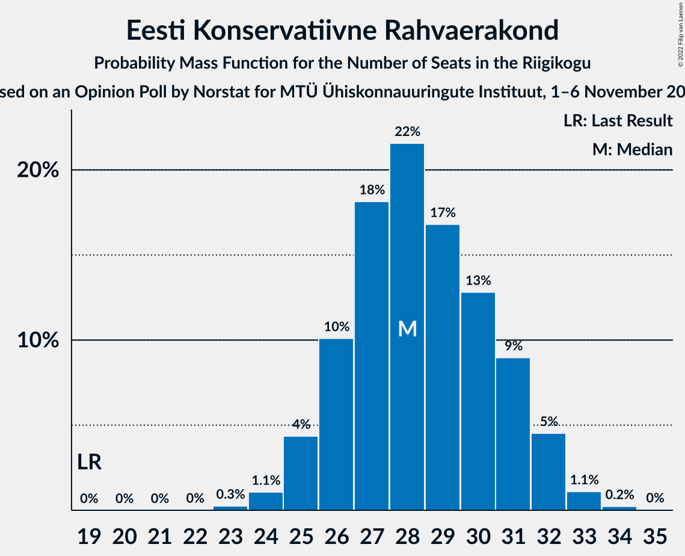

| Number of Seats | Probability | Accumulated | Special Marks |
|:---------------:|:-----------:|:-----------:|:-------------:|
| 19 | 0% | 100% | Last Result |
| 20 | 0% | 100% |  |
| 21 | 0% | 100% |  |
| 22 | 0% | 100% |  |
| 23 | 0.3% | 100% |  |
| 24 | 1.1% | 99.7% |  |
| 25 | 4% | 98.7% |  |
| 26 | 10% | 94% |  |
| 27 | 18% | 84% |  |
| 28 | 22% | 66% | Median |
| 29 | 17% | 44% |  |
| 30 | 13% | 28% |  |
| 31 | 9% | 15% |  |
| 32 | 5% | 6% |  |
| 33 | 1.1% | 1.4% |  |
| 34 | 0.2% | 0.3% |  |
| 35 | 0% | 0% |  |

### Eesti Keskerakond

*For a full overview of the results for this party, see the [Eesti Keskerakond](party-eestikeskerakond.html) page.*

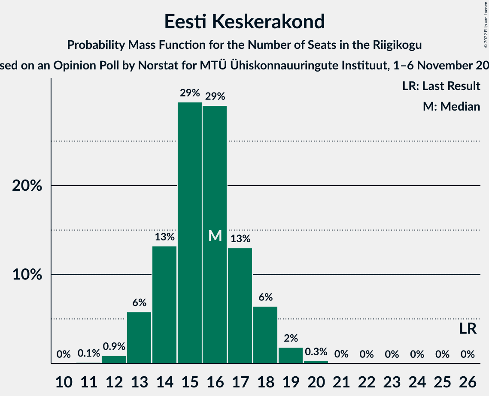

| Number of Seats | Probability | Accumulated | Special Marks |
|:---------------:|:-----------:|:-----------:|:-------------:|
| 11 | 0.1% | 100% |  |
| 12 | 0.9% | 99.9% |  |
| 13 | 6% | 99.0% |  |
| 14 | 13% | 93% |  |
| 15 | 29% | 80% |  |
| 16 | 29% | 51% | Median |
| 17 | 13% | 22% |  |
| 18 | 6% | 9% |  |
| 19 | 2% | 2% |  |
| 20 | 0.3% | 0.3% |  |
| 21 | 0% | 0% |  |
| 22 | 0% | 0% |  |
| 23 | 0% | 0% |  |
| 24 | 0% | 0% |  |
| 25 | 0% | 0% |  |
| 26 | 0% | 0% | Last Result |

### Erakond Isamaa

*For a full overview of the results for this party, see the [Erakond Isamaa](party-erakondisamaa.html) page.*

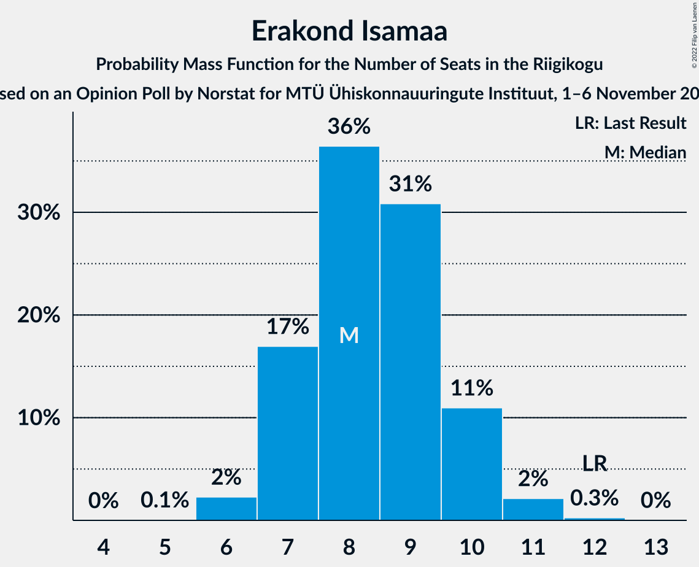

| Number of Seats | Probability | Accumulated | Special Marks |
|:---------------:|:-----------:|:-----------:|:-------------:|
| 5 | 0.1% | 100% |  |
| 6 | 2% | 99.9% |  |
| 7 | 17% | 98% |  |
| 8 | 36% | 81% | Median |
| 9 | 31% | 44% |  |
| 10 | 11% | 13% |  |
| 11 | 2% | 2% |  |
| 12 | 0.3% | 0.3% | Last Result |
| 13 | 0% | 0% |  |

### Eesti 200

*For a full overview of the results for this party, see the [Eesti 200](party-eesti200.html) page.*

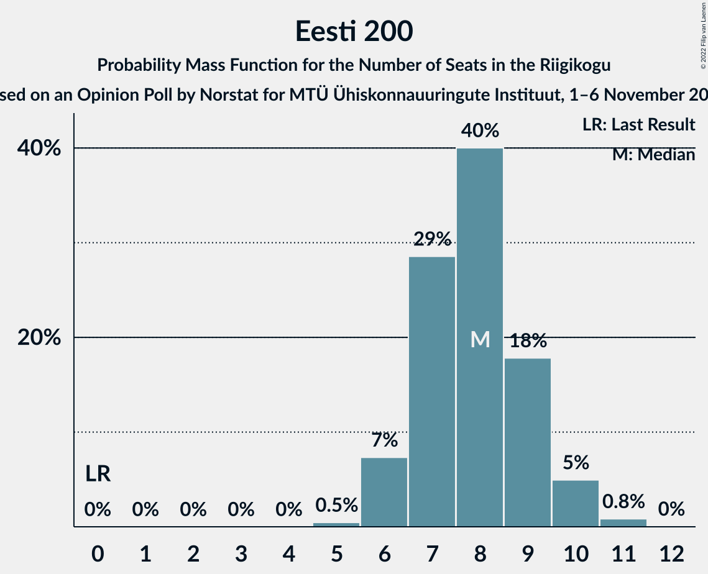

| Number of Seats | Probability | Accumulated | Special Marks |
|:---------------:|:-----------:|:-----------:|:-------------:|
| 0 | 0% | 100% | Last Result |
| 1 | 0% | 100% |  |
| 2 | 0% | 100% |  |
| 3 | 0% | 100% |  |
| 4 | 0% | 100% |  |
| 5 | 0.5% | 100% |  |
| 6 | 7% | 99.5% |  |
| 7 | 29% | 92% |  |
| 8 | 40% | 64% | Median |
| 9 | 18% | 24% |  |
| 10 | 5% | 6% |  |
| 11 | 0.8% | 0.9% |  |
| 12 | 0% | 0% |  |

### Sotsiaaldemokraatlik Erakond

*For a full overview of the results for this party, see the [Sotsiaaldemokraatlik Erakond](party-sotsiaaldemokraatlikerakond.html) page.*

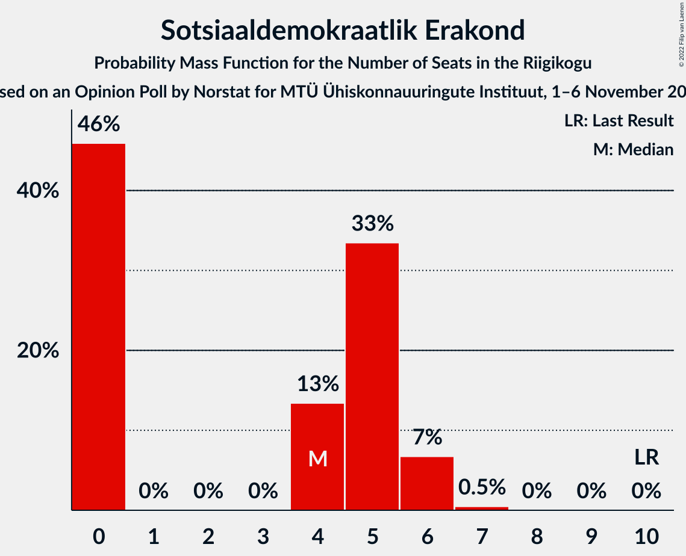

| Number of Seats | Probability | Accumulated | Special Marks |
|:---------------:|:-----------:|:-----------:|:-------------:|
| 0 | 46% | 100% |  |
| 1 | 0% | 54% |  |
| 2 | 0% | 54% |  |
| 3 | 0% | 54% |  |
| 4 | 13% | 54% | Median |
| 5 | 33% | 41% |  |
| 6 | 7% | 7% |  |
| 7 | 0.5% | 0.5% |  |
| 8 | 0% | 0% |  |
| 9 | 0% | 0% |  |
| 10 | 0% | 0% | Last Result |

### Erakond Eestimaa Rohelised

*For a full overview of the results for this party, see the [Erakond Eestimaa Rohelised](party-erakondeestimaarohelised.html) page.*

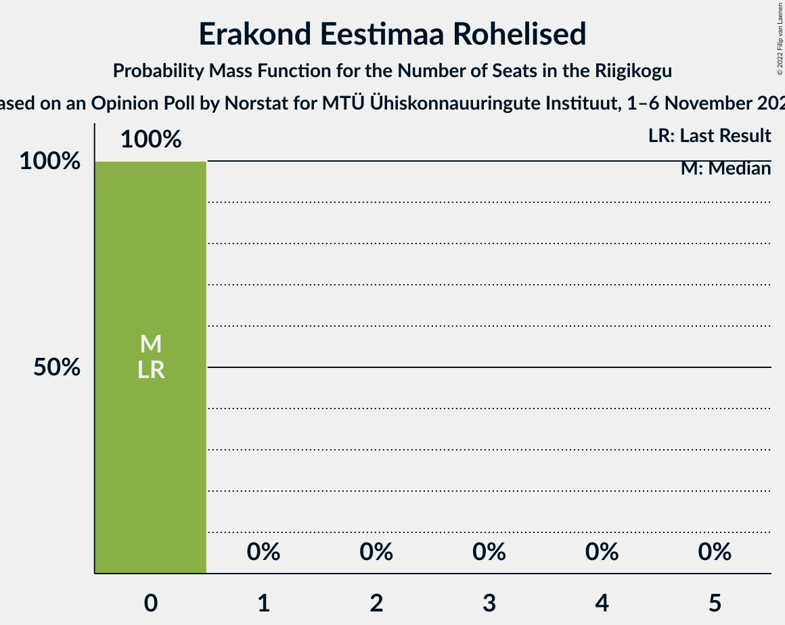

| Number of Seats | Probability | Accumulated | Special Marks |
|:---------------:|:-----------:|:-----------:|:-------------:|
| 0 | 100% | 100% | Last Result, Median |

### Erakond Parempoolsed

*For a full overview of the results for this party, see the [Erakond Parempoolsed](party-erakondparempoolsed.html) page.*

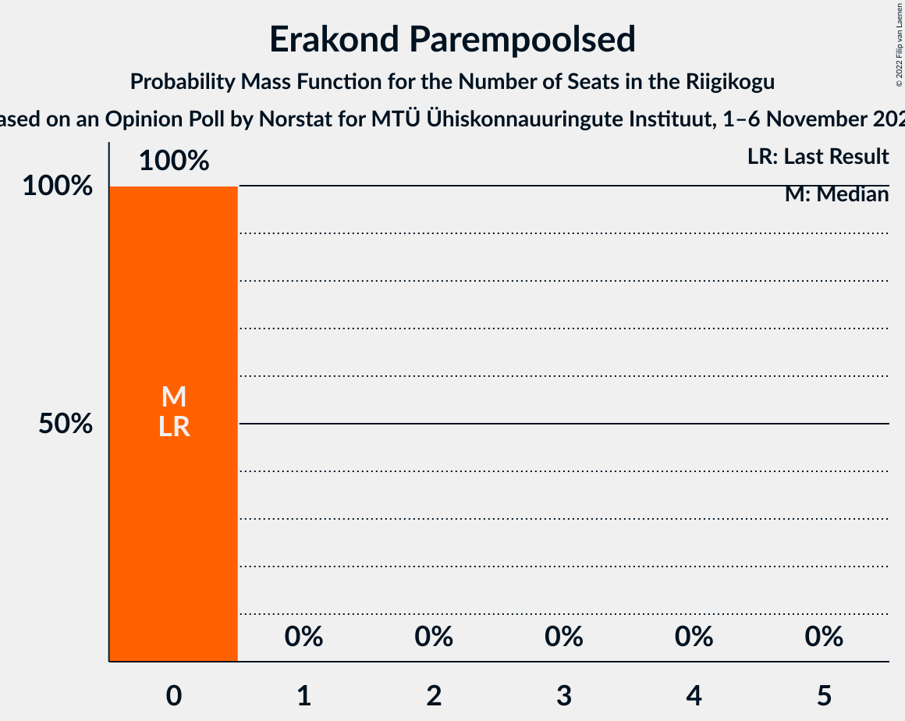

| Number of Seats | Probability | Accumulated | Special Marks |
|:---------------:|:-----------:|:-----------:|:-------------:|
| 0 | 100% | 100% | Last Result, Median |

## Coalitions

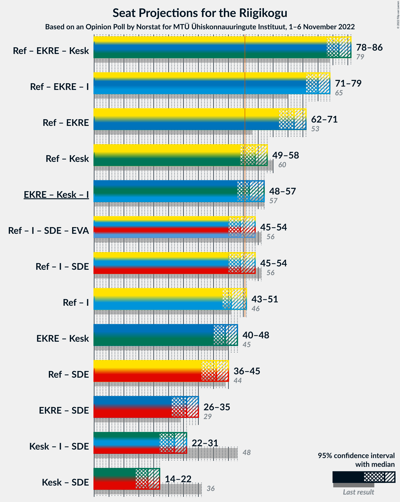

### Confidence Intervals

| Coalition | Last Result | Median | Majority? | 80% Confidence Interval | 90% Confidence Interval | 95% Confidence Interval | 99% Confidence Interval |
|:---------:|:-----------:|:------:|:---------:|:-----------------------:|:-----------------------:|:-----------------------:|:-----------------------:|
| Eesti Reformierakond – Eesti Konservatiivne Rahvaerakond – Eesti Keskerakond | 79 | 82 | 100% | 79–85 | 78–86 | 78–86 | 77–87 |
| Eesti Reformierakond – Eesti Konservatiivne Rahvaerakond – Erakond Isamaa | 65 | 75 | 100% | 72–78 | 71–79 | 71–79 | 69–80 |
| Eesti Reformierakond – Eesti Konservatiivne Rahvaerakond | 53 | 67 | 100% | 63–70 | 63–70 | 62–71 | 60–72 |
| Eesti Reformierakond – Eesti Keskerakond | 60 | 54 | 92% | 51–57 | 50–58 | 49–58 | 48–59 |
| Eesti Konservatiivne Rahvaerakond – Eesti Keskerakond – Erakond Isamaa | 57 | 52 | 76% | 49–56 | 48–56 | 48–57 | 47–58 |
| Eesti Reformierakond – Erakond Isamaa – Sotsiaaldemokraatlik Erakond | 56 | 49 | 35% | 46–52 | 45–53 | 45–54 | 44–55 |
| Eesti Reformierakond – Erakond Isamaa | 46 | 46 | 5% | 44–49 | 43–51 | 43–51 | 41–52 |
| Eesti Konservatiivne Rahvaerakond – Eesti Keskerakond | 45 | 44 | 0.1% | 41–47 | 41–48 | 40–48 | 39–49 |
| Eesti Reformierakond – Sotsiaaldemokraatlik Erakond | 44 | 41 | 0% | 37–44 | 37–45 | 36–45 | 35–46 |
| Eesti Konservatiivne Rahvaerakond – Sotsiaaldemokraatlik Erakond | 29 | 31 | 0% | 28–34 | 27–35 | 26–35 | 25–37 |
| Eesti Keskerakond – Erakond Isamaa – Sotsiaaldemokraatlik Erakond | 48 | 27 | 0% | 23–30 | 23–30 | 22–31 | 21–32 |
| Eesti Keskerakond – Sotsiaaldemokraatlik Erakond | 36 | 18 | 0% | 15–21 | 14–22 | 14–22 | 13–23 |

### Eesti Reformierakond – Eesti Konservatiivne Rahvaerakond – Eesti Keskerakond

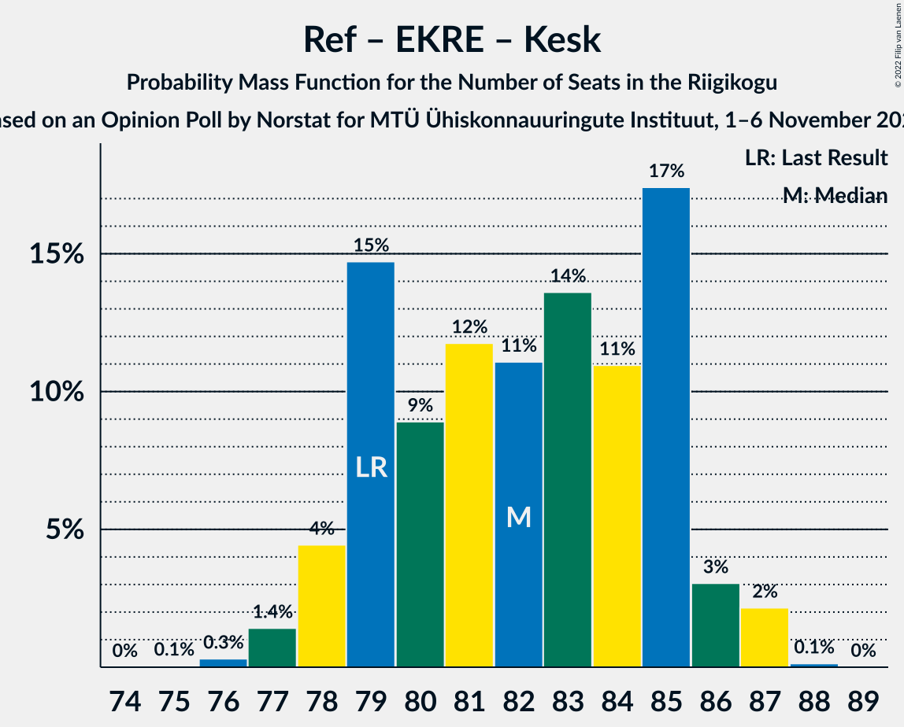

| Number of Seats | Probability | Accumulated | Special Marks |
|:---------------:|:-----------:|:-----------:|:-------------:|
| 75 | 0.1% | 100% |  |
| 76 | 0.3% | 99.9% |  |
| 77 | 1.4% | 99.6% |  |
| 78 | 4% | 98% |  |
| 79 | 15% | 94% | Last Result |
| 80 | 9% | 79% |  |
| 81 | 12% | 70% |  |
| 82 | 11% | 58% | Median |
| 83 | 14% | 47% |  |
| 84 | 11% | 34% |  |
| 85 | 17% | 23% |  |
| 86 | 3% | 5% |  |
| 87 | 2% | 2% |  |
| 88 | 0.1% | 0.1% |  |
| 89 | 0% | 0% |  |

### Eesti Reformierakond – Eesti Konservatiivne Rahvaerakond – Erakond Isamaa

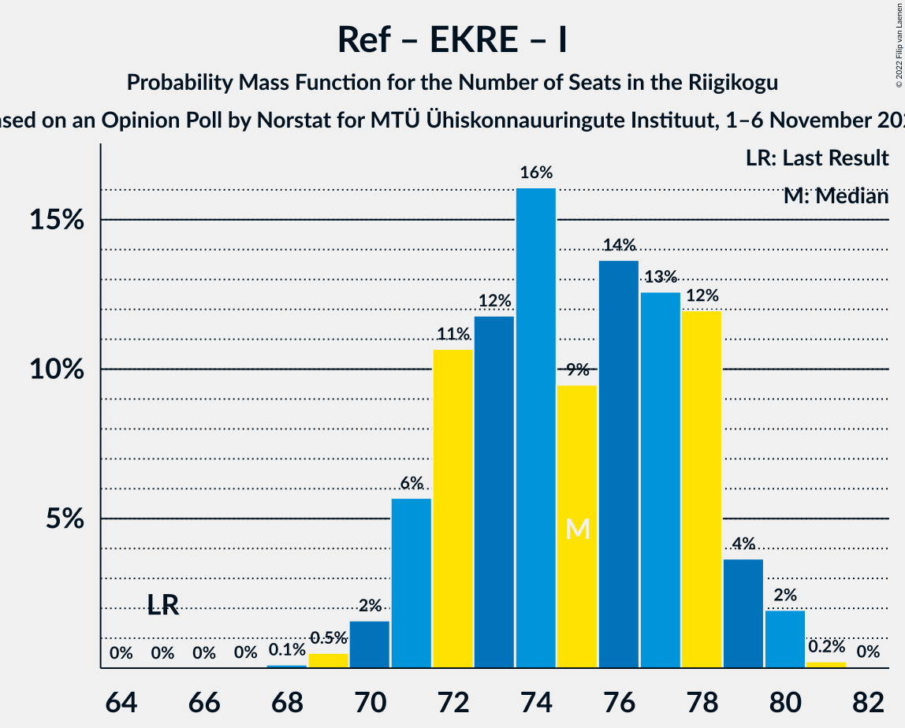

| Number of Seats | Probability | Accumulated | Special Marks |
|:---------------:|:-----------:|:-----------:|:-------------:|
| 65 | 0% | 100% | Last Result |
| 66 | 0% | 100% |  |
| 67 | 0% | 100% |  |
| 68 | 0.1% | 100% |  |
| 69 | 0.5% | 99.9% |  |
| 70 | 2% | 99.4% |  |
| 71 | 6% | 98% |  |
| 72 | 11% | 92% |  |
| 73 | 12% | 81% |  |
| 74 | 16% | 70% | Median |
| 75 | 9% | 54% |  |
| 76 | 14% | 44% |  |
| 77 | 13% | 30% |  |
| 78 | 12% | 18% |  |
| 79 | 4% | 6% |  |
| 80 | 2% | 2% |  |
| 81 | 0.2% | 0.3% |  |
| 82 | 0% | 0% |  |

### Eesti Reformierakond – Eesti Konservatiivne Rahvaerakond

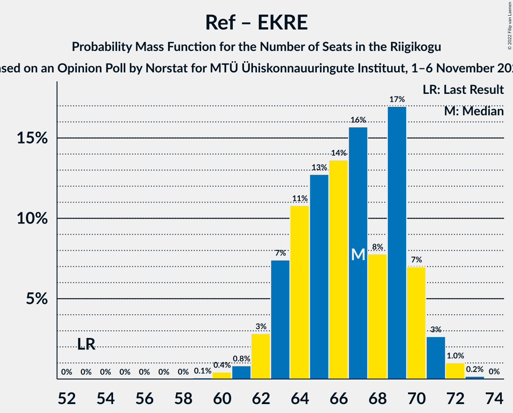

| Number of Seats | Probability | Accumulated | Special Marks |
|:---------------:|:-----------:|:-----------:|:-------------:|
| 53 | 0% | 100% | Last Result |
| 54 | 0% | 100% |  |
| 55 | 0% | 100% |  |
| 56 | 0% | 100% |  |
| 57 | 0% | 100% |  |
| 58 | 0% | 100% |  |
| 59 | 0.1% | 100% |  |
| 60 | 0.4% | 99.9% |  |
| 61 | 0.8% | 99.5% |  |
| 62 | 3% | 98.7% |  |
| 63 | 7% | 96% |  |
| 64 | 11% | 88% |  |
| 65 | 13% | 78% |  |
| 66 | 14% | 65% | Median |
| 67 | 16% | 51% |  |
| 68 | 8% | 36% |  |
| 69 | 17% | 28% |  |
| 70 | 7% | 11% |  |
| 71 | 3% | 4% |  |
| 72 | 1.0% | 1.2% |  |
| 73 | 0.2% | 0.2% |  |
| 74 | 0% | 0% |  |

### Eesti Reformierakond – Eesti Keskerakond

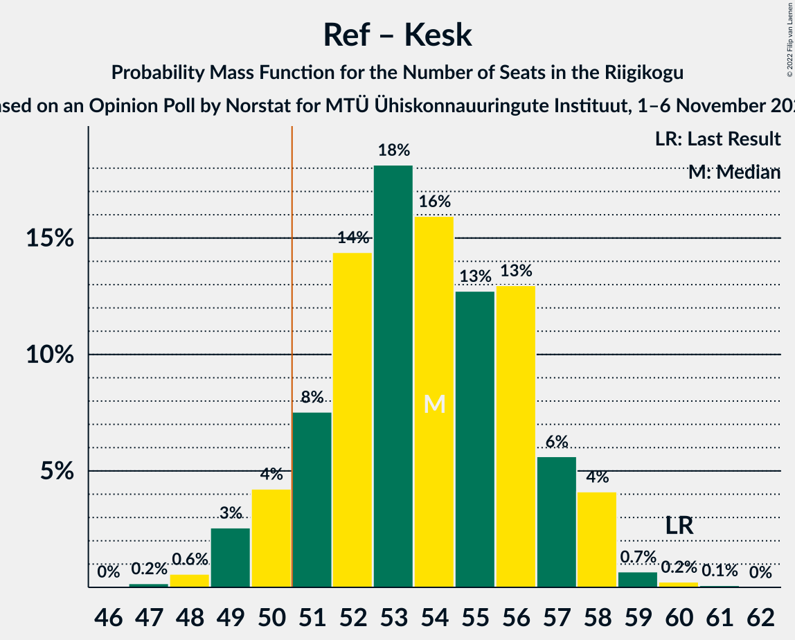

| Number of Seats | Probability | Accumulated | Special Marks |
|:---------------:|:-----------:|:-----------:|:-------------:|
| 47 | 0.2% | 100% |  |
| 48 | 0.6% | 99.8% |  |
| 49 | 3% | 99.2% |  |
| 50 | 4% | 97% |  |
| 51 | 8% | 92% | Majority |
| 52 | 14% | 85% |  |
| 53 | 18% | 71% |  |
| 54 | 16% | 52% | Median |
| 55 | 13% | 36% |  |
| 56 | 13% | 24% |  |
| 57 | 6% | 11% |  |
| 58 | 4% | 5% |  |
| 59 | 0.7% | 1.0% |  |
| 60 | 0.2% | 0.3% | Last Result |
| 61 | 0.1% | 0.1% |  |
| 62 | 0% | 0% |  |

### Eesti Konservatiivne Rahvaerakond – Eesti Keskerakond – Erakond Isamaa

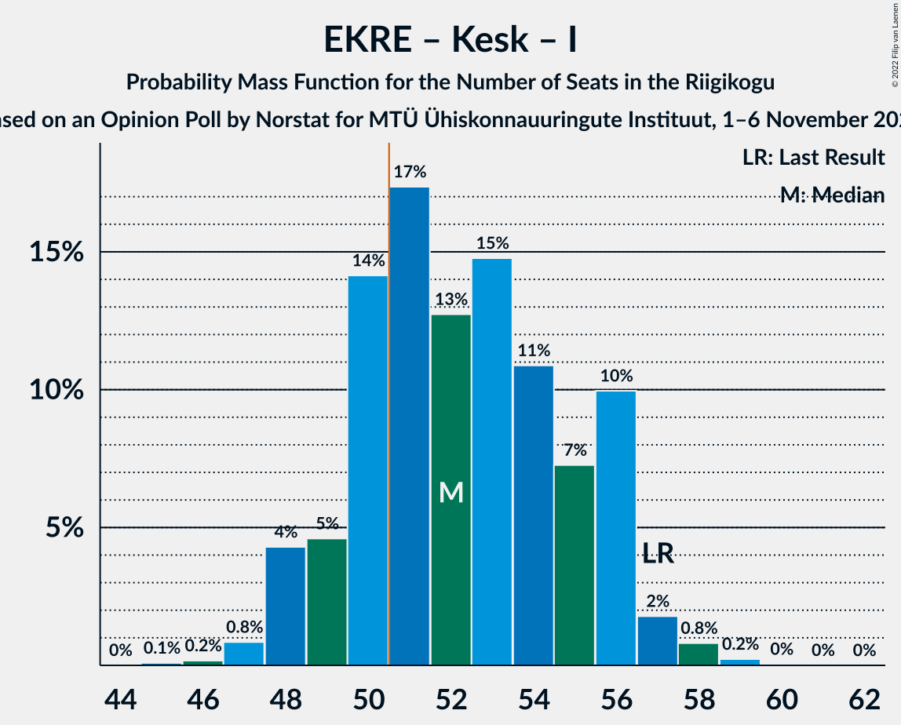

| Number of Seats | Probability | Accumulated | Special Marks |
|:---------------:|:-----------:|:-----------:|:-------------:|
| 45 | 0.1% | 100% |  |
| 46 | 0.2% | 99.9% |  |
| 47 | 0.8% | 99.7% |  |
| 48 | 4% | 98.9% |  |
| 49 | 5% | 95% |  |
| 50 | 14% | 90% |  |
| 51 | 17% | 76% | Majority |
| 52 | 13% | 58% | Median |
| 53 | 15% | 46% |  |
| 54 | 11% | 31% |  |
| 55 | 7% | 20% |  |
| 56 | 10% | 13% |  |
| 57 | 2% | 3% | Last Result |
| 58 | 0.8% | 1.1% |  |
| 59 | 0.2% | 0.3% |  |
| 60 | 0% | 0.1% |  |
| 61 | 0% | 0% |  |

### Eesti Reformierakond – Erakond Isamaa – Sotsiaaldemokraatlik Erakond

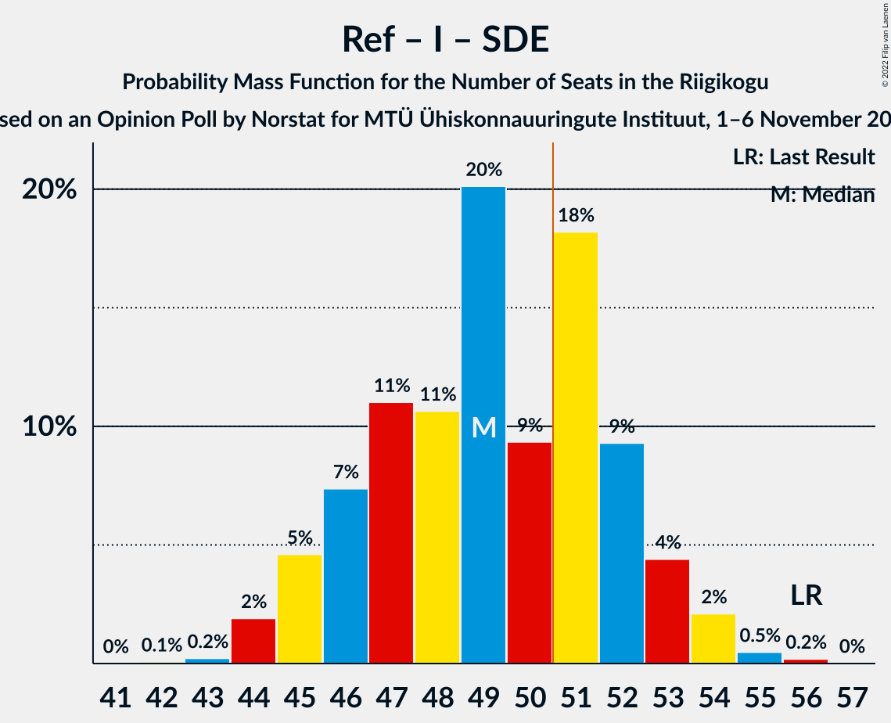

| Number of Seats | Probability | Accumulated | Special Marks |
|:---------------:|:-----------:|:-----------:|:-------------:|
| 42 | 0.1% | 100% |  |
| 43 | 0.2% | 99.9% |  |
| 44 | 2% | 99.7% |  |
| 45 | 5% | 98% |  |
| 46 | 7% | 93% |  |
| 47 | 11% | 86% |  |
| 48 | 11% | 75% |  |
| 49 | 20% | 64% |  |
| 50 | 9% | 44% | Median |
| 51 | 18% | 35% | Majority |
| 52 | 9% | 16% |  |
| 53 | 4% | 7% |  |
| 54 | 2% | 3% |  |
| 55 | 0.5% | 0.7% |  |
| 56 | 0.2% | 0.2% | Last Result |
| 57 | 0% | 0% |  |

### Eesti Reformierakond – Erakond Isamaa

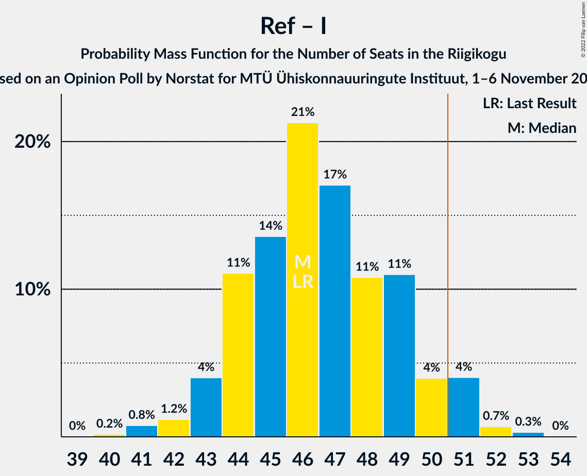

| Number of Seats | Probability | Accumulated | Special Marks |
|:---------------:|:-----------:|:-----------:|:-------------:|
| 40 | 0.2% | 100% |  |
| 41 | 0.8% | 99.8% |  |
| 42 | 1.2% | 99.0% |  |
| 43 | 4% | 98% |  |
| 44 | 11% | 94% |  |
| 45 | 14% | 83% |  |
| 46 | 21% | 69% | Last Result, Median |
| 47 | 17% | 48% |  |
| 48 | 11% | 31% |  |
| 49 | 11% | 20% |  |
| 50 | 4% | 9% |  |
| 51 | 4% | 5% | Majority |
| 52 | 0.7% | 1.1% |  |
| 53 | 0.3% | 0.3% |  |
| 54 | 0% | 0% |  |

### Eesti Konservatiivne Rahvaerakond – Eesti Keskerakond

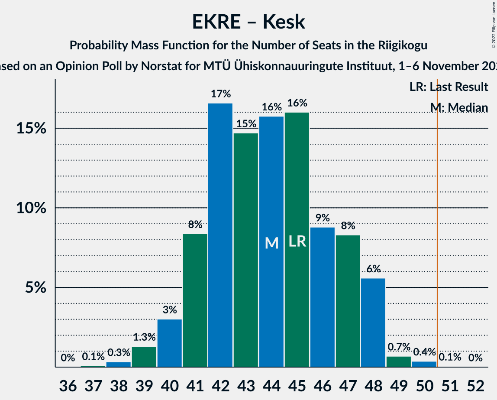

| Number of Seats | Probability | Accumulated | Special Marks |
|:---------------:|:-----------:|:-----------:|:-------------:|
| 37 | 0.1% | 100% |  |
| 38 | 0.3% | 99.9% |  |
| 39 | 1.3% | 99.6% |  |
| 40 | 3% | 98% |  |
| 41 | 8% | 95% |  |
| 42 | 17% | 87% |  |
| 43 | 15% | 70% |  |
| 44 | 16% | 56% | Median |
| 45 | 16% | 40% | Last Result |
| 46 | 9% | 24% |  |
| 47 | 8% | 15% |  |
| 48 | 6% | 7% |  |
| 49 | 0.7% | 1.1% |  |
| 50 | 0.4% | 0.4% |  |
| 51 | 0.1% | 0.1% | Majority |
| 52 | 0% | 0% |  |

### Eesti Reformierakond – Sotsiaaldemokraatlik Erakond

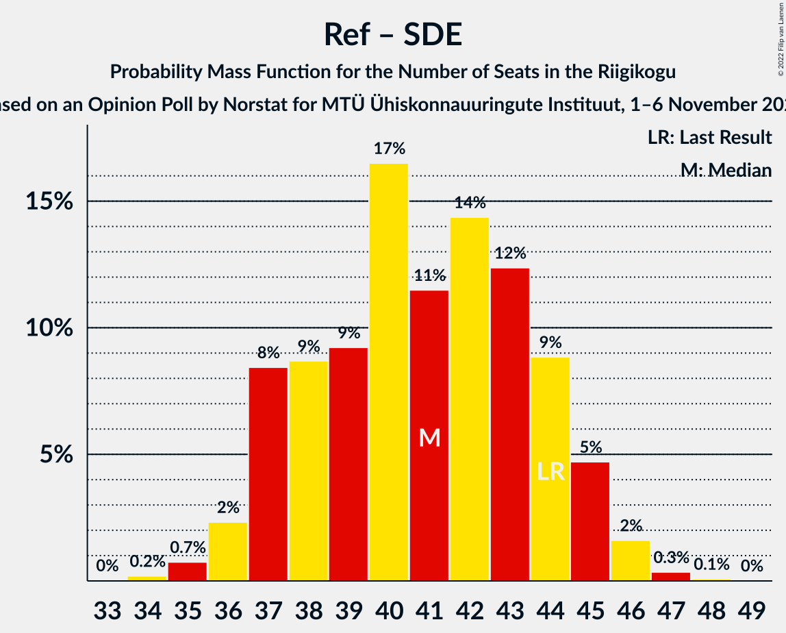

| Number of Seats | Probability | Accumulated | Special Marks |
|:---------------:|:-----------:|:-----------:|:-------------:|
| 34 | 0.2% | 100% |  |
| 35 | 0.7% | 99.8% |  |
| 36 | 2% | 99.0% |  |
| 37 | 8% | 97% |  |
| 38 | 9% | 88% |  |
| 39 | 9% | 80% |  |
| 40 | 17% | 70% |  |
| 41 | 11% | 54% |  |
| 42 | 14% | 42% | Median |
| 43 | 12% | 28% |  |
| 44 | 9% | 16% | Last Result |
| 45 | 5% | 7% |  |
| 46 | 2% | 2% |  |
| 47 | 0.3% | 0.5% |  |
| 48 | 0.1% | 0.1% |  |
| 49 | 0% | 0% |  |

### Eesti Konservatiivne Rahvaerakond – Sotsiaaldemokraatlik Erakond

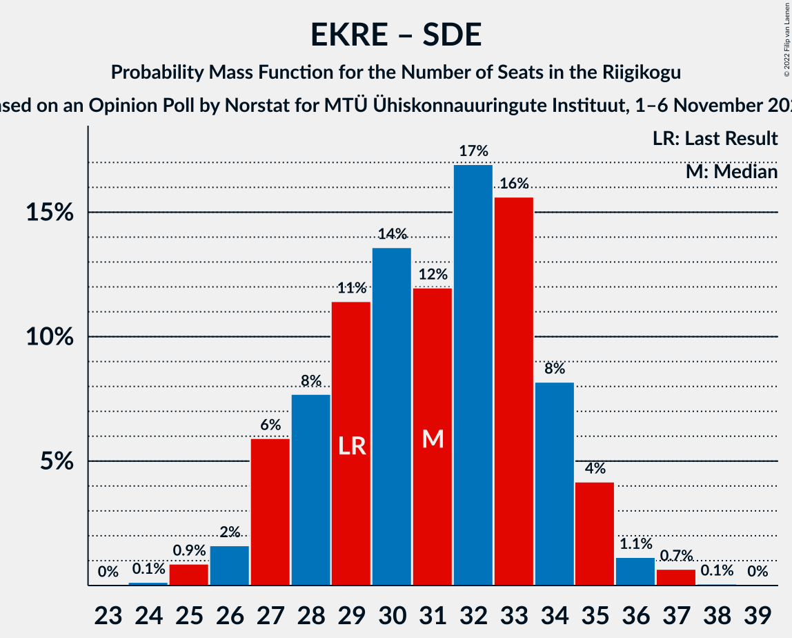

| Number of Seats | Probability | Accumulated | Special Marks |
|:---------------:|:-----------:|:-----------:|:-------------:|
| 24 | 0.1% | 100% |  |
| 25 | 0.9% | 99.8% |  |
| 26 | 2% | 99.0% |  |
| 27 | 6% | 97% |  |
| 28 | 8% | 91% |  |
| 29 | 11% | 84% | Last Result |
| 30 | 14% | 72% |  |
| 31 | 12% | 59% |  |
| 32 | 17% | 47% | Median |
| 33 | 16% | 30% |  |
| 34 | 8% | 14% |  |
| 35 | 4% | 6% |  |
| 36 | 1.1% | 2% |  |
| 37 | 0.7% | 0.8% |  |
| 38 | 0.1% | 0.1% |  |
| 39 | 0% | 0% |  |

### Eesti Keskerakond – Erakond Isamaa – Sotsiaaldemokraatlik Erakond

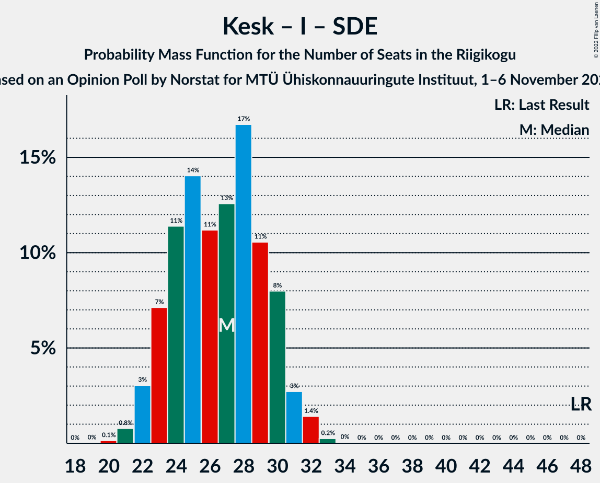

| Number of Seats | Probability | Accumulated | Special Marks |
|:---------------:|:-----------:|:-----------:|:-------------:|
| 20 | 0.1% | 100% |  |
| 21 | 0.8% | 99.8% |  |
| 22 | 3% | 99.1% |  |
| 23 | 7% | 96% |  |
| 24 | 11% | 89% |  |
| 25 | 14% | 77% |  |
| 26 | 11% | 63% |  |
| 27 | 13% | 52% |  |
| 28 | 17% | 40% | Median |
| 29 | 11% | 23% |  |
| 30 | 8% | 12% |  |
| 31 | 3% | 4% |  |
| 32 | 1.4% | 2% |  |
| 33 | 0.2% | 0.3% |  |
| 34 | 0% | 0.1% |  |
| 35 | 0% | 0% |  |
| 36 | 0% | 0% |  |
| 37 | 0% | 0% |  |
| 38 | 0% | 0% |  |
| 39 | 0% | 0% |  |
| 40 | 0% | 0% |  |
| 41 | 0% | 0% |  |
| 42 | 0% | 0% |  |
| 43 | 0% | 0% |  |
| 44 | 0% | 0% |  |
| 45 | 0% | 0% |  |
| 46 | 0% | 0% |  |
| 47 | 0% | 0% |  |
| 48 | 0% | 0% | Last Result |

### Eesti Keskerakond – Sotsiaaldemokraatlik Erakond

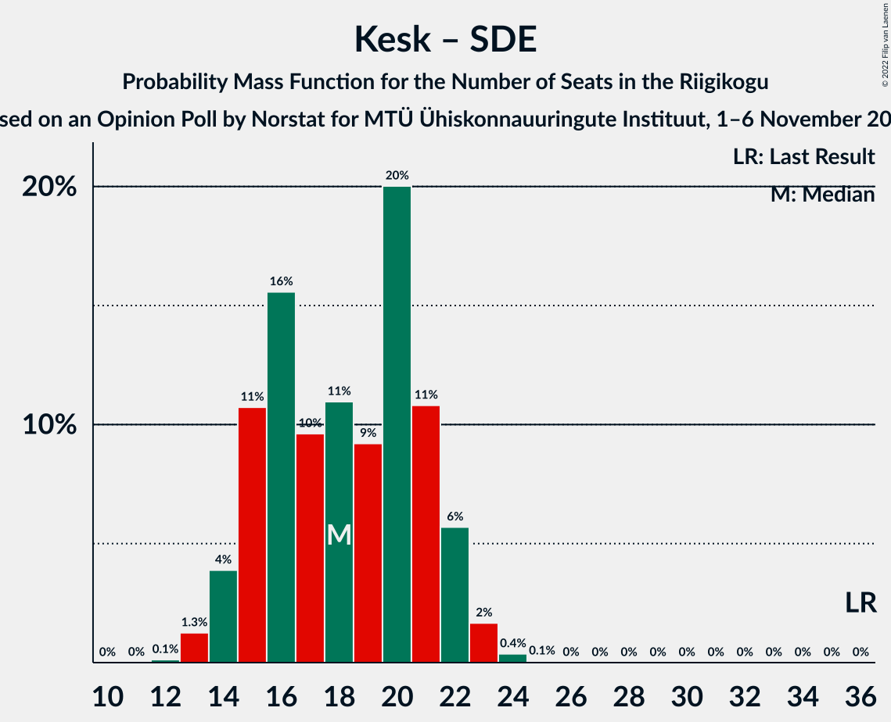

| Number of Seats | Probability | Accumulated | Special Marks |
|:---------------:|:-----------:|:-----------:|:-------------:|
| 12 | 0.1% | 100% |  |
| 13 | 1.3% | 99.9% |  |
| 14 | 4% | 98.6% |  |
| 15 | 11% | 95% |  |
| 16 | 16% | 84% |  |
| 17 | 10% | 68% |  |
| 18 | 11% | 59% |  |
| 19 | 9% | 48% |  |
| 20 | 20% | 39% | Median |
| 21 | 11% | 19% |  |
| 22 | 6% | 8% |  |
| 23 | 2% | 2% |  |
| 24 | 0.4% | 0.4% |  |
| 25 | 0.1% | 0.1% |  |
| 26 | 0% | 0% |  |
| 27 | 0% | 0% |  |
| 28 | 0% | 0% |  |
| 29 | 0% | 0% |  |
| 30 | 0% | 0% |  |
| 31 | 0% | 0% |  |
| 32 | 0% | 0% |  |
| 33 | 0% | 0% |  |
| 34 | 0% | 0% |  |
| 35 | 0% | 0% |  |
| 36 | 0% | 0% | Last Result |

## Technical Information

### Opinion Poll

+ **Polling firm:** Norstat
+ **Commissioner(s):** MTÜ Ühiskonnauuringute Instituut
+ **Fieldwork period:** 1–6 November 2022

### Calculations

+ **Sample size:** 1000
+ **Simulations done:** 1,048,576
+ **Error estimate:** 1.22%

