# Opinion Poll by Turu-uuringute AS, 9 November 2022

<a href="#voting-intentions">Voting Intentions</a> | <a href="#seats">Seats</a> | <a href="#coalitions">Coalitions</a> | <a href="#technical-information">Technical Information</a>

## Voting Intentions

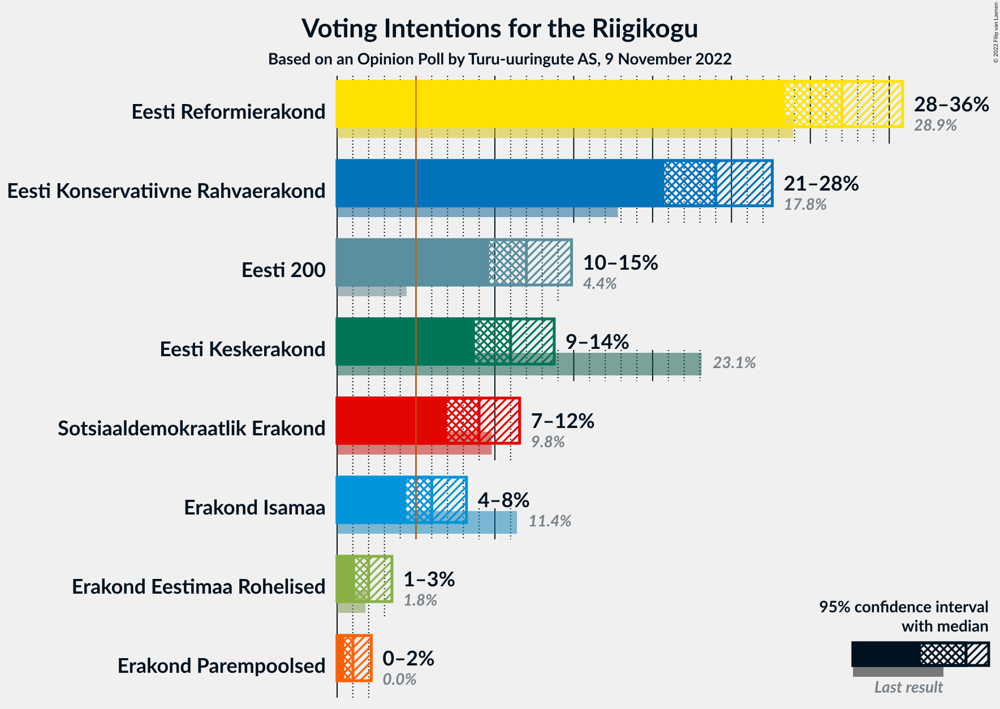

### Confidence Intervals

| Party | Last Result | Poll Result | 80% Confidence Interval | 90% Confidence Interval | 95% Confidence Interval | 99% Confidence Interval |
|:-----:|:-----------:|:-----------:|:-----------------------:|:-----------------------:|:-----------------------:|:-----------------------:|
| Eesti Reformierakond | 28.9% | 32.0% | 29.6–34.5% |29.0–35.2% |28.4–35.8% |27.3–37.1% |
| Eesti Konservatiivne Rahvaerakond | 17.8% | 24.0% | 21.9–26.3% |21.3–27.0% |20.7–27.6% |19.8–28.7% |
| Eesti 200 | 4.4% | 12.0% | 10.4–13.9% |10.0–14.4% |9.6–14.9% |8.9–15.8% |
| Eesti Keskerakond | 23.1% | 11.0% | 9.5–12.8% |9.1–13.3% |8.7–13.8% |8.1–14.7% |
| Sotsiaaldemokraatlik Erakond | 9.8% | 9.0% | 7.7–10.7% |7.3–11.1% |7.0–11.6% |6.4–12.4% |
| Erakond Isamaa | 11.4% | 6.0% | 4.9–7.4% |4.6–7.8% |4.4–8.2% |3.9–8.9% |
| Erakond Eestimaa Rohelised | 1.8% | 2.0% | 1.4–3.0% |1.3–3.2% |1.1–3.5% |0.9–4.0% |
| Erakond Parempoolsed | 0.0% | 1.0% | 0.6–1.8% |0.5–2.0% |0.5–2.2% |0.3–2.6% |

*Note:* The poll result column reflects the actual value used in the calculations. Published results may vary slightly, and in addition be rounded to fewer digits.

## Seats

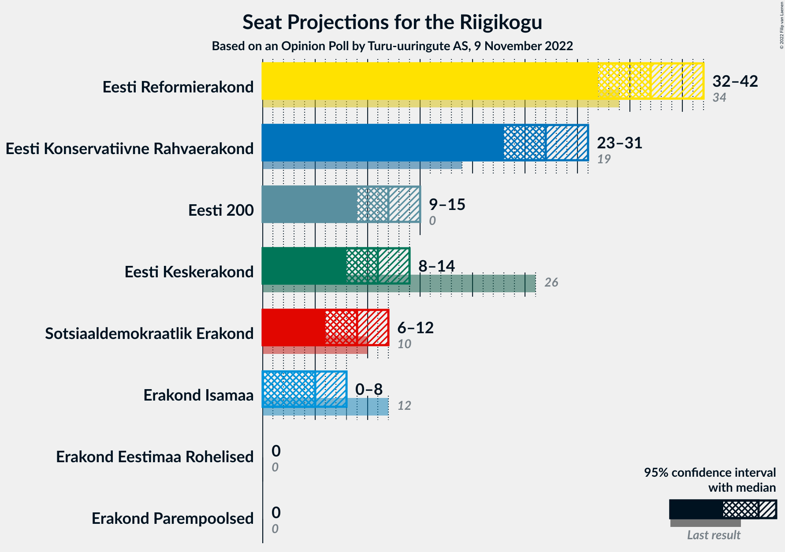

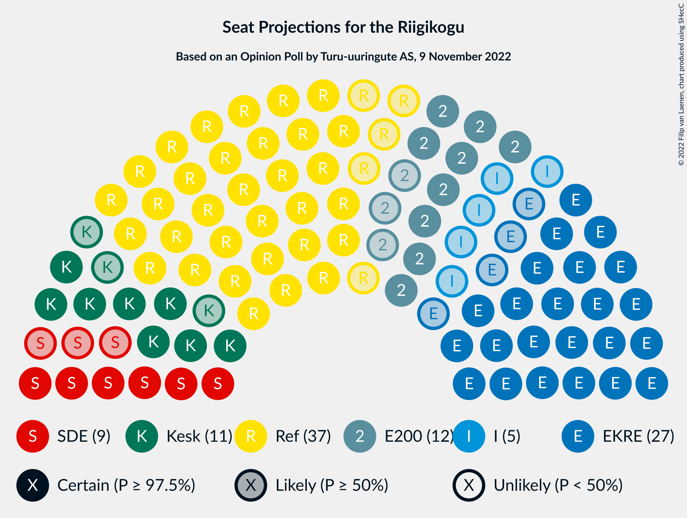

### Confidence Intervals

| Party | Last Result | Median | 80% Confidence Interval | 90% Confidence Interval | 95% Confidence Interval | 99% Confidence Interval |
|:-----:|:-----------:|:------:|:-----------------------:|:-----------------------:|:-----------------------:|:-----------------------:|
| <a href="#eesti-reformierakond">Eesti Reformierakond</a> | 34 | 37 | 34–40 |33–41 |32–42 |31–44 |
| <a href="#eesti-konservatiivne-rahvaerakond">Eesti Konservatiivne Rahvaerakond</a> | 19 | 27 | 24–30 |23–31 |23–31 |21–33 |
| <a href="#eesti-200">Eesti 200</a> | 0 | 12 | 10–14 |10–15 |9–15 |9–17 |
| <a href="#eesti-keskerakond">Eesti Keskerakond</a> | 26 | 11 | 9–13 |9–14 |8–14 |8–15 |
| <a href="#sotsiaaldemokraatlik-erakond">Sotsiaaldemokraatlik Erakond</a> | 10 | 9 | 7–11 |7–11 |6–12 |6–13 |
| <a href="#erakond-isamaa">Erakond Isamaa</a> | 12 | 5 | 0–7 |0–7 |0–8 |0–9 |
| <a href="#erakond-eestimaa-rohelised">Erakond Eestimaa Rohelised</a> | 0 | 0 | 0 |0 |0 |0 |
| <a href="#erakond-parempoolsed">Erakond Parempoolsed</a> | 0 | 0 | 0 |0 |0 |0 |

### Eesti Reformierakond

*For a full overview of the results for this party, see the [Eesti Reformierakond](party-eestireformierakond.html) page.*

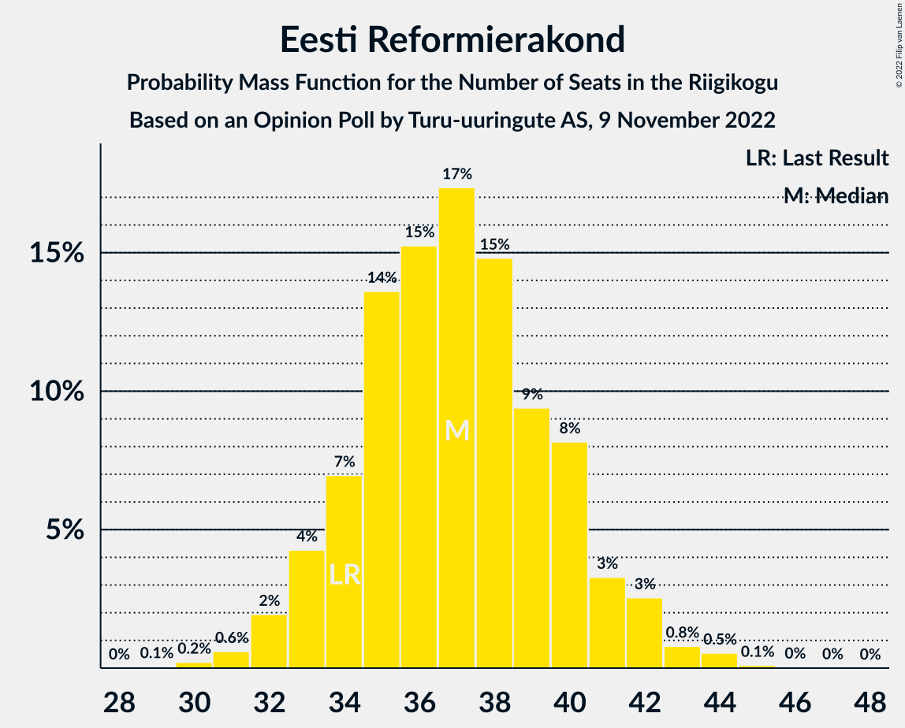

| Number of Seats | Probability | Accumulated | Special Marks |
|:---------------:|:-----------:|:-----------:|:-------------:|
| 29 | 0.1% | 100% |  |
| 30 | 0.2% | 99.9% |  |
| 31 | 0.6% | 99.7% |  |
| 32 | 2% | 99.1% |  |
| 33 | 4% | 97% |  |
| 34 | 7% | 93% | Last Result |
| 35 | 14% | 86% |  |
| 36 | 15% | 72% |  |
| 37 | 17% | 57% | Median |
| 38 | 15% | 40% |  |
| 39 | 9% | 25% |  |
| 40 | 8% | 16% |  |
| 41 | 3% | 7% |  |
| 42 | 3% | 4% |  |
| 43 | 0.8% | 2% |  |
| 44 | 0.5% | 0.7% |  |
| 45 | 0.1% | 0.2% |  |
| 46 | 0% | 0.1% |  |
| 47 | 0% | 0% |  |

### Eesti Konservatiivne Rahvaerakond

*For a full overview of the results for this party, see the [Eesti Konservatiivne Rahvaerakond](party-eestikonservatiivnerahvaerakond.html) page.*

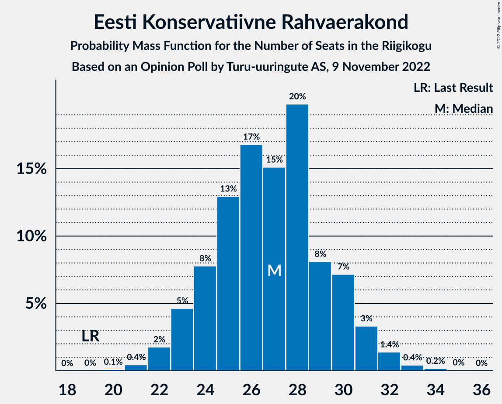

| Number of Seats | Probability | Accumulated | Special Marks |
|:---------------:|:-----------:|:-----------:|:-------------:|
| 19 | 0% | 100% | Last Result |
| 20 | 0.1% | 100% |  |
| 21 | 0.4% | 99.9% |  |
| 22 | 2% | 99.4% |  |
| 23 | 5% | 98% |  |
| 24 | 8% | 93% |  |
| 25 | 13% | 85% |  |
| 26 | 17% | 72% |  |
| 27 | 15% | 56% | Median |
| 28 | 20% | 40% |  |
| 29 | 8% | 21% |  |
| 30 | 7% | 13% |  |
| 31 | 3% | 5% |  |
| 32 | 1.4% | 2% |  |
| 33 | 0.4% | 0.6% |  |
| 34 | 0.2% | 0.2% |  |
| 35 | 0% | 0.1% |  |
| 36 | 0% | 0% |  |

### Eesti 200

*For a full overview of the results for this party, see the [Eesti 200](party-eesti200.html) page.*

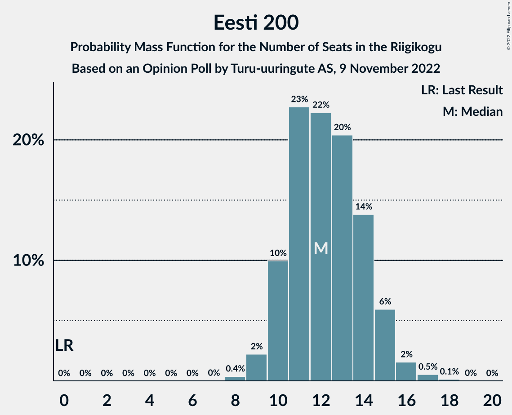

| Number of Seats | Probability | Accumulated | Special Marks |
|:---------------:|:-----------:|:-----------:|:-------------:|
| 0 | 0% | 100% | Last Result |
| 1 | 0% | 100% |  |
| 2 | 0% | 100% |  |
| 3 | 0% | 100% |  |
| 4 | 0% | 100% |  |
| 5 | 0% | 100% |  |
| 6 | 0% | 100% |  |
| 7 | 0% | 100% |  |
| 8 | 0.4% | 100% |  |
| 9 | 2% | 99.6% |  |
| 10 | 10% | 97% |  |
| 11 | 23% | 87% |  |
| 12 | 22% | 65% | Median |
| 13 | 20% | 42% |  |
| 14 | 14% | 22% |  |
| 15 | 6% | 8% |  |
| 16 | 2% | 2% |  |
| 17 | 0.5% | 0.7% |  |
| 18 | 0.1% | 0.1% |  |
| 19 | 0% | 0% |  |

### Eesti Keskerakond

*For a full overview of the results for this party, see the [Eesti Keskerakond](party-eestikeskerakond.html) page.*

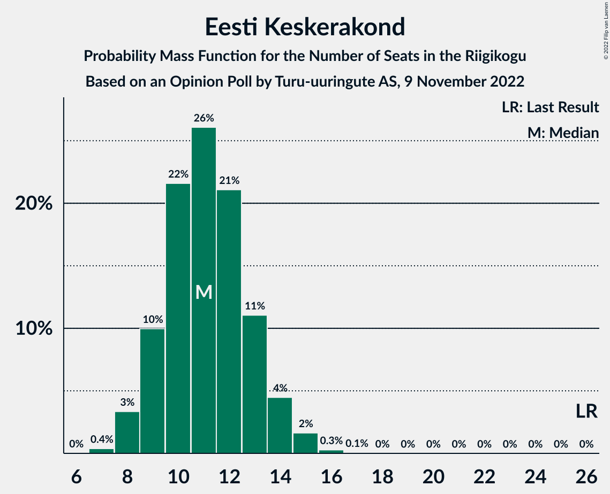

| Number of Seats | Probability | Accumulated | Special Marks |
|:---------------:|:-----------:|:-----------:|:-------------:|
| 7 | 0.4% | 100% |  |
| 8 | 3% | 99.6% |  |
| 9 | 10% | 96% |  |
| 10 | 22% | 86% |  |
| 11 | 26% | 65% | Median |
| 12 | 21% | 39% |  |
| 13 | 11% | 18% |  |
| 14 | 4% | 6% |  |
| 15 | 2% | 2% |  |
| 16 | 0.3% | 0.4% |  |
| 17 | 0.1% | 0.1% |  |
| 18 | 0% | 0% |  |
| 19 | 0% | 0% |  |
| 20 | 0% | 0% |  |
| 21 | 0% | 0% |  |
| 22 | 0% | 0% |  |
| 23 | 0% | 0% |  |
| 24 | 0% | 0% |  |
| 25 | 0% | 0% |  |
| 26 | 0% | 0% | Last Result |

### Sotsiaaldemokraatlik Erakond

*For a full overview of the results for this party, see the [Sotsiaaldemokraatlik Erakond](party-sotsiaaldemokraatlikerakond.html) page.*

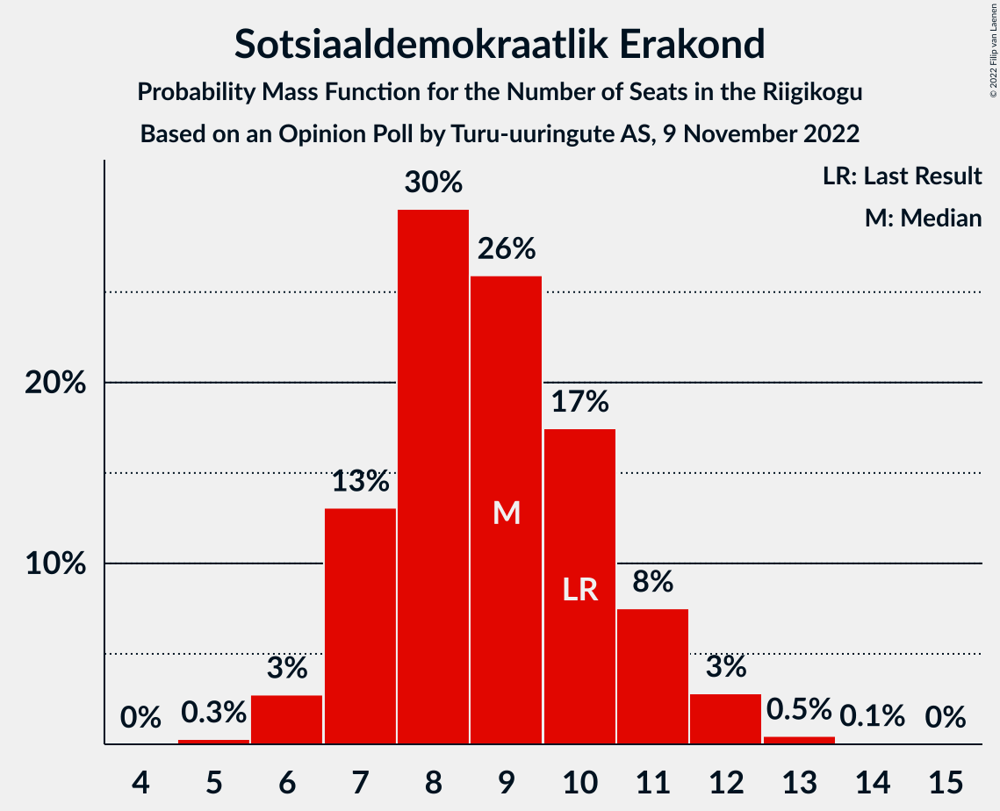

| Number of Seats | Probability | Accumulated | Special Marks |
|:---------------:|:-----------:|:-----------:|:-------------:|
| 5 | 0.3% | 100% |  |
| 6 | 3% | 99.7% |  |
| 7 | 13% | 97% |  |
| 8 | 30% | 84% |  |
| 9 | 26% | 54% | Median |
| 10 | 17% | 28% | Last Result |
| 11 | 8% | 11% |  |
| 12 | 3% | 3% |  |
| 13 | 0.5% | 0.6% |  |
| 14 | 0.1% | 0.1% |  |
| 15 | 0% | 0% |  |

### Erakond Isamaa

*For a full overview of the results for this party, see the [Erakond Isamaa](party-erakondisamaa.html) page.*

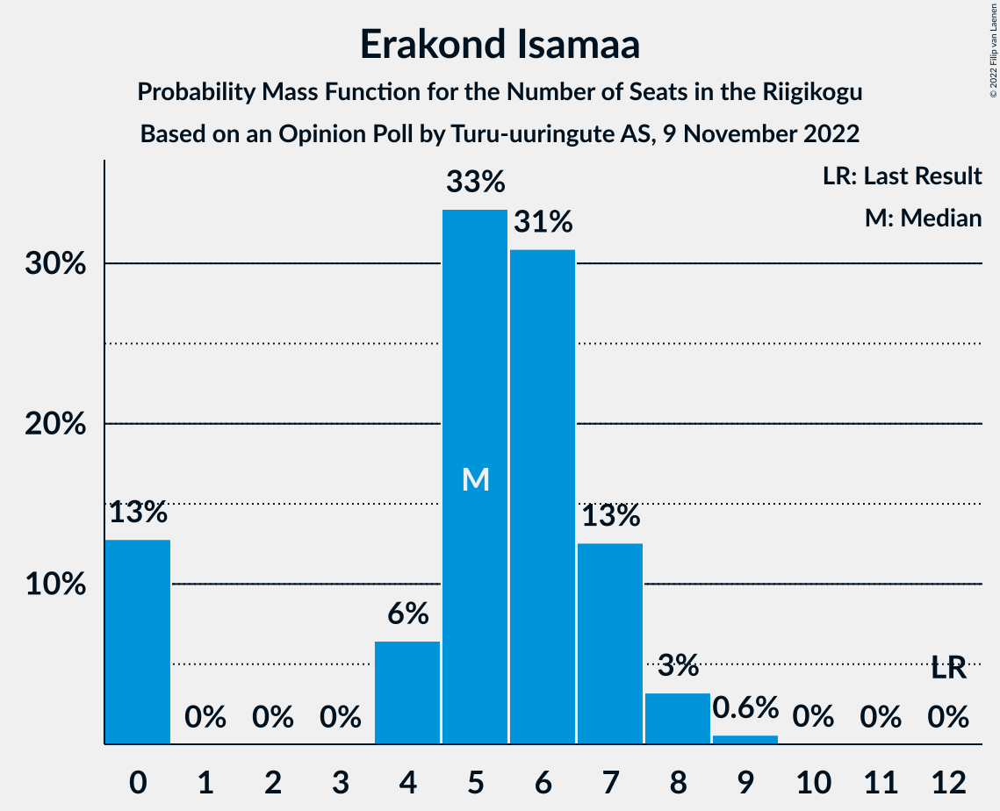

| Number of Seats | Probability | Accumulated | Special Marks |
|:---------------:|:-----------:|:-----------:|:-------------:|
| 0 | 13% | 100% |  |
| 1 | 0% | 87% |  |
| 2 | 0% | 87% |  |
| 3 | 0% | 87% |  |
| 4 | 6% | 87% |  |
| 5 | 33% | 81% | Median |
| 6 | 31% | 47% |  |
| 7 | 13% | 16% |  |
| 8 | 3% | 4% |  |
| 9 | 0.6% | 0.6% |  |
| 10 | 0% | 0.1% |  |
| 11 | 0% | 0% |  |
| 12 | 0% | 0% | Last Result |

### Erakond Eestimaa Rohelised

*For a full overview of the results for this party, see the [Erakond Eestimaa Rohelised](party-erakondeestimaarohelised.html) page.*

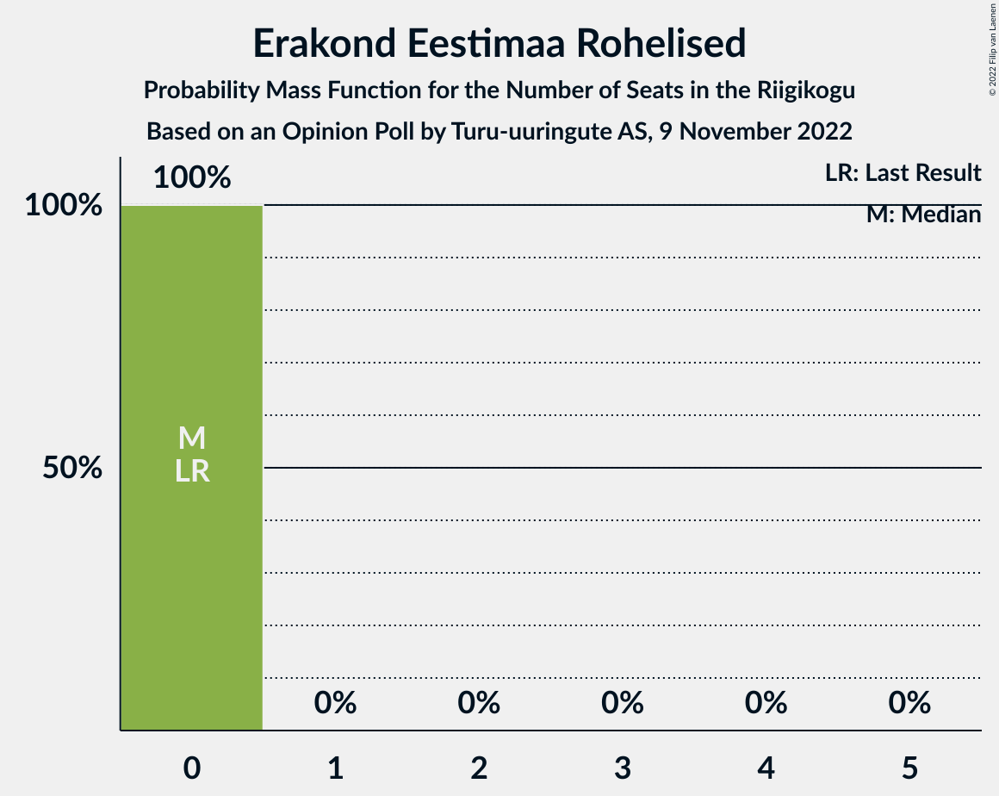

| Number of Seats | Probability | Accumulated | Special Marks |
|:---------------:|:-----------:|:-----------:|:-------------:|
| 0 | 100% | 100% | Last Result, Median |

### Erakond Parempoolsed

*For a full overview of the results for this party, see the [Erakond Parempoolsed](party-erakondparempoolsed.html) page.*

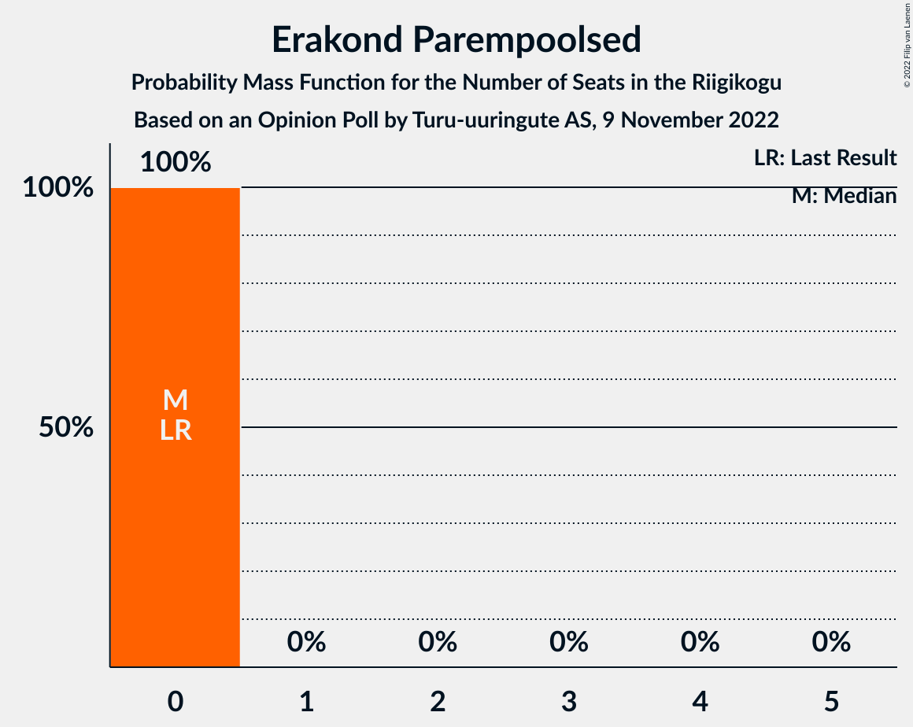

| Number of Seats | Probability | Accumulated | Special Marks |
|:---------------:|:-----------:|:-----------:|:-------------:|
| 0 | 100% | 100% | Last Result, Median |

## Coalitions

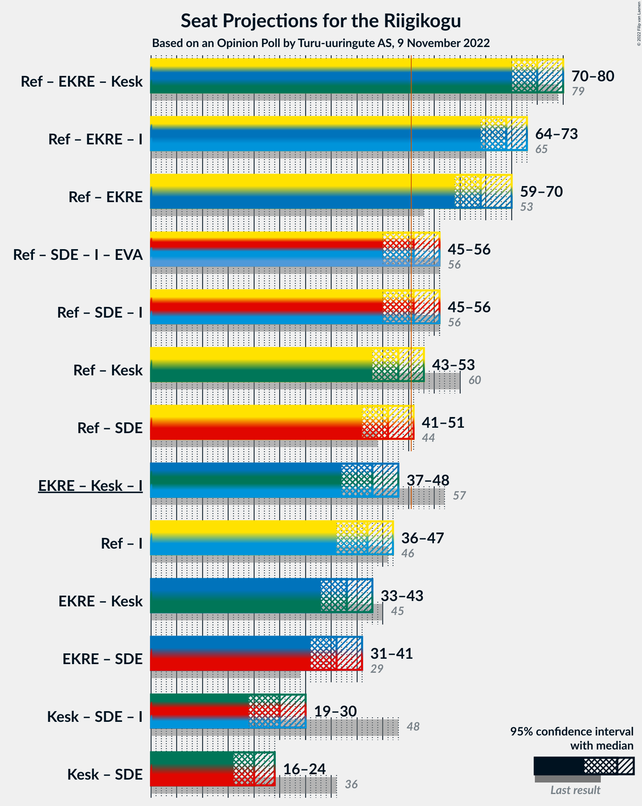

### Confidence Intervals

| Coalition | Last Result | Median | Majority? | 80% Confidence Interval | 90% Confidence Interval | 95% Confidence Interval | 99% Confidence Interval |
|:---------:|:-----------:|:------:|:---------:|:-----------------------:|:-----------------------:|:-----------------------:|:-----------------------:|
| Eesti Reformierakond – Eesti Konservatiivne Rahvaerakond – Eesti Keskerakond | 79 | 75 | 100% | 72–78 | 71–79 | 70–80 | 69–82 |
| Eesti Reformierakond – Eesti Konservatiivne Rahvaerakond – Erakond Isamaa | 65 | 69 | 100% | 66–72 | 65–72 | 64–73 | 62–75 |
| Eesti Reformierakond – Eesti Konservatiivne Rahvaerakond | 53 | 64 | 100% | 60–67 | 60–68 | 59–70 | 57–71 |
| Eesti Reformierakond – Sotsiaaldemokraatlik Erakond – Erakond Isamaa | 56 | 51 | 56% | 48–54 | 46–55 | 45–56 | 43–57 |
| Eesti Reformierakond – Eesti Keskerakond | 60 | 48 | 19% | 45–51 | 44–52 | 43–53 | 42–55 |
| Eesti Reformierakond – Sotsiaaldemokraatlik Erakond | 44 | 46 | 4% | 43–49 | 42–50 | 41–51 | 39–53 |
| Eesti Konservatiivne Rahvaerakond – Eesti Keskerakond – Erakond Isamaa | 57 | 43 | 0.1% | 39–46 | 38–47 | 37–48 | 35–49 |
| Eesti Reformierakond – Erakond Isamaa | 46 | 42 | 0% | 39–45 | 38–46 | 36–47 | 35–49 |
| Eesti Konservatiivne Rahvaerakond – Eesti Keskerakond | 45 | 38 | 0% | 35–41 | 34–42 | 33–43 | 32–45 |
| Eesti Konservatiivne Rahvaerakond – Sotsiaaldemokraatlik Erakond | 29 | 36 | 0% | 33–39 | 32–40 | 31–41 | 30–42 |
| Eesti Keskerakond – Sotsiaaldemokraatlik Erakond – Erakond Isamaa | 48 | 25 | 0% | 22–28 | 20–29 | 19–30 | 18–31 |
| Eesti Keskerakond – Sotsiaaldemokraatlik Erakond | 36 | 20 | 0% | 17–22 | 17–23 | 16–24 | 15–25 |

### Eesti Reformierakond – Eesti Konservatiivne Rahvaerakond – Eesti Keskerakond

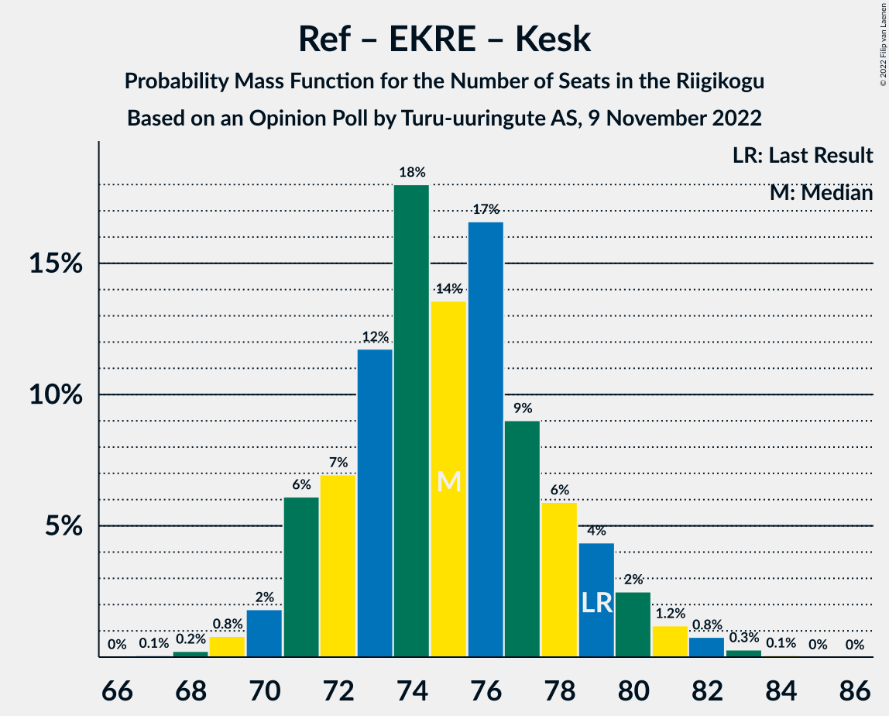

| Number of Seats | Probability | Accumulated | Special Marks |
|:---------------:|:-----------:|:-----------:|:-------------:|
| 67 | 0.1% | 100% |  |
| 68 | 0.2% | 99.9% |  |
| 69 | 0.8% | 99.7% |  |
| 70 | 2% | 98.9% |  |
| 71 | 6% | 97% |  |
| 72 | 7% | 91% |  |
| 73 | 12% | 84% |  |
| 74 | 18% | 72% |  |
| 75 | 14% | 54% | Median |
| 76 | 17% | 41% |  |
| 77 | 9% | 24% |  |
| 78 | 6% | 15% |  |
| 79 | 4% | 9% | Last Result |
| 80 | 2% | 5% |  |
| 81 | 1.2% | 2% |  |
| 82 | 0.8% | 1.1% |  |
| 83 | 0.3% | 0.4% |  |
| 84 | 0.1% | 0.1% |  |
| 85 | 0% | 0% |  |

### Eesti Reformierakond – Eesti Konservatiivne Rahvaerakond – Erakond Isamaa

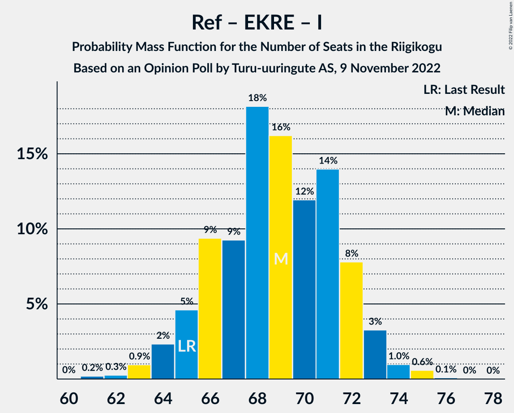

| Number of Seats | Probability | Accumulated | Special Marks |
|:---------------:|:-----------:|:-----------:|:-------------:|
| 60 | 0% | 100% |  |
| 61 | 0.2% | 99.9% |  |
| 62 | 0.3% | 99.8% |  |
| 63 | 0.9% | 99.5% |  |
| 64 | 2% | 98.5% |  |
| 65 | 5% | 96% | Last Result |
| 66 | 9% | 92% |  |
| 67 | 9% | 82% |  |
| 68 | 18% | 73% |  |
| 69 | 16% | 55% | Median |
| 70 | 12% | 39% |  |
| 71 | 14% | 27% |  |
| 72 | 8% | 13% |  |
| 73 | 3% | 5% |  |
| 74 | 1.0% | 2% |  |
| 75 | 0.6% | 0.7% |  |
| 76 | 0.1% | 0.1% |  |
| 77 | 0% | 0% |  |

### Eesti Reformierakond – Eesti Konservatiivne Rahvaerakond

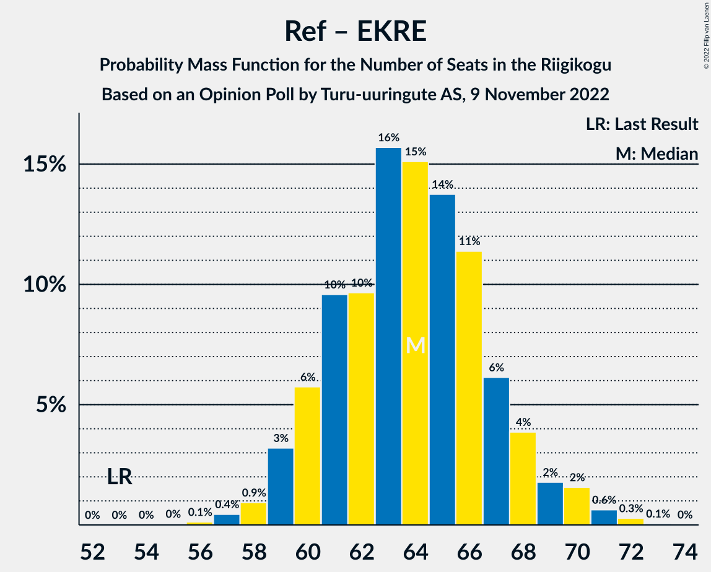

| Number of Seats | Probability | Accumulated | Special Marks |
|:---------------:|:-----------:|:-----------:|:-------------:|
| 53 | 0% | 100% | Last Result |
| 54 | 0% | 100% |  |
| 55 | 0% | 100% |  |
| 56 | 0.1% | 99.9% |  |
| 57 | 0.4% | 99.8% |  |
| 58 | 0.9% | 99.4% |  |
| 59 | 3% | 98% |  |
| 60 | 6% | 95% |  |
| 61 | 10% | 90% |  |
| 62 | 10% | 80% |  |
| 63 | 16% | 70% |  |
| 64 | 15% | 55% | Median |
| 65 | 14% | 39% |  |
| 66 | 11% | 26% |  |
| 67 | 6% | 14% |  |
| 68 | 4% | 8% |  |
| 69 | 2% | 4% |  |
| 70 | 2% | 3% |  |
| 71 | 0.6% | 1.0% |  |
| 72 | 0.3% | 0.4% |  |
| 73 | 0.1% | 0.1% |  |
| 74 | 0% | 0% |  |

### Eesti Reformierakond – Sotsiaaldemokraatlik Erakond – Erakond Isamaa

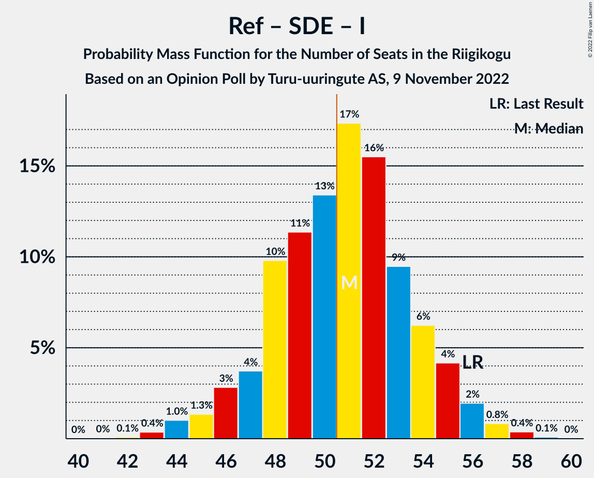

| Number of Seats | Probability | Accumulated | Special Marks |
|:---------------:|:-----------:|:-----------:|:-------------:|
| 41 | 0% | 100% |  |
| 42 | 0.1% | 99.9% |  |
| 43 | 0.4% | 99.9% |  |
| 44 | 1.0% | 99.5% |  |
| 45 | 1.3% | 98% |  |
| 46 | 3% | 97% |  |
| 47 | 4% | 94% |  |
| 48 | 10% | 91% |  |
| 49 | 11% | 81% |  |
| 50 | 13% | 69% |  |
| 51 | 17% | 56% | Median, Majority |
| 52 | 16% | 39% |  |
| 53 | 9% | 23% |  |
| 54 | 6% | 14% |  |
| 55 | 4% | 7% |  |
| 56 | 2% | 3% | Last Result |
| 57 | 0.8% | 1.3% |  |
| 58 | 0.4% | 0.5% |  |
| 59 | 0.1% | 0.1% |  |
| 60 | 0% | 0% |  |

### Eesti Reformierakond – Eesti Keskerakond

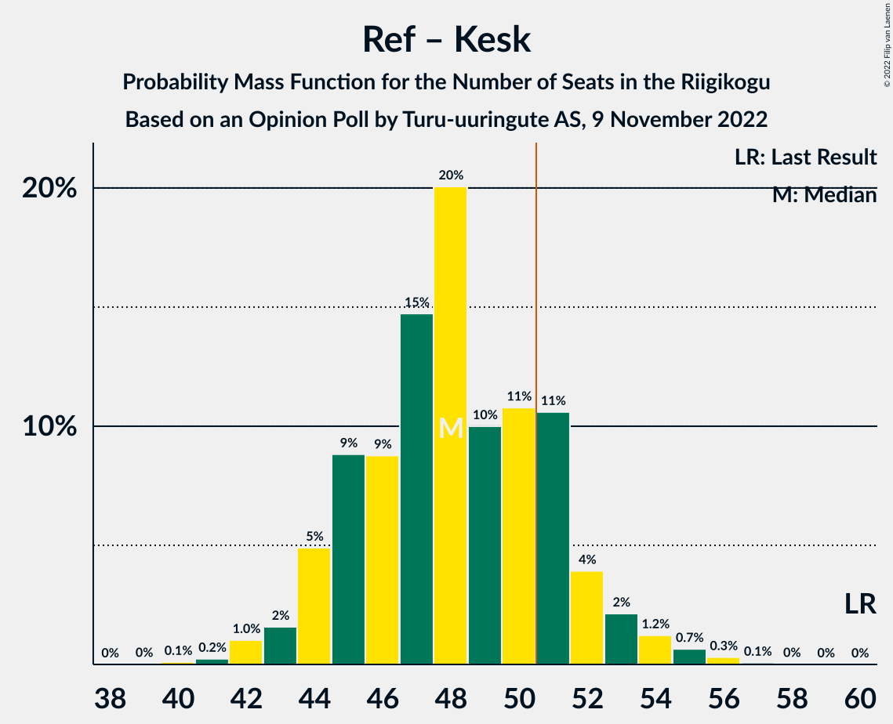

| Number of Seats | Probability | Accumulated | Special Marks |
|:---------------:|:-----------:|:-----------:|:-------------:|
| 40 | 0.1% | 100% |  |
| 41 | 0.2% | 99.9% |  |
| 42 | 1.0% | 99.6% |  |
| 43 | 2% | 98.6% |  |
| 44 | 5% | 97% |  |
| 45 | 9% | 92% |  |
| 46 | 9% | 83% |  |
| 47 | 15% | 75% |  |
| 48 | 20% | 60% | Median |
| 49 | 10% | 40% |  |
| 50 | 11% | 30% |  |
| 51 | 11% | 19% | Majority |
| 52 | 4% | 8% |  |
| 53 | 2% | 4% |  |
| 54 | 1.2% | 2% |  |
| 55 | 0.7% | 1.1% |  |
| 56 | 0.3% | 0.4% |  |
| 57 | 0.1% | 0.1% |  |
| 58 | 0% | 0% |  |
| 59 | 0% | 0% |  |
| 60 | 0% | 0% | Last Result |

### Eesti Reformierakond – Sotsiaaldemokraatlik Erakond

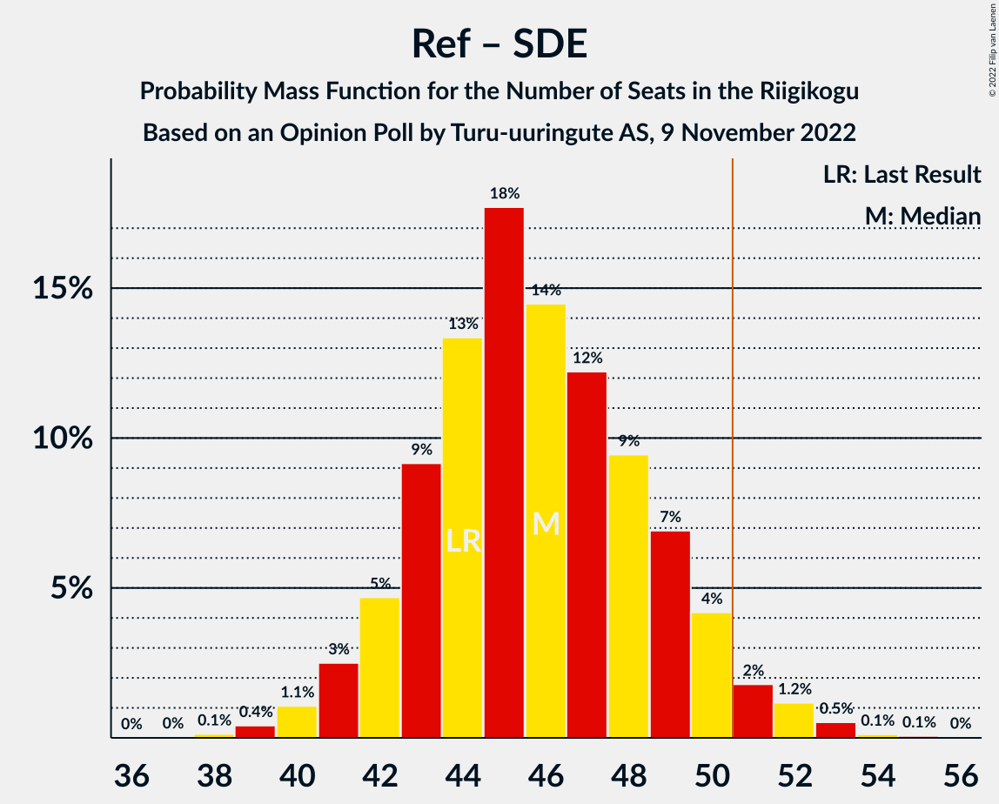

| Number of Seats | Probability | Accumulated | Special Marks |
|:---------------:|:-----------:|:-----------:|:-------------:|
| 38 | 0.1% | 100% |  |
| 39 | 0.4% | 99.8% |  |
| 40 | 1.1% | 99.4% |  |
| 41 | 3% | 98% |  |
| 42 | 5% | 96% |  |
| 43 | 9% | 91% |  |
| 44 | 13% | 82% | Last Result |
| 45 | 18% | 69% |  |
| 46 | 14% | 51% | Median |
| 47 | 12% | 36% |  |
| 48 | 9% | 24% |  |
| 49 | 7% | 15% |  |
| 50 | 4% | 8% |  |
| 51 | 2% | 4% | Majority |
| 52 | 1.2% | 2% |  |
| 53 | 0.5% | 0.7% |  |
| 54 | 0.1% | 0.2% |  |
| 55 | 0.1% | 0.1% |  |
| 56 | 0% | 0% |  |

### Eesti Konservatiivne Rahvaerakond – Eesti Keskerakond – Erakond Isamaa

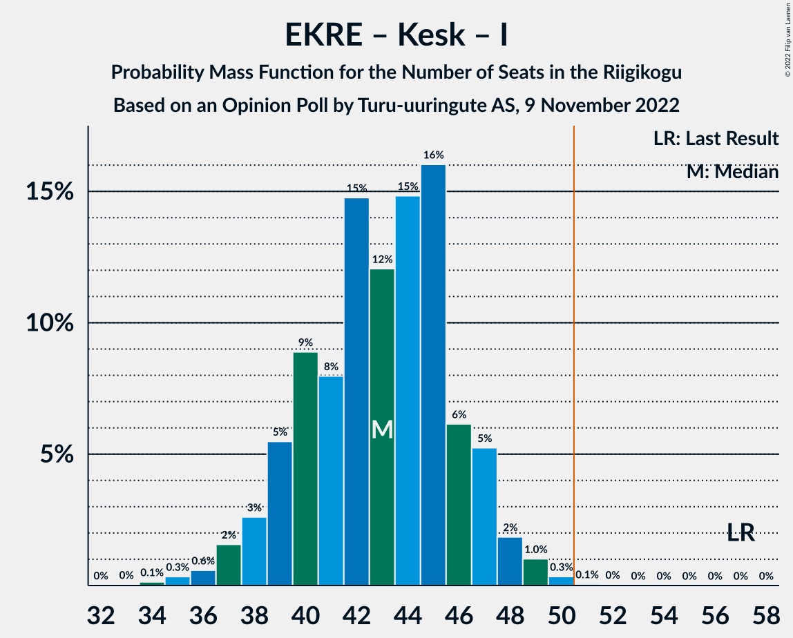

| Number of Seats | Probability | Accumulated | Special Marks |
|:---------------:|:-----------:|:-----------:|:-------------:|
| 34 | 0.1% | 100% |  |
| 35 | 0.3% | 99.8% |  |
| 36 | 0.6% | 99.5% |  |
| 37 | 2% | 98.9% |  |
| 38 | 3% | 97% |  |
| 39 | 5% | 95% |  |
| 40 | 9% | 89% |  |
| 41 | 8% | 80% |  |
| 42 | 15% | 72% |  |
| 43 | 12% | 58% | Median |
| 44 | 15% | 46% |  |
| 45 | 16% | 31% |  |
| 46 | 6% | 15% |  |
| 47 | 5% | 9% |  |
| 48 | 2% | 3% |  |
| 49 | 1.0% | 1.5% |  |
| 50 | 0.3% | 0.4% |  |
| 51 | 0.1% | 0.1% | Majority |
| 52 | 0% | 0% |  |
| 53 | 0% | 0% |  |
| 54 | 0% | 0% |  |
| 55 | 0% | 0% |  |
| 56 | 0% | 0% |  |
| 57 | 0% | 0% | Last Result |

### Eesti Reformierakond – Erakond Isamaa

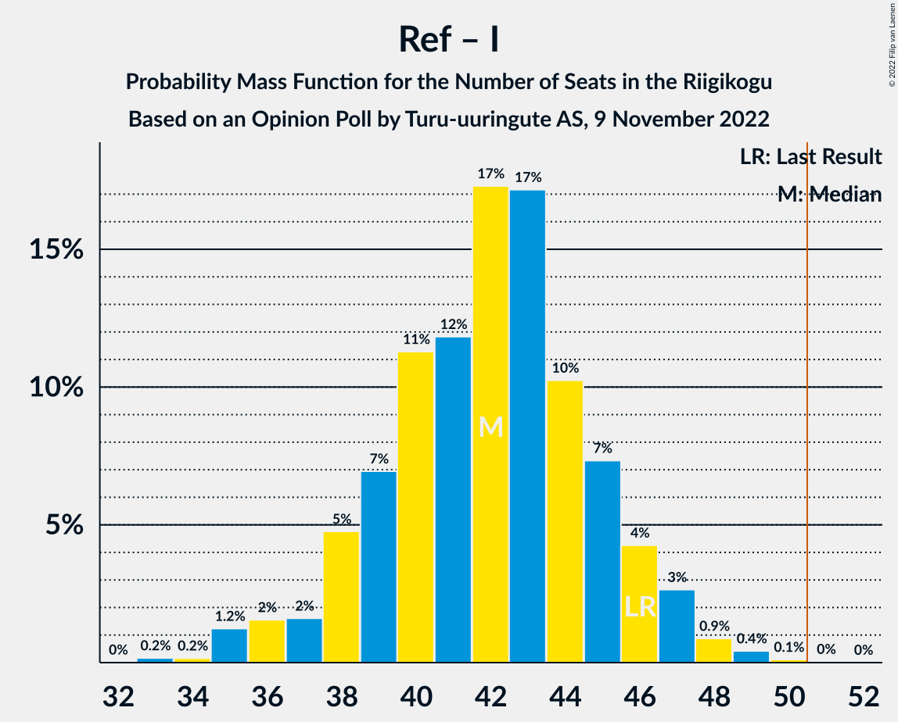

| Number of Seats | Probability | Accumulated | Special Marks |
|:---------------:|:-----------:|:-----------:|:-------------:|
| 33 | 0.2% | 100% |  |
| 34 | 0.2% | 99.8% |  |
| 35 | 1.2% | 99.6% |  |
| 36 | 2% | 98% |  |
| 37 | 2% | 97% |  |
| 38 | 5% | 95% |  |
| 39 | 7% | 90% |  |
| 40 | 11% | 84% |  |
| 41 | 12% | 72% |  |
| 42 | 17% | 60% | Median |
| 43 | 17% | 43% |  |
| 44 | 10% | 26% |  |
| 45 | 7% | 16% |  |
| 46 | 4% | 8% | Last Result |
| 47 | 3% | 4% |  |
| 48 | 0.9% | 1.5% |  |
| 49 | 0.4% | 0.6% |  |
| 50 | 0.1% | 0.2% |  |
| 51 | 0% | 0% | Majority |

### Eesti Konservatiivne Rahvaerakond – Eesti Keskerakond

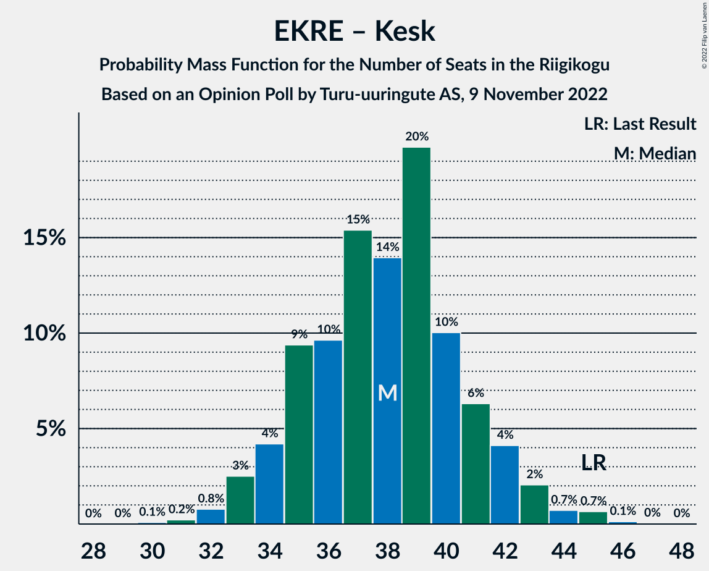

| Number of Seats | Probability | Accumulated | Special Marks |
|:---------------:|:-----------:|:-----------:|:-------------:|
| 30 | 0.1% | 100% |  |
| 31 | 0.2% | 99.9% |  |
| 32 | 0.8% | 99.7% |  |
| 33 | 3% | 98.9% |  |
| 34 | 4% | 96% |  |
| 35 | 9% | 92% |  |
| 36 | 10% | 83% |  |
| 37 | 15% | 73% |  |
| 38 | 14% | 58% | Median |
| 39 | 20% | 44% |  |
| 40 | 10% | 24% |  |
| 41 | 6% | 14% |  |
| 42 | 4% | 8% |  |
| 43 | 2% | 4% |  |
| 44 | 0.7% | 2% |  |
| 45 | 0.7% | 0.8% | Last Result |
| 46 | 0.1% | 0.2% |  |
| 47 | 0% | 0.1% |  |
| 48 | 0% | 0% |  |

### Eesti Konservatiivne Rahvaerakond – Sotsiaaldemokraatlik Erakond

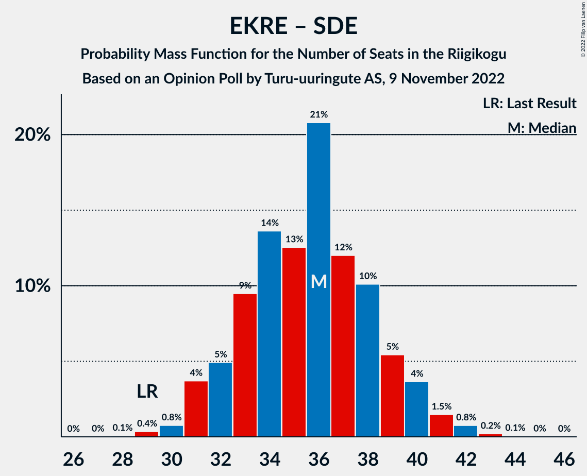

| Number of Seats | Probability | Accumulated | Special Marks |
|:---------------:|:-----------:|:-----------:|:-------------:|
| 28 | 0.1% | 100% |  |
| 29 | 0.4% | 99.9% | Last Result |
| 30 | 0.8% | 99.6% |  |
| 31 | 4% | 98.8% |  |
| 32 | 5% | 95% |  |
| 33 | 9% | 90% |  |
| 34 | 14% | 81% |  |
| 35 | 13% | 67% |  |
| 36 | 21% | 55% | Median |
| 37 | 12% | 34% |  |
| 38 | 10% | 22% |  |
| 39 | 5% | 12% |  |
| 40 | 4% | 6% |  |
| 41 | 1.5% | 3% |  |
| 42 | 0.8% | 1.1% |  |
| 43 | 0.2% | 0.3% |  |
| 44 | 0.1% | 0.1% |  |
| 45 | 0% | 0% |  |

### Eesti Keskerakond – Sotsiaaldemokraatlik Erakond – Erakond Isamaa

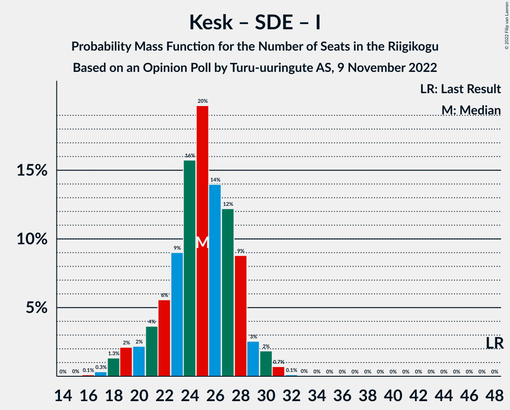

| Number of Seats | Probability | Accumulated | Special Marks |
|:---------------:|:-----------:|:-----------:|:-------------:|
| 16 | 0.1% | 100% |  |
| 17 | 0.3% | 99.9% |  |
| 18 | 1.3% | 99.5% |  |
| 19 | 2% | 98% |  |
| 20 | 2% | 96% |  |
| 21 | 4% | 94% |  |
| 22 | 6% | 90% |  |
| 23 | 9% | 85% |  |
| 24 | 16% | 76% |  |
| 25 | 20% | 60% | Median |
| 26 | 14% | 40% |  |
| 27 | 12% | 26% |  |
| 28 | 9% | 14% |  |
| 29 | 3% | 5% |  |
| 30 | 2% | 3% |  |
| 31 | 0.7% | 0.9% |  |
| 32 | 0.1% | 0.2% |  |
| 33 | 0% | 0.1% |  |
| 34 | 0% | 0% |  |
| 35 | 0% | 0% |  |
| 36 | 0% | 0% |  |
| 37 | 0% | 0% |  |
| 38 | 0% | 0% |  |
| 39 | 0% | 0% |  |
| 40 | 0% | 0% |  |
| 41 | 0% | 0% |  |
| 42 | 0% | 0% |  |
| 43 | 0% | 0% |  |
| 44 | 0% | 0% |  |
| 45 | 0% | 0% |  |
| 46 | 0% | 0% |  |
| 47 | 0% | 0% |  |
| 48 | 0% | 0% | Last Result |

### Eesti Keskerakond – Sotsiaaldemokraatlik Erakond

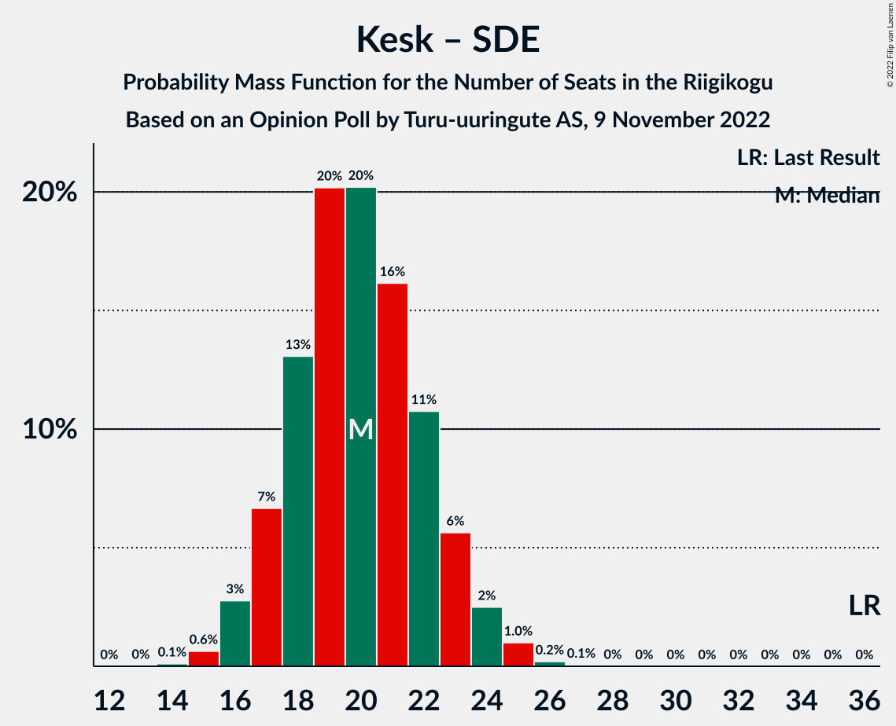

| Number of Seats | Probability | Accumulated | Special Marks |
|:---------------:|:-----------:|:-----------:|:-------------:|
| 14 | 0.1% | 100% |  |
| 15 | 0.6% | 99.9% |  |
| 16 | 3% | 99.2% |  |
| 17 | 7% | 96% |  |
| 18 | 13% | 90% |  |
| 19 | 20% | 77% |  |
| 20 | 20% | 57% | Median |
| 21 | 16% | 36% |  |
| 22 | 11% | 20% |  |
| 23 | 6% | 9% |  |
| 24 | 2% | 4% |  |
| 25 | 1.0% | 1.3% |  |
| 26 | 0.2% | 0.3% |  |
| 27 | 0.1% | 0.1% |  |
| 28 | 0% | 0% |  |
| 29 | 0% | 0% |  |
| 30 | 0% | 0% |  |
| 31 | 0% | 0% |  |
| 32 | 0% | 0% |  |
| 33 | 0% | 0% |  |
| 34 | 0% | 0% |  |
| 35 | 0% | 0% |  |
| 36 | 0% | 0% | Last Result |

## Technical Information

### Opinion Poll

+ **Polling firm:** Turu-uuringute AS
+ **Commissioner(s):** —
+ **Fieldwork period:** 9 November 2022

### Calculations

+ **Sample size:** 600
+ **Simulations done:** 1,048,576
+ **Error estimate:** 1.42%

