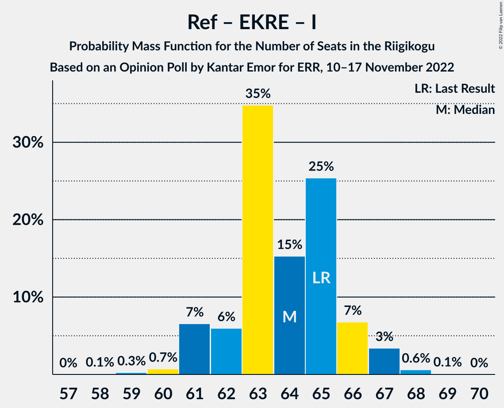

# Opinion Poll by Kantar Emor for ERR, 10–17 November 2022

<a href="#voting-intentions">Voting Intentions</a> | <a href="#seats">Seats</a> | <a href="#coalitions">Coalitions</a> | <a href="#technical-information">Technical Information</a>

## Voting Intentions

### Confidence Intervals

| Party | Last Result | Poll Result | 80% Confidence Interval | 90% Confidence Interval | 95% Confidence Interval | 99% Confidence Interval |
|:-----:|:-----------:|:-----------:|:-----------------------:|:-----------------------:|:-----------------------:|:-----------------------:|
| Eesti Reformierakond | 28.9% | 31.0% | 29.5–32.5% |29.0–33.0% |28.7–33.3% |28.0–34.1% |
| Eesti Konservatiivne Rahvaerakond | 17.8% | 22.0% | 20.6–23.4% |20.3–23.8% |19.9–24.1% |19.3–24.8% |
| Eesti Keskerakond | 23.1% | 14.9% | 13.8–16.2% |13.5–16.5% |13.2–16.8% |12.7–17.5% |
| Eesti 200 | 4.4% | 14.0% | 12.9–15.2% |12.6–15.5% |12.3–15.8% |11.8–16.4% |
| Sotsiaaldemokraatlik Erakond | 9.8% | 8.0% | 7.2–9.0% |6.9–9.3% |6.7–9.5% |6.4–10.0% |
| Erakond Isamaa | 11.4% | 6.0% | 5.2–6.8% |5.0–7.1% |4.9–7.3% |4.5–7.7% |
| Erakond Eestimaa Rohelised | 1.8% | 3.0% | 2.5–3.6% |2.3–3.8% |2.2–4.0% |2.0–4.3% |
| Erakond Parempoolsed | 0.0% | 1.0% | 0.7–1.4% |0.7–1.5% |0.6–1.6% |0.5–1.9% |

*Note:* The poll result column reflects the actual value used in the calculations. Published results may vary slightly, and in addition be rounded to fewer digits.

## Seats

### Confidence Intervals

| Party | Last Result | Median | 80% Confidence Interval | 90% Confidence Interval | 95% Confidence Interval | 99% Confidence Interval |
|:-----:|:-----------:|:------:|:-----------------------:|:-----------------------:|:-----------------------:|:-----------------------:|
| <a href="#eesti-reformierakond">Eesti Reformierakond</a> | 34 | 35 | 33–37 |32–38 |32–38 |31–39 |
| <a href="#eesti-konservatiivne-rahvaerakond">Eesti Konservatiivne Rahvaerakond</a> | 19 | 24 | 22–26 |22–26 |21–26 |20–28 |
| <a href="#eesti-keskerakond">Eesti Keskerakond</a> | 26 | 16 | 14–17 |14–17 |13–18 |13–18 |
| <a href="#eesti-200">Eesti 200</a> | 0 | 14 | 13–16 |13–16 |12–16 |12–17 |
| <a href="#sotsiaaldemokraatlik-erakond">Sotsiaaldemokraatlik Erakond</a> | 10 | 7 | 6–8 |6–9 |6–9 |6–10 |
| <a href="#erakond-isamaa">Erakond Isamaa</a> | 12 | 5 | 4–6 |0–6 |0–7 |0–7 |
| <a href="#erakond-eestimaa-rohelised">Erakond Eestimaa Rohelised</a> | 0 | 0 | 0 |0 |0 |0 |
| <a href="#erakond-parempoolsed">Erakond Parempoolsed</a> | 0 | 0 | 0 |0 |0 |0 |

### Eesti Reformierakond

*For a full overview of the results for this party, see the [Eesti Reformierakond](party-eestireformierakond.html) page.*

| Number of Seats | Probability | Accumulated | Special Marks |
|:---------------:|:-----------:|:-----------:|:-------------:|
| 30 | 0.1% | 100% |  |
| 31 | 0.5% | 99.9% |  |
| 32 | 5% | 99.4% |  |
| 33 | 10% | 95% |  |
| 34 | 19% | 85% | Last Result |
| 35 | 27% | 66% | Median |
| 36 | 22% | 39% |  |
| 37 | 11% | 17% |  |
| 38 | 5% | 6% |  |
| 39 | 1.2% | 1.4% |  |
| 40 | 0.1% | 0.2% |  |
| 41 | 0.1% | 0.1% |  |
| 42 | 0% | 0% |  |

### Eesti Konservatiivne Rahvaerakond

*For a full overview of the results for this party, see the [Eesti Konservatiivne Rahvaerakond](party-eestikonservatiivnerahvaerakond.html) page.*

| Number of Seats | Probability | Accumulated | Special Marks |
|:---------------:|:-----------:|:-----------:|:-------------:|
| 19 | 0% | 100% | Last Result |
| 20 | 0.5% | 100% |  |
| 21 | 3% | 99.5% |  |
| 22 | 14% | 97% |  |
| 23 | 27% | 83% |  |
| 24 | 28% | 56% | Median |
| 25 | 18% | 28% |  |
| 26 | 8% | 10% |  |
| 27 | 2% | 2% |  |
| 28 | 0.6% | 0.7% |  |
| 29 | 0.1% | 0.1% |  |
| 30 | 0% | 0% |  |

### Eesti Keskerakond

*For a full overview of the results for this party, see the [Eesti Keskerakond](party-eestikeskerakond.html) page.*

| Number of Seats | Probability | Accumulated | Special Marks |
|:---------------:|:-----------:|:-----------:|:-------------:|
| 12 | 0.2% | 100% |  |
| 13 | 3% | 99.8% |  |
| 14 | 13% | 97% |  |
| 15 | 32% | 83% |  |
| 16 | 32% | 51% | Median |
| 17 | 16% | 19% |  |
| 18 | 2% | 3% |  |
| 19 | 0.4% | 0.5% |  |
| 20 | 0% | 0% |  |
| 21 | 0% | 0% |  |
| 22 | 0% | 0% |  |
| 23 | 0% | 0% |  |
| 24 | 0% | 0% |  |
| 25 | 0% | 0% |  |
| 26 | 0% | 0% | Last Result |

### Eesti 200

*For a full overview of the results for this party, see the [Eesti 200](party-eesti200.html) page.*

| Number of Seats | Probability | Accumulated | Special Marks |
|:---------------:|:-----------:|:-----------:|:-------------:|
| 0 | 0% | 100% | Last Result |
| 1 | 0% | 100% |  |
| 2 | 0% | 100% |  |
| 3 | 0% | 100% |  |
| 4 | 0% | 100% |  |
| 5 | 0% | 100% |  |
| 6 | 0% | 100% |  |
| 7 | 0% | 100% |  |
| 8 | 0% | 100% |  |
| 9 | 0% | 100% |  |
| 10 | 0% | 100% |  |
| 11 | 0.4% | 100% |  |
| 12 | 4% | 99.6% |  |
| 13 | 21% | 95% |  |
| 14 | 36% | 75% | Median |
| 15 | 23% | 39% |  |
| 16 | 13% | 15% |  |
| 17 | 2% | 2% |  |
| 18 | 0.2% | 0.2% |  |
| 19 | 0% | 0% |  |

### Sotsiaaldemokraatlik Erakond

*For a full overview of the results for this party, see the [Sotsiaaldemokraatlik Erakond](party-sotsiaaldemokraatlikerakond.html) page.*

| Number of Seats | Probability | Accumulated | Special Marks |
|:---------------:|:-----------:|:-----------:|:-------------:|
| 5 | 0.3% | 100% |  |
| 6 | 10% | 99.7% |  |
| 7 | 49% | 89% | Median |
| 8 | 31% | 41% |  |
| 9 | 9% | 9% |  |
| 10 | 0.6% | 0.7% | Last Result |
| 11 | 0% | 0% |  |

### Erakond Isamaa

*For a full overview of the results for this party, see the [Erakond Isamaa](party-erakondisamaa.html) page.*

| Number of Seats | Probability | Accumulated | Special Marks |
|:---------------:|:-----------:|:-----------:|:-------------:|
| 0 | 6% | 100% |  |
| 1 | 0% | 94% |  |
| 2 | 0% | 94% |  |
| 3 | 0% | 94% |  |
| 4 | 5% | 94% |  |
| 5 | 58% | 88% | Median |
| 6 | 27% | 30% |  |
| 7 | 3% | 3% |  |
| 8 | 0.1% | 0.1% |  |
| 9 | 0% | 0% |  |
| 10 | 0% | 0% |  |
| 11 | 0% | 0% |  |
| 12 | 0% | 0% | Last Result |

### Erakond Eestimaa Rohelised

*For a full overview of the results for this party, see the [Erakond Eestimaa Rohelised](party-erakondeestimaarohelised.html) page.*

| Number of Seats | Probability | Accumulated | Special Marks |
|:---------------:|:-----------:|:-----------:|:-------------:|
| 0 | 100% | 100% | Last Result, Median |

### Erakond Parempoolsed

*For a full overview of the results for this party, see the [Erakond Parempoolsed](party-erakondparempoolsed.html) page.*

| Number of Seats | Probability | Accumulated | Special Marks |
|:---------------:|:-----------:|:-----------:|:-------------:|
| 0 | 100% | 100% | Last Result, Median |

## Coalitions

### Confidence Intervals

| Coalition | Last Result | Median | Majority? | 80% Confidence Interval | 90% Confidence Interval | 95% Confidence Interval | 99% Confidence Interval |
|:---------:|:-----------:|:------:|:---------:|:-----------------------:|:-----------------------:|:-----------------------:|:-----------------------:|
| Eesti Reformierakond – Eesti Konservatiivne Rahvaerakond – Eesti Keskerakond | 79 | 74 | 100% | 72–76 | 72–77 | 71–79 | 71–80 |
| Eesti Reformierakond – Eesti Konservatiivne Rahvaerakond – Erakond Isamaa | 65 | 64 | 100% | 62–66 | 61–66 | 61–67 | 60–68 |
| Eesti Reformierakond – Eesti Konservatiivne Rahvaerakond | 53 | 58 | 100% | 57–61 | 56–62 | 56–63 | 55–65 |
| Eesti Reformierakond – Eesti Keskerakond | 60 | 51 | 58% | 48–53 | 48–53 | 47–54 | 46–55 |
| Eesti Reformierakond – Sotsiaaldemokraatlik Erakond – Erakond Isamaa | 56 | 47 | 3% | 45–49 | 45–50 | 44–51 | 43–51 |
| Eesti Konservatiivne Rahvaerakond – Eesti Keskerakond – Erakond Isamaa | 57 | 44 | 0% | 42–46 | 41–47 | 41–47 | 39–48 |
| Eesti Reformierakond – Sotsiaaldemokraatlik Erakond | 44 | 42 | 0% | 40–45 | 40–45 | 39–46 | 39–47 |
| Eesti Reformierakond – Erakond Isamaa | 46 | 40 | 0% | 38–42 | 37–43 | 37–43 | 35–44 |
| Eesti Konservatiivne Rahvaerakond – Eesti Keskerakond | 45 | 39 | 0% | 37–41 | 37–42 | 36–42 | 35–43 |
| Eesti Konservatiivne Rahvaerakond – Sotsiaaldemokraatlik Erakond | 29 | 31 | 0% | 29–33 | 29–34 | 28–35 | 28–35 |
| Eesti Keskerakond – Sotsiaaldemokraatlik Erakond – Erakond Isamaa | 48 | 28 | 0% | 26–30 | 25–30 | 24–31 | 22–32 |
| Eesti Keskerakond – Sotsiaaldemokraatlik Erakond | 36 | 23 | 0% | 21–24 | 21–25 | 20–25 | 20–26 |

### Eesti Reformierakond – Eesti Konservatiivne Rahvaerakond – Eesti Keskerakond

| Number of Seats | Probability | Accumulated | Special Marks |
|:---------------:|:-----------:|:-----------:|:-------------:|
| 70 | 0.3% | 100% |  |
| 71 | 2% | 99.7% |  |
| 72 | 10% | 97% |  |
| 73 | 19% | 87% |  |
| 74 | 20% | 69% |  |
| 75 | 31% | 49% | Median |
| 76 | 10% | 18% |  |
| 77 | 4% | 8% |  |
| 78 | 2% | 5% |  |
| 79 | 2% | 3% | Last Result |
| 80 | 1.0% | 1.3% |  |
| 81 | 0.2% | 0.3% |  |
| 82 | 0% | 0% |  |

### Eesti Reformierakond – Eesti Konservatiivne Rahvaerakond – Erakond Isamaa

| Number of Seats | Probability | Accumulated | Special Marks |
|:---------------:|:-----------:|:-----------:|:-------------:|
| 58 | 0.1% | 100% |  |
| 59 | 0.3% | 99.9% |  |
| 60 | 0.7% | 99.7% |  |
| 61 | 7% | 98.9% |  |
| 62 | 6% | 92% |  |
| 63 | 35% | 86% |  |
| 64 | 15% | 52% | Median |
| 65 | 25% | 36% | Last Result |
| 66 | 7% | 11% |  |
| 67 | 3% | 4% |  |
| 68 | 0.6% | 0.7% |  |
| 69 | 0.1% | 0.1% |  |
| 70 | 0% | 0% |  |

### Eesti Reformierakond – Eesti Konservatiivne Rahvaerakond

| Number of Seats | Probability | Accumulated | Special Marks |
|:---------------:|:-----------:|:-----------:|:-------------:|
| 53 | 0% | 100% | Last Result |
| 54 | 0.2% | 100% |  |
| 55 | 0.9% | 99.8% |  |
| 56 | 7% | 98.9% |  |
| 57 | 9% | 92% |  |
| 58 | 34% | 83% |  |
| 59 | 15% | 49% | Median |
| 60 | 19% | 34% |  |
| 61 | 9% | 16% |  |
| 62 | 3% | 7% |  |
| 63 | 3% | 4% |  |
| 64 | 0.3% | 0.8% |  |
| 65 | 0.4% | 0.5% |  |
| 66 | 0.2% | 0.2% |  |
| 67 | 0% | 0% |  |

### Eesti Reformierakond – Eesti Keskerakond

| Number of Seats | Probability | Accumulated | Special Marks |
|:---------------:|:-----------:|:-----------:|:-------------:|
| 45 | 0.1% | 100% |  |
| 46 | 0.4% | 99.9% |  |
| 47 | 2% | 99.5% |  |
| 48 | 10% | 97% |  |
| 49 | 14% | 88% |  |
| 50 | 16% | 74% |  |
| 51 | 31% | 58% | Median, Majority |
| 52 | 13% | 26% |  |
| 53 | 10% | 14% |  |
| 54 | 3% | 4% |  |
| 55 | 0.5% | 1.0% |  |
| 56 | 0.4% | 0.5% |  |
| 57 | 0.1% | 0.1% |  |
| 58 | 0% | 0% |  |
| 59 | 0% | 0% |  |
| 60 | 0% | 0% | Last Result |

### Eesti Reformierakond – Sotsiaaldemokraatlik Erakond – Erakond Isamaa

| Number of Seats | Probability | Accumulated | Special Marks |
|:---------------:|:-----------:|:-----------:|:-------------:|
| 41 | 0.1% | 100% |  |
| 42 | 0.2% | 99.9% |  |
| 43 | 0.7% | 99.7% |  |
| 44 | 3% | 99.0% |  |
| 45 | 9% | 96% |  |
| 46 | 15% | 87% |  |
| 47 | 23% | 72% | Median |
| 48 | 20% | 49% |  |
| 49 | 21% | 30% |  |
| 50 | 6% | 8% |  |
| 51 | 2% | 3% | Majority |
| 52 | 0.4% | 0.5% |  |
| 53 | 0.1% | 0.1% |  |
| 54 | 0% | 0% |  |
| 55 | 0% | 0% |  |
| 56 | 0% | 0% | Last Result |

### Eesti Konservatiivne Rahvaerakond – Eesti Keskerakond – Erakond Isamaa

| Number of Seats | Probability | Accumulated | Special Marks |
|:---------------:|:-----------:|:-----------:|:-------------:|
| 37 | 0.1% | 100% |  |
| 38 | 0.3% | 99.9% |  |
| 39 | 0.5% | 99.6% |  |
| 40 | 0.9% | 99.1% |  |
| 41 | 4% | 98% |  |
| 42 | 8% | 94% |  |
| 43 | 13% | 86% |  |
| 44 | 33% | 73% |  |
| 45 | 16% | 40% | Median |
| 46 | 15% | 24% |  |
| 47 | 6% | 9% |  |
| 48 | 2% | 2% |  |
| 49 | 0.2% | 0.2% |  |
| 50 | 0.1% | 0.1% |  |
| 51 | 0% | 0% | Majority |
| 52 | 0% | 0% |  |
| 53 | 0% | 0% |  |
| 54 | 0% | 0% |  |
| 55 | 0% | 0% |  |
| 56 | 0% | 0% |  |
| 57 | 0% | 0% | Last Result |

### Eesti Reformierakond – Sotsiaaldemokraatlik Erakond

| Number of Seats | Probability | Accumulated | Special Marks |
|:---------------:|:-----------:|:-----------:|:-------------:|
| 38 | 0.3% | 100% |  |
| 39 | 2% | 99.7% |  |
| 40 | 9% | 97% |  |
| 41 | 16% | 88% |  |
| 42 | 23% | 72% | Median |
| 43 | 23% | 49% |  |
| 44 | 15% | 26% | Last Result |
| 45 | 6% | 11% |  |
| 46 | 3% | 5% |  |
| 47 | 1.1% | 1.3% |  |
| 48 | 0.1% | 0.2% |  |
| 49 | 0.1% | 0.1% |  |
| 50 | 0% | 0% |  |

### Eesti Reformierakond – Erakond Isamaa

| Number of Seats | Probability | Accumulated | Special Marks |
|:---------------:|:-----------:|:-----------:|:-------------:|
| 33 | 0% | 100% |  |
| 34 | 0.2% | 99.9% |  |
| 35 | 1.0% | 99.8% |  |
| 36 | 1.2% | 98.8% |  |
| 37 | 4% | 98% |  |
| 38 | 9% | 93% |  |
| 39 | 19% | 84% |  |
| 40 | 23% | 65% | Median |
| 41 | 24% | 42% |  |
| 42 | 12% | 18% |  |
| 43 | 5% | 6% |  |
| 44 | 0.8% | 1.0% |  |
| 45 | 0.1% | 0.2% |  |
| 46 | 0% | 0% | Last Result |

### Eesti Konservatiivne Rahvaerakond – Eesti Keskerakond

| Number of Seats | Probability | Accumulated | Special Marks |
|:---------------:|:-----------:|:-----------:|:-------------:|
| 34 | 0.1% | 100% |  |
| 35 | 0.5% | 99.9% |  |
| 36 | 2% | 99.4% |  |
| 37 | 10% | 97% |  |
| 38 | 16% | 88% |  |
| 39 | 32% | 71% |  |
| 40 | 17% | 39% | Median |
| 41 | 14% | 23% |  |
| 42 | 6% | 8% |  |
| 43 | 2% | 2% |  |
| 44 | 0.3% | 0.4% |  |
| 45 | 0.1% | 0.1% | Last Result |
| 46 | 0% | 0% |  |

### Eesti Konservatiivne Rahvaerakond – Sotsiaaldemokraatlik Erakond

| Number of Seats | Probability | Accumulated | Special Marks |
|:---------------:|:-----------:|:-----------:|:-------------:|
| 27 | 0.3% | 100% |  |
| 28 | 2% | 99.7% |  |
| 29 | 11% | 97% | Last Result |
| 30 | 21% | 86% |  |
| 31 | 26% | 65% | Median |
| 32 | 22% | 40% |  |
| 33 | 11% | 18% |  |
| 34 | 4% | 6% |  |
| 35 | 3% | 3% |  |
| 36 | 0.2% | 0.3% |  |
| 37 | 0% | 0% |  |

### Eesti Keskerakond – Sotsiaaldemokraatlik Erakond – Erakond Isamaa

| Number of Seats | Probability | Accumulated | Special Marks |
|:---------------:|:-----------:|:-----------:|:-------------:|
| 21 | 0.2% | 100% |  |
| 22 | 0.7% | 99.8% |  |
| 23 | 1.1% | 99.1% |  |
| 24 | 2% | 98% |  |
| 25 | 4% | 96% |  |
| 26 | 8% | 92% |  |
| 27 | 21% | 84% |  |
| 28 | 22% | 63% | Median |
| 29 | 28% | 41% |  |
| 30 | 8% | 12% |  |
| 31 | 4% | 5% |  |
| 32 | 0.4% | 0.5% |  |
| 33 | 0.1% | 0.1% |  |
| 34 | 0% | 0% |  |
| 35 | 0% | 0% |  |
| 36 | 0% | 0% |  |
| 37 | 0% | 0% |  |
| 38 | 0% | 0% |  |
| 39 | 0% | 0% |  |
| 40 | 0% | 0% |  |
| 41 | 0% | 0% |  |
| 42 | 0% | 0% |  |
| 43 | 0% | 0% |  |
| 44 | 0% | 0% |  |
| 45 | 0% | 0% |  |
| 46 | 0% | 0% |  |
| 47 | 0% | 0% |  |
| 48 | 0% | 0% | Last Result |

### Eesti Keskerakond – Sotsiaaldemokraatlik Erakond

| Number of Seats | Probability | Accumulated | Special Marks |
|:---------------:|:-----------:|:-----------:|:-------------:|
| 19 | 0.3% | 100% |  |
| 20 | 3% | 99.7% |  |
| 21 | 9% | 97% |  |
| 22 | 26% | 88% |  |
| 23 | 29% | 62% | Median |
| 24 | 23% | 33% |  |
| 25 | 8% | 10% |  |
| 26 | 2% | 2% |  |
| 27 | 0.3% | 0.3% |  |
| 28 | 0% | 0.1% |  |
| 29 | 0% | 0% |  |
| 30 | 0% | 0% |  |
| 31 | 0% | 0% |  |
| 32 | 0% | 0% |  |
| 33 | 0% | 0% |  |
| 34 | 0% | 0% |  |
| 35 | 0% | 0% |  |
| 36 | 0% | 0% | Last Result |

## Technical Information

### Opinion Poll

+ **Polling firm:** Kantar Emor
+ **Commissioner(s):** ERR
+ **Fieldwork period:** 10–17 November 2022

### Calculations

+ **Sample size:** 1512
+ **Simulations done:** 1,048,576
+ **Error estimate:** 0.79%

