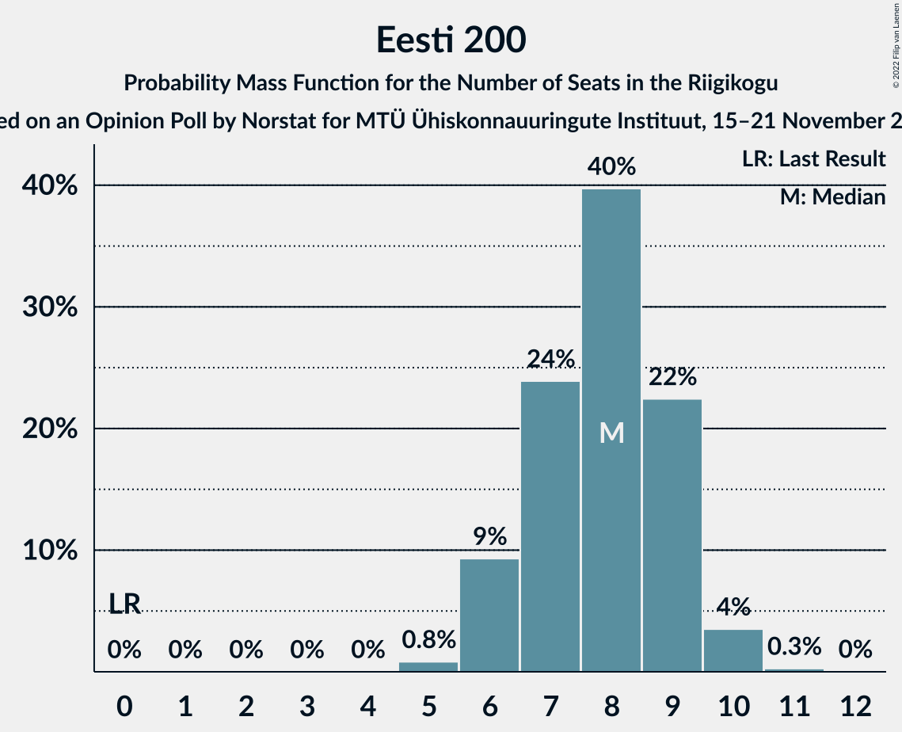

# Opinion Poll by Norstat for MTÜ Ühiskonnauuringute Instituut, 15–21 November 2022

<a href="#voting-intentions">Voting Intentions</a> | <a href="#seats">Seats</a> | <a href="#coalitions">Coalitions</a> | <a href="#technical-information">Technical Information</a>

## Voting Intentions

### Confidence Intervals

| Party | Last Result | Poll Result | 80% Confidence Interval | 90% Confidence Interval | 95% Confidence Interval | 99% Confidence Interval |
|:-----:|:-----------:|:-----------:|:-----------------------:|:-----------------------:|:-----------------------:|:-----------------------:|
| Eesti Reformierakond | 28.9% | 32.5% | 30.6–34.4% |30.1–35.0% |29.7–35.5% |28.8–36.4% |
| Eesti Konservatiivne Rahvaerakond | 17.8% | 24.3% | 22.6–26.1% |22.1–26.6% |21.7–27.1% |21.0–27.9% |
| Eesti Keskerakond | 23.1% | 18.1% | 16.6–19.7% |16.2–20.2% |15.8–20.6% |15.2–21.4% |
| Erakond Isamaa | 11.4% | 8.7% | 7.7–10.0% |7.3–10.3% |7.1–10.6% |6.6–11.2% |
| Eesti 200 | 4.4% | 8.4% | 7.4–9.6% |7.1–10.0% |6.8–10.3% |6.4–10.9% |
| Sotsiaaldemokraatlik Erakond | 9.8% | 5.9% | 5.0–7.0% |4.8–7.3% |4.6–7.5% |4.2–8.1% |
| Erakond Eestimaa Rohelised | 1.8% | 1.2% | 0.9–1.8% |0.8–1.9% |0.7–2.1% |0.5–2.4% |
| Erakond Parempoolsed | 0.0% | 0.3% | 0.2–0.7% |0.1–0.8% |0.1–0.9% |0.1–1.1% |

*Note:* The poll result column reflects the actual value used in the calculations. Published results may vary slightly, and in addition be rounded to fewer digits.

## Seats

### Confidence Intervals

| Party | Last Result | Median | 80% Confidence Interval | 90% Confidence Interval | 95% Confidence Interval | 99% Confidence Interval |
|:-----:|:-----------:|:------:|:-----------------------:|:-----------------------:|:-----------------------:|:-----------------------:|
| <a href="#eesti-reformierakond">Eesti Reformierakond</a> | 34 | 36 | 33–38 |33–39 |32–40 |31–41 |
| <a href="#eesti-konservatiivne-rahvaerakond">Eesti Konservatiivne Rahvaerakond</a> | 19 | 26 | 24–28 |23–29 |23–29 |22–30 |
| <a href="#eesti-keskerakond">Eesti Keskerakond</a> | 26 | 19 | 17–20 |16–21 |16–22 |15–23 |
| <a href="#erakond-isamaa">Erakond Isamaa</a> | 12 | 8 | 7–9 |6–10 |6–10 |6–11 |
| <a href="#eesti-200">Eesti 200</a> | 0 | 8 | 6–9 |6–9 |6–10 |5–10 |
| <a href="#sotsiaaldemokraatlik-erakond">Sotsiaaldemokraatlik Erakond</a> | 10 | 5 | 0–6 |0–6 |0–7 |0–7 |
| <a href="#erakond-eestimaa-rohelised">Erakond Eestimaa Rohelised</a> | 0 | 0 | 0 |0 |0 |0 |
| <a href="#erakond-parempoolsed">Erakond Parempoolsed</a> | 0 | 0 | 0 |0 |0 |0 |

### Eesti Reformierakond

*For a full overview of the results for this party, see the [Eesti Reformierakond](party-eestireformierakond.html) page.*

| Number of Seats | Probability | Accumulated | Special Marks |
|:---------------:|:-----------:|:-----------:|:-------------:|
| 30 | 0.1% | 100% |  |
| 31 | 0.7% | 99.9% |  |
| 32 | 2% | 99.2% |  |
| 33 | 8% | 97% |  |
| 34 | 14% | 89% | Last Result |
| 35 | 25% | 76% |  |
| 36 | 14% | 50% | Median |
| 37 | 16% | 36% |  |
| 38 | 11% | 20% |  |
| 39 | 5% | 9% |  |
| 40 | 3% | 4% |  |
| 41 | 0.8% | 1.1% |  |
| 42 | 0.2% | 0.3% |  |
| 43 | 0.1% | 0.1% |  |
| 44 | 0% | 0% |  |

### Eesti Konservatiivne Rahvaerakond

*For a full overview of the results for this party, see the [Eesti Konservatiivne Rahvaerakond](party-eestikonservatiivnerahvaerakond.html) page.*

| Number of Seats | Probability | Accumulated | Special Marks |
|:---------------:|:-----------:|:-----------:|:-------------:|
| 19 | 0% | 100% | Last Result |
| 20 | 0% | 100% |  |
| 21 | 0.2% | 100% |  |
| 22 | 2% | 99.8% |  |
| 23 | 6% | 98% |  |
| 24 | 11% | 92% |  |
| 25 | 19% | 81% |  |
| 26 | 25% | 62% | Median |
| 27 | 21% | 37% |  |
| 28 | 9% | 16% |  |
| 29 | 5% | 7% |  |
| 30 | 1.3% | 2% |  |
| 31 | 0.3% | 0.4% |  |
| 32 | 0.1% | 0.1% |  |
| 33 | 0% | 0% |  |

### Eesti Keskerakond

*For a full overview of the results for this party, see the [Eesti Keskerakond](party-eestikeskerakond.html) page.*

| Number of Seats | Probability | Accumulated | Special Marks |
|:---------------:|:-----------:|:-----------:|:-------------:|
| 14 | 0.1% | 100% |  |
| 15 | 1.0% | 99.9% |  |
| 16 | 5% | 98.9% |  |
| 17 | 15% | 93% |  |
| 18 | 20% | 79% |  |
| 19 | 31% | 59% | Median |
| 20 | 19% | 29% |  |
| 21 | 6% | 10% |  |
| 22 | 3% | 3% |  |
| 23 | 0.7% | 0.8% |  |
| 24 | 0.1% | 0.1% |  |
| 25 | 0% | 0% |  |
| 26 | 0% | 0% | Last Result |

### Erakond Isamaa

*For a full overview of the results for this party, see the [Erakond Isamaa](party-erakondisamaa.html) page.*

| Number of Seats | Probability | Accumulated | Special Marks |
|:---------------:|:-----------:|:-----------:|:-------------:|
| 5 | 0.3% | 100% |  |
| 6 | 5% | 99.7% |  |
| 7 | 25% | 94% |  |
| 8 | 41% | 69% | Median |
| 9 | 21% | 27% |  |
| 10 | 6% | 7% |  |
| 11 | 1.0% | 1.1% |  |
| 12 | 0.1% | 0.1% | Last Result |
| 13 | 0% | 0% |  |

### Eesti 200

*For a full overview of the results for this party, see the [Eesti 200](party-eesti200.html) page.*

| Number of Seats | Probability | Accumulated | Special Marks |
|:---------------:|:-----------:|:-----------:|:-------------:|
| 0 | 0% | 100% | Last Result |
| 1 | 0% | 100% |  |
| 2 | 0% | 100% |  |
| 3 | 0% | 100% |  |
| 4 | 0% | 100% |  |
| 5 | 0.8% | 100% |  |
| 6 | 9% | 99.2% |  |
| 7 | 24% | 90% |  |
| 8 | 40% | 66% | Median |
| 9 | 22% | 26% |  |
| 10 | 4% | 4% |  |
| 11 | 0.3% | 0.3% |  |
| 12 | 0% | 0% |  |

### Sotsiaaldemokraatlik Erakond

*For a full overview of the results for this party, see the [Sotsiaaldemokraatlik Erakond](party-sotsiaaldemokraatlikerakond.html) page.*

| Number of Seats | Probability | Accumulated | Special Marks |
|:---------------:|:-----------:|:-----------:|:-------------:|
| 0 | 10% | 100% |  |
| 1 | 0% | 90% |  |
| 2 | 0% | 90% |  |
| 3 | 0% | 90% |  |
| 4 | 13% | 90% |  |
| 5 | 51% | 77% | Median |
| 6 | 22% | 26% |  |
| 7 | 4% | 4% |  |
| 8 | 0.2% | 0.2% |  |
| 9 | 0% | 0% |  |
| 10 | 0% | 0% | Last Result |

### Erakond Eestimaa Rohelised

*For a full overview of the results for this party, see the [Erakond Eestimaa Rohelised](party-erakondeestimaarohelised.html) page.*

| Number of Seats | Probability | Accumulated | Special Marks |
|:---------------:|:-----------:|:-----------:|:-------------:|
| 0 | 100% | 100% | Last Result, Median |

### Erakond Parempoolsed

*For a full overview of the results for this party, see the [Erakond Parempoolsed](party-erakondparempoolsed.html) page.*

| Number of Seats | Probability | Accumulated | Special Marks |
|:---------------:|:-----------:|:-----------:|:-------------:|
| 0 | 100% | 100% | Last Result, Median |

## Coalitions

### Confidence Intervals

| Coalition | Last Result | Median | Majority? | 80% Confidence Interval | 90% Confidence Interval | 95% Confidence Interval | 99% Confidence Interval |
|:---------:|:-----------:|:------:|:---------:|:-----------------------:|:-----------------------:|:-----------------------:|:-----------------------:|
| Eesti Reformierakond – Eesti Konservatiivne Rahvaerakond – Eesti Keskerakond | 79 | 80 | 100% | 78–83 | 78–85 | 77–86 | 76–87 |
| Eesti Reformierakond – Eesti Konservatiivne Rahvaerakond – Erakond Isamaa | 65 | 69 | 100% | 67–73 | 67–73 | 66–74 | 65–77 |
| Eesti Reformierakond – Eesti Konservatiivne Rahvaerakond | 53 | 61 | 100% | 59–65 | 59–66 | 58–66 | 57–68 |
| Eesti Reformierakond – Eesti Keskerakond | 60 | 54 | 98% | 52–57 | 51–58 | 51–59 | 50–60 |
| Eesti Konservatiivne Rahvaerakond – Eesti Keskerakond – Erakond Isamaa | 57 | 53 | 86% | 50–55 | 49–56 | 49–57 | 48–58 |
| Eesti Reformierakond – Erakond Isamaa – Sotsiaaldemokraatlik Erakond | 56 | 48 | 14% | 46–51 | 45–52 | 44–53 | 43–54 |
| Eesti Konservatiivne Rahvaerakond – Eesti Keskerakond | 45 | 45 | 0.4% | 42–47 | 42–48 | 41–49 | 40–50 |
| Eesti Reformierakond – Erakond Isamaa | 46 | 44 | 0.2% | 41–47 | 41–47 | 40–48 | 39–50 |
| Eesti Reformierakond – Sotsiaaldemokraatlik Erakond | 44 | 40 | 0% | 38–43 | 37–44 | 36–44 | 35–46 |
| Eesti Keskerakond – Erakond Isamaa – Sotsiaaldemokraatlik Erakond | 48 | 32 | 0% | 29–34 | 27–34 | 27–35 | 25–36 |
| Eesti Konservatiivne Rahvaerakond – Sotsiaaldemokraatlik Erakond | 29 | 31 | 0% | 28–33 | 27–34 | 26–34 | 25–35 |
| Eesti Keskerakond – Sotsiaaldemokraatlik Erakond | 36 | 24 | 0% | 20–26 | 19–26 | 19–27 | 17–28 |

### Eesti Reformierakond – Eesti Konservatiivne Rahvaerakond – Eesti Keskerakond

| Number of Seats | Probability | Accumulated | Special Marks |
|:---------------:|:-----------:|:-----------:|:-------------:|
| 75 | 0.1% | 100% |  |
| 76 | 0.6% | 99.9% |  |
| 77 | 3% | 99.3% |  |
| 78 | 10% | 97% |  |
| 79 | 18% | 87% | Last Result |
| 80 | 26% | 69% |  |
| 81 | 20% | 43% | Median |
| 82 | 9% | 23% |  |
| 83 | 5% | 15% |  |
| 84 | 4% | 10% |  |
| 85 | 3% | 5% |  |
| 86 | 2% | 3% |  |
| 87 | 0.4% | 0.5% |  |
| 88 | 0.1% | 0.1% |  |
| 89 | 0% | 0% |  |

### Eesti Reformierakond – Eesti Konservatiivne Rahvaerakond – Erakond Isamaa

| Number of Seats | Probability | Accumulated | Special Marks |
|:---------------:|:-----------:|:-----------:|:-------------:|
| 64 | 0.1% | 100% |  |
| 65 | 0.8% | 99.9% | Last Result |
| 66 | 2% | 99.1% |  |
| 67 | 10% | 97% |  |
| 68 | 16% | 87% |  |
| 69 | 27% | 71% |  |
| 70 | 11% | 44% | Median |
| 71 | 12% | 33% |  |
| 72 | 8% | 21% |  |
| 73 | 9% | 13% |  |
| 74 | 2% | 5% |  |
| 75 | 1.1% | 2% |  |
| 76 | 0.5% | 1.3% |  |
| 77 | 0.7% | 0.8% |  |
| 78 | 0% | 0% |  |

### Eesti Reformierakond – Eesti Konservatiivne Rahvaerakond

| Number of Seats | Probability | Accumulated | Special Marks |
|:---------------:|:-----------:|:-----------:|:-------------:|
| 53 | 0% | 100% | Last Result |
| 54 | 0% | 100% |  |
| 55 | 0% | 100% |  |
| 56 | 0.2% | 100% |  |
| 57 | 0.8% | 99.8% |  |
| 58 | 3% | 99.0% |  |
| 59 | 11% | 96% |  |
| 60 | 11% | 85% |  |
| 61 | 24% | 74% |  |
| 62 | 18% | 49% | Median |
| 63 | 9% | 31% |  |
| 64 | 10% | 22% |  |
| 65 | 6% | 12% |  |
| 66 | 5% | 6% |  |
| 67 | 0.7% | 2% |  |
| 68 | 0.5% | 0.9% |  |
| 69 | 0.3% | 0.4% |  |
| 70 | 0% | 0% |  |

### Eesti Reformierakond – Eesti Keskerakond

| Number of Seats | Probability | Accumulated | Special Marks |
|:---------------:|:-----------:|:-----------:|:-------------:|
| 48 | 0.1% | 100% |  |
| 49 | 0.3% | 99.9% |  |
| 50 | 1.4% | 99.6% |  |
| 51 | 3% | 98% | Majority |
| 52 | 10% | 95% |  |
| 53 | 17% | 85% |  |
| 54 | 21% | 68% |  |
| 55 | 16% | 47% | Median |
| 56 | 13% | 31% |  |
| 57 | 9% | 18% |  |
| 58 | 6% | 9% |  |
| 59 | 2% | 3% |  |
| 60 | 0.7% | 1.1% | Last Result |
| 61 | 0.4% | 0.4% |  |
| 62 | 0% | 0.1% |  |
| 63 | 0% | 0% |  |

### Eesti Konservatiivne Rahvaerakond – Eesti Keskerakond – Erakond Isamaa

| Number of Seats | Probability | Accumulated | Special Marks |
|:---------------:|:-----------:|:-----------:|:-------------:|
| 46 | 0.1% | 100% |  |
| 47 | 0.2% | 99.8% |  |
| 48 | 2% | 99.6% |  |
| 49 | 3% | 98% |  |
| 50 | 8% | 94% |  |
| 51 | 14% | 86% | Majority |
| 52 | 19% | 72% |  |
| 53 | 20% | 53% | Median |
| 54 | 17% | 33% |  |
| 55 | 8% | 16% |  |
| 56 | 4% | 8% |  |
| 57 | 2% | 4% | Last Result |
| 58 | 0.9% | 1.2% |  |
| 59 | 0.3% | 0.4% |  |
| 60 | 0% | 0.1% |  |
| 61 | 0% | 0% |  |

### Eesti Reformierakond – Erakond Isamaa – Sotsiaaldemokraatlik Erakond

| Number of Seats | Probability | Accumulated | Special Marks |
|:---------------:|:-----------:|:-----------:|:-------------:|
| 41 | 0.1% | 100% |  |
| 42 | 0.2% | 99.9% |  |
| 43 | 1.2% | 99.7% |  |
| 44 | 1.4% | 98.5% |  |
| 45 | 4% | 97% |  |
| 46 | 9% | 93% |  |
| 47 | 13% | 83% |  |
| 48 | 21% | 70% |  |
| 49 | 18% | 49% | Median |
| 50 | 16% | 31% |  |
| 51 | 6% | 14% | Majority |
| 52 | 5% | 8% |  |
| 53 | 2% | 3% |  |
| 54 | 0.6% | 0.7% |  |
| 55 | 0.1% | 0.1% |  |
| 56 | 0% | 0% | Last Result |

### Eesti Konservatiivne Rahvaerakond – Eesti Keskerakond

| Number of Seats | Probability | Accumulated | Special Marks |
|:---------------:|:-----------:|:-----------:|:-------------:|
| 38 | 0.1% | 100% |  |
| 39 | 0.3% | 99.9% |  |
| 40 | 1.2% | 99.6% |  |
| 41 | 3% | 98% |  |
| 42 | 8% | 95% |  |
| 43 | 12% | 87% |  |
| 44 | 21% | 75% |  |
| 45 | 25% | 53% | Last Result, Median |
| 46 | 9% | 28% |  |
| 47 | 11% | 19% |  |
| 48 | 4% | 8% |  |
| 49 | 2% | 3% |  |
| 50 | 0.6% | 1.0% |  |
| 51 | 0.3% | 0.4% | Majority |
| 52 | 0% | 0.1% |  |
| 53 | 0% | 0% |  |

### Eesti Reformierakond – Erakond Isamaa

| Number of Seats | Probability | Accumulated | Special Marks |
|:---------------:|:-----------:|:-----------:|:-------------:|
| 38 | 0.1% | 100% |  |
| 39 | 0.9% | 99.8% |  |
| 40 | 2% | 98.9% |  |
| 41 | 9% | 97% |  |
| 42 | 13% | 87% |  |
| 43 | 23% | 75% |  |
| 44 | 16% | 51% | Median |
| 45 | 18% | 36% |  |
| 46 | 7% | 18% | Last Result |
| 47 | 7% | 11% |  |
| 48 | 3% | 5% |  |
| 49 | 1.0% | 2% |  |
| 50 | 0.6% | 0.8% |  |
| 51 | 0.1% | 0.2% | Majority |
| 52 | 0% | 0% |  |

### Eesti Reformierakond – Sotsiaaldemokraatlik Erakond

| Number of Seats | Probability | Accumulated | Special Marks |
|:---------------:|:-----------:|:-----------:|:-------------:|
| 33 | 0% | 100% |  |
| 34 | 0.4% | 99.9% |  |
| 35 | 1.3% | 99.6% |  |
| 36 | 2% | 98% |  |
| 37 | 4% | 97% |  |
| 38 | 9% | 93% |  |
| 39 | 15% | 84% |  |
| 40 | 23% | 70% |  |
| 41 | 14% | 47% | Median |
| 42 | 16% | 33% |  |
| 43 | 9% | 17% |  |
| 44 | 6% | 8% | Last Result |
| 45 | 2% | 2% |  |
| 46 | 0.4% | 0.6% |  |
| 47 | 0.1% | 0.2% |  |
| 48 | 0% | 0% |  |

### Eesti Keskerakond – Erakond Isamaa – Sotsiaaldemokraatlik Erakond

| Number of Seats | Probability | Accumulated | Special Marks |
|:---------------:|:-----------:|:-----------:|:-------------:|
| 24 | 0.1% | 100% |  |
| 25 | 0.5% | 99.8% |  |
| 26 | 1.2% | 99.4% |  |
| 27 | 3% | 98% |  |
| 28 | 4% | 95% |  |
| 29 | 8% | 91% |  |
| 30 | 12% | 82% |  |
| 31 | 18% | 70% |  |
| 32 | 23% | 52% | Median |
| 33 | 15% | 30% |  |
| 34 | 11% | 15% |  |
| 35 | 3% | 4% |  |
| 36 | 1.2% | 1.5% |  |
| 37 | 0.2% | 0.3% |  |
| 38 | 0.1% | 0.1% |  |
| 39 | 0% | 0% |  |
| 40 | 0% | 0% |  |
| 41 | 0% | 0% |  |
| 42 | 0% | 0% |  |
| 43 | 0% | 0% |  |
| 44 | 0% | 0% |  |
| 45 | 0% | 0% |  |
| 46 | 0% | 0% |  |
| 47 | 0% | 0% |  |
| 48 | 0% | 0% | Last Result |

### Eesti Konservatiivne Rahvaerakond – Sotsiaaldemokraatlik Erakond

| Number of Seats | Probability | Accumulated | Special Marks |
|:---------------:|:-----------:|:-----------:|:-------------:|
| 23 | 0.1% | 100% |  |
| 24 | 0.4% | 99.9% |  |
| 25 | 0.8% | 99.5% |  |
| 26 | 2% | 98.7% |  |
| 27 | 3% | 96% |  |
| 28 | 8% | 93% |  |
| 29 | 12% | 85% | Last Result |
| 30 | 14% | 73% |  |
| 31 | 25% | 59% | Median |
| 32 | 19% | 33% |  |
| 33 | 8% | 14% |  |
| 34 | 5% | 7% |  |
| 35 | 1.2% | 2% |  |
| 36 | 0.3% | 0.4% |  |
| 37 | 0.1% | 0.1% |  |
| 38 | 0% | 0% |  |

### Eesti Keskerakond – Sotsiaaldemokraatlik Erakond

| Number of Seats | Probability | Accumulated | Special Marks |
|:---------------:|:-----------:|:-----------:|:-------------:|
| 16 | 0.2% | 100% |  |
| 17 | 0.8% | 99.8% |  |
| 18 | 1.0% | 99.1% |  |
| 19 | 3% | 98% |  |
| 20 | 5% | 95% |  |
| 21 | 6% | 90% |  |
| 22 | 12% | 84% |  |
| 23 | 18% | 72% |  |
| 24 | 27% | 54% | Median |
| 25 | 13% | 27% |  |
| 26 | 9% | 14% |  |
| 27 | 4% | 5% |  |
| 28 | 0.8% | 1.0% |  |
| 29 | 0.2% | 0.2% |  |
| 30 | 0% | 0% |  |
| 31 | 0% | 0% |  |
| 32 | 0% | 0% |  |
| 33 | 0% | 0% |  |
| 34 | 0% | 0% |  |
| 35 | 0% | 0% |  |
| 36 | 0% | 0% | Last Result |

## Technical Information

### Opinion Poll

+ **Polling firm:** Norstat
+ **Commissioner(s):** MTÜ Ühiskonnauuringute Instituut
+ **Fieldwork period:** 15–21 November 2022

### Calculations

+ **Sample size:** 1000
+ **Simulations done:** 1,048,576
+ **Error estimate:** 1.30%

