# Opinion Poll by Norstat for MTÜ Ühiskonnauuringute Instituut, 22–28 November 2022

<a href="#voting-intentions">Voting Intentions</a> | <a href="#seats">Seats</a> | <a href="#coalitions">Coalitions</a> | <a href="#technical-information">Technical Information</a>

## Voting Intentions

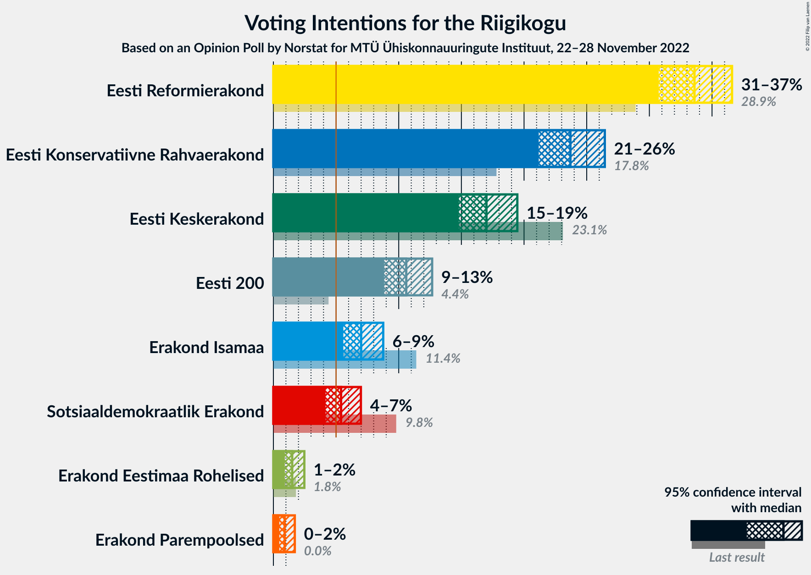

### Confidence Intervals

| Party | Last Result | Poll Result | 80% Confidence Interval | 90% Confidence Interval | 95% Confidence Interval | 99% Confidence Interval |
|:-----:|:-----------:|:-----------:|:-----------------------:|:-----------------------:|:-----------------------:|:-----------------------:|
| Eesti Reformierakond | 28.9% | 33.6% | 31.7–35.6% |31.2–36.1% |30.7–36.6% |29.8–37.5% |
| Eesti Konservatiivne Rahvaerakond | 17.8% | 23.7% | 22.0–25.5% |21.6–26.0% |21.2–26.4% |20.4–27.3% |
| Eesti Keskerakond | 23.1% | 17.0% | 15.5–18.6% |15.2–19.1% |14.8–19.5% |14.1–20.3% |
| Eesti 200 | 4.4% | 10.6% | 9.4–11.9% |9.1–12.3% |8.8–12.7% |8.3–13.3% |
| Erakond Isamaa | 11.4% | 7.0% | 6.1–8.2% |5.8–8.5% |5.6–8.8% |5.2–9.3% |
| Sotsiaaldemokraatlik Erakond | 9.8% | 5.4% | 4.6–6.4% |4.4–6.7% |4.2–7.0% |3.8–7.5% |
| Erakond Eestimaa Rohelised | 1.8% | 1.5% | 1.1–2.1% |1.0–2.3% |0.9–2.5% |0.7–2.8% |
| Erakond Parempoolsed | 0.0% | 0.9% | 0.6–1.4% |0.5–1.6% |0.5–1.7% |0.4–2.0% |

*Note:* The poll result column reflects the actual value used in the calculations. Published results may vary slightly, and in addition be rounded to fewer digits.

## Seats

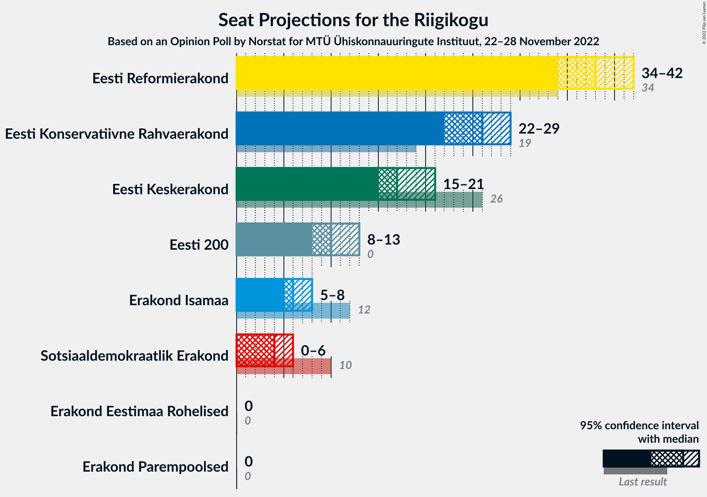

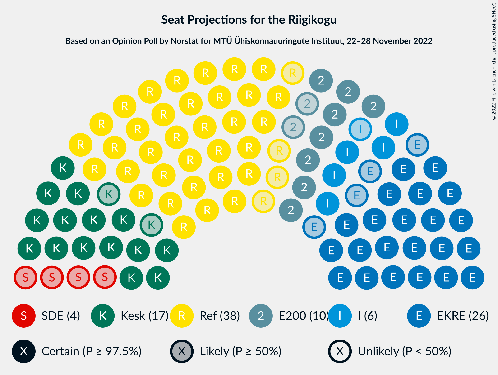

### Confidence Intervals

| Party | Last Result | Median | 80% Confidence Interval | 90% Confidence Interval | 95% Confidence Interval | 99% Confidence Interval |
|:-----:|:-----------:|:------:|:-----------------------:|:-----------------------:|:-----------------------:|:-----------------------:|
| <a href="#eesti-reformierakond">Eesti Reformierakond</a> | 34 | 38 | 35–41 |34–41 |34–42 |33–43 |
| <a href="#eesti-konservatiivne-rahvaerakond">Eesti Konservatiivne Rahvaerakond</a> | 19 | 26 | 23–28 |23–29 |22–29 |21–30 |
| <a href="#eesti-keskerakond">Eesti Keskerakond</a> | 26 | 17 | 16–20 |15–20 |15–21 |14–22 |
| <a href="#eesti-200">Eesti 200</a> | 0 | 10 | 9–12 |8–12 |8–13 |8–13 |
| <a href="#erakond-isamaa">Erakond Isamaa</a> | 12 | 6 | 5–8 |5–8 |5–8 |4–9 |
| <a href="#sotsiaaldemokraatlik-erakond">Sotsiaaldemokraatlik Erakond</a> | 10 | 4 | 0–6 |0–6 |0–6 |0–7 |
| <a href="#erakond-eestimaa-rohelised">Erakond Eestimaa Rohelised</a> | 0 | 0 | 0 |0 |0 |0 |
| <a href="#erakond-parempoolsed">Erakond Parempoolsed</a> | 0 | 0 | 0 |0 |0 |0 |

### Eesti Reformierakond

*For a full overview of the results for this party, see the [Eesti Reformierakond](party-eestireformierakond.html) page.*

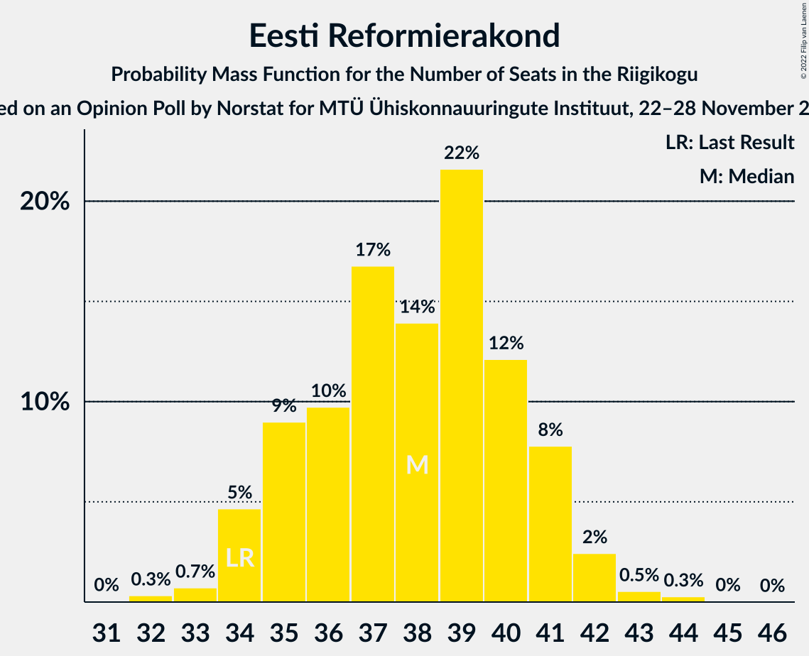

| Number of Seats | Probability | Accumulated | Special Marks |
|:---------------:|:-----------:|:-----------:|:-------------:|
| 31 | 0% | 100% |  |
| 32 | 0.3% | 99.9% |  |
| 33 | 0.7% | 99.6% |  |
| 34 | 5% | 98.9% | Last Result |
| 35 | 9% | 94% |  |
| 36 | 10% | 85% |  |
| 37 | 17% | 76% |  |
| 38 | 14% | 59% | Median |
| 39 | 22% | 45% |  |
| 40 | 12% | 23% |  |
| 41 | 8% | 11% |  |
| 42 | 2% | 3% |  |
| 43 | 0.5% | 0.9% |  |
| 44 | 0.3% | 0.3% |  |
| 45 | 0% | 0.1% |  |
| 46 | 0% | 0% |  |

### Eesti Konservatiivne Rahvaerakond

*For a full overview of the results for this party, see the [Eesti Konservatiivne Rahvaerakond](party-eestikonservatiivnerahvaerakond.html) page.*

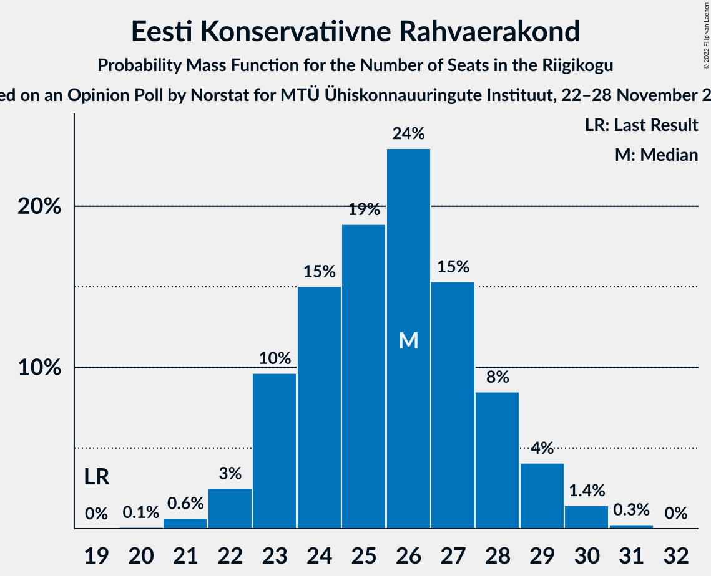

| Number of Seats | Probability | Accumulated | Special Marks |
|:---------------:|:-----------:|:-----------:|:-------------:|
| 19 | 0% | 100% | Last Result |
| 20 | 0.1% | 100% |  |
| 21 | 0.6% | 99.9% |  |
| 22 | 3% | 99.3% |  |
| 23 | 10% | 97% |  |
| 24 | 15% | 87% |  |
| 25 | 19% | 72% |  |
| 26 | 24% | 53% | Median |
| 27 | 15% | 30% |  |
| 28 | 8% | 14% |  |
| 29 | 4% | 6% |  |
| 30 | 1.4% | 2% |  |
| 31 | 0.3% | 0.3% |  |
| 32 | 0% | 0% |  |

### Eesti Keskerakond

*For a full overview of the results for this party, see the [Eesti Keskerakond](party-eestikeskerakond.html) page.*

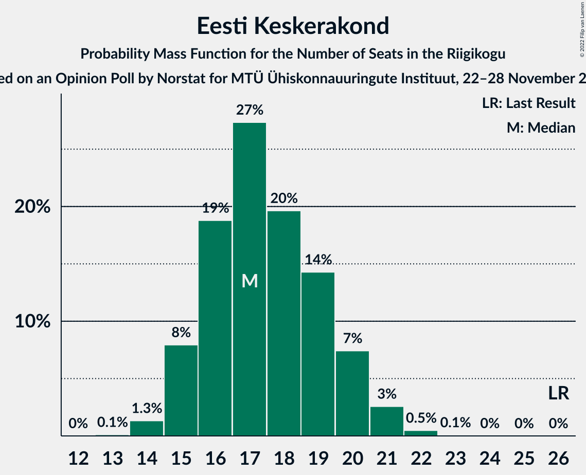

| Number of Seats | Probability | Accumulated | Special Marks |
|:---------------:|:-----------:|:-----------:|:-------------:|
| 13 | 0.1% | 100% |  |
| 14 | 1.3% | 99.9% |  |
| 15 | 8% | 98.6% |  |
| 16 | 19% | 91% |  |
| 17 | 27% | 72% | Median |
| 18 | 20% | 44% |  |
| 19 | 14% | 25% |  |
| 20 | 7% | 11% |  |
| 21 | 3% | 3% |  |
| 22 | 0.5% | 0.6% |  |
| 23 | 0.1% | 0.1% |  |
| 24 | 0% | 0% |  |
| 25 | 0% | 0% |  |
| 26 | 0% | 0% | Last Result |

### Eesti 200

*For a full overview of the results for this party, see the [Eesti 200](party-eesti200.html) page.*

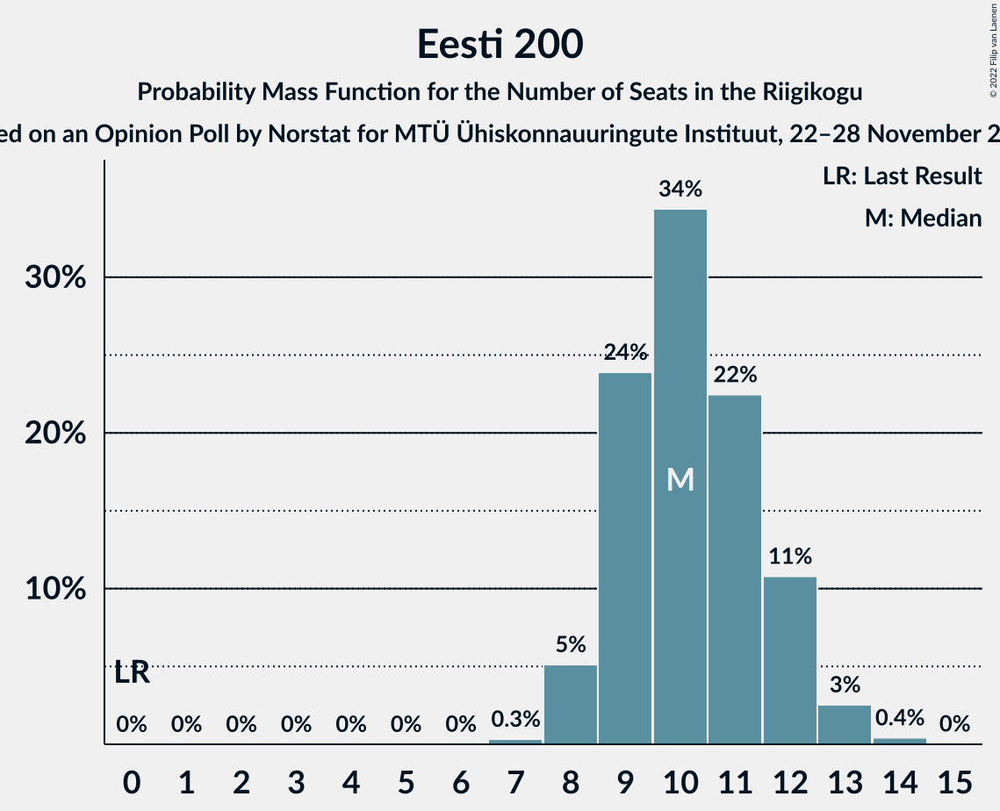

| Number of Seats | Probability | Accumulated | Special Marks |
|:---------------:|:-----------:|:-----------:|:-------------:|
| 0 | 0% | 100% | Last Result |
| 1 | 0% | 100% |  |
| 2 | 0% | 100% |  |
| 3 | 0% | 100% |  |
| 4 | 0% | 100% |  |
| 5 | 0% | 100% |  |
| 6 | 0% | 100% |  |
| 7 | 0.3% | 100% |  |
| 8 | 5% | 99.7% |  |
| 9 | 24% | 95% |  |
| 10 | 34% | 71% | Median |
| 11 | 22% | 36% |  |
| 12 | 11% | 14% |  |
| 13 | 3% | 3% |  |
| 14 | 0.4% | 0.5% |  |
| 15 | 0% | 0% |  |

### Erakond Isamaa

*For a full overview of the results for this party, see the [Erakond Isamaa](party-erakondisamaa.html) page.*

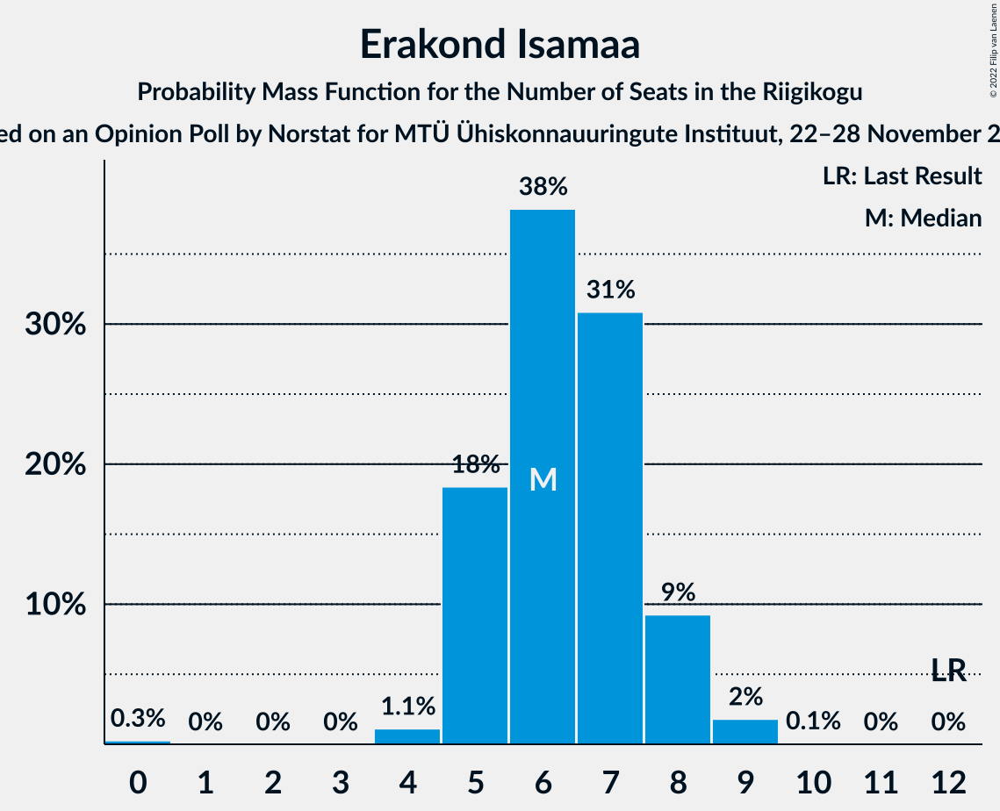

| Number of Seats | Probability | Accumulated | Special Marks |
|:---------------:|:-----------:|:-----------:|:-------------:|
| 0 | 0.3% | 100% |  |
| 1 | 0% | 99.7% |  |
| 2 | 0% | 99.7% |  |
| 3 | 0% | 99.7% |  |
| 4 | 1.1% | 99.7% |  |
| 5 | 18% | 98.6% |  |
| 6 | 38% | 80% | Median |
| 7 | 31% | 42% |  |
| 8 | 9% | 11% |  |
| 9 | 2% | 2% |  |
| 10 | 0.1% | 0.1% |  |
| 11 | 0% | 0% |  |
| 12 | 0% | 0% | Last Result |

### Sotsiaaldemokraatlik Erakond

*For a full overview of the results for this party, see the [Sotsiaaldemokraatlik Erakond](party-sotsiaaldemokraatlikerakond.html) page.*

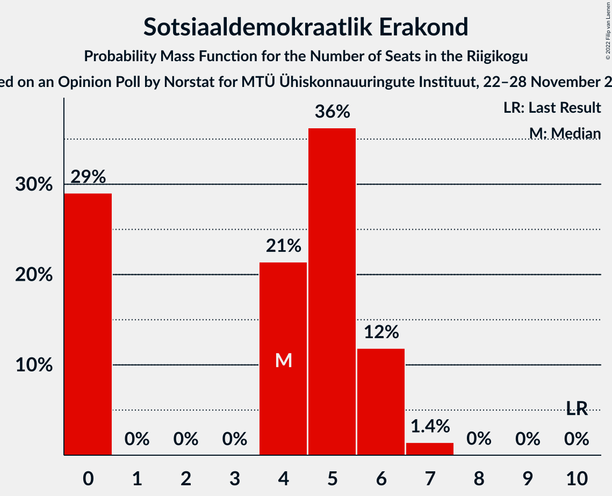

| Number of Seats | Probability | Accumulated | Special Marks |
|:---------------:|:-----------:|:-----------:|:-------------:|
| 0 | 29% | 100% |  |
| 1 | 0% | 71% |  |
| 2 | 0% | 71% |  |
| 3 | 0% | 71% |  |
| 4 | 21% | 71% | Median |
| 5 | 36% | 50% |  |
| 6 | 12% | 13% |  |
| 7 | 1.4% | 1.5% |  |
| 8 | 0% | 0% |  |
| 9 | 0% | 0% |  |
| 10 | 0% | 0% | Last Result |

### Erakond Eestimaa Rohelised

*For a full overview of the results for this party, see the [Erakond Eestimaa Rohelised](party-erakondeestimaarohelised.html) page.*

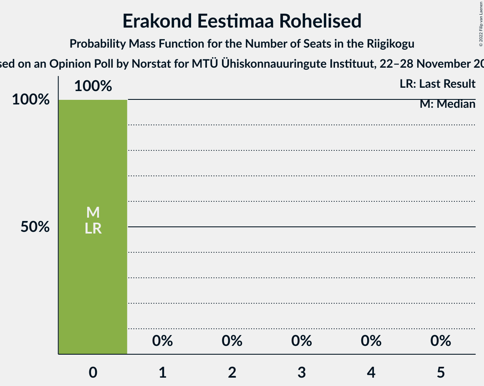

| Number of Seats | Probability | Accumulated | Special Marks |
|:---------------:|:-----------:|:-----------:|:-------------:|
| 0 | 100% | 100% | Last Result, Median |

### Erakond Parempoolsed

*For a full overview of the results for this party, see the [Erakond Parempoolsed](party-erakondparempoolsed.html) page.*

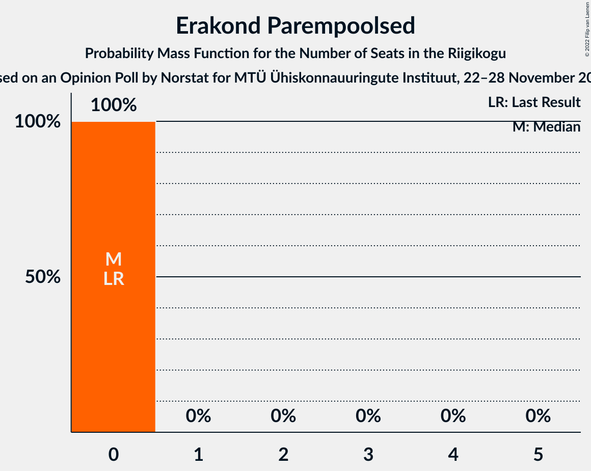

| Number of Seats | Probability | Accumulated | Special Marks |
|:---------------:|:-----------:|:-----------:|:-------------:|
| 0 | 100% | 100% | Last Result, Median |

## Coalitions

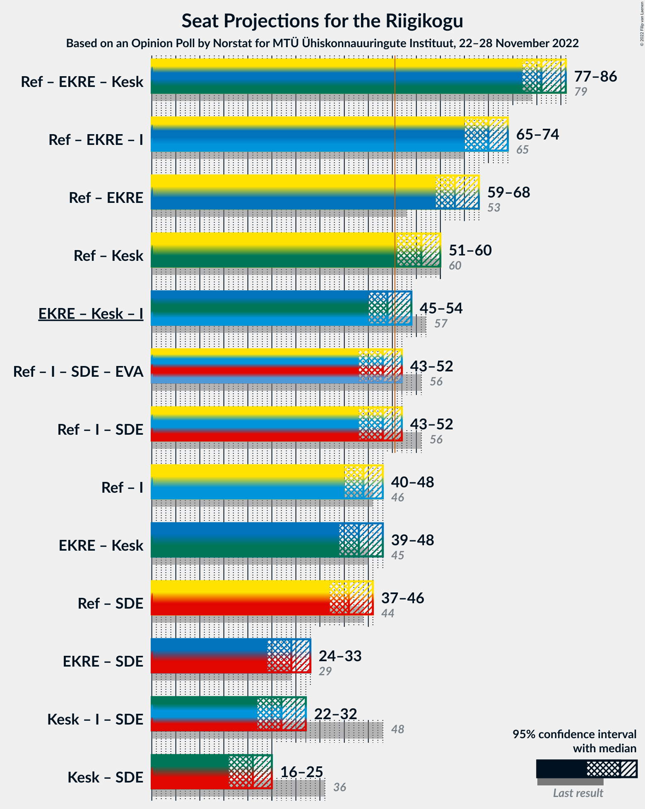

### Confidence Intervals

| Coalition | Last Result | Median | Majority? | 80% Confidence Interval | 90% Confidence Interval | 95% Confidence Interval | 99% Confidence Interval |
|:---------:|:-----------:|:------:|:---------:|:-----------------------:|:-----------------------:|:-----------------------:|:-----------------------:|
| Eesti Reformierakond – Eesti Konservatiivne Rahvaerakond – Eesti Keskerakond | 79 | 81 | 100% | 78–84 | 78–85 | 77–86 | 76–87 |
| Eesti Reformierakond – Eesti Konservatiivne Rahvaerakond – Erakond Isamaa | 65 | 70 | 100% | 67–73 | 66–74 | 65–74 | 65–75 |
| Eesti Reformierakond – Eesti Konservatiivne Rahvaerakond | 53 | 63 | 100% | 60–67 | 60–68 | 59–68 | 58–69 |
| Eesti Reformierakond – Eesti Keskerakond | 60 | 56 | 99.2% | 52–58 | 52–59 | 51–60 | 50–61 |
| Eesti Konservatiivne Rahvaerakond – Eesti Keskerakond – Erakond Isamaa | 57 | 49 | 31% | 46–52 | 46–53 | 45–54 | 44–55 |
| Eesti Reformierakond – Erakond Isamaa – Sotsiaaldemokraatlik Erakond | 56 | 48 | 14% | 45–51 | 44–52 | 43–52 | 42–53 |
| Eesti Reformierakond – Erakond Isamaa | 46 | 44 | 0.1% | 41–47 | 41–48 | 40–48 | 39–50 |
| Eesti Konservatiivne Rahvaerakond – Eesti Keskerakond | 45 | 43 | 0% | 40–46 | 39–47 | 39–48 | 38–49 |
| Eesti Reformierakond – Sotsiaaldemokraatlik Erakond | 44 | 41 | 0% | 38–45 | 37–45 | 37–46 | 35–47 |
| Eesti Konservatiivne Rahvaerakond – Sotsiaaldemokraatlik Erakond | 29 | 29 | 0% | 26–32 | 25–33 | 24–33 | 23–34 |
| Eesti Keskerakond – Erakond Isamaa – Sotsiaaldemokraatlik Erakond | 48 | 27 | 0% | 24–30 | 23–31 | 22–32 | 21–32 |
| Eesti Keskerakond – Sotsiaaldemokraatlik Erakond | 36 | 21 | 0% | 17–24 | 16–25 | 16–25 | 15–26 |

### Eesti Reformierakond – Eesti Konservatiivne Rahvaerakond – Eesti Keskerakond

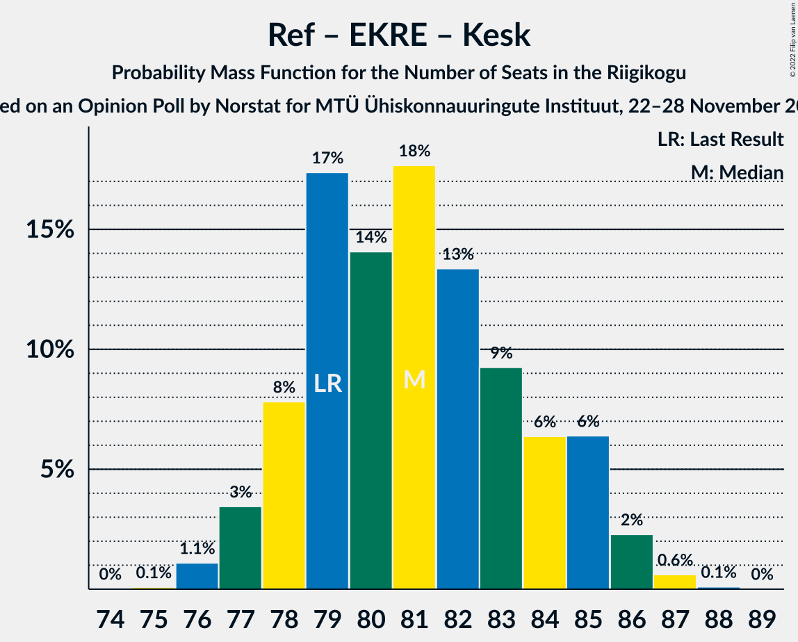

| Number of Seats | Probability | Accumulated | Special Marks |
|:---------------:|:-----------:|:-----------:|:-------------:|
| 75 | 0.1% | 100% |  |
| 76 | 1.1% | 99.9% |  |
| 77 | 3% | 98.8% |  |
| 78 | 8% | 95% |  |
| 79 | 17% | 88% | Last Result |
| 80 | 14% | 70% |  |
| 81 | 18% | 56% | Median |
| 82 | 13% | 38% |  |
| 83 | 9% | 25% |  |
| 84 | 6% | 16% |  |
| 85 | 6% | 9% |  |
| 86 | 2% | 3% |  |
| 87 | 0.6% | 0.8% |  |
| 88 | 0.1% | 0.1% |  |
| 89 | 0% | 0% |  |

### Eesti Reformierakond – Eesti Konservatiivne Rahvaerakond – Erakond Isamaa

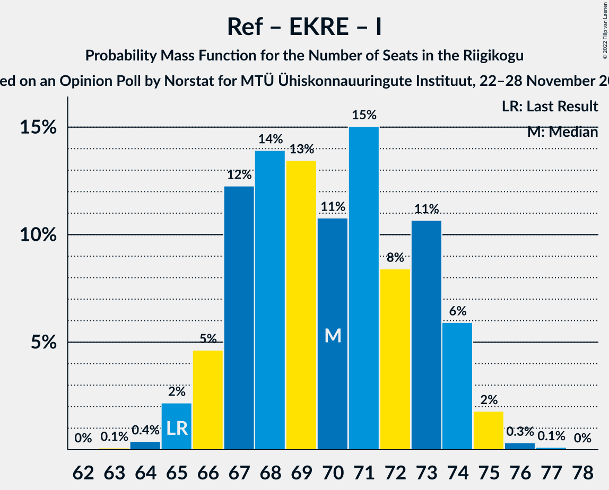

| Number of Seats | Probability | Accumulated | Special Marks |
|:---------------:|:-----------:|:-----------:|:-------------:|
| 63 | 0.1% | 100% |  |
| 64 | 0.4% | 99.9% |  |
| 65 | 2% | 99.5% | Last Result |
| 66 | 5% | 97% |  |
| 67 | 12% | 93% |  |
| 68 | 14% | 80% |  |
| 69 | 13% | 67% |  |
| 70 | 11% | 53% | Median |
| 71 | 15% | 42% |  |
| 72 | 8% | 27% |  |
| 73 | 11% | 19% |  |
| 74 | 6% | 8% |  |
| 75 | 2% | 2% |  |
| 76 | 0.3% | 0.4% |  |
| 77 | 0.1% | 0.1% |  |
| 78 | 0% | 0% |  |

### Eesti Reformierakond – Eesti Konservatiivne Rahvaerakond

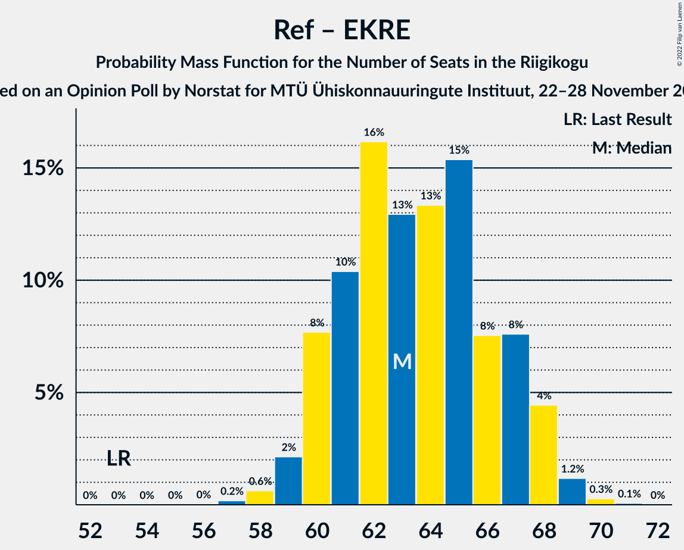

| Number of Seats | Probability | Accumulated | Special Marks |
|:---------------:|:-----------:|:-----------:|:-------------:|
| 53 | 0% | 100% | Last Result |
| 54 | 0% | 100% |  |
| 55 | 0% | 100% |  |
| 56 | 0% | 100% |  |
| 57 | 0.2% | 100% |  |
| 58 | 0.6% | 99.8% |  |
| 59 | 2% | 99.2% |  |
| 60 | 8% | 97% |  |
| 61 | 10% | 89% |  |
| 62 | 16% | 79% |  |
| 63 | 13% | 63% |  |
| 64 | 13% | 50% | Median |
| 65 | 15% | 36% |  |
| 66 | 8% | 21% |  |
| 67 | 8% | 14% |  |
| 68 | 4% | 6% |  |
| 69 | 1.2% | 2% |  |
| 70 | 0.3% | 0.4% |  |
| 71 | 0.1% | 0.1% |  |
| 72 | 0% | 0% |  |

### Eesti Reformierakond – Eesti Keskerakond

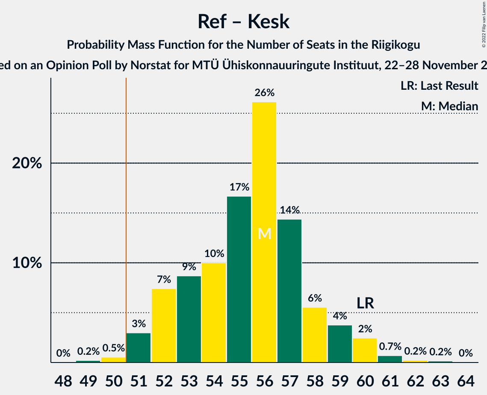

| Number of Seats | Probability | Accumulated | Special Marks |
|:---------------:|:-----------:|:-----------:|:-------------:|
| 49 | 0.2% | 100% |  |
| 50 | 0.5% | 99.8% |  |
| 51 | 3% | 99.2% | Majority |
| 52 | 7% | 96% |  |
| 53 | 9% | 89% |  |
| 54 | 10% | 80% |  |
| 55 | 17% | 70% | Median |
| 56 | 26% | 53% |  |
| 57 | 14% | 27% |  |
| 58 | 6% | 13% |  |
| 59 | 4% | 7% |  |
| 60 | 2% | 4% | Last Result |
| 61 | 0.7% | 1.1% |  |
| 62 | 0.2% | 0.4% |  |
| 63 | 0.2% | 0.2% |  |
| 64 | 0% | 0% |  |

### Eesti Konservatiivne Rahvaerakond – Eesti Keskerakond – Erakond Isamaa

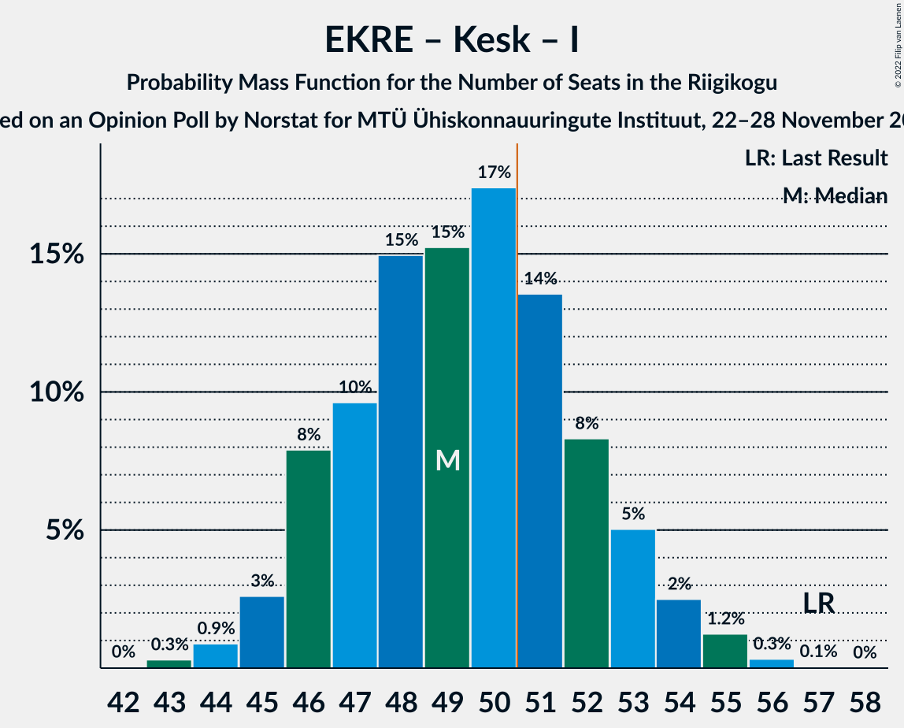

| Number of Seats | Probability | Accumulated | Special Marks |
|:---------------:|:-----------:|:-----------:|:-------------:|
| 43 | 0.3% | 100% |  |
| 44 | 0.9% | 99.6% |  |
| 45 | 3% | 98.8% |  |
| 46 | 8% | 96% |  |
| 47 | 10% | 88% |  |
| 48 | 15% | 79% |  |
| 49 | 15% | 64% | Median |
| 50 | 17% | 48% |  |
| 51 | 14% | 31% | Majority |
| 52 | 8% | 17% |  |
| 53 | 5% | 9% |  |
| 54 | 2% | 4% |  |
| 55 | 1.2% | 2% |  |
| 56 | 0.3% | 0.4% |  |
| 57 | 0.1% | 0.1% | Last Result |
| 58 | 0% | 0% |  |

### Eesti Reformierakond – Erakond Isamaa – Sotsiaaldemokraatlik Erakond

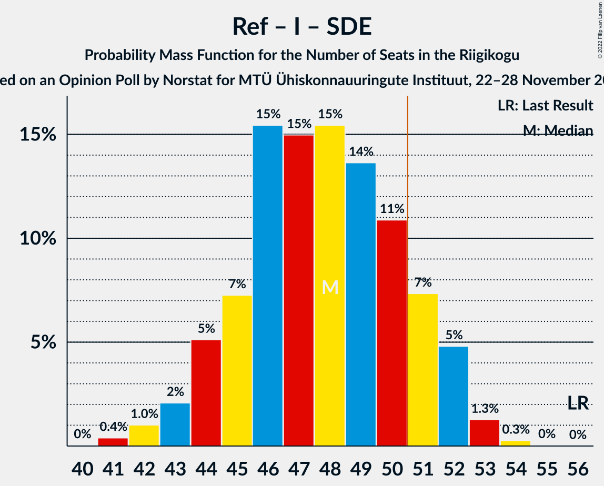

| Number of Seats | Probability | Accumulated | Special Marks |
|:---------------:|:-----------:|:-----------:|:-------------:|
| 40 | 0% | 100% |  |
| 41 | 0.4% | 99.9% |  |
| 42 | 1.0% | 99.5% |  |
| 43 | 2% | 98.5% |  |
| 44 | 5% | 96% |  |
| 45 | 7% | 91% |  |
| 46 | 15% | 84% |  |
| 47 | 15% | 69% |  |
| 48 | 15% | 54% | Median |
| 49 | 14% | 38% |  |
| 50 | 11% | 25% |  |
| 51 | 7% | 14% | Majority |
| 52 | 5% | 6% |  |
| 53 | 1.3% | 2% |  |
| 54 | 0.3% | 0.3% |  |
| 55 | 0% | 0.1% |  |
| 56 | 0% | 0% | Last Result |

### Eesti Reformierakond – Erakond Isamaa

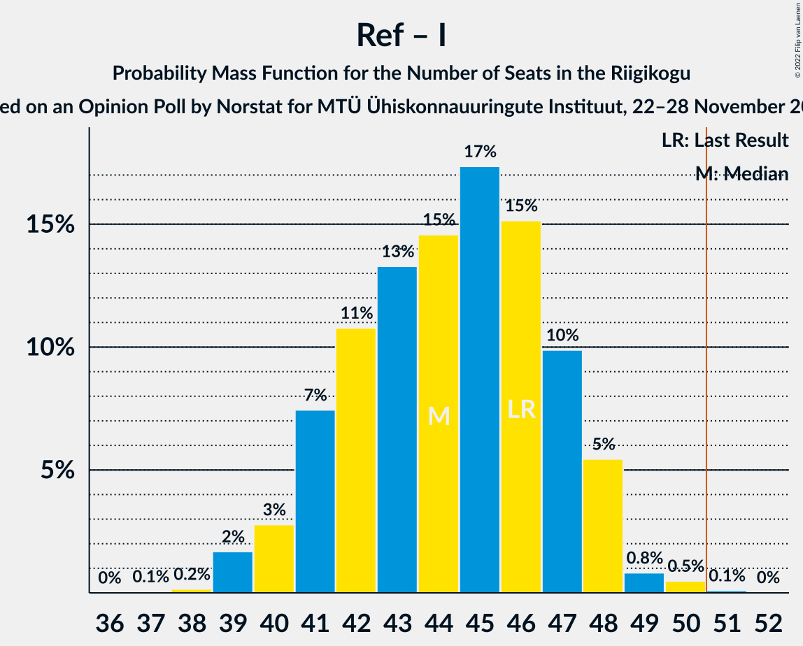

| Number of Seats | Probability | Accumulated | Special Marks |
|:---------------:|:-----------:|:-----------:|:-------------:|
| 37 | 0.1% | 100% |  |
| 38 | 0.2% | 99.9% |  |
| 39 | 2% | 99.8% |  |
| 40 | 3% | 98% |  |
| 41 | 7% | 95% |  |
| 42 | 11% | 88% |  |
| 43 | 13% | 77% |  |
| 44 | 15% | 64% | Median |
| 45 | 17% | 49% |  |
| 46 | 15% | 32% | Last Result |
| 47 | 10% | 17% |  |
| 48 | 5% | 7% |  |
| 49 | 0.8% | 1.4% |  |
| 50 | 0.5% | 0.6% |  |
| 51 | 0.1% | 0.1% | Majority |
| 52 | 0% | 0% |  |

### Eesti Konservatiivne Rahvaerakond – Eesti Keskerakond

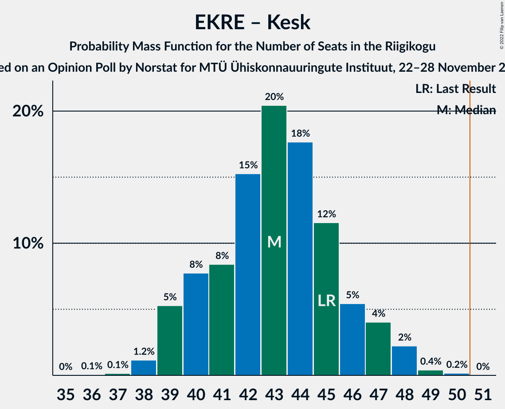

| Number of Seats | Probability | Accumulated | Special Marks |
|:---------------:|:-----------:|:-----------:|:-------------:|
| 36 | 0.1% | 100% |  |
| 37 | 0.1% | 99.9% |  |
| 38 | 1.2% | 99.8% |  |
| 39 | 5% | 98.6% |  |
| 40 | 8% | 93% |  |
| 41 | 8% | 86% |  |
| 42 | 15% | 77% |  |
| 43 | 20% | 62% | Median |
| 44 | 18% | 42% |  |
| 45 | 12% | 24% | Last Result |
| 46 | 5% | 12% |  |
| 47 | 4% | 7% |  |
| 48 | 2% | 3% |  |
| 49 | 0.4% | 0.6% |  |
| 50 | 0.2% | 0.2% |  |
| 51 | 0% | 0% | Majority |

### Eesti Reformierakond – Sotsiaaldemokraatlik Erakond

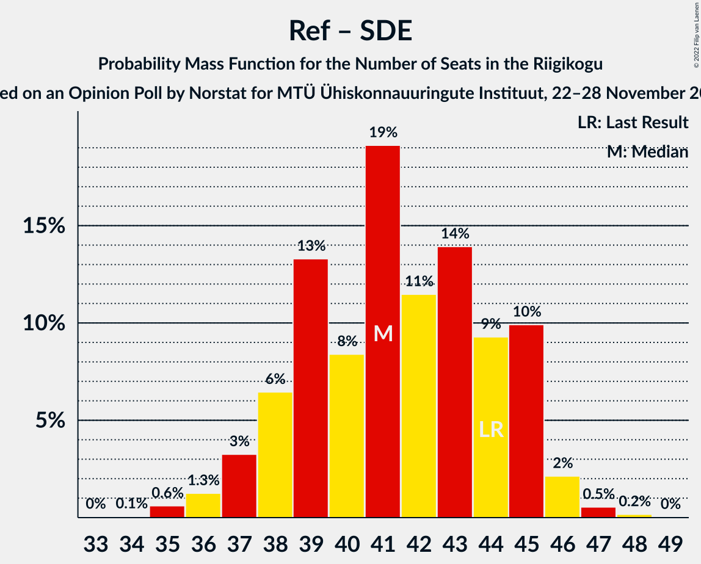

| Number of Seats | Probability | Accumulated | Special Marks |
|:---------------:|:-----------:|:-----------:|:-------------:|
| 33 | 0% | 100% |  |
| 34 | 0.1% | 99.9% |  |
| 35 | 0.6% | 99.9% |  |
| 36 | 1.3% | 99.3% |  |
| 37 | 3% | 98% |  |
| 38 | 6% | 95% |  |
| 39 | 13% | 88% |  |
| 40 | 8% | 75% |  |
| 41 | 19% | 67% |  |
| 42 | 11% | 47% | Median |
| 43 | 14% | 36% |  |
| 44 | 9% | 22% | Last Result |
| 45 | 10% | 13% |  |
| 46 | 2% | 3% |  |
| 47 | 0.5% | 0.8% |  |
| 48 | 0.2% | 0.2% |  |
| 49 | 0% | 0% |  |

### Eesti Konservatiivne Rahvaerakond – Sotsiaaldemokraatlik Erakond

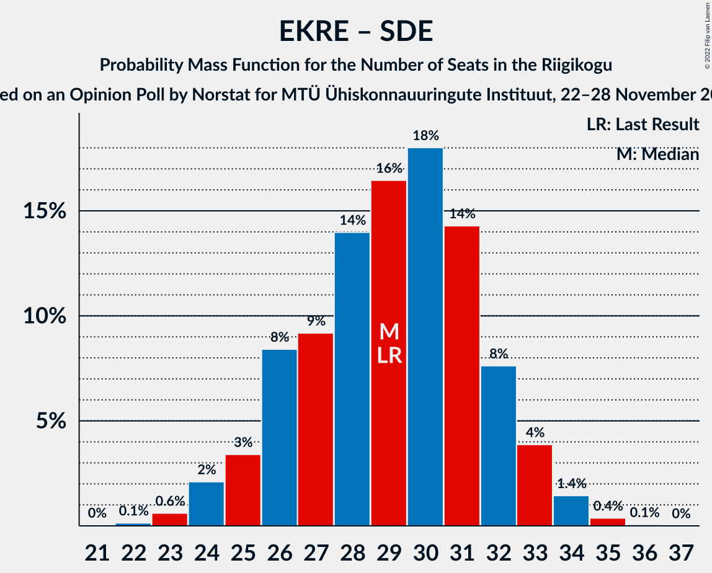

| Number of Seats | Probability | Accumulated | Special Marks |
|:---------------:|:-----------:|:-----------:|:-------------:|
| 22 | 0.1% | 100% |  |
| 23 | 0.6% | 99.8% |  |
| 24 | 2% | 99.2% |  |
| 25 | 3% | 97% |  |
| 26 | 8% | 94% |  |
| 27 | 9% | 85% |  |
| 28 | 14% | 76% |  |
| 29 | 16% | 62% | Last Result |
| 30 | 18% | 46% | Median |
| 31 | 14% | 28% |  |
| 32 | 8% | 13% |  |
| 33 | 4% | 6% |  |
| 34 | 1.4% | 2% |  |
| 35 | 0.4% | 0.4% |  |
| 36 | 0.1% | 0.1% |  |
| 37 | 0% | 0% |  |

### Eesti Keskerakond – Erakond Isamaa – Sotsiaaldemokraatlik Erakond

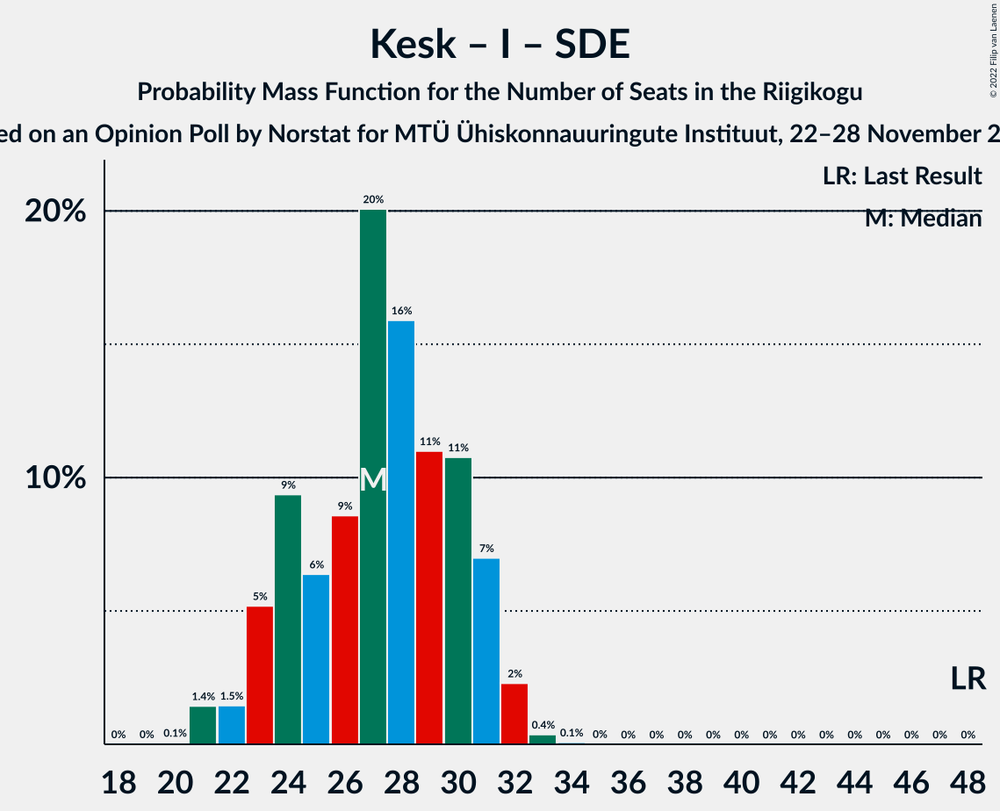

| Number of Seats | Probability | Accumulated | Special Marks |
|:---------------:|:-----------:|:-----------:|:-------------:|
| 20 | 0.1% | 100% |  |
| 21 | 1.4% | 99.9% |  |
| 22 | 1.5% | 98% |  |
| 23 | 5% | 97% |  |
| 24 | 9% | 92% |  |
| 25 | 6% | 82% |  |
| 26 | 9% | 76% |  |
| 27 | 20% | 67% | Median |
| 28 | 16% | 47% |  |
| 29 | 11% | 32% |  |
| 30 | 11% | 21% |  |
| 31 | 7% | 10% |  |
| 32 | 2% | 3% |  |
| 33 | 0.4% | 0.5% |  |
| 34 | 0.1% | 0.1% |  |
| 35 | 0% | 0% |  |
| 36 | 0% | 0% |  |
| 37 | 0% | 0% |  |
| 38 | 0% | 0% |  |
| 39 | 0% | 0% |  |
| 40 | 0% | 0% |  |
| 41 | 0% | 0% |  |
| 42 | 0% | 0% |  |
| 43 | 0% | 0% |  |
| 44 | 0% | 0% |  |
| 45 | 0% | 0% |  |
| 46 | 0% | 0% |  |
| 47 | 0% | 0% |  |
| 48 | 0% | 0% | Last Result |

### Eesti Keskerakond – Sotsiaaldemokraatlik Erakond

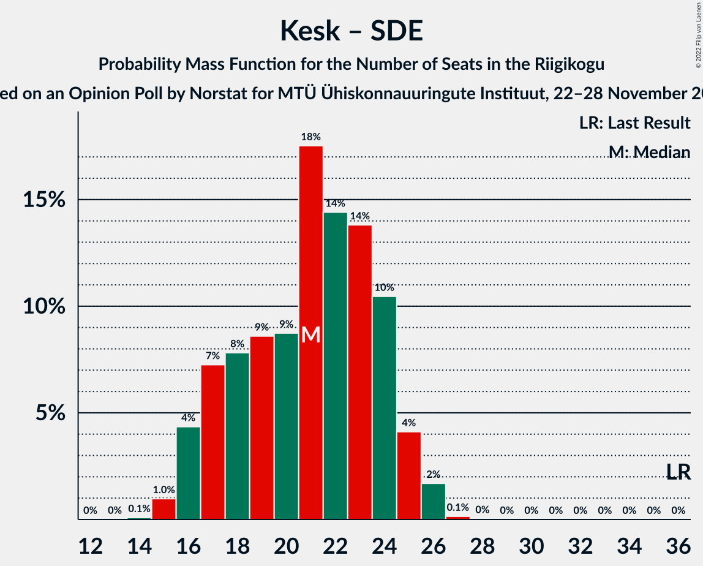

| Number of Seats | Probability | Accumulated | Special Marks |
|:---------------:|:-----------:|:-----------:|:-------------:|
| 14 | 0.1% | 100% |  |
| 15 | 1.0% | 99.9% |  |
| 16 | 4% | 98.9% |  |
| 17 | 7% | 95% |  |
| 18 | 8% | 87% |  |
| 19 | 9% | 80% |  |
| 20 | 9% | 71% |  |
| 21 | 18% | 62% | Median |
| 22 | 14% | 45% |  |
| 23 | 14% | 30% |  |
| 24 | 10% | 16% |  |
| 25 | 4% | 6% |  |
| 26 | 2% | 2% |  |
| 27 | 0.1% | 0.2% |  |
| 28 | 0% | 0% |  |
| 29 | 0% | 0% |  |
| 30 | 0% | 0% |  |
| 31 | 0% | 0% |  |
| 32 | 0% | 0% |  |
| 33 | 0% | 0% |  |
| 34 | 0% | 0% |  |
| 35 | 0% | 0% |  |
| 36 | 0% | 0% | Last Result |

## Technical Information

### Opinion Poll

+ **Polling firm:** Norstat
+ **Commissioner(s):** MTÜ Ühiskonnauuringute Instituut
+ **Fieldwork period:** 22–28 November 2022

### Calculations

+ **Sample size:** 1000
+ **Simulations done:** 1,048,576
+ **Error estimate:** 1.34%

