# Opinion Poll by Turu-uuringute AS, 6 December 2022

<a href="#voting-intentions">Voting Intentions</a> | <a href="#seats">Seats</a> | <a href="#coalitions">Coalitions</a> | <a href="#technical-information">Technical Information</a>

## Voting Intentions

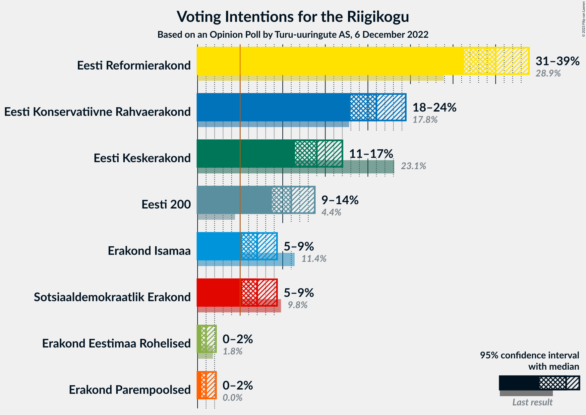

### Confidence Intervals

| Party | Last Result | Poll Result | 80% Confidence Interval | 90% Confidence Interval | 95% Confidence Interval | 99% Confidence Interval |
|:-----:|:-----------:|:-----------:|:-----------------------:|:-----------------------:|:-----------------------:|:-----------------------:|
| Eesti Reformierakond | 28.9% | 35.0% | 32.6–37.6% |31.9–38.3% |31.3–38.9% |30.1–40.1% |
| Eesti Konservatiivne Rahvaerakond | 17.8% | 21.0% | 19.0–23.3% |18.4–23.9% |17.9–24.4% |17.0–25.6% |
| Eesti Keskerakond | 23.1% | 14.0% | 12.3–16.0% |11.8–16.5% |11.4–17.0% |10.7–18.0% |
| Eesti 200 | 4.4% | 11.0% | 9.5–12.8% |9.1–13.3% |8.7–13.8% |8.1–14.7% |
| Sotsiaaldemokraatlik Erakond | 9.8% | 7.0% | 5.8–8.5% |5.5–8.9% |5.2–9.3% |4.7–10.1% |
| Erakond Isamaa | 11.4% | 7.0% | 5.8–8.5% |5.5–8.9% |5.2–9.3% |4.7–10.1% |
| Erakond Eestimaa Rohelised | 1.8% | 1.0% | 0.6–1.8% |0.5–2.0% |0.5–2.2% |0.3–2.6% |
| Erakond Parempoolsed | 0.0% | 1.0% | 0.6–1.8% |0.5–2.0% |0.5–2.2% |0.3–2.6% |

*Note:* The poll result column reflects the actual value used in the calculations. Published results may vary slightly, and in addition be rounded to fewer digits.

## Seats

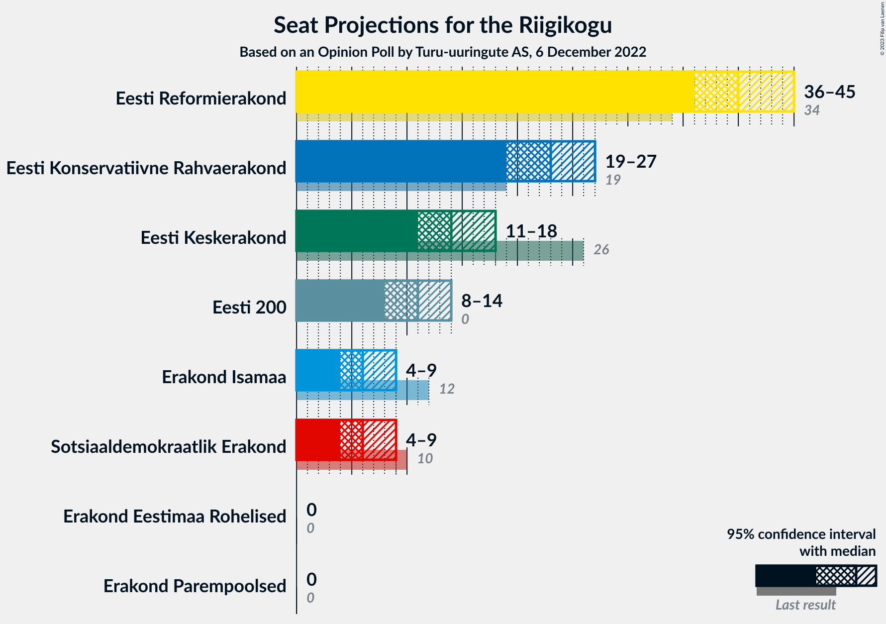

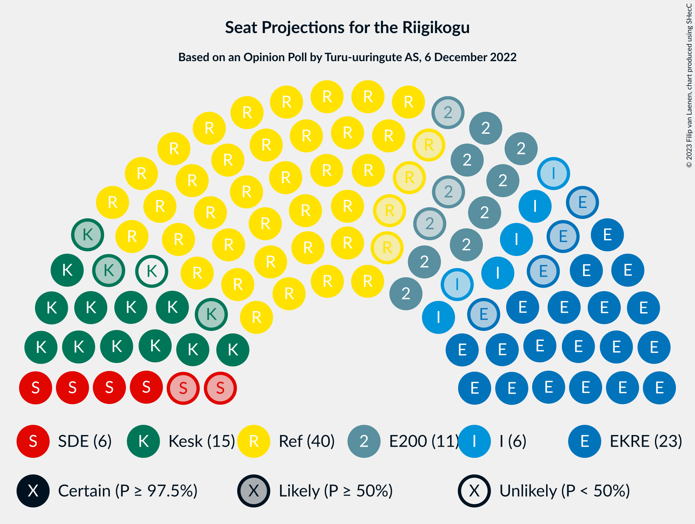

### Confidence Intervals

| Party | Last Result | Median | 80% Confidence Interval | 90% Confidence Interval | 95% Confidence Interval | 99% Confidence Interval |
|:-----:|:-----------:|:------:|:-----------------------:|:-----------------------:|:-----------------------:|:-----------------------:|
| <a href="#eesti-reformierakond">Eesti Reformierakond</a> | 34 | 40 | 37–43 |36–44 |36–45 |34–47 |
| <a href="#eesti-konservatiivne-rahvaerakond">Eesti Konservatiivne Rahvaerakond</a> | 19 | 23 | 20–25 |19–26 |19–27 |18–28 |
| <a href="#eesti-keskerakond">Eesti Keskerakond</a> | 26 | 14 | 12–17 |12–17 |11–18 |10–19 |
| <a href="#eesti-200">Eesti 200</a> | 0 | 11 | 9–13 |9–14 |8–14 |7–15 |
| <a href="#sotsiaaldemokraatlik-erakond">Sotsiaaldemokraatlik Erakond</a> | 10 | 6 | 5–8 |5–8 |4–9 |0–10 |
| <a href="#erakond-isamaa">Erakond Isamaa</a> | 12 | 6 | 5–8 |5–9 |4–9 |0–10 |
| <a href="#erakond-eestimaa-rohelised">Erakond Eestimaa Rohelised</a> | 0 | 0 | 0 |0 |0 |0 |
| <a href="#erakond-parempoolsed">Erakond Parempoolsed</a> | 0 | 0 | 0 |0 |0 |0 |

### Eesti Reformierakond

*For a full overview of the results for this party, see the [Eesti Reformierakond](party-eestireformierakond.html) page.*

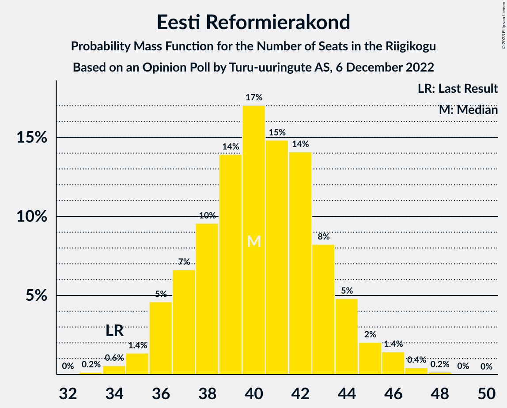

| Number of Seats | Probability | Accumulated | Special Marks |
|:---------------:|:-----------:|:-----------:|:-------------:|
| 32 | 0% | 100% |  |
| 33 | 0.2% | 99.9% |  |
| 34 | 0.6% | 99.8% | Last Result |
| 35 | 1.4% | 99.2% |  |
| 36 | 5% | 98% |  |
| 37 | 7% | 93% |  |
| 38 | 10% | 87% |  |
| 39 | 14% | 77% |  |
| 40 | 17% | 63% | Median |
| 41 | 15% | 46% |  |
| 42 | 14% | 31% |  |
| 43 | 8% | 17% |  |
| 44 | 5% | 9% |  |
| 45 | 2% | 4% |  |
| 46 | 1.4% | 2% |  |
| 47 | 0.4% | 0.7% |  |
| 48 | 0.2% | 0.2% |  |
| 49 | 0% | 0.1% |  |
| 50 | 0% | 0% |  |

### Eesti Konservatiivne Rahvaerakond

*For a full overview of the results for this party, see the [Eesti Konservatiivne Rahvaerakond](party-eestikonservatiivnerahvaerakond.html) page.*

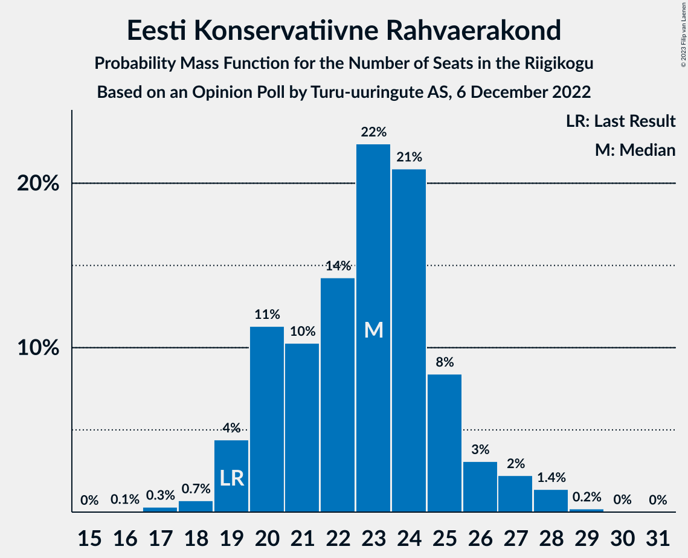

| Number of Seats | Probability | Accumulated | Special Marks |
|:---------------:|:-----------:|:-----------:|:-------------:|
| 16 | 0.1% | 100% |  |
| 17 | 0.3% | 99.9% |  |
| 18 | 0.7% | 99.6% |  |
| 19 | 4% | 98.9% | Last Result |
| 20 | 11% | 95% |  |
| 21 | 10% | 83% |  |
| 22 | 14% | 73% |  |
| 23 | 22% | 59% | Median |
| 24 | 21% | 36% |  |
| 25 | 8% | 15% |  |
| 26 | 3% | 7% |  |
| 27 | 2% | 4% |  |
| 28 | 1.4% | 2% |  |
| 29 | 0.2% | 0.3% |  |
| 30 | 0% | 0.1% |  |
| 31 | 0% | 0% |  |

### Eesti Keskerakond

*For a full overview of the results for this party, see the [Eesti Keskerakond](party-eestikeskerakond.html) page.*

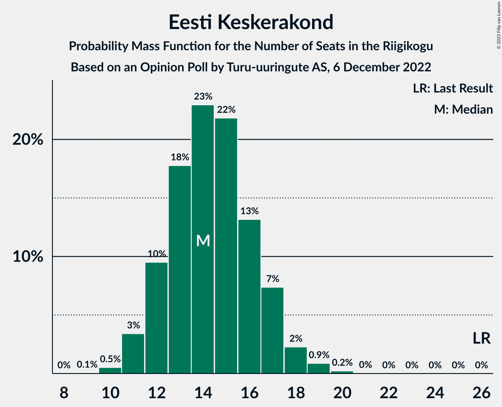

| Number of Seats | Probability | Accumulated | Special Marks |
|:---------------:|:-----------:|:-----------:|:-------------:|
| 9 | 0.1% | 100% |  |
| 10 | 0.5% | 99.9% |  |
| 11 | 3% | 99.4% |  |
| 12 | 10% | 96% |  |
| 13 | 18% | 87% |  |
| 14 | 23% | 69% | Median |
| 15 | 22% | 46% |  |
| 16 | 13% | 24% |  |
| 17 | 7% | 11% |  |
| 18 | 2% | 3% |  |
| 19 | 0.9% | 1.1% |  |
| 20 | 0.2% | 0.3% |  |
| 21 | 0% | 0% |  |
| 22 | 0% | 0% |  |
| 23 | 0% | 0% |  |
| 24 | 0% | 0% |  |
| 25 | 0% | 0% |  |
| 26 | 0% | 0% | Last Result |

### Eesti 200

*For a full overview of the results for this party, see the [Eesti 200](party-eesti200.html) page.*

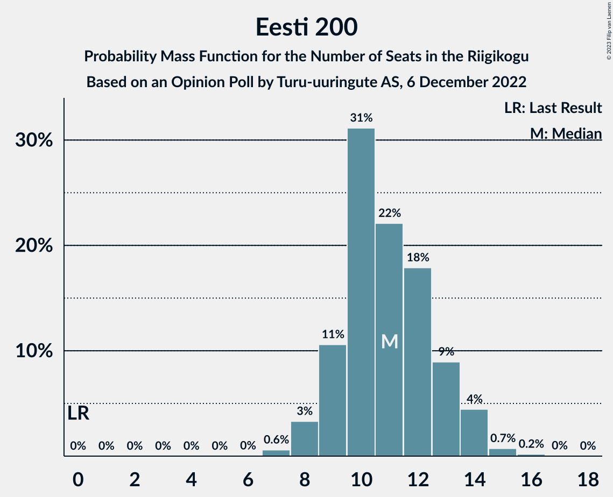

| Number of Seats | Probability | Accumulated | Special Marks |
|:---------------:|:-----------:|:-----------:|:-------------:|
| 0 | 0% | 100% | Last Result |
| 1 | 0% | 100% |  |
| 2 | 0% | 100% |  |
| 3 | 0% | 100% |  |
| 4 | 0% | 100% |  |
| 5 | 0% | 100% |  |
| 6 | 0% | 100% |  |
| 7 | 0.6% | 100% |  |
| 8 | 3% | 99.4% |  |
| 9 | 11% | 96% |  |
| 10 | 31% | 85% |  |
| 11 | 22% | 54% | Median |
| 12 | 18% | 32% |  |
| 13 | 9% | 14% |  |
| 14 | 4% | 5% |  |
| 15 | 0.7% | 1.0% |  |
| 16 | 0.2% | 0.2% |  |
| 17 | 0% | 0% |  |

### Sotsiaaldemokraatlik Erakond

*For a full overview of the results for this party, see the [Sotsiaaldemokraatlik Erakond](party-sotsiaaldemokraatlikerakond.html) page.*

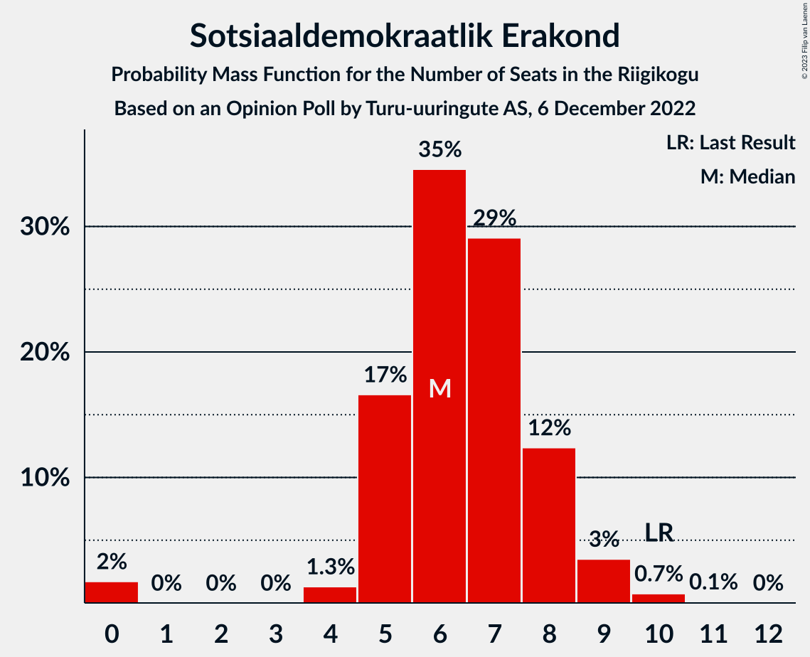

| Number of Seats | Probability | Accumulated | Special Marks |
|:---------------:|:-----------:|:-----------:|:-------------:|
| 0 | 2% | 100% |  |
| 1 | 0% | 98% |  |
| 2 | 0% | 98% |  |
| 3 | 0% | 98% |  |
| 4 | 1.3% | 98% |  |
| 5 | 17% | 97% |  |
| 6 | 35% | 80% | Median |
| 7 | 29% | 46% |  |
| 8 | 12% | 17% |  |
| 9 | 3% | 4% |  |
| 10 | 0.7% | 0.8% | Last Result |
| 11 | 0.1% | 0.1% |  |
| 12 | 0% | 0% |  |

### Erakond Isamaa

*For a full overview of the results for this party, see the [Erakond Isamaa](party-erakondisamaa.html) page.*

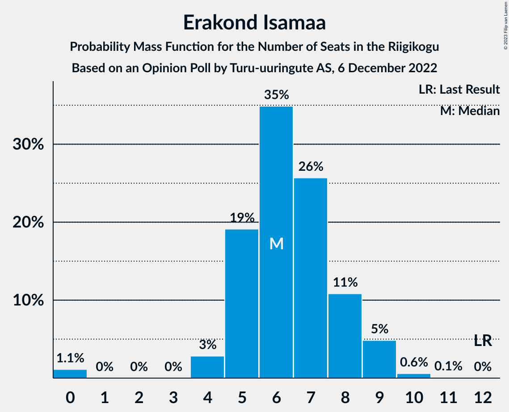

| Number of Seats | Probability | Accumulated | Special Marks |
|:---------------:|:-----------:|:-----------:|:-------------:|
| 0 | 1.1% | 100% |  |
| 1 | 0% | 98.9% |  |
| 2 | 0% | 98.9% |  |
| 3 | 0% | 98.9% |  |
| 4 | 3% | 98.9% |  |
| 5 | 19% | 96% |  |
| 6 | 35% | 77% | Median |
| 7 | 26% | 42% |  |
| 8 | 11% | 16% |  |
| 9 | 5% | 6% |  |
| 10 | 0.6% | 0.7% |  |
| 11 | 0.1% | 0.1% |  |
| 12 | 0% | 0% | Last Result |

### Erakond Eestimaa Rohelised

*For a full overview of the results for this party, see the [Erakond Eestimaa Rohelised](party-erakondeestimaarohelised.html) page.*

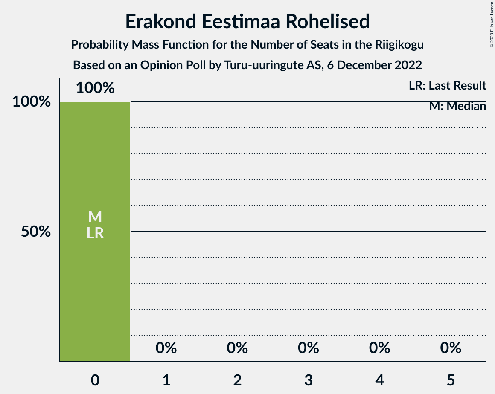

| Number of Seats | Probability | Accumulated | Special Marks |
|:---------------:|:-----------:|:-----------:|:-------------:|
| 0 | 100% | 100% | Last Result, Median |

### Erakond Parempoolsed

*For a full overview of the results for this party, see the [Erakond Parempoolsed](party-erakondparempoolsed.html) page.*

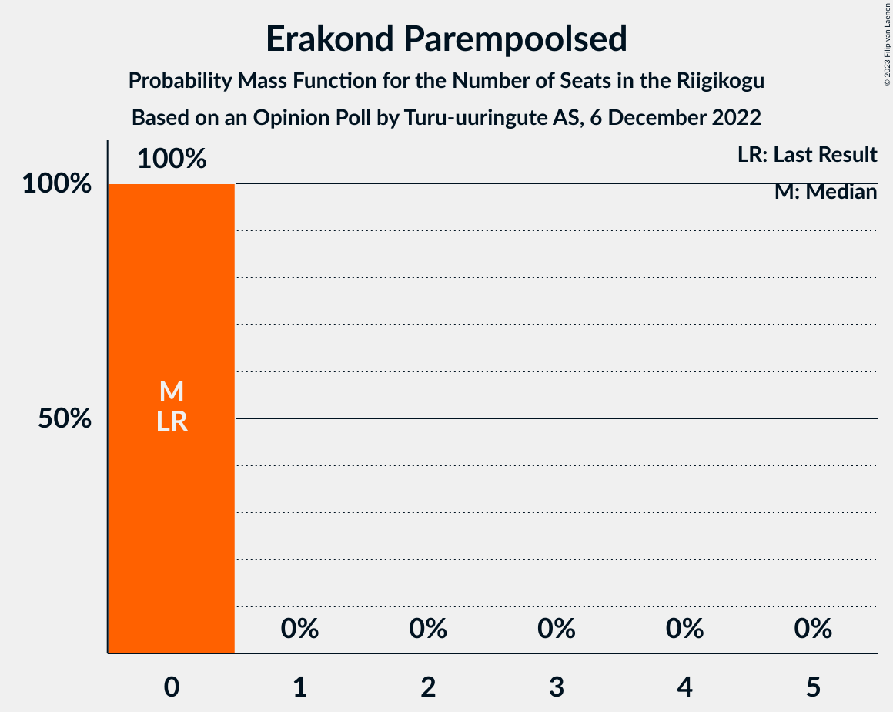

| Number of Seats | Probability | Accumulated | Special Marks |
|:---------------:|:-----------:|:-----------:|:-------------:|
| 0 | 100% | 100% | Last Result, Median |

## Coalitions

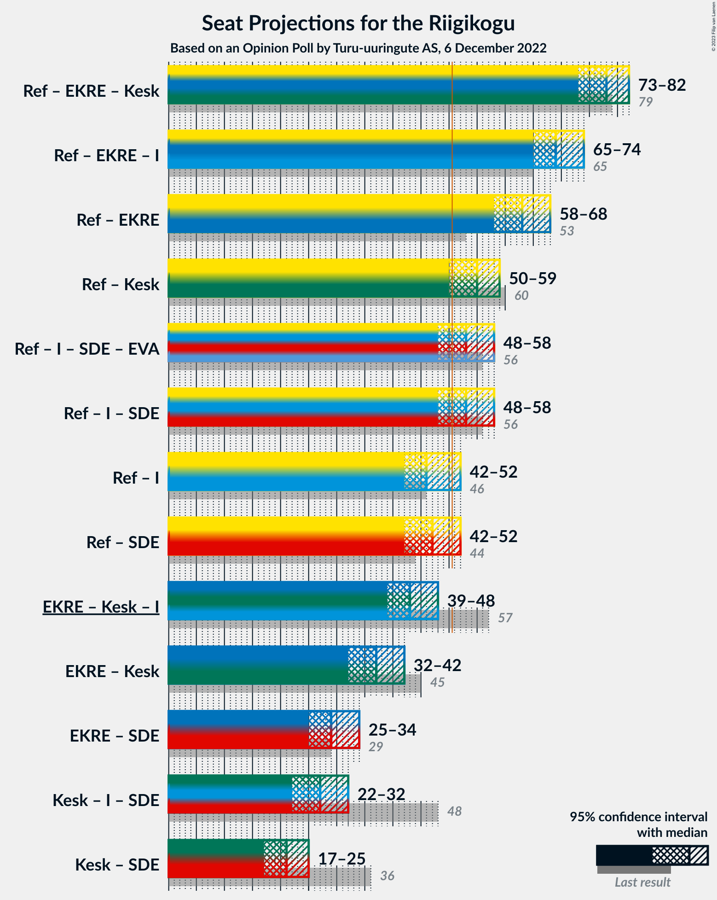

### Confidence Intervals

| Coalition | Last Result | Median | Majority? | 80% Confidence Interval | 90% Confidence Interval | 95% Confidence Interval | 99% Confidence Interval |
|:---------:|:-----------:|:------:|:---------:|:-----------------------:|:-----------------------:|:-----------------------:|:-----------------------:|
| Eesti Reformierakond – Eesti Konservatiivne Rahvaerakond – Eesti Keskerakond | 79 | 78 | 100% | 74–80 | 74–81 | 73–82 | 72–84 |
| Eesti Reformierakond – Eesti Konservatiivne Rahvaerakond – Erakond Isamaa | 65 | 69 | 100% | 66–72 | 65–73 | 65–74 | 63–76 |
| Eesti Reformierakond – Eesti Konservatiivne Rahvaerakond | 53 | 63 | 100% | 60–66 | 59–67 | 58–68 | 57–70 |
| Eesti Reformierakond – Eesti Keskerakond | 60 | 55 | 95% | 51–58 | 51–59 | 50–59 | 48–61 |
| Eesti Reformierakond – Erakond Isamaa – Sotsiaaldemokraatlik Erakond | 56 | 53 | 86% | 50–56 | 49–57 | 48–58 | 46–59 |
| Eesti Reformierakond – Erakond Isamaa | 46 | 46 | 7% | 43–50 | 42–51 | 42–52 | 40–53 |
| Eesti Reformierakond – Sotsiaaldemokraatlik Erakond | 44 | 47 | 6% | 43–50 | 42–51 | 42–52 | 40–53 |
| Eesti Konservatiivne Rahvaerakond – Eesti Keskerakond – Erakond Isamaa | 57 | 43 | 0.2% | 40–47 | 39–47 | 39–48 | 37–50 |
| Eesti Konservatiivne Rahvaerakond – Eesti Keskerakond | 45 | 37 | 0% | 34–40 | 33–41 | 32–42 | 31–43 |
| Eesti Konservatiivne Rahvaerakond – Sotsiaaldemokraatlik Erakond | 29 | 29 | 0% | 26–32 | 25–33 | 25–34 | 23–35 |
| Eesti Keskerakond – Erakond Isamaa – Sotsiaaldemokraatlik Erakond | 48 | 27 | 0% | 24–30 | 24–31 | 22–32 | 20–33 |
| Eesti Keskerakond – Sotsiaaldemokraatlik Erakond | 36 | 21 | 0% | 18–23 | 18–24 | 17–25 | 14–26 |

### Eesti Reformierakond – Eesti Konservatiivne Rahvaerakond – Eesti Keskerakond

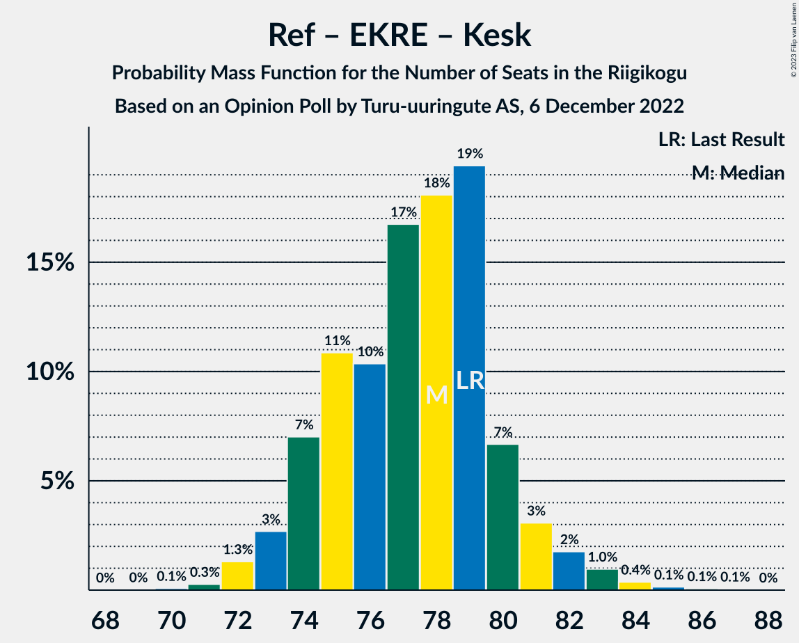

| Number of Seats | Probability | Accumulated | Special Marks |
|:---------------:|:-----------:|:-----------:|:-------------:|
| 70 | 0.1% | 100% |  |
| 71 | 0.3% | 99.9% |  |
| 72 | 1.3% | 99.6% |  |
| 73 | 3% | 98% |  |
| 74 | 7% | 96% |  |
| 75 | 11% | 89% |  |
| 76 | 10% | 78% |  |
| 77 | 17% | 67% | Median |
| 78 | 18% | 51% |  |
| 79 | 19% | 33% | Last Result |
| 80 | 7% | 13% |  |
| 81 | 3% | 6% |  |
| 82 | 2% | 3% |  |
| 83 | 1.0% | 2% |  |
| 84 | 0.4% | 0.7% |  |
| 85 | 0.1% | 0.3% |  |
| 86 | 0.1% | 0.1% |  |
| 87 | 0.1% | 0.1% |  |
| 88 | 0% | 0% |  |

### Eesti Reformierakond – Eesti Konservatiivne Rahvaerakond – Erakond Isamaa

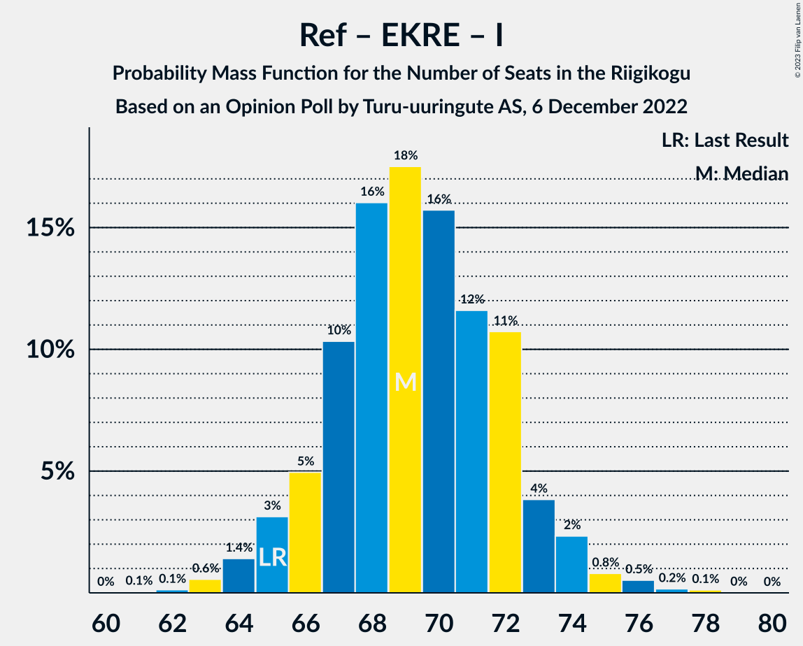

| Number of Seats | Probability | Accumulated | Special Marks |
|:---------------:|:-----------:|:-----------:|:-------------:|
| 61 | 0.1% | 100% |  |
| 62 | 0.1% | 99.9% |  |
| 63 | 0.6% | 99.8% |  |
| 64 | 1.4% | 99.2% |  |
| 65 | 3% | 98% | Last Result |
| 66 | 5% | 95% |  |
| 67 | 10% | 90% |  |
| 68 | 16% | 79% |  |
| 69 | 18% | 63% | Median |
| 70 | 16% | 46% |  |
| 71 | 12% | 30% |  |
| 72 | 11% | 19% |  |
| 73 | 4% | 8% |  |
| 74 | 2% | 4% |  |
| 75 | 0.8% | 2% |  |
| 76 | 0.5% | 0.8% |  |
| 77 | 0.2% | 0.3% |  |
| 78 | 0.1% | 0.1% |  |
| 79 | 0% | 0% |  |

### Eesti Reformierakond – Eesti Konservatiivne Rahvaerakond

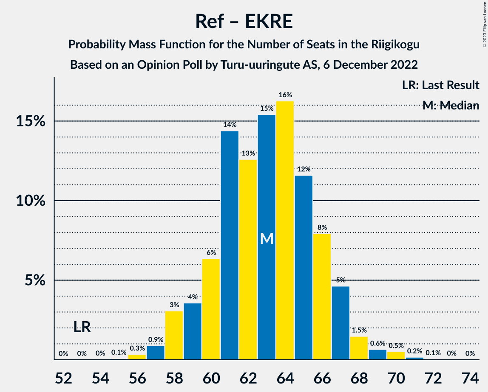

| Number of Seats | Probability | Accumulated | Special Marks |
|:---------------:|:-----------:|:-----------:|:-------------:|
| 53 | 0% | 100% | Last Result |
| 54 | 0% | 100% |  |
| 55 | 0.1% | 100% |  |
| 56 | 0.3% | 99.9% |  |
| 57 | 0.9% | 99.6% |  |
| 58 | 3% | 98.7% |  |
| 59 | 4% | 96% |  |
| 60 | 6% | 92% |  |
| 61 | 14% | 86% |  |
| 62 | 13% | 71% |  |
| 63 | 15% | 59% | Median |
| 64 | 16% | 43% |  |
| 65 | 12% | 27% |  |
| 66 | 8% | 15% |  |
| 67 | 5% | 8% |  |
| 68 | 1.5% | 3% |  |
| 69 | 0.6% | 1.4% |  |
| 70 | 0.5% | 0.8% |  |
| 71 | 0.2% | 0.2% |  |
| 72 | 0.1% | 0.1% |  |
| 73 | 0% | 0% |  |

### Eesti Reformierakond – Eesti Keskerakond

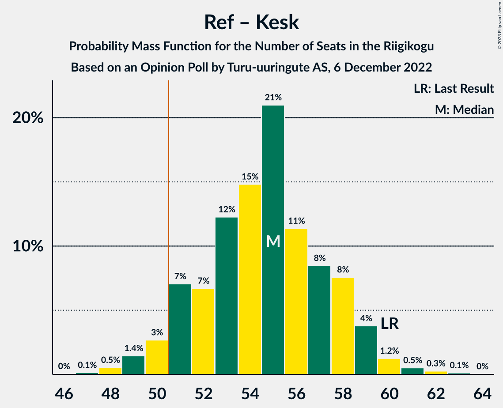

| Number of Seats | Probability | Accumulated | Special Marks |
|:---------------:|:-----------:|:-----------:|:-------------:|
| 46 | 0% | 100% |  |
| 47 | 0.1% | 99.9% |  |
| 48 | 0.5% | 99.8% |  |
| 49 | 1.4% | 99.3% |  |
| 50 | 3% | 98% |  |
| 51 | 7% | 95% | Majority |
| 52 | 7% | 88% |  |
| 53 | 12% | 81% |  |
| 54 | 15% | 69% | Median |
| 55 | 21% | 54% |  |
| 56 | 11% | 33% |  |
| 57 | 8% | 22% |  |
| 58 | 8% | 14% |  |
| 59 | 4% | 6% |  |
| 60 | 1.2% | 2% | Last Result |
| 61 | 0.5% | 0.9% |  |
| 62 | 0.3% | 0.4% |  |
| 63 | 0.1% | 0.2% |  |
| 64 | 0% | 0% |  |

### Eesti Reformierakond – Erakond Isamaa – Sotsiaaldemokraatlik Erakond

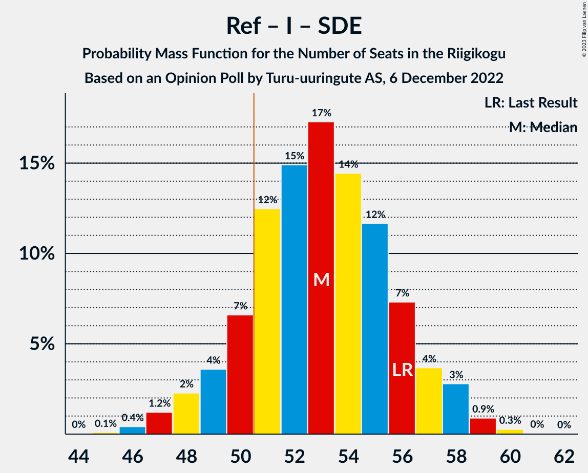

| Number of Seats | Probability | Accumulated | Special Marks |
|:---------------:|:-----------:|:-----------:|:-------------:|
| 44 | 0% | 100% |  |
| 45 | 0.1% | 99.9% |  |
| 46 | 0.4% | 99.8% |  |
| 47 | 1.2% | 99.4% |  |
| 48 | 2% | 98% |  |
| 49 | 4% | 96% |  |
| 50 | 7% | 92% |  |
| 51 | 12% | 86% | Majority |
| 52 | 15% | 73% | Median |
| 53 | 17% | 58% |  |
| 54 | 14% | 41% |  |
| 55 | 12% | 27% |  |
| 56 | 7% | 15% | Last Result |
| 57 | 4% | 8% |  |
| 58 | 3% | 4% |  |
| 59 | 0.9% | 1.2% |  |
| 60 | 0.3% | 0.3% |  |
| 61 | 0% | 0.1% |  |
| 62 | 0% | 0% |  |

### Eesti Reformierakond – Erakond Isamaa

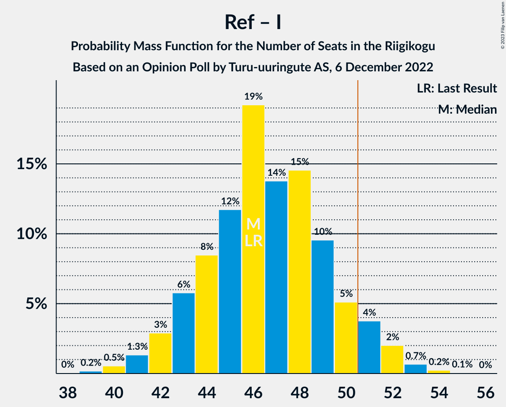

| Number of Seats | Probability | Accumulated | Special Marks |
|:---------------:|:-----------:|:-----------:|:-------------:|
| 38 | 0% | 100% |  |
| 39 | 0.2% | 99.9% |  |
| 40 | 0.5% | 99.8% |  |
| 41 | 1.3% | 99.2% |  |
| 42 | 3% | 98% |  |
| 43 | 6% | 95% |  |
| 44 | 8% | 89% |  |
| 45 | 12% | 81% |  |
| 46 | 19% | 69% | Last Result, Median |
| 47 | 14% | 50% |  |
| 48 | 15% | 36% |  |
| 49 | 10% | 21% |  |
| 50 | 5% | 12% |  |
| 51 | 4% | 7% | Majority |
| 52 | 2% | 3% |  |
| 53 | 0.7% | 1.0% |  |
| 54 | 0.2% | 0.3% |  |
| 55 | 0.1% | 0.1% |  |
| 56 | 0% | 0% |  |

### Eesti Reformierakond – Sotsiaaldemokraatlik Erakond

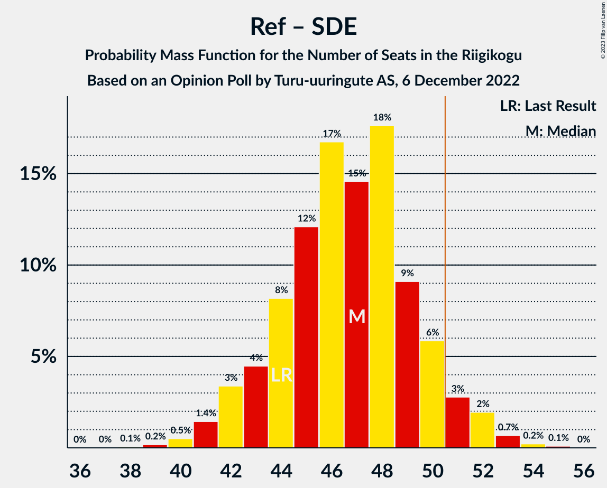

| Number of Seats | Probability | Accumulated | Special Marks |
|:---------------:|:-----------:|:-----------:|:-------------:|
| 38 | 0.1% | 100% |  |
| 39 | 0.2% | 99.9% |  |
| 40 | 0.5% | 99.7% |  |
| 41 | 1.4% | 99.2% |  |
| 42 | 3% | 98% |  |
| 43 | 4% | 94% |  |
| 44 | 8% | 90% | Last Result |
| 45 | 12% | 82% |  |
| 46 | 17% | 70% | Median |
| 47 | 15% | 53% |  |
| 48 | 18% | 38% |  |
| 49 | 9% | 21% |  |
| 50 | 6% | 12% |  |
| 51 | 3% | 6% | Majority |
| 52 | 2% | 3% |  |
| 53 | 0.7% | 1.0% |  |
| 54 | 0.2% | 0.3% |  |
| 55 | 0.1% | 0.1% |  |
| 56 | 0% | 0% |  |

### Eesti Konservatiivne Rahvaerakond – Eesti Keskerakond – Erakond Isamaa

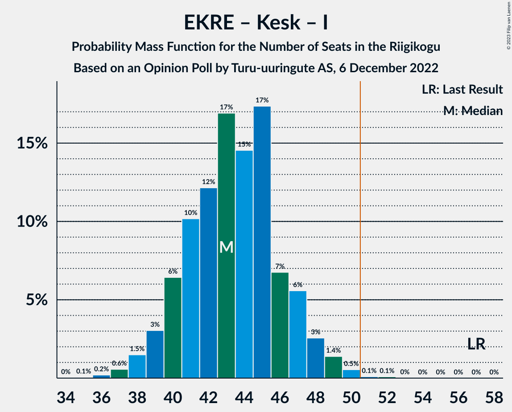

| Number of Seats | Probability | Accumulated | Special Marks |
|:---------------:|:-----------:|:-----------:|:-------------:|
| 35 | 0.1% | 100% |  |
| 36 | 0.2% | 99.9% |  |
| 37 | 0.6% | 99.7% |  |
| 38 | 1.5% | 99.1% |  |
| 39 | 3% | 98% |  |
| 40 | 6% | 95% |  |
| 41 | 10% | 88% |  |
| 42 | 12% | 78% |  |
| 43 | 17% | 66% | Median |
| 44 | 15% | 49% |  |
| 45 | 17% | 34% |  |
| 46 | 7% | 17% |  |
| 47 | 6% | 10% |  |
| 48 | 3% | 5% |  |
| 49 | 1.4% | 2% |  |
| 50 | 0.5% | 0.7% |  |
| 51 | 0.1% | 0.2% | Majority |
| 52 | 0.1% | 0.1% |  |
| 53 | 0% | 0% |  |
| 54 | 0% | 0% |  |
| 55 | 0% | 0% |  |
| 56 | 0% | 0% |  |
| 57 | 0% | 0% | Last Result |

### Eesti Konservatiivne Rahvaerakond – Eesti Keskerakond

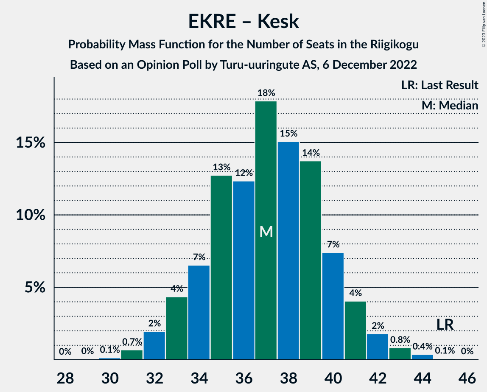

| Number of Seats | Probability | Accumulated | Special Marks |
|:---------------:|:-----------:|:-----------:|:-------------:|
| 29 | 0% | 100% |  |
| 30 | 0.1% | 99.9% |  |
| 31 | 0.7% | 99.8% |  |
| 32 | 2% | 99.1% |  |
| 33 | 4% | 97% |  |
| 34 | 7% | 93% |  |
| 35 | 13% | 86% |  |
| 36 | 12% | 74% |  |
| 37 | 18% | 61% | Median |
| 38 | 15% | 43% |  |
| 39 | 14% | 28% |  |
| 40 | 7% | 15% |  |
| 41 | 4% | 7% |  |
| 42 | 2% | 3% |  |
| 43 | 0.8% | 1.3% |  |
| 44 | 0.4% | 0.5% |  |
| 45 | 0.1% | 0.1% | Last Result |
| 46 | 0% | 0% |  |

### Eesti Konservatiivne Rahvaerakond – Sotsiaaldemokraatlik Erakond

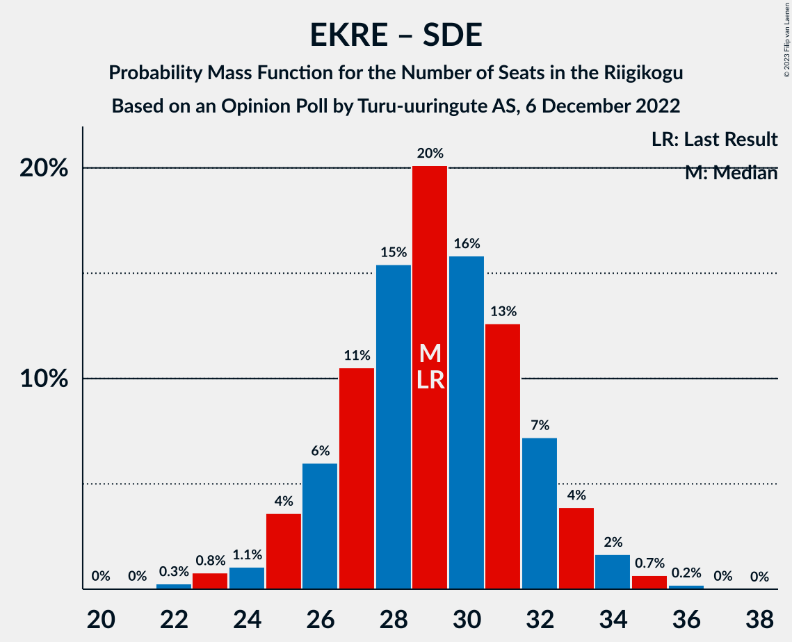

| Number of Seats | Probability | Accumulated | Special Marks |
|:---------------:|:-----------:|:-----------:|:-------------:|
| 20 | 0% | 100% |  |
| 21 | 0% | 99.9% |  |
| 22 | 0.3% | 99.9% |  |
| 23 | 0.8% | 99.6% |  |
| 24 | 1.1% | 98.8% |  |
| 25 | 4% | 98% |  |
| 26 | 6% | 94% |  |
| 27 | 11% | 88% |  |
| 28 | 15% | 78% |  |
| 29 | 20% | 62% | Last Result, Median |
| 30 | 16% | 42% |  |
| 31 | 13% | 26% |  |
| 32 | 7% | 14% |  |
| 33 | 4% | 6% |  |
| 34 | 2% | 3% |  |
| 35 | 0.7% | 0.9% |  |
| 36 | 0.2% | 0.3% |  |
| 37 | 0% | 0.1% |  |
| 38 | 0% | 0% |  |

### Eesti Keskerakond – Erakond Isamaa – Sotsiaaldemokraatlik Erakond

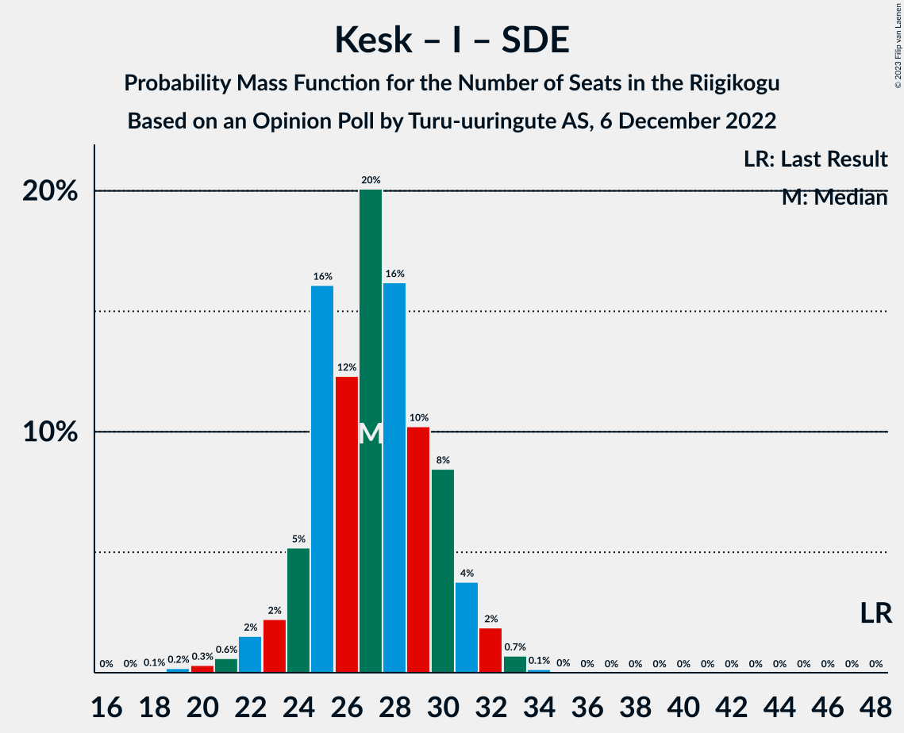

| Number of Seats | Probability | Accumulated | Special Marks |
|:---------------:|:-----------:|:-----------:|:-------------:|
| 18 | 0.1% | 100% |  |
| 19 | 0.2% | 99.9% |  |
| 20 | 0.3% | 99.7% |  |
| 21 | 0.6% | 99.4% |  |
| 22 | 2% | 98.8% |  |
| 23 | 2% | 97% |  |
| 24 | 5% | 95% |  |
| 25 | 16% | 90% |  |
| 26 | 12% | 74% | Median |
| 27 | 20% | 61% |  |
| 28 | 16% | 41% |  |
| 29 | 10% | 25% |  |
| 30 | 8% | 15% |  |
| 31 | 4% | 7% |  |
| 32 | 2% | 3% |  |
| 33 | 0.7% | 0.9% |  |
| 34 | 0.1% | 0.2% |  |
| 35 | 0% | 0% |  |
| 36 | 0% | 0% |  |
| 37 | 0% | 0% |  |
| 38 | 0% | 0% |  |
| 39 | 0% | 0% |  |
| 40 | 0% | 0% |  |
| 41 | 0% | 0% |  |
| 42 | 0% | 0% |  |
| 43 | 0% | 0% |  |
| 44 | 0% | 0% |  |
| 45 | 0% | 0% |  |
| 46 | 0% | 0% |  |
| 47 | 0% | 0% |  |
| 48 | 0% | 0% | Last Result |

### Eesti Keskerakond – Sotsiaaldemokraatlik Erakond

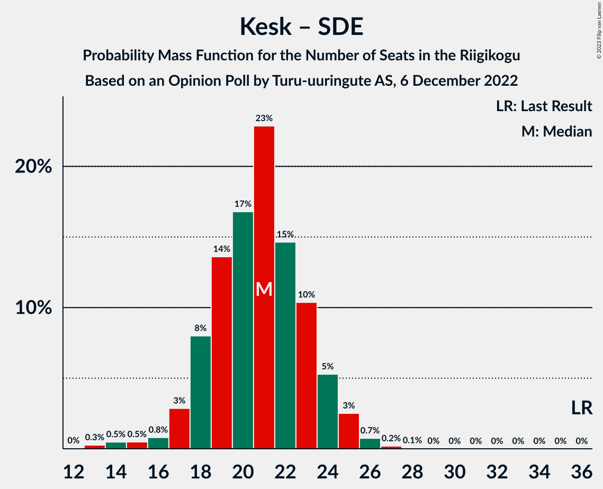

| Number of Seats | Probability | Accumulated | Special Marks |
|:---------------:|:-----------:|:-----------:|:-------------:|
| 12 | 0% | 100% |  |
| 13 | 0.3% | 99.9% |  |
| 14 | 0.5% | 99.7% |  |
| 15 | 0.5% | 99.2% |  |
| 16 | 0.8% | 98.7% |  |
| 17 | 3% | 98% |  |
| 18 | 8% | 95% |  |
| 19 | 14% | 87% |  |
| 20 | 17% | 73% | Median |
| 21 | 23% | 57% |  |
| 22 | 15% | 34% |  |
| 23 | 10% | 19% |  |
| 24 | 5% | 9% |  |
| 25 | 3% | 4% |  |
| 26 | 0.7% | 1.0% |  |
| 27 | 0.2% | 0.3% |  |
| 28 | 0.1% | 0.1% |  |
| 29 | 0% | 0% |  |
| 30 | 0% | 0% |  |
| 31 | 0% | 0% |  |
| 32 | 0% | 0% |  |
| 33 | 0% | 0% |  |
| 34 | 0% | 0% |  |
| 35 | 0% | 0% |  |
| 36 | 0% | 0% | Last Result |

## Technical Information

### Opinion Poll

+ **Polling firm:** Turu-uuringute AS
+ **Commissioner(s):** —
+ **Fieldwork period:** 6 December 2022

### Calculations

+ **Sample size:** 600
+ **Simulations done:** 1,048,576
+ **Error estimate:** 2.12%

