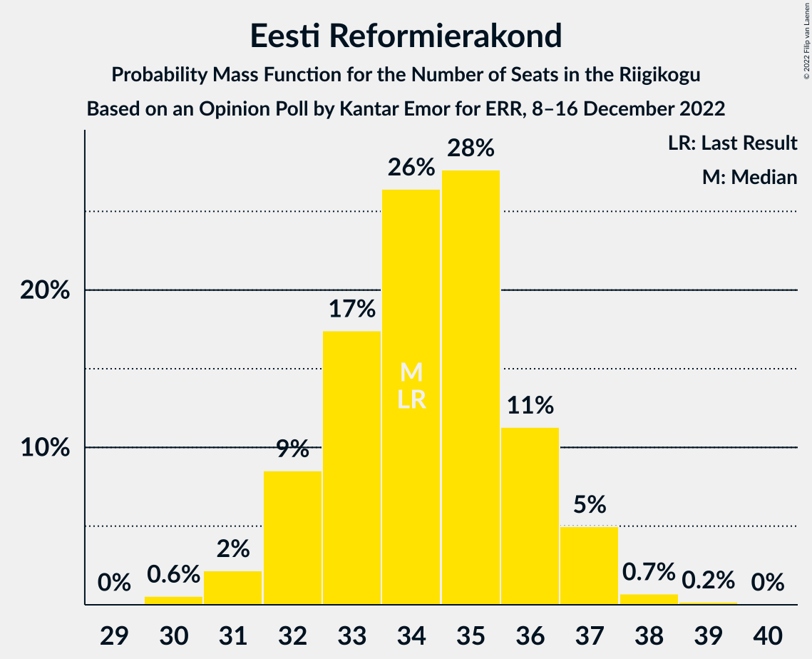

# Opinion Poll by Kantar Emor for ERR, 8–16 December 2022

<a href="#voting-intentions">Voting Intentions</a> | <a href="#seats">Seats</a> | <a href="#coalitions">Coalitions</a> | <a href="#technical-information">Technical Information</a>

## Voting Intentions

### Confidence Intervals

| Party | Last Result | Poll Result | 80% Confidence Interval | 90% Confidence Interval | 95% Confidence Interval | 99% Confidence Interval |
|:-----:|:-----------:|:-----------:|:-----------------------:|:-----------------------:|:-----------------------:|:-----------------------:|
| Eesti Reformierakond | 28.9% | 30.2% | 28.7–31.7% |28.3–32.2% |27.9–32.6% |27.2–33.3% |
| Eesti Konservatiivne Rahvaerakond | 17.8% | 18.1% | 16.9–19.5% |16.6–19.8% |16.3–20.2% |15.7–20.8% |
| Eesti Keskerakond | 23.1% | 16.1% | 14.9–17.4% |14.6–17.7% |14.3–18.0% |13.8–18.7% |
| Eesti 200 | 4.4% | 14.1% | 13.0–15.3% |12.7–15.7% |12.4–16.0% |11.9–16.6% |
| Sotsiaaldemokraatlik Erakond | 9.8% | 9.1% | 8.2–10.1% |7.9–10.4% |7.7–10.6% |7.3–11.1% |
| Erakond Isamaa | 11.4% | 8.1% | 7.2–9.1% |7.0–9.3% |6.8–9.6% |6.4–10.1% |
| Erakond Eestimaa Rohelised | 1.8% | 3.0% | 2.5–3.7% |2.4–3.9% |2.3–4.0% |2.1–4.4% |
| Erakond Parempoolsed | 0.0% | 1.0% | 0.7–1.4% |0.7–1.5% |0.6–1.6% |0.5–1.9% |

*Note:* The poll result column reflects the actual value used in the calculations. Published results may vary slightly, and in addition be rounded to fewer digits.

## Seats

### Confidence Intervals

| Party | Last Result | Median | 80% Confidence Interval | 90% Confidence Interval | 95% Confidence Interval | 99% Confidence Interval |
|:-----:|:-----------:|:------:|:-----------------------:|:-----------------------:|:-----------------------:|:-----------------------:|
| <a href="#eesti-reformierakond">Eesti Reformierakond</a> | 34 | 34 | 32–36 |32–37 |31–37 |30–38 |
| <a href="#eesti-konservatiivne-rahvaerakond">Eesti Konservatiivne Rahvaerakond</a> | 19 | 19 | 18–21 |17–21 |17–22 |16–22 |
| <a href="#eesti-keskerakond">Eesti Keskerakond</a> | 26 | 17 | 15–18 |15–19 |15–19 |14–20 |
| <a href="#eesti-200">Eesti 200</a> | 0 | 15 | 13–16 |13–16 |12–17 |12–17 |
| <a href="#sotsiaaldemokraatlik-erakond">Sotsiaaldemokraatlik Erakond</a> | 10 | 9 | 8–10 |7–10 |7–10 |7–11 |
| <a href="#erakond-isamaa">Erakond Isamaa</a> | 12 | 7 | 7–9 |6–9 |6–9 |6–10 |
| <a href="#erakond-eestimaa-rohelised">Erakond Eestimaa Rohelised</a> | 0 | 0 | 0 |0 |0 |0 |
| <a href="#erakond-parempoolsed">Erakond Parempoolsed</a> | 0 | 0 | 0 |0 |0 |0 |

### Eesti Reformierakond

*For a full overview of the results for this party, see the [Eesti Reformierakond](party-eestireformierakond.html) page.*

| Number of Seats | Probability | Accumulated | Special Marks |
|:---------------:|:-----------:|:-----------:|:-------------:|
| 30 | 0.6% | 100% |  |
| 31 | 2% | 99.4% |  |
| 32 | 9% | 97% |  |
| 33 | 17% | 89% |  |
| 34 | 26% | 71% | Last Result, Median |
| 35 | 28% | 45% |  |
| 36 | 11% | 17% |  |
| 37 | 5% | 6% |  |
| 38 | 0.7% | 0.9% |  |
| 39 | 0.2% | 0.2% |  |
| 40 | 0% | 0% |  |

### Eesti Konservatiivne Rahvaerakond

*For a full overview of the results for this party, see the [Eesti Konservatiivne Rahvaerakond](party-eestikonservatiivnerahvaerakond.html) page.*

| Number of Seats | Probability | Accumulated | Special Marks |
|:---------------:|:-----------:|:-----------:|:-------------:|
| 15 | 0.1% | 100% |  |
| 16 | 0.9% | 99.9% |  |
| 17 | 6% | 99.1% |  |
| 18 | 20% | 93% |  |
| 19 | 34% | 74% | Last Result, Median |
| 20 | 25% | 40% |  |
| 21 | 11% | 15% |  |
| 22 | 3% | 3% |  |
| 23 | 0.3% | 0.4% |  |
| 24 | 0% | 0% |  |

### Eesti Keskerakond

*For a full overview of the results for this party, see the [Eesti Keskerakond](party-eestikeskerakond.html) page.*

| Number of Seats | Probability | Accumulated | Special Marks |
|:---------------:|:-----------:|:-----------:|:-------------:|
| 13 | 0.1% | 100% |  |
| 14 | 1.3% | 99.9% |  |
| 15 | 10% | 98.6% |  |
| 16 | 33% | 88% |  |
| 17 | 29% | 56% | Median |
| 18 | 20% | 27% |  |
| 19 | 6% | 7% |  |
| 20 | 1.2% | 1.4% |  |
| 21 | 0.1% | 0.1% |  |
| 22 | 0% | 0% |  |
| 23 | 0% | 0% |  |
| 24 | 0% | 0% |  |
| 25 | 0% | 0% |  |
| 26 | 0% | 0% | Last Result |

### Eesti 200

*For a full overview of the results for this party, see the [Eesti 200](party-eesti200.html) page.*

| Number of Seats | Probability | Accumulated | Special Marks |
|:---------------:|:-----------:|:-----------:|:-------------:|
| 0 | 0% | 100% | Last Result |
| 1 | 0% | 100% |  |
| 2 | 0% | 100% |  |
| 3 | 0% | 100% |  |
| 4 | 0% | 100% |  |
| 5 | 0% | 100% |  |
| 6 | 0% | 100% |  |
| 7 | 0% | 100% |  |
| 8 | 0% | 100% |  |
| 9 | 0% | 100% |  |
| 10 | 0% | 100% |  |
| 11 | 0.2% | 100% |  |
| 12 | 3% | 99.8% |  |
| 13 | 15% | 97% |  |
| 14 | 29% | 82% |  |
| 15 | 37% | 54% | Median |
| 16 | 13% | 16% |  |
| 17 | 3% | 3% |  |
| 18 | 0.2% | 0.2% |  |
| 19 | 0% | 0% |  |

### Sotsiaaldemokraatlik Erakond

*For a full overview of the results for this party, see the [Sotsiaaldemokraatlik Erakond](party-sotsiaaldemokraatlikerakond.html) page.*

| Number of Seats | Probability | Accumulated | Special Marks |
|:---------------:|:-----------:|:-----------:|:-------------:|
| 6 | 0.3% | 100% |  |
| 7 | 5% | 99.7% |  |
| 8 | 36% | 94% |  |
| 9 | 45% | 58% | Median |
| 10 | 11% | 13% | Last Result |
| 11 | 2% | 2% |  |
| 12 | 0.1% | 0.1% |  |
| 13 | 0% | 0% |  |

### Erakond Isamaa

*For a full overview of the results for this party, see the [Erakond Isamaa](party-erakondisamaa.html) page.*

| Number of Seats | Probability | Accumulated | Special Marks |
|:---------------:|:-----------:|:-----------:|:-------------:|
| 5 | 0.1% | 100% |  |
| 6 | 7% | 99.9% |  |
| 7 | 45% | 93% | Median |
| 8 | 36% | 48% |  |
| 9 | 10% | 11% |  |
| 10 | 1.1% | 1.1% |  |
| 11 | 0% | 0% |  |
| 12 | 0% | 0% | Last Result |

### Erakond Eestimaa Rohelised

*For a full overview of the results for this party, see the [Erakond Eestimaa Rohelised](party-erakondeestimaarohelised.html) page.*

| Number of Seats | Probability | Accumulated | Special Marks |
|:---------------:|:-----------:|:-----------:|:-------------:|
| 0 | 100% | 100% | Last Result, Median |

### Erakond Parempoolsed

*For a full overview of the results for this party, see the [Erakond Parempoolsed](party-erakondparempoolsed.html) page.*

| Number of Seats | Probability | Accumulated | Special Marks |
|:---------------:|:-----------:|:-----------:|:-------------:|
| 0 | 100% | 100% | Last Result, Median |

## Coalitions

### Confidence Intervals

| Coalition | Last Result | Median | Majority? | 80% Confidence Interval | 90% Confidence Interval | 95% Confidence Interval | 99% Confidence Interval |
|:---------:|:-----------:|:------:|:---------:|:-----------------------:|:-----------------------:|:-----------------------:|:-----------------------:|
| Eesti Reformierakond – Eesti Konservatiivne Rahvaerakond – Eesti Keskerakond | 79 | 70 | 100% | 69–72 | 68–72 | 67–73 | 67–74 |
| Eesti Reformierakond – Eesti Konservatiivne Rahvaerakond – Erakond Isamaa | 65 | 61 | 100% | 59–63 | 59–64 | 58–64 | 57–65 |
| Eesti Reformierakond – Eesti Konservatiivne Rahvaerakond | 53 | 53 | 97% | 51–55 | 51–56 | 50–56 | 50–57 |
| Eesti Reformierakond – Eesti Keskerakond | 60 | 51 | 66% | 49–53 | 49–54 | 48–54 | 47–55 |
| Eesti Reformierakond – Sotsiaaldemokraatlik Erakond – Erakond Isamaa | 56 | 51 | 50% | 48–52 | 48–53 | 47–54 | 46–54 |
| Eesti Konservatiivne Rahvaerakond – Eesti Keskerakond – Erakond Isamaa | 57 | 43 | 0% | 42–46 | 41–46 | 41–47 | 40–48 |
| Eesti Reformierakond – Sotsiaaldemokraatlik Erakond | 44 | 43 | 0% | 41–45 | 41–45 | 40–46 | 39–47 |
| Eesti Reformierakond – Erakond Isamaa | 46 | 42 | 0% | 40–44 | 39–44 | 39–45 | 38–46 |
| Eesti Konservatiivne Rahvaerakond – Eesti Keskerakond | 45 | 36 | 0% | 34–38 | 34–38 | 33–39 | 32–40 |
| Eesti Keskerakond – Sotsiaaldemokraatlik Erakond – Erakond Isamaa | 48 | 33 | 0% | 31–35 | 31–36 | 30–36 | 30–37 |
| Eesti Konservatiivne Rahvaerakond – Sotsiaaldemokraatlik Erakond | 29 | 28 | 0% | 26–30 | 26–30 | 25–30 | 25–32 |
| Eesti Keskerakond – Sotsiaaldemokraatlik Erakond | 36 | 25 | 0% | 24–27 | 23–28 | 23–28 | 22–29 |

### Eesti Reformierakond – Eesti Konservatiivne Rahvaerakond – Eesti Keskerakond

| Number of Seats | Probability | Accumulated | Special Marks |
|:---------------:|:-----------:|:-----------:|:-------------:|
| 65 | 0.1% | 100% |  |
| 66 | 0.4% | 99.9% |  |
| 67 | 4% | 99.5% |  |
| 68 | 5% | 95% |  |
| 69 | 18% | 90% |  |
| 70 | 28% | 72% | Median |
| 71 | 24% | 44% |  |
| 72 | 15% | 20% |  |
| 73 | 4% | 5% |  |
| 74 | 0.6% | 0.8% |  |
| 75 | 0.2% | 0.2% |  |
| 76 | 0% | 0% |  |
| 77 | 0% | 0% |  |
| 78 | 0% | 0% |  |
| 79 | 0% | 0% | Last Result |

### Eesti Reformierakond – Eesti Konservatiivne Rahvaerakond – Erakond Isamaa

| Number of Seats | Probability | Accumulated | Special Marks |
|:---------------:|:-----------:|:-----------:|:-------------:|
| 56 | 0.1% | 100% |  |
| 57 | 0.8% | 99.9% |  |
| 58 | 3% | 99.1% |  |
| 59 | 10% | 96% |  |
| 60 | 23% | 86% | Median |
| 61 | 26% | 64% |  |
| 62 | 25% | 37% |  |
| 63 | 6% | 12% |  |
| 64 | 6% | 6% |  |
| 65 | 0.8% | 0.9% | Last Result |
| 66 | 0.1% | 0.1% |  |
| 67 | 0% | 0% |  |

### Eesti Reformierakond – Eesti Konservatiivne Rahvaerakond

| Number of Seats | Probability | Accumulated | Special Marks |
|:---------------:|:-----------:|:-----------:|:-------------:|
| 49 | 0.4% | 100% |  |
| 50 | 3% | 99.6% |  |
| 51 | 7% | 97% | Majority |
| 52 | 13% | 90% |  |
| 53 | 28% | 77% | Last Result, Median |
| 54 | 23% | 49% |  |
| 55 | 18% | 26% |  |
| 56 | 6% | 8% |  |
| 57 | 2% | 2% |  |
| 58 | 0.4% | 0.4% |  |
| 59 | 0% | 0.1% |  |
| 60 | 0% | 0% |  |

### Eesti Reformierakond – Eesti Keskerakond

| Number of Seats | Probability | Accumulated | Special Marks |
|:---------------:|:-----------:|:-----------:|:-------------:|
| 46 | 0.2% | 100% |  |
| 47 | 0.7% | 99.8% |  |
| 48 | 4% | 99.1% |  |
| 49 | 11% | 95% |  |
| 50 | 18% | 84% |  |
| 51 | 30% | 66% | Median, Majority |
| 52 | 19% | 36% |  |
| 53 | 11% | 17% |  |
| 54 | 5% | 6% |  |
| 55 | 1.2% | 1.4% |  |
| 56 | 0.1% | 0.2% |  |
| 57 | 0% | 0% |  |
| 58 | 0% | 0% |  |
| 59 | 0% | 0% |  |
| 60 | 0% | 0% | Last Result |

### Eesti Reformierakond – Sotsiaaldemokraatlik Erakond – Erakond Isamaa

| Number of Seats | Probability | Accumulated | Special Marks |
|:---------------:|:-----------:|:-----------:|:-------------:|
| 45 | 0.1% | 100% |  |
| 46 | 0.6% | 99.9% |  |
| 47 | 2% | 99.4% |  |
| 48 | 9% | 97% |  |
| 49 | 11% | 89% |  |
| 50 | 27% | 77% | Median |
| 51 | 29% | 50% | Majority |
| 52 | 12% | 21% |  |
| 53 | 6% | 9% |  |
| 54 | 2% | 3% |  |
| 55 | 0.4% | 0.5% |  |
| 56 | 0% | 0.1% | Last Result |
| 57 | 0% | 0% |  |

### Eesti Konservatiivne Rahvaerakond – Eesti Keskerakond – Erakond Isamaa

| Number of Seats | Probability | Accumulated | Special Marks |
|:---------------:|:-----------:|:-----------:|:-------------:|
| 39 | 0.2% | 100% |  |
| 40 | 2% | 99.8% |  |
| 41 | 8% | 98% |  |
| 42 | 14% | 90% |  |
| 43 | 28% | 76% | Median |
| 44 | 22% | 48% |  |
| 45 | 16% | 27% |  |
| 46 | 8% | 11% |  |
| 47 | 2% | 3% |  |
| 48 | 0.6% | 0.7% |  |
| 49 | 0.1% | 0.1% |  |
| 50 | 0% | 0% |  |
| 51 | 0% | 0% | Majority |
| 52 | 0% | 0% |  |
| 53 | 0% | 0% |  |
| 54 | 0% | 0% |  |
| 55 | 0% | 0% |  |
| 56 | 0% | 0% |  |
| 57 | 0% | 0% | Last Result |

### Eesti Reformierakond – Sotsiaaldemokraatlik Erakond

| Number of Seats | Probability | Accumulated | Special Marks |
|:---------------:|:-----------:|:-----------:|:-------------:|
| 38 | 0.4% | 100% |  |
| 39 | 0.8% | 99.6% |  |
| 40 | 3% | 98.8% |  |
| 41 | 15% | 96% |  |
| 42 | 13% | 80% |  |
| 43 | 33% | 67% | Median |
| 44 | 24% | 35% | Last Result |
| 45 | 6% | 11% |  |
| 46 | 4% | 5% |  |
| 47 | 0.9% | 1.0% |  |
| 48 | 0.1% | 0.1% |  |
| 49 | 0% | 0% |  |

### Eesti Reformierakond – Erakond Isamaa

| Number of Seats | Probability | Accumulated | Special Marks |
|:---------------:|:-----------:|:-----------:|:-------------:|
| 37 | 0.2% | 100% |  |
| 38 | 1.3% | 99.8% |  |
| 39 | 4% | 98.6% |  |
| 40 | 13% | 94% |  |
| 41 | 22% | 81% | Median |
| 42 | 32% | 60% |  |
| 43 | 15% | 27% |  |
| 44 | 8% | 12% |  |
| 45 | 4% | 4% |  |
| 46 | 0.5% | 0.6% | Last Result |
| 47 | 0.1% | 0.1% |  |
| 48 | 0% | 0% |  |

### Eesti Konservatiivne Rahvaerakond – Eesti Keskerakond

| Number of Seats | Probability | Accumulated | Special Marks |
|:---------------:|:-----------:|:-----------:|:-------------:|
| 31 | 0.1% | 100% |  |
| 32 | 0.6% | 99.9% |  |
| 33 | 3% | 99.3% |  |
| 34 | 13% | 96% |  |
| 35 | 21% | 84% |  |
| 36 | 27% | 63% | Median |
| 37 | 18% | 36% |  |
| 38 | 13% | 18% |  |
| 39 | 4% | 5% |  |
| 40 | 0.8% | 1.0% |  |
| 41 | 0.2% | 0.2% |  |
| 42 | 0% | 0% |  |
| 43 | 0% | 0% |  |
| 44 | 0% | 0% |  |
| 45 | 0% | 0% | Last Result |

### Eesti Keskerakond – Sotsiaaldemokraatlik Erakond – Erakond Isamaa

| Number of Seats | Probability | Accumulated | Special Marks |
|:---------------:|:-----------:|:-----------:|:-------------:|
| 28 | 0.1% | 100% |  |
| 29 | 0.4% | 99.9% |  |
| 30 | 3% | 99.5% |  |
| 31 | 12% | 97% |  |
| 32 | 22% | 84% |  |
| 33 | 29% | 62% | Median |
| 34 | 17% | 33% |  |
| 35 | 11% | 16% |  |
| 36 | 4% | 5% |  |
| 37 | 0.7% | 0.8% |  |
| 38 | 0.1% | 0.1% |  |
| 39 | 0% | 0% |  |
| 40 | 0% | 0% |  |
| 41 | 0% | 0% |  |
| 42 | 0% | 0% |  |
| 43 | 0% | 0% |  |
| 44 | 0% | 0% |  |
| 45 | 0% | 0% |  |
| 46 | 0% | 0% |  |
| 47 | 0% | 0% |  |
| 48 | 0% | 0% | Last Result |

### Eesti Konservatiivne Rahvaerakond – Sotsiaaldemokraatlik Erakond

| Number of Seats | Probability | Accumulated | Special Marks |
|:---------------:|:-----------:|:-----------:|:-------------:|
| 24 | 0.5% | 100% |  |
| 25 | 4% | 99.5% |  |
| 26 | 8% | 96% |  |
| 27 | 24% | 87% |  |
| 28 | 32% | 63% | Median |
| 29 | 18% | 31% | Last Result |
| 30 | 10% | 12% |  |
| 31 | 2% | 2% |  |
| 32 | 0.6% | 0.6% |  |
| 33 | 0% | 0% |  |

### Eesti Keskerakond – Sotsiaaldemokraatlik Erakond

| Number of Seats | Probability | Accumulated | Special Marks |
|:---------------:|:-----------:|:-----------:|:-------------:|
| 21 | 0.1% | 100% |  |
| 22 | 1.2% | 99.9% |  |
| 23 | 4% | 98.7% |  |
| 24 | 18% | 95% |  |
| 25 | 31% | 77% |  |
| 26 | 24% | 46% | Median |
| 27 | 16% | 22% |  |
| 28 | 4% | 5% |  |
| 29 | 2% | 2% |  |
| 30 | 0.1% | 0.1% |  |
| 31 | 0% | 0% |  |
| 32 | 0% | 0% |  |
| 33 | 0% | 0% |  |
| 34 | 0% | 0% |  |
| 35 | 0% | 0% |  |
| 36 | 0% | 0% | Last Result |

## Technical Information

### Opinion Poll

+ **Polling firm:** Kantar Emor
+ **Commissioner(s):** ERR
+ **Fieldwork period:** 8–16 December 2022

### Calculations

+ **Sample size:** 1510
+ **Simulations done:** 1,048,576
+ **Error estimate:** 1.42%

