# Opinion Poll by Norstat for MTÜ Ühiskonnauuringute Instituut, 20–27 December 2022

<a href="#voting-intentions">Voting Intentions</a> | <a href="#seats">Seats</a> | <a href="#coalitions">Coalitions</a> | <a href="#technical-information">Technical Information</a>

## Voting Intentions

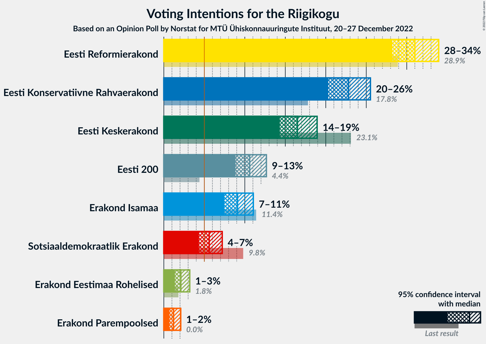

### Confidence Intervals

| Party | Last Result | Poll Result | 80% Confidence Interval | 90% Confidence Interval | 95% Confidence Interval | 99% Confidence Interval |
|:-----:|:-----------:|:-----------:|:-----------------------:|:-----------------------:|:-----------------------:|:-----------------------:|
| Eesti Reformierakond | 28.9% | 31.0% | 29.2–32.9% |28.7–33.5% |28.2–33.9% |27.3–34.9% |
| Eesti Konservatiivne Rahvaerakond | 17.8% | 22.8% | 21.2–24.6% |20.7–25.1% |20.3–25.5% |19.5–26.4% |
| Eesti Keskerakond | 23.1% | 16.5% | 15.1–18.1% |14.7–18.5% |14.3–18.9% |13.7–19.7% |
| Eesti 200 | 4.4% | 10.6% | 9.4–11.9% |9.1–12.3% |8.8–12.7% |8.3–13.3% |
| Erakond Isamaa | 11.4% | 9.1% | 8.0–10.4% |7.7–10.7% |7.5–11.1% |7.0–11.7% |
| Sotsiaaldemokraatlik Erakond | 9.8% | 5.6% | 4.8–6.6% |4.5–7.0% |4.3–7.2% |4.0–7.7% |
| Erakond Eestimaa Rohelised | 1.8% | 2.1% | 1.6–2.8% |1.5–3.0% |1.4–3.2% |1.2–3.6% |
| Erakond Parempoolsed | 0.0% | 1.2% | 0.9–1.8% |0.8–1.9% |0.7–2.1% |0.5–2.4% |

*Note:* The poll result column reflects the actual value used in the calculations. Published results may vary slightly, and in addition be rounded to fewer digits.

## Seats

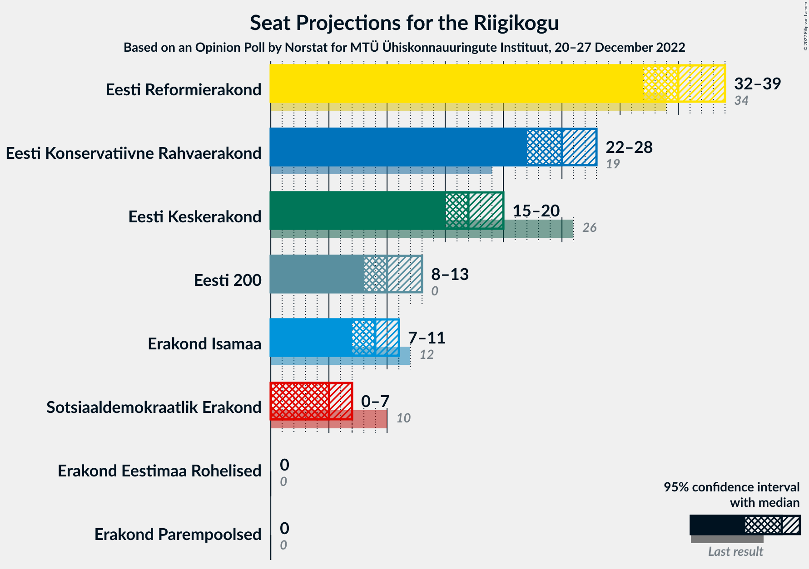

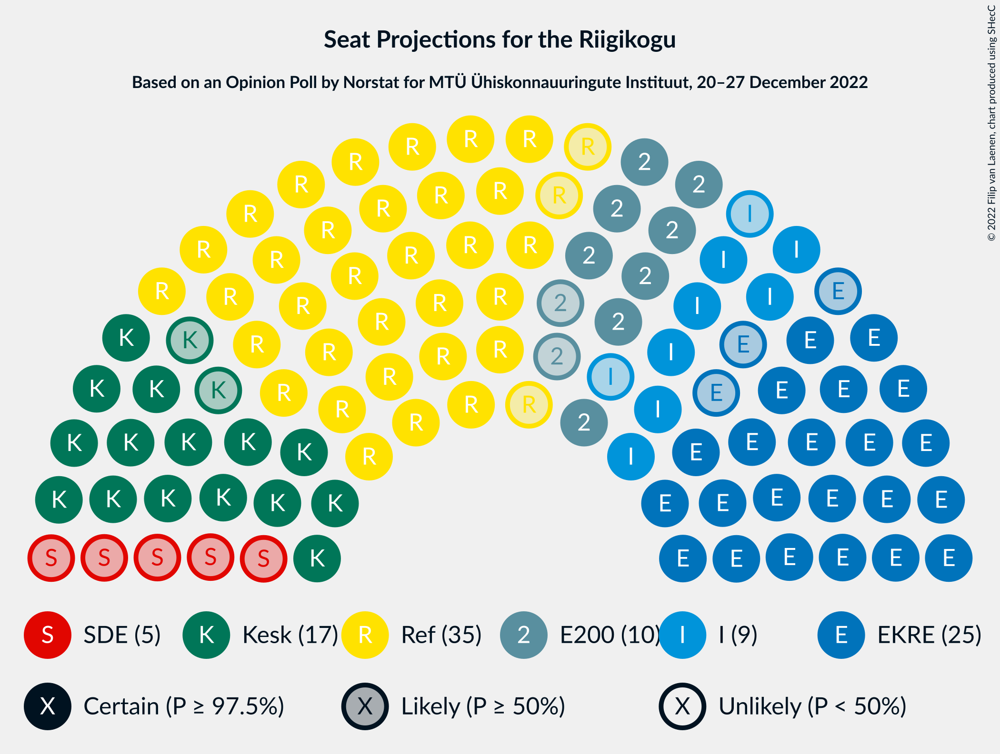

### Confidence Intervals

| Party | Last Result | Median | 80% Confidence Interval | 90% Confidence Interval | 95% Confidence Interval | 99% Confidence Interval |
|:-----:|:-----------:|:------:|:-----------------------:|:-----------------------:|:-----------------------:|:-----------------------:|
| <a href="#eesti-reformierakond">Eesti Reformierakond</a> | 34 | 35 | 33–38 |32–38 |32–39 |31–41 |
| <a href="#eesti-konservatiivne-rahvaerakond">Eesti Konservatiivne Rahvaerakond</a> | 19 | 25 | 23–27 |22–28 |22–28 |21–30 |
| <a href="#eesti-keskerakond">Eesti Keskerakond</a> | 26 | 17 | 16–19 |15–20 |15–20 |14–21 |
| <a href="#eesti-200">Eesti 200</a> | 0 | 10 | 9–12 |9–12 |8–13 |8–13 |
| <a href="#erakond-isamaa">Erakond Isamaa</a> | 12 | 9 | 7–10 |7–11 |7–11 |6–12 |
| <a href="#sotsiaaldemokraatlik-erakond">Sotsiaaldemokraatlik Erakond</a> | 10 | 5 | 0–6 |0–6 |0–7 |0–7 |
| <a href="#erakond-eestimaa-rohelised">Erakond Eestimaa Rohelised</a> | 0 | 0 | 0 |0 |0 |0 |
| <a href="#erakond-parempoolsed">Erakond Parempoolsed</a> | 0 | 0 | 0 |0 |0 |0 |

### Eesti Reformierakond

*For a full overview of the results for this party, see the [Eesti Reformierakond](party-eestireformierakond.html) page.*

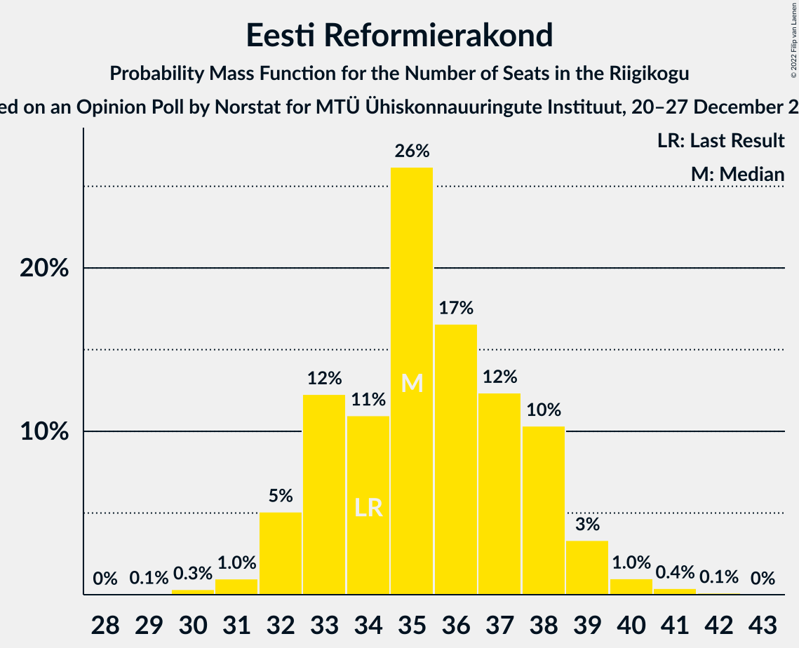

| Number of Seats | Probability | Accumulated | Special Marks |
|:---------------:|:-----------:|:-----------:|:-------------:|
| 29 | 0.1% | 100% |  |
| 30 | 0.3% | 99.9% |  |
| 31 | 1.0% | 99.6% |  |
| 32 | 5% | 98.6% |  |
| 33 | 12% | 94% |  |
| 34 | 11% | 81% | Last Result |
| 35 | 26% | 70% | Median |
| 36 | 17% | 44% |  |
| 37 | 12% | 28% |  |
| 38 | 10% | 15% |  |
| 39 | 3% | 5% |  |
| 40 | 1.0% | 2% |  |
| 41 | 0.4% | 0.5% |  |
| 42 | 0.1% | 0.1% |  |
| 43 | 0% | 0% |  |

### Eesti Konservatiivne Rahvaerakond

*For a full overview of the results for this party, see the [Eesti Konservatiivne Rahvaerakond](party-eestikonservatiivnerahvaerakond.html) page.*

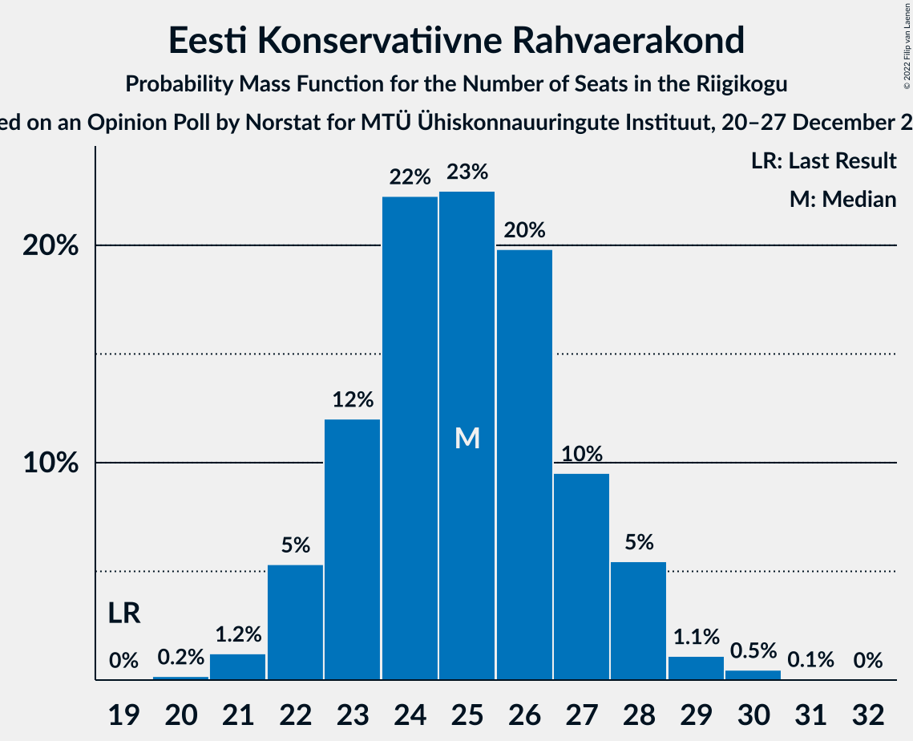

| Number of Seats | Probability | Accumulated | Special Marks |
|:---------------:|:-----------:|:-----------:|:-------------:|
| 19 | 0% | 100% | Last Result |
| 20 | 0.2% | 100% |  |
| 21 | 1.2% | 99.8% |  |
| 22 | 5% | 98.6% |  |
| 23 | 12% | 93% |  |
| 24 | 22% | 81% |  |
| 25 | 23% | 59% | Median |
| 26 | 20% | 36% |  |
| 27 | 10% | 17% |  |
| 28 | 5% | 7% |  |
| 29 | 1.1% | 2% |  |
| 30 | 0.5% | 0.6% |  |
| 31 | 0.1% | 0.1% |  |
| 32 | 0% | 0% |  |

### Eesti Keskerakond

*For a full overview of the results for this party, see the [Eesti Keskerakond](party-eestikeskerakond.html) page.*

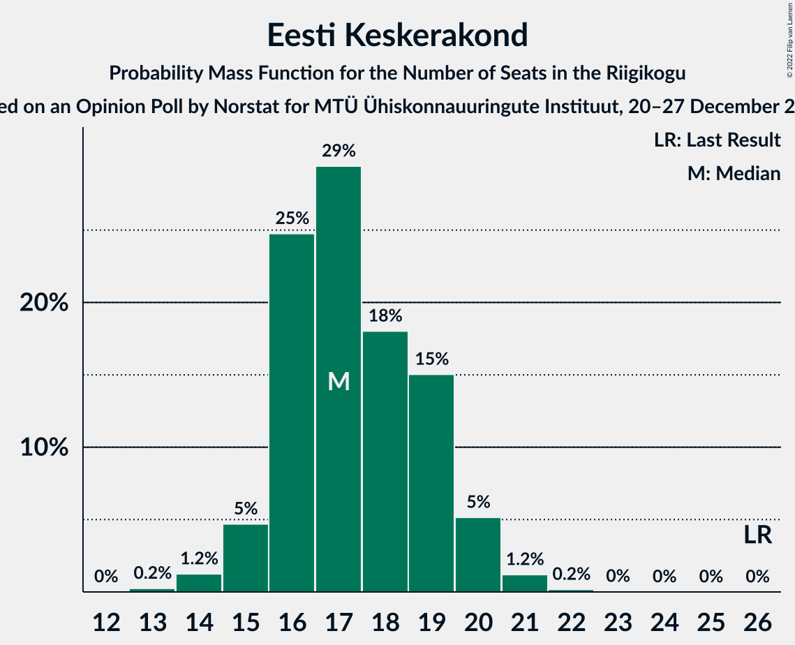

| Number of Seats | Probability | Accumulated | Special Marks |
|:---------------:|:-----------:|:-----------:|:-------------:|
| 13 | 0.2% | 100% |  |
| 14 | 1.2% | 99.7% |  |
| 15 | 5% | 98% |  |
| 16 | 25% | 94% |  |
| 17 | 29% | 69% | Median |
| 18 | 18% | 40% |  |
| 19 | 15% | 22% |  |
| 20 | 5% | 7% |  |
| 21 | 1.2% | 1.4% |  |
| 22 | 0.2% | 0.2% |  |
| 23 | 0% | 0% |  |
| 24 | 0% | 0% |  |
| 25 | 0% | 0% |  |
| 26 | 0% | 0% | Last Result |

### Eesti 200

*For a full overview of the results for this party, see the [Eesti 200](party-eesti200.html) page.*

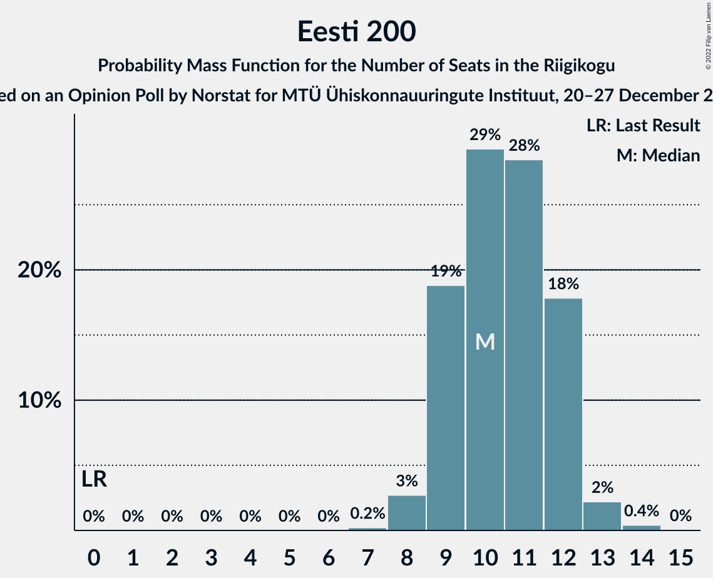

| Number of Seats | Probability | Accumulated | Special Marks |
|:---------------:|:-----------:|:-----------:|:-------------:|
| 0 | 0% | 100% | Last Result |
| 1 | 0% | 100% |  |
| 2 | 0% | 100% |  |
| 3 | 0% | 100% |  |
| 4 | 0% | 100% |  |
| 5 | 0% | 100% |  |
| 6 | 0% | 100% |  |
| 7 | 0.2% | 100% |  |
| 8 | 3% | 99.8% |  |
| 9 | 19% | 97% |  |
| 10 | 29% | 78% | Median |
| 11 | 28% | 49% |  |
| 12 | 18% | 21% |  |
| 13 | 2% | 3% |  |
| 14 | 0.4% | 0.5% |  |
| 15 | 0% | 0% |  |

### Erakond Isamaa

*For a full overview of the results for this party, see the [Erakond Isamaa](party-erakondisamaa.html) page.*

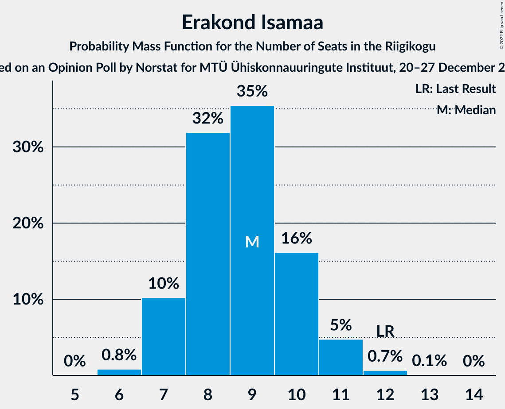

| Number of Seats | Probability | Accumulated | Special Marks |
|:---------------:|:-----------:|:-----------:|:-------------:|
| 6 | 0.8% | 100% |  |
| 7 | 10% | 99.2% |  |
| 8 | 32% | 89% |  |
| 9 | 35% | 57% | Median |
| 10 | 16% | 22% |  |
| 11 | 5% | 5% |  |
| 12 | 0.7% | 0.7% | Last Result |
| 13 | 0.1% | 0.1% |  |
| 14 | 0% | 0% |  |

### Sotsiaaldemokraatlik Erakond

*For a full overview of the results for this party, see the [Sotsiaaldemokraatlik Erakond](party-sotsiaaldemokraatlikerakond.html) page.*

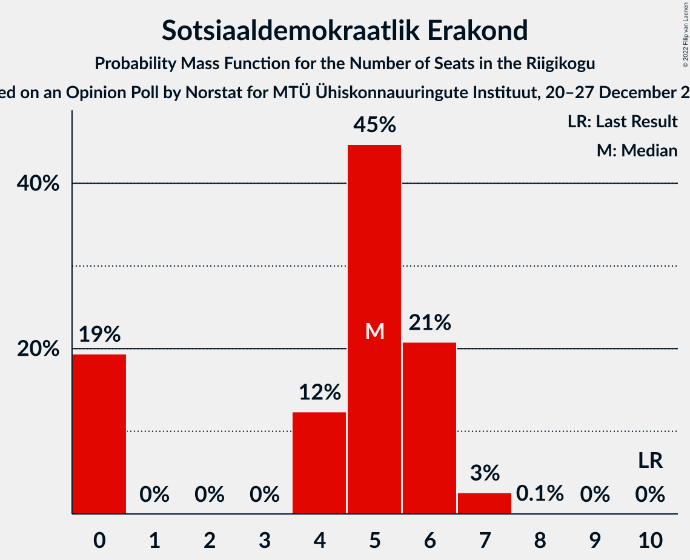

| Number of Seats | Probability | Accumulated | Special Marks |
|:---------------:|:-----------:|:-----------:|:-------------:|
| 0 | 19% | 100% |  |
| 1 | 0% | 81% |  |
| 2 | 0% | 81% |  |
| 3 | 0% | 81% |  |
| 4 | 12% | 81% |  |
| 5 | 45% | 68% | Median |
| 6 | 21% | 24% |  |
| 7 | 3% | 3% |  |
| 8 | 0.1% | 0.1% |  |
| 9 | 0% | 0% |  |
| 10 | 0% | 0% | Last Result |

### Erakond Eestimaa Rohelised

*For a full overview of the results for this party, see the [Erakond Eestimaa Rohelised](party-erakondeestimaarohelised.html) page.*

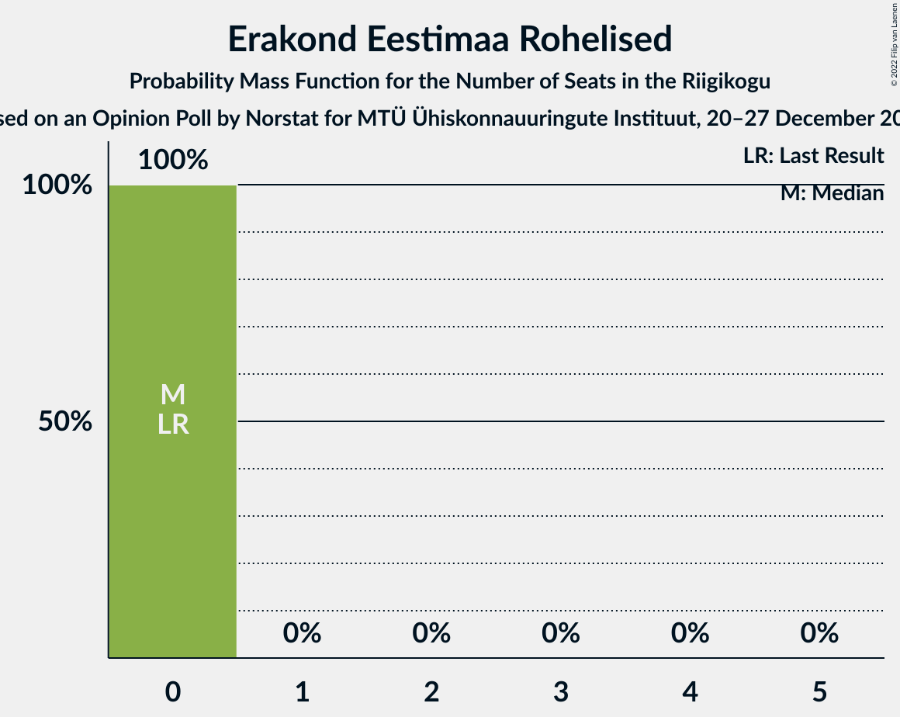

| Number of Seats | Probability | Accumulated | Special Marks |
|:---------------:|:-----------:|:-----------:|:-------------:|
| 0 | 100% | 100% | Last Result, Median |

### Erakond Parempoolsed

*For a full overview of the results for this party, see the [Erakond Parempoolsed](party-erakondparempoolsed.html) page.*

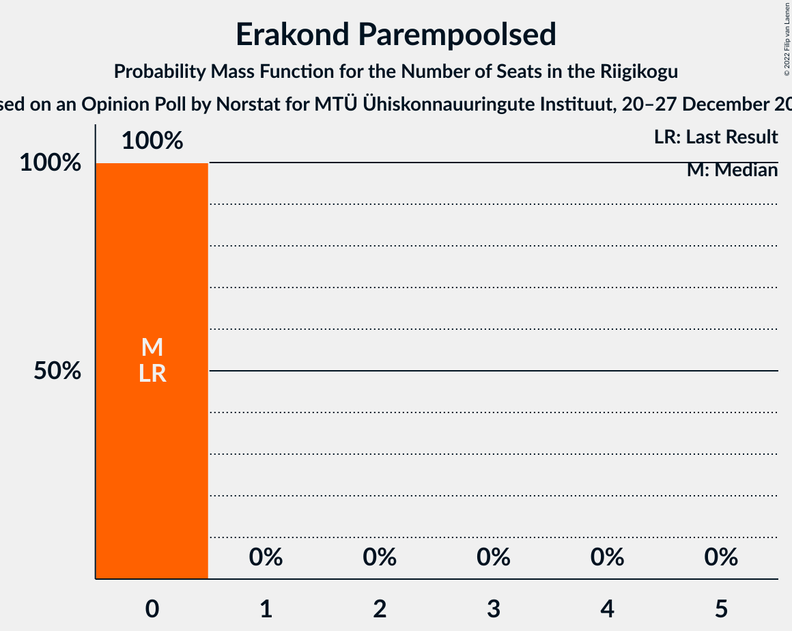

| Number of Seats | Probability | Accumulated | Special Marks |
|:---------------:|:-----------:|:-----------:|:-------------:|
| 0 | 100% | 100% | Last Result, Median |

## Coalitions

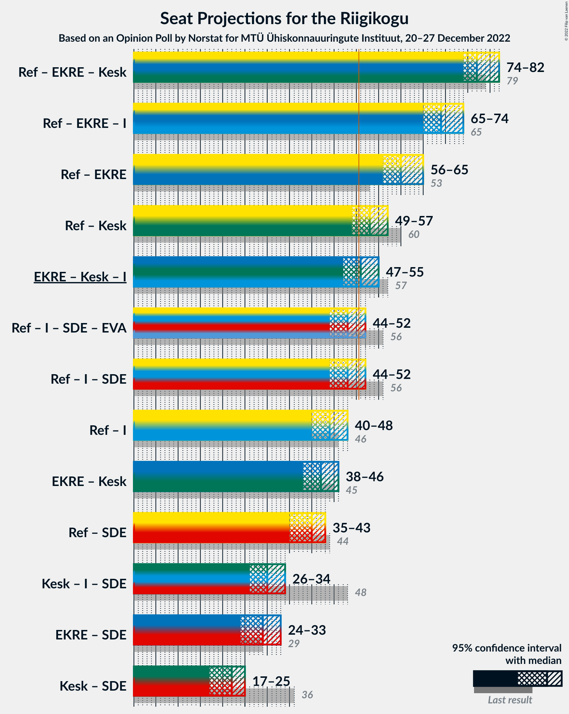

### Confidence Intervals

| Coalition | Last Result | Median | Majority? | 80% Confidence Interval | 90% Confidence Interval | 95% Confidence Interval | 99% Confidence Interval |
|:---------:|:-----------:|:------:|:---------:|:-----------------------:|:-----------------------:|:-----------------------:|:-----------------------:|
| Eesti Reformierakond – Eesti Konservatiivne Rahvaerakond – Eesti Keskerakond | 79 | 77 | 100% | 75–81 | 75–82 | 74–82 | 73–84 |
| Eesti Reformierakond – Eesti Konservatiivne Rahvaerakond – Erakond Isamaa | 65 | 69 | 100% | 67–72 | 66–73 | 65–74 | 64–75 |
| Eesti Reformierakond – Eesti Konservatiivne Rahvaerakond | 53 | 60 | 100% | 58–63 | 57–64 | 56–65 | 55–66 |
| Eesti Reformierakond – Eesti Keskerakond | 60 | 53 | 84% | 50–56 | 49–56 | 49–57 | 48–58 |
| Eesti Konservatiivne Rahvaerakond – Eesti Keskerakond – Erakond Isamaa | 57 | 51 | 57% | 48–54 | 48–55 | 47–55 | 46–57 |
| Eesti Reformierakond – Erakond Isamaa – Sotsiaaldemokraatlik Erakond | 56 | 48 | 15% | 45–51 | 44–52 | 44–52 | 42–53 |
| Eesti Reformierakond – Erakond Isamaa | 46 | 44 | 0.2% | 41–47 | 41–47 | 40–48 | 39–50 |
| Eesti Konservatiivne Rahvaerakond – Eesti Keskerakond | 45 | 42 | 0% | 40–45 | 39–46 | 38–46 | 37–48 |
| Eesti Reformierakond – Sotsiaaldemokraatlik Erakond | 44 | 40 | 0% | 37–42 | 35–43 | 35–43 | 33–45 |
| Eesti Keskerakond – Erakond Isamaa – Sotsiaaldemokraatlik Erakond | 48 | 30 | 0% | 27–33 | 26–34 | 26–34 | 24–35 |
| Eesti Konservatiivne Rahvaerakond – Sotsiaaldemokraatlik Erakond | 29 | 29 | 0% | 26–32 | 25–32 | 24–33 | 23–34 |
| Eesti Keskerakond – Sotsiaaldemokraatlik Erakond | 36 | 22 | 0% | 18–24 | 17–25 | 17–25 | 16–26 |

### Eesti Reformierakond – Eesti Konservatiivne Rahvaerakond – Eesti Keskerakond

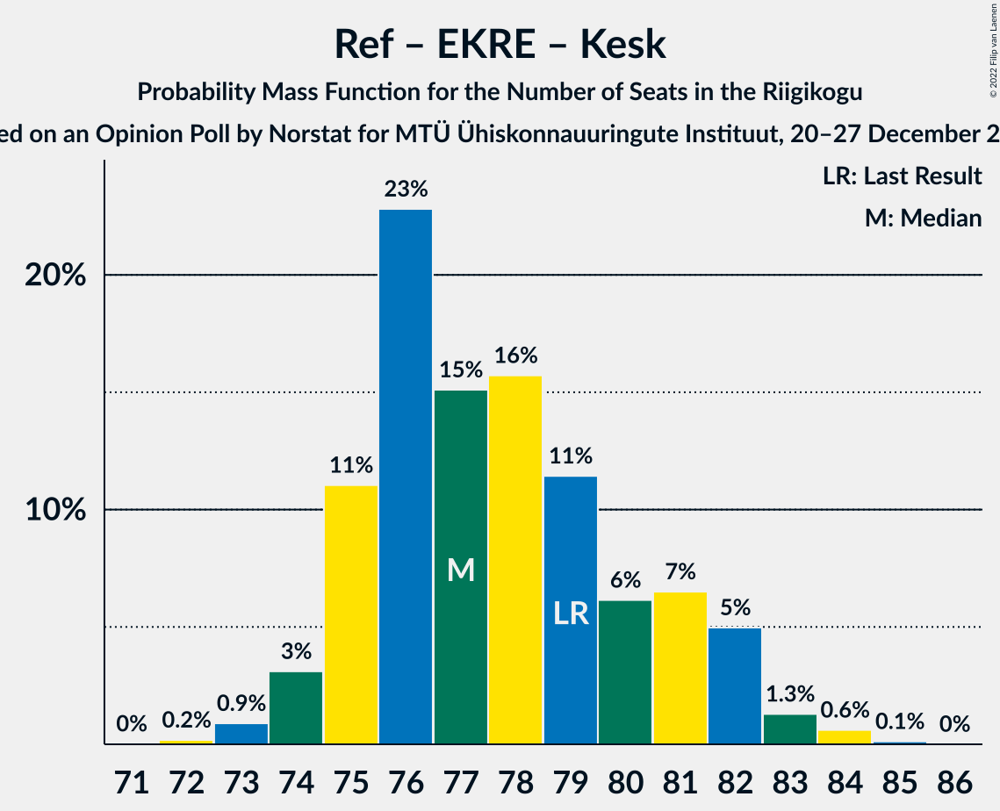

| Number of Seats | Probability | Accumulated | Special Marks |
|:---------------:|:-----------:|:-----------:|:-------------:|
| 72 | 0.2% | 100% |  |
| 73 | 0.9% | 99.8% |  |
| 74 | 3% | 98.9% |  |
| 75 | 11% | 96% |  |
| 76 | 23% | 85% |  |
| 77 | 15% | 62% | Median |
| 78 | 16% | 47% |  |
| 79 | 11% | 31% | Last Result |
| 80 | 6% | 20% |  |
| 81 | 7% | 14% |  |
| 82 | 5% | 7% |  |
| 83 | 1.3% | 2% |  |
| 84 | 0.6% | 0.7% |  |
| 85 | 0.1% | 0.1% |  |
| 86 | 0% | 0% |  |

### Eesti Reformierakond – Eesti Konservatiivne Rahvaerakond – Erakond Isamaa

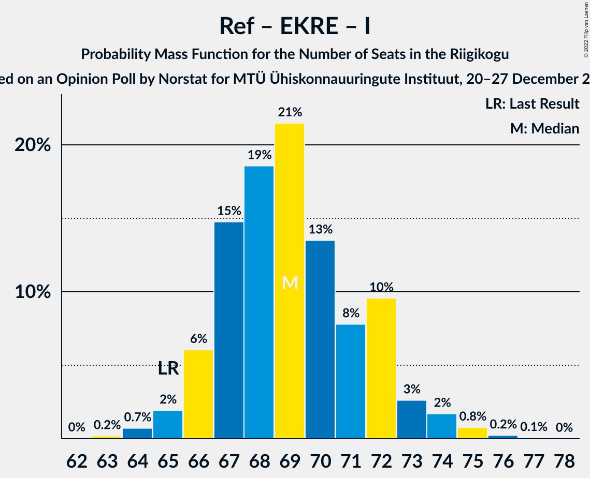

| Number of Seats | Probability | Accumulated | Special Marks |
|:---------------:|:-----------:|:-----------:|:-------------:|
| 63 | 0.2% | 100% |  |
| 64 | 0.7% | 99.8% |  |
| 65 | 2% | 99.1% | Last Result |
| 66 | 6% | 97% |  |
| 67 | 15% | 91% |  |
| 68 | 19% | 76% |  |
| 69 | 21% | 58% | Median |
| 70 | 13% | 36% |  |
| 71 | 8% | 23% |  |
| 72 | 10% | 15% |  |
| 73 | 3% | 5% |  |
| 74 | 2% | 3% |  |
| 75 | 0.8% | 1.1% |  |
| 76 | 0.2% | 0.3% |  |
| 77 | 0.1% | 0.1% |  |
| 78 | 0% | 0% |  |

### Eesti Reformierakond – Eesti Konservatiivne Rahvaerakond

| Number of Seats | Probability | Accumulated | Special Marks |
|:---------------:|:-----------:|:-----------:|:-------------:|
| 53 | 0% | 100% | Last Result |
| 54 | 0.2% | 100% |  |
| 55 | 0.6% | 99.8% |  |
| 56 | 2% | 99.2% |  |
| 57 | 5% | 97% |  |
| 58 | 11% | 93% |  |
| 59 | 17% | 81% |  |
| 60 | 21% | 64% | Median |
| 61 | 16% | 43% |  |
| 62 | 10% | 27% |  |
| 63 | 10% | 17% |  |
| 64 | 3% | 6% |  |
| 65 | 2% | 3% |  |
| 66 | 0.7% | 1.0% |  |
| 67 | 0.3% | 0.4% |  |
| 68 | 0.1% | 0.1% |  |
| 69 | 0% | 0% |  |

### Eesti Reformierakond – Eesti Keskerakond

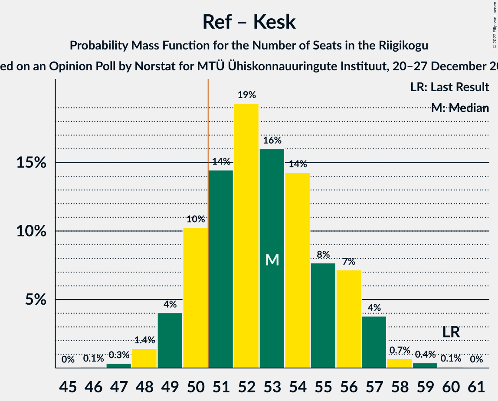

| Number of Seats | Probability | Accumulated | Special Marks |
|:---------------:|:-----------:|:-----------:|:-------------:|
| 46 | 0.1% | 100% |  |
| 47 | 0.3% | 99.9% |  |
| 48 | 1.4% | 99.6% |  |
| 49 | 4% | 98% |  |
| 50 | 10% | 94% |  |
| 51 | 14% | 84% | Majority |
| 52 | 19% | 69% | Median |
| 53 | 16% | 50% |  |
| 54 | 14% | 34% |  |
| 55 | 8% | 20% |  |
| 56 | 7% | 12% |  |
| 57 | 4% | 5% |  |
| 58 | 0.7% | 1.2% |  |
| 59 | 0.4% | 0.5% |  |
| 60 | 0.1% | 0.1% | Last Result |
| 61 | 0% | 0% |  |

### Eesti Konservatiivne Rahvaerakond – Eesti Keskerakond – Erakond Isamaa

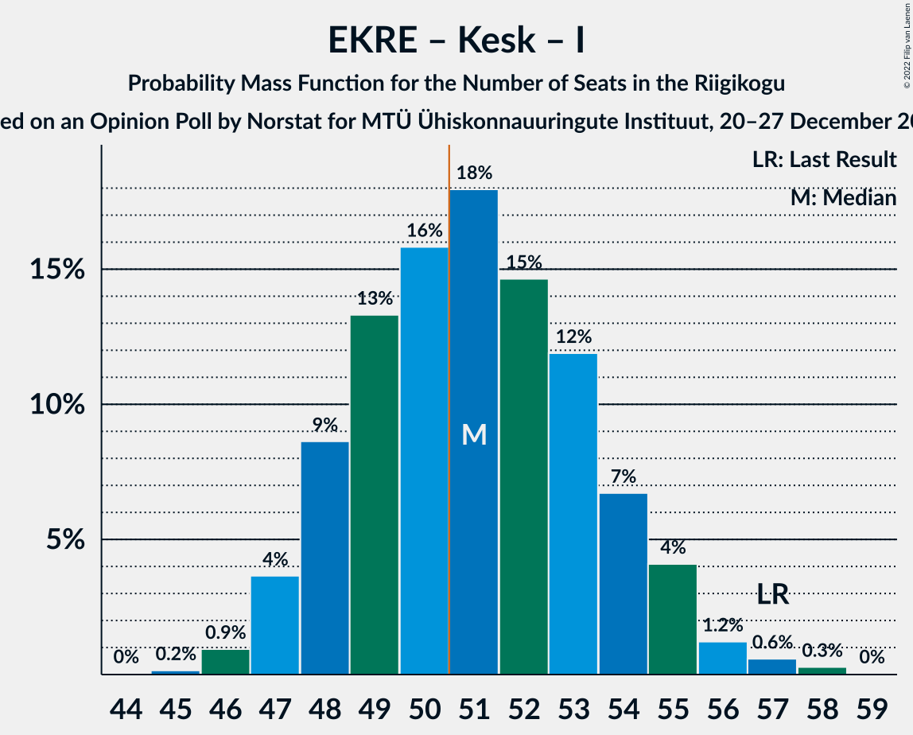

| Number of Seats | Probability | Accumulated | Special Marks |
|:---------------:|:-----------:|:-----------:|:-------------:|
| 44 | 0% | 100% |  |
| 45 | 0.2% | 99.9% |  |
| 46 | 0.9% | 99.8% |  |
| 47 | 4% | 98.9% |  |
| 48 | 9% | 95% |  |
| 49 | 13% | 87% |  |
| 50 | 16% | 73% |  |
| 51 | 18% | 57% | Median, Majority |
| 52 | 15% | 39% |  |
| 53 | 12% | 25% |  |
| 54 | 7% | 13% |  |
| 55 | 4% | 6% |  |
| 56 | 1.2% | 2% |  |
| 57 | 0.6% | 0.9% | Last Result |
| 58 | 0.3% | 0.3% |  |
| 59 | 0% | 0% |  |

### Eesti Reformierakond – Erakond Isamaa – Sotsiaaldemokraatlik Erakond

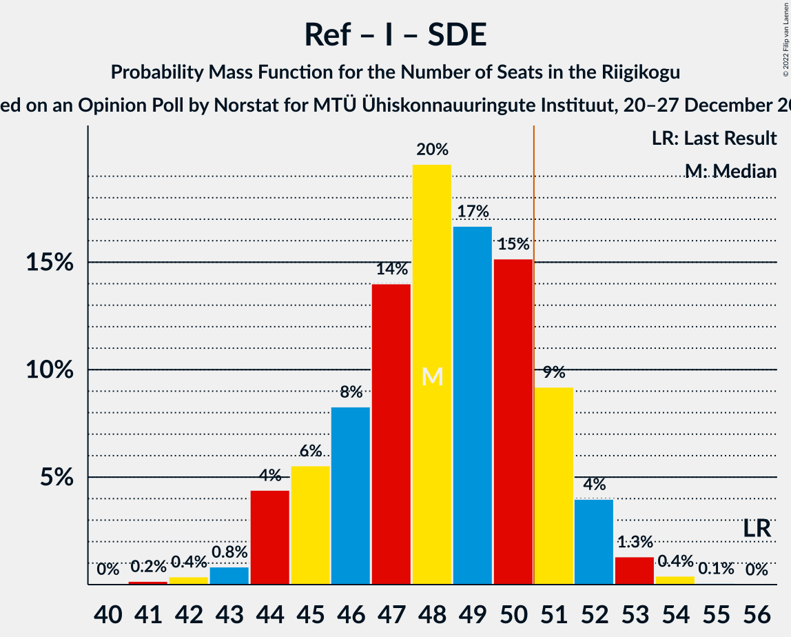

| Number of Seats | Probability | Accumulated | Special Marks |
|:---------------:|:-----------:|:-----------:|:-------------:|
| 41 | 0.2% | 100% |  |
| 42 | 0.4% | 99.8% |  |
| 43 | 0.8% | 99.4% |  |
| 44 | 4% | 98.6% |  |
| 45 | 6% | 94% |  |
| 46 | 8% | 89% |  |
| 47 | 14% | 80% |  |
| 48 | 20% | 66% |  |
| 49 | 17% | 47% | Median |
| 50 | 15% | 30% |  |
| 51 | 9% | 15% | Majority |
| 52 | 4% | 6% |  |
| 53 | 1.3% | 2% |  |
| 54 | 0.4% | 0.5% |  |
| 55 | 0.1% | 0.1% |  |
| 56 | 0% | 0% | Last Result |

### Eesti Reformierakond – Erakond Isamaa

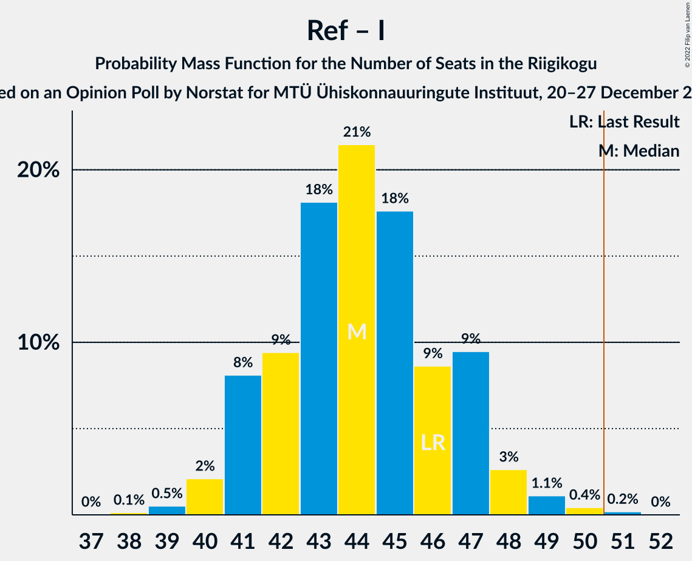

| Number of Seats | Probability | Accumulated | Special Marks |
|:---------------:|:-----------:|:-----------:|:-------------:|
| 38 | 0.1% | 100% |  |
| 39 | 0.5% | 99.8% |  |
| 40 | 2% | 99.3% |  |
| 41 | 8% | 97% |  |
| 42 | 9% | 89% |  |
| 43 | 18% | 80% |  |
| 44 | 21% | 62% | Median |
| 45 | 18% | 40% |  |
| 46 | 9% | 22% | Last Result |
| 47 | 9% | 14% |  |
| 48 | 3% | 4% |  |
| 49 | 1.1% | 2% |  |
| 50 | 0.4% | 0.6% |  |
| 51 | 0.2% | 0.2% | Majority |
| 52 | 0% | 0% |  |

### Eesti Konservatiivne Rahvaerakond – Eesti Keskerakond

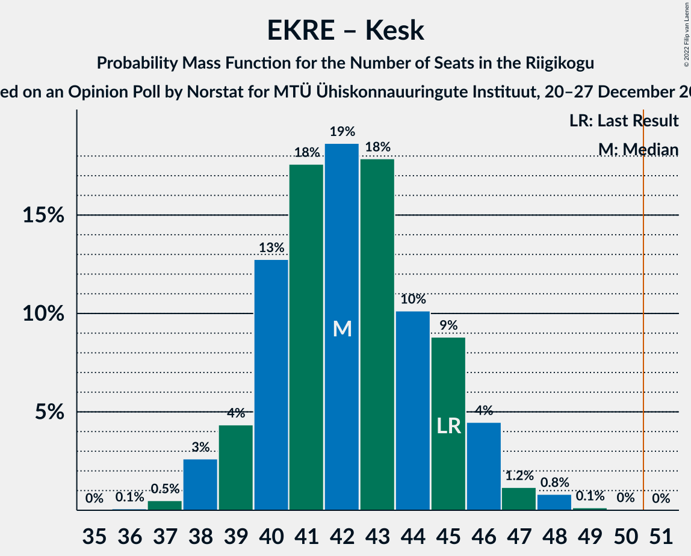

| Number of Seats | Probability | Accumulated | Special Marks |
|:---------------:|:-----------:|:-----------:|:-------------:|
| 36 | 0.1% | 100% |  |
| 37 | 0.5% | 99.9% |  |
| 38 | 3% | 99.4% |  |
| 39 | 4% | 97% |  |
| 40 | 13% | 92% |  |
| 41 | 18% | 80% |  |
| 42 | 19% | 62% | Median |
| 43 | 18% | 43% |  |
| 44 | 10% | 26% |  |
| 45 | 9% | 15% | Last Result |
| 46 | 4% | 7% |  |
| 47 | 1.2% | 2% |  |
| 48 | 0.8% | 1.0% |  |
| 49 | 0.1% | 0.2% |  |
| 50 | 0% | 0.1% |  |
| 51 | 0% | 0% | Majority |

### Eesti Reformierakond – Sotsiaaldemokraatlik Erakond

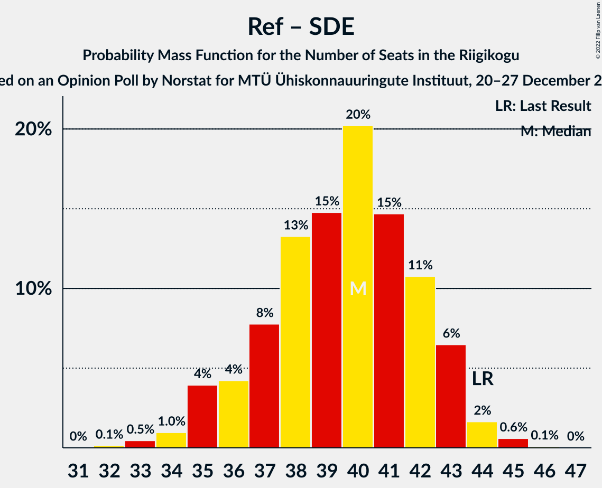

| Number of Seats | Probability | Accumulated | Special Marks |
|:---------------:|:-----------:|:-----------:|:-------------:|
| 32 | 0.1% | 100% |  |
| 33 | 0.5% | 99.8% |  |
| 34 | 1.0% | 99.4% |  |
| 35 | 4% | 98% |  |
| 36 | 4% | 94% |  |
| 37 | 8% | 90% |  |
| 38 | 13% | 82% |  |
| 39 | 15% | 69% |  |
| 40 | 20% | 54% | Median |
| 41 | 15% | 34% |  |
| 42 | 11% | 20% |  |
| 43 | 6% | 9% |  |
| 44 | 2% | 2% | Last Result |
| 45 | 0.6% | 0.7% |  |
| 46 | 0.1% | 0.1% |  |
| 47 | 0% | 0% |  |

### Eesti Keskerakond – Erakond Isamaa – Sotsiaaldemokraatlik Erakond

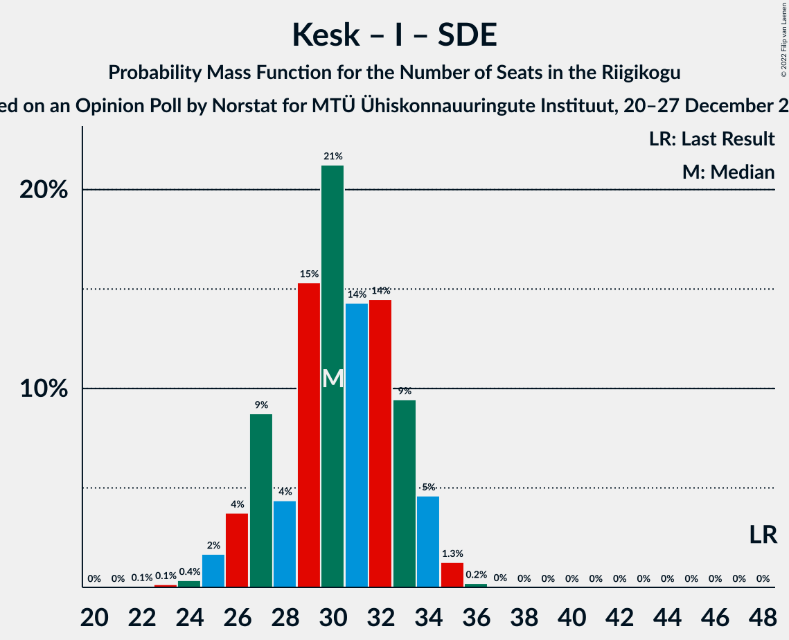

| Number of Seats | Probability | Accumulated | Special Marks |
|:---------------:|:-----------:|:-----------:|:-------------:|
| 22 | 0.1% | 100% |  |
| 23 | 0.1% | 99.9% |  |
| 24 | 0.4% | 99.8% |  |
| 25 | 2% | 99.4% |  |
| 26 | 4% | 98% |  |
| 27 | 9% | 94% |  |
| 28 | 4% | 85% |  |
| 29 | 15% | 81% |  |
| 30 | 21% | 66% |  |
| 31 | 14% | 44% | Median |
| 32 | 14% | 30% |  |
| 33 | 9% | 16% |  |
| 34 | 5% | 6% |  |
| 35 | 1.3% | 2% |  |
| 36 | 0.2% | 0.3% |  |
| 37 | 0% | 0.1% |  |
| 38 | 0% | 0% |  |
| 39 | 0% | 0% |  |
| 40 | 0% | 0% |  |
| 41 | 0% | 0% |  |
| 42 | 0% | 0% |  |
| 43 | 0% | 0% |  |
| 44 | 0% | 0% |  |
| 45 | 0% | 0% |  |
| 46 | 0% | 0% |  |
| 47 | 0% | 0% |  |
| 48 | 0% | 0% | Last Result |

### Eesti Konservatiivne Rahvaerakond – Sotsiaaldemokraatlik Erakond

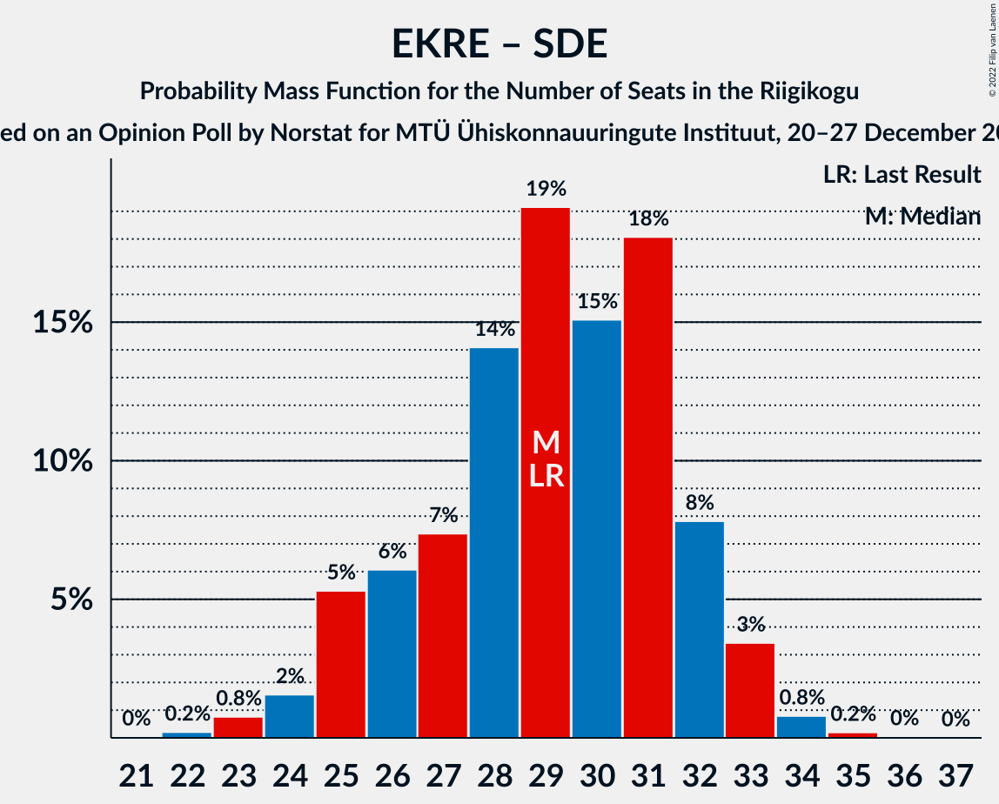

| Number of Seats | Probability | Accumulated | Special Marks |
|:---------------:|:-----------:|:-----------:|:-------------:|
| 22 | 0.2% | 100% |  |
| 23 | 0.8% | 99.8% |  |
| 24 | 2% | 99.0% |  |
| 25 | 5% | 97% |  |
| 26 | 6% | 92% |  |
| 27 | 7% | 86% |  |
| 28 | 14% | 79% |  |
| 29 | 19% | 65% | Last Result |
| 30 | 15% | 45% | Median |
| 31 | 18% | 30% |  |
| 32 | 8% | 12% |  |
| 33 | 3% | 4% |  |
| 34 | 0.8% | 1.0% |  |
| 35 | 0.2% | 0.2% |  |
| 36 | 0% | 0.1% |  |
| 37 | 0% | 0% |  |

### Eesti Keskerakond – Sotsiaaldemokraatlik Erakond

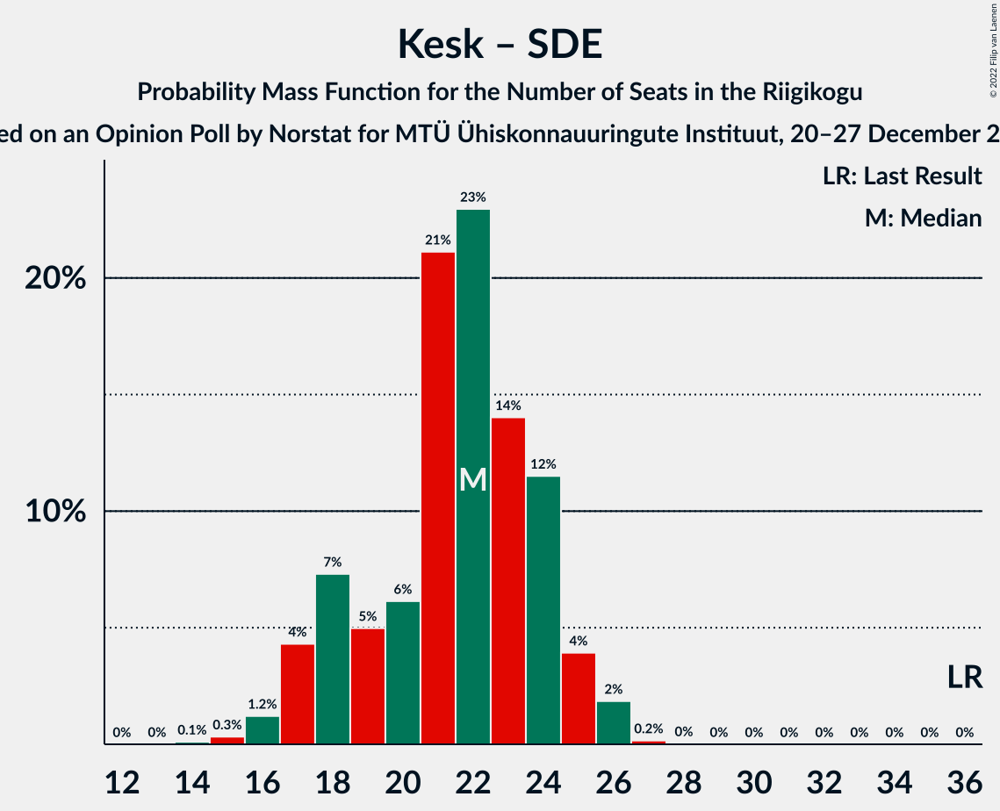

| Number of Seats | Probability | Accumulated | Special Marks |
|:---------------:|:-----------:|:-----------:|:-------------:|
| 14 | 0.1% | 100% |  |
| 15 | 0.3% | 99.9% |  |
| 16 | 1.2% | 99.6% |  |
| 17 | 4% | 98% |  |
| 18 | 7% | 94% |  |
| 19 | 5% | 87% |  |
| 20 | 6% | 82% |  |
| 21 | 21% | 76% |  |
| 22 | 23% | 54% | Median |
| 23 | 14% | 32% |  |
| 24 | 12% | 17% |  |
| 25 | 4% | 6% |  |
| 26 | 2% | 2% |  |
| 27 | 0.2% | 0.2% |  |
| 28 | 0% | 0% |  |
| 29 | 0% | 0% |  |
| 30 | 0% | 0% |  |
| 31 | 0% | 0% |  |
| 32 | 0% | 0% |  |
| 33 | 0% | 0% |  |
| 34 | 0% | 0% |  |
| 35 | 0% | 0% |  |
| 36 | 0% | 0% | Last Result |

## Technical Information

### Opinion Poll

+ **Polling firm:** Norstat
+ **Commissioner(s):** MTÜ Ühiskonnauuringute Instituut
+ **Fieldwork period:** 20–27 December 2022

### Calculations

+ **Sample size:** 1000
+ **Simulations done:** 1,048,576
+ **Error estimate:** 1.48%

