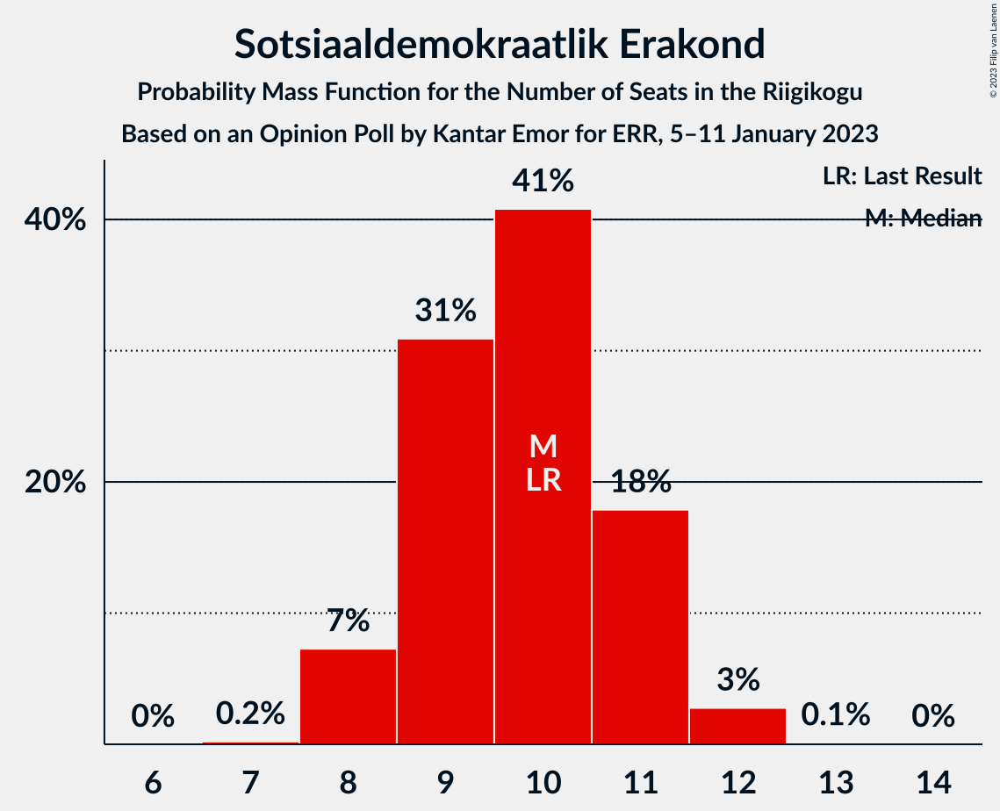
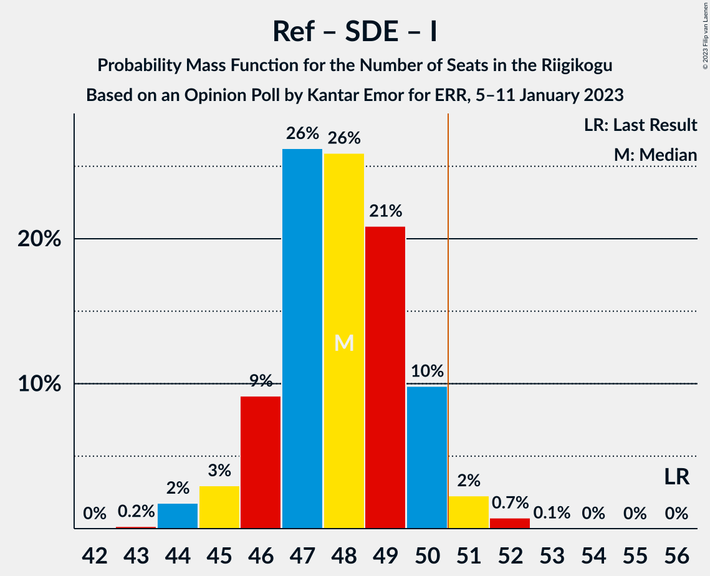

# Opinion Poll by Kantar Emor for ERR, 5–11 January 2023

<a href="#voting-intentions">Voting Intentions</a> | <a href="#seats">Seats</a> | <a href="#coalitions">Coalitions</a> | <a href="#technical-information">Technical Information</a>

## Voting Intentions

### Confidence Intervals

| Party | Last Result | Poll Result | 80% Confidence Interval | 90% Confidence Interval | 95% Confidence Interval | 99% Confidence Interval |
|:-----:|:-----------:|:-----------:|:-----------------------:|:-----------------------:|:-----------------------:|:-----------------------:|
| Eesti Reformierakond | 28.9% | 28.2% | 26.8–29.6% |26.4–30.1% |26.1–30.4% |25.4–31.1% |
| Eesti Konservatiivne Rahvaerakond | 17.8% | 21.2% | 19.9–22.5% |19.6–22.9% |19.3–23.2% |18.7–23.9% |
| Eesti Keskerakond | 23.1% | 18.1% | 16.9–19.4% |16.6–19.8% |16.3–20.1% |15.8–20.7% |
| Eesti 200 | 4.4% | 11.1% | 10.2–12.2% |9.9–12.5% |9.7–12.7% |9.2–13.2% |
| Sotsiaaldemokraatlik Erakond | 9.8% | 10.1% | 9.2–11.1% |8.9–11.4% |8.7–11.6% |8.3–12.1% |
| Erakond Isamaa | 11.4% | 7.1% | 6.3–8.0% |6.1–8.2% |5.9–8.4% |5.6–8.9% |
| Erakond Eestimaa Rohelised | 1.8% | 3.1% | 2.6–3.7% |2.4–3.9% |2.3–4.0% |2.1–4.3% |
| Erakond Parempoolsed | 0.0% | 1.0% | 0.8–1.4% |0.7–1.6% |0.6–1.7% |0.5–1.9% |

*Note:* The poll result column reflects the actual value used in the calculations. Published results may vary slightly, and in addition be rounded to fewer digits.

## Seats

### Confidence Intervals

| Party | Last Result | Median | 80% Confidence Interval | 90% Confidence Interval | 95% Confidence Interval | 99% Confidence Interval |
|:-----:|:-----------:|:------:|:-----------------------:|:-----------------------:|:-----------------------:|:-----------------------:|
| <a href="#eesti-reformierakond">Eesti Reformierakond</a> | 34 | 32 | 30–33 |30–34 |29–34 |28–35 |
| <a href="#eesti-konservatiivne-rahvaerakond">Eesti Konservatiivne Rahvaerakond</a> | 19 | 23 | 21–25 |21–25 |21–25 |20–26 |
| <a href="#eesti-keskerakond">Eesti Keskerakond</a> | 26 | 19 | 18–21 |17–21 |17–21 |16–22 |
| <a href="#eesti-200">Eesti 200</a> | 0 | 11 | 10–12 |9–12 |9–13 |9–13 |
| <a href="#sotsiaaldemokraatlik-erakond">Sotsiaaldemokraatlik Erakond</a> | 10 | 10 | 9–11 |8–11 |8–12 |8–12 |
| <a href="#erakond-isamaa">Erakond Isamaa</a> | 12 | 6 | 6–7 |5–8 |5–8 |5–8 |
| <a href="#erakond-eestimaa-rohelised">Erakond Eestimaa Rohelised</a> | 0 | 0 | 0 |0 |0 |0 |
| <a href="#erakond-parempoolsed">Erakond Parempoolsed</a> | 0 | 0 | 0 |0 |0 |0 |

### Eesti Reformierakond

*For a full overview of the results for this party, see the [Eesti Reformierakond](party-eestireformierakond.html) page.*

| Number of Seats | Probability | Accumulated | Special Marks |
|:---------------:|:-----------:|:-----------:|:-------------:|
| 27 | 0.1% | 100% |  |
| 28 | 0.8% | 99.9% |  |
| 29 | 4% | 99.1% |  |
| 30 | 17% | 95% |  |
| 31 | 22% | 78% |  |
| 32 | 28% | 56% | Median |
| 33 | 20% | 28% |  |
| 34 | 6% | 8% | Last Result |
| 35 | 2% | 2% |  |
| 36 | 0.2% | 0.2% |  |
| 37 | 0% | 0% |  |

### Eesti Konservatiivne Rahvaerakond

*For a full overview of the results for this party, see the [Eesti Konservatiivne Rahvaerakond](party-eestikonservatiivnerahvaerakond.html) page.*

| Number of Seats | Probability | Accumulated | Special Marks |
|:---------------:|:-----------:|:-----------:|:-------------:|
| 19 | 0.2% | 100% | Last Result |
| 20 | 2% | 99.8% |  |
| 21 | 13% | 98% |  |
| 22 | 30% | 86% |  |
| 23 | 29% | 56% | Median |
| 24 | 16% | 27% |  |
| 25 | 9% | 10% |  |
| 26 | 1.5% | 2% |  |
| 27 | 0.2% | 0.2% |  |
| 28 | 0% | 0% |  |

### Eesti Keskerakond

*For a full overview of the results for this party, see the [Eesti Keskerakond](party-eestikeskerakond.html) page.*

| Number of Seats | Probability | Accumulated | Special Marks |
|:---------------:|:-----------:|:-----------:|:-------------:|
| 16 | 0.5% | 100% |  |
| 17 | 5% | 99.4% |  |
| 18 | 18% | 94% |  |
| 19 | 27% | 76% | Median |
| 20 | 30% | 48% |  |
| 21 | 16% | 18% |  |
| 22 | 1.5% | 2% |  |
| 23 | 0.3% | 0.3% |  |
| 24 | 0% | 0% |  |
| 25 | 0% | 0% |  |
| 26 | 0% | 0% | Last Result |

### Eesti 200

*For a full overview of the results for this party, see the [Eesti 200](party-eesti200.html) page.*

| Number of Seats | Probability | Accumulated | Special Marks |
|:---------------:|:-----------:|:-----------:|:-------------:|
| 0 | 0% | 100% | Last Result |
| 1 | 0% | 100% |  |
| 2 | 0% | 100% |  |
| 3 | 0% | 100% |  |
| 4 | 0% | 100% |  |
| 5 | 0% | 100% |  |
| 6 | 0% | 100% |  |
| 7 | 0% | 100% |  |
| 8 | 0.2% | 100% |  |
| 9 | 5% | 99.8% |  |
| 10 | 25% | 95% |  |
| 11 | 44% | 69% | Median |
| 12 | 20% | 25% |  |
| 13 | 5% | 5% |  |
| 14 | 0.4% | 0.4% |  |
| 15 | 0% | 0% |  |

### Sotsiaaldemokraatlik Erakond

*For a full overview of the results for this party, see the [Sotsiaaldemokraatlik Erakond](party-sotsiaaldemokraatlikerakond.html) page.*

| Number of Seats | Probability | Accumulated | Special Marks |
|:---------------:|:-----------:|:-----------:|:-------------:|
| 7 | 0.2% | 100% |  |
| 8 | 7% | 99.8% |  |
| 9 | 31% | 93% |  |
| 10 | 41% | 62% | Last Result, Median |
| 11 | 18% | 21% |  |
| 12 | 3% | 3% |  |
| 13 | 0.1% | 0.1% |  |
| 14 | 0% | 0% |  |

### Erakond Isamaa

*For a full overview of the results for this party, see the [Erakond Isamaa](party-erakondisamaa.html) page.*

| Number of Seats | Probability | Accumulated | Special Marks |
|:---------------:|:-----------:|:-----------:|:-------------:|
| 4 | 0.1% | 100% |  |
| 5 | 8% | 99.9% |  |
| 6 | 44% | 91% | Median |
| 7 | 41% | 47% |  |
| 8 | 6% | 6% |  |
| 9 | 0.3% | 0.3% |  |
| 10 | 0% | 0% |  |
| 11 | 0% | 0% |  |
| 12 | 0% | 0% | Last Result |

### Erakond Eestimaa Rohelised

*For a full overview of the results for this party, see the [Erakond Eestimaa Rohelised](party-erakondeestimaarohelised.html) page.*

| Number of Seats | Probability | Accumulated | Special Marks |
|:---------------:|:-----------:|:-----------:|:-------------:|
| 0 | 100% | 100% | Last Result, Median |

### Erakond Parempoolsed

*For a full overview of the results for this party, see the [Erakond Parempoolsed](party-erakondparempoolsed.html) page.*

| Number of Seats | Probability | Accumulated | Special Marks |
|:---------------:|:-----------:|:-----------:|:-------------:|
| 0 | 100% | 100% | Last Result, Median |

## Coalitions

### Confidence Intervals

| Coalition | Last Result | Median | Majority? | 80% Confidence Interval | 90% Confidence Interval | 95% Confidence Interval | 99% Confidence Interval |
|:---------:|:-----------:|:------:|:---------:|:-----------------------:|:-----------------------:|:-----------------------:|:-----------------------:|
| Eesti Reformierakond – Eesti Konservatiivne Rahvaerakond – Eesti Keskerakond | 79 | 74 | 100% | 72–75 | 72–76 | 71–76 | 70–77 |
| Eesti Reformierakond – Eesti Konservatiivne Rahvaerakond – Erakond Isamaa | 65 | 61 | 100% | 59–63 | 59–63 | 58–64 | 57–65 |
| Eesti Reformierakond – Eesti Konservatiivne Rahvaerakond | 53 | 55 | 99.8% | 52–56 | 52–57 | 52–57 | 51–59 |
| Eesti Reformierakond – Eesti Keskerakond | 60 | 51 | 63% | 49–53 | 48–53 | 48–54 | 47–55 |
| Eesti Konservatiivne Rahvaerakond – Eesti Keskerakond – Erakond Isamaa | 57 | 49 | 6% | 47–50 | 46–51 | 45–51 | 45–53 |
| Eesti Reformierakond – Sotsiaaldemokraatlik Erakond – Erakond Isamaa | 56 | 48 | 3% | 46–50 | 46–50 | 45–51 | 44–52 |
| Eesti Konservatiivne Rahvaerakond – Eesti Keskerakond | 45 | 42 | 0% | 40–44 | 40–44 | 39–45 | 38–46 |
| Eesti Reformierakond – Sotsiaaldemokraatlik Erakond | 44 | 41 | 0% | 40–43 | 39–44 | 39–44 | 38–45 |
| Eesti Reformierakond – Erakond Isamaa | 46 | 38 | 0% | 36–40 | 36–40 | 35–41 | 35–42 |
| Eesti Keskerakond – Sotsiaaldemokraatlik Erakond – Erakond Isamaa | 48 | 36 | 0% | 34–38 | 33–38 | 33–38 | 31–39 |
| Eesti Konservatiivne Rahvaerakond – Sotsiaaldemokraatlik Erakond | 29 | 32 | 0% | 31–35 | 31–35 | 30–35 | 29–36 |
| Eesti Keskerakond – Sotsiaaldemokraatlik Erakond | 36 | 29 | 0% | 27–31 | 27–31 | 26–32 | 26–32 |

### Eesti Reformierakond – Eesti Konservatiivne Rahvaerakond – Eesti Keskerakond

| Number of Seats | Probability | Accumulated | Special Marks |
|:---------------:|:-----------:|:-----------:|:-------------:|
| 69 | 0.1% | 100% |  |
| 70 | 0.7% | 99.9% |  |
| 71 | 3% | 99.2% |  |
| 72 | 13% | 97% |  |
| 73 | 22% | 83% |  |
| 74 | 26% | 61% | Median |
| 75 | 28% | 35% |  |
| 76 | 6% | 7% |  |
| 77 | 0.9% | 1.2% |  |
| 78 | 0.2% | 0.2% |  |
| 79 | 0% | 0% | Last Result |

### Eesti Reformierakond – Eesti Konservatiivne Rahvaerakond – Erakond Isamaa

| Number of Seats | Probability | Accumulated | Special Marks |
|:---------------:|:-----------:|:-----------:|:-------------:|
| 56 | 0.1% | 100% |  |
| 57 | 0.4% | 99.9% |  |
| 58 | 3% | 99.5% |  |
| 59 | 16% | 96% |  |
| 60 | 16% | 80% |  |
| 61 | 31% | 64% | Median |
| 62 | 19% | 33% |  |
| 63 | 11% | 14% |  |
| 64 | 2% | 3% |  |
| 65 | 0.7% | 0.8% | Last Result |
| 66 | 0.1% | 0.1% |  |
| 67 | 0% | 0% |  |

### Eesti Reformierakond – Eesti Konservatiivne Rahvaerakond

| Number of Seats | Probability | Accumulated | Special Marks |
|:---------------:|:-----------:|:-----------:|:-------------:|
| 50 | 0.2% | 100% |  |
| 51 | 2% | 99.8% | Majority |
| 52 | 11% | 98% |  |
| 53 | 11% | 87% | Last Result |
| 54 | 25% | 76% |  |
| 55 | 26% | 51% | Median |
| 56 | 19% | 25% |  |
| 57 | 4% | 6% |  |
| 58 | 2% | 2% |  |
| 59 | 0.4% | 0.5% |  |
| 60 | 0.1% | 0.1% |  |
| 61 | 0% | 0% |  |

### Eesti Reformierakond – Eesti Keskerakond

| Number of Seats | Probability | Accumulated | Special Marks |
|:---------------:|:-----------:|:-----------:|:-------------:|
| 46 | 0.1% | 100% |  |
| 47 | 0.7% | 99.9% |  |
| 48 | 6% | 99.2% |  |
| 49 | 11% | 94% |  |
| 50 | 20% | 83% |  |
| 51 | 20% | 63% | Median, Majority |
| 52 | 24% | 44% |  |
| 53 | 16% | 19% |  |
| 54 | 2% | 3% |  |
| 55 | 0.4% | 0.5% |  |
| 56 | 0.1% | 0.1% |  |
| 57 | 0% | 0% |  |
| 58 | 0% | 0% |  |
| 59 | 0% | 0% |  |
| 60 | 0% | 0% | Last Result |

### Eesti Konservatiivne Rahvaerakond – Eesti Keskerakond – Erakond Isamaa

| Number of Seats | Probability | Accumulated | Special Marks |
|:---------------:|:-----------:|:-----------:|:-------------:|
| 44 | 0.4% | 100% |  |
| 45 | 3% | 99.6% |  |
| 46 | 4% | 97% |  |
| 47 | 11% | 93% |  |
| 48 | 30% | 82% | Median |
| 49 | 23% | 52% |  |
| 50 | 23% | 29% |  |
| 51 | 3% | 6% | Majority |
| 52 | 2% | 2% |  |
| 53 | 0.6% | 0.7% |  |
| 54 | 0% | 0% |  |
| 55 | 0% | 0% |  |
| 56 | 0% | 0% |  |
| 57 | 0% | 0% | Last Result |

### Eesti Reformierakond – Sotsiaaldemokraatlik Erakond – Erakond Isamaa

| Number of Seats | Probability | Accumulated | Special Marks |
|:---------------:|:-----------:|:-----------:|:-------------:|
| 43 | 0.2% | 100% |  |
| 44 | 2% | 99.8% |  |
| 45 | 3% | 98% |  |
| 46 | 9% | 95% |  |
| 47 | 26% | 86% |  |
| 48 | 26% | 60% | Median |
| 49 | 21% | 34% |  |
| 50 | 10% | 13% |  |
| 51 | 2% | 3% | Majority |
| 52 | 0.7% | 0.8% |  |
| 53 | 0.1% | 0.1% |  |
| 54 | 0% | 0% |  |
| 55 | 0% | 0% |  |
| 56 | 0% | 0% | Last Result |

### Eesti Konservatiivne Rahvaerakond – Eesti Keskerakond

| Number of Seats | Probability | Accumulated | Special Marks |
|:---------------:|:-----------:|:-----------:|:-------------:|
| 37 | 0.1% | 100% |  |
| 38 | 0.7% | 99.9% |  |
| 39 | 3% | 99.2% |  |
| 40 | 6% | 96% |  |
| 41 | 18% | 90% |  |
| 42 | 34% | 72% | Median |
| 43 | 23% | 38% |  |
| 44 | 10% | 15% |  |
| 45 | 4% | 5% | Last Result |
| 46 | 0.7% | 0.9% |  |
| 47 | 0.2% | 0.2% |  |
| 48 | 0% | 0% |  |

### Eesti Reformierakond – Sotsiaaldemokraatlik Erakond

| Number of Seats | Probability | Accumulated | Special Marks |
|:---------------:|:-----------:|:-----------:|:-------------:|
| 37 | 0.3% | 100% |  |
| 38 | 1.5% | 99.6% |  |
| 39 | 7% | 98% |  |
| 40 | 16% | 92% |  |
| 41 | 30% | 76% |  |
| 42 | 21% | 46% | Median |
| 43 | 18% | 24% |  |
| 44 | 5% | 7% | Last Result |
| 45 | 2% | 2% |  |
| 46 | 0.2% | 0.3% |  |
| 47 | 0% | 0% |  |

### Eesti Reformierakond – Erakond Isamaa

| Number of Seats | Probability | Accumulated | Special Marks |
|:---------------:|:-----------:|:-----------:|:-------------:|
| 34 | 0.4% | 100% |  |
| 35 | 3% | 99.6% |  |
| 36 | 8% | 96% |  |
| 37 | 23% | 89% |  |
| 38 | 24% | 66% | Median |
| 39 | 27% | 42% |  |
| 40 | 11% | 14% |  |
| 41 | 3% | 4% |  |
| 42 | 0.8% | 0.9% |  |
| 43 | 0.1% | 0.1% |  |
| 44 | 0% | 0% |  |
| 45 | 0% | 0% |  |
| 46 | 0% | 0% | Last Result |

### Eesti Keskerakond – Sotsiaaldemokraatlik Erakond – Erakond Isamaa

| Number of Seats | Probability | Accumulated | Special Marks |
|:---------------:|:-----------:|:-----------:|:-------------:|
| 31 | 0.5% | 100% |  |
| 32 | 2% | 99.5% |  |
| 33 | 7% | 98% |  |
| 34 | 14% | 91% |  |
| 35 | 23% | 77% | Median |
| 36 | 27% | 54% |  |
| 37 | 15% | 27% |  |
| 38 | 10% | 12% |  |
| 39 | 1.3% | 2% |  |
| 40 | 0.3% | 0.3% |  |
| 41 | 0% | 0% |  |
| 42 | 0% | 0% |  |
| 43 | 0% | 0% |  |
| 44 | 0% | 0% |  |
| 45 | 0% | 0% |  |
| 46 | 0% | 0% |  |
| 47 | 0% | 0% |  |
| 48 | 0% | 0% | Last Result |

### Eesti Konservatiivne Rahvaerakond – Sotsiaaldemokraatlik Erakond

| Number of Seats | Probability | Accumulated | Special Marks |
|:---------------:|:-----------:|:-----------:|:-------------:|
| 28 | 0.1% | 100% |  |
| 29 | 0.6% | 99.9% | Last Result |
| 30 | 3% | 99.3% |  |
| 31 | 21% | 96% |  |
| 32 | 28% | 75% |  |
| 33 | 23% | 47% | Median |
| 34 | 11% | 24% |  |
| 35 | 10% | 13% |  |
| 36 | 2% | 2% |  |
| 37 | 0.2% | 0.2% |  |
| 38 | 0% | 0% |  |

### Eesti Keskerakond – Sotsiaaldemokraatlik Erakond

| Number of Seats | Probability | Accumulated | Special Marks |
|:---------------:|:-----------:|:-----------:|:-------------:|
| 25 | 0.4% | 100% |  |
| 26 | 2% | 99.6% |  |
| 27 | 13% | 97% |  |
| 28 | 14% | 84% |  |
| 29 | 28% | 70% | Median |
| 30 | 24% | 43% |  |
| 31 | 16% | 18% |  |
| 32 | 2% | 3% |  |
| 33 | 0.4% | 0.5% |  |
| 34 | 0% | 0.1% |  |
| 35 | 0% | 0% |  |
| 36 | 0% | 0% | Last Result |

## Technical Information

### Opinion Poll

+ **Polling firm:** Kantar Emor
+ **Commissioner(s):** ERR
+ **Fieldwork period:** 5–11 January 2023

### Calculations

+ **Sample size:** 1639
+ **Simulations done:** 1,048,576
+ **Error estimate:** 1.36%

