# Opinion Poll by Turu-uuringute AS, 27 January 2023

<a href="#voting-intentions">Voting Intentions</a> | <a href="#seats">Seats</a> | <a href="#coalitions">Coalitions</a> | <a href="#technical-information">Technical Information</a>

## Voting Intentions

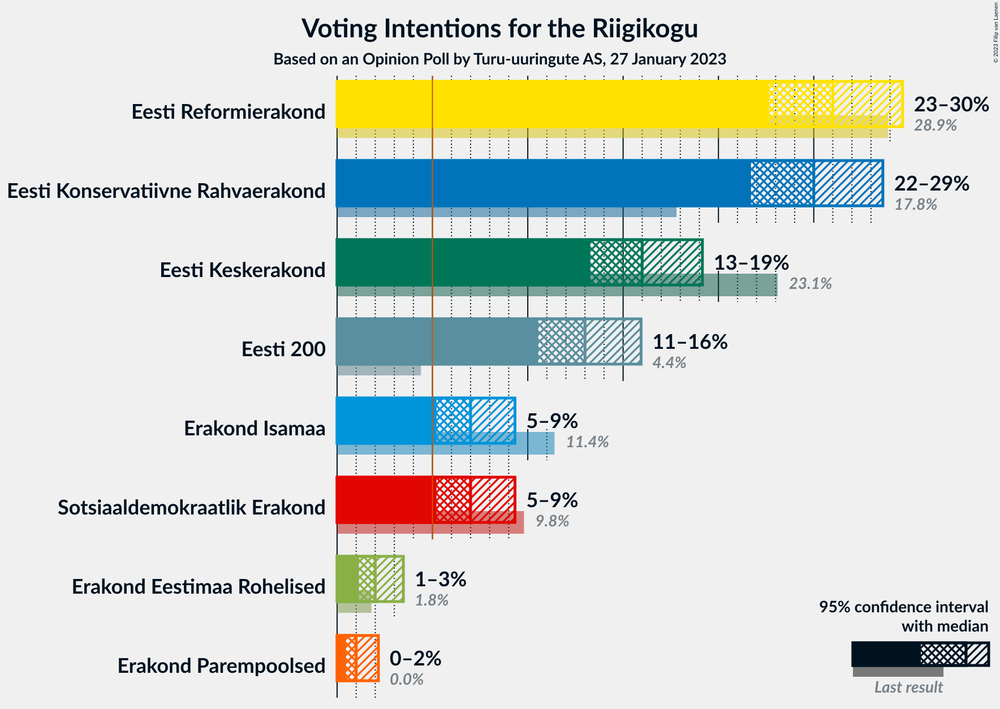

### Confidence Intervals

| Party | Last Result | Poll Result | 80% Confidence Interval | 90% Confidence Interval | 95% Confidence Interval | 99% Confidence Interval |
|:-----:|:-----------:|:-----------:|:-----------------------:|:-----------------------:|:-----------------------:|:-----------------------:|
| Eesti Reformierakond | 28.9% | 26.0% | 23.8–28.4% |23.2–29.1% |22.6–29.7% |21.6–30.8% |
| Eesti Konservatiivne Rahvaerakond | 17.8% | 25.0% | 22.8–27.4% |22.2–28.0% |21.7–28.6% |20.7–29.8% |
| Eesti Keskerakond | 23.1% | 16.0% | 14.2–18.1% |13.7–18.6% |13.3–19.2% |12.5–20.2% |
| Eesti 200 | 4.4% | 13.0% | 11.4–14.9% |10.9–15.5% |10.5–15.9% |9.8–16.9% |
| Sotsiaaldemokraatlik Erakond | 9.8% | 7.0% | 5.8–8.5% |5.5–8.9% |5.2–9.3% |4.7–10.1% |
| Erakond Isamaa | 11.4% | 7.0% | 5.8–8.5% |5.5–8.9% |5.2–9.3% |4.7–10.1% |
| Erakond Eestimaa Rohelised | 1.8% | 2.0% | 1.4–3.0% |1.3–3.2% |1.1–3.5% |0.9–4.0% |
| Erakond Parempoolsed | 0.0% | 1.0% | 0.6–1.8% |0.5–2.0% |0.5–2.2% |0.3–2.6% |

*Note:* The poll result column reflects the actual value used in the calculations. Published results may vary slightly, and in addition be rounded to fewer digits.

## Seats

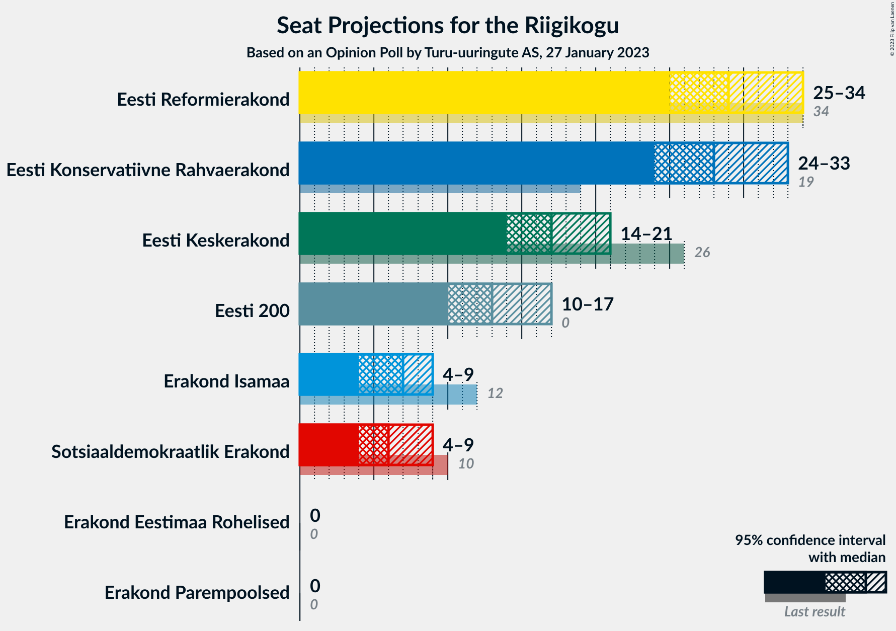

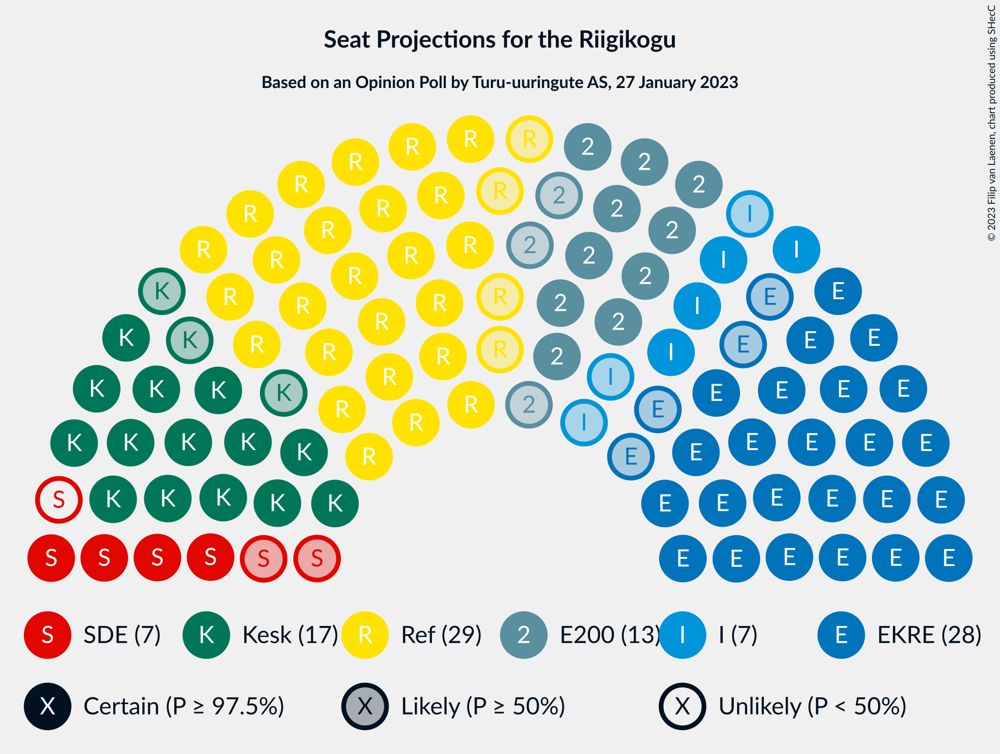

### Confidence Intervals

| Party | Last Result | Median | 80% Confidence Interval | 90% Confidence Interval | 95% Confidence Interval | 99% Confidence Interval |
|:-----:|:-----------:|:------:|:-----------------------:|:-----------------------:|:-----------------------:|:-----------------------:|
| <a href="#eesti-reformierakond">Eesti Reformierakond</a> | 34 | 29 | 26–32 |26–33 |25–34 |24–35 |
| <a href="#eesti-konservatiivne-rahvaerakond">Eesti Konservatiivne Rahvaerakond</a> | 19 | 28 | 25–31 |24–32 |24–33 |22–34 |
| <a href="#eesti-keskerakond">Eesti Keskerakond</a> | 26 | 17 | 15–19 |14–20 |14–21 |13–22 |
| <a href="#eesti-200">Eesti 200</a> | 0 | 13 | 11–15 |11–16 |10–17 |10–18 |
| <a href="#sotsiaaldemokraatlik-erakond">Sotsiaaldemokraatlik Erakond</a> | 10 | 6 | 5–8 |5–9 |4–9 |0–10 |
| <a href="#erakond-isamaa">Erakond Isamaa</a> | 12 | 7 | 5–8 |5–9 |4–9 |0–10 |
| <a href="#erakond-eestimaa-rohelised">Erakond Eestimaa Rohelised</a> | 0 | 0 | 0 |0 |0 |0 |
| <a href="#erakond-parempoolsed">Erakond Parempoolsed</a> | 0 | 0 | 0 |0 |0 |0 |

### Eesti Reformierakond

*For a full overview of the results for this party, see the [Eesti Reformierakond](party-eestireformierakond.html) page.*

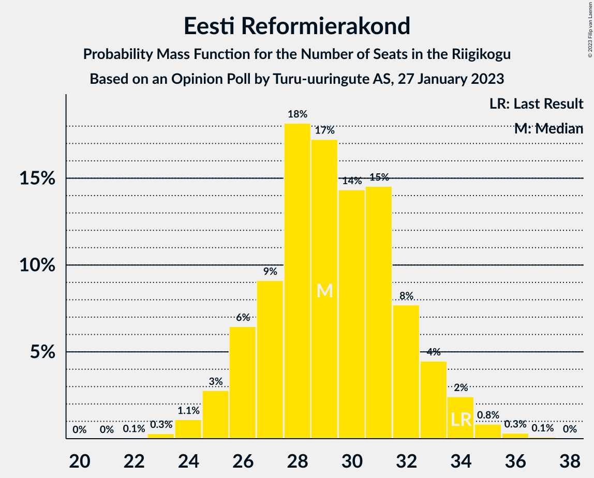

| Number of Seats | Probability | Accumulated | Special Marks |
|:---------------:|:-----------:|:-----------:|:-------------:|
| 22 | 0.1% | 100% |  |
| 23 | 0.3% | 99.9% |  |
| 24 | 1.1% | 99.6% |  |
| 25 | 3% | 98.5% |  |
| 26 | 6% | 96% |  |
| 27 | 9% | 89% |  |
| 28 | 18% | 80% |  |
| 29 | 17% | 62% | Median |
| 30 | 14% | 45% |  |
| 31 | 15% | 30% |  |
| 32 | 8% | 16% |  |
| 33 | 4% | 8% |  |
| 34 | 2% | 4% | Last Result |
| 35 | 0.8% | 1.3% |  |
| 36 | 0.3% | 0.5% |  |
| 37 | 0.1% | 0.1% |  |
| 38 | 0% | 0% |  |

### Eesti Konservatiivne Rahvaerakond

*For a full overview of the results for this party, see the [Eesti Konservatiivne Rahvaerakond](party-eestikonservatiivnerahvaerakond.html) page.*

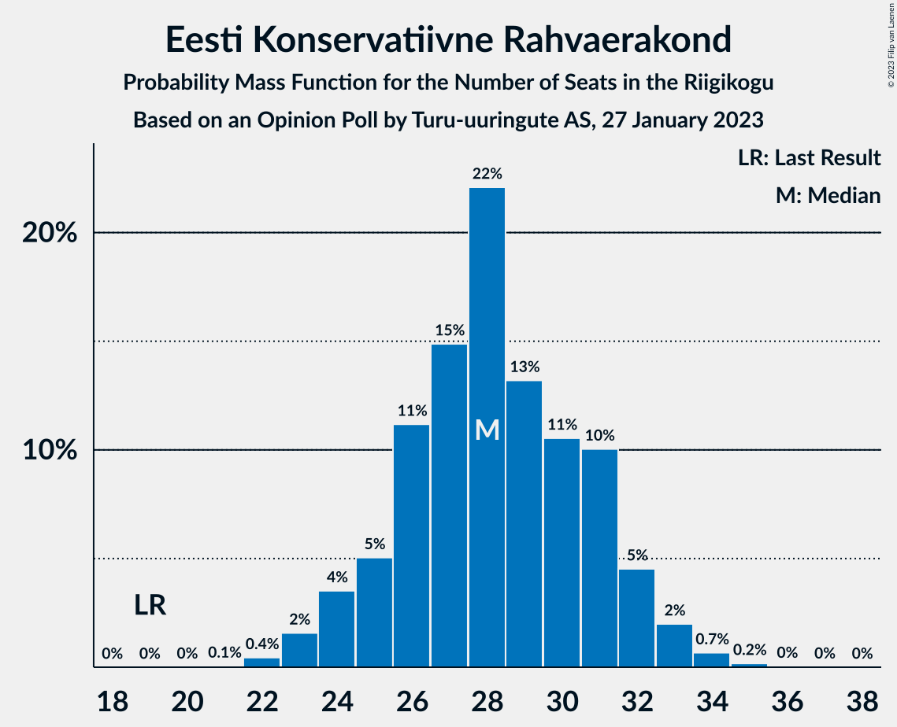

| Number of Seats | Probability | Accumulated | Special Marks |
|:---------------:|:-----------:|:-----------:|:-------------:|
| 19 | 0% | 100% | Last Result |
| 20 | 0% | 100% |  |
| 21 | 0.1% | 100% |  |
| 22 | 0.4% | 99.9% |  |
| 23 | 2% | 99.5% |  |
| 24 | 4% | 98% |  |
| 25 | 5% | 94% |  |
| 26 | 11% | 89% |  |
| 27 | 15% | 78% |  |
| 28 | 22% | 63% | Median |
| 29 | 13% | 41% |  |
| 30 | 11% | 28% |  |
| 31 | 10% | 17% |  |
| 32 | 5% | 7% |  |
| 33 | 2% | 3% |  |
| 34 | 0.7% | 0.9% |  |
| 35 | 0.2% | 0.2% |  |
| 36 | 0% | 0.1% |  |
| 37 | 0% | 0% |  |

### Eesti Keskerakond

*For a full overview of the results for this party, see the [Eesti Keskerakond](party-eestikeskerakond.html) page.*

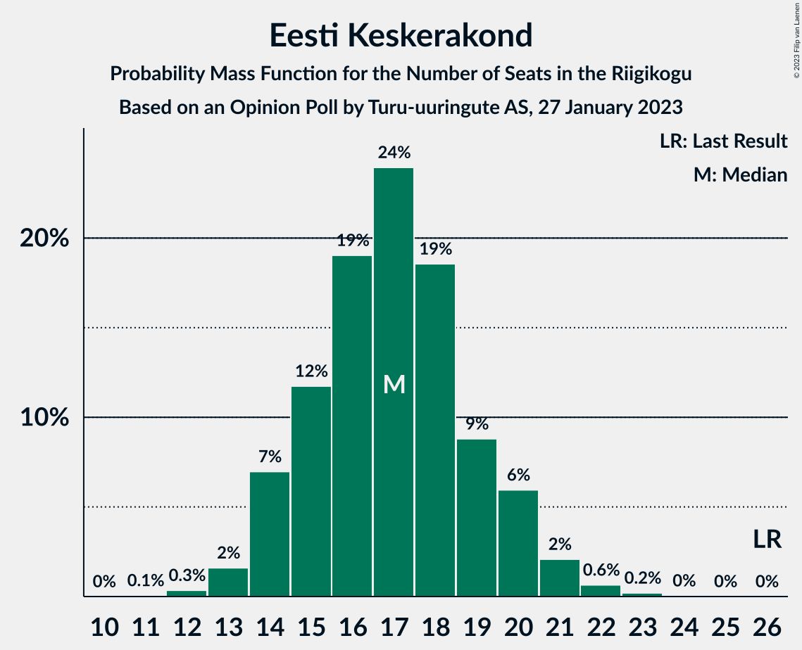

| Number of Seats | Probability | Accumulated | Special Marks |
|:---------------:|:-----------:|:-----------:|:-------------:|
| 11 | 0.1% | 100% |  |
| 12 | 0.3% | 99.9% |  |
| 13 | 2% | 99.6% |  |
| 14 | 7% | 98% |  |
| 15 | 12% | 91% |  |
| 16 | 19% | 79% |  |
| 17 | 24% | 60% | Median |
| 18 | 19% | 36% |  |
| 19 | 9% | 18% |  |
| 20 | 6% | 9% |  |
| 21 | 2% | 3% |  |
| 22 | 0.6% | 0.9% |  |
| 23 | 0.2% | 0.3% |  |
| 24 | 0% | 0.1% |  |
| 25 | 0% | 0% |  |
| 26 | 0% | 0% | Last Result |

### Eesti 200

*For a full overview of the results for this party, see the [Eesti 200](party-eesti200.html) page.*

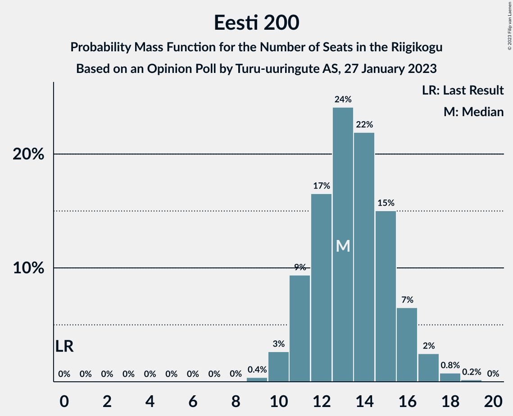

| Number of Seats | Probability | Accumulated | Special Marks |
|:---------------:|:-----------:|:-----------:|:-------------:|
| 0 | 0% | 100% | Last Result |
| 1 | 0% | 100% |  |
| 2 | 0% | 100% |  |
| 3 | 0% | 100% |  |
| 4 | 0% | 100% |  |
| 5 | 0% | 100% |  |
| 6 | 0% | 100% |  |
| 7 | 0% | 100% |  |
| 8 | 0% | 100% |  |
| 9 | 0.4% | 100% |  |
| 10 | 3% | 99.6% |  |
| 11 | 9% | 97% |  |
| 12 | 17% | 88% |  |
| 13 | 24% | 71% | Median |
| 14 | 22% | 47% |  |
| 15 | 15% | 25% |  |
| 16 | 7% | 10% |  |
| 17 | 2% | 3% |  |
| 18 | 0.8% | 1.0% |  |
| 19 | 0.2% | 0.2% |  |
| 20 | 0% | 0% |  |

### Sotsiaaldemokraatlik Erakond

*For a full overview of the results for this party, see the [Sotsiaaldemokraatlik Erakond](party-sotsiaaldemokraatlikerakond.html) page.*

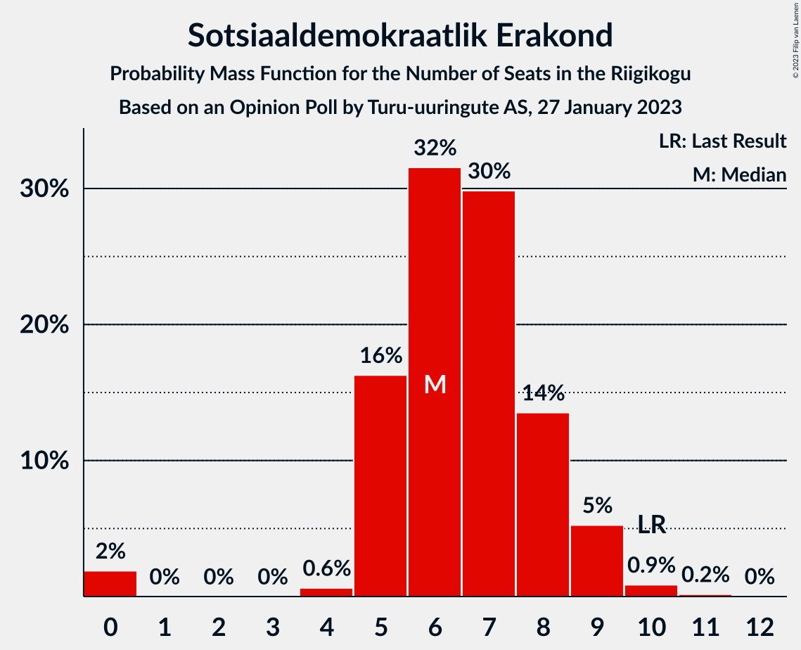

| Number of Seats | Probability | Accumulated | Special Marks |
|:---------------:|:-----------:|:-----------:|:-------------:|
| 0 | 2% | 100% |  |
| 1 | 0% | 98% |  |
| 2 | 0% | 98% |  |
| 3 | 0% | 98% |  |
| 4 | 0.6% | 98% |  |
| 5 | 16% | 97% |  |
| 6 | 32% | 81% | Median |
| 7 | 30% | 50% |  |
| 8 | 14% | 20% |  |
| 9 | 5% | 6% |  |
| 10 | 0.9% | 1.0% | Last Result |
| 11 | 0.2% | 0.2% |  |
| 12 | 0% | 0% |  |

### Erakond Isamaa

*For a full overview of the results for this party, see the [Erakond Isamaa](party-erakondisamaa.html) page.*

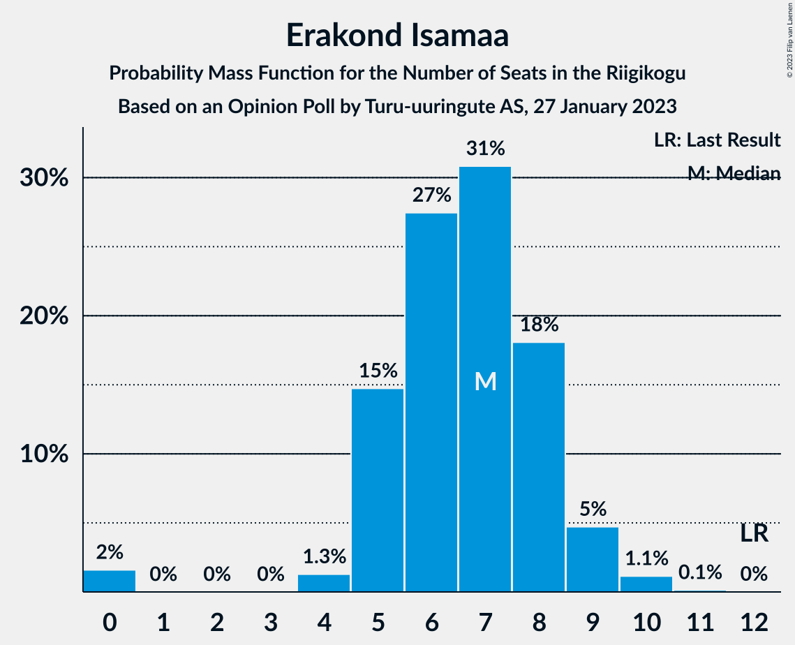

| Number of Seats | Probability | Accumulated | Special Marks |
|:---------------:|:-----------:|:-----------:|:-------------:|
| 0 | 2% | 100% |  |
| 1 | 0% | 98% |  |
| 2 | 0% | 98% |  |
| 3 | 0% | 98% |  |
| 4 | 1.3% | 98% |  |
| 5 | 15% | 97% |  |
| 6 | 27% | 82% |  |
| 7 | 31% | 55% | Median |
| 8 | 18% | 24% |  |
| 9 | 5% | 6% |  |
| 10 | 1.1% | 1.3% |  |
| 11 | 0.1% | 0.2% |  |
| 12 | 0% | 0% | Last Result |

### Erakond Eestimaa Rohelised

*For a full overview of the results for this party, see the [Erakond Eestimaa Rohelised](party-erakondeestimaarohelised.html) page.*

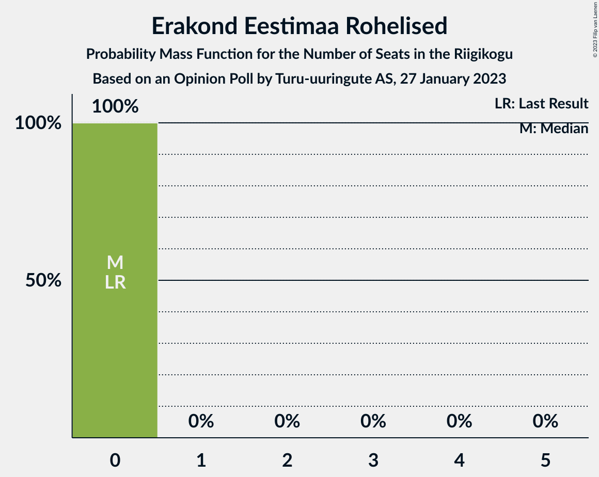

| Number of Seats | Probability | Accumulated | Special Marks |
|:---------------:|:-----------:|:-----------:|:-------------:|
| 0 | 100% | 100% | Last Result, Median |

### Erakond Parempoolsed

*For a full overview of the results for this party, see the [Erakond Parempoolsed](party-erakondparempoolsed.html) page.*

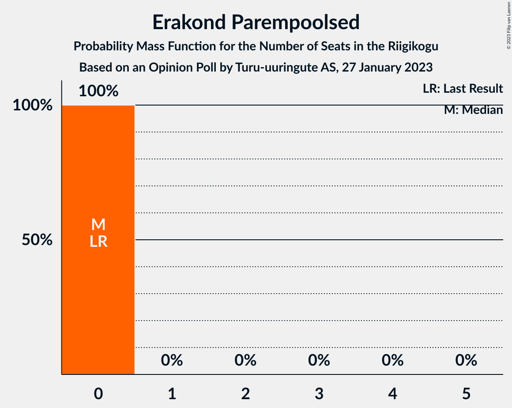

| Number of Seats | Probability | Accumulated | Special Marks |
|:---------------:|:-----------:|:-----------:|:-------------:|
| 0 | 100% | 100% | Last Result, Median |

## Coalitions

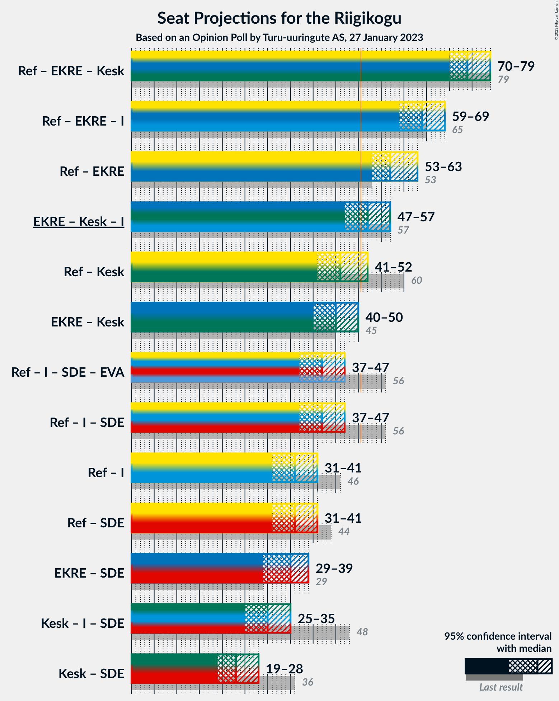

### Confidence Intervals

| Coalition | Last Result | Median | Majority? | 80% Confidence Interval | 90% Confidence Interval | 95% Confidence Interval | 99% Confidence Interval |
|:---------:|:-----------:|:------:|:---------:|:-----------------------:|:-----------------------:|:-----------------------:|:-----------------------:|
| Eesti Reformierakond – Eesti Konservatiivne Rahvaerakond – Eesti Keskerakond | 79 | 74 | 100% | 72–77 | 71–78 | 70–79 | 69–81 |
| Eesti Reformierakond – Eesti Konservatiivne Rahvaerakond – Erakond Isamaa | 65 | 64 | 100% | 61–67 | 60–68 | 59–69 | 57–71 |
| Eesti Reformierakond – Eesti Konservatiivne Rahvaerakond | 53 | 57 | 99.7% | 55–61 | 54–62 | 53–63 | 51–64 |
| Eesti Konservatiivne Rahvaerakond – Eesti Keskerakond – Erakond Isamaa | 57 | 52 | 67% | 48–55 | 47–56 | 47–57 | 45–58 |
| Eesti Reformierakond – Eesti Keskerakond | 60 | 46 | 6% | 43–49 | 42–51 | 41–52 | 40–53 |
| Eesti Konservatiivne Rahvaerakond – Eesti Keskerakond | 45 | 45 | 2% | 42–48 | 41–49 | 40–50 | 39–52 |
| Eesti Reformierakond – Erakond Isamaa – Sotsiaaldemokraatlik Erakond | 56 | 42 | 0% | 39–46 | 38–46 | 37–47 | 36–49 |
| Eesti Reformierakond – Erakond Isamaa | 46 | 36 | 0% | 33–39 | 32–40 | 31–41 | 29–42 |
| Eesti Reformierakond – Sotsiaaldemokraatlik Erakond | 44 | 36 | 0% | 33–39 | 32–40 | 31–41 | 29–42 |
| Eesti Konservatiivne Rahvaerakond – Sotsiaaldemokraatlik Erakond | 29 | 35 | 0% | 32–38 | 31–39 | 29–39 | 28–41 |
| Eesti Keskerakond – Erakond Isamaa – Sotsiaaldemokraatlik Erakond | 48 | 30 | 0% | 27–33 | 26–34 | 25–35 | 23–36 |
| Eesti Keskerakond – Sotsiaaldemokraatlik Erakond | 36 | 23 | 0% | 21–26 | 20–27 | 19–28 | 17–29 |

### Eesti Reformierakond – Eesti Konservatiivne Rahvaerakond – Eesti Keskerakond

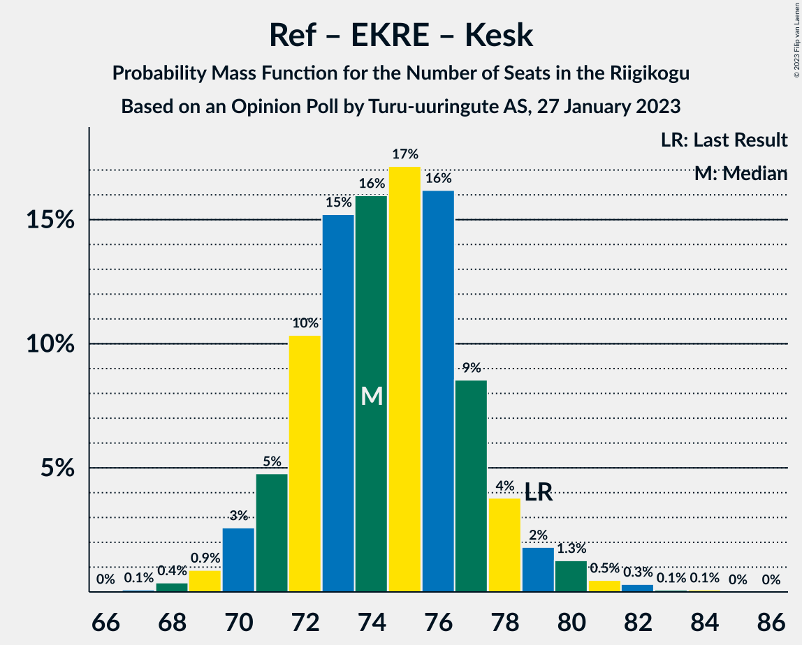

| Number of Seats | Probability | Accumulated | Special Marks |
|:---------------:|:-----------:|:-----------:|:-------------:|
| 67 | 0.1% | 100% |  |
| 68 | 0.4% | 99.9% |  |
| 69 | 0.9% | 99.5% |  |
| 70 | 3% | 98.6% |  |
| 71 | 5% | 96% |  |
| 72 | 10% | 91% |  |
| 73 | 15% | 81% |  |
| 74 | 16% | 66% | Median |
| 75 | 17% | 50% |  |
| 76 | 16% | 33% |  |
| 77 | 9% | 16% |  |
| 78 | 4% | 8% |  |
| 79 | 2% | 4% | Last Result |
| 80 | 1.3% | 2% |  |
| 81 | 0.5% | 1.0% |  |
| 82 | 0.3% | 0.5% |  |
| 83 | 0.1% | 0.2% |  |
| 84 | 0.1% | 0.1% |  |
| 85 | 0% | 0% |  |

### Eesti Reformierakond – Eesti Konservatiivne Rahvaerakond – Erakond Isamaa

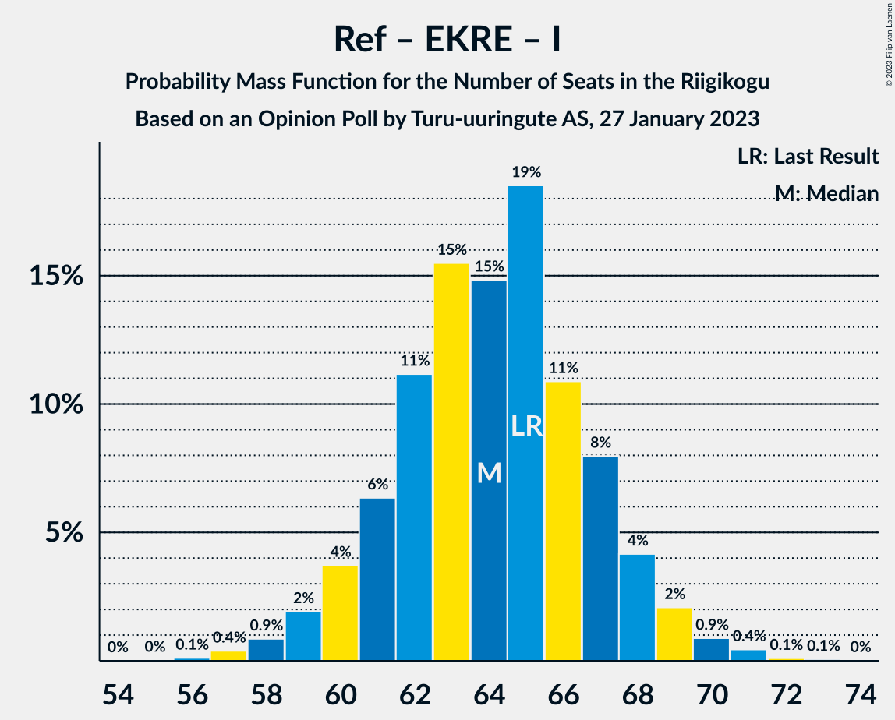

| Number of Seats | Probability | Accumulated | Special Marks |
|:---------------:|:-----------:|:-----------:|:-------------:|
| 56 | 0.1% | 100% |  |
| 57 | 0.4% | 99.8% |  |
| 58 | 0.9% | 99.5% |  |
| 59 | 2% | 98.6% |  |
| 60 | 4% | 97% |  |
| 61 | 6% | 93% |  |
| 62 | 11% | 87% |  |
| 63 | 15% | 75% |  |
| 64 | 15% | 60% | Median |
| 65 | 19% | 45% | Last Result |
| 66 | 11% | 27% |  |
| 67 | 8% | 16% |  |
| 68 | 4% | 8% |  |
| 69 | 2% | 4% |  |
| 70 | 0.9% | 2% |  |
| 71 | 0.4% | 0.6% |  |
| 72 | 0.1% | 0.2% |  |
| 73 | 0.1% | 0.1% |  |
| 74 | 0% | 0% |  |

### Eesti Reformierakond – Eesti Konservatiivne Rahvaerakond

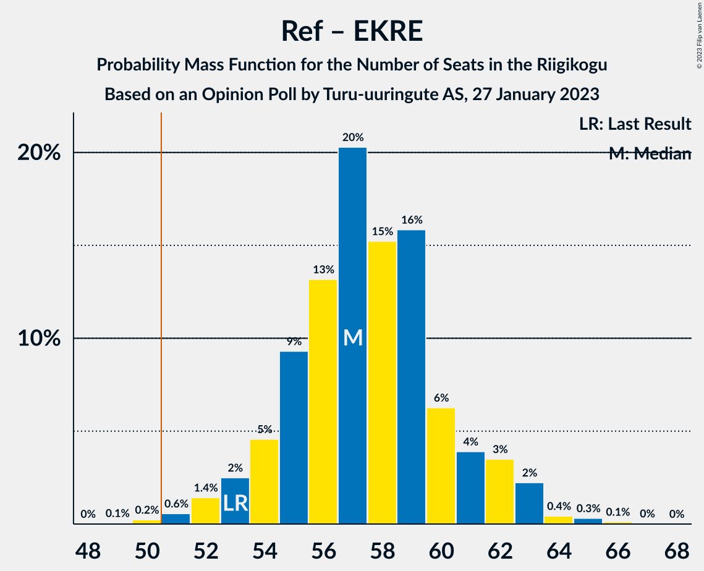

| Number of Seats | Probability | Accumulated | Special Marks |
|:---------------:|:-----------:|:-----------:|:-------------:|
| 49 | 0.1% | 100% |  |
| 50 | 0.2% | 99.9% |  |
| 51 | 0.6% | 99.7% | Majority |
| 52 | 1.4% | 99.1% |  |
| 53 | 2% | 98% | Last Result |
| 54 | 5% | 95% |  |
| 55 | 9% | 91% |  |
| 56 | 13% | 81% |  |
| 57 | 20% | 68% | Median |
| 58 | 15% | 48% |  |
| 59 | 16% | 33% |  |
| 60 | 6% | 17% |  |
| 61 | 4% | 11% |  |
| 62 | 3% | 7% |  |
| 63 | 2% | 3% |  |
| 64 | 0.4% | 0.9% |  |
| 65 | 0.3% | 0.5% |  |
| 66 | 0.1% | 0.2% |  |
| 67 | 0% | 0% |  |

### Eesti Konservatiivne Rahvaerakond – Eesti Keskerakond – Erakond Isamaa

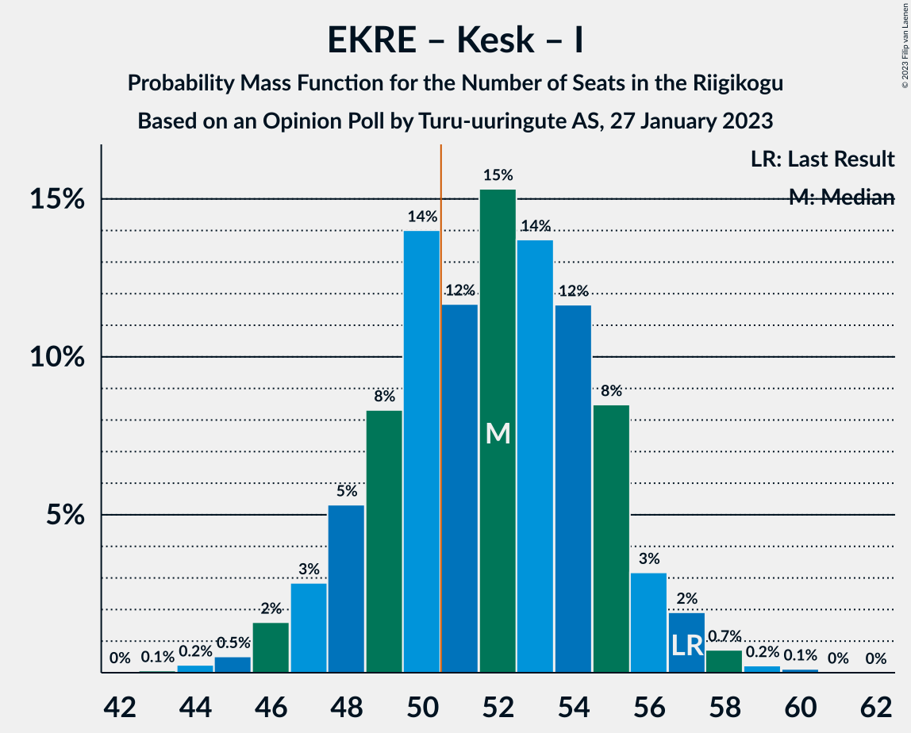

| Number of Seats | Probability | Accumulated | Special Marks |
|:---------------:|:-----------:|:-----------:|:-------------:|
| 43 | 0.1% | 100% |  |
| 44 | 0.2% | 99.9% |  |
| 45 | 0.5% | 99.6% |  |
| 46 | 2% | 99.1% |  |
| 47 | 3% | 98% |  |
| 48 | 5% | 95% |  |
| 49 | 8% | 89% |  |
| 50 | 14% | 81% |  |
| 51 | 12% | 67% | Majority |
| 52 | 15% | 55% | Median |
| 53 | 14% | 40% |  |
| 54 | 12% | 26% |  |
| 55 | 8% | 15% |  |
| 56 | 3% | 6% |  |
| 57 | 2% | 3% | Last Result |
| 58 | 0.7% | 1.1% |  |
| 59 | 0.2% | 0.4% |  |
| 60 | 0.1% | 0.2% |  |
| 61 | 0% | 0% |  |

### Eesti Reformierakond – Eesti Keskerakond

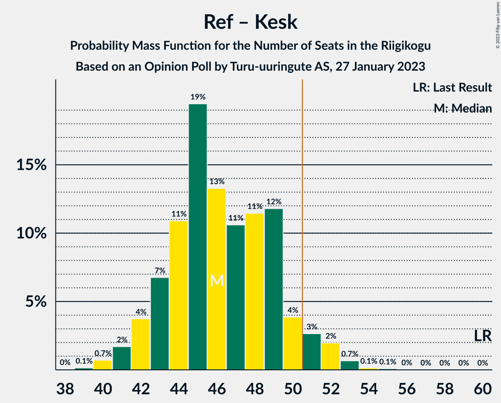

| Number of Seats | Probability | Accumulated | Special Marks |
|:---------------:|:-----------:|:-----------:|:-------------:|
| 38 | 0% | 100% |  |
| 39 | 0.1% | 99.9% |  |
| 40 | 0.7% | 99.8% |  |
| 41 | 2% | 99.1% |  |
| 42 | 4% | 97% |  |
| 43 | 7% | 94% |  |
| 44 | 11% | 87% |  |
| 45 | 19% | 76% |  |
| 46 | 13% | 57% | Median |
| 47 | 11% | 43% |  |
| 48 | 11% | 33% |  |
| 49 | 12% | 21% |  |
| 50 | 4% | 9% |  |
| 51 | 3% | 6% | Majority |
| 52 | 2% | 3% |  |
| 53 | 0.7% | 0.9% |  |
| 54 | 0.1% | 0.3% |  |
| 55 | 0.1% | 0.1% |  |
| 56 | 0% | 0% |  |
| 57 | 0% | 0% |  |
| 58 | 0% | 0% |  |
| 59 | 0% | 0% |  |
| 60 | 0% | 0% | Last Result |

### Eesti Konservatiivne Rahvaerakond – Eesti Keskerakond

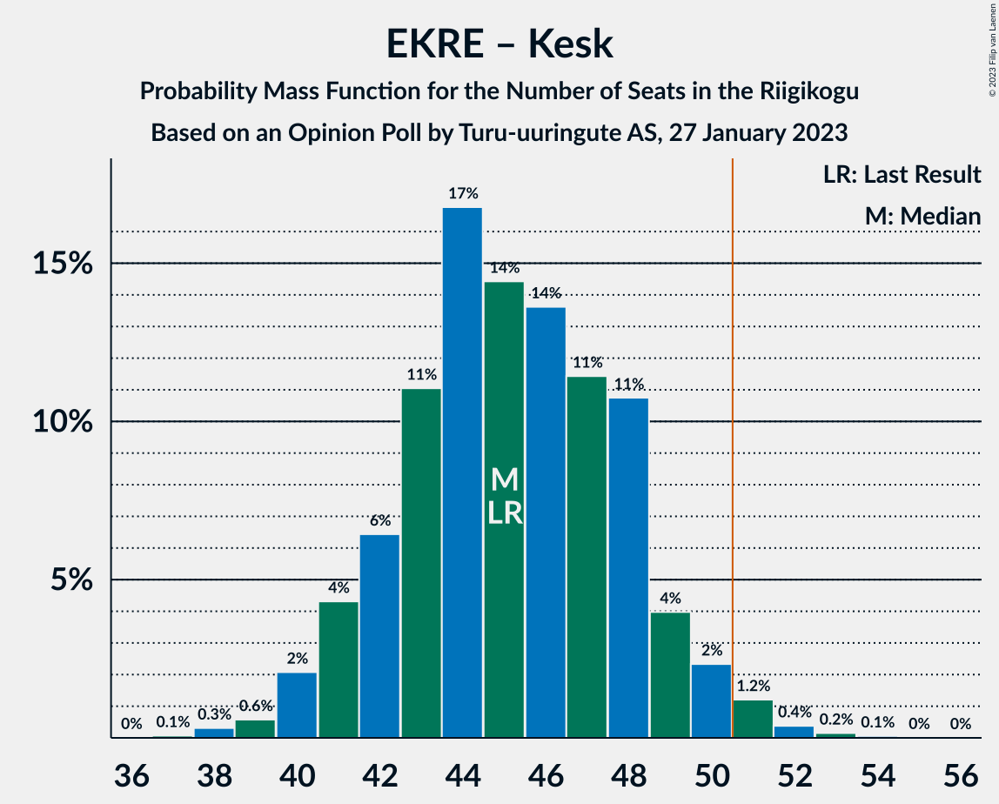

| Number of Seats | Probability | Accumulated | Special Marks |
|:---------------:|:-----------:|:-----------:|:-------------:|
| 37 | 0.1% | 100% |  |
| 38 | 0.3% | 99.9% |  |
| 39 | 0.6% | 99.6% |  |
| 40 | 2% | 99.0% |  |
| 41 | 4% | 97% |  |
| 42 | 6% | 93% |  |
| 43 | 11% | 86% |  |
| 44 | 17% | 75% |  |
| 45 | 14% | 58% | Last Result, Median |
| 46 | 14% | 44% |  |
| 47 | 11% | 30% |  |
| 48 | 11% | 19% |  |
| 49 | 4% | 8% |  |
| 50 | 2% | 4% |  |
| 51 | 1.2% | 2% | Majority |
| 52 | 0.4% | 0.6% |  |
| 53 | 0.2% | 0.2% |  |
| 54 | 0.1% | 0.1% |  |
| 55 | 0% | 0% |  |

### Eesti Reformierakond – Erakond Isamaa – Sotsiaaldemokraatlik Erakond

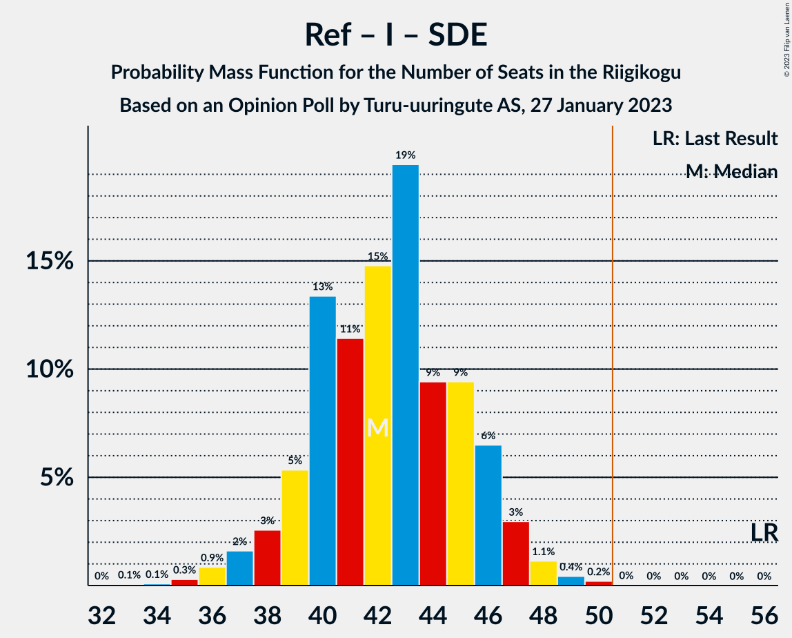

| Number of Seats | Probability | Accumulated | Special Marks |
|:---------------:|:-----------:|:-----------:|:-------------:|
| 33 | 0.1% | 100% |  |
| 34 | 0.1% | 99.9% |  |
| 35 | 0.3% | 99.8% |  |
| 36 | 0.9% | 99.5% |  |
| 37 | 2% | 98.7% |  |
| 38 | 3% | 97% |  |
| 39 | 5% | 95% |  |
| 40 | 13% | 89% |  |
| 41 | 11% | 76% |  |
| 42 | 15% | 64% | Median |
| 43 | 19% | 50% |  |
| 44 | 9% | 30% |  |
| 45 | 9% | 21% |  |
| 46 | 6% | 11% |  |
| 47 | 3% | 5% |  |
| 48 | 1.1% | 2% |  |
| 49 | 0.4% | 0.7% |  |
| 50 | 0.2% | 0.2% |  |
| 51 | 0% | 0% | Majority |
| 52 | 0% | 0% |  |
| 53 | 0% | 0% |  |
| 54 | 0% | 0% |  |
| 55 | 0% | 0% |  |
| 56 | 0% | 0% | Last Result |

### Eesti Reformierakond – Erakond Isamaa

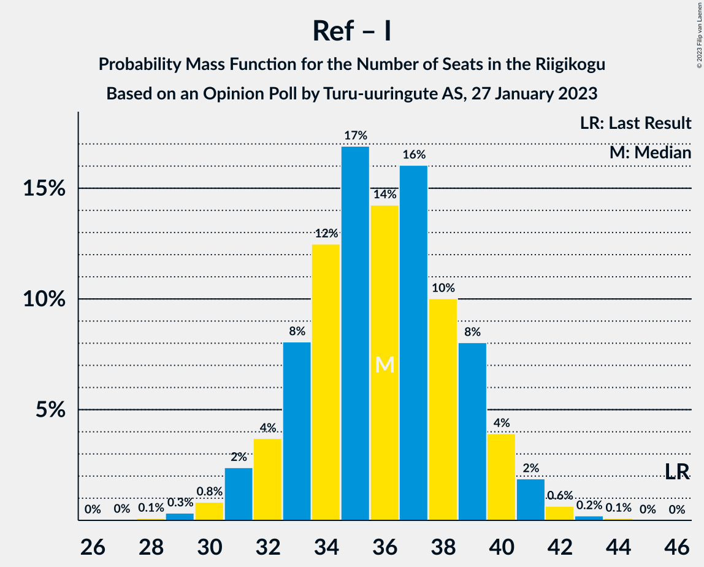

| Number of Seats | Probability | Accumulated | Special Marks |
|:---------------:|:-----------:|:-----------:|:-------------:|
| 27 | 0% | 100% |  |
| 28 | 0.1% | 99.9% |  |
| 29 | 0.3% | 99.8% |  |
| 30 | 0.8% | 99.5% |  |
| 31 | 2% | 98.7% |  |
| 32 | 4% | 96% |  |
| 33 | 8% | 93% |  |
| 34 | 12% | 85% |  |
| 35 | 17% | 72% |  |
| 36 | 14% | 55% | Median |
| 37 | 16% | 41% |  |
| 38 | 10% | 25% |  |
| 39 | 8% | 15% |  |
| 40 | 4% | 7% |  |
| 41 | 2% | 3% |  |
| 42 | 0.6% | 1.0% |  |
| 43 | 0.2% | 0.3% |  |
| 44 | 0.1% | 0.1% |  |
| 45 | 0% | 0% |  |
| 46 | 0% | 0% | Last Result |

### Eesti Reformierakond – Sotsiaaldemokraatlik Erakond

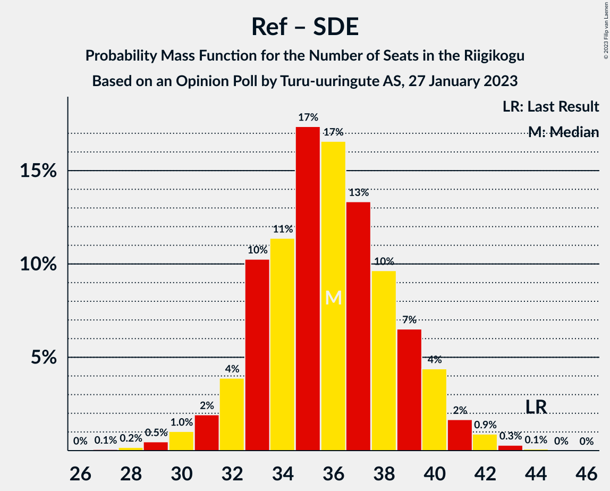

| Number of Seats | Probability | Accumulated | Special Marks |
|:---------------:|:-----------:|:-----------:|:-------------:|
| 27 | 0.1% | 100% |  |
| 28 | 0.2% | 99.9% |  |
| 29 | 0.5% | 99.7% |  |
| 30 | 1.0% | 99.3% |  |
| 31 | 2% | 98% |  |
| 32 | 4% | 96% |  |
| 33 | 10% | 92% |  |
| 34 | 11% | 82% |  |
| 35 | 17% | 71% | Median |
| 36 | 17% | 53% |  |
| 37 | 13% | 37% |  |
| 38 | 10% | 24% |  |
| 39 | 7% | 14% |  |
| 40 | 4% | 7% |  |
| 41 | 2% | 3% |  |
| 42 | 0.9% | 1.3% |  |
| 43 | 0.3% | 0.4% |  |
| 44 | 0.1% | 0.1% | Last Result |
| 45 | 0% | 0% |  |

### Eesti Konservatiivne Rahvaerakond – Sotsiaaldemokraatlik Erakond

| Number of Seats | Probability | Accumulated | Special Marks |
|:---------------:|:-----------:|:-----------:|:-------------:|
| 26 | 0.1% | 100% |  |
| 27 | 0.1% | 99.9% |  |
| 28 | 0.4% | 99.7% |  |
| 29 | 2% | 99.3% | Last Result |
| 30 | 2% | 97% |  |
| 31 | 4% | 96% |  |
| 32 | 9% | 91% |  |
| 33 | 13% | 82% |  |
| 34 | 17% | 70% | Median |
| 35 | 16% | 53% |  |
| 36 | 13% | 36% |  |
| 37 | 10% | 23% |  |
| 38 | 7% | 13% |  |
| 39 | 4% | 6% |  |
| 40 | 1.4% | 2% |  |
| 41 | 0.6% | 0.9% |  |
| 42 | 0.2% | 0.2% |  |
| 43 | 0% | 0.1% |  |
| 44 | 0% | 0% |  |

### Eesti Keskerakond – Erakond Isamaa – Sotsiaaldemokraatlik Erakond

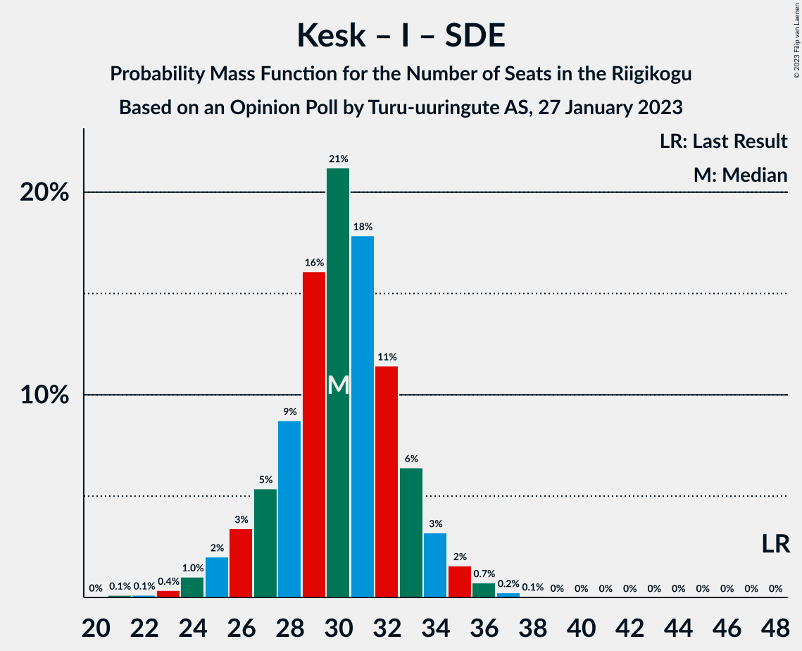

| Number of Seats | Probability | Accumulated | Special Marks |
|:---------------:|:-----------:|:-----------:|:-------------:|
| 21 | 0.1% | 100% |  |
| 22 | 0.1% | 99.8% |  |
| 23 | 0.4% | 99.7% |  |
| 24 | 1.0% | 99.4% |  |
| 25 | 2% | 98% |  |
| 26 | 3% | 96% |  |
| 27 | 5% | 93% |  |
| 28 | 9% | 88% |  |
| 29 | 16% | 79% |  |
| 30 | 21% | 63% | Median |
| 31 | 18% | 42% |  |
| 32 | 11% | 24% |  |
| 33 | 6% | 12% |  |
| 34 | 3% | 6% |  |
| 35 | 2% | 3% |  |
| 36 | 0.7% | 1.1% |  |
| 37 | 0.2% | 0.3% |  |
| 38 | 0.1% | 0.1% |  |
| 39 | 0% | 0% |  |
| 40 | 0% | 0% |  |
| 41 | 0% | 0% |  |
| 42 | 0% | 0% |  |
| 43 | 0% | 0% |  |
| 44 | 0% | 0% |  |
| 45 | 0% | 0% |  |
| 46 | 0% | 0% |  |
| 47 | 0% | 0% |  |
| 48 | 0% | 0% | Last Result |

### Eesti Keskerakond – Sotsiaaldemokraatlik Erakond

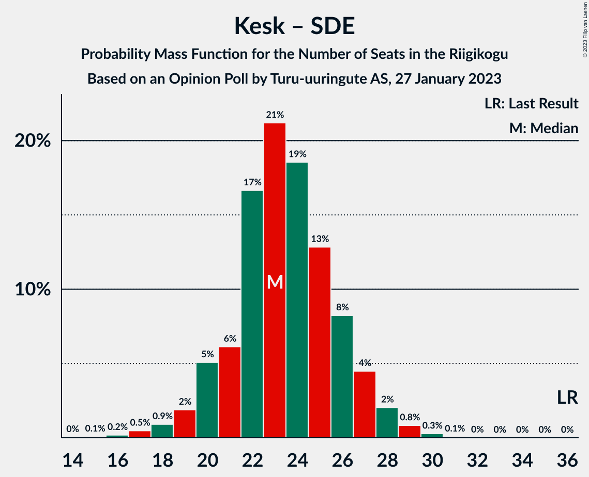

| Number of Seats | Probability | Accumulated | Special Marks |
|:---------------:|:-----------:|:-----------:|:-------------:|
| 14 | 0% | 100% |  |
| 15 | 0.1% | 99.9% |  |
| 16 | 0.2% | 99.9% |  |
| 17 | 0.5% | 99.7% |  |
| 18 | 0.9% | 99.2% |  |
| 19 | 2% | 98% |  |
| 20 | 5% | 96% |  |
| 21 | 6% | 91% |  |
| 22 | 17% | 85% |  |
| 23 | 21% | 69% | Median |
| 24 | 19% | 47% |  |
| 25 | 13% | 29% |  |
| 26 | 8% | 16% |  |
| 27 | 4% | 8% |  |
| 28 | 2% | 3% |  |
| 29 | 0.8% | 1.2% |  |
| 30 | 0.3% | 0.4% |  |
| 31 | 0.1% | 0.1% |  |
| 32 | 0% | 0% |  |
| 33 | 0% | 0% |  |
| 34 | 0% | 0% |  |
| 35 | 0% | 0% |  |
| 36 | 0% | 0% | Last Result |

## Technical Information

### Opinion Poll

+ **Polling firm:** Turu-uuringute AS
+ **Commissioner(s):** —
+ **Fieldwork period:** 27 January 2023

### Calculations

+ **Sample size:** 600
+ **Simulations done:** 1,048,576
+ **Error estimate:** 3.03%

