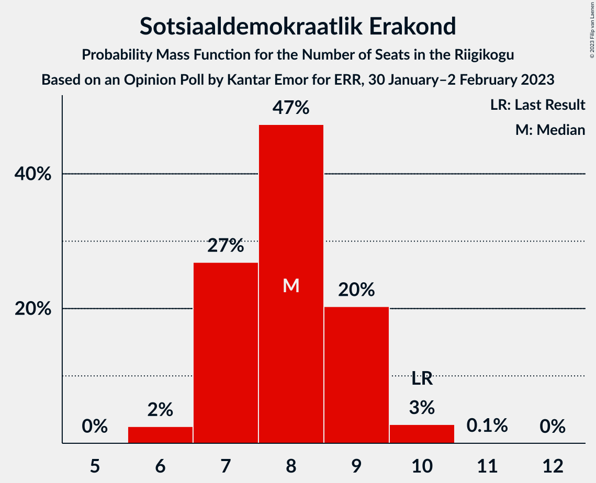
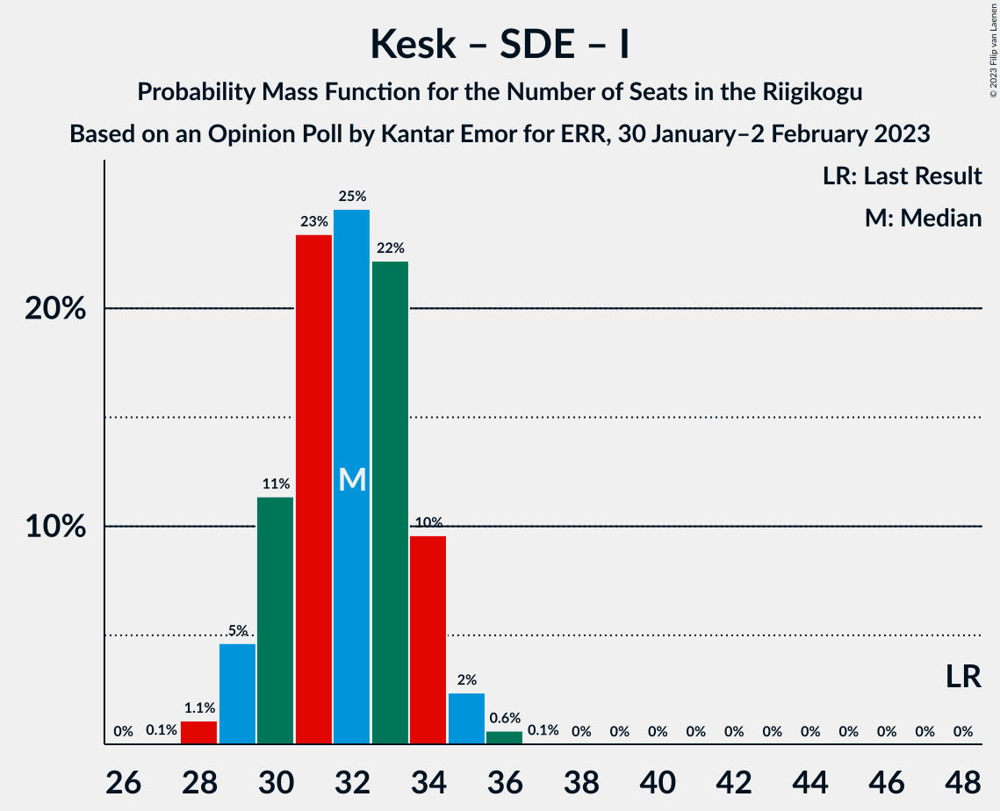

# Opinion Poll by Kantar Emor for ERR, 30 January–2 February 2023

<a href="#voting-intentions">Voting Intentions</a> | <a href="#seats">Seats</a> | <a href="#coalitions">Coalitions</a> | <a href="#technical-information">Technical Information</a>

## Voting Intentions

### Confidence Intervals

| Party | Last Result | Poll Result | 80% Confidence Interval | 90% Confidence Interval | 95% Confidence Interval | 99% Confidence Interval |
|:-----:|:-----------:|:-----------:|:-----------------------:|:-----------------------:|:-----------------------:|:-----------------------:|
| Eesti Reformierakond | 28.9% | 30.2% | 28.8–31.8% |28.4–32.2% |28.0–32.6% |27.3–33.3% |
| Eesti Konservatiivne Rahvaerakond | 17.8% | 19.3% | 18.1–20.6% |17.7–21.0% |17.4–21.4% |16.8–22.0% |
| Eesti Keskerakond | 23.1% | 16.4% | 15.3–17.7% |14.9–18.0% |14.6–18.3% |14.1–19.0% |
| Eesti 200 | 4.4% | 13.1% | 12.0–14.2% |11.7–14.6% |11.5–14.8% |11.0–15.4% |
| Sotsiaaldemokraatlik Erakond | 9.8% | 8.3% | 7.5–9.3% |7.2–9.5% |7.0–9.8% |6.6–10.3% |
| Erakond Isamaa | 11.4% | 7.0% | 6.2–7.9% |6.0–8.2% |5.8–8.4% |5.5–8.9% |
| Erakond Eestimaa Rohelised | 1.8% | 2.4% | 2.0–3.0% |1.8–3.1% |1.7–3.3% |1.5–3.6% |
| Erakond Parempoolsed | 0.0% | 1.6% | 1.3–2.1% |1.2–2.2% |1.1–2.4% |0.9–2.6% |

*Note:* The poll result column reflects the actual value used in the calculations. Published results may vary slightly, and in addition be rounded to fewer digits.

## Seats

### Confidence Intervals

| Party | Last Result | Median | 80% Confidence Interval | 90% Confidence Interval | 95% Confidence Interval | 99% Confidence Interval |
|:-----:|:-----------:|:------:|:-----------------------:|:-----------------------:|:-----------------------:|:-----------------------:|
| <a href="#eesti-reformierakond">Eesti Reformierakond</a> | 34 | 35 | 33–37 |32–37 |32–38 |31–39 |
| <a href="#eesti-konservatiivne-rahvaerakond">Eesti Konservatiivne Rahvaerakond</a> | 19 | 21 | 19–23 |19–23 |19–23 |18–24 |
| <a href="#eesti-keskerakond">Eesti Keskerakond</a> | 26 | 18 | 16–19 |15–19 |15–20 |15–20 |
| <a href="#eesti-200">Eesti 200</a> | 0 | 13 | 12–15 |12–15 |11–15 |11–16 |
| <a href="#sotsiaaldemokraatlik-erakond">Sotsiaaldemokraatlik Erakond</a> | 10 | 8 | 7–9 |7–9 |6–10 |6–10 |
| <a href="#erakond-isamaa">Erakond Isamaa</a> | 12 | 6 | 6–7 |5–8 |5–8 |5–9 |
| <a href="#erakond-eestimaa-rohelised">Erakond Eestimaa Rohelised</a> | 0 | 0 | 0 |0 |0 |0 |
| <a href="#erakond-parempoolsed">Erakond Parempoolsed</a> | 0 | 0 | 0 |0 |0 |0 |

### Eesti Reformierakond

*For a full overview of the results for this party, see the [Eesti Reformierakond](party-eestireformierakond.html) page.*

| Number of Seats | Probability | Accumulated | Special Marks |
|:---------------:|:-----------:|:-----------:|:-------------:|
| 30 | 0.2% | 100% |  |
| 31 | 1.0% | 99.8% |  |
| 32 | 5% | 98.9% |  |
| 33 | 16% | 94% |  |
| 34 | 25% | 78% | Last Result |
| 35 | 19% | 53% | Median |
| 36 | 22% | 34% |  |
| 37 | 9% | 12% |  |
| 38 | 3% | 4% |  |
| 39 | 0.6% | 0.7% |  |
| 40 | 0.1% | 0.1% |  |
| 41 | 0% | 0% |  |

### Eesti Konservatiivne Rahvaerakond

*For a full overview of the results for this party, see the [Eesti Konservatiivne Rahvaerakond](party-eestikonservatiivnerahvaerakond.html) page.*

| Number of Seats | Probability | Accumulated | Special Marks |
|:---------------:|:-----------:|:-----------:|:-------------:|
| 17 | 0.2% | 100% |  |
| 18 | 2% | 99.8% |  |
| 19 | 9% | 98% | Last Result |
| 20 | 19% | 88% |  |
| 21 | 41% | 69% | Median |
| 22 | 18% | 28% |  |
| 23 | 8% | 10% |  |
| 24 | 2% | 2% |  |
| 25 | 0.2% | 0.2% |  |
| 26 | 0% | 0% |  |

### Eesti Keskerakond

*For a full overview of the results for this party, see the [Eesti Keskerakond](party-eestikeskerakond.html) page.*

| Number of Seats | Probability | Accumulated | Special Marks |
|:---------------:|:-----------:|:-----------:|:-------------:|
| 14 | 0.3% | 100% |  |
| 15 | 5% | 99.6% |  |
| 16 | 18% | 94% |  |
| 17 | 26% | 76% |  |
| 18 | 32% | 50% | Median |
| 19 | 14% | 18% |  |
| 20 | 3% | 4% |  |
| 21 | 0.5% | 0.5% |  |
| 22 | 0% | 0% |  |
| 23 | 0% | 0% |  |
| 24 | 0% | 0% |  |
| 25 | 0% | 0% |  |
| 26 | 0% | 0% | Last Result |

### Eesti 200

*For a full overview of the results for this party, see the [Eesti 200](party-eesti200.html) page.*

| Number of Seats | Probability | Accumulated | Special Marks |
|:---------------:|:-----------:|:-----------:|:-------------:|
| 0 | 0% | 100% | Last Result |
| 1 | 0% | 100% |  |
| 2 | 0% | 100% |  |
| 3 | 0% | 100% |  |
| 4 | 0% | 100% |  |
| 5 | 0% | 100% |  |
| 6 | 0% | 100% |  |
| 7 | 0% | 100% |  |
| 8 | 0% | 100% |  |
| 9 | 0% | 100% |  |
| 10 | 0.2% | 100% |  |
| 11 | 3% | 99.8% |  |
| 12 | 15% | 97% |  |
| 13 | 35% | 82% | Median |
| 14 | 31% | 46% |  |
| 15 | 13% | 15% |  |
| 16 | 2% | 2% |  |
| 17 | 0.2% | 0.2% |  |
| 18 | 0% | 0% |  |

### Sotsiaaldemokraatlik Erakond

*For a full overview of the results for this party, see the [Sotsiaaldemokraatlik Erakond](party-sotsiaaldemokraatlikerakond.html) page.*

| Number of Seats | Probability | Accumulated | Special Marks |
|:---------------:|:-----------:|:-----------:|:-------------:|
| 6 | 2% | 100% |  |
| 7 | 27% | 97% |  |
| 8 | 47% | 71% | Median |
| 9 | 20% | 23% |  |
| 10 | 3% | 3% | Last Result |
| 11 | 0.1% | 0.2% |  |
| 12 | 0% | 0% |  |

### Erakond Isamaa

*For a full overview of the results for this party, see the [Erakond Isamaa](party-erakondisamaa.html) page.*

| Number of Seats | Probability | Accumulated | Special Marks |
|:---------------:|:-----------:|:-----------:|:-------------:|
| 4 | 0.1% | 100% |  |
| 5 | 7% | 99.9% |  |
| 6 | 44% | 93% | Median |
| 7 | 40% | 48% |  |
| 8 | 8% | 8% |  |
| 9 | 0.5% | 0.5% |  |
| 10 | 0% | 0% |  |
| 11 | 0% | 0% |  |
| 12 | 0% | 0% | Last Result |

### Erakond Eestimaa Rohelised

*For a full overview of the results for this party, see the [Erakond Eestimaa Rohelised](party-erakondeestimaarohelised.html) page.*

| Number of Seats | Probability | Accumulated | Special Marks |
|:---------------:|:-----------:|:-----------:|:-------------:|
| 0 | 100% | 100% | Last Result, Median |

### Erakond Parempoolsed

*For a full overview of the results for this party, see the [Erakond Parempoolsed](party-erakondparempoolsed.html) page.*

| Number of Seats | Probability | Accumulated | Special Marks |
|:---------------:|:-----------:|:-----------:|:-------------:|
| 0 | 100% | 100% | Last Result, Median |

## Coalitions

### Confidence Intervals

| Coalition | Last Result | Median | Majority? | 80% Confidence Interval | 90% Confidence Interval | 95% Confidence Interval | 99% Confidence Interval |
|:---------:|:-----------:|:------:|:---------:|:-----------------------:|:-----------------------:|:-----------------------:|:-----------------------:|
| Eesti Reformierakond – Eesti Konservatiivne Rahvaerakond – Eesti Keskerakond | 79 | 73 | 100% | 71–75 | 71–75 | 70–76 | 69–77 |
| Eesti Reformierakond – Eesti Konservatiivne Rahvaerakond – Erakond Isamaa | 65 | 62 | 100% | 60–64 | 60–65 | 59–65 | 58–66 |
| Eesti Reformierakond – Eesti Konservatiivne Rahvaerakond | 53 | 56 | 100% | 54–58 | 53–58 | 53–59 | 52–60 |
| Eesti Reformierakond – Eesti Keskerakond | 60 | 52 | 87% | 50–54 | 50–55 | 49–55 | 48–56 |
| Eesti Reformierakond – Sotsiaaldemokraatlik Erakond – Erakond Isamaa | 56 | 49 | 24% | 47–51 | 47–52 | 46–52 | 45–53 |
| Eesti Konservatiivne Rahvaerakond – Eesti Keskerakond – Erakond Isamaa | 57 | 45 | 0% | 43–47 | 42–47 | 42–48 | 41–49 |
| Eesti Reformierakond – Sotsiaaldemokraatlik Erakond | 44 | 43 | 0% | 41–45 | 40–45 | 40–46 | 39–47 |
| Eesti Reformierakond – Erakond Isamaa | 46 | 41 | 0% | 39–43 | 39–44 | 38–44 | 37–45 |
| Eesti Konservatiivne Rahvaerakond – Eesti Keskerakond | 45 | 38 | 0% | 36–40 | 36–41 | 35–41 | 34–42 |
| Eesti Keskerakond – Sotsiaaldemokraatlik Erakond – Erakond Isamaa | 48 | 32 | 0% | 30–34 | 29–34 | 29–35 | 28–36 |
| Eesti Konservatiivne Rahvaerakond – Sotsiaaldemokraatlik Erakond | 29 | 29 | 0% | 27–31 | 27–31 | 26–32 | 25–32 |
| Eesti Keskerakond – Sotsiaaldemokraatlik Erakond | 36 | 25 | 0% | 24–27 | 23–28 | 23–28 | 22–29 |

### Eesti Reformierakond – Eesti Konservatiivne Rahvaerakond – Eesti Keskerakond

| Number of Seats | Probability | Accumulated | Special Marks |
|:---------------:|:-----------:|:-----------:|:-------------:|
| 68 | 0.1% | 100% |  |
| 69 | 0.5% | 99.9% |  |
| 70 | 2% | 99.4% |  |
| 71 | 8% | 97% |  |
| 72 | 20% | 89% |  |
| 73 | 34% | 69% |  |
| 74 | 19% | 36% | Median |
| 75 | 12% | 16% |  |
| 76 | 4% | 4% |  |
| 77 | 0.5% | 0.6% |  |
| 78 | 0.1% | 0.1% |  |
| 79 | 0% | 0% | Last Result |

### Eesti Reformierakond – Eesti Konservatiivne Rahvaerakond – Erakond Isamaa

| Number of Seats | Probability | Accumulated | Special Marks |
|:---------------:|:-----------:|:-----------:|:-------------:|
| 57 | 0.1% | 100% |  |
| 58 | 0.7% | 99.9% |  |
| 59 | 3% | 99.2% |  |
| 60 | 9% | 97% |  |
| 61 | 24% | 87% |  |
| 62 | 19% | 63% | Median |
| 63 | 23% | 45% |  |
| 64 | 15% | 22% |  |
| 65 | 5% | 6% | Last Result |
| 66 | 0.8% | 1.0% |  |
| 67 | 0.1% | 0.2% |  |
| 68 | 0% | 0% |  |

### Eesti Reformierakond – Eesti Konservatiivne Rahvaerakond

| Number of Seats | Probability | Accumulated | Special Marks |
|:---------------:|:-----------:|:-----------:|:-------------:|
| 51 | 0.3% | 100% | Majority |
| 52 | 2% | 99.7% |  |
| 53 | 5% | 98% | Last Result |
| 54 | 14% | 93% |  |
| 55 | 27% | 79% |  |
| 56 | 19% | 52% | Median |
| 57 | 19% | 32% |  |
| 58 | 10% | 13% |  |
| 59 | 3% | 3% |  |
| 60 | 0.5% | 0.6% |  |
| 61 | 0.1% | 0.1% |  |
| 62 | 0% | 0% |  |

### Eesti Reformierakond – Eesti Keskerakond

| Number of Seats | Probability | Accumulated | Special Marks |
|:---------------:|:-----------:|:-----------:|:-------------:|
| 47 | 0.1% | 100% |  |
| 48 | 0.6% | 99.9% |  |
| 49 | 4% | 99.3% |  |
| 50 | 8% | 95% |  |
| 51 | 21% | 87% | Majority |
| 52 | 26% | 67% |  |
| 53 | 22% | 41% | Median |
| 54 | 12% | 19% |  |
| 55 | 6% | 7% |  |
| 56 | 1.1% | 1.4% |  |
| 57 | 0.2% | 0.3% |  |
| 58 | 0% | 0% |  |
| 59 | 0% | 0% |  |
| 60 | 0% | 0% | Last Result |

### Eesti Reformierakond – Sotsiaaldemokraatlik Erakond – Erakond Isamaa

| Number of Seats | Probability | Accumulated | Special Marks |
|:---------------:|:-----------:|:-----------:|:-------------:|
| 44 | 0.1% | 100% |  |
| 45 | 0.6% | 99.9% |  |
| 46 | 4% | 99.3% |  |
| 47 | 9% | 96% |  |
| 48 | 22% | 87% |  |
| 49 | 24% | 65% | Median |
| 50 | 17% | 40% |  |
| 51 | 17% | 24% | Majority |
| 52 | 5% | 7% |  |
| 53 | 1.3% | 1.4% |  |
| 54 | 0.2% | 0.2% |  |
| 55 | 0% | 0% |  |
| 56 | 0% | 0% | Last Result |

### Eesti Konservatiivne Rahvaerakond – Eesti Keskerakond – Erakond Isamaa

| Number of Seats | Probability | Accumulated | Special Marks |
|:---------------:|:-----------:|:-----------:|:-------------:|
| 40 | 0.2% | 100% |  |
| 41 | 2% | 99.8% |  |
| 42 | 4% | 98% |  |
| 43 | 14% | 94% |  |
| 44 | 22% | 81% |  |
| 45 | 23% | 59% | Median |
| 46 | 22% | 36% |  |
| 47 | 11% | 15% |  |
| 48 | 3% | 4% |  |
| 49 | 0.9% | 1.0% |  |
| 50 | 0.1% | 0.1% |  |
| 51 | 0% | 0% | Majority |
| 52 | 0% | 0% |  |
| 53 | 0% | 0% |  |
| 54 | 0% | 0% |  |
| 55 | 0% | 0% |  |
| 56 | 0% | 0% |  |
| 57 | 0% | 0% | Last Result |

### Eesti Reformierakond – Sotsiaaldemokraatlik Erakond

| Number of Seats | Probability | Accumulated | Special Marks |
|:---------------:|:-----------:|:-----------:|:-------------:|
| 38 | 0.3% | 100% |  |
| 39 | 1.2% | 99.7% |  |
| 40 | 7% | 98% |  |
| 41 | 16% | 92% |  |
| 42 | 21% | 76% |  |
| 43 | 21% | 54% | Median |
| 44 | 21% | 33% | Last Result |
| 45 | 9% | 12% |  |
| 46 | 3% | 4% |  |
| 47 | 0.5% | 0.5% |  |
| 48 | 0.1% | 0.1% |  |
| 49 | 0% | 0% |  |

### Eesti Reformierakond – Erakond Isamaa

| Number of Seats | Probability | Accumulated | Special Marks |
|:---------------:|:-----------:|:-----------:|:-------------:|
| 36 | 0.1% | 100% |  |
| 37 | 0.6% | 99.9% |  |
| 38 | 3% | 99.3% |  |
| 39 | 9% | 97% |  |
| 40 | 24% | 88% |  |
| 41 | 21% | 64% | Median |
| 42 | 20% | 43% |  |
| 43 | 14% | 23% |  |
| 44 | 7% | 9% |  |
| 45 | 1.1% | 1.5% |  |
| 46 | 0.3% | 0.4% | Last Result |
| 47 | 0% | 0% |  |

### Eesti Konservatiivne Rahvaerakond – Eesti Keskerakond

| Number of Seats | Probability | Accumulated | Special Marks |
|:---------------:|:-----------:|:-----------:|:-------------:|
| 34 | 0.5% | 100% |  |
| 35 | 3% | 99.5% |  |
| 36 | 7% | 96% |  |
| 37 | 17% | 89% |  |
| 38 | 24% | 72% |  |
| 39 | 24% | 48% | Median |
| 40 | 17% | 24% |  |
| 41 | 5% | 7% |  |
| 42 | 1.4% | 2% |  |
| 43 | 0.3% | 0.3% |  |
| 44 | 0% | 0% |  |
| 45 | 0% | 0% | Last Result |

### Eesti Keskerakond – Sotsiaaldemokraatlik Erakond – Erakond Isamaa

| Number of Seats | Probability | Accumulated | Special Marks |
|:---------------:|:-----------:|:-----------:|:-------------:|
| 27 | 0.1% | 100% |  |
| 28 | 1.1% | 99.9% |  |
| 29 | 5% | 98.8% |  |
| 30 | 11% | 94% |  |
| 31 | 23% | 83% |  |
| 32 | 25% | 59% | Median |
| 33 | 22% | 35% |  |
| 34 | 10% | 13% |  |
| 35 | 2% | 3% |  |
| 36 | 0.6% | 0.7% |  |
| 37 | 0.1% | 0.1% |  |
| 38 | 0% | 0% |  |
| 39 | 0% | 0% |  |
| 40 | 0% | 0% |  |
| 41 | 0% | 0% |  |
| 42 | 0% | 0% |  |
| 43 | 0% | 0% |  |
| 44 | 0% | 0% |  |
| 45 | 0% | 0% |  |
| 46 | 0% | 0% |  |
| 47 | 0% | 0% |  |
| 48 | 0% | 0% | Last Result |

### Eesti Konservatiivne Rahvaerakond – Sotsiaaldemokraatlik Erakond

| Number of Seats | Probability | Accumulated | Special Marks |
|:---------------:|:-----------:|:-----------:|:-------------:|
| 25 | 0.6% | 100% |  |
| 26 | 3% | 99.3% |  |
| 27 | 10% | 96% |  |
| 28 | 25% | 86% |  |
| 29 | 28% | 61% | Last Result, Median |
| 30 | 20% | 33% |  |
| 31 | 9% | 12% |  |
| 32 | 3% | 3% |  |
| 33 | 0.4% | 0.5% |  |
| 34 | 0% | 0.1% |  |
| 35 | 0% | 0% |  |

### Eesti Keskerakond – Sotsiaaldemokraatlik Erakond

| Number of Seats | Probability | Accumulated | Special Marks |
|:---------------:|:-----------:|:-----------:|:-------------:|
| 21 | 0.1% | 100% |  |
| 22 | 1.5% | 99.9% |  |
| 23 | 7% | 98% |  |
| 24 | 18% | 91% |  |
| 25 | 26% | 73% |  |
| 26 | 25% | 47% | Median |
| 27 | 16% | 22% |  |
| 28 | 5% | 6% |  |
| 29 | 1.0% | 1.1% |  |
| 30 | 0.1% | 0.1% |  |
| 31 | 0% | 0% |  |
| 32 | 0% | 0% |  |
| 33 | 0% | 0% |  |
| 34 | 0% | 0% |  |
| 35 | 0% | 0% |  |
| 36 | 0% | 0% | Last Result |

## Technical Information

### Opinion Poll

+ **Polling firm:** Kantar Emor
+ **Commissioner(s):** ERR
+ **Fieldwork period:** 30 January–2 February 2023

### Calculations

+ **Sample size:** 1554
+ **Simulations done:** 1,048,576
+ **Error estimate:** 1.11%

