# Opinion Poll by Kantar Emor for ERR, 6–9 February 2023

<a href="#voting-intentions">Voting Intentions</a> | <a href="#seats">Seats</a> | <a href="#coalitions">Coalitions</a> | <a href="#technical-information">Technical Information</a>

## Voting Intentions

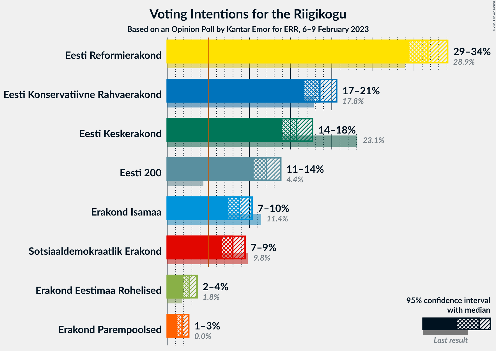

### Confidence Intervals

| Party | Last Result | Poll Result | 80% Confidence Interval | 90% Confidence Interval | 95% Confidence Interval | 99% Confidence Interval |
|:-----:|:-----------:|:-----------:|:-----------------------:|:-----------------------:|:-----------------------:|:-----------------------:|
| Eesti Reformierakond | 28.9% | 31.7% | 30.2–33.3% |29.7–33.7% |29.4–34.1% |28.7–34.9% |
| Eesti Konservatiivne Rahvaerakond | 17.8% | 18.6% | 17.3–19.9% |17.0–20.3% |16.7–20.6% |16.1–21.3% |
| Eesti Keskerakond | 23.1% | 15.7% | 14.6–17.0% |14.3–17.4% |14.0–17.7% |13.4–18.3% |
| Eesti 200 | 4.4% | 12.1% | 11.0–13.2% |10.7–13.5% |10.5–13.8% |10.0–14.4% |
| Erakond Isamaa | 11.4% | 8.8% | 7.9–9.8% |7.7–10.1% |7.4–10.3% |7.0–10.8% |
| Sotsiaaldemokraatlik Erakond | 9.8% | 8.0% | 7.1–8.9% |6.9–9.2% |6.7–9.5% |6.3–10.0% |
| Erakond Eestimaa Rohelised | 1.8% | 2.7% | 2.2–3.3% |2.1–3.5% |2.0–3.6% |1.8–3.9% |
| Erakond Parempoolsed | 0.0% | 1.8% | 1.4–2.3% |1.3–2.5% |1.2–2.6% |1.1–2.9% |

*Note:* The poll result column reflects the actual value used in the calculations. Published results may vary slightly, and in addition be rounded to fewer digits.

## Seats

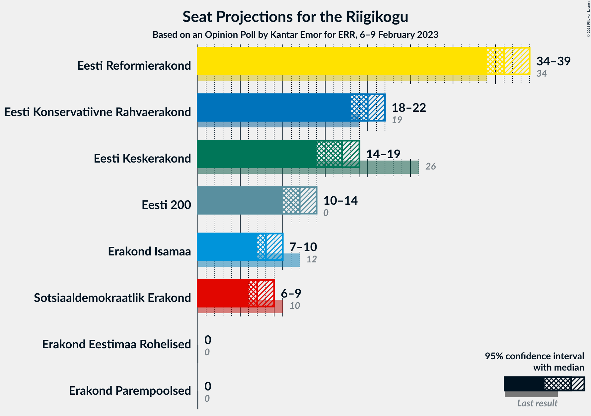

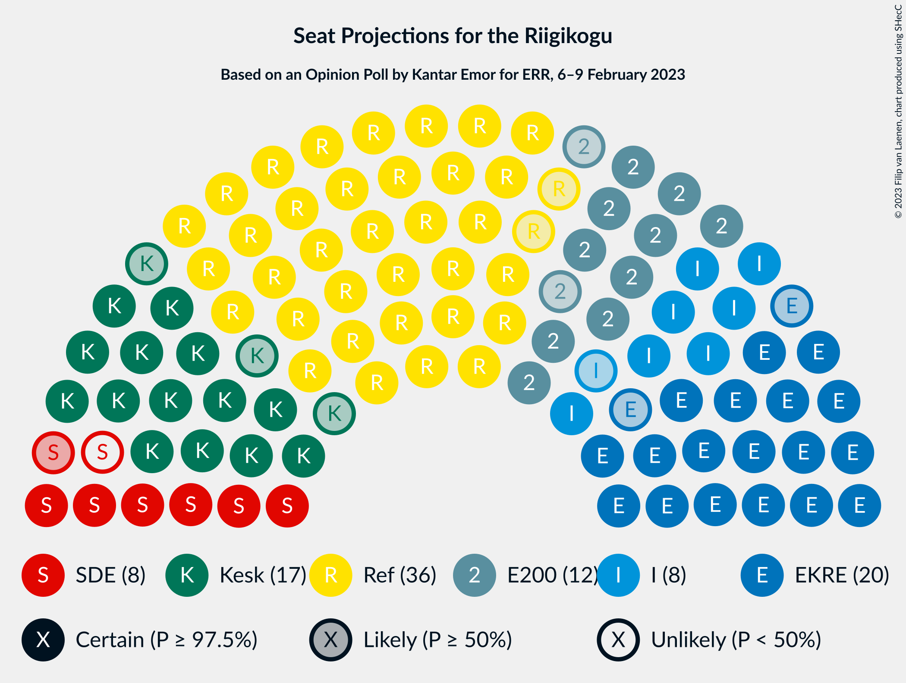

### Confidence Intervals

| Party | Last Result | Median | 80% Confidence Interval | 90% Confidence Interval | 95% Confidence Interval | 99% Confidence Interval |
|:-----:|:-----------:|:------:|:-----------------------:|:-----------------------:|:-----------------------:|:-----------------------:|
| <a href="#eesti-reformierakond">Eesti Reformierakond</a> | 34 | 36 | 34–38 |34–39 |34–39 |33–40 |
| <a href="#eesti-konservatiivne-rahvaerakond">Eesti Konservatiivne Rahvaerakond</a> | 19 | 20 | 19–21 |18–22 |18–22 |17–23 |
| <a href="#eesti-keskerakond">Eesti Keskerakond</a> | 26 | 17 | 15–18 |15–18 |14–19 |14–19 |
| <a href="#eesti-200">Eesti 200</a> | 0 | 12 | 11–13 |11–14 |10–14 |10–15 |
| <a href="#erakond-isamaa">Erakond Isamaa</a> | 12 | 8 | 8–9 |7–10 |7–10 |6–11 |
| <a href="#sotsiaaldemokraatlik-erakond">Sotsiaaldemokraatlik Erakond</a> | 10 | 7 | 7–8 |6–9 |6–9 |6–10 |
| <a href="#erakond-eestimaa-rohelised">Erakond Eestimaa Rohelised</a> | 0 | 0 | 0 |0 |0 |0 |
| <a href="#erakond-parempoolsed">Erakond Parempoolsed</a> | 0 | 0 | 0 |0 |0 |0 |

### Eesti Reformierakond

*For a full overview of the results for this party, see the [Eesti Reformierakond](party-eestireformierakond.html) page.*

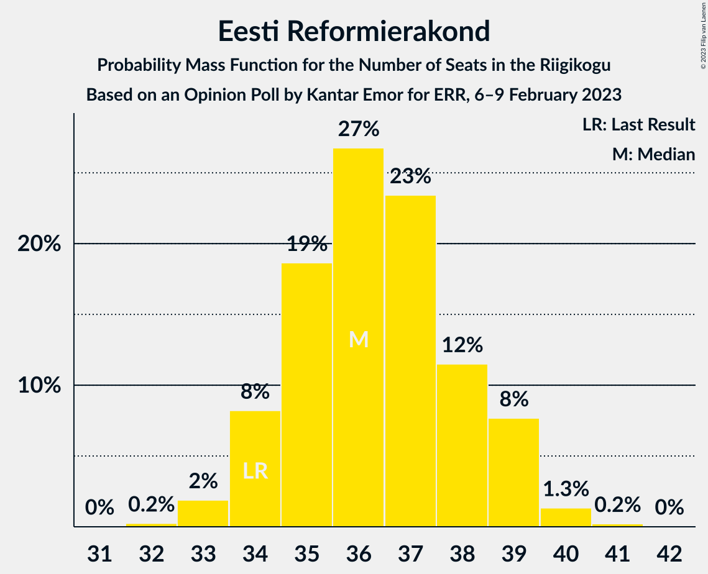

| Number of Seats | Probability | Accumulated | Special Marks |
|:---------------:|:-----------:|:-----------:|:-------------:|
| 32 | 0.2% | 100% |  |
| 33 | 2% | 99.7% |  |
| 34 | 8% | 98% | Last Result |
| 35 | 19% | 90% |  |
| 36 | 27% | 71% | Median |
| 37 | 23% | 44% |  |
| 38 | 12% | 21% |  |
| 39 | 8% | 9% |  |
| 40 | 1.3% | 2% |  |
| 41 | 0.2% | 0.3% |  |
| 42 | 0% | 0% |  |

### Eesti Konservatiivne Rahvaerakond

*For a full overview of the results for this party, see the [Eesti Konservatiivne Rahvaerakond](party-eestikonservatiivnerahvaerakond.html) page.*

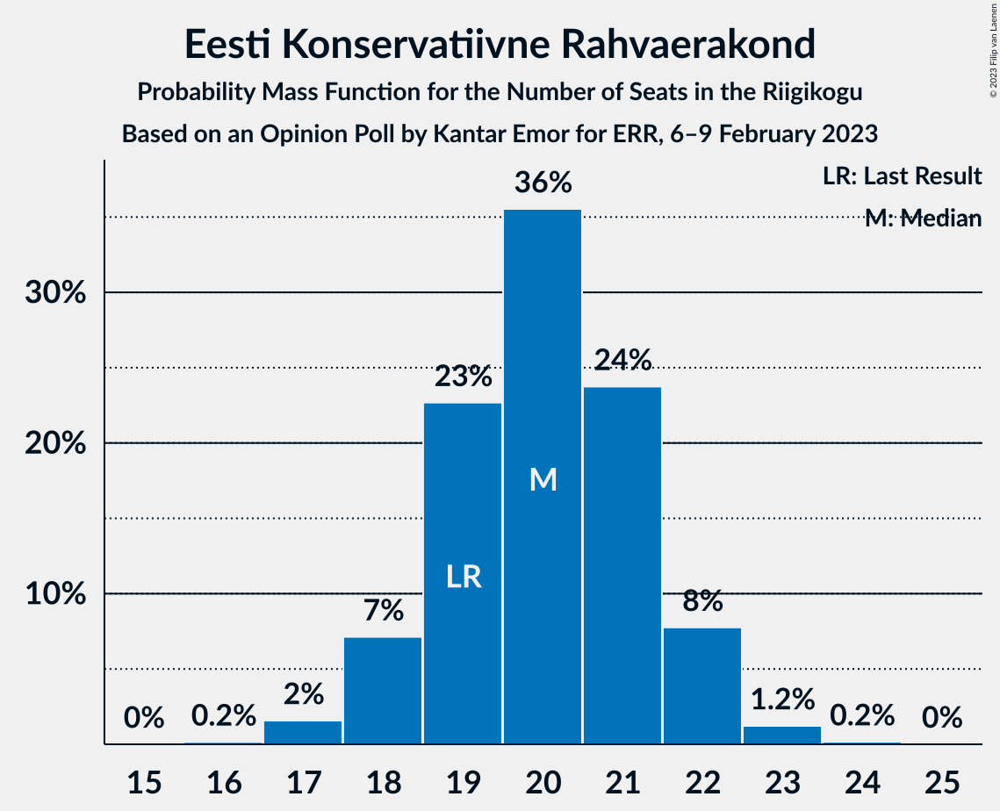

| Number of Seats | Probability | Accumulated | Special Marks |
|:---------------:|:-----------:|:-----------:|:-------------:|
| 16 | 0.2% | 100% |  |
| 17 | 2% | 99.8% |  |
| 18 | 7% | 98% |  |
| 19 | 23% | 91% | Last Result |
| 20 | 36% | 68% | Median |
| 21 | 24% | 33% |  |
| 22 | 8% | 9% |  |
| 23 | 1.2% | 1.4% |  |
| 24 | 0.2% | 0.2% |  |
| 25 | 0% | 0% |  |

### Eesti Keskerakond

*For a full overview of the results for this party, see the [Eesti Keskerakond](party-eestikeskerakond.html) page.*

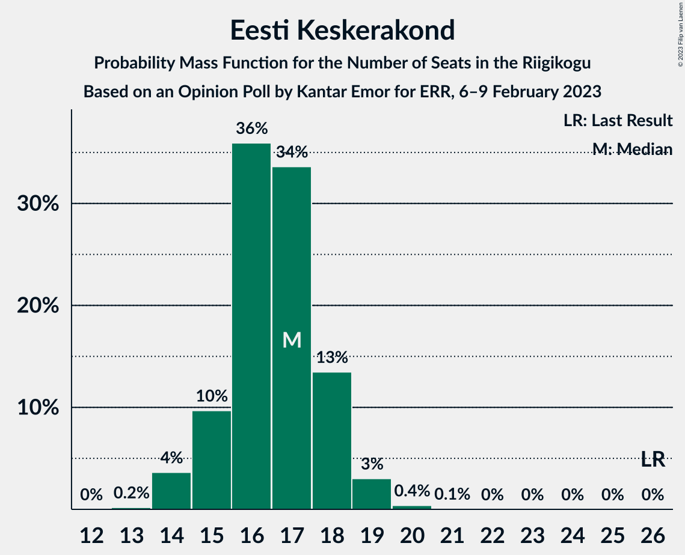

| Number of Seats | Probability | Accumulated | Special Marks |
|:---------------:|:-----------:|:-----------:|:-------------:|
| 13 | 0.2% | 100% |  |
| 14 | 4% | 99.8% |  |
| 15 | 10% | 96% |  |
| 16 | 36% | 86% |  |
| 17 | 34% | 51% | Median |
| 18 | 13% | 17% |  |
| 19 | 3% | 3% |  |
| 20 | 0.4% | 0.5% |  |
| 21 | 0.1% | 0.1% |  |
| 22 | 0% | 0% |  |
| 23 | 0% | 0% |  |
| 24 | 0% | 0% |  |
| 25 | 0% | 0% |  |
| 26 | 0% | 0% | Last Result |

### Eesti 200

*For a full overview of the results for this party, see the [Eesti 200](party-eesti200.html) page.*

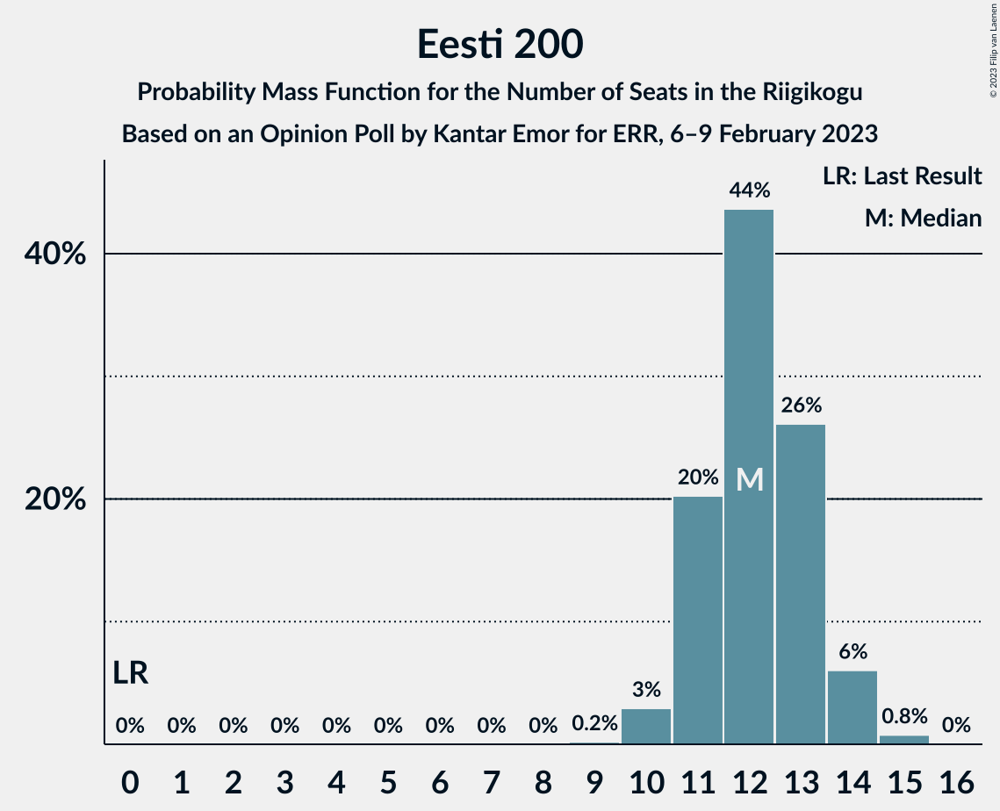

| Number of Seats | Probability | Accumulated | Special Marks |
|:---------------:|:-----------:|:-----------:|:-------------:|
| 0 | 0% | 100% | Last Result |
| 1 | 0% | 100% |  |
| 2 | 0% | 100% |  |
| 3 | 0% | 100% |  |
| 4 | 0% | 100% |  |
| 5 | 0% | 100% |  |
| 6 | 0% | 100% |  |
| 7 | 0% | 100% |  |
| 8 | 0% | 100% |  |
| 9 | 0.2% | 100% |  |
| 10 | 3% | 99.8% |  |
| 11 | 20% | 97% |  |
| 12 | 44% | 77% | Median |
| 13 | 26% | 33% |  |
| 14 | 6% | 7% |  |
| 15 | 0.8% | 0.8% |  |
| 16 | 0% | 0% |  |

### Erakond Isamaa

*For a full overview of the results for this party, see the [Erakond Isamaa](party-erakondisamaa.html) page.*

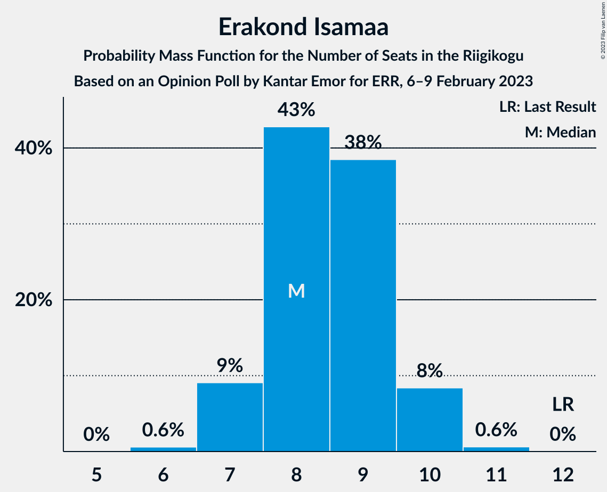

| Number of Seats | Probability | Accumulated | Special Marks |
|:---------------:|:-----------:|:-----------:|:-------------:|
| 6 | 0.6% | 100% |  |
| 7 | 9% | 99.4% |  |
| 8 | 43% | 90% | Median |
| 9 | 38% | 48% |  |
| 10 | 8% | 9% |  |
| 11 | 0.6% | 0.6% |  |
| 12 | 0% | 0% | Last Result |

### Sotsiaaldemokraatlik Erakond

*For a full overview of the results for this party, see the [Sotsiaaldemokraatlik Erakond](party-sotsiaaldemokraatlikerakond.html) page.*

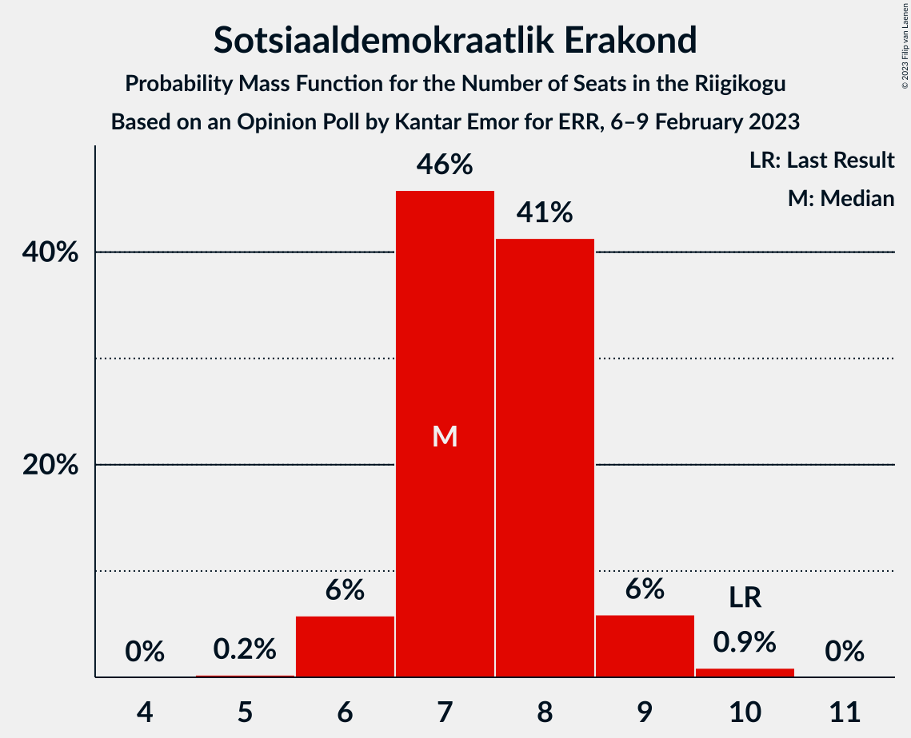

| Number of Seats | Probability | Accumulated | Special Marks |
|:---------------:|:-----------:|:-----------:|:-------------:|
| 5 | 0.2% | 100% |  |
| 6 | 6% | 99.8% |  |
| 7 | 46% | 94% | Median |
| 8 | 41% | 48% |  |
| 9 | 6% | 7% |  |
| 10 | 0.9% | 0.9% | Last Result |
| 11 | 0% | 0% |  |

### Erakond Eestimaa Rohelised

*For a full overview of the results for this party, see the [Erakond Eestimaa Rohelised](party-erakondeestimaarohelised.html) page.*

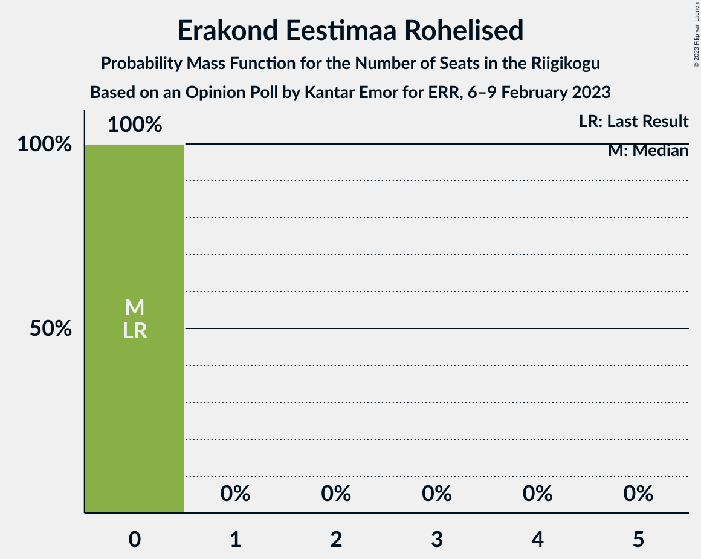

| Number of Seats | Probability | Accumulated | Special Marks |
|:---------------:|:-----------:|:-----------:|:-------------:|
| 0 | 100% | 100% | Last Result, Median |

### Erakond Parempoolsed

*For a full overview of the results for this party, see the [Erakond Parempoolsed](party-erakondparempoolsed.html) page.*

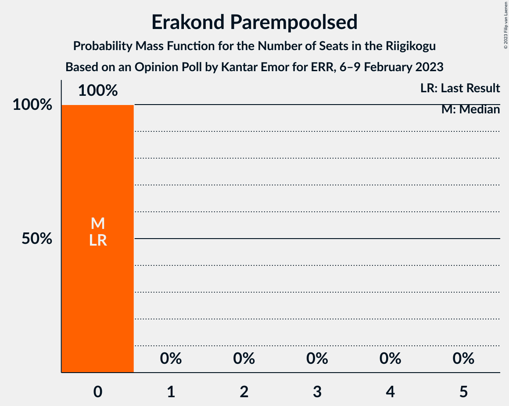

| Number of Seats | Probability | Accumulated | Special Marks |
|:---------------:|:-----------:|:-----------:|:-------------:|
| 0 | 100% | 100% | Last Result, Median |

## Coalitions

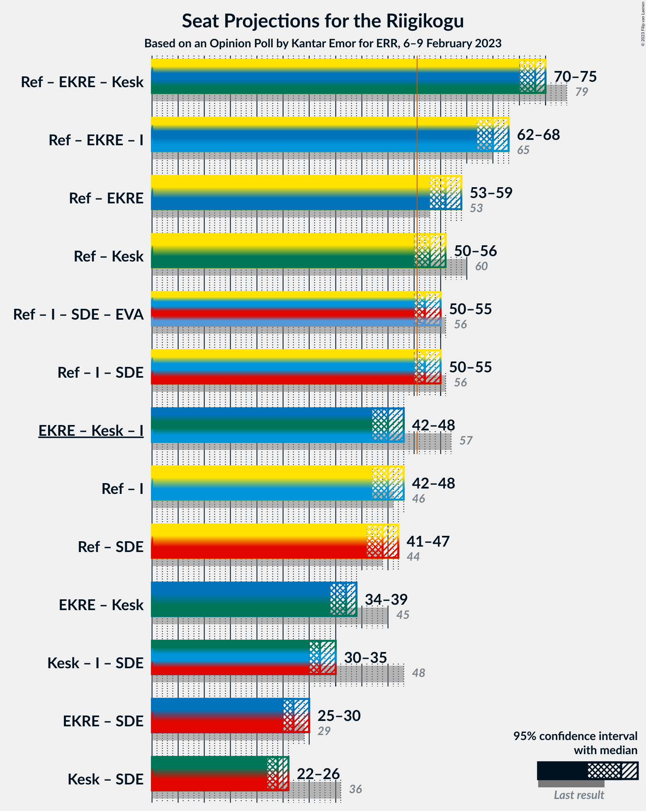

### Confidence Intervals

| Coalition | Last Result | Median | Majority? | 80% Confidence Interval | 90% Confidence Interval | 95% Confidence Interval | 99% Confidence Interval |
|:---------:|:-----------:|:------:|:---------:|:-----------------------:|:-----------------------:|:-----------------------:|:-----------------------:|
| Eesti Reformierakond – Eesti Konservatiivne Rahvaerakond – Eesti Keskerakond | 79 | 73 | 100% | 71–75 | 71–75 | 70–75 | 69–76 |
| Eesti Reformierakond – Eesti Konservatiivne Rahvaerakond – Erakond Isamaa | 65 | 65 | 100% | 63–67 | 62–67 | 62–68 | 61–69 |
| Eesti Reformierakond – Eesti Konservatiivne Rahvaerakond | 53 | 56 | 100% | 54–58 | 54–59 | 53–59 | 52–60 |
| Eesti Reformierakond – Eesti Keskerakond | 60 | 53 | 95% | 51–55 | 51–55 | 50–56 | 49–57 |
| Eesti Reformierakond – Erakond Isamaa – Sotsiaaldemokraatlik Erakond | 56 | 52 | 88% | 50–54 | 50–55 | 50–55 | 49–56 |
| Eesti Konservatiivne Rahvaerakond – Eesti Keskerakond – Erakond Isamaa | 57 | 45 | 0% | 43–47 | 43–47 | 42–48 | 41–49 |
| Eesti Reformierakond – Erakond Isamaa | 46 | 45 | 0% | 43–47 | 42–47 | 42–48 | 41–49 |
| Eesti Reformierakond – Sotsiaaldemokraatlik Erakond | 44 | 44 | 0% | 42–46 | 42–46 | 41–47 | 40–48 |
| Eesti Konservatiivne Rahvaerakond – Eesti Keskerakond | 45 | 37 | 0% | 35–38 | 34–39 | 34–39 | 33–40 |
| Eesti Keskerakond – Erakond Isamaa – Sotsiaaldemokraatlik Erakond | 48 | 32 | 0% | 31–34 | 30–35 | 30–35 | 29–36 |
| Eesti Konservatiivne Rahvaerakond – Sotsiaaldemokraatlik Erakond | 29 | 27 | 0% | 26–29 | 25–30 | 25–30 | 24–31 |
| Eesti Keskerakond – Sotsiaaldemokraatlik Erakond | 36 | 24 | 0% | 22–26 | 22–26 | 22–26 | 21–27 |

### Eesti Reformierakond – Eesti Konservatiivne Rahvaerakond – Eesti Keskerakond

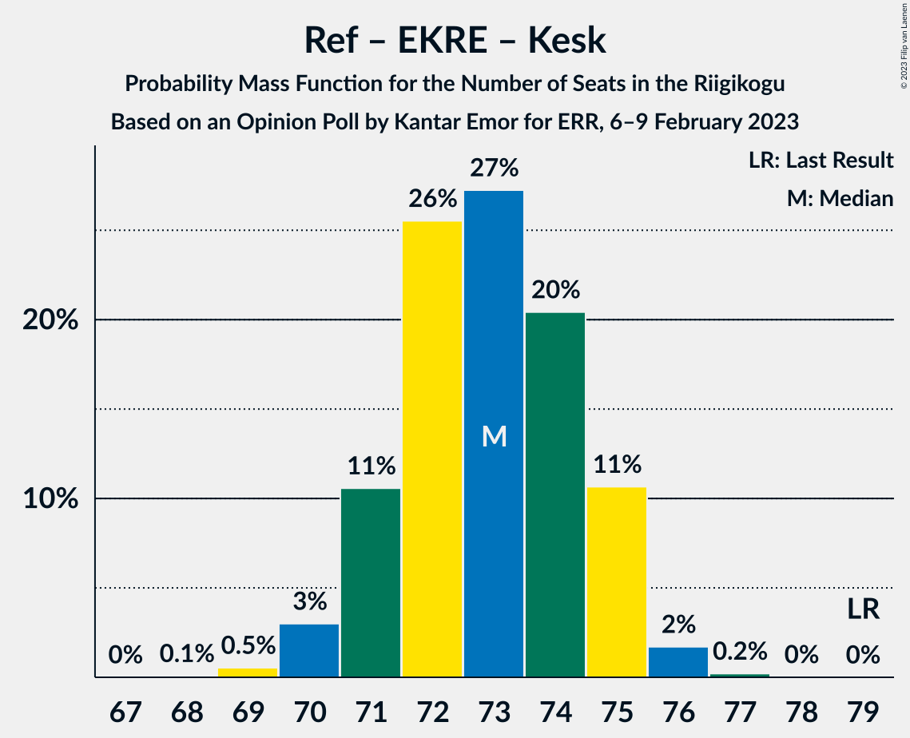

| Number of Seats | Probability | Accumulated | Special Marks |
|:---------------:|:-----------:|:-----------:|:-------------:|
| 68 | 0.1% | 100% |  |
| 69 | 0.5% | 99.9% |  |
| 70 | 3% | 99.4% |  |
| 71 | 11% | 96% |  |
| 72 | 26% | 86% |  |
| 73 | 27% | 60% | Median |
| 74 | 20% | 33% |  |
| 75 | 11% | 13% |  |
| 76 | 2% | 2% |  |
| 77 | 0.2% | 0.2% |  |
| 78 | 0% | 0% |  |
| 79 | 0% | 0% | Last Result |

### Eesti Reformierakond – Eesti Konservatiivne Rahvaerakond – Erakond Isamaa

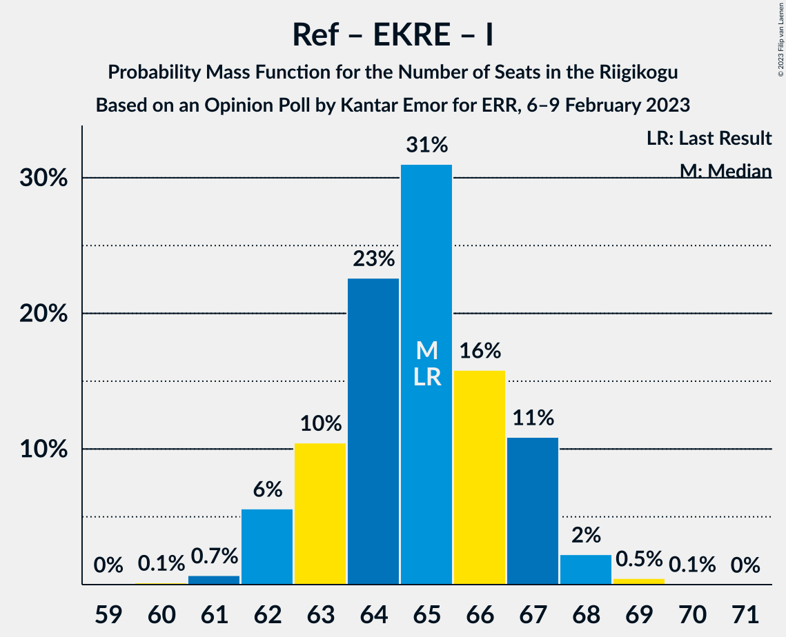

| Number of Seats | Probability | Accumulated | Special Marks |
|:---------------:|:-----------:|:-----------:|:-------------:|
| 60 | 0.1% | 100% |  |
| 61 | 0.7% | 99.8% |  |
| 62 | 6% | 99.2% |  |
| 63 | 10% | 94% |  |
| 64 | 23% | 83% | Median |
| 65 | 31% | 60% | Last Result |
| 66 | 16% | 29% |  |
| 67 | 11% | 14% |  |
| 68 | 2% | 3% |  |
| 69 | 0.5% | 0.5% |  |
| 70 | 0.1% | 0.1% |  |
| 71 | 0% | 0% |  |

### Eesti Reformierakond – Eesti Konservatiivne Rahvaerakond

| Number of Seats | Probability | Accumulated | Special Marks |
|:---------------:|:-----------:|:-----------:|:-------------:|
| 51 | 0.1% | 100% | Majority |
| 52 | 0.5% | 99.9% |  |
| 53 | 2% | 99.4% | Last Result |
| 54 | 10% | 97% |  |
| 55 | 14% | 87% |  |
| 56 | 27% | 74% | Median |
| 57 | 26% | 46% |  |
| 58 | 11% | 20% |  |
| 59 | 7% | 10% |  |
| 60 | 2% | 2% |  |
| 61 | 0.2% | 0.3% |  |
| 62 | 0% | 0% |  |

### Eesti Reformierakond – Eesti Keskerakond

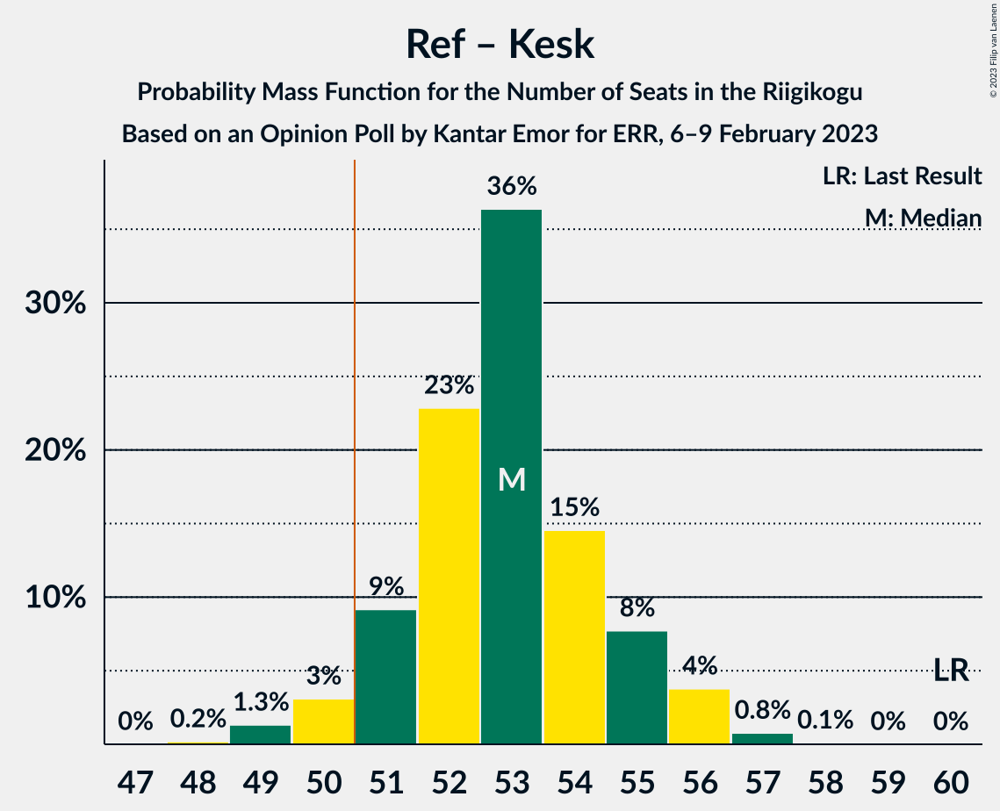

| Number of Seats | Probability | Accumulated | Special Marks |
|:---------------:|:-----------:|:-----------:|:-------------:|
| 48 | 0.2% | 100% |  |
| 49 | 1.3% | 99.8% |  |
| 50 | 3% | 98% |  |
| 51 | 9% | 95% | Majority |
| 52 | 23% | 86% |  |
| 53 | 36% | 63% | Median |
| 54 | 15% | 27% |  |
| 55 | 8% | 12% |  |
| 56 | 4% | 5% |  |
| 57 | 0.8% | 0.9% |  |
| 58 | 0.1% | 0.1% |  |
| 59 | 0% | 0% |  |
| 60 | 0% | 0% | Last Result |

### Eesti Reformierakond – Erakond Isamaa – Sotsiaaldemokraatlik Erakond

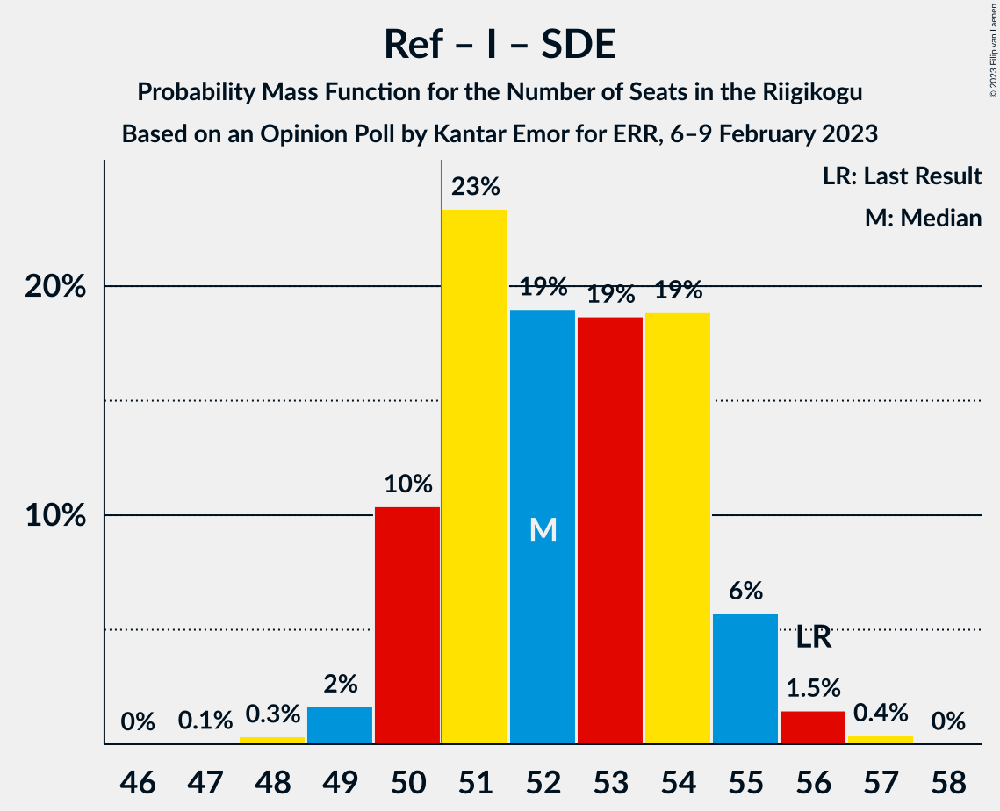

| Number of Seats | Probability | Accumulated | Special Marks |
|:---------------:|:-----------:|:-----------:|:-------------:|
| 47 | 0.1% | 100% |  |
| 48 | 0.3% | 99.9% |  |
| 49 | 2% | 99.6% |  |
| 50 | 10% | 98% |  |
| 51 | 23% | 88% | Median, Majority |
| 52 | 19% | 64% |  |
| 53 | 19% | 45% |  |
| 54 | 19% | 26% |  |
| 55 | 6% | 8% |  |
| 56 | 1.5% | 2% | Last Result |
| 57 | 0.4% | 0.4% |  |
| 58 | 0% | 0% |  |

### Eesti Konservatiivne Rahvaerakond – Eesti Keskerakond – Erakond Isamaa

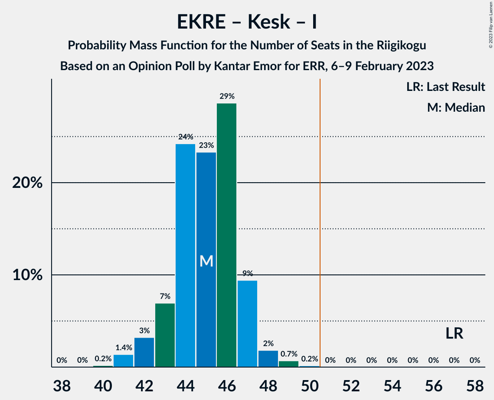

| Number of Seats | Probability | Accumulated | Special Marks |
|:---------------:|:-----------:|:-----------:|:-------------:|
| 40 | 0.2% | 100% |  |
| 41 | 1.4% | 99.8% |  |
| 42 | 3% | 98% |  |
| 43 | 7% | 95% |  |
| 44 | 24% | 88% |  |
| 45 | 23% | 64% | Median |
| 46 | 29% | 41% |  |
| 47 | 9% | 12% |  |
| 48 | 2% | 3% |  |
| 49 | 0.7% | 0.9% |  |
| 50 | 0.2% | 0.2% |  |
| 51 | 0% | 0% | Majority |
| 52 | 0% | 0% |  |
| 53 | 0% | 0% |  |
| 54 | 0% | 0% |  |
| 55 | 0% | 0% |  |
| 56 | 0% | 0% |  |
| 57 | 0% | 0% | Last Result |

### Eesti Reformierakond – Erakond Isamaa

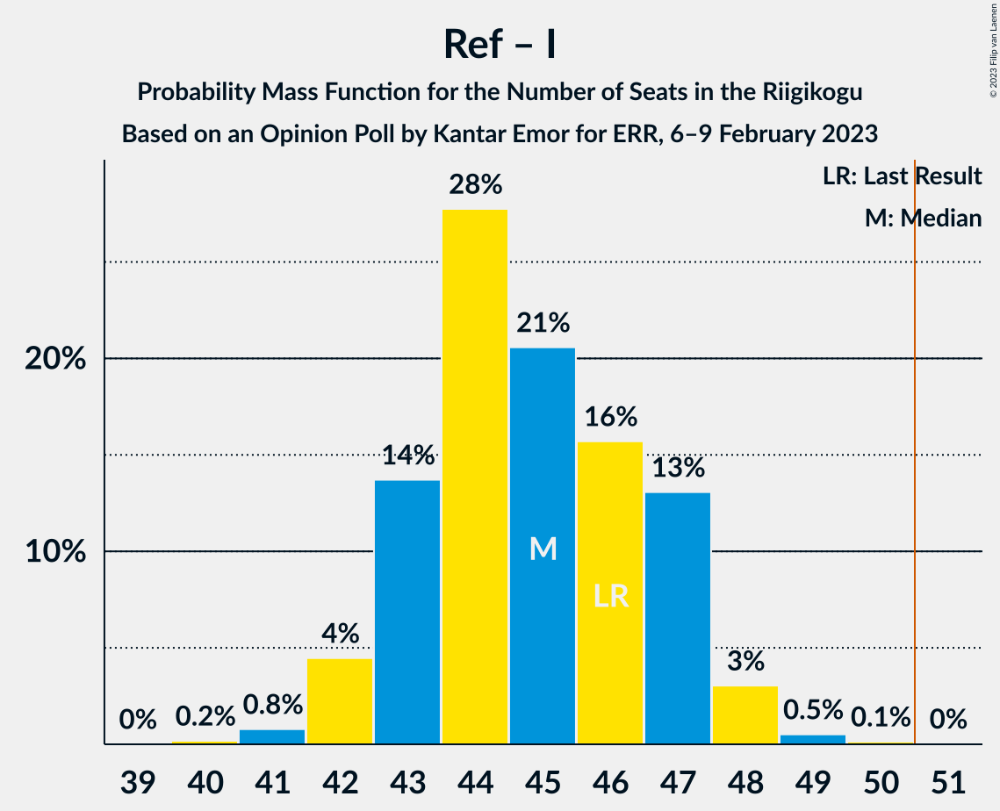

| Number of Seats | Probability | Accumulated | Special Marks |
|:---------------:|:-----------:|:-----------:|:-------------:|
| 40 | 0.2% | 100% |  |
| 41 | 0.8% | 99.8% |  |
| 42 | 4% | 99.0% |  |
| 43 | 14% | 95% |  |
| 44 | 28% | 81% | Median |
| 45 | 21% | 53% |  |
| 46 | 16% | 33% | Last Result |
| 47 | 13% | 17% |  |
| 48 | 3% | 4% |  |
| 49 | 0.5% | 0.7% |  |
| 50 | 0.1% | 0.2% |  |
| 51 | 0% | 0% | Majority |

### Eesti Reformierakond – Sotsiaaldemokraatlik Erakond

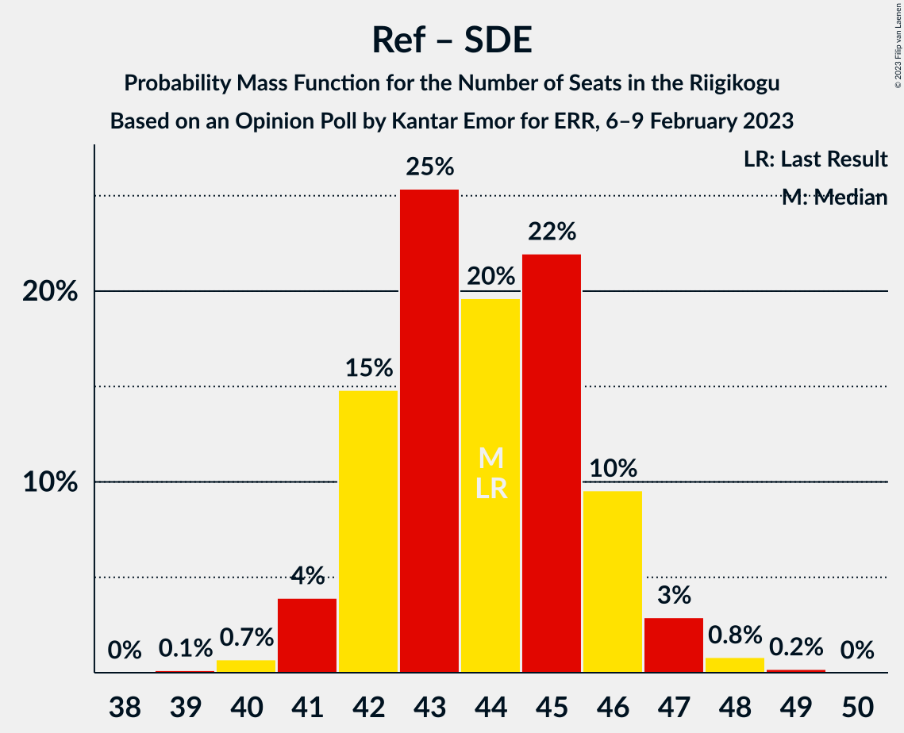

| Number of Seats | Probability | Accumulated | Special Marks |
|:---------------:|:-----------:|:-----------:|:-------------:|
| 39 | 0.1% | 100% |  |
| 40 | 0.7% | 99.9% |  |
| 41 | 4% | 99.2% |  |
| 42 | 15% | 95% |  |
| 43 | 25% | 80% | Median |
| 44 | 20% | 55% | Last Result |
| 45 | 22% | 35% |  |
| 46 | 10% | 13% |  |
| 47 | 3% | 4% |  |
| 48 | 0.8% | 1.0% |  |
| 49 | 0.2% | 0.2% |  |
| 50 | 0% | 0% |  |

### Eesti Konservatiivne Rahvaerakond – Eesti Keskerakond

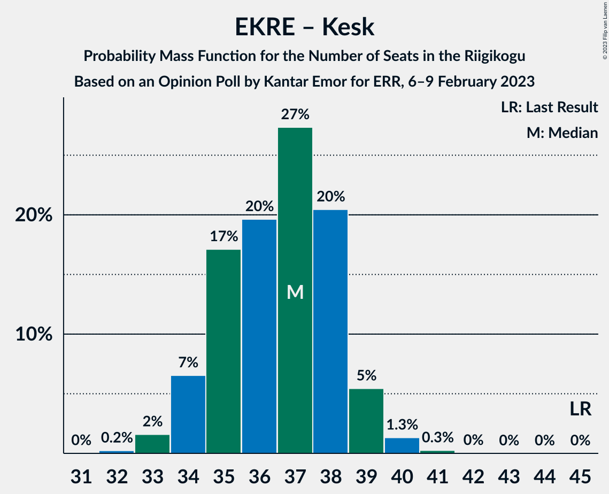

| Number of Seats | Probability | Accumulated | Special Marks |
|:---------------:|:-----------:|:-----------:|:-------------:|
| 32 | 0.2% | 100% |  |
| 33 | 2% | 99.7% |  |
| 34 | 7% | 98% |  |
| 35 | 17% | 92% |  |
| 36 | 20% | 74% |  |
| 37 | 27% | 55% | Median |
| 38 | 20% | 28% |  |
| 39 | 5% | 7% |  |
| 40 | 1.3% | 2% |  |
| 41 | 0.3% | 0.3% |  |
| 42 | 0% | 0% |  |
| 43 | 0% | 0% |  |
| 44 | 0% | 0% |  |
| 45 | 0% | 0% | Last Result |

### Eesti Keskerakond – Erakond Isamaa – Sotsiaaldemokraatlik Erakond

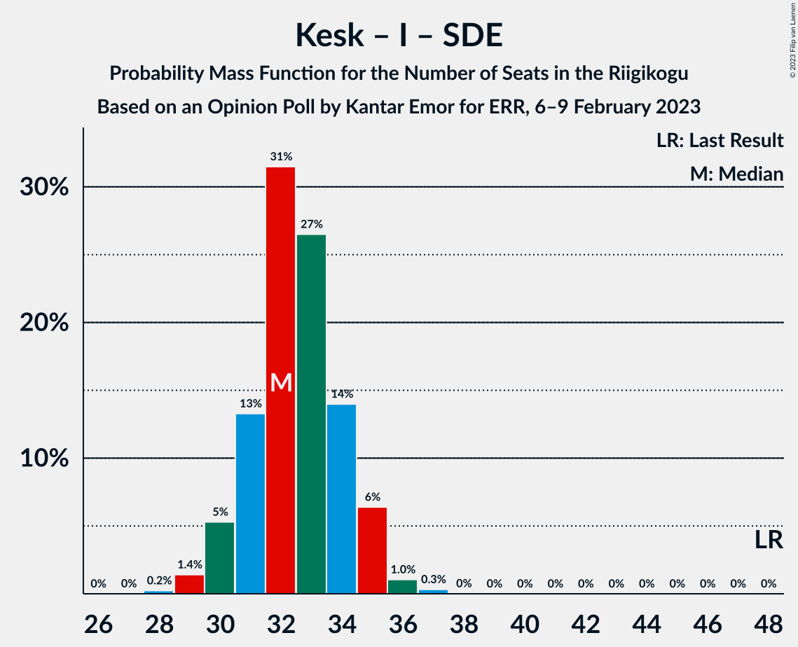

| Number of Seats | Probability | Accumulated | Special Marks |
|:---------------:|:-----------:|:-----------:|:-------------:|
| 28 | 0.2% | 100% |  |
| 29 | 1.4% | 99.8% |  |
| 30 | 5% | 98% |  |
| 31 | 13% | 93% |  |
| 32 | 31% | 80% | Median |
| 33 | 27% | 48% |  |
| 34 | 14% | 22% |  |
| 35 | 6% | 8% |  |
| 36 | 1.0% | 1.4% |  |
| 37 | 0.3% | 0.3% |  |
| 38 | 0% | 0% |  |
| 39 | 0% | 0% |  |
| 40 | 0% | 0% |  |
| 41 | 0% | 0% |  |
| 42 | 0% | 0% |  |
| 43 | 0% | 0% |  |
| 44 | 0% | 0% |  |
| 45 | 0% | 0% |  |
| 46 | 0% | 0% |  |
| 47 | 0% | 0% |  |
| 48 | 0% | 0% | Last Result |

### Eesti Konservatiivne Rahvaerakond – Sotsiaaldemokraatlik Erakond

| Number of Seats | Probability | Accumulated | Special Marks |
|:---------------:|:-----------:|:-----------:|:-------------:|
| 23 | 0.2% | 100% |  |
| 24 | 0.9% | 99.8% |  |
| 25 | 4% | 98.9% |  |
| 26 | 14% | 94% |  |
| 27 | 31% | 81% | Median |
| 28 | 28% | 49% |  |
| 29 | 16% | 21% | Last Result |
| 30 | 4% | 5% |  |
| 31 | 1.0% | 1.2% |  |
| 32 | 0.1% | 0.2% |  |
| 33 | 0% | 0% |  |

### Eesti Keskerakond – Sotsiaaldemokraatlik Erakond

| Number of Seats | Probability | Accumulated | Special Marks |
|:---------------:|:-----------:|:-----------:|:-------------:|
| 20 | 0.2% | 100% |  |
| 21 | 2% | 99.7% |  |
| 22 | 8% | 98% |  |
| 23 | 18% | 90% |  |
| 24 | 45% | 72% | Median |
| 25 | 14% | 28% |  |
| 26 | 11% | 13% |  |
| 27 | 2% | 2% |  |
| 28 | 0.4% | 0.5% |  |
| 29 | 0.1% | 0.1% |  |
| 30 | 0% | 0% |  |
| 31 | 0% | 0% |  |
| 32 | 0% | 0% |  |
| 33 | 0% | 0% |  |
| 34 | 0% | 0% |  |
| 35 | 0% | 0% |  |
| 36 | 0% | 0% | Last Result |

## Technical Information

### Opinion Poll

+ **Polling firm:** Kantar Emor
+ **Commissioner(s):** ERR
+ **Fieldwork period:** 6–9 February 2023

### Calculations

+ **Sample size:** 1493
+ **Simulations done:** 1,048,576
+ **Error estimate:** 0.72%

