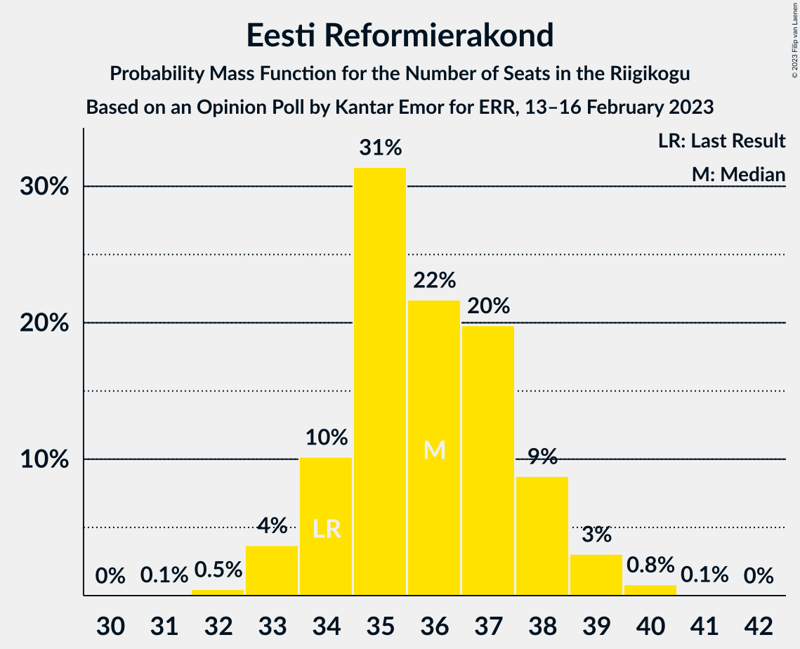
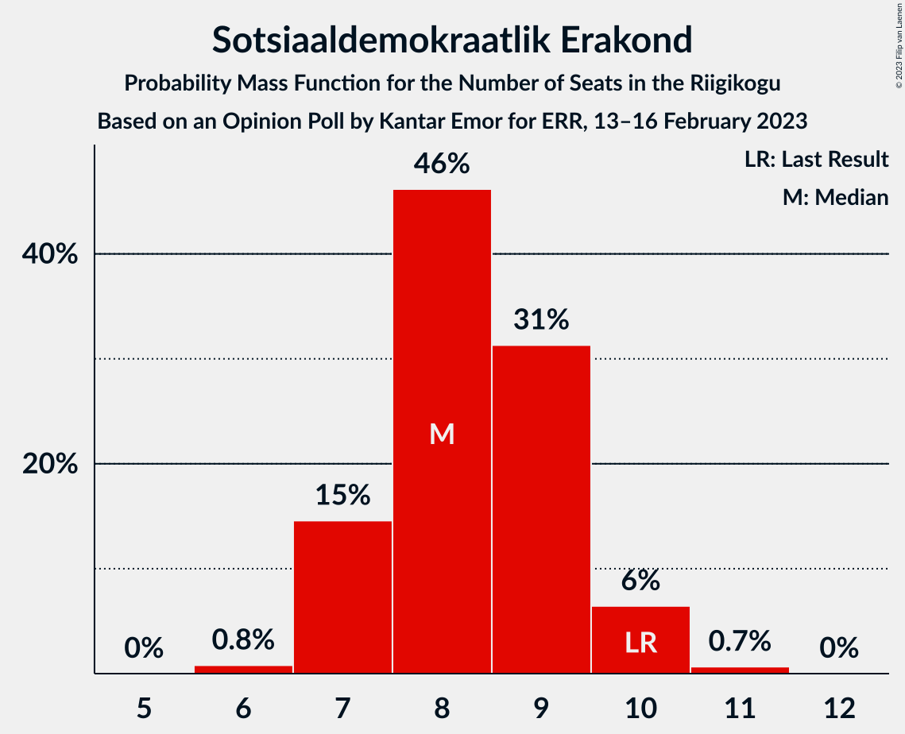

# Opinion Poll by Kantar Emor for ERR, 13–16 February 2023

<a href="#voting-intentions">Voting Intentions</a> | <a href="#seats">Seats</a> | <a href="#coalitions">Coalitions</a> | <a href="#technical-information">Technical Information</a>

## Voting Intentions

### Confidence Intervals

| Party | Last Result | Poll Result | 80% Confidence Interval | 90% Confidence Interval | 95% Confidence Interval | 99% Confidence Interval |
|:-----:|:-----------:|:-----------:|:-----------------------:|:-----------------------:|:-----------------------:|:-----------------------:|
| Eesti Reformierakond | 28.9% | 31.0% | 29.5–32.5% |29.1–32.9% |28.7–33.3% |28.1–34.0% |
| Eesti Konservatiivne Rahvaerakond | 17.8% | 17.2% | 16.0–18.4% |15.7–18.8% |15.4–19.1% |14.9–19.7% |
| Eesti Keskerakond | 23.1% | 16.2% | 15.0–17.4% |14.7–17.8% |14.4–18.1% |13.9–18.7% |
| Eesti 200 | 4.4% | 13.4% | 12.4–14.6% |12.1–14.9% |11.8–15.2% |11.3–15.7% |
| Sotsiaaldemokraatlik Erakond | 9.8% | 8.6% | 7.7–9.6% |7.5–9.8% |7.3–10.1% |6.9–10.5% |
| Erakond Isamaa | 11.4% | 7.3% | 6.5–8.2% |6.3–8.4% |6.1–8.7% |5.7–9.1% |
| Erakond Eestimaa Rohelised | 1.8% | 2.5% | 2.1–3.1% |2.0–3.3% |1.8–3.4% |1.7–3.7% |
| Erakond Parempoolsed | 0.0% | 2.1% | 1.7–2.6% |1.6–2.8% |1.5–2.9% |1.3–3.2% |

*Note:* The poll result column reflects the actual value used in the calculations. Published results may vary slightly, and in addition be rounded to fewer digits.

## Seats

### Confidence Intervals

| Party | Last Result | Median | 80% Confidence Interval | 90% Confidence Interval | 95% Confidence Interval | 99% Confidence Interval |
|:-----:|:-----------:|:------:|:-----------------------:|:-----------------------:|:-----------------------:|:-----------------------:|
| <a href="#eesti-reformierakond">Eesti Reformierakond</a> | 34 | 36 | 34–38 |34–38 |33–39 |32–40 |
| <a href="#eesti-konservatiivne-rahvaerakond">Eesti Konservatiivne Rahvaerakond</a> | 19 | 19 | 17–20 |17–20 |16–21 |16–22 |
| <a href="#eesti-keskerakond">Eesti Keskerakond</a> | 26 | 17 | 16–19 |16–19 |15–20 |15–20 |
| <a href="#eesti-200">Eesti 200</a> | 0 | 14 | 13–15 |12–16 |12–16 |12–17 |
| <a href="#sotsiaaldemokraatlik-erakond">Sotsiaaldemokraatlik Erakond</a> | 10 | 8 | 7–9 |7–10 |7–10 |6–11 |
| <a href="#erakond-isamaa">Erakond Isamaa</a> | 12 | 7 | 6–7 |6–8 |5–8 |5–9 |
| <a href="#erakond-eestimaa-rohelised">Erakond Eestimaa Rohelised</a> | 0 | 0 | 0 |0 |0 |0 |
| <a href="#erakond-parempoolsed">Erakond Parempoolsed</a> | 0 | 0 | 0 |0 |0 |0 |

### Eesti Reformierakond

*For a full overview of the results for this party, see the [Eesti Reformierakond](party-eestireformierakond.html) page.*

| Number of Seats | Probability | Accumulated | Special Marks |
|:---------------:|:-----------:|:-----------:|:-------------:|
| 31 | 0.1% | 100% |  |
| 32 | 0.5% | 99.9% |  |
| 33 | 4% | 99.5% |  |
| 34 | 10% | 96% | Last Result |
| 35 | 31% | 86% |  |
| 36 | 22% | 54% | Median |
| 37 | 20% | 33% |  |
| 38 | 9% | 13% |  |
| 39 | 3% | 4% |  |
| 40 | 0.8% | 0.9% |  |
| 41 | 0.1% | 0.1% |  |
| 42 | 0% | 0% |  |

### Eesti Konservatiivne Rahvaerakond

*For a full overview of the results for this party, see the [Eesti Konservatiivne Rahvaerakond](party-eestikonservatiivnerahvaerakond.html) page.*

| Number of Seats | Probability | Accumulated | Special Marks |
|:---------------:|:-----------:|:-----------:|:-------------:|
| 15 | 0.3% | 100% |  |
| 16 | 3% | 99.7% |  |
| 17 | 12% | 97% |  |
| 18 | 27% | 85% |  |
| 19 | 37% | 58% | Last Result, Median |
| 20 | 17% | 21% |  |
| 21 | 3% | 4% |  |
| 22 | 0.6% | 0.7% |  |
| 23 | 0.1% | 0.1% |  |
| 24 | 0% | 0% |  |

### Eesti Keskerakond

*For a full overview of the results for this party, see the [Eesti Keskerakond](party-eestikeskerakond.html) page.*

| Number of Seats | Probability | Accumulated | Special Marks |
|:---------------:|:-----------:|:-----------:|:-------------:|
| 14 | 0.4% | 100% |  |
| 15 | 4% | 99.6% |  |
| 16 | 19% | 95% |  |
| 17 | 27% | 77% | Median |
| 18 | 33% | 50% |  |
| 19 | 14% | 17% |  |
| 20 | 3% | 3% |  |
| 21 | 0.3% | 0.3% |  |
| 22 | 0% | 0% |  |
| 23 | 0% | 0% |  |
| 24 | 0% | 0% |  |
| 25 | 0% | 0% |  |
| 26 | 0% | 0% | Last Result |

### Eesti 200

*For a full overview of the results for this party, see the [Eesti 200](party-eesti200.html) page.*

| Number of Seats | Probability | Accumulated | Special Marks |
|:---------------:|:-----------:|:-----------:|:-------------:|
| 0 | 0% | 100% | Last Result |
| 1 | 0% | 100% |  |
| 2 | 0% | 100% |  |
| 3 | 0% | 100% |  |
| 4 | 0% | 100% |  |
| 5 | 0% | 100% |  |
| 6 | 0% | 100% |  |
| 7 | 0% | 100% |  |
| 8 | 0% | 100% |  |
| 9 | 0% | 100% |  |
| 10 | 0% | 100% |  |
| 11 | 0.4% | 100% |  |
| 12 | 6% | 99.6% |  |
| 13 | 14% | 94% |  |
| 14 | 53% | 80% | Median |
| 15 | 19% | 27% |  |
| 16 | 6% | 8% |  |
| 17 | 1.5% | 1.5% |  |
| 18 | 0% | 0% |  |

### Sotsiaaldemokraatlik Erakond

*For a full overview of the results for this party, see the [Sotsiaaldemokraatlik Erakond](party-sotsiaaldemokraatlikerakond.html) page.*

| Number of Seats | Probability | Accumulated | Special Marks |
|:---------------:|:-----------:|:-----------:|:-------------:|
| 6 | 0.8% | 100% |  |
| 7 | 15% | 99.2% |  |
| 8 | 46% | 85% | Median |
| 9 | 31% | 38% |  |
| 10 | 6% | 7% | Last Result |
| 11 | 0.7% | 0.7% |  |
| 12 | 0% | 0% |  |

### Erakond Isamaa

*For a full overview of the results for this party, see the [Erakond Isamaa](party-erakondisamaa.html) page.*

| Number of Seats | Probability | Accumulated | Special Marks |
|:---------------:|:-----------:|:-----------:|:-------------:|
| 5 | 3% | 100% |  |
| 6 | 34% | 97% |  |
| 7 | 56% | 63% | Median |
| 8 | 7% | 7% |  |
| 9 | 0.8% | 0.8% |  |
| 10 | 0.1% | 0.1% |  |
| 11 | 0% | 0% |  |
| 12 | 0% | 0% | Last Result |

### Erakond Eestimaa Rohelised

*For a full overview of the results for this party, see the [Erakond Eestimaa Rohelised](party-erakondeestimaarohelised.html) page.*

| Number of Seats | Probability | Accumulated | Special Marks |
|:---------------:|:-----------:|:-----------:|:-------------:|
| 0 | 100% | 100% | Last Result, Median |

### Erakond Parempoolsed

*For a full overview of the results for this party, see the [Erakond Parempoolsed](party-erakondparempoolsed.html) page.*

| Number of Seats | Probability | Accumulated | Special Marks |
|:---------------:|:-----------:|:-----------:|:-------------:|
| 0 | 100% | 100% | Last Result, Median |

## Coalitions

### Confidence Intervals

| Coalition | Last Result | Median | Majority? | 80% Confidence Interval | 90% Confidence Interval | 95% Confidence Interval | 99% Confidence Interval |
|:---------:|:-----------:|:------:|:---------:|:-----------------------:|:-----------------------:|:-----------------------:|:-----------------------:|
| Eesti Reformierakond – Eesti Konservatiivne Rahvaerakond – Eesti Keskerakond | 79 | 72 | 100% | 70–73 | 70–74 | 69–74 | 68–75 |
| Eesti Reformierakond – Eesti Konservatiivne Rahvaerakond – Erakond Isamaa | 65 | 61 | 100% | 59–63 | 59–64 | 58–64 | 58–65 |
| Eesti Reformierakond – Eesti Konservatiivne Rahvaerakond | 53 | 54 | 99.7% | 53–56 | 52–57 | 52–57 | 51–58 |
| Eesti Reformierakond – Eesti Keskerakond | 60 | 53 | 96% | 51–55 | 51–56 | 50–56 | 50–57 |
| Eesti Reformierakond – Sotsiaaldemokraatlik Erakond – Erakond Isamaa | 56 | 51 | 56% | 49–53 | 49–53 | 48–54 | 47–55 |
| Eesti Reformierakond – Sotsiaaldemokraatlik Erakond | 44 | 44 | 0% | 43–46 | 42–47 | 41–47 | 40–48 |
| Eesti Konservatiivne Rahvaerakond – Eesti Keskerakond – Erakond Isamaa | 57 | 43 | 0% | 41–44 | 40–45 | 40–45 | 39–46 |
| Eesti Reformierakond – Erakond Isamaa | 46 | 42 | 0% | 41–44 | 40–45 | 40–45 | 39–46 |
| Eesti Konservatiivne Rahvaerakond – Eesti Keskerakond | 45 | 36 | 0% | 34–38 | 33–38 | 33–39 | 32–40 |
| Eesti Keskerakond – Sotsiaaldemokraatlik Erakond – Erakond Isamaa | 48 | 33 | 0% | 31–34 | 30–35 | 30–35 | 29–36 |
| Eesti Konservatiivne Rahvaerakond – Sotsiaaldemokraatlik Erakond | 29 | 27 | 0% | 25–29 | 25–29 | 24–29 | 24–30 |
| Eesti Keskerakond – Sotsiaaldemokraatlik Erakond | 36 | 26 | 0% | 24–27 | 24–28 | 23–28 | 22–29 |

### Eesti Reformierakond – Eesti Konservatiivne Rahvaerakond – Eesti Keskerakond

| Number of Seats | Probability | Accumulated | Special Marks |
|:---------------:|:-----------:|:-----------:|:-------------:|
| 67 | 0.1% | 100% |  |
| 68 | 0.6% | 99.9% |  |
| 69 | 4% | 99.3% |  |
| 70 | 8% | 95% |  |
| 71 | 20% | 87% |  |
| 72 | 37% | 67% | Median |
| 73 | 21% | 30% |  |
| 74 | 7% | 9% |  |
| 75 | 2% | 2% |  |
| 76 | 0.3% | 0.3% |  |
| 77 | 0% | 0% |  |
| 78 | 0% | 0% |  |
| 79 | 0% | 0% | Last Result |

### Eesti Reformierakond – Eesti Konservatiivne Rahvaerakond – Erakond Isamaa

| Number of Seats | Probability | Accumulated | Special Marks |
|:---------------:|:-----------:|:-----------:|:-------------:|
| 56 | 0.1% | 100% |  |
| 57 | 0.4% | 99.9% |  |
| 58 | 3% | 99.6% |  |
| 59 | 8% | 97% |  |
| 60 | 23% | 89% |  |
| 61 | 26% | 66% |  |
| 62 | 21% | 40% | Median |
| 63 | 13% | 19% |  |
| 64 | 5% | 6% |  |
| 65 | 1.0% | 1.1% | Last Result |
| 66 | 0.1% | 0.2% |  |
| 67 | 0% | 0% |  |

### Eesti Reformierakond – Eesti Konservatiivne Rahvaerakond

| Number of Seats | Probability | Accumulated | Special Marks |
|:---------------:|:-----------:|:-----------:|:-------------:|
| 50 | 0.3% | 100% |  |
| 51 | 2% | 99.7% | Majority |
| 52 | 5% | 98% |  |
| 53 | 15% | 92% | Last Result |
| 54 | 32% | 78% |  |
| 55 | 20% | 46% | Median |
| 56 | 16% | 25% |  |
| 57 | 7% | 9% |  |
| 58 | 2% | 2% |  |
| 59 | 0.4% | 0.4% |  |
| 60 | 0.1% | 0.1% |  |
| 61 | 0% | 0% |  |

### Eesti Reformierakond – Eesti Keskerakond

| Number of Seats | Probability | Accumulated | Special Marks |
|:---------------:|:-----------:|:-----------:|:-------------:|
| 48 | 0.1% | 100% |  |
| 49 | 0.3% | 99.9% |  |
| 50 | 3% | 99.6% |  |
| 51 | 7% | 96% | Majority |
| 52 | 17% | 89% |  |
| 53 | 31% | 73% | Median |
| 54 | 23% | 42% |  |
| 55 | 12% | 19% |  |
| 56 | 5% | 7% |  |
| 57 | 1.4% | 2% |  |
| 58 | 0.2% | 0.2% |  |
| 59 | 0% | 0% |  |
| 60 | 0% | 0% | Last Result |

### Eesti Reformierakond – Sotsiaaldemokraatlik Erakond – Erakond Isamaa

| Number of Seats | Probability | Accumulated | Special Marks |
|:---------------:|:-----------:|:-----------:|:-------------:|
| 46 | 0.1% | 100% |  |
| 47 | 0.9% | 99.9% |  |
| 48 | 3% | 99.0% |  |
| 49 | 12% | 96% |  |
| 50 | 29% | 84% |  |
| 51 | 24% | 56% | Median, Majority |
| 52 | 18% | 31% |  |
| 53 | 9% | 13% |  |
| 54 | 3% | 4% |  |
| 55 | 0.7% | 0.8% |  |
| 56 | 0.1% | 0.1% | Last Result |
| 57 | 0% | 0% |  |

### Eesti Reformierakond – Sotsiaaldemokraatlik Erakond

| Number of Seats | Probability | Accumulated | Special Marks |
|:---------------:|:-----------:|:-----------:|:-------------:|
| 39 | 0.1% | 100% |  |
| 40 | 0.6% | 99.9% |  |
| 41 | 3% | 99.3% |  |
| 42 | 6% | 96% |  |
| 43 | 26% | 91% |  |
| 44 | 28% | 64% | Last Result, Median |
| 45 | 17% | 37% |  |
| 46 | 13% | 19% |  |
| 47 | 5% | 7% |  |
| 48 | 1.3% | 1.5% |  |
| 49 | 0.1% | 0.2% |  |
| 50 | 0% | 0% |  |

### Eesti Konservatiivne Rahvaerakond – Eesti Keskerakond – Erakond Isamaa

| Number of Seats | Probability | Accumulated | Special Marks |
|:---------------:|:-----------:|:-----------:|:-------------:|
| 38 | 0.2% | 100% |  |
| 39 | 1.2% | 99.8% |  |
| 40 | 7% | 98.6% |  |
| 41 | 15% | 92% |  |
| 42 | 16% | 77% |  |
| 43 | 26% | 61% | Median |
| 44 | 26% | 35% |  |
| 45 | 6% | 8% |  |
| 46 | 2% | 2% |  |
| 47 | 0.4% | 0.5% |  |
| 48 | 0% | 0.1% |  |
| 49 | 0% | 0% |  |
| 50 | 0% | 0% |  |
| 51 | 0% | 0% | Majority |
| 52 | 0% | 0% |  |
| 53 | 0% | 0% |  |
| 54 | 0% | 0% |  |
| 55 | 0% | 0% |  |
| 56 | 0% | 0% |  |
| 57 | 0% | 0% | Last Result |

### Eesti Reformierakond – Erakond Isamaa

| Number of Seats | Probability | Accumulated | Special Marks |
|:---------------:|:-----------:|:-----------:|:-------------:|
| 38 | 0.2% | 100% |  |
| 39 | 1.2% | 99.8% |  |
| 40 | 5% | 98.7% |  |
| 41 | 18% | 94% |  |
| 42 | 27% | 76% |  |
| 43 | 23% | 48% | Median |
| 44 | 15% | 25% |  |
| 45 | 7% | 10% |  |
| 46 | 2% | 2% | Last Result |
| 47 | 0.4% | 0.4% |  |
| 48 | 0.1% | 0.1% |  |
| 49 | 0% | 0% |  |

### Eesti Konservatiivne Rahvaerakond – Eesti Keskerakond

| Number of Seats | Probability | Accumulated | Special Marks |
|:---------------:|:-----------:|:-----------:|:-------------:|
| 31 | 0.1% | 100% |  |
| 32 | 0.8% | 99.9% |  |
| 33 | 4% | 99.1% |  |
| 34 | 10% | 95% |  |
| 35 | 18% | 85% |  |
| 36 | 25% | 67% | Median |
| 37 | 29% | 43% |  |
| 38 | 11% | 14% |  |
| 39 | 2% | 3% |  |
| 40 | 0.6% | 0.7% |  |
| 41 | 0.1% | 0.1% |  |
| 42 | 0% | 0% |  |
| 43 | 0% | 0% |  |
| 44 | 0% | 0% |  |
| 45 | 0% | 0% | Last Result |

### Eesti Keskerakond – Sotsiaaldemokraatlik Erakond – Erakond Isamaa

| Number of Seats | Probability | Accumulated | Special Marks |
|:---------------:|:-----------:|:-----------:|:-------------:|
| 28 | 0.2% | 100% |  |
| 29 | 1.5% | 99.8% |  |
| 30 | 7% | 98% |  |
| 31 | 20% | 92% |  |
| 32 | 22% | 72% | Median |
| 33 | 29% | 50% |  |
| 34 | 16% | 21% |  |
| 35 | 5% | 6% |  |
| 36 | 0.9% | 1.1% |  |
| 37 | 0.1% | 0.2% |  |
| 38 | 0% | 0% |  |
| 39 | 0% | 0% |  |
| 40 | 0% | 0% |  |
| 41 | 0% | 0% |  |
| 42 | 0% | 0% |  |
| 43 | 0% | 0% |  |
| 44 | 0% | 0% |  |
| 45 | 0% | 0% |  |
| 46 | 0% | 0% |  |
| 47 | 0% | 0% |  |
| 48 | 0% | 0% | Last Result |

### Eesti Konservatiivne Rahvaerakond – Sotsiaaldemokraatlik Erakond

| Number of Seats | Probability | Accumulated | Special Marks |
|:---------------:|:-----------:|:-----------:|:-------------:|
| 23 | 0.4% | 100% |  |
| 24 | 3% | 99.6% |  |
| 25 | 11% | 97% |  |
| 26 | 19% | 86% |  |
| 27 | 35% | 67% | Median |
| 28 | 20% | 32% |  |
| 29 | 9% | 11% | Last Result |
| 30 | 2% | 2% |  |
| 31 | 0.3% | 0.4% |  |
| 32 | 0% | 0% |  |

### Eesti Keskerakond – Sotsiaaldemokraatlik Erakond

| Number of Seats | Probability | Accumulated | Special Marks |
|:---------------:|:-----------:|:-----------:|:-------------:|
| 21 | 0.1% | 100% |  |
| 22 | 0.7% | 99.9% |  |
| 23 | 4% | 99.3% |  |
| 24 | 16% | 95% |  |
| 25 | 23% | 79% | Median |
| 26 | 23% | 56% |  |
| 27 | 25% | 33% |  |
| 28 | 5% | 7% |  |
| 29 | 2% | 2% |  |
| 30 | 0.2% | 0.2% |  |
| 31 | 0% | 0% |  |
| 32 | 0% | 0% |  |
| 33 | 0% | 0% |  |
| 34 | 0% | 0% |  |
| 35 | 0% | 0% |  |
| 36 | 0% | 0% | Last Result |

## Technical Information

### Opinion Poll

+ **Polling firm:** Kantar Emor
+ **Commissioner(s):** ERR
+ **Fieldwork period:** 13–16 February 2023

### Calculations

+ **Sample size:** 1595
+ **Simulations done:** 1,048,576
+ **Error estimate:** 0.69%

