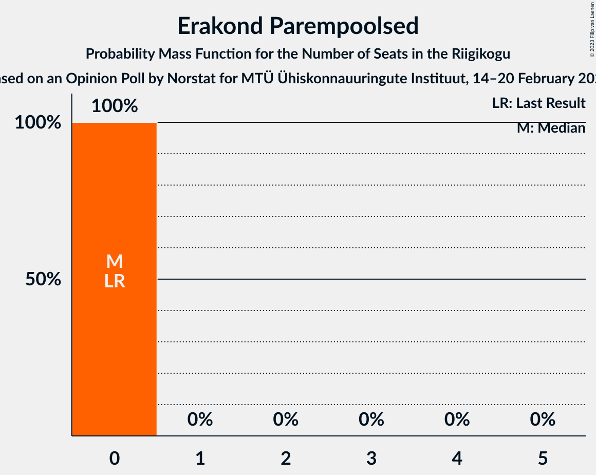

# Opinion Poll by Norstat for MTÜ Ühiskonnauuringute Instituut, 14–20 February 2023

<a href="#voting-intentions">Voting Intentions</a> | <a href="#seats">Seats</a> | <a href="#coalitions">Coalitions</a> | <a href="#technical-information">Technical Information</a>

## Voting Intentions

### Confidence Intervals

| Party | Last Result | Poll Result | 80% Confidence Interval | 90% Confidence Interval | 95% Confidence Interval | 99% Confidence Interval |
|:-----:|:-----------:|:-----------:|:-----------------------:|:-----------------------:|:-----------------------:|:-----------------------:|
| Eesti Reformierakond | 28.9% | 29.0% | 27.2–30.9% |26.7–31.4% |26.3–31.9% |25.4–32.8% |
| Eesti Konservatiivne Rahvaerakond | 17.8% | 21.7% | 20.1–23.4% |19.6–23.9% |19.3–24.4% |18.5–25.2% |
| Eesti Keskerakond | 23.1% | 17.9% | 16.4–19.5% |16.0–20.0% |15.6–20.4% |15.0–21.2% |
| Erakond Isamaa | 11.4% | 10.3% | 9.2–11.6% |8.8–12.0% |8.6–12.3% |8.0–13.0% |
| Eesti 200 | 4.4% | 9.7% | 8.6–11.0% |8.3–11.4% |8.0–11.7% |7.5–12.3% |
| Sotsiaaldemokraatlik Erakond | 9.8% | 6.6% | 5.7–7.7% |5.4–8.0% |5.2–8.3% |4.8–8.9% |
| Erakond Eestimaa Rohelised | 1.8% | 2.2% | 1.7–2.9% |1.6–3.1% |1.4–3.3% |1.2–3.7% |
| Erakond Parempoolsed | 0.0% | 1.3% | 0.9–1.9% |0.8–2.1% |0.8–2.2% |0.6–2.5% |

*Note:* The poll result column reflects the actual value used in the calculations. Published results may vary slightly, and in addition be rounded to fewer digits.

## Seats

### Confidence Intervals

| Party | Last Result | Median | 80% Confidence Interval | 90% Confidence Interval | 95% Confidence Interval | 99% Confidence Interval |
|:-----:|:-----------:|:------:|:-----------------------:|:-----------------------:|:-----------------------:|:-----------------------:|
| <a href="#eesti-reformierakond">Eesti Reformierakond</a> | 34 | 33 | 31–35 |30–36 |29–36 |28–37 |
| <a href="#eesti-konservatiivne-rahvaerakond">Eesti Konservatiivne Rahvaerakond</a> | 19 | 24 | 22–26 |21–26 |21–27 |20–28 |
| <a href="#eesti-keskerakond">Eesti Keskerakond</a> | 26 | 19 | 17–21 |17–21 |16–22 |16–23 |
| <a href="#erakond-isamaa">Erakond Isamaa</a> | 12 | 10 | 9–12 |8–12 |8–12 |7–13 |
| <a href="#eesti-200">Eesti 200</a> | 0 | 9 | 8–11 |8–11 |7–12 |7–12 |
| <a href="#sotsiaaldemokraatlik-erakond">Sotsiaaldemokraatlik Erakond</a> | 10 | 6 | 5–7 |5–7 |4–8 |0–9 |
| <a href="#erakond-eestimaa-rohelised">Erakond Eestimaa Rohelised</a> | 0 | 0 | 0 |0 |0 |0 |
| <a href="#erakond-parempoolsed">Erakond Parempoolsed</a> | 0 | 0 | 0 |0 |0 |0 |

### Eesti Reformierakond

*For a full overview of the results for this party, see the [Eesti Reformierakond](party-eestireformierakond.html) page.*

| Number of Seats | Probability | Accumulated | Special Marks |
|:---------------:|:-----------:|:-----------:|:-------------:|
| 27 | 0.1% | 100% |  |
| 28 | 0.5% | 99.9% |  |
| 29 | 2% | 99.4% |  |
| 30 | 6% | 97% |  |
| 31 | 13% | 92% |  |
| 32 | 21% | 78% |  |
| 33 | 19% | 57% | Median |
| 34 | 21% | 38% | Last Result |
| 35 | 11% | 17% |  |
| 36 | 4% | 6% |  |
| 37 | 1.5% | 2% |  |
| 38 | 0.3% | 0.5% |  |
| 39 | 0.1% | 0.1% |  |
| 40 | 0% | 0% |  |

### Eesti Konservatiivne Rahvaerakond

*For a full overview of the results for this party, see the [Eesti Konservatiivne Rahvaerakond](party-eestikonservatiivnerahvaerakond.html) page.*

| Number of Seats | Probability | Accumulated | Special Marks |
|:---------------:|:-----------:|:-----------:|:-------------:|
| 19 | 0.3% | 100% | Last Result |
| 20 | 2% | 99.7% |  |
| 21 | 6% | 98% |  |
| 22 | 20% | 92% |  |
| 23 | 21% | 72% |  |
| 24 | 22% | 51% | Median |
| 25 | 17% | 29% |  |
| 26 | 8% | 12% |  |
| 27 | 3% | 4% |  |
| 28 | 1.1% | 1.3% |  |
| 29 | 0.1% | 0.2% |  |
| 30 | 0% | 0% |  |

### Eesti Keskerakond

*For a full overview of the results for this party, see the [Eesti Keskerakond](party-eestikeskerakond.html) page.*

| Number of Seats | Probability | Accumulated | Special Marks |
|:---------------:|:-----------:|:-----------:|:-------------:|
| 14 | 0.1% | 100% |  |
| 15 | 0.4% | 99.9% |  |
| 16 | 3% | 99.5% |  |
| 17 | 14% | 97% |  |
| 18 | 21% | 83% |  |
| 19 | 24% | 62% | Median |
| 20 | 20% | 39% |  |
| 21 | 15% | 19% |  |
| 22 | 3% | 4% |  |
| 23 | 0.8% | 1.0% |  |
| 24 | 0.2% | 0.2% |  |
| 25 | 0% | 0% |  |
| 26 | 0% | 0% | Last Result |

### Erakond Isamaa

*For a full overview of the results for this party, see the [Erakond Isamaa](party-erakondisamaa.html) page.*

| Number of Seats | Probability | Accumulated | Special Marks |
|:---------------:|:-----------:|:-----------:|:-------------:|
| 7 | 0.5% | 100% |  |
| 8 | 6% | 99.5% |  |
| 9 | 24% | 94% |  |
| 10 | 35% | 70% | Median |
| 11 | 24% | 35% |  |
| 12 | 9% | 11% | Last Result |
| 13 | 2% | 2% |  |
| 14 | 0.2% | 0.2% |  |
| 15 | 0% | 0% |  |

### Eesti 200

*For a full overview of the results for this party, see the [Eesti 200](party-eesti200.html) page.*

| Number of Seats | Probability | Accumulated | Special Marks |
|:---------------:|:-----------:|:-----------:|:-------------:|
| 0 | 0% | 100% | Last Result |
| 1 | 0% | 100% |  |
| 2 | 0% | 100% |  |
| 3 | 0% | 100% |  |
| 4 | 0% | 100% |  |
| 5 | 0% | 100% |  |
| 6 | 0.1% | 100% |  |
| 7 | 2% | 99.9% |  |
| 8 | 16% | 97% |  |
| 9 | 34% | 81% | Median |
| 10 | 33% | 47% |  |
| 11 | 10% | 13% |  |
| 12 | 3% | 3% |  |
| 13 | 0.3% | 0.4% |  |
| 14 | 0% | 0% |  |

### Sotsiaaldemokraatlik Erakond

*For a full overview of the results for this party, see the [Sotsiaaldemokraatlik Erakond](party-sotsiaaldemokraatlikerakond.html) page.*

| Number of Seats | Probability | Accumulated | Special Marks |
|:---------------:|:-----------:|:-----------:|:-------------:|
| 0 | 2% | 100% |  |
| 1 | 0% | 98% |  |
| 2 | 0% | 98% |  |
| 3 | 0% | 98% |  |
| 4 | 2% | 98% |  |
| 5 | 23% | 97% |  |
| 6 | 46% | 74% | Median |
| 7 | 23% | 28% |  |
| 8 | 4% | 5% |  |
| 9 | 0.5% | 0.5% |  |
| 10 | 0% | 0% | Last Result |

### Erakond Eestimaa Rohelised

*For a full overview of the results for this party, see the [Erakond Eestimaa Rohelised](party-erakondeestimaarohelised.html) page.*

| Number of Seats | Probability | Accumulated | Special Marks |
|:---------------:|:-----------:|:-----------:|:-------------:|
| 0 | 100% | 100% | Last Result, Median |

### Erakond Parempoolsed

*For a full overview of the results for this party, see the [Erakond Parempoolsed](party-erakondparempoolsed.html) page.*

| Number of Seats | Probability | Accumulated | Special Marks |
|:---------------:|:-----------:|:-----------:|:-------------:|
| 0 | 100% | 100% | Last Result, Median |

## Coalitions

### Confidence Intervals

| Coalition | Last Result | Median | Majority? | 80% Confidence Interval | 90% Confidence Interval | 95% Confidence Interval | 99% Confidence Interval |
|:---------:|:-----------:|:------:|:---------:|:-----------------------:|:-----------------------:|:-----------------------:|:-----------------------:|
| Eesti Reformierakond – Eesti Konservatiivne Rahvaerakond – Eesti Keskerakond | 79 | 76 | 100% | 73–78 | 73–78 | 72–79 | 71–80 |
| Eesti Reformierakond – Eesti Konservatiivne Rahvaerakond – Erakond Isamaa | 65 | 67 | 100% | 64–69 | 64–69 | 63–70 | 62–72 |
| Eesti Reformierakond – Eesti Konservatiivne Rahvaerakond | 53 | 56 | 99.9% | 54–59 | 53–60 | 53–60 | 52–61 |
| Eesti Konservatiivne Rahvaerakond – Eesti Keskerakond – Erakond Isamaa | 57 | 53 | 89% | 50–55 | 50–56 | 49–57 | 48–58 |
| Eesti Reformierakond – Eesti Keskerakond | 60 | 52 | 76% | 49–54 | 49–55 | 48–56 | 47–57 |
| Eesti Reformierakond – Erakond Isamaa – Sotsiaaldemokraatlik Erakond | 56 | 49 | 20% | 46–51 | 46–52 | 45–53 | 44–54 |
| Eesti Konservatiivne Rahvaerakond – Eesti Keskerakond | 45 | 42 | 0% | 40–45 | 40–46 | 39–47 | 38–48 |
| Eesti Reformierakond – Erakond Isamaa | 46 | 43 | 0% | 40–45 | 40–46 | 39–47 | 38–48 |
| Eesti Reformierakond – Sotsiaaldemokraatlik Erakond | 44 | 39 | 0% | 36–41 | 36–42 | 35–42 | 34–44 |
| Eesti Keskerakond – Erakond Isamaa – Sotsiaaldemokraatlik Erakond | 48 | 35 | 0% | 33–38 | 32–38 | 31–38 | 30–40 |
| Eesti Konservatiivne Rahvaerakond – Sotsiaaldemokraatlik Erakond | 29 | 29 | 0% | 27–32 | 27–33 | 26–33 | 24–34 |
| Eesti Keskerakond – Sotsiaaldemokraatlik Erakond | 36 | 25 | 0% | 23–27 | 22–28 | 21–28 | 19–29 |

### Eesti Reformierakond – Eesti Konservatiivne Rahvaerakond – Eesti Keskerakond

| Number of Seats | Probability | Accumulated | Special Marks |
|:---------------:|:-----------:|:-----------:|:-------------:|
| 70 | 0.1% | 100% |  |
| 71 | 0.5% | 99.9% |  |
| 72 | 3% | 99.4% |  |
| 73 | 7% | 96% |  |
| 74 | 17% | 89% |  |
| 75 | 21% | 72% |  |
| 76 | 24% | 50% | Median |
| 77 | 16% | 26% |  |
| 78 | 7% | 11% |  |
| 79 | 3% | 4% | Last Result |
| 80 | 1.0% | 1.4% |  |
| 81 | 0.2% | 0.4% |  |
| 82 | 0.1% | 0.2% |  |
| 83 | 0% | 0.1% |  |
| 84 | 0% | 0% |  |

### Eesti Reformierakond – Eesti Konservatiivne Rahvaerakond – Erakond Isamaa

| Number of Seats | Probability | Accumulated | Special Marks |
|:---------------:|:-----------:|:-----------:|:-------------:|
| 61 | 0.2% | 100% |  |
| 62 | 1.0% | 99.8% |  |
| 63 | 2% | 98.8% |  |
| 64 | 13% | 97% |  |
| 65 | 13% | 84% | Last Result |
| 66 | 22% | 72% |  |
| 67 | 23% | 50% | Median |
| 68 | 7% | 27% |  |
| 69 | 16% | 20% |  |
| 70 | 3% | 5% |  |
| 71 | 0.7% | 2% |  |
| 72 | 0.7% | 0.9% |  |
| 73 | 0.2% | 0.2% |  |
| 74 | 0% | 0% |  |

### Eesti Reformierakond – Eesti Konservatiivne Rahvaerakond

| Number of Seats | Probability | Accumulated | Special Marks |
|:---------------:|:-----------:|:-----------:|:-------------:|
| 50 | 0.1% | 100% |  |
| 51 | 0.3% | 99.9% | Majority |
| 52 | 1.2% | 99.7% |  |
| 53 | 4% | 98.5% | Last Result |
| 54 | 10% | 94% |  |
| 55 | 16% | 84% |  |
| 56 | 19% | 68% |  |
| 57 | 18% | 49% | Median |
| 58 | 17% | 31% |  |
| 59 | 9% | 14% |  |
| 60 | 4% | 6% |  |
| 61 | 1.1% | 2% |  |
| 62 | 0.3% | 0.5% |  |
| 63 | 0.1% | 0.1% |  |
| 64 | 0% | 0% |  |

### Eesti Konservatiivne Rahvaerakond – Eesti Keskerakond – Erakond Isamaa

| Number of Seats | Probability | Accumulated | Special Marks |
|:---------------:|:-----------:|:-----------:|:-------------:|
| 47 | 0.3% | 100% |  |
| 48 | 0.8% | 99.7% |  |
| 49 | 3% | 98.9% |  |
| 50 | 7% | 96% |  |
| 51 | 15% | 89% | Majority |
| 52 | 18% | 74% |  |
| 53 | 23% | 56% | Median |
| 54 | 17% | 33% |  |
| 55 | 8% | 16% |  |
| 56 | 4% | 8% |  |
| 57 | 3% | 4% | Last Result |
| 58 | 0.7% | 0.9% |  |
| 59 | 0.1% | 0.2% |  |
| 60 | 0% | 0.1% |  |
| 61 | 0% | 0% |  |

### Eesti Reformierakond – Eesti Keskerakond

| Number of Seats | Probability | Accumulated | Special Marks |
|:---------------:|:-----------:|:-----------:|:-------------:|
| 46 | 0.2% | 100% |  |
| 47 | 0.7% | 99.8% |  |
| 48 | 4% | 99.1% |  |
| 49 | 7% | 95% |  |
| 50 | 12% | 89% |  |
| 51 | 16% | 76% | Majority |
| 52 | 23% | 61% | Median |
| 53 | 17% | 37% |  |
| 54 | 11% | 20% |  |
| 55 | 6% | 9% |  |
| 56 | 2% | 3% |  |
| 57 | 0.5% | 0.7% |  |
| 58 | 0.2% | 0.2% |  |
| 59 | 0% | 0.1% |  |
| 60 | 0% | 0% | Last Result |

### Eesti Reformierakond – Erakond Isamaa – Sotsiaaldemokraatlik Erakond

| Number of Seats | Probability | Accumulated | Special Marks |
|:---------------:|:-----------:|:-----------:|:-------------:|
| 42 | 0.1% | 100% |  |
| 43 | 0.3% | 99.9% |  |
| 44 | 1.4% | 99.6% |  |
| 45 | 3% | 98% |  |
| 46 | 5% | 95% |  |
| 47 | 14% | 90% |  |
| 48 | 14% | 76% |  |
| 49 | 21% | 63% | Median |
| 50 | 21% | 41% |  |
| 51 | 13% | 20% | Majority |
| 52 | 5% | 7% |  |
| 53 | 2% | 3% |  |
| 54 | 0.6% | 0.9% |  |
| 55 | 0.2% | 0.2% |  |
| 56 | 0% | 0% | Last Result |

### Eesti Konservatiivne Rahvaerakond – Eesti Keskerakond

| Number of Seats | Probability | Accumulated | Special Marks |
|:---------------:|:-----------:|:-----------:|:-------------:|
| 37 | 0.2% | 100% |  |
| 38 | 0.8% | 99.8% |  |
| 39 | 4% | 99.0% |  |
| 40 | 7% | 95% |  |
| 41 | 11% | 88% |  |
| 42 | 27% | 77% |  |
| 43 | 22% | 50% | Median |
| 44 | 13% | 28% |  |
| 45 | 7% | 15% | Last Result |
| 46 | 5% | 8% |  |
| 47 | 2% | 3% |  |
| 48 | 0.4% | 0.6% |  |
| 49 | 0.1% | 0.2% |  |
| 50 | 0% | 0% |  |

### Eesti Reformierakond – Erakond Isamaa

| Number of Seats | Probability | Accumulated | Special Marks |
|:---------------:|:-----------:|:-----------:|:-------------:|
| 37 | 0.2% | 100% |  |
| 38 | 0.7% | 99.8% |  |
| 39 | 2% | 99.1% |  |
| 40 | 7% | 97% |  |
| 41 | 11% | 90% |  |
| 42 | 17% | 78% |  |
| 43 | 24% | 62% | Median |
| 44 | 18% | 38% |  |
| 45 | 12% | 20% |  |
| 46 | 5% | 8% | Last Result |
| 47 | 2% | 3% |  |
| 48 | 0.6% | 0.8% |  |
| 49 | 0.2% | 0.2% |  |
| 50 | 0% | 0% |  |

### Eesti Reformierakond – Sotsiaaldemokraatlik Erakond

| Number of Seats | Probability | Accumulated | Special Marks |
|:---------------:|:-----------:|:-----------:|:-------------:|
| 32 | 0.1% | 100% |  |
| 33 | 0.3% | 99.9% |  |
| 34 | 2% | 99.6% |  |
| 35 | 2% | 98% |  |
| 36 | 5% | 95% |  |
| 37 | 10% | 90% |  |
| 38 | 25% | 80% |  |
| 39 | 17% | 55% | Median |
| 40 | 18% | 38% |  |
| 41 | 13% | 20% |  |
| 42 | 5% | 7% |  |
| 43 | 1.2% | 2% |  |
| 44 | 0.5% | 0.7% | Last Result |
| 45 | 0.1% | 0.1% |  |
| 46 | 0% | 0% |  |

### Eesti Keskerakond – Erakond Isamaa – Sotsiaaldemokraatlik Erakond

| Number of Seats | Probability | Accumulated | Special Marks |
|:---------------:|:-----------:|:-----------:|:-------------:|
| 29 | 0.2% | 100% |  |
| 30 | 0.7% | 99.8% |  |
| 31 | 3% | 99.1% |  |
| 32 | 3% | 97% |  |
| 33 | 15% | 94% |  |
| 34 | 11% | 79% |  |
| 35 | 25% | 68% | Median |
| 36 | 22% | 42% |  |
| 37 | 10% | 21% |  |
| 38 | 9% | 11% |  |
| 39 | 1.5% | 2% |  |
| 40 | 0.7% | 0.9% |  |
| 41 | 0.1% | 0.1% |  |
| 42 | 0% | 0% |  |
| 43 | 0% | 0% |  |
| 44 | 0% | 0% |  |
| 45 | 0% | 0% |  |
| 46 | 0% | 0% |  |
| 47 | 0% | 0% |  |
| 48 | 0% | 0% | Last Result |

### Eesti Konservatiivne Rahvaerakond – Sotsiaaldemokraatlik Erakond

| Number of Seats | Probability | Accumulated | Special Marks |
|:---------------:|:-----------:|:-----------:|:-------------:|
| 23 | 0.1% | 100% |  |
| 24 | 0.4% | 99.9% |  |
| 25 | 1.4% | 99.5% |  |
| 26 | 3% | 98% |  |
| 27 | 6% | 95% |  |
| 28 | 17% | 90% |  |
| 29 | 23% | 73% | Last Result |
| 30 | 18% | 50% | Median |
| 31 | 17% | 31% |  |
| 32 | 9% | 14% |  |
| 33 | 4% | 5% |  |
| 34 | 1.3% | 2% |  |
| 35 | 0.2% | 0.3% |  |
| 36 | 0% | 0% |  |

### Eesti Keskerakond – Sotsiaaldemokraatlik Erakond

| Number of Seats | Probability | Accumulated | Special Marks |
|:---------------:|:-----------:|:-----------:|:-------------:|
| 18 | 0.1% | 100% |  |
| 19 | 0.4% | 99.9% |  |
| 20 | 0.4% | 99.5% |  |
| 21 | 2% | 99.0% |  |
| 22 | 4% | 97% |  |
| 23 | 13% | 94% |  |
| 24 | 17% | 80% |  |
| 25 | 23% | 63% | Median |
| 26 | 20% | 40% |  |
| 27 | 15% | 21% |  |
| 28 | 4% | 6% |  |
| 29 | 1.2% | 1.5% |  |
| 30 | 0.2% | 0.3% |  |
| 31 | 0% | 0% |  |
| 32 | 0% | 0% |  |
| 33 | 0% | 0% |  |
| 34 | 0% | 0% |  |
| 35 | 0% | 0% |  |
| 36 | 0% | 0% | Last Result |

## Technical Information

### Opinion Poll

+ **Polling firm:** Norstat
+ **Commissioner(s):** MTÜ Ühiskonnauuringute Instituut
+ **Fieldwork period:** 14–20 February 2023

### Calculations

+ **Sample size:** 1000
+ **Simulations done:** 1,048,576
+ **Error estimate:** 1.14%

