# Opinion Poll by Kantar Emor for ERR, 20–22 February 2023

<a href="#voting-intentions">Voting Intentions</a> | <a href="#seats">Seats</a> | <a href="#coalitions">Coalitions</a> | <a href="#technical-information">Technical Information</a>

## Voting Intentions

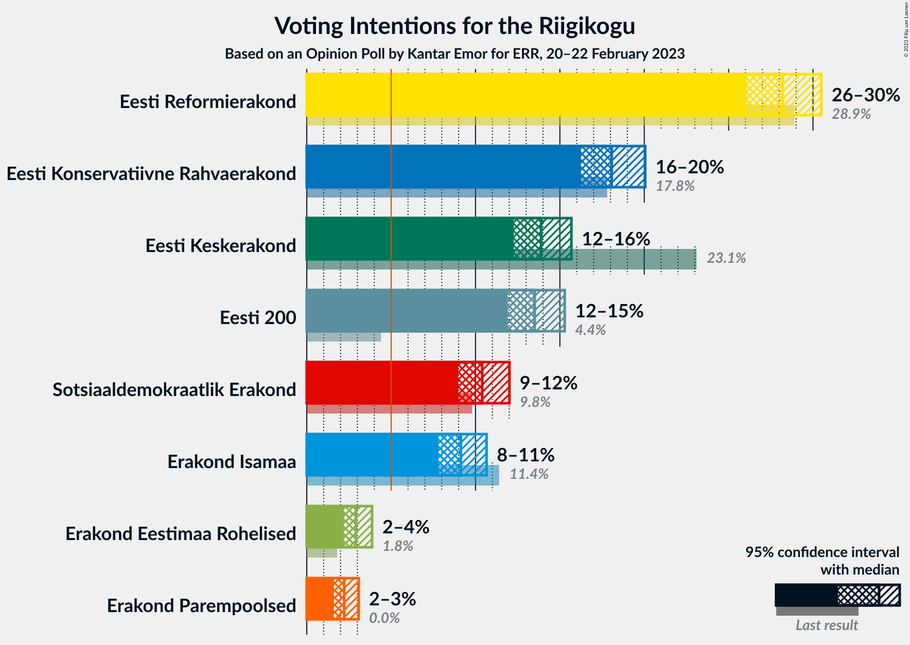

### Confidence Intervals

| Party | Last Result | Poll Result | 80% Confidence Interval | 90% Confidence Interval | 95% Confidence Interval | 99% Confidence Interval |
|:-----:|:-----------:|:-----------:|:-----------------------:|:-----------------------:|:-----------------------:|:-----------------------:|
| Eesti Reformierakond | 28.9% | 28.2% | 26.8–29.7% |26.4–30.1% |26.0–30.5% |25.4–31.2% |
| Eesti Konservatiivne Rahvaerakond | 17.8% | 18.1% | 16.9–19.4% |16.5–19.7% |16.2–20.1% |15.7–20.7% |
| Eesti Keskerakond | 23.1% | 13.9% | 12.8–15.1% |12.5–15.4% |12.3–15.7% |11.8–16.3% |
| Eesti 200 | 4.4% | 13.5% | 12.5–14.7% |12.2–15.0% |11.9–15.3% |11.4–15.9% |
| Sotsiaaldemokraatlik Erakond | 9.8% | 10.4% | 9.5–11.4% |9.2–11.8% |9.0–12.0% |8.6–12.5% |
| Erakond Isamaa | 11.4% | 9.1% | 8.3–10.1% |8.0–10.4% |7.8–10.7% |7.4–11.2% |
| Erakond Eestimaa Rohelised | 1.8% | 2.9% | 2.4–3.5% |2.3–3.7% |2.2–3.9% |2.0–4.2% |
| Erakond Parempoolsed | 0.0% | 2.2% | 1.8–2.8% |1.7–2.9% |1.6–3.1% |1.4–3.4% |

*Note:* The poll result column reflects the actual value used in the calculations. Published results may vary slightly, and in addition be rounded to fewer digits.

## Seats

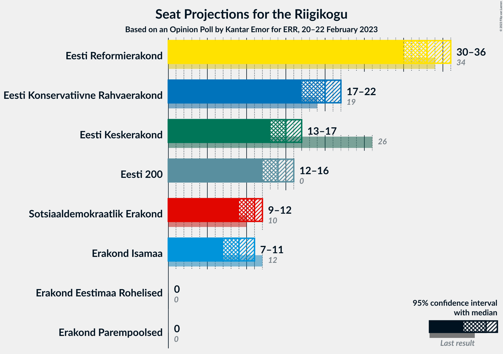

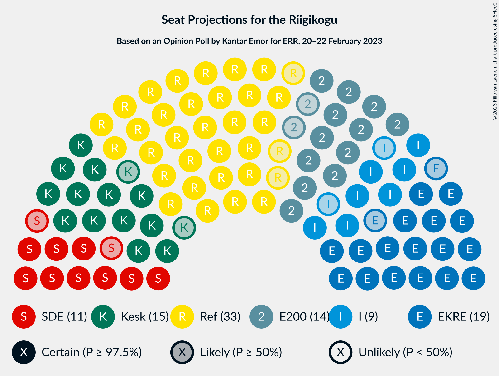

### Confidence Intervals

| Party | Last Result | Median | 80% Confidence Interval | 90% Confidence Interval | 95% Confidence Interval | 99% Confidence Interval |
|:-----:|:-----------:|:------:|:-----------------------:|:-----------------------:|:-----------------------:|:-----------------------:|
| <a href="#eesti-reformierakond">Eesti Reformierakond</a> | 34 | 33 | 31–35 |30–35 |30–36 |29–36 |
| <a href="#eesti-konservatiivne-rahvaerakond">Eesti Konservatiivne Rahvaerakond</a> | 19 | 20 | 18–21 |18–22 |17–22 |17–23 |
| <a href="#eesti-keskerakond">Eesti Keskerakond</a> | 26 | 15 | 13–16 |13–16 |13–17 |12–18 |
| <a href="#eesti-200">Eesti 200</a> | 0 | 14 | 13–16 |13–16 |12–16 |12–17 |
| <a href="#sotsiaaldemokraatlik-erakond">Sotsiaaldemokraatlik Erakond</a> | 10 | 11 | 9–12 |9–12 |9–12 |8–13 |
| <a href="#erakond-isamaa">Erakond Isamaa</a> | 12 | 9 | 8–10 |8–11 |7–11 |7–11 |
| <a href="#erakond-eestimaa-rohelised">Erakond Eestimaa Rohelised</a> | 0 | 0 | 0 |0 |0 |0 |
| <a href="#erakond-parempoolsed">Erakond Parempoolsed</a> | 0 | 0 | 0 |0 |0 |0 |

### Eesti Reformierakond

*For a full overview of the results for this party, see the [Eesti Reformierakond](party-eestireformierakond.html) page.*

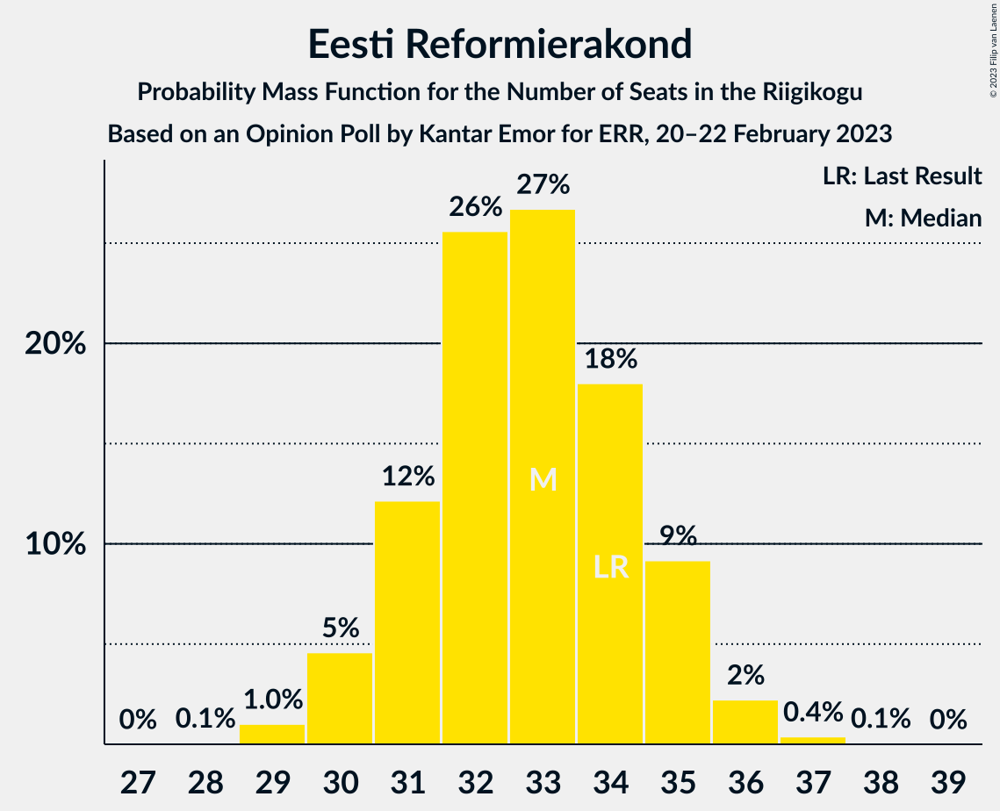

| Number of Seats | Probability | Accumulated | Special Marks |
|:---------------:|:-----------:|:-----------:|:-------------:|
| 28 | 0.1% | 100% |  |
| 29 | 1.0% | 99.9% |  |
| 30 | 5% | 98.9% |  |
| 31 | 12% | 94% |  |
| 32 | 26% | 82% |  |
| 33 | 27% | 57% | Median |
| 34 | 18% | 30% | Last Result |
| 35 | 9% | 12% |  |
| 36 | 2% | 3% |  |
| 37 | 0.4% | 0.5% |  |
| 38 | 0.1% | 0.1% |  |
| 39 | 0% | 0% |  |

### Eesti Konservatiivne Rahvaerakond

*For a full overview of the results for this party, see the [Eesti Konservatiivne Rahvaerakond](party-eestikonservatiivnerahvaerakond.html) page.*

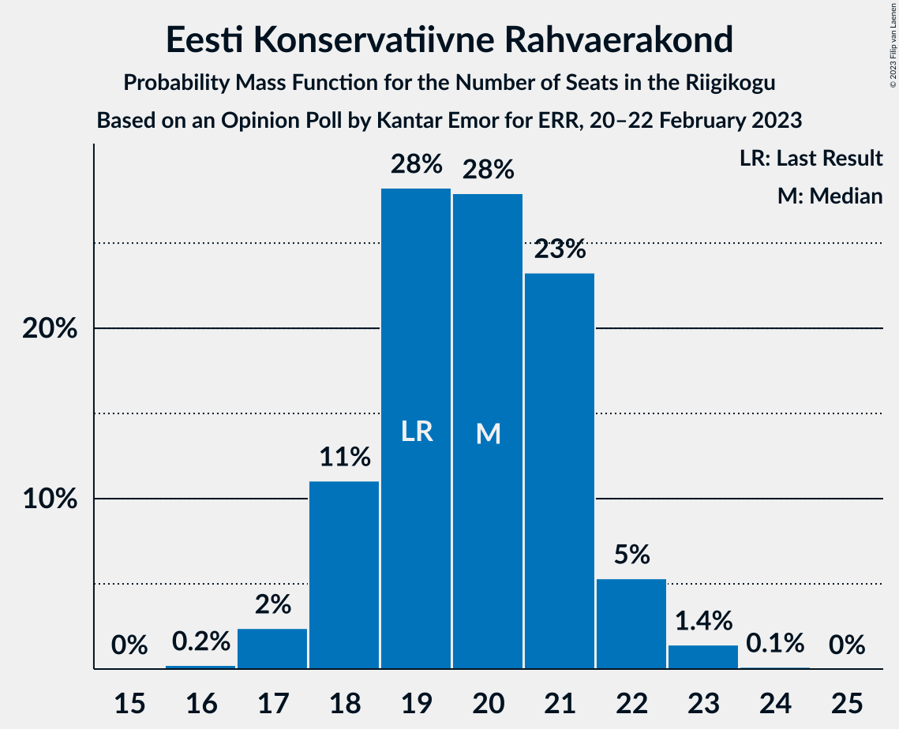

| Number of Seats | Probability | Accumulated | Special Marks |
|:---------------:|:-----------:|:-----------:|:-------------:|
| 16 | 0.2% | 100% |  |
| 17 | 2% | 99.8% |  |
| 18 | 11% | 97% |  |
| 19 | 28% | 86% | Last Result |
| 20 | 28% | 58% | Median |
| 21 | 23% | 30% |  |
| 22 | 5% | 7% |  |
| 23 | 1.4% | 2% |  |
| 24 | 0.1% | 0.1% |  |
| 25 | 0% | 0% |  |

### Eesti Keskerakond

*For a full overview of the results for this party, see the [Eesti Keskerakond](party-eestikeskerakond.html) page.*

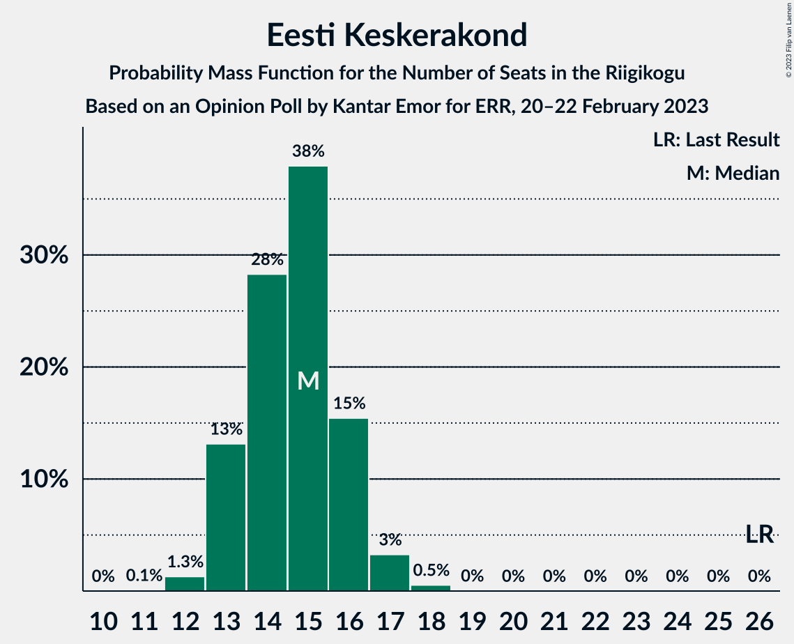

| Number of Seats | Probability | Accumulated | Special Marks |
|:---------------:|:-----------:|:-----------:|:-------------:|
| 11 | 0.1% | 100% |  |
| 12 | 1.3% | 99.9% |  |
| 13 | 13% | 98.6% |  |
| 14 | 28% | 85% |  |
| 15 | 38% | 57% | Median |
| 16 | 15% | 19% |  |
| 17 | 3% | 4% |  |
| 18 | 0.5% | 0.6% |  |
| 19 | 0% | 0% |  |
| 20 | 0% | 0% |  |
| 21 | 0% | 0% |  |
| 22 | 0% | 0% |  |
| 23 | 0% | 0% |  |
| 24 | 0% | 0% |  |
| 25 | 0% | 0% |  |
| 26 | 0% | 0% | Last Result |

### Eesti 200

*For a full overview of the results for this party, see the [Eesti 200](party-eesti200.html) page.*

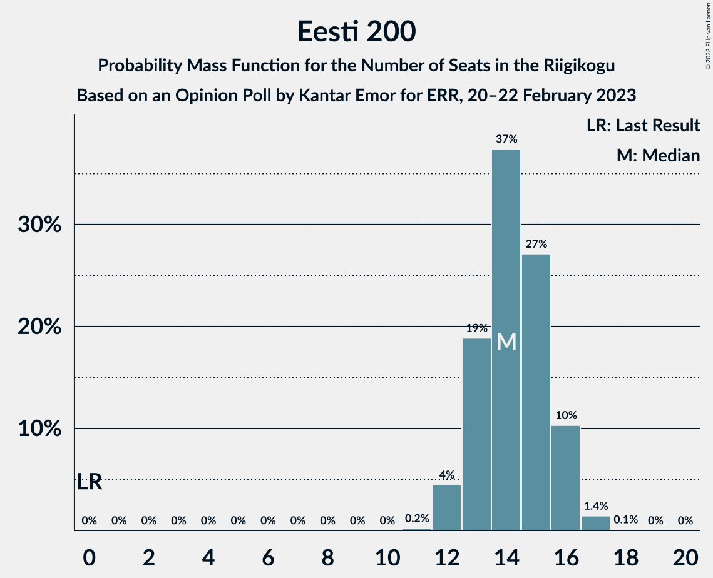

| Number of Seats | Probability | Accumulated | Special Marks |
|:---------------:|:-----------:|:-----------:|:-------------:|
| 0 | 0% | 100% | Last Result |
| 1 | 0% | 100% |  |
| 2 | 0% | 100% |  |
| 3 | 0% | 100% |  |
| 4 | 0% | 100% |  |
| 5 | 0% | 100% |  |
| 6 | 0% | 100% |  |
| 7 | 0% | 100% |  |
| 8 | 0% | 100% |  |
| 9 | 0% | 100% |  |
| 10 | 0% | 100% |  |
| 11 | 0.2% | 100% |  |
| 12 | 4% | 99.8% |  |
| 13 | 19% | 95% |  |
| 14 | 37% | 76% | Median |
| 15 | 27% | 39% |  |
| 16 | 10% | 12% |  |
| 17 | 1.4% | 2% |  |
| 18 | 0.1% | 0.1% |  |
| 19 | 0% | 0% |  |

### Sotsiaaldemokraatlik Erakond

*For a full overview of the results for this party, see the [Sotsiaaldemokraatlik Erakond](party-sotsiaaldemokraatlikerakond.html) page.*

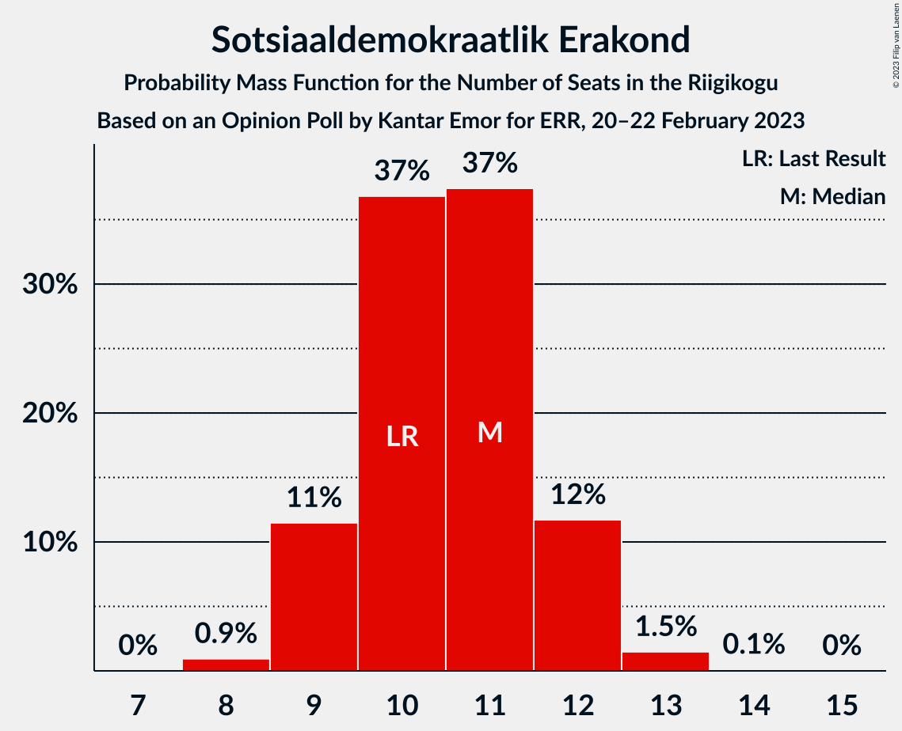

| Number of Seats | Probability | Accumulated | Special Marks |
|:---------------:|:-----------:|:-----------:|:-------------:|
| 8 | 0.9% | 100% |  |
| 9 | 11% | 99.0% |  |
| 10 | 37% | 88% | Last Result |
| 11 | 37% | 51% | Median |
| 12 | 12% | 13% |  |
| 13 | 1.5% | 2% |  |
| 14 | 0.1% | 0.1% |  |
| 15 | 0% | 0% |  |

### Erakond Isamaa

*For a full overview of the results for this party, see the [Erakond Isamaa](party-erakondisamaa.html) page.*

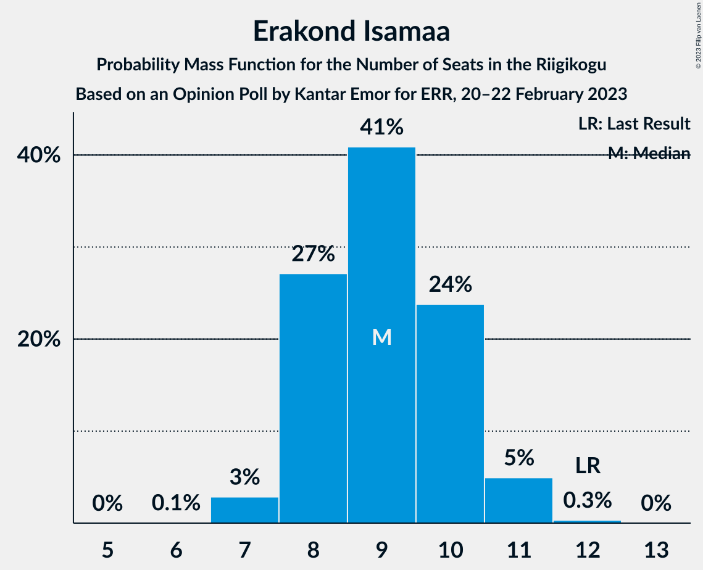

| Number of Seats | Probability | Accumulated | Special Marks |
|:---------------:|:-----------:|:-----------:|:-------------:|
| 6 | 0.1% | 100% |  |
| 7 | 3% | 99.9% |  |
| 8 | 27% | 97% |  |
| 9 | 41% | 70% | Median |
| 10 | 24% | 29% |  |
| 11 | 5% | 5% |  |
| 12 | 0.3% | 0.3% | Last Result |
| 13 | 0% | 0% |  |

### Erakond Eestimaa Rohelised

*For a full overview of the results for this party, see the [Erakond Eestimaa Rohelised](party-erakondeestimaarohelised.html) page.*

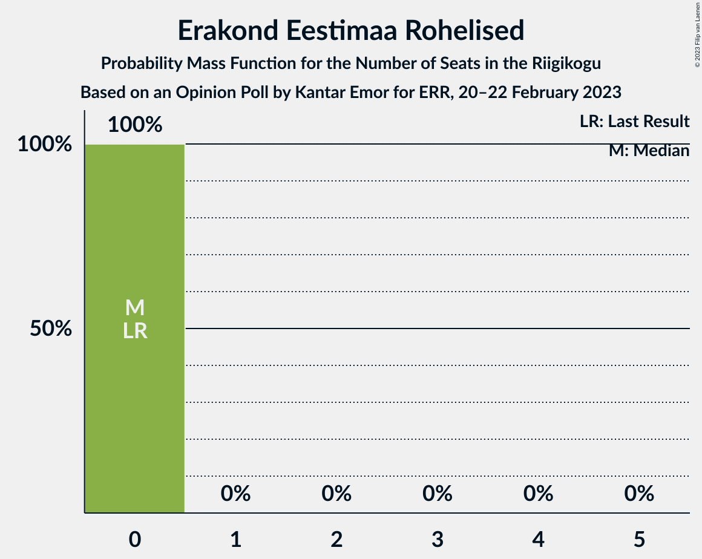

| Number of Seats | Probability | Accumulated | Special Marks |
|:---------------:|:-----------:|:-----------:|:-------------:|
| 0 | 100% | 100% | Last Result, Median |

### Erakond Parempoolsed

*For a full overview of the results for this party, see the [Erakond Parempoolsed](party-erakondparempoolsed.html) page.*

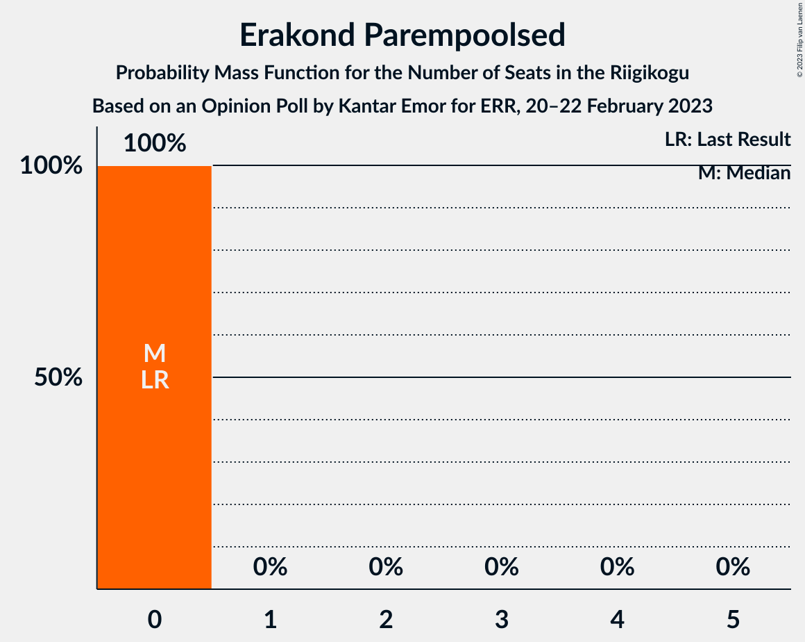

| Number of Seats | Probability | Accumulated | Special Marks |
|:---------------:|:-----------:|:-----------:|:-------------:|
| 0 | 100% | 100% | Last Result, Median |

## Coalitions

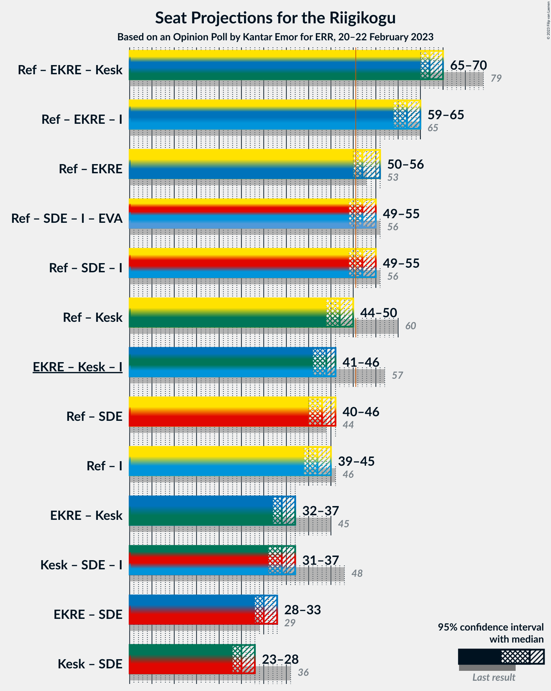

### Confidence Intervals

| Coalition | Last Result | Median | Majority? | 80% Confidence Interval | 90% Confidence Interval | 95% Confidence Interval | 99% Confidence Interval |
|:---------:|:-----------:|:------:|:---------:|:-----------------------:|:-----------------------:|:-----------------------:|:-----------------------:|
| Eesti Reformierakond – Eesti Konservatiivne Rahvaerakond – Eesti Keskerakond | 79 | 67 | 100% | 65–69 | 65–70 | 65–70 | 63–71 |
| Eesti Reformierakond – Eesti Konservatiivne Rahvaerakond – Erakond Isamaa | 65 | 62 | 100% | 60–64 | 59–64 | 59–65 | 58–65 |
| Eesti Reformierakond – Eesti Konservatiivne Rahvaerakond | 53 | 52 | 90% | 51–54 | 50–55 | 50–56 | 49–56 |
| Eesti Reformierakond – Sotsiaaldemokraatlik Erakond – Erakond Isamaa | 56 | 52 | 86% | 50–54 | 50–55 | 49–55 | 48–56 |
| Eesti Reformierakond – Eesti Keskerakond | 60 | 47 | 2% | 46–49 | 45–50 | 44–50 | 44–51 |
| Eesti Konservatiivne Rahvaerakond – Eesti Keskerakond – Erakond Isamaa | 57 | 44 | 0% | 42–45 | 41–46 | 41–46 | 40–47 |
| Eesti Reformierakond – Sotsiaaldemokraatlik Erakond | 44 | 43 | 0% | 41–45 | 41–46 | 40–46 | 39–47 |
| Eesti Reformierakond – Erakond Isamaa | 46 | 42 | 0% | 40–44 | 40–44 | 39–45 | 38–46 |
| Eesti Konservatiivne Rahvaerakond – Eesti Keskerakond | 45 | 34 | 0% | 33–36 | 32–37 | 32–37 | 31–38 |
| Eesti Keskerakond – Sotsiaaldemokraatlik Erakond – Erakond Isamaa | 48 | 34 | 0% | 32–36 | 32–37 | 31–37 | 30–38 |
| Eesti Konservatiivne Rahvaerakond – Sotsiaaldemokraatlik Erakond | 29 | 30 | 0% | 29–32 | 28–33 | 28–33 | 27–34 |
| Eesti Keskerakond – Sotsiaaldemokraatlik Erakond | 36 | 25 | 0% | 23–27 | 23–27 | 23–28 | 22–29 |

### Eesti Reformierakond – Eesti Konservatiivne Rahvaerakond – Eesti Keskerakond

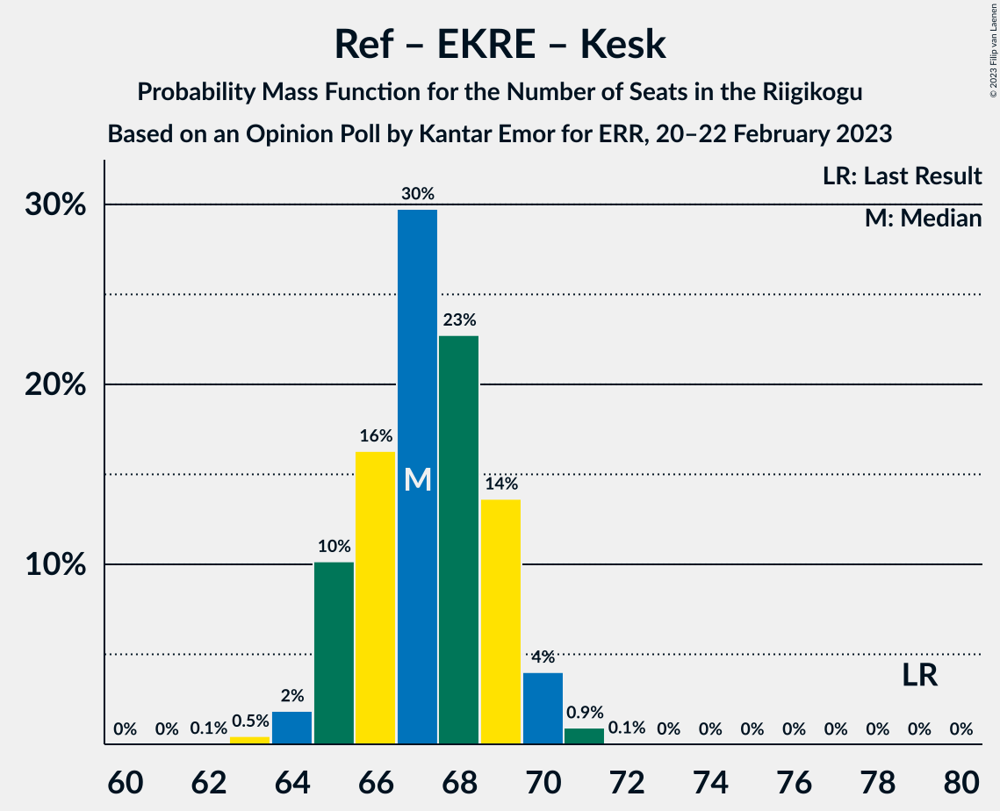

| Number of Seats | Probability | Accumulated | Special Marks |
|:---------------:|:-----------:|:-----------:|:-------------:|
| 62 | 0.1% | 100% |  |
| 63 | 0.5% | 99.9% |  |
| 64 | 2% | 99.5% |  |
| 65 | 10% | 98% |  |
| 66 | 16% | 87% |  |
| 67 | 30% | 71% |  |
| 68 | 23% | 41% | Median |
| 69 | 14% | 19% |  |
| 70 | 4% | 5% |  |
| 71 | 0.9% | 1.0% |  |
| 72 | 0.1% | 0.1% |  |
| 73 | 0% | 0% |  |
| 74 | 0% | 0% |  |
| 75 | 0% | 0% |  |
| 76 | 0% | 0% |  |
| 77 | 0% | 0% |  |
| 78 | 0% | 0% |  |
| 79 | 0% | 0% | Last Result |

### Eesti Reformierakond – Eesti Konservatiivne Rahvaerakond – Erakond Isamaa

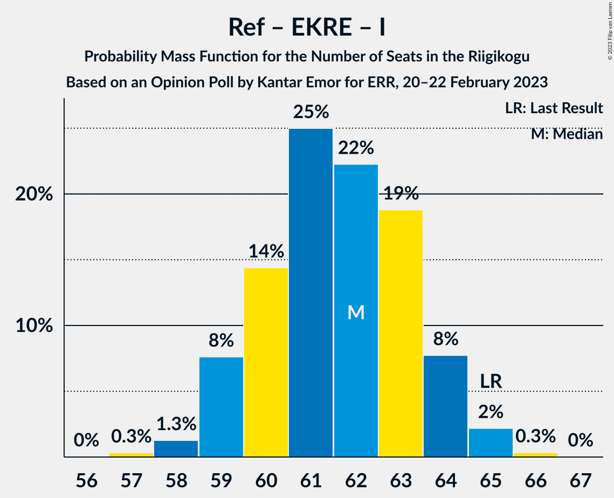

| Number of Seats | Probability | Accumulated | Special Marks |
|:---------------:|:-----------:|:-----------:|:-------------:|
| 57 | 0.3% | 100% |  |
| 58 | 1.3% | 99.6% |  |
| 59 | 8% | 98% |  |
| 60 | 14% | 91% |  |
| 61 | 25% | 76% |  |
| 62 | 22% | 51% | Median |
| 63 | 19% | 29% |  |
| 64 | 8% | 10% |  |
| 65 | 2% | 3% | Last Result |
| 66 | 0.3% | 0.4% |  |
| 67 | 0% | 0% |  |

### Eesti Reformierakond – Eesti Konservatiivne Rahvaerakond

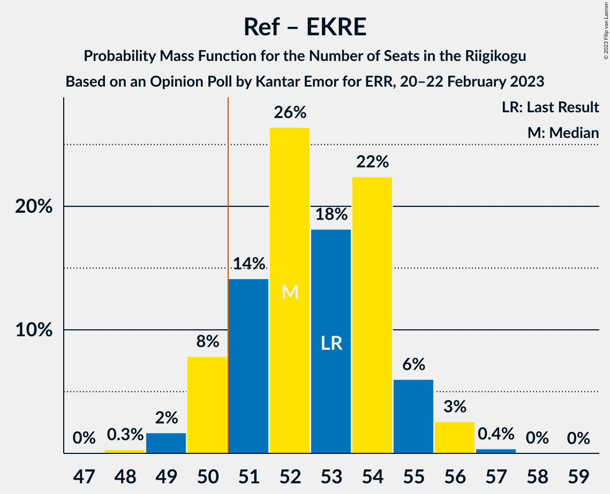

| Number of Seats | Probability | Accumulated | Special Marks |
|:---------------:|:-----------:|:-----------:|:-------------:|
| 48 | 0.3% | 100% |  |
| 49 | 2% | 99.6% |  |
| 50 | 8% | 98% |  |
| 51 | 14% | 90% | Majority |
| 52 | 26% | 76% |  |
| 53 | 18% | 50% | Last Result, Median |
| 54 | 22% | 31% |  |
| 55 | 6% | 9% |  |
| 56 | 3% | 3% |  |
| 57 | 0.4% | 0.4% |  |
| 58 | 0% | 0.1% |  |
| 59 | 0% | 0% |  |

### Eesti Reformierakond – Sotsiaaldemokraatlik Erakond – Erakond Isamaa

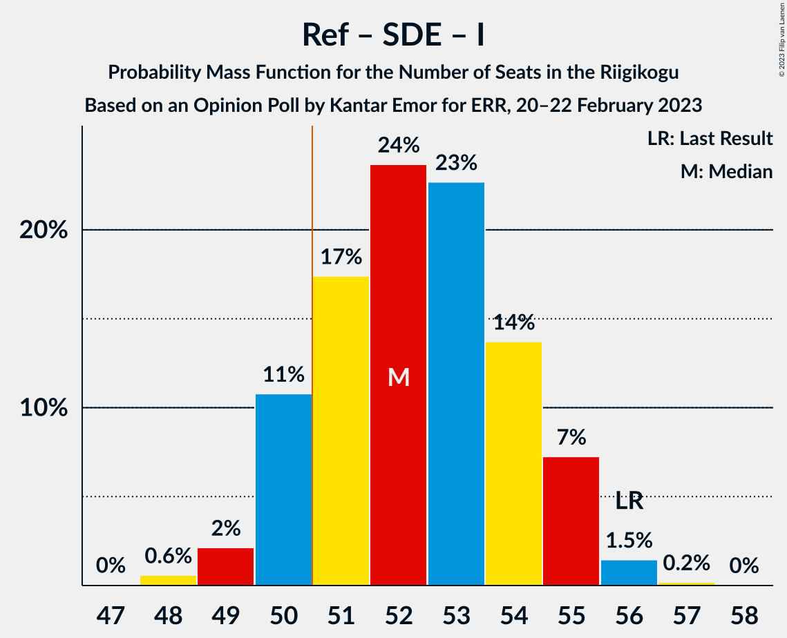

| Number of Seats | Probability | Accumulated | Special Marks |
|:---------------:|:-----------:|:-----------:|:-------------:|
| 47 | 0% | 100% |  |
| 48 | 0.6% | 99.9% |  |
| 49 | 2% | 99.4% |  |
| 50 | 11% | 97% |  |
| 51 | 17% | 86% | Majority |
| 52 | 24% | 69% |  |
| 53 | 23% | 45% | Median |
| 54 | 14% | 23% |  |
| 55 | 7% | 9% |  |
| 56 | 1.5% | 2% | Last Result |
| 57 | 0.2% | 0.2% |  |
| 58 | 0% | 0% |  |

### Eesti Reformierakond – Eesti Keskerakond

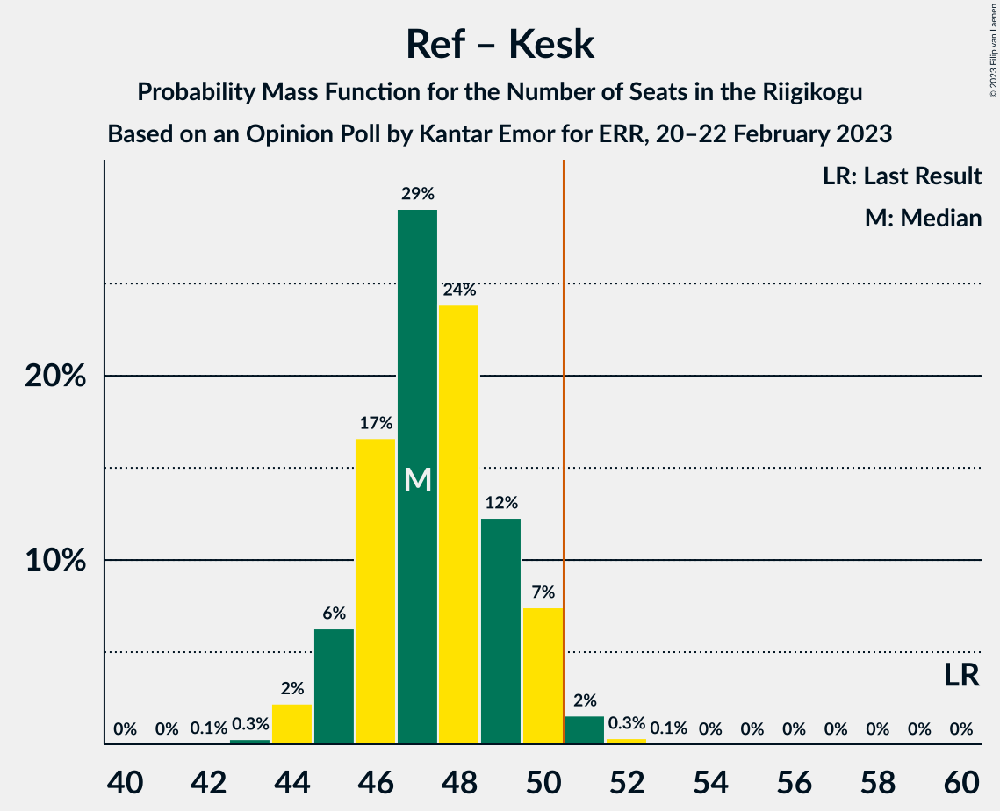

| Number of Seats | Probability | Accumulated | Special Marks |
|:---------------:|:-----------:|:-----------:|:-------------:|
| 42 | 0.1% | 100% |  |
| 43 | 0.3% | 99.9% |  |
| 44 | 2% | 99.7% |  |
| 45 | 6% | 97% |  |
| 46 | 17% | 91% |  |
| 47 | 29% | 75% |  |
| 48 | 24% | 46% | Median |
| 49 | 12% | 22% |  |
| 50 | 7% | 9% |  |
| 51 | 2% | 2% | Majority |
| 52 | 0.3% | 0.4% |  |
| 53 | 0.1% | 0.1% |  |
| 54 | 0% | 0% |  |
| 55 | 0% | 0% |  |
| 56 | 0% | 0% |  |
| 57 | 0% | 0% |  |
| 58 | 0% | 0% |  |
| 59 | 0% | 0% |  |
| 60 | 0% | 0% | Last Result |

### Eesti Konservatiivne Rahvaerakond – Eesti Keskerakond – Erakond Isamaa

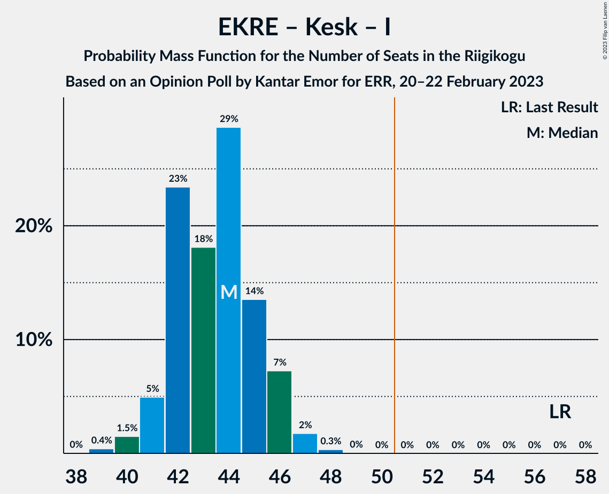

| Number of Seats | Probability | Accumulated | Special Marks |
|:---------------:|:-----------:|:-----------:|:-------------:|
| 39 | 0.4% | 100% |  |
| 40 | 1.5% | 99.6% |  |
| 41 | 5% | 98% |  |
| 42 | 23% | 93% |  |
| 43 | 18% | 70% |  |
| 44 | 29% | 52% | Median |
| 45 | 14% | 23% |  |
| 46 | 7% | 9% |  |
| 47 | 2% | 2% |  |
| 48 | 0.3% | 0.4% |  |
| 49 | 0% | 0.1% |  |
| 50 | 0% | 0% |  |
| 51 | 0% | 0% | Majority |
| 52 | 0% | 0% |  |
| 53 | 0% | 0% |  |
| 54 | 0% | 0% |  |
| 55 | 0% | 0% |  |
| 56 | 0% | 0% |  |
| 57 | 0% | 0% | Last Result |

### Eesti Reformierakond – Sotsiaaldemokraatlik Erakond

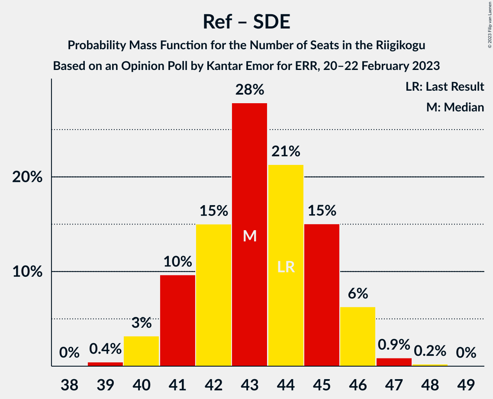

| Number of Seats | Probability | Accumulated | Special Marks |
|:---------------:|:-----------:|:-----------:|:-------------:|
| 38 | 0% | 100% |  |
| 39 | 0.4% | 99.9% |  |
| 40 | 3% | 99.5% |  |
| 41 | 10% | 96% |  |
| 42 | 15% | 87% |  |
| 43 | 28% | 72% |  |
| 44 | 21% | 44% | Last Result, Median |
| 45 | 15% | 22% |  |
| 46 | 6% | 7% |  |
| 47 | 0.9% | 1.1% |  |
| 48 | 0.2% | 0.3% |  |
| 49 | 0% | 0% |  |

### Eesti Reformierakond – Erakond Isamaa

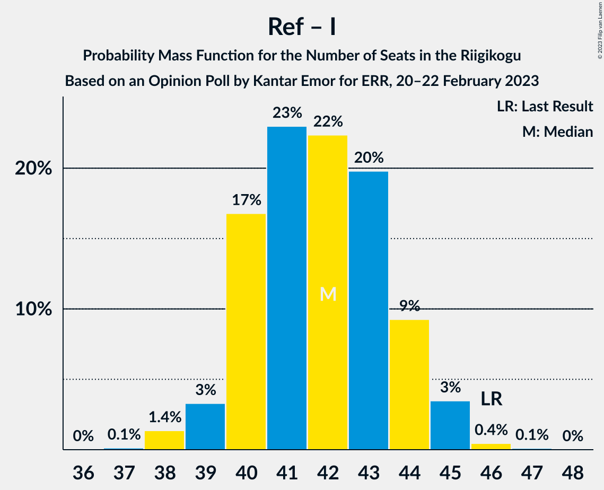

| Number of Seats | Probability | Accumulated | Special Marks |
|:---------------:|:-----------:|:-----------:|:-------------:|
| 37 | 0.1% | 100% |  |
| 38 | 1.4% | 99.9% |  |
| 39 | 3% | 98.5% |  |
| 40 | 17% | 95% |  |
| 41 | 23% | 78% |  |
| 42 | 22% | 55% | Median |
| 43 | 20% | 33% |  |
| 44 | 9% | 13% |  |
| 45 | 3% | 4% |  |
| 46 | 0.4% | 0.6% | Last Result |
| 47 | 0.1% | 0.1% |  |
| 48 | 0% | 0% |  |

### Eesti Konservatiivne Rahvaerakond – Eesti Keskerakond

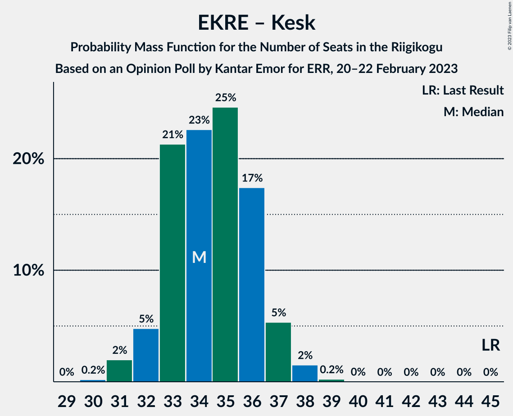

| Number of Seats | Probability | Accumulated | Special Marks |
|:---------------:|:-----------:|:-----------:|:-------------:|
| 30 | 0.2% | 100% |  |
| 31 | 2% | 99.8% |  |
| 32 | 5% | 98% |  |
| 33 | 21% | 93% |  |
| 34 | 23% | 72% |  |
| 35 | 25% | 49% | Median |
| 36 | 17% | 25% |  |
| 37 | 5% | 7% |  |
| 38 | 2% | 2% |  |
| 39 | 0.2% | 0.3% |  |
| 40 | 0% | 0% |  |
| 41 | 0% | 0% |  |
| 42 | 0% | 0% |  |
| 43 | 0% | 0% |  |
| 44 | 0% | 0% |  |
| 45 | 0% | 0% | Last Result |

### Eesti Keskerakond – Sotsiaaldemokraatlik Erakond – Erakond Isamaa

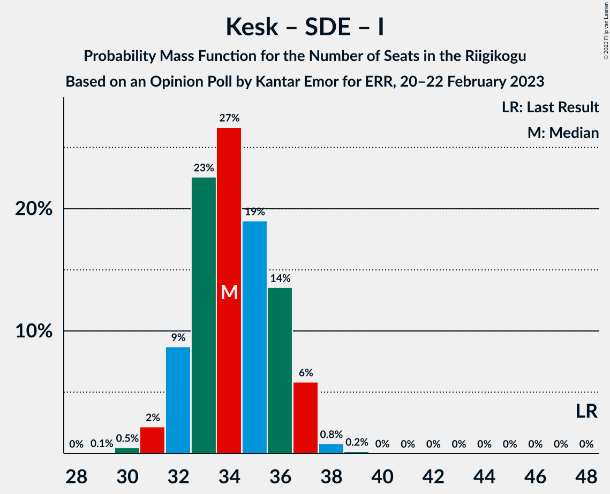

| Number of Seats | Probability | Accumulated | Special Marks |
|:---------------:|:-----------:|:-----------:|:-------------:|
| 29 | 0.1% | 100% |  |
| 30 | 0.5% | 99.9% |  |
| 31 | 2% | 99.5% |  |
| 32 | 9% | 97% |  |
| 33 | 23% | 89% |  |
| 34 | 27% | 66% |  |
| 35 | 19% | 39% | Median |
| 36 | 14% | 20% |  |
| 37 | 6% | 7% |  |
| 38 | 0.8% | 1.0% |  |
| 39 | 0.2% | 0.2% |  |
| 40 | 0% | 0% |  |
| 41 | 0% | 0% |  |
| 42 | 0% | 0% |  |
| 43 | 0% | 0% |  |
| 44 | 0% | 0% |  |
| 45 | 0% | 0% |  |
| 46 | 0% | 0% |  |
| 47 | 0% | 0% |  |
| 48 | 0% | 0% | Last Result |

### Eesti Konservatiivne Rahvaerakond – Sotsiaaldemokraatlik Erakond

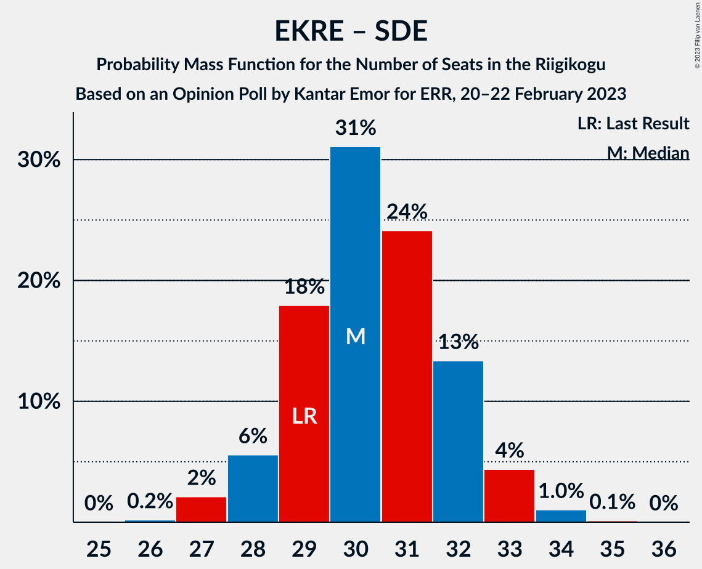

| Number of Seats | Probability | Accumulated | Special Marks |
|:---------------:|:-----------:|:-----------:|:-------------:|
| 26 | 0.2% | 100% |  |
| 27 | 2% | 99.8% |  |
| 28 | 6% | 98% |  |
| 29 | 18% | 92% | Last Result |
| 30 | 31% | 74% |  |
| 31 | 24% | 43% | Median |
| 32 | 13% | 19% |  |
| 33 | 4% | 6% |  |
| 34 | 1.0% | 1.2% |  |
| 35 | 0.1% | 0.1% |  |
| 36 | 0% | 0% |  |

### Eesti Keskerakond – Sotsiaaldemokraatlik Erakond

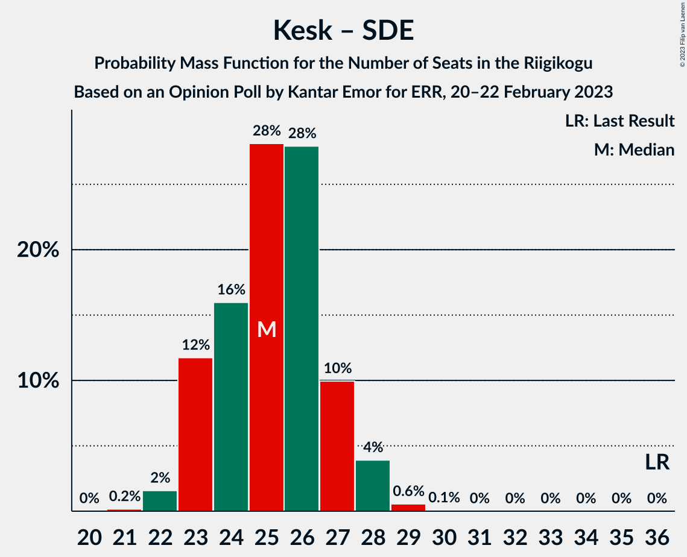

| Number of Seats | Probability | Accumulated | Special Marks |
|:---------------:|:-----------:|:-----------:|:-------------:|
| 21 | 0.2% | 100% |  |
| 22 | 2% | 99.8% |  |
| 23 | 12% | 98% |  |
| 24 | 16% | 87% |  |
| 25 | 28% | 71% |  |
| 26 | 28% | 42% | Median |
| 27 | 10% | 14% |  |
| 28 | 4% | 5% |  |
| 29 | 0.6% | 0.6% |  |
| 30 | 0.1% | 0.1% |  |
| 31 | 0% | 0% |  |
| 32 | 0% | 0% |  |
| 33 | 0% | 0% |  |
| 34 | 0% | 0% |  |
| 35 | 0% | 0% |  |
| 36 | 0% | 0% | Last Result |

## Technical Information

### Opinion Poll

+ **Polling firm:** Kantar Emor
+ **Commissioner(s):** ERR
+ **Fieldwork period:** 20–22 February 2023

### Calculations

+ **Sample size:** 1577
+ **Simulations done:** 1,048,576
+ **Error estimate:** 1.14%

