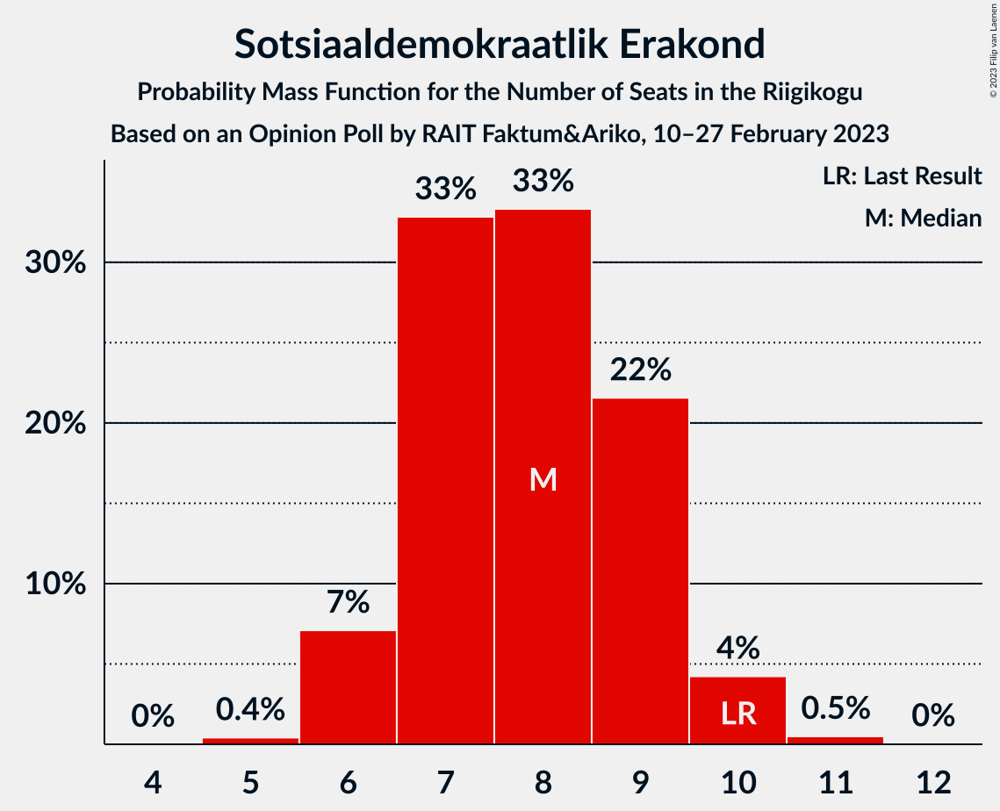

# Opinion Poll by RAIT Faktum&Ariko, 10–27 February 2023

<a href="#voting-intentions">Voting Intentions</a> | <a href="#seats">Seats</a> | <a href="#coalitions">Coalitions</a> | <a href="#technical-information">Technical Information</a>

## Voting Intentions

### Confidence Intervals

| Party | Last Result | Poll Result | 80% Confidence Interval | 90% Confidence Interval | 95% Confidence Interval | 99% Confidence Interval |
|:-----:|:-----------:|:-----------:|:-----------------------:|:-----------------------:|:-----------------------:|:-----------------------:|
| Eesti Reformierakond | 28.9% | 24.5% | 22.8–26.4% |22.3–26.9% |21.9–27.3% |21.1–28.2% |
| Eesti Konservatiivne Rahvaerakond | 17.8% | 22.4% | 20.8–24.2% |20.3–24.7% |19.9–25.2% |19.1–26.0% |
| Eesti Keskerakond | 23.1% | 17.3% | 15.8–19.0% |15.4–19.4% |15.0–19.8% |14.4–20.7% |
| Eesti 200 | 4.4% | 13.2% | 11.9–14.7% |11.6–15.2% |11.2–15.5% |10.6–16.3% |
| Sotsiaaldemokraatlik Erakond | 9.8% | 8.1% | 7.1–9.4% |6.8–9.7% |6.6–10.0% |6.1–10.7% |
| Erakond Isamaa | 11.4% | 8.1% | 7.1–9.4% |6.8–9.7% |6.6–10.0% |6.1–10.7% |
| Erakond Eestimaa Rohelised | 1.8% | 2.1% | 1.6–2.8% |1.5–3.0% |1.4–3.2% |1.2–3.6% |
| Erakond Parempoolsed | 0.0% | 1.0% | 0.7–1.6% |0.6–1.8% |0.6–1.9% |0.4–2.2% |

*Note:* The poll result column reflects the actual value used in the calculations. Published results may vary slightly, and in addition be rounded to fewer digits.

## Seats

### Confidence Intervals

| Party | Last Result | Median | 80% Confidence Interval | 90% Confidence Interval | 95% Confidence Interval | 99% Confidence Interval |
|:-----:|:-----------:|:------:|:-----------------------:|:-----------------------:|:-----------------------:|:-----------------------:|
| <a href="#eesti-reformierakond">Eesti Reformierakond</a> | 34 | 28 | 25–30 |25–30 |24–31 |23–32 |
| <a href="#eesti-konservatiivne-rahvaerakond">Eesti Konservatiivne Rahvaerakond</a> | 19 | 25 | 23–27 |22–28 |22–28 |21–29 |
| <a href="#eesti-keskerakond">Eesti Keskerakond</a> | 26 | 19 | 17–21 |16–21 |16–22 |15–23 |
| <a href="#eesti-200">Eesti 200</a> | 0 | 14 | 12–16 |12–16 |11–16 |11–17 |
| <a href="#sotsiaaldemokraatlik-erakond">Sotsiaaldemokraatlik Erakond</a> | 10 | 8 | 7–9 |6–9 |6–10 |6–11 |
| <a href="#erakond-isamaa">Erakond Isamaa</a> | 12 | 8 | 7–9 |6–10 |6–10 |6–11 |
| <a href="#erakond-eestimaa-rohelised">Erakond Eestimaa Rohelised</a> | 0 | 0 | 0 |0 |0 |0 |
| <a href="#erakond-parempoolsed">Erakond Parempoolsed</a> | 0 | 0 | 0 |0 |0 |0 |

### Eesti Reformierakond

*For a full overview of the results for this party, see the [Eesti Reformierakond](party-eestireformierakond.html) page.*

| Number of Seats | Probability | Accumulated | Special Marks |
|:---------------:|:-----------:|:-----------:|:-------------:|
| 22 | 0.1% | 100% |  |
| 23 | 0.5% | 99.9% |  |
| 24 | 3% | 99.5% |  |
| 25 | 8% | 97% |  |
| 26 | 13% | 89% |  |
| 27 | 24% | 76% |  |
| 28 | 22% | 52% | Median |
| 29 | 17% | 31% |  |
| 30 | 9% | 14% |  |
| 31 | 3% | 4% |  |
| 32 | 1.2% | 1.4% |  |
| 33 | 0.2% | 0.2% |  |
| 34 | 0% | 0% | Last Result |

### Eesti Konservatiivne Rahvaerakond

*For a full overview of the results for this party, see the [Eesti Konservatiivne Rahvaerakond](party-eestikonservatiivnerahvaerakond.html) page.*

| Number of Seats | Probability | Accumulated | Special Marks |
|:---------------:|:-----------:|:-----------:|:-------------:|
| 19 | 0% | 100% | Last Result |
| 20 | 0.2% | 100% |  |
| 21 | 1.2% | 99.8% |  |
| 22 | 4% | 98.6% |  |
| 23 | 11% | 95% |  |
| 24 | 18% | 84% |  |
| 25 | 24% | 65% | Median |
| 26 | 22% | 42% |  |
| 27 | 12% | 20% |  |
| 28 | 6% | 8% |  |
| 29 | 1.3% | 2% |  |
| 30 | 0.4% | 0.4% |  |
| 31 | 0.1% | 0.1% |  |
| 32 | 0% | 0% |  |

### Eesti Keskerakond

*For a full overview of the results for this party, see the [Eesti Keskerakond](party-eestikeskerakond.html) page.*

| Number of Seats | Probability | Accumulated | Special Marks |
|:---------------:|:-----------:|:-----------:|:-------------:|
| 14 | 0.1% | 100% |  |
| 15 | 0.9% | 99.9% |  |
| 16 | 4% | 99.1% |  |
| 17 | 14% | 95% |  |
| 18 | 23% | 81% |  |
| 19 | 29% | 58% | Median |
| 20 | 16% | 28% |  |
| 21 | 9% | 12% |  |
| 22 | 2% | 3% |  |
| 23 | 0.4% | 0.5% |  |
| 24 | 0.1% | 0.1% |  |
| 25 | 0% | 0% |  |
| 26 | 0% | 0% | Last Result |

### Eesti 200

*For a full overview of the results for this party, see the [Eesti 200](party-eesti200.html) page.*

| Number of Seats | Probability | Accumulated | Special Marks |
|:---------------:|:-----------:|:-----------:|:-------------:|
| 0 | 0% | 100% | Last Result |
| 1 | 0% | 100% |  |
| 2 | 0% | 100% |  |
| 3 | 0% | 100% |  |
| 4 | 0% | 100% |  |
| 5 | 0% | 100% |  |
| 6 | 0% | 100% |  |
| 7 | 0% | 100% |  |
| 8 | 0% | 100% |  |
| 9 | 0% | 100% |  |
| 10 | 0.2% | 100% |  |
| 11 | 3% | 99.7% |  |
| 12 | 13% | 97% |  |
| 13 | 23% | 84% |  |
| 14 | 34% | 61% | Median |
| 15 | 15% | 27% |  |
| 16 | 10% | 12% |  |
| 17 | 2% | 2% |  |
| 18 | 0.2% | 0.3% |  |
| 19 | 0% | 0% |  |

### Sotsiaaldemokraatlik Erakond

*For a full overview of the results for this party, see the [Sotsiaaldemokraatlik Erakond](party-sotsiaaldemokraatlikerakond.html) page.*

| Number of Seats | Probability | Accumulated | Special Marks |
|:---------------:|:-----------:|:-----------:|:-------------:|
| 5 | 0.4% | 100% |  |
| 6 | 7% | 99.6% |  |
| 7 | 33% | 92% |  |
| 8 | 33% | 60% | Median |
| 9 | 22% | 26% |  |
| 10 | 4% | 5% | Last Result |
| 11 | 0.5% | 0.5% |  |
| 12 | 0% | 0% |  |

### Erakond Isamaa

*For a full overview of the results for this party, see the [Erakond Isamaa](party-erakondisamaa.html) page.*

| Number of Seats | Probability | Accumulated | Special Marks |
|:---------------:|:-----------:|:-----------:|:-------------:|
| 5 | 0.5% | 100% |  |
| 6 | 7% | 99.5% |  |
| 7 | 32% | 92% |  |
| 8 | 37% | 61% | Median |
| 9 | 18% | 23% |  |
| 10 | 5% | 5% |  |
| 11 | 0.5% | 0.5% |  |
| 12 | 0% | 0% | Last Result |

### Erakond Eestimaa Rohelised

*For a full overview of the results for this party, see the [Erakond Eestimaa Rohelised](party-erakondeestimaarohelised.html) page.*

| Number of Seats | Probability | Accumulated | Special Marks |
|:---------------:|:-----------:|:-----------:|:-------------:|
| 0 | 100% | 100% | Last Result, Median |

### Erakond Parempoolsed

*For a full overview of the results for this party, see the [Erakond Parempoolsed](party-erakondparempoolsed.html) page.*

| Number of Seats | Probability | Accumulated | Special Marks |
|:---------------:|:-----------:|:-----------:|:-------------:|
| 0 | 100% | 100% | Last Result, Median |

## Coalitions

### Confidence Intervals

| Coalition | Last Result | Median | Majority? | 80% Confidence Interval | 90% Confidence Interval | 95% Confidence Interval | 99% Confidence Interval |
|:---------:|:-----------:|:------:|:---------:|:-----------------------:|:-----------------------:|:-----------------------:|:-----------------------:|
| Eesti Reformierakond – Eesti Konservatiivne Rahvaerakond – Eesti Keskerakond | 79 | 72 | 100% | 69–74 | 69–74 | 68–75 | 67–76 |
| Eesti Reformierakond – Eesti Konservatiivne Rahvaerakond – Erakond Isamaa | 65 | 61 | 100% | 58–63 | 57–64 | 57–64 | 56–65 |
| Eesti Reformierakond – Eesti Konservatiivne Rahvaerakond | 53 | 53 | 87% | 50–55 | 49–56 | 49–56 | 48–58 |
| Eesti Konservatiivne Rahvaerakond – Eesti Keskerakond – Erakond Isamaa | 57 | 52 | 75% | 49–54 | 49–55 | 48–55 | 47–57 |
| Eesti Reformierakond – Eesti Keskerakond | 60 | 46 | 2% | 44–49 | 43–50 | 43–50 | 41–51 |
| Eesti Konservatiivne Rahvaerakond – Eesti Keskerakond | 45 | 44 | 0% | 42–46 | 41–47 | 40–47 | 39–49 |
| Eesti Reformierakond – Erakond Isamaa – Sotsiaaldemokraatlik Erakond | 56 | 43 | 0% | 41–45 | 41–46 | 40–47 | 39–48 |
| Eesti Reformierakond – Erakond Isamaa | 46 | 35 | 0% | 33–38 | 33–38 | 32–39 | 31–40 |
| Eesti Reformierakond – Sotsiaaldemokraatlik Erakond | 44 | 35 | 0% | 33–38 | 33–38 | 32–39 | 31–40 |
| Eesti Keskerakond – Erakond Isamaa – Sotsiaaldemokraatlik Erakond | 48 | 34 | 0% | 32–37 | 32–37 | 31–38 | 30–39 |
| Eesti Konservatiivne Rahvaerakond – Sotsiaaldemokraatlik Erakond | 29 | 33 | 0% | 31–35 | 30–36 | 29–36 | 28–38 |
| Eesti Keskerakond – Sotsiaaldemokraatlik Erakond | 36 | 27 | 0% | 24–29 | 24–29 | 23–30 | 22–31 |

### Eesti Reformierakond – Eesti Konservatiivne Rahvaerakond – Eesti Keskerakond

| Number of Seats | Probability | Accumulated | Special Marks |
|:---------------:|:-----------:|:-----------:|:-------------:|
| 66 | 0.2% | 100% |  |
| 67 | 1.0% | 99.8% |  |
| 68 | 3% | 98.7% |  |
| 69 | 8% | 96% |  |
| 70 | 19% | 88% |  |
| 71 | 18% | 69% |  |
| 72 | 22% | 52% | Median |
| 73 | 16% | 29% |  |
| 74 | 9% | 13% |  |
| 75 | 4% | 5% |  |
| 76 | 1.2% | 1.4% |  |
| 77 | 0.1% | 0.2% |  |
| 78 | 0% | 0% |  |
| 79 | 0% | 0% | Last Result |

### Eesti Reformierakond – Eesti Konservatiivne Rahvaerakond – Erakond Isamaa

| Number of Seats | Probability | Accumulated | Special Marks |
|:---------------:|:-----------:|:-----------:|:-------------:|
| 54 | 0.1% | 100% |  |
| 55 | 0.3% | 99.9% |  |
| 56 | 1.2% | 99.7% |  |
| 57 | 4% | 98% |  |
| 58 | 8% | 95% |  |
| 59 | 14% | 87% |  |
| 60 | 21% | 73% |  |
| 61 | 22% | 52% | Median |
| 62 | 15% | 30% |  |
| 63 | 10% | 16% |  |
| 64 | 4% | 5% |  |
| 65 | 1.1% | 1.4% | Last Result |
| 66 | 0.3% | 0.3% |  |
| 67 | 0% | 0% |  |

### Eesti Reformierakond – Eesti Konservatiivne Rahvaerakond

| Number of Seats | Probability | Accumulated | Special Marks |
|:---------------:|:-----------:|:-----------:|:-------------:|
| 46 | 0% | 100% |  |
| 47 | 0.3% | 99.9% |  |
| 48 | 1.1% | 99.7% |  |
| 49 | 4% | 98.6% |  |
| 50 | 8% | 95% |  |
| 51 | 12% | 87% | Majority |
| 52 | 20% | 75% |  |
| 53 | 17% | 55% | Last Result, Median |
| 54 | 20% | 38% |  |
| 55 | 10% | 18% |  |
| 56 | 6% | 8% |  |
| 57 | 2% | 2% |  |
| 58 | 0.5% | 0.6% |  |
| 59 | 0.1% | 0.1% |  |
| 60 | 0% | 0% |  |

### Eesti Konservatiivne Rahvaerakond – Eesti Keskerakond – Erakond Isamaa

| Number of Seats | Probability | Accumulated | Special Marks |
|:---------------:|:-----------:|:-----------:|:-------------:|
| 45 | 0% | 100% |  |
| 46 | 0.3% | 99.9% |  |
| 47 | 0.8% | 99.7% |  |
| 48 | 3% | 98.8% |  |
| 49 | 7% | 96% |  |
| 50 | 14% | 89% |  |
| 51 | 19% | 75% | Majority |
| 52 | 24% | 55% | Median |
| 53 | 15% | 31% |  |
| 54 | 9% | 17% |  |
| 55 | 5% | 7% |  |
| 56 | 1.5% | 2% |  |
| 57 | 0.4% | 0.5% | Last Result |
| 58 | 0.1% | 0.1% |  |
| 59 | 0% | 0% |  |

### Eesti Reformierakond – Eesti Keskerakond

| Number of Seats | Probability | Accumulated | Special Marks |
|:---------------:|:-----------:|:-----------:|:-------------:|
| 40 | 0.1% | 100% |  |
| 41 | 0.5% | 99.9% |  |
| 42 | 2% | 99.4% |  |
| 43 | 4% | 98% |  |
| 44 | 10% | 93% |  |
| 45 | 17% | 84% |  |
| 46 | 20% | 67% |  |
| 47 | 20% | 47% | Median |
| 48 | 12% | 27% |  |
| 49 | 9% | 15% |  |
| 50 | 4% | 6% |  |
| 51 | 1.2% | 2% | Majority |
| 52 | 0.4% | 0.5% |  |
| 53 | 0.1% | 0.1% |  |
| 54 | 0% | 0% |  |
| 55 | 0% | 0% |  |
| 56 | 0% | 0% |  |
| 57 | 0% | 0% |  |
| 58 | 0% | 0% |  |
| 59 | 0% | 0% |  |
| 60 | 0% | 0% | Last Result |

### Eesti Konservatiivne Rahvaerakond – Eesti Keskerakond

| Number of Seats | Probability | Accumulated | Special Marks |
|:---------------:|:-----------:|:-----------:|:-------------:|
| 38 | 0.2% | 100% |  |
| 39 | 0.6% | 99.8% |  |
| 40 | 2% | 99.2% |  |
| 41 | 6% | 97% |  |
| 42 | 13% | 91% |  |
| 43 | 21% | 79% |  |
| 44 | 22% | 58% | Median |
| 45 | 20% | 37% | Last Result |
| 46 | 9% | 17% |  |
| 47 | 6% | 8% |  |
| 48 | 1.4% | 2% |  |
| 49 | 0.4% | 0.5% |  |
| 50 | 0.1% | 0.1% |  |
| 51 | 0% | 0% | Majority |

### Eesti Reformierakond – Erakond Isamaa – Sotsiaaldemokraatlik Erakond

| Number of Seats | Probability | Accumulated | Special Marks |
|:---------------:|:-----------:|:-----------:|:-------------:|
| 37 | 0% | 100% |  |
| 38 | 0.3% | 99.9% |  |
| 39 | 0.8% | 99.6% |  |
| 40 | 3% | 98.9% |  |
| 41 | 11% | 96% |  |
| 42 | 19% | 85% |  |
| 43 | 21% | 66% |  |
| 44 | 22% | 46% | Median |
| 45 | 14% | 23% |  |
| 46 | 7% | 10% |  |
| 47 | 2% | 3% |  |
| 48 | 0.5% | 0.7% |  |
| 49 | 0.2% | 0.2% |  |
| 50 | 0% | 0.1% |  |
| 51 | 0% | 0% | Majority |
| 52 | 0% | 0% |  |
| 53 | 0% | 0% |  |
| 54 | 0% | 0% |  |
| 55 | 0% | 0% |  |
| 56 | 0% | 0% | Last Result |

### Eesti Reformierakond – Erakond Isamaa

| Number of Seats | Probability | Accumulated | Special Marks |
|:---------------:|:-----------:|:-----------:|:-------------:|
| 30 | 0.1% | 100% |  |
| 31 | 0.9% | 99.8% |  |
| 32 | 3% | 98.9% |  |
| 33 | 9% | 96% |  |
| 34 | 15% | 87% |  |
| 35 | 25% | 72% |  |
| 36 | 20% | 47% | Median |
| 37 | 15% | 27% |  |
| 38 | 8% | 12% |  |
| 39 | 3% | 4% |  |
| 40 | 0.9% | 1.1% |  |
| 41 | 0.1% | 0.2% |  |
| 42 | 0% | 0% |  |
| 43 | 0% | 0% |  |
| 44 | 0% | 0% |  |
| 45 | 0% | 0% |  |
| 46 | 0% | 0% | Last Result |

### Eesti Reformierakond – Sotsiaaldemokraatlik Erakond

| Number of Seats | Probability | Accumulated | Special Marks |
|:---------------:|:-----------:|:-----------:|:-------------:|
| 30 | 0.1% | 100% |  |
| 31 | 0.8% | 99.8% |  |
| 32 | 3% | 99.0% |  |
| 33 | 8% | 95% |  |
| 34 | 16% | 88% |  |
| 35 | 23% | 72% |  |
| 36 | 22% | 49% | Median |
| 37 | 14% | 26% |  |
| 38 | 8% | 12% |  |
| 39 | 3% | 4% |  |
| 40 | 0.7% | 1.0% |  |
| 41 | 0.2% | 0.3% |  |
| 42 | 0% | 0% |  |
| 43 | 0% | 0% |  |
| 44 | 0% | 0% | Last Result |

### Eesti Keskerakond – Erakond Isamaa – Sotsiaaldemokraatlik Erakond

| Number of Seats | Probability | Accumulated | Special Marks |
|:---------------:|:-----------:|:-----------:|:-------------:|
| 29 | 0.2% | 100% |  |
| 30 | 1.3% | 99.8% |  |
| 31 | 3% | 98% |  |
| 32 | 11% | 96% |  |
| 33 | 18% | 84% |  |
| 34 | 18% | 66% |  |
| 35 | 21% | 48% | Median |
| 36 | 12% | 27% |  |
| 37 | 11% | 15% |  |
| 38 | 2% | 4% |  |
| 39 | 2% | 2% |  |
| 40 | 0.2% | 0.3% |  |
| 41 | 0.1% | 0.1% |  |
| 42 | 0% | 0% |  |
| 43 | 0% | 0% |  |
| 44 | 0% | 0% |  |
| 45 | 0% | 0% |  |
| 46 | 0% | 0% |  |
| 47 | 0% | 0% |  |
| 48 | 0% | 0% | Last Result |

### Eesti Konservatiivne Rahvaerakond – Sotsiaaldemokraatlik Erakond

| Number of Seats | Probability | Accumulated | Special Marks |
|:---------------:|:-----------:|:-----------:|:-------------:|
| 27 | 0.1% | 100% |  |
| 28 | 0.6% | 99.9% |  |
| 29 | 3% | 99.3% | Last Result |
| 30 | 5% | 97% |  |
| 31 | 12% | 91% |  |
| 32 | 17% | 79% |  |
| 33 | 23% | 62% | Median |
| 34 | 20% | 39% |  |
| 35 | 11% | 19% |  |
| 36 | 5% | 8% |  |
| 37 | 2% | 2% |  |
| 38 | 0.4% | 0.5% |  |
| 39 | 0.1% | 0.1% |  |
| 40 | 0% | 0% |  |

### Eesti Keskerakond – Sotsiaaldemokraatlik Erakond

| Number of Seats | Probability | Accumulated | Special Marks |
|:---------------:|:-----------:|:-----------:|:-------------:|
| 21 | 0.1% | 100% |  |
| 22 | 0.6% | 99.9% |  |
| 23 | 2% | 99.3% |  |
| 24 | 8% | 97% |  |
| 25 | 15% | 89% |  |
| 26 | 23% | 74% |  |
| 27 | 21% | 51% | Median |
| 28 | 16% | 29% |  |
| 29 | 9% | 13% |  |
| 30 | 3% | 4% |  |
| 31 | 0.9% | 1.2% |  |
| 32 | 0.2% | 0.2% |  |
| 33 | 0% | 0% |  |
| 34 | 0% | 0% |  |
| 35 | 0% | 0% |  |
| 36 | 0% | 0% | Last Result |

## Technical Information

### Opinion Poll

+ **Polling firm:** RAIT Faktum&Ariko
+ **Commissioner(s):** —
+ **Fieldwork period:** 10–27 February 2023

### Calculations

+ **Sample size:** 959
+ **Simulations done:** 1,048,576
+ **Error estimate:** 1.51%

