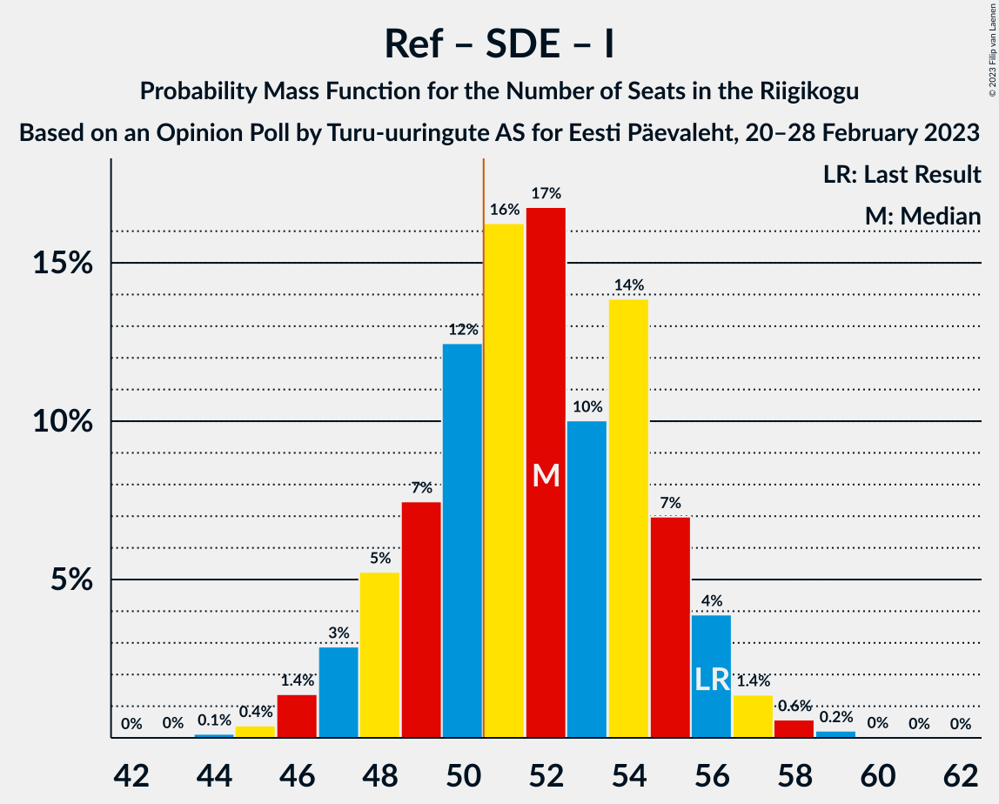

# Opinion Poll by Turu-uuringute AS for Eesti Päevaleht, 20–28 February 2023

<a href="#voting-intentions">Voting Intentions</a> | <a href="#seats">Seats</a> | <a href="#coalitions">Coalitions</a> | <a href="#technical-information">Technical Information</a>

## Voting Intentions

### Confidence Intervals

| Party | Last Result | Poll Result | 80% Confidence Interval | 90% Confidence Interval | 95% Confidence Interval | 99% Confidence Interval |
|:-----:|:-----------:|:-----------:|:-----------------------:|:-----------------------:|:-----------------------:|:-----------------------:|
| Eesti Reformierakond | 28.9% | 30.0% | 27.7–32.5% |27.0–33.2% |26.5–33.8% |25.4–35.0% |
| Eesti Keskerakond | 23.1% | 17.0% | 15.2–19.1% |14.6–19.7% |14.2–20.2% |13.4–21.3% |
| Eesti Konservatiivne Rahvaerakond | 17.8% | 15.0% | 13.3–17.0% |12.8–17.6% |12.4–18.1% |11.6–19.1% |
| Eesti 200 | 4.4% | 14.0% | 12.3–16.0% |11.8–16.5% |11.4–17.0% |10.7–18.0% |
| Sotsiaaldemokraatlik Erakond | 9.8% | 9.0% | 7.7–10.7% |7.3–11.1% |7.0–11.6% |6.4–12.4% |
| Erakond Isamaa | 11.4% | 8.0% | 6.7–9.6% |6.4–10.1% |6.1–10.5% |5.5–11.3% |
| Erakond Parempoolsed | 0.0% | 3.0% | 2.3–4.1% |2.1–4.4% |1.9–4.7% |1.6–5.3% |
| Erakond Eestimaa Rohelised | 1.8% | 2.0% | 1.4–3.0% |1.3–3.2% |1.1–3.5% |0.9–4.0% |

*Note:* The poll result column reflects the actual value used in the calculations. Published results may vary slightly, and in addition be rounded to fewer digits.

## Seats

### Confidence Intervals

| Party | Last Result | Median | 80% Confidence Interval | 90% Confidence Interval | 95% Confidence Interval | 99% Confidence Interval |
|:-----:|:-----------:|:------:|:-----------------------:|:-----------------------:|:-----------------------:|:-----------------------:|
| <a href="#eesti-reformierakond">Eesti Reformierakond</a> | 34 | 35 | 32–38 |31–39 |30–40 |29–41 |
| <a href="#eesti-keskerakond">Eesti Keskerakond</a> | 26 | 18 | 16–21 |15–22 |15–22 |14–24 |
| <a href="#eesti-konservatiivne-rahvaerakond">Eesti Konservatiivne Rahvaerakond</a> | 19 | 16 | 14–18 |13–19 |13–20 |12–21 |
| <a href="#eesti-200">Eesti 200</a> | 0 | 15 | 13–17 |12–18 |12–18 |11–20 |
| <a href="#sotsiaaldemokraatlik-erakond">Sotsiaaldemokraatlik Erakond</a> | 10 | 9 | 7–11 |7–11 |6–12 |6–13 |
| <a href="#erakond-isamaa">Erakond Isamaa</a> | 12 | 8 | 6–9 |6–10 |6–10 |5–11 |
| <a href="#erakond-parempoolsed">Erakond Parempoolsed</a> | 0 | 0 | 0 |0 |0 |0–4 |
| <a href="#erakond-eestimaa-rohelised">Erakond Eestimaa Rohelised</a> | 0 | 0 | 0 |0 |0 |0 |

### Eesti Reformierakond

*For a full overview of the results for this party, see the [Eesti Reformierakond](party-eestireformierakond.html) page.*

| Number of Seats | Probability | Accumulated | Special Marks |
|:---------------:|:-----------:|:-----------:|:-------------:|
| 28 | 0.2% | 100% |  |
| 29 | 0.7% | 99.7% |  |
| 30 | 2% | 99.0% |  |
| 31 | 4% | 97% |  |
| 32 | 8% | 93% |  |
| 33 | 10% | 85% |  |
| 34 | 16% | 75% | Last Result |
| 35 | 21% | 59% | Median |
| 36 | 14% | 38% |  |
| 37 | 9% | 24% |  |
| 38 | 8% | 15% |  |
| 39 | 4% | 7% |  |
| 40 | 2% | 3% |  |
| 41 | 0.8% | 1.0% |  |
| 42 | 0.2% | 0.3% |  |
| 43 | 0.1% | 0.1% |  |
| 44 | 0% | 0% |  |

### Eesti Keskerakond

*For a full overview of the results for this party, see the [Eesti Keskerakond](party-eestikeskerakond.html) page.*

| Number of Seats | Probability | Accumulated | Special Marks |
|:---------------:|:-----------:|:-----------:|:-------------:|
| 13 | 0.2% | 100% |  |
| 14 | 1.1% | 99.8% |  |
| 15 | 4% | 98.7% |  |
| 16 | 9% | 95% |  |
| 17 | 15% | 85% |  |
| 18 | 20% | 70% | Median |
| 19 | 21% | 50% |  |
| 20 | 15% | 29% |  |
| 21 | 8% | 14% |  |
| 22 | 4% | 6% |  |
| 23 | 1.3% | 2% |  |
| 24 | 0.5% | 0.7% |  |
| 25 | 0.1% | 0.1% |  |
| 26 | 0% | 0% | Last Result |

### Eesti Konservatiivne Rahvaerakond

*For a full overview of the results for this party, see the [Eesti Konservatiivne Rahvaerakond](party-eestikonservatiivnerahvaerakond.html) page.*

| Number of Seats | Probability | Accumulated | Special Marks |
|:---------------:|:-----------:|:-----------:|:-------------:|
| 11 | 0.3% | 100% |  |
| 12 | 2% | 99.7% |  |
| 13 | 6% | 98% |  |
| 14 | 13% | 92% |  |
| 15 | 19% | 80% |  |
| 16 | 26% | 61% | Median |
| 17 | 15% | 35% |  |
| 18 | 11% | 20% |  |
| 19 | 6% | 8% | Last Result |
| 20 | 2% | 3% |  |
| 21 | 0.7% | 0.8% |  |
| 22 | 0.2% | 0.2% |  |
| 23 | 0% | 0% |  |

### Eesti 200

*For a full overview of the results for this party, see the [Eesti 200](party-eesti200.html) page.*

| Number of Seats | Probability | Accumulated | Special Marks |
|:---------------:|:-----------:|:-----------:|:-------------:|
| 0 | 0% | 100% | Last Result |
| 1 | 0% | 100% |  |
| 2 | 0% | 100% |  |
| 3 | 0% | 100% |  |
| 4 | 0% | 100% |  |
| 5 | 0% | 100% |  |
| 6 | 0% | 100% |  |
| 7 | 0% | 100% |  |
| 8 | 0% | 100% |  |
| 9 | 0% | 100% |  |
| 10 | 0.3% | 100% |  |
| 11 | 2% | 99.7% |  |
| 12 | 7% | 98% |  |
| 13 | 15% | 91% |  |
| 14 | 23% | 76% |  |
| 15 | 22% | 53% | Median |
| 16 | 15% | 31% |  |
| 17 | 9% | 16% |  |
| 18 | 5% | 7% |  |
| 19 | 2% | 2% |  |
| 20 | 0.4% | 0.5% |  |
| 21 | 0.1% | 0.1% |  |
| 22 | 0% | 0% |  |

### Sotsiaaldemokraatlik Erakond

*For a full overview of the results for this party, see the [Sotsiaaldemokraatlik Erakond](party-sotsiaaldemokraatlikerakond.html) page.*

| Number of Seats | Probability | Accumulated | Special Marks |
|:---------------:|:-----------:|:-----------:|:-------------:|
| 5 | 0.2% | 100% |  |
| 6 | 2% | 99.8% |  |
| 7 | 10% | 97% |  |
| 8 | 25% | 87% |  |
| 9 | 28% | 62% | Median |
| 10 | 21% | 34% | Last Result |
| 11 | 9% | 13% |  |
| 12 | 4% | 4% |  |
| 13 | 0.7% | 0.8% |  |
| 14 | 0.1% | 0.1% |  |
| 15 | 0% | 0% |  |

### Erakond Isamaa

*For a full overview of the results for this party, see the [Erakond Isamaa](party-erakondisamaa.html) page.*

| Number of Seats | Probability | Accumulated | Special Marks |
|:---------------:|:-----------:|:-----------:|:-------------:|
| 0 | 0.1% | 100% |  |
| 1 | 0% | 99.9% |  |
| 2 | 0% | 99.9% |  |
| 3 | 0% | 99.9% |  |
| 4 | 0.1% | 99.9% |  |
| 5 | 2% | 99.8% |  |
| 6 | 14% | 98% |  |
| 7 | 26% | 84% |  |
| 8 | 28% | 58% | Median |
| 9 | 20% | 29% |  |
| 10 | 7% | 10% |  |
| 11 | 2% | 2% |  |
| 12 | 0.4% | 0.4% | Last Result |
| 13 | 0% | 0.1% |  |
| 14 | 0% | 0% |  |

### Erakond Parempoolsed

*For a full overview of the results for this party, see the [Erakond Parempoolsed](party-erakondparempoolsed.html) page.*

| Number of Seats | Probability | Accumulated | Special Marks |
|:---------------:|:-----------:|:-----------:|:-------------:|
| 0 | 99.1% | 100% | Last Result, Median |
| 1 | 0% | 0.9% |  |
| 2 | 0% | 0.9% |  |
| 3 | 0% | 0.9% |  |
| 4 | 0.4% | 0.9% |  |
| 5 | 0.4% | 0.5% |  |
| 6 | 0% | 0% |  |

### Erakond Eestimaa Rohelised

*For a full overview of the results for this party, see the [Erakond Eestimaa Rohelised](party-erakondeestimaarohelised.html) page.*

| Number of Seats | Probability | Accumulated | Special Marks |
|:---------------:|:-----------:|:-----------:|:-------------:|
| 0 | 100% | 100% | Last Result, Median |

## Coalitions

### Confidence Intervals

| Coalition | Last Result | Median | Majority? | 80% Confidence Interval | 90% Confidence Interval | 95% Confidence Interval | 99% Confidence Interval |
|:---------:|:-----------:|:------:|:---------:|:-----------------------:|:-----------------------:|:-----------------------:|:-----------------------:|
| Eesti Reformierakond – Eesti Keskerakond – Eesti Konservatiivne Rahvaerakond | 79 | 69 | 100% | 66–72 | 66–73 | 65–74 | 63–75 |
| Eesti Reformierakond – Eesti Konservatiivne Rahvaerakond – Erakond Isamaa | 65 | 59 | 100% | 56–62 | 55–63 | 54–64 | 53–65 |
| Eesti Reformierakond – Eesti Keskerakond | 60 | 54 | 89% | 50–57 | 49–57 | 49–58 | 47–59 |
| Eesti Reformierakond – Sotsiaaldemokraatlik Erakond – Erakond Isamaa | 56 | 52 | 70% | 48–55 | 48–56 | 47–56 | 45–58 |
| Eesti Reformierakond – Eesti Konservatiivne Rahvaerakond | 53 | 51 | 57% | 48–54 | 47–55 | 46–56 | 45–57 |
| Eesti Reformierakond – Sotsiaaldemokraatlik Erakond | 44 | 44 | 0.4% | 41–47 | 40–48 | 39–48 | 38–50 |
| Eesti Keskerakond – Eesti Konservatiivne Rahvaerakond – Erakond Isamaa | 57 | 42 | 0% | 39–45 | 38–46 | 38–47 | 36–49 |
| Eesti Reformierakond – Erakond Isamaa | 46 | 43 | 0.1% | 40–46 | 39–47 | 38–47 | 36–49 |
| Eesti Keskerakond – Sotsiaaldemokraatlik Erakond – Erakond Isamaa | 48 | 35 | 0% | 32–38 | 31–39 | 31–40 | 29–42 |
| Eesti Keskerakond – Eesti Konservatiivne Rahvaerakond | 45 | 34 | 0% | 32–37 | 31–38 | 30–39 | 29–41 |
| Eesti Keskerakond – Sotsiaaldemokraatlik Erakond | 36 | 27 | 0% | 25–30 | 24–31 | 23–32 | 22–33 |
| Eesti Konservatiivne Rahvaerakond – Sotsiaaldemokraatlik Erakond | 29 | 25 | 0% | 22–28 | 21–28 | 21–29 | 20–31 |

### Eesti Reformierakond – Eesti Keskerakond – Eesti Konservatiivne Rahvaerakond

| Number of Seats | Probability | Accumulated | Special Marks |
|:---------------:|:-----------:|:-----------:|:-------------:|
| 62 | 0.1% | 100% |  |
| 63 | 0.5% | 99.8% |  |
| 64 | 1.0% | 99.3% |  |
| 65 | 3% | 98% |  |
| 66 | 6% | 96% |  |
| 67 | 10% | 90% |  |
| 68 | 16% | 80% |  |
| 69 | 17% | 64% | Median |
| 70 | 13% | 48% |  |
| 71 | 16% | 35% |  |
| 72 | 11% | 19% |  |
| 73 | 5% | 8% |  |
| 74 | 2% | 3% |  |
| 75 | 1.0% | 1.3% |  |
| 76 | 0.3% | 0.3% |  |
| 77 | 0% | 0.1% |  |
| 78 | 0% | 0% |  |
| 79 | 0% | 0% | Last Result |

### Eesti Reformierakond – Eesti Konservatiivne Rahvaerakond – Erakond Isamaa

| Number of Seats | Probability | Accumulated | Special Marks |
|:---------------:|:-----------:|:-----------:|:-------------:|
| 51 | 0.2% | 100% | Majority |
| 52 | 0.3% | 99.8% |  |
| 53 | 1.3% | 99.5% |  |
| 54 | 2% | 98% |  |
| 55 | 5% | 96% |  |
| 56 | 10% | 91% |  |
| 57 | 12% | 82% |  |
| 58 | 17% | 70% |  |
| 59 | 13% | 52% | Median |
| 60 | 18% | 40% |  |
| 61 | 8% | 22% |  |
| 62 | 8% | 14% |  |
| 63 | 3% | 6% |  |
| 64 | 2% | 3% |  |
| 65 | 0.5% | 0.7% | Last Result |
| 66 | 0.2% | 0.2% |  |
| 67 | 0% | 0.1% |  |
| 68 | 0% | 0% |  |

### Eesti Reformierakond – Eesti Keskerakond

| Number of Seats | Probability | Accumulated | Special Marks |
|:---------------:|:-----------:|:-----------:|:-------------:|
| 45 | 0.1% | 100% |  |
| 46 | 0.2% | 99.9% |  |
| 47 | 0.5% | 99.7% |  |
| 48 | 2% | 99.2% |  |
| 49 | 4% | 98% |  |
| 50 | 5% | 94% |  |
| 51 | 10% | 89% | Majority |
| 52 | 16% | 79% |  |
| 53 | 10% | 62% | Median |
| 54 | 18% | 52% |  |
| 55 | 15% | 34% |  |
| 56 | 8% | 19% |  |
| 57 | 6% | 11% |  |
| 58 | 3% | 5% |  |
| 59 | 1.2% | 2% |  |
| 60 | 0.3% | 0.5% | Last Result |
| 61 | 0.1% | 0.2% |  |
| 62 | 0% | 0% |  |

### Eesti Reformierakond – Sotsiaaldemokraatlik Erakond – Erakond Isamaa

| Number of Seats | Probability | Accumulated | Special Marks |
|:---------------:|:-----------:|:-----------:|:-------------:|
| 43 | 0% | 100% |  |
| 44 | 0.1% | 99.9% |  |
| 45 | 0.4% | 99.8% |  |
| 46 | 1.4% | 99.4% |  |
| 47 | 3% | 98% |  |
| 48 | 5% | 95% |  |
| 49 | 7% | 90% |  |
| 50 | 12% | 82% |  |
| 51 | 16% | 70% | Majority |
| 52 | 17% | 54% | Median |
| 53 | 10% | 37% |  |
| 54 | 14% | 27% |  |
| 55 | 7% | 13% |  |
| 56 | 4% | 6% | Last Result |
| 57 | 1.4% | 2% |  |
| 58 | 0.6% | 0.9% |  |
| 59 | 0.2% | 0.3% |  |
| 60 | 0% | 0.1% |  |
| 61 | 0% | 0% |  |

### Eesti Reformierakond – Eesti Konservatiivne Rahvaerakond

| Number of Seats | Probability | Accumulated | Special Marks |
|:---------------:|:-----------:|:-----------:|:-------------:|
| 43 | 0.1% | 100% |  |
| 44 | 0.3% | 99.9% |  |
| 45 | 0.9% | 99.6% |  |
| 46 | 2% | 98.7% |  |
| 47 | 4% | 96% |  |
| 48 | 8% | 92% |  |
| 49 | 12% | 84% |  |
| 50 | 14% | 72% |  |
| 51 | 17% | 57% | Median, Majority |
| 52 | 15% | 40% |  |
| 53 | 11% | 26% | Last Result |
| 54 | 8% | 15% |  |
| 55 | 4% | 7% |  |
| 56 | 2% | 3% |  |
| 57 | 0.7% | 1.1% |  |
| 58 | 0.3% | 0.4% |  |
| 59 | 0.1% | 0.1% |  |
| 60 | 0% | 0% |  |

### Eesti Reformierakond – Sotsiaaldemokraatlik Erakond

| Number of Seats | Probability | Accumulated | Special Marks |
|:---------------:|:-----------:|:-----------:|:-------------:|
| 36 | 0.1% | 100% |  |
| 37 | 0.3% | 99.9% |  |
| 38 | 0.8% | 99.6% |  |
| 39 | 2% | 98.8% |  |
| 40 | 6% | 96% |  |
| 41 | 6% | 91% |  |
| 42 | 11% | 85% |  |
| 43 | 18% | 74% |  |
| 44 | 16% | 56% | Last Result, Median |
| 45 | 13% | 40% |  |
| 46 | 10% | 27% |  |
| 47 | 11% | 17% |  |
| 48 | 4% | 6% |  |
| 49 | 1.2% | 2% |  |
| 50 | 0.8% | 1.2% |  |
| 51 | 0.4% | 0.4% | Majority |
| 52 | 0.1% | 0.1% |  |
| 53 | 0% | 0% |  |

### Eesti Keskerakond – Eesti Konservatiivne Rahvaerakond – Erakond Isamaa

| Number of Seats | Probability | Accumulated | Special Marks |
|:---------------:|:-----------:|:-----------:|:-------------:|
| 34 | 0.1% | 100% |  |
| 35 | 0.2% | 99.9% |  |
| 36 | 0.5% | 99.8% |  |
| 37 | 2% | 99.2% |  |
| 38 | 4% | 98% |  |
| 39 | 6% | 94% |  |
| 40 | 13% | 89% |  |
| 41 | 13% | 76% |  |
| 42 | 17% | 63% | Median |
| 43 | 14% | 45% |  |
| 44 | 13% | 31% |  |
| 45 | 8% | 17% |  |
| 46 | 6% | 10% |  |
| 47 | 2% | 4% |  |
| 48 | 1.1% | 2% |  |
| 49 | 0.5% | 0.6% |  |
| 50 | 0.1% | 0.2% |  |
| 51 | 0% | 0% | Majority |
| 52 | 0% | 0% |  |
| 53 | 0% | 0% |  |
| 54 | 0% | 0% |  |
| 55 | 0% | 0% |  |
| 56 | 0% | 0% |  |
| 57 | 0% | 0% | Last Result |

### Eesti Reformierakond – Erakond Isamaa

| Number of Seats | Probability | Accumulated | Special Marks |
|:---------------:|:-----------:|:-----------:|:-------------:|
| 35 | 0.1% | 100% |  |
| 36 | 0.4% | 99.9% |  |
| 37 | 1.2% | 99.5% |  |
| 38 | 2% | 98% |  |
| 39 | 5% | 96% |  |
| 40 | 10% | 91% |  |
| 41 | 11% | 81% |  |
| 42 | 18% | 71% |  |
| 43 | 14% | 52% | Median |
| 44 | 14% | 38% |  |
| 45 | 10% | 24% |  |
| 46 | 7% | 14% | Last Result |
| 47 | 5% | 7% |  |
| 48 | 1.4% | 2% |  |
| 49 | 0.6% | 0.9% |  |
| 50 | 0.2% | 0.3% |  |
| 51 | 0.1% | 0.1% | Majority |
| 52 | 0% | 0% |  |

### Eesti Keskerakond – Sotsiaaldemokraatlik Erakond – Erakond Isamaa

| Number of Seats | Probability | Accumulated | Special Marks |
|:---------------:|:-----------:|:-----------:|:-------------:|
| 27 | 0% | 100% |  |
| 28 | 0.1% | 99.9% |  |
| 29 | 0.4% | 99.8% |  |
| 30 | 2% | 99.4% |  |
| 31 | 3% | 98% |  |
| 32 | 6% | 95% |  |
| 33 | 10% | 89% |  |
| 34 | 15% | 79% |  |
| 35 | 15% | 63% | Median |
| 36 | 21% | 49% |  |
| 37 | 11% | 27% |  |
| 38 | 8% | 17% |  |
| 39 | 5% | 8% |  |
| 40 | 2% | 3% |  |
| 41 | 0.8% | 1.3% |  |
| 42 | 0.4% | 0.5% |  |
| 43 | 0.1% | 0.1% |  |
| 44 | 0% | 0% |  |
| 45 | 0% | 0% |  |
| 46 | 0% | 0% |  |
| 47 | 0% | 0% |  |
| 48 | 0% | 0% | Last Result |

### Eesti Keskerakond – Eesti Konservatiivne Rahvaerakond

| Number of Seats | Probability | Accumulated | Special Marks |
|:---------------:|:-----------:|:-----------:|:-------------:|
| 27 | 0.1% | 100% |  |
| 28 | 0.3% | 99.9% |  |
| 29 | 0.8% | 99.6% |  |
| 30 | 4% | 98.8% |  |
| 31 | 4% | 95% |  |
| 32 | 11% | 91% |  |
| 33 | 13% | 79% |  |
| 34 | 16% | 66% | Median |
| 35 | 18% | 50% |  |
| 36 | 12% | 31% |  |
| 37 | 10% | 20% |  |
| 38 | 6% | 10% |  |
| 39 | 2% | 4% |  |
| 40 | 1.1% | 2% |  |
| 41 | 0.4% | 0.6% |  |
| 42 | 0.1% | 0.1% |  |
| 43 | 0% | 0% |  |
| 44 | 0% | 0% |  |
| 45 | 0% | 0% | Last Result |

### Eesti Keskerakond – Sotsiaaldemokraatlik Erakond

| Number of Seats | Probability | Accumulated | Special Marks |
|:---------------:|:-----------:|:-----------:|:-------------:|
| 21 | 0.2% | 100% |  |
| 22 | 0.7% | 99.8% |  |
| 23 | 3% | 99.1% |  |
| 24 | 5% | 97% |  |
| 25 | 9% | 92% |  |
| 26 | 15% | 83% |  |
| 27 | 18% | 68% | Median |
| 28 | 18% | 50% |  |
| 29 | 17% | 32% |  |
| 30 | 7% | 15% |  |
| 31 | 5% | 8% |  |
| 32 | 2% | 3% |  |
| 33 | 0.9% | 1.2% |  |
| 34 | 0.2% | 0.3% |  |
| 35 | 0.1% | 0.1% |  |
| 36 | 0% | 0% | Last Result |

### Eesti Konservatiivne Rahvaerakond – Sotsiaaldemokraatlik Erakond

| Number of Seats | Probability | Accumulated | Special Marks |
|:---------------:|:-----------:|:-----------:|:-------------:|
| 18 | 0% | 100% |  |
| 19 | 0.2% | 99.9% |  |
| 20 | 1.2% | 99.7% |  |
| 21 | 4% | 98.5% |  |
| 22 | 5% | 94% |  |
| 23 | 11% | 89% |  |
| 24 | 23% | 78% |  |
| 25 | 19% | 56% | Median |
| 26 | 12% | 37% |  |
| 27 | 9% | 24% |  |
| 28 | 11% | 15% |  |
| 29 | 3% | 4% | Last Result |
| 30 | 0.9% | 2% |  |
| 31 | 0.6% | 0.7% |  |
| 32 | 0.1% | 0.2% |  |
| 33 | 0% | 0% |  |

## Technical Information

### Opinion Poll

+ **Polling firm:** Turu-uuringute AS
+ **Commissioner(s):** Eesti Päevaleht
+ **Fieldwork period:** 20–28 February 2023

### Calculations

+ **Sample size:** 600
+ **Simulations done:** 1,048,576
+ **Error estimate:** 1.66%

