# Opinion Poll by Kantar Emor for ERR, 28 February–2 March 2023

<a href="#voting-intentions">Voting Intentions</a> | <a href="#seats">Seats</a> | <a href="#coalitions">Coalitions</a> | <a href="#technical-information">Technical Information</a>

## Voting Intentions

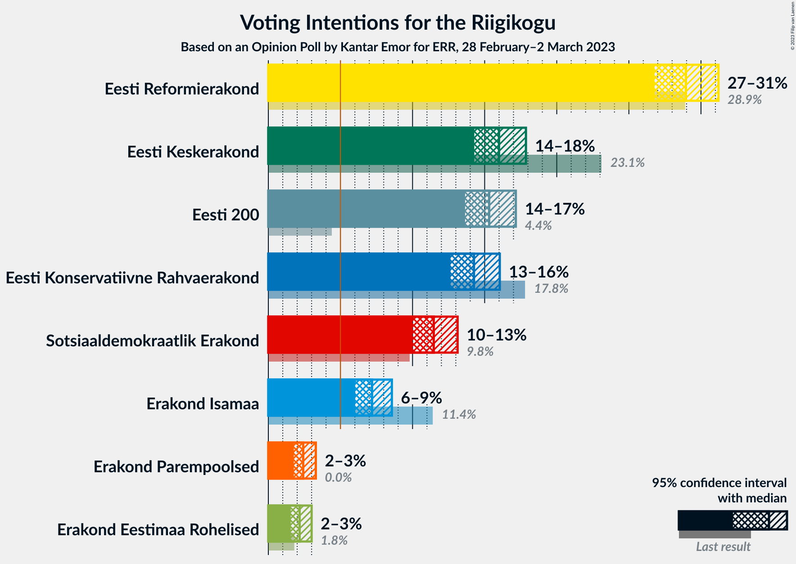

### Confidence Intervals

| Party | Last Result | Poll Result | 80% Confidence Interval | 90% Confidence Interval | 95% Confidence Interval | 99% Confidence Interval |
|:-----:|:-----------:|:-----------:|:-----------------------:|:-----------------------:|:-----------------------:|:-----------------------:|
| Eesti Reformierakond | 28.9% | 29.0% | 27.5–30.4% |27.1–30.8% |26.8–31.2% |26.1–31.9% |
| Eesti Keskerakond | 23.1% | 16.0% | 14.9–17.2% |14.6–17.6% |14.3–17.9% |13.8–18.5% |
| Eesti 200 | 4.4% | 15.3% | 14.2–16.5% |13.9–16.9% |13.6–17.2% |13.1–17.8% |
| Eesti Konservatiivne Rahvaerakond | 17.8% | 14.3% | 13.2–15.4% |12.9–15.8% |12.6–16.0% |12.1–16.6% |
| Sotsiaaldemokraatlik Erakond | 9.8% | 11.5% | 10.5–12.5% |10.2–12.8% |10.0–13.1% |9.6–13.7% |
| Erakond Isamaa | 11.4% | 7.2% | 6.4–8.1% |6.2–8.3% |6.0–8.6% |5.7–9.0% |
| Erakond Parempoolsed | 0.0% | 2.4% | 2.0–3.0% |1.9–3.2% |1.8–3.3% |1.6–3.6% |
| Erakond Eestimaa Rohelised | 1.8% | 2.2% | 1.8–2.7% |1.6–2.9% |1.6–3.0% |1.4–3.3% |

*Note:* The poll result column reflects the actual value used in the calculations. Published results may vary slightly, and in addition be rounded to fewer digits.

## Seats

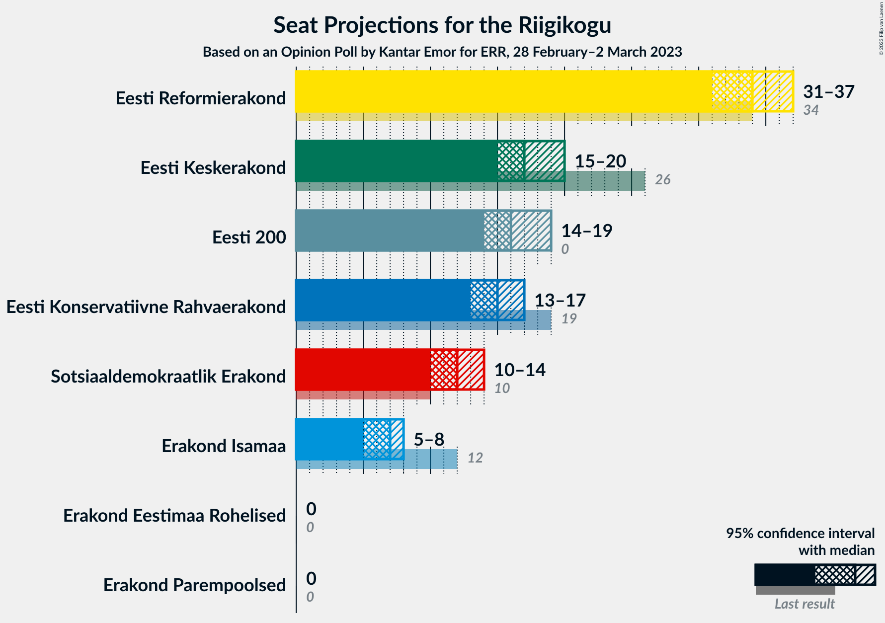

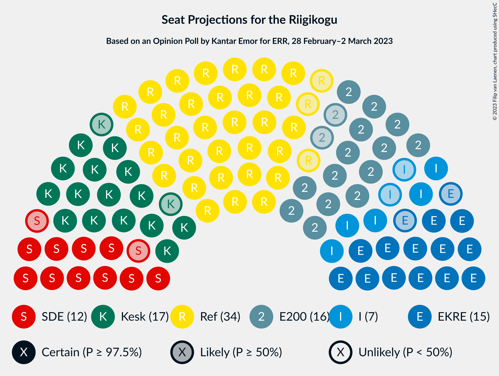

### Confidence Intervals

| Party | Last Result | Median | 80% Confidence Interval | 90% Confidence Interval | 95% Confidence Interval | 99% Confidence Interval |
|:-----:|:-----------:|:------:|:-----------------------:|:-----------------------:|:-----------------------:|:-----------------------:|
| <a href="#eesti-reformierakond">Eesti Reformierakond</a> | 34 | 34 | 32–35 |31–36 |31–37 |30–38 |
| <a href="#eesti-keskerakond">Eesti Keskerakond</a> | 26 | 17 | 16–19 |15–19 |15–20 |14–20 |
| <a href="#eesti-200">Eesti 200</a> | 0 | 16 | 15–18 |15–18 |14–19 |14–19 |
| <a href="#eesti-konservatiivne-rahvaerakond">Eesti Konservatiivne Rahvaerakond</a> | 19 | 15 | 14–17 |13–17 |13–17 |12–18 |
| <a href="#sotsiaaldemokraatlik-erakond">Sotsiaaldemokraatlik Erakond</a> | 10 | 12 | 10–13 |10–13 |10–14 |10–14 |
| <a href="#erakond-isamaa">Erakond Isamaa</a> | 12 | 7 | 6–8 |6–8 |5–8 |5–9 |
| <a href="#erakond-parempoolsed">Erakond Parempoolsed</a> | 0 | 0 | 0 |0 |0 |0 |
| <a href="#erakond-eestimaa-rohelised">Erakond Eestimaa Rohelised</a> | 0 | 0 | 0 |0 |0 |0 |

### Eesti Reformierakond

*For a full overview of the results for this party, see the [Eesti Reformierakond](party-eestireformierakond.html) page.*

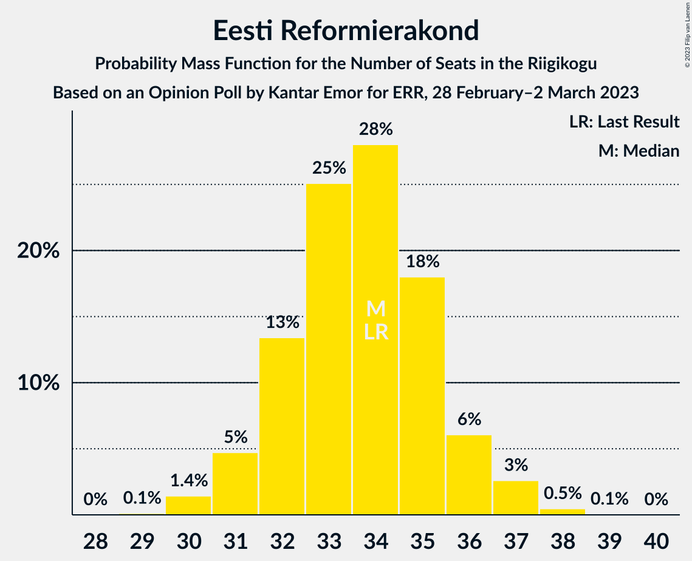

| Number of Seats | Probability | Accumulated | Special Marks |
|:---------------:|:-----------:|:-----------:|:-------------:|
| 29 | 0.1% | 100% |  |
| 30 | 1.4% | 99.9% |  |
| 31 | 5% | 98% |  |
| 32 | 13% | 94% |  |
| 33 | 25% | 80% |  |
| 34 | 28% | 55% | Last Result, Median |
| 35 | 18% | 27% |  |
| 36 | 6% | 9% |  |
| 37 | 3% | 3% |  |
| 38 | 0.5% | 0.5% |  |
| 39 | 0.1% | 0.1% |  |
| 40 | 0% | 0% |  |

### Eesti Keskerakond

*For a full overview of the results for this party, see the [Eesti Keskerakond](party-eestikeskerakond.html) page.*

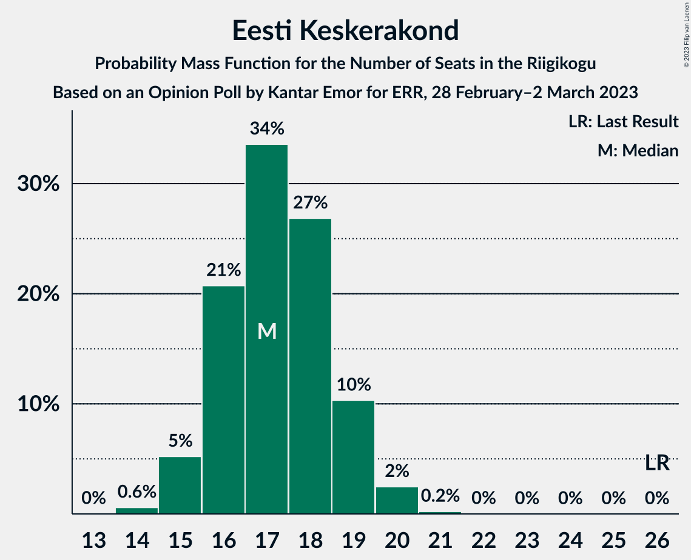

| Number of Seats | Probability | Accumulated | Special Marks |
|:---------------:|:-----------:|:-----------:|:-------------:|
| 14 | 0.6% | 100% |  |
| 15 | 5% | 99.4% |  |
| 16 | 21% | 94% |  |
| 17 | 34% | 73% | Median |
| 18 | 27% | 40% |  |
| 19 | 10% | 13% |  |
| 20 | 2% | 3% |  |
| 21 | 0.2% | 0.2% |  |
| 22 | 0% | 0% |  |
| 23 | 0% | 0% |  |
| 24 | 0% | 0% |  |
| 25 | 0% | 0% |  |
| 26 | 0% | 0% | Last Result |

### Eesti 200

*For a full overview of the results for this party, see the [Eesti 200](party-eesti200.html) page.*

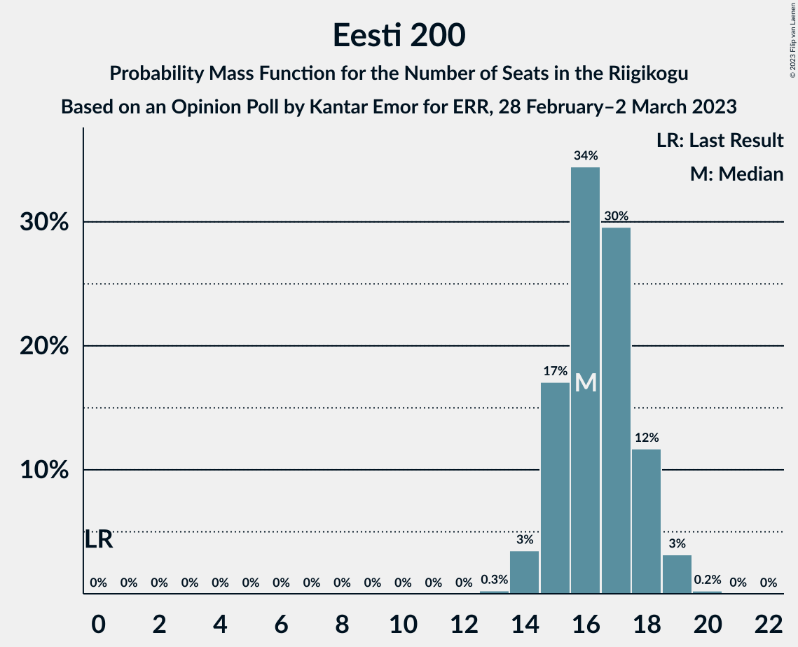

| Number of Seats | Probability | Accumulated | Special Marks |
|:---------------:|:-----------:|:-----------:|:-------------:|
| 0 | 0% | 100% | Last Result |
| 1 | 0% | 100% |  |
| 2 | 0% | 100% |  |
| 3 | 0% | 100% |  |
| 4 | 0% | 100% |  |
| 5 | 0% | 100% |  |
| 6 | 0% | 100% |  |
| 7 | 0% | 100% |  |
| 8 | 0% | 100% |  |
| 9 | 0% | 100% |  |
| 10 | 0% | 100% |  |
| 11 | 0% | 100% |  |
| 12 | 0% | 100% |  |
| 13 | 0.3% | 100% |  |
| 14 | 3% | 99.7% |  |
| 15 | 17% | 96% |  |
| 16 | 34% | 79% | Median |
| 17 | 30% | 45% |  |
| 18 | 12% | 15% |  |
| 19 | 3% | 3% |  |
| 20 | 0.2% | 0.3% |  |
| 21 | 0% | 0% |  |

### Eesti Konservatiivne Rahvaerakond

*For a full overview of the results for this party, see the [Eesti Konservatiivne Rahvaerakond](party-eestikonservatiivnerahvaerakond.html) page.*

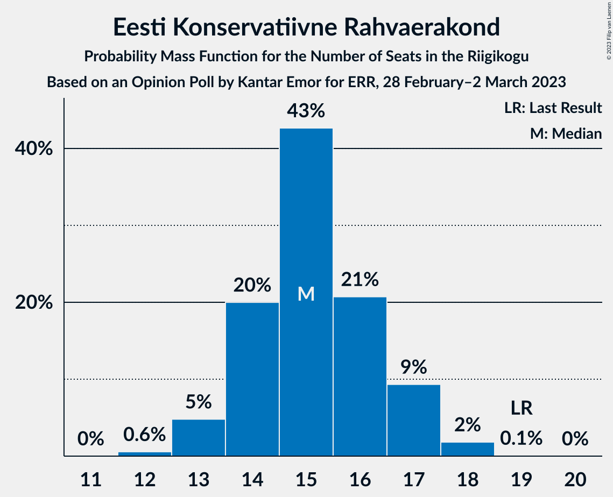

| Number of Seats | Probability | Accumulated | Special Marks |
|:---------------:|:-----------:|:-----------:|:-------------:|
| 12 | 0.6% | 100% |  |
| 13 | 5% | 99.4% |  |
| 14 | 20% | 95% |  |
| 15 | 43% | 75% | Median |
| 16 | 21% | 32% |  |
| 17 | 9% | 11% |  |
| 18 | 2% | 2% |  |
| 19 | 0.1% | 0.1% | Last Result |
| 20 | 0% | 0% |  |

### Sotsiaaldemokraatlik Erakond

*For a full overview of the results for this party, see the [Sotsiaaldemokraatlik Erakond](party-sotsiaaldemokraatlikerakond.html) page.*

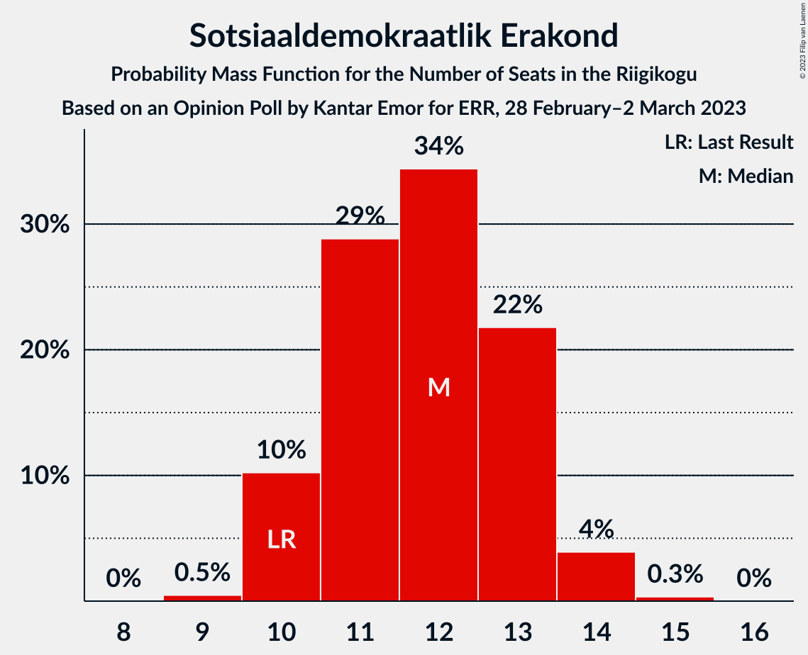

| Number of Seats | Probability | Accumulated | Special Marks |
|:---------------:|:-----------:|:-----------:|:-------------:|
| 9 | 0.5% | 100% |  |
| 10 | 10% | 99.5% | Last Result |
| 11 | 29% | 89% |  |
| 12 | 34% | 60% | Median |
| 13 | 22% | 26% |  |
| 14 | 4% | 4% |  |
| 15 | 0.3% | 0.4% |  |
| 16 | 0% | 0% |  |

### Erakond Isamaa

*For a full overview of the results for this party, see the [Erakond Isamaa](party-erakondisamaa.html) page.*

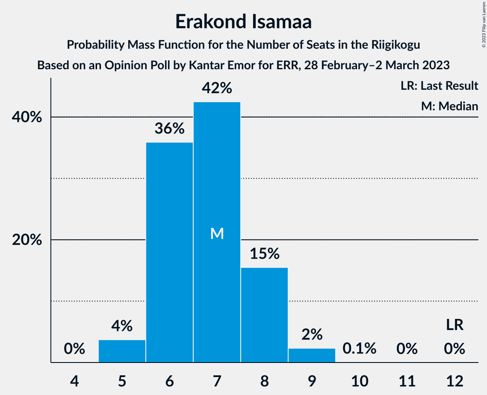

| Number of Seats | Probability | Accumulated | Special Marks |
|:---------------:|:-----------:|:-----------:|:-------------:|
| 5 | 4% | 100% |  |
| 6 | 36% | 96% |  |
| 7 | 42% | 60% | Median |
| 8 | 15% | 18% |  |
| 9 | 2% | 2% |  |
| 10 | 0.1% | 0.1% |  |
| 11 | 0% | 0% |  |
| 12 | 0% | 0% | Last Result |

### Erakond Parempoolsed

*For a full overview of the results for this party, see the [Erakond Parempoolsed](party-erakondparempoolsed.html) page.*

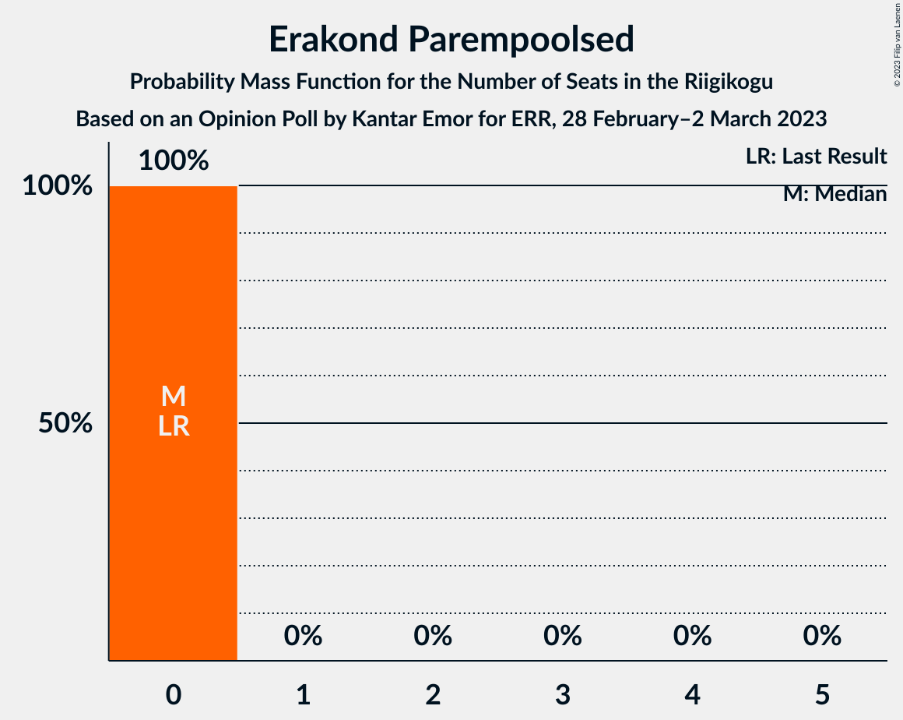

| Number of Seats | Probability | Accumulated | Special Marks |
|:---------------:|:-----------:|:-----------:|:-------------:|
| 0 | 100% | 100% | Last Result, Median |

### Erakond Eestimaa Rohelised

*For a full overview of the results for this party, see the [Erakond Eestimaa Rohelised](party-erakondeestimaarohelised.html) page.*

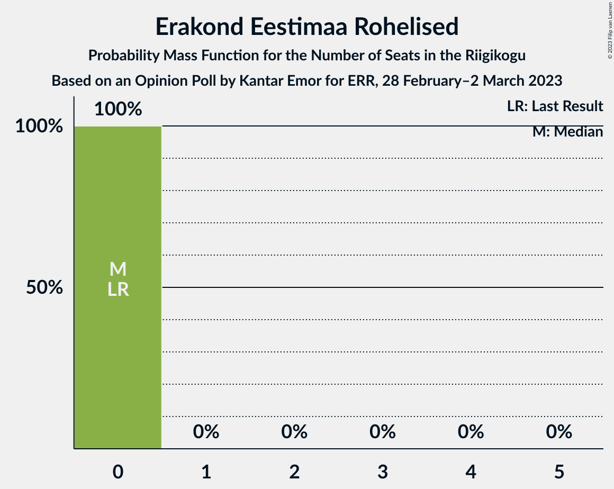

| Number of Seats | Probability | Accumulated | Special Marks |
|:---------------:|:-----------:|:-----------:|:-------------:|
| 0 | 100% | 100% | Last Result, Median |

## Coalitions

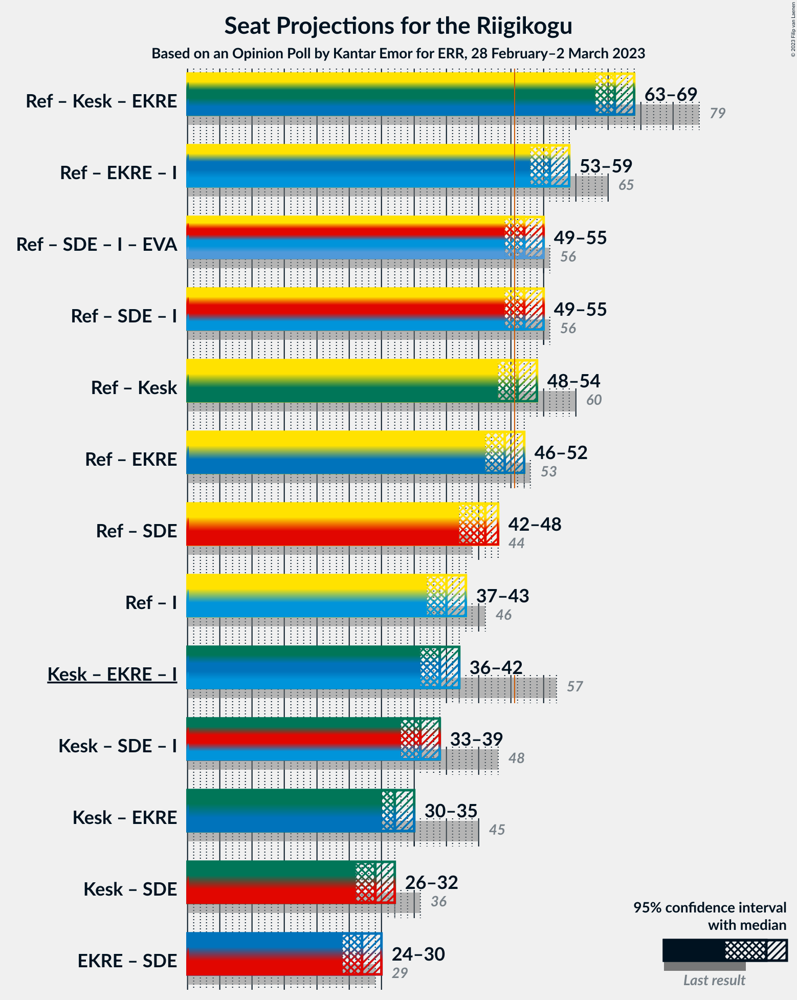

### Confidence Intervals

| Coalition | Last Result | Median | Majority? | 80% Confidence Interval | 90% Confidence Interval | 95% Confidence Interval | 99% Confidence Interval |
|:---------:|:-----------:|:------:|:---------:|:-----------------------:|:-----------------------:|:-----------------------:|:-----------------------:|
| Eesti Reformierakond – Eesti Keskerakond – Eesti Konservatiivne Rahvaerakond | 79 | 66 | 100% | 64–68 | 64–69 | 63–69 | 62–70 |
| Eesti Reformierakond – Eesti Konservatiivne Rahvaerakond – Erakond Isamaa | 65 | 56 | 99.9% | 54–57 | 53–58 | 53–59 | 52–59 |
| Eesti Reformierakond – Sotsiaaldemokraatlik Erakond – Erakond Isamaa | 56 | 52 | 87% | 50–54 | 50–55 | 49–55 | 48–56 |
| Eesti Reformierakond – Eesti Keskerakond | 60 | 51 | 61% | 49–53 | 48–53 | 48–54 | 47–55 |
| Eesti Reformierakond – Eesti Konservatiivne Rahvaerakond | 53 | 49 | 12% | 47–51 | 46–51 | 46–52 | 45–53 |
| Eesti Reformierakond – Sotsiaaldemokraatlik Erakond | 44 | 46 | 0.1% | 43–47 | 43–48 | 42–48 | 42–50 |
| Eesti Reformierakond – Erakond Isamaa | 46 | 40 | 0% | 39–42 | 38–43 | 37–43 | 36–45 |
| Eesti Keskerakond – Eesti Konservatiivne Rahvaerakond – Erakond Isamaa | 57 | 39 | 0% | 37–41 | 37–42 | 36–42 | 35–43 |
| Eesti Keskerakond – Sotsiaaldemokraatlik Erakond – Erakond Isamaa | 48 | 36 | 0% | 34–38 | 33–38 | 33–39 | 32–40 |
| Eesti Keskerakond – Eesti Konservatiivne Rahvaerakond | 45 | 32 | 0% | 31–34 | 30–35 | 30–35 | 29–36 |
| Eesti Keskerakond – Sotsiaaldemokraatlik Erakond | 36 | 29 | 0% | 27–31 | 27–31 | 26–32 | 26–33 |
| Eesti Konservatiivne Rahvaerakond – Sotsiaaldemokraatlik Erakond | 29 | 27 | 0% | 25–29 | 25–29 | 24–30 | 23–30 |

### Eesti Reformierakond – Eesti Keskerakond – Eesti Konservatiivne Rahvaerakond

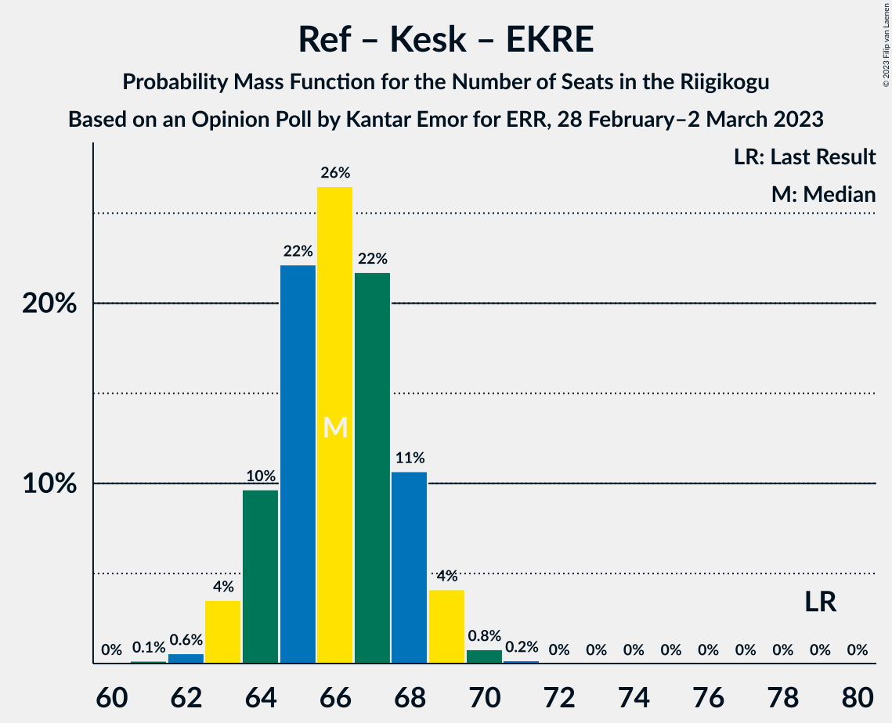

| Number of Seats | Probability | Accumulated | Special Marks |
|:---------------:|:-----------:|:-----------:|:-------------:|
| 61 | 0.1% | 100% |  |
| 62 | 0.6% | 99.8% |  |
| 63 | 4% | 99.3% |  |
| 64 | 10% | 96% |  |
| 65 | 22% | 86% |  |
| 66 | 26% | 64% | Median |
| 67 | 22% | 37% |  |
| 68 | 11% | 16% |  |
| 69 | 4% | 5% |  |
| 70 | 0.8% | 1.0% |  |
| 71 | 0.2% | 0.2% |  |
| 72 | 0% | 0% |  |
| 73 | 0% | 0% |  |
| 74 | 0% | 0% |  |
| 75 | 0% | 0% |  |
| 76 | 0% | 0% |  |
| 77 | 0% | 0% |  |
| 78 | 0% | 0% |  |
| 79 | 0% | 0% | Last Result |

### Eesti Reformierakond – Eesti Konservatiivne Rahvaerakond – Erakond Isamaa

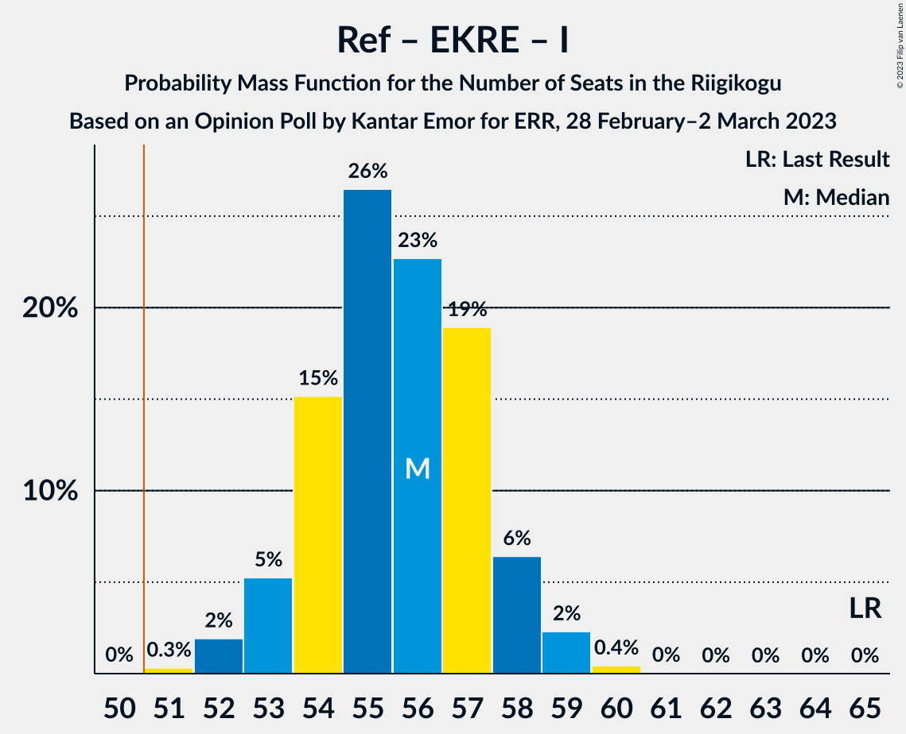

| Number of Seats | Probability | Accumulated | Special Marks |
|:---------------:|:-----------:|:-----------:|:-------------:|
| 50 | 0% | 100% |  |
| 51 | 0.3% | 99.9% | Majority |
| 52 | 2% | 99.6% |  |
| 53 | 5% | 98% |  |
| 54 | 15% | 92% |  |
| 55 | 26% | 77% |  |
| 56 | 23% | 51% | Median |
| 57 | 19% | 28% |  |
| 58 | 6% | 9% |  |
| 59 | 2% | 3% |  |
| 60 | 0.4% | 0.5% |  |
| 61 | 0% | 0% |  |
| 62 | 0% | 0% |  |
| 63 | 0% | 0% |  |
| 64 | 0% | 0% |  |
| 65 | 0% | 0% | Last Result |

### Eesti Reformierakond – Sotsiaaldemokraatlik Erakond – Erakond Isamaa

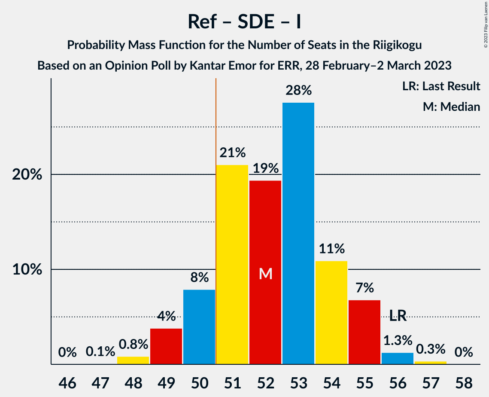

| Number of Seats | Probability | Accumulated | Special Marks |
|:---------------:|:-----------:|:-----------:|:-------------:|
| 47 | 0.1% | 100% |  |
| 48 | 0.8% | 99.9% |  |
| 49 | 4% | 99.1% |  |
| 50 | 8% | 95% |  |
| 51 | 21% | 87% | Majority |
| 52 | 19% | 66% |  |
| 53 | 28% | 47% | Median |
| 54 | 11% | 19% |  |
| 55 | 7% | 8% |  |
| 56 | 1.3% | 2% | Last Result |
| 57 | 0.3% | 0.4% |  |
| 58 | 0% | 0% |  |

### Eesti Reformierakond – Eesti Keskerakond

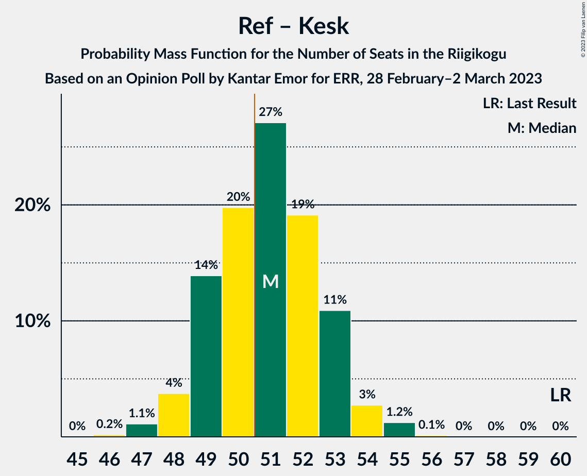

| Number of Seats | Probability | Accumulated | Special Marks |
|:---------------:|:-----------:|:-----------:|:-------------:|
| 46 | 0.2% | 100% |  |
| 47 | 1.1% | 99.8% |  |
| 48 | 4% | 98.7% |  |
| 49 | 14% | 95% |  |
| 50 | 20% | 81% |  |
| 51 | 27% | 61% | Median, Majority |
| 52 | 19% | 34% |  |
| 53 | 11% | 15% |  |
| 54 | 3% | 4% |  |
| 55 | 1.2% | 1.4% |  |
| 56 | 0.1% | 0.1% |  |
| 57 | 0% | 0% |  |
| 58 | 0% | 0% |  |
| 59 | 0% | 0% |  |
| 60 | 0% | 0% | Last Result |

### Eesti Reformierakond – Eesti Konservatiivne Rahvaerakond

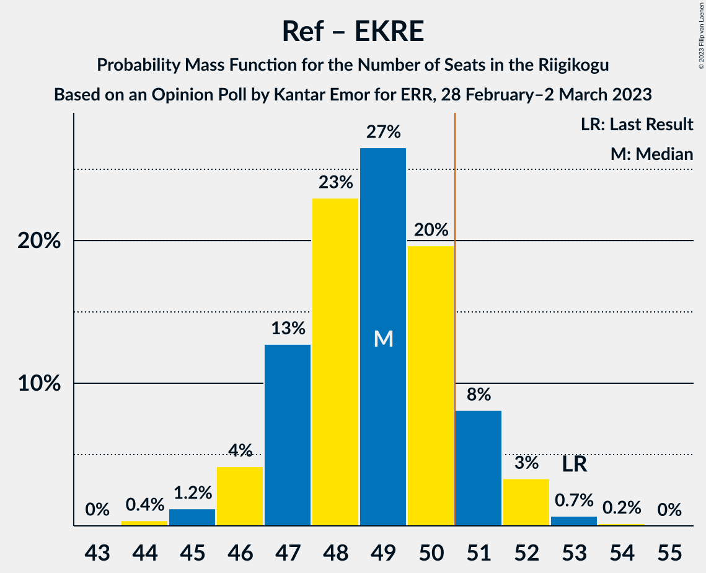

| Number of Seats | Probability | Accumulated | Special Marks |
|:---------------:|:-----------:|:-----------:|:-------------:|
| 44 | 0.4% | 100% |  |
| 45 | 1.2% | 99.6% |  |
| 46 | 4% | 98% |  |
| 47 | 13% | 94% |  |
| 48 | 23% | 81% |  |
| 49 | 27% | 58% | Median |
| 50 | 20% | 32% |  |
| 51 | 8% | 12% | Majority |
| 52 | 3% | 4% |  |
| 53 | 0.7% | 0.9% | Last Result |
| 54 | 0.2% | 0.2% |  |
| 55 | 0% | 0% |  |

### Eesti Reformierakond – Sotsiaaldemokraatlik Erakond

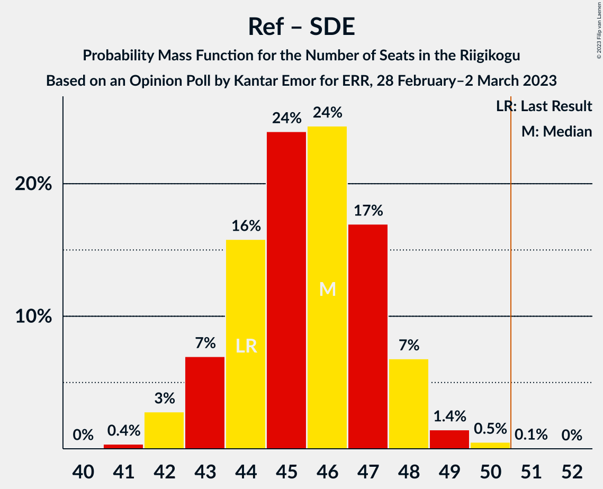

| Number of Seats | Probability | Accumulated | Special Marks |
|:---------------:|:-----------:|:-----------:|:-------------:|
| 41 | 0.4% | 100% |  |
| 42 | 3% | 99.6% |  |
| 43 | 7% | 97% |  |
| 44 | 16% | 90% | Last Result |
| 45 | 24% | 74% |  |
| 46 | 24% | 50% | Median |
| 47 | 17% | 26% |  |
| 48 | 7% | 9% |  |
| 49 | 1.4% | 2% |  |
| 50 | 0.5% | 0.6% |  |
| 51 | 0.1% | 0.1% | Majority |
| 52 | 0% | 0% |  |

### Eesti Reformierakond – Erakond Isamaa

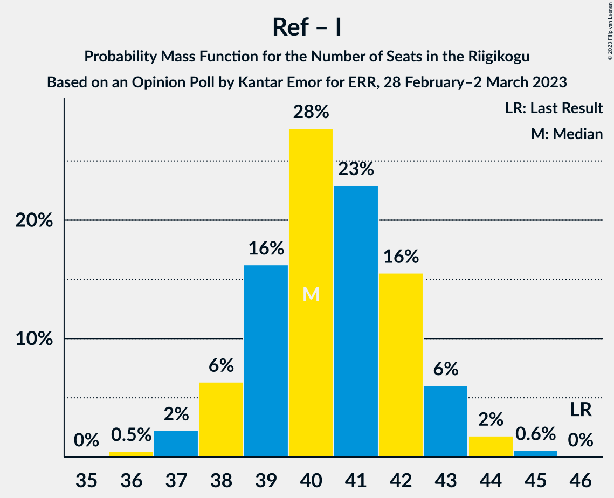

| Number of Seats | Probability | Accumulated | Special Marks |
|:---------------:|:-----------:|:-----------:|:-------------:|
| 36 | 0.5% | 100% |  |
| 37 | 2% | 99.5% |  |
| 38 | 6% | 97% |  |
| 39 | 16% | 91% |  |
| 40 | 28% | 75% |  |
| 41 | 23% | 47% | Median |
| 42 | 16% | 24% |  |
| 43 | 6% | 8% |  |
| 44 | 2% | 2% |  |
| 45 | 0.6% | 0.6% |  |
| 46 | 0% | 0% | Last Result |

### Eesti Keskerakond – Eesti Konservatiivne Rahvaerakond – Erakond Isamaa

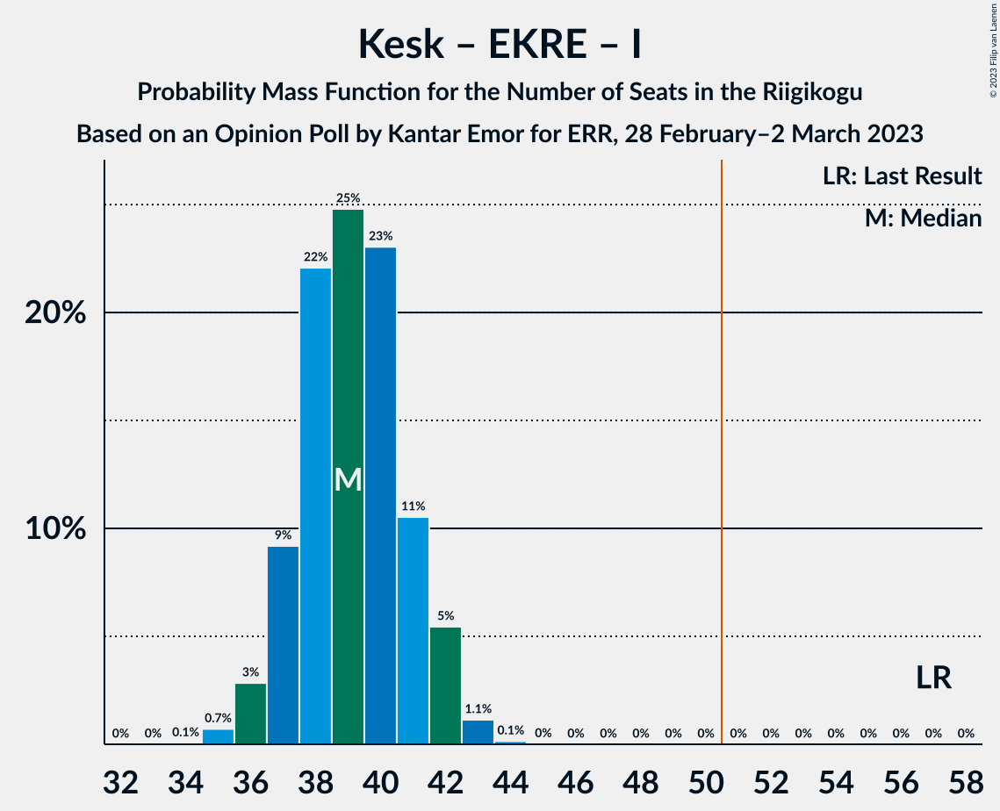

| Number of Seats | Probability | Accumulated | Special Marks |
|:---------------:|:-----------:|:-----------:|:-------------:|
| 34 | 0.1% | 100% |  |
| 35 | 0.7% | 99.9% |  |
| 36 | 3% | 99.2% |  |
| 37 | 9% | 96% |  |
| 38 | 22% | 87% |  |
| 39 | 25% | 65% | Median |
| 40 | 23% | 40% |  |
| 41 | 11% | 17% |  |
| 42 | 5% | 7% |  |
| 43 | 1.1% | 1.3% |  |
| 44 | 0.1% | 0.2% |  |
| 45 | 0% | 0% |  |
| 46 | 0% | 0% |  |
| 47 | 0% | 0% |  |
| 48 | 0% | 0% |  |
| 49 | 0% | 0% |  |
| 50 | 0% | 0% |  |
| 51 | 0% | 0% | Majority |
| 52 | 0% | 0% |  |
| 53 | 0% | 0% |  |
| 54 | 0% | 0% |  |
| 55 | 0% | 0% |  |
| 56 | 0% | 0% |  |
| 57 | 0% | 0% | Last Result |

### Eesti Keskerakond – Sotsiaaldemokraatlik Erakond – Erakond Isamaa

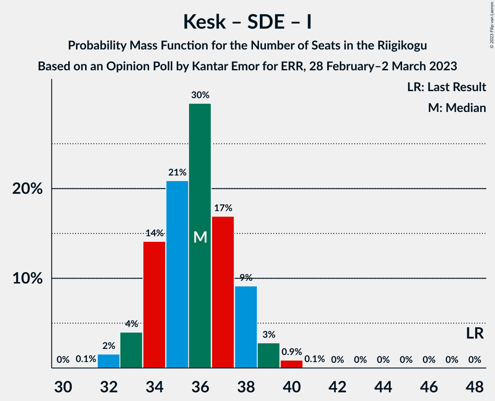

| Number of Seats | Probability | Accumulated | Special Marks |
|:---------------:|:-----------:|:-----------:|:-------------:|
| 31 | 0.1% | 100% |  |
| 32 | 2% | 99.9% |  |
| 33 | 4% | 98% |  |
| 34 | 14% | 94% |  |
| 35 | 21% | 80% |  |
| 36 | 30% | 59% | Median |
| 37 | 17% | 30% |  |
| 38 | 9% | 13% |  |
| 39 | 3% | 4% |  |
| 40 | 0.9% | 1.0% |  |
| 41 | 0.1% | 0.1% |  |
| 42 | 0% | 0% |  |
| 43 | 0% | 0% |  |
| 44 | 0% | 0% |  |
| 45 | 0% | 0% |  |
| 46 | 0% | 0% |  |
| 47 | 0% | 0% |  |
| 48 | 0% | 0% | Last Result |

### Eesti Keskerakond – Eesti Konservatiivne Rahvaerakond

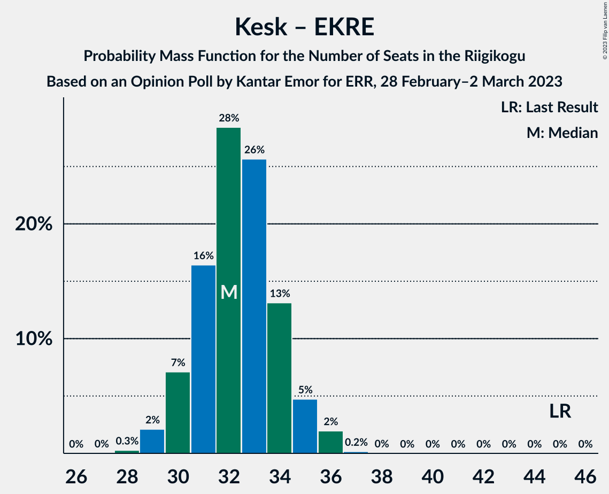

| Number of Seats | Probability | Accumulated | Special Marks |
|:---------------:|:-----------:|:-----------:|:-------------:|
| 28 | 0.3% | 100% |  |
| 29 | 2% | 99.7% |  |
| 30 | 7% | 98% |  |
| 31 | 16% | 90% |  |
| 32 | 28% | 74% | Median |
| 33 | 26% | 46% |  |
| 34 | 13% | 20% |  |
| 35 | 5% | 7% |  |
| 36 | 2% | 2% |  |
| 37 | 0.2% | 0.2% |  |
| 38 | 0% | 0% |  |
| 39 | 0% | 0% |  |
| 40 | 0% | 0% |  |
| 41 | 0% | 0% |  |
| 42 | 0% | 0% |  |
| 43 | 0% | 0% |  |
| 44 | 0% | 0% |  |
| 45 | 0% | 0% | Last Result |

### Eesti Keskerakond – Sotsiaaldemokraatlik Erakond

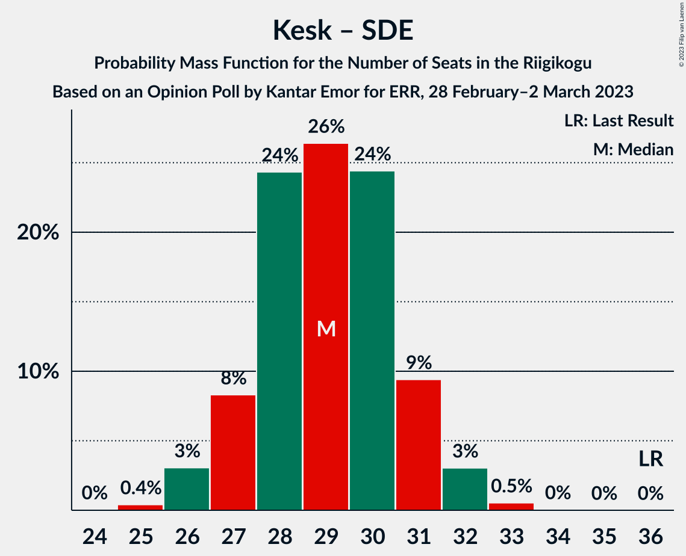

| Number of Seats | Probability | Accumulated | Special Marks |
|:---------------:|:-----------:|:-----------:|:-------------:|
| 25 | 0.4% | 100% |  |
| 26 | 3% | 99.6% |  |
| 27 | 8% | 96% |  |
| 28 | 24% | 88% |  |
| 29 | 26% | 64% | Median |
| 30 | 24% | 37% |  |
| 31 | 9% | 13% |  |
| 32 | 3% | 4% |  |
| 33 | 0.5% | 0.6% |  |
| 34 | 0% | 0.1% |  |
| 35 | 0% | 0% |  |
| 36 | 0% | 0% | Last Result |

### Eesti Konservatiivne Rahvaerakond – Sotsiaaldemokraatlik Erakond

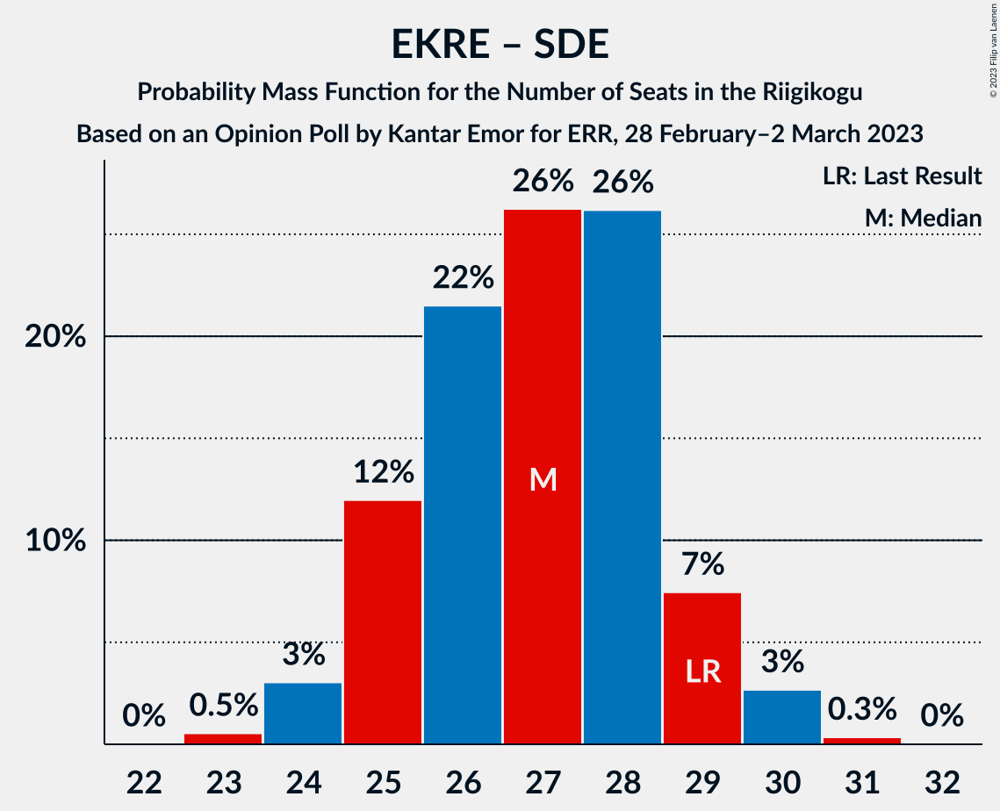

| Number of Seats | Probability | Accumulated | Special Marks |
|:---------------:|:-----------:|:-----------:|:-------------:|
| 23 | 0.5% | 100% |  |
| 24 | 3% | 99.4% |  |
| 25 | 12% | 96% |  |
| 26 | 22% | 84% |  |
| 27 | 26% | 63% | Median |
| 28 | 26% | 37% |  |
| 29 | 7% | 10% | Last Result |
| 30 | 3% | 3% |  |
| 31 | 0.3% | 0.4% |  |
| 32 | 0% | 0% |  |

## Technical Information

### Opinion Poll

+ **Polling firm:** Kantar Emor
+ **Commissioner(s):** ERR
+ **Fieldwork period:** 28 February–2 March 2023

### Calculations

+ **Sample size:** 1613
+ **Simulations done:** 1,048,576
+ **Error estimate:** 1.91%

