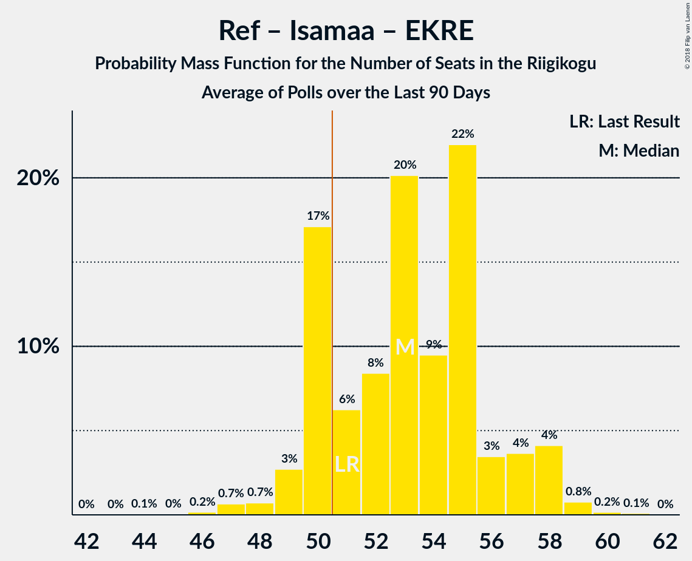
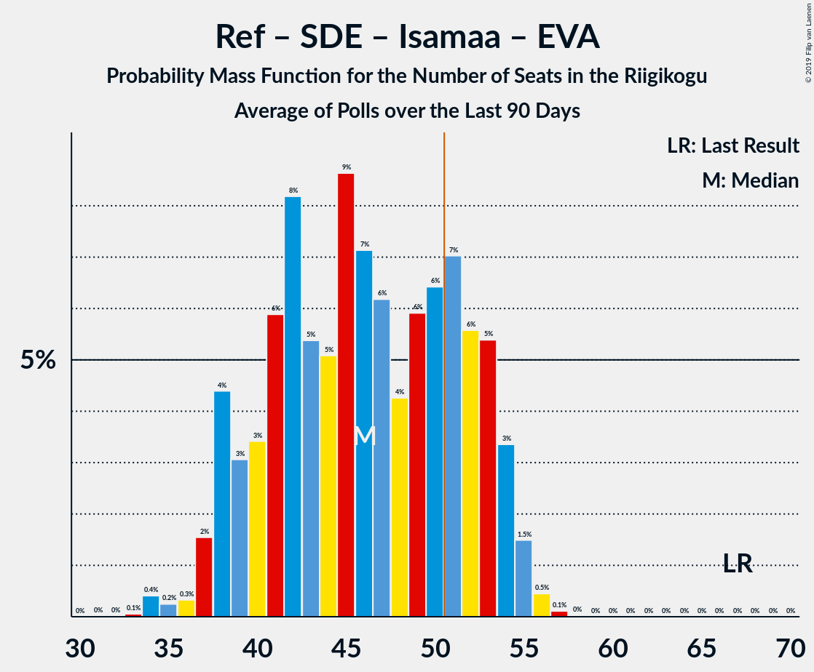
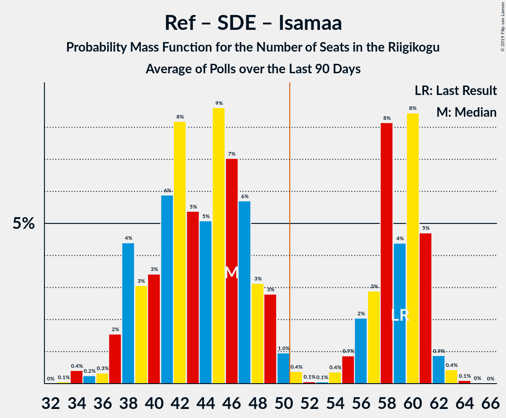
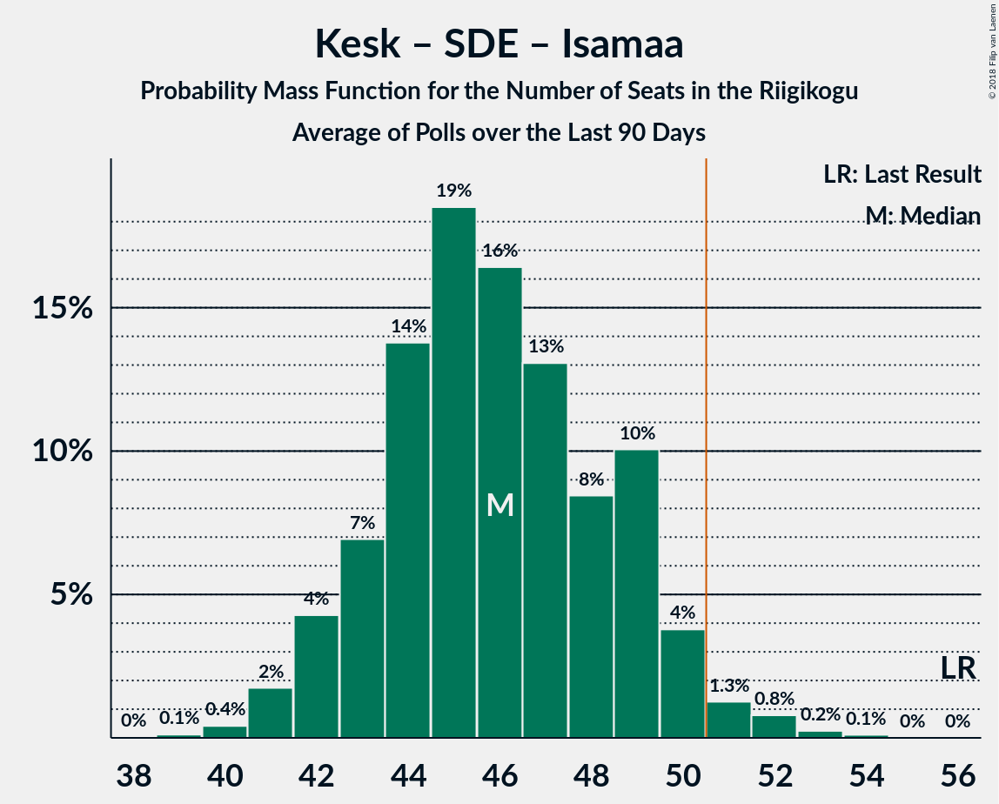
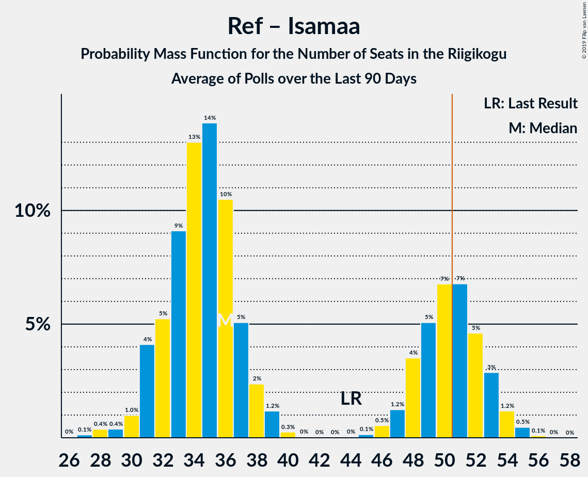
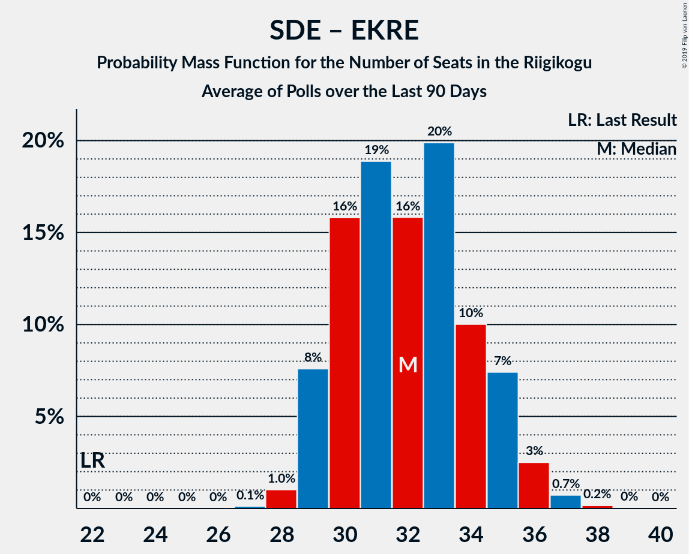

# Poll Average

<a href="#voting-intentions">Voting Intentions</a> | <a href="#seats">Seats</a> | <a href="#coalitions">Coalitions</a> | <a href="#technical-information">Technical Information</a>

## Summary

The table below lists the polls on which the average is based. They are the most recent polls (less than 90 days old) registered and analyzed so far.

| Period     | Polling firm/Commissioner(s) | Ref | Kesk | SDE | Isamaa | EVA | EKRE | Rohelised | E200 |
|:----------:|:----------------------------:|:--:|:--:|:--:|:--:|:--:|:--:|:--:|:--:|
| 1 March 2015 | General Election | 27.7%   30 | 24.8%   27 | 15.2%   15 | 13.7%   14 | 8.7%   8 | 8.1%   7 | 0.9%   0 | 0.0%   0 |
| N/A | Poll Average | 23–32%   26–37 | 20–29%   22–34 | 9–14%   9–14 | 8–12%   7–13 | 1–3%   0 | 16–23%   18–25 | 1–3%   0 | 3–6%   0–6 |
| [18–24 February 2019](2019-02-24-Norstat.html) | Norstat   MTÜ Ühiskonnauuringute Instituut | 28–33%   32–39 | 19–24%   21–27 | 10–14%   10–15 | 8–11%   7–11 | 1–2%   0 | 16–21%   18–23 | 2–3%   0 | 3–5%   0 |
| [7–20 February 2019](2019-02-20-Turu-uuringuteAS.html) | Turu-uuringute AS   ERR | 23–25%   26–29 | 27–29%   31–35 | 10–12%   10–12 | 9–11%   9–11 | 2%   0 | 16–18%   18–20 | 3–4%   0 | 3–5%   0 |
| [14–20 February 2019](2019-02-20-KantarEmor.html) | Kantar Emor   BNS and Postimees | 23–28%   25–32 | 22–27%   24–30 | 8–12%   8–12 | 8–11%   7–11 | 1–2%   0 | 19–24%   20–26 | 1–3%   0 | 4–7%   0–6 |
| [12–18 February 2019](2019-02-18-OÜFaktumAriko.html) | OÜ Faktum & Ariko | 23–28%   27–33 | 20–25%   23–29 | 9–13%   10–14 | 9–13%   10–14 | 1–3%   0 | 16–20%   18–24 | 1–3%   0 | 3–5%   0–5 |
| 1 March 2015 | General Election | 27.7%   30 | 24.8%   27 | 15.2%   15 | 13.7%   14 | 8.7%   8 | 8.1%   7 | 0.9%   0 | 0.0%   0 |

Only polls for which at least the sample size has been published are included in the table above.

**Legend:**
+ **Top half of each row:** Voting intentions (95% confidence interval)
+ **Bottom half of each row:** Seat projections for the Riigikogu (95% confidence interval)
+ **Ref:** Eesti Reformierakond
+ **Kesk:** Eesti Keskerakond
+ **SDE:** Sotsiaaldemokraatlik Erakond
+ **Isamaa:** Erakond Isamaa
+ **EVA:** Eesti Vabaerakond
+ **EKRE:** Eesti Konservatiivne Rahvaerakond
+ **Rohelised:** Erakond Eestimaa Rohelised
+ **E200:** Eesti 200
+ **N/A (single party):** Party not included the published results
+ **N/A (entire row):** Calculation for this opinion poll not started yet

## Voting Intentions

### Confidence Intervals

| Party | Last Result | Median | 80% Confidence Interval | 90% Confidence Interval | 95% Confidence Interval | 99% Confidence Interval |
|:-----:|:-----------:|:------:|:-----------------------:|:-----------------------:|:-----------------------:|:-----------------------:|
| <a href="#eesti-reformierakond">Eesti Reformierakond</a> | 27.7% | 25.6% | 23.6–30.9% |23.3–31.7% | 23.0–32.4% | 22.5–33.5% |
| <a href="#eesti-keskerakond">Eesti Keskerakond</a> | 24.8% | 23.6% | 20.8–28.2% |20.2–28.6% | 19.7–28.8% | 18.9–29.3% |
| <a href="#sotsiaaldemokraatlik-erakond">Sotsiaaldemokraatlik Erakond</a> | 15.2% | 11.0% | 9.7–12.5% |9.3–13.0% | 9.0–13.5% | 8.4–14.3% |
| <a href="#erakond-isamaa">Erakond Isamaa</a> | 13.7% | 9.9% | 8.6–11.4% |8.2–11.9% | 7.9–12.4% | 7.4–13.1% |
| <a href="#eesti-vabaerakond">Eesti Vabaerakond</a> | 8.7% | 1.6% | 0.8–2.3% |0.7–2.4% | 0.6–2.6% | 0.5–3.0% |
| <a href="#eesti-konservatiivne-rahvaerakond">Eesti Konservatiivne Rahvaerakond</a> | 8.1% | 18.5% | 16.7–21.7% |16.4–22.4% | 16.2–22.9% | 15.7–23.9% |
| <a href="#erakond-eestimaa-rohelised">Erakond Eestimaa Rohelised</a> | 0.9% | 2.4% | 1.7–3.1% |1.5–3.3% | 1.4–3.4% | 1.2–3.6% |
| <a href="#eesti-200">Eesti 200</a> | 0.0% | 4.2% | 3.4–5.8% |3.1–6.2% | 2.9–6.5% | 2.6–7.1% |

### Eesti Reformierakond

*For a full overview of the results for this party, see the [Eesti Reformierakond](party-eestireformierakond.html) page.*

| Voting Intentions | Probability | Accumulated | Special Marks |
|:-----------------:|:-----------:|:-----------:|:-------------:|
| 20.5–21.5% | 0% | 100% |  |
| 21.5–22.5% | 0.6% | 100% |  |
| 22.5–23.5% | 8% | 99.3% |  |
| 23.5–24.5% | 23% | 91% |  |
| 24.5–25.5% | 19% | 69% |  |
| 25.5–26.5% | 14% | 50% | Median |
| 26.5–27.5% | 8% | 36% |  |
| 27.5–28.5% | 4% | 28% | Last Result |
| 28.5–29.5% | 5% | 23% |  |
| 29.5–30.5% | 6% | 19% |  |
| 30.5–31.5% | 6% | 12% |  |
| 31.5–32.5% | 4% | 6% |  |
| 32.5–33.5% | 2% | 2% |  |
| 33.5–34.5% | 0.4% | 0.5% |  |
| 34.5–35.5% | 0.1% | 0.1% |  |
| 35.5–36.5% | 0% | 0% |  |

### Eesti Keskerakond

*For a full overview of the results for this party, see the [Eesti Keskerakond](party-eestikeskerakond.html) page.*

| Voting Intentions | Probability | Accumulated | Special Marks |
|:-----------------:|:-----------:|:-----------:|:-------------:|
| 16.5–17.5% | 0% | 100% |  |
| 17.5–18.5% | 0.2% | 100% |  |
| 18.5–19.5% | 2% | 99.8% |  |
| 19.5–20.5% | 6% | 98% |  |
| 20.5–21.5% | 13% | 92% |  |
| 21.5–22.5% | 16% | 80% |  |
| 22.5–23.5% | 13% | 64% |  |
| 23.5–24.5% | 11% | 51% | Median |
| 24.5–25.5% | 8% | 40% | Last Result |
| 25.5–26.5% | 5% | 32% |  |
| 26.5–27.5% | 8% | 27% |  |
| 27.5–28.5% | 14% | 19% |  |
| 28.5–29.5% | 5% | 5% |  |
| 29.5–30.5% | 0.2% | 0.2% |  |
| 30.5–31.5% | 0% | 0% |  |

### Sotsiaaldemokraatlik Erakond

*For a full overview of the results for this party, see the [Sotsiaaldemokraatlik Erakond](party-sotsiaaldemokraatlikerakond.html) page.*

| Voting Intentions | Probability | Accumulated | Special Marks |
|:-----------------:|:-----------:|:-----------:|:-------------:|
| 6.5–7.5% | 0% | 100% |  |
| 7.5–8.5% | 0.8% | 100% |  |
| 8.5–9.5% | 7% | 99.2% |  |
| 9.5–10.5% | 21% | 93% |  |
| 10.5–11.5% | 41% | 71% | Median |
| 11.5–12.5% | 20% | 30% |  |
| 12.5–13.5% | 8% | 10% |  |
| 13.5–14.5% | 2% | 2% |  |
| 14.5–15.5% | 0.2% | 0.3% | Last Result |
| 15.5–16.5% | 0% | 0% |  |

### Erakond Isamaa

*For a full overview of the results for this party, see the [Erakond Isamaa](party-erakondisamaa.html) page.*

| Voting Intentions | Probability | Accumulated | Special Marks |
|:-----------------:|:-----------:|:-----------:|:-------------:|
| 5.5–6.5% | 0% | 100% |  |
| 6.5–7.5% | 0.8% | 100% |  |
| 7.5–8.5% | 9% | 99.2% |  |
| 8.5–9.5% | 25% | 91% |  |
| 9.5–10.5% | 39% | 65% | Median |
| 10.5–11.5% | 17% | 26% |  |
| 11.5–12.5% | 7% | 9% |  |
| 12.5–13.5% | 2% | 2% |  |
| 13.5–14.5% | 0.2% | 0.2% | Last Result |
| 14.5–15.5% | 0% | 0% |  |

### Eesti Vabaerakond

*For a full overview of the results for this party, see the [Eesti Vabaerakond](party-eestivabaerakond.html) page.*

| Voting Intentions | Probability | Accumulated | Special Marks |
|:-----------------:|:-----------:|:-----------:|:-------------:|
| 0.0–0.5% | 1.4% | 100% |  |
| 0.5–1.5% | 48% | 98.6% |  |
| 1.5–2.5% | 47% | 51% | Median |
| 2.5–3.5% | 3% | 3% |  |
| 3.5–4.5% | 0% | 0% |  |
| 4.5–5.5% | 0% | 0% |  |
| 5.5–6.5% | 0% | 0% |  |
| 6.5–7.5% | 0% | 0% |  |
| 7.5–8.5% | 0% | 0% |  |
| 8.5–9.5% | 0% | 0% | Last Result |

### Eesti Konservatiivne Rahvaerakond

*For a full overview of the results for this party, see the [Eesti Konservatiivne Rahvaerakond](party-eestikonservatiivnerahvaerakond.html) page.*

| Voting Intentions | Probability | Accumulated | Special Marks |
|:-----------------:|:-----------:|:-----------:|:-------------:|
| 7.5–8.5% | 0% | 100% | Last Result |
| 8.5–9.5% | 0% | 100% |  |
| 9.5–10.5% | 0% | 100% |  |
| 10.5–11.5% | 0% | 100% |  |
| 11.5–12.5% | 0% | 100% |  |
| 12.5–13.5% | 0% | 100% |  |
| 13.5–14.5% | 0% | 100% |  |
| 14.5–15.5% | 0.3% | 100% |  |
| 15.5–16.5% | 7% | 99.7% |  |
| 16.5–17.5% | 24% | 93% |  |
| 17.5–18.5% | 20% | 68% | Median |
| 18.5–19.5% | 16% | 49% |  |
| 19.5–20.5% | 12% | 33% |  |
| 20.5–21.5% | 10% | 22% |  |
| 21.5–22.5% | 7% | 11% |  |
| 22.5–23.5% | 3% | 4% |  |
| 23.5–24.5% | 0.8% | 0.9% |  |
| 24.5–25.5% | 0.1% | 0.1% |  |
| 25.5–26.5% | 0% | 0% |  |

### Erakond Eestimaa Rohelised

*For a full overview of the results for this party, see the [Erakond Eestimaa Rohelised](party-erakondeestimaarohelised.html) page.*

| Voting Intentions | Probability | Accumulated | Special Marks |
|:-----------------:|:-----------:|:-----------:|:-------------:|
| 0.0–0.5% | 0% | 100% |  |
| 0.5–1.5% | 5% | 100% | Last Result |
| 1.5–2.5% | 55% | 95% | Median |
| 2.5–3.5% | 39% | 40% |  |
| 3.5–4.5% | 0.9% | 0.9% |  |
| 4.5–5.5% | 0% | 0% |  |

### Eesti 200

*For a full overview of the results for this party, see the [Eesti 200](party-eesti200.html) page.*

| Voting Intentions | Probability | Accumulated | Special Marks |
|:-----------------:|:-----------:|:-----------:|:-------------:|
| 0.0–0.5% | 0% | 100% | Last Result |
| 0.5–1.5% | 0% | 100% |  |
| 1.5–2.5% | 0.5% | 100% |  |
| 2.5–3.5% | 15% | 99.5% |  |
| 3.5–4.5% | 52% | 84% | Median |
| 4.5–5.5% | 18% | 32% |  |
| 5.5–6.5% | 12% | 14% |  |
| 6.5–7.5% | 2% | 2% |  |
| 7.5–8.5% | 0.1% | 0.1% |  |
| 8.5–9.5% | 0% | 0% |  |

## Seats

### Confidence Intervals

| Party | Last Result | Median | 80% Confidence Interval | 90% Confidence Interval | 95% Confidence Interval | 99% Confidence Interval |
|:-----:|:-----------:|:------:|:-----------------------:|:-----------------------:|:-----------------------:|:-----------------------:|
| <a href="#eesti-reformierakond">Eesti Reformierakond</a> | 30 | 29 | 27–36 |27–37 | 26–37 | 25–39 |
| <a href="#eesti-keskerakond">Eesti Keskerakond</a> | 27 | 27 | 23–33 |22–34 | 22–34 | 20–35 |
| <a href="#sotsiaaldemokraatlik-erakond">Sotsiaaldemokraatlik Erakond</a> | 15 | 11 | 9–13 |9–14 | 9–14 | 8–15 |
| <a href="#erakond-isamaa">Erakond Isamaa</a> | 14 | 10 | 8–12 |8–13 | 7–13 | 7–14 |
| <a href="#eesti-vabaerakond">Eesti Vabaerakond</a> | 8 | 0 | 0 |0 | 0 | 0 |
| <a href="#eesti-konservatiivne-rahvaerakond">Eesti Konservatiivne Rahvaerakond</a> | 7 | 20 | 18–23 |18–24 | 18–25 | 17–26 |
| <a href="#erakond-eestimaa-rohelised">Erakond Eestimaa Rohelised</a> | 0 | 0 | 0 |0 | 0 | 0 |
| <a href="#eesti-200">Eesti 200</a> | 0 | 0 | 0–5 |0–5 | 0–6 | 0–6 |

### Eesti Reformierakond

*For a full overview of the results for this party, see the [Eesti Reformierakond](party-eestireformierakond.html) page.*

| Number of Seats | Probability | Accumulated | Special Marks |
|:---------------:|:-----------:|:-----------:|:-------------:|
| 24 | 0.1% | 100% |  |
| 25 | 0.7% | 99.9% |  |
| 26 | 4% | 99.2% |  |
| 27 | 17% | 96% |  |
| 28 | 19% | 79% |  |
| 29 | 14% | 59% | Median |
| 30 | 9% | 46% | Last Result |
| 31 | 6% | 36% |  |
| 32 | 5% | 30% |  |
| 33 | 4% | 25% |  |
| 34 | 5% | 21% |  |
| 35 | 6% | 16% |  |
| 36 | 5% | 10% |  |
| 37 | 3% | 5% |  |
| 38 | 1.5% | 2% |  |
| 39 | 0.6% | 0.9% |  |
| 40 | 0.2% | 0.3% |  |
| 41 | 0.1% | 0.1% |  |
| 42 | 0% | 0% |  |

### Eesti Keskerakond

*For a full overview of the results for this party, see the [Eesti Keskerakond](party-eestikeskerakond.html) page.*

| Number of Seats | Probability | Accumulated | Special Marks |
|:---------------:|:-----------:|:-----------:|:-------------:|
| 19 | 0.1% | 100% |  |
| 20 | 0.4% | 99.9% |  |
| 21 | 1.1% | 99.5% |  |
| 22 | 4% | 98% |  |
| 23 | 7% | 94% |  |
| 24 | 10% | 87% |  |
| 25 | 11% | 77% |  |
| 26 | 14% | 66% |  |
| 27 | 12% | 51% | Last Result, Median |
| 28 | 9% | 39% |  |
| 29 | 4% | 31% |  |
| 30 | 1.2% | 26% |  |
| 31 | 1.2% | 25% |  |
| 32 | 5% | 24% |  |
| 33 | 12% | 19% |  |
| 34 | 6% | 7% |  |
| 35 | 0.9% | 0.9% |  |
| 36 | 0% | 0% |  |

### Sotsiaaldemokraatlik Erakond

*For a full overview of the results for this party, see the [Sotsiaaldemokraatlik Erakond](party-sotsiaaldemokraatlikerakond.html) page.*

| Number of Seats | Probability | Accumulated | Special Marks |
|:---------------:|:-----------:|:-----------:|:-------------:|
| 7 | 0.1% | 100% |  |
| 8 | 2% | 99.9% |  |
| 9 | 9% | 98% |  |
| 10 | 13% | 89% |  |
| 11 | 32% | 76% | Median |
| 12 | 24% | 44% |  |
| 13 | 15% | 20% |  |
| 14 | 4% | 5% |  |
| 15 | 1.2% | 1.3% | Last Result |
| 16 | 0.1% | 0.2% |  |
| 17 | 0% | 0% |  |

### Erakond Isamaa

*For a full overview of the results for this party, see the [Erakond Isamaa](party-erakondisamaa.html) page.*

| Number of Seats | Probability | Accumulated | Special Marks |
|:---------------:|:-----------:|:-----------:|:-------------:|
| 6 | 0.2% | 100% |  |
| 7 | 3% | 99.8% |  |
| 8 | 16% | 97% |  |
| 9 | 20% | 81% |  |
| 10 | 29% | 61% | Median |
| 11 | 18% | 32% |  |
| 12 | 9% | 15% |  |
| 13 | 4% | 6% |  |
| 14 | 2% | 2% | Last Result |
| 15 | 0.2% | 0.2% |  |
| 16 | 0% | 0% |  |

### Eesti Vabaerakond

*For a full overview of the results for this party, see the [Eesti Vabaerakond](party-eestivabaerakond.html) page.*

| Number of Seats | Probability | Accumulated | Special Marks |
|:---------------:|:-----------:|:-----------:|:-------------:|
| 0 | 100% | 100% | Median |
| 1 | 0% | 0% |  |
| 2 | 0% | 0% |  |
| 3 | 0% | 0% |  |
| 4 | 0% | 0% |  |
| 5 | 0% | 0% |  |
| 6 | 0% | 0% |  |
| 7 | 0% | 0% |  |
| 8 | 0% | 0% | Last Result |

### Eesti Konservatiivne Rahvaerakond

*For a full overview of the results for this party, see the [Eesti Konservatiivne Rahvaerakond](party-eestikonservatiivnerahvaerakond.html) page.*

| Number of Seats | Probability | Accumulated | Special Marks |
|:---------------:|:-----------:|:-----------:|:-------------:|
| 7 | 0% | 100% | Last Result |
| 8 | 0% | 100% |  |
| 9 | 0% | 100% |  |
| 10 | 0% | 100% |  |
| 11 | 0% | 100% |  |
| 12 | 0% | 100% |  |
| 13 | 0% | 100% |  |
| 14 | 0% | 100% |  |
| 15 | 0% | 100% |  |
| 16 | 0.1% | 100% |  |
| 17 | 1.4% | 99.9% |  |
| 18 | 12% | 98% |  |
| 19 | 21% | 86% |  |
| 20 | 17% | 65% | Median |
| 21 | 16% | 49% |  |
| 22 | 13% | 33% |  |
| 23 | 11% | 20% |  |
| 24 | 7% | 10% |  |
| 25 | 2% | 3% |  |
| 26 | 0.6% | 0.8% |  |
| 27 | 0.2% | 0.2% |  |
| 28 | 0% | 0% |  |

### Erakond Eestimaa Rohelised

*For a full overview of the results for this party, see the [Erakond Eestimaa Rohelised](party-erakondeestimaarohelised.html) page.*

| Number of Seats | Probability | Accumulated | Special Marks |
|:---------------:|:-----------:|:-----------:|:-------------:|
| 0 | 100% | 100% | Last Result, Median |

### Eesti 200

*For a full overview of the results for this party, see the [Eesti 200](party-eesti200.html) page.*

| Number of Seats | Probability | Accumulated | Special Marks |
|:---------------:|:-----------:|:-----------:|:-------------:|
| 0 | 76% | 100% | Last Result, Median |
| 1 | 0% | 24% |  |
| 2 | 0% | 24% |  |
| 3 | 0% | 24% |  |
| 4 | 4% | 24% |  |
| 5 | 17% | 20% |  |
| 6 | 3% | 3% |  |
| 7 | 0.1% | 0.1% |  |
| 8 | 0% | 0% |  |

## Coalitions

### Confidence Intervals

| Coalition | Last Result | Median | Majority? | 80% Confidence Interval | 90% Confidence Interval | 95% Confidence Interval | 99% Confidence Interval |
|:---------:|:-----------:|:------:|:---------:|:-----------------------:|:-----------------------:|:-----------------------:|:-----------------------:|
| Eesti Reformierakond – Eesti Keskerakond – Eesti Konservatiivne Rahvaerakond | 64 | 79 | 100% | 76–81 | 75–81 | 73–82 | 72–83 |
| Eesti Reformierakond – Erakond Isamaa – Eesti Konservatiivne Rahvaerakond | 51 | 61 | 100% | 56–66 | 56–66 | 56–67 | 55–69 |
| Eesti Reformierakond – Eesti Keskerakond | 57 | 58 | 99.7% | 54–61 | 53–62 | 52–62 | 51–63 |
| Eesti Reformierakond – Sotsiaaldemokraatlik Erakond – Erakond Isamaa – Eesti Vabaerakond | 67 | 51 | 52% | 46–57 | 45–58 | 44–59 | 43–61 |
| Eesti Reformierakond – Sotsiaaldemokraatlik Erakond – Erakond Isamaa | 59 | 51 | 52% | 46–57 | 45–58 | 44–59 | 43–61 |
| Eesti Reformierakond – Eesti Konservatiivne Rahvaerakond | 37 | 51 | 53% | 46–56 | 46–57 | 45–58 | 45–59 |
| Eesti Keskerakond – Sotsiaaldemokraatlik Erakond – Erakond Isamaa | 56 | 48 | 33% | 44–55 | 43–55 | 43–56 | 41–56 |
| Eesti Keskerakond – Eesti Konservatiivne Rahvaerakond | 34 | 49 | 33% | 43–52 | 43–52 | 42–53 | 40–54 |
| Eesti Reformierakond – Sotsiaaldemokraatlik Erakond | 45 | 40 | 1.3% | 37–48 | 36–49 | 36–50 | 35–52 |
| Eesti Reformierakond – Erakond Isamaa | 44 | 40 | 0% | 36–45 | 36–46 | 35–47 | 34–48 |
| Eesti Keskerakond – Sotsiaaldemokraatlik Erakond | 42 | 38 | 0% | 35–45 | 34–45 | 34–45 | 32–46 |
| Sotsiaaldemokraatlik Erakond – Eesti Konservatiivne Rahvaerakond | 22 | 32 | 0% | 30–35 | 29–35 | 29–36 | 28–37 |

### Eesti Reformierakond – Eesti Keskerakond – Eesti Konservatiivne Rahvaerakond

| Number of Seats | Probability | Accumulated | Special Marks |
|:---------------:|:-----------:|:-----------:|:-------------:|
| 64 | 0% | 100% | Last Result |
| 65 | 0% | 100% |  |
| 66 | 0% | 100% |  |
| 67 | 0% | 100% |  |
| 68 | 0% | 100% |  |
| 69 | 0.1% | 100% |  |
| 70 | 0.1% | 99.9% |  |
| 71 | 0.3% | 99.8% |  |
| 72 | 0.9% | 99.6% |  |
| 73 | 1.4% | 98.7% |  |
| 74 | 2% | 97% |  |
| 75 | 4% | 95% |  |
| 76 | 7% | 91% | Median |
| 77 | 13% | 84% |  |
| 78 | 16% | 71% |  |
| 79 | 26% | 55% |  |
| 80 | 18% | 29% |  |
| 81 | 7% | 11% |  |
| 82 | 3% | 4% |  |
| 83 | 0.9% | 1.2% |  |
| 84 | 0.3% | 0.3% |  |
| 85 | 0% | 0.1% |  |
| 86 | 0% | 0% |  |

### Eesti Reformierakond – Erakond Isamaa – Eesti Konservatiivne Rahvaerakond

| Number of Seats | Probability | Accumulated | Special Marks |
|:---------------:|:-----------:|:-----------:|:-------------:|
| 51 | 0% | 100% | Last Result, Majority |
| 52 | 0% | 100% |  |
| 53 | 0% | 100% |  |
| 54 | 0.2% | 100% |  |
| 55 | 2% | 99.8% |  |
| 56 | 11% | 98% |  |
| 57 | 12% | 87% |  |
| 58 | 8% | 75% |  |
| 59 | 6% | 68% | Median |
| 60 | 8% | 61% |  |
| 61 | 7% | 53% |  |
| 62 | 8% | 46% |  |
| 63 | 11% | 37% |  |
| 64 | 8% | 26% |  |
| 65 | 8% | 18% |  |
| 66 | 6% | 11% |  |
| 67 | 3% | 4% |  |
| 68 | 1.3% | 2% |  |
| 69 | 0.4% | 0.5% |  |
| 70 | 0.1% | 0.1% |  |
| 71 | 0% | 0% |  |

### Eesti Reformierakond – Eesti Keskerakond

| Number of Seats | Probability | Accumulated | Special Marks |
|:---------------:|:-----------:|:-----------:|:-------------:|
| 49 | 0.1% | 100% |  |
| 50 | 0.2% | 99.9% |  |
| 51 | 0.5% | 99.7% | Majority |
| 52 | 2% | 99.2% |  |
| 53 | 5% | 97% |  |
| 54 | 7% | 92% |  |
| 55 | 9% | 84% |  |
| 56 | 12% | 75% | Median |
| 57 | 9% | 64% | Last Result |
| 58 | 11% | 55% |  |
| 59 | 10% | 44% |  |
| 60 | 14% | 34% |  |
| 61 | 13% | 20% |  |
| 62 | 5% | 7% |  |
| 63 | 1.1% | 1.3% |  |
| 64 | 0.2% | 0.2% |  |
| 65 | 0% | 0% |  |

### Eesti Reformierakond – Sotsiaaldemokraatlik Erakond – Erakond Isamaa – Eesti Vabaerakond

| Number of Seats | Probability | Accumulated | Special Marks |
|:---------------:|:-----------:|:-----------:|:-------------:|
| 42 | 0.2% | 100% |  |
| 43 | 0.5% | 99.8% |  |
| 44 | 3% | 99.3% |  |
| 45 | 5% | 97% |  |
| 46 | 3% | 92% |  |
| 47 | 7% | 89% |  |
| 48 | 6% | 82% |  |
| 49 | 16% | 75% |  |
| 50 | 8% | 60% | Median |
| 51 | 5% | 52% | Majority |
| 52 | 5% | 47% |  |
| 53 | 6% | 42% |  |
| 54 | 7% | 37% |  |
| 55 | 7% | 30% |  |
| 56 | 7% | 22% |  |
| 57 | 6% | 15% |  |
| 58 | 5% | 9% |  |
| 59 | 2% | 4% |  |
| 60 | 1.3% | 2% |  |
| 61 | 0.4% | 0.5% |  |
| 62 | 0.1% | 0.2% |  |
| 63 | 0% | 0% |  |
| 64 | 0% | 0% |  |
| 65 | 0% | 0% |  |
| 66 | 0% | 0% |  |
| 67 | 0% | 0% | Last Result |

### Eesti Reformierakond – Sotsiaaldemokraatlik Erakond – Erakond Isamaa

| Number of Seats | Probability | Accumulated | Special Marks |
|:---------------:|:-----------:|:-----------:|:-------------:|
| 42 | 0.2% | 100% |  |
| 43 | 0.5% | 99.8% |  |
| 44 | 3% | 99.3% |  |
| 45 | 5% | 97% |  |
| 46 | 3% | 92% |  |
| 47 | 7% | 89% |  |
| 48 | 6% | 82% |  |
| 49 | 16% | 75% |  |
| 50 | 8% | 60% | Median |
| 51 | 5% | 52% | Majority |
| 52 | 5% | 47% |  |
| 53 | 6% | 42% |  |
| 54 | 7% | 37% |  |
| 55 | 7% | 30% |  |
| 56 | 7% | 22% |  |
| 57 | 6% | 15% |  |
| 58 | 5% | 9% |  |
| 59 | 2% | 4% | Last Result |
| 60 | 1.3% | 2% |  |
| 61 | 0.4% | 0.5% |  |
| 62 | 0.1% | 0.2% |  |
| 63 | 0% | 0% |  |

### Eesti Reformierakond – Eesti Konservatiivne Rahvaerakond

| Number of Seats | Probability | Accumulated | Special Marks |
|:---------------:|:-----------:|:-----------:|:-------------:|
| 37 | 0% | 100% | Last Result |
| 38 | 0% | 100% |  |
| 39 | 0% | 100% |  |
| 40 | 0% | 100% |  |
| 41 | 0% | 100% |  |
| 42 | 0% | 100% |  |
| 43 | 0% | 100% |  |
| 44 | 0.4% | 100% |  |
| 45 | 4% | 99.6% |  |
| 46 | 11% | 96% |  |
| 47 | 9% | 85% |  |
| 48 | 6% | 76% |  |
| 49 | 7% | 70% | Median |
| 50 | 10% | 63% |  |
| 51 | 10% | 53% | Majority |
| 52 | 10% | 43% |  |
| 53 | 6% | 33% |  |
| 54 | 8% | 27% |  |
| 55 | 5% | 19% |  |
| 56 | 7% | 14% |  |
| 57 | 4% | 7% |  |
| 58 | 2% | 4% |  |
| 59 | 1.0% | 1.4% |  |
| 60 | 0.3% | 0.4% |  |
| 61 | 0.1% | 0.1% |  |
| 62 | 0% | 0% |  |

### Eesti Keskerakond – Sotsiaaldemokraatlik Erakond – Erakond Isamaa

| Number of Seats | Probability | Accumulated | Special Marks |
|:---------------:|:-----------:|:-----------:|:-------------:|
| 40 | 0.2% | 100% |  |
| 41 | 0.4% | 99.8% |  |
| 42 | 2% | 99.4% |  |
| 43 | 5% | 98% |  |
| 44 | 7% | 93% |  |
| 45 | 13% | 86% |  |
| 46 | 11% | 73% |  |
| 47 | 11% | 62% |  |
| 48 | 6% | 50% | Median |
| 49 | 7% | 44% |  |
| 50 | 4% | 38% |  |
| 51 | 5% | 33% | Majority |
| 52 | 2% | 29% |  |
| 53 | 4% | 26% |  |
| 54 | 8% | 22% |  |
| 55 | 10% | 14% |  |
| 56 | 4% | 4% | Last Result |
| 57 | 0.3% | 0.3% |  |
| 58 | 0% | 0% |  |

### Eesti Keskerakond – Eesti Konservatiivne Rahvaerakond

| Number of Seats | Probability | Accumulated | Special Marks |
|:---------------:|:-----------:|:-----------:|:-------------:|
| 34 | 0% | 100% | Last Result |
| 35 | 0% | 100% |  |
| 36 | 0% | 100% |  |
| 37 | 0% | 100% |  |
| 38 | 0% | 100% |  |
| 39 | 0.2% | 100% |  |
| 40 | 0.5% | 99.8% |  |
| 41 | 2% | 99.3% |  |
| 42 | 2% | 98% |  |
| 43 | 6% | 95% |  |
| 44 | 7% | 89% |  |
| 45 | 8% | 82% |  |
| 46 | 8% | 74% |  |
| 47 | 8% | 66% | Median |
| 48 | 8% | 58% |  |
| 49 | 10% | 50% |  |
| 50 | 7% | 41% |  |
| 51 | 12% | 33% | Majority |
| 52 | 17% | 22% |  |
| 53 | 4% | 5% |  |
| 54 | 0.7% | 0.9% |  |
| 55 | 0.1% | 0.1% |  |
| 56 | 0% | 0% |  |

### Eesti Reformierakond – Sotsiaaldemokraatlik Erakond

| Number of Seats | Probability | Accumulated | Special Marks |
|:---------------:|:-----------:|:-----------:|:-------------:|
| 33 | 0.1% | 100% |  |
| 34 | 0.3% | 99.9% |  |
| 35 | 2% | 99.6% |  |
| 36 | 5% | 98% |  |
| 37 | 5% | 93% |  |
| 38 | 10% | 89% |  |
| 39 | 20% | 79% |  |
| 40 | 11% | 59% | Median |
| 41 | 8% | 48% |  |
| 42 | 7% | 40% |  |
| 43 | 4% | 33% |  |
| 44 | 4% | 29% |  |
| 45 | 4% | 26% | Last Result |
| 46 | 5% | 22% |  |
| 47 | 5% | 17% |  |
| 48 | 5% | 12% |  |
| 49 | 4% | 8% |  |
| 50 | 2% | 3% |  |
| 51 | 0.8% | 1.3% | Majority |
| 52 | 0.4% | 0.5% |  |
| 53 | 0.1% | 0.1% |  |
| 54 | 0% | 0% |  |

### Eesti Reformierakond – Erakond Isamaa

| Number of Seats | Probability | Accumulated | Special Marks |
|:---------------:|:-----------:|:-----------:|:-------------:|
| 33 | 0.2% | 100% |  |
| 34 | 1.4% | 99.8% |  |
| 35 | 2% | 98% |  |
| 36 | 9% | 96% |  |
| 37 | 14% | 87% |  |
| 38 | 14% | 73% |  |
| 39 | 8% | 59% | Median |
| 40 | 6% | 50% |  |
| 41 | 6% | 44% |  |
| 42 | 9% | 38% |  |
| 43 | 7% | 28% |  |
| 44 | 8% | 21% | Last Result |
| 45 | 7% | 14% |  |
| 46 | 3% | 7% |  |
| 47 | 2% | 4% |  |
| 48 | 0.9% | 1.2% |  |
| 49 | 0.2% | 0.4% |  |
| 50 | 0.1% | 0.1% |  |
| 51 | 0% | 0% | Majority |

### Eesti Keskerakond – Sotsiaaldemokraatlik Erakond

| Number of Seats | Probability | Accumulated | Special Marks |
|:---------------:|:-----------:|:-----------:|:-------------:|
| 31 | 0.1% | 100% |  |
| 32 | 0.5% | 99.8% |  |
| 33 | 2% | 99.3% |  |
| 34 | 5% | 98% |  |
| 35 | 10% | 93% |  |
| 36 | 15% | 83% |  |
| 37 | 13% | 68% |  |
| 38 | 16% | 55% | Median |
| 39 | 8% | 39% |  |
| 40 | 4% | 31% |  |
| 41 | 1.4% | 27% |  |
| 42 | 0.8% | 25% | Last Result |
| 43 | 3% | 25% |  |
| 44 | 9% | 21% |  |
| 45 | 11% | 13% |  |
| 46 | 2% | 2% |  |
| 47 | 0.1% | 0.1% |  |
| 48 | 0% | 0% |  |

### Sotsiaaldemokraatlik Erakond – Eesti Konservatiivne Rahvaerakond

| Number of Seats | Probability | Accumulated | Special Marks |
|:---------------:|:-----------:|:-----------:|:-------------:|
| 22 | 0% | 100% | Last Result |
| 23 | 0% | 100% |  |
| 24 | 0% | 100% |  |
| 25 | 0% | 100% |  |
| 26 | 0% | 100% |  |
| 27 | 0.1% | 100% |  |
| 28 | 1.0% | 99.9% |  |
| 29 | 8% | 98.8% |  |
| 30 | 16% | 91% |  |
| 31 | 19% | 75% | Median |
| 32 | 16% | 57% |  |
| 33 | 20% | 41% |  |
| 34 | 10% | 21% |  |
| 35 | 7% | 11% |  |
| 36 | 3% | 3% |  |
| 37 | 0.7% | 0.9% |  |
| 38 | 0.2% | 0.2% |  |
| 39 | 0% | 0% |  |

## Technical Information

+ **Number of polls included in this average:** 4
+ **Lowest number of simulations done in a poll included in this average:** 1,048,576
+ **Total number of simulations done in the polls included in this average:** 4,194,304
+ **Error estimate:** 1.72%
