# Poll Average

<a href="#voting-intentions">Voting Intentions</a> | <a href="#seats">Seats</a> | <a href="#coalitions">Coalitions</a> | <a href="#technical-information">Technical Information</a>

## Summary

The table below lists the polls on which the average is based. They are the most recent polls (less than 90 days old) registered and analyzed so far.

| Period     | Polling firm/Commissioner(s) | Ref | Kesk | EKRE | I | SDE | E200 | Rohelised | EVA |
|:----------:|:----------------------------:|:--:|:--:|:--:|:--:|:--:|:--:|:--:|:--:|
| 3 March 2019 | General Election | 28.9%   34 | 23.1%   26 | 17.8%   19 | 11.4%   12 | 9.8%   10 | 4.4%   0 | 1.8%   0 | 1.2%   0 |
| N/A | Poll Average | 19–26%   20–30 | 16–22%   17–24 | 19–28%   21–31 | 6–10%   5–9 | 6–11%   5–11 | 11–17%   11–19 | 2–5%   0 | N/A   N/A |
| [2–8 November 2021](2021-11-08-Norstat.html) | Norstat   MTÜ Ühiskonnauuringute Instituut | 18–23%   19–25 | 18–23%   19–25 | 23–28%   25–31 | 6–10%   6–9 | 8–11%   7–11 | 11–15%   10–15 | 2–4%   0 | N/A   N/A |
| [14–20 October 2021](2021-10-20-KantarEmor.html) | Kantar Emor   BNS and Postimees | 20–25%   22–28 | 16–20%   17–22 | 19–23%   20–26 | 6–10%   6–9 | 8–12%   8–12 | 14–18%   14–19 | 3–5%   0–4 | N/A   N/A |
| [4–8 October 2021](2021-10-08-Turu-uuringuteAS.html) | Turu-uuringute AS | 21–27%   24–31 | 17–22%   18–24 | 20–26%   23–29 | 6–9%   5–9 | 6–9%   5–9 | 11–15%   11–16 | 2–4%   0 | N/A   N/A |
| 3 March 2019 | General Election | 28.9%   34 | 23.1%   26 | 17.8%   19 | 11.4%   12 | 9.8%   10 | 4.4%   0 | 1.8%   0 | 1.2%   0 |

Only polls for which at least the sample size has been published are included in the table above.

**Legend:**
+ **Top half of each row:** Voting intentions (95% confidence interval)
+ **Bottom half of each row:** Seat projections for the Riigikogu (95% confidence interval)
+ **Ref:** Eesti Reformierakond
+ **Kesk:** Eesti Keskerakond
+ **EKRE:** Eesti Konservatiivne Rahvaerakond
+ **I:** Erakond Isamaa
+ **SDE:** Sotsiaaldemokraatlik Erakond
+ **E200:** Eesti 200
+ **Rohelised:** Erakond Eestimaa Rohelised
+ **EVA:** Eesti Vabaerakond
+ **N/A (single party):** Party not included the published results
+ **N/A (entire row):** Calculation for this opinion poll not started yet

## Voting Intentions

### Confidence Intervals

| Party | Last Result | Median | 80% Confidence Interval | 90% Confidence Interval | 95% Confidence Interval | 99% Confidence Interval |
|:-----:|:-----------:|:------:|:-----------------------:|:-----------------------:|:-----------------------:|:-----------------------:|
| <a href="#eesti-reformierakond">Eesti Reformierakond</a> | 28.9% | 22.5% | 19.9–24.9% |19.2–25.5% | 18.7–26.1% | 17.9–27.0% |
| <a href="#eesti-keskerakond">Eesti Keskerakond</a> | 23.1% | 19.1% | 17.1–21.3% |16.6–22.0% | 16.2–22.5% | 15.5–23.4% |
| <a href="#eesti-konservatiivne-rahvaerakond">Eesti Konservatiivne Rahvaerakond</a> | 17.8% | 23.0% | 20.2–26.3% |19.6–27.0% | 19.2–27.5% | 18.4–28.6% |
| <a href="#erakond-isamaa">Erakond Isamaa</a> | 11.4% | 7.7% | 6.5–8.9% |6.2–9.2% | 5.9–9.5% | 5.4–10.2% |
| <a href="#sotsiaaldemokraatlik-erakond">Sotsiaaldemokraatlik Erakond</a> | 9.8% | 9.1% | 6.6–10.7% |6.3–11.1% | 6.0–11.4% | 5.4–12.1% |
| <a href="#eesti-200">Eesti 200</a> | 4.4% | 13.6% | 11.8–16.4% |11.4–17.0% | 11.1–17.4% | 10.4–18.2% |
| <a href="#erakond-eestimaa-rohelised">Erakond Eestimaa Rohelised</a> | 1.8% | 3.2% | 2.4–4.3% |2.2–4.6% | 2.0–4.9% | 1.8–5.3% |
| <a href="#eesti-vabaerakond">Eesti Vabaerakond</a> | 1.2% | N/A | N/A |N/A | N/A | N/A |

### Eesti Reformierakond

*For a full overview of the results for this party, see the [Eesti Reformierakond](party-eestireformierakond.html) page.*

| Voting Intentions | Probability | Accumulated | Special Marks |
|:-----------------:|:-----------:|:-----------:|:-------------:|
| 15.5–16.5% | 0% | 100% |  |
| 16.5–17.5% | 0.2% | 100% |  |
| 17.5–18.5% | 2% | 99.8% |  |
| 18.5–19.5% | 6% | 98% |  |
| 19.5–20.5% | 10% | 93% |  |
| 20.5–21.5% | 14% | 82% |  |
| 21.5–22.5% | 18% | 68% |  |
| 22.5–23.5% | 20% | 50% | Median |
| 23.5–24.5% | 16% | 30% |  |
| 24.5–25.5% | 9% | 14% |  |
| 25.5–26.5% | 4% | 5% |  |
| 26.5–27.5% | 1.0% | 1.2% |  |
| 27.5–28.5% | 0.2% | 0.2% |  |
| 28.5–29.5% | 0% | 0% | Last Result |

### Eesti Keskerakond

*For a full overview of the results for this party, see the [Eesti Keskerakond](party-eestikeskerakond.html) page.*

| Voting Intentions | Probability | Accumulated | Special Marks |
|:-----------------:|:-----------:|:-----------:|:-------------:|
| 13.5–14.5% | 0% | 100% |  |
| 14.5–15.5% | 0.5% | 100% |  |
| 15.5–16.5% | 4% | 99.5% |  |
| 16.5–17.5% | 12% | 96% |  |
| 17.5–18.5% | 21% | 83% |  |
| 18.5–19.5% | 23% | 62% | Median |
| 19.5–20.5% | 19% | 40% |  |
| 20.5–21.5% | 13% | 21% |  |
| 21.5–22.5% | 6% | 8% |  |
| 22.5–23.5% | 2% | 2% | Last Result |
| 23.5–24.5% | 0.3% | 0.4% |  |
| 24.5–25.5% | 0% | 0% |  |
| 25.5–26.5% | 0% | 0% |  |

### Eesti Konservatiivne Rahvaerakond

*For a full overview of the results for this party, see the [Eesti Konservatiivne Rahvaerakond](party-eestikonservatiivnerahvaerakond.html) page.*

| Voting Intentions | Probability | Accumulated | Special Marks |
|:-----------------:|:-----------:|:-----------:|:-------------:|
| 16.5–17.5% | 0.1% | 100% |  |
| 17.5–18.5% | 0.7% | 99.9% | Last Result |
| 18.5–19.5% | 4% | 99.2% |  |
| 19.5–20.5% | 10% | 95% |  |
| 20.5–21.5% | 14% | 85% |  |
| 21.5–22.5% | 14% | 71% |  |
| 22.5–23.5% | 14% | 57% | Median |
| 23.5–24.5% | 13% | 43% |  |
| 24.5–25.5% | 12% | 30% |  |
| 25.5–26.5% | 10% | 18% |  |
| 26.5–27.5% | 5% | 8% |  |
| 27.5–28.5% | 2% | 2% |  |
| 28.5–29.5% | 0.5% | 0.5% |  |
| 29.5–30.5% | 0.1% | 0.1% |  |
| 30.5–31.5% | 0% | 0% |  |

### Erakond Isamaa

*For a full overview of the results for this party, see the [Erakond Isamaa](party-erakondisamaa.html) page.*

| Voting Intentions | Probability | Accumulated | Special Marks |
|:-----------------:|:-----------:|:-----------:|:-------------:|
| 3.5–4.5% | 0% | 100% |  |
| 4.5–5.5% | 0.8% | 100% |  |
| 5.5–6.5% | 10% | 99.2% |  |
| 6.5–7.5% | 33% | 89% |  |
| 7.5–8.5% | 39% | 57% | Median |
| 8.5–9.5% | 16% | 18% |  |
| 9.5–10.5% | 2% | 2% |  |
| 10.5–11.5% | 0.2% | 0.2% | Last Result |
| 11.5–12.5% | 0% | 0% |  |

### Sotsiaaldemokraatlik Erakond

*For a full overview of the results for this party, see the [Sotsiaaldemokraatlik Erakond](party-sotsiaaldemokraatlikerakond.html) page.*

| Voting Intentions | Probability | Accumulated | Special Marks |
|:-----------------:|:-----------:|:-----------:|:-------------:|
| 3.5–4.5% | 0% | 100% |  |
| 4.5–5.5% | 0.7% | 100% |  |
| 5.5–6.5% | 8% | 99.3% |  |
| 6.5–7.5% | 16% | 91% |  |
| 7.5–8.5% | 14% | 75% |  |
| 8.5–9.5% | 23% | 61% | Median |
| 9.5–10.5% | 26% | 38% | Last Result |
| 10.5–11.5% | 11% | 13% |  |
| 11.5–12.5% | 2% | 2% |  |
| 12.5–13.5% | 0.1% | 0.1% |  |
| 13.5–14.5% | 0% | 0% |  |

### Eesti 200

*For a full overview of the results for this party, see the [Eesti 200](party-eesti200.html) page.*

| Voting Intentions | Probability | Accumulated | Special Marks |
|:-----------------:|:-----------:|:-----------:|:-------------:|
| 3.5–4.5% | 0% | 100% | Last Result |
| 4.5–5.5% | 0% | 100% |  |
| 5.5–6.5% | 0% | 100% |  |
| 6.5–7.5% | 0% | 100% |  |
| 7.5–8.5% | 0% | 100% |  |
| 8.5–9.5% | 0% | 100% |  |
| 9.5–10.5% | 0.6% | 100% |  |
| 10.5–11.5% | 6% | 99.3% |  |
| 11.5–12.5% | 18% | 94% |  |
| 12.5–13.5% | 24% | 75% |  |
| 13.5–14.5% | 17% | 51% | Median |
| 14.5–15.5% | 13% | 35% |  |
| 15.5–16.5% | 13% | 22% |  |
| 16.5–17.5% | 7% | 9% |  |
| 17.5–18.5% | 2% | 2% |  |
| 18.5–19.5% | 0.2% | 0.2% |  |
| 19.5–20.5% | 0% | 0% |  |

### Erakond Eestimaa Rohelised

*For a full overview of the results for this party, see the [Erakond Eestimaa Rohelised](party-erakondeestimaarohelised.html) page.*

| Voting Intentions | Probability | Accumulated | Special Marks |
|:-----------------:|:-----------:|:-----------:|:-------------:|
| 0.5–1.5% | 0.1% | 100% |  |
| 1.5–2.5% | 16% | 99.9% | Last Result |
| 2.5–3.5% | 48% | 84% | Median |
| 3.5–4.5% | 30% | 36% |  |
| 4.5–5.5% | 6% | 6% |  |
| 5.5–6.5% | 0.2% | 0.2% |  |
| 6.5–7.5% | 0% | 0% |  |

## Seats

### Confidence Intervals

| Party | Last Result | Median | 80% Confidence Interval | 90% Confidence Interval | 95% Confidence Interval | 99% Confidence Interval |
|:-----:|:-----------:|:------:|:-----------------------:|:-----------------------:|:-----------------------:|:-----------------------:|
| <a href="#eesti-reformierakond">Eesti Reformierakond</a> | 34 | 25 | 21–28 |20–29 | 20–30 | 19–31 |
| <a href="#eesti-keskerakond">Eesti Keskerakond</a> | 26 | 21 | 18–23 |18–24 | 17–24 | 16–25 |
| <a href="#eesti-konservatiivne-rahvaerakond">Eesti Konservatiivne Rahvaerakond</a> | 19 | 26 | 22–29 |21–30 | 21–31 | 20–32 |
| <a href="#erakond-isamaa">Erakond Isamaa</a> | 12 | 7 | 6–8 |6–9 | 5–9 | 5–10 |
| <a href="#sotsiaaldemokraatlik-erakond">Sotsiaaldemokraatlik Erakond</a> | 10 | 9 | 6–11 |6–11 | 5–11 | 5–12 |
| <a href="#eesti-200">Eesti 200</a> | 0 | 14 | 12–17 |11–18 | 11–19 | 10–19 |
| <a href="#erakond-eestimaa-rohelised">Erakond Eestimaa Rohelised</a> | 0 | 0 | 0 |0 | 0 | 0–4 |
| <a href="#eesti-vabaerakond">Eesti Vabaerakond</a> | 0 | N/A | N/A |N/A | N/A | N/A |

### Eesti Reformierakond

*For a full overview of the results for this party, see the [Eesti Reformierakond](party-eestireformierakond.html) page.*

| Number of Seats | Probability | Accumulated | Special Marks |
|:---------------:|:-----------:|:-----------:|:-------------:|
| 18 | 0.4% | 100% |  |
| 19 | 1.4% | 99.6% |  |
| 20 | 4% | 98% |  |
| 21 | 8% | 94% |  |
| 22 | 9% | 86% |  |
| 23 | 11% | 77% |  |
| 24 | 12% | 67% |  |
| 25 | 14% | 55% | Median |
| 26 | 13% | 41% |  |
| 27 | 11% | 27% |  |
| 28 | 8% | 16% |  |
| 29 | 5% | 8% |  |
| 30 | 2% | 3% |  |
| 31 | 0.7% | 0.9% |  |
| 32 | 0.2% | 0.2% |  |
| 33 | 0% | 0.1% |  |
| 34 | 0% | 0% | Last Result |

### Eesti Keskerakond

*For a full overview of the results for this party, see the [Eesti Keskerakond](party-eestikeskerakond.html) page.*

| Number of Seats | Probability | Accumulated | Special Marks |
|:---------------:|:-----------:|:-----------:|:-------------:|
| 15 | 0.1% | 100% |  |
| 16 | 0.7% | 99.9% |  |
| 17 | 4% | 99.2% |  |
| 18 | 9% | 96% |  |
| 19 | 17% | 87% |  |
| 20 | 19% | 70% |  |
| 21 | 19% | 51% | Median |
| 22 | 15% | 32% |  |
| 23 | 10% | 17% |  |
| 24 | 4% | 7% |  |
| 25 | 2% | 2% |  |
| 26 | 0.4% | 0.5% | Last Result |
| 27 | 0.1% | 0.1% |  |
| 28 | 0% | 0% |  |

### Eesti Konservatiivne Rahvaerakond

*For a full overview of the results for this party, see the [Eesti Konservatiivne Rahvaerakond](party-eestikonservatiivnerahvaerakond.html) page.*

| Number of Seats | Probability | Accumulated | Special Marks |
|:---------------:|:-----------:|:-----------:|:-------------:|
| 19 | 0.3% | 100% | Last Result |
| 20 | 2% | 99.6% |  |
| 21 | 5% | 98% |  |
| 22 | 9% | 93% |  |
| 23 | 11% | 84% |  |
| 24 | 10% | 73% |  |
| 25 | 11% | 63% |  |
| 26 | 13% | 52% | Median |
| 27 | 13% | 39% |  |
| 28 | 12% | 26% |  |
| 29 | 7% | 14% |  |
| 30 | 4% | 7% |  |
| 31 | 2% | 3% |  |
| 32 | 0.5% | 0.7% |  |
| 33 | 0.1% | 0.1% |  |
| 34 | 0% | 0% |  |

### Erakond Isamaa

*For a full overview of the results for this party, see the [Erakond Isamaa](party-erakondisamaa.html) page.*

| Number of Seats | Probability | Accumulated | Special Marks |
|:---------------:|:-----------:|:-----------:|:-------------:|
| 0 | 0.1% | 100% |  |
| 1 | 0% | 99.9% |  |
| 2 | 0% | 99.9% |  |
| 3 | 0% | 99.9% |  |
| 4 | 0.1% | 99.9% |  |
| 5 | 4% | 99.8% |  |
| 6 | 21% | 96% |  |
| 7 | 37% | 75% | Median |
| 8 | 28% | 37% |  |
| 9 | 8% | 9% |  |
| 10 | 1.1% | 1.2% |  |
| 11 | 0.1% | 0.1% |  |
| 12 | 0% | 0% | Last Result |

### Sotsiaaldemokraatlik Erakond

*For a full overview of the results for this party, see the [Sotsiaaldemokraatlik Erakond](party-sotsiaaldemokraatlikerakond.html) page.*

| Number of Seats | Probability | Accumulated | Special Marks |
|:---------------:|:-----------:|:-----------:|:-------------:|
| 0 | 0.1% | 100% |  |
| 1 | 0% | 99.9% |  |
| 2 | 0% | 99.9% |  |
| 3 | 0% | 99.9% |  |
| 4 | 0.1% | 99.9% |  |
| 5 | 3% | 99.8% |  |
| 6 | 12% | 96% |  |
| 7 | 14% | 84% |  |
| 8 | 16% | 70% |  |
| 9 | 24% | 54% | Median |
| 10 | 20% | 30% | Last Result |
| 11 | 8% | 10% |  |
| 12 | 2% | 2% |  |
| 13 | 0.2% | 0.2% |  |
| 14 | 0% | 0% |  |

### Eesti 200

*For a full overview of the results for this party, see the [Eesti 200](party-eesti200.html) page.*

| Number of Seats | Probability | Accumulated | Special Marks |
|:---------------:|:-----------:|:-----------:|:-------------:|
| 0 | 0% | 100% | Last Result |
| 1 | 0% | 100% |  |
| 2 | 0% | 100% |  |
| 3 | 0% | 100% |  |
| 4 | 0% | 100% |  |
| 5 | 0% | 100% |  |
| 6 | 0% | 100% |  |
| 7 | 0% | 100% |  |
| 8 | 0% | 100% |  |
| 9 | 0.1% | 100% |  |
| 10 | 1.2% | 99.9% |  |
| 11 | 6% | 98.8% |  |
| 12 | 14% | 93% |  |
| 13 | 21% | 79% |  |
| 14 | 16% | 58% | Median |
| 15 | 12% | 42% |  |
| 16 | 10% | 30% |  |
| 17 | 12% | 20% |  |
| 18 | 6% | 8% |  |
| 19 | 2% | 3% |  |
| 20 | 0.4% | 0.5% |  |
| 21 | 0.1% | 0.1% |  |
| 22 | 0% | 0% |  |

### Erakond Eestimaa Rohelised

*For a full overview of the results for this party, see the [Erakond Eestimaa Rohelised](party-erakondeestimaarohelised.html) page.*

| Number of Seats | Probability | Accumulated | Special Marks |
|:---------------:|:-----------:|:-----------:|:-------------:|
| 0 | 98.5% | 100% | Last Result, Median |
| 1 | 0% | 1.5% |  |
| 2 | 0% | 1.5% |  |
| 3 | 0% | 1.5% |  |
| 4 | 1.0% | 1.5% |  |
| 5 | 0.4% | 0.4% |  |
| 6 | 0% | 0% |  |

### Eesti Vabaerakond

*For a full overview of the results for this party, see the [Eesti Vabaerakond](party-eestivabaerakond.html) page.*

## Coalitions

### Confidence Intervals

| Coalition | Last Result | Median | Majority? | 80% Confidence Interval | 90% Confidence Interval | 95% Confidence Interval | 99% Confidence Interval |
|:---------:|:-----------:|:------:|:---------:|:-----------------------:|:-----------------------:|:-----------------------:|:-----------------------:|
| Eesti Reformierakond – Eesti Keskerakond – Eesti Konservatiivne Rahvaerakond | 79 | 71 | 100% | 66–75 | 65–76 | 64–77 | 63–78 |
| Eesti Reformierakond – Eesti Konservatiivne Rahvaerakond – Erakond Isamaa | 65 | 57 | 99.8% | 54–61 | 53–62 | 53–63 | 51–64 |
| Eesti Keskerakond – Eesti Konservatiivne Rahvaerakond – Erakond Isamaa | 57 | 53 | 71% | 48–58 | 47–59 | 47–60 | 45–61 |
| Eesti Reformierakond – Eesti Konservatiivne Rahvaerakond | 53 | 50 | 44% | 47–54 | 46–55 | 45–56 | 44–57 |
| Eesti Keskerakond – Eesti Konservatiivne Rahvaerakond | 45 | 47 | 14% | 41–51 | 40–52 | 39–53 | 38–54 |
| Eesti Reformierakond – Eesti Keskerakond | 60 | 45 | 3% | 42–49 | 41–50 | 41–51 | 40–52 |
| Eesti Reformierakond – Erakond Isamaa – Sotsiaaldemokraatlik Erakond – Eesti Vabaerakond | 56 | 40 | 0% | 37–43 | 36–44 | 36–45 | 34–46 |
| Eesti Reformierakond – Erakond Isamaa – Sotsiaaldemokraatlik Erakond | 56 | 40 | 0% | 37–43 | 36–44 | 36–45 | 34–46 |
| Eesti Keskerakond – Erakond Isamaa – Sotsiaaldemokraatlik Erakond | 48 | 36 | 0% | 33–40 | 32–40 | 31–41 | 30–42 |
| Eesti Konservatiivne Rahvaerakond – Sotsiaaldemokraatlik Erakond | 29 | 34 | 0% | 31–38 | 30–39 | 29–40 | 28–41 |
| Eesti Reformierakond – Sotsiaaldemokraatlik Erakond | 44 | 33 | 0% | 30–36 | 29–37 | 28–38 | 27–39 |
| Eesti Reformierakond – Erakond Isamaa | 46 | 32 | 0% | 28–35 | 28–36 | 27–37 | 26–38 |
| Eesti Keskerakond – Sotsiaaldemokraatlik Erakond | 36 | 29 | 0% | 26–32 | 25–33 | 25–34 | 24–35 |

### Eesti Reformierakond – Eesti Keskerakond – Eesti Konservatiivne Rahvaerakond

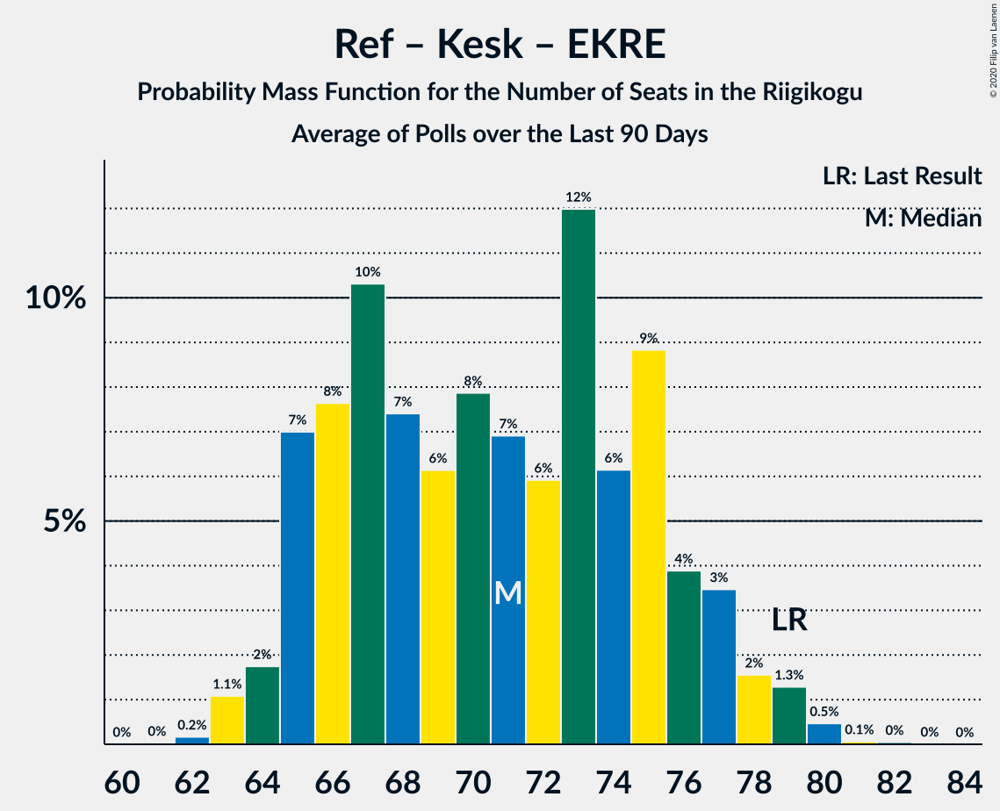

| Number of Seats | Probability | Accumulated | Special Marks |
|:---------------:|:-----------:|:-----------:|:-------------:|
| 61 | 0.1% | 100% |  |
| 62 | 0.2% | 99.9% |  |
| 63 | 0.7% | 99.7% |  |
| 64 | 2% | 99.1% |  |
| 65 | 4% | 97% |  |
| 66 | 8% | 93% |  |
| 67 | 7% | 86% |  |
| 68 | 7% | 78% |  |
| 69 | 6% | 71% |  |
| 70 | 7% | 65% |  |
| 71 | 9% | 58% |  |
| 72 | 13% | 50% | Median |
| 73 | 11% | 37% |  |
| 74 | 12% | 26% |  |
| 75 | 7% | 14% |  |
| 76 | 4% | 7% |  |
| 77 | 2% | 3% |  |
| 78 | 0.5% | 0.7% |  |
| 79 | 0.1% | 0.2% | Last Result |
| 80 | 0% | 0.1% |  |
| 81 | 0% | 0% |  |

### Eesti Reformierakond – Eesti Konservatiivne Rahvaerakond – Erakond Isamaa

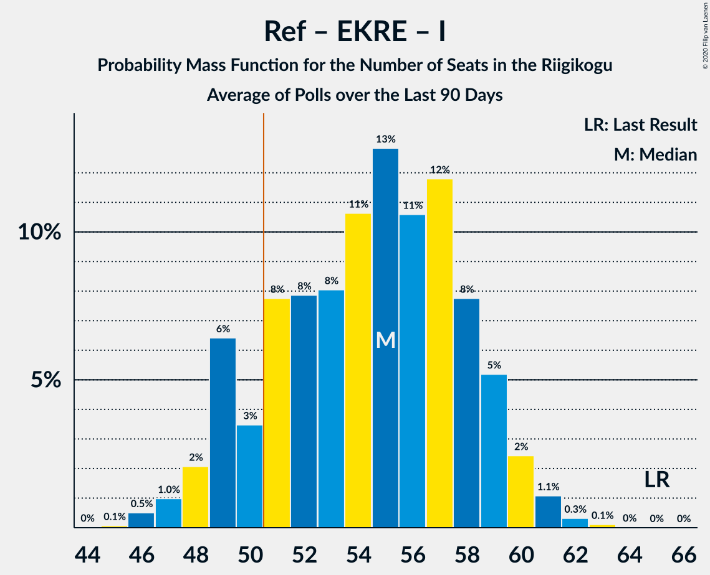

| Number of Seats | Probability | Accumulated | Special Marks |
|:---------------:|:-----------:|:-----------:|:-------------:|
| 50 | 0.1% | 100% |  |
| 51 | 0.5% | 99.8% | Majority |
| 52 | 1.4% | 99.4% |  |
| 53 | 4% | 98% |  |
| 54 | 7% | 94% |  |
| 55 | 10% | 86% |  |
| 56 | 14% | 76% |  |
| 57 | 15% | 62% |  |
| 58 | 13% | 47% | Median |
| 59 | 12% | 34% |  |
| 60 | 8% | 22% |  |
| 61 | 7% | 13% |  |
| 62 | 4% | 7% |  |
| 63 | 2% | 3% |  |
| 64 | 0.5% | 0.8% |  |
| 65 | 0.2% | 0.2% | Last Result |
| 66 | 0% | 0.1% |  |
| 67 | 0% | 0% |  |

### Eesti Keskerakond – Eesti Konservatiivne Rahvaerakond – Erakond Isamaa

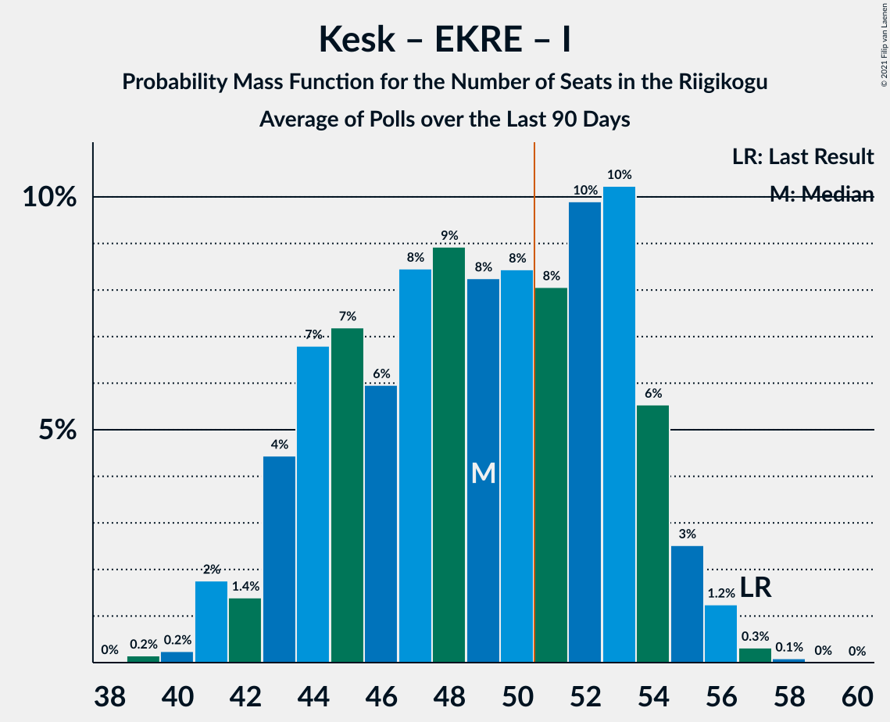

| Number of Seats | Probability | Accumulated | Special Marks |
|:---------------:|:-----------:|:-----------:|:-------------:|
| 44 | 0.1% | 100% |  |
| 45 | 0.5% | 99.9% |  |
| 46 | 1.2% | 99.3% |  |
| 47 | 4% | 98% |  |
| 48 | 6% | 94% |  |
| 49 | 7% | 88% |  |
| 50 | 9% | 81% |  |
| 51 | 7% | 71% | Majority |
| 52 | 8% | 64% |  |
| 53 | 7% | 56% |  |
| 54 | 8% | 49% | Median |
| 55 | 7% | 40% |  |
| 56 | 9% | 33% |  |
| 57 | 6% | 24% | Last Result |
| 58 | 8% | 18% |  |
| 59 | 5% | 10% |  |
| 60 | 3% | 4% |  |
| 61 | 1.1% | 2% |  |
| 62 | 0.4% | 0.4% |  |
| 63 | 0.1% | 0.1% |  |
| 64 | 0% | 0% |  |

### Eesti Reformierakond – Eesti Konservatiivne Rahvaerakond

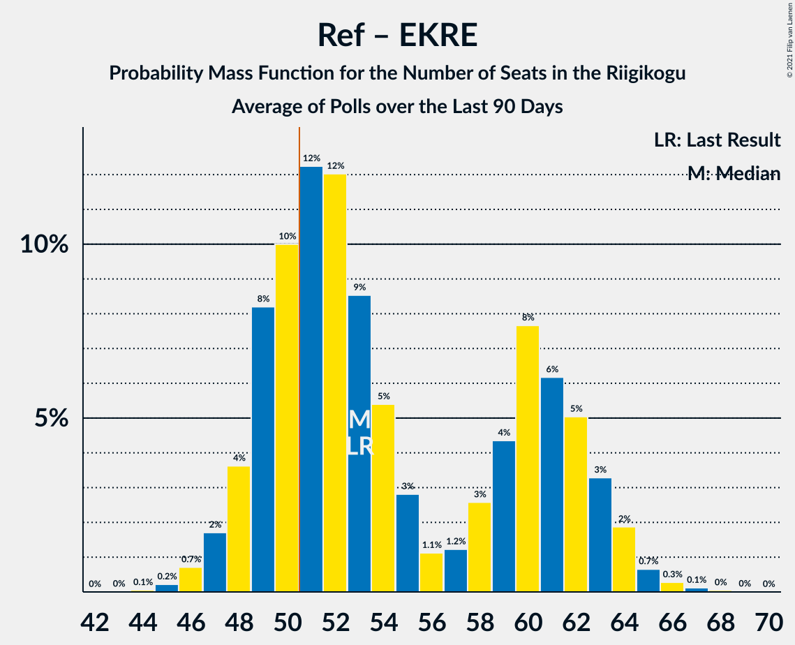

| Number of Seats | Probability | Accumulated | Special Marks |
|:---------------:|:-----------:|:-----------:|:-------------:|
| 42 | 0% | 100% |  |
| 43 | 0.2% | 99.9% |  |
| 44 | 0.9% | 99.7% |  |
| 45 | 2% | 98.9% |  |
| 46 | 6% | 97% |  |
| 47 | 9% | 91% |  |
| 48 | 12% | 82% |  |
| 49 | 13% | 70% |  |
| 50 | 13% | 57% |  |
| 51 | 11% | 44% | Median, Majority |
| 52 | 10% | 34% |  |
| 53 | 10% | 24% | Last Result |
| 54 | 6% | 14% |  |
| 55 | 5% | 8% |  |
| 56 | 2% | 4% |  |
| 57 | 1.1% | 2% |  |
| 58 | 0.3% | 0.5% |  |
| 59 | 0.1% | 0.1% |  |
| 60 | 0% | 0% |  |

### Eesti Keskerakond – Eesti Konservatiivne Rahvaerakond

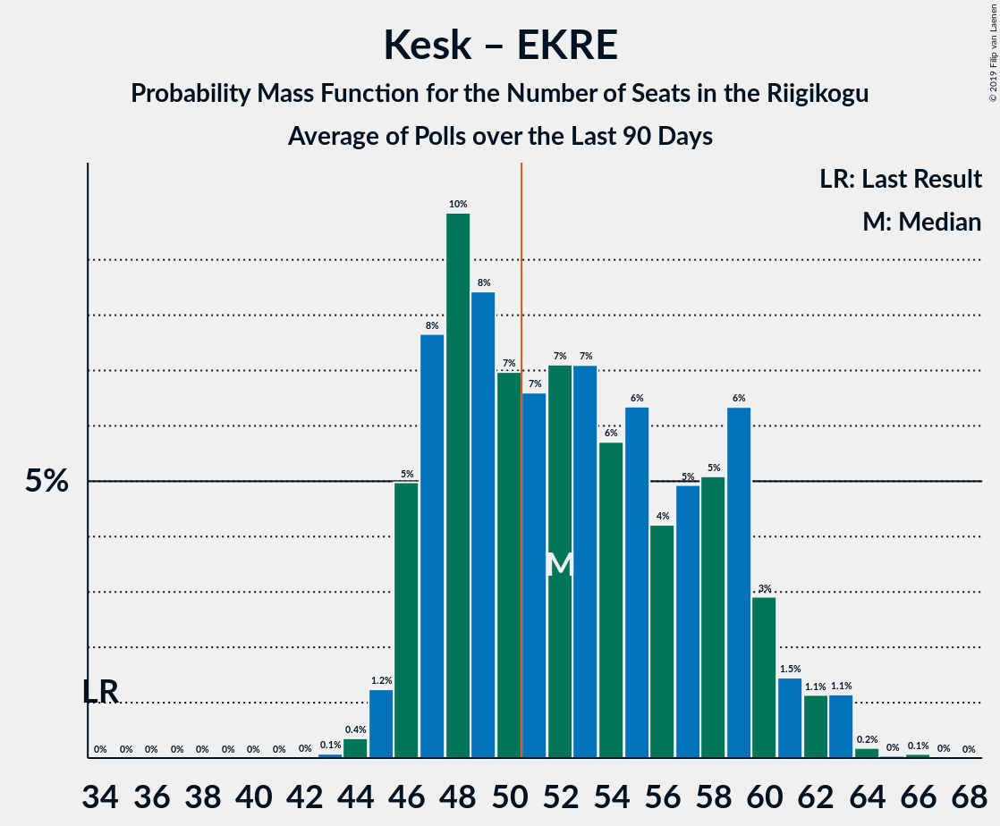

| Number of Seats | Probability | Accumulated | Special Marks |
|:---------------:|:-----------:|:-----------:|:-------------:|
| 37 | 0.2% | 100% |  |
| 38 | 0.7% | 99.8% |  |
| 39 | 2% | 99.0% |  |
| 40 | 5% | 97% |  |
| 41 | 7% | 92% |  |
| 42 | 8% | 85% |  |
| 43 | 7% | 77% |  |
| 44 | 6% | 70% |  |
| 45 | 6% | 64% | Last Result |
| 46 | 8% | 58% |  |
| 47 | 8% | 50% | Median |
| 48 | 10% | 42% |  |
| 49 | 10% | 32% |  |
| 50 | 9% | 23% |  |
| 51 | 7% | 14% | Majority |
| 52 | 4% | 7% |  |
| 53 | 2% | 3% |  |
| 54 | 0.7% | 0.9% |  |
| 55 | 0.2% | 0.2% |  |
| 56 | 0% | 0% |  |

### Eesti Reformierakond – Eesti Keskerakond

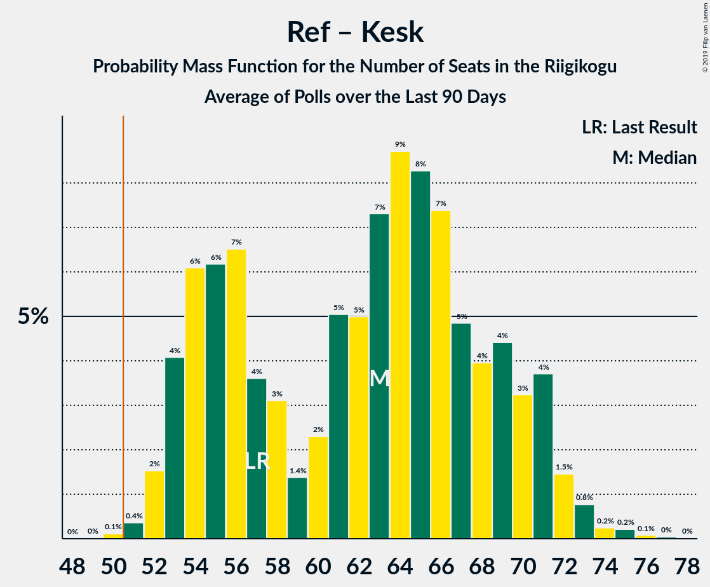

| Number of Seats | Probability | Accumulated | Special Marks |
|:---------------:|:-----------:|:-----------:|:-------------:|
| 38 | 0.1% | 100% |  |
| 39 | 0.4% | 99.9% |  |
| 40 | 1.3% | 99.6% |  |
| 41 | 4% | 98% |  |
| 42 | 8% | 94% |  |
| 43 | 12% | 87% |  |
| 44 | 16% | 74% |  |
| 45 | 16% | 59% |  |
| 46 | 12% | 43% | Median |
| 47 | 9% | 31% |  |
| 48 | 8% | 21% |  |
| 49 | 6% | 13% |  |
| 50 | 4% | 7% |  |
| 51 | 2% | 3% | Majority |
| 52 | 0.9% | 1.3% |  |
| 53 | 0.3% | 0.4% |  |
| 54 | 0.1% | 0.1% |  |
| 55 | 0% | 0% |  |
| 56 | 0% | 0% |  |
| 57 | 0% | 0% |  |
| 58 | 0% | 0% |  |
| 59 | 0% | 0% |  |
| 60 | 0% | 0% | Last Result |

### Eesti Reformierakond – Erakond Isamaa – Sotsiaaldemokraatlik Erakond – Eesti Vabaerakond

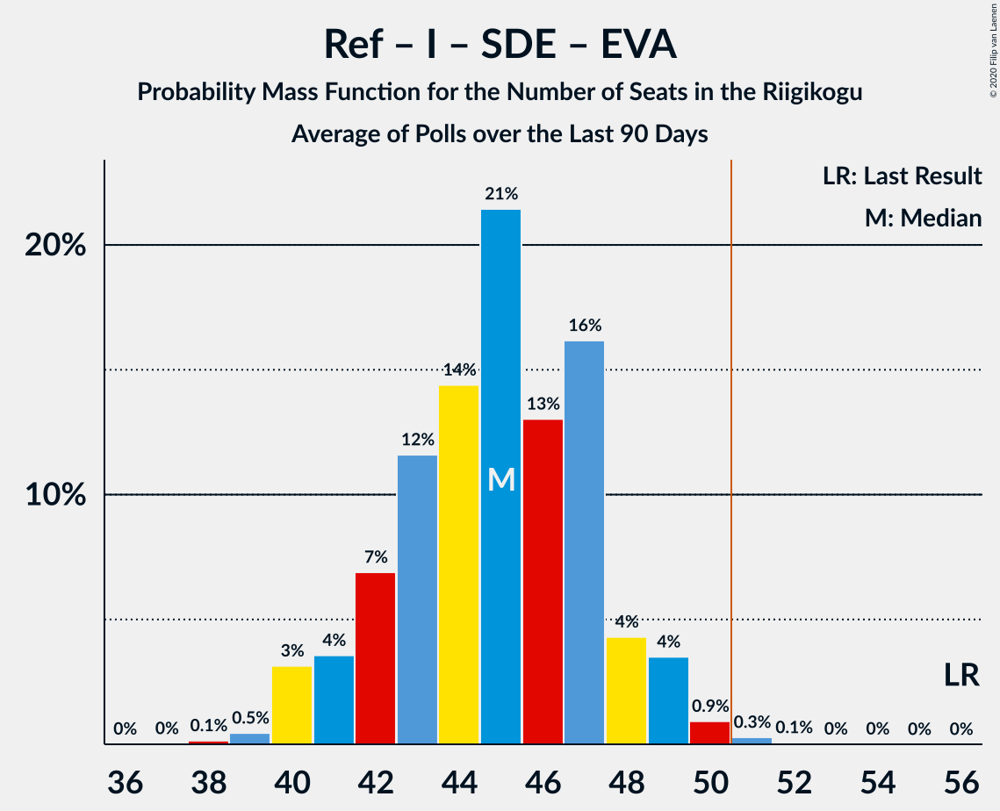

| Number of Seats | Probability | Accumulated | Special Marks |
|:---------------:|:-----------:|:-----------:|:-------------:|
| 33 | 0.1% | 100% |  |
| 34 | 0.5% | 99.9% |  |
| 35 | 2% | 99.4% |  |
| 36 | 3% | 98% |  |
| 37 | 8% | 94% |  |
| 38 | 10% | 86% |  |
| 39 | 13% | 76% |  |
| 40 | 15% | 63% |  |
| 41 | 14% | 48% | Median |
| 42 | 13% | 34% |  |
| 43 | 11% | 21% |  |
| 44 | 5% | 10% |  |
| 45 | 3% | 4% |  |
| 46 | 1.0% | 1.4% |  |
| 47 | 0.3% | 0.4% |  |
| 48 | 0% | 0% |  |
| 49 | 0% | 0% |  |
| 50 | 0% | 0% |  |
| 51 | 0% | 0% | Majority |
| 52 | 0% | 0% |  |
| 53 | 0% | 0% |  |
| 54 | 0% | 0% |  |
| 55 | 0% | 0% |  |
| 56 | 0% | 0% | Last Result |

### Eesti Reformierakond – Erakond Isamaa – Sotsiaaldemokraatlik Erakond

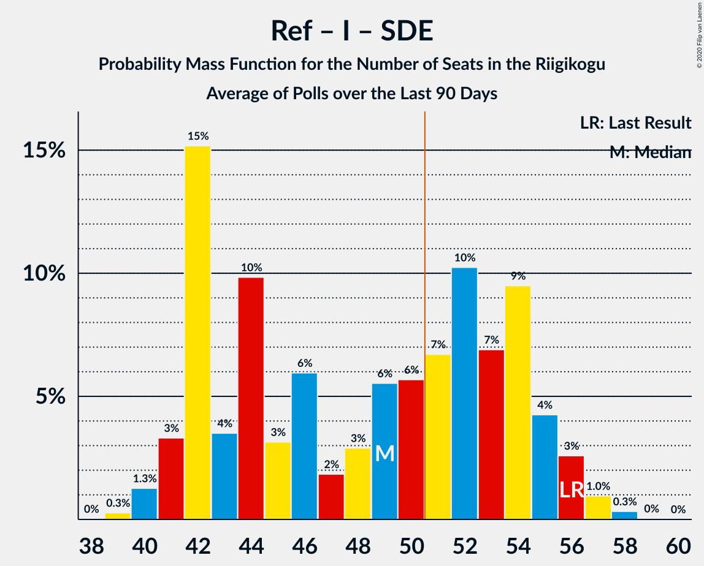

| Number of Seats | Probability | Accumulated | Special Marks |
|:---------------:|:-----------:|:-----------:|:-------------:|
| 33 | 0.1% | 100% |  |
| 34 | 0.5% | 99.9% |  |
| 35 | 2% | 99.4% |  |
| 36 | 3% | 98% |  |
| 37 | 8% | 94% |  |
| 38 | 10% | 86% |  |
| 39 | 13% | 76% |  |
| 40 | 15% | 63% |  |
| 41 | 14% | 48% | Median |
| 42 | 13% | 34% |  |
| 43 | 11% | 21% |  |
| 44 | 5% | 10% |  |
| 45 | 3% | 4% |  |
| 46 | 1.0% | 1.4% |  |
| 47 | 0.3% | 0.4% |  |
| 48 | 0% | 0% |  |
| 49 | 0% | 0% |  |
| 50 | 0% | 0% |  |
| 51 | 0% | 0% | Majority |
| 52 | 0% | 0% |  |
| 53 | 0% | 0% |  |
| 54 | 0% | 0% |  |
| 55 | 0% | 0% |  |
| 56 | 0% | 0% | Last Result |

### Eesti Keskerakond – Erakond Isamaa – Sotsiaaldemokraatlik Erakond

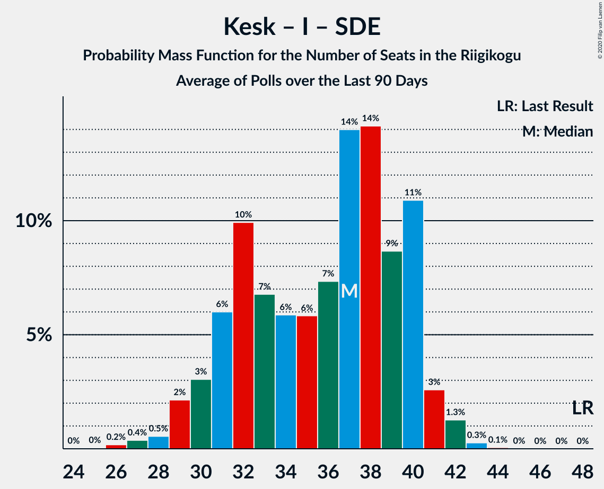

| Number of Seats | Probability | Accumulated | Special Marks |
|:---------------:|:-----------:|:-----------:|:-------------:|
| 28 | 0.1% | 100% |  |
| 29 | 0.2% | 99.9% |  |
| 30 | 0.7% | 99.7% |  |
| 31 | 2% | 99.0% |  |
| 32 | 4% | 97% |  |
| 33 | 7% | 93% |  |
| 34 | 11% | 85% |  |
| 35 | 13% | 74% |  |
| 36 | 15% | 61% |  |
| 37 | 13% | 46% | Median |
| 38 | 14% | 33% |  |
| 39 | 9% | 19% |  |
| 40 | 6% | 10% |  |
| 41 | 3% | 4% |  |
| 42 | 1.2% | 2% |  |
| 43 | 0.3% | 0.4% |  |
| 44 | 0.1% | 0.1% |  |
| 45 | 0% | 0% |  |
| 46 | 0% | 0% |  |
| 47 | 0% | 0% |  |
| 48 | 0% | 0% | Last Result |

### Eesti Konservatiivne Rahvaerakond – Sotsiaaldemokraatlik Erakond

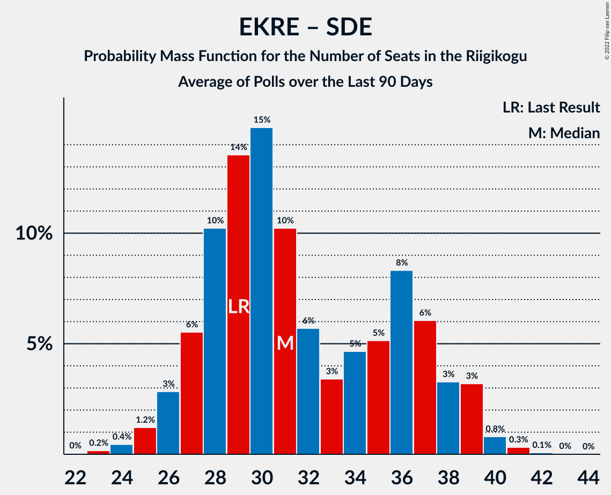

| Number of Seats | Probability | Accumulated | Special Marks |
|:---------------:|:-----------:|:-----------:|:-------------:|
| 27 | 0.1% | 100% |  |
| 28 | 0.5% | 99.8% |  |
| 29 | 2% | 99.4% | Last Result |
| 30 | 6% | 97% |  |
| 31 | 10% | 92% |  |
| 32 | 16% | 81% |  |
| 33 | 14% | 65% |  |
| 34 | 12% | 51% |  |
| 35 | 9% | 39% | Median |
| 36 | 9% | 30% |  |
| 37 | 8% | 21% |  |
| 38 | 6% | 13% |  |
| 39 | 4% | 6% |  |
| 40 | 2% | 3% |  |
| 41 | 0.7% | 0.9% |  |
| 42 | 0.1% | 0.2% |  |
| 43 | 0% | 0.1% |  |
| 44 | 0% | 0% |  |

### Eesti Reformierakond – Sotsiaaldemokraatlik Erakond

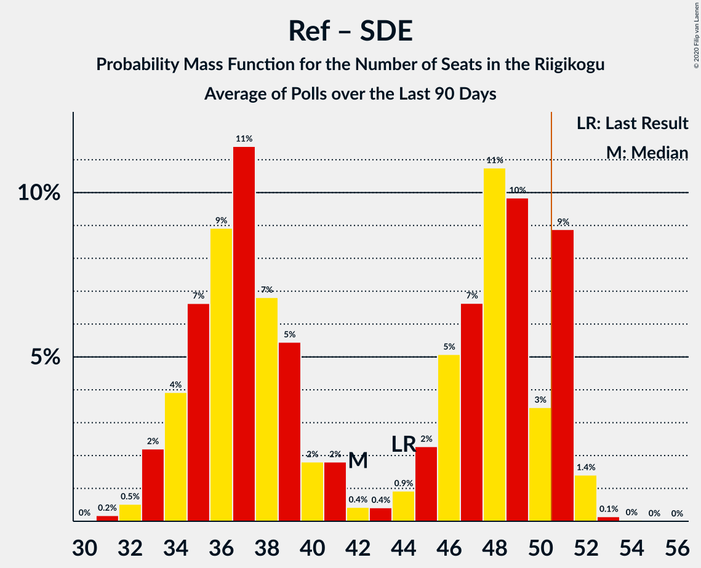

| Number of Seats | Probability | Accumulated | Special Marks |
|:---------------:|:-----------:|:-----------:|:-------------:|
| 26 | 0.1% | 100% |  |
| 27 | 0.8% | 99.9% |  |
| 28 | 2% | 99.1% |  |
| 29 | 4% | 97% |  |
| 30 | 9% | 93% |  |
| 31 | 9% | 84% |  |
| 32 | 14% | 75% |  |
| 33 | 14% | 62% |  |
| 34 | 16% | 48% | Median |
| 35 | 15% | 32% |  |
| 36 | 9% | 17% |  |
| 37 | 6% | 8% |  |
| 38 | 2% | 3% |  |
| 39 | 0.6% | 0.8% |  |
| 40 | 0.1% | 0.1% |  |
| 41 | 0% | 0% |  |
| 42 | 0% | 0% |  |
| 43 | 0% | 0% |  |
| 44 | 0% | 0% | Last Result |

### Eesti Reformierakond – Erakond Isamaa

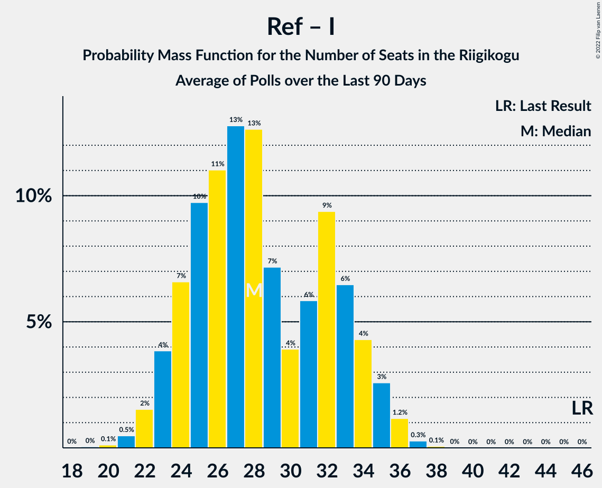

| Number of Seats | Probability | Accumulated | Special Marks |
|:---------------:|:-----------:|:-----------:|:-------------:|
| 24 | 0% | 100% |  |
| 25 | 0.3% | 99.9% |  |
| 26 | 1.0% | 99.6% |  |
| 27 | 3% | 98.6% |  |
| 28 | 6% | 95% |  |
| 29 | 8% | 90% |  |
| 30 | 12% | 81% |  |
| 31 | 12% | 70% |  |
| 32 | 15% | 58% | Median |
| 33 | 16% | 44% |  |
| 34 | 13% | 28% |  |
| 35 | 8% | 15% |  |
| 36 | 4% | 7% |  |
| 37 | 2% | 3% |  |
| 38 | 0.6% | 0.8% |  |
| 39 | 0.1% | 0.2% |  |
| 40 | 0% | 0% |  |
| 41 | 0% | 0% |  |
| 42 | 0% | 0% |  |
| 43 | 0% | 0% |  |
| 44 | 0% | 0% |  |
| 45 | 0% | 0% |  |
| 46 | 0% | 0% | Last Result |

### Eesti Keskerakond – Sotsiaaldemokraatlik Erakond

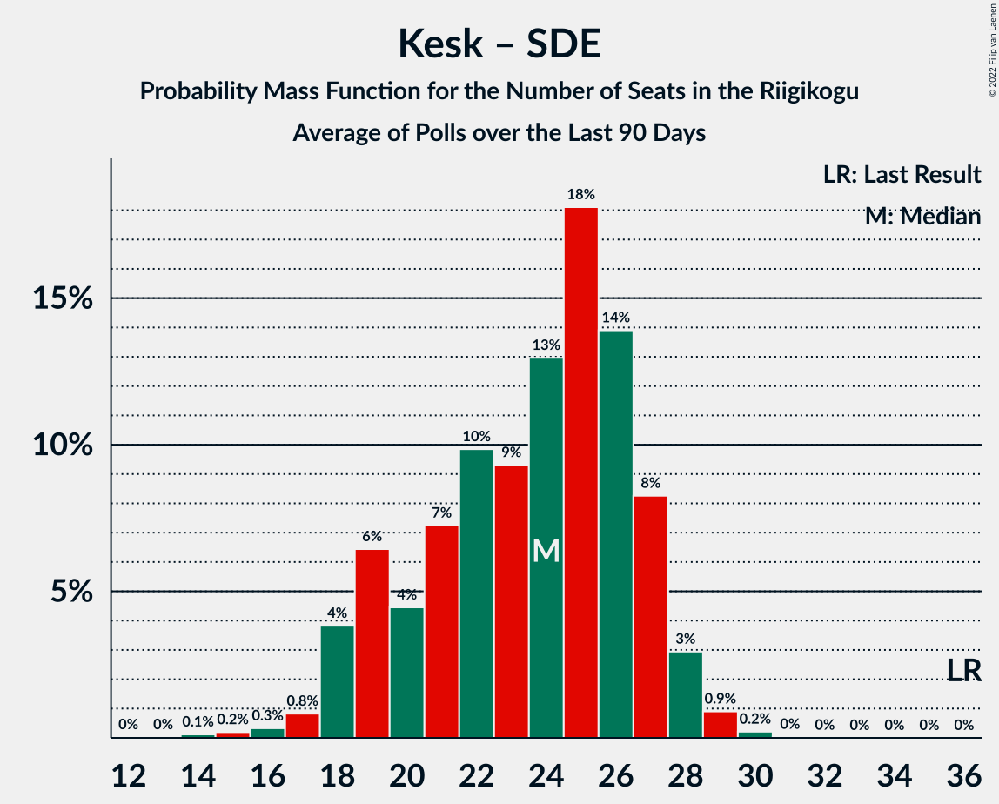

| Number of Seats | Probability | Accumulated | Special Marks |
|:---------------:|:-----------:|:-----------:|:-------------:|
| 22 | 0.1% | 100% |  |
| 23 | 0.3% | 99.9% |  |
| 24 | 1.2% | 99.6% |  |
| 25 | 4% | 98% |  |
| 26 | 7% | 95% |  |
| 27 | 12% | 87% |  |
| 28 | 17% | 76% |  |
| 29 | 18% | 59% |  |
| 30 | 15% | 41% | Median |
| 31 | 12% | 26% |  |
| 32 | 7% | 14% |  |
| 33 | 4% | 7% |  |
| 34 | 2% | 3% |  |
| 35 | 0.5% | 0.7% |  |
| 36 | 0.1% | 0.1% | Last Result |
| 37 | 0% | 0% |  |

## Technical Information

+ **Number of polls included in this average:** 3
+ **Lowest number of simulations done in a poll included in this average:** 1,048,576
+ **Total number of simulations done in the polls included in this average:** 3,145,728
+ **Error estimate:** 1.43%
