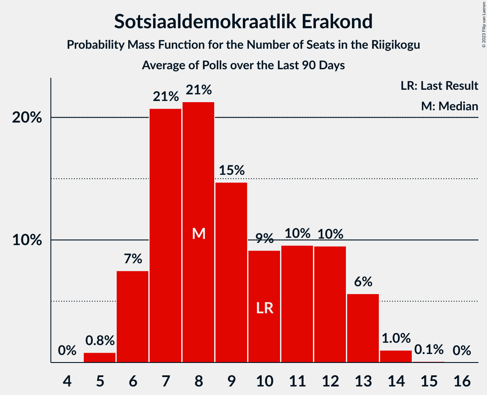

# Poll Average

<a href="#voting-intentions">Voting Intentions</a> | <a href="#seats">Seats</a> | <a href="#coalitions">Coalitions</a> | <a href="#technical-information">Technical Information</a>

## Summary

The table below lists the polls on which the average is based. They are the most recent polls (less than 90 days old) registered and analyzed so far.

| Period     | Polling firm/Commissioner(s) | Ref | Kesk | EKRE | I | SDE | E200 | Rohelised | EVA |
|:----------:|:----------------------------:|:--:|:--:|:--:|:--:|:--:|:--:|:--:|:--:|
| 3 March 2019 | General Election | 28.9%   34 | 23.1%   26 | 17.8%   19 | 11.4%   12 | 9.8%   10 | 4.4%   0 | 1.8%   0 | 1.2%   0 |
| N/A | Poll Average | 23–36%   26–41 | 12–18%   12–19 | 16–23%   17–25 | 5–9%   0–8 | 5–10%   4–10 | 13–22%   12–25 | 1–5%   0 | N/A   N/A |
| [19–25 April 2022](2022-04-25-Norstat.html) | Norstat   MTÜ Ühiskonnauuringute Instituut | 31–37%   34–42 | 15–19%   14–20 | 19–24%   19–25 | 4–7%   0–6 | 5–8%   0–7 | 12–17%   12–17 | 1–3%   0 | N/A   N/A |
| [14–20 April 2022](2022-04-20-KantarEmor.html) | Kantar Emor   ERR | 23–27%   25–30 | 14–18%   14–19 | 16–20%   17–21 | 6–8%   5–8 | 8–11%   7–10 | 19–23%   20–25 | 3–5%   0–4 | N/A   N/A |
| [18 April 2022](2022-04-18-Turu-uuringuteAS.html) | Turu-uuringute AS | 26–34%   29–38 | 11–17%   11–18 | 17–23%   18–25 | 5–9%   4–9 | 5–9%   4–9 | 15–21%   15–23 | 1–3%   0 | N/A   N/A |
| 3 March 2019 | General Election | 28.9%   34 | 23.1%   26 | 17.8%   19 | 11.4%   12 | 9.8%   10 | 4.4%   0 | 1.8%   0 | 1.2%   0 |

Only polls for which at least the sample size has been published are included in the table above.

**Legend:**
+ **Top half of each row:** Voting intentions (95% confidence interval)
+ **Bottom half of each row:** Seat projections for the Riigikogu (95% confidence interval)
+ **Ref:** Eesti Reformierakond
+ **Kesk:** Eesti Keskerakond
+ **EKRE:** Eesti Konservatiivne Rahvaerakond
+ **I:** Erakond Isamaa
+ **SDE:** Sotsiaaldemokraatlik Erakond
+ **E200:** Eesti 200
+ **Rohelised:** Erakond Eestimaa Rohelised
+ **EVA:** Eesti Vabaerakond
+ **N/A (single party):** Party not included the published results
+ **N/A (entire row):** Calculation for this opinion poll not started yet

## Voting Intentions

### Confidence Intervals

| Party | Last Result | Median | 80% Confidence Interval | 90% Confidence Interval | 95% Confidence Interval | 99% Confidence Interval |
|:-----:|:-----------:|:------:|:-----------------------:|:-----------------------:|:-----------------------:|:-----------------------:|
| <a href="#eesti-reformierakond">Eesti Reformierakond</a> | 28.9% | 30.0% | 24.4–34.8% |23.8–35.6% | 23.4–36.2% | 22.6–37.3% |
| <a href="#eesti-keskerakond">Eesti Keskerakond</a> | 23.1% | 15.8% | 13.3–17.6% |12.7–18.1% | 12.1–18.5% | 11.2–19.4% |
| <a href="#eesti-konservatiivne-rahvaerakond">Eesti Konservatiivne Rahvaerakond</a> | 17.8% | 19.7% | 17.3–22.2% |16.8–22.8% | 16.5–23.3% | 15.8–24.3% |
| <a href="#erakond-isamaa">Erakond Isamaa</a> | 11.4% | 6.6% | 5.2–7.9% |4.9–8.4% | 4.7–8.8% | 4.2–9.6% |
| <a href="#sotsiaaldemokraatlik-erakond">Sotsiaaldemokraatlik Erakond</a> | 9.8% | 7.3% | 5.7–9.4% |5.4–9.8% | 5.1–10.1% | 4.7–10.7% |
| <a href="#eesti-200">Eesti 200</a> | 4.4% | 18.1% | 13.7–21.6% |13.1–22.1% | 12.7–22.5% | 12.0–23.3% |
| <a href="#erakond-eestimaa-rohelised">Erakond Eestimaa Rohelised</a> | 1.8% | 2.4% | 1.6–4.3% |1.4–4.6% | 1.3–4.8% | 1.0–5.3% |
| <a href="#eesti-vabaerakond">Eesti Vabaerakond</a> | 1.2% | N/A | N/A |N/A | N/A | N/A |

### Eesti Reformierakond

*For a full overview of the results for this party, see the [Eesti Reformierakond](party-eestireformierakond.html) page.*

| Voting Intentions | Probability | Accumulated | Special Marks |
|:-----------------:|:-----------:|:-----------:|:-------------:|
| 20.5–21.5% | 0% | 100% |  |
| 21.5–22.5% | 0.4% | 100% |  |
| 22.5–23.5% | 3% | 99.5% |  |
| 23.5–24.5% | 9% | 97% |  |
| 24.5–25.5% | 12% | 88% |  |
| 25.5–26.5% | 8% | 77% |  |
| 26.5–27.5% | 4% | 68% |  |
| 27.5–28.5% | 4% | 64% |  |
| 28.5–29.5% | 6% | 60% | Last Result |
| 29.5–30.5% | 7% | 53% | Median |
| 30.5–31.5% | 7% | 46% |  |
| 31.5–32.5% | 8% | 39% |  |
| 32.5–33.5% | 9% | 31% |  |
| 33.5–34.5% | 10% | 22% |  |
| 34.5–35.5% | 7% | 12% |  |
| 35.5–36.5% | 4% | 5% |  |
| 36.5–37.5% | 1.3% | 2% |  |
| 37.5–38.5% | 0.3% | 0.3% |  |
| 38.5–39.5% | 0% | 0.1% |  |
| 39.5–40.5% | 0% | 0% |  |

### Eesti Keskerakond

*For a full overview of the results for this party, see the [Eesti Keskerakond](party-eestikeskerakond.html) page.*

| Voting Intentions | Probability | Accumulated | Special Marks |
|:-----------------:|:-----------:|:-----------:|:-------------:|
| 8.5–9.5% | 0% | 100% |  |
| 9.5–10.5% | 0.1% | 100% |  |
| 10.5–11.5% | 0.9% | 99.9% |  |
| 11.5–12.5% | 3% | 99.0% |  |
| 12.5–13.5% | 8% | 96% |  |
| 13.5–14.5% | 12% | 88% |  |
| 14.5–15.5% | 20% | 76% |  |
| 15.5–16.5% | 27% | 57% | Median |
| 16.5–17.5% | 19% | 30% |  |
| 17.5–18.5% | 8% | 11% |  |
| 18.5–19.5% | 2% | 2% |  |
| 19.5–20.5% | 0.3% | 0.4% |  |
| 20.5–21.5% | 0% | 0% |  |
| 21.5–22.5% | 0% | 0% |  |
| 22.5–23.5% | 0% | 0% | Last Result |

### Eesti Konservatiivne Rahvaerakond

*For a full overview of the results for this party, see the [Eesti Konservatiivne Rahvaerakond](party-eestikonservatiivnerahvaerakond.html) page.*

| Voting Intentions | Probability | Accumulated | Special Marks |
|:-----------------:|:-----------:|:-----------:|:-------------:|
| 13.5–14.5% | 0% | 100% |  |
| 14.5–15.5% | 0.2% | 100% |  |
| 15.5–16.5% | 3% | 99.8% |  |
| 16.5–17.5% | 10% | 97% |  |
| 17.5–18.5% | 17% | 87% | Last Result |
| 18.5–19.5% | 17% | 69% |  |
| 19.5–20.5% | 17% | 52% | Median |
| 20.5–21.5% | 17% | 35% |  |
| 21.5–22.5% | 11% | 18% |  |
| 22.5–23.5% | 5% | 6% |  |
| 23.5–24.5% | 1.3% | 2% |  |
| 24.5–25.5% | 0.2% | 0.3% |  |
| 25.5–26.5% | 0% | 0% |  |

### Erakond Isamaa

*For a full overview of the results for this party, see the [Erakond Isamaa](party-erakondisamaa.html) page.*

| Voting Intentions | Probability | Accumulated | Special Marks |
|:-----------------:|:-----------:|:-----------:|:-------------:|
| 2.5–3.5% | 0% | 100% |  |
| 3.5–4.5% | 2% | 100% |  |
| 4.5–5.5% | 15% | 98% |  |
| 5.5–6.5% | 31% | 83% |  |
| 6.5–7.5% | 34% | 53% | Median |
| 7.5–8.5% | 15% | 18% |  |
| 8.5–9.5% | 3% | 4% |  |
| 9.5–10.5% | 0.5% | 0.5% |  |
| 10.5–11.5% | 0.1% | 0.1% | Last Result |
| 11.5–12.5% | 0% | 0% |  |

### Sotsiaaldemokraatlik Erakond

*For a full overview of the results for this party, see the [Sotsiaaldemokraatlik Erakond](party-sotsiaaldemokraatlikerakond.html) page.*

| Voting Intentions | Probability | Accumulated | Special Marks |
|:-----------------:|:-----------:|:-----------:|:-------------:|
| 2.5–3.5% | 0% | 100% |  |
| 3.5–4.5% | 0.3% | 100% |  |
| 4.5–5.5% | 7% | 99.7% |  |
| 5.5–6.5% | 24% | 93% |  |
| 6.5–7.5% | 23% | 68% | Median |
| 7.5–8.5% | 18% | 46% |  |
| 8.5–9.5% | 19% | 28% |  |
| 9.5–10.5% | 7% | 8% | Last Result |
| 10.5–11.5% | 0.8% | 0.8% |  |
| 11.5–12.5% | 0% | 0% |  |

### Eesti 200

*For a full overview of the results for this party, see the [Eesti 200](party-eesti200.html) page.*

| Voting Intentions | Probability | Accumulated | Special Marks |
|:-----------------:|:-----------:|:-----------:|:-------------:|
| 3.5–4.5% | 0% | 100% | Last Result |
| 4.5–5.5% | 0% | 100% |  |
| 5.5–6.5% | 0% | 100% |  |
| 6.5–7.5% | 0% | 100% |  |
| 7.5–8.5% | 0% | 100% |  |
| 8.5–9.5% | 0% | 100% |  |
| 9.5–10.5% | 0% | 100% |  |
| 10.5–11.5% | 0.2% | 100% |  |
| 11.5–12.5% | 2% | 99.8% |  |
| 12.5–13.5% | 7% | 98% |  |
| 13.5–14.5% | 12% | 91% |  |
| 14.5–15.5% | 10% | 79% |  |
| 15.5–16.5% | 7% | 69% |  |
| 16.5–17.5% | 8% | 62% |  |
| 17.5–18.5% | 9% | 54% | Median |
| 18.5–19.5% | 9% | 46% |  |
| 19.5–20.5% | 12% | 36% |  |
| 20.5–21.5% | 14% | 24% |  |
| 21.5–22.5% | 8% | 10% |  |
| 22.5–23.5% | 2% | 2% |  |
| 23.5–24.5% | 0.3% | 0.3% |  |
| 24.5–25.5% | 0% | 0% |  |

### Erakond Eestimaa Rohelised

*For a full overview of the results for this party, see the [Erakond Eestimaa Rohelised](party-erakondeestimaarohelised.html) page.*

| Voting Intentions | Probability | Accumulated | Special Marks |
|:-----------------:|:-----------:|:-----------:|:-------------:|
| 0.0–0.5% | 0% | 100% |  |
| 0.5–1.5% | 9% | 100% |  |
| 1.5–2.5% | 45% | 91% | Last Result, Median |
| 2.5–3.5% | 18% | 47% |  |
| 3.5–4.5% | 23% | 29% |  |
| 4.5–5.5% | 6% | 6% |  |
| 5.5–6.5% | 0.1% | 0.1% |  |
| 6.5–7.5% | 0% | 0% |  |

## Seats

### Confidence Intervals

| Party | Last Result | Median | 80% Confidence Interval | 90% Confidence Interval | 95% Confidence Interval | 99% Confidence Interval |
|:-----:|:-----------:|:------:|:-----------------------:|:-----------------------:|:-----------------------:|:-----------------------:|
| <a href="#eesti-reformierakond">Eesti Reformierakond</a> | 34 | 34 | 27–39 |26–40 | 26–41 | 25–43 |
| <a href="#eesti-keskerakond">Eesti Keskerakond</a> | 26 | 16 | 13–18 |12–19 | 12–19 | 11–20 |
| <a href="#eesti-konservatiivne-rahvaerakond">Eesti Konservatiivne Rahvaerakond</a> | 19 | 21 | 18–24 |18–24 | 17–25 | 16–26 |
| <a href="#erakond-isamaa">Erakond Isamaa</a> | 12 | 6 | 4–7 |0–8 | 0–8 | 0–9 |
| <a href="#sotsiaaldemokraatlik-erakond">Sotsiaaldemokraatlik Erakond</a> | 10 | 7 | 5–9 |4–10 | 4–10 | 0–11 |
| <a href="#eesti-200">Eesti 200</a> | 0 | 19 | 13–23 |13–24 | 12–25 | 11–26 |
| <a href="#erakond-eestimaa-rohelised">Erakond Eestimaa Rohelised</a> | 0 | 0 | 0 |0 | 0 | 0–4 |
| <a href="#eesti-vabaerakond">Eesti Vabaerakond</a> | 0 | N/A | N/A |N/A | N/A | N/A |

### Eesti Reformierakond

*For a full overview of the results for this party, see the [Eesti Reformierakond](party-eestireformierakond.html) page.*

| Number of Seats | Probability | Accumulated | Special Marks |
|:---------------:|:-----------:|:-----------:|:-------------:|
| 23 | 0.1% | 100% |  |
| 24 | 0.3% | 99.9% |  |
| 25 | 2% | 99.6% |  |
| 26 | 7% | 98% |  |
| 27 | 7% | 91% |  |
| 28 | 8% | 84% |  |
| 29 | 7% | 76% |  |
| 30 | 4% | 69% |  |
| 31 | 4% | 65% |  |
| 32 | 5% | 61% |  |
| 33 | 6% | 56% |  |
| 34 | 6% | 50% | Last Result, Median |
| 35 | 6% | 44% |  |
| 36 | 7% | 38% |  |
| 37 | 8% | 30% |  |
| 38 | 7% | 22% |  |
| 39 | 6% | 15% |  |
| 40 | 4% | 9% |  |
| 41 | 3% | 5% |  |
| 42 | 1.0% | 2% |  |
| 43 | 0.5% | 0.7% |  |
| 44 | 0.1% | 0.2% |  |
| 45 | 0% | 0.1% |  |
| 46 | 0% | 0% |  |

### Eesti Keskerakond

*For a full overview of the results for this party, see the [Eesti Keskerakond](party-eestikeskerakond.html) page.*

| Number of Seats | Probability | Accumulated | Special Marks |
|:---------------:|:-----------:|:-----------:|:-------------:|
| 10 | 0.2% | 100% |  |
| 11 | 1.0% | 99.8% |  |
| 12 | 4% | 98.7% |  |
| 13 | 7% | 95% |  |
| 14 | 8% | 88% |  |
| 15 | 15% | 80% |  |
| 16 | 22% | 65% | Median |
| 17 | 22% | 43% |  |
| 18 | 13% | 21% |  |
| 19 | 6% | 8% |  |
| 20 | 1.5% | 2% |  |
| 21 | 0.3% | 0.4% |  |
| 22 | 0.1% | 0.1% |  |
| 23 | 0% | 0% |  |
| 24 | 0% | 0% |  |
| 25 | 0% | 0% |  |
| 26 | 0% | 0% | Last Result |

### Eesti Konservatiivne Rahvaerakond

*For a full overview of the results for this party, see the [Eesti Konservatiivne Rahvaerakond](party-eestikonservatiivnerahvaerakond.html) page.*

| Number of Seats | Probability | Accumulated | Special Marks |
|:---------------:|:-----------:|:-----------:|:-------------:|
| 15 | 0.1% | 100% |  |
| 16 | 0.5% | 99.9% |  |
| 17 | 4% | 99.4% |  |
| 18 | 11% | 96% |  |
| 19 | 17% | 84% | Last Result |
| 20 | 15% | 68% |  |
| 21 | 15% | 53% | Median |
| 22 | 15% | 38% |  |
| 23 | 11% | 23% |  |
| 24 | 8% | 12% |  |
| 25 | 3% | 4% |  |
| 26 | 1.0% | 1.5% |  |
| 27 | 0.4% | 0.5% |  |
| 28 | 0.1% | 0.1% |  |
| 29 | 0% | 0% |  |

### Erakond Isamaa

*For a full overview of the results for this party, see the [Erakond Isamaa](party-erakondisamaa.html) page.*

| Number of Seats | Probability | Accumulated | Special Marks |
|:---------------:|:-----------:|:-----------:|:-------------:|
| 0 | 7% | 100% |  |
| 1 | 0% | 93% |  |
| 2 | 0% | 93% |  |
| 3 | 0% | 93% |  |
| 4 | 7% | 93% |  |
| 5 | 23% | 85% |  |
| 6 | 31% | 62% | Median |
| 7 | 24% | 31% |  |
| 8 | 6% | 8% |  |
| 9 | 1.2% | 1.5% |  |
| 10 | 0.2% | 0.2% |  |
| 11 | 0% | 0% |  |
| 12 | 0% | 0% | Last Result |

### Sotsiaaldemokraatlik Erakond

*For a full overview of the results for this party, see the [Sotsiaaldemokraatlik Erakond](party-sotsiaaldemokraatlikerakond.html) page.*

| Number of Seats | Probability | Accumulated | Special Marks |
|:---------------:|:-----------:|:-----------:|:-------------:|
| 0 | 2% | 100% |  |
| 1 | 0% | 98% |  |
| 2 | 0% | 98% |  |
| 3 | 0% | 98% |  |
| 4 | 3% | 98% |  |
| 5 | 21% | 95% |  |
| 6 | 23% | 74% |  |
| 7 | 15% | 51% | Median |
| 8 | 16% | 36% |  |
| 9 | 15% | 20% |  |
| 10 | 4% | 5% | Last Result |
| 11 | 0.5% | 0.5% |  |
| 12 | 0% | 0% |  |

### Eesti 200

*For a full overview of the results for this party, see the [Eesti 200](party-eesti200.html) page.*

| Number of Seats | Probability | Accumulated | Special Marks |
|:---------------:|:-----------:|:-----------:|:-------------:|
| 0 | 0% | 100% | Last Result |
| 1 | 0% | 100% |  |
| 2 | 0% | 100% |  |
| 3 | 0% | 100% |  |
| 4 | 0% | 100% |  |
| 5 | 0% | 100% |  |
| 6 | 0% | 100% |  |
| 7 | 0% | 100% |  |
| 8 | 0% | 100% |  |
| 9 | 0% | 100% |  |
| 10 | 0% | 100% |  |
| 11 | 0.5% | 100% |  |
| 12 | 3% | 99.5% |  |
| 13 | 7% | 97% |  |
| 14 | 10% | 90% |  |
| 15 | 8% | 80% |  |
| 16 | 7% | 72% |  |
| 17 | 5% | 65% |  |
| 18 | 7% | 60% |  |
| 19 | 7% | 53% | Median |
| 20 | 7% | 46% |  |
| 21 | 8% | 39% |  |
| 22 | 11% | 31% |  |
| 23 | 11% | 20% |  |
| 24 | 7% | 10% |  |
| 25 | 2% | 3% |  |
| 26 | 0.5% | 0.6% |  |
| 27 | 0.1% | 0.1% |  |
| 28 | 0% | 0% |  |

### Erakond Eestimaa Rohelised

*For a full overview of the results for this party, see the [Erakond Eestimaa Rohelised](party-erakondeestimaarohelised.html) page.*

| Number of Seats | Probability | Accumulated | Special Marks |
|:---------------:|:-----------:|:-----------:|:-------------:|
| 0 | 99.0% | 100% | Last Result, Median |
| 1 | 0% | 1.0% |  |
| 2 | 0% | 1.0% |  |
| 3 | 0% | 1.0% |  |
| 4 | 0.8% | 1.0% |  |
| 5 | 0.2% | 0.2% |  |
| 6 | 0% | 0% |  |

### Eesti Vabaerakond

*For a full overview of the results for this party, see the [Eesti Vabaerakond](party-eestivabaerakond.html) page.*

## Coalitions

### Confidence Intervals

| Coalition | Last Result | Median | Majority? | 80% Confidence Interval | 90% Confidence Interval | 95% Confidence Interval | 99% Confidence Interval |
|:---------:|:-----------:|:------:|:---------:|:-----------------------:|:-----------------------:|:-----------------------:|:-----------------------:|
| Eesti Reformierakond – Eesti Keskerakond – Eesti Konservatiivne Rahvaerakond | 79 | 69 | 100% | 62–78 | 62–80 | 61–81 | 60–83 |
| Eesti Reformierakond – Eesti Konservatiivne Rahvaerakond – Erakond Isamaa | 65 | 61 | 98% | 52–66 | 51–67 | 51–67 | 49–69 |
| Eesti Reformierakond – Eesti Konservatiivne Rahvaerakond | 53 | 55 | 66% | 46–62 | 45–63 | 44–64 | 43–65 |
| Eesti Reformierakond – Eesti Keskerakond | 60 | 48 | 38% | 43–57 | 42–58 | 42–59 | 41–60 |
| Eesti Reformierakond – Erakond Isamaa – Sotsiaaldemokraatlik Erakond – Eesti Vabaerakond | 56 | 45 | 5% | 42–50 | 41–50 | 40–51 | 39–52 |
| Eesti Reformierakond – Erakond Isamaa – Sotsiaaldemokraatlik Erakond | 56 | 45 | 5% | 42–50 | 41–50 | 40–51 | 39–52 |
| Eesti Keskerakond – Eesti Konservatiivne Rahvaerakond – Erakond Isamaa | 57 | 43 | 0% | 40–45 | 39–46 | 38–47 | 36–48 |
| Eesti Reformierakond – Sotsiaaldemokraatlik Erakond | 44 | 40 | 0% | 35–45 | 35–46 | 34–47 | 33–48 |
| Eesti Reformierakond – Erakond Isamaa | 46 | 39 | 0% | 33–44 | 33–45 | 32–46 | 31–47 |
| Eesti Keskerakond – Eesti Konservatiivne Rahvaerakond | 45 | 36 | 0% | 34–40 | 33–41 | 32–42 | 31–44 |
| Eesti Keskerakond – Erakond Isamaa – Sotsiaaldemokraatlik Erakond | 48 | 28 | 0% | 24–32 | 23–33 | 22–34 | 20–35 |
| Eesti Konservatiivne Rahvaerakond – Sotsiaaldemokraatlik Erakond | 29 | 28 | 0% | 25–30 | 25–31 | 24–31 | 22–33 |
| Eesti Keskerakond – Sotsiaaldemokraatlik Erakond | 36 | 23 | 0% | 19–26 | 18–27 | 18–27 | 16–28 |

### Eesti Reformierakond – Eesti Keskerakond – Eesti Konservatiivne Rahvaerakond

| Number of Seats | Probability | Accumulated | Special Marks |
|:---------------:|:-----------:|:-----------:|:-------------:|
| 58 | 0.1% | 100% |  |
| 59 | 0.3% | 99.9% |  |
| 60 | 0.5% | 99.5% |  |
| 61 | 3% | 99.1% |  |
| 62 | 7% | 96% |  |
| 63 | 11% | 89% |  |
| 64 | 7% | 78% |  |
| 65 | 4% | 71% |  |
| 66 | 3% | 67% |  |
| 67 | 4% | 64% |  |
| 68 | 5% | 60% |  |
| 69 | 7% | 55% |  |
| 70 | 5% | 48% |  |
| 71 | 4% | 43% | Median |
| 72 | 3% | 39% |  |
| 73 | 2% | 36% |  |
| 74 | 3% | 34% |  |
| 75 | 4% | 31% |  |
| 76 | 5% | 27% |  |
| 77 | 7% | 22% |  |
| 78 | 5% | 15% |  |
| 79 | 3% | 10% | Last Result |
| 80 | 2% | 7% |  |
| 81 | 2% | 4% |  |
| 82 | 1.1% | 2% |  |
| 83 | 0.7% | 0.9% |  |
| 84 | 0.1% | 0.3% |  |
| 85 | 0% | 0.1% |  |
| 86 | 0% | 0.1% |  |
| 87 | 0% | 0% |  |

### Eesti Reformierakond – Eesti Konservatiivne Rahvaerakond – Erakond Isamaa

| Number of Seats | Probability | Accumulated | Special Marks |
|:---------------:|:-----------:|:-----------:|:-------------:|
| 48 | 0.1% | 100% |  |
| 49 | 0.5% | 99.8% |  |
| 50 | 1.5% | 99.4% |  |
| 51 | 4% | 98% | Majority |
| 52 | 7% | 94% |  |
| 53 | 8% | 86% |  |
| 54 | 7% | 78% |  |
| 55 | 3% | 72% |  |
| 56 | 2% | 68% |  |
| 57 | 1.4% | 66% |  |
| 58 | 2% | 65% |  |
| 59 | 4% | 63% |  |
| 60 | 5% | 59% |  |
| 61 | 7% | 54% | Median |
| 62 | 9% | 47% |  |
| 63 | 11% | 38% |  |
| 64 | 8% | 27% |  |
| 65 | 7% | 19% | Last Result |
| 66 | 5% | 12% |  |
| 67 | 4% | 6% |  |
| 68 | 1.3% | 2% |  |
| 69 | 0.8% | 1.2% |  |
| 70 | 0.2% | 0.4% |  |
| 71 | 0.1% | 0.2% |  |
| 72 | 0% | 0% |  |

### Eesti Reformierakond – Eesti Konservatiivne Rahvaerakond

| Number of Seats | Probability | Accumulated | Special Marks |
|:---------------:|:-----------:|:-----------:|:-------------:|
| 42 | 0.2% | 100% |  |
| 43 | 0.6% | 99.8% |  |
| 44 | 3% | 99.2% |  |
| 45 | 6% | 97% |  |
| 46 | 8% | 91% |  |
| 47 | 8% | 83% |  |
| 48 | 5% | 75% |  |
| 49 | 3% | 70% |  |
| 50 | 1.3% | 67% |  |
| 51 | 2% | 66% | Majority |
| 52 | 3% | 64% |  |
| 53 | 4% | 62% | Last Result |
| 54 | 6% | 58% |  |
| 55 | 5% | 52% | Median |
| 56 | 6% | 47% |  |
| 57 | 6% | 41% |  |
| 58 | 7% | 35% |  |
| 59 | 7% | 29% |  |
| 60 | 6% | 22% |  |
| 61 | 5% | 16% |  |
| 62 | 4% | 10% |  |
| 63 | 3% | 7% |  |
| 64 | 2% | 3% |  |
| 65 | 1.0% | 1.5% |  |
| 66 | 0.3% | 0.5% |  |
| 67 | 0.2% | 0.2% |  |
| 68 | 0% | 0.1% |  |
| 69 | 0% | 0% |  |

### Eesti Reformierakond – Eesti Keskerakond

| Number of Seats | Probability | Accumulated | Special Marks |
|:---------------:|:-----------:|:-----------:|:-------------:|
| 39 | 0% | 100% |  |
| 40 | 0.3% | 99.9% |  |
| 41 | 1.4% | 99.6% |  |
| 42 | 3% | 98% |  |
| 43 | 6% | 95% |  |
| 44 | 10% | 88% |  |
| 45 | 11% | 79% |  |
| 46 | 8% | 68% |  |
| 47 | 7% | 60% |  |
| 48 | 6% | 53% |  |
| 49 | 5% | 47% |  |
| 50 | 4% | 42% | Median |
| 51 | 3% | 38% | Majority |
| 52 | 4% | 35% |  |
| 53 | 4% | 31% |  |
| 54 | 6% | 27% |  |
| 55 | 7% | 21% |  |
| 56 | 4% | 14% |  |
| 57 | 5% | 10% |  |
| 58 | 3% | 5% |  |
| 59 | 2% | 3% |  |
| 60 | 0.6% | 1.1% | Last Result |
| 61 | 0.3% | 0.5% |  |
| 62 | 0.1% | 0.2% |  |
| 63 | 0% | 0.1% |  |
| 64 | 0% | 0% |  |

### Eesti Reformierakond – Erakond Isamaa – Sotsiaaldemokraatlik Erakond – Eesti Vabaerakond

| Number of Seats | Probability | Accumulated | Special Marks |
|:---------------:|:-----------:|:-----------:|:-------------:|
| 38 | 0.2% | 100% |  |
| 39 | 0.8% | 99.8% |  |
| 40 | 2% | 99.0% |  |
| 41 | 5% | 97% |  |
| 42 | 9% | 92% |  |
| 43 | 12% | 83% |  |
| 44 | 11% | 71% |  |
| 45 | 11% | 60% |  |
| 46 | 11% | 49% |  |
| 47 | 11% | 38% | Median |
| 48 | 9% | 27% |  |
| 49 | 8% | 18% |  |
| 50 | 5% | 10% |  |
| 51 | 3% | 5% | Majority |
| 52 | 1.3% | 2% |  |
| 53 | 0.2% | 0.4% |  |
| 54 | 0.1% | 0.1% |  |
| 55 | 0% | 0% |  |
| 56 | 0% | 0% | Last Result |

### Eesti Reformierakond – Erakond Isamaa – Sotsiaaldemokraatlik Erakond

| Number of Seats | Probability | Accumulated | Special Marks |
|:---------------:|:-----------:|:-----------:|:-------------:|
| 38 | 0.2% | 100% |  |
| 39 | 0.8% | 99.8% |  |
| 40 | 2% | 99.0% |  |
| 41 | 5% | 97% |  |
| 42 | 9% | 92% |  |
| 43 | 12% | 83% |  |
| 44 | 11% | 71% |  |
| 45 | 11% | 60% |  |
| 46 | 11% | 49% |  |
| 47 | 11% | 38% | Median |
| 48 | 9% | 27% |  |
| 49 | 8% | 18% |  |
| 50 | 5% | 10% |  |
| 51 | 3% | 5% | Majority |
| 52 | 1.3% | 2% |  |
| 53 | 0.2% | 0.4% |  |
| 54 | 0.1% | 0.1% |  |
| 55 | 0% | 0% |  |
| 56 | 0% | 0% | Last Result |

### Eesti Keskerakond – Eesti Konservatiivne Rahvaerakond – Erakond Isamaa

| Number of Seats | Probability | Accumulated | Special Marks |
|:---------------:|:-----------:|:-----------:|:-------------:|
| 34 | 0% | 100% |  |
| 35 | 0.1% | 99.9% |  |
| 36 | 0.3% | 99.8% |  |
| 37 | 0.9% | 99.5% |  |
| 38 | 2% | 98.6% |  |
| 39 | 5% | 96% |  |
| 40 | 13% | 91% |  |
| 41 | 14% | 78% |  |
| 42 | 14% | 64% |  |
| 43 | 20% | 51% | Median |
| 44 | 14% | 30% |  |
| 45 | 7% | 16% |  |
| 46 | 5% | 9% |  |
| 47 | 2% | 4% |  |
| 48 | 1.1% | 2% |  |
| 49 | 0.3% | 0.4% |  |
| 50 | 0.1% | 0.2% |  |
| 51 | 0% | 0% | Majority |
| 52 | 0% | 0% |  |
| 53 | 0% | 0% |  |
| 54 | 0% | 0% |  |
| 55 | 0% | 0% |  |
| 56 | 0% | 0% |  |
| 57 | 0% | 0% | Last Result |

### Eesti Reformierakond – Sotsiaaldemokraatlik Erakond

| Number of Seats | Probability | Accumulated | Special Marks |
|:---------------:|:-----------:|:-----------:|:-------------:|
| 32 | 0.2% | 100% |  |
| 33 | 1.2% | 99.7% |  |
| 34 | 3% | 98.6% |  |
| 35 | 8% | 96% |  |
| 36 | 9% | 87% |  |
| 37 | 8% | 78% |  |
| 38 | 10% | 70% |  |
| 39 | 7% | 60% |  |
| 40 | 9% | 53% |  |
| 41 | 7% | 44% | Median |
| 42 | 9% | 36% |  |
| 43 | 9% | 27% |  |
| 44 | 7% | 19% | Last Result |
| 45 | 6% | 12% |  |
| 46 | 4% | 6% |  |
| 47 | 2% | 3% |  |
| 48 | 0.7% | 1.1% |  |
| 49 | 0.3% | 0.4% |  |
| 50 | 0.1% | 0.1% |  |
| 51 | 0% | 0% | Majority |

### Eesti Reformierakond – Erakond Isamaa

| Number of Seats | Probability | Accumulated | Special Marks |
|:---------------:|:-----------:|:-----------:|:-------------:|
| 30 | 0.2% | 100% |  |
| 31 | 1.2% | 99.7% |  |
| 32 | 3% | 98% |  |
| 33 | 7% | 95% |  |
| 34 | 8% | 88% |  |
| 35 | 9% | 79% |  |
| 36 | 5% | 71% |  |
| 37 | 5% | 66% |  |
| 38 | 5% | 61% |  |
| 39 | 8% | 56% |  |
| 40 | 8% | 48% | Median |
| 41 | 11% | 41% |  |
| 42 | 9% | 29% |  |
| 43 | 9% | 21% |  |
| 44 | 6% | 12% |  |
| 45 | 4% | 6% |  |
| 46 | 2% | 3% | Last Result |
| 47 | 0.7% | 0.9% |  |
| 48 | 0.2% | 0.2% |  |
| 49 | 0.1% | 0.1% |  |
| 50 | 0% | 0% |  |

### Eesti Keskerakond – Eesti Konservatiivne Rahvaerakond

| Number of Seats | Probability | Accumulated | Special Marks |
|:---------------:|:-----------:|:-----------:|:-------------:|
| 29 | 0.1% | 100% |  |
| 30 | 0.3% | 99.9% |  |
| 31 | 0.9% | 99.6% |  |
| 32 | 2% | 98.7% |  |
| 33 | 5% | 97% |  |
| 34 | 12% | 92% |  |
| 35 | 15% | 80% |  |
| 36 | 17% | 65% |  |
| 37 | 11% | 48% | Median |
| 38 | 10% | 37% |  |
| 39 | 9% | 27% |  |
| 40 | 8% | 18% |  |
| 41 | 5% | 10% |  |
| 42 | 3% | 5% |  |
| 43 | 1.3% | 2% |  |
| 44 | 0.6% | 0.9% |  |
| 45 | 0.2% | 0.3% | Last Result |
| 46 | 0% | 0.1% |  |
| 47 | 0% | 0% |  |

### Eesti Keskerakond – Erakond Isamaa – Sotsiaaldemokraatlik Erakond

| Number of Seats | Probability | Accumulated | Special Marks |
|:---------------:|:-----------:|:-----------:|:-------------:|
| 18 | 0.1% | 100% |  |
| 19 | 0.1% | 99.9% |  |
| 20 | 0.3% | 99.8% |  |
| 21 | 0.8% | 99.4% |  |
| 22 | 2% | 98.7% |  |
| 23 | 4% | 97% |  |
| 24 | 5% | 93% |  |
| 25 | 8% | 88% |  |
| 26 | 8% | 80% |  |
| 27 | 12% | 72% |  |
| 28 | 13% | 60% |  |
| 29 | 9% | 47% | Median |
| 30 | 8% | 37% |  |
| 31 | 10% | 29% |  |
| 32 | 10% | 19% |  |
| 33 | 5% | 9% |  |
| 34 | 3% | 4% |  |
| 35 | 0.8% | 1.0% |  |
| 36 | 0.1% | 0.1% |  |
| 37 | 0% | 0% |  |
| 38 | 0% | 0% |  |
| 39 | 0% | 0% |  |
| 40 | 0% | 0% |  |
| 41 | 0% | 0% |  |
| 42 | 0% | 0% |  |
| 43 | 0% | 0% |  |
| 44 | 0% | 0% |  |
| 45 | 0% | 0% |  |
| 46 | 0% | 0% |  |
| 47 | 0% | 0% |  |
| 48 | 0% | 0% | Last Result |

### Eesti Konservatiivne Rahvaerakond – Sotsiaaldemokraatlik Erakond

| Number of Seats | Probability | Accumulated | Special Marks |
|:---------------:|:-----------:|:-----------:|:-------------:|
| 20 | 0.1% | 100% |  |
| 21 | 0.2% | 99.9% |  |
| 22 | 0.4% | 99.7% |  |
| 23 | 1.0% | 99.3% |  |
| 24 | 3% | 98% |  |
| 25 | 8% | 95% |  |
| 26 | 15% | 87% |  |
| 27 | 22% | 72% |  |
| 28 | 20% | 50% | Median |
| 29 | 17% | 30% | Last Result |
| 30 | 7% | 13% |  |
| 31 | 3% | 6% |  |
| 32 | 1.5% | 2% |  |
| 33 | 0.5% | 0.6% |  |
| 34 | 0.1% | 0.2% |  |
| 35 | 0% | 0.1% |  |
| 36 | 0% | 0% |  |

### Eesti Keskerakond – Sotsiaaldemokraatlik Erakond

| Number of Seats | Probability | Accumulated | Special Marks |
|:---------------:|:-----------:|:-----------:|:-------------:|
| 13 | 0% | 100% |  |
| 14 | 0.1% | 99.9% |  |
| 15 | 0.3% | 99.8% |  |
| 16 | 0.5% | 99.6% |  |
| 17 | 1.1% | 99.1% |  |
| 18 | 4% | 98% |  |
| 19 | 7% | 94% |  |
| 20 | 7% | 87% |  |
| 21 | 11% | 81% |  |
| 22 | 14% | 70% |  |
| 23 | 14% | 55% | Median |
| 24 | 12% | 41% |  |
| 25 | 14% | 29% |  |
| 26 | 9% | 15% |  |
| 27 | 5% | 6% |  |
| 28 | 1.2% | 1.5% |  |
| 29 | 0.2% | 0.3% |  |
| 30 | 0% | 0% |  |
| 31 | 0% | 0% |  |
| 32 | 0% | 0% |  |
| 33 | 0% | 0% |  |
| 34 | 0% | 0% |  |
| 35 | 0% | 0% |  |
| 36 | 0% | 0% | Last Result |

## Technical Information

+ **Number of polls included in this average:** 3
+ **Lowest number of simulations done in a poll included in this average:** 1,048,576
+ **Total number of simulations done in the polls included in this average:** 3,145,728
+ **Error estimate:** 1.94%
