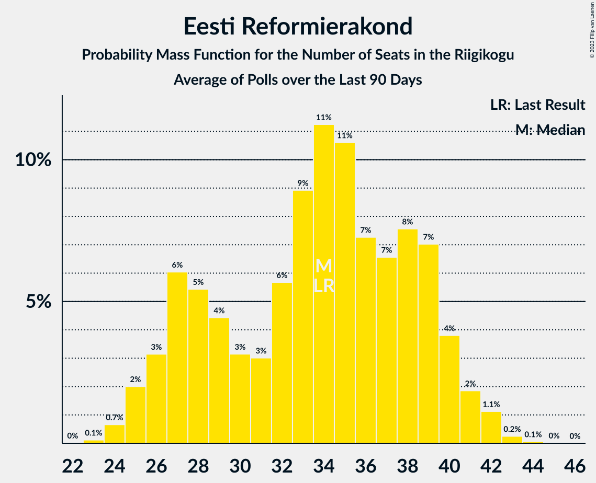

# Poll Average

<a href="#voting-intentions">Voting Intentions</a> | <a href="#seats">Seats</a> | <a href="#coalitions">Coalitions</a> | <a href="#technical-information">Technical Information</a>

## Summary

The table below lists the polls on which the average is based. They are the most recent polls (less than 90 days old) registered and analyzed so far.

| Period     | Polling firm/Commissioner(s) | Ref | Kesk | EKRE | I | SDE | E200 | Rohelised | EVA |
|:----------:|:----------------------------:|:--:|:--:|:--:|:--:|:--:|:--:|:--:|:--:|
| 3 March 2019 | General Election | 28.9%   34 | 23.1%   26 | 17.8%   19 | 11.4%   12 | 9.8%   10 | 4.4%   0 | 1.8%   0 | 1.2%   0 |
| N/A | Poll Average | 25–32%   27–38 | 16–30%   18–34 | 15–21%   16–23 | 3–8%   0–8 | 7–11%   6–12 | 5–16%   5–17 | 1–4%   0 | 0–2%   0 |
| [21–27 April 2020](2020-04-27-Norstat.html) | Norstat   MTÜ Ühiskonnauuringute Instituut | 26–32%   30–38 | 25–30%   28–35 | 16–21%   16–23 | 4–7%   0–6 | 7–10%   6–10 | 5–8%   0–8 | 1–3%   0 | 0–1%   0 |
| [20–22 April 2020](2020-04-22-KantarEmor.html) | Kantar Emor   BNS and Postimees | 27–33%   32–39 | 16–20%   17–23 | 17–21%   18–24 | 3–5%   0–5 | 8–12%   8–13 | 12–16%   12–18 | 2–4%   0 | 0–1%   0 |
| [6–7 April 2020](2020-04-07-Turu-uuringuteAS.html) | Turu-uuringute AS   ERR | 24–30%   27–31 | 21–27%   23–31 | 15–19%   16–22 | 6–9%   5–9 | 6–10%   7–10 | 9–13%   9–13 | 1–3%   0 | 1–2%   0 |
| 3 March 2019 | General Election | 28.9%   34 | 23.1%   26 | 17.8%   19 | 11.4%   12 | 9.8%   10 | 4.4%   0 | 1.8%   0 | 1.2%   0 |

Only polls for which at least the sample size has been published are included in the table above.

**Legend:**
+ **Top half of each row:** Voting intentions (95% confidence interval)
+ **Bottom half of each row:** Seat projections for the Riigikogu (95% confidence interval)
+ **Ref:** Eesti Reformierakond
+ **Kesk:** Eesti Keskerakond
+ **EKRE:** Eesti Konservatiivne Rahvaerakond
+ **I:** Erakond Isamaa
+ **SDE:** Sotsiaaldemokraatlik Erakond
+ **E200:** Eesti 200
+ **Rohelised:** Erakond Eestimaa Rohelised
+ **EVA:** Eesti Vabaerakond
+ **N/A (single party):** Party not included the published results
+ **N/A (entire row):** Calculation for this opinion poll not started yet

## Voting Intentions

### Confidence Intervals

| Party | Last Result | Median | 80% Confidence Interval | 90% Confidence Interval | 95% Confidence Interval | 99% Confidence Interval |
|:-----:|:-----------:|:------:|:-----------------------:|:-----------------------:|:-----------------------:|:-----------------------:|
| <a href="#eesti-reformierakond">Eesti Reformierakond</a> | 28.9% | 28.7% | 26.2–30.9% |25.6–31.6% | 25.0–32.1% | 24.1–33.1% |
| <a href="#eesti-keskerakond">Eesti Keskerakond</a> | 23.1% | 24.0% | 17.2–28.4% |16.6–29.1% | 16.2–29.7% | 15.3–30.8% |
| <a href="#eesti-konservatiivne-rahvaerakond">Eesti Konservatiivne Rahvaerakond</a> | 17.8% | 18.0% | 16.2–19.8% |15.7–20.4% | 15.3–20.8% | 14.5–21.7% |
| <a href="#erakond-isamaa">Erakond Isamaa</a> | 11.4% | 5.4% | 3.7–7.5% |3.4–7.9% | 3.2–8.3% | 2.8–8.9% |
| <a href="#sotsiaaldemokraatlik-erakond">Sotsiaaldemokraatlik Erakond</a> | 9.8% | 8.6% | 7.2–10.5% |6.9–11.0% | 6.7–11.4% | 6.2–12.1% |
| <a href="#eesti-200">Eesti 200</a> | 4.4% | 11.0% | 5.9–14.5% |5.5–15.1% | 5.2–15.5% | 4.7–16.4% |
| <a href="#erakond-eestimaa-rohelised">Erakond Eestimaa Rohelised</a> | 1.8% | 2.4% | 1.7–3.4% |1.5–3.6% | 1.4–3.9% | 1.2–4.4% |
| <a href="#eesti-vabaerakond">Eesti Vabaerakond</a> | 1.2% | 0.7% | 0.2–1.3% |0.1–1.5% | 0.1–1.6% | 0.1–1.9% |

### Eesti Reformierakond

*For a full overview of the results for this party, see the [Eesti Reformierakond](party-eestireformierakond.html) page.*

| Voting Intentions | Probability | Accumulated | Special Marks |
|:-----------------:|:-----------:|:-----------:|:-------------:|
| 21.5–22.5% | 0% | 100% |  |
| 22.5–23.5% | 0.2% | 100% |  |
| 23.5–24.5% | 1.0% | 99.8% |  |
| 24.5–25.5% | 4% | 98.8% |  |
| 25.5–26.5% | 9% | 95% |  |
| 26.5–27.5% | 14% | 86% |  |
| 27.5–28.5% | 19% | 72% |  |
| 28.5–29.5% | 21% | 53% | Last Result, Median |
| 29.5–30.5% | 17% | 32% |  |
| 30.5–31.5% | 10% | 15% |  |
| 31.5–32.5% | 4% | 5% |  |
| 32.5–33.5% | 1.0% | 1.2% |  |
| 33.5–34.5% | 0.2% | 0.2% |  |
| 34.5–35.5% | 0% | 0% |  |

### Eesti Keskerakond

*For a full overview of the results for this party, see the [Eesti Keskerakond](party-eestikeskerakond.html) page.*

| Voting Intentions | Probability | Accumulated | Special Marks |
|:-----------------:|:-----------:|:-----------:|:-------------:|
| 13.5–14.5% | 0.1% | 100% |  |
| 14.5–15.5% | 0.7% | 99.9% |  |
| 15.5–16.5% | 4% | 99.2% |  |
| 16.5–17.5% | 9% | 95% |  |
| 17.5–18.5% | 11% | 87% |  |
| 18.5–19.5% | 7% | 76% |  |
| 19.5–20.5% | 2% | 69% |  |
| 20.5–21.5% | 1.3% | 67% |  |
| 21.5–22.5% | 4% | 66% |  |
| 22.5–23.5% | 8% | 62% | Last Result |
| 23.5–24.5% | 10% | 55% | Median |
| 24.5–25.5% | 9% | 45% |  |
| 25.5–26.5% | 8% | 36% |  |
| 26.5–27.5% | 10% | 27% |  |
| 27.5–28.5% | 9% | 18% |  |
| 28.5–29.5% | 6% | 9% |  |
| 29.5–30.5% | 2% | 3% |  |
| 30.5–31.5% | 0.6% | 0.7% |  |
| 31.5–32.5% | 0.1% | 0.1% |  |
| 32.5–33.5% | 0% | 0% |  |

### Eesti Konservatiivne Rahvaerakond

*For a full overview of the results for this party, see the [Eesti Konservatiivne Rahvaerakond](party-eestikonservatiivnerahvaerakond.html) page.*

| Voting Intentions | Probability | Accumulated | Special Marks |
|:-----------------:|:-----------:|:-----------:|:-------------:|
| 12.5–13.5% | 0% | 100% |  |
| 13.5–14.5% | 0.5% | 100% |  |
| 14.5–15.5% | 3% | 99.5% |  |
| 15.5–16.5% | 12% | 96% |  |
| 16.5–17.5% | 22% | 84% |  |
| 17.5–18.5% | 27% | 62% | Last Result, Median |
| 18.5–19.5% | 21% | 35% |  |
| 19.5–20.5% | 10% | 14% |  |
| 20.5–21.5% | 3% | 4% |  |
| 21.5–22.5% | 0.6% | 0.6% |  |
| 22.5–23.5% | 0.1% | 0.1% |  |
| 23.5–24.5% | 0% | 0% |  |

### Erakond Isamaa

*For a full overview of the results for this party, see the [Erakond Isamaa](party-erakondisamaa.html) page.*

| Voting Intentions | Probability | Accumulated | Special Marks |
|:-----------------:|:-----------:|:-----------:|:-------------:|
| 0.5–1.5% | 0% | 100% |  |
| 1.5–2.5% | 0.1% | 100% |  |
| 2.5–3.5% | 7% | 99.9% |  |
| 3.5–4.5% | 23% | 93% |  |
| 4.5–5.5% | 23% | 69% | Median |
| 5.5–6.5% | 20% | 46% |  |
| 6.5–7.5% | 17% | 27% |  |
| 7.5–8.5% | 8% | 9% |  |
| 8.5–9.5% | 1.3% | 1.4% |  |
| 9.5–10.5% | 0.1% | 0.1% |  |
| 10.5–11.5% | 0% | 0% | Last Result |

### Sotsiaaldemokraatlik Erakond

*For a full overview of the results for this party, see the [Sotsiaaldemokraatlik Erakond](party-sotsiaaldemokraatlikerakond.html) page.*

| Voting Intentions | Probability | Accumulated | Special Marks |
|:-----------------:|:-----------:|:-----------:|:-------------:|
| 4.5–5.5% | 0% | 100% |  |
| 5.5–6.5% | 2% | 100% |  |
| 6.5–7.5% | 15% | 98% |  |
| 7.5–8.5% | 31% | 83% |  |
| 8.5–9.5% | 26% | 52% | Median |
| 9.5–10.5% | 17% | 26% | Last Result |
| 10.5–11.5% | 7% | 9% |  |
| 11.5–12.5% | 2% | 2% |  |
| 12.5–13.5% | 0.2% | 0.2% |  |
| 13.5–14.5% | 0% | 0% |  |

### Eesti 200

*For a full overview of the results for this party, see the [Eesti 200](party-eesti200.html) page.*

| Voting Intentions | Probability | Accumulated | Special Marks |
|:-----------------:|:-----------:|:-----------:|:-------------:|
| 2.5–3.5% | 0% | 100% |  |
| 3.5–4.5% | 0.2% | 100% | Last Result |
| 4.5–5.5% | 5% | 99.8% |  |
| 5.5–6.5% | 16% | 94% |  |
| 6.5–7.5% | 10% | 78% |  |
| 7.5–8.5% | 2% | 69% |  |
| 8.5–9.5% | 2% | 67% |  |
| 9.5–10.5% | 8% | 65% |  |
| 10.5–11.5% | 13% | 57% | Median |
| 11.5–12.5% | 11% | 43% |  |
| 12.5–13.5% | 11% | 32% |  |
| 13.5–14.5% | 12% | 21% |  |
| 14.5–15.5% | 7% | 9% |  |
| 15.5–16.5% | 2% | 2% |  |
| 16.5–17.5% | 0.3% | 0.3% |  |
| 17.5–18.5% | 0% | 0% |  |

### Erakond Eestimaa Rohelised

*For a full overview of the results for this party, see the [Erakond Eestimaa Rohelised](party-erakondeestimaarohelised.html) page.*

| Voting Intentions | Probability | Accumulated | Special Marks |
|:-----------------:|:-----------:|:-----------:|:-------------:|
| 0.0–0.5% | 0% | 100% |  |
| 0.5–1.5% | 6% | 100% |  |
| 1.5–2.5% | 54% | 94% | Last Result, Median |
| 2.5–3.5% | 34% | 40% |  |
| 3.5–4.5% | 6% | 6% |  |
| 4.5–5.5% | 0.2% | 0.2% |  |
| 5.5–6.5% | 0% | 0% |  |

### Eesti Vabaerakond

*For a full overview of the results for this party, see the [Eesti Vabaerakond](party-eestivabaerakond.html) page.*

| Voting Intentions | Probability | Accumulated | Special Marks |
|:-----------------:|:-----------:|:-----------:|:-------------:|
| 0.0–0.5% | 38% | 100% |  |
| 0.5–1.5% | 59% | 62% | Last Result, Median |
| 1.5–2.5% | 3% | 3% |  |
| 2.5–3.5% | 0% | 0% |  |

## Seats

### Confidence Intervals

| Party | Last Result | Median | 80% Confidence Interval | 90% Confidence Interval | 95% Confidence Interval | 99% Confidence Interval |
|:-----:|:-----------:|:------:|:-----------------------:|:-----------------------:|:-----------------------:|:-----------------------:|
| <a href="#eesti-reformierakond">Eesti Reformierakond</a> | 34 | 33 | 28–37 |27–37 | 27–38 | 26–40 |
| <a href="#eesti-keskerakond">Eesti Keskerakond</a> | 26 | 27 | 19–32 |18–34 | 18–34 | 16–36 |
| <a href="#eesti-konservatiivne-rahvaerakond">Eesti Konservatiivne Rahvaerakond</a> | 19 | 19 | 17–22 |16–23 | 16–23 | 16–24 |
| <a href="#erakond-isamaa">Erakond Isamaa</a> | 12 | 5 | 0–7 |0–8 | 0–8 | 0–9 |
| <a href="#sotsiaaldemokraatlik-erakond">Sotsiaaldemokraatlik Erakond</a> | 10 | 9 | 7–11 |6–11 | 6–12 | 6–13 |
| <a href="#eesti-200">Eesti 200</a> | 0 | 11 | 5–15 |5–17 | 5–17 | 0–18 |
| <a href="#erakond-eestimaa-rohelised">Erakond Eestimaa Rohelised</a> | 0 | 0 | 0 |0 | 0 | 0 |
| <a href="#eesti-vabaerakond">Eesti Vabaerakond</a> | 0 | 0 | 0 |0 | 0 | 0 |

### Eesti Reformierakond

*For a full overview of the results for this party, see the [Eesti Reformierakond](party-eestireformierakond.html) page.*

| Number of Seats | Probability | Accumulated | Special Marks |
|:---------------:|:-----------:|:-----------:|:-------------:|
| 25 | 0% | 100% |  |
| 26 | 0.6% | 99.9% |  |
| 27 | 6% | 99.3% |  |
| 28 | 5% | 93% |  |
| 29 | 7% | 88% |  |
| 30 | 14% | 81% |  |
| 31 | 5% | 66% |  |
| 32 | 9% | 61% |  |
| 33 | 10% | 52% | Median |
| 34 | 13% | 41% | Last Result |
| 35 | 11% | 28% |  |
| 36 | 7% | 17% |  |
| 37 | 8% | 11% |  |
| 38 | 2% | 3% |  |
| 39 | 0.4% | 1.2% |  |
| 40 | 0.7% | 0.8% |  |
| 41 | 0.1% | 0.1% |  |
| 42 | 0% | 0% |  |

### Eesti Keskerakond

*For a full overview of the results for this party, see the [Eesti Keskerakond](party-eestikeskerakond.html) page.*

| Number of Seats | Probability | Accumulated | Special Marks |
|:---------------:|:-----------:|:-----------:|:-------------:|
| 15 | 0.1% | 100% |  |
| 16 | 0.6% | 99.9% |  |
| 17 | 0.9% | 99.3% |  |
| 18 | 6% | 98% |  |
| 19 | 7% | 92% |  |
| 20 | 9% | 85% |  |
| 21 | 5% | 76% |  |
| 22 | 3% | 71% |  |
| 23 | 3% | 69% |  |
| 24 | 1.0% | 66% |  |
| 25 | 2% | 65% |  |
| 26 | 7% | 63% | Last Result |
| 27 | 9% | 57% | Median |
| 28 | 7% | 48% |  |
| 29 | 11% | 41% |  |
| 30 | 8% | 31% |  |
| 31 | 7% | 23% |  |
| 32 | 8% | 16% |  |
| 33 | 3% | 8% |  |
| 34 | 4% | 6% |  |
| 35 | 0.9% | 2% |  |
| 36 | 0.6% | 0.8% |  |
| 37 | 0.1% | 0.2% |  |
| 38 | 0.2% | 0.2% |  |
| 39 | 0% | 0% |  |

### Eesti Konservatiivne Rahvaerakond

*For a full overview of the results for this party, see the [Eesti Konservatiivne Rahvaerakond](party-eestikonservatiivnerahvaerakond.html) page.*

| Number of Seats | Probability | Accumulated | Special Marks |
|:---------------:|:-----------:|:-----------:|:-------------:|
| 14 | 0.1% | 100% |  |
| 15 | 0.3% | 99.9% |  |
| 16 | 6% | 99.6% |  |
| 17 | 10% | 94% |  |
| 18 | 15% | 84% |  |
| 19 | 21% | 69% | Last Result, Median |
| 20 | 19% | 48% |  |
| 21 | 13% | 29% |  |
| 22 | 9% | 16% |  |
| 23 | 6% | 7% |  |
| 24 | 0.8% | 1.2% |  |
| 25 | 0.3% | 0.4% |  |
| 26 | 0% | 0.1% |  |
| 27 | 0% | 0% |  |

### Erakond Isamaa

*For a full overview of the results for this party, see the [Erakond Isamaa](party-erakondisamaa.html) page.*

| Number of Seats | Probability | Accumulated | Special Marks |
|:---------------:|:-----------:|:-----------:|:-------------:|
| 0 | 39% | 100% |  |
| 1 | 0% | 61% |  |
| 2 | 0% | 61% |  |
| 3 | 0% | 61% |  |
| 4 | 5% | 61% |  |
| 5 | 22% | 56% | Median |
| 6 | 14% | 34% |  |
| 7 | 12% | 20% |  |
| 8 | 6% | 8% |  |
| 9 | 2% | 2% |  |
| 10 | 0.1% | 0.1% |  |
| 11 | 0% | 0% |  |
| 12 | 0% | 0% | Last Result |

### Sotsiaaldemokraatlik Erakond

*For a full overview of the results for this party, see the [Sotsiaaldemokraatlik Erakond](party-sotsiaaldemokraatlikerakond.html) page.*

| Number of Seats | Probability | Accumulated | Special Marks |
|:---------------:|:-----------:|:-----------:|:-------------:|
| 5 | 0.3% | 100% |  |
| 6 | 5% | 99.7% |  |
| 7 | 10% | 94% |  |
| 8 | 26% | 84% |  |
| 9 | 32% | 59% | Median |
| 10 | 15% | 27% | Last Result |
| 11 | 8% | 12% |  |
| 12 | 2% | 3% |  |
| 13 | 2% | 2% |  |
| 14 | 0.1% | 0.1% |  |
| 15 | 0% | 0% |  |

### Eesti 200

*For a full overview of the results for this party, see the [Eesti 200](party-eesti200.html) page.*

| Number of Seats | Probability | Accumulated | Special Marks |
|:---------------:|:-----------:|:-----------:|:-------------:|
| 0 | 1.4% | 100% | Last Result |
| 1 | 0% | 98.6% |  |
| 2 | 0% | 98.6% |  |
| 3 | 0% | 98.6% |  |
| 4 | 1.0% | 98.6% |  |
| 5 | 10% | 98% |  |
| 6 | 13% | 87% |  |
| 7 | 6% | 74% |  |
| 8 | 2% | 68% |  |
| 9 | 2% | 66% |  |
| 10 | 11% | 64% |  |
| 11 | 9% | 52% | Median |
| 12 | 8% | 43% |  |
| 13 | 6% | 35% |  |
| 14 | 12% | 29% |  |
| 15 | 8% | 17% |  |
| 16 | 4% | 9% |  |
| 17 | 3% | 5% |  |
| 18 | 2% | 2% |  |
| 19 | 0.1% | 0.1% |  |
| 20 | 0% | 0% |  |

### Erakond Eestimaa Rohelised

*For a full overview of the results for this party, see the [Erakond Eestimaa Rohelised](party-erakondeestimaarohelised.html) page.*

| Number of Seats | Probability | Accumulated | Special Marks |
|:---------------:|:-----------:|:-----------:|:-------------:|
| 0 | 100% | 100% | Last Result, Median |

### Eesti Vabaerakond

*For a full overview of the results for this party, see the [Eesti Vabaerakond](party-eestivabaerakond.html) page.*

| Number of Seats | Probability | Accumulated | Special Marks |
|:---------------:|:-----------:|:-----------:|:-------------:|
| 0 | 100% | 100% | Last Result, Median |

## Coalitions

### Confidence Intervals

| Coalition | Last Result | Median | Majority? | 80% Confidence Interval | 90% Confidence Interval | 95% Confidence Interval | 99% Confidence Interval |
|:---------:|:-----------:|:------:|:---------:|:-----------------------:|:-----------------------:|:-----------------------:|:-----------------------:|
| Eesti Reformierakond – Eesti Keskerakond – Eesti Konservatiivne Rahvaerakond | 79 | 77 | 100% | 74–85 | 73–87 | 72–88 | 71–89 |
| Eesti Reformierakond – Eesti Keskerakond | 60 | 57 | 98.8% | 53–66 | 53–67 | 52–68 | 50–70 |
| Eesti Reformierakond – Eesti Konservatiivne Rahvaerakond – Erakond Isamaa | 65 | 55 | 98.9% | 52–59 | 52–59 | 51–60 | 50–63 |
| Eesti Reformierakond – Eesti Konservatiivne Rahvaerakond | 53 | 53 | 59% | 47–57 | 46–59 | 45–59 | 43–60 |
| Eesti Keskerakond – Eesti Konservatiivne Rahvaerakond – Erakond Isamaa | 57 | 52 | 61% | 40–56 | 39–57 | 38–58 | 37–60 |
| Eesti Keskerakond – Eesti Konservatiivne Rahvaerakond | 45 | 46 | 16% | 40–52 | 39–53 | 38–55 | 37–56 |
| Eesti Reformierakond – Erakond Isamaa – Sotsiaaldemokraatlik Erakond – Eesti Vabaerakond | 56 | 45 | 0.4% | 42–47 | 41–48 | 40–49 | 39–50 |
| Eesti Reformierakond – Erakond Isamaa – Sotsiaaldemokraatlik Erakond | 56 | 45 | 0.4% | 42–47 | 41–48 | 40–49 | 39–50 |
| Eesti Reformierakond – Sotsiaaldemokraatlik Erakond | 44 | 41 | 0.1% | 36–46 | 35–47 | 35–48 | 34–49 |
| Eesti Keskerakond – Erakond Isamaa – Sotsiaaldemokraatlik Erakond | 48 | 42 | 0% | 29–45 | 28–46 | 27–46 | 26–48 |
| Eesti Keskerakond – Sotsiaaldemokraatlik Erakond | 36 | 36 | 0% | 29–40 | 28–41 | 27–42 | 26–44 |
| Eesti Reformierakond – Erakond Isamaa | 46 | 36 | 0% | 33–39 | 33–40 | 32–41 | 31–42 |
| Eesti Konservatiivne Rahvaerakond – Sotsiaaldemokraatlik Erakond | 29 | 28 | 0% | 25–32 | 25–33 | 24–34 | 23–35 |

### Eesti Reformierakond – Eesti Keskerakond – Eesti Konservatiivne Rahvaerakond

| Number of Seats | Probability | Accumulated | Special Marks |
|:---------------:|:-----------:|:-----------:|:-------------:|
| 69 | 0.1% | 100% |  |
| 70 | 0.3% | 99.9% |  |
| 71 | 1.0% | 99.7% |  |
| 72 | 3% | 98.7% |  |
| 73 | 6% | 96% |  |
| 74 | 14% | 90% |  |
| 75 | 14% | 76% |  |
| 76 | 10% | 62% |  |
| 77 | 13% | 52% |  |
| 78 | 5% | 40% |  |
| 79 | 1.1% | 35% | Last Result, Median |
| 80 | 2% | 34% |  |
| 81 | 7% | 32% |  |
| 82 | 5% | 25% |  |
| 83 | 4% | 19% |  |
| 84 | 3% | 16% |  |
| 85 | 4% | 13% |  |
| 86 | 2% | 8% |  |
| 87 | 2% | 6% |  |
| 88 | 2% | 5% |  |
| 89 | 2% | 2% |  |
| 90 | 0.2% | 0.4% |  |
| 91 | 0.1% | 0.2% |  |
| 92 | 0.1% | 0.1% |  |
| 93 | 0% | 0% |  |

### Eesti Reformierakond – Eesti Keskerakond

| Number of Seats | Probability | Accumulated | Special Marks |
|:---------------:|:-----------:|:-----------:|:-------------:|
| 49 | 0.1% | 100% |  |
| 50 | 1.1% | 99.9% |  |
| 51 | 1.2% | 98.8% | Majority |
| 52 | 2% | 98% |  |
| 53 | 6% | 96% |  |
| 54 | 10% | 90% |  |
| 55 | 12% | 80% |  |
| 56 | 12% | 68% |  |
| 57 | 9% | 56% |  |
| 58 | 5% | 47% |  |
| 59 | 6% | 41% |  |
| 60 | 3% | 35% | Last Result, Median |
| 61 | 4% | 32% |  |
| 62 | 4% | 29% |  |
| 63 | 2% | 25% |  |
| 64 | 6% | 22% |  |
| 65 | 4% | 17% |  |
| 66 | 6% | 13% |  |
| 67 | 4% | 7% |  |
| 68 | 2% | 3% |  |
| 69 | 0.6% | 2% |  |
| 70 | 0.6% | 1.0% |  |
| 71 | 0.3% | 0.4% |  |
| 72 | 0.1% | 0.1% |  |
| 73 | 0% | 0% |  |

### Eesti Reformierakond – Eesti Konservatiivne Rahvaerakond – Erakond Isamaa

| Number of Seats | Probability | Accumulated | Special Marks |
|:---------------:|:-----------:|:-----------:|:-------------:|
| 49 | 0.3% | 100% |  |
| 50 | 0.8% | 99.7% |  |
| 51 | 2% | 98.9% | Majority |
| 52 | 7% | 97% |  |
| 53 | 8% | 89% |  |
| 54 | 14% | 82% |  |
| 55 | 19% | 68% |  |
| 56 | 15% | 49% |  |
| 57 | 12% | 34% | Median |
| 58 | 11% | 22% |  |
| 59 | 8% | 11% |  |
| 60 | 1.3% | 3% |  |
| 61 | 0.7% | 2% |  |
| 62 | 0.3% | 0.8% |  |
| 63 | 0.4% | 0.5% |  |
| 64 | 0.1% | 0.1% |  |
| 65 | 0% | 0% | Last Result |

### Eesti Reformierakond – Eesti Konservatiivne Rahvaerakond

| Number of Seats | Probability | Accumulated | Special Marks |
|:---------------:|:-----------:|:-----------:|:-------------:|
| 43 | 0.5% | 100% |  |
| 44 | 1.3% | 99.5% |  |
| 45 | 2% | 98% |  |
| 46 | 5% | 96% |  |
| 47 | 8% | 90% |  |
| 48 | 9% | 82% |  |
| 49 | 9% | 73% |  |
| 50 | 5% | 64% |  |
| 51 | 4% | 59% | Majority |
| 52 | 5% | 55% | Median |
| 53 | 11% | 50% | Last Result |
| 54 | 8% | 39% |  |
| 55 | 7% | 31% |  |
| 56 | 9% | 24% |  |
| 57 | 6% | 15% |  |
| 58 | 4% | 9% |  |
| 59 | 4% | 5% |  |
| 60 | 0.9% | 1.2% |  |
| 61 | 0.2% | 0.3% |  |
| 62 | 0.1% | 0.1% |  |
| 63 | 0% | 0% |  |

### Eesti Keskerakond – Eesti Konservatiivne Rahvaerakond – Erakond Isamaa

| Number of Seats | Probability | Accumulated | Special Marks |
|:---------------:|:-----------:|:-----------:|:-------------:|
| 35 | 0.1% | 100% |  |
| 36 | 0.1% | 99.9% |  |
| 37 | 0.6% | 99.8% |  |
| 38 | 2% | 99.2% |  |
| 39 | 5% | 97% |  |
| 40 | 7% | 92% |  |
| 41 | 5% | 85% |  |
| 42 | 5% | 80% |  |
| 43 | 3% | 75% |  |
| 44 | 3% | 71% |  |
| 45 | 1.4% | 68% |  |
| 46 | 0.2% | 67% |  |
| 47 | 0.5% | 67% |  |
| 48 | 0.7% | 66% |  |
| 49 | 2% | 66% |  |
| 50 | 3% | 64% |  |
| 51 | 6% | 61% | Median, Majority |
| 52 | 13% | 55% |  |
| 53 | 10% | 43% |  |
| 54 | 13% | 33% |  |
| 55 | 8% | 20% |  |
| 56 | 6% | 12% |  |
| 57 | 3% | 6% | Last Result |
| 58 | 2% | 3% |  |
| 59 | 0.6% | 1.2% |  |
| 60 | 0.5% | 0.6% |  |
| 61 | 0.1% | 0.1% |  |
| 62 | 0% | 0% |  |

### Eesti Keskerakond – Eesti Konservatiivne Rahvaerakond

| Number of Seats | Probability | Accumulated | Special Marks |
|:---------------:|:-----------:|:-----------:|:-------------:|
| 35 | 0.1% | 100% |  |
| 36 | 0.2% | 99.9% |  |
| 37 | 0.7% | 99.7% |  |
| 38 | 3% | 99.0% |  |
| 39 | 6% | 96% |  |
| 40 | 8% | 90% |  |
| 41 | 6% | 83% |  |
| 42 | 6% | 77% |  |
| 43 | 5% | 71% |  |
| 44 | 6% | 66% |  |
| 45 | 9% | 60% | Last Result |
| 46 | 6% | 51% | Median |
| 47 | 5% | 44% |  |
| 48 | 10% | 39% |  |
| 49 | 9% | 29% |  |
| 50 | 4% | 20% |  |
| 51 | 5% | 16% | Majority |
| 52 | 2% | 11% |  |
| 53 | 4% | 8% |  |
| 54 | 2% | 5% |  |
| 55 | 2% | 3% |  |
| 56 | 0.6% | 0.9% |  |
| 57 | 0.2% | 0.3% |  |
| 58 | 0% | 0% |  |

### Eesti Reformierakond – Erakond Isamaa – Sotsiaaldemokraatlik Erakond – Eesti Vabaerakond

| Number of Seats | Probability | Accumulated | Special Marks |
|:---------------:|:-----------:|:-----------:|:-------------:|
| 38 | 0.1% | 100% |  |
| 39 | 0.5% | 99.8% |  |
| 40 | 3% | 99.4% |  |
| 41 | 4% | 96% |  |
| 42 | 7% | 93% |  |
| 43 | 12% | 86% |  |
| 44 | 14% | 74% |  |
| 45 | 21% | 60% |  |
| 46 | 13% | 38% |  |
| 47 | 16% | 25% | Median |
| 48 | 4% | 9% |  |
| 49 | 4% | 5% |  |
| 50 | 0.9% | 1.3% |  |
| 51 | 0.3% | 0.4% | Majority |
| 52 | 0.1% | 0.1% |  |
| 53 | 0% | 0% |  |
| 54 | 0% | 0% |  |
| 55 | 0% | 0% |  |
| 56 | 0% | 0% | Last Result |

### Eesti Reformierakond – Erakond Isamaa – Sotsiaaldemokraatlik Erakond

| Number of Seats | Probability | Accumulated | Special Marks |
|:---------------:|:-----------:|:-----------:|:-------------:|
| 38 | 0.1% | 100% |  |
| 39 | 0.5% | 99.8% |  |
| 40 | 3% | 99.4% |  |
| 41 | 4% | 96% |  |
| 42 | 7% | 93% |  |
| 43 | 12% | 86% |  |
| 44 | 14% | 74% |  |
| 45 | 21% | 60% |  |
| 46 | 13% | 38% |  |
| 47 | 16% | 25% | Median |
| 48 | 4% | 9% |  |
| 49 | 4% | 5% |  |
| 50 | 0.9% | 1.3% |  |
| 51 | 0.3% | 0.4% | Majority |
| 52 | 0.1% | 0.1% |  |
| 53 | 0% | 0% |  |
| 54 | 0% | 0% |  |
| 55 | 0% | 0% |  |
| 56 | 0% | 0% | Last Result |

### Eesti Reformierakond – Sotsiaaldemokraatlik Erakond

| Number of Seats | Probability | Accumulated | Special Marks |
|:---------------:|:-----------:|:-----------:|:-------------:|
| 32 | 0% | 100% |  |
| 33 | 0.3% | 99.9% |  |
| 34 | 1.3% | 99.7% |  |
| 35 | 5% | 98% |  |
| 36 | 5% | 93% |  |
| 37 | 4% | 89% |  |
| 38 | 8% | 84% |  |
| 39 | 13% | 76% |  |
| 40 | 10% | 63% |  |
| 41 | 6% | 53% |  |
| 42 | 10% | 47% | Median |
| 43 | 6% | 38% |  |
| 44 | 10% | 32% | Last Result |
| 45 | 6% | 22% |  |
| 46 | 6% | 16% |  |
| 47 | 7% | 9% |  |
| 48 | 1.2% | 3% |  |
| 49 | 1.1% | 1.4% |  |
| 50 | 0.2% | 0.3% |  |
| 51 | 0.1% | 0.1% | Majority |
| 52 | 0% | 0% |  |

### Eesti Keskerakond – Erakond Isamaa – Sotsiaaldemokraatlik Erakond

| Number of Seats | Probability | Accumulated | Special Marks |
|:---------------:|:-----------:|:-----------:|:-------------:|
| 25 | 0.4% | 100% |  |
| 26 | 0.5% | 99.6% |  |
| 27 | 4% | 99.1% |  |
| 28 | 3% | 96% |  |
| 29 | 6% | 92% |  |
| 30 | 4% | 86% |  |
| 31 | 6% | 82% |  |
| 32 | 3% | 76% |  |
| 33 | 3% | 73% |  |
| 34 | 2% | 69% |  |
| 35 | 0.5% | 67% |  |
| 36 | 0.2% | 67% |  |
| 37 | 0.3% | 67% |  |
| 38 | 2% | 66% |  |
| 39 | 2% | 64% |  |
| 40 | 2% | 62% |  |
| 41 | 8% | 60% | Median |
| 42 | 14% | 52% |  |
| 43 | 13% | 38% |  |
| 44 | 12% | 25% |  |
| 45 | 8% | 13% |  |
| 46 | 3% | 5% |  |
| 47 | 1.2% | 2% |  |
| 48 | 0.7% | 1.0% | Last Result |
| 49 | 0.1% | 0.2% |  |
| 50 | 0.1% | 0.1% |  |
| 51 | 0% | 0% | Majority |

### Eesti Keskerakond – Sotsiaaldemokraatlik Erakond

| Number of Seats | Probability | Accumulated | Special Marks |
|:---------------:|:-----------:|:-----------:|:-------------:|
| 25 | 0.4% | 100% |  |
| 26 | 0.5% | 99.5% |  |
| 27 | 4% | 99.0% |  |
| 28 | 4% | 95% |  |
| 29 | 7% | 91% |  |
| 30 | 5% | 84% |  |
| 31 | 6% | 79% |  |
| 32 | 4% | 73% |  |
| 33 | 3% | 69% |  |
| 34 | 3% | 65% |  |
| 35 | 10% | 62% |  |
| 36 | 10% | 52% | Last Result, Median |
| 37 | 8% | 43% |  |
| 38 | 14% | 35% |  |
| 39 | 6% | 21% |  |
| 40 | 7% | 15% |  |
| 41 | 3% | 8% |  |
| 42 | 3% | 4% |  |
| 43 | 1.2% | 2% |  |
| 44 | 0.4% | 0.7% |  |
| 45 | 0.1% | 0.3% |  |
| 46 | 0.2% | 0.2% |  |
| 47 | 0% | 0% |  |

### Eesti Reformierakond – Erakond Isamaa

| Number of Seats | Probability | Accumulated | Special Marks |
|:---------------:|:-----------:|:-----------:|:-------------:|
| 29 | 0.1% | 100% |  |
| 30 | 0.2% | 99.9% |  |
| 31 | 0.7% | 99.8% |  |
| 32 | 2% | 99.0% |  |
| 33 | 7% | 97% |  |
| 34 | 13% | 90% |  |
| 35 | 17% | 76% |  |
| 36 | 18% | 60% |  |
| 37 | 20% | 41% |  |
| 38 | 9% | 22% | Median |
| 39 | 6% | 12% |  |
| 40 | 4% | 6% |  |
| 41 | 1.2% | 3% |  |
| 42 | 1.2% | 1.4% |  |
| 43 | 0.1% | 0.2% |  |
| 44 | 0% | 0% |  |
| 45 | 0% | 0% |  |
| 46 | 0% | 0% | Last Result |

### Eesti Konservatiivne Rahvaerakond – Sotsiaaldemokraatlik Erakond

| Number of Seats | Probability | Accumulated | Special Marks |
|:---------------:|:-----------:|:-----------:|:-------------:|
| 22 | 0.1% | 100% |  |
| 23 | 0.7% | 99.9% |  |
| 24 | 3% | 99.2% |  |
| 25 | 14% | 96% |  |
| 26 | 10% | 82% |  |
| 27 | 13% | 72% |  |
| 28 | 13% | 59% | Median |
| 29 | 14% | 46% | Last Result |
| 30 | 8% | 32% |  |
| 31 | 11% | 23% |  |
| 32 | 7% | 12% |  |
| 33 | 3% | 6% |  |
| 34 | 2% | 3% |  |
| 35 | 0.5% | 0.6% |  |
| 36 | 0.1% | 0.1% |  |
| 37 | 0% | 0% |  |

## Technical Information

+ **Number of polls included in this average:** 3
+ **Lowest number of simulations done in a poll included in this average:** 131,072
+ **Total number of simulations done in the polls included in this average:** 393,216
+ **Error estimate:** 3.19%
