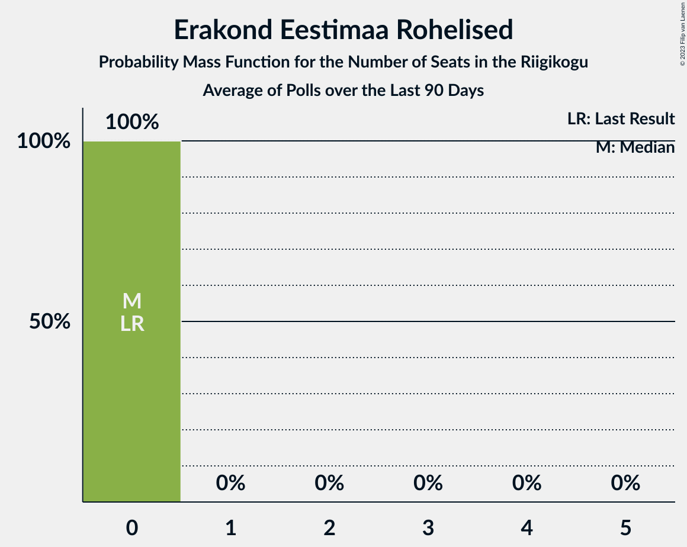

# Poll Average

<a href="#voting-intentions">Voting Intentions</a> | <a href="#seats">Seats</a> | <a href="#coalitions">Coalitions</a> | <a href="#technical-information">Technical Information</a>

## Summary

The table below lists the polls on which the average is based. They are the most recent polls (less than 90 days old) registered and analyzed so far.

| Period     | Polling firm/Commissioner(s) | Ref | Kesk | SDE | Isamaa | EVA | EKRE | Rohelised | E200 |
|:----------:|:----------------------------:|:--:|:--:|:--:|:--:|:--:|:--:|:--:|:--:|
| 1 March 2015 | General Election | 27.7%   30 | 24.8%   27 | 15.2%   15 | 13.7%   14 | 8.7%   8 | 8.1%   7 | 0.9%   0 | 0.0%   0 |
| N/A | Poll Average | 22–34%   24–40 | 22–35%   24–42 | 6–13%   5–13 | 5–14%   4–15 | 0–2%   0 | 14–21%   14–22 | 2–4%   0 | 2–8%   0–7 |
| [11–17 February 2019](2019-02-17-Norstat.html) | Norstat   MTÜ Ühiskonnauuringute Instituut | 29–35%   33–41 | 21–26%   23–30 | 7–10%   6–10 | 11–15%   11–16 | 1–2%   0 | 13–18%   14–19 | 2–4%   0 | 2–4%   0 |
| [4–7 February 2019](2019-02-07-KantarEmor.html) | Kantar Emor   BNS and Postimees | 22–27%   24–30 | 24–29%   26–33 | 10–14%   9–14 | 7–10%   6–10 | 0–1%   0 | 17–21%   17–23 | 1–3%   0 | 5–8%   4–8 |
| [15–28 January 2019](2019-01-28-Turu-uuringuteAS.html) | Turu-uuringute AS   ERR | 22–28%   25–33 | 30–36%   35–44 | 6–9%   5–9 | 5–8%   0–7 | 1–2%   0 | 15–19%   16–22 | 2–4%   0 | 4–7%   0–6 |
| 1 March 2015 | General Election | 27.7%   30 | 24.8%   27 | 15.2%   15 | 13.7%   14 | 8.7%   8 | 8.1%   7 | 0.9%   0 | 0.0%   0 |

Only polls for which at least the sample size has been published are included in the table above.

**Legend:**
+ **Top half of each row:** Voting intentions (95% confidence interval)
+ **Bottom half of each row:** Seat projections for the Riigikogu (95% confidence interval)
+ **Ref:** Eesti Reformierakond
+ **Kesk:** Eesti Keskerakond
+ **SDE:** Sotsiaaldemokraatlik Erakond
+ **Isamaa:** Erakond Isamaa
+ **EVA:** Eesti Vabaerakond
+ **EKRE:** Eesti Konservatiivne Rahvaerakond
+ **Rohelised:** Erakond Eestimaa Rohelised
+ **E200:** Eesti 200
+ **N/A (single party):** Party not included the published results
+ **N/A (entire row):** Calculation for this opinion poll not started yet

## Voting Intentions

### Confidence Intervals

| Party | Last Result | Median | 80% Confidence Interval | 90% Confidence Interval | 95% Confidence Interval | 99% Confidence Interval |
|:-----:|:-----------:|:------:|:-----------------------:|:-----------------------:|:-----------------------:|:-----------------------:|
| <a href="#eesti-reformierakond">Eesti Reformierakond</a> | 27.7% | 25.7% | 23.4–32.5% |22.9–33.3% | 22.4–33.9% | 21.6–35.0% |
| <a href="#eesti-keskerakond">Eesti Keskerakond</a> | 24.8% | 26.6% | 22.7–33.8% |22.1–34.6% | 21.5–35.2% | 20.6–36.3% |
| <a href="#sotsiaaldemokraatlik-erakond">Sotsiaaldemokraatlik Erakond</a> | 15.2% | 8.5% | 6.6–12.1% |6.2–12.6% | 6.0–13.0% | 5.4–13.7% |
| <a href="#erakond-isamaa">Erakond Isamaa</a> | 13.7% | 8.7% | 5.7–13.5% |5.3–14.1% | 5.0–14.5% | 4.6–15.4% |
| <a href="#eesti-vabaerakond">Eesti Vabaerakond</a> | 8.7% | 1.0% | 0.6–1.5% |0.5–1.6% | 0.4–1.8% | 0.3–2.0% |
| <a href="#eesti-konservatiivne-rahvaerakond">Eesti Konservatiivne Rahvaerakond</a> | 8.1% | 17.1% | 14.6–19.6% |14.1–20.2% | 13.6–20.7% | 12.9–21.6% |
| <a href="#erakond-eestimaa-rohelised">Erakond Eestimaa Rohelised</a> | 0.9% | 2.7% | 2.0–3.6% |1.8–3.8% | 1.7–4.0% | 1.4–4.5% |
| <a href="#eesti-200">Eesti 200</a> | 0.0% | 5.0% | 2.2–6.9% |2.0–7.3% | 1.8–7.6% | 1.5–8.2% |

### Eesti Reformierakond

*For a full overview of the results for this party, see the [Eesti Reformierakond](party-eestireformierakond.html) page.*

| Voting Intentions | Probability | Accumulated | Special Marks |
|:-----------------:|:-----------:|:-----------:|:-------------:|
| 19.5–20.5% | 0% | 100% |  |
| 20.5–21.5% | 0.4% | 100% |  |
| 21.5–22.5% | 3% | 99.6% |  |
| 22.5–23.5% | 9% | 97% |  |
| 23.5–24.5% | 17% | 88% |  |
| 24.5–25.5% | 19% | 71% |  |
| 25.5–26.5% | 12% | 52% | Median |
| 26.5–27.5% | 5% | 40% |  |
| 27.5–28.5% | 2% | 35% | Last Result |
| 28.5–29.5% | 2% | 33% |  |
| 29.5–30.5% | 5% | 31% |  |
| 30.5–31.5% | 8% | 26% |  |
| 31.5–32.5% | 9% | 18% |  |
| 32.5–33.5% | 6% | 10% |  |
| 33.5–34.5% | 3% | 4% |  |
| 34.5–35.5% | 0.8% | 1.0% |  |
| 35.5–36.5% | 0.2% | 0.2% |  |
| 36.5–37.5% | 0% | 0% |  |

### Eesti Keskerakond

*For a full overview of the results for this party, see the [Eesti Keskerakond](party-eestikeskerakond.html) page.*

| Voting Intentions | Probability | Accumulated | Special Marks |
|:-----------------:|:-----------:|:-----------:|:-------------:|
| 18.5–19.5% | 0% | 100% |  |
| 19.5–20.5% | 0.4% | 100% |  |
| 20.5–21.5% | 2% | 99.6% |  |
| 21.5–22.5% | 6% | 97% |  |
| 22.5–23.5% | 10% | 92% |  |
| 23.5–24.5% | 11% | 82% |  |
| 24.5–25.5% | 10% | 71% | Last Result |
| 25.5–26.5% | 11% | 61% |  |
| 26.5–27.5% | 10% | 50% | Median |
| 27.5–28.5% | 5% | 41% |  |
| 28.5–29.5% | 2% | 35% |  |
| 29.5–30.5% | 2% | 33% |  |
| 30.5–31.5% | 4% | 32% |  |
| 31.5–32.5% | 7% | 28% |  |
| 32.5–33.5% | 9% | 21% |  |
| 33.5–34.5% | 7% | 12% |  |
| 34.5–35.5% | 4% | 5% |  |
| 35.5–36.5% | 1.2% | 2% |  |
| 36.5–37.5% | 0.3% | 0.3% |  |
| 37.5–38.5% | 0% | 0% |  |
| 38.5–39.5% | 0% | 0% |  |

### Sotsiaaldemokraatlik Erakond

*For a full overview of the results for this party, see the [Sotsiaaldemokraatlik Erakond](party-sotsiaaldemokraatlikerakond.html) page.*

| Voting Intentions | Probability | Accumulated | Special Marks |
|:-----------------:|:-----------:|:-----------:|:-------------:|
| 3.5–4.5% | 0% | 100% |  |
| 4.5–5.5% | 0.7% | 100% |  |
| 5.5–6.5% | 8% | 99.3% |  |
| 6.5–7.5% | 20% | 91% |  |
| 7.5–8.5% | 21% | 71% |  |
| 8.5–9.5% | 13% | 50% | Median |
| 9.5–10.5% | 7% | 37% |  |
| 10.5–11.5% | 12% | 29% |  |
| 11.5–12.5% | 12% | 17% |  |
| 12.5–13.5% | 5% | 5% |  |
| 13.5–14.5% | 0.7% | 0.8% |  |
| 14.5–15.5% | 0.1% | 0.1% | Last Result |
| 15.5–16.5% | 0% | 0% |  |

### Erakond Isamaa

*For a full overview of the results for this party, see the [Erakond Isamaa](party-erakondisamaa.html) page.*

| Voting Intentions | Probability | Accumulated | Special Marks |
|:-----------------:|:-----------:|:-----------:|:-------------:|
| 2.5–3.5% | 0% | 100% |  |
| 3.5–4.5% | 0.5% | 100% |  |
| 4.5–5.5% | 8% | 99.5% |  |
| 5.5–6.5% | 17% | 92% |  |
| 6.5–7.5% | 10% | 75% |  |
| 7.5–8.5% | 13% | 65% |  |
| 8.5–9.5% | 14% | 52% | Median |
| 9.5–10.5% | 5% | 38% |  |
| 10.5–11.5% | 3% | 34% |  |
| 11.5–12.5% | 9% | 30% |  |
| 12.5–13.5% | 12% | 22% |  |
| 13.5–14.5% | 7% | 10% | Last Result |
| 14.5–15.5% | 2% | 2% |  |
| 15.5–16.5% | 0.3% | 0.3% |  |
| 16.5–17.5% | 0% | 0% |  |

### Eesti Vabaerakond

*For a full overview of the results for this party, see the [Eesti Vabaerakond](party-eestivabaerakond.html) page.*

| Voting Intentions | Probability | Accumulated | Special Marks |
|:-----------------:|:-----------:|:-----------:|:-------------:|
| 0.0–0.5% | 8% | 100% |  |
| 0.5–1.5% | 86% | 92% | Median |
| 1.5–2.5% | 6% | 6% |  |
| 2.5–3.5% | 0% | 0% |  |
| 3.5–4.5% | 0% | 0% |  |
| 4.5–5.5% | 0% | 0% |  |
| 5.5–6.5% | 0% | 0% |  |
| 6.5–7.5% | 0% | 0% |  |
| 7.5–8.5% | 0% | 0% |  |
| 8.5–9.5% | 0% | 0% | Last Result |

### Eesti Konservatiivne Rahvaerakond

*For a full overview of the results for this party, see the [Eesti Konservatiivne Rahvaerakond](party-eestikonservatiivnerahvaerakond.html) page.*

| Voting Intentions | Probability | Accumulated | Special Marks |
|:-----------------:|:-----------:|:-----------:|:-------------:|
| 7.5–8.5% | 0% | 100% | Last Result |
| 8.5–9.5% | 0% | 100% |  |
| 9.5–10.5% | 0% | 100% |  |
| 10.5–11.5% | 0% | 100% |  |
| 11.5–12.5% | 0.2% | 100% |  |
| 12.5–13.5% | 2% | 99.8% |  |
| 13.5–14.5% | 7% | 98% |  |
| 14.5–15.5% | 14% | 91% |  |
| 15.5–16.5% | 17% | 77% |  |
| 16.5–17.5% | 17% | 59% | Median |
| 17.5–18.5% | 17% | 42% |  |
| 18.5–19.5% | 14% | 25% |  |
| 19.5–20.5% | 8% | 11% |  |
| 20.5–21.5% | 3% | 3% |  |
| 21.5–22.5% | 0.5% | 0.5% |  |
| 22.5–23.5% | 0% | 0.1% |  |
| 23.5–24.5% | 0% | 0% |  |

### Erakond Eestimaa Rohelised

*For a full overview of the results for this party, see the [Erakond Eestimaa Rohelised](party-erakondeestimaarohelised.html) page.*

| Voting Intentions | Probability | Accumulated | Special Marks |
|:-----------------:|:-----------:|:-----------:|:-------------:|
| 0.0–0.5% | 0% | 100% |  |
| 0.5–1.5% | 1.3% | 100% | Last Result |
| 1.5–2.5% | 37% | 98.7% |  |
| 2.5–3.5% | 51% | 61% | Median |
| 3.5–4.5% | 10% | 10% |  |
| 4.5–5.5% | 0.4% | 0.4% |  |
| 5.5–6.5% | 0% | 0% |  |

### Eesti 200

*For a full overview of the results for this party, see the [Eesti 200](party-eesti200.html) page.*

| Voting Intentions | Probability | Accumulated | Special Marks |
|:-----------------:|:-----------:|:-----------:|:-------------:|
| 0.0–0.5% | 0% | 100% | Last Result |
| 0.5–1.5% | 0.5% | 100% |  |
| 1.5–2.5% | 18% | 99.5% |  |
| 2.5–3.5% | 14% | 81% |  |
| 3.5–4.5% | 8% | 67% |  |
| 4.5–5.5% | 21% | 59% | Median |
| 5.5–6.5% | 22% | 39% |  |
| 6.5–7.5% | 13% | 16% |  |
| 7.5–8.5% | 3% | 3% |  |
| 8.5–9.5% | 0.1% | 0.2% |  |
| 9.5–10.5% | 0% | 0% |  |

## Seats

### Confidence Intervals

| Party | Last Result | Median | 80% Confidence Interval | 90% Confidence Interval | 95% Confidence Interval | 99% Confidence Interval |
|:-----:|:-----------:|:------:|:-----------------------:|:-----------------------:|:-----------------------:|:-----------------------:|
| <a href="#eesti-reformierakond">Eesti Reformierakond</a> | 30 | 29 | 26–38 |25–39 | 24–40 | 23–41 |
| <a href="#eesti-keskerakond">Eesti Keskerakond</a> | 27 | 29 | 25–40 |24–42 | 24–42 | 23–44 |
| <a href="#sotsiaaldemokraatlik-erakond">Sotsiaaldemokraatlik Erakond</a> | 15 | 8 | 6–12 |6–12 | 5–13 | 5–14 |
| <a href="#erakond-isamaa">Erakond Isamaa</a> | 14 | 8 | 5–14 |5–15 | 4–15 | 0–16 |
| <a href="#eesti-vabaerakond">Eesti Vabaerakond</a> | 8 | 0 | 0 |0 | 0 | 0 |
| <a href="#eesti-konservatiivne-rahvaerakond">Eesti Konservatiivne Rahvaerakond</a> | 7 | 18 | 15–21 |15–22 | 14–22 | 13–23 |
| <a href="#erakond-eestimaa-rohelised">Erakond Eestimaa Rohelised</a> | 0 | 0 | 0 |0 | 0 | 0 |
| <a href="#eesti-200">Eesti 200</a> | 0 | 0 | 0–6 |0–7 | 0–7 | 0–8 |

### Eesti Reformierakond

*For a full overview of the results for this party, see the [Eesti Reformierakond](party-eestireformierakond.html) page.*

| Number of Seats | Probability | Accumulated | Special Marks |
|:---------------:|:-----------:|:-----------:|:-------------:|
| 22 | 0.1% | 100% |  |
| 23 | 0.5% | 99.9% |  |
| 24 | 3% | 99.4% |  |
| 25 | 6% | 97% |  |
| 26 | 13% | 91% |  |
| 27 | 11% | 78% |  |
| 28 | 11% | 67% |  |
| 29 | 9% | 56% | Median |
| 30 | 7% | 47% | Last Result |
| 31 | 4% | 40% |  |
| 32 | 2% | 36% |  |
| 33 | 1.3% | 34% |  |
| 34 | 2% | 33% |  |
| 35 | 4% | 30% |  |
| 36 | 7% | 27% |  |
| 37 | 7% | 20% |  |
| 38 | 5% | 13% |  |
| 39 | 5% | 8% |  |
| 40 | 2% | 3% |  |
| 41 | 0.7% | 1.1% |  |
| 42 | 0.3% | 0.4% |  |
| 43 | 0% | 0.1% |  |
| 44 | 0% | 0% |  |

### Eesti Keskerakond

*For a full overview of the results for this party, see the [Eesti Keskerakond](party-eestikeskerakond.html) page.*

| Number of Seats | Probability | Accumulated | Special Marks |
|:---------------:|:-----------:|:-----------:|:-------------:|
| 22 | 0.3% | 100% |  |
| 23 | 1.3% | 99.7% |  |
| 24 | 4% | 98% |  |
| 25 | 7% | 95% |  |
| 26 | 8% | 88% |  |
| 27 | 10% | 80% | Last Result |
| 28 | 11% | 70% |  |
| 29 | 11% | 59% | Median |
| 30 | 8% | 48% |  |
| 31 | 5% | 41% |  |
| 32 | 2% | 36% |  |
| 33 | 0.8% | 34% |  |
| 34 | 0.4% | 33% |  |
| 35 | 0.9% | 33% |  |
| 36 | 3% | 32% |  |
| 37 | 4% | 30% |  |
| 38 | 4% | 25% |  |
| 39 | 6% | 21% |  |
| 40 | 7% | 15% |  |
| 41 | 3% | 8% |  |
| 42 | 3% | 5% |  |
| 43 | 1.0% | 2% |  |
| 44 | 0.6% | 0.9% |  |
| 45 | 0.2% | 0.3% |  |
| 46 | 0.1% | 0.1% |  |
| 47 | 0% | 0.1% |  |
| 48 | 0% | 0% |  |

### Sotsiaaldemokraatlik Erakond

*For a full overview of the results for this party, see the [Sotsiaaldemokraatlik Erakond](party-sotsiaaldemokraatlikerakond.html) page.*

| Number of Seats | Probability | Accumulated | Special Marks |
|:---------------:|:-----------:|:-----------:|:-------------:|
| 0 | 0.1% | 100% |  |
| 1 | 0% | 99.9% |  |
| 2 | 0% | 99.9% |  |
| 3 | 0% | 99.9% |  |
| 4 | 0.1% | 99.9% |  |
| 5 | 3% | 99.8% |  |
| 6 | 12% | 97% |  |
| 7 | 19% | 84% |  |
| 8 | 19% | 66% | Median |
| 9 | 11% | 47% |  |
| 10 | 10% | 35% |  |
| 11 | 11% | 25% |  |
| 12 | 9% | 14% |  |
| 13 | 4% | 5% |  |
| 14 | 1.0% | 1.1% |  |
| 15 | 0.1% | 0.1% | Last Result |
| 16 | 0% | 0% |  |

### Erakond Isamaa

*For a full overview of the results for this party, see the [Erakond Isamaa](party-erakondisamaa.html) page.*

| Number of Seats | Probability | Accumulated | Special Marks |
|:---------------:|:-----------:|:-----------:|:-------------:|
| 0 | 2% | 100% |  |
| 1 | 0% | 98% |  |
| 2 | 0% | 98% |  |
| 3 | 0% | 98% |  |
| 4 | 0.8% | 98% |  |
| 5 | 13% | 97% |  |
| 6 | 14% | 84% |  |
| 7 | 13% | 70% |  |
| 8 | 10% | 57% | Median |
| 9 | 11% | 47% |  |
| 10 | 3% | 36% |  |
| 11 | 2% | 33% |  |
| 12 | 8% | 32% |  |
| 13 | 8% | 23% |  |
| 14 | 8% | 15% | Last Result |
| 15 | 6% | 7% |  |
| 16 | 1.4% | 2% |  |
| 17 | 0.2% | 0.3% |  |
| 18 | 0.1% | 0.1% |  |
| 19 | 0% | 0% |  |

### Eesti Vabaerakond

*For a full overview of the results for this party, see the [Eesti Vabaerakond](party-eestivabaerakond.html) page.*

| Number of Seats | Probability | Accumulated | Special Marks |
|:---------------:|:-----------:|:-----------:|:-------------:|
| 0 | 100% | 100% | Median |
| 1 | 0% | 0% |  |
| 2 | 0% | 0% |  |
| 3 | 0% | 0% |  |
| 4 | 0% | 0% |  |
| 5 | 0% | 0% |  |
| 6 | 0% | 0% |  |
| 7 | 0% | 0% |  |
| 8 | 0% | 0% | Last Result |

### Eesti Konservatiivne Rahvaerakond

*For a full overview of the results for this party, see the [Eesti Konservatiivne Rahvaerakond](party-eestikonservatiivnerahvaerakond.html) page.*

| Number of Seats | Probability | Accumulated | Special Marks |
|:---------------:|:-----------:|:-----------:|:-------------:|
| 7 | 0% | 100% | Last Result |
| 8 | 0% | 100% |  |
| 9 | 0% | 100% |  |
| 10 | 0% | 100% |  |
| 11 | 0% | 100% |  |
| 12 | 0.1% | 100% |  |
| 13 | 0.6% | 99.9% |  |
| 14 | 3% | 99.3% |  |
| 15 | 7% | 96% |  |
| 16 | 13% | 89% |  |
| 17 | 14% | 76% |  |
| 18 | 15% | 62% | Median |
| 19 | 17% | 47% |  |
| 20 | 14% | 30% |  |
| 21 | 10% | 17% |  |
| 22 | 4% | 6% |  |
| 23 | 2% | 2% |  |
| 24 | 0.2% | 0.3% |  |
| 25 | 0.1% | 0.1% |  |
| 26 | 0% | 0% |  |

### Erakond Eestimaa Rohelised

*For a full overview of the results for this party, see the [Erakond Eestimaa Rohelised](party-erakondeestimaarohelised.html) page.*

| Number of Seats | Probability | Accumulated | Special Marks |
|:---------------:|:-----------:|:-----------:|:-------------:|
| 0 | 100% | 100% | Last Result, Median |

### Eesti 200

*For a full overview of the results for this party, see the [Eesti 200](party-eesti200.html) page.*

| Number of Seats | Probability | Accumulated | Special Marks |
|:---------------:|:-----------:|:-----------:|:-------------:|
| 0 | 50% | 100% | Last Result, Median |
| 1 | 0% | 50% |  |
| 2 | 0% | 50% |  |
| 3 | 0% | 50% |  |
| 4 | 4% | 50% |  |
| 5 | 22% | 45% |  |
| 6 | 18% | 24% |  |
| 7 | 5% | 6% |  |
| 8 | 0.9% | 0.9% |  |
| 9 | 0% | 0% |  |

## Coalitions

### Confidence Intervals

| Coalition | Last Result | Median | Majority? | 80% Confidence Interval | 90% Confidence Interval | 95% Confidence Interval | 99% Confidence Interval |
|:---------:|:-----------:|:------:|:---------:|:-----------------------:|:-----------------------:|:-----------------------:|:-----------------------:|
| Eesti Reformierakond – Eesti Keskerakond – Eesti Konservatiivne Rahvaerakond | 64 | 79 | 100% | 75–88 | 74–89 | 74–90 | 72–94 |
| Eesti Reformierakond – Eesti Keskerakond | 57 | 63 | 100% | 55–69 | 54–71 | 53–72 | 52–74 |
| Eesti Reformierakond – Erakond Isamaa – Eesti Konservatiivne Rahvaerakond | 51 | 55 | 93% | 51–68 | 50–68 | 49–69 | 47–70 |
| Eesti Keskerakond – Eesti Konservatiivne Rahvaerakond | 34 | 50 | 43% | 41–59 | 40–60 | 40–62 | 38–63 |
| Eesti Reformierakond – Sotsiaaldemokraatlik Erakond – Erakond Isamaa – Eesti Vabaerakond | 67 | 46 | 34% | 39–60 | 38–61 | 37–61 | 35–63 |
| Eesti Reformierakond – Sotsiaaldemokraatlik Erakond – Erakond Isamaa | 59 | 46 | 34% | 39–60 | 38–61 | 37–61 | 35–63 |
| Eesti Reformierakond – Eesti Konservatiivne Rahvaerakond | 37 | 48 | 34% | 45–54 | 44–55 | 43–56 | 42–57 |
| Eesti Keskerakond – Sotsiaaldemokraatlik Erakond – Erakond Isamaa | 56 | 49 | 30% | 46–53 | 46–54 | 45–55 | 44–56 |
| Eesti Reformierakond – Erakond Isamaa | 44 | 36 | 16% | 32–51 | 31–52 | 31–53 | 28–55 |
| Eesti Keskerakond – Sotsiaaldemokraatlik Erakond | 42 | 40 | 0.7% | 33–47 | 33–48 | 32–49 | 31–51 |
| Eesti Reformierakond – Sotsiaaldemokraatlik Erakond | 45 | 38 | 0.1% | 34–46 | 33–47 | 32–48 | 31–49 |
| Sotsiaaldemokraatlik Erakond – Eesti Konservatiivne Rahvaerakond | 22 | 26 | 0% | 23–32 | 22–33 | 22–34 | 21–35 |

### Eesti Reformierakond – Eesti Keskerakond – Eesti Konservatiivne Rahvaerakond

| Number of Seats | Probability | Accumulated | Special Marks |
|:---------------:|:-----------:|:-----------:|:-------------:|
| 64 | 0% | 100% | Last Result |
| 65 | 0% | 100% |  |
| 66 | 0% | 100% |  |
| 67 | 0% | 100% |  |
| 68 | 0% | 100% |  |
| 69 | 0% | 100% |  |
| 70 | 0% | 100% |  |
| 71 | 0.1% | 100% |  |
| 72 | 0.6% | 99.9% |  |
| 73 | 2% | 99.3% |  |
| 74 | 5% | 98% |  |
| 75 | 7% | 93% |  |
| 76 | 9% | 86% | Median |
| 77 | 10% | 77% |  |
| 78 | 8% | 68% |  |
| 79 | 9% | 59% |  |
| 80 | 8% | 50% |  |
| 81 | 6% | 42% |  |
| 82 | 4% | 36% |  |
| 83 | 5% | 32% |  |
| 84 | 5% | 27% |  |
| 85 | 3% | 22% |  |
| 86 | 2% | 19% |  |
| 87 | 3% | 17% |  |
| 88 | 5% | 14% |  |
| 89 | 5% | 9% |  |
| 90 | 3% | 5% |  |
| 91 | 0.4% | 1.5% |  |
| 92 | 0.1% | 1.1% |  |
| 93 | 0.3% | 1.0% |  |
| 94 | 0.5% | 0.7% |  |
| 95 | 0.2% | 0.2% |  |
| 96 | 0% | 0% |  |

### Eesti Reformierakond – Eesti Keskerakond

| Number of Seats | Probability | Accumulated | Special Marks |
|:---------------:|:-----------:|:-----------:|:-------------:|
| 51 | 0.2% | 100% | Majority |
| 52 | 0.7% | 99.8% |  |
| 53 | 2% | 99.1% |  |
| 54 | 3% | 97% |  |
| 55 | 8% | 93% |  |
| 56 | 7% | 85% |  |
| 57 | 6% | 78% | Last Result |
| 58 | 4% | 73% | Median |
| 59 | 2% | 69% |  |
| 60 | 2% | 67% |  |
| 61 | 5% | 65% |  |
| 62 | 5% | 60% |  |
| 63 | 7% | 55% |  |
| 64 | 9% | 47% |  |
| 65 | 8% | 39% |  |
| 66 | 7% | 30% |  |
| 67 | 5% | 23% |  |
| 68 | 4% | 18% |  |
| 69 | 4% | 14% |  |
| 70 | 3% | 10% |  |
| 71 | 4% | 7% |  |
| 72 | 1.5% | 3% |  |
| 73 | 0.8% | 1.4% |  |
| 74 | 0.2% | 0.6% |  |
| 75 | 0.2% | 0.4% |  |
| 76 | 0.1% | 0.1% |  |
| 77 | 0% | 0.1% |  |
| 78 | 0% | 0% |  |

### Eesti Reformierakond – Erakond Isamaa – Eesti Konservatiivne Rahvaerakond

| Number of Seats | Probability | Accumulated | Special Marks |
|:---------------:|:-----------:|:-----------:|:-------------:|
| 45 | 0% | 100% |  |
| 46 | 0.2% | 99.9% |  |
| 47 | 0.4% | 99.8% |  |
| 48 | 1.2% | 99.4% |  |
| 49 | 2% | 98% |  |
| 50 | 4% | 96% |  |
| 51 | 6% | 93% | Last Result, Majority |
| 52 | 6% | 87% |  |
| 53 | 10% | 81% |  |
| 54 | 11% | 71% |  |
| 55 | 11% | 60% | Median |
| 56 | 9% | 49% |  |
| 57 | 4% | 40% |  |
| 58 | 2% | 36% |  |
| 59 | 0.6% | 34% |  |
| 60 | 0.2% | 34% |  |
| 61 | 0.1% | 33% |  |
| 62 | 0.4% | 33% |  |
| 63 | 1.1% | 33% |  |
| 64 | 3% | 32% |  |
| 65 | 5% | 29% |  |
| 66 | 7% | 24% |  |
| 67 | 7% | 17% |  |
| 68 | 5% | 10% |  |
| 69 | 3% | 5% |  |
| 70 | 1.4% | 2% |  |
| 71 | 0.3% | 0.4% |  |
| 72 | 0.1% | 0.1% |  |
| 73 | 0% | 0% |  |

### Eesti Keskerakond – Eesti Konservatiivne Rahvaerakond

| Number of Seats | Probability | Accumulated | Special Marks |
|:---------------:|:-----------:|:-----------:|:-------------:|
| 34 | 0% | 100% | Last Result |
| 35 | 0% | 100% |  |
| 36 | 0% | 100% |  |
| 37 | 0.1% | 100% |  |
| 38 | 0.5% | 99.9% |  |
| 39 | 1.3% | 99.4% |  |
| 40 | 4% | 98% |  |
| 41 | 5% | 94% |  |
| 42 | 8% | 90% |  |
| 43 | 6% | 82% |  |
| 44 | 5% | 76% |  |
| 45 | 4% | 72% |  |
| 46 | 4% | 68% |  |
| 47 | 5% | 64% | Median |
| 48 | 4% | 59% |  |
| 49 | 3% | 55% |  |
| 50 | 9% | 52% |  |
| 51 | 7% | 43% | Majority |
| 52 | 3% | 36% |  |
| 53 | 0.8% | 33% |  |
| 54 | 3% | 33% |  |
| 55 | 4% | 30% |  |
| 56 | 3% | 26% |  |
| 57 | 4% | 23% |  |
| 58 | 5% | 18% |  |
| 59 | 6% | 13% |  |
| 60 | 3% | 7% |  |
| 61 | 1.5% | 4% |  |
| 62 | 1.1% | 3% |  |
| 63 | 1.1% | 1.5% |  |
| 64 | 0.2% | 0.3% |  |
| 65 | 0% | 0.1% |  |
| 66 | 0.1% | 0.1% |  |
| 67 | 0% | 0% |  |

### Eesti Reformierakond – Sotsiaaldemokraatlik Erakond – Erakond Isamaa – Eesti Vabaerakond

| Number of Seats | Probability | Accumulated | Special Marks |
|:---------------:|:-----------:|:-----------:|:-------------:|
| 33 | 0.1% | 100% |  |
| 34 | 0.4% | 99.9% |  |
| 35 | 0.2% | 99.5% |  |
| 36 | 0.3% | 99.3% |  |
| 37 | 2% | 98.9% |  |
| 38 | 4% | 97% |  |
| 39 | 3% | 93% |  |
| 40 | 3% | 90% |  |
| 41 | 6% | 87% |  |
| 42 | 8% | 81% |  |
| 43 | 5% | 72% |  |
| 44 | 5% | 67% |  |
| 45 | 9% | 62% | Median |
| 46 | 7% | 53% |  |
| 47 | 6% | 46% |  |
| 48 | 3% | 41% |  |
| 49 | 3% | 38% |  |
| 50 | 1.0% | 35% |  |
| 51 | 0.4% | 34% | Majority |
| 52 | 0.1% | 33% |  |
| 53 | 0.1% | 33% |  |
| 54 | 0.3% | 33% |  |
| 55 | 1.1% | 33% |  |
| 56 | 3% | 32% |  |
| 57 | 5% | 28% |  |
| 58 | 6% | 24% |  |
| 59 | 8% | 18% |  |
| 60 | 5% | 10% |  |
| 61 | 4% | 5% |  |
| 62 | 1.3% | 2% |  |
| 63 | 0.5% | 0.6% |  |
| 64 | 0.1% | 0.1% |  |
| 65 | 0% | 0% |  |
| 66 | 0% | 0% |  |
| 67 | 0% | 0% | Last Result |

### Eesti Reformierakond – Sotsiaaldemokraatlik Erakond – Erakond Isamaa

| Number of Seats | Probability | Accumulated | Special Marks |
|:---------------:|:-----------:|:-----------:|:-------------:|
| 33 | 0.1% | 100% |  |
| 34 | 0.4% | 99.9% |  |
| 35 | 0.2% | 99.5% |  |
| 36 | 0.3% | 99.3% |  |
| 37 | 2% | 98.9% |  |
| 38 | 4% | 97% |  |
| 39 | 3% | 93% |  |
| 40 | 3% | 90% |  |
| 41 | 6% | 87% |  |
| 42 | 8% | 81% |  |
| 43 | 5% | 72% |  |
| 44 | 5% | 67% |  |
| 45 | 9% | 62% | Median |
| 46 | 7% | 53% |  |
| 47 | 6% | 46% |  |
| 48 | 3% | 41% |  |
| 49 | 3% | 38% |  |
| 50 | 1.0% | 35% |  |
| 51 | 0.4% | 34% | Majority |
| 52 | 0.1% | 33% |  |
| 53 | 0.1% | 33% |  |
| 54 | 0.3% | 33% |  |
| 55 | 1.1% | 33% |  |
| 56 | 3% | 32% |  |
| 57 | 5% | 28% |  |
| 58 | 6% | 24% |  |
| 59 | 8% | 18% | Last Result |
| 60 | 5% | 10% |  |
| 61 | 4% | 5% |  |
| 62 | 1.3% | 2% |  |
| 63 | 0.5% | 0.6% |  |
| 64 | 0.1% | 0.1% |  |
| 65 | 0% | 0% |  |

### Eesti Reformierakond – Eesti Konservatiivne Rahvaerakond

| Number of Seats | Probability | Accumulated | Special Marks |
|:---------------:|:-----------:|:-----------:|:-------------:|
| 37 | 0% | 100% | Last Result |
| 38 | 0% | 100% |  |
| 39 | 0% | 100% |  |
| 40 | 0% | 100% |  |
| 41 | 0.2% | 100% |  |
| 42 | 0.8% | 99.8% |  |
| 43 | 2% | 99.0% |  |
| 44 | 5% | 97% |  |
| 45 | 9% | 92% |  |
| 46 | 11% | 83% |  |
| 47 | 13% | 72% | Median |
| 48 | 11% | 60% |  |
| 49 | 8% | 49% |  |
| 50 | 7% | 40% |  |
| 51 | 5% | 34% | Majority |
| 52 | 7% | 29% |  |
| 53 | 7% | 22% |  |
| 54 | 6% | 15% |  |
| 55 | 5% | 9% |  |
| 56 | 2% | 3% |  |
| 57 | 0.9% | 1.3% |  |
| 58 | 0.3% | 0.4% |  |
| 59 | 0.1% | 0.1% |  |
| 60 | 0% | 0% |  |

### Eesti Keskerakond – Sotsiaaldemokraatlik Erakond – Erakond Isamaa

| Number of Seats | Probability | Accumulated | Special Marks |
|:---------------:|:-----------:|:-----------:|:-------------:|
| 42 | 0.1% | 100% |  |
| 43 | 0.4% | 99.9% |  |
| 44 | 1.2% | 99.5% |  |
| 45 | 3% | 98% | Median |
| 46 | 8% | 95% |  |
| 47 | 12% | 87% |  |
| 48 | 18% | 75% |  |
| 49 | 15% | 57% |  |
| 50 | 12% | 42% |  |
| 51 | 11% | 30% | Majority |
| 52 | 8% | 18% |  |
| 53 | 4% | 10% |  |
| 54 | 3% | 6% |  |
| 55 | 1.5% | 3% |  |
| 56 | 0.9% | 1.3% | Last Result |
| 57 | 0.2% | 0.3% |  |
| 58 | 0.1% | 0.1% |  |
| 59 | 0% | 0% |  |

### Eesti Reformierakond – Erakond Isamaa

| Number of Seats | Probability | Accumulated | Special Marks |
|:---------------:|:-----------:|:-----------:|:-------------:|
| 26 | 0% | 100% |  |
| 27 | 0.1% | 99.9% |  |
| 28 | 0.4% | 99.8% |  |
| 29 | 0.4% | 99.4% |  |
| 30 | 1.0% | 99.0% |  |
| 31 | 4% | 98% |  |
| 32 | 5% | 94% |  |
| 33 | 9% | 89% |  |
| 34 | 13% | 80% |  |
| 35 | 14% | 67% |  |
| 36 | 10% | 53% |  |
| 37 | 5% | 42% | Median |
| 38 | 2% | 37% |  |
| 39 | 1.2% | 35% |  |
| 40 | 0.3% | 34% |  |
| 41 | 0% | 33% |  |
| 42 | 0% | 33% |  |
| 43 | 0% | 33% |  |
| 44 | 0% | 33% | Last Result |
| 45 | 0.1% | 33% |  |
| 46 | 0.5% | 33% |  |
| 47 | 1.2% | 33% |  |
| 48 | 4% | 31% |  |
| 49 | 5% | 28% |  |
| 50 | 7% | 23% |  |
| 51 | 7% | 16% | Majority |
| 52 | 5% | 9% |  |
| 53 | 3% | 5% |  |
| 54 | 1.2% | 2% |  |
| 55 | 0.5% | 0.6% |  |
| 56 | 0.1% | 0.1% |  |
| 57 | 0% | 0% |  |

### Eesti Keskerakond – Sotsiaaldemokraatlik Erakond

| Number of Seats | Probability | Accumulated | Special Marks |
|:---------------:|:-----------:|:-----------:|:-------------:|
| 29 | 0.1% | 100% |  |
| 30 | 0.3% | 99.9% |  |
| 31 | 1.4% | 99.6% |  |
| 32 | 3% | 98% |  |
| 33 | 5% | 95% |  |
| 34 | 7% | 90% |  |
| 35 | 7% | 83% |  |
| 36 | 6% | 76% |  |
| 37 | 4% | 71% | Median |
| 38 | 3% | 67% |  |
| 39 | 7% | 63% |  |
| 40 | 8% | 57% |  |
| 41 | 7% | 49% |  |
| 42 | 8% | 43% | Last Result |
| 43 | 5% | 35% |  |
| 44 | 5% | 30% |  |
| 45 | 5% | 25% |  |
| 46 | 8% | 19% |  |
| 47 | 4% | 12% |  |
| 48 | 3% | 8% |  |
| 49 | 3% | 5% |  |
| 50 | 2% | 2% |  |
| 51 | 0.4% | 0.7% | Majority |
| 52 | 0.2% | 0.3% |  |
| 53 | 0.1% | 0.1% |  |
| 54 | 0% | 0.1% |  |
| 55 | 0% | 0% |  |

### Eesti Reformierakond – Sotsiaaldemokraatlik Erakond

| Number of Seats | Probability | Accumulated | Special Marks |
|:---------------:|:-----------:|:-----------:|:-------------:|
| 29 | 0% | 100% |  |
| 30 | 0.3% | 99.9% |  |
| 31 | 0.2% | 99.7% |  |
| 32 | 3% | 99.5% |  |
| 33 | 5% | 97% |  |
| 34 | 3% | 91% |  |
| 35 | 5% | 88% |  |
| 36 | 14% | 84% |  |
| 37 | 12% | 69% | Median |
| 38 | 9% | 57% |  |
| 39 | 5% | 47% |  |
| 40 | 5% | 42% |  |
| 41 | 3% | 37% |  |
| 42 | 3% | 34% |  |
| 43 | 3% | 31% |  |
| 44 | 6% | 27% |  |
| 45 | 6% | 21% | Last Result |
| 46 | 6% | 15% |  |
| 47 | 5% | 9% |  |
| 48 | 2% | 4% |  |
| 49 | 1.1% | 2% |  |
| 50 | 0.3% | 0.4% |  |
| 51 | 0.1% | 0.1% | Majority |
| 52 | 0% | 0% |  |

### Sotsiaaldemokraatlik Erakond – Eesti Konservatiivne Rahvaerakond

| Number of Seats | Probability | Accumulated | Special Marks |
|:---------------:|:-----------:|:-----------:|:-------------:|
| 19 | 0.1% | 100% |  |
| 20 | 0.3% | 99.9% |  |
| 21 | 2% | 99.6% |  |
| 22 | 4% | 98% | Last Result |
| 23 | 9% | 94% |  |
| 24 | 14% | 85% |  |
| 25 | 14% | 71% |  |
| 26 | 12% | 57% | Median |
| 27 | 7% | 45% |  |
| 28 | 4% | 38% |  |
| 29 | 4% | 33% |  |
| 30 | 7% | 29% |  |
| 31 | 8% | 23% |  |
| 32 | 6% | 14% |  |
| 33 | 4% | 8% |  |
| 34 | 3% | 4% |  |
| 35 | 0.7% | 1.0% |  |
| 36 | 0.2% | 0.3% |  |
| 37 | 0% | 0.1% |  |
| 38 | 0% | 0% |  |

## Technical Information

+ **Number of polls included in this average:** 3
+ **Lowest number of simulations done in a poll included in this average:** 1,048,576
+ **Total number of simulations done in the polls included in this average:** 3,145,728
+ **Error estimate:** 2.91%
