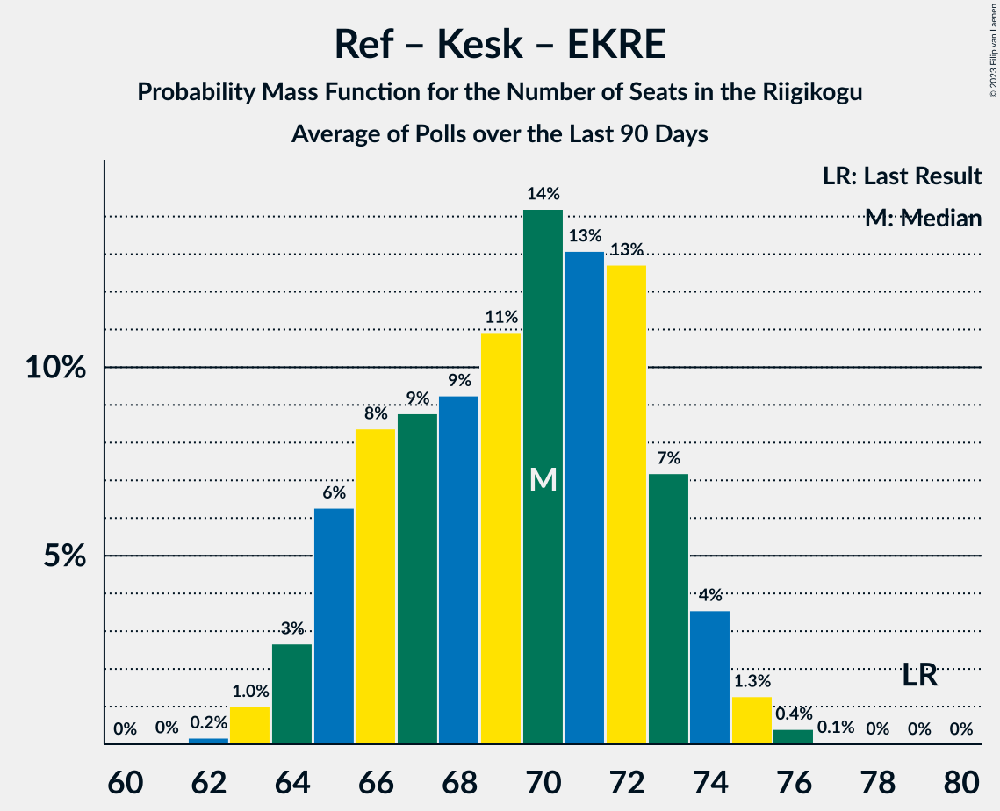

# Poll Average

<a href="#voting-intentions">Voting Intentions</a> | <a href="#seats">Seats</a> | <a href="#coalitions">Coalitions</a> | <a href="#technical-information">Technical Information</a>

## Summary

The table below lists the polls on which the average is based. They are the most recent polls (less than 90 days old) registered and analyzed so far.

| Period     | Polling firm/Commissioner(s) | Ref | Kesk | EKRE | I | SDE | E200 | Rohelised | EVA |
|:----------:|:----------------------------:|:--:|:--:|:--:|:--:|:--:|:--:|:--:|:--:|
| 3 March 2019 | General Election | 28.9%   34 | 23.1%   26 | 17.8%   19 | 11.4%   12 | 9.8%   10 | 4.4%   0 | 1.8%   0 | 1.2%   0 |
| N/A | Poll Average | 22–27%   24–32 | 14–18%   14–20 | 22–28%   25–32 | 3–7%   0–7 | 9–13%   8–13 | 12–17%   12–18 | 1–5%   0 | N/A   N/A |
| [14–20 September 2021](2021-09-20-Norstat.html) | Norstat   MTÜ Ühiskonnauuringute Instituut | 22–27%   23–30 | 13–18%   13–19 | 23–29%   26–33 | 5–8%   0–7 | 8–12%   8–12 | 12–16%   12–17 | 1–3%   0 | N/A   N/A |
| [6–15 September 2021](2021-09-15-Turu-uuringuteAS.html) | Turu-uuringute AS | N/A   N/A | N/A   N/A | N/A   N/A | N/A   N/A | N/A   N/A | N/A   N/A | N/A   N/A | N/A   N/A |
| [12–17 August 2021](2021-08-17-KantarEmor.html) | Kantar Emor   BNS and Postimees | 23–28%   25–32 | 14–18%   15–20 | 22–27%   24–31 | 3–5%   0 | 9–13%   9–14 | 13–17%   14–19 | 3–5%   0–4 | N/A   N/A |
| 3 March 2019 | General Election | 28.9%   34 | 23.1%   26 | 17.8%   19 | 11.4%   12 | 9.8%   10 | 4.4%   0 | 1.8%   0 | 1.2%   0 |

Only polls for which at least the sample size has been published are included in the table above.

**Legend:**
+ **Top half of each row:** Voting intentions (95% confidence interval)
+ **Bottom half of each row:** Seat projections for the Riigikogu (95% confidence interval)
+ **Ref:** Eesti Reformierakond
+ **Kesk:** Eesti Keskerakond
+ **EKRE:** Eesti Konservatiivne Rahvaerakond
+ **I:** Erakond Isamaa
+ **SDE:** Sotsiaaldemokraatlik Erakond
+ **E200:** Eesti 200
+ **Rohelised:** Erakond Eestimaa Rohelised
+ **EVA:** Eesti Vabaerakond
+ **N/A (single party):** Party not included the published results
+ **N/A (entire row):** Calculation for this opinion poll not started yet

## Voting Intentions

### Confidence Intervals

| Party | Last Result | Median | 80% Confidence Interval | 90% Confidence Interval | 95% Confidence Interval | 99% Confidence Interval |
|:-----:|:-----------:|:------:|:-----------------------:|:-----------------------:|:-----------------------:|:-----------------------:|
| <a href="#eesti-reformierakond">Eesti Reformierakond</a> | 28.9% | 24.6% | 22.8–26.5% |22.3–27.0% | 21.9–27.4% | 21.0–28.3% |
| <a href="#eesti-keskerakond">Eesti Keskerakond</a> | 23.1% | 15.7% | 14.3–17.3% |13.9–17.7% | 13.5–18.1% | 12.9–18.9% |
| <a href="#eesti-konservatiivne-rahvaerakond">Eesti Konservatiivne Rahvaerakond</a> | 17.8% | 25.1% | 22.9–27.4% |22.4–27.9% | 21.9–28.5% | 21.1–29.4% |
| <a href="#erakond-isamaa">Erakond Isamaa</a> | 11.4% | 4.9% | 3.5–6.6% |3.3–7.0% | 3.1–7.3% | 2.8–7.9% |
| <a href="#sotsiaaldemokraatlik-erakond">Sotsiaaldemokraatlik Erakond</a> | 9.8% | 10.6% | 9.3–12.0% |8.9–12.4% | 8.6–12.7% | 8.1–13.4% |
| <a href="#eesti-200">Eesti 200</a> | 4.4% | 14.6% | 13.0–16.1% |12.6–16.6% | 12.3–17.0% | 11.6–17.8% |
| <a href="#erakond-eestimaa-rohelised">Erakond Eestimaa Rohelised</a> | 1.8% | 3.0% | 1.7–4.5% |1.5–4.9% | 1.4–5.1% | 1.2–5.6% |
| <a href="#eesti-vabaerakond">Eesti Vabaerakond</a> | 1.2% | N/A | N/A |N/A | N/A | N/A |

### Eesti Reformierakond

*For a full overview of the results for this party, see the [Eesti Reformierakond](party-eestireformierakond.html) page.*

| Voting Intentions | Probability | Accumulated | Special Marks |
|:-----------------:|:-----------:|:-----------:|:-------------:|
| 18.5–19.5% | 0% | 100% |  |
| 19.5–20.5% | 0.1% | 100% |  |
| 20.5–21.5% | 1.2% | 99.8% |  |
| 21.5–22.5% | 6% | 98.6% |  |
| 22.5–23.5% | 15% | 93% |  |
| 23.5–24.5% | 26% | 77% |  |
| 24.5–25.5% | 26% | 52% | Median |
| 25.5–26.5% | 17% | 26% |  |
| 26.5–27.5% | 7% | 9% |  |
| 27.5–28.5% | 2% | 2% |  |
| 28.5–29.5% | 0.3% | 0.3% | Last Result |
| 29.5–30.5% | 0% | 0% |  |

### Eesti Keskerakond

*For a full overview of the results for this party, see the [Eesti Keskerakond](party-eestikeskerakond.html) page.*

| Voting Intentions | Probability | Accumulated | Special Marks |
|:-----------------:|:-----------:|:-----------:|:-------------:|
| 10.5–11.5% | 0% | 100% |  |
| 11.5–12.5% | 0.2% | 100% |  |
| 12.5–13.5% | 2% | 99.8% |  |
| 13.5–14.5% | 13% | 97% |  |
| 14.5–15.5% | 28% | 85% |  |
| 15.5–16.5% | 32% | 56% | Median |
| 16.5–17.5% | 18% | 24% |  |
| 17.5–18.5% | 6% | 7% |  |
| 18.5–19.5% | 0.9% | 1.0% |  |
| 19.5–20.5% | 0.1% | 0.1% |  |
| 20.5–21.5% | 0% | 0% |  |
| 21.5–22.5% | 0% | 0% |  |
| 22.5–23.5% | 0% | 0% | Last Result |

### Eesti Konservatiivne Rahvaerakond

*For a full overview of the results for this party, see the [Eesti Konservatiivne Rahvaerakond](party-eestikonservatiivnerahvaerakond.html) page.*

| Voting Intentions | Probability | Accumulated | Special Marks |
|:-----------------:|:-----------:|:-----------:|:-------------:|
| 17.5–18.5% | 0% | 100% | Last Result |
| 18.5–19.5% | 0% | 100% |  |
| 19.5–20.5% | 0.1% | 100% |  |
| 20.5–21.5% | 1.2% | 99.9% |  |
| 21.5–22.5% | 5% | 98.7% |  |
| 22.5–23.5% | 13% | 94% |  |
| 23.5–24.5% | 20% | 81% |  |
| 24.5–25.5% | 22% | 61% | Median |
| 25.5–26.5% | 19% | 40% |  |
| 26.5–27.5% | 13% | 21% |  |
| 27.5–28.5% | 6% | 8% |  |
| 28.5–29.5% | 2% | 2% |  |
| 29.5–30.5% | 0.4% | 0.4% |  |
| 30.5–31.5% | 0% | 0.1% |  |
| 31.5–32.5% | 0% | 0% |  |

### Erakond Isamaa

*For a full overview of the results for this party, see the [Erakond Isamaa](party-erakondisamaa.html) page.*

| Voting Intentions | Probability | Accumulated | Special Marks |
|:-----------------:|:-----------:|:-----------:|:-------------:|
| 0.5–1.5% | 0% | 100% |  |
| 1.5–2.5% | 0.1% | 100% |  |
| 2.5–3.5% | 10% | 99.9% |  |
| 3.5–4.5% | 31% | 90% |  |
| 4.5–5.5% | 23% | 59% | Median |
| 5.5–6.5% | 25% | 36% |  |
| 6.5–7.5% | 10% | 11% |  |
| 7.5–8.5% | 1.2% | 1.2% |  |
| 8.5–9.5% | 0% | 0% |  |
| 9.5–10.5% | 0% | 0% |  |
| 10.5–11.5% | 0% | 0% | Last Result |

### Sotsiaaldemokraatlik Erakond

*For a full overview of the results for this party, see the [Sotsiaaldemokraatlik Erakond](party-sotsiaaldemokraatlikerakond.html) page.*

| Voting Intentions | Probability | Accumulated | Special Marks |
|:-----------------:|:-----------:|:-----------:|:-------------:|
| 6.5–7.5% | 0.1% | 100% |  |
| 7.5–8.5% | 2% | 99.9% |  |
| 8.5–9.5% | 14% | 98% |  |
| 9.5–10.5% | 33% | 84% | Last Result |
| 10.5–11.5% | 33% | 51% | Median |
| 11.5–12.5% | 15% | 18% |  |
| 12.5–13.5% | 3% | 4% |  |
| 13.5–14.5% | 0.3% | 0.4% |  |
| 14.5–15.5% | 0% | 0% |  |

### Eesti 200

*For a full overview of the results for this party, see the [Eesti 200](party-eesti200.html) page.*

| Voting Intentions | Probability | Accumulated | Special Marks |
|:-----------------:|:-----------:|:-----------:|:-------------:|
| 3.5–4.5% | 0% | 100% | Last Result |
| 4.5–5.5% | 0% | 100% |  |
| 5.5–6.5% | 0% | 100% |  |
| 6.5–7.5% | 0% | 100% |  |
| 7.5–8.5% | 0% | 100% |  |
| 8.5–9.5% | 0% | 100% |  |
| 9.5–10.5% | 0% | 100% |  |
| 10.5–11.5% | 0.4% | 100% |  |
| 11.5–12.5% | 4% | 99.6% |  |
| 12.5–13.5% | 16% | 96% |  |
| 13.5–14.5% | 30% | 80% |  |
| 14.5–15.5% | 29% | 50% | Median |
| 15.5–16.5% | 16% | 21% |  |
| 16.5–17.5% | 5% | 5% |  |
| 17.5–18.5% | 0.8% | 0.8% |  |
| 18.5–19.5% | 0.1% | 0.1% |  |
| 19.5–20.5% | 0% | 0% |  |

### Erakond Eestimaa Rohelised

*For a full overview of the results for this party, see the [Erakond Eestimaa Rohelised](party-erakondeestimaarohelised.html) page.*

| Voting Intentions | Probability | Accumulated | Special Marks |
|:-----------------:|:-----------:|:-----------:|:-------------:|
| 0.0–0.5% | 0% | 100% |  |
| 0.5–1.5% | 5% | 100% |  |
| 1.5–2.5% | 37% | 95% | Last Result |
| 2.5–3.5% | 18% | 58% | Median |
| 3.5–4.5% | 30% | 40% |  |
| 4.5–5.5% | 9% | 10% |  |
| 5.5–6.5% | 0.6% | 0.6% |  |
| 6.5–7.5% | 0% | 0% |  |

## Seats

### Confidence Intervals

| Party | Last Result | Median | 80% Confidence Interval | 90% Confidence Interval | 95% Confidence Interval | 99% Confidence Interval |
|:-----:|:-----------:|:------:|:-----------------------:|:-----------------------:|:-----------------------:|:-----------------------:|
| <a href="#eesti-reformierakond">Eesti Reformierakond</a> | 34 | 28 | 25–30 |24–31 | 24–32 | 23–33 |
| <a href="#eesti-keskerakond">Eesti Keskerakond</a> | 26 | 16 | 15–19 |14–19 | 14–20 | 13–21 |
| <a href="#eesti-konservatiivne-rahvaerakond">Eesti Konservatiivne Rahvaerakond</a> | 19 | 28 | 26–31 |25–31 | 25–32 | 24–33 |
| <a href="#erakond-isamaa">Erakond Isamaa</a> | 12 | 0 | 0–6 |0–6 | 0–7 | 0–7 |
| <a href="#sotsiaaldemokraatlik-erakond">Sotsiaaldemokraatlik Erakond</a> | 10 | 10 | 9–12 |8–13 | 8–13 | 8–14 |
| <a href="#eesti-200">Eesti 200</a> | 0 | 15 | 13–17 |13–18 | 12–18 | 11–19 |
| <a href="#erakond-eestimaa-rohelised">Erakond Eestimaa Rohelised</a> | 0 | 0 | 0 |0 | 0 | 0–5 |
| <a href="#eesti-vabaerakond">Eesti Vabaerakond</a> | 0 | N/A | N/A |N/A | N/A | N/A |

### Eesti Reformierakond

*For a full overview of the results for this party, see the [Eesti Reformierakond](party-eestireformierakond.html) page.*

| Number of Seats | Probability | Accumulated | Special Marks |
|:---------------:|:-----------:|:-----------:|:-------------:|
| 22 | 0.3% | 100% |  |
| 23 | 2% | 99.7% |  |
| 24 | 4% | 98% |  |
| 25 | 9% | 94% |  |
| 26 | 12% | 85% |  |
| 27 | 18% | 73% |  |
| 28 | 20% | 54% | Median |
| 29 | 15% | 35% |  |
| 30 | 11% | 19% |  |
| 31 | 6% | 8% |  |
| 32 | 2% | 3% |  |
| 33 | 0.6% | 0.8% |  |
| 34 | 0.1% | 0.1% | Last Result |
| 35 | 0% | 0% |  |

### Eesti Keskerakond

*For a full overview of the results for this party, see the [Eesti Keskerakond](party-eestikeskerakond.html) page.*

| Number of Seats | Probability | Accumulated | Special Marks |
|:---------------:|:-----------:|:-----------:|:-------------:|
| 12 | 0.1% | 100% |  |
| 13 | 1.4% | 99.9% |  |
| 14 | 5% | 98% |  |
| 15 | 20% | 94% |  |
| 16 | 25% | 73% | Median |
| 17 | 21% | 48% |  |
| 18 | 15% | 27% |  |
| 19 | 8% | 12% |  |
| 20 | 3% | 4% |  |
| 21 | 0.6% | 0.7% |  |
| 22 | 0.1% | 0.1% |  |
| 23 | 0% | 0% |  |
| 24 | 0% | 0% |  |
| 25 | 0% | 0% |  |
| 26 | 0% | 0% | Last Result |

### Eesti Konservatiivne Rahvaerakond

*For a full overview of the results for this party, see the [Eesti Konservatiivne Rahvaerakond](party-eestikonservatiivnerahvaerakond.html) page.*

| Number of Seats | Probability | Accumulated | Special Marks |
|:---------------:|:-----------:|:-----------:|:-------------:|
| 19 | 0% | 100% | Last Result |
| 20 | 0% | 100% |  |
| 21 | 0% | 100% |  |
| 22 | 0.1% | 100% |  |
| 23 | 0.4% | 99.9% |  |
| 24 | 2% | 99.5% |  |
| 25 | 5% | 98% |  |
| 26 | 10% | 92% |  |
| 27 | 17% | 82% |  |
| 28 | 18% | 65% | Median |
| 29 | 17% | 48% |  |
| 30 | 17% | 31% |  |
| 31 | 11% | 14% |  |
| 32 | 2% | 4% |  |
| 33 | 1.0% | 1.4% |  |
| 34 | 0.3% | 0.4% |  |
| 35 | 0.1% | 0.1% |  |
| 36 | 0% | 0% |  |

### Erakond Isamaa

*For a full overview of the results for this party, see the [Erakond Isamaa](party-erakondisamaa.html) page.*

| Number of Seats | Probability | Accumulated | Special Marks |
|:---------------:|:-----------:|:-----------:|:-------------:|
| 0 | 53% | 100% | Median |
| 1 | 0% | 47% |  |
| 2 | 0% | 47% |  |
| 3 | 0% | 47% |  |
| 4 | 3% | 47% |  |
| 5 | 28% | 44% |  |
| 6 | 14% | 16% |  |
| 7 | 2% | 3% |  |
| 8 | 0.3% | 0.3% |  |
| 9 | 0% | 0% |  |
| 10 | 0% | 0% |  |
| 11 | 0% | 0% |  |
| 12 | 0% | 0% | Last Result |

### Sotsiaaldemokraatlik Erakond

*For a full overview of the results for this party, see the [Sotsiaaldemokraatlik Erakond](party-sotsiaaldemokraatlikerakond.html) page.*

| Number of Seats | Probability | Accumulated | Special Marks |
|:---------------:|:-----------:|:-----------:|:-------------:|
| 7 | 0.3% | 100% |  |
| 8 | 5% | 99.7% |  |
| 9 | 17% | 94% |  |
| 10 | 29% | 77% | Last Result, Median |
| 11 | 24% | 48% |  |
| 12 | 16% | 24% |  |
| 13 | 7% | 9% |  |
| 14 | 2% | 2% |  |
| 15 | 0.2% | 0.2% |  |
| 16 | 0% | 0% |  |

### Eesti 200

*For a full overview of the results for this party, see the [Eesti 200](party-eesti200.html) page.*

| Number of Seats | Probability | Accumulated | Special Marks |
|:---------------:|:-----------:|:-----------:|:-------------:|
| 0 | 0% | 100% | Last Result |
| 1 | 0% | 100% |  |
| 2 | 0% | 100% |  |
| 3 | 0% | 100% |  |
| 4 | 0% | 100% |  |
| 5 | 0% | 100% |  |
| 6 | 0% | 100% |  |
| 7 | 0% | 100% |  |
| 8 | 0% | 100% |  |
| 9 | 0% | 100% |  |
| 10 | 0% | 100% |  |
| 11 | 0.6% | 100% |  |
| 12 | 4% | 99.4% |  |
| 13 | 11% | 96% |  |
| 14 | 17% | 84% |  |
| 15 | 26% | 67% | Median |
| 16 | 16% | 41% |  |
| 17 | 17% | 24% |  |
| 18 | 6% | 8% |  |
| 19 | 1.4% | 2% |  |
| 20 | 0.4% | 0.5% |  |
| 21 | 0.1% | 0.1% |  |
| 22 | 0% | 0% |  |

### Erakond Eestimaa Rohelised

*For a full overview of the results for this party, see the [Erakond Eestimaa Rohelised](party-erakondeestimaarohelised.html) page.*

| Number of Seats | Probability | Accumulated | Special Marks |
|:---------------:|:-----------:|:-----------:|:-------------:|
| 0 | 98% | 100% | Last Result, Median |
| 1 | 0% | 2% |  |
| 2 | 0% | 2% |  |
| 3 | 0% | 2% |  |
| 4 | 0.8% | 2% |  |
| 5 | 1.1% | 1.2% |  |
| 6 | 0% | 0% |  |

### Eesti Vabaerakond

*For a full overview of the results for this party, see the [Eesti Vabaerakond](party-eestivabaerakond.html) page.*

## Coalitions

### Confidence Intervals

| Coalition | Last Result | Median | Majority? | 80% Confidence Interval | 90% Confidence Interval | 95% Confidence Interval | 99% Confidence Interval |
|:---------:|:-----------:|:------:|:---------:|:-----------------------:|:-----------------------:|:-----------------------:|:-----------------------:|
| Eesti Reformierakond – Eesti Keskerakond – Eesti Konservatiivne Rahvaerakond | 79 | 73 | 100% | 70–75 | 69–76 | 69–77 | 67–78 |
| Eesti Reformierakond – Eesti Konservatiivne Rahvaerakond – Erakond Isamaa | 65 | 58 | 99.9% | 55–63 | 54–63 | 53–64 | 52–65 |
| Eesti Reformierakond – Eesti Konservatiivne Rahvaerakond | 53 | 56 | 99.7% | 53–58 | 53–59 | 52–60 | 51–61 |
| Eesti Keskerakond – Eesti Konservatiivne Rahvaerakond – Erakond Isamaa | 57 | 47 | 21% | 43–52 | 42–52 | 42–53 | 40–55 |
| Eesti Keskerakond – Eesti Konservatiivne Rahvaerakond | 45 | 45 | 0.3% | 42–47 | 42–48 | 41–49 | 40–50 |
| Eesti Reformierakond – Eesti Keskerakond | 60 | 44 | 0.5% | 41–48 | 40–48 | 40–49 | 39–50 |
| Eesti Reformierakond – Erakond Isamaa – Sotsiaaldemokraatlik Erakond – Eesti Vabaerakond | 56 | 41 | 0% | 38–44 | 37–44 | 37–45 | 35–46 |
| Eesti Reformierakond – Erakond Isamaa – Sotsiaaldemokraatlik Erakond | 56 | 41 | 0% | 38–44 | 37–44 | 37–45 | 35–46 |
| Eesti Reformierakond – Sotsiaaldemokraatlik Erakond | 44 | 38 | 0% | 35–42 | 34–42 | 34–43 | 32–44 |
| Eesti Konservatiivne Rahvaerakond – Sotsiaaldemokraatlik Erakond | 29 | 39 | 0% | 36–41 | 36–42 | 35–42 | 34–44 |
| Eesti Reformierakond – Erakond Isamaa | 46 | 30 | 0% | 27–33 | 27–34 | 26–35 | 25–36 |
| Eesti Keskerakond – Erakond Isamaa – Sotsiaaldemokraatlik Erakond | 48 | 30 | 0% | 27–33 | 26–33 | 26–34 | 25–35 |
| Eesti Keskerakond – Sotsiaaldemokraatlik Erakond | 36 | 27 | 0% | 24–30 | 24–31 | 23–31 | 22–33 |

### Eesti Reformierakond – Eesti Keskerakond – Eesti Konservatiivne Rahvaerakond

| Number of Seats | Probability | Accumulated | Special Marks |
|:---------------:|:-----------:|:-----------:|:-------------:|
| 66 | 0.1% | 100% |  |
| 67 | 0.4% | 99.9% |  |
| 68 | 2% | 99.4% |  |
| 69 | 4% | 98% |  |
| 70 | 9% | 94% |  |
| 71 | 11% | 84% |  |
| 72 | 22% | 73% | Median |
| 73 | 20% | 51% |  |
| 74 | 13% | 31% |  |
| 75 | 10% | 19% |  |
| 76 | 5% | 8% |  |
| 77 | 2% | 3% |  |
| 78 | 0.5% | 0.9% |  |
| 79 | 0.4% | 0.4% | Last Result |
| 80 | 0.1% | 0.1% |  |
| 81 | 0% | 0% |  |

### Eesti Reformierakond – Eesti Konservatiivne Rahvaerakond – Erakond Isamaa

| Number of Seats | Probability | Accumulated | Special Marks |
|:---------------:|:-----------:|:-----------:|:-------------:|
| 50 | 0.1% | 100% |  |
| 51 | 0.3% | 99.9% | Majority |
| 52 | 0.9% | 99.6% |  |
| 53 | 3% | 98.7% |  |
| 54 | 5% | 96% |  |
| 55 | 9% | 91% |  |
| 56 | 11% | 82% | Median |
| 57 | 11% | 71% |  |
| 58 | 11% | 60% |  |
| 59 | 9% | 48% |  |
| 60 | 7% | 39% |  |
| 61 | 10% | 33% |  |
| 62 | 11% | 23% |  |
| 63 | 9% | 12% |  |
| 64 | 2% | 3% |  |
| 65 | 1.0% | 1.3% | Last Result |
| 66 | 0.2% | 0.3% |  |
| 67 | 0.1% | 0.1% |  |
| 68 | 0% | 0% |  |

### Eesti Reformierakond – Eesti Konservatiivne Rahvaerakond

| Number of Seats | Probability | Accumulated | Special Marks |
|:---------------:|:-----------:|:-----------:|:-------------:|
| 49 | 0.1% | 100% |  |
| 50 | 0.2% | 99.9% |  |
| 51 | 1.2% | 99.7% | Majority |
| 52 | 3% | 98% |  |
| 53 | 7% | 96% | Last Result |
| 54 | 11% | 89% |  |
| 55 | 16% | 78% |  |
| 56 | 18% | 62% | Median |
| 57 | 20% | 44% |  |
| 58 | 15% | 24% |  |
| 59 | 5% | 9% |  |
| 60 | 3% | 4% |  |
| 61 | 0.8% | 1.3% |  |
| 62 | 0.4% | 0.5% |  |
| 63 | 0.1% | 0.1% |  |
| 64 | 0% | 0% |  |

### Eesti Keskerakond – Eesti Konservatiivne Rahvaerakond – Erakond Isamaa

| Number of Seats | Probability | Accumulated | Special Marks |
|:---------------:|:-----------:|:-----------:|:-------------:|
| 39 | 0.1% | 100% |  |
| 40 | 0.5% | 99.8% |  |
| 41 | 2% | 99.3% |  |
| 42 | 4% | 98% |  |
| 43 | 7% | 93% |  |
| 44 | 9% | 86% | Median |
| 45 | 11% | 77% |  |
| 46 | 10% | 67% |  |
| 47 | 7% | 57% |  |
| 48 | 6% | 50% |  |
| 49 | 10% | 44% |  |
| 50 | 13% | 34% |  |
| 51 | 10% | 21% | Majority |
| 52 | 7% | 11% |  |
| 53 | 2% | 5% |  |
| 54 | 1.5% | 2% |  |
| 55 | 0.7% | 0.8% |  |
| 56 | 0.1% | 0.1% |  |
| 57 | 0% | 0% | Last Result |

### Eesti Keskerakond – Eesti Konservatiivne Rahvaerakond

| Number of Seats | Probability | Accumulated | Special Marks |
|:---------------:|:-----------:|:-----------:|:-------------:|
| 38 | 0% | 100% |  |
| 39 | 0.2% | 99.9% |  |
| 40 | 0.8% | 99.7% |  |
| 41 | 3% | 98.9% |  |
| 42 | 6% | 96% |  |
| 43 | 12% | 89% |  |
| 44 | 19% | 78% | Median |
| 45 | 20% | 59% | Last Result |
| 46 | 20% | 39% |  |
| 47 | 11% | 19% |  |
| 48 | 5% | 9% |  |
| 49 | 2% | 4% |  |
| 50 | 0.8% | 1.1% |  |
| 51 | 0.3% | 0.3% | Majority |
| 52 | 0.1% | 0.1% |  |
| 53 | 0% | 0% |  |

### Eesti Reformierakond – Eesti Keskerakond

| Number of Seats | Probability | Accumulated | Special Marks |
|:---------------:|:-----------:|:-----------:|:-------------:|
| 37 | 0.2% | 100% |  |
| 38 | 0.3% | 99.8% |  |
| 39 | 1.1% | 99.5% |  |
| 40 | 4% | 98% |  |
| 41 | 10% | 95% |  |
| 42 | 13% | 84% |  |
| 43 | 15% | 71% |  |
| 44 | 10% | 56% | Median |
| 45 | 12% | 46% |  |
| 46 | 11% | 34% |  |
| 47 | 10% | 23% |  |
| 48 | 8% | 13% |  |
| 49 | 3% | 5% |  |
| 50 | 1.3% | 2% |  |
| 51 | 0.4% | 0.5% | Majority |
| 52 | 0.1% | 0.1% |  |
| 53 | 0% | 0% |  |
| 54 | 0% | 0% |  |
| 55 | 0% | 0% |  |
| 56 | 0% | 0% |  |
| 57 | 0% | 0% |  |
| 58 | 0% | 0% |  |
| 59 | 0% | 0% |  |
| 60 | 0% | 0% | Last Result |

### Eesti Reformierakond – Erakond Isamaa – Sotsiaaldemokraatlik Erakond – Eesti Vabaerakond

| Number of Seats | Probability | Accumulated | Special Marks |
|:---------------:|:-----------:|:-----------:|:-------------:|
| 34 | 0.1% | 100% |  |
| 35 | 0.5% | 99.9% |  |
| 36 | 2% | 99.4% |  |
| 37 | 4% | 98% |  |
| 38 | 8% | 94% | Median |
| 39 | 14% | 87% |  |
| 40 | 18% | 72% |  |
| 41 | 18% | 54% |  |
| 42 | 15% | 36% |  |
| 43 | 10% | 21% |  |
| 44 | 7% | 11% |  |
| 45 | 2% | 3% |  |
| 46 | 0.7% | 1.2% |  |
| 47 | 0.4% | 0.5% |  |
| 48 | 0% | 0% |  |
| 49 | 0% | 0% |  |
| 50 | 0% | 0% |  |
| 51 | 0% | 0% | Majority |
| 52 | 0% | 0% |  |
| 53 | 0% | 0% |  |
| 54 | 0% | 0% |  |
| 55 | 0% | 0% |  |
| 56 | 0% | 0% | Last Result |

### Eesti Reformierakond – Erakond Isamaa – Sotsiaaldemokraatlik Erakond

| Number of Seats | Probability | Accumulated | Special Marks |
|:---------------:|:-----------:|:-----------:|:-------------:|
| 34 | 0.1% | 100% |  |
| 35 | 0.5% | 99.9% |  |
| 36 | 2% | 99.4% |  |
| 37 | 4% | 98% |  |
| 38 | 8% | 94% | Median |
| 39 | 14% | 87% |  |
| 40 | 18% | 72% |  |
| 41 | 18% | 54% |  |
| 42 | 15% | 36% |  |
| 43 | 10% | 21% |  |
| 44 | 7% | 11% |  |
| 45 | 2% | 3% |  |
| 46 | 0.7% | 1.2% |  |
| 47 | 0.4% | 0.5% |  |
| 48 | 0% | 0% |  |
| 49 | 0% | 0% |  |
| 50 | 0% | 0% |  |
| 51 | 0% | 0% | Majority |
| 52 | 0% | 0% |  |
| 53 | 0% | 0% |  |
| 54 | 0% | 0% |  |
| 55 | 0% | 0% |  |
| 56 | 0% | 0% | Last Result |

### Eesti Reformierakond – Sotsiaaldemokraatlik Erakond

| Number of Seats | Probability | Accumulated | Special Marks |
|:---------------:|:-----------:|:-----------:|:-------------:|
| 31 | 0.1% | 100% |  |
| 32 | 0.6% | 99.9% |  |
| 33 | 2% | 99.3% |  |
| 34 | 6% | 98% |  |
| 35 | 8% | 92% |  |
| 36 | 11% | 84% |  |
| 37 | 12% | 73% |  |
| 38 | 15% | 61% | Median |
| 39 | 12% | 46% |  |
| 40 | 13% | 34% |  |
| 41 | 10% | 21% |  |
| 42 | 6% | 11% |  |
| 43 | 3% | 5% |  |
| 44 | 1.4% | 2% | Last Result |
| 45 | 0.3% | 0.4% |  |
| 46 | 0.1% | 0.1% |  |
| 47 | 0% | 0% |  |

### Eesti Konservatiivne Rahvaerakond – Sotsiaaldemokraatlik Erakond

| Number of Seats | Probability | Accumulated | Special Marks |
|:---------------:|:-----------:|:-----------:|:-------------:|
| 29 | 0% | 100% | Last Result |
| 30 | 0% | 100% |  |
| 31 | 0% | 100% |  |
| 32 | 0% | 100% |  |
| 33 | 0.2% | 100% |  |
| 34 | 1.0% | 99.7% |  |
| 35 | 3% | 98.8% |  |
| 36 | 7% | 96% |  |
| 37 | 12% | 89% |  |
| 38 | 17% | 77% | Median |
| 39 | 23% | 61% |  |
| 40 | 18% | 38% |  |
| 41 | 13% | 20% |  |
| 42 | 4% | 7% |  |
| 43 | 1.5% | 2% |  |
| 44 | 0.5% | 0.8% |  |
| 45 | 0.2% | 0.3% |  |
| 46 | 0.1% | 0.1% |  |
| 47 | 0% | 0% |  |

### Eesti Reformierakond – Erakond Isamaa

| Number of Seats | Probability | Accumulated | Special Marks |
|:---------------:|:-----------:|:-----------:|:-------------:|
| 24 | 0.3% | 100% |  |
| 25 | 1.3% | 99.7% |  |
| 26 | 3% | 98% |  |
| 27 | 8% | 95% |  |
| 28 | 12% | 87% | Median |
| 29 | 15% | 75% |  |
| 30 | 17% | 60% |  |
| 31 | 13% | 43% |  |
| 32 | 12% | 30% |  |
| 33 | 10% | 19% |  |
| 34 | 4% | 8% |  |
| 35 | 3% | 4% |  |
| 36 | 0.6% | 0.9% |  |
| 37 | 0.2% | 0.3% |  |
| 38 | 0% | 0% |  |
| 39 | 0% | 0% |  |
| 40 | 0% | 0% |  |
| 41 | 0% | 0% |  |
| 42 | 0% | 0% |  |
| 43 | 0% | 0% |  |
| 44 | 0% | 0% |  |
| 45 | 0% | 0% |  |
| 46 | 0% | 0% | Last Result |

### Eesti Keskerakond – Erakond Isamaa – Sotsiaaldemokraatlik Erakond

| Number of Seats | Probability | Accumulated | Special Marks |
|:---------------:|:-----------:|:-----------:|:-------------:|
| 23 | 0.1% | 100% |  |
| 24 | 0.4% | 99.9% |  |
| 25 | 2% | 99.6% |  |
| 26 | 4% | 98% | Median |
| 27 | 9% | 94% |  |
| 28 | 15% | 85% |  |
| 29 | 19% | 70% |  |
| 30 | 18% | 51% |  |
| 31 | 15% | 33% |  |
| 32 | 7% | 18% |  |
| 33 | 7% | 11% |  |
| 34 | 3% | 4% |  |
| 35 | 0.9% | 1.1% |  |
| 36 | 0.2% | 0.3% |  |
| 37 | 0% | 0.1% |  |
| 38 | 0% | 0% |  |
| 39 | 0% | 0% |  |
| 40 | 0% | 0% |  |
| 41 | 0% | 0% |  |
| 42 | 0% | 0% |  |
| 43 | 0% | 0% |  |
| 44 | 0% | 0% |  |
| 45 | 0% | 0% |  |
| 46 | 0% | 0% |  |
| 47 | 0% | 0% |  |
| 48 | 0% | 0% | Last Result |

### Eesti Keskerakond – Sotsiaaldemokraatlik Erakond

| Number of Seats | Probability | Accumulated | Special Marks |
|:---------------:|:-----------:|:-----------:|:-------------:|
| 21 | 0.1% | 100% |  |
| 22 | 1.3% | 99.9% |  |
| 23 | 3% | 98.6% |  |
| 24 | 8% | 96% |  |
| 25 | 13% | 87% |  |
| 26 | 15% | 74% | Median |
| 27 | 15% | 59% |  |
| 28 | 16% | 44% |  |
| 29 | 13% | 28% |  |
| 30 | 9% | 15% |  |
| 31 | 5% | 7% |  |
| 32 | 1.4% | 2% |  |
| 33 | 0.4% | 0.5% |  |
| 34 | 0.1% | 0.1% |  |
| 35 | 0% | 0% |  |
| 36 | 0% | 0% | Last Result |

## Technical Information

+ **Number of polls included in this average:** 3
+ **Lowest number of simulations done in a poll included in this average:** 0
+ **Total number of simulations done in the polls included in this average:** 1,179,648
+ **Error estimate:** 1.51%
