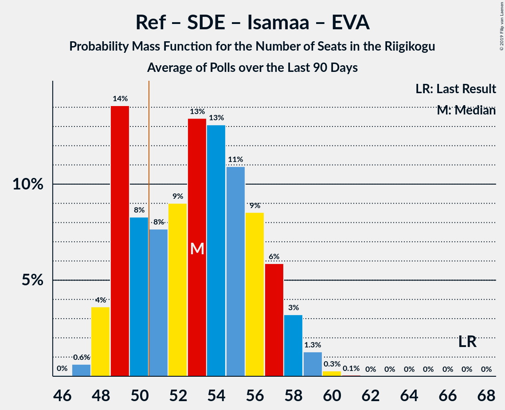

# Poll Average

<a href="#voting-intentions">Voting Intentions</a> | <a href="#seats">Seats</a> | <a href="#coalitions">Coalitions</a> | <a href="#technical-information">Technical Information</a>

## Summary

The table below lists the polls on which the average is based. They are the most recent polls (less than 90 days old) registered and analyzed so far.

| Period     | Polling firm/Commissioner(s) | Ref | Kesk | SDE | Isamaa | EVA | EKRE | Rohelised | E200 |
|:----------:|:----------------------------:|:--:|:--:|:--:|:--:|:--:|:--:|:--:|:--:|
| 1 March 2015 | General Election | 27.7%   30 | 24.8%   27 | 15.2%   15 | 13.7%   14 | 8.7%   8 | 8.1%   7 | 0.9%   0 | 0.0%   0 |
| N/A | Poll Average | 24–30%   27–35 | 22–30%   26–35 | 11–16%   11–17 | 2–6%   0–6 | 1–4%   0 | 15–22%   16–26 | 2–4%   0 | 3–6%   0–5 |
| [12–20 September 2018](2018-09-20-KantarEmor.html) | Kantar Emor   BNS and Postimees | 24–30%   28–36 | 22–27%   25–33 | 11–15%   11–16 | 4–6%   0–6 | 2–5%   0 | 18–23%   19–27 | 2–4%   0 | 3–6%   0–5 |
| [4–17 September 2018](2018-09-17-Turu-uuringuteAS.html) | Turu-uuringute AS   ERR | 24–30%   27–35 | 25–31%   29–36 | 12–16%   12–17 | 2–4%   0 | 1–3%   0 | 15–19%   15–21 | 2–4%   0 | N/A   N/A |
| 1 March 2015 | General Election | 27.7%   30 | 24.8%   27 | 15.2%   15 | 13.7%   14 | 8.7%   8 | 8.1%   7 | 0.9%   0 | 0.0%   0 |

Only polls for which at least the sample size has been published are included in the table above.

**Legend:**
+ **Top half of each row:** Voting intentions (95% confidence interval)
+ **Bottom half of each row:** Seat projections for the Riigikogu (95% confidence interval)
+ **Ref:** Eesti Reformierakond
+ **Kesk:** Eesti Keskerakond
+ **SDE:** Sotsiaaldemokraatlik Erakond
+ **Isamaa:** Erakond Isamaa
+ **EVA:** Eesti Vabaerakond
+ **EKRE:** Eesti Konservatiivne Rahvaerakond
+ **Rohelised:** Erakond Eestimaa Rohelised
+ **E200:** Eesti 200
+ **N/A (single party):** Party not included the published results
+ **N/A (entire row):** Calculation for this opinion poll not started yet

## Voting Intentions

### Confidence Intervals

| Party | Last Result | Median | 80% Confidence Interval | 90% Confidence Interval | 95% Confidence Interval | 99% Confidence Interval |
|:-----:|:-----------:|:------:|:-----------------------:|:-----------------------:|:-----------------------:|:-----------------------:|
| <a href="#eesti-reformierakond">Eesti Reformierakond</a> | 27.7% | 26.9% | 25.1–28.7% |24.6–29.3% | 24.2–29.7% | 23.3–30.6% |
| <a href="#eesti-keskerakond">Eesti Keskerakond</a> | 24.8% | 26.3% | 23.4–29.2% |22.9–29.9% | 22.4–30.4% | 21.5–31.4% |
| <a href="#sotsiaaldemokraatlik-erakond">Sotsiaaldemokraatlik Erakond</a> | 15.2% | 13.3% | 11.7–15.1% |11.3–15.5% | 10.9–15.9% | 10.3–16.7% |
| <a href="#erakond-isamaa">Erakond Isamaa</a> | 13.7% | 4.0% | 2.6–5.6% |2.4–5.9% | 2.2–6.2% | 2.0–6.8% |
| <a href="#eesti-vabaerakond">Eesti Vabaerakond</a> | 8.7% | 2.7% | 1.7–4.0% |1.5–4.3% | 1.4–4.5% | 1.2–5.0% |
| <a href="#eesti-konservatiivne-rahvaerakond">Eesti Konservatiivne Rahvaerakond</a> | 8.1% | 18.5% | 16.1–21.1% |15.6–21.7% | 15.2–22.1% | 14.4–23.1% |
| <a href="#erakond-eestimaa-rohelised">Erakond Eestimaa Rohelised</a> | 0.9% | 3.2% | 2.5–3.9% |2.3–4.2% | 2.2–4.4% | 1.9–4.8% |
| <a href="#eesti-200">Eesti 200</a> | 0.0% | 4.2% | 3.4–5.1% |3.2–5.3% | 3.0–5.6% | 2.7–6.0% |

### Eesti Reformierakond

*For a full overview of the results for this party, see the [Eesti Reformierakond](party-eestireformierakond.html) page.*

| Voting Intentions | Probability | Accumulated | Special Marks |
|:-----------------:|:-----------:|:-----------:|:-------------:|
| 20.5–21.5% | 0% | 100% |  |
| 21.5–22.5% | 0.1% | 100% |  |
| 22.5–23.5% | 0.7% | 99.9% |  |
| 23.5–24.5% | 4% | 99.2% |  |
| 24.5–25.5% | 12% | 95% |  |
| 25.5–26.5% | 24% | 83% |  |
| 26.5–27.5% | 28% | 60% | Median |
| 27.5–28.5% | 20% | 32% | Last Result |
| 28.5–29.5% | 9% | 12% |  |
| 29.5–30.5% | 3% | 3% |  |
| 30.5–31.5% | 0.5% | 0.6% |  |
| 31.5–32.5% | 0.1% | 0.1% |  |
| 32.5–33.5% | 0% | 0% |  |

### Eesti Keskerakond

*For a full overview of the results for this party, see the [Eesti Keskerakond](party-eestikeskerakond.html) page.*

| Voting Intentions | Probability | Accumulated | Special Marks |
|:-----------------:|:-----------:|:-----------:|:-------------:|
| 19.5–20.5% | 0.1% | 100% |  |
| 20.5–21.5% | 0.5% | 99.9% |  |
| 21.5–22.5% | 3% | 99.4% |  |
| 22.5–23.5% | 8% | 97% |  |
| 23.5–24.5% | 14% | 89% |  |
| 24.5–25.5% | 15% | 75% | Last Result |
| 25.5–26.5% | 14% | 61% | Median |
| 26.5–27.5% | 14% | 47% |  |
| 27.5–28.5% | 14% | 32% |  |
| 28.5–29.5% | 11% | 18% |  |
| 29.5–30.5% | 5% | 7% |  |
| 30.5–31.5% | 2% | 2% |  |
| 31.5–32.5% | 0.3% | 0.4% |  |
| 32.5–33.5% | 0% | 0% |  |
| 33.5–34.5% | 0% | 0% |  |

### Sotsiaaldemokraatlik Erakond

*For a full overview of the results for this party, see the [Sotsiaaldemokraatlik Erakond](party-sotsiaaldemokraatlikerakond.html) page.*

| Voting Intentions | Probability | Accumulated | Special Marks |
|:-----------------:|:-----------:|:-----------:|:-------------:|
| 8.5–9.5% | 0% | 100% |  |
| 9.5–10.5% | 1.0% | 99.9% |  |
| 10.5–11.5% | 7% | 98.9% |  |
| 11.5–12.5% | 20% | 92% |  |
| 12.5–13.5% | 29% | 72% | Median |
| 13.5–14.5% | 25% | 43% |  |
| 14.5–15.5% | 13% | 18% | Last Result |
| 15.5–16.5% | 4% | 5% |  |
| 16.5–17.5% | 0.7% | 0.7% |  |
| 17.5–18.5% | 0.1% | 0.1% |  |
| 18.5–19.5% | 0% | 0% |  |

### Erakond Isamaa

*For a full overview of the results for this party, see the [Erakond Isamaa](party-erakondisamaa.html) page.*

| Voting Intentions | Probability | Accumulated | Special Marks |
|:-----------------:|:-----------:|:-----------:|:-------------:|
| 0.5–1.5% | 0% | 100% |  |
| 1.5–2.5% | 8% | 100% |  |
| 2.5–3.5% | 33% | 92% |  |
| 3.5–4.5% | 22% | 59% | Median |
| 4.5–5.5% | 26% | 37% |  |
| 5.5–6.5% | 10% | 11% |  |
| 6.5–7.5% | 1.0% | 1.0% |  |
| 7.5–8.5% | 0% | 0% |  |
| 8.5–9.5% | 0% | 0% |  |
| 9.5–10.5% | 0% | 0% |  |
| 10.5–11.5% | 0% | 0% |  |
| 11.5–12.5% | 0% | 0% |  |
| 12.5–13.5% | 0% | 0% |  |
| 13.5–14.5% | 0% | 0% | Last Result |

### Eesti Vabaerakond

*For a full overview of the results for this party, see the [Eesti Vabaerakond](party-eestivabaerakond.html) page.*

| Voting Intentions | Probability | Accumulated | Special Marks |
|:-----------------:|:-----------:|:-----------:|:-------------:|
| 0.0–0.5% | 0% | 100% |  |
| 0.5–1.5% | 5% | 100% |  |
| 1.5–2.5% | 39% | 95% |  |
| 2.5–3.5% | 34% | 56% | Median |
| 3.5–4.5% | 20% | 22% |  |
| 4.5–5.5% | 2% | 2% |  |
| 5.5–6.5% | 0.1% | 0.1% |  |
| 6.5–7.5% | 0% | 0% |  |
| 7.5–8.5% | 0% | 0% |  |
| 8.5–9.5% | 0% | 0% | Last Result |

### Eesti Konservatiivne Rahvaerakond

*For a full overview of the results for this party, see the [Eesti Konservatiivne Rahvaerakond](party-eestikonservatiivnerahvaerakond.html) page.*

| Voting Intentions | Probability | Accumulated | Special Marks |
|:-----------------:|:-----------:|:-----------:|:-------------:|
| 7.5–8.5% | 0% | 100% | Last Result |
| 8.5–9.5% | 0% | 100% |  |
| 9.5–10.5% | 0% | 100% |  |
| 10.5–11.5% | 0% | 100% |  |
| 11.5–12.5% | 0% | 100% |  |
| 12.5–13.5% | 0% | 100% |  |
| 13.5–14.5% | 0.7% | 100% |  |
| 14.5–15.5% | 4% | 99.3% |  |
| 15.5–16.5% | 12% | 95% |  |
| 16.5–17.5% | 17% | 83% |  |
| 17.5–18.5% | 17% | 66% | Median |
| 18.5–19.5% | 16% | 49% |  |
| 19.5–20.5% | 16% | 33% |  |
| 20.5–21.5% | 11% | 17% |  |
| 21.5–22.5% | 4% | 6% |  |
| 22.5–23.5% | 1.1% | 1.3% |  |
| 23.5–24.5% | 0.2% | 0.2% |  |
| 24.5–25.5% | 0% | 0% |  |

### Erakond Eestimaa Rohelised

*For a full overview of the results for this party, see the [Erakond Eestimaa Rohelised](party-erakondeestimaarohelised.html) page.*

| Voting Intentions | Probability | Accumulated | Special Marks |
|:-----------------:|:-----------:|:-----------:|:-------------:|
| 0.5–1.5% | 0% | 100% | Last Result |
| 1.5–2.5% | 12% | 100% |  |
| 2.5–3.5% | 63% | 88% | Median |
| 3.5–4.5% | 24% | 25% |  |
| 4.5–5.5% | 1.4% | 1.4% |  |
| 5.5–6.5% | 0% | 0% |  |

### Eesti 200

*For a full overview of the results for this party, see the [Eesti 200](party-eesti200.html) page.*

| Voting Intentions | Probability | Accumulated | Special Marks |
|:-----------------:|:-----------:|:-----------:|:-------------:|
| 0.0–0.5% | 0% | 100% | Last Result |
| 0.5–1.5% | 0% | 100% |  |
| 1.5–2.5% | 0.2% | 100% |  |
| 2.5–3.5% | 15% | 99.8% |  |
| 3.5–4.5% | 57% | 85% | Median |
| 4.5–5.5% | 25% | 28% |  |
| 5.5–6.5% | 2% | 3% |  |
| 6.5–7.5% | 0.1% | 0.1% |  |
| 7.5–8.5% | 0% | 0% |  |

## Seats

### Confidence Intervals

| Party | Last Result | Median | 80% Confidence Interval | 90% Confidence Interval | 95% Confidence Interval | 99% Confidence Interval |
|:-----:|:-----------:|:------:|:-----------------------:|:-----------------------:|:-----------------------:|:-----------------------:|
| <a href="#eesti-reformierakond">Eesti Reformierakond</a> | 30 | 31 | 29–34 |28–35 | 27–35 | 27–37 |
| <a href="#eesti-keskerakond">Eesti Keskerakond</a> | 27 | 31 | 28–34 |27–34 | 26–35 | 25–37 |
| <a href="#sotsiaaldemokraatlik-erakond">Sotsiaaldemokraatlik Erakond</a> | 15 | 14 | 12–16 |12–17 | 11–17 | 11–18 |
| <a href="#erakond-isamaa">Erakond Isamaa</a> | 14 | 0 | 0–5 |0–5 | 0–6 | 0–6 |
| <a href="#eesti-vabaerakond">Eesti Vabaerakond</a> | 8 | 0 | 0 |0 | 0 | 0 |
| <a href="#eesti-konservatiivne-rahvaerakond">Eesti Konservatiivne Rahvaerakond</a> | 7 | 20 | 17–25 |16–25 | 16–26 | 15–27 |
| <a href="#erakond-eestimaa-rohelised">Erakond Eestimaa Rohelised</a> | 0 | 0 | 0 |0 | 0 | 0 |
| <a href="#eesti-200">Eesti 200</a> | 0 | 0 | 0 |0–5 | 0–5 | 0–6 |

### Eesti Reformierakond

*For a full overview of the results for this party, see the [Eesti Reformierakond](party-eestireformierakond.html) page.*

| Number of Seats | Probability | Accumulated | Special Marks |
|:---------------:|:-----------:|:-----------:|:-------------:|
| 25 | 0.1% | 100% |  |
| 26 | 0.4% | 99.9% |  |
| 27 | 2% | 99.5% |  |
| 28 | 4% | 97% |  |
| 29 | 13% | 93% |  |
| 30 | 17% | 81% | Last Result |
| 31 | 21% | 64% | Median |
| 32 | 13% | 43% |  |
| 33 | 12% | 30% |  |
| 34 | 9% | 18% |  |
| 35 | 6% | 8% |  |
| 36 | 2% | 2% |  |
| 37 | 0.5% | 0.8% |  |
| 38 | 0.2% | 0.2% |  |
| 39 | 0.1% | 0.1% |  |
| 40 | 0% | 0% |  |

### Eesti Keskerakond

*For a full overview of the results for this party, see the [Eesti Keskerakond](party-eestikeskerakond.html) page.*

| Number of Seats | Probability | Accumulated | Special Marks |
|:---------------:|:-----------:|:-----------:|:-------------:|
| 23 | 0.1% | 100% |  |
| 24 | 0.3% | 99.9% |  |
| 25 | 0.9% | 99.6% |  |
| 26 | 3% | 98.7% |  |
| 27 | 5% | 96% | Last Result |
| 28 | 10% | 91% |  |
| 29 | 14% | 80% |  |
| 30 | 12% | 66% |  |
| 31 | 13% | 54% | Median |
| 32 | 16% | 41% |  |
| 33 | 14% | 25% |  |
| 34 | 6% | 11% |  |
| 35 | 3% | 4% |  |
| 36 | 1.2% | 2% |  |
| 37 | 0.6% | 0.7% |  |
| 38 | 0.1% | 0.2% |  |
| 39 | 0% | 0% |  |

### Sotsiaaldemokraatlik Erakond

*For a full overview of the results for this party, see the [Sotsiaaldemokraatlik Erakond](party-sotsiaaldemokraatlikerakond.html) page.*

| Number of Seats | Probability | Accumulated | Special Marks |
|:---------------:|:-----------:|:-----------:|:-------------:|
| 10 | 0.4% | 100% |  |
| 11 | 3% | 99.6% |  |
| 12 | 8% | 97% |  |
| 13 | 19% | 89% |  |
| 14 | 31% | 70% | Median |
| 15 | 23% | 39% | Last Result |
| 16 | 10% | 15% |  |
| 17 | 5% | 6% |  |
| 18 | 0.9% | 1.1% |  |
| 19 | 0.2% | 0.2% |  |
| 20 | 0% | 0% |  |

### Erakond Isamaa

*For a full overview of the results for this party, see the [Erakond Isamaa](party-erakondisamaa.html) page.*

| Number of Seats | Probability | Accumulated | Special Marks |
|:---------------:|:-----------:|:-----------:|:-------------:|
| 0 | 76% | 100% | Median |
| 1 | 0% | 24% |  |
| 2 | 0% | 24% |  |
| 3 | 0% | 24% |  |
| 4 | 0.6% | 24% |  |
| 5 | 20% | 24% |  |
| 6 | 4% | 4% |  |
| 7 | 0.4% | 0.4% |  |
| 8 | 0% | 0% |  |
| 9 | 0% | 0% |  |
| 10 | 0% | 0% |  |
| 11 | 0% | 0% |  |
| 12 | 0% | 0% |  |
| 13 | 0% | 0% |  |
| 14 | 0% | 0% | Last Result |

### Eesti Vabaerakond

*For a full overview of the results for this party, see the [Eesti Vabaerakond](party-eestivabaerakond.html) page.*

| Number of Seats | Probability | Accumulated | Special Marks |
|:---------------:|:-----------:|:-----------:|:-------------:|
| 0 | 99.6% | 100% | Median |
| 1 | 0% | 0.4% |  |
| 2 | 0% | 0.4% |  |
| 3 | 0% | 0.4% |  |
| 4 | 0.1% | 0.4% |  |
| 5 | 0.3% | 0.3% |  |
| 6 | 0% | 0% |  |
| 7 | 0% | 0% |  |
| 8 | 0% | 0% | Last Result |

### Eesti Konservatiivne Rahvaerakond

*For a full overview of the results for this party, see the [Eesti Konservatiivne Rahvaerakond](party-eestikonservatiivnerahvaerakond.html) page.*

| Number of Seats | Probability | Accumulated | Special Marks |
|:---------------:|:-----------:|:-----------:|:-------------:|
| 7 | 0% | 100% | Last Result |
| 8 | 0% | 100% |  |
| 9 | 0% | 100% |  |
| 10 | 0% | 100% |  |
| 11 | 0% | 100% |  |
| 12 | 0% | 100% |  |
| 13 | 0% | 100% |  |
| 14 | 0.1% | 100% |  |
| 15 | 2% | 99.9% |  |
| 16 | 7% | 98% |  |
| 17 | 6% | 91% |  |
| 18 | 8% | 85% |  |
| 19 | 17% | 78% |  |
| 20 | 12% | 61% | Median |
| 21 | 7% | 49% |  |
| 22 | 12% | 42% |  |
| 23 | 12% | 30% |  |
| 24 | 7% | 18% |  |
| 25 | 6% | 11% |  |
| 26 | 3% | 5% |  |
| 27 | 0.9% | 1.3% |  |
| 28 | 0.3% | 0.4% |  |
| 29 | 0.1% | 0.1% |  |
| 30 | 0% | 0% |  |

### Erakond Eestimaa Rohelised

*For a full overview of the results for this party, see the [Erakond Eestimaa Rohelised](party-erakondeestimaarohelised.html) page.*

| Number of Seats | Probability | Accumulated | Special Marks |
|:---------------:|:-----------:|:-----------:|:-------------:|
| 0 | 99.8% | 100% | Last Result, Median |
| 1 | 0% | 0.2% |  |
| 2 | 0% | 0.2% |  |
| 3 | 0% | 0.2% |  |
| 4 | 0% | 0.2% |  |
| 5 | 0.2% | 0.2% |  |
| 6 | 0% | 0% |  |

### Eesti 200

*For a full overview of the results for this party, see the [Eesti 200](party-eesti200.html) page.*

| Number of Seats | Probability | Accumulated | Special Marks |
|:---------------:|:-----------:|:-----------:|:-------------:|
| 0 | 91% | 100% | Last Result, Median |
| 1 | 0% | 9% |  |
| 2 | 0% | 9% |  |
| 3 | 0% | 9% |  |
| 4 | 1.1% | 9% |  |
| 5 | 7% | 8% |  |
| 6 | 0.7% | 0.7% |  |
| 7 | 0% | 0% |  |

## Coalitions

### Confidence Intervals

| Coalition | Last Result | Median | Majority? | 80% Confidence Interval | 90% Confidence Interval | 95% Confidence Interval | 99% Confidence Interval |
|:---------:|:-----------:|:------:|:---------:|:-----------------------:|:-----------------------:|:-----------------------:|:-----------------------:|
| Eesti Reformierakond – Eesti Keskerakond – Eesti Konservatiivne Rahvaerakond | 64 | 82 | 100% | 79–87 | 79–88 | 78–89 | 77–90 |
| Eesti Reformierakond – Eesti Keskerakond | 57 | 62 | 100% | 59–65 | 58–66 | 57–67 | 55–68 |
| Eesti Reformierakond – Erakond Isamaa – Eesti Konservatiivne Rahvaerakond | 51 | 53 | 60% | 47–59 | 47–61 | 46–61 | 45–63 |
| Eesti Reformierakond – Eesti Konservatiivne Rahvaerakond | 37 | 52 | 59% | 47–57 | 47–58 | 46–59 | 45–61 |
| Eesti Keskerakond – Eesti Konservatiivne Rahvaerakond | 34 | 51 | 64% | 48–55 | 48–56 | 47–56 | 46–58 |
| Eesti Reformierakond – Sotsiaaldemokraatlik Erakond – Erakond Isamaa – Eesti Vabaerakond | 67 | 47 | 9% | 43–50 | 43–51 | 42–52 | 41–54 |
| Eesti Reformierakond – Sotsiaaldemokraatlik Erakond – Erakond Isamaa | 59 | 47 | 9% | 43–50 | 43–51 | 42–52 | 41–54 |
| Eesti Keskerakond – Sotsiaaldemokraatlik Erakond – Erakond Isamaa | 56 | 46 | 2% | 43–49 | 42–50 | 41–50 | 39–52 |
| Eesti Reformierakond – Sotsiaaldemokraatlik Erakond | 45 | 46 | 2% | 43–48 | 42–49 | 41–50 | 40–52 |
| Eesti Keskerakond – Sotsiaaldemokraatlik Erakond | 42 | 45 | 2% | 41–49 | 40–49 | 39–50 | 38–52 |
| Sotsiaaldemokraatlik Erakond – Eesti Konservatiivne Rahvaerakond | 22 | 35 | 0% | 32–39 | 31–39 | 30–40 | 29–42 |
| Eesti Reformierakond – Erakond Isamaa | 44 | 32 | 0% | 29–37 | 28–38 | 28–39 | 27–40 |

### Eesti Reformierakond – Eesti Keskerakond – Eesti Konservatiivne Rahvaerakond

| Number of Seats | Probability | Accumulated | Special Marks |
|:---------------:|:-----------:|:-----------:|:-------------:|
| 64 | 0% | 100% | Last Result |
| 65 | 0% | 100% |  |
| 66 | 0% | 100% |  |
| 67 | 0% | 100% |  |
| 68 | 0% | 100% |  |
| 69 | 0% | 100% |  |
| 70 | 0% | 100% |  |
| 71 | 0% | 100% |  |
| 72 | 0% | 100% |  |
| 73 | 0% | 100% |  |
| 74 | 0% | 100% |  |
| 75 | 0% | 100% |  |
| 76 | 0.3% | 99.9% |  |
| 77 | 0.8% | 99.7% |  |
| 78 | 3% | 98.9% |  |
| 79 | 6% | 96% |  |
| 80 | 12% | 90% |  |
| 81 | 16% | 77% |  |
| 82 | 18% | 61% | Median |
| 83 | 12% | 43% |  |
| 84 | 5% | 32% |  |
| 85 | 5% | 27% |  |
| 86 | 7% | 22% |  |
| 87 | 7% | 15% |  |
| 88 | 5% | 8% |  |
| 89 | 2% | 3% |  |
| 90 | 0.9% | 0.9% |  |
| 91 | 0.1% | 0.1% |  |
| 92 | 0% | 0% |  |

### Eesti Reformierakond – Eesti Keskerakond

| Number of Seats | Probability | Accumulated | Special Marks |
|:---------------:|:-----------:|:-----------:|:-------------:|
| 53 | 0.1% | 100% |  |
| 54 | 0.3% | 99.9% |  |
| 55 | 0.6% | 99.6% |  |
| 56 | 0.9% | 99.1% |  |
| 57 | 2% | 98% | Last Result |
| 58 | 5% | 96% |  |
| 59 | 8% | 91% |  |
| 60 | 10% | 83% |  |
| 61 | 14% | 74% |  |
| 62 | 16% | 59% | Median |
| 63 | 15% | 43% |  |
| 64 | 11% | 28% |  |
| 65 | 9% | 17% |  |
| 66 | 5% | 9% |  |
| 67 | 2% | 4% |  |
| 68 | 1.1% | 2% |  |
| 69 | 0.3% | 0.5% |  |
| 70 | 0.1% | 0.2% |  |
| 71 | 0% | 0.1% |  |
| 72 | 0% | 0% |  |

### Eesti Reformierakond – Erakond Isamaa – Eesti Konservatiivne Rahvaerakond

| Number of Seats | Probability | Accumulated | Special Marks |
|:---------------:|:-----------:|:-----------:|:-------------:|
| 43 | 0.1% | 100% |  |
| 44 | 0.3% | 99.9% |  |
| 45 | 0.8% | 99.6% |  |
| 46 | 4% | 98.8% |  |
| 47 | 6% | 95% |  |
| 48 | 10% | 89% |  |
| 49 | 12% | 78% |  |
| 50 | 6% | 66% |  |
| 51 | 4% | 60% | Last Result, Median, Majority |
| 52 | 4% | 56% |  |
| 53 | 5% | 52% |  |
| 54 | 3% | 48% |  |
| 55 | 4% | 45% |  |
| 56 | 6% | 41% |  |
| 57 | 7% | 35% |  |
| 58 | 7% | 28% |  |
| 59 | 11% | 21% |  |
| 60 | 3% | 9% |  |
| 61 | 4% | 6% |  |
| 62 | 1.3% | 2% |  |
| 63 | 0.6% | 0.8% |  |
| 64 | 0.1% | 0.2% |  |
| 65 | 0% | 0.1% |  |
| 66 | 0% | 0% |  |

### Eesti Reformierakond – Eesti Konservatiivne Rahvaerakond

| Number of Seats | Probability | Accumulated | Special Marks |
|:---------------:|:-----------:|:-----------:|:-------------:|
| 37 | 0% | 100% | Last Result |
| 38 | 0% | 100% |  |
| 39 | 0% | 100% |  |
| 40 | 0% | 100% |  |
| 41 | 0% | 100% |  |
| 42 | 0% | 100% |  |
| 43 | 0.1% | 100% |  |
| 44 | 0.3% | 99.9% |  |
| 45 | 0.9% | 99.6% |  |
| 46 | 4% | 98.8% |  |
| 47 | 6% | 95% |  |
| 48 | 11% | 89% |  |
| 49 | 12% | 78% |  |
| 50 | 7% | 66% |  |
| 51 | 5% | 59% | Median, Majority |
| 52 | 6% | 53% |  |
| 53 | 8% | 47% |  |
| 54 | 11% | 39% |  |
| 55 | 5% | 28% |  |
| 56 | 8% | 22% |  |
| 57 | 6% | 15% |  |
| 58 | 5% | 9% |  |
| 59 | 3% | 4% |  |
| 60 | 1.2% | 2% |  |
| 61 | 0.4% | 0.7% |  |
| 62 | 0.2% | 0.3% |  |
| 63 | 0.1% | 0.1% |  |
| 64 | 0% | 0% |  |

### Eesti Keskerakond – Eesti Konservatiivne Rahvaerakond

| Number of Seats | Probability | Accumulated | Special Marks |
|:---------------:|:-----------:|:-----------:|:-------------:|
| 34 | 0% | 100% | Last Result |
| 35 | 0% | 100% |  |
| 36 | 0% | 100% |  |
| 37 | 0% | 100% |  |
| 38 | 0% | 100% |  |
| 39 | 0% | 100% |  |
| 40 | 0% | 100% |  |
| 41 | 0% | 100% |  |
| 42 | 0% | 100% |  |
| 43 | 0% | 100% |  |
| 44 | 0.1% | 100% |  |
| 45 | 0.3% | 99.9% |  |
| 46 | 1.3% | 99.5% |  |
| 47 | 2% | 98% |  |
| 48 | 8% | 96% |  |
| 49 | 11% | 88% |  |
| 50 | 14% | 78% |  |
| 51 | 16% | 64% | Median, Majority |
| 52 | 19% | 48% |  |
| 53 | 9% | 29% |  |
| 54 | 9% | 19% |  |
| 55 | 5% | 10% |  |
| 56 | 3% | 5% |  |
| 57 | 1.4% | 2% |  |
| 58 | 0.6% | 0.7% |  |
| 59 | 0.1% | 0.2% |  |
| 60 | 0% | 0% |  |

### Eesti Reformierakond – Sotsiaaldemokraatlik Erakond – Erakond Isamaa – Eesti Vabaerakond

| Number of Seats | Probability | Accumulated | Special Marks |
|:---------------:|:-----------:|:-----------:|:-------------:|
| 39 | 0.1% | 100% |  |
| 40 | 0.2% | 99.9% |  |
| 41 | 1.2% | 99.7% |  |
| 42 | 3% | 98.5% |  |
| 43 | 8% | 96% |  |
| 44 | 11% | 88% |  |
| 45 | 9% | 77% | Median |
| 46 | 16% | 68% |  |
| 47 | 13% | 52% |  |
| 48 | 11% | 39% |  |
| 49 | 11% | 28% |  |
| 50 | 9% | 17% |  |
| 51 | 5% | 9% | Majority |
| 52 | 3% | 4% |  |
| 53 | 1.1% | 2% |  |
| 54 | 0.4% | 0.6% |  |
| 55 | 0.2% | 0.2% |  |
| 56 | 0% | 0% |  |
| 57 | 0% | 0% |  |
| 58 | 0% | 0% |  |
| 59 | 0% | 0% |  |
| 60 | 0% | 0% |  |
| 61 | 0% | 0% |  |
| 62 | 0% | 0% |  |
| 63 | 0% | 0% |  |
| 64 | 0% | 0% |  |
| 65 | 0% | 0% |  |
| 66 | 0% | 0% |  |
| 67 | 0% | 0% | Last Result |

### Eesti Reformierakond – Sotsiaaldemokraatlik Erakond – Erakond Isamaa

| Number of Seats | Probability | Accumulated | Special Marks |
|:---------------:|:-----------:|:-----------:|:-------------:|
| 39 | 0.1% | 100% |  |
| 40 | 0.2% | 99.9% |  |
| 41 | 1.2% | 99.7% |  |
| 42 | 3% | 98% |  |
| 43 | 8% | 96% |  |
| 44 | 11% | 88% |  |
| 45 | 9% | 77% | Median |
| 46 | 16% | 68% |  |
| 47 | 13% | 52% |  |
| 48 | 11% | 39% |  |
| 49 | 11% | 28% |  |
| 50 | 8% | 17% |  |
| 51 | 4% | 9% | Majority |
| 52 | 3% | 4% |  |
| 53 | 1.1% | 2% |  |
| 54 | 0.3% | 0.6% |  |
| 55 | 0.2% | 0.2% |  |
| 56 | 0% | 0% |  |
| 57 | 0% | 0% |  |
| 58 | 0% | 0% |  |
| 59 | 0% | 0% | Last Result |

### Eesti Keskerakond – Sotsiaaldemokraatlik Erakond – Erakond Isamaa

| Number of Seats | Probability | Accumulated | Special Marks |
|:---------------:|:-----------:|:-----------:|:-------------:|
| 38 | 0.1% | 100% |  |
| 39 | 0.4% | 99.8% |  |
| 40 | 0.8% | 99.5% |  |
| 41 | 2% | 98.7% |  |
| 42 | 5% | 97% |  |
| 43 | 7% | 92% |  |
| 44 | 9% | 85% |  |
| 45 | 12% | 76% | Median |
| 46 | 15% | 64% |  |
| 47 | 23% | 48% |  |
| 48 | 10% | 26% |  |
| 49 | 9% | 15% |  |
| 50 | 3% | 6% |  |
| 51 | 2% | 2% | Majority |
| 52 | 0.6% | 0.9% |  |
| 53 | 0.2% | 0.3% |  |
| 54 | 0.1% | 0.1% |  |
| 55 | 0% | 0% |  |
| 56 | 0% | 0% | Last Result |

### Eesti Reformierakond – Sotsiaaldemokraatlik Erakond

| Number of Seats | Probability | Accumulated | Special Marks |
|:---------------:|:-----------:|:-----------:|:-------------:|
| 38 | 0.1% | 100% |  |
| 39 | 0.2% | 99.9% |  |
| 40 | 0.8% | 99.8% |  |
| 41 | 2% | 98.9% |  |
| 42 | 5% | 97% |  |
| 43 | 10% | 92% |  |
| 44 | 16% | 82% |  |
| 45 | 15% | 66% | Last Result, Median |
| 46 | 19% | 51% |  |
| 47 | 13% | 32% |  |
| 48 | 9% | 19% |  |
| 49 | 7% | 10% |  |
| 50 | 2% | 3% |  |
| 51 | 1.1% | 2% | Majority |
| 52 | 0.4% | 0.5% |  |
| 53 | 0.1% | 0.1% |  |
| 54 | 0% | 0% |  |

### Eesti Keskerakond – Sotsiaaldemokraatlik Erakond

| Number of Seats | Probability | Accumulated | Special Marks |
|:---------------:|:-----------:|:-----------:|:-------------:|
| 36 | 0.1% | 100% |  |
| 37 | 0.3% | 99.9% |  |
| 38 | 1.0% | 99.6% |  |
| 39 | 2% | 98.6% |  |
| 40 | 4% | 97% |  |
| 41 | 4% | 92% |  |
| 42 | 13% | 88% | Last Result |
| 43 | 9% | 74% |  |
| 44 | 10% | 65% |  |
| 45 | 9% | 55% | Median |
| 46 | 13% | 46% |  |
| 47 | 14% | 33% |  |
| 48 | 7% | 18% |  |
| 49 | 7% | 11% |  |
| 50 | 2% | 4% |  |
| 51 | 1.0% | 2% | Majority |
| 52 | 0.4% | 0.6% |  |
| 53 | 0.1% | 0.2% |  |
| 54 | 0.1% | 0.1% |  |
| 55 | 0% | 0% |  |

### Sotsiaaldemokraatlik Erakond – Eesti Konservatiivne Rahvaerakond

| Number of Seats | Probability | Accumulated | Special Marks |
|:---------------:|:-----------:|:-----------:|:-------------:|
| 22 | 0% | 100% | Last Result |
| 23 | 0% | 100% |  |
| 24 | 0% | 100% |  |
| 25 | 0% | 100% |  |
| 26 | 0% | 100% |  |
| 27 | 0.1% | 100% |  |
| 28 | 0.2% | 99.9% |  |
| 29 | 1.3% | 99.7% |  |
| 30 | 3% | 98% |  |
| 31 | 5% | 96% |  |
| 32 | 10% | 91% |  |
| 33 | 15% | 80% |  |
| 34 | 14% | 65% | Median |
| 35 | 10% | 51% |  |
| 36 | 12% | 41% |  |
| 37 | 11% | 28% |  |
| 38 | 7% | 17% |  |
| 39 | 5% | 10% |  |
| 40 | 3% | 5% |  |
| 41 | 2% | 2% |  |
| 42 | 0.5% | 0.6% |  |
| 43 | 0.1% | 0.1% |  |
| 44 | 0% | 0% |  |

### Eesti Reformierakond – Erakond Isamaa

| Number of Seats | Probability | Accumulated | Special Marks |
|:---------------:|:-----------:|:-----------:|:-------------:|
| 25 | 0.1% | 100% |  |
| 26 | 0.3% | 99.9% |  |
| 27 | 2% | 99.7% |  |
| 28 | 3% | 98% |  |
| 29 | 11% | 95% |  |
| 30 | 14% | 84% |  |
| 31 | 12% | 71% | Median |
| 32 | 11% | 59% |  |
| 33 | 10% | 48% |  |
| 34 | 9% | 38% |  |
| 35 | 8% | 28% |  |
| 36 | 10% | 20% |  |
| 37 | 4% | 10% |  |
| 38 | 2% | 6% |  |
| 39 | 3% | 4% |  |
| 40 | 0.5% | 1.0% |  |
| 41 | 0.4% | 0.4% |  |
| 42 | 0.1% | 0.1% |  |
| 43 | 0% | 0% |  |
| 44 | 0% | 0% | Last Result |

## Technical Information

+ **Number of polls included in this average:** 2
+ **Lowest number of simulations done in a poll included in this average:** 131,072
+ **Total number of simulations done in the polls included in this average:** 1,179,648
+ **Error estimate:** 1.33%
