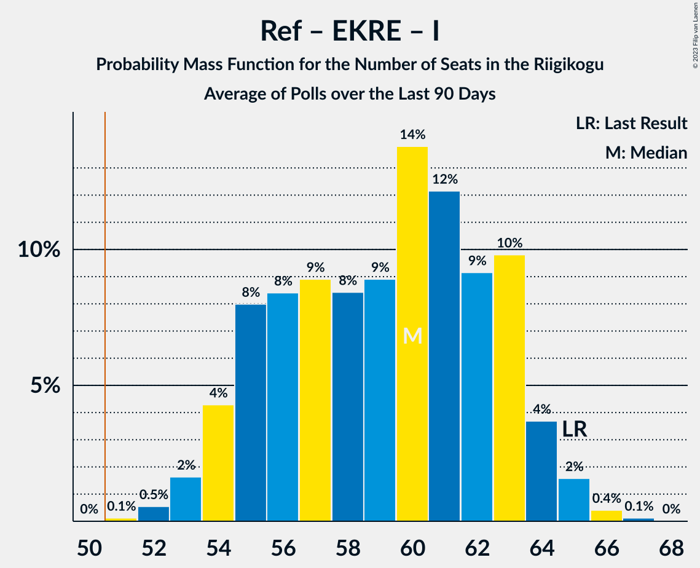

# Poll Average

<a href="#voting-intentions">Voting Intentions</a> | <a href="#seats">Seats</a> | <a href="#coalitions">Coalitions</a> | <a href="#technical-information">Technical Information</a>

## Summary

The table below lists the polls on which the average is based. They are the most recent polls (less than 90 days old) registered and analyzed so far.

| Period     | Polling firm/Commissioner(s) | Ref | Kesk | EKRE | I | SDE | E200 | Rohelised | EVA |
|:----------:|:----------------------------:|:--:|:--:|:--:|:--:|:--:|:--:|:--:|:--:|
| 3 March 2019 | General Election | 28.9%   34 | 23.1%   26 | 17.8%   19 | 11.4%   12 | 9.8%   10 | 4.4%   0 | 1.8%   0 | 1.2%   0 |
| N/A | Poll Average | 18–26%   19–29 | 16–24%   16–26 | 18–24%   19–27 | 6–9%   5–9 | 5–11%   0–11 | 15–22%   15–24 | 1–5%   0 | N/A   N/A |
| [14–20 December 2021](2021-12-20-Norstat.html) | Norstat   MTÜ Ühiskonnauuringute Instituut | 22–27%   23–30 | 20–25%   21–27 | 18–23%   18–24 | 6–10%   6–9 | 5–8%   0–7 | 15–19%   15–20 | 1–3%   0 | N/A   N/A |
| [9–15 December 2021](2021-12-15-KantarEmor.html) | Kantar Emor   BNS and Postimees | 17–21%   18–23 | 15–19%   16–20 | 20–24%   21–27 | 6–9%   5–8 | 8–12%   8–12 | 18–22%   19–25 | 3–5%   0–4 | N/A   N/A |
| [30 November–7 December 2021](2021-12-07-Turu-uuringuteAS.html) | Turu-uuringute AS | 19–24%   20–26 | 18–23%   19–25 | 20–25%   21–27 | 6–9%   5–8 | 7–10%   6–9 | 16–21%   16–22 | 1–3%   0 | N/A   N/A |
| 3 March 2019 | General Election | 28.9%   34 | 23.1%   26 | 17.8%   19 | 11.4%   12 | 9.8%   10 | 4.4%   0 | 1.8%   0 | 1.2%   0 |

Only polls for which at least the sample size has been published are included in the table above.

**Legend:**
+ **Top half of each row:** Voting intentions (95% confidence interval)
+ **Bottom half of each row:** Seat projections for the Riigikogu (95% confidence interval)
+ **Ref:** Eesti Reformierakond
+ **Kesk:** Eesti Keskerakond
+ **EKRE:** Eesti Konservatiivne Rahvaerakond
+ **I:** Erakond Isamaa
+ **SDE:** Sotsiaaldemokraatlik Erakond
+ **E200:** Eesti 200
+ **Rohelised:** Erakond Eestimaa Rohelised
+ **EVA:** Eesti Vabaerakond
+ **N/A (single party):** Party not included the published results
+ **N/A (entire row):** Calculation for this opinion poll not started yet

## Voting Intentions

### Confidence Intervals

| Party | Last Result | Median | 80% Confidence Interval | 90% Confidence Interval | 95% Confidence Interval | 99% Confidence Interval |
|:-----:|:-----------:|:------:|:-----------------------:|:-----------------------:|:-----------------------:|:-----------------------:|
| <a href="#eesti-reformierakond">Eesti Reformierakond</a> | 28.9% | 21.3% | 18.4–25.2% |17.9–25.9% | 17.5–26.4% | 16.7–27.5% |
| <a href="#eesti-keskerakond">Eesti Keskerakond</a> | 23.1% | 20.1% | 16.4–23.1% |15.9–23.7% | 15.5–24.3% | 14.8–25.3% |
| <a href="#eesti-konservatiivne-rahvaerakond">Eesti Konservatiivne Rahvaerakond</a> | 17.8% | 21.5% | 19.4–23.4% |18.8–24.0% | 18.3–24.4% | 17.5–25.3% |
| <a href="#erakond-isamaa">Erakond Isamaa</a> | 11.4% | 7.3% | 6.3–8.6% |6.0–9.0% | 5.8–9.3% | 5.3–10.0% |
| <a href="#sotsiaaldemokraatlik-erakond">Sotsiaaldemokraatlik Erakond</a> | 9.8% | 8.2% | 5.6–10.5% |5.2–11.0% | 4.9–11.3% | 4.5–12.0% |
| <a href="#eesti-200">Eesti 200</a> | 4.4% | 18.3% | 16.2–20.7% |15.7–21.3% | 15.2–21.7% | 14.5–22.6% |
| <a href="#erakond-eestimaa-rohelised">Erakond Eestimaa Rohelised</a> | 1.8% | 2.2% | 1.4–4.4% |1.3–4.7% | 1.1–4.9% | 0.9–5.4% |
| <a href="#eesti-vabaerakond">Eesti Vabaerakond</a> | 1.2% | N/A | N/A |N/A | N/A | N/A |

### Eesti Reformierakond

*For a full overview of the results for this party, see the [Eesti Reformierakond](party-eestireformierakond.html) page.*

| Voting Intentions | Probability | Accumulated | Special Marks |
|:-----------------:|:-----------:|:-----------:|:-------------:|
| 14.5–15.5% | 0% | 100% |  |
| 15.5–16.5% | 0.3% | 100% |  |
| 16.5–17.5% | 3% | 99.6% |  |
| 17.5–18.5% | 9% | 97% |  |
| 18.5–19.5% | 14% | 89% |  |
| 19.5–20.5% | 14% | 75% |  |
| 20.5–21.5% | 13% | 60% | Median |
| 21.5–22.5% | 11% | 47% |  |
| 22.5–23.5% | 10% | 36% |  |
| 23.5–24.5% | 10% | 26% |  |
| 24.5–25.5% | 9% | 16% |  |
| 25.5–26.5% | 5% | 7% |  |
| 26.5–27.5% | 2% | 2% |  |
| 27.5–28.5% | 0.4% | 0.4% |  |
| 28.5–29.5% | 0.1% | 0.1% | Last Result |
| 29.5–30.5% | 0% | 0% |  |

### Eesti Keskerakond

*For a full overview of the results for this party, see the [Eesti Keskerakond](party-eestikeskerakond.html) page.*

| Voting Intentions | Probability | Accumulated | Special Marks |
|:-----------------:|:-----------:|:-----------:|:-------------:|
| 12.5–13.5% | 0% | 100% |  |
| 13.5–14.5% | 0.3% | 100% |  |
| 14.5–15.5% | 2% | 99.7% |  |
| 15.5–16.5% | 8% | 97% |  |
| 16.5–17.5% | 12% | 89% |  |
| 17.5–18.5% | 10% | 77% |  |
| 18.5–19.5% | 10% | 67% |  |
| 19.5–20.5% | 13% | 57% | Median |
| 20.5–21.5% | 15% | 44% |  |
| 21.5–22.5% | 14% | 29% |  |
| 22.5–23.5% | 9% | 16% | Last Result |
| 23.5–24.5% | 5% | 6% |  |
| 24.5–25.5% | 1.4% | 2% |  |
| 25.5–26.5% | 0.3% | 0.3% |  |
| 26.5–27.5% | 0% | 0% |  |

### Eesti Konservatiivne Rahvaerakond

*For a full overview of the results for this party, see the [Eesti Konservatiivne Rahvaerakond](party-eestikonservatiivnerahvaerakond.html) page.*

| Voting Intentions | Probability | Accumulated | Special Marks |
|:-----------------:|:-----------:|:-----------:|:-------------:|
| 15.5–16.5% | 0% | 100% |  |
| 16.5–17.5% | 0.5% | 100% |  |
| 17.5–18.5% | 3% | 99.4% | Last Result |
| 18.5–19.5% | 8% | 97% |  |
| 19.5–20.5% | 16% | 88% |  |
| 20.5–21.5% | 23% | 73% |  |
| 21.5–22.5% | 24% | 50% | Median |
| 22.5–23.5% | 16% | 25% |  |
| 23.5–24.5% | 7% | 9% |  |
| 24.5–25.5% | 2% | 2% |  |
| 25.5–26.5% | 0.3% | 0.3% |  |
| 26.5–27.5% | 0% | 0% |  |

### Erakond Isamaa

*For a full overview of the results for this party, see the [Erakond Isamaa](party-erakondisamaa.html) page.*

| Voting Intentions | Probability | Accumulated | Special Marks |
|:-----------------:|:-----------:|:-----------:|:-------------:|
| 3.5–4.5% | 0% | 100% |  |
| 4.5–5.5% | 1.2% | 100% |  |
| 5.5–6.5% | 17% | 98.8% |  |
| 6.5–7.5% | 41% | 82% | Median |
| 7.5–8.5% | 30% | 41% |  |
| 8.5–9.5% | 9% | 11% |  |
| 9.5–10.5% | 1.3% | 1.4% |  |
| 10.5–11.5% | 0.1% | 0.1% | Last Result |
| 11.5–12.5% | 0% | 0% |  |

### Sotsiaaldemokraatlik Erakond

*For a full overview of the results for this party, see the [Sotsiaaldemokraatlik Erakond](party-sotsiaaldemokraatlikerakond.html) page.*

| Voting Intentions | Probability | Accumulated | Special Marks |
|:-----------------:|:-----------:|:-----------:|:-------------:|
| 2.5–3.5% | 0% | 100% |  |
| 3.5–4.5% | 0.7% | 100% |  |
| 4.5–5.5% | 9% | 99.3% |  |
| 5.5–6.5% | 17% | 90% |  |
| 6.5–7.5% | 13% | 73% |  |
| 7.5–8.5% | 17% | 60% | Median |
| 8.5–9.5% | 17% | 43% |  |
| 9.5–10.5% | 16% | 26% | Last Result |
| 10.5–11.5% | 8% | 10% |  |
| 11.5–12.5% | 1.4% | 2% |  |
| 12.5–13.5% | 0.1% | 0.1% |  |
| 13.5–14.5% | 0% | 0% |  |

### Eesti 200

*For a full overview of the results for this party, see the [Eesti 200](party-eesti200.html) page.*

| Voting Intentions | Probability | Accumulated | Special Marks |
|:-----------------:|:-----------:|:-----------:|:-------------:|
| 3.5–4.5% | 0% | 100% | Last Result |
| 4.5–5.5% | 0% | 100% |  |
| 5.5–6.5% | 0% | 100% |  |
| 6.5–7.5% | 0% | 100% |  |
| 7.5–8.5% | 0% | 100% |  |
| 8.5–9.5% | 0% | 100% |  |
| 9.5–10.5% | 0% | 100% |  |
| 10.5–11.5% | 0% | 100% |  |
| 11.5–12.5% | 0% | 100% |  |
| 12.5–13.5% | 0% | 100% |  |
| 13.5–14.5% | 0.6% | 100% |  |
| 14.5–15.5% | 4% | 99.4% |  |
| 15.5–16.5% | 11% | 96% |  |
| 16.5–17.5% | 18% | 85% |  |
| 17.5–18.5% | 21% | 67% | Median |
| 18.5–19.5% | 19% | 46% |  |
| 19.5–20.5% | 15% | 27% |  |
| 20.5–21.5% | 9% | 12% |  |
| 21.5–22.5% | 3% | 3% |  |
| 22.5–23.5% | 0.5% | 0.5% |  |
| 23.5–24.5% | 0.1% | 0.1% |  |
| 24.5–25.5% | 0% | 0% |  |

### Erakond Eestimaa Rohelised

*For a full overview of the results for this party, see the [Erakond Eestimaa Rohelised](party-erakondeestimaarohelised.html) page.*

| Voting Intentions | Probability | Accumulated | Special Marks |
|:-----------------:|:-----------:|:-----------:|:-------------:|
| 0.0–0.5% | 0% | 100% |  |
| 0.5–1.5% | 17% | 100% |  |
| 1.5–2.5% | 44% | 83% | Last Result, Median |
| 2.5–3.5% | 11% | 39% |  |
| 3.5–4.5% | 21% | 28% |  |
| 4.5–5.5% | 6% | 7% |  |
| 5.5–6.5% | 0.3% | 0.3% |  |
| 6.5–7.5% | 0% | 0% |  |

## Seats

### Confidence Intervals

| Party | Last Result | Median | 80% Confidence Interval | 90% Confidence Interval | 95% Confidence Interval | 99% Confidence Interval |
|:-----:|:-----------:|:------:|:-----------------------:|:-----------------------:|:-----------------------:|:-----------------------:|
| <a href="#eesti-reformierakond">Eesti Reformierakond</a> | 34 | 23 | 20–27 |19–28 | 19–29 | 18–30 |
| <a href="#eesti-keskerakond">Eesti Keskerakond</a> | 26 | 21 | 17–25 |17–26 | 16–26 | 15–27 |
| <a href="#eesti-konservatiivne-rahvaerakond">Eesti Konservatiivne Rahvaerakond</a> | 19 | 23 | 20–26 |20–26 | 19–27 | 18–28 |
| <a href="#erakond-isamaa">Erakond Isamaa</a> | 12 | 7 | 5–8 |5–8 | 5–9 | 5–9 |
| <a href="#sotsiaaldemokraatlik-erakond">Sotsiaaldemokraatlik Erakond</a> | 10 | 8 | 5–10 |4–11 | 0–11 | 0–12 |
| <a href="#eesti-200">Eesti 200</a> | 0 | 19 | 17–23 |16–23 | 15–24 | 15–25 |
| <a href="#erakond-eestimaa-rohelised">Erakond Eestimaa Rohelised</a> | 0 | 0 | 0 |0 | 0 | 0–4 |
| <a href="#eesti-vabaerakond">Eesti Vabaerakond</a> | 0 | N/A | N/A |N/A | N/A | N/A |

### Eesti Reformierakond

*For a full overview of the results for this party, see the [Eesti Reformierakond](party-eestireformierakond.html) page.*

| Number of Seats | Probability | Accumulated | Special Marks |
|:---------------:|:-----------:|:-----------:|:-------------:|
| 17 | 0.4% | 100% |  |
| 18 | 2% | 99.6% |  |
| 19 | 6% | 98% |  |
| 20 | 11% | 92% |  |
| 21 | 13% | 81% |  |
| 22 | 14% | 68% |  |
| 23 | 11% | 54% | Median |
| 24 | 10% | 43% |  |
| 25 | 9% | 33% |  |
| 26 | 8% | 24% |  |
| 27 | 6% | 16% |  |
| 28 | 6% | 10% |  |
| 29 | 2% | 4% |  |
| 30 | 1.0% | 1.4% |  |
| 31 | 0.3% | 0.4% |  |
| 32 | 0.1% | 0.1% |  |
| 33 | 0% | 0% |  |
| 34 | 0% | 0% | Last Result |

### Eesti Keskerakond

*For a full overview of the results for this party, see the [Eesti Keskerakond](party-eestikeskerakond.html) page.*

| Number of Seats | Probability | Accumulated | Special Marks |
|:---------------:|:-----------:|:-----------:|:-------------:|
| 14 | 0.1% | 100% |  |
| 15 | 0.6% | 99.9% |  |
| 16 | 3% | 99.3% |  |
| 17 | 8% | 96% |  |
| 18 | 11% | 88% |  |
| 19 | 10% | 77% |  |
| 20 | 9% | 67% |  |
| 21 | 11% | 58% | Median |
| 22 | 12% | 47% |  |
| 23 | 12% | 35% |  |
| 24 | 9% | 22% |  |
| 25 | 7% | 13% |  |
| 26 | 4% | 6% | Last Result |
| 27 | 2% | 2% |  |
| 28 | 0.4% | 0.5% |  |
| 29 | 0.1% | 0.1% |  |
| 30 | 0% | 0% |  |

### Eesti Konservatiivne Rahvaerakond

*For a full overview of the results for this party, see the [Eesti Konservatiivne Rahvaerakond](party-eestikonservatiivnerahvaerakond.html) page.*

| Number of Seats | Probability | Accumulated | Special Marks |
|:---------------:|:-----------:|:-----------:|:-------------:|
| 17 | 0.2% | 100% |  |
| 18 | 1.0% | 99.8% |  |
| 19 | 3% | 98.8% | Last Result |
| 20 | 7% | 95% |  |
| 21 | 10% | 88% |  |
| 22 | 14% | 78% |  |
| 23 | 18% | 64% | Median |
| 24 | 20% | 47% |  |
| 25 | 15% | 27% |  |
| 26 | 8% | 12% |  |
| 27 | 3% | 4% |  |
| 28 | 0.7% | 0.8% |  |
| 29 | 0.1% | 0.1% |  |
| 30 | 0% | 0% |  |

### Erakond Isamaa

*For a full overview of the results for this party, see the [Erakond Isamaa](party-erakondisamaa.html) page.*

| Number of Seats | Probability | Accumulated | Special Marks |
|:---------------:|:-----------:|:-----------:|:-------------:|
| 0 | 0.1% | 100% |  |
| 1 | 0% | 99.9% |  |
| 2 | 0% | 99.9% |  |
| 3 | 0% | 99.9% |  |
| 4 | 0.3% | 99.9% |  |
| 5 | 10% | 99.5% |  |
| 6 | 34% | 90% |  |
| 7 | 36% | 56% | Median |
| 8 | 15% | 19% |  |
| 9 | 3% | 4% |  |
| 10 | 0.5% | 0.5% |  |
| 11 | 0% | 0% |  |
| 12 | 0% | 0% | Last Result |

### Sotsiaaldemokraatlik Erakond

*For a full overview of the results for this party, see the [Sotsiaaldemokraatlik Erakond](party-sotsiaaldemokraatlikerakond.html) page.*

| Number of Seats | Probability | Accumulated | Special Marks |
|:---------------:|:-----------:|:-----------:|:-------------:|
| 0 | 3% | 100% |  |
| 1 | 0% | 97% |  |
| 2 | 0% | 97% |  |
| 3 | 0% | 97% |  |
| 4 | 4% | 97% |  |
| 5 | 17% | 93% |  |
| 6 | 12% | 76% |  |
| 7 | 13% | 64% |  |
| 8 | 14% | 51% | Median |
| 9 | 16% | 37% |  |
| 10 | 15% | 21% | Last Result |
| 11 | 5% | 6% |  |
| 12 | 0.7% | 0.9% |  |
| 13 | 0.2% | 0.2% |  |
| 14 | 0% | 0% |  |

### Eesti 200

*For a full overview of the results for this party, see the [Eesti 200](party-eesti200.html) page.*

| Number of Seats | Probability | Accumulated | Special Marks |
|:---------------:|:-----------:|:-----------:|:-------------:|
| 0 | 0% | 100% | Last Result |
| 1 | 0% | 100% |  |
| 2 | 0% | 100% |  |
| 3 | 0% | 100% |  |
| 4 | 0% | 100% |  |
| 5 | 0% | 100% |  |
| 6 | 0% | 100% |  |
| 7 | 0% | 100% |  |
| 8 | 0% | 100% |  |
| 9 | 0% | 100% |  |
| 10 | 0% | 100% |  |
| 11 | 0% | 100% |  |
| 12 | 0% | 100% |  |
| 13 | 0% | 100% |  |
| 14 | 0.4% | 100% |  |
| 15 | 3% | 99.5% |  |
| 16 | 6% | 97% |  |
| 17 | 13% | 90% |  |
| 18 | 16% | 77% |  |
| 19 | 15% | 61% | Median |
| 20 | 13% | 47% |  |
| 21 | 12% | 33% |  |
| 22 | 11% | 21% |  |
| 23 | 6% | 10% |  |
| 24 | 3% | 4% |  |
| 25 | 0.8% | 0.9% |  |
| 26 | 0.1% | 0.2% |  |
| 27 | 0% | 0% |  |

### Erakond Eestimaa Rohelised

*For a full overview of the results for this party, see the [Erakond Eestimaa Rohelised](party-erakondeestimaarohelised.html) page.*

| Number of Seats | Probability | Accumulated | Special Marks |
|:---------------:|:-----------:|:-----------:|:-------------:|
| 0 | 98.8% | 100% | Last Result, Median |
| 1 | 0% | 1.2% |  |
| 2 | 0% | 1.2% |  |
| 3 | 0% | 1.2% |  |
| 4 | 0.8% | 1.2% |  |
| 5 | 0.4% | 0.4% |  |
| 6 | 0% | 0% |  |

### Eesti Vabaerakond

*For a full overview of the results for this party, see the [Eesti Vabaerakond](party-eestivabaerakond.html) page.*

## Coalitions

### Confidence Intervals

| Coalition | Last Result | Median | Majority? | 80% Confidence Interval | 90% Confidence Interval | 95% Confidence Interval | 99% Confidence Interval |
|:---------:|:-----------:|:------:|:---------:|:-----------------------:|:-----------------------:|:-----------------------:|:-----------------------:|
| Eesti Reformierakond – Eesti Keskerakond – Eesti Konservatiivne Rahvaerakond | 79 | 68 | 100% | 62–72 | 61–73 | 60–75 | 59–77 |
| Eesti Reformierakond – Eesti Konservatiivne Rahvaerakond – Erakond Isamaa | 65 | 53 | 87% | 50–56 | 49–57 | 49–58 | 47–60 |
| Eesti Keskerakond – Eesti Konservatiivne Rahvaerakond – Erakond Isamaa | 57 | 51 | 57% | 48–54 | 47–55 | 46–56 | 45–57 |
| Eesti Reformierakond – Eesti Keskerakond | 60 | 44 | 15% | 38–51 | 37–52 | 36–53 | 35–55 |
| Eesti Reformierakond – Eesti Konservatiivne Rahvaerakond | 53 | 46 | 3% | 44–49 | 43–50 | 42–51 | 41–53 |
| Eesti Keskerakond – Eesti Konservatiivne Rahvaerakond | 45 | 44 | 0.3% | 41–47 | 40–48 | 40–49 | 38–50 |
| Eesti Reformierakond – Erakond Isamaa – Sotsiaaldemokraatlik Erakond – Eesti Vabaerakond | 56 | 37 | 0% | 35–40 | 34–41 | 33–41 | 32–43 |
| Eesti Reformierakond – Erakond Isamaa – Sotsiaaldemokraatlik Erakond | 56 | 37 | 0% | 35–40 | 34–41 | 33–41 | 32–43 |
| Eesti Keskerakond – Erakond Isamaa – Sotsiaaldemokraatlik Erakond | 48 | 35 | 0% | 33–38 | 32–39 | 32–39 | 30–40 |
| Eesti Reformierakond – Erakond Isamaa | 46 | 29 | 0% | 26–35 | 25–36 | 25–36 | 24–38 |
| Eesti Konservatiivne Rahvaerakond – Sotsiaaldemokraatlik Erakond | 29 | 31 | 0% | 25–35 | 24–36 | 23–36 | 21–38 |
| Eesti Reformierakond – Sotsiaaldemokraatlik Erakond | 44 | 31 | 0% | 28–33 | 28–34 | 27–34 | 26–35 |
| Eesti Keskerakond – Sotsiaaldemokraatlik Erakond | 36 | 28 | 0% | 26–31 | 26–31 | 25–32 | 23–33 |

### Eesti Reformierakond – Eesti Keskerakond – Eesti Konservatiivne Rahvaerakond

| Number of Seats | Probability | Accumulated | Special Marks |
|:---------------:|:-----------:|:-----------:|:-------------:|
| 57 | 0.1% | 100% |  |
| 58 | 0.2% | 99.9% |  |
| 59 | 0.7% | 99.7% |  |
| 60 | 2% | 98.9% |  |
| 61 | 3% | 97% |  |
| 62 | 7% | 93% |  |
| 63 | 7% | 86% |  |
| 64 | 7% | 79% |  |
| 65 | 5% | 72% |  |
| 66 | 6% | 66% |  |
| 67 | 6% | 61% | Median |
| 68 | 10% | 55% |  |
| 69 | 9% | 45% |  |
| 70 | 11% | 36% |  |
| 71 | 8% | 25% |  |
| 72 | 9% | 18% |  |
| 73 | 4% | 9% |  |
| 74 | 2% | 5% |  |
| 75 | 1.1% | 3% |  |
| 76 | 0.8% | 2% |  |
| 77 | 0.5% | 0.7% |  |
| 78 | 0.1% | 0.2% |  |
| 79 | 0.1% | 0.1% | Last Result |
| 80 | 0% | 0% |  |

### Eesti Reformierakond – Eesti Konservatiivne Rahvaerakond – Erakond Isamaa

| Number of Seats | Probability | Accumulated | Special Marks |
|:---------------:|:-----------:|:-----------:|:-------------:|
| 46 | 0.1% | 100% |  |
| 47 | 0.5% | 99.8% |  |
| 48 | 2% | 99.3% |  |
| 49 | 4% | 98% |  |
| 50 | 7% | 94% |  |
| 51 | 13% | 87% | Majority |
| 52 | 16% | 74% |  |
| 53 | 15% | 57% | Median |
| 54 | 15% | 42% |  |
| 55 | 11% | 27% |  |
| 56 | 9% | 16% |  |
| 57 | 3% | 7% |  |
| 58 | 2% | 4% |  |
| 59 | 0.9% | 2% |  |
| 60 | 0.5% | 0.7% |  |
| 61 | 0.2% | 0.2% |  |
| 62 | 0.1% | 0.1% |  |
| 63 | 0% | 0% |  |
| 64 | 0% | 0% |  |
| 65 | 0% | 0% | Last Result |

### Eesti Keskerakond – Eesti Konservatiivne Rahvaerakond – Erakond Isamaa

| Number of Seats | Probability | Accumulated | Special Marks |
|:---------------:|:-----------:|:-----------:|:-------------:|
| 43 | 0.1% | 100% |  |
| 44 | 0.3% | 99.9% |  |
| 45 | 0.8% | 99.7% |  |
| 46 | 2% | 98.9% |  |
| 47 | 5% | 96% |  |
| 48 | 8% | 91% |  |
| 49 | 12% | 84% |  |
| 50 | 15% | 71% |  |
| 51 | 16% | 57% | Median, Majority |
| 52 | 13% | 41% |  |
| 53 | 12% | 28% |  |
| 54 | 8% | 16% |  |
| 55 | 5% | 7% |  |
| 56 | 2% | 3% |  |
| 57 | 0.7% | 1.0% | Last Result |
| 58 | 0.3% | 0.4% |  |
| 59 | 0.1% | 0.1% |  |
| 60 | 0% | 0% |  |

### Eesti Reformierakond – Eesti Keskerakond

| Number of Seats | Probability | Accumulated | Special Marks |
|:---------------:|:-----------:|:-----------:|:-------------:|
| 34 | 0.2% | 100% |  |
| 35 | 0.8% | 99.8% |  |
| 36 | 2% | 98.9% |  |
| 37 | 5% | 96% |  |
| 38 | 7% | 91% |  |
| 39 | 8% | 84% |  |
| 40 | 6% | 76% |  |
| 41 | 4% | 70% |  |
| 42 | 5% | 65% |  |
| 43 | 6% | 61% |  |
| 44 | 8% | 55% | Median |
| 45 | 6% | 47% |  |
| 46 | 6% | 41% |  |
| 47 | 4% | 36% |  |
| 48 | 5% | 32% |  |
| 49 | 6% | 27% |  |
| 50 | 6% | 22% |  |
| 51 | 7% | 15% | Majority |
| 52 | 4% | 9% |  |
| 53 | 2% | 5% |  |
| 54 | 1.2% | 2% |  |
| 55 | 0.7% | 0.9% |  |
| 56 | 0.2% | 0.2% |  |
| 57 | 0.1% | 0.1% |  |
| 58 | 0% | 0% |  |
| 59 | 0% | 0% |  |
| 60 | 0% | 0% | Last Result |

### Eesti Reformierakond – Eesti Konservatiivne Rahvaerakond

| Number of Seats | Probability | Accumulated | Special Marks |
|:---------------:|:-----------:|:-----------:|:-------------:|
| 39 | 0% | 100% |  |
| 40 | 0.2% | 99.9% |  |
| 41 | 0.7% | 99.7% |  |
| 42 | 2% | 99.0% |  |
| 43 | 5% | 97% |  |
| 44 | 11% | 91% |  |
| 45 | 16% | 80% |  |
| 46 | 17% | 64% | Median |
| 47 | 17% | 47% |  |
| 48 | 14% | 30% |  |
| 49 | 9% | 17% |  |
| 50 | 4% | 7% |  |
| 51 | 2% | 3% | Majority |
| 52 | 0.9% | 1.4% |  |
| 53 | 0.4% | 0.6% | Last Result |
| 54 | 0.1% | 0.2% |  |
| 55 | 0% | 0% |  |

### Eesti Keskerakond – Eesti Konservatiivne Rahvaerakond

| Number of Seats | Probability | Accumulated | Special Marks |
|:---------------:|:-----------:|:-----------:|:-------------:|
| 37 | 0.1% | 100% |  |
| 38 | 0.5% | 99.9% |  |
| 39 | 1.3% | 99.5% |  |
| 40 | 3% | 98% |  |
| 41 | 7% | 95% |  |
| 42 | 10% | 88% |  |
| 43 | 15% | 77% |  |
| 44 | 16% | 62% | Median |
| 45 | 14% | 46% | Last Result |
| 46 | 14% | 32% |  |
| 47 | 10% | 18% |  |
| 48 | 4% | 7% |  |
| 49 | 2% | 3% |  |
| 50 | 0.7% | 1.0% |  |
| 51 | 0.2% | 0.3% | Majority |
| 52 | 0.1% | 0.1% |  |
| 53 | 0% | 0% |  |

### Eesti Reformierakond – Erakond Isamaa – Sotsiaaldemokraatlik Erakond – Eesti Vabaerakond

| Number of Seats | Probability | Accumulated | Special Marks |
|:---------------:|:-----------:|:-----------:|:-------------:|
| 31 | 0.1% | 100% |  |
| 32 | 0.6% | 99.8% |  |
| 33 | 2% | 99.3% |  |
| 34 | 5% | 97% |  |
| 35 | 11% | 92% |  |
| 36 | 17% | 81% |  |
| 37 | 20% | 64% |  |
| 38 | 19% | 44% | Median |
| 39 | 12% | 26% |  |
| 40 | 7% | 14% |  |
| 41 | 4% | 6% |  |
| 42 | 2% | 2% |  |
| 43 | 0.5% | 0.6% |  |
| 44 | 0.1% | 0.1% |  |
| 45 | 0% | 0% |  |
| 46 | 0% | 0% |  |
| 47 | 0% | 0% |  |
| 48 | 0% | 0% |  |
| 49 | 0% | 0% |  |
| 50 | 0% | 0% |  |
| 51 | 0% | 0% | Majority |
| 52 | 0% | 0% |  |
| 53 | 0% | 0% |  |
| 54 | 0% | 0% |  |
| 55 | 0% | 0% |  |
| 56 | 0% | 0% | Last Result |

### Eesti Reformierakond – Erakond Isamaa – Sotsiaaldemokraatlik Erakond

| Number of Seats | Probability | Accumulated | Special Marks |
|:---------------:|:-----------:|:-----------:|:-------------:|
| 31 | 0.1% | 100% |  |
| 32 | 0.6% | 99.8% |  |
| 33 | 2% | 99.3% |  |
| 34 | 5% | 97% |  |
| 35 | 11% | 92% |  |
| 36 | 17% | 81% |  |
| 37 | 20% | 64% |  |
| 38 | 19% | 44% | Median |
| 39 | 12% | 26% |  |
| 40 | 7% | 14% |  |
| 41 | 4% | 6% |  |
| 42 | 2% | 2% |  |
| 43 | 0.5% | 0.6% |  |
| 44 | 0.1% | 0.1% |  |
| 45 | 0% | 0% |  |
| 46 | 0% | 0% |  |
| 47 | 0% | 0% |  |
| 48 | 0% | 0% |  |
| 49 | 0% | 0% |  |
| 50 | 0% | 0% |  |
| 51 | 0% | 0% | Majority |
| 52 | 0% | 0% |  |
| 53 | 0% | 0% |  |
| 54 | 0% | 0% |  |
| 55 | 0% | 0% |  |
| 56 | 0% | 0% | Last Result |

### Eesti Keskerakond – Erakond Isamaa – Sotsiaaldemokraatlik Erakond

| Number of Seats | Probability | Accumulated | Special Marks |
|:---------------:|:-----------:|:-----------:|:-------------:|
| 29 | 0.2% | 100% |  |
| 30 | 0.6% | 99.8% |  |
| 31 | 2% | 99.2% |  |
| 32 | 5% | 98% |  |
| 33 | 11% | 93% |  |
| 34 | 19% | 81% |  |
| 35 | 22% | 63% |  |
| 36 | 16% | 40% | Median |
| 37 | 13% | 24% |  |
| 38 | 6% | 11% |  |
| 39 | 4% | 5% |  |
| 40 | 1.1% | 1.5% |  |
| 41 | 0.3% | 0.4% |  |
| 42 | 0.1% | 0.1% |  |
| 43 | 0% | 0% |  |
| 44 | 0% | 0% |  |
| 45 | 0% | 0% |  |
| 46 | 0% | 0% |  |
| 47 | 0% | 0% |  |
| 48 | 0% | 0% | Last Result |

### Eesti Reformierakond – Erakond Isamaa

| Number of Seats | Probability | Accumulated | Special Marks |
|:---------------:|:-----------:|:-----------:|:-------------:|
| 22 | 0.1% | 100% |  |
| 23 | 0.3% | 99.9% |  |
| 24 | 1.4% | 99.6% |  |
| 25 | 4% | 98% |  |
| 26 | 8% | 94% |  |
| 27 | 13% | 86% |  |
| 28 | 13% | 73% |  |
| 29 | 12% | 59% |  |
| 30 | 8% | 48% | Median |
| 31 | 7% | 40% |  |
| 32 | 7% | 32% |  |
| 33 | 7% | 25% |  |
| 34 | 7% | 18% |  |
| 35 | 5% | 11% |  |
| 36 | 3% | 6% |  |
| 37 | 2% | 2% |  |
| 38 | 0.6% | 0.8% |  |
| 39 | 0.2% | 0.2% |  |
| 40 | 0% | 0.1% |  |
| 41 | 0% | 0% |  |
| 42 | 0% | 0% |  |
| 43 | 0% | 0% |  |
| 44 | 0% | 0% |  |
| 45 | 0% | 0% |  |
| 46 | 0% | 0% | Last Result |

### Eesti Konservatiivne Rahvaerakond – Sotsiaaldemokraatlik Erakond

| Number of Seats | Probability | Accumulated | Special Marks |
|:---------------:|:-----------:|:-----------:|:-------------:|
| 19 | 0.1% | 100% |  |
| 20 | 0.3% | 99.9% |  |
| 21 | 0.6% | 99.6% |  |
| 22 | 1.0% | 99.0% |  |
| 23 | 1.4% | 98% |  |
| 24 | 3% | 97% |  |
| 25 | 6% | 94% |  |
| 26 | 8% | 88% |  |
| 27 | 7% | 81% |  |
| 28 | 6% | 74% |  |
| 29 | 5% | 68% | Last Result |
| 30 | 6% | 63% |  |
| 31 | 9% | 57% | Median |
| 32 | 11% | 48% |  |
| 33 | 11% | 37% |  |
| 34 | 12% | 26% |  |
| 35 | 8% | 14% |  |
| 36 | 4% | 6% |  |
| 37 | 2% | 2% |  |
| 38 | 0.5% | 0.6% |  |
| 39 | 0.1% | 0.1% |  |
| 40 | 0% | 0% |  |

### Eesti Reformierakond – Sotsiaaldemokraatlik Erakond

| Number of Seats | Probability | Accumulated | Special Marks |
|:---------------:|:-----------:|:-----------:|:-------------:|
| 24 | 0.1% | 100% |  |
| 25 | 0.3% | 99.9% |  |
| 26 | 1.1% | 99.6% |  |
| 27 | 3% | 98.5% |  |
| 28 | 8% | 96% |  |
| 29 | 15% | 88% |  |
| 30 | 21% | 73% |  |
| 31 | 22% | 52% | Median |
| 32 | 15% | 30% |  |
| 33 | 9% | 14% |  |
| 34 | 4% | 6% |  |
| 35 | 1.4% | 2% |  |
| 36 | 0.3% | 0.4% |  |
| 37 | 0.1% | 0.1% |  |
| 38 | 0% | 0% |  |
| 39 | 0% | 0% |  |
| 40 | 0% | 0% |  |
| 41 | 0% | 0% |  |
| 42 | 0% | 0% |  |
| 43 | 0% | 0% |  |
| 44 | 0% | 0% | Last Result |

### Eesti Keskerakond – Sotsiaaldemokraatlik Erakond

| Number of Seats | Probability | Accumulated | Special Marks |
|:---------------:|:-----------:|:-----------:|:-------------:|
| 22 | 0.1% | 100% |  |
| 23 | 0.4% | 99.8% |  |
| 24 | 1.0% | 99.4% |  |
| 25 | 2% | 98% |  |
| 26 | 8% | 96% |  |
| 27 | 17% | 88% |  |
| 28 | 24% | 71% |  |
| 29 | 20% | 47% | Median |
| 30 | 14% | 27% |  |
| 31 | 8% | 13% |  |
| 32 | 3% | 5% |  |
| 33 | 1.1% | 1.4% |  |
| 34 | 0.3% | 0.3% |  |
| 35 | 0% | 0.1% |  |
| 36 | 0% | 0% | Last Result |

## Technical Information

+ **Number of polls included in this average:** 3
+ **Lowest number of simulations done in a poll included in this average:** 1,048,576
+ **Total number of simulations done in the polls included in this average:** 3,145,728
+ **Error estimate:** 0.88%
