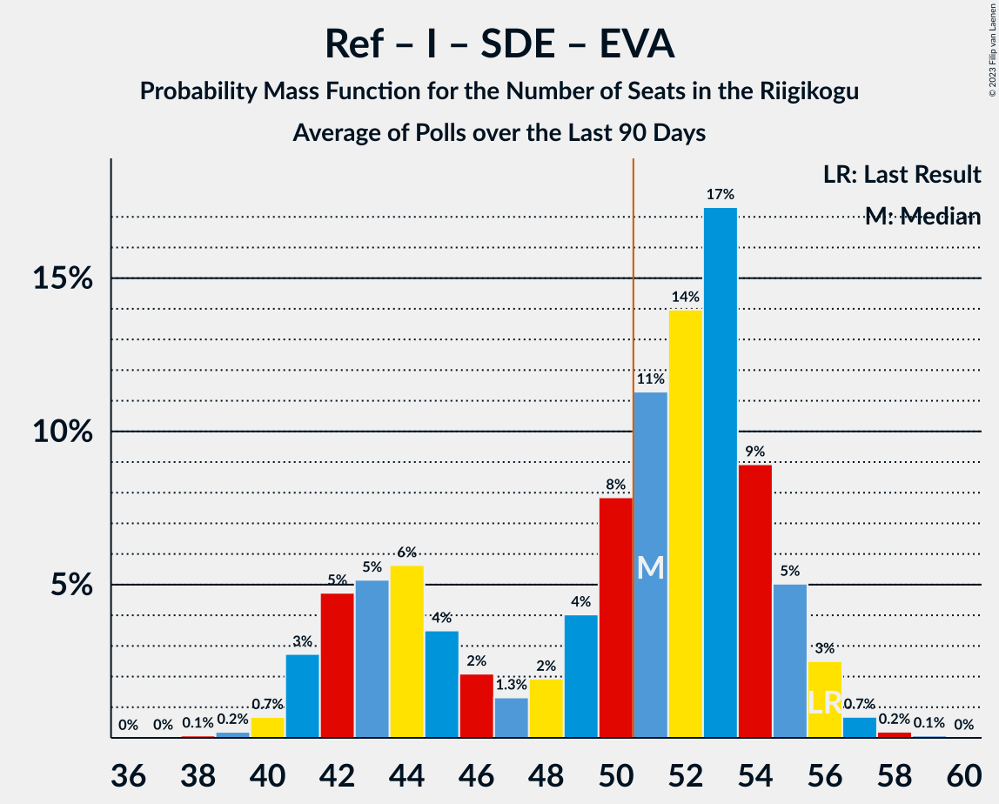

# Poll Average

<a href="#voting-intentions">Voting Intentions</a> | <a href="#seats">Seats</a> | <a href="#coalitions">Coalitions</a> | <a href="#technical-information">Technical Information</a>

## Summary

The table below lists the polls on which the average is based. They are the most recent polls (less than 90 days old) registered and analyzed so far.

| Period     | Polling firm/Commissioner(s) | Ref | Kesk | EKRE | I | SDE | E200 | Rohelised | EVA |
|:----------:|:----------------------------:|:--:|:--:|:--:|:--:|:--:|:--:|:--:|:--:|
| 3 March 2019 | General Election | 28.9%   34 | 23.1%   26 | 17.8%   19 | 11.4%   12 | 9.8%   10 | 4.4%   0 | 1.8%   0 | 1.2%   0 |
| N/A | Poll Average | 25–33%   28–38 | 15–28%   16–32 | 14–20%   15–22 | 4–10%   0–9 | 7–16%   6–16 | 8–12%   7–11 | 2–4%   0 | 0–2%   0 |
| [13–18 February 2020](2020-02-18-Norstat.html) | Norstat   MTÜ Ühiskonnauuringute Instituut | 28–34%   32–38 | 20–25%   22–28 | 16–21%   16–23 | 5–8%   0–7 | 6–10%   6–10 | 8–12%   8–11 | 2–4%   0 | 0–1%   0 |
| [6–17 February 2020](2020-02-17-Turu-uuringuteAS.html) | Turu-uuringute AS   ERR | 24–30%   27–34 | 23–29%   25–33 | 15–20%   15–21 | 4–7%   0–7 | 9–13%   8–13 | 8–12%   7–12 | 1–4%   0 | N/A   N/A |
| [1–31 January 2020](2020-01-31-KantarEmor.html) | Kantar Emor | 27–33%   31–38 | 15–20%   16–21 | 14–19%   15–20 | 6–10%   6–10 | 12–16%   12–17 | 7–11%   7–11 | 2–4%   0 | 1–2%   0 |
| 3 March 2019 | General Election | 28.9%   34 | 23.1%   26 | 17.8%   19 | 11.4%   12 | 9.8%   10 | 4.4%   0 | 1.8%   0 | 1.2%   0 |

Only polls for which at least the sample size has been published are included in the table above.

**Legend:**
+ **Top half of each row:** Voting intentions (95% confidence interval)
+ **Bottom half of each row:** Seat projections for the Riigikogu (95% confidence interval)
+ **Ref:** Eesti Reformierakond
+ **Kesk:** Eesti Keskerakond
+ **EKRE:** Eesti Konservatiivne Rahvaerakond
+ **I:** Erakond Isamaa
+ **SDE:** Sotsiaaldemokraatlik Erakond
+ **E200:** Eesti 200
+ **Rohelised:** Erakond Eestimaa Rohelised
+ **EVA:** Eesti Vabaerakond
+ **N/A (single party):** Party not included the published results
+ **N/A (entire row):** Calculation for this opinion poll not started yet

## Voting Intentions

### Confidence Intervals

| Party | Last Result | Median | 80% Confidence Interval | 90% Confidence Interval | 95% Confidence Interval | 99% Confidence Interval |
|:-----:|:-----------:|:------:|:-----------------------:|:-----------------------:|:-----------------------:|:-----------------------:|
| <a href="#eesti-reformierakond">Eesti Reformierakond</a> | 28.9% | 29.6% | 26.4–32.1% |25.7–32.7% | 25.0–33.3% | 24.0–34.3% |
| <a href="#eesti-keskerakond">Eesti Keskerakond</a> | 23.1% | 22.4% | 16.4–27.0% |15.8–27.8% | 15.3–28.4% | 14.5–29.6% |
| <a href="#eesti-konservatiivne-rahvaerakond">Eesti Konservatiivne Rahvaerakond</a> | 17.8% | 17.2% | 15.2–19.2% |14.7–19.7% | 14.3–20.1% | 13.5–21.0% |
| <a href="#erakond-isamaa">Erakond Isamaa</a> | 11.4% | 6.3% | 5.0–8.6% |4.7–9.1% | 4.4–9.5% | 3.9–10.2% |
| <a href="#sotsiaaldemokraatlik-erakond">Sotsiaaldemokraatlik Erakond</a> | 9.8% | 11.0% | 7.5–14.6% |7.1–15.3% | 6.8–15.8% | 6.2–16.7% |
| <a href="#eesti-200">Eesti 200</a> | 4.4% | 9.6% | 8.3–11.0% |7.9–11.4% | 7.6–11.8% | 7.1–12.5% |
| <a href="#erakond-eestimaa-rohelised">Erakond Eestimaa Rohelised</a> | 1.8% | 2.8% | 2.0–3.7% |1.8–3.9% | 1.6–4.2% | 1.3–4.6% |
| <a href="#eesti-vabaerakond">Eesti Vabaerakond</a> | 1.2% | 0.9% | 0.5–1.5% |0.4–1.6% | 0.4–1.8% | 0.3–2.1% |

### Eesti Reformierakond

*For a full overview of the results for this party, see the [Eesti Reformierakond](party-eestireformierakond.html) page.*

| Voting Intentions | Probability | Accumulated | Special Marks |
|:-----------------:|:-----------:|:-----------:|:-------------:|
| 21.5–22.5% | 0% | 100% |  |
| 22.5–23.5% | 0.2% | 100% |  |
| 23.5–24.5% | 1.0% | 99.8% |  |
| 24.5–25.5% | 3% | 98.7% |  |
| 25.5–26.5% | 7% | 96% |  |
| 26.5–27.5% | 10% | 89% |  |
| 27.5–28.5% | 12% | 79% |  |
| 28.5–29.5% | 16% | 66% | Last Result |
| 29.5–30.5% | 18% | 51% | Median |
| 30.5–31.5% | 16% | 33% |  |
| 31.5–32.5% | 10% | 17% |  |
| 32.5–33.5% | 5% | 6% |  |
| 33.5–34.5% | 1.4% | 2% |  |
| 34.5–35.5% | 0.3% | 0.3% |  |
| 35.5–36.5% | 0% | 0% |  |

### Eesti Keskerakond

*For a full overview of the results for this party, see the [Eesti Keskerakond](party-eestikeskerakond.html) page.*

| Voting Intentions | Probability | Accumulated | Special Marks |
|:-----------------:|:-----------:|:-----------:|:-------------:|
| 12.5–13.5% | 0% | 100% |  |
| 13.5–14.5% | 0.6% | 100% |  |
| 14.5–15.5% | 3% | 99.4% |  |
| 15.5–16.5% | 8% | 96% |  |
| 16.5–17.5% | 10% | 89% |  |
| 17.5–18.5% | 8% | 79% |  |
| 18.5–19.5% | 4% | 71% |  |
| 19.5–20.5% | 3% | 67% |  |
| 20.5–21.5% | 6% | 64% |  |
| 21.5–22.5% | 10% | 58% | Median |
| 22.5–23.5% | 10% | 49% | Last Result |
| 23.5–24.5% | 8% | 39% |  |
| 24.5–25.5% | 8% | 30% |  |
| 25.5–26.5% | 9% | 22% |  |
| 26.5–27.5% | 7% | 13% |  |
| 27.5–28.5% | 4% | 6% |  |
| 28.5–29.5% | 2% | 2% |  |
| 29.5–30.5% | 0.4% | 0.5% |  |
| 30.5–31.5% | 0.1% | 0.1% |  |
| 31.5–32.5% | 0% | 0% |  |

### Eesti Konservatiivne Rahvaerakond

*For a full overview of the results for this party, see the [Eesti Konservatiivne Rahvaerakond](party-eestikonservatiivnerahvaerakond.html) page.*

| Voting Intentions | Probability | Accumulated | Special Marks |
|:-----------------:|:-----------:|:-----------:|:-------------:|
| 11.5–12.5% | 0% | 100% |  |
| 12.5–13.5% | 0.5% | 100% |  |
| 13.5–14.5% | 3% | 99.4% |  |
| 14.5–15.5% | 10% | 96% |  |
| 15.5–16.5% | 19% | 86% |  |
| 16.5–17.5% | 25% | 67% | Median |
| 17.5–18.5% | 23% | 42% | Last Result |
| 18.5–19.5% | 13% | 20% |  |
| 19.5–20.5% | 5% | 6% |  |
| 20.5–21.5% | 1.1% | 1.3% |  |
| 21.5–22.5% | 0.2% | 0.2% |  |
| 22.5–23.5% | 0% | 0% |  |

### Erakond Isamaa

*For a full overview of the results for this party, see the [Erakond Isamaa](party-erakondisamaa.html) page.*

| Voting Intentions | Probability | Accumulated | Special Marks |
|:-----------------:|:-----------:|:-----------:|:-------------:|
| 2.5–3.5% | 0.1% | 100% |  |
| 3.5–4.5% | 4% | 99.9% |  |
| 4.5–5.5% | 21% | 96% |  |
| 5.5–6.5% | 30% | 75% | Median |
| 6.5–7.5% | 19% | 44% |  |
| 7.5–8.5% | 15% | 26% |  |
| 8.5–9.5% | 8% | 10% |  |
| 9.5–10.5% | 2% | 2% |  |
| 10.5–11.5% | 0.2% | 0.2% | Last Result |
| 11.5–12.5% | 0% | 0% |  |

### Sotsiaaldemokraatlik Erakond

*For a full overview of the results for this party, see the [Sotsiaaldemokraatlik Erakond](party-sotsiaaldemokraatlikerakond.html) page.*

| Voting Intentions | Probability | Accumulated | Special Marks |
|:-----------------:|:-----------:|:-----------:|:-------------:|
| 4.5–5.5% | 0% | 100% |  |
| 5.5–6.5% | 1.3% | 100% |  |
| 6.5–7.5% | 9% | 98.6% |  |
| 7.5–8.5% | 15% | 90% |  |
| 8.5–9.5% | 10% | 75% |  |
| 9.5–10.5% | 10% | 65% | Last Result |
| 10.5–11.5% | 12% | 55% | Median |
| 11.5–12.5% | 10% | 43% |  |
| 12.5–13.5% | 11% | 33% |  |
| 13.5–14.5% | 11% | 22% |  |
| 14.5–15.5% | 7% | 11% |  |
| 15.5–16.5% | 3% | 3% |  |
| 16.5–17.5% | 0.6% | 0.6% |  |
| 17.5–18.5% | 0.1% | 0.1% |  |
| 18.5–19.5% | 0% | 0% |  |

### Eesti 200

*For a full overview of the results for this party, see the [Eesti 200](party-eesti200.html) page.*

| Voting Intentions | Probability | Accumulated | Special Marks |
|:-----------------:|:-----------:|:-----------:|:-------------:|
| 3.5–4.5% | 0% | 100% | Last Result |
| 4.5–5.5% | 0% | 100% |  |
| 5.5–6.5% | 0.1% | 100% |  |
| 6.5–7.5% | 2% | 99.9% |  |
| 7.5–8.5% | 13% | 98% |  |
| 8.5–9.5% | 33% | 85% |  |
| 9.5–10.5% | 33% | 52% | Median |
| 10.5–11.5% | 15% | 19% |  |
| 11.5–12.5% | 3% | 4% |  |
| 12.5–13.5% | 0.4% | 0.4% |  |
| 13.5–14.5% | 0% | 0% |  |

### Erakond Eestimaa Rohelised

*For a full overview of the results for this party, see the [Erakond Eestimaa Rohelised](party-erakondeestimaarohelised.html) page.*

| Voting Intentions | Probability | Accumulated | Special Marks |
|:-----------------:|:-----------:|:-----------:|:-------------:|
| 0.0–0.5% | 0% | 100% |  |
| 0.5–1.5% | 2% | 100% |  |
| 1.5–2.5% | 32% | 98% | Last Result |
| 2.5–3.5% | 52% | 66% | Median |
| 3.5–4.5% | 13% | 14% |  |
| 4.5–5.5% | 0.6% | 0.7% |  |
| 5.5–6.5% | 0% | 0% |  |

### Eesti Vabaerakond

*For a full overview of the results for this party, see the [Eesti Vabaerakond](party-eestivabaerakond.html) page.*

| Voting Intentions | Probability | Accumulated | Special Marks |
|:-----------------:|:-----------:|:-----------:|:-------------:|
| 0.0–0.5% | 11% | 100% |  |
| 0.5–1.5% | 82% | 89% | Last Result, Median |
| 1.5–2.5% | 7% | 7% |  |
| 2.5–3.5% | 0.1% | 0.1% |  |
| 3.5–4.5% | 0% | 0% |  |

## Seats

### Confidence Intervals

| Party | Last Result | Median | 80% Confidence Interval | 90% Confidence Interval | 95% Confidence Interval | 99% Confidence Interval |
|:-----:|:-----------:|:------:|:-----------------------:|:-----------------------:|:-----------------------:|:-----------------------:|
| <a href="#eesti-reformierakond">Eesti Reformierakond</a> | 34 | 34 | 29–36 |28–37 | 28–38 | 26–39 |
| <a href="#eesti-keskerakond">Eesti Keskerakond</a> | 26 | 25 | 17–29 |17–30 | 16–32 | 15–33 |
| <a href="#eesti-konservatiivne-rahvaerakond">Eesti Konservatiivne Rahvaerakond</a> | 19 | 18 | 16–20 |16–21 | 15–22 | 14–23 |
| <a href="#erakond-isamaa">Erakond Isamaa</a> | 12 | 5 | 4–8 |0–9 | 0–9 | 0–10 |
| <a href="#sotsiaaldemokraatlik-erakond">Sotsiaaldemokraatlik Erakond</a> | 10 | 11 | 7–15 |6–16 | 6–16 | 5–18 |
| <a href="#eesti-200">Eesti 200</a> | 0 | 9 | 8–11 |7–11 | 7–11 | 7–12 |
| <a href="#erakond-eestimaa-rohelised">Erakond Eestimaa Rohelised</a> | 0 | 0 | 0 |0 | 0 | 0 |
| <a href="#eesti-vabaerakond">Eesti Vabaerakond</a> | 0 | 0 | 0 |0 | 0 | 0 |

### Eesti Reformierakond

*For a full overview of the results for this party, see the [Eesti Reformierakond](party-eestireformierakond.html) page.*

| Number of Seats | Probability | Accumulated | Special Marks |
|:---------------:|:-----------:|:-----------:|:-------------:|
| 24 | 0% | 100% |  |
| 25 | 0.2% | 99.9% |  |
| 26 | 0.3% | 99.7% |  |
| 27 | 2% | 99.4% |  |
| 28 | 5% | 98% |  |
| 29 | 7% | 92% |  |
| 30 | 7% | 86% |  |
| 31 | 7% | 78% |  |
| 32 | 6% | 72% |  |
| 33 | 11% | 66% |  |
| 34 | 12% | 55% | Last Result, Median |
| 35 | 21% | 42% |  |
| 36 | 14% | 21% |  |
| 37 | 5% | 8% |  |
| 38 | 2% | 3% |  |
| 39 | 0.8% | 1.3% |  |
| 40 | 0.3% | 0.5% |  |
| 41 | 0.1% | 0.1% |  |
| 42 | 0% | 0% |  |

### Eesti Keskerakond

*For a full overview of the results for this party, see the [Eesti Keskerakond](party-eestikeskerakond.html) page.*

| Number of Seats | Probability | Accumulated | Special Marks |
|:---------------:|:-----------:|:-----------:|:-------------:|
| 14 | 0.1% | 100% |  |
| 15 | 0.6% | 99.9% |  |
| 16 | 2% | 99.4% |  |
| 17 | 13% | 97% |  |
| 18 | 7% | 84% |  |
| 19 | 6% | 77% |  |
| 20 | 3% | 71% |  |
| 21 | 1.4% | 68% |  |
| 22 | 2% | 66% |  |
| 23 | 7% | 65% |  |
| 24 | 6% | 58% |  |
| 25 | 13% | 52% | Median |
| 26 | 6% | 39% | Last Result |
| 27 | 5% | 33% |  |
| 28 | 7% | 28% |  |
| 29 | 13% | 22% |  |
| 30 | 4% | 9% |  |
| 31 | 1.1% | 4% |  |
| 32 | 2% | 3% |  |
| 33 | 2% | 2% |  |
| 34 | 0.1% | 0.2% |  |
| 35 | 0% | 0.1% |  |
| 36 | 0% | 0% |  |

### Eesti Konservatiivne Rahvaerakond

*For a full overview of the results for this party, see the [Eesti Konservatiivne Rahvaerakond](party-eestikonservatiivnerahvaerakond.html) page.*

| Number of Seats | Probability | Accumulated | Special Marks |
|:---------------:|:-----------:|:-----------:|:-------------:|
| 13 | 0.1% | 100% |  |
| 14 | 0.7% | 99.9% |  |
| 15 | 4% | 99.2% |  |
| 16 | 10% | 95% |  |
| 17 | 18% | 85% |  |
| 18 | 27% | 67% | Median |
| 19 | 22% | 40% | Last Result |
| 20 | 12% | 18% |  |
| 21 | 3% | 6% |  |
| 22 | 2% | 3% |  |
| 23 | 1.0% | 1.2% |  |
| 24 | 0.1% | 0.2% |  |
| 25 | 0% | 0% |  |

### Erakond Isamaa

*For a full overview of the results for this party, see the [Erakond Isamaa](party-erakondisamaa.html) page.*

| Number of Seats | Probability | Accumulated | Special Marks |
|:---------------:|:-----------:|:-----------:|:-------------:|
| 0 | 9% | 100% |  |
| 1 | 0% | 91% |  |
| 2 | 0% | 91% |  |
| 3 | 0% | 91% |  |
| 4 | 8% | 91% |  |
| 5 | 35% | 84% | Median |
| 6 | 17% | 49% |  |
| 7 | 10% | 32% |  |
| 8 | 16% | 22% |  |
| 9 | 5% | 6% |  |
| 10 | 0.9% | 1.1% |  |
| 11 | 0.2% | 0.2% |  |
| 12 | 0% | 0% | Last Result |

### Sotsiaaldemokraatlik Erakond

*For a full overview of the results for this party, see the [Sotsiaaldemokraatlik Erakond](party-sotsiaaldemokraatlikerakond.html) page.*

| Number of Seats | Probability | Accumulated | Special Marks |
|:---------------:|:-----------:|:-----------:|:-------------:|
| 5 | 0.5% | 100% |  |
| 6 | 5% | 99.5% |  |
| 7 | 16% | 94% |  |
| 8 | 8% | 78% |  |
| 9 | 10% | 70% |  |
| 10 | 9% | 60% | Last Result |
| 11 | 10% | 51% | Median |
| 12 | 7% | 42% |  |
| 13 | 6% | 35% |  |
| 14 | 11% | 28% |  |
| 15 | 7% | 17% |  |
| 16 | 8% | 9% |  |
| 17 | 0.9% | 1.4% |  |
| 18 | 0.4% | 0.5% |  |
| 19 | 0.1% | 0.1% |  |
| 20 | 0% | 0% |  |

### Eesti 200

*For a full overview of the results for this party, see the [Eesti 200](party-eesti200.html) page.*

| Number of Seats | Probability | Accumulated | Special Marks |
|:---------------:|:-----------:|:-----------:|:-------------:|
| 0 | 0% | 100% | Last Result |
| 1 | 0% | 100% |  |
| 2 | 0% | 100% |  |
| 3 | 0% | 100% |  |
| 4 | 0% | 100% |  |
| 5 | 0% | 100% |  |
| 6 | 0.5% | 100% |  |
| 7 | 5% | 99.5% |  |
| 8 | 15% | 94% |  |
| 9 | 33% | 79% | Median |
| 10 | 32% | 46% |  |
| 11 | 12% | 14% |  |
| 12 | 2% | 2% |  |
| 13 | 0.4% | 0.5% |  |
| 14 | 0% | 0% |  |

### Erakond Eestimaa Rohelised

*For a full overview of the results for this party, see the [Erakond Eestimaa Rohelised](party-erakondeestimaarohelised.html) page.*

| Number of Seats | Probability | Accumulated | Special Marks |
|:---------------:|:-----------:|:-----------:|:-------------:|
| 0 | 99.9% | 100% | Last Result, Median |
| 1 | 0% | 0.1% |  |
| 2 | 0% | 0.1% |  |
| 3 | 0% | 0.1% |  |
| 4 | 0.1% | 0.1% |  |
| 5 | 0% | 0% |  |

### Eesti Vabaerakond

*For a full overview of the results for this party, see the [Eesti Vabaerakond](party-eestivabaerakond.html) page.*

| Number of Seats | Probability | Accumulated | Special Marks |
|:---------------:|:-----------:|:-----------:|:-------------:|
| 0 | 100% | 100% | Last Result, Median |

## Coalitions

### Confidence Intervals

| Coalition | Last Result | Median | Majority? | 80% Confidence Interval | 90% Confidence Interval | 95% Confidence Interval | 99% Confidence Interval |
|:---------:|:-----------:|:------:|:---------:|:-----------------------:|:-----------------------:|:-----------------------:|:-----------------------:|
| Eesti Reformierakond – Eesti Keskerakond – Eesti Konservatiivne Rahvaerakond | 79 | 76 | 100% | 69–80 | 68–81 | 68–82 | 66–84 |
| Eesti Reformierakond – Eesti Keskerakond | 60 | 58 | 95% | 52–61 | 51–62 | 50–63 | 49–65 |
| Eesti Reformierakond – Eesti Konservatiivne Rahvaerakond – Erakond Isamaa | 65 | 59 | 92% | 51–61 | 50–62 | 49–62 | 47–64 |
| Eesti Reformierakond – Erakond Isamaa – Sotsiaaldemokraatlik Erakond – Eesti Vabaerakond | 56 | 48 | 35% | 44–58 | 42–59 | 41–60 | 38–60 |
| Eesti Reformierakond – Erakond Isamaa – Sotsiaaldemokraatlik Erakond | 56 | 48 | 35% | 44–58 | 42–59 | 41–60 | 38–60 |
| Eesti Reformierakond – Eesti Konservatiivne Rahvaerakond | 53 | 52 | 64% | 47–55 | 46–56 | 45–57 | 44–59 |
| Eesti Keskerakond – Eesti Konservatiivne Rahvaerakond – Erakond Isamaa | 57 | 48 | 26% | 42–52 | 42–53 | 41–54 | 39–56 |
| Eesti Reformierakond – Sotsiaaldemokraatlik Erakond | 44 | 43 | 5% | 40–50 | 39–50 | 38–51 | 36–53 |
| Eesti Keskerakond – Eesti Konservatiivne Rahvaerakond | 45 | 43 | 3% | 34–48 | 34–50 | 33–51 | 31–52 |
| Eesti Keskerakond – Erakond Isamaa – Sotsiaaldemokraatlik Erakond | 48 | 40 | 0% | 36–45 | 35–46 | 35–46 | 33–48 |
| Eesti Reformierakond – Erakond Isamaa | 46 | 40 | 0% | 33–44 | 32–45 | 30–45 | 28–47 |
| Eesti Keskerakond – Sotsiaaldemokraatlik Erakond | 36 | 33 | 0% | 31–41 | 30–41 | 30–43 | 28–44 |
| Eesti Konservatiivne Rahvaerakond – Sotsiaaldemokraatlik Erakond | 29 | 29 | 0% | 26–34 | 25–34 | 24–34 | 23–35 |

### Eesti Reformierakond – Eesti Keskerakond – Eesti Konservatiivne Rahvaerakond

| Number of Seats | Probability | Accumulated | Special Marks |
|:---------------:|:-----------:|:-----------:|:-------------:|
| 64 | 0.1% | 100% |  |
| 65 | 0.3% | 99.9% |  |
| 66 | 0.7% | 99.6% |  |
| 67 | 0.7% | 98.9% |  |
| 68 | 5% | 98% |  |
| 69 | 9% | 93% |  |
| 70 | 8% | 84% |  |
| 71 | 3% | 76% |  |
| 72 | 4% | 73% |  |
| 73 | 3% | 69% |  |
| 74 | 5% | 66% |  |
| 75 | 5% | 61% |  |
| 76 | 9% | 57% |  |
| 77 | 7% | 48% | Median |
| 78 | 18% | 41% |  |
| 79 | 11% | 23% | Last Result |
| 80 | 5% | 13% |  |
| 81 | 4% | 8% |  |
| 82 | 2% | 4% |  |
| 83 | 0.7% | 2% |  |
| 84 | 0.7% | 1.1% |  |
| 85 | 0.1% | 0.3% |  |
| 86 | 0.2% | 0.2% |  |
| 87 | 0% | 0% |  |

### Eesti Reformierakond – Eesti Keskerakond

| Number of Seats | Probability | Accumulated | Special Marks |
|:---------------:|:-----------:|:-----------:|:-------------:|
| 47 | 0.1% | 100% |  |
| 48 | 0.2% | 99.9% |  |
| 49 | 0.7% | 99.7% |  |
| 50 | 4% | 98.9% |  |
| 51 | 5% | 95% | Majority |
| 52 | 5% | 91% |  |
| 53 | 12% | 86% |  |
| 54 | 5% | 74% |  |
| 55 | 3% | 69% |  |
| 56 | 4% | 67% |  |
| 57 | 5% | 63% |  |
| 58 | 16% | 57% |  |
| 59 | 12% | 41% | Median |
| 60 | 15% | 29% | Last Result |
| 61 | 5% | 14% |  |
| 62 | 4% | 9% |  |
| 63 | 3% | 4% |  |
| 64 | 1.1% | 2% |  |
| 65 | 0.4% | 0.7% |  |
| 66 | 0.2% | 0.3% |  |
| 67 | 0.1% | 0.1% |  |
| 68 | 0% | 0% |  |

### Eesti Reformierakond – Eesti Konservatiivne Rahvaerakond – Erakond Isamaa

| Number of Seats | Probability | Accumulated | Special Marks |
|:---------------:|:-----------:|:-----------:|:-------------:|
| 45 | 0.1% | 100% |  |
| 46 | 0.1% | 99.9% |  |
| 47 | 1.1% | 99.8% |  |
| 48 | 0.8% | 98.7% |  |
| 49 | 1.3% | 98% |  |
| 50 | 5% | 97% |  |
| 51 | 3% | 92% | Majority |
| 52 | 9% | 89% |  |
| 53 | 4% | 80% |  |
| 54 | 7% | 76% |  |
| 55 | 3% | 69% |  |
| 56 | 3% | 67% |  |
| 57 | 6% | 64% | Median |
| 58 | 5% | 58% |  |
| 59 | 27% | 52% |  |
| 60 | 3% | 25% |  |
| 61 | 14% | 22% |  |
| 62 | 6% | 9% |  |
| 63 | 0.8% | 2% |  |
| 64 | 1.3% | 1.5% |  |
| 65 | 0.2% | 0.2% | Last Result |
| 66 | 0% | 0% |  |

### Eesti Reformierakond – Erakond Isamaa – Sotsiaaldemokraatlik Erakond – Eesti Vabaerakond

| Number of Seats | Probability | Accumulated | Special Marks |
|:---------------:|:-----------:|:-----------:|:-------------:|
| 37 | 0.1% | 100% |  |
| 38 | 0.4% | 99.9% |  |
| 39 | 0.8% | 99.5% |  |
| 40 | 0.7% | 98.6% |  |
| 41 | 2% | 98% |  |
| 42 | 2% | 96% |  |
| 43 | 2% | 94% |  |
| 44 | 5% | 92% |  |
| 45 | 14% | 86% |  |
| 46 | 6% | 72% |  |
| 47 | 12% | 66% |  |
| 48 | 11% | 54% |  |
| 49 | 6% | 43% |  |
| 50 | 2% | 37% | Median |
| 51 | 0.9% | 35% | Majority |
| 52 | 0.4% | 34% |  |
| 53 | 1.2% | 33% |  |
| 54 | 3% | 32% |  |
| 55 | 2% | 29% |  |
| 56 | 4% | 26% | Last Result |
| 57 | 7% | 22% |  |
| 58 | 10% | 16% |  |
| 59 | 3% | 6% |  |
| 60 | 2% | 3% |  |
| 61 | 0.2% | 0.4% |  |
| 62 | 0.2% | 0.2% |  |
| 63 | 0% | 0% |  |

### Eesti Reformierakond – Erakond Isamaa – Sotsiaaldemokraatlik Erakond

| Number of Seats | Probability | Accumulated | Special Marks |
|:---------------:|:-----------:|:-----------:|:-------------:|
| 37 | 0.1% | 100% |  |
| 38 | 0.4% | 99.9% |  |
| 39 | 0.8% | 99.5% |  |
| 40 | 0.7% | 98.6% |  |
| 41 | 2% | 98% |  |
| 42 | 2% | 96% |  |
| 43 | 2% | 94% |  |
| 44 | 5% | 92% |  |
| 45 | 14% | 86% |  |
| 46 | 6% | 72% |  |
| 47 | 12% | 66% |  |
| 48 | 11% | 54% |  |
| 49 | 6% | 43% |  |
| 50 | 2% | 37% | Median |
| 51 | 0.9% | 35% | Majority |
| 52 | 0.4% | 34% |  |
| 53 | 1.2% | 33% |  |
| 54 | 3% | 32% |  |
| 55 | 2% | 29% |  |
| 56 | 4% | 26% | Last Result |
| 57 | 7% | 22% |  |
| 58 | 10% | 16% |  |
| 59 | 3% | 6% |  |
| 60 | 2% | 3% |  |
| 61 | 0.2% | 0.4% |  |
| 62 | 0.2% | 0.2% |  |
| 63 | 0% | 0% |  |

### Eesti Reformierakond – Eesti Konservatiivne Rahvaerakond

| Number of Seats | Probability | Accumulated | Special Marks |
|:---------------:|:-----------:|:-----------:|:-------------:|
| 42 | 0.1% | 100% |  |
| 43 | 0.2% | 99.9% |  |
| 44 | 0.8% | 99.7% |  |
| 45 | 4% | 99.0% |  |
| 46 | 3% | 95% |  |
| 47 | 8% | 92% |  |
| 48 | 5% | 85% |  |
| 49 | 7% | 79% |  |
| 50 | 8% | 72% |  |
| 51 | 11% | 64% | Majority |
| 52 | 10% | 53% | Median |
| 53 | 17% | 44% | Last Result |
| 54 | 12% | 27% |  |
| 55 | 8% | 15% |  |
| 56 | 3% | 6% |  |
| 57 | 2% | 4% |  |
| 58 | 0.6% | 1.2% |  |
| 59 | 0.3% | 0.5% |  |
| 60 | 0.1% | 0.2% |  |
| 61 | 0% | 0.1% |  |
| 62 | 0.1% | 0.1% |  |
| 63 | 0% | 0% |  |

### Eesti Keskerakond – Eesti Konservatiivne Rahvaerakond – Erakond Isamaa

| Number of Seats | Probability | Accumulated | Special Marks |
|:---------------:|:-----------:|:-----------:|:-------------:|
| 38 | 0.2% | 100% |  |
| 39 | 0.8% | 99.8% |  |
| 40 | 0.6% | 99.0% |  |
| 41 | 3% | 98% |  |
| 42 | 12% | 96% |  |
| 43 | 7% | 83% |  |
| 44 | 2% | 76% |  |
| 45 | 4% | 74% |  |
| 46 | 5% | 70% |  |
| 47 | 7% | 65% |  |
| 48 | 9% | 58% | Median |
| 49 | 15% | 49% |  |
| 50 | 7% | 34% |  |
| 51 | 12% | 26% | Majority |
| 52 | 7% | 14% |  |
| 53 | 4% | 7% |  |
| 54 | 2% | 3% |  |
| 55 | 0.8% | 1.4% |  |
| 56 | 0.4% | 0.5% |  |
| 57 | 0.1% | 0.1% | Last Result |
| 58 | 0% | 0% |  |

### Eesti Reformierakond – Sotsiaaldemokraatlik Erakond

| Number of Seats | Probability | Accumulated | Special Marks |
|:---------------:|:-----------:|:-----------:|:-------------:|
| 35 | 0.1% | 100% |  |
| 36 | 0.4% | 99.8% |  |
| 37 | 1.3% | 99.5% |  |
| 38 | 3% | 98% |  |
| 39 | 4% | 96% |  |
| 40 | 16% | 91% |  |
| 41 | 6% | 76% |  |
| 42 | 15% | 69% |  |
| 43 | 11% | 54% |  |
| 44 | 5% | 43% | Last Result |
| 45 | 3% | 38% | Median |
| 46 | 3% | 35% |  |
| 47 | 5% | 32% |  |
| 48 | 4% | 28% |  |
| 49 | 6% | 24% |  |
| 50 | 13% | 18% |  |
| 51 | 3% | 5% | Majority |
| 52 | 0.9% | 2% |  |
| 53 | 0.4% | 0.7% |  |
| 54 | 0.2% | 0.3% |  |
| 55 | 0.1% | 0.1% |  |
| 56 | 0% | 0% |  |

### Eesti Keskerakond – Eesti Konservatiivne Rahvaerakond

| Number of Seats | Probability | Accumulated | Special Marks |
|:---------------:|:-----------:|:-----------:|:-------------:|
| 30 | 0.1% | 100% |  |
| 31 | 0.5% | 99.9% |  |
| 32 | 0.5% | 99.4% |  |
| 33 | 3% | 98.9% |  |
| 34 | 13% | 96% |  |
| 35 | 7% | 83% |  |
| 36 | 1.4% | 77% |  |
| 37 | 2% | 75% |  |
| 38 | 5% | 74% |  |
| 39 | 3% | 69% |  |
| 40 | 0.7% | 67% |  |
| 41 | 2% | 66% |  |
| 42 | 8% | 64% |  |
| 43 | 7% | 57% | Median |
| 44 | 13% | 50% |  |
| 45 | 7% | 37% | Last Result |
| 46 | 10% | 30% |  |
| 47 | 8% | 20% |  |
| 48 | 4% | 12% |  |
| 49 | 3% | 8% |  |
| 50 | 2% | 5% |  |
| 51 | 2% | 3% | Majority |
| 52 | 0.5% | 0.9% |  |
| 53 | 0.2% | 0.3% |  |
| 54 | 0.1% | 0.1% |  |
| 55 | 0% | 0% |  |

### Eesti Keskerakond – Erakond Isamaa – Sotsiaaldemokraatlik Erakond

| Number of Seats | Probability | Accumulated | Special Marks |
|:---------------:|:-----------:|:-----------:|:-------------:|
| 30 | 0.1% | 100% |  |
| 31 | 0.1% | 99.9% |  |
| 32 | 0.2% | 99.8% |  |
| 33 | 0.3% | 99.6% |  |
| 34 | 1.1% | 99.3% |  |
| 35 | 3% | 98% |  |
| 36 | 7% | 95% |  |
| 37 | 11% | 88% |  |
| 38 | 8% | 77% |  |
| 39 | 12% | 69% |  |
| 40 | 12% | 57% |  |
| 41 | 12% | 45% | Median |
| 42 | 7% | 33% |  |
| 43 | 8% | 25% |  |
| 44 | 5% | 18% |  |
| 45 | 5% | 12% |  |
| 46 | 5% | 7% |  |
| 47 | 1.5% | 2% |  |
| 48 | 0.8% | 1.0% | Last Result |
| 49 | 0.1% | 0.2% |  |
| 50 | 0% | 0% |  |

### Eesti Reformierakond – Erakond Isamaa

| Number of Seats | Probability | Accumulated | Special Marks |
|:---------------:|:-----------:|:-----------:|:-------------:|
| 26 | 0.1% | 100% |  |
| 27 | 0.1% | 99.9% |  |
| 28 | 0.5% | 99.8% |  |
| 29 | 1.5% | 99.3% |  |
| 30 | 0.8% | 98% |  |
| 31 | 2% | 97% |  |
| 32 | 2% | 95% |  |
| 33 | 6% | 94% |  |
| 34 | 6% | 88% |  |
| 35 | 9% | 81% |  |
| 36 | 2% | 72% |  |
| 37 | 5% | 71% |  |
| 38 | 3% | 66% |  |
| 39 | 10% | 63% | Median |
| 40 | 12% | 53% |  |
| 41 | 13% | 41% |  |
| 42 | 8% | 28% |  |
| 43 | 8% | 20% |  |
| 44 | 6% | 11% |  |
| 45 | 3% | 5% |  |
| 46 | 1.4% | 2% | Last Result |
| 47 | 0.5% | 0.6% |  |
| 48 | 0.1% | 0.1% |  |
| 49 | 0% | 0% |  |

### Eesti Keskerakond – Sotsiaaldemokraatlik Erakond

| Number of Seats | Probability | Accumulated | Special Marks |
|:---------------:|:-----------:|:-----------:|:-------------:|
| 27 | 0.2% | 100% |  |
| 28 | 0.5% | 99.7% |  |
| 29 | 1.1% | 99.2% |  |
| 30 | 8% | 98% |  |
| 31 | 13% | 90% |  |
| 32 | 16% | 78% |  |
| 33 | 18% | 62% |  |
| 34 | 4% | 44% |  |
| 35 | 5% | 40% |  |
| 36 | 2% | 35% | Last Result, Median |
| 37 | 6% | 32% |  |
| 38 | 5% | 27% |  |
| 39 | 5% | 22% |  |
| 40 | 6% | 17% |  |
| 41 | 6% | 11% |  |
| 42 | 2% | 5% |  |
| 43 | 2% | 3% |  |
| 44 | 0.8% | 1.1% |  |
| 45 | 0.2% | 0.3% |  |
| 46 | 0.1% | 0.1% |  |
| 47 | 0% | 0% |  |

### Eesti Konservatiivne Rahvaerakond – Sotsiaaldemokraatlik Erakond

| Number of Seats | Probability | Accumulated | Special Marks |
|:---------------:|:-----------:|:-----------:|:-------------:|
| 22 | 0.3% | 100% |  |
| 23 | 0.7% | 99.7% |  |
| 24 | 2% | 98.9% |  |
| 25 | 5% | 97% |  |
| 26 | 16% | 92% |  |
| 27 | 9% | 75% |  |
| 28 | 10% | 66% |  |
| 29 | 17% | 56% | Last Result, Median |
| 30 | 6% | 39% |  |
| 31 | 15% | 34% |  |
| 32 | 6% | 19% |  |
| 33 | 2% | 13% |  |
| 34 | 8% | 10% |  |
| 35 | 2% | 2% |  |
| 36 | 0.2% | 0.5% |  |
| 37 | 0.2% | 0.2% |  |
| 38 | 0% | 0% |  |

## Technical Information

+ **Number of polls included in this average:** 3
+ **Lowest number of simulations done in a poll included in this average:** 131,072
+ **Total number of simulations done in the polls included in this average:** 393,216
+ **Error estimate:** 2.96%
