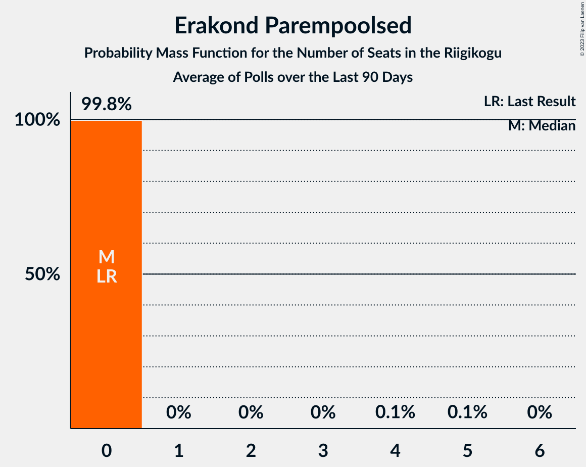

# Poll Average

<a href="#voting-intentions">Voting Intentions</a> | <a href="#seats">Seats</a> | <a href="#coalitions">Coalitions</a> | <a href="#technical-information">Technical Information</a>

## Summary

The table below lists the polls on which the average is based. They are the most recent polls (less than 90 days old) registered and analyzed so far.

| Period     | Polling firm/Commissioner(s) | Ref | Kesk | EKRE | I | SDE | E200 | Rohelised | EVA | EP |
|:----------:|:----------------------------:|:--:|:--:|:--:|:--:|:--:|:--:|:--:|:--:|:--:|
| 3 March 2019 | General Election | 28.9%   34 | 23.1%   26 | 17.8%   19 | 11.4%   12 | 9.8%   10 | 4.4%   0 | 1.8%   0 | 1.2%   0 | 0.0%   0 |
| N/A | Poll Average | 26–36%   29–42 | 10–17%   10–18 | 20–31%   22–34 | 4–10%   0–9 | 6–9%   5–9 | 9–15%   8–16 | 1–4%   0 | N/A   N/A | 0–2%   0 |
| [29 November–5 December 2022](2022-12-05-Norstat.html) | Norstat   MTÜ Ühiskonnauuringute Instituut | 31–37%   35–43 | 13–18%   13–19 | 21–27%   23–30 | 4–7%   0–6 | 6–9%   5–9 | 9–12%   8–12 | 1–3%   0 | N/A   N/A | 1–2%   0 |
| [10–17 November 2022](2022-11-17-KantarEmor.html) | Kantar Emor   ERR | 29–33%   32–38 | 13–17%   13–18 | 20–24%   21–26 | 5–7%   0–7 | 7–9%   6–9 | 12–16%   12–16 | 2–4%   0 | N/A   N/A | 1–2%   0 |
| [12 October 2022](2022-10-12-Turu-uuringuteAS.html) | Turu-uuringute AS | 26–33%   28–37 | 10–15%   9–15 | 25–32%   27–36 | 6–10%   5–10 | 5–9%   4–9 | 10–15%   9–15 | 0–2%   0 | N/A   N/A | 0–1%   0 |
| 3 March 2019 | General Election | 28.9%   34 | 23.1%   26 | 17.8%   19 | 11.4%   12 | 9.8%   10 | 4.4%   0 | 1.8%   0 | 1.2%   0 | 0.0%   0 |

Only polls for which at least the sample size has been published are included in the table above.

**Legend:**
+ **Top half of each row:** Voting intentions (95% confidence interval)
+ **Bottom half of each row:** Seat projections for the Riigikogu (95% confidence interval)
+ **Ref:** Eesti Reformierakond
+ **Kesk:** Eesti Keskerakond
+ **EKRE:** Eesti Konservatiivne Rahvaerakond
+ **I:** Erakond Isamaa
+ **SDE:** Sotsiaaldemokraatlik Erakond
+ **E200:** Eesti 200
+ **Rohelised:** Erakond Eestimaa Rohelised
+ **EVA:** Eesti Vabaerakond
+ **EP:** Erakond Parempoolsed
+ **N/A (single party):** Party not included the published results
+ **N/A (entire row):** Calculation for this opinion poll not started yet

## Voting Intentions

### Confidence Intervals

| Party | Last Result | Median | 80% Confidence Interval | 90% Confidence Interval | 95% Confidence Interval | 99% Confidence Interval |
|:-----:|:-----------:|:------:|:-----------------------:|:-----------------------:|:-----------------------:|:-----------------------:|
| <a href="#eesti-reformierakond">Eesti Reformierakond</a> | 28.9% | 31.2% | 28.1–34.8% |27.2–35.6% | 26.4–36.2% | 25.1–37.3% |
| <a href="#eesti-keskerakond">Eesti Keskerakond</a> | 23.1% | 14.6% | 11.4–16.4% |10.8–16.9% | 10.3–17.3% | 9.4–18.1% |
| <a href="#eesti-konservatiivne-rahvaerakond">Eesti Konservatiivne Rahvaerakond</a> | 17.8% | 24.1% | 21.4–29.0% |20.9–30.0% | 20.5–30.7% | 19.7–32.1% |
| <a href="#erakond-isamaa">Erakond Isamaa</a> | 11.4% | 6.2% | 5.0–8.7% |4.7–9.3% | 4.5–9.8% | 4.0–10.7% |
| <a href="#sotsiaaldemokraatlik-erakond">Sotsiaaldemokraatlik Erakond</a> | 9.8% | 7.6% | 6.3–8.8% |6.0–9.1% | 5.6–9.4% | 5.0–10.0% |
| <a href="#eesti-200">Eesti 200</a> | 4.4% | 12.2% | 9.8–14.6% |9.3–15.0% | 9.0–15.4% | 8.4–16.1% |
| <a href="#erakond-eestimaa-rohelised">Erakond Eestimaa Rohelised</a> | 1.8% | 1.8% | 0.9–3.3% |0.7–3.5% | 0.6–3.7% | 0.4–4.1% |
| <a href="#eesti-vabaerakond">Eesti Vabaerakond</a> | 1.2% | N/A | N/A |N/A | N/A | N/A |
| <a href="#erakond-parempoolsed">Erakond Parempoolsed</a> | 0.0% | 0.9% | 0.2–1.4% |0.1–1.6% | 0.1–1.8% | 0.0–2.1% |

### Eesti Reformierakond

*For a full overview of the results for this party, see the [Eesti Reformierakond](party-eestireformierakond.html) page.*

| Voting Intentions | Probability | Accumulated | Special Marks |
|:-----------------:|:-----------:|:-----------:|:-------------:|
| 22.5–23.5% | 0% | 100% |  |
| 23.5–24.5% | 0.2% | 100% |  |
| 24.5–25.5% | 0.7% | 99.8% |  |
| 25.5–26.5% | 2% | 99.1% |  |
| 26.5–27.5% | 4% | 97% |  |
| 27.5–28.5% | 7% | 93% |  |
| 28.5–29.5% | 10% | 86% | Last Result |
| 29.5–30.5% | 14% | 76% |  |
| 30.5–31.5% | 16% | 61% | Median |
| 31.5–32.5% | 13% | 45% |  |
| 32.5–33.5% | 10% | 32% |  |
| 33.5–34.5% | 9% | 22% |  |
| 34.5–35.5% | 7% | 12% |  |
| 35.5–36.5% | 4% | 5% |  |
| 36.5–37.5% | 1.2% | 2% |  |
| 37.5–38.5% | 0.3% | 0.3% |  |
| 38.5–39.5% | 0% | 0% |  |
| 39.5–40.5% | 0% | 0% |  |

### Eesti Keskerakond

*For a full overview of the results for this party, see the [Eesti Keskerakond](party-eestikeskerakond.html) page.*

| Voting Intentions | Probability | Accumulated | Special Marks |
|:-----------------:|:-----------:|:-----------:|:-------------:|
| 7.5–8.5% | 0.1% | 100% |  |
| 8.5–9.5% | 0.6% | 99.9% |  |
| 9.5–10.5% | 3% | 99.3% |  |
| 10.5–11.5% | 8% | 96% |  |
| 11.5–12.5% | 10% | 89% |  |
| 12.5–13.5% | 10% | 79% |  |
| 13.5–14.5% | 17% | 68% |  |
| 14.5–15.5% | 25% | 51% | Median |
| 15.5–16.5% | 18% | 26% |  |
| 16.5–17.5% | 6% | 8% |  |
| 17.5–18.5% | 1.4% | 2% |  |
| 18.5–19.5% | 0.2% | 0.2% |  |
| 19.5–20.5% | 0% | 0% |  |
| 20.5–21.5% | 0% | 0% |  |
| 21.5–22.5% | 0% | 0% |  |
| 22.5–23.5% | 0% | 0% | Last Result |

### Eesti Konservatiivne Rahvaerakond

*For a full overview of the results for this party, see the [Eesti Konservatiivne Rahvaerakond](party-eestikonservatiivnerahvaerakond.html) page.*

| Voting Intentions | Probability | Accumulated | Special Marks |
|:-----------------:|:-----------:|:-----------:|:-------------:|
| 17.5–18.5% | 0% | 100% | Last Result |
| 18.5–19.5% | 0.3% | 100% |  |
| 19.5–20.5% | 3% | 99.7% |  |
| 20.5–21.5% | 9% | 97% |  |
| 21.5–22.5% | 16% | 88% |  |
| 22.5–23.5% | 15% | 72% |  |
| 23.5–24.5% | 12% | 57% | Median |
| 24.5–25.5% | 9% | 45% |  |
| 25.5–26.5% | 7% | 35% |  |
| 26.5–27.5% | 7% | 28% |  |
| 27.5–28.5% | 7% | 20% |  |
| 28.5–29.5% | 6% | 13% |  |
| 29.5–30.5% | 4% | 7% |  |
| 30.5–31.5% | 2% | 3% |  |
| 31.5–32.5% | 0.7% | 1.0% |  |
| 32.5–33.5% | 0.2% | 0.3% |  |
| 33.5–34.5% | 0.1% | 0.1% |  |
| 34.5–35.5% | 0% | 0% |  |

### Erakond Isamaa

*For a full overview of the results for this party, see the [Erakond Isamaa](party-erakondisamaa.html) page.*

| Voting Intentions | Probability | Accumulated | Special Marks |
|:-----------------:|:-----------:|:-----------:|:-------------:|
| 2.5–3.5% | 0% | 100% |  |
| 3.5–4.5% | 3% | 100% |  |
| 4.5–5.5% | 23% | 97% |  |
| 5.5–6.5% | 34% | 74% | Median |
| 6.5–7.5% | 16% | 40% |  |
| 7.5–8.5% | 12% | 24% |  |
| 8.5–9.5% | 8% | 11% |  |
| 9.5–10.5% | 3% | 4% |  |
| 10.5–11.5% | 0.6% | 0.7% | Last Result |
| 11.5–12.5% | 0.1% | 0.1% |  |
| 12.5–13.5% | 0% | 0% |  |

### Sotsiaaldemokraatlik Erakond

*For a full overview of the results for this party, see the [Sotsiaaldemokraatlik Erakond](party-sotsiaaldemokraatlikerakond.html) page.*

| Voting Intentions | Probability | Accumulated | Special Marks |
|:-----------------:|:-----------:|:-----------:|:-------------:|
| 2.5–3.5% | 0% | 100% |  |
| 3.5–4.5% | 0.1% | 100% |  |
| 4.5–5.5% | 2% | 99.9% |  |
| 5.5–6.5% | 12% | 98% |  |
| 6.5–7.5% | 33% | 86% |  |
| 7.5–8.5% | 38% | 54% | Median |
| 8.5–9.5% | 14% | 15% |  |
| 9.5–10.5% | 2% | 2% | Last Result |
| 10.5–11.5% | 0.1% | 0.1% |  |
| 11.5–12.5% | 0% | 0% |  |

### Eesti 200

*For a full overview of the results for this party, see the [Eesti 200](party-eesti200.html) page.*

| Voting Intentions | Probability | Accumulated | Special Marks |
|:-----------------:|:-----------:|:-----------:|:-------------:|
| 3.5–4.5% | 0% | 100% | Last Result |
| 4.5–5.5% | 0% | 100% |  |
| 5.5–6.5% | 0% | 100% |  |
| 6.5–7.5% | 0% | 100% |  |
| 7.5–8.5% | 0.8% | 100% |  |
| 8.5–9.5% | 6% | 99.2% |  |
| 9.5–10.5% | 16% | 93% |  |
| 10.5–11.5% | 18% | 77% |  |
| 11.5–12.5% | 14% | 59% | Median |
| 12.5–13.5% | 17% | 44% |  |
| 13.5–14.5% | 18% | 28% |  |
| 14.5–15.5% | 8% | 10% |  |
| 15.5–16.5% | 2% | 2% |  |
| 16.5–17.5% | 0.1% | 0.1% |  |
| 17.5–18.5% | 0% | 0% |  |

### Erakond Eestimaa Rohelised

*For a full overview of the results for this party, see the [Erakond Eestimaa Rohelised](party-erakondeestimaarohelised.html) page.*

| Voting Intentions | Probability | Accumulated | Special Marks |
|:-----------------:|:-----------:|:-----------:|:-------------:|
| 0.0–0.5% | 2% | 100% |  |
| 0.5–1.5% | 39% | 98% |  |
| 1.5–2.5% | 29% | 59% | Last Result, Median |
| 2.5–3.5% | 26% | 30% |  |
| 3.5–4.5% | 4% | 4% |  |
| 4.5–5.5% | 0% | 0% |  |
| 5.5–6.5% | 0% | 0% |  |

### Erakond Parempoolsed

*For a full overview of the results for this party, see the [Erakond Parempoolsed](party-erakondparempoolsed.html) page.*

| Voting Intentions | Probability | Accumulated | Special Marks |
|:-----------------:|:-----------:|:-----------:|:-------------:|
| 0.0–0.5% | 29% | 100% | Last Result |
| 0.5–1.5% | 65% | 71% | Median |
| 1.5–2.5% | 6% | 6% |  |
| 2.5–3.5% | 0% | 0% |  |

## Seats

### Confidence Intervals

| Party | Last Result | Median | 80% Confidence Interval | 90% Confidence Interval | 95% Confidence Interval | 99% Confidence Interval |
|:-----:|:-----------:|:------:|:-----------------------:|:-----------------------:|:-----------------------:|:-----------------------:|
| <a href="#eesti-reformierakond">Eesti Reformierakond</a> | 34 | 35 | 31–39 |30–41 | 29–42 | 27–43 |
| <a href="#eesti-keskerakond">Eesti Keskerakond</a> | 26 | 15 | 11–17 |10–18 | 10–18 | 9–19 |
| <a href="#eesti-konservatiivne-rahvaerakond">Eesti Konservatiivne Rahvaerakond</a> | 19 | 26 | 23–32 |22–33 | 22–34 | 21–36 |
| <a href="#erakond-isamaa">Erakond Isamaa</a> | 12 | 5 | 0–8 |0–9 | 0–9 | 0–10 |
| <a href="#sotsiaaldemokraatlik-erakond">Sotsiaaldemokraatlik Erakond</a> | 10 | 7 | 6–8 |5–9 | 5–9 | 0–10 |
| <a href="#eesti-200">Eesti 200</a> | 0 | 12 | 9–15 |9–16 | 8–16 | 8–17 |
| <a href="#erakond-eestimaa-rohelised">Erakond Eestimaa Rohelised</a> | 0 | 0 | 0 |0 | 0 | 0 |
| <a href="#eesti-vabaerakond">Eesti Vabaerakond</a> | 0 | N/A | N/A |N/A | N/A | N/A |
| <a href="#erakond-parempoolsed">Erakond Parempoolsed</a> | 0 | 0 | 0 |0 | 0 | 0 |

### Eesti Reformierakond

*For a full overview of the results for this party, see the [Eesti Reformierakond](party-eestireformierakond.html) page.*

| Number of Seats | Probability | Accumulated | Special Marks |
|:---------------:|:-----------:|:-----------:|:-------------:|
| 26 | 0.1% | 100% |  |
| 27 | 0.4% | 99.9% |  |
| 28 | 1.0% | 99.5% |  |
| 29 | 2% | 98% |  |
| 30 | 3% | 97% |  |
| 31 | 6% | 93% |  |
| 32 | 7% | 87% |  |
| 33 | 10% | 80% |  |
| 34 | 11% | 70% | Last Result |
| 35 | 13% | 59% | Median |
| 36 | 12% | 47% |  |
| 37 | 10% | 35% |  |
| 38 | 8% | 25% |  |
| 39 | 7% | 17% |  |
| 40 | 4% | 10% |  |
| 41 | 2% | 6% |  |
| 42 | 2% | 3% |  |
| 43 | 0.8% | 1.1% |  |
| 44 | 0.2% | 0.4% |  |
| 45 | 0.1% | 0.1% |  |
| 46 | 0% | 0% |  |

### Eesti Keskerakond

*For a full overview of the results for this party, see the [Eesti Keskerakond](party-eestikeskerakond.html) page.*

| Number of Seats | Probability | Accumulated | Special Marks |
|:---------------:|:-----------:|:-----------:|:-------------:|
| 8 | 0.2% | 100% |  |
| 9 | 1.3% | 99.8% |  |
| 10 | 4% | 98% |  |
| 11 | 8% | 95% |  |
| 12 | 8% | 87% |  |
| 13 | 9% | 79% |  |
| 14 | 11% | 69% |  |
| 15 | 21% | 58% | Median |
| 16 | 20% | 37% |  |
| 17 | 12% | 17% |  |
| 18 | 3% | 5% |  |
| 19 | 1.5% | 2% |  |
| 20 | 0.2% | 0.3% |  |
| 21 | 0% | 0% |  |
| 22 | 0% | 0% |  |
| 23 | 0% | 0% |  |
| 24 | 0% | 0% |  |
| 25 | 0% | 0% |  |
| 26 | 0% | 0% | Last Result |

### Eesti Konservatiivne Rahvaerakond

*For a full overview of the results for this party, see the [Eesti Konservatiivne Rahvaerakond](party-eestikonservatiivnerahvaerakond.html) page.*

| Number of Seats | Probability | Accumulated | Special Marks |
|:---------------:|:-----------:|:-----------:|:-------------:|
| 19 | 0% | 100% | Last Result |
| 20 | 0.2% | 100% |  |
| 21 | 1.1% | 99.8% |  |
| 22 | 5% | 98.8% |  |
| 23 | 11% | 94% |  |
| 24 | 12% | 83% |  |
| 25 | 12% | 70% |  |
| 26 | 11% | 58% | Median |
| 27 | 9% | 47% |  |
| 28 | 6% | 39% |  |
| 29 | 5% | 32% |  |
| 30 | 6% | 27% |  |
| 31 | 7% | 20% |  |
| 32 | 4% | 14% |  |
| 33 | 5% | 9% |  |
| 34 | 2% | 4% |  |
| 35 | 1.2% | 2% |  |
| 36 | 0.6% | 0.9% |  |
| 37 | 0.2% | 0.3% |  |
| 38 | 0.1% | 0.1% |  |
| 39 | 0% | 0% |  |

### Erakond Isamaa

*For a full overview of the results for this party, see the [Erakond Isamaa](party-erakondisamaa.html) page.*

| Number of Seats | Probability | Accumulated | Special Marks |
|:---------------:|:-----------:|:-----------:|:-------------:|
| 0 | 11% | 100% |  |
| 1 | 0% | 89% |  |
| 2 | 0% | 89% |  |
| 3 | 0% | 89% |  |
| 4 | 9% | 89% |  |
| 5 | 34% | 80% | Median |
| 6 | 18% | 46% |  |
| 7 | 13% | 28% |  |
| 8 | 9% | 15% |  |
| 9 | 5% | 6% |  |
| 10 | 1.2% | 2% |  |
| 11 | 0.3% | 0.3% |  |
| 12 | 0.1% | 0.1% | Last Result |
| 13 | 0% | 0% |  |

### Sotsiaaldemokraatlik Erakond

*For a full overview of the results for this party, see the [Sotsiaaldemokraatlik Erakond](party-sotsiaaldemokraatlikerakond.html) page.*

| Number of Seats | Probability | Accumulated | Special Marks |
|:---------------:|:-----------:|:-----------:|:-------------:|
| 0 | 0.6% | 100% |  |
| 1 | 0% | 99.4% |  |
| 2 | 0% | 99.4% |  |
| 3 | 0% | 99.4% |  |
| 4 | 0.6% | 99.4% |  |
| 5 | 7% | 98.8% |  |
| 6 | 26% | 92% |  |
| 7 | 39% | 66% | Median |
| 8 | 20% | 27% |  |
| 9 | 6% | 7% |  |
| 10 | 0.6% | 0.6% | Last Result |
| 11 | 0.1% | 0.1% |  |
| 12 | 0% | 0% |  |

### Eesti 200

*For a full overview of the results for this party, see the [Eesti 200](party-eesti200.html) page.*

| Number of Seats | Probability | Accumulated | Special Marks |
|:---------------:|:-----------:|:-----------:|:-------------:|
| 0 | 0% | 100% | Last Result |
| 1 | 0% | 100% |  |
| 2 | 0% | 100% |  |
| 3 | 0% | 100% |  |
| 4 | 0% | 100% |  |
| 5 | 0% | 100% |  |
| 6 | 0% | 100% |  |
| 7 | 0.4% | 100% |  |
| 8 | 3% | 99.6% |  |
| 9 | 10% | 97% |  |
| 10 | 17% | 87% |  |
| 11 | 14% | 70% |  |
| 12 | 12% | 56% | Median |
| 13 | 13% | 43% |  |
| 14 | 16% | 30% |  |
| 15 | 9% | 15% |  |
| 16 | 5% | 6% |  |
| 17 | 0.7% | 0.8% |  |
| 18 | 0.1% | 0.1% |  |
| 19 | 0% | 0% |  |

### Erakond Eestimaa Rohelised

*For a full overview of the results for this party, see the [Erakond Eestimaa Rohelised](party-erakondeestimaarohelised.html) page.*

| Number of Seats | Probability | Accumulated | Special Marks |
|:---------------:|:-----------:|:-----------:|:-------------:|
| 0 | 100% | 100% | Last Result, Median |

### Eesti Vabaerakond

*For a full overview of the results for this party, see the [Eesti Vabaerakond](party-eestivabaerakond.html) page.*

### Erakond Parempoolsed

*For a full overview of the results for this party, see the [Erakond Parempoolsed](party-erakondparempoolsed.html) page.*

| Number of Seats | Probability | Accumulated | Special Marks |
|:---------------:|:-----------:|:-----------:|:-------------:|
| 0 | 100% | 100% | Last Result, Median |

## Coalitions

### Confidence Intervals

| Coalition | Last Result | Median | Majority? | 80% Confidence Interval | 90% Confidence Interval | 95% Confidence Interval | 99% Confidence Interval |
|:---------:|:-----------:|:------:|:---------:|:-----------------------:|:-----------------------:|:-----------------------:|:-----------------------:|
| Eesti Reformierakond – Eesti Keskerakond – Eesti Konservatiivne Rahvaerakond | 79 | 76 | 100% | 73–82 | 72–83 | 72–84 | 70–86 |
| Eesti Reformierakond – Eesti Konservatiivne Rahvaerakond – Erakond Isamaa | 65 | 68 | 100% | 63–72 | 63–73 | 61–74 | 61–76 |
| Eesti Reformierakond – Eesti Konservatiivne Rahvaerakond | 53 | 63 | 100% | 58–67 | 57–68 | 56–69 | 56–70 |
| Eesti Reformierakond – Eesti Keskerakond | 60 | 51 | 52% | 43–55 | 42–57 | 41–58 | 39–60 |
| Eesti Keskerakond – Eesti Konservatiivne Rahvaerakond – Erakond Isamaa | 57 | 46 | 17% | 43–52 | 42–53 | 41–54 | 40–56 |
| Eesti Reformierakond – Erakond Isamaa – Sotsiaaldemokraatlik Erakond – Eesti Vabaerakond | 56 | 48 | 10% | 44–51 | 43–51 | 42–52 | 41–54 |
| Eesti Reformierakond – Erakond Isamaa – Sotsiaaldemokraatlik Erakond | 56 | 48 | 10% | 44–51 | 43–51 | 42–52 | 41–54 |
| Eesti Reformierakond – Sotsiaaldemokraatlik Erakond | 44 | 42 | 0.4% | 37–47 | 36–48 | 35–49 | 33–50 |
| Eesti Keskerakond – Eesti Konservatiivne Rahvaerakond | 45 | 41 | 0% | 38–45 | 38–46 | 37–47 | 36–48 |
| Eesti Reformierakond – Erakond Isamaa | 46 | 41 | 0% | 38–44 | 37–45 | 36–46 | 35–47 |
| Eesti Konservatiivne Rahvaerakond – Sotsiaaldemokraatlik Erakond | 29 | 33 | 0% | 30–39 | 29–40 | 29–41 | 28–43 |
| Eesti Keskerakond – Erakond Isamaa – Sotsiaaldemokraatlik Erakond | 48 | 27 | 0% | 24–29 | 23–30 | 22–31 | 20–32 |
| Eesti Keskerakond – Sotsiaaldemokraatlik Erakond | 36 | 22 | 0% | 17–24 | 17–25 | 16–26 | 14–27 |

### Eesti Reformierakond – Eesti Keskerakond – Eesti Konservatiivne Rahvaerakond

| Number of Seats | Probability | Accumulated | Special Marks |
|:---------------:|:-----------:|:-----------:|:-------------:|
| 69 | 0.1% | 100% |  |
| 70 | 0.4% | 99.8% |  |
| 71 | 2% | 99.4% |  |
| 72 | 5% | 98% |  |
| 73 | 10% | 93% |  |
| 74 | 11% | 83% |  |
| 75 | 17% | 71% |  |
| 76 | 9% | 54% | Median |
| 77 | 9% | 46% |  |
| 78 | 6% | 37% |  |
| 79 | 8% | 31% | Last Result |
| 80 | 6% | 23% |  |
| 81 | 6% | 17% |  |
| 82 | 3% | 11% |  |
| 83 | 3% | 7% |  |
| 84 | 2% | 4% |  |
| 85 | 1.4% | 2% |  |
| 86 | 0.5% | 0.6% |  |
| 87 | 0.1% | 0.1% |  |
| 88 | 0% | 0% |  |

### Eesti Reformierakond – Eesti Konservatiivne Rahvaerakond – Erakond Isamaa

| Number of Seats | Probability | Accumulated | Special Marks |
|:---------------:|:-----------:|:-----------:|:-------------:|
| 59 | 0.1% | 100% |  |
| 60 | 0.2% | 99.9% |  |
| 61 | 2% | 99.6% |  |
| 62 | 2% | 97% |  |
| 63 | 12% | 95% |  |
| 64 | 6% | 84% |  |
| 65 | 11% | 78% | Last Result |
| 66 | 6% | 67% | Median |
| 67 | 8% | 61% |  |
| 68 | 9% | 53% |  |
| 69 | 12% | 44% |  |
| 70 | 11% | 32% |  |
| 71 | 8% | 21% |  |
| 72 | 5% | 13% |  |
| 73 | 4% | 8% |  |
| 74 | 2% | 4% |  |
| 75 | 0.9% | 2% |  |
| 76 | 0.6% | 0.9% |  |
| 77 | 0.2% | 0.3% |  |
| 78 | 0.1% | 0.1% |  |
| 79 | 0% | 0% |  |

### Eesti Reformierakond – Eesti Konservatiivne Rahvaerakond

| Number of Seats | Probability | Accumulated | Special Marks |
|:---------------:|:-----------:|:-----------:|:-------------:|
| 53 | 0% | 100% | Last Result |
| 54 | 0.1% | 100% |  |
| 55 | 0.3% | 99.9% |  |
| 56 | 2% | 99.6% |  |
| 57 | 3% | 97% |  |
| 58 | 12% | 94% |  |
| 59 | 6% | 82% |  |
| 60 | 9% | 76% |  |
| 61 | 10% | 68% | Median |
| 62 | 7% | 58% |  |
| 63 | 12% | 51% |  |
| 64 | 10% | 38% |  |
| 65 | 11% | 28% |  |
| 66 | 6% | 16% |  |
| 67 | 5% | 10% |  |
| 68 | 3% | 6% |  |
| 69 | 2% | 3% |  |
| 70 | 0.7% | 1.0% |  |
| 71 | 0.2% | 0.3% |  |
| 72 | 0.1% | 0.1% |  |
| 73 | 0% | 0% |  |

### Eesti Reformierakond – Eesti Keskerakond

| Number of Seats | Probability | Accumulated | Special Marks |
|:---------------:|:-----------:|:-----------:|:-------------:|
| 37 | 0% | 100% |  |
| 38 | 0.2% | 99.9% |  |
| 39 | 0.6% | 99.7% |  |
| 40 | 1.3% | 99.2% |  |
| 41 | 2% | 98% |  |
| 42 | 3% | 95% |  |
| 43 | 3% | 92% |  |
| 44 | 6% | 89% |  |
| 45 | 8% | 83% |  |
| 46 | 4% | 75% |  |
| 47 | 3% | 71% |  |
| 48 | 4% | 68% |  |
| 49 | 6% | 64% |  |
| 50 | 6% | 58% | Median |
| 51 | 12% | 52% | Majority |
| 52 | 7% | 39% |  |
| 53 | 8% | 32% |  |
| 54 | 9% | 24% |  |
| 55 | 6% | 15% |  |
| 56 | 3% | 10% |  |
| 57 | 4% | 7% |  |
| 58 | 2% | 3% |  |
| 59 | 0.6% | 1.1% |  |
| 60 | 0.4% | 0.5% | Last Result |
| 61 | 0.1% | 0.2% |  |
| 62 | 0.1% | 0.1% |  |
| 63 | 0% | 0% |  |

### Eesti Keskerakond – Eesti Konservatiivne Rahvaerakond – Erakond Isamaa

| Number of Seats | Probability | Accumulated | Special Marks |
|:---------------:|:-----------:|:-----------:|:-------------:|
| 38 | 0.1% | 100% |  |
| 39 | 0.3% | 99.9% |  |
| 40 | 0.6% | 99.5% |  |
| 41 | 3% | 98.9% |  |
| 42 | 5% | 96% |  |
| 43 | 7% | 91% |  |
| 44 | 16% | 85% |  |
| 45 | 10% | 69% |  |
| 46 | 12% | 59% | Median |
| 47 | 9% | 47% |  |
| 48 | 7% | 38% |  |
| 49 | 8% | 31% |  |
| 50 | 6% | 23% |  |
| 51 | 5% | 17% | Majority |
| 52 | 4% | 11% |  |
| 53 | 4% | 7% |  |
| 54 | 1.4% | 3% |  |
| 55 | 0.9% | 2% |  |
| 56 | 0.4% | 0.6% |  |
| 57 | 0.2% | 0.3% | Last Result |
| 58 | 0.1% | 0.1% |  |
| 59 | 0% | 0% |  |

### Eesti Reformierakond – Erakond Isamaa – Sotsiaaldemokraatlik Erakond – Eesti Vabaerakond

| Number of Seats | Probability | Accumulated | Special Marks |
|:---------------:|:-----------:|:-----------:|:-------------:|
| 38 | 0% | 100% |  |
| 39 | 0.1% | 99.9% |  |
| 40 | 0.2% | 99.9% |  |
| 41 | 0.6% | 99.6% |  |
| 42 | 2% | 99.0% |  |
| 43 | 2% | 97% |  |
| 44 | 6% | 95% |  |
| 45 | 9% | 89% |  |
| 46 | 12% | 80% |  |
| 47 | 17% | 67% | Median |
| 48 | 16% | 51% |  |
| 49 | 16% | 35% |  |
| 50 | 8% | 18% |  |
| 51 | 6% | 10% | Majority |
| 52 | 2% | 4% |  |
| 53 | 1.2% | 2% |  |
| 54 | 0.7% | 0.8% |  |
| 55 | 0.1% | 0.1% |  |
| 56 | 0% | 0% | Last Result |

### Eesti Reformierakond – Erakond Isamaa – Sotsiaaldemokraatlik Erakond

| Number of Seats | Probability | Accumulated | Special Marks |
|:---------------:|:-----------:|:-----------:|:-------------:|
| 38 | 0% | 100% |  |
| 39 | 0.1% | 99.9% |  |
| 40 | 0.2% | 99.9% |  |
| 41 | 0.6% | 99.6% |  |
| 42 | 2% | 99.0% |  |
| 43 | 2% | 97% |  |
| 44 | 6% | 95% |  |
| 45 | 9% | 89% |  |
| 46 | 12% | 80% |  |
| 47 | 17% | 67% | Median |
| 48 | 16% | 51% |  |
| 49 | 16% | 35% |  |
| 50 | 8% | 18% |  |
| 51 | 6% | 10% | Majority |
| 52 | 2% | 4% |  |
| 53 | 1.2% | 2% |  |
| 54 | 0.7% | 0.8% |  |
| 55 | 0.1% | 0.1% |  |
| 56 | 0% | 0% | Last Result |

### Eesti Reformierakond – Sotsiaaldemokraatlik Erakond

| Number of Seats | Probability | Accumulated | Special Marks |
|:---------------:|:-----------:|:-----------:|:-------------:|
| 31 | 0.1% | 100% |  |
| 32 | 0.2% | 99.9% |  |
| 33 | 0.4% | 99.8% |  |
| 34 | 0.7% | 99.3% |  |
| 35 | 1.3% | 98.6% |  |
| 36 | 2% | 97% |  |
| 37 | 5% | 95% |  |
| 38 | 6% | 90% |  |
| 39 | 9% | 84% |  |
| 40 | 8% | 76% |  |
| 41 | 8% | 68% |  |
| 42 | 12% | 60% | Median |
| 43 | 12% | 48% |  |
| 44 | 10% | 36% | Last Result |
| 45 | 9% | 26% |  |
| 46 | 6% | 17% |  |
| 47 | 5% | 11% |  |
| 48 | 3% | 6% |  |
| 49 | 2% | 3% |  |
| 50 | 0.7% | 1.1% |  |
| 51 | 0.3% | 0.4% | Majority |
| 52 | 0.1% | 0.1% |  |
| 53 | 0% | 0% |  |

### Eesti Keskerakond – Eesti Konservatiivne Rahvaerakond

| Number of Seats | Probability | Accumulated | Special Marks |
|:---------------:|:-----------:|:-----------:|:-------------:|
| 35 | 0.2% | 100% |  |
| 36 | 0.8% | 99.8% |  |
| 37 | 4% | 99.0% |  |
| 38 | 7% | 95% |  |
| 39 | 14% | 88% |  |
| 40 | 12% | 74% |  |
| 41 | 13% | 62% | Median |
| 42 | 17% | 49% |  |
| 43 | 8% | 32% |  |
| 44 | 10% | 23% |  |
| 45 | 6% | 14% | Last Result |
| 46 | 5% | 8% |  |
| 47 | 2% | 3% |  |
| 48 | 0.6% | 1.0% |  |
| 49 | 0.3% | 0.4% |  |
| 50 | 0.1% | 0.1% |  |
| 51 | 0% | 0% | Majority |

### Eesti Reformierakond – Erakond Isamaa

| Number of Seats | Probability | Accumulated | Special Marks |
|:---------------:|:-----------:|:-----------:|:-------------:|
| 33 | 0.1% | 100% |  |
| 34 | 0.4% | 99.9% |  |
| 35 | 1.1% | 99.5% |  |
| 36 | 2% | 98% |  |
| 37 | 4% | 96% |  |
| 38 | 10% | 92% |  |
| 39 | 12% | 81% |  |
| 40 | 18% | 69% | Median |
| 41 | 18% | 51% |  |
| 42 | 15% | 33% |  |
| 43 | 8% | 19% |  |
| 44 | 6% | 11% |  |
| 45 | 3% | 5% |  |
| 46 | 1.4% | 3% | Last Result |
| 47 | 0.9% | 1.1% |  |
| 48 | 0.2% | 0.3% |  |
| 49 | 0% | 0% |  |

### Eesti Konservatiivne Rahvaerakond – Sotsiaaldemokraatlik Erakond

| Number of Seats | Probability | Accumulated | Special Marks |
|:---------------:|:-----------:|:-----------:|:-------------:|
| 27 | 0.1% | 100% |  |
| 28 | 1.0% | 99.8% |  |
| 29 | 4% | 98.9% | Last Result |
| 30 | 9% | 94% |  |
| 31 | 12% | 85% |  |
| 32 | 14% | 73% |  |
| 33 | 13% | 60% | Median |
| 34 | 9% | 47% |  |
| 35 | 7% | 38% |  |
| 36 | 8% | 31% |  |
| 37 | 6% | 23% |  |
| 38 | 5% | 16% |  |
| 39 | 5% | 11% |  |
| 40 | 3% | 6% |  |
| 41 | 1.5% | 3% |  |
| 42 | 0.8% | 1.3% |  |
| 43 | 0.4% | 0.5% |  |
| 44 | 0.1% | 0.1% |  |
| 45 | 0% | 0% |  |

### Eesti Keskerakond – Erakond Isamaa – Sotsiaaldemokraatlik Erakond

| Number of Seats | Probability | Accumulated | Special Marks |
|:---------------:|:-----------:|:-----------:|:-------------:|
| 19 | 0.1% | 100% |  |
| 20 | 0.4% | 99.8% |  |
| 21 | 1.1% | 99.4% |  |
| 22 | 3% | 98% |  |
| 23 | 5% | 95% |  |
| 24 | 7% | 90% |  |
| 25 | 13% | 84% |  |
| 26 | 15% | 71% |  |
| 27 | 17% | 56% | Median |
| 28 | 16% | 39% |  |
| 29 | 15% | 23% |  |
| 30 | 5% | 8% |  |
| 31 | 2% | 3% |  |
| 32 | 0.5% | 0.5% |  |
| 33 | 0.1% | 0.1% |  |
| 34 | 0% | 0% |  |
| 35 | 0% | 0% |  |
| 36 | 0% | 0% |  |
| 37 | 0% | 0% |  |
| 38 | 0% | 0% |  |
| 39 | 0% | 0% |  |
| 40 | 0% | 0% |  |
| 41 | 0% | 0% |  |
| 42 | 0% | 0% |  |
| 43 | 0% | 0% |  |
| 44 | 0% | 0% |  |
| 45 | 0% | 0% |  |
| 46 | 0% | 0% |  |
| 47 | 0% | 0% |  |
| 48 | 0% | 0% | Last Result |

### Eesti Keskerakond – Sotsiaaldemokraatlik Erakond

| Number of Seats | Probability | Accumulated | Special Marks |
|:---------------:|:-----------:|:-----------:|:-------------:|
| 11 | 0.1% | 100% |  |
| 12 | 0.1% | 99.9% |  |
| 13 | 0.2% | 99.7% |  |
| 14 | 0.4% | 99.6% |  |
| 15 | 1.2% | 99.2% |  |
| 16 | 3% | 98% |  |
| 17 | 5% | 95% |  |
| 18 | 9% | 90% |  |
| 19 | 8% | 81% |  |
| 20 | 7% | 74% |  |
| 21 | 9% | 67% |  |
| 22 | 18% | 58% | Median |
| 23 | 17% | 40% |  |
| 24 | 14% | 23% |  |
| 25 | 6% | 9% |  |
| 26 | 2% | 3% |  |
| 27 | 0.6% | 0.7% |  |
| 28 | 0.1% | 0.1% |  |
| 29 | 0% | 0% |  |
| 30 | 0% | 0% |  |
| 31 | 0% | 0% |  |
| 32 | 0% | 0% |  |
| 33 | 0% | 0% |  |
| 34 | 0% | 0% |  |
| 35 | 0% | 0% |  |
| 36 | 0% | 0% | Last Result |

## Technical Information

+ **Number of polls included in this average:** 3
+ **Lowest number of simulations done in a poll included in this average:** 1,048,576
+ **Total number of simulations done in the polls included in this average:** 3,145,728
+ **Error estimate:** 2.61%
