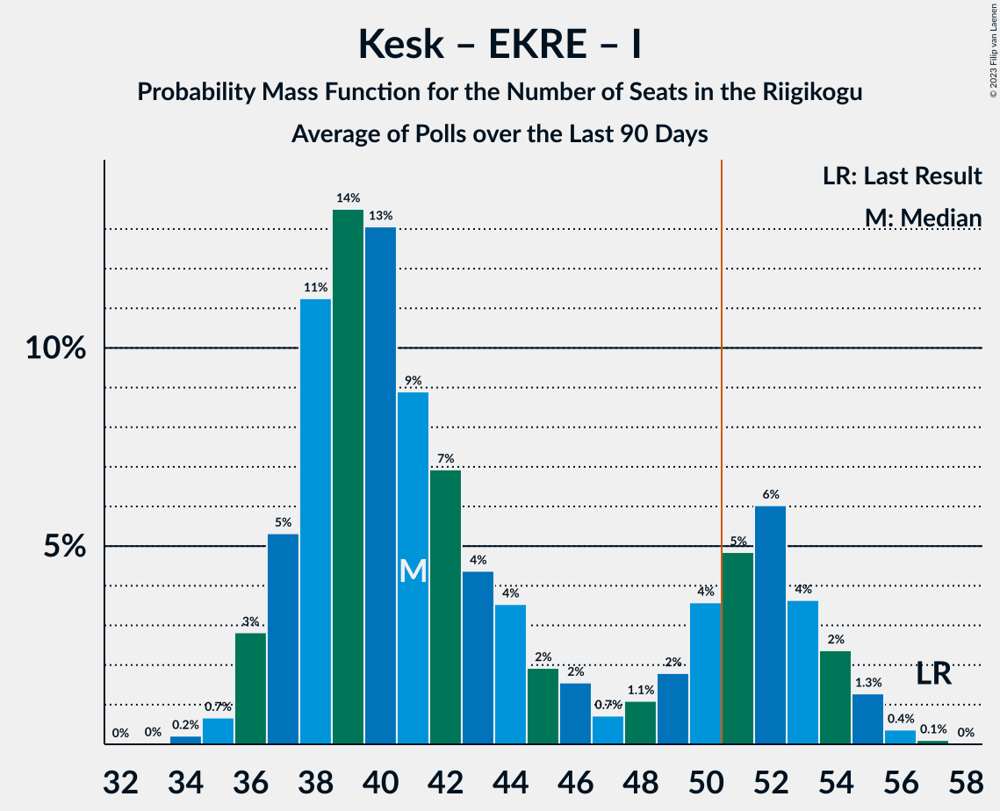

# Poll Average

<a href="#voting-intentions">Voting Intentions</a> | <a href="#seats">Seats</a> | <a href="#coalitions">Coalitions</a> | <a href="#technical-information">Technical Information</a>

## Summary

The table below lists the polls on which the average is based. They are the most recent polls (less than 90 days old) registered and analyzed so far.

| Period     | Polling firm/Commissioner(s) | Ref | Kesk | EKRE | I | SDE | E200 | Rohelised | EVA |
|:----------:|:----------------------------:|:--:|:--:|:--:|:--:|:--:|:--:|:--:|:--:|
| 3 March 2019 | General Election | 28.9%   34 | 23.1%   26 | 17.8%   19 | 11.4%   12 | 9.8%   10 | 4.4%   0 | 1.8%   0 | 1.2%   0 |
| N/A | Poll Average | 22–31%   24–35 | 16–21%   17–23 | 18–25%   20–28 | 3–8%   0–8 | 8–15%   7–15 | 11–18%   11–20 | 1–4%   0 | N/A   N/A |
| [15–21 June 2021](2021-06-21-Norstat.html) | Norstat   MTÜ Ühiskonnauuringute Instituut | 26–32%   29–36 | 17–21%   18–23 | 19–24%   20–26 | 4–6%   0–5 | 8–11%   7–11 | 12–16%   12–17 | 1–3%   0 | N/A   N/A |
| [10–16 June 2021](2021-06-16-KantarEmor.html) | Kantar Emor   BNS and Postimees | 22–28%   25–32 | 16–20%   17–23 | 18–23%   19–25 | 3–5%   0–5 | 11–15%   11–16 | 14–18%   14–20 | 1–3%   0 | N/A   N/A |
| [3–10 June 2021](2021-06-10-Turu-uuringuteAS.html) | Turu-uuringute AS | 21–27%   23–30 | 17–22%   18–24 | 20–26%   22–29 | 6–9%   5–8 | 7–11%   7–11 | 11–15%   11–16 | 2–4%   0 | N/A   N/A |
| 3 March 2019 | General Election | 28.9%   34 | 23.1%   26 | 17.8%   19 | 11.4%   12 | 9.8%   10 | 4.4%   0 | 1.8%   0 | 1.2%   0 |

Only polls for which at least the sample size has been published are included in the table above.

**Legend:**
+ **Top half of each row:** Voting intentions (95% confidence interval)
+ **Bottom half of each row:** Seat projections for the Riigikogu (95% confidence interval)
+ **Ref:** Eesti Reformierakond
+ **Kesk:** Eesti Keskerakond
+ **EKRE:** Eesti Konservatiivne Rahvaerakond
+ **I:** Erakond Isamaa
+ **SDE:** Sotsiaaldemokraatlik Erakond
+ **E200:** Eesti 200
+ **Rohelised:** Erakond Eestimaa Rohelised
+ **EVA:** Eesti Vabaerakond
+ **N/A (single party):** Party not included the published results
+ **N/A (entire row):** Calculation for this opinion poll not started yet

## Voting Intentions

### Confidence Intervals

| Party | Last Result | Median | 80% Confidence Interval | 90% Confidence Interval | 95% Confidence Interval | 99% Confidence Interval |
|:-----:|:-----------:|:------:|:-----------------------:|:-----------------------:|:-----------------------:|:-----------------------:|
| <a href="#eesti-reformierakond">Eesti Reformierakond</a> | 28.9% | 25.5% | 23.0–29.5% |22.5–30.2% | 22.0–30.8% | 21.1–31.9% |
| <a href="#eesti-keskerakond">Eesti Keskerakond</a> | 23.1% | 18.7% | 17.0–20.4% |16.5–20.9% | 16.1–21.3% | 15.4–22.1% |
| <a href="#eesti-konservatiivne-rahvaerakond">Eesti Konservatiivne Rahvaerakond</a> | 17.8% | 21.3% | 19.1–23.8% |18.6–24.5% | 18.1–25.0% | 17.3–26.0% |
| <a href="#erakond-isamaa">Erakond Isamaa</a> | 11.4% | 4.9% | 3.7–7.5% |3.4–7.9% | 3.2–8.3% | 2.9–8.9% |
| <a href="#sotsiaaldemokraatlik-erakond">Sotsiaaldemokraatlik Erakond</a> | 9.8% | 9.8% | 8.2–13.6% |7.9–14.2% | 7.6–14.7% | 7.1–15.5% |
| <a href="#eesti-200">Eesti 200</a> | 4.4% | 14.0% | 12.2–16.7% |11.8–17.3% | 11.4–17.8% | 10.8–18.7% |
| <a href="#erakond-eestimaa-rohelised">Erakond Eestimaa Rohelised</a> | 1.8% | 2.4% | 1.7–3.4% |1.5–3.7% | 1.4–3.9% | 1.2–4.4% |
| <a href="#eesti-vabaerakond">Eesti Vabaerakond</a> | 1.2% | N/A | N/A |N/A | N/A | N/A |

### Eesti Reformierakond

*For a full overview of the results for this party, see the [Eesti Reformierakond](party-eestireformierakond.html) page.*

| Voting Intentions | Probability | Accumulated | Special Marks |
|:-----------------:|:-----------:|:-----------:|:-------------:|
| 18.5–19.5% | 0% | 100% |  |
| 19.5–20.5% | 0.1% | 100% |  |
| 20.5–21.5% | 1.0% | 99.9% |  |
| 21.5–22.5% | 4% | 98.9% |  |
| 22.5–23.5% | 11% | 94% |  |
| 23.5–24.5% | 17% | 83% |  |
| 24.5–25.5% | 17% | 66% | Median |
| 25.5–26.5% | 12% | 49% |  |
| 26.5–27.5% | 9% | 37% |  |
| 27.5–28.5% | 9% | 28% |  |
| 28.5–29.5% | 9% | 19% | Last Result |
| 29.5–30.5% | 6% | 9% |  |
| 30.5–31.5% | 3% | 3% |  |
| 31.5–32.5% | 0.7% | 0.9% |  |
| 32.5–33.5% | 0.1% | 0.1% |  |
| 33.5–34.5% | 0% | 0% |  |

### Eesti Keskerakond

*For a full overview of the results for this party, see the [Eesti Keskerakond](party-eestikeskerakond.html) page.*

| Voting Intentions | Probability | Accumulated | Special Marks |
|:-----------------:|:-----------:|:-----------:|:-------------:|
| 13.5–14.5% | 0% | 100% |  |
| 14.5–15.5% | 0.7% | 100% |  |
| 15.5–16.5% | 4% | 99.3% |  |
| 16.5–17.5% | 14% | 95% |  |
| 17.5–18.5% | 27% | 80% |  |
| 18.5–19.5% | 28% | 54% | Median |
| 19.5–20.5% | 17% | 25% |  |
| 20.5–21.5% | 6% | 8% |  |
| 21.5–22.5% | 1.4% | 2% |  |
| 22.5–23.5% | 0.2% | 0.2% | Last Result |
| 23.5–24.5% | 0% | 0% |  |

### Eesti Konservatiivne Rahvaerakond

*For a full overview of the results for this party, see the [Eesti Konservatiivne Rahvaerakond](party-eestikonservatiivnerahvaerakond.html) page.*

| Voting Intentions | Probability | Accumulated | Special Marks |
|:-----------------:|:-----------:|:-----------:|:-------------:|
| 14.5–15.5% | 0% | 100% |  |
| 15.5–16.5% | 0.1% | 100% |  |
| 16.5–17.5% | 0.7% | 99.9% |  |
| 17.5–18.5% | 4% | 99.2% | Last Result |
| 18.5–19.5% | 11% | 95% |  |
| 19.5–20.5% | 18% | 84% |  |
| 20.5–21.5% | 21% | 66% | Median |
| 21.5–22.5% | 19% | 45% |  |
| 22.5–23.5% | 14% | 27% |  |
| 23.5–24.5% | 8% | 13% |  |
| 24.5–25.5% | 3% | 5% |  |
| 25.5–26.5% | 0.9% | 1.1% |  |
| 26.5–27.5% | 0.2% | 0.2% |  |
| 27.5–28.5% | 0% | 0% |  |

### Erakond Isamaa

*For a full overview of the results for this party, see the [Erakond Isamaa](party-erakondisamaa.html) page.*

| Voting Intentions | Probability | Accumulated | Special Marks |
|:-----------------:|:-----------:|:-----------:|:-------------:|
| 1.5–2.5% | 0.1% | 100% |  |
| 2.5–3.5% | 7% | 99.9% |  |
| 3.5–4.5% | 31% | 93% |  |
| 4.5–5.5% | 24% | 62% | Median |
| 5.5–6.5% | 13% | 38% |  |
| 6.5–7.5% | 16% | 25% |  |
| 7.5–8.5% | 8% | 9% |  |
| 8.5–9.5% | 1.3% | 1.4% |  |
| 9.5–10.5% | 0.1% | 0.1% |  |
| 10.5–11.5% | 0% | 0% | Last Result |

### Sotsiaaldemokraatlik Erakond

*For a full overview of the results for this party, see the [Sotsiaaldemokraatlik Erakond](party-sotsiaaldemokraatlikerakond.html) page.*

| Voting Intentions | Probability | Accumulated | Special Marks |
|:-----------------:|:-----------:|:-----------:|:-------------:|
| 5.5–6.5% | 0.1% | 100% |  |
| 6.5–7.5% | 2% | 99.9% |  |
| 7.5–8.5% | 15% | 98% |  |
| 8.5–9.5% | 28% | 83% |  |
| 9.5–10.5% | 18% | 55% | Last Result, Median |
| 10.5–11.5% | 6% | 38% |  |
| 11.5–12.5% | 8% | 32% |  |
| 12.5–13.5% | 12% | 23% |  |
| 13.5–14.5% | 8% | 11% |  |
| 14.5–15.5% | 3% | 3% |  |
| 15.5–16.5% | 0.4% | 0.5% |  |
| 16.5–17.5% | 0% | 0% |  |

### Eesti 200

*For a full overview of the results for this party, see the [Eesti 200](party-eesti200.html) page.*

| Voting Intentions | Probability | Accumulated | Special Marks |
|:-----------------:|:-----------:|:-----------:|:-------------:|
| 3.5–4.5% | 0% | 100% | Last Result |
| 4.5–5.5% | 0% | 100% |  |
| 5.5–6.5% | 0% | 100% |  |
| 6.5–7.5% | 0% | 100% |  |
| 7.5–8.5% | 0% | 100% |  |
| 8.5–9.5% | 0% | 100% |  |
| 9.5–10.5% | 0.2% | 100% |  |
| 10.5–11.5% | 3% | 99.7% |  |
| 11.5–12.5% | 13% | 97% |  |
| 12.5–13.5% | 23% | 84% |  |
| 13.5–14.5% | 21% | 60% | Median |
| 14.5–15.5% | 15% | 39% |  |
| 15.5–16.5% | 13% | 24% |  |
| 16.5–17.5% | 8% | 12% |  |
| 17.5–18.5% | 3% | 4% |  |
| 18.5–19.5% | 0.6% | 0.7% |  |
| 19.5–20.5% | 0.1% | 0.1% |  |
| 20.5–21.5% | 0% | 0% |  |

### Erakond Eestimaa Rohelised

*For a full overview of the results for this party, see the [Erakond Eestimaa Rohelised](party-erakondeestimaarohelised.html) page.*

| Voting Intentions | Probability | Accumulated | Special Marks |
|:-----------------:|:-----------:|:-----------:|:-------------:|
| 0.0–0.5% | 0% | 100% |  |
| 0.5–1.5% | 6% | 100% |  |
| 1.5–2.5% | 53% | 94% | Last Result, Median |
| 2.5–3.5% | 34% | 41% |  |
| 3.5–4.5% | 7% | 7% |  |
| 4.5–5.5% | 0.3% | 0.3% |  |
| 5.5–6.5% | 0% | 0% |  |

## Seats

### Confidence Intervals

| Party | Last Result | Median | 80% Confidence Interval | 90% Confidence Interval | 95% Confidence Interval | 99% Confidence Interval |
|:-----:|:-----------:|:------:|:-----------------------:|:-----------------------:|:-----------------------:|:-----------------------:|
| <a href="#eesti-reformierakond">Eesti Reformierakond</a> | 34 | 29 | 26–34 |25–35 | 24–35 | 23–37 |
| <a href="#eesti-keskerakond">Eesti Keskerakond</a> | 26 | 20 | 18–22 |18–23 | 17–23 | 16–24 |
| <a href="#eesti-konservatiivne-rahvaerakond">Eesti Konservatiivne Rahvaerakond</a> | 19 | 23 | 21–26 |20–27 | 20–28 | 19–29 |
| <a href="#erakond-isamaa">Erakond Isamaa</a> | 12 | 0 | 0–7 |0–7 | 0–8 | 0–9 |
| <a href="#sotsiaaldemokraatlik-erakond">Sotsiaaldemokraatlik Erakond</a> | 10 | 10 | 8–14 |7–15 | 7–15 | 7–17 |
| <a href="#eesti-200">Eesti 200</a> | 0 | 15 | 12–18 |12–19 | 11–20 | 11–20 |
| <a href="#erakond-eestimaa-rohelised">Erakond Eestimaa Rohelised</a> | 0 | 0 | 0 |0 | 0 | 0 |
| <a href="#eesti-vabaerakond">Eesti Vabaerakond</a> | 0 | N/A | N/A |N/A | N/A | N/A |

### Eesti Reformierakond

*For a full overview of the results for this party, see the [Eesti Reformierakond](party-eestireformierakond.html) page.*

| Number of Seats | Probability | Accumulated | Special Marks |
|:---------------:|:-----------:|:-----------:|:-------------:|
| 22 | 0.1% | 100% |  |
| 23 | 0.9% | 99.8% |  |
| 24 | 3% | 98.9% |  |
| 25 | 6% | 96% |  |
| 26 | 10% | 90% |  |
| 27 | 13% | 80% |  |
| 28 | 16% | 67% |  |
| 29 | 9% | 51% | Median |
| 30 | 7% | 42% |  |
| 31 | 8% | 35% |  |
| 32 | 7% | 27% |  |
| 33 | 8% | 20% |  |
| 34 | 5% | 12% | Last Result |
| 35 | 4% | 6% |  |
| 36 | 2% | 2% |  |
| 37 | 0.4% | 0.5% |  |
| 38 | 0.1% | 0.2% |  |
| 39 | 0% | 0% |  |

### Eesti Keskerakond

*For a full overview of the results for this party, see the [Eesti Keskerakond](party-eestikeskerakond.html) page.*

| Number of Seats | Probability | Accumulated | Special Marks |
|:---------------:|:-----------:|:-----------:|:-------------:|
| 15 | 0.1% | 100% |  |
| 16 | 0.6% | 99.9% |  |
| 17 | 4% | 99.3% |  |
| 18 | 11% | 95% |  |
| 19 | 16% | 84% |  |
| 20 | 28% | 67% | Median |
| 21 | 23% | 40% |  |
| 22 | 10% | 17% |  |
| 23 | 5% | 7% |  |
| 24 | 2% | 2% |  |
| 25 | 0.2% | 0.3% |  |
| 26 | 0% | 0.1% | Last Result |
| 27 | 0% | 0% |  |

### Eesti Konservatiivne Rahvaerakond

*For a full overview of the results for this party, see the [Eesti Konservatiivne Rahvaerakond](party-eestikonservatiivnerahvaerakond.html) page.*

| Number of Seats | Probability | Accumulated | Special Marks |
|:---------------:|:-----------:|:-----------:|:-------------:|
| 18 | 0.4% | 100% |  |
| 19 | 1.3% | 99.5% | Last Result |
| 20 | 4% | 98% |  |
| 21 | 12% | 94% |  |
| 22 | 18% | 82% |  |
| 23 | 19% | 64% | Median |
| 24 | 16% | 46% |  |
| 25 | 11% | 30% |  |
| 26 | 8% | 18% |  |
| 27 | 6% | 10% |  |
| 28 | 2% | 4% |  |
| 29 | 0.9% | 1.2% |  |
| 30 | 0.2% | 0.3% |  |
| 31 | 0.1% | 0.1% |  |
| 32 | 0% | 0% |  |

### Erakond Isamaa

*For a full overview of the results for this party, see the [Erakond Isamaa](party-erakondisamaa.html) page.*

| Number of Seats | Probability | Accumulated | Special Marks |
|:---------------:|:-----------:|:-----------:|:-------------:|
| 0 | 50% | 100% | Median |
| 1 | 0% | 50% |  |
| 2 | 0% | 50% |  |
| 3 | 0% | 50% |  |
| 4 | 7% | 50% |  |
| 5 | 13% | 42% |  |
| 6 | 15% | 30% |  |
| 7 | 10% | 14% |  |
| 8 | 4% | 5% |  |
| 9 | 0.6% | 0.7% |  |
| 10 | 0% | 0% |  |
| 11 | 0% | 0% |  |
| 12 | 0% | 0% | Last Result |

### Sotsiaaldemokraatlik Erakond

*For a full overview of the results for this party, see the [Sotsiaaldemokraatlik Erakond](party-sotsiaaldemokraatlikerakond.html) page.*

| Number of Seats | Probability | Accumulated | Special Marks |
|:---------------:|:-----------:|:-----------:|:-------------:|
| 6 | 0.4% | 100% |  |
| 7 | 7% | 99.6% |  |
| 8 | 22% | 93% |  |
| 9 | 18% | 71% |  |
| 10 | 15% | 53% | Last Result, Median |
| 11 | 5% | 38% |  |
| 12 | 5% | 32% |  |
| 13 | 8% | 28% |  |
| 14 | 10% | 20% |  |
| 15 | 7% | 10% |  |
| 16 | 1.5% | 2% |  |
| 17 | 0.5% | 0.6% |  |
| 18 | 0.1% | 0.1% |  |
| 19 | 0% | 0% |  |

### Eesti 200

*For a full overview of the results for this party, see the [Eesti 200](party-eesti200.html) page.*

| Number of Seats | Probability | Accumulated | Special Marks |
|:---------------:|:-----------:|:-----------:|:-------------:|
| 0 | 0% | 100% | Last Result |
| 1 | 0% | 100% |  |
| 2 | 0% | 100% |  |
| 3 | 0% | 100% |  |
| 4 | 0% | 100% |  |
| 5 | 0% | 100% |  |
| 6 | 0% | 100% |  |
| 7 | 0% | 100% |  |
| 8 | 0% | 100% |  |
| 9 | 0% | 100% |  |
| 10 | 0.3% | 100% |  |
| 11 | 3% | 99.7% |  |
| 12 | 11% | 97% |  |
| 13 | 18% | 86% |  |
| 14 | 17% | 67% |  |
| 15 | 17% | 50% | Median |
| 16 | 9% | 33% |  |
| 17 | 13% | 24% |  |
| 18 | 6% | 12% |  |
| 19 | 3% | 6% |  |
| 20 | 2% | 3% |  |
| 21 | 0.4% | 0.5% |  |
| 22 | 0.1% | 0.1% |  |
| 23 | 0% | 0% |  |

### Erakond Eestimaa Rohelised

*For a full overview of the results for this party, see the [Erakond Eestimaa Rohelised](party-erakondeestimaarohelised.html) page.*

| Number of Seats | Probability | Accumulated | Special Marks |
|:---------------:|:-----------:|:-----------:|:-------------:|
| 0 | 100% | 100% | Last Result, Median |

### Eesti Vabaerakond

*For a full overview of the results for this party, see the [Eesti Vabaerakond](party-eestivabaerakond.html) page.*

## Coalitions

### Confidence Intervals

| Coalition | Last Result | Median | Majority? | 80% Confidence Interval | 90% Confidence Interval | 95% Confidence Interval | 99% Confidence Interval |
|:---------:|:-----------:|:------:|:---------:|:-----------------------:|:-----------------------:|:-----------------------:|:-----------------------:|
| Eesti Reformierakond – Eesti Keskerakond – Eesti Konservatiivne Rahvaerakond | 79 | 73 | 100% | 69–78 | 68–79 | 67–80 | 66–81 |
| Eesti Reformierakond – Eesti Konservatiivne Rahvaerakond – Erakond Isamaa | 65 | 56 | 85% | 49–60 | 49–61 | 48–62 | 46–63 |
| Eesti Reformierakond – Eesti Konservatiivne Rahvaerakond | 53 | 53 | 74% | 49–57 | 48–58 | 47–59 | 46–61 |
| Eesti Reformierakond – Eesti Keskerakond | 60 | 49 | 37% | 45–54 | 45–55 | 44–56 | 43–57 |
| Eesti Keskerakond – Eesti Konservatiivne Rahvaerakond – Erakond Isamaa | 57 | 45 | 27% | 41–53 | 40–54 | 39–55 | 38–57 |
| Eesti Keskerakond – Eesti Konservatiivne Rahvaerakond | 45 | 44 | 0.2% | 40–47 | 39–48 | 38–49 | 37–50 |
| Eesti Reformierakond – Erakond Isamaa – Sotsiaaldemokraatlik Erakond – Eesti Vabaerakond | 56 | 42 | 0% | 40–45 | 39–46 | 38–47 | 37–49 |
| Eesti Reformierakond – Erakond Isamaa – Sotsiaaldemokraatlik Erakond | 56 | 42 | 0% | 40–45 | 39–46 | 38–47 | 37–49 |
| Eesti Reformierakond – Sotsiaaldemokraatlik Erakond | 44 | 41 | 0% | 34–44 | 33–45 | 33–45 | 31–46 |
| Eesti Konservatiivne Rahvaerakond – Sotsiaaldemokraatlik Erakond | 29 | 34 | 0% | 31–37 | 30–38 | 29–38 | 28–40 |
| Eesti Keskerakond – Erakond Isamaa – Sotsiaaldemokraatlik Erakond | 48 | 34 | 0% | 30–37 | 29–38 | 28–38 | 27–40 |
| Eesti Reformierakond – Erakond Isamaa | 46 | 32 | 0% | 28–37 | 27–37 | 26–38 | 25–40 |
| Eesti Keskerakond – Sotsiaaldemokraatlik Erakond | 36 | 30 | 0% | 27–34 | 27–35 | 26–36 | 25–37 |

### Eesti Reformierakond – Eesti Keskerakond – Eesti Konservatiivne Rahvaerakond

| Number of Seats | Probability | Accumulated | Special Marks |
|:---------------:|:-----------:|:-----------:|:-------------:|
| 64 | 0.1% | 100% |  |
| 65 | 0.3% | 99.8% |  |
| 66 | 0.8% | 99.5% |  |
| 67 | 3% | 98.7% |  |
| 68 | 4% | 96% |  |
| 69 | 10% | 91% |  |
| 70 | 9% | 82% |  |
| 71 | 10% | 72% |  |
| 72 | 8% | 62% | Median |
| 73 | 12% | 54% |  |
| 74 | 11% | 42% |  |
| 75 | 7% | 31% |  |
| 76 | 8% | 24% |  |
| 77 | 5% | 16% |  |
| 78 | 5% | 10% |  |
| 79 | 2% | 5% | Last Result |
| 80 | 2% | 3% |  |
| 81 | 0.4% | 0.6% |  |
| 82 | 0.1% | 0.1% |  |
| 83 | 0% | 0% |  |

### Eesti Reformierakond – Eesti Konservatiivne Rahvaerakond – Erakond Isamaa

| Number of Seats | Probability | Accumulated | Special Marks |
|:---------------:|:-----------:|:-----------:|:-------------:|
| 45 | 0.1% | 100% |  |
| 46 | 0.5% | 99.9% |  |
| 47 | 1.0% | 99.4% |  |
| 48 | 2% | 98% |  |
| 49 | 7% | 96% |  |
| 50 | 4% | 89% |  |
| 51 | 7% | 85% | Majority |
| 52 | 6% | 78% | Median |
| 53 | 4% | 72% |  |
| 54 | 4% | 68% |  |
| 55 | 5% | 64% |  |
| 56 | 9% | 59% |  |
| 57 | 7% | 50% |  |
| 58 | 11% | 43% |  |
| 59 | 15% | 32% |  |
| 60 | 10% | 18% |  |
| 61 | 4% | 8% |  |
| 62 | 2% | 3% |  |
| 63 | 0.8% | 0.9% |  |
| 64 | 0.1% | 0.2% |  |
| 65 | 0% | 0% | Last Result |

### Eesti Reformierakond – Eesti Konservatiivne Rahvaerakond

| Number of Seats | Probability | Accumulated | Special Marks |
|:---------------:|:-----------:|:-----------:|:-------------:|
| 44 | 0% | 100% |  |
| 45 | 0.2% | 99.9% |  |
| 46 | 0.8% | 99.7% |  |
| 47 | 1.5% | 98.9% |  |
| 48 | 3% | 97% |  |
| 49 | 11% | 94% |  |
| 50 | 9% | 83% |  |
| 51 | 11% | 74% | Majority |
| 52 | 11% | 63% | Median |
| 53 | 13% | 51% | Last Result |
| 54 | 11% | 38% |  |
| 55 | 8% | 28% |  |
| 56 | 7% | 19% |  |
| 57 | 4% | 12% |  |
| 58 | 4% | 8% |  |
| 59 | 2% | 4% |  |
| 60 | 1.4% | 2% |  |
| 61 | 0.3% | 0.5% |  |
| 62 | 0.1% | 0.2% |  |
| 63 | 0% | 0% |  |

### Eesti Reformierakond – Eesti Keskerakond

| Number of Seats | Probability | Accumulated | Special Marks |
|:---------------:|:-----------:|:-----------:|:-------------:|
| 41 | 0.1% | 100% |  |
| 42 | 0.3% | 99.9% |  |
| 43 | 1.2% | 99.6% |  |
| 44 | 3% | 98% |  |
| 45 | 6% | 95% |  |
| 46 | 13% | 90% |  |
| 47 | 9% | 76% |  |
| 48 | 17% | 68% |  |
| 49 | 8% | 51% | Median |
| 50 | 6% | 43% |  |
| 51 | 9% | 37% | Majority |
| 52 | 5% | 28% |  |
| 53 | 7% | 23% |  |
| 54 | 7% | 16% |  |
| 55 | 5% | 9% |  |
| 56 | 3% | 4% |  |
| 57 | 1.2% | 1.4% |  |
| 58 | 0.1% | 0.1% |  |
| 59 | 0% | 0% |  |
| 60 | 0% | 0% | Last Result |

### Eesti Keskerakond – Eesti Konservatiivne Rahvaerakond – Erakond Isamaa

| Number of Seats | Probability | Accumulated | Special Marks |
|:---------------:|:-----------:|:-----------:|:-------------:|
| 36 | 0.1% | 100% |  |
| 37 | 0.3% | 99.9% |  |
| 38 | 2% | 99.6% |  |
| 39 | 1.1% | 98% |  |
| 40 | 4% | 96% |  |
| 41 | 10% | 92% |  |
| 42 | 7% | 82% |  |
| 43 | 10% | 76% | Median |
| 44 | 8% | 66% |  |
| 45 | 7% | 57% |  |
| 46 | 6% | 50% |  |
| 47 | 5% | 43% |  |
| 48 | 3% | 39% |  |
| 49 | 4% | 36% |  |
| 50 | 5% | 32% |  |
| 51 | 4% | 27% | Majority |
| 52 | 5% | 23% |  |
| 53 | 8% | 18% |  |
| 54 | 5% | 9% |  |
| 55 | 3% | 4% |  |
| 56 | 0.9% | 1.4% |  |
| 57 | 0.4% | 0.5% | Last Result |
| 58 | 0.1% | 0.1% |  |
| 59 | 0% | 0% |  |

### Eesti Keskerakond – Eesti Konservatiivne Rahvaerakond

| Number of Seats | Probability | Accumulated | Special Marks |
|:---------------:|:-----------:|:-----------:|:-------------:|
| 36 | 0.1% | 100% |  |
| 37 | 0.5% | 99.9% |  |
| 38 | 3% | 99.4% |  |
| 39 | 3% | 97% |  |
| 40 | 5% | 94% |  |
| 41 | 14% | 89% |  |
| 42 | 9% | 75% |  |
| 43 | 15% | 65% | Median |
| 44 | 14% | 51% |  |
| 45 | 10% | 36% | Last Result |
| 46 | 10% | 26% |  |
| 47 | 9% | 16% |  |
| 48 | 4% | 7% |  |
| 49 | 2% | 3% |  |
| 50 | 0.8% | 1.0% |  |
| 51 | 0.2% | 0.2% | Majority |
| 52 | 0% | 0.1% |  |
| 53 | 0% | 0% |  |

### Eesti Reformierakond – Erakond Isamaa – Sotsiaaldemokraatlik Erakond – Eesti Vabaerakond

| Number of Seats | Probability | Accumulated | Special Marks |
|:---------------:|:-----------:|:-----------:|:-------------:|
| 36 | 0.1% | 100% |  |
| 37 | 0.5% | 99.9% |  |
| 38 | 2% | 99.4% |  |
| 39 | 3% | 97% | Median |
| 40 | 9% | 95% |  |
| 41 | 14% | 85% |  |
| 42 | 25% | 72% |  |
| 43 | 14% | 46% |  |
| 44 | 9% | 32% |  |
| 45 | 14% | 23% |  |
| 46 | 6% | 9% |  |
| 47 | 2% | 3% |  |
| 48 | 0.5% | 1.1% |  |
| 49 | 0.5% | 0.5% |  |
| 50 | 0.1% | 0.1% |  |
| 51 | 0% | 0% | Majority |
| 52 | 0% | 0% |  |
| 53 | 0% | 0% |  |
| 54 | 0% | 0% |  |
| 55 | 0% | 0% |  |
| 56 | 0% | 0% | Last Result |

### Eesti Reformierakond – Erakond Isamaa – Sotsiaaldemokraatlik Erakond

| Number of Seats | Probability | Accumulated | Special Marks |
|:---------------:|:-----------:|:-----------:|:-------------:|
| 36 | 0.1% | 100% |  |
| 37 | 0.5% | 99.9% |  |
| 38 | 2% | 99.4% |  |
| 39 | 3% | 97% | Median |
| 40 | 9% | 95% |  |
| 41 | 14% | 85% |  |
| 42 | 25% | 72% |  |
| 43 | 14% | 46% |  |
| 44 | 9% | 32% |  |
| 45 | 14% | 23% |  |
| 46 | 6% | 9% |  |
| 47 | 2% | 3% |  |
| 48 | 0.5% | 1.1% |  |
| 49 | 0.5% | 0.5% |  |
| 50 | 0.1% | 0.1% |  |
| 51 | 0% | 0% | Majority |
| 52 | 0% | 0% |  |
| 53 | 0% | 0% |  |
| 54 | 0% | 0% |  |
| 55 | 0% | 0% |  |
| 56 | 0% | 0% | Last Result |

### Eesti Reformierakond – Sotsiaaldemokraatlik Erakond

| Number of Seats | Probability | Accumulated | Special Marks |
|:---------------:|:-----------:|:-----------:|:-------------:|
| 30 | 0.1% | 100% |  |
| 31 | 0.5% | 99.9% |  |
| 32 | 1.2% | 99.4% |  |
| 33 | 4% | 98% |  |
| 34 | 5% | 95% |  |
| 35 | 7% | 90% |  |
| 36 | 9% | 83% |  |
| 37 | 5% | 74% |  |
| 38 | 6% | 70% |  |
| 39 | 3% | 64% | Median |
| 40 | 8% | 61% |  |
| 41 | 15% | 54% |  |
| 42 | 16% | 39% |  |
| 43 | 10% | 23% |  |
| 44 | 6% | 13% | Last Result |
| 45 | 5% | 7% |  |
| 46 | 1.5% | 2% |  |
| 47 | 0.3% | 0.5% |  |
| 48 | 0.1% | 0.1% |  |
| 49 | 0% | 0% |  |

### Eesti Konservatiivne Rahvaerakond – Sotsiaaldemokraatlik Erakond

| Number of Seats | Probability | Accumulated | Special Marks |
|:---------------:|:-----------:|:-----------:|:-------------:|
| 27 | 0.1% | 100% |  |
| 28 | 0.7% | 99.9% |  |
| 29 | 2% | 99.3% | Last Result |
| 30 | 5% | 97% |  |
| 31 | 10% | 92% |  |
| 32 | 11% | 82% |  |
| 33 | 12% | 71% | Median |
| 34 | 17% | 59% |  |
| 35 | 14% | 42% |  |
| 36 | 13% | 27% |  |
| 37 | 8% | 14% |  |
| 38 | 4% | 7% |  |
| 39 | 2% | 2% |  |
| 40 | 0.5% | 0.6% |  |
| 41 | 0.1% | 0.1% |  |
| 42 | 0% | 0% |  |

### Eesti Keskerakond – Erakond Isamaa – Sotsiaaldemokraatlik Erakond

| Number of Seats | Probability | Accumulated | Special Marks |
|:---------------:|:-----------:|:-----------:|:-------------:|
| 25 | 0.1% | 100% |  |
| 26 | 0.3% | 99.9% |  |
| 27 | 1.5% | 99.6% |  |
| 28 | 2% | 98% |  |
| 29 | 4% | 96% |  |
| 30 | 6% | 92% | Median |
| 31 | 8% | 86% |  |
| 32 | 14% | 77% |  |
| 33 | 11% | 63% |  |
| 34 | 14% | 53% |  |
| 35 | 13% | 38% |  |
| 36 | 15% | 26% |  |
| 37 | 5% | 11% |  |
| 38 | 4% | 6% |  |
| 39 | 2% | 2% |  |
| 40 | 0.3% | 0.5% |  |
| 41 | 0.2% | 0.2% |  |
| 42 | 0% | 0% |  |
| 43 | 0% | 0% |  |
| 44 | 0% | 0% |  |
| 45 | 0% | 0% |  |
| 46 | 0% | 0% |  |
| 47 | 0% | 0% |  |
| 48 | 0% | 0% | Last Result |

### Eesti Reformierakond – Erakond Isamaa

| Number of Seats | Probability | Accumulated | Special Marks |
|:---------------:|:-----------:|:-----------:|:-------------:|
| 24 | 0.4% | 100% |  |
| 25 | 0.5% | 99.5% |  |
| 26 | 3% | 99.0% |  |
| 27 | 6% | 96% |  |
| 28 | 9% | 91% |  |
| 29 | 6% | 82% | Median |
| 30 | 6% | 76% |  |
| 31 | 9% | 70% |  |
| 32 | 13% | 61% |  |
| 33 | 12% | 48% |  |
| 34 | 11% | 36% |  |
| 35 | 9% | 25% |  |
| 36 | 7% | 17% |  |
| 37 | 5% | 10% |  |
| 38 | 4% | 5% |  |
| 39 | 0.4% | 0.9% |  |
| 40 | 0.3% | 0.5% |  |
| 41 | 0.2% | 0.2% |  |
| 42 | 0% | 0% |  |
| 43 | 0% | 0% |  |
| 44 | 0% | 0% |  |
| 45 | 0% | 0% |  |
| 46 | 0% | 0% | Last Result |

### Eesti Keskerakond – Sotsiaaldemokraatlik Erakond

| Number of Seats | Probability | Accumulated | Special Marks |
|:---------------:|:-----------:|:-----------:|:-------------:|
| 24 | 0.1% | 100% |  |
| 25 | 0.7% | 99.9% |  |
| 26 | 4% | 99.2% |  |
| 27 | 6% | 95% |  |
| 28 | 11% | 90% |  |
| 29 | 17% | 78% |  |
| 30 | 15% | 61% | Median |
| 31 | 11% | 46% |  |
| 32 | 11% | 36% |  |
| 33 | 10% | 24% |  |
| 34 | 6% | 15% |  |
| 35 | 5% | 9% |  |
| 36 | 2% | 3% | Last Result |
| 37 | 1.0% | 1.2% |  |
| 38 | 0.1% | 0.2% |  |
| 39 | 0.1% | 0.1% |  |
| 40 | 0% | 0% |  |

## Technical Information

+ **Number of polls included in this average:** 3
+ **Lowest number of simulations done in a poll included in this average:** 131,072
+ **Total number of simulations done in the polls included in this average:** 393,216
+ **Error estimate:** 2.47%
