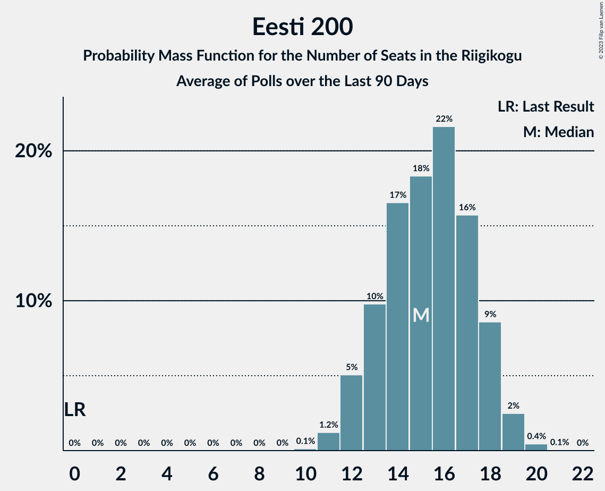

# Poll Average

<a href="#voting-intentions">Voting Intentions</a> | <a href="#seats">Seats</a> | <a href="#coalitions">Coalitions</a> | <a href="#technical-information">Technical Information</a>

## Summary

The table below lists the polls on which the average is based. They are the most recent polls (less than 90 days old) registered and analyzed so far.

| Period     | Polling firm/Commissioner(s) | Ref | Kesk | EKRE | I | SDE | E200 | Rohelised | EVA | EP |
|:----------:|:----------------------------:|:--:|:--:|:--:|:--:|:--:|:--:|:--:|:--:|:--:|
| 3 March 2019 | General Election | 28.9%   34 | 23.1%   26 | 17.8%   19 | 11.4%   12 | 9.8%   10 | 4.4%   0 | 1.8%   0 | 1.2%   0 | 0.0%   0 |
| N/A | Poll Average | 26–35%   29–39 | 10–16%   9–16 | 23–31%   25–35 | 6–10%   5–10 | 5–9%   4–9 | 8–16%   7–16 | 1–3%   0 | N/A   N/A | 0–2%   0 |
| [13–19 October 2022](2022-10-19-KantarEmor.html) | Kantar Emor   ERR | 26–31%   29–34 | 12–16%   12–16 | 23–27%   25–30 | 6–9%   5–8 | 7–10%   6–9 | 12–16%   12–16 | 1–3%   0 | N/A   N/A | 1–2%   0 |
| [11–17 October 2022](2022-10-17-Norstat.html) | Norstat   MTÜ Ühiskonnauuringute Instituut | 29–35%   32–39 | 10–14%   9–14 | 26–32%   28–35 | 7–11%   6–10 | 5–8%   0–7 | 7–11%   7–10 | 1–3%   0 | N/A   N/A | 0–1%   0 |
| [16 September 2022](2022-09-16-Turu-uuringuteAS.html) | Turu-uuringute AS | N/A   N/A | N/A   N/A | N/A   N/A | N/A   N/A | N/A   N/A | N/A   N/A | N/A   N/A | N/A   N/A | N/A   N/A |
| 3 March 2019 | General Election | 28.9%   34 | 23.1%   26 | 17.8%   19 | 11.4%   12 | 9.8%   10 | 4.4%   0 | 1.8%   0 | 1.2%   0 | 0.0%   0 |

Only polls for which at least the sample size has been published are included in the table above.

**Legend:**
+ **Top half of each row:** Voting intentions (95% confidence interval)
+ **Bottom half of each row:** Seat projections for the Riigikogu (95% confidence interval)
+ **Ref:** Eesti Reformierakond
+ **Kesk:** Eesti Keskerakond
+ **EKRE:** Eesti Konservatiivne Rahvaerakond
+ **I:** Erakond Isamaa
+ **SDE:** Sotsiaaldemokraatlik Erakond
+ **E200:** Eesti 200
+ **Rohelised:** Erakond Eestimaa Rohelised
+ **EVA:** Eesti Vabaerakond
+ **EP:** Erakond Parempoolsed
+ **N/A (single party):** Party not included the published results
+ **N/A (entire row):** Calculation for this opinion poll not started yet

## Voting Intentions

### Confidence Intervals

| Party | Last Result | Median | 80% Confidence Interval | 90% Confidence Interval | 95% Confidence Interval | 99% Confidence Interval |
|:-----:|:-----------:|:------:|:-----------------------:|:-----------------------:|:-----------------------:|:-----------------------:|
| <a href="#eesti-reformierakond">Eesti Reformierakond</a> | 28.9% | 30.0% | 27.2–33.5% |26.7–34.1% | 26.3–34.7% | 25.5–35.7% |
| <a href="#eesti-keskerakond">Eesti Keskerakond</a> | 23.1% | 13.0% | 10.8–14.9% |10.4–15.3% | 10.1–15.7% | 9.4–16.3% |
| <a href="#eesti-konservatiivne-rahvaerakond">Eesti Konservatiivne Rahvaerakond</a> | 17.8% | 26.8% | 24.3–30.0% |23.8–30.7% | 23.4–31.2% | 22.6–32.2% |
| <a href="#erakond-isamaa">Erakond Isamaa</a> | 11.4% | 7.9% | 6.6–9.7% |6.3–10.2% | 6.1–10.5% | 5.7–11.2% |
| <a href="#sotsiaaldemokraatlik-erakond">Sotsiaaldemokraatlik Erakond</a> | 9.8% | 7.3% | 5.8–8.7% |5.5–9.0% | 5.3–9.3% | 4.8–9.8% |
| <a href="#eesti-200">Eesti 200</a> | 4.4% | 11.8% | 8.3–14.9% |7.9–15.3% | 7.6–15.7% | 7.1–16.3% |
| <a href="#erakond-eestimaa-rohelised">Erakond Eestimaa Rohelised</a> | 1.8% | 1.9% | 1.4–2.5% |1.3–2.7% | 1.2–2.8% | 1.0–3.1% |
| <a href="#eesti-vabaerakond">Eesti Vabaerakond</a> | 1.2% | N/A | N/A |N/A | N/A | N/A |
| <a href="#erakond-parempoolsed">Erakond Parempoolsed</a> | 0.0% | 0.7% | 0.2–1.3% |0.2–1.4% | 0.1–1.6% | 0.1–1.8% |

### Eesti Reformierakond

*For a full overview of the results for this party, see the [Eesti Reformierakond](party-eestireformierakond.html) page.*

| Voting Intentions | Probability | Accumulated | Special Marks |
|:-----------------:|:-----------:|:-----------:|:-------------:|
| 23.5–24.5% | 0% | 100% |  |
| 24.5–25.5% | 0.5% | 100% |  |
| 25.5–26.5% | 3% | 99.5% |  |
| 26.5–27.5% | 11% | 96% |  |
| 27.5–28.5% | 17% | 85% |  |
| 28.5–29.5% | 14% | 69% | Last Result |
| 29.5–30.5% | 10% | 55% | Median |
| 30.5–31.5% | 11% | 45% |  |
| 31.5–32.5% | 13% | 34% |  |
| 32.5–33.5% | 11% | 21% |  |
| 33.5–34.5% | 6% | 9% |  |
| 34.5–35.5% | 2% | 3% |  |
| 35.5–36.5% | 0.6% | 0.7% |  |
| 36.5–37.5% | 0.1% | 0.1% |  |
| 37.5–38.5% | 0% | 0% |  |

### Eesti Keskerakond

*For a full overview of the results for this party, see the [Eesti Keskerakond](party-eestikeskerakond.html) page.*

| Voting Intentions | Probability | Accumulated | Special Marks |
|:-----------------:|:-----------:|:-----------:|:-------------:|
| 7.5–8.5% | 0% | 100% |  |
| 8.5–9.5% | 0.7% | 100% |  |
| 9.5–10.5% | 6% | 99.3% |  |
| 10.5–11.5% | 17% | 93% |  |
| 11.5–12.5% | 19% | 77% |  |
| 12.5–13.5% | 19% | 58% | Median |
| 13.5–14.5% | 23% | 39% |  |
| 14.5–15.5% | 13% | 16% |  |
| 15.5–16.5% | 3% | 3% |  |
| 16.5–17.5% | 0.3% | 0.3% |  |
| 17.5–18.5% | 0% | 0% |  |
| 18.5–19.5% | 0% | 0% |  |
| 19.5–20.5% | 0% | 0% |  |
| 20.5–21.5% | 0% | 0% |  |
| 21.5–22.5% | 0% | 0% |  |
| 22.5–23.5% | 0% | 0% | Last Result |

### Eesti Konservatiivne Rahvaerakond

*For a full overview of the results for this party, see the [Eesti Konservatiivne Rahvaerakond](party-eestikonservatiivnerahvaerakond.html) page.*

| Voting Intentions | Probability | Accumulated | Special Marks |
|:-----------------:|:-----------:|:-----------:|:-------------:|
| 17.5–18.5% | 0% | 100% | Last Result |
| 18.5–19.5% | 0% | 100% |  |
| 19.5–20.5% | 0% | 100% |  |
| 20.5–21.5% | 0% | 100% |  |
| 21.5–22.5% | 0.4% | 100% |  |
| 22.5–23.5% | 3% | 99.6% |  |
| 23.5–24.5% | 11% | 97% |  |
| 24.5–25.5% | 17% | 86% |  |
| 25.5–26.5% | 15% | 69% |  |
| 26.5–27.5% | 12% | 53% | Median |
| 27.5–28.5% | 13% | 42% |  |
| 28.5–29.5% | 14% | 29% |  |
| 29.5–30.5% | 9% | 15% |  |
| 30.5–31.5% | 4% | 6% |  |
| 31.5–32.5% | 1.3% | 2% |  |
| 32.5–33.5% | 0.2% | 0.3% |  |
| 33.5–34.5% | 0% | 0% |  |

### Erakond Isamaa

*For a full overview of the results for this party, see the [Erakond Isamaa](party-erakondisamaa.html) page.*

| Voting Intentions | Probability | Accumulated | Special Marks |
|:-----------------:|:-----------:|:-----------:|:-------------:|
| 3.5–4.5% | 0% | 100% |  |
| 4.5–5.5% | 0.3% | 100% |  |
| 5.5–6.5% | 9% | 99.7% |  |
| 6.5–7.5% | 29% | 90% |  |
| 7.5–8.5% | 26% | 61% | Median |
| 8.5–9.5% | 22% | 35% |  |
| 9.5–10.5% | 11% | 13% |  |
| 10.5–11.5% | 2% | 2% | Last Result |
| 11.5–12.5% | 0.2% | 0.2% |  |
| 12.5–13.5% | 0% | 0% |  |

### Sotsiaaldemokraatlik Erakond

*For a full overview of the results for this party, see the [Sotsiaaldemokraatlik Erakond](party-sotsiaaldemokraatlikerakond.html) page.*

| Voting Intentions | Probability | Accumulated | Special Marks |
|:-----------------:|:-----------:|:-----------:|:-------------:|
| 2.5–3.5% | 0% | 100% |  |
| 3.5–4.5% | 0.2% | 100% |  |
| 4.5–5.5% | 5% | 99.8% |  |
| 5.5–6.5% | 23% | 95% |  |
| 6.5–7.5% | 29% | 72% | Median |
| 7.5–8.5% | 30% | 43% |  |
| 8.5–9.5% | 12% | 13% |  |
| 9.5–10.5% | 1.1% | 1.2% | Last Result |
| 10.5–11.5% | 0% | 0% |  |

### Eesti 200

*For a full overview of the results for this party, see the [Eesti 200](party-eesti200.html) page.*

| Voting Intentions | Probability | Accumulated | Special Marks |
|:-----------------:|:-----------:|:-----------:|:-------------:|
| 3.5–4.5% | 0% | 100% | Last Result |
| 4.5–5.5% | 0% | 100% |  |
| 5.5–6.5% | 0.1% | 100% |  |
| 6.5–7.5% | 2% | 99.9% |  |
| 7.5–8.5% | 12% | 98% |  |
| 8.5–9.5% | 21% | 86% |  |
| 9.5–10.5% | 12% | 65% |  |
| 10.5–11.5% | 3% | 53% |  |
| 11.5–12.5% | 2% | 50% | Median |
| 12.5–13.5% | 11% | 48% |  |
| 13.5–14.5% | 21% | 37% |  |
| 14.5–15.5% | 13% | 16% |  |
| 15.5–16.5% | 3% | 3% |  |
| 16.5–17.5% | 0.3% | 0.3% |  |
| 17.5–18.5% | 0% | 0% |  |

### Erakond Eestimaa Rohelised

*For a full overview of the results for this party, see the [Erakond Eestimaa Rohelised](party-erakondeestimaarohelised.html) page.*

| Voting Intentions | Probability | Accumulated | Special Marks |
|:-----------------:|:-----------:|:-----------:|:-------------:|
| 0.0–0.5% | 0% | 100% |  |
| 0.5–1.5% | 18% | 100% |  |
| 1.5–2.5% | 74% | 82% | Last Result, Median |
| 2.5–3.5% | 9% | 9% |  |
| 3.5–4.5% | 0% | 0% |  |
| 4.5–5.5% | 0% | 0% |  |

### Erakond Parempoolsed

*For a full overview of the results for this party, see the [Erakond Parempoolsed](party-erakondparempoolsed.html) page.*

| Voting Intentions | Probability | Accumulated | Special Marks |
|:-----------------:|:-----------:|:-----------:|:-------------:|
| 0.0–0.5% | 40% | 100% | Last Result |
| 0.5–1.5% | 57% | 60% | Median |
| 1.5–2.5% | 3% | 3% |  |
| 2.5–3.5% | 0% | 0% |  |

## Seats

### Confidence Intervals

| Party | Last Result | Median | 80% Confidence Interval | 90% Confidence Interval | 95% Confidence Interval | 99% Confidence Interval |
|:-----:|:-----------:|:------:|:-----------------------:|:-----------------------:|:-----------------------:|:-----------------------:|
| <a href="#eesti-reformierakond">Eesti Reformierakond</a> | 34 | 33 | 30–38 |29–38 | 29–39 | 28–40 |
| <a href="#eesti-keskerakond">Eesti Keskerakond</a> | 26 | 13 | 10–15 |10–16 | 9–16 | 9–17 |
| <a href="#eesti-konservatiivne-rahvaerakond">Eesti Konservatiivne Rahvaerakond</a> | 19 | 29 | 26–33 |26–34 | 25–35 | 24–36 |
| <a href="#erakond-isamaa">Erakond Isamaa</a> | 12 | 7 | 6–9 |6–10 | 5–10 | 5–11 |
| <a href="#sotsiaaldemokraatlik-erakond">Sotsiaaldemokraatlik Erakond</a> | 10 | 7 | 5–8 |5–8 | 4–9 | 0–9 |
| <a href="#eesti-200">Eesti 200</a> | 0 | 11 | 7–15 |7–16 | 7–16 | 6–17 |
| <a href="#erakond-eestimaa-rohelised">Erakond Eestimaa Rohelised</a> | 0 | 0 | 0 |0 | 0 | 0 |
| <a href="#eesti-vabaerakond">Eesti Vabaerakond</a> | 0 | N/A | N/A |N/A | N/A | N/A |
| <a href="#erakond-parempoolsed">Erakond Parempoolsed</a> | 0 | 0 | 0 |0 | 0 | 0 |

### Eesti Reformierakond

*For a full overview of the results for this party, see the [Eesti Reformierakond](party-eestireformierakond.html) page.*

| Number of Seats | Probability | Accumulated | Special Marks |
|:---------------:|:-----------:|:-----------:|:-------------:|
| 27 | 0.2% | 100% |  |
| 28 | 1.0% | 99.8% |  |
| 29 | 6% | 98.8% |  |
| 30 | 9% | 92% |  |
| 31 | 14% | 84% |  |
| 32 | 14% | 70% |  |
| 33 | 8% | 56% | Median |
| 34 | 10% | 49% | Last Result |
| 35 | 12% | 38% |  |
| 36 | 7% | 26% |  |
| 37 | 8% | 19% |  |
| 38 | 7% | 11% |  |
| 39 | 2% | 4% |  |
| 40 | 0.6% | 1.1% |  |
| 41 | 0.4% | 0.5% |  |
| 42 | 0% | 0% |  |

### Eesti Keskerakond

*For a full overview of the results for this party, see the [Eesti Keskerakond](party-eestikeskerakond.html) page.*

| Number of Seats | Probability | Accumulated | Special Marks |
|:---------------:|:-----------:|:-----------:|:-------------:|
| 8 | 0.3% | 100% |  |
| 9 | 3% | 99.7% |  |
| 10 | 8% | 97% |  |
| 11 | 19% | 88% |  |
| 12 | 14% | 69% |  |
| 13 | 13% | 55% | Median |
| 14 | 23% | 42% |  |
| 15 | 12% | 18% |  |
| 16 | 5% | 6% |  |
| 17 | 1.2% | 1.2% |  |
| 18 | 0.1% | 0.1% |  |
| 19 | 0% | 0% |  |
| 20 | 0% | 0% |  |
| 21 | 0% | 0% |  |
| 22 | 0% | 0% |  |
| 23 | 0% | 0% |  |
| 24 | 0% | 0% |  |
| 25 | 0% | 0% |  |
| 26 | 0% | 0% | Last Result |

### Eesti Konservatiivne Rahvaerakond

*For a full overview of the results for this party, see the [Eesti Konservatiivne Rahvaerakond](party-eestikonservatiivnerahvaerakond.html) page.*

| Number of Seats | Probability | Accumulated | Special Marks |
|:---------------:|:-----------:|:-----------:|:-------------:|
| 19 | 0% | 100% | Last Result |
| 20 | 0% | 100% |  |
| 21 | 0% | 100% |  |
| 22 | 0% | 100% |  |
| 23 | 0.1% | 100% |  |
| 24 | 0.7% | 99.9% |  |
| 25 | 2% | 99.2% |  |
| 26 | 8% | 97% |  |
| 27 | 12% | 88% |  |
| 28 | 15% | 76% |  |
| 29 | 12% | 61% | Median |
| 30 | 11% | 49% |  |
| 31 | 11% | 38% |  |
| 32 | 16% | 27% |  |
| 33 | 3% | 11% |  |
| 34 | 5% | 8% |  |
| 35 | 2% | 3% |  |
| 36 | 0.9% | 1.0% |  |
| 37 | 0.1% | 0.1% |  |
| 38 | 0% | 0% |  |

### Erakond Isamaa

*For a full overview of the results for this party, see the [Erakond Isamaa](party-erakondisamaa.html) page.*

| Number of Seats | Probability | Accumulated | Special Marks |
|:---------------:|:-----------:|:-----------:|:-------------:|
| 4 | 0.1% | 100% |  |
| 5 | 4% | 99.9% |  |
| 6 | 29% | 96% |  |
| 7 | 25% | 68% | Median |
| 8 | 21% | 42% |  |
| 9 | 16% | 21% |  |
| 10 | 5% | 6% |  |
| 11 | 1.1% | 1.1% |  |
| 12 | 0.1% | 0.1% | Last Result |
| 13 | 0% | 0% |  |

### Sotsiaaldemokraatlik Erakond

*For a full overview of the results for this party, see the [Sotsiaaldemokraatlik Erakond](party-sotsiaaldemokraatlikerakond.html) page.*

| Number of Seats | Probability | Accumulated | Special Marks |
|:---------------:|:-----------:|:-----------:|:-------------:|
| 0 | 1.3% | 100% |  |
| 1 | 0% | 98.7% |  |
| 2 | 0% | 98.7% |  |
| 3 | 0% | 98.7% |  |
| 4 | 3% | 98.7% |  |
| 5 | 16% | 96% |  |
| 6 | 28% | 79% |  |
| 7 | 28% | 51% | Median |
| 8 | 19% | 23% |  |
| 9 | 3% | 3% |  |
| 10 | 0.3% | 0.3% | Last Result |
| 11 | 0% | 0% |  |

### Eesti 200

*For a full overview of the results for this party, see the [Eesti 200](party-eesti200.html) page.*

| Number of Seats | Probability | Accumulated | Special Marks |
|:---------------:|:-----------:|:-----------:|:-------------:|
| 0 | 0% | 100% | Last Result |
| 1 | 0% | 100% |  |
| 2 | 0% | 100% |  |
| 3 | 0% | 100% |  |
| 4 | 0% | 100% |  |
| 5 | 0% | 100% |  |
| 6 | 0.8% | 100% |  |
| 7 | 9% | 99.2% |  |
| 8 | 18% | 90% |  |
| 9 | 15% | 72% |  |
| 10 | 6% | 57% |  |
| 11 | 1.1% | 51% | Median |
| 12 | 2% | 50% |  |
| 13 | 8% | 48% |  |
| 14 | 21% | 40% |  |
| 15 | 13% | 19% |  |
| 16 | 5% | 6% |  |
| 17 | 0.9% | 1.0% |  |
| 18 | 0.1% | 0.1% |  |
| 19 | 0% | 0% |  |

### Erakond Eestimaa Rohelised

*For a full overview of the results for this party, see the [Erakond Eestimaa Rohelised](party-erakondeestimaarohelised.html) page.*

| Number of Seats | Probability | Accumulated | Special Marks |
|:---------------:|:-----------:|:-----------:|:-------------:|
| 0 | 100% | 100% | Last Result, Median |

### Eesti Vabaerakond

*For a full overview of the results for this party, see the [Eesti Vabaerakond](party-eestivabaerakond.html) page.*

### Erakond Parempoolsed

*For a full overview of the results for this party, see the [Erakond Parempoolsed](party-erakondparempoolsed.html) page.*

| Number of Seats | Probability | Accumulated | Special Marks |
|:---------------:|:-----------:|:-----------:|:-------------:|
| 0 | 100% | 100% | Last Result, Median |

## Coalitions

### Confidence Intervals

| Coalition | Last Result | Median | Majority? | 80% Confidence Interval | 90% Confidence Interval | 95% Confidence Interval | 99% Confidence Interval |
|:---------:|:-----------:|:------:|:---------:|:-----------------------:|:-----------------------:|:-----------------------:|:-----------------------:|
| Eesti Reformierakond – Eesti Keskerakond – Eesti Konservatiivne Rahvaerakond | 79 | 75 | 100% | 72–80 | 71–81 | 71–82 | 69–84 |
| Eesti Reformierakond – Eesti Konservatiivne Rahvaerakond – Erakond Isamaa | 65 | 70 | 100% | 64–77 | 63–78 | 63–79 | 62–81 |
| Eesti Reformierakond – Eesti Konservatiivne Rahvaerakond | 53 | 63 | 100% | 57–69 | 57–70 | 56–71 | 55–72 |
| Eesti Keskerakond – Eesti Konservatiivne Rahvaerakond – Erakond Isamaa | 57 | 50 | 31% | 47–53 | 46–53 | 46–54 | 45–56 |
| Eesti Reformierakond – Erakond Isamaa – Sotsiaaldemokraatlik Erakond – Eesti Vabaerakond | 56 | 47 | 17% | 43–51 | 43–52 | 43–53 | 42–54 |
| Eesti Reformierakond – Erakond Isamaa – Sotsiaaldemokraatlik Erakond | 56 | 47 | 17% | 43–51 | 43–52 | 43–53 | 42–54 |
| Eesti Reformierakond – Eesti Keskerakond | 60 | 46 | 2% | 44–49 | 43–50 | 43–50 | 42–52 |
| Eesti Reformierakond – Erakond Isamaa | 46 | 41 | 0% | 36–46 | 35–47 | 35–47 | 34–49 |
| Eesti Keskerakond – Eesti Konservatiivne Rahvaerakond | 45 | 42 | 0% | 40–45 | 40–46 | 39–46 | 38–47 |
| Eesti Reformierakond – Sotsiaaldemokraatlik Erakond | 44 | 40 | 0% | 37–43 | 37–44 | 36–44 | 35–46 |
| Eesti Konservatiivne Rahvaerakond – Sotsiaaldemokraatlik Erakond | 29 | 36 | 0% | 34–39 | 33–40 | 32–40 | 31–41 |
| Eesti Keskerakond – Erakond Isamaa – Sotsiaaldemokraatlik Erakond | 48 | 27 | 0% | 24–29 | 23–30 | 22–30 | 20–31 |
| Eesti Keskerakond – Sotsiaaldemokraatlik Erakond | 36 | 19 | 0% | 16–23 | 15–23 | 14–24 | 11–25 |

### Eesti Reformierakond – Eesti Keskerakond – Eesti Konservatiivne Rahvaerakond

| Number of Seats | Probability | Accumulated | Special Marks |
|:---------------:|:-----------:|:-----------:|:-------------:|
| 69 | 0.5% | 100% |  |
| 70 | 1.4% | 99.4% |  |
| 71 | 5% | 98% |  |
| 72 | 13% | 94% |  |
| 73 | 12% | 80% |  |
| 74 | 10% | 68% |  |
| 75 | 9% | 58% | Median |
| 76 | 4% | 50% |  |
| 77 | 8% | 46% |  |
| 78 | 10% | 38% |  |
| 79 | 12% | 27% | Last Result |
| 80 | 9% | 15% |  |
| 81 | 4% | 6% |  |
| 82 | 2% | 3% |  |
| 83 | 0.5% | 1.2% |  |
| 84 | 0.3% | 0.6% |  |
| 85 | 0.3% | 0.3% |  |
| 86 | 0% | 0.1% |  |
| 87 | 0% | 0% |  |

### Eesti Reformierakond – Eesti Konservatiivne Rahvaerakond – Erakond Isamaa

| Number of Seats | Probability | Accumulated | Special Marks |
|:---------------:|:-----------:|:-----------:|:-------------:|
| 60 | 0.1% | 100% |  |
| 61 | 0.4% | 99.9% |  |
| 62 | 2% | 99.5% |  |
| 63 | 5% | 98% |  |
| 64 | 10% | 93% |  |
| 65 | 12% | 83% | Last Result |
| 66 | 12% | 70% |  |
| 67 | 7% | 59% |  |
| 68 | 1.4% | 52% |  |
| 69 | 0.4% | 50% | Median |
| 70 | 0.1% | 50% |  |
| 71 | 0.2% | 50% |  |
| 72 | 1.1% | 50% |  |
| 73 | 4% | 49% |  |
| 74 | 6% | 45% |  |
| 75 | 10% | 39% |  |
| 76 | 13% | 28% |  |
| 77 | 8% | 16% |  |
| 78 | 5% | 8% |  |
| 79 | 1.4% | 3% |  |
| 80 | 0.6% | 1.3% |  |
| 81 | 0.3% | 0.7% |  |
| 82 | 0.3% | 0.3% |  |
| 83 | 0.1% | 0.1% |  |
| 84 | 0% | 0% |  |

### Eesti Reformierakond – Eesti Konservatiivne Rahvaerakond

| Number of Seats | Probability | Accumulated | Special Marks |
|:---------------:|:-----------:|:-----------:|:-------------:|
| 53 | 0% | 100% | Last Result |
| 54 | 0.2% | 100% |  |
| 55 | 1.0% | 99.8% |  |
| 56 | 3% | 98.8% |  |
| 57 | 6% | 96% |  |
| 58 | 12% | 90% |  |
| 59 | 13% | 78% |  |
| 60 | 8% | 65% |  |
| 61 | 5% | 57% |  |
| 62 | 2% | 52% | Median |
| 63 | 1.0% | 50% |  |
| 64 | 2% | 49% |  |
| 65 | 4% | 47% |  |
| 66 | 7% | 43% |  |
| 67 | 12% | 36% |  |
| 68 | 12% | 24% |  |
| 69 | 7% | 13% |  |
| 70 | 3% | 6% |  |
| 71 | 2% | 3% |  |
| 72 | 0.6% | 1.1% |  |
| 73 | 0.2% | 0.4% |  |
| 74 | 0.2% | 0.2% |  |
| 75 | 0% | 0% |  |

### Eesti Keskerakond – Eesti Konservatiivne Rahvaerakond – Erakond Isamaa

| Number of Seats | Probability | Accumulated | Special Marks |
|:---------------:|:-----------:|:-----------:|:-------------:|
| 43 | 0.1% | 100% |  |
| 44 | 0.3% | 99.9% |  |
| 45 | 2% | 99.6% |  |
| 46 | 4% | 98% |  |
| 47 | 11% | 93% |  |
| 48 | 13% | 82% |  |
| 49 | 16% | 69% | Median |
| 50 | 22% | 53% |  |
| 51 | 7% | 31% | Majority |
| 52 | 13% | 24% |  |
| 53 | 7% | 11% |  |
| 54 | 2% | 4% |  |
| 55 | 2% | 2% |  |
| 56 | 0.6% | 0.9% |  |
| 57 | 0.2% | 0.3% | Last Result |
| 58 | 0.1% | 0.1% |  |
| 59 | 0% | 0% |  |

### Eesti Reformierakond – Erakond Isamaa – Sotsiaaldemokraatlik Erakond – Eesti Vabaerakond

| Number of Seats | Probability | Accumulated | Special Marks |
|:---------------:|:-----------:|:-----------:|:-------------:|
| 40 | 0.1% | 100% |  |
| 41 | 0.4% | 99.9% |  |
| 42 | 1.5% | 99.5% |  |
| 43 | 9% | 98% |  |
| 44 | 9% | 89% |  |
| 45 | 14% | 80% |  |
| 46 | 11% | 66% |  |
| 47 | 9% | 54% | Median |
| 48 | 7% | 45% |  |
| 49 | 10% | 38% |  |
| 50 | 11% | 28% |  |
| 51 | 7% | 17% | Majority |
| 52 | 6% | 10% |  |
| 53 | 3% | 4% |  |
| 54 | 0.9% | 1.2% |  |
| 55 | 0.2% | 0.2% |  |
| 56 | 0% | 0% | Last Result |

### Eesti Reformierakond – Erakond Isamaa – Sotsiaaldemokraatlik Erakond

| Number of Seats | Probability | Accumulated | Special Marks |
|:---------------:|:-----------:|:-----------:|:-------------:|
| 40 | 0.1% | 100% |  |
| 41 | 0.4% | 99.9% |  |
| 42 | 1.5% | 99.5% |  |
| 43 | 9% | 98% |  |
| 44 | 9% | 89% |  |
| 45 | 14% | 80% |  |
| 46 | 11% | 66% |  |
| 47 | 9% | 54% | Median |
| 48 | 7% | 45% |  |
| 49 | 10% | 38% |  |
| 50 | 11% | 28% |  |
| 51 | 7% | 17% | Majority |
| 52 | 6% | 10% |  |
| 53 | 3% | 4% |  |
| 54 | 0.9% | 1.2% |  |
| 55 | 0.2% | 0.2% |  |
| 56 | 0% | 0% | Last Result |

### Eesti Reformierakond – Eesti Keskerakond

| Number of Seats | Probability | Accumulated | Special Marks |
|:---------------:|:-----------:|:-----------:|:-------------:|
| 41 | 0.3% | 100% |  |
| 42 | 2% | 99.7% |  |
| 43 | 5% | 98% |  |
| 44 | 9% | 93% |  |
| 45 | 22% | 84% |  |
| 46 | 23% | 62% | Median |
| 47 | 13% | 39% |  |
| 48 | 12% | 26% |  |
| 49 | 7% | 14% |  |
| 50 | 4% | 7% |  |
| 51 | 2% | 2% | Majority |
| 52 | 0.5% | 0.7% |  |
| 53 | 0.2% | 0.2% |  |
| 54 | 0% | 0% |  |
| 55 | 0% | 0% |  |
| 56 | 0% | 0% |  |
| 57 | 0% | 0% |  |
| 58 | 0% | 0% |  |
| 59 | 0% | 0% |  |
| 60 | 0% | 0% | Last Result |

### Eesti Reformierakond – Erakond Isamaa

| Number of Seats | Probability | Accumulated | Special Marks |
|:---------------:|:-----------:|:-----------:|:-------------:|
| 33 | 0.1% | 100% |  |
| 34 | 0.6% | 99.9% |  |
| 35 | 5% | 99.2% |  |
| 36 | 6% | 94% |  |
| 37 | 15% | 89% |  |
| 38 | 11% | 74% |  |
| 39 | 10% | 63% |  |
| 40 | 4% | 54% | Median |
| 41 | 4% | 50% |  |
| 42 | 6% | 46% |  |
| 43 | 9% | 40% |  |
| 44 | 10% | 31% |  |
| 45 | 9% | 21% |  |
| 46 | 6% | 12% | Last Result |
| 47 | 4% | 7% |  |
| 48 | 2% | 2% |  |
| 49 | 0.5% | 0.7% |  |
| 50 | 0.1% | 0.1% |  |
| 51 | 0% | 0% | Majority |

### Eesti Keskerakond – Eesti Konservatiivne Rahvaerakond

| Number of Seats | Probability | Accumulated | Special Marks |
|:---------------:|:-----------:|:-----------:|:-------------:|
| 37 | 0.2% | 100% |  |
| 38 | 0.9% | 99.7% |  |
| 39 | 4% | 98.8% |  |
| 40 | 8% | 95% |  |
| 41 | 18% | 87% |  |
| 42 | 23% | 69% | Median |
| 43 | 22% | 45% |  |
| 44 | 13% | 23% |  |
| 45 | 5% | 10% | Last Result |
| 46 | 4% | 5% |  |
| 47 | 1.4% | 2% |  |
| 48 | 0.4% | 0.5% |  |
| 49 | 0.1% | 0.1% |  |
| 50 | 0% | 0% |  |

### Eesti Reformierakond – Sotsiaaldemokraatlik Erakond

| Number of Seats | Probability | Accumulated | Special Marks |
|:---------------:|:-----------:|:-----------:|:-------------:|
| 34 | 0.1% | 100% |  |
| 35 | 0.8% | 99.9% |  |
| 36 | 4% | 99.1% |  |
| 37 | 11% | 96% |  |
| 38 | 12% | 85% |  |
| 39 | 17% | 73% |  |
| 40 | 20% | 56% | Median |
| 41 | 11% | 36% |  |
| 42 | 9% | 25% |  |
| 43 | 8% | 16% |  |
| 44 | 6% | 8% | Last Result |
| 45 | 1.0% | 2% |  |
| 46 | 0.8% | 0.9% |  |
| 47 | 0.1% | 0.1% |  |
| 48 | 0% | 0% |  |

### Eesti Konservatiivne Rahvaerakond – Sotsiaaldemokraatlik Erakond

| Number of Seats | Probability | Accumulated | Special Marks |
|:---------------:|:-----------:|:-----------:|:-------------:|
| 29 | 0% | 100% | Last Result |
| 30 | 0.1% | 100% |  |
| 31 | 0.6% | 99.9% |  |
| 32 | 4% | 99.3% |  |
| 33 | 5% | 96% |  |
| 34 | 13% | 91% |  |
| 35 | 19% | 78% |  |
| 36 | 18% | 59% | Median |
| 37 | 16% | 40% |  |
| 38 | 15% | 25% |  |
| 39 | 3% | 10% |  |
| 40 | 4% | 7% |  |
| 41 | 2% | 2% |  |
| 42 | 0.4% | 0.5% |  |
| 43 | 0.1% | 0.1% |  |
| 44 | 0% | 0% |  |

### Eesti Keskerakond – Erakond Isamaa – Sotsiaaldemokraatlik Erakond

| Number of Seats | Probability | Accumulated | Special Marks |
|:---------------:|:-----------:|:-----------:|:-------------:|
| 18 | 0.1% | 100% |  |
| 19 | 0.2% | 99.9% |  |
| 20 | 0.3% | 99.7% |  |
| 21 | 0.6% | 99.4% |  |
| 22 | 2% | 98.7% |  |
| 23 | 3% | 97% |  |
| 24 | 10% | 93% |  |
| 25 | 12% | 83% |  |
| 26 | 18% | 71% |  |
| 27 | 18% | 53% | Median |
| 28 | 17% | 35% |  |
| 29 | 10% | 18% |  |
| 30 | 5% | 8% |  |
| 31 | 2% | 2% |  |
| 32 | 0.3% | 0.3% |  |
| 33 | 0% | 0% |  |
| 34 | 0% | 0% |  |
| 35 | 0% | 0% |  |
| 36 | 0% | 0% |  |
| 37 | 0% | 0% |  |
| 38 | 0% | 0% |  |
| 39 | 0% | 0% |  |
| 40 | 0% | 0% |  |
| 41 | 0% | 0% |  |
| 42 | 0% | 0% |  |
| 43 | 0% | 0% |  |
| 44 | 0% | 0% |  |
| 45 | 0% | 0% |  |
| 46 | 0% | 0% |  |
| 47 | 0% | 0% |  |
| 48 | 0% | 0% | Last Result |

### Eesti Keskerakond – Sotsiaaldemokraatlik Erakond

| Number of Seats | Probability | Accumulated | Special Marks |
|:---------------:|:-----------:|:-----------:|:-------------:|
| 10 | 0.1% | 100% |  |
| 11 | 0.4% | 99.9% |  |
| 12 | 0.4% | 99.5% |  |
| 13 | 0.4% | 99.1% |  |
| 14 | 1.3% | 98.7% |  |
| 15 | 6% | 97% |  |
| 16 | 11% | 92% |  |
| 17 | 15% | 81% |  |
| 18 | 10% | 66% |  |
| 19 | 6% | 56% |  |
| 20 | 8% | 50% | Median |
| 21 | 15% | 41% |  |
| 22 | 15% | 27% |  |
| 23 | 8% | 12% |  |
| 24 | 3% | 3% |  |
| 25 | 0.5% | 0.6% |  |
| 26 | 0.1% | 0.1% |  |
| 27 | 0% | 0% |  |
| 28 | 0% | 0% |  |
| 29 | 0% | 0% |  |
| 30 | 0% | 0% |  |
| 31 | 0% | 0% |  |
| 32 | 0% | 0% |  |
| 33 | 0% | 0% |  |
| 34 | 0% | 0% |  |
| 35 | 0% | 0% |  |
| 36 | 0% | 0% | Last Result |

## Technical Information

+ **Number of polls included in this average:** 3
+ **Lowest number of simulations done in a poll included in this average:** 0
+ **Total number of simulations done in the polls included in this average:** 2,097,152
+ **Error estimate:** 2.07%
