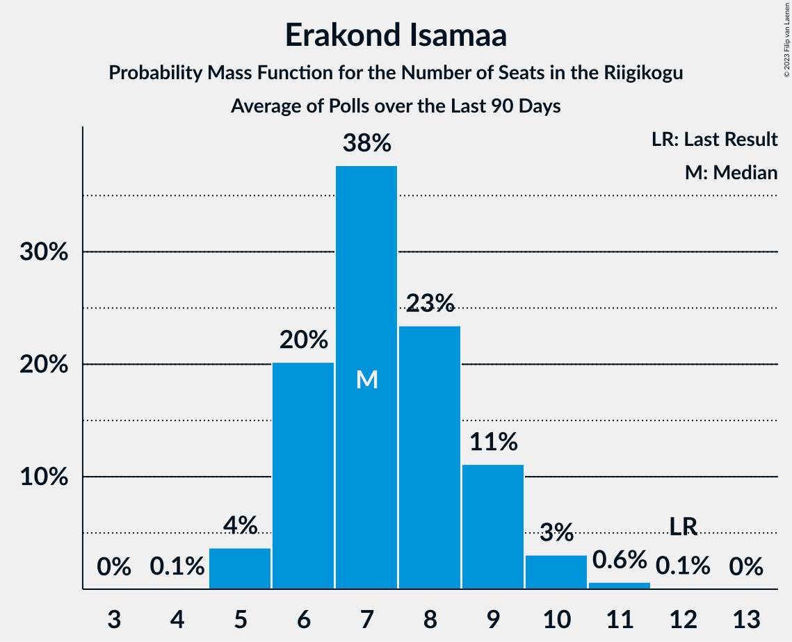

# Poll Average

<a href="#voting-intentions">Voting Intentions</a> | <a href="#seats">Seats</a> | <a href="#coalitions">Coalitions</a> | <a href="#technical-information">Technical Information</a>

## Summary

The table below lists the polls on which the average is based. They are the most recent polls (less than 90 days old) registered and analyzed so far.

| Period     | Polling firm/Commissioner(s) | Ref | Kesk | EKRE | I | SDE | E200 | Rohelised | EVA |
|:----------:|:----------------------------:|:--:|:--:|:--:|:--:|:--:|:--:|:--:|:--:|
| 3 March 2019 | General Election | 28.9%   34 | 23.1%   26 | 17.8%   19 | 11.4%   12 | 9.8%   10 | 4.4%   0 | 1.8%   0 | 1.2%   0 |
| N/A | Poll Average | 21–30%   23–34 | 12–20%   12–22 | 17–23%   17–26 | 4–8%   0–8 | 7–11%   6–11 | 15–24%   15–27 | 1–5%   0 | N/A   N/A |
| [19 March 2022](2022-03-19-Turu-uuringuteAS.html) | Turu-uuringute AS | 20–26%   22–29 | 12–17%   12–17 | 18–24%   20–26 | 5–9%   5–9 | 6–10%   6–10 | 19–25%   21–28 | 2–4%   0 | N/A   N/A |
| [14–18 March 2022](2022-03-18-Norstat.html) | Norstat   MTÜ Ühiskonnauuringute Instituut | 25–31%   28–35 | 15–20%   16–22 | 18–23%   19–25 | 4–7%   0–6 | 8–11%   7–11 | 14–19%   15–20 | 1–3%   0 | N/A   N/A |
| [10–16 March 2022](2022-03-16-KantarEmor.html) | Kantar Emor   ERR | 24–29%   26–32 | 16–20%   17–22 | 16–20%   17–22 | 5–7%   0–7 | 7–10%   6–9 | 17–21%   18–23 | 3–5%   0–4 | N/A   N/A |
| 3 March 2019 | General Election | 28.9%   34 | 23.1%   26 | 17.8%   19 | 11.4%   12 | 9.8%   10 | 4.4%   0 | 1.8%   0 | 1.2%   0 |

Only polls for which at least the sample size has been published are included in the table above.

**Legend:**
+ **Top half of each row:** Voting intentions (95% confidence interval)
+ **Bottom half of each row:** Seat projections for the Riigikogu (95% confidence interval)
+ **Ref:** Eesti Reformierakond
+ **Kesk:** Eesti Keskerakond
+ **EKRE:** Eesti Konservatiivne Rahvaerakond
+ **I:** Erakond Isamaa
+ **SDE:** Sotsiaaldemokraatlik Erakond
+ **E200:** Eesti 200
+ **Rohelised:** Erakond Eestimaa Rohelised
+ **EVA:** Eesti Vabaerakond
+ **N/A (single party):** Party not included the published results
+ **N/A (entire row):** Calculation for this opinion poll not started yet

## Voting Intentions

### Confidence Intervals

| Party | Last Result | Median | 80% Confidence Interval | 90% Confidence Interval | 95% Confidence Interval | 99% Confidence Interval |
|:-----:|:-----------:|:------:|:-----------------------:|:-----------------------:|:-----------------------:|:-----------------------:|
| <a href="#eesti-reformierakond">Eesti Reformierakond</a> | 28.9% | 26.1% | 22.3–28.9% |21.6–29.5% | 21.0–30.1% | 20.0–31.2% |
| <a href="#eesti-keskerakond">Eesti Keskerakond</a> | 23.1% | 17.2% | 13.4–19.1% |12.8–19.6% | 12.4–20.0% | 11.5–20.8% |
| <a href="#eesti-konservatiivne-rahvaerakond">Eesti Konservatiivne Rahvaerakond</a> | 17.8% | 20.0% | 17.6–22.3% |17.0–22.9% | 16.6–23.4% | 15.9–24.4% |
| <a href="#erakond-isamaa">Erakond Isamaa</a> | 11.4% | 6.1% | 4.8–7.7% |4.5–8.1% | 4.2–8.5% | 3.8–9.3% |
| <a href="#sotsiaaldemokraatlik-erakond">Sotsiaaldemokraatlik Erakond</a> | 9.8% | 8.5% | 7.2–10.0% |6.9–10.4% | 6.7–10.8% | 6.1–11.5% |
| <a href="#eesti-200">Eesti 200</a> | 4.4% | 19.2% | 15.9–22.9% |15.4–23.6% | 14.9–24.2% | 14.1–25.3% |
| <a href="#erakond-eestimaa-rohelised">Erakond Eestimaa Rohelised</a> | 1.8% | 2.6% | 1.5–4.4% |1.3–4.7% | 1.2–4.9% | 0.9–5.4% |
| <a href="#eesti-vabaerakond">Eesti Vabaerakond</a> | 1.2% | N/A | N/A |N/A | N/A | N/A |

### Eesti Reformierakond

*For a full overview of the results for this party, see the [Eesti Reformierakond](party-eestireformierakond.html) page.*

| Voting Intentions | Probability | Accumulated | Special Marks |
|:-----------------:|:-----------:|:-----------:|:-------------:|
| 17.5–18.5% | 0% | 100% |  |
| 18.5–19.5% | 0.2% | 100% |  |
| 19.5–20.5% | 1.1% | 99.8% |  |
| 20.5–21.5% | 4% | 98.7% |  |
| 21.5–22.5% | 7% | 95% |  |
| 22.5–23.5% | 9% | 88% |  |
| 23.5–24.5% | 10% | 79% |  |
| 24.5–25.5% | 11% | 69% |  |
| 25.5–26.5% | 15% | 58% | Median |
| 26.5–27.5% | 16% | 42% |  |
| 27.5–28.5% | 13% | 26% |  |
| 28.5–29.5% | 8% | 13% | Last Result |
| 29.5–30.5% | 4% | 5% |  |
| 30.5–31.5% | 1.1% | 1.4% |  |
| 31.5–32.5% | 0.2% | 0.3% |  |
| 32.5–33.5% | 0% | 0% |  |

### Eesti Keskerakond

*For a full overview of the results for this party, see the [Eesti Keskerakond](party-eestikeskerakond.html) page.*

| Voting Intentions | Probability | Accumulated | Special Marks |
|:-----------------:|:-----------:|:-----------:|:-------------:|
| 9.5–10.5% | 0% | 100% |  |
| 10.5–11.5% | 0.5% | 100% |  |
| 11.5–12.5% | 3% | 99.5% |  |
| 12.5–13.5% | 8% | 97% |  |
| 13.5–14.5% | 11% | 89% |  |
| 14.5–15.5% | 9% | 78% |  |
| 15.5–16.5% | 10% | 69% |  |
| 16.5–17.5% | 18% | 59% | Median |
| 17.5–18.5% | 22% | 42% |  |
| 18.5–19.5% | 14% | 20% |  |
| 19.5–20.5% | 5% | 5% |  |
| 20.5–21.5% | 0.8% | 0.9% |  |
| 21.5–22.5% | 0.1% | 0.1% |  |
| 22.5–23.5% | 0% | 0% | Last Result |

### Eesti Konservatiivne Rahvaerakond

*For a full overview of the results for this party, see the [Eesti Konservatiivne Rahvaerakond](party-eestikonservatiivnerahvaerakond.html) page.*

| Voting Intentions | Probability | Accumulated | Special Marks |
|:-----------------:|:-----------:|:-----------:|:-------------:|
| 13.5–14.5% | 0% | 100% |  |
| 14.5–15.5% | 0.2% | 100% |  |
| 15.5–16.5% | 2% | 99.8% |  |
| 16.5–17.5% | 8% | 98% |  |
| 17.5–18.5% | 14% | 90% | Last Result |
| 18.5–19.5% | 17% | 76% |  |
| 19.5–20.5% | 19% | 59% | Median |
| 20.5–21.5% | 19% | 40% |  |
| 21.5–22.5% | 13% | 20% |  |
| 22.5–23.5% | 6% | 8% |  |
| 23.5–24.5% | 2% | 2% |  |
| 24.5–25.5% | 0.3% | 0.4% |  |
| 25.5–26.5% | 0% | 0.1% |  |
| 26.5–27.5% | 0% | 0% |  |

### Erakond Isamaa

*For a full overview of the results for this party, see the [Erakond Isamaa](party-erakondisamaa.html) page.*

| Voting Intentions | Probability | Accumulated | Special Marks |
|:-----------------:|:-----------:|:-----------:|:-------------:|
| 1.5–2.5% | 0% | 100% |  |
| 2.5–3.5% | 0.2% | 100% |  |
| 3.5–4.5% | 6% | 99.8% |  |
| 4.5–5.5% | 25% | 94% |  |
| 5.5–6.5% | 35% | 69% | Median |
| 6.5–7.5% | 23% | 34% |  |
| 7.5–8.5% | 9% | 12% |  |
| 8.5–9.5% | 2% | 2% |  |
| 9.5–10.5% | 0.2% | 0.2% |  |
| 10.5–11.5% | 0% | 0% | Last Result |

### Sotsiaaldemokraatlik Erakond

*For a full overview of the results for this party, see the [Sotsiaaldemokraatlik Erakond](party-sotsiaaldemokraatlikerakond.html) page.*

| Voting Intentions | Probability | Accumulated | Special Marks |
|:-----------------:|:-----------:|:-----------:|:-------------:|
| 4.5–5.5% | 0% | 100% |  |
| 5.5–6.5% | 2% | 100% |  |
| 6.5–7.5% | 15% | 98% |  |
| 7.5–8.5% | 35% | 83% | Median |
| 8.5–9.5% | 30% | 48% |  |
| 9.5–10.5% | 14% | 18% | Last Result |
| 10.5–11.5% | 3% | 4% |  |
| 11.5–12.5% | 0.4% | 0.4% |  |
| 12.5–13.5% | 0% | 0% |  |

### Eesti 200

*For a full overview of the results for this party, see the [Eesti 200](party-eesti200.html) page.*

| Voting Intentions | Probability | Accumulated | Special Marks |
|:-----------------:|:-----------:|:-----------:|:-------------:|
| 3.5–4.5% | 0% | 100% | Last Result |
| 4.5–5.5% | 0% | 100% |  |
| 5.5–6.5% | 0% | 100% |  |
| 6.5–7.5% | 0% | 100% |  |
| 7.5–8.5% | 0% | 100% |  |
| 8.5–9.5% | 0% | 100% |  |
| 9.5–10.5% | 0% | 100% |  |
| 10.5–11.5% | 0% | 100% |  |
| 11.5–12.5% | 0% | 100% |  |
| 12.5–13.5% | 0.1% | 100% |  |
| 13.5–14.5% | 1.2% | 99.9% |  |
| 14.5–15.5% | 5% | 98.7% |  |
| 15.5–16.5% | 11% | 94% |  |
| 16.5–17.5% | 12% | 83% |  |
| 17.5–18.5% | 12% | 71% |  |
| 18.5–19.5% | 14% | 59% | Median |
| 19.5–20.5% | 12% | 45% |  |
| 20.5–21.5% | 10% | 32% |  |
| 21.5–22.5% | 10% | 22% |  |
| 22.5–23.5% | 7% | 12% |  |
| 23.5–24.5% | 4% | 5% |  |
| 24.5–25.5% | 1.3% | 2% |  |
| 25.5–26.5% | 0.3% | 0.4% |  |
| 26.5–27.5% | 0% | 0.1% |  |
| 27.5–28.5% | 0% | 0% |  |

### Erakond Eestimaa Rohelised

*For a full overview of the results for this party, see the [Erakond Eestimaa Rohelised](party-erakondeestimaarohelised.html) page.*

| Voting Intentions | Probability | Accumulated | Special Marks |
|:-----------------:|:-----------:|:-----------:|:-------------:|
| 0.0–0.5% | 0% | 100% |  |
| 0.5–1.5% | 14% | 100% |  |
| 1.5–2.5% | 35% | 86% | Last Result |
| 2.5–3.5% | 22% | 51% | Median |
| 3.5–4.5% | 23% | 29% |  |
| 4.5–5.5% | 6% | 6% |  |
| 5.5–6.5% | 0.2% | 0.2% |  |
| 6.5–7.5% | 0% | 0% |  |

## Seats

### Confidence Intervals

| Party | Last Result | Median | 80% Confidence Interval | 90% Confidence Interval | 95% Confidence Interval | 99% Confidence Interval |
|:-----:|:-----------:|:------:|:-----------------------:|:-----------------------:|:-----------------------:|:-----------------------:|
| <a href="#eesti-reformierakond">Eesti Reformierakond</a> | 34 | 29 | 24–33 |23–33 | 23–34 | 22–36 |
| <a href="#eesti-keskerakond">Eesti Keskerakond</a> | 26 | 18 | 14–20 |13–21 | 12–22 | 12–22 |
| <a href="#eesti-konservatiivne-rahvaerakond">Eesti Konservatiivne Rahvaerakond</a> | 19 | 21 | 18–24 |18–25 | 17–26 | 17–27 |
| <a href="#erakond-isamaa">Erakond Isamaa</a> | 12 | 5 | 0–7 |0–8 | 0–8 | 0–9 |
| <a href="#sotsiaaldemokraatlik-erakond">Sotsiaaldemokraatlik Erakond</a> | 10 | 8 | 7–10 |6–10 | 6–11 | 5–11 |
| <a href="#eesti-200">Eesti 200</a> | 0 | 20 | 16–25 |16–26 | 15–27 | 14–28 |
| <a href="#erakond-eestimaa-rohelised">Erakond Eestimaa Rohelised</a> | 0 | 0 | 0 |0 | 0 | 0–4 |
| <a href="#eesti-vabaerakond">Eesti Vabaerakond</a> | 0 | N/A | N/A |N/A | N/A | N/A |

### Eesti Reformierakond

*For a full overview of the results for this party, see the [Eesti Reformierakond](party-eestireformierakond.html) page.*

| Number of Seats | Probability | Accumulated | Special Marks |
|:---------------:|:-----------:|:-----------:|:-------------:|
| 20 | 0.1% | 100% |  |
| 21 | 0.4% | 99.9% |  |
| 22 | 1.4% | 99.5% |  |
| 23 | 3% | 98% |  |
| 24 | 6% | 95% |  |
| 25 | 7% | 89% |  |
| 26 | 8% | 82% |  |
| 27 | 9% | 74% |  |
| 28 | 10% | 65% |  |
| 29 | 13% | 55% | Median |
| 30 | 14% | 42% |  |
| 31 | 11% | 28% |  |
| 32 | 7% | 17% |  |
| 33 | 6% | 10% |  |
| 34 | 3% | 4% | Last Result |
| 35 | 1.1% | 2% |  |
| 36 | 0.4% | 0.5% |  |
| 37 | 0.1% | 0.1% |  |
| 38 | 0% | 0% |  |

### Eesti Keskerakond

*For a full overview of the results for this party, see the [Eesti Keskerakond](party-eestikeskerakond.html) page.*

| Number of Seats | Probability | Accumulated | Special Marks |
|:---------------:|:-----------:|:-----------:|:-------------:|
| 10 | 0.1% | 100% |  |
| 11 | 0.4% | 99.9% |  |
| 12 | 3% | 99.5% |  |
| 13 | 5% | 97% |  |
| 14 | 10% | 92% |  |
| 15 | 8% | 82% |  |
| 16 | 8% | 74% |  |
| 17 | 10% | 66% |  |
| 18 | 17% | 56% | Median |
| 19 | 19% | 39% |  |
| 20 | 12% | 21% |  |
| 21 | 6% | 9% |  |
| 22 | 2% | 3% |  |
| 23 | 0.4% | 0.5% |  |
| 24 | 0.1% | 0.1% |  |
| 25 | 0% | 0% |  |
| 26 | 0% | 0% | Last Result |

### Eesti Konservatiivne Rahvaerakond

*For a full overview of the results for this party, see the [Eesti Konservatiivne Rahvaerakond](party-eestikonservatiivnerahvaerakond.html) page.*

| Number of Seats | Probability | Accumulated | Special Marks |
|:---------------:|:-----------:|:-----------:|:-------------:|
| 15 | 0.1% | 100% |  |
| 16 | 0.4% | 99.9% |  |
| 17 | 3% | 99.5% |  |
| 18 | 8% | 97% |  |
| 19 | 9% | 89% | Last Result |
| 20 | 14% | 79% |  |
| 21 | 16% | 65% | Median |
| 22 | 16% | 50% |  |
| 23 | 15% | 34% |  |
| 24 | 10% | 18% |  |
| 25 | 5% | 9% |  |
| 26 | 2% | 3% |  |
| 27 | 0.7% | 1.0% |  |
| 28 | 0.2% | 0.2% |  |
| 29 | 0% | 0% |  |

### Erakond Isamaa

*For a full overview of the results for this party, see the [Erakond Isamaa](party-erakondisamaa.html) page.*

| Number of Seats | Probability | Accumulated | Special Marks |
|:---------------:|:-----------:|:-----------:|:-------------:|
| 0 | 15% | 100% |  |
| 1 | 0% | 85% |  |
| 2 | 0% | 85% |  |
| 3 | 0% | 85% |  |
| 4 | 9% | 85% |  |
| 5 | 32% | 76% | Median |
| 6 | 25% | 44% |  |
| 7 | 13% | 19% |  |
| 8 | 4% | 6% |  |
| 9 | 1.0% | 1.1% |  |
| 10 | 0.1% | 0.1% |  |
| 11 | 0% | 0% |  |
| 12 | 0% | 0% | Last Result |

### Sotsiaaldemokraatlik Erakond

*For a full overview of the results for this party, see the [Sotsiaaldemokraatlik Erakond](party-sotsiaaldemokraatlikerakond.html) page.*

| Number of Seats | Probability | Accumulated | Special Marks |
|:---------------:|:-----------:|:-----------:|:-------------:|
| 5 | 0.7% | 100% |  |
| 6 | 8% | 99.3% |  |
| 7 | 25% | 91% |  |
| 8 | 33% | 66% | Median |
| 9 | 21% | 33% |  |
| 10 | 9% | 12% | Last Result |
| 11 | 2% | 3% |  |
| 12 | 0.4% | 0.4% |  |
| 13 | 0% | 0% |  |

### Eesti 200

*For a full overview of the results for this party, see the [Eesti 200](party-eesti200.html) page.*

| Number of Seats | Probability | Accumulated | Special Marks |
|:---------------:|:-----------:|:-----------:|:-------------:|
| 0 | 0% | 100% | Last Result |
| 1 | 0% | 100% |  |
| 2 | 0% | 100% |  |
| 3 | 0% | 100% |  |
| 4 | 0% | 100% |  |
| 5 | 0% | 100% |  |
| 6 | 0% | 100% |  |
| 7 | 0% | 100% |  |
| 8 | 0% | 100% |  |
| 9 | 0% | 100% |  |
| 10 | 0% | 100% |  |
| 11 | 0% | 100% |  |
| 12 | 0% | 100% |  |
| 13 | 0.1% | 100% |  |
| 14 | 0.7% | 99.9% |  |
| 15 | 3% | 99.2% |  |
| 16 | 7% | 97% |  |
| 17 | 9% | 89% |  |
| 18 | 10% | 80% |  |
| 19 | 9% | 70% |  |
| 20 | 12% | 61% | Median |
| 21 | 12% | 49% |  |
| 22 | 8% | 38% |  |
| 23 | 8% | 30% |  |
| 24 | 8% | 22% |  |
| 25 | 6% | 13% |  |
| 26 | 5% | 8% |  |
| 27 | 2% | 3% |  |
| 28 | 0.7% | 1.0% |  |
| 29 | 0.3% | 0.3% |  |
| 30 | 0.1% | 0.1% |  |
| 31 | 0% | 0% |  |

### Erakond Eestimaa Rohelised

*For a full overview of the results for this party, see the [Erakond Eestimaa Rohelised](party-erakondeestimaarohelised.html) page.*

| Number of Seats | Probability | Accumulated | Special Marks |
|:---------------:|:-----------:|:-----------:|:-------------:|
| 0 | 98% | 100% | Last Result, Median |
| 1 | 0% | 2% |  |
| 2 | 0% | 2% |  |
| 3 | 0% | 2% |  |
| 4 | 1.1% | 2% |  |
| 5 | 0.4% | 0.4% |  |
| 6 | 0% | 0% |  |

### Eesti Vabaerakond

*For a full overview of the results for this party, see the [Eesti Vabaerakond](party-eestivabaerakond.html) page.*

## Coalitions

### Confidence Intervals

| Coalition | Last Result | Median | Majority? | 80% Confidence Interval | 90% Confidence Interval | 95% Confidence Interval | 99% Confidence Interval |
|:---------:|:-----------:|:------:|:---------:|:-----------------------:|:-----------------------:|:-----------------------:|:-----------------------:|
| Eesti Reformierakond – Eesti Keskerakond – Eesti Konservatiivne Rahvaerakond | 79 | 68 | 100% | 62–73 | 61–75 | 60–76 | 58–77 |
| Eesti Reformierakond – Eesti Konservatiivne Rahvaerakond – Erakond Isamaa | 65 | 55 | 97% | 52–58 | 51–59 | 50–59 | 49–61 |
| Eesti Reformierakond – Eesti Konservatiivne Rahvaerakond | 53 | 50 | 39% | 46–55 | 46–56 | 45–57 | 43–58 |
| Eesti Reformierakond – Eesti Keskerakond | 60 | 48 | 17% | 39–51 | 38–52 | 37–53 | 35–55 |
| Eesti Keskerakond – Eesti Konservatiivne Rahvaerakond – Erakond Isamaa | 57 | 44 | 0% | 41–46 | 40–47 | 39–48 | 38–49 |
| Eesti Reformierakond – Erakond Isamaa – Sotsiaaldemokraatlik Erakond – Eesti Vabaerakond | 56 | 42 | 0% | 38–45 | 37–46 | 36–46 | 35–48 |
| Eesti Reformierakond – Erakond Isamaa – Sotsiaaldemokraatlik Erakond | 56 | 42 | 0% | 38–45 | 37–46 | 36–46 | 35–48 |
| Eesti Keskerakond – Eesti Konservatiivne Rahvaerakond | 45 | 39 | 0% | 36–42 | 35–43 | 34–44 | 33–45 |
| Eesti Reformierakond – Sotsiaaldemokraatlik Erakond | 44 | 37 | 0% | 32–41 | 31–42 | 30–43 | 29–45 |
| Eesti Reformierakond – Erakond Isamaa | 46 | 34 | 0% | 30–36 | 30–37 | 29–38 | 27–39 |
| Eesti Keskerakond – Erakond Isamaa – Sotsiaaldemokraatlik Erakond | 48 | 30 | 0% | 27–33 | 26–34 | 26–35 | 24–36 |
| Eesti Konservatiivne Rahvaerakond – Sotsiaaldemokraatlik Erakond | 29 | 30 | 0% | 26–33 | 25–34 | 25–34 | 24–36 |
| Eesti Keskerakond – Sotsiaaldemokraatlik Erakond | 36 | 26 | 0% | 21–29 | 20–30 | 20–30 | 19–32 |

### Eesti Reformierakond – Eesti Keskerakond – Eesti Konservatiivne Rahvaerakond

| Number of Seats | Probability | Accumulated | Special Marks |
|:---------------:|:-----------:|:-----------:|:-------------:|
| 57 | 0.2% | 100% |  |
| 58 | 0.4% | 99.8% |  |
| 59 | 1.2% | 99.3% |  |
| 60 | 3% | 98% |  |
| 61 | 4% | 95% |  |
| 62 | 7% | 91% |  |
| 63 | 7% | 84% |  |
| 64 | 6% | 78% |  |
| 65 | 6% | 72% |  |
| 66 | 7% | 65% |  |
| 67 | 9% | 59% |  |
| 68 | 9% | 50% | Median |
| 69 | 8% | 41% |  |
| 70 | 7% | 33% |  |
| 71 | 7% | 26% |  |
| 72 | 6% | 19% |  |
| 73 | 4% | 14% |  |
| 74 | 4% | 9% |  |
| 75 | 3% | 5% |  |
| 76 | 2% | 3% |  |
| 77 | 0.8% | 1.0% |  |
| 78 | 0.2% | 0.2% |  |
| 79 | 0% | 0% | Last Result |

### Eesti Reformierakond – Eesti Konservatiivne Rahvaerakond – Erakond Isamaa

| Number of Seats | Probability | Accumulated | Special Marks |
|:---------------:|:-----------:|:-----------:|:-------------:|
| 47 | 0.1% | 100% |  |
| 48 | 0.2% | 99.9% |  |
| 49 | 0.5% | 99.8% |  |
| 50 | 2% | 99.2% |  |
| 51 | 4% | 97% | Majority |
| 52 | 7% | 93% |  |
| 53 | 13% | 86% |  |
| 54 | 17% | 73% |  |
| 55 | 16% | 56% | Median |
| 56 | 16% | 40% |  |
| 57 | 11% | 24% |  |
| 58 | 7% | 13% |  |
| 59 | 4% | 7% |  |
| 60 | 2% | 2% |  |
| 61 | 0.6% | 0.7% |  |
| 62 | 0.1% | 0.2% |  |
| 63 | 0% | 0% |  |
| 64 | 0% | 0% |  |
| 65 | 0% | 0% | Last Result |

### Eesti Reformierakond – Eesti Konservatiivne Rahvaerakond

| Number of Seats | Probability | Accumulated | Special Marks |
|:---------------:|:-----------:|:-----------:|:-------------:|
| 42 | 0.1% | 100% |  |
| 43 | 0.4% | 99.9% |  |
| 44 | 1.2% | 99.5% |  |
| 45 | 3% | 98% |  |
| 46 | 7% | 95% |  |
| 47 | 10% | 88% |  |
| 48 | 14% | 79% |  |
| 49 | 13% | 64% |  |
| 50 | 11% | 51% | Median |
| 51 | 9% | 39% | Majority |
| 52 | 7% | 30% |  |
| 53 | 6% | 23% | Last Result |
| 54 | 6% | 17% |  |
| 55 | 4% | 11% |  |
| 56 | 3% | 7% |  |
| 57 | 2% | 3% |  |
| 58 | 0.9% | 1.4% |  |
| 59 | 0.3% | 0.5% |  |
| 60 | 0.1% | 0.1% |  |
| 61 | 0% | 0% |  |

### Eesti Reformierakond – Eesti Keskerakond

| Number of Seats | Probability | Accumulated | Special Marks |
|:---------------:|:-----------:|:-----------:|:-------------:|
| 34 | 0.1% | 100% |  |
| 35 | 0.4% | 99.9% |  |
| 36 | 1.1% | 99.4% |  |
| 37 | 3% | 98% |  |
| 38 | 5% | 96% |  |
| 39 | 6% | 91% |  |
| 40 | 7% | 85% |  |
| 41 | 5% | 78% |  |
| 42 | 3% | 73% |  |
| 43 | 2% | 70% |  |
| 44 | 1.4% | 68% |  |
| 45 | 2% | 66% |  |
| 46 | 5% | 64% |  |
| 47 | 9% | 60% | Median |
| 48 | 12% | 51% |  |
| 49 | 13% | 39% |  |
| 50 | 10% | 27% |  |
| 51 | 7% | 17% | Majority |
| 52 | 5% | 9% |  |
| 53 | 3% | 5% |  |
| 54 | 1.1% | 2% |  |
| 55 | 0.4% | 0.6% |  |
| 56 | 0.2% | 0.2% |  |
| 57 | 0% | 0% |  |
| 58 | 0% | 0% |  |
| 59 | 0% | 0% |  |
| 60 | 0% | 0% | Last Result |

### Eesti Keskerakond – Eesti Konservatiivne Rahvaerakond – Erakond Isamaa

| Number of Seats | Probability | Accumulated | Special Marks |
|:---------------:|:-----------:|:-----------:|:-------------:|
| 36 | 0% | 100% |  |
| 37 | 0.2% | 99.9% |  |
| 38 | 0.8% | 99.7% |  |
| 39 | 2% | 99.0% |  |
| 40 | 5% | 97% |  |
| 41 | 8% | 93% |  |
| 42 | 13% | 85% |  |
| 43 | 17% | 72% |  |
| 44 | 20% | 55% | Median |
| 45 | 16% | 35% |  |
| 46 | 10% | 19% |  |
| 47 | 5% | 8% |  |
| 48 | 2% | 3% |  |
| 49 | 0.7% | 0.9% |  |
| 50 | 0.2% | 0.2% |  |
| 51 | 0% | 0% | Majority |
| 52 | 0% | 0% |  |
| 53 | 0% | 0% |  |
| 54 | 0% | 0% |  |
| 55 | 0% | 0% |  |
| 56 | 0% | 0% |  |
| 57 | 0% | 0% | Last Result |

### Eesti Reformierakond – Erakond Isamaa – Sotsiaaldemokraatlik Erakond – Eesti Vabaerakond

| Number of Seats | Probability | Accumulated | Special Marks |
|:---------------:|:-----------:|:-----------:|:-------------:|
| 33 | 0.1% | 100% |  |
| 34 | 0.2% | 99.9% |  |
| 35 | 0.6% | 99.7% |  |
| 36 | 2% | 99.1% |  |
| 37 | 4% | 97% |  |
| 38 | 6% | 93% |  |
| 39 | 9% | 88% |  |
| 40 | 13% | 79% |  |
| 41 | 15% | 67% |  |
| 42 | 17% | 52% | Median |
| 43 | 13% | 35% |  |
| 44 | 10% | 21% |  |
| 45 | 6% | 11% |  |
| 46 | 3% | 5% |  |
| 47 | 2% | 2% |  |
| 48 | 0.6% | 0.8% |  |
| 49 | 0.2% | 0.2% |  |
| 50 | 0% | 0% |  |
| 51 | 0% | 0% | Majority |
| 52 | 0% | 0% |  |
| 53 | 0% | 0% |  |
| 54 | 0% | 0% |  |
| 55 | 0% | 0% |  |
| 56 | 0% | 0% | Last Result |

### Eesti Reformierakond – Erakond Isamaa – Sotsiaaldemokraatlik Erakond

| Number of Seats | Probability | Accumulated | Special Marks |
|:---------------:|:-----------:|:-----------:|:-------------:|
| 33 | 0.1% | 100% |  |
| 34 | 0.2% | 99.9% |  |
| 35 | 0.6% | 99.7% |  |
| 36 | 2% | 99.1% |  |
| 37 | 4% | 97% |  |
| 38 | 6% | 93% |  |
| 39 | 9% | 88% |  |
| 40 | 13% | 79% |  |
| 41 | 15% | 67% |  |
| 42 | 17% | 52% | Median |
| 43 | 13% | 35% |  |
| 44 | 10% | 21% |  |
| 45 | 6% | 11% |  |
| 46 | 3% | 5% |  |
| 47 | 2% | 2% |  |
| 48 | 0.6% | 0.8% |  |
| 49 | 0.2% | 0.2% |  |
| 50 | 0% | 0% |  |
| 51 | 0% | 0% | Majority |
| 52 | 0% | 0% |  |
| 53 | 0% | 0% |  |
| 54 | 0% | 0% |  |
| 55 | 0% | 0% |  |
| 56 | 0% | 0% | Last Result |

### Eesti Keskerakond – Eesti Konservatiivne Rahvaerakond

| Number of Seats | Probability | Accumulated | Special Marks |
|:---------------:|:-----------:|:-----------:|:-------------:|
| 31 | 0% | 100% |  |
| 32 | 0.2% | 99.9% |  |
| 33 | 0.8% | 99.7% |  |
| 34 | 2% | 99.0% |  |
| 35 | 4% | 97% |  |
| 36 | 9% | 93% |  |
| 37 | 13% | 84% |  |
| 38 | 18% | 71% |  |
| 39 | 15% | 53% | Median |
| 40 | 15% | 38% |  |
| 41 | 10% | 23% |  |
| 42 | 6% | 13% |  |
| 43 | 3% | 7% |  |
| 44 | 2% | 3% |  |
| 45 | 0.8% | 1.2% | Last Result |
| 46 | 0.3% | 0.4% |  |
| 47 | 0.1% | 0.1% |  |
| 48 | 0% | 0% |  |

### Eesti Reformierakond – Sotsiaaldemokraatlik Erakond

| Number of Seats | Probability | Accumulated | Special Marks |
|:---------------:|:-----------:|:-----------:|:-------------:|
| 27 | 0.1% | 100% |  |
| 28 | 0.3% | 99.9% |  |
| 29 | 0.9% | 99.7% |  |
| 30 | 2% | 98.7% |  |
| 31 | 4% | 97% |  |
| 32 | 6% | 92% |  |
| 33 | 7% | 86% |  |
| 34 | 8% | 79% |  |
| 35 | 8% | 71% |  |
| 36 | 10% | 63% |  |
| 37 | 11% | 52% | Median |
| 38 | 10% | 41% |  |
| 39 | 8% | 31% |  |
| 40 | 8% | 23% |  |
| 41 | 6% | 16% |  |
| 42 | 4% | 9% |  |
| 43 | 3% | 5% |  |
| 44 | 1.4% | 2% | Last Result |
| 45 | 0.6% | 0.8% |  |
| 46 | 0.2% | 0.2% |  |
| 47 | 0% | 0% |  |

### Eesti Reformierakond – Erakond Isamaa

| Number of Seats | Probability | Accumulated | Special Marks |
|:---------------:|:-----------:|:-----------:|:-------------:|
| 25 | 0% | 100% |  |
| 26 | 0.1% | 99.9% |  |
| 27 | 0.3% | 99.8% |  |
| 28 | 1.3% | 99.5% |  |
| 29 | 3% | 98% |  |
| 30 | 6% | 95% |  |
| 31 | 9% | 89% |  |
| 32 | 13% | 79% |  |
| 33 | 15% | 66% |  |
| 34 | 16% | 51% | Median |
| 35 | 16% | 35% |  |
| 36 | 10% | 19% |  |
| 37 | 6% | 9% |  |
| 38 | 2% | 3% |  |
| 39 | 1.0% | 1.2% |  |
| 40 | 0.2% | 0.2% |  |
| 41 | 0% | 0% |  |
| 42 | 0% | 0% |  |
| 43 | 0% | 0% |  |
| 44 | 0% | 0% |  |
| 45 | 0% | 0% |  |
| 46 | 0% | 0% | Last Result |

### Eesti Keskerakond – Erakond Isamaa – Sotsiaaldemokraatlik Erakond

| Number of Seats | Probability | Accumulated | Special Marks |
|:---------------:|:-----------:|:-----------:|:-------------:|
| 22 | 0% | 100% |  |
| 23 | 0.1% | 99.9% |  |
| 24 | 0.5% | 99.8% |  |
| 25 | 2% | 99.3% |  |
| 26 | 5% | 98% |  |
| 27 | 8% | 93% |  |
| 28 | 11% | 85% |  |
| 29 | 13% | 75% |  |
| 30 | 13% | 62% |  |
| 31 | 16% | 49% | Median |
| 32 | 13% | 33% |  |
| 33 | 12% | 20% |  |
| 34 | 6% | 9% |  |
| 35 | 3% | 3% |  |
| 36 | 0.6% | 0.7% |  |
| 37 | 0.1% | 0.2% |  |
| 38 | 0% | 0% |  |
| 39 | 0% | 0% |  |
| 40 | 0% | 0% |  |
| 41 | 0% | 0% |  |
| 42 | 0% | 0% |  |
| 43 | 0% | 0% |  |
| 44 | 0% | 0% |  |
| 45 | 0% | 0% |  |
| 46 | 0% | 0% |  |
| 47 | 0% | 0% |  |
| 48 | 0% | 0% | Last Result |

### Eesti Konservatiivne Rahvaerakond – Sotsiaaldemokraatlik Erakond

| Number of Seats | Probability | Accumulated | Special Marks |
|:---------------:|:-----------:|:-----------:|:-------------:|
| 22 | 0% | 100% |  |
| 23 | 0.3% | 99.9% |  |
| 24 | 2% | 99.6% |  |
| 25 | 4% | 98% |  |
| 26 | 9% | 94% |  |
| 27 | 9% | 85% |  |
| 28 | 12% | 76% |  |
| 29 | 13% | 64% | Last Result, Median |
| 30 | 14% | 51% |  |
| 31 | 13% | 37% |  |
| 32 | 11% | 24% |  |
| 33 | 7% | 13% |  |
| 34 | 3% | 5% |  |
| 35 | 2% | 2% |  |
| 36 | 0.6% | 0.7% |  |
| 37 | 0.1% | 0.1% |  |
| 38 | 0% | 0% |  |

### Eesti Keskerakond – Sotsiaaldemokraatlik Erakond

| Number of Seats | Probability | Accumulated | Special Marks |
|:---------------:|:-----------:|:-----------:|:-------------:|
| 17 | 0.1% | 100% |  |
| 18 | 0.3% | 99.9% |  |
| 19 | 2% | 99.6% |  |
| 20 | 4% | 98% |  |
| 21 | 6% | 94% |  |
| 22 | 8% | 88% |  |
| 23 | 7% | 79% |  |
| 24 | 7% | 73% |  |
| 25 | 9% | 65% |  |
| 26 | 15% | 56% | Median |
| 27 | 15% | 42% |  |
| 28 | 13% | 27% |  |
| 29 | 8% | 13% |  |
| 30 | 4% | 6% |  |
| 31 | 1.4% | 2% |  |
| 32 | 0.4% | 0.5% |  |
| 33 | 0.1% | 0.1% |  |
| 34 | 0% | 0% |  |
| 35 | 0% | 0% |  |
| 36 | 0% | 0% | Last Result |

## Technical Information

+ **Number of polls included in this average:** 3
+ **Lowest number of simulations done in a poll included in this average:** 1,048,576
+ **Total number of simulations done in the polls included in this average:** 3,145,728
+ **Error estimate:** 1.40%
