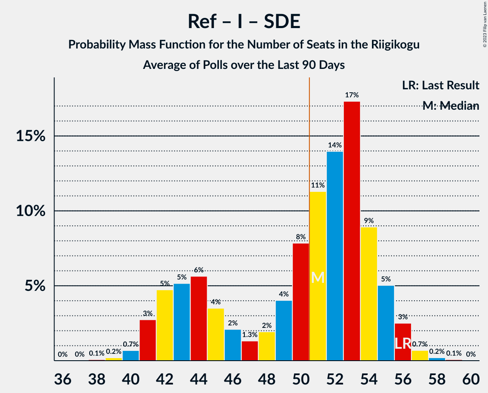

# Poll Average

<a href="#voting-intentions">Voting Intentions</a> | <a href="#seats">Seats</a> | <a href="#coalitions">Coalitions</a> | <a href="#technical-information">Technical Information</a>

## Summary

The table below lists the polls on which the average is based. They are the most recent polls (less than 90 days old) registered and analyzed so far.

| Period     | Polling firm/Commissioner(s) | Ref | Kesk | EKRE | I | SDE | E200 | Rohelised | EVA |
|:----------:|:----------------------------:|:--:|:--:|:--:|:--:|:--:|:--:|:--:|:--:|
| 3 March 2019 | General Election | 28.9%   34 | 23.1%   26 | 17.8%   19 | 11.4%   12 | 9.8%   10 | 4.4%   0 | 1.8%   0 | 1.2%   0 |
| N/A | Poll Average | 26–36%   30–43 | 17–29%   19–32 | 14–21%   15–23 | 2–7%   0–6 | 7–11%   6–12 | 6–14%   5–16 | 1–4%   0 | 0–1%   0 |
| [14–20 July 2020](2020-07-20-Norstat.html) | Norstat   MTÜ Ühiskonnauuringute Instituut | 31–37%   35–43 | 21–26%   23–29 | 15–19%   15–20 | 4–7%   0–7 | 7–11%   6–10 | 5–9%   5–8 | 2–3%   0 | 0–1%   0 |
| [1–30 June 2020](2020-06-30-KantarEmor.html) | Kantar Emor   BNS and Postimees | 26–30%   29–36 | 17–21%   18–24 | 17–21%   18–24 | 4–6%   0–6 | 8–12%   8–12 | 11–15%   11–16 | 2–4%   0 | 0–1%   0 |
| [9–15 June 2020](2020-06-15-Turu-uuringuteAS.html) | Turu-uuringute AS   ERR | 30–36%   35–41 | 25–30%   27–34 | 14–19%   14–20 | 2–4%   0 | 7–10%   6–9 | 7–11%   7–11 | 1–3%   0 | 0–1%   0 |
| 3 March 2019 | General Election | 28.9%   34 | 23.1%   26 | 17.8%   19 | 11.4%   12 | 9.8%   10 | 4.4%   0 | 1.8%   0 | 1.2%   0 |

Only polls for which at least the sample size has been published are included in the table above.

**Legend:**
+ **Top half of each row:** Voting intentions (95% confidence interval)
+ **Bottom half of each row:** Seat projections for the Riigikogu (95% confidence interval)
+ **Ref:** Eesti Reformierakond
+ **Kesk:** Eesti Keskerakond
+ **EKRE:** Eesti Konservatiivne Rahvaerakond
+ **I:** Erakond Isamaa
+ **SDE:** Sotsiaaldemokraatlik Erakond
+ **E200:** Eesti 200
+ **Rohelised:** Erakond Eestimaa Rohelised
+ **EVA:** Eesti Vabaerakond
+ **N/A (single party):** Party not included the published results
+ **N/A (entire row):** Calculation for this opinion poll not started yet

## Voting Intentions

### Confidence Intervals

| Party | Last Result | Median | 80% Confidence Interval | 90% Confidence Interval | 95% Confidence Interval | 99% Confidence Interval |
|:-----:|:-----------:|:------:|:-----------------------:|:-----------------------:|:-----------------------:|:-----------------------:|
| <a href="#eesti-reformierakond">Eesti Reformierakond</a> | 28.9% | 32.6% | 27.3–35.3% |26.6–35.9% | 26.2–36.4% | 25.3–37.4% |
| <a href="#eesti-keskerakond">Eesti Keskerakond</a> | 23.1% | 23.5% | 18.4–28.0% |17.8–28.7% | 17.4–29.3% | 16.7–30.3% |
| <a href="#eesti-konservatiivne-rahvaerakond">Eesti Konservatiivne Rahvaerakond</a> | 17.8% | 17.2% | 15.3–19.6% |14.8–20.1% | 14.4–20.6% | 13.7–21.4% |
| <a href="#erakond-isamaa">Erakond Isamaa</a> | 11.4% | 4.8% | 2.8–6.1% |2.5–6.5% | 2.3–6.8% | 2.0–7.4% |
| <a href="#sotsiaaldemokraatlik-erakond">Sotsiaaldemokraatlik Erakond</a> | 9.8% | 8.9% | 7.5–10.5% |7.2–10.9% | 6.9–11.3% | 6.3–11.9% |
| <a href="#eesti-200">Eesti 200</a> | 4.4% | 9.1% | 6.5–13.5% |6.1–14.0% | 5.9–14.4% | 5.3–15.1% |
| <a href="#erakond-eestimaa-rohelised">Erakond Eestimaa Rohelised</a> | 1.8% | 2.5% | 1.7–3.4% |1.6–3.6% | 1.4–3.8% | 1.2–4.2% |
| <a href="#eesti-vabaerakond">Eesti Vabaerakond</a> | 1.2% | 0.3% | 0.2–0.6% |0.1–0.7% | 0.1–0.8% | 0.1–1.0% |

### Eesti Reformierakond

*For a full overview of the results for this party, see the [Eesti Reformierakond](party-eestireformierakond.html) page.*

| Voting Intentions | Probability | Accumulated | Special Marks |
|:-----------------:|:-----------:|:-----------:|:-------------:|
| 22.5–23.5% | 0% | 100% |  |
| 23.5–24.5% | 0.1% | 100% |  |
| 24.5–25.5% | 0.8% | 99.9% |  |
| 25.5–26.5% | 4% | 99.1% |  |
| 26.5–27.5% | 8% | 96% |  |
| 27.5–28.5% | 10% | 87% |  |
| 28.5–29.5% | 7% | 77% | Last Result |
| 29.5–30.5% | 4% | 70% |  |
| 30.5–31.5% | 5% | 66% |  |
| 31.5–32.5% | 10% | 61% |  |
| 32.5–33.5% | 16% | 51% | Median |
| 33.5–34.5% | 17% | 35% |  |
| 34.5–35.5% | 11% | 19% |  |
| 35.5–36.5% | 5% | 7% |  |
| 36.5–37.5% | 2% | 2% |  |
| 37.5–38.5% | 0.4% | 0.4% |  |
| 38.5–39.5% | 0.1% | 0.1% |  |
| 39.5–40.5% | 0% | 0% |  |

### Eesti Keskerakond

*For a full overview of the results for this party, see the [Eesti Keskerakond](party-eestikeskerakond.html) page.*

| Voting Intentions | Probability | Accumulated | Special Marks |
|:-----------------:|:-----------:|:-----------:|:-------------:|
| 14.5–15.5% | 0% | 100% |  |
| 15.5–16.5% | 0.4% | 100% |  |
| 16.5–17.5% | 3% | 99.6% |  |
| 17.5–18.5% | 9% | 97% |  |
| 18.5–19.5% | 12% | 88% |  |
| 19.5–20.5% | 8% | 76% |  |
| 20.5–21.5% | 4% | 69% |  |
| 21.5–22.5% | 6% | 65% |  |
| 22.5–23.5% | 9% | 59% | Last Result |
| 23.5–24.5% | 10% | 50% | Median |
| 24.5–25.5% | 8% | 40% |  |
| 25.5–26.5% | 9% | 32% |  |
| 26.5–27.5% | 10% | 23% |  |
| 27.5–28.5% | 8% | 14% |  |
| 28.5–29.5% | 4% | 6% |  |
| 29.5–30.5% | 1.4% | 2% |  |
| 30.5–31.5% | 0.3% | 0.3% |  |
| 31.5–32.5% | 0% | 0% |  |
| 32.5–33.5% | 0% | 0% |  |

### Eesti Konservatiivne Rahvaerakond

*For a full overview of the results for this party, see the [Eesti Konservatiivne Rahvaerakond](party-eestikonservatiivnerahvaerakond.html) page.*

| Voting Intentions | Probability | Accumulated | Special Marks |
|:-----------------:|:-----------:|:-----------:|:-------------:|
| 11.5–12.5% | 0% | 100% |  |
| 12.5–13.5% | 0.3% | 100% |  |
| 13.5–14.5% | 3% | 99.7% |  |
| 14.5–15.5% | 11% | 97% |  |
| 15.5–16.5% | 21% | 86% |  |
| 16.5–17.5% | 22% | 65% | Median |
| 17.5–18.5% | 19% | 44% | Last Result |
| 18.5–19.5% | 15% | 25% |  |
| 19.5–20.5% | 8% | 10% |  |
| 20.5–21.5% | 2% | 3% |  |
| 21.5–22.5% | 0.3% | 0.4% |  |
| 22.5–23.5% | 0% | 0% |  |

### Erakond Isamaa

*For a full overview of the results for this party, see the [Erakond Isamaa](party-erakondisamaa.html) page.*

| Voting Intentions | Probability | Accumulated | Special Marks |
|:-----------------:|:-----------:|:-----------:|:-------------:|
| 0.5–1.5% | 0% | 100% |  |
| 1.5–2.5% | 5% | 100% |  |
| 2.5–3.5% | 22% | 95% |  |
| 3.5–4.5% | 15% | 73% |  |
| 4.5–5.5% | 32% | 58% | Median |
| 5.5–6.5% | 21% | 25% |  |
| 6.5–7.5% | 4% | 4% |  |
| 7.5–8.5% | 0.3% | 0.3% |  |
| 8.5–9.5% | 0% | 0% |  |
| 9.5–10.5% | 0% | 0% |  |
| 10.5–11.5% | 0% | 0% | Last Result |

### Sotsiaaldemokraatlik Erakond

*For a full overview of the results for this party, see the [Sotsiaaldemokraatlik Erakond](party-sotsiaaldemokraatlikerakond.html) page.*

| Voting Intentions | Probability | Accumulated | Special Marks |
|:-----------------:|:-----------:|:-----------:|:-------------:|
| 4.5–5.5% | 0% | 100% |  |
| 5.5–6.5% | 1.0% | 100% |  |
| 6.5–7.5% | 10% | 99.0% |  |
| 7.5–8.5% | 27% | 89% |  |
| 8.5–9.5% | 31% | 62% | Median |
| 9.5–10.5% | 22% | 31% | Last Result |
| 10.5–11.5% | 8% | 10% |  |
| 11.5–12.5% | 1.2% | 1.3% |  |
| 12.5–13.5% | 0.1% | 0.1% |  |
| 13.5–14.5% | 0% | 0% |  |

### Eesti 200

*For a full overview of the results for this party, see the [Eesti 200](party-eesti200.html) page.*

| Voting Intentions | Probability | Accumulated | Special Marks |
|:-----------------:|:-----------:|:-----------:|:-------------:|
| 3.5–4.5% | 0% | 100% | Last Result |
| 4.5–5.5% | 1.0% | 100% |  |
| 5.5–6.5% | 9% | 99.0% |  |
| 6.5–7.5% | 16% | 90% |  |
| 7.5–8.5% | 15% | 73% |  |
| 8.5–9.5% | 15% | 59% | Median |
| 9.5–10.5% | 9% | 44% |  |
| 10.5–11.5% | 4% | 35% |  |
| 11.5–12.5% | 9% | 32% |  |
| 12.5–13.5% | 13% | 23% |  |
| 13.5–14.5% | 7% | 9% |  |
| 14.5–15.5% | 2% | 2% |  |
| 15.5–16.5% | 0.2% | 0.2% |  |
| 16.5–17.5% | 0% | 0% |  |

### Erakond Eestimaa Rohelised

*For a full overview of the results for this party, see the [Erakond Eestimaa Rohelised](party-erakondeestimaarohelised.html) page.*

| Voting Intentions | Probability | Accumulated | Special Marks |
|:-----------------:|:-----------:|:-----------:|:-------------:|
| 0.0–0.5% | 0% | 100% |  |
| 0.5–1.5% | 5% | 100% |  |
| 1.5–2.5% | 50% | 95% | Last Result, Median |
| 2.5–3.5% | 40% | 46% |  |
| 3.5–4.5% | 6% | 6% |  |
| 4.5–5.5% | 0.1% | 0.1% |  |
| 5.5–6.5% | 0% | 0% |  |

### Eesti Vabaerakond

*For a full overview of the results for this party, see the [Eesti Vabaerakond](party-eestivabaerakond.html) page.*

| Voting Intentions | Probability | Accumulated | Special Marks |
|:-----------------:|:-----------:|:-----------:|:-------------:|
| 0.0–0.5% | 84% | 100% | Median |
| 0.5–1.5% | 16% | 16% | Last Result |
| 1.5–2.5% | 0% | 0% |  |

## Seats

### Confidence Intervals

| Party | Last Result | Median | 80% Confidence Interval | 90% Confidence Interval | 95% Confidence Interval | 99% Confidence Interval |
|:-----:|:-----------:|:------:|:-----------------------:|:-----------------------:|:-----------------------:|:-----------------------:|
| <a href="#eesti-reformierakond">Eesti Reformierakond</a> | 34 | 37 | 31–40 |31–42 | 30–43 | 29–43 |
| <a href="#eesti-keskerakond">Eesti Keskerakond</a> | 26 | 26 | 20–31 |20–32 | 19–32 | 18–34 |
| <a href="#eesti-konservatiivne-rahvaerakond">Eesti Konservatiivne Rahvaerakond</a> | 19 | 18 | 15–22 |15–23 | 15–23 | 14–24 |
| <a href="#erakond-isamaa">Erakond Isamaa</a> | 12 | 0 | 0–5 |0–6 | 0–6 | 0–7 |
| <a href="#sotsiaaldemokraatlik-erakond">Sotsiaaldemokraatlik Erakond</a> | 10 | 9 | 7–11 |6–11 | 6–12 | 6–12 |
| <a href="#eesti-200">Eesti 200</a> | 0 | 9 | 6–14 |5–15 | 5–16 | 5–16 |
| <a href="#erakond-eestimaa-rohelised">Erakond Eestimaa Rohelised</a> | 0 | 0 | 0 |0 | 0 | 0 |
| <a href="#eesti-vabaerakond">Eesti Vabaerakond</a> | 0 | 0 | 0 |0 | 0 | 0 |

### Eesti Reformierakond

*For a full overview of the results for this party, see the [Eesti Reformierakond](party-eestireformierakond.html) page.*

| Number of Seats | Probability | Accumulated | Special Marks |
|:---------------:|:-----------:|:-----------:|:-------------:|
| 27 | 0% | 100% |  |
| 28 | 0.2% | 99.9% |  |
| 29 | 1.1% | 99.8% |  |
| 30 | 2% | 98.7% |  |
| 31 | 7% | 96% |  |
| 32 | 4% | 90% |  |
| 33 | 8% | 85% |  |
| 34 | 6% | 77% | Last Result |
| 35 | 6% | 71% |  |
| 36 | 8% | 66% |  |
| 37 | 13% | 58% | Median |
| 38 | 14% | 45% |  |
| 39 | 10% | 31% |  |
| 40 | 13% | 21% |  |
| 41 | 2% | 8% |  |
| 42 | 2% | 6% |  |
| 43 | 3% | 3% |  |
| 44 | 0.2% | 0.3% |  |
| 45 | 0.1% | 0.1% |  |
| 46 | 0% | 0% |  |

### Eesti Keskerakond

*For a full overview of the results for this party, see the [Eesti Keskerakond](party-eestikeskerakond.html) page.*

| Number of Seats | Probability | Accumulated | Special Marks |
|:---------------:|:-----------:|:-----------:|:-------------:|
| 17 | 0.2% | 100% |  |
| 18 | 1.1% | 99.8% |  |
| 19 | 3% | 98.7% |  |
| 20 | 7% | 95% |  |
| 21 | 11% | 89% |  |
| 22 | 5% | 77% |  |
| 23 | 6% | 72% |  |
| 24 | 5% | 66% |  |
| 25 | 7% | 61% |  |
| 26 | 15% | 54% | Last Result, Median |
| 27 | 5% | 39% |  |
| 28 | 2% | 34% |  |
| 29 | 6% | 32% |  |
| 30 | 8% | 26% |  |
| 31 | 13% | 18% |  |
| 32 | 3% | 5% |  |
| 33 | 0.9% | 2% |  |
| 34 | 0.5% | 0.9% |  |
| 35 | 0.4% | 0.4% |  |
| 36 | 0% | 0% |  |

### Eesti Konservatiivne Rahvaerakond

*For a full overview of the results for this party, see the [Eesti Konservatiivne Rahvaerakond](party-eestikonservatiivnerahvaerakond.html) page.*

| Number of Seats | Probability | Accumulated | Special Marks |
|:---------------:|:-----------:|:-----------:|:-------------:|
| 13 | 0.2% | 100% |  |
| 14 | 0.9% | 99.8% |  |
| 15 | 11% | 98.9% |  |
| 16 | 12% | 88% |  |
| 17 | 17% | 76% |  |
| 18 | 15% | 59% | Median |
| 19 | 12% | 44% | Last Result |
| 20 | 10% | 32% |  |
| 21 | 8% | 22% |  |
| 22 | 7% | 14% |  |
| 23 | 5% | 6% |  |
| 24 | 1.4% | 2% |  |
| 25 | 0.4% | 0.5% |  |
| 26 | 0.1% | 0.1% |  |
| 27 | 0% | 0% |  |

### Erakond Isamaa

*For a full overview of the results for this party, see the [Erakond Isamaa](party-erakondisamaa.html) page.*

| Number of Seats | Probability | Accumulated | Special Marks |
|:---------------:|:-----------:|:-----------:|:-------------:|
| 0 | 55% | 100% | Median |
| 1 | 0% | 45% |  |
| 2 | 0% | 45% |  |
| 3 | 0% | 45% |  |
| 4 | 13% | 45% |  |
| 5 | 23% | 32% |  |
| 6 | 7% | 9% |  |
| 7 | 2% | 2% |  |
| 8 | 0% | 0% |  |
| 9 | 0% | 0% |  |
| 10 | 0% | 0% |  |
| 11 | 0% | 0% |  |
| 12 | 0% | 0% | Last Result |

### Sotsiaaldemokraatlik Erakond

*For a full overview of the results for this party, see the [Sotsiaaldemokraatlik Erakond](party-sotsiaaldemokraatlikerakond.html) page.*

| Number of Seats | Probability | Accumulated | Special Marks |
|:---------------:|:-----------:|:-----------:|:-------------:|
| 5 | 0.2% | 100% |  |
| 6 | 6% | 99.8% |  |
| 7 | 15% | 94% |  |
| 8 | 28% | 78% |  |
| 9 | 24% | 51% | Median |
| 10 | 15% | 26% | Last Result |
| 11 | 9% | 12% |  |
| 12 | 3% | 3% |  |
| 13 | 0.4% | 0.4% |  |
| 14 | 0% | 0% |  |

### Eesti 200

*For a full overview of the results for this party, see the [Eesti 200](party-eesti200.html) page.*

| Number of Seats | Probability | Accumulated | Special Marks |
|:---------------:|:-----------:|:-----------:|:-------------:|
| 0 | 0.1% | 100% | Last Result |
| 1 | 0% | 99.9% |  |
| 2 | 0% | 99.9% |  |
| 3 | 0% | 99.9% |  |
| 4 | 0.3% | 99.9% |  |
| 5 | 5% | 99.6% |  |
| 6 | 18% | 95% |  |
| 7 | 13% | 77% |  |
| 8 | 13% | 64% |  |
| 9 | 11% | 51% | Median |
| 10 | 5% | 40% |  |
| 11 | 2% | 35% |  |
| 12 | 5% | 32% |  |
| 13 | 10% | 27% |  |
| 14 | 9% | 17% |  |
| 15 | 6% | 8% |  |
| 16 | 2% | 3% |  |
| 17 | 0.4% | 0.4% |  |
| 18 | 0% | 0% |  |

### Erakond Eestimaa Rohelised

*For a full overview of the results for this party, see the [Erakond Eestimaa Rohelised](party-erakondeestimaarohelised.html) page.*

| Number of Seats | Probability | Accumulated | Special Marks |
|:---------------:|:-----------:|:-----------:|:-------------:|
| 0 | 100% | 100% | Last Result, Median |

### Eesti Vabaerakond

*For a full overview of the results for this party, see the [Eesti Vabaerakond](party-eestivabaerakond.html) page.*

| Number of Seats | Probability | Accumulated | Special Marks |
|:---------------:|:-----------:|:-----------:|:-------------:|
| 0 | 100% | 100% | Last Result, Median |

## Coalitions

### Confidence Intervals

| Coalition | Last Result | Median | Majority? | 80% Confidence Interval | 90% Confidence Interval | 95% Confidence Interval | 99% Confidence Interval |
|:---------:|:-----------:|:------:|:---------:|:-----------------------:|:-----------------------:|:-----------------------:|:-----------------------:|
| Eesti Reformierakond – Eesti Keskerakond – Eesti Konservatiivne Rahvaerakond | 79 | 82 | 100% | 73–86 | 72–87 | 71–87 | 70–88 |
| Eesti Reformierakond – Eesti Keskerakond | 60 | 64 | 97% | 52–69 | 51–70 | 50–71 | 49–72 |
| Eesti Reformierakond – Eesti Konservatiivne Rahvaerakond – Erakond Isamaa | 65 | 57 | 99.6% | 53–61 | 52–62 | 52–63 | 51–65 |
| Eesti Reformierakond – Eesti Konservatiivne Rahvaerakond | 53 | 55 | 98% | 52–58 | 51–59 | 51–61 | 49–61 |
| Eesti Reformierakond – Erakond Isamaa – Sotsiaaldemokraatlik Erakond – Eesti Vabaerakond | 56 | 47 | 24% | 43–52 | 42–53 | 41–54 | 40–56 |
| Eesti Reformierakond – Erakond Isamaa – Sotsiaaldemokraatlik Erakond | 56 | 47 | 24% | 43–52 | 42–53 | 41–54 | 40–56 |
| Eesti Keskerakond – Eesti Konservatiivne Rahvaerakond – Erakond Isamaa | 57 | 46 | 5% | 43–49 | 42–50 | 41–51 | 40–52 |
| Eesti Reformierakond – Sotsiaaldemokraatlik Erakond | 44 | 45 | 3% | 42–48 | 41–50 | 40–51 | 39–52 |
| Eesti Keskerakond – Eesti Konservatiivne Rahvaerakond | 45 | 44 | 1.4% | 41–48 | 40–49 | 39–50 | 38–51 |
| Eesti Reformierakond – Erakond Isamaa | 46 | 38 | 0% | 34–44 | 33–45 | 32–46 | 30–48 |
| Eesti Keskerakond – Erakond Isamaa – Sotsiaaldemokraatlik Erakond | 48 | 37 | 0% | 32–40 | 31–40 | 30–41 | 29–43 |
| Eesti Keskerakond – Sotsiaaldemokraatlik Erakond | 36 | 34 | 0% | 30–39 | 29–40 | 29–40 | 28–42 |
| Eesti Konservatiivne Rahvaerakond – Sotsiaaldemokraatlik Erakond | 29 | 26 | 0% | 23–32 | 22–33 | 22–34 | 21–35 |

### Eesti Reformierakond – Eesti Keskerakond – Eesti Konservatiivne Rahvaerakond

| Number of Seats | Probability | Accumulated | Special Marks |
|:---------------:|:-----------:|:-----------:|:-------------:|
| 69 | 0.2% | 100% |  |
| 70 | 0.8% | 99.8% |  |
| 71 | 2% | 99.0% |  |
| 72 | 4% | 97% |  |
| 73 | 4% | 93% |  |
| 74 | 4% | 89% |  |
| 75 | 4% | 85% |  |
| 76 | 4% | 81% |  |
| 77 | 5% | 77% |  |
| 78 | 4% | 72% |  |
| 79 | 3% | 68% | Last Result |
| 80 | 5% | 65% |  |
| 81 | 6% | 60% | Median |
| 82 | 6% | 53% |  |
| 83 | 14% | 47% |  |
| 84 | 8% | 33% |  |
| 85 | 10% | 25% |  |
| 86 | 9% | 15% |  |
| 87 | 5% | 6% |  |
| 88 | 0.7% | 0.9% |  |
| 89 | 0.2% | 0.2% |  |
| 90 | 0% | 0% |  |

### Eesti Reformierakond – Eesti Keskerakond

| Number of Seats | Probability | Accumulated | Special Marks |
|:---------------:|:-----------:|:-----------:|:-------------:|
| 48 | 0.1% | 100% |  |
| 49 | 0.7% | 99.8% |  |
| 50 | 2% | 99.2% |  |
| 51 | 3% | 97% | Majority |
| 52 | 4% | 94% |  |
| 53 | 3% | 90% |  |
| 54 | 7% | 86% |  |
| 55 | 5% | 79% |  |
| 56 | 4% | 74% |  |
| 57 | 2% | 71% |  |
| 58 | 1.1% | 68% |  |
| 59 | 0.4% | 67% |  |
| 60 | 0.4% | 67% | Last Result |
| 61 | 2% | 66% |  |
| 62 | 5% | 65% |  |
| 63 | 3% | 60% | Median |
| 64 | 8% | 57% |  |
| 65 | 3% | 49% |  |
| 66 | 10% | 46% |  |
| 67 | 8% | 36% |  |
| 68 | 12% | 27% |  |
| 69 | 7% | 15% |  |
| 70 | 3% | 7% |  |
| 71 | 4% | 4% |  |
| 72 | 0.4% | 0.6% |  |
| 73 | 0.1% | 0.2% |  |
| 74 | 0.1% | 0.1% |  |
| 75 | 0% | 0% |  |

### Eesti Reformierakond – Eesti Konservatiivne Rahvaerakond – Erakond Isamaa

| Number of Seats | Probability | Accumulated | Special Marks |
|:---------------:|:-----------:|:-----------:|:-------------:|
| 49 | 0.1% | 100% |  |
| 50 | 0.3% | 99.9% |  |
| 51 | 1.1% | 99.6% | Majority |
| 52 | 7% | 98.5% |  |
| 53 | 4% | 92% |  |
| 54 | 11% | 87% |  |
| 55 | 12% | 76% | Median |
| 56 | 12% | 64% |  |
| 57 | 10% | 52% |  |
| 58 | 6% | 42% |  |
| 59 | 8% | 36% |  |
| 60 | 5% | 28% |  |
| 61 | 14% | 24% |  |
| 62 | 5% | 10% |  |
| 63 | 3% | 5% |  |
| 64 | 0.6% | 2% |  |
| 65 | 1.3% | 1.5% | Last Result |
| 66 | 0.1% | 0.2% |  |
| 67 | 0.1% | 0.1% |  |
| 68 | 0% | 0% |  |

### Eesti Reformierakond – Eesti Konservatiivne Rahvaerakond

| Number of Seats | Probability | Accumulated | Special Marks |
|:---------------:|:-----------:|:-----------:|:-------------:|
| 48 | 0.1% | 100% |  |
| 49 | 0.5% | 99.9% |  |
| 50 | 2% | 99.4% |  |
| 51 | 5% | 98% | Majority |
| 52 | 10% | 93% |  |
| 53 | 9% | 82% | Last Result |
| 54 | 17% | 73% |  |
| 55 | 14% | 57% | Median |
| 56 | 15% | 42% |  |
| 57 | 16% | 27% |  |
| 58 | 4% | 11% |  |
| 59 | 3% | 7% |  |
| 60 | 1.0% | 4% |  |
| 61 | 2% | 3% |  |
| 62 | 0.4% | 0.5% |  |
| 63 | 0.1% | 0.1% |  |
| 64 | 0% | 0% |  |

### Eesti Reformierakond – Erakond Isamaa – Sotsiaaldemokraatlik Erakond – Eesti Vabaerakond

| Number of Seats | Probability | Accumulated | Special Marks |
|:---------------:|:-----------:|:-----------:|:-------------:|
| 39 | 0.1% | 100% |  |
| 40 | 0.4% | 99.9% |  |
| 41 | 2% | 99.5% |  |
| 42 | 4% | 97% |  |
| 43 | 6% | 93% |  |
| 44 | 10% | 88% |  |
| 45 | 10% | 77% |  |
| 46 | 13% | 67% | Median |
| 47 | 14% | 54% |  |
| 48 | 5% | 40% |  |
| 49 | 5% | 35% |  |
| 50 | 6% | 30% |  |
| 51 | 6% | 24% | Majority |
| 52 | 10% | 19% |  |
| 53 | 4% | 8% |  |
| 54 | 2% | 4% |  |
| 55 | 0.9% | 2% |  |
| 56 | 0.6% | 0.7% | Last Result |
| 57 | 0.1% | 0.1% |  |
| 58 | 0% | 0% |  |

### Eesti Reformierakond – Erakond Isamaa – Sotsiaaldemokraatlik Erakond

| Number of Seats | Probability | Accumulated | Special Marks |
|:---------------:|:-----------:|:-----------:|:-------------:|
| 39 | 0.1% | 100% |  |
| 40 | 0.4% | 99.9% |  |
| 41 | 2% | 99.5% |  |
| 42 | 4% | 97% |  |
| 43 | 6% | 93% |  |
| 44 | 10% | 88% |  |
| 45 | 10% | 77% |  |
| 46 | 13% | 67% | Median |
| 47 | 14% | 54% |  |
| 48 | 5% | 40% |  |
| 49 | 5% | 35% |  |
| 50 | 6% | 30% |  |
| 51 | 6% | 24% | Majority |
| 52 | 10% | 19% |  |
| 53 | 4% | 8% |  |
| 54 | 2% | 4% |  |
| 55 | 0.9% | 2% |  |
| 56 | 0.6% | 0.7% | Last Result |
| 57 | 0.1% | 0.1% |  |
| 58 | 0% | 0% |  |

### Eesti Keskerakond – Eesti Konservatiivne Rahvaerakond – Erakond Isamaa

| Number of Seats | Probability | Accumulated | Special Marks |
|:---------------:|:-----------:|:-----------:|:-------------:|
| 38 | 0.1% | 100% |  |
| 39 | 0.2% | 99.9% |  |
| 40 | 0.8% | 99.7% |  |
| 41 | 2% | 98.9% |  |
| 42 | 3% | 97% |  |
| 43 | 5% | 93% |  |
| 44 | 10% | 89% | Median |
| 45 | 12% | 79% |  |
| 46 | 20% | 67% |  |
| 47 | 19% | 47% |  |
| 48 | 9% | 28% |  |
| 49 | 9% | 19% |  |
| 50 | 5% | 10% |  |
| 51 | 4% | 5% | Majority |
| 52 | 0.5% | 0.6% |  |
| 53 | 0.1% | 0.2% |  |
| 54 | 0% | 0% |  |
| 55 | 0% | 0% |  |
| 56 | 0% | 0% |  |
| 57 | 0% | 0% | Last Result |

### Eesti Reformierakond – Sotsiaaldemokraatlik Erakond

| Number of Seats | Probability | Accumulated | Special Marks |
|:---------------:|:-----------:|:-----------:|:-------------:|
| 37 | 0.1% | 100% |  |
| 38 | 0.3% | 99.9% |  |
| 39 | 1.1% | 99.6% |  |
| 40 | 3% | 98% |  |
| 41 | 6% | 96% |  |
| 42 | 8% | 90% |  |
| 43 | 9% | 82% |  |
| 44 | 13% | 73% | Last Result |
| 45 | 13% | 61% |  |
| 46 | 13% | 48% | Median |
| 47 | 16% | 35% |  |
| 48 | 11% | 19% |  |
| 49 | 2% | 8% |  |
| 50 | 3% | 6% |  |
| 51 | 2% | 3% | Majority |
| 52 | 0.3% | 0.6% |  |
| 53 | 0.1% | 0.2% |  |
| 54 | 0.1% | 0.1% |  |
| 55 | 0% | 0% |  |

### Eesti Keskerakond – Eesti Konservatiivne Rahvaerakond

| Number of Seats | Probability | Accumulated | Special Marks |
|:---------------:|:-----------:|:-----------:|:-------------:|
| 37 | 0.3% | 100% |  |
| 38 | 0.8% | 99.7% |  |
| 39 | 3% | 98.9% |  |
| 40 | 5% | 96% |  |
| 41 | 7% | 91% |  |
| 42 | 14% | 83% |  |
| 43 | 14% | 70% |  |
| 44 | 12% | 55% | Median |
| 45 | 11% | 43% | Last Result |
| 46 | 14% | 32% |  |
| 47 | 6% | 18% |  |
| 48 | 4% | 12% |  |
| 49 | 5% | 8% |  |
| 50 | 2% | 3% |  |
| 51 | 1.2% | 1.4% | Majority |
| 52 | 0.2% | 0.2% |  |
| 53 | 0% | 0% |  |

### Eesti Reformierakond – Erakond Isamaa

| Number of Seats | Probability | Accumulated | Special Marks |
|:---------------:|:-----------:|:-----------:|:-------------:|
| 29 | 0.2% | 100% |  |
| 30 | 0.4% | 99.8% |  |
| 31 | 2% | 99.4% |  |
| 32 | 2% | 98% |  |
| 33 | 5% | 95% |  |
| 34 | 5% | 91% |  |
| 35 | 6% | 86% |  |
| 36 | 11% | 80% |  |
| 37 | 11% | 69% | Median |
| 38 | 12% | 58% |  |
| 39 | 6% | 46% |  |
| 40 | 8% | 40% |  |
| 41 | 2% | 33% |  |
| 42 | 7% | 30% |  |
| 43 | 8% | 24% |  |
| 44 | 8% | 15% |  |
| 45 | 4% | 7% |  |
| 46 | 2% | 4% | Last Result |
| 47 | 0.7% | 1.3% |  |
| 48 | 0.2% | 0.6% |  |
| 49 | 0.4% | 0.4% |  |
| 50 | 0% | 0% |  |

### Eesti Keskerakond – Erakond Isamaa – Sotsiaaldemokraatlik Erakond

| Number of Seats | Probability | Accumulated | Special Marks |
|:---------------:|:-----------:|:-----------:|:-------------:|
| 28 | 0.2% | 100% |  |
| 29 | 1.0% | 99.7% |  |
| 30 | 2% | 98.7% |  |
| 31 | 4% | 96% |  |
| 32 | 4% | 92% |  |
| 33 | 5% | 88% |  |
| 34 | 7% | 83% |  |
| 35 | 8% | 75% | Median |
| 36 | 9% | 68% |  |
| 37 | 15% | 59% |  |
| 38 | 18% | 44% |  |
| 39 | 9% | 27% |  |
| 40 | 14% | 18% |  |
| 41 | 1.4% | 3% |  |
| 42 | 1.3% | 2% |  |
| 43 | 0.6% | 0.7% |  |
| 44 | 0.1% | 0.1% |  |
| 45 | 0% | 0% |  |
| 46 | 0% | 0% |  |
| 47 | 0% | 0% |  |
| 48 | 0% | 0% | Last Result |

### Eesti Keskerakond – Sotsiaaldemokraatlik Erakond

| Number of Seats | Probability | Accumulated | Special Marks |
|:---------------:|:-----------:|:-----------:|:-------------:|
| 26 | 0.1% | 100% |  |
| 27 | 0.4% | 99.9% |  |
| 28 | 2% | 99.6% |  |
| 29 | 4% | 98% |  |
| 30 | 8% | 94% |  |
| 31 | 9% | 86% |  |
| 32 | 8% | 77% |  |
| 33 | 11% | 69% |  |
| 34 | 16% | 58% |  |
| 35 | 8% | 42% | Median |
| 36 | 5% | 35% | Last Result |
| 37 | 9% | 30% |  |
| 38 | 8% | 21% |  |
| 39 | 4% | 12% |  |
| 40 | 7% | 9% |  |
| 41 | 0.7% | 1.4% |  |
| 42 | 0.5% | 0.7% |  |
| 43 | 0.1% | 0.2% |  |
| 44 | 0% | 0% |  |

### Eesti Konservatiivne Rahvaerakond – Sotsiaaldemokraatlik Erakond

| Number of Seats | Probability | Accumulated | Special Marks |
|:---------------:|:-----------:|:-----------:|:-------------:|
| 20 | 0.3% | 100% |  |
| 21 | 0.4% | 99.7% |  |
| 22 | 6% | 99.3% |  |
| 23 | 6% | 94% |  |
| 24 | 12% | 88% |  |
| 25 | 19% | 76% |  |
| 26 | 11% | 56% |  |
| 27 | 6% | 45% | Median |
| 28 | 6% | 39% |  |
| 29 | 5% | 33% | Last Result |
| 30 | 6% | 28% |  |
| 31 | 7% | 21% |  |
| 32 | 6% | 14% |  |
| 33 | 5% | 9% |  |
| 34 | 2% | 3% |  |
| 35 | 0.8% | 1.2% |  |
| 36 | 0.4% | 0.4% |  |
| 37 | 0% | 0% |  |

## Technical Information

+ **Number of polls included in this average:** 3
+ **Lowest number of simulations done in a poll included in this average:** 131,072
+ **Total number of simulations done in the polls included in this average:** 1,310,720
+ **Error estimate:** 1.80%
