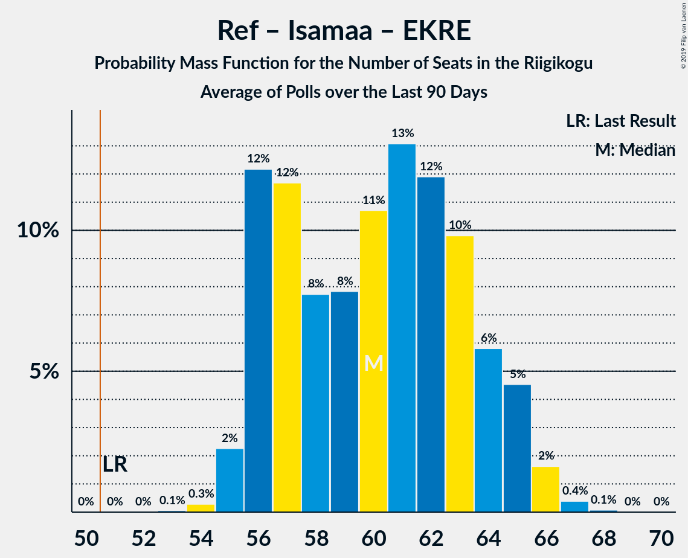
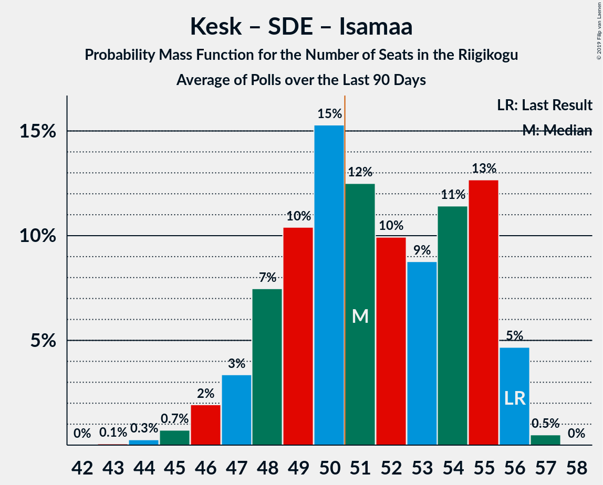
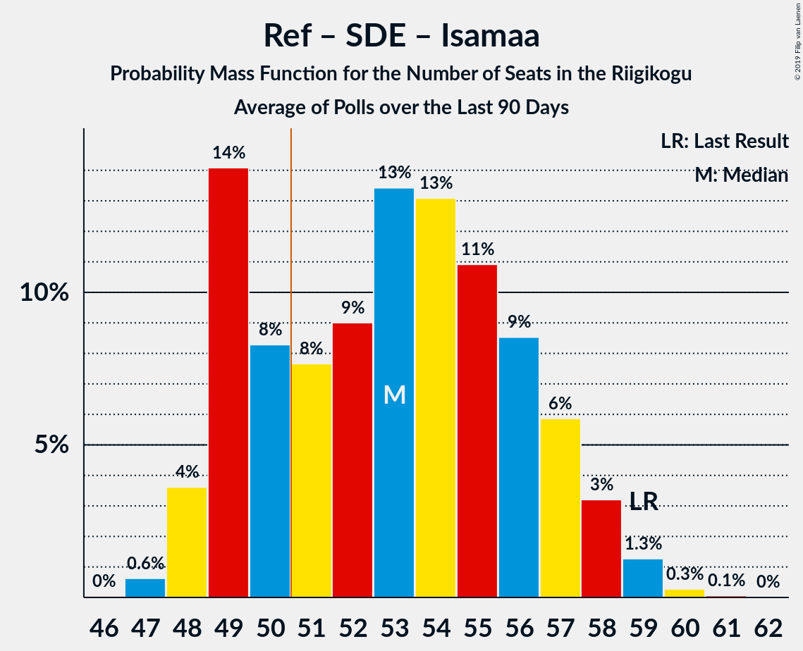

# Poll Average

<a href="#voting-intentions">Voting Intentions</a> | <a href="#seats">Seats</a> | <a href="#coalitions">Coalitions</a> | <a href="#technical-information">Technical Information</a>

## Summary

The table below lists the polls on which the average is based. They are the most recent polls (less than 90 days old) registered and analyzed so far.

| Period     | Polling firm/Commissioner(s) | Ref | Kesk | SDE | Isamaa | EVA | EKRE | Rohelised | E200 |
|:----------:|:----------------------------:|:--:|:--:|:--:|:--:|:--:|:--:|:--:|:--:|
| 1 March 2015 | General Election | 27.7%   30 | 24.8%   27 | 15.2%   15 | 13.7%   14 | 8.7%   8 | 8.1%   7 | 0.9%   0 | 0.0%   0 |
| N/A | Poll Average | 26–32%   29–37 | 23–32%   25–38 | 9–14%   9–14 | 4–6%   0–6 | 1–3%   0 | 15–19%   16–22 | 1–4%   0 | 7–10%   6–10 |
| [8–13 November 2018](2018-11-13-KantarEmor.html) | Kantar Emor   BNS and Postimees | 26–32%   30–37 | 22–27%   25–32 | 9–13%   9–13 | 4–6%   0–5 | 2–3%   0 | 15–19%   16–21 | 2–4%   0 | 7–10%   6–10 |
| [2–15 October 2018](2018-10-15-Turu-uuringuteAS.html) | Turu-uuringute AS   ERR | 25–31%   29–36 | 27–33%   31–39 | 10–14%   10–15 | 4–7%   0–6 | 1–3%   0 | 15–19%   16–22 | 1–3%   0 | N/A   N/A |
| 1 March 2015 | General Election | 27.7%   30 | 24.8%   27 | 15.2%   15 | 13.7%   14 | 8.7%   8 | 8.1%   7 | 0.9%   0 | 0.0%   0 |

Only polls for which at least the sample size has been published are included in the table above.

**Legend:**
+ **Top half of each row:** Voting intentions (95% confidence interval)
+ **Bottom half of each row:** Seat projections for the Riigikogu (95% confidence interval)
+ **Ref:** Eesti Reformierakond
+ **Kesk:** Eesti Keskerakond
+ **SDE:** Sotsiaaldemokraatlik Erakond
+ **Isamaa:** Erakond Isamaa
+ **EVA:** Eesti Vabaerakond
+ **EKRE:** Eesti Konservatiivne Rahvaerakond
+ **Rohelised:** Erakond Eestimaa Rohelised
+ **E200:** Eesti 200
+ **N/A (single party):** Party not included the published results
+ **N/A (entire row):** Calculation for this opinion poll not started yet

## Voting Intentions

### Confidence Intervals

| Party | Last Result | Median | 80% Confidence Interval | 90% Confidence Interval | 95% Confidence Interval | 99% Confidence Interval |
|:-----:|:-----------:|:------:|:-----------------------:|:-----------------------:|:-----------------------:|:-----------------------:|
| <a href="#eesti-reformierakond">Eesti Reformierakond</a> | 27.7% | 28.5% | 26.6–30.5% |26.1–31.0% | 25.6–31.5% | 24.8–32.4% |
| <a href="#eesti-keskerakond">Eesti Keskerakond</a> | 24.8% | 27.3% | 23.7–31.3% |23.1–31.9% | 22.6–32.4% | 21.8–33.5% |
| <a href="#sotsiaaldemokraatlik-erakond">Sotsiaaldemokraatlik Erakond</a> | 15.2% | 11.4% | 9.9–13.0% |9.5–13.4% | 9.2–13.8% | 8.7–14.6% |
| <a href="#erakond-isamaa">Erakond Isamaa</a> | 13.7% | 4.9% | 4.0–5.8% |3.8–6.1% | 3.6–6.4% | 3.3–6.9% |
| <a href="#eesti-vabaerakond">Eesti Vabaerakond</a> | 8.7% | 2.2% | 1.7–2.9% |1.5–3.1% | 1.4–3.3% | 1.2–3.7% |
| <a href="#eesti-konservatiivne-rahvaerakond">Eesti Konservatiivne Rahvaerakond</a> | 8.1% | 17.0% | 15.6–18.6% |15.2–19.0% | 14.8–19.4% | 14.2–20.2% |
| <a href="#erakond-eestimaa-rohelised">Erakond Eestimaa Rohelised</a> | 0.9% | 2.3% | 1.7–3.1% |1.5–3.3% | 1.4–3.5% | 1.2–3.9% |
| <a href="#eesti-200">Eesti 200</a> | 0.0% | 8.6% | 7.5–9.7% |7.2–10.1% | 7.0–10.4% | 6.5–11.0% |

### Eesti Reformierakond

*For a full overview of the results for this party, see the [Eesti Reformierakond](party-eestireformierakond.html) page.*

| Voting Intentions | Probability | Accumulated | Special Marks |
|:-----------------:|:-----------:|:-----------:|:-------------:|
| 22.5–23.5% | 0% | 100% |  |
| 23.5–24.5% | 0.3% | 100% |  |
| 24.5–25.5% | 2% | 99.7% |  |
| 25.5–26.5% | 7% | 98% |  |
| 26.5–27.5% | 17% | 91% |  |
| 27.5–28.5% | 25% | 74% | Last Result |
| 28.5–29.5% | 25% | 50% | Median |
| 29.5–30.5% | 16% | 25% |  |
| 30.5–31.5% | 7% | 9% |  |
| 31.5–32.5% | 2% | 2% |  |
| 32.5–33.5% | 0.3% | 0.4% |  |
| 33.5–34.5% | 0% | 0% |  |
| 34.5–35.5% | 0% | 0% |  |

### Eesti Keskerakond

*For a full overview of the results for this party, see the [Eesti Keskerakond](party-eestikeskerakond.html) page.*

| Voting Intentions | Probability | Accumulated | Special Marks |
|:-----------------:|:-----------:|:-----------:|:-------------:|
| 19.5–20.5% | 0% | 100% |  |
| 20.5–21.5% | 0.3% | 100% |  |
| 21.5–22.5% | 2% | 99.7% |  |
| 22.5–23.5% | 7% | 98% |  |
| 23.5–24.5% | 13% | 91% |  |
| 24.5–25.5% | 14% | 78% | Last Result |
| 25.5–26.5% | 10% | 64% |  |
| 26.5–27.5% | 5% | 54% | Median |
| 27.5–28.5% | 6% | 49% |  |
| 28.5–29.5% | 11% | 43% |  |
| 29.5–30.5% | 13% | 31% |  |
| 30.5–31.5% | 11% | 18% |  |
| 31.5–32.5% | 5% | 7% |  |
| 32.5–33.5% | 2% | 2% |  |
| 33.5–34.5% | 0.4% | 0.4% |  |
| 34.5–35.5% | 0.1% | 0.1% |  |
| 35.5–36.5% | 0% | 0% |  |

### Sotsiaaldemokraatlik Erakond

*For a full overview of the results for this party, see the [Sotsiaaldemokraatlik Erakond](party-sotsiaaldemokraatlikerakond.html) page.*

| Voting Intentions | Probability | Accumulated | Special Marks |
|:-----------------:|:-----------:|:-----------:|:-------------:|
| 6.5–7.5% | 0% | 100% |  |
| 7.5–8.5% | 0.3% | 100% |  |
| 8.5–9.5% | 5% | 99.7% |  |
| 9.5–10.5% | 19% | 95% |  |
| 10.5–11.5% | 31% | 76% | Median |
| 11.5–12.5% | 27% | 45% |  |
| 12.5–13.5% | 14% | 18% |  |
| 13.5–14.5% | 4% | 4% |  |
| 14.5–15.5% | 0.5% | 0.5% | Last Result |
| 15.5–16.5% | 0% | 0% |  |

### Erakond Isamaa

*For a full overview of the results for this party, see the [Erakond Isamaa](party-erakondisamaa.html) page.*

| Voting Intentions | Probability | Accumulated | Special Marks |
|:-----------------:|:-----------:|:-----------:|:-------------:|
| 1.5–2.5% | 0% | 100% |  |
| 2.5–3.5% | 2% | 100% |  |
| 3.5–4.5% | 30% | 98% |  |
| 4.5–5.5% | 50% | 68% | Median |
| 5.5–6.5% | 16% | 18% |  |
| 6.5–7.5% | 1.4% | 1.4% |  |
| 7.5–8.5% | 0% | 0% |  |
| 8.5–9.5% | 0% | 0% |  |
| 9.5–10.5% | 0% | 0% |  |
| 10.5–11.5% | 0% | 0% |  |
| 11.5–12.5% | 0% | 0% |  |
| 12.5–13.5% | 0% | 0% |  |
| 13.5–14.5% | 0% | 0% | Last Result |

### Eesti Vabaerakond

*For a full overview of the results for this party, see the [Eesti Vabaerakond](party-eestivabaerakond.html) page.*

| Voting Intentions | Probability | Accumulated | Special Marks |
|:-----------------:|:-----------:|:-----------:|:-------------:|
| 0.0–0.5% | 0% | 100% |  |
| 0.5–1.5% | 6% | 100% |  |
| 1.5–2.5% | 66% | 94% | Median |
| 2.5–3.5% | 27% | 28% |  |
| 3.5–4.5% | 1.1% | 1.1% |  |
| 4.5–5.5% | 0% | 0% |  |
| 5.5–6.5% | 0% | 0% |  |
| 6.5–7.5% | 0% | 0% |  |
| 7.5–8.5% | 0% | 0% |  |
| 8.5–9.5% | 0% | 0% | Last Result |

### Eesti Konservatiivne Rahvaerakond

*For a full overview of the results for this party, see the [Eesti Konservatiivne Rahvaerakond](party-eestikonservatiivnerahvaerakond.html) page.*

| Voting Intentions | Probability | Accumulated | Special Marks |
|:-----------------:|:-----------:|:-----------:|:-------------:|
| 7.5–8.5% | 0% | 100% | Last Result |
| 8.5–9.5% | 0% | 100% |  |
| 9.5–10.5% | 0% | 100% |  |
| 10.5–11.5% | 0% | 100% |  |
| 11.5–12.5% | 0% | 100% |  |
| 12.5–13.5% | 0.1% | 100% |  |
| 13.5–14.5% | 1.3% | 99.9% |  |
| 14.5–15.5% | 8% | 98.6% |  |
| 15.5–16.5% | 24% | 90% |  |
| 16.5–17.5% | 33% | 66% | Median |
| 17.5–18.5% | 23% | 33% |  |
| 18.5–19.5% | 8% | 10% |  |
| 19.5–20.5% | 2% | 2% |  |
| 20.5–21.5% | 0.2% | 0.2% |  |
| 21.5–22.5% | 0% | 0% |  |

### Erakond Eestimaa Rohelised

*For a full overview of the results for this party, see the [Erakond Eestimaa Rohelised](party-erakondeestimaarohelised.html) page.*

| Voting Intentions | Probability | Accumulated | Special Marks |
|:-----------------:|:-----------:|:-----------:|:-------------:|
| 0.0–0.5% | 0% | 100% |  |
| 0.5–1.5% | 6% | 100% | Last Result |
| 1.5–2.5% | 58% | 94% | Median |
| 2.5–3.5% | 34% | 36% |  |
| 3.5–4.5% | 2% | 2% |  |
| 4.5–5.5% | 0% | 0% |  |

### Eesti 200

*For a full overview of the results for this party, see the [Eesti 200](party-eesti200.html) page.*

| Voting Intentions | Probability | Accumulated | Special Marks |
|:-----------------:|:-----------:|:-----------:|:-------------:|
| 0.0–0.5% | 0% | 100% | Last Result |
| 0.5–1.5% | 0% | 100% |  |
| 1.5–2.5% | 0% | 100% |  |
| 2.5–3.5% | 0% | 100% |  |
| 3.5–4.5% | 0% | 100% |  |
| 4.5–5.5% | 0% | 100% |  |
| 5.5–6.5% | 0.5% | 100% |  |
| 6.5–7.5% | 10% | 99.5% |  |
| 7.5–8.5% | 38% | 90% |  |
| 8.5–9.5% | 38% | 52% | Median |
| 9.5–10.5% | 12% | 14% |  |
| 10.5–11.5% | 2% | 2% |  |
| 11.5–12.5% | 0.1% | 0.1% |  |
| 12.5–13.5% | 0% | 0% |  |

## Seats

### Confidence Intervals

| Party | Last Result | Median | 80% Confidence Interval | 90% Confidence Interval | 95% Confidence Interval | 99% Confidence Interval |
|:-----:|:-----------:|:------:|:-----------------------:|:-----------------------:|:-----------------------:|:-----------------------:|
| <a href="#eesti-reformierakond">Eesti Reformierakond</a> | 30 | 33 | 30–36 |30–37 | 29–37 | 28–38 |
| <a href="#eesti-keskerakond">Eesti Keskerakond</a> | 27 | 31 | 27–37 |26–38 | 25–38 | 24–40 |
| <a href="#sotsiaaldemokraatlik-erakond">Sotsiaaldemokraatlik Erakond</a> | 15 | 12 | 10–13 |9–14 | 9–14 | 8–15 |
| <a href="#erakond-isamaa">Erakond Isamaa</a> | 14 | 0 | 0–5 |0–5 | 0–6 | 0–6 |
| <a href="#eesti-vabaerakond">Eesti Vabaerakond</a> | 8 | 0 | 0 |0 | 0 | 0 |
| <a href="#eesti-konservatiivne-rahvaerakond">Eesti Konservatiivne Rahvaerakond</a> | 7 | 18 | 17–20 |16–21 | 16–22 | 15–23 |
| <a href="#erakond-eestimaa-rohelised">Erakond Eestimaa Rohelised</a> | 0 | 0 | 0 |0 | 0 | 0 |
| <a href="#eesti-200">Eesti 200</a> | 0 | 8 | 7–10 |7–10 | 6–10 | 6–11 |

### Eesti Reformierakond

*For a full overview of the results for this party, see the [Eesti Reformierakond](party-eestireformierakond.html) page.*

| Number of Seats | Probability | Accumulated | Special Marks |
|:---------------:|:-----------:|:-----------:|:-------------:|
| 26 | 0% | 100% |  |
| 27 | 0.2% | 99.9% |  |
| 28 | 0.9% | 99.7% |  |
| 29 | 3% | 98.8% |  |
| 30 | 7% | 96% | Last Result |
| 31 | 12% | 89% |  |
| 32 | 16% | 77% |  |
| 33 | 21% | 61% | Median |
| 34 | 17% | 40% |  |
| 35 | 12% | 23% |  |
| 36 | 7% | 12% |  |
| 37 | 4% | 5% |  |
| 38 | 1.0% | 1.4% |  |
| 39 | 0.3% | 0.4% |  |
| 40 | 0.1% | 0.1% |  |
| 41 | 0% | 0% |  |

### Eesti Keskerakond

*For a full overview of the results for this party, see the [Eesti Keskerakond](party-eestikeskerakond.html) page.*

| Number of Seats | Probability | Accumulated | Special Marks |
|:---------------:|:-----------:|:-----------:|:-------------:|
| 23 | 0.1% | 100% |  |
| 24 | 0.8% | 99.9% |  |
| 25 | 3% | 99.1% |  |
| 26 | 6% | 96% |  |
| 27 | 9% | 90% | Last Result |
| 28 | 12% | 82% |  |
| 29 | 10% | 70% |  |
| 30 | 6% | 60% |  |
| 31 | 5% | 54% | Median |
| 32 | 6% | 49% |  |
| 33 | 5% | 44% |  |
| 34 | 8% | 38% |  |
| 35 | 12% | 30% |  |
| 36 | 8% | 19% |  |
| 37 | 5% | 10% |  |
| 38 | 3% | 5% |  |
| 39 | 2% | 2% |  |
| 40 | 0.6% | 0.8% |  |
| 41 | 0.1% | 0.2% |  |
| 42 | 0% | 0% |  |

### Sotsiaaldemokraatlik Erakond

*For a full overview of the results for this party, see the [Sotsiaaldemokraatlik Erakond](party-sotsiaaldemokraatlikerakond.html) page.*

| Number of Seats | Probability | Accumulated | Special Marks |
|:---------------:|:-----------:|:-----------:|:-------------:|
| 8 | 0.7% | 100% |  |
| 9 | 7% | 99.2% |  |
| 10 | 15% | 93% |  |
| 11 | 24% | 78% |  |
| 12 | 26% | 54% | Median |
| 13 | 18% | 27% |  |
| 14 | 7% | 10% |  |
| 15 | 2% | 2% | Last Result |
| 16 | 0.4% | 0.5% |  |
| 17 | 0.1% | 0.1% |  |
| 18 | 0% | 0% |  |

### Erakond Isamaa

*For a full overview of the results for this party, see the [Erakond Isamaa](party-erakondisamaa.html) page.*

| Number of Seats | Probability | Accumulated | Special Marks |
|:---------------:|:-----------:|:-----------:|:-------------:|
| 0 | 56% | 100% | Median |
| 1 | 0% | 44% |  |
| 2 | 0% | 44% |  |
| 3 | 0% | 44% |  |
| 4 | 16% | 44% |  |
| 5 | 24% | 29% |  |
| 6 | 4% | 4% |  |
| 7 | 0.3% | 0.3% |  |
| 8 | 0% | 0% |  |
| 9 | 0% | 0% |  |
| 10 | 0% | 0% |  |
| 11 | 0% | 0% |  |
| 12 | 0% | 0% |  |
| 13 | 0% | 0% |  |
| 14 | 0% | 0% | Last Result |

### Eesti Vabaerakond

*For a full overview of the results for this party, see the [Eesti Vabaerakond](party-eestivabaerakond.html) page.*

| Number of Seats | Probability | Accumulated | Special Marks |
|:---------------:|:-----------:|:-----------:|:-------------:|
| 0 | 100% | 100% | Median |
| 1 | 0% | 0% |  |
| 2 | 0% | 0% |  |
| 3 | 0% | 0% |  |
| 4 | 0% | 0% |  |
| 5 | 0% | 0% |  |
| 6 | 0% | 0% |  |
| 7 | 0% | 0% |  |
| 8 | 0% | 0% | Last Result |

### Eesti Konservatiivne Rahvaerakond

*For a full overview of the results for this party, see the [Eesti Konservatiivne Rahvaerakond](party-eestikonservatiivnerahvaerakond.html) page.*

| Number of Seats | Probability | Accumulated | Special Marks |
|:---------------:|:-----------:|:-----------:|:-------------:|
| 7 | 0% | 100% | Last Result |
| 8 | 0% | 100% |  |
| 9 | 0% | 100% |  |
| 10 | 0% | 100% |  |
| 11 | 0% | 100% |  |
| 12 | 0% | 100% |  |
| 13 | 0% | 100% |  |
| 14 | 0.2% | 100% |  |
| 15 | 2% | 99.7% |  |
| 16 | 7% | 98% |  |
| 17 | 20% | 90% |  |
| 18 | 25% | 71% | Median |
| 19 | 23% | 46% |  |
| 20 | 15% | 22% |  |
| 21 | 5% | 7% |  |
| 22 | 2% | 3% |  |
| 23 | 0.4% | 0.5% |  |
| 24 | 0.1% | 0.1% |  |
| 25 | 0% | 0% |  |

### Erakond Eestimaa Rohelised

*For a full overview of the results for this party, see the [Erakond Eestimaa Rohelised](party-erakondeestimaarohelised.html) page.*

| Number of Seats | Probability | Accumulated | Special Marks |
|:---------------:|:-----------:|:-----------:|:-------------:|
| 0 | 100% | 100% | Last Result, Median |

### Eesti 200

*For a full overview of the results for this party, see the [Eesti 200](party-eesti200.html) page.*

| Number of Seats | Probability | Accumulated | Special Marks |
|:---------------:|:-----------:|:-----------:|:-------------:|
| 0 | 0% | 100% | Last Result |
| 1 | 0% | 100% |  |
| 2 | 0% | 100% |  |
| 3 | 0% | 100% |  |
| 4 | 0% | 100% |  |
| 5 | 0.1% | 100% |  |
| 6 | 3% | 99.9% |  |
| 7 | 18% | 97% |  |
| 8 | 38% | 79% | Median |
| 9 | 28% | 42% |  |
| 10 | 12% | 14% |  |
| 11 | 1.4% | 2% |  |
| 12 | 0.2% | 0.3% |  |
| 13 | 0% | 0% |  |

## Coalitions

### Confidence Intervals

| Coalition | Last Result | Median | Majority? | 80% Confidence Interval | 90% Confidence Interval | 95% Confidence Interval | 99% Confidence Interval |
|:---------:|:-----------:|:------:|:---------:|:-----------------------:|:-----------------------:|:-----------------------:|:-----------------------:|
| Eesti Reformierakond – Eesti Keskerakond – Eesti Konservatiivne Rahvaerakond | 64 | 83 | 100% | 78–88 | 77–89 | 76–90 | 75–91 |
| Eesti Reformierakond – Eesti Keskerakond | 57 | 64 | 100% | 60–69 | 59–71 | 58–71 | 56–73 |
| Eesti Reformierakond – Erakond Isamaa – Eesti Konservatiivne Rahvaerakond | 51 | 54 | 89% | 50–56 | 50–57 | 49–58 | 48–59 |
| Eesti Keskerakond – Eesti Konservatiivne Rahvaerakond | 34 | 50 | 45% | 45–55 | 44–57 | 43–57 | 42–59 |
| Eesti Reformierakond – Eesti Konservatiivne Rahvaerakond | 37 | 52 | 63% | 48–54 | 47–55 | 47–56 | 45–57 |
| Eesti Keskerakond – Sotsiaaldemokraatlik Erakond – Erakond Isamaa | 56 | 45 | 22% | 39–52 | 38–53 | 37–54 | 36–55 |
| Eesti Reformierakond – Sotsiaaldemokraatlik Erakond – Erakond Isamaa – Eesti Vabaerakond | 67 | 47 | 6% | 44–50 | 43–51 | 42–51 | 41–53 |
| Eesti Reformierakond – Sotsiaaldemokraatlik Erakond – Erakond Isamaa | 59 | 47 | 6% | 44–50 | 43–51 | 42–51 | 41–53 |
| Eesti Keskerakond – Sotsiaaldemokraatlik Erakond | 42 | 43 | 5% | 37–49 | 37–50 | 36–51 | 35–52 |
| Eesti Reformierakond – Sotsiaaldemokraatlik Erakond | 45 | 45 | 0.3% | 42–48 | 41–48 | 40–49 | 39–50 |
| Eesti Reformierakond – Erakond Isamaa | 44 | 35 | 0% | 32–38 | 31–39 | 31–40 | 29–41 |
| Sotsiaaldemokraatlik Erakond – Eesti Konservatiivne Rahvaerakond | 22 | 30 | 0% | 27–33 | 27–33 | 26–34 | 25–35 |

### Eesti Reformierakond – Eesti Keskerakond – Eesti Konservatiivne Rahvaerakond

| Number of Seats | Probability | Accumulated | Special Marks |
|:---------------:|:-----------:|:-----------:|:-------------:|
| 64 | 0% | 100% | Last Result |
| 65 | 0% | 100% |  |
| 66 | 0% | 100% |  |
| 67 | 0% | 100% |  |
| 68 | 0% | 100% |  |
| 69 | 0% | 100% |  |
| 70 | 0% | 100% |  |
| 71 | 0% | 100% |  |
| 72 | 0% | 100% |  |
| 73 | 0% | 100% |  |
| 74 | 0.3% | 99.9% |  |
| 75 | 1.0% | 99.6% |  |
| 76 | 2% | 98.6% |  |
| 77 | 3% | 97% |  |
| 78 | 5% | 94% |  |
| 79 | 7% | 89% |  |
| 80 | 10% | 82% |  |
| 81 | 11% | 72% |  |
| 82 | 10% | 61% | Median |
| 83 | 10% | 51% |  |
| 84 | 10% | 42% |  |
| 85 | 7% | 32% |  |
| 86 | 4% | 24% |  |
| 87 | 4% | 20% |  |
| 88 | 7% | 16% |  |
| 89 | 6% | 9% |  |
| 90 | 3% | 3% |  |
| 91 | 0.7% | 0.7% |  |
| 92 | 0.1% | 0.1% |  |
| 93 | 0% | 0% |  |

### Eesti Reformierakond – Eesti Keskerakond

| Number of Seats | Probability | Accumulated | Special Marks |
|:---------------:|:-----------:|:-----------:|:-------------:|
| 55 | 0.1% | 100% |  |
| 56 | 0.5% | 99.9% |  |
| 57 | 1.1% | 99.4% | Last Result |
| 58 | 2% | 98% |  |
| 59 | 3% | 97% |  |
| 60 | 9% | 94% |  |
| 61 | 6% | 85% |  |
| 62 | 12% | 79% |  |
| 63 | 8% | 66% |  |
| 64 | 10% | 58% | Median |
| 65 | 8% | 48% |  |
| 66 | 9% | 40% |  |
| 67 | 7% | 32% |  |
| 68 | 8% | 24% |  |
| 69 | 7% | 16% |  |
| 70 | 4% | 9% |  |
| 71 | 3% | 5% |  |
| 72 | 2% | 2% |  |
| 73 | 0.4% | 0.6% |  |
| 74 | 0.1% | 0.1% |  |
| 75 | 0% | 0% |  |

### Eesti Reformierakond – Erakond Isamaa – Eesti Konservatiivne Rahvaerakond

| Number of Seats | Probability | Accumulated | Special Marks |
|:---------------:|:-----------:|:-----------:|:-------------:|
| 46 | 0.1% | 100% |  |
| 47 | 0.4% | 99.9% |  |
| 48 | 0.8% | 99.5% |  |
| 49 | 3% | 98.7% |  |
| 50 | 7% | 96% |  |
| 51 | 6% | 89% | Last Result, Median, Majority |
| 52 | 13% | 82% |  |
| 53 | 19% | 69% |  |
| 54 | 16% | 50% |  |
| 55 | 15% | 35% |  |
| 56 | 11% | 20% |  |
| 57 | 6% | 9% |  |
| 58 | 2% | 3% |  |
| 59 | 0.8% | 1.0% |  |
| 60 | 0.2% | 0.2% |  |
| 61 | 0% | 0% |  |

### Eesti Keskerakond – Eesti Konservatiivne Rahvaerakond

| Number of Seats | Probability | Accumulated | Special Marks |
|:---------------:|:-----------:|:-----------:|:-------------:|
| 34 | 0% | 100% | Last Result |
| 35 | 0% | 100% |  |
| 36 | 0% | 100% |  |
| 37 | 0% | 100% |  |
| 38 | 0% | 100% |  |
| 39 | 0% | 100% |  |
| 40 | 0.1% | 100% |  |
| 41 | 0.3% | 99.9% |  |
| 42 | 0.8% | 99.6% |  |
| 43 | 1.4% | 98.8% |  |
| 44 | 7% | 97% |  |
| 45 | 6% | 90% |  |
| 46 | 11% | 84% |  |
| 47 | 10% | 74% |  |
| 48 | 7% | 63% |  |
| 49 | 5% | 56% | Median |
| 50 | 6% | 51% |  |
| 51 | 6% | 45% | Majority |
| 52 | 8% | 39% |  |
| 53 | 8% | 31% |  |
| 54 | 8% | 24% |  |
| 55 | 7% | 16% |  |
| 56 | 4% | 9% |  |
| 57 | 3% | 5% |  |
| 58 | 1.2% | 2% |  |
| 59 | 0.7% | 0.8% |  |
| 60 | 0.1% | 0.2% |  |
| 61 | 0% | 0% |  |

### Eesti Reformierakond – Eesti Konservatiivne Rahvaerakond

| Number of Seats | Probability | Accumulated | Special Marks |
|:---------------:|:-----------:|:-----------:|:-------------:|
| 37 | 0% | 100% | Last Result |
| 38 | 0% | 100% |  |
| 39 | 0% | 100% |  |
| 40 | 0% | 100% |  |
| 41 | 0% | 100% |  |
| 42 | 0% | 100% |  |
| 43 | 0% | 100% |  |
| 44 | 0.1% | 100% |  |
| 45 | 0.4% | 99.8% |  |
| 46 | 1.2% | 99.5% |  |
| 47 | 4% | 98% |  |
| 48 | 5% | 95% |  |
| 49 | 11% | 89% |  |
| 50 | 16% | 78% |  |
| 51 | 10% | 63% | Median, Majority |
| 52 | 19% | 53% |  |
| 53 | 16% | 34% |  |
| 54 | 8% | 18% |  |
| 55 | 7% | 10% |  |
| 56 | 2% | 3% |  |
| 57 | 0.7% | 1.1% |  |
| 58 | 0.4% | 0.4% |  |
| 59 | 0% | 0.1% |  |
| 60 | 0% | 0% |  |

### Eesti Keskerakond – Sotsiaaldemokraatlik Erakond – Erakond Isamaa

| Number of Seats | Probability | Accumulated | Special Marks |
|:---------------:|:-----------:|:-----------:|:-------------:|
| 34 | 0% | 100% |  |
| 35 | 0.4% | 99.9% |  |
| 36 | 0.6% | 99.5% |  |
| 37 | 3% | 98.9% |  |
| 38 | 4% | 95% |  |
| 39 | 9% | 92% |  |
| 40 | 6% | 83% |  |
| 41 | 10% | 77% |  |
| 42 | 8% | 67% |  |
| 43 | 3% | 59% | Median |
| 44 | 4% | 55% |  |
| 45 | 3% | 52% |  |
| 46 | 3% | 49% |  |
| 47 | 3% | 46% |  |
| 48 | 8% | 43% |  |
| 49 | 7% | 35% |  |
| 50 | 5% | 27% |  |
| 51 | 9% | 22% | Majority |
| 52 | 7% | 13% |  |
| 53 | 3% | 7% |  |
| 54 | 2% | 3% |  |
| 55 | 0.7% | 1.0% |  |
| 56 | 0.2% | 0.3% | Last Result |
| 57 | 0.1% | 0.1% |  |
| 58 | 0% | 0% |  |

### Eesti Reformierakond – Sotsiaaldemokraatlik Erakond – Erakond Isamaa – Eesti Vabaerakond

| Number of Seats | Probability | Accumulated | Special Marks |
|:---------------:|:-----------:|:-----------:|:-------------:|
| 40 | 0.4% | 100% |  |
| 41 | 0.9% | 99.5% |  |
| 42 | 2% | 98.6% |  |
| 43 | 5% | 96% |  |
| 44 | 7% | 92% |  |
| 45 | 13% | 84% | Median |
| 46 | 15% | 72% |  |
| 47 | 19% | 56% |  |
| 48 | 14% | 37% |  |
| 49 | 12% | 23% |  |
| 50 | 5% | 11% |  |
| 51 | 4% | 6% | Majority |
| 52 | 1.5% | 2% |  |
| 53 | 0.5% | 0.7% |  |
| 54 | 0.1% | 0.2% |  |
| 55 | 0% | 0% |  |
| 56 | 0% | 0% |  |
| 57 | 0% | 0% |  |
| 58 | 0% | 0% |  |
| 59 | 0% | 0% |  |
| 60 | 0% | 0% |  |
| 61 | 0% | 0% |  |
| 62 | 0% | 0% |  |
| 63 | 0% | 0% |  |
| 64 | 0% | 0% |  |
| 65 | 0% | 0% |  |
| 66 | 0% | 0% |  |
| 67 | 0% | 0% | Last Result |

### Eesti Reformierakond – Sotsiaaldemokraatlik Erakond – Erakond Isamaa

| Number of Seats | Probability | Accumulated | Special Marks |
|:---------------:|:-----------:|:-----------:|:-------------:|
| 40 | 0.4% | 100% |  |
| 41 | 0.9% | 99.5% |  |
| 42 | 2% | 98.6% |  |
| 43 | 5% | 96% |  |
| 44 | 7% | 92% |  |
| 45 | 13% | 84% | Median |
| 46 | 15% | 72% |  |
| 47 | 19% | 56% |  |
| 48 | 14% | 37% |  |
| 49 | 12% | 23% |  |
| 50 | 5% | 11% |  |
| 51 | 4% | 6% | Majority |
| 52 | 1.5% | 2% |  |
| 53 | 0.5% | 0.7% |  |
| 54 | 0.1% | 0.2% |  |
| 55 | 0% | 0% |  |
| 56 | 0% | 0% |  |
| 57 | 0% | 0% |  |
| 58 | 0% | 0% |  |
| 59 | 0% | 0% | Last Result |

### Eesti Keskerakond – Sotsiaaldemokraatlik Erakond

| Number of Seats | Probability | Accumulated | Special Marks |
|:---------------:|:-----------:|:-----------:|:-------------:|
| 33 | 0.2% | 100% |  |
| 34 | 0.3% | 99.8% |  |
| 35 | 2% | 99.5% |  |
| 36 | 2% | 98% |  |
| 37 | 9% | 95% |  |
| 38 | 7% | 87% |  |
| 39 | 12% | 80% |  |
| 40 | 6% | 68% |  |
| 41 | 7% | 62% |  |
| 42 | 5% | 56% | Last Result |
| 43 | 3% | 51% | Median |
| 44 | 5% | 48% |  |
| 45 | 3% | 44% |  |
| 46 | 9% | 40% |  |
| 47 | 8% | 32% |  |
| 48 | 9% | 23% |  |
| 49 | 7% | 15% |  |
| 50 | 3% | 8% |  |
| 51 | 3% | 5% | Majority |
| 52 | 1.4% | 2% |  |
| 53 | 0.3% | 0.4% |  |
| 54 | 0.1% | 0.2% |  |
| 55 | 0% | 0% |  |

### Eesti Reformierakond – Sotsiaaldemokraatlik Erakond

| Number of Seats | Probability | Accumulated | Special Marks |
|:---------------:|:-----------:|:-----------:|:-------------:|
| 38 | 0.1% | 100% |  |
| 39 | 0.5% | 99.8% |  |
| 40 | 2% | 99.3% |  |
| 41 | 4% | 97% |  |
| 42 | 11% | 93% |  |
| 43 | 14% | 82% |  |
| 44 | 14% | 68% |  |
| 45 | 20% | 55% | Last Result, Median |
| 46 | 13% | 35% |  |
| 47 | 11% | 22% |  |
| 48 | 6% | 10% |  |
| 49 | 3% | 4% |  |
| 50 | 0.7% | 1.1% |  |
| 51 | 0.3% | 0.3% | Majority |
| 52 | 0.1% | 0.1% |  |
| 53 | 0% | 0% |  |

### Eesti Reformierakond – Erakond Isamaa

| Number of Seats | Probability | Accumulated | Special Marks |
|:---------------:|:-----------:|:-----------:|:-------------:|
| 28 | 0.1% | 100% |  |
| 29 | 0.5% | 99.9% |  |
| 30 | 2% | 99.3% |  |
| 31 | 4% | 98% |  |
| 32 | 7% | 93% |  |
| 33 | 13% | 87% | Median |
| 34 | 14% | 74% |  |
| 35 | 15% | 60% |  |
| 36 | 13% | 45% |  |
| 37 | 16% | 32% |  |
| 38 | 8% | 16% |  |
| 39 | 5% | 8% |  |
| 40 | 2% | 3% |  |
| 41 | 0.7% | 0.9% |  |
| 42 | 0.2% | 0.2% |  |
| 43 | 0.1% | 0.1% |  |
| 44 | 0% | 0% | Last Result |

### Sotsiaaldemokraatlik Erakond – Eesti Konservatiivne Rahvaerakond

| Number of Seats | Probability | Accumulated | Special Marks |
|:---------------:|:-----------:|:-----------:|:-------------:|
| 22 | 0% | 100% | Last Result |
| 23 | 0% | 100% |  |
| 24 | 0.1% | 100% |  |
| 25 | 0.7% | 99.9% |  |
| 26 | 2% | 99.2% |  |
| 27 | 8% | 97% |  |
| 28 | 11% | 89% |  |
| 29 | 20% | 78% |  |
| 30 | 17% | 57% | Median |
| 31 | 16% | 40% |  |
| 32 | 13% | 24% |  |
| 33 | 7% | 11% |  |
| 34 | 3% | 4% |  |
| 35 | 1.0% | 1.5% |  |
| 36 | 0.3% | 0.5% |  |
| 37 | 0.1% | 0.1% |  |
| 38 | 0% | 0% |  |

## Technical Information

+ **Number of polls included in this average:** 2
+ **Lowest number of simulations done in a poll included in this average:** 1,048,576
+ **Total number of simulations done in the polls included in this average:** 2,097,152
+ **Error estimate:** 1.65%
