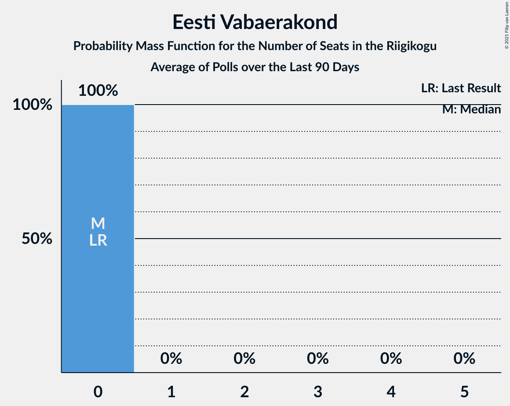

# Poll Average

<a href="#voting-intentions">Voting Intentions</a> | <a href="#seats">Seats</a> | <a href="#coalitions">Coalitions</a> | <a href="#technical-information">Technical Information</a>

## Summary

The table below lists the polls on which the average is based. They are the most recent polls (less than 90 days old) registered and analyzed so far.

| Period     | Polling firm/Commissioner(s) | Ref | Kesk | EKRE | I | SDE | E200 | Rohelised | EVA | EP |
|:----------:|:----------------------------:|:--:|:--:|:--:|:--:|:--:|:--:|:--:|:--:|:--:|
| 3 March 2019 | General Election | 28.9%   34 | 23.1%   26 | 17.8%   19 | 11.4%   12 | 9.8%   10 | 4.4%   0 | 1.8%   0 | 1.2%   0 | 0.0%   0 |
| N/A | Poll Average | 26–33%   28–38 | 13–19%   13–20 | 15–30%   15–33 | 5–10%   4–9 | 6–13%   5–13 | 8–16%   7–17 | 1–3%   0 | N/A   N/A | 1–2%   0 |
| [13–19 September 2022](2022-09-19-Norstat.html) | Norstat   MTÜ Ühiskonnauuringute Instituut | 28–33%   30–38 | 15–19%   15–20 | 25–31%   27–34 | 5–8%   0–7 | 5–8%   4–8 | 8–11%   7–11 | 1–2%   0 | N/A   N/A | 1–2%   0 |
| [25 August 2022](2022-08-25-Turu-uuringuteAS.html) | Turu-uuringute AS | 25–32%   27–36 | 12–18%   12–19 | 14–20%   14–22 | 6–10%   5–10 | 9–14%   8–14 | 11–17%   11–18 | 1–3%   0 | N/A   N/A | N/A   N/A |
| [11–22 August 2022](2022-08-22-KantarEmor.html) | Kantar Emor   ERR | 29–34%   32–38 | 14–18%   15–19 | 16–20%   17–21 | 6–8%   5–8 | 10–13%   9–13 | 12–15%   11–15 | 1–3%   0 | N/A   N/A | N/A   N/A |
| 3 March 2019 | General Election | 28.9%   34 | 23.1%   26 | 17.8%   19 | 11.4%   12 | 9.8%   10 | 4.4%   0 | 1.8%   0 | 1.2%   0 | 0.0%   0 |

Only polls for which at least the sample size has been published are included in the table above.

**Legend:**
+ **Top half of each row:** Voting intentions (95% confidence interval)
+ **Bottom half of each row:** Seat projections for the Riigikogu (95% confidence interval)
+ **Ref:** Eesti Reformierakond
+ **Kesk:** Eesti Keskerakond
+ **EKRE:** Eesti Konservatiivne Rahvaerakond
+ **I:** Erakond Isamaa
+ **SDE:** Sotsiaaldemokraatlik Erakond
+ **E200:** Eesti 200
+ **Rohelised:** Erakond Eestimaa Rohelised
+ **EVA:** Eesti Vabaerakond
+ **EP:** Erakond Parempoolsed
+ **N/A (single party):** Party not included the published results
+ **N/A (entire row):** Calculation for this opinion poll not started yet

## Voting Intentions

### Confidence Intervals

| Party | Last Result | Median | 80% Confidence Interval | 90% Confidence Interval | 95% Confidence Interval | 99% Confidence Interval |
|:-----:|:-----------:|:------:|:-----------------------:|:-----------------------:|:-----------------------:|:-----------------------:|
| <a href="#eesti-reformierakond">Eesti Reformierakond</a> | 28.9% | 30.3% | 27.1–32.4% |26.2–32.9% | 25.5–33.4% | 24.2–34.2% |
| <a href="#eesti-keskerakond">Eesti Keskerakond</a> | 23.1% | 16.1% | 14.2–17.7% |13.6–18.2% | 13.1–18.6% | 12.1–19.5% |
| <a href="#eesti-konservatiivne-rahvaerakond">Eesti Konservatiivne Rahvaerakond</a> | 17.8% | 18.6% | 16.2–28.5% |15.5–29.2% | 14.9–29.8% | 13.9–30.9% |
| <a href="#erakond-isamaa">Erakond Isamaa</a> | 11.4% | 7.0% | 5.6–8.7% |5.3–9.3% | 5.0–9.8% | 4.6–10.7% |
| <a href="#sotsiaaldemokraatlik-erakond">Sotsiaaldemokraatlik Erakond</a> | 9.8% | 10.4% | 6.1–12.2% |5.8–12.7% | 5.5–13.1% | 5.0–14.1% |
| <a href="#eesti-200">Eesti 200</a> | 4.4% | 12.8% | 8.9–14.9% |8.4–15.6% | 8.1–16.2% | 7.5–17.3% |
| <a href="#erakond-eestimaa-rohelised">Erakond Eestimaa Rohelised</a> | 1.8% | 1.9% | 1.1–2.6% |0.9–2.9% | 0.8–3.1% | 0.6–3.6% |
| <a href="#eesti-vabaerakond">Eesti Vabaerakond</a> | 1.2% | N/A | N/A |N/A | N/A | N/A |
| <a href="#erakond-parempoolsed">Erakond Parempoolsed</a> | 0.0% | 1.4% | 1.0–1.9% |0.8–2.0% | 0.8–2.2% | 0.6–2.5% |

### Eesti Reformierakond

*For a full overview of the results for this party, see the [Eesti Reformierakond](party-eestireformierakond.html) page.*

| Voting Intentions | Probability | Accumulated | Special Marks |
|:-----------------:|:-----------:|:-----------:|:-------------:|
| 21.5–22.5% | 0% | 100% |  |
| 22.5–23.5% | 0.2% | 100% |  |
| 23.5–24.5% | 0.6% | 99.8% |  |
| 24.5–25.5% | 2% | 99.2% |  |
| 25.5–26.5% | 4% | 97% |  |
| 26.5–27.5% | 7% | 93% |  |
| 27.5–28.5% | 10% | 86% |  |
| 28.5–29.5% | 14% | 77% | Last Result |
| 29.5–30.5% | 19% | 63% | Median |
| 30.5–31.5% | 21% | 44% |  |
| 31.5–32.5% | 15% | 23% |  |
| 32.5–33.5% | 6% | 8% |  |
| 33.5–34.5% | 2% | 2% |  |
| 34.5–35.5% | 0.2% | 0.3% |  |
| 35.5–36.5% | 0% | 0% |  |

### Eesti Keskerakond

*For a full overview of the results for this party, see the [Eesti Keskerakond](party-eestikeskerakond.html) page.*

| Voting Intentions | Probability | Accumulated | Special Marks |
|:-----------------:|:-----------:|:-----------:|:-------------:|
| 9.5–10.5% | 0% | 100% |  |
| 10.5–11.5% | 0.1% | 100% |  |
| 11.5–12.5% | 1.0% | 99.8% |  |
| 12.5–13.5% | 4% | 98.9% |  |
| 13.5–14.5% | 9% | 95% |  |
| 14.5–15.5% | 20% | 86% |  |
| 15.5–16.5% | 30% | 66% | Median |
| 16.5–17.5% | 23% | 36% |  |
| 17.5–18.5% | 10% | 13% |  |
| 18.5–19.5% | 3% | 3% |  |
| 19.5–20.5% | 0.4% | 0.5% |  |
| 20.5–21.5% | 0% | 0% |  |
| 21.5–22.5% | 0% | 0% |  |
| 22.5–23.5% | 0% | 0% | Last Result |

### Eesti Konservatiivne Rahvaerakond

*For a full overview of the results for this party, see the [Eesti Konservatiivne Rahvaerakond](party-eestikonservatiivnerahvaerakond.html) page.*

| Voting Intentions | Probability | Accumulated | Special Marks |
|:-----------------:|:-----------:|:-----------:|:-------------:|
| 11.5–12.5% | 0% | 100% |  |
| 12.5–13.5% | 0.2% | 100% |  |
| 13.5–14.5% | 1.2% | 99.8% |  |
| 14.5–15.5% | 4% | 98.6% |  |
| 15.5–16.5% | 8% | 95% |  |
| 16.5–17.5% | 15% | 86% |  |
| 17.5–18.5% | 20% | 71% | Last Result |
| 18.5–19.5% | 13% | 51% | Median |
| 19.5–20.5% | 4% | 38% |  |
| 20.5–21.5% | 0.8% | 34% |  |
| 21.5–22.5% | 0.1% | 33% |  |
| 22.5–23.5% | 0% | 33% |  |
| 23.5–24.5% | 0.3% | 33% |  |
| 24.5–25.5% | 2% | 33% |  |
| 25.5–26.5% | 5% | 31% |  |
| 26.5–27.5% | 8% | 27% |  |
| 27.5–28.5% | 9% | 18% |  |
| 28.5–29.5% | 6% | 9% |  |
| 29.5–30.5% | 3% | 3% |  |
| 30.5–31.5% | 0.7% | 0.8% |  |
| 31.5–32.5% | 0.1% | 0.1% |  |
| 32.5–33.5% | 0% | 0% |  |

### Erakond Isamaa

*For a full overview of the results for this party, see the [Erakond Isamaa](party-erakondisamaa.html) page.*

| Voting Intentions | Probability | Accumulated | Special Marks |
|:-----------------:|:-----------:|:-----------:|:-------------:|
| 2.5–3.5% | 0% | 100% |  |
| 3.5–4.5% | 0.5% | 100% |  |
| 4.5–5.5% | 8% | 99.5% |  |
| 5.5–6.5% | 25% | 92% |  |
| 6.5–7.5% | 34% | 66% | Median |
| 7.5–8.5% | 21% | 33% |  |
| 8.5–9.5% | 9% | 12% |  |
| 9.5–10.5% | 3% | 4% |  |
| 10.5–11.5% | 0.6% | 0.7% | Last Result |
| 11.5–12.5% | 0.1% | 0.1% |  |
| 12.5–13.5% | 0% | 0% |  |

### Sotsiaaldemokraatlik Erakond

*For a full overview of the results for this party, see the [Sotsiaaldemokraatlik Erakond](party-sotsiaaldemokraatlikerakond.html) page.*

| Voting Intentions | Probability | Accumulated | Special Marks |
|:-----------------:|:-----------:|:-----------:|:-------------:|
| 3.5–4.5% | 0.1% | 100% |  |
| 4.5–5.5% | 3% | 99.9% |  |
| 5.5–6.5% | 14% | 97% |  |
| 6.5–7.5% | 13% | 83% |  |
| 7.5–8.5% | 4% | 70% |  |
| 8.5–9.5% | 4% | 66% |  |
| 9.5–10.5% | 15% | 62% | Last Result, Median |
| 10.5–11.5% | 26% | 48% |  |
| 11.5–12.5% | 16% | 22% |  |
| 12.5–13.5% | 5% | 6% |  |
| 13.5–14.5% | 1.0% | 1.2% |  |
| 14.5–15.5% | 0.2% | 0.2% |  |
| 15.5–16.5% | 0% | 0% |  |

### Eesti 200

*For a full overview of the results for this party, see the [Eesti 200](party-eesti200.html) page.*

| Voting Intentions | Probability | Accumulated | Special Marks |
|:-----------------:|:-----------:|:-----------:|:-------------:|
| 3.5–4.5% | 0% | 100% | Last Result |
| 4.5–5.5% | 0% | 100% |  |
| 5.5–6.5% | 0% | 100% |  |
| 6.5–7.5% | 0.6% | 100% |  |
| 7.5–8.5% | 6% | 99.4% |  |
| 8.5–9.5% | 13% | 94% |  |
| 9.5–10.5% | 10% | 80% |  |
| 10.5–11.5% | 5% | 70% |  |
| 11.5–12.5% | 11% | 65% |  |
| 12.5–13.5% | 22% | 55% | Median |
| 13.5–14.5% | 18% | 33% |  |
| 14.5–15.5% | 9% | 14% |  |
| 15.5–16.5% | 4% | 5% |  |
| 16.5–17.5% | 1.2% | 2% |  |
| 17.5–18.5% | 0.3% | 0.4% |  |
| 18.5–19.5% | 0.1% | 0.1% |  |
| 19.5–20.5% | 0% | 0% |  |

### Erakond Eestimaa Rohelised

*For a full overview of the results for this party, see the [Erakond Eestimaa Rohelised](party-erakondeestimaarohelised.html) page.*

| Voting Intentions | Probability | Accumulated | Special Marks |
|:-----------------:|:-----------:|:-----------:|:-------------:|
| 0.0–0.5% | 0.1% | 100% |  |
| 0.5–1.5% | 33% | 99.9% |  |
| 1.5–2.5% | 55% | 67% | Last Result, Median |
| 2.5–3.5% | 11% | 12% |  |
| 3.5–4.5% | 0.6% | 0.7% |  |
| 4.5–5.5% | 0% | 0% |  |

### Erakond Parempoolsed

*For a full overview of the results for this party, see the [Erakond Parempoolsed](party-erakondparempoolsed.html) page.*

| Voting Intentions | Probability | Accumulated | Special Marks |
|:-----------------:|:-----------:|:-----------:|:-------------:|
| 0.0–0.5% | 0.2% | 100% | Last Result |
| 0.5–1.5% | 69% | 99.8% | Median |
| 1.5–2.5% | 30% | 31% |  |
| 2.5–3.5% | 0.5% | 0.5% |  |
| 3.5–4.5% | 0% | 0% |  |

## Seats

### Confidence Intervals

| Party | Last Result | Median | 80% Confidence Interval | 90% Confidence Interval | 95% Confidence Interval | 99% Confidence Interval |
|:-----:|:-----------:|:------:|:-----------------------:|:-----------------------:|:-----------------------:|:-----------------------:|
| <a href="#eesti-reformierakond">Eesti Reformierakond</a> | 34 | 34 | 31–36 |30–37 | 28–38 | 26–39 |
| <a href="#eesti-keskerakond">Eesti Keskerakond</a> | 26 | 16 | 14–18 |14–19 | 13–20 | 12–21 |
| <a href="#eesti-konservatiivne-rahvaerakond">Eesti Konservatiivne Rahvaerakond</a> | 19 | 20 | 17–31 |16–33 | 15–33 | 14–34 |
| <a href="#erakond-isamaa">Erakond Isamaa</a> | 12 | 6 | 5–8 |4–9 | 4–9 | 0–11 |
| <a href="#sotsiaaldemokraatlik-erakond">Sotsiaaldemokraatlik Erakond</a> | 10 | 10 | 5–12 |5–13 | 5–13 | 0–15 |
| <a href="#eesti-200">Eesti 200</a> | 0 | 13 | 8–15 |8–16 | 7–17 | 7–18 |
| <a href="#erakond-eestimaa-rohelised">Erakond Eestimaa Rohelised</a> | 0 | 0 | 0 |0 | 0 | 0 |
| <a href="#eesti-vabaerakond">Eesti Vabaerakond</a> | 0 | N/A | N/A |N/A | N/A | N/A |
| <a href="#erakond-parempoolsed">Erakond Parempoolsed</a> | 0 | 0 | 0 |0 | 0 | 0 |

### Eesti Reformierakond

*For a full overview of the results for this party, see the [Eesti Reformierakond](party-eestireformierakond.html) page.*

| Number of Seats | Probability | Accumulated | Special Marks |
|:---------------:|:-----------:|:-----------:|:-------------:|
| 25 | 0.2% | 100% |  |
| 26 | 0.4% | 99.8% |  |
| 27 | 0.9% | 99.4% |  |
| 28 | 1.3% | 98.6% |  |
| 29 | 2% | 97% |  |
| 30 | 3% | 95% |  |
| 31 | 7% | 92% |  |
| 32 | 11% | 85% |  |
| 33 | 14% | 74% |  |
| 34 | 20% | 60% | Last Result, Median |
| 35 | 18% | 40% |  |
| 36 | 13% | 21% |  |
| 37 | 6% | 9% |  |
| 38 | 2% | 3% |  |
| 39 | 0.6% | 0.7% |  |
| 40 | 0.1% | 0.1% |  |
| 41 | 0% | 0% |  |

### Eesti Keskerakond

*For a full overview of the results for this party, see the [Eesti Keskerakond](party-eestikeskerakond.html) page.*

| Number of Seats | Probability | Accumulated | Special Marks |
|:---------------:|:-----------:|:-----------:|:-------------:|
| 11 | 0.1% | 100% |  |
| 12 | 0.9% | 99.8% |  |
| 13 | 4% | 98.9% |  |
| 14 | 9% | 95% |  |
| 15 | 15% | 87% |  |
| 16 | 25% | 71% | Median |
| 17 | 22% | 47% |  |
| 18 | 15% | 25% |  |
| 19 | 7% | 9% |  |
| 20 | 2% | 3% |  |
| 21 | 0.6% | 0.7% |  |
| 22 | 0.1% | 0.1% |  |
| 23 | 0% | 0% |  |
| 24 | 0% | 0% |  |
| 25 | 0% | 0% |  |
| 26 | 0% | 0% | Last Result |

### Eesti Konservatiivne Rahvaerakond

*For a full overview of the results for this party, see the [Eesti Konservatiivne Rahvaerakond](party-eestikonservatiivnerahvaerakond.html) page.*

| Number of Seats | Probability | Accumulated | Special Marks |
|:---------------:|:-----------:|:-----------:|:-------------:|
| 13 | 0.2% | 100% |  |
| 14 | 0.7% | 99.8% |  |
| 15 | 2% | 99.1% |  |
| 16 | 4% | 97% |  |
| 17 | 9% | 93% |  |
| 18 | 15% | 83% |  |
| 19 | 17% | 68% | Last Result |
| 20 | 11% | 51% | Median |
| 21 | 5% | 40% |  |
| 22 | 2% | 35% |  |
| 23 | 0.4% | 34% |  |
| 24 | 0.1% | 33% |  |
| 25 | 0.1% | 33% |  |
| 26 | 0.3% | 33% |  |
| 27 | 1.0% | 33% |  |
| 28 | 3% | 32% |  |
| 29 | 6% | 29% |  |
| 30 | 7% | 24% |  |
| 31 | 8% | 17% |  |
| 32 | 3% | 9% |  |
| 33 | 4% | 6% |  |
| 34 | 1.2% | 2% |  |
| 35 | 0.4% | 0.5% |  |
| 36 | 0.1% | 0.1% |  |
| 37 | 0% | 0% |  |

### Erakond Isamaa

*For a full overview of the results for this party, see the [Erakond Isamaa](party-erakondisamaa.html) page.*

| Number of Seats | Probability | Accumulated | Special Marks |
|:---------------:|:-----------:|:-----------:|:-------------:|
| 0 | 2% | 100% |  |
| 1 | 0% | 98% |  |
| 2 | 0% | 98% |  |
| 3 | 0% | 98% |  |
| 4 | 5% | 98% |  |
| 5 | 20% | 92% |  |
| 6 | 30% | 72% | Median |
| 7 | 25% | 43% |  |
| 8 | 11% | 18% |  |
| 9 | 5% | 7% |  |
| 10 | 2% | 2% |  |
| 11 | 0.4% | 0.5% |  |
| 12 | 0.1% | 0.1% | Last Result |
| 13 | 0% | 0% |  |

### Sotsiaaldemokraatlik Erakond

*For a full overview of the results for this party, see the [Sotsiaaldemokraatlik Erakond](party-sotsiaaldemokraatlikerakond.html) page.*

| Number of Seats | Probability | Accumulated | Special Marks |
|:---------------:|:-----------:|:-----------:|:-------------:|
| 0 | 0.5% | 100% |  |
| 1 | 0% | 99.5% |  |
| 2 | 0% | 99.5% |  |
| 3 | 0% | 99.5% |  |
| 4 | 2% | 99.5% |  |
| 5 | 14% | 98% |  |
| 6 | 10% | 84% |  |
| 7 | 6% | 73% |  |
| 8 | 2% | 68% |  |
| 9 | 6% | 65% |  |
| 10 | 22% | 59% | Last Result, Median |
| 11 | 18% | 37% |  |
| 12 | 13% | 20% |  |
| 13 | 5% | 7% |  |
| 14 | 1.3% | 2% |  |
| 15 | 0.4% | 0.5% |  |
| 16 | 0.1% | 0.1% |  |
| 17 | 0% | 0% |  |

### Eesti 200

*For a full overview of the results for this party, see the [Eesti 200](party-eesti200.html) page.*

| Number of Seats | Probability | Accumulated | Special Marks |
|:---------------:|:-----------:|:-----------:|:-------------:|
| 0 | 0% | 100% | Last Result |
| 1 | 0% | 100% |  |
| 2 | 0% | 100% |  |
| 3 | 0% | 100% |  |
| 4 | 0% | 100% |  |
| 5 | 0% | 100% |  |
| 6 | 0.2% | 100% |  |
| 7 | 3% | 99.8% |  |
| 8 | 11% | 97% |  |
| 9 | 12% | 86% |  |
| 10 | 6% | 74% |  |
| 11 | 4% | 68% |  |
| 12 | 11% | 64% |  |
| 13 | 19% | 53% | Median |
| 14 | 16% | 34% |  |
| 15 | 9% | 19% |  |
| 16 | 6% | 10% |  |
| 17 | 2% | 4% |  |
| 18 | 1.0% | 1.5% |  |
| 19 | 0.4% | 0.5% |  |
| 20 | 0.1% | 0.1% |  |
| 21 | 0% | 0% |  |

### Erakond Eestimaa Rohelised

*For a full overview of the results for this party, see the [Erakond Eestimaa Rohelised](party-erakondeestimaarohelised.html) page.*

| Number of Seats | Probability | Accumulated | Special Marks |
|:---------------:|:-----------:|:-----------:|:-------------:|
| 0 | 100% | 100% | Last Result, Median |

### Eesti Vabaerakond

*For a full overview of the results for this party, see the [Eesti Vabaerakond](party-eestivabaerakond.html) page.*

### Erakond Parempoolsed

*For a full overview of the results for this party, see the [Erakond Parempoolsed](party-erakondparempoolsed.html) page.*

| Number of Seats | Probability | Accumulated | Special Marks |
|:---------------:|:-----------:|:-----------:|:-------------:|
| 0 | 100% | 100% | Last Result, Median |

## Coalitions

### Confidence Intervals

| Coalition | Last Result | Median | Majority? | 80% Confidence Interval | 90% Confidence Interval | 95% Confidence Interval | 99% Confidence Interval |
|:---------:|:-----------:|:------:|:---------:|:-----------------------:|:-----------------------:|:-----------------------:|:-----------------------:|
| Eesti Reformierakond – Eesti Keskerakond – Eesti Konservatiivne Rahvaerakond | 79 | 71 | 100% | 64–83 | 63–83 | 61–84 | 59–87 |
| Eesti Reformierakond – Eesti Konservatiivne Rahvaerakond – Erakond Isamaa | 65 | 61 | 99.8% | 56–71 | 55–71 | 54–72 | 51–73 |
| Eesti Reformierakond – Eesti Konservatiivne Rahvaerakond | 53 | 54 | 82% | 49–66 | 47–67 | 46–67 | 44–69 |
| Eesti Keskerakond – Eesti Konservatiivne Rahvaerakond – Erakond Isamaa | 57 | 43 | 29% | 39–54 | 38–54 | 37–56 | 36–57 |
| Eesti Reformierakond – Eesti Keskerakond | 60 | 51 | 51% | 46–53 | 45–54 | 44–55 | 42–56 |
| Eesti Reformierakond – Erakond Isamaa – Sotsiaaldemokraatlik Erakond – Eesti Vabaerakond | 56 | 50 | 47% | 44–54 | 42–54 | 41–55 | 40–57 |
| Eesti Reformierakond – Erakond Isamaa – Sotsiaaldemokraatlik Erakond | 56 | 50 | 47% | 44–54 | 42–54 | 41–55 | 40–57 |
| Eesti Keskerakond – Eesti Konservatiivne Rahvaerakond | 45 | 36 | 3% | 32–49 | 31–50 | 30–51 | 29–52 |
| Eesti Reformierakond – Sotsiaaldemokraatlik Erakond | 44 | 43 | 0.1% | 39–47 | 37–48 | 37–48 | 35–49 |
| Eesti Reformierakond – Erakond Isamaa | 46 | 40 | 0% | 37–43 | 36–44 | 35–44 | 33–45 |
| Eesti Konservatiivne Rahvaerakond – Sotsiaaldemokraatlik Erakond | 29 | 31 | 0% | 27–37 | 27–38 | 26–39 | 24–40 |
| Eesti Keskerakond – Erakond Isamaa – Sotsiaaldemokraatlik Erakond | 48 | 33 | 0% | 27–36 | 26–37 | 25–38 | 23–40 |
| Eesti Keskerakond – Sotsiaaldemokraatlik Erakond | 36 | 26 | 0% | 22–29 | 21–29 | 21–30 | 19–32 |

### Eesti Reformierakond – Eesti Keskerakond – Eesti Konservatiivne Rahvaerakond

| Number of Seats | Probability | Accumulated | Special Marks |
|:---------------:|:-----------:|:-----------:|:-------------:|
| 58 | 0.1% | 100% |  |
| 59 | 0.3% | 99.8% |  |
| 60 | 0.7% | 99.5% |  |
| 61 | 2% | 98.8% |  |
| 62 | 2% | 97% |  |
| 63 | 3% | 95% |  |
| 64 | 5% | 92% |  |
| 65 | 4% | 87% |  |
| 66 | 5% | 83% |  |
| 67 | 4% | 78% |  |
| 68 | 4% | 74% |  |
| 69 | 7% | 69% |  |
| 70 | 9% | 63% | Median |
| 71 | 10% | 54% |  |
| 72 | 7% | 44% |  |
| 73 | 3% | 38% |  |
| 74 | 0.8% | 34% |  |
| 75 | 0.1% | 33% |  |
| 76 | 0.1% | 33% |  |
| 77 | 0.2% | 33% |  |
| 78 | 0.5% | 33% |  |
| 79 | 3% | 33% | Last Result |
| 80 | 5% | 29% |  |
| 81 | 5% | 24% |  |
| 82 | 7% | 19% |  |
| 83 | 8% | 12% |  |
| 84 | 2% | 4% |  |
| 85 | 0.9% | 2% |  |
| 86 | 0.7% | 1.3% |  |
| 87 | 0.4% | 0.6% |  |
| 88 | 0.1% | 0.2% |  |
| 89 | 0% | 0.1% |  |
| 90 | 0% | 0% |  |

### Eesti Reformierakond – Eesti Konservatiivne Rahvaerakond – Erakond Isamaa

| Number of Seats | Probability | Accumulated | Special Marks |
|:---------------:|:-----------:|:-----------:|:-------------:|
| 49 | 0.1% | 100% |  |
| 50 | 0.1% | 99.9% |  |
| 51 | 0.3% | 99.8% | Majority |
| 52 | 0.6% | 99.5% |  |
| 53 | 1.3% | 98.9% |  |
| 54 | 2% | 98% |  |
| 55 | 3% | 96% |  |
| 56 | 4% | 93% |  |
| 57 | 5% | 89% |  |
| 58 | 8% | 84% |  |
| 59 | 8% | 76% |  |
| 60 | 12% | 67% | Median |
| 61 | 11% | 55% |  |
| 62 | 6% | 44% |  |
| 63 | 3% | 38% |  |
| 64 | 0.9% | 34% |  |
| 65 | 0.7% | 33% | Last Result |
| 66 | 1.2% | 33% |  |
| 67 | 3% | 32% |  |
| 68 | 6% | 28% |  |
| 69 | 5% | 23% |  |
| 70 | 7% | 17% |  |
| 71 | 6% | 11% |  |
| 72 | 3% | 4% |  |
| 73 | 0.9% | 1.4% |  |
| 74 | 0.3% | 0.5% |  |
| 75 | 0.1% | 0.1% |  |
| 76 | 0% | 0% |  |

### Eesti Reformierakond – Eesti Konservatiivne Rahvaerakond

| Number of Seats | Probability | Accumulated | Special Marks |
|:---------------:|:-----------:|:-----------:|:-------------:|
| 42 | 0.1% | 100% |  |
| 43 | 0.3% | 99.9% |  |
| 44 | 0.6% | 99.6% |  |
| 45 | 0.8% | 99.0% |  |
| 46 | 1.4% | 98% |  |
| 47 | 2% | 97% |  |
| 48 | 3% | 95% |  |
| 49 | 4% | 92% |  |
| 50 | 5% | 87% |  |
| 51 | 7% | 82% | Majority |
| 52 | 7% | 75% |  |
| 53 | 10% | 68% | Last Result |
| 54 | 11% | 58% | Median |
| 55 | 8% | 48% |  |
| 56 | 4% | 40% |  |
| 57 | 2% | 36% |  |
| 58 | 0.4% | 34% |  |
| 59 | 0.2% | 33% |  |
| 60 | 0.5% | 33% |  |
| 61 | 1.2% | 33% |  |
| 62 | 4% | 31% |  |
| 63 | 4% | 27% |  |
| 64 | 6% | 23% |  |
| 65 | 6% | 17% |  |
| 66 | 5% | 11% |  |
| 67 | 4% | 6% |  |
| 68 | 1.4% | 2% |  |
| 69 | 0.5% | 1.0% |  |
| 70 | 0.3% | 0.4% |  |
| 71 | 0.1% | 0.1% |  |
| 72 | 0% | 0% |  |

### Eesti Keskerakond – Eesti Konservatiivne Rahvaerakond – Erakond Isamaa

| Number of Seats | Probability | Accumulated | Special Marks |
|:---------------:|:-----------:|:-----------:|:-------------:|
| 34 | 0% | 100% |  |
| 35 | 0.2% | 99.9% |  |
| 36 | 0.7% | 99.7% |  |
| 37 | 2% | 99.0% |  |
| 38 | 4% | 97% |  |
| 39 | 6% | 94% |  |
| 40 | 9% | 87% |  |
| 41 | 11% | 78% |  |
| 42 | 12% | 67% | Median |
| 43 | 10% | 55% |  |
| 44 | 6% | 44% |  |
| 45 | 3% | 38% |  |
| 46 | 1.2% | 35% |  |
| 47 | 0.9% | 34% |  |
| 48 | 0.7% | 33% |  |
| 49 | 1.4% | 33% |  |
| 50 | 2% | 31% |  |
| 51 | 6% | 29% | Majority |
| 52 | 6% | 23% |  |
| 53 | 6% | 17% |  |
| 54 | 6% | 11% |  |
| 55 | 2% | 5% |  |
| 56 | 2% | 3% |  |
| 57 | 0.5% | 0.8% | Last Result |
| 58 | 0.2% | 0.3% |  |
| 59 | 0.1% | 0.1% |  |
| 60 | 0% | 0% |  |

### Eesti Reformierakond – Eesti Keskerakond

| Number of Seats | Probability | Accumulated | Special Marks |
|:---------------:|:-----------:|:-----------:|:-------------:|
| 40 | 0.1% | 100% |  |
| 41 | 0.2% | 99.9% |  |
| 42 | 0.6% | 99.6% |  |
| 43 | 1.3% | 99.0% |  |
| 44 | 3% | 98% |  |
| 45 | 3% | 95% |  |
| 46 | 4% | 92% |  |
| 47 | 6% | 88% |  |
| 48 | 7% | 81% |  |
| 49 | 10% | 75% |  |
| 50 | 14% | 65% | Median |
| 51 | 15% | 51% | Majority |
| 52 | 16% | 36% |  |
| 53 | 11% | 20% |  |
| 54 | 5% | 8% |  |
| 55 | 2% | 3% |  |
| 56 | 0.7% | 0.9% |  |
| 57 | 0.1% | 0.2% |  |
| 58 | 0% | 0.1% |  |
| 59 | 0% | 0% |  |
| 60 | 0% | 0% | Last Result |

### Eesti Reformierakond – Erakond Isamaa – Sotsiaaldemokraatlik Erakond – Eesti Vabaerakond

| Number of Seats | Probability | Accumulated | Special Marks |
|:---------------:|:-----------:|:-----------:|:-------------:|
| 37 | 0% | 100% |  |
| 38 | 0.1% | 99.9% |  |
| 39 | 0.3% | 99.9% |  |
| 40 | 0.8% | 99.6% |  |
| 41 | 1.5% | 98.8% |  |
| 42 | 2% | 97% |  |
| 43 | 4% | 95% |  |
| 44 | 7% | 91% |  |
| 45 | 7% | 84% |  |
| 46 | 7% | 76% |  |
| 47 | 5% | 70% |  |
| 48 | 5% | 65% |  |
| 49 | 5% | 60% |  |
| 50 | 8% | 55% | Median |
| 51 | 12% | 47% | Majority |
| 52 | 15% | 35% |  |
| 53 | 8% | 20% |  |
| 54 | 8% | 12% |  |
| 55 | 3% | 5% |  |
| 56 | 0.9% | 1.4% | Last Result |
| 57 | 0.4% | 0.5% |  |
| 58 | 0.1% | 0.1% |  |
| 59 | 0% | 0% |  |

### Eesti Reformierakond – Erakond Isamaa – Sotsiaaldemokraatlik Erakond

| Number of Seats | Probability | Accumulated | Special Marks |
|:---------------:|:-----------:|:-----------:|:-------------:|
| 37 | 0% | 100% |  |
| 38 | 0.1% | 99.9% |  |
| 39 | 0.3% | 99.9% |  |
| 40 | 0.8% | 99.6% |  |
| 41 | 1.5% | 98.8% |  |
| 42 | 2% | 97% |  |
| 43 | 4% | 95% |  |
| 44 | 7% | 91% |  |
| 45 | 7% | 84% |  |
| 46 | 7% | 76% |  |
| 47 | 5% | 70% |  |
| 48 | 5% | 65% |  |
| 49 | 5% | 60% |  |
| 50 | 8% | 55% | Median |
| 51 | 12% | 47% | Majority |
| 52 | 15% | 35% |  |
| 53 | 8% | 20% |  |
| 54 | 8% | 12% |  |
| 55 | 3% | 5% |  |
| 56 | 0.9% | 1.4% | Last Result |
| 57 | 0.4% | 0.5% |  |
| 58 | 0.1% | 0.1% |  |
| 59 | 0% | 0% |  |

### Eesti Keskerakond – Eesti Konservatiivne Rahvaerakond

| Number of Seats | Probability | Accumulated | Special Marks |
|:---------------:|:-----------:|:-----------:|:-------------:|
| 27 | 0.1% | 100% |  |
| 28 | 0.3% | 99.9% |  |
| 29 | 1.0% | 99.5% |  |
| 30 | 2% | 98% |  |
| 31 | 4% | 96% |  |
| 32 | 6% | 92% |  |
| 33 | 7% | 86% |  |
| 34 | 9% | 79% |  |
| 35 | 12% | 69% |  |
| 36 | 11% | 58% | Median |
| 37 | 8% | 46% |  |
| 38 | 4% | 39% |  |
| 39 | 1.2% | 35% |  |
| 40 | 0.3% | 34% |  |
| 41 | 0.1% | 33% |  |
| 42 | 0.1% | 33% |  |
| 43 | 0.4% | 33% |  |
| 44 | 1.1% | 33% |  |
| 45 | 3% | 32% | Last Result |
| 46 | 4% | 29% |  |
| 47 | 8% | 25% |  |
| 48 | 6% | 17% |  |
| 49 | 5% | 11% |  |
| 50 | 3% | 6% |  |
| 51 | 1.5% | 3% | Majority |
| 52 | 0.9% | 1.2% |  |
| 53 | 0.2% | 0.3% |  |
| 54 | 0.1% | 0.1% |  |
| 55 | 0% | 0% |  |

### Eesti Reformierakond – Sotsiaaldemokraatlik Erakond

| Number of Seats | Probability | Accumulated | Special Marks |
|:---------------:|:-----------:|:-----------:|:-------------:|
| 33 | 0.1% | 100% |  |
| 34 | 0.2% | 99.9% |  |
| 35 | 0.5% | 99.7% |  |
| 36 | 1.1% | 99.2% |  |
| 37 | 4% | 98% |  |
| 38 | 4% | 95% |  |
| 39 | 9% | 90% |  |
| 40 | 7% | 81% |  |
| 41 | 9% | 73% |  |
| 42 | 8% | 64% |  |
| 43 | 8% | 56% |  |
| 44 | 10% | 48% | Last Result, Median |
| 45 | 13% | 37% |  |
| 46 | 11% | 24% |  |
| 47 | 7% | 13% |  |
| 48 | 4% | 6% |  |
| 49 | 1.4% | 2% |  |
| 50 | 0.4% | 0.5% |  |
| 51 | 0.1% | 0.1% | Majority |
| 52 | 0% | 0% |  |

### Eesti Reformierakond – Erakond Isamaa

| Number of Seats | Probability | Accumulated | Special Marks |
|:---------------:|:-----------:|:-----------:|:-------------:|
| 31 | 0% | 100% |  |
| 32 | 0.1% | 99.9% |  |
| 33 | 0.4% | 99.8% |  |
| 34 | 1.0% | 99.4% |  |
| 35 | 2% | 98% |  |
| 36 | 4% | 96% |  |
| 37 | 7% | 93% |  |
| 38 | 9% | 86% |  |
| 39 | 15% | 76% |  |
| 40 | 18% | 62% | Median |
| 41 | 17% | 44% |  |
| 42 | 13% | 26% |  |
| 43 | 8% | 13% |  |
| 44 | 4% | 5% |  |
| 45 | 1.1% | 2% |  |
| 46 | 0.3% | 0.4% | Last Result |
| 47 | 0.1% | 0.1% |  |
| 48 | 0% | 0% |  |

### Eesti Konservatiivne Rahvaerakond – Sotsiaaldemokraatlik Erakond

| Number of Seats | Probability | Accumulated | Special Marks |
|:---------------:|:-----------:|:-----------:|:-------------:|
| 22 | 0% | 100% |  |
| 23 | 0.2% | 99.9% |  |
| 24 | 0.4% | 99.8% |  |
| 25 | 1.2% | 99.3% |  |
| 26 | 3% | 98% |  |
| 27 | 6% | 95% |  |
| 28 | 10% | 90% |  |
| 29 | 14% | 80% | Last Result |
| 30 | 15% | 66% | Median |
| 31 | 10% | 51% |  |
| 32 | 6% | 41% |  |
| 33 | 3% | 35% |  |
| 34 | 5% | 32% |  |
| 35 | 5% | 27% |  |
| 36 | 8% | 22% |  |
| 37 | 6% | 14% |  |
| 38 | 3% | 8% |  |
| 39 | 3% | 4% |  |
| 40 | 0.8% | 1.2% |  |
| 41 | 0.3% | 0.4% |  |
| 42 | 0.1% | 0.1% |  |
| 43 | 0% | 0% |  |

### Eesti Keskerakond – Erakond Isamaa – Sotsiaaldemokraatlik Erakond

| Number of Seats | Probability | Accumulated | Special Marks |
|:---------------:|:-----------:|:-----------:|:-------------:|
| 21 | 0.1% | 100% |  |
| 22 | 0.3% | 99.8% |  |
| 23 | 0.7% | 99.5% |  |
| 24 | 0.9% | 98.8% |  |
| 25 | 3% | 98% |  |
| 26 | 5% | 95% |  |
| 27 | 7% | 91% |  |
| 28 | 6% | 84% |  |
| 29 | 7% | 79% |  |
| 30 | 5% | 72% |  |
| 31 | 8% | 67% |  |
| 32 | 9% | 60% | Median |
| 33 | 15% | 51% |  |
| 34 | 14% | 35% |  |
| 35 | 11% | 21% |  |
| 36 | 5% | 11% |  |
| 37 | 3% | 6% |  |
| 38 | 1.5% | 3% |  |
| 39 | 0.9% | 2% |  |
| 40 | 0.5% | 0.7% |  |
| 41 | 0.2% | 0.3% |  |
| 42 | 0.1% | 0.1% |  |
| 43 | 0% | 0% |  |
| 44 | 0% | 0% |  |
| 45 | 0% | 0% |  |
| 46 | 0% | 0% |  |
| 47 | 0% | 0% |  |
| 48 | 0% | 0% | Last Result |

### Eesti Keskerakond – Sotsiaaldemokraatlik Erakond

| Number of Seats | Probability | Accumulated | Special Marks |
|:---------------:|:-----------:|:-----------:|:-------------:|
| 16 | 0% | 100% |  |
| 17 | 0% | 99.9% |  |
| 18 | 0.2% | 99.9% |  |
| 19 | 0.5% | 99.8% |  |
| 20 | 1.4% | 99.3% |  |
| 21 | 6% | 98% |  |
| 22 | 8% | 92% |  |
| 23 | 7% | 83% |  |
| 24 | 13% | 76% |  |
| 25 | 9% | 63% |  |
| 26 | 15% | 54% | Median |
| 27 | 15% | 39% |  |
| 28 | 11% | 24% |  |
| 29 | 8% | 13% |  |
| 30 | 3% | 5% |  |
| 31 | 0.9% | 2% |  |
| 32 | 0.6% | 0.7% |  |
| 33 | 0.1% | 0.2% |  |
| 34 | 0% | 0.1% |  |
| 35 | 0% | 0% |  |
| 36 | 0% | 0% | Last Result |

## Technical Information

+ **Number of polls included in this average:** 3
+ **Lowest number of simulations done in a poll included in this average:** 0
+ **Total number of simulations done in the polls included in this average:** 2,097,152
+ **Error estimate:** 1.84%
