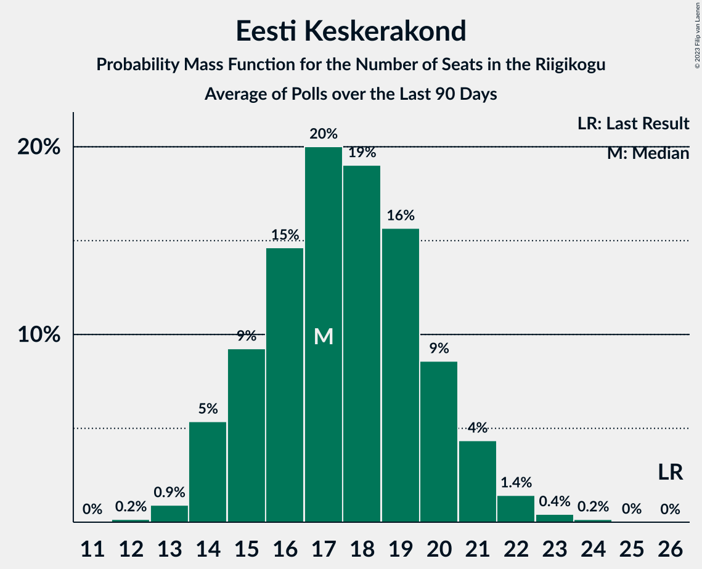

# Poll Average

<a href="#voting-intentions">Voting Intentions</a> | <a href="#seats">Seats</a> | <a href="#coalitions">Coalitions</a> | <a href="#technical-information">Technical Information</a>

## Summary

The table below lists the polls on which the average is based. They are the most recent polls (less than 90 days old) registered and analyzed so far.

| Period     | Polling firm/Commissioner(s) | Ref | Kesk | EKRE | I | SDE | E200 | Rohelised | EVA |
|:----------:|:----------------------------:|:--:|:--:|:--:|:--:|:--:|:--:|:--:|:--:|
| 3 March 2019 | General Election | 28.9%   34 | 23.1%   26 | 17.8%   19 | 11.4%   12 | 9.8%   10 | 4.4%   0 | 1.8%   0 | 1.2%   0 |
| N/A | Poll Average | 28–38%   31–42 | 14–20%   14–21 | 16–24%   16–25 | 8–12%   7–12 | 6–10%   6–10 | 6–15%   5–15 | 1–4%   0 | N/A   N/A |
| [25 July–1 August 2022](2022-08-01-Norstat.html) | Norstat   MTÜ Ühiskonnauuringute Instituut | 33–39%   36–43 | 14–19%   14–19 | 19–24%   20–26 | 7–11%   6–10 | 7–10%   6–10 | 5–8%   4–8 | 1–3%   0 | N/A   N/A |
| [14–20 July 2022](2022-07-20-KantarEmor.html) | Kantar Emor   ERR | 28–32%   31–37 | 13–17%   13–18 | 16–20%   17–21 | 10–13%   9–13 | 8–11%   7–10 | 11–15%   11–15 | 2–4%   0 | N/A   N/A |
| [17 June 2022](2022-06-17-Turu-uuringuteAS.html) | Turu-uuringute AS | 27–35%   31–40 | 14–20%   14–22 | 15–21%   15–23 | 8–13%   7–13 | 6–10%   5–10 | 10–15%   9–15 | 0–2%   0 | N/A   N/A |
| 3 March 2019 | General Election | 28.9%   34 | 23.1%   26 | 17.8%   19 | 11.4%   12 | 9.8%   10 | 4.4%   0 | 1.8%   0 | 1.2%   0 |

Only polls for which at least the sample size has been published are included in the table above.

**Legend:**
+ **Top half of each row:** Voting intentions (95% confidence interval)
+ **Bottom half of each row:** Seat projections for the Riigikogu (95% confidence interval)
+ **Ref:** Eesti Reformierakond
+ **Kesk:** Eesti Keskerakond
+ **EKRE:** Eesti Konservatiivne Rahvaerakond
+ **I:** Erakond Isamaa
+ **SDE:** Sotsiaaldemokraatlik Erakond
+ **E200:** Eesti 200
+ **Rohelised:** Erakond Eestimaa Rohelised
+ **EVA:** Eesti Vabaerakond
+ **N/A (single party):** Party not included the published results
+ **N/A (entire row):** Calculation for this opinion poll not started yet

## Voting Intentions

### Confidence Intervals

| Party | Last Result | Median | 80% Confidence Interval | 90% Confidence Interval | 95% Confidence Interval | 99% Confidence Interval |
|:-----:|:-----------:|:------:|:-----------------------:|:-----------------------:|:-----------------------:|:-----------------------:|
| <a href="#eesti-reformierakond">Eesti Reformierakond</a> | 28.9% | 31.5% | 28.9–36.3% |28.3–37.1% | 27.9–37.7% | 26.9–38.8% |
| <a href="#eesti-keskerakond">Eesti Keskerakond</a> | 23.1% | 16.2% | 14.4–18.3% |14.0–18.9% | 13.6–19.5% | 13.0–20.6% |
| <a href="#eesti-konservatiivne-rahvaerakond">Eesti Konservatiivne Rahvaerakond</a> | 17.8% | 18.9% | 16.8–22.5% |16.3–23.2% | 15.8–23.8% | 14.8–24.8% |
| <a href="#erakond-isamaa">Erakond Isamaa</a> | 11.4% | 10.1% | 8.4–11.7% |8.0–12.1% | 7.7–12.5% | 7.1–13.2% |
| <a href="#sotsiaaldemokraatlik-erakond">Sotsiaaldemokraatlik Erakond</a> | 9.8% | 8.6% | 7.3–9.8% |6.9–10.2% | 6.5–10.5% | 5.9–11.1% |
| <a href="#eesti-200">Eesti 200</a> | 4.4% | 11.8% | 6.3–13.8% |6.0–14.2% | 5.7–14.6% | 5.2–15.4% |
| <a href="#erakond-eestimaa-rohelised">Erakond Eestimaa Rohelised</a> | 1.8% | 1.8% | 0.9–3.3% |0.7–3.5% | 0.6–3.7% | 0.4–4.1% |
| <a href="#eesti-vabaerakond">Eesti Vabaerakond</a> | 1.2% | N/A | N/A |N/A | N/A | N/A |

### Eesti Reformierakond

*For a full overview of the results for this party, see the [Eesti Reformierakond](party-eestireformierakond.html) page.*

| Voting Intentions | Probability | Accumulated | Special Marks |
|:-----------------:|:-----------:|:-----------:|:-------------:|
| 24.5–25.5% | 0% | 100% |  |
| 25.5–26.5% | 0.2% | 100% |  |
| 26.5–27.5% | 1.3% | 99.7% |  |
| 27.5–28.5% | 5% | 98% |  |
| 28.5–29.5% | 12% | 93% | Last Result |
| 29.5–30.5% | 17% | 81% |  |
| 30.5–31.5% | 15% | 64% |  |
| 31.5–32.5% | 9% | 50% | Median |
| 32.5–33.5% | 7% | 40% |  |
| 33.5–34.5% | 8% | 33% |  |
| 34.5–35.5% | 9% | 26% |  |
| 35.5–36.5% | 8% | 17% |  |
| 36.5–37.5% | 5% | 8% |  |
| 37.5–38.5% | 2% | 3% |  |
| 38.5–39.5% | 0.7% | 0.8% |  |
| 39.5–40.5% | 0.1% | 0.1% |  |
| 40.5–41.5% | 0% | 0% |  |

### Eesti Keskerakond

*For a full overview of the results for this party, see the [Eesti Keskerakond](party-eestikeskerakond.html) page.*

| Voting Intentions | Probability | Accumulated | Special Marks |
|:-----------------:|:-----------:|:-----------:|:-------------:|
| 10.5–11.5% | 0% | 100% |  |
| 11.5–12.5% | 0.1% | 100% |  |
| 12.5–13.5% | 2% | 99.9% |  |
| 13.5–14.5% | 11% | 98% |  |
| 14.5–15.5% | 22% | 87% |  |
| 15.5–16.5% | 25% | 65% | Median |
| 16.5–17.5% | 20% | 41% |  |
| 17.5–18.5% | 13% | 20% |  |
| 18.5–19.5% | 5% | 8% |  |
| 19.5–20.5% | 2% | 2% |  |
| 20.5–21.5% | 0.4% | 0.5% |  |
| 21.5–22.5% | 0.1% | 0.1% |  |
| 22.5–23.5% | 0% | 0% | Last Result |

### Eesti Konservatiivne Rahvaerakond

*For a full overview of the results for this party, see the [Eesti Konservatiivne Rahvaerakond](party-eestikonservatiivnerahvaerakond.html) page.*

| Voting Intentions | Probability | Accumulated | Special Marks |
|:-----------------:|:-----------:|:-----------:|:-------------:|
| 12.5–13.5% | 0% | 100% |  |
| 13.5–14.5% | 0.3% | 100% |  |
| 14.5–15.5% | 1.4% | 99.7% |  |
| 15.5–16.5% | 6% | 98% |  |
| 16.5–17.5% | 15% | 92% |  |
| 17.5–18.5% | 21% | 77% | Last Result |
| 18.5–19.5% | 16% | 56% | Median |
| 19.5–20.5% | 10% | 40% |  |
| 20.5–21.5% | 10% | 30% |  |
| 21.5–22.5% | 10% | 20% |  |
| 22.5–23.5% | 7% | 10% |  |
| 23.5–24.5% | 3% | 3% |  |
| 24.5–25.5% | 0.6% | 0.7% |  |
| 25.5–26.5% | 0.1% | 0.1% |  |
| 26.5–27.5% | 0% | 0% |  |

### Erakond Isamaa

*For a full overview of the results for this party, see the [Erakond Isamaa](party-erakondisamaa.html) page.*

| Voting Intentions | Probability | Accumulated | Special Marks |
|:-----------------:|:-----------:|:-----------:|:-------------:|
| 5.5–6.5% | 0.1% | 100% |  |
| 6.5–7.5% | 2% | 99.9% |  |
| 7.5–8.5% | 11% | 98% |  |
| 8.5–9.5% | 23% | 87% |  |
| 9.5–10.5% | 26% | 64% | Median |
| 10.5–11.5% | 25% | 38% | Last Result |
| 11.5–12.5% | 11% | 13% |  |
| 12.5–13.5% | 2% | 2% |  |
| 13.5–14.5% | 0.2% | 0.2% |  |
| 14.5–15.5% | 0% | 0% |  |

### Sotsiaaldemokraatlik Erakond

*For a full overview of the results for this party, see the [Sotsiaaldemokraatlik Erakond](party-sotsiaaldemokraatlikerakond.html) page.*

| Voting Intentions | Probability | Accumulated | Special Marks |
|:-----------------:|:-----------:|:-----------:|:-------------:|
| 3.5–4.5% | 0% | 100% |  |
| 4.5–5.5% | 0.2% | 100% |  |
| 5.5–6.5% | 2% | 99.8% |  |
| 6.5–7.5% | 12% | 97% |  |
| 7.5–8.5% | 32% | 85% |  |
| 8.5–9.5% | 37% | 53% | Median |
| 9.5–10.5% | 14% | 16% | Last Result |
| 10.5–11.5% | 2% | 2% |  |
| 11.5–12.5% | 0.1% | 0.1% |  |
| 12.5–13.5% | 0% | 0% |  |

### Eesti 200

*For a full overview of the results for this party, see the [Eesti 200](party-eesti200.html) page.*

| Voting Intentions | Probability | Accumulated | Special Marks |
|:-----------------:|:-----------:|:-----------:|:-------------:|
| 3.5–4.5% | 0% | 100% | Last Result |
| 4.5–5.5% | 2% | 100% |  |
| 5.5–6.5% | 12% | 98% |  |
| 6.5–7.5% | 14% | 87% |  |
| 7.5–8.5% | 5% | 72% |  |
| 8.5–9.5% | 1.2% | 67% |  |
| 9.5–10.5% | 3% | 66% |  |
| 10.5–11.5% | 9% | 63% |  |
| 11.5–12.5% | 18% | 54% | Median |
| 12.5–13.5% | 22% | 36% |  |
| 13.5–14.5% | 11% | 14% |  |
| 14.5–15.5% | 2% | 3% |  |
| 15.5–16.5% | 0.3% | 0.4% |  |
| 16.5–17.5% | 0% | 0% |  |

### Erakond Eestimaa Rohelised

*For a full overview of the results for this party, see the [Erakond Eestimaa Rohelised](party-erakondeestimaarohelised.html) page.*

| Voting Intentions | Probability | Accumulated | Special Marks |
|:-----------------:|:-----------:|:-----------:|:-------------:|
| 0.0–0.5% | 2% | 100% |  |
| 0.5–1.5% | 36% | 98% |  |
| 1.5–2.5% | 31% | 63% | Last Result, Median |
| 2.5–3.5% | 27% | 31% |  |
| 3.5–4.5% | 4% | 5% |  |
| 4.5–5.5% | 0% | 0% |  |
| 5.5–6.5% | 0% | 0% |  |

## Seats

### Confidence Intervals

| Party | Last Result | Median | 80% Confidence Interval | 90% Confidence Interval | 95% Confidence Interval | 99% Confidence Interval |
|:-----:|:-----------:|:------:|:-----------------------:|:-----------------------:|:-----------------------:|:-----------------------:|
| <a href="#eesti-reformierakond">Eesti Reformierakond</a> | 34 | 36 | 32–41 |32–42 | 31–42 | 30–44 |
| <a href="#eesti-keskerakond">Eesti Keskerakond</a> | 26 | 16 | 15–19 |14–20 | 14–21 | 13–22 |
| <a href="#eesti-konservatiivne-rahvaerakond">Eesti Konservatiivne Rahvaerakond</a> | 19 | 20 | 17–24 |17–24 | 16–25 | 15–26 |
| <a href="#erakond-isamaa">Erakond Isamaa</a> | 12 | 10 | 8–12 |7–12 | 7–12 | 6–13 |
| <a href="#sotsiaaldemokraatlik-erakond">Sotsiaaldemokraatlik Erakond</a> | 10 | 8 | 6–9 |6–10 | 6–10 | 5–11 |
| <a href="#eesti-200">Eesti 200</a> | 0 | 12 | 6–14 |5–14 | 5–15 | 4–16 |
| <a href="#erakond-eestimaa-rohelised">Erakond Eestimaa Rohelised</a> | 0 | 0 | 0 |0 | 0 | 0 |
| <a href="#eesti-vabaerakond">Eesti Vabaerakond</a> | 0 | N/A | N/A |N/A | N/A | N/A |

### Eesti Reformierakond

*For a full overview of the results for this party, see the [Eesti Reformierakond](party-eestireformierakond.html) page.*

| Number of Seats | Probability | Accumulated | Special Marks |
|:---------------:|:-----------:|:-----------:|:-------------:|
| 28 | 0.1% | 100% |  |
| 29 | 0.2% | 99.9% |  |
| 30 | 0.7% | 99.7% |  |
| 31 | 3% | 99.0% |  |
| 32 | 6% | 96% |  |
| 33 | 12% | 90% |  |
| 34 | 14% | 78% | Last Result |
| 35 | 13% | 64% |  |
| 36 | 9% | 51% | Median |
| 37 | 8% | 42% |  |
| 38 | 8% | 34% |  |
| 39 | 7% | 26% |  |
| 40 | 7% | 18% |  |
| 41 | 5% | 11% |  |
| 42 | 4% | 6% |  |
| 43 | 0.9% | 1.5% |  |
| 44 | 0.4% | 0.6% |  |
| 45 | 0.1% | 0.1% |  |
| 46 | 0% | 0% |  |

### Eesti Keskerakond

*For a full overview of the results for this party, see the [Eesti Keskerakond](party-eestikeskerakond.html) page.*

| Number of Seats | Probability | Accumulated | Special Marks |
|:---------------:|:-----------:|:-----------:|:-------------:|
| 12 | 0.1% | 100% |  |
| 13 | 2% | 99.9% |  |
| 14 | 8% | 98% |  |
| 15 | 18% | 90% |  |
| 16 | 22% | 72% | Median |
| 17 | 21% | 49% |  |
| 18 | 14% | 28% |  |
| 19 | 8% | 14% |  |
| 20 | 4% | 7% |  |
| 21 | 2% | 3% |  |
| 22 | 0.7% | 0.9% |  |
| 23 | 0.2% | 0.2% |  |
| 24 | 0% | 0.1% |  |
| 25 | 0% | 0% |  |
| 26 | 0% | 0% | Last Result |

### Eesti Konservatiivne Rahvaerakond

*For a full overview of the results for this party, see the [Eesti Konservatiivne Rahvaerakond](party-eestikonservatiivnerahvaerakond.html) page.*

| Number of Seats | Probability | Accumulated | Special Marks |
|:---------------:|:-----------:|:-----------:|:-------------:|
| 14 | 0.1% | 100% |  |
| 15 | 0.7% | 99.8% |  |
| 16 | 3% | 99.1% |  |
| 17 | 7% | 96% |  |
| 18 | 14% | 90% |  |
| 19 | 19% | 75% | Last Result |
| 20 | 14% | 57% | Median |
| 21 | 13% | 42% |  |
| 22 | 9% | 29% |  |
| 23 | 10% | 20% |  |
| 24 | 6% | 10% |  |
| 25 | 3% | 4% |  |
| 26 | 1.0% | 1.4% |  |
| 27 | 0.3% | 0.3% |  |
| 28 | 0% | 0.1% |  |
| 29 | 0% | 0% |  |

### Erakond Isamaa

*For a full overview of the results for this party, see the [Erakond Isamaa](party-erakondisamaa.html) page.*

| Number of Seats | Probability | Accumulated | Special Marks |
|:---------------:|:-----------:|:-----------:|:-------------:|
| 6 | 1.0% | 100% |  |
| 7 | 6% | 98.9% |  |
| 8 | 18% | 93% |  |
| 9 | 21% | 75% |  |
| 10 | 22% | 53% | Median |
| 11 | 19% | 31% |  |
| 12 | 10% | 12% | Last Result |
| 13 | 2% | 2% |  |
| 14 | 0.3% | 0.3% |  |
| 15 | 0% | 0% |  |

### Sotsiaaldemokraatlik Erakond

*For a full overview of the results for this party, see the [Sotsiaaldemokraatlik Erakond](party-sotsiaaldemokraatlikerakond.html) page.*

| Number of Seats | Probability | Accumulated | Special Marks |
|:---------------:|:-----------:|:-----------:|:-------------:|
| 4 | 0.1% | 100% |  |
| 5 | 1.3% | 99.9% |  |
| 6 | 9% | 98.6% |  |
| 7 | 24% | 90% |  |
| 8 | 34% | 66% | Median |
| 9 | 24% | 32% |  |
| 10 | 7% | 8% | Last Result |
| 11 | 0.9% | 1.0% |  |
| 12 | 0.1% | 0.1% |  |
| 13 | 0% | 0% |  |

### Eesti 200

*For a full overview of the results for this party, see the [Eesti 200](party-eesti200.html) page.*

| Number of Seats | Probability | Accumulated | Special Marks |
|:---------------:|:-----------:|:-----------:|:-------------:|
| 0 | 0.3% | 100% | Last Result |
| 1 | 0% | 99.7% |  |
| 2 | 0% | 99.7% |  |
| 3 | 0% | 99.7% |  |
| 4 | 0.9% | 99.7% |  |
| 5 | 8% | 98.8% |  |
| 6 | 16% | 91% |  |
| 7 | 7% | 74% |  |
| 8 | 1.0% | 68% |  |
| 9 | 1.3% | 67% |  |
| 10 | 4% | 65% |  |
| 11 | 9% | 61% |  |
| 12 | 17% | 52% | Median |
| 13 | 18% | 36% |  |
| 14 | 13% | 18% |  |
| 15 | 4% | 5% |  |
| 16 | 0.7% | 0.9% |  |
| 17 | 0.1% | 0.1% |  |
| 18 | 0% | 0% |  |

### Erakond Eestimaa Rohelised

*For a full overview of the results for this party, see the [Erakond Eestimaa Rohelised](party-erakondeestimaarohelised.html) page.*

| Number of Seats | Probability | Accumulated | Special Marks |
|:---------------:|:-----------:|:-----------:|:-------------:|
| 0 | 100% | 100% | Last Result, Median |

### Eesti Vabaerakond

*For a full overview of the results for this party, see the [Eesti Vabaerakond](party-eestivabaerakond.html) page.*

## Coalitions

### Confidence Intervals

| Coalition | Last Result | Median | Majority? | 80% Confidence Interval | 90% Confidence Interval | 95% Confidence Interval | 99% Confidence Interval |
|:---------:|:-----------:|:------:|:---------:|:-----------------------:|:-----------------------:|:-----------------------:|:-----------------------:|
| Eesti Reformierakond – Eesti Keskerakond – Eesti Konservatiivne Rahvaerakond | 79 | 72 | 100% | 67–80 | 67–80 | 66–81 | 65–83 |
| Eesti Reformierakond – Eesti Konservatiivne Rahvaerakond – Erakond Isamaa | 65 | 65 | 100% | 62–71 | 61–72 | 60–73 | 59–74 |
| Eesti Reformierakond – Eesti Konservatiivne Rahvaerakond | 53 | 55 | 96% | 51–63 | 51–64 | 50–65 | 48–66 |
| Eesti Reformierakond – Eesti Keskerakond | 60 | 53 | 68% | 48–57 | 48–58 | 47–59 | 46–60 |
| Eesti Reformierakond – Erakond Isamaa – Sotsiaaldemokraatlik Erakond – Eesti Vabaerakond | 56 | 54 | 91% | 51–57 | 49–58 | 49–58 | 47–60 |
| Eesti Reformierakond – Erakond Isamaa – Sotsiaaldemokraatlik Erakond | 56 | 54 | 91% | 51–57 | 49–58 | 49–58 | 47–60 |
| Eesti Keskerakond – Eesti Konservatiivne Rahvaerakond – Erakond Isamaa | 57 | 46 | 4% | 44–49 | 43–50 | 42–51 | 41–52 |
| Eesti Reformierakond – Erakond Isamaa | 46 | 46 | 3% | 43–49 | 42–50 | 41–51 | 40–52 |
| Eesti Reformierakond – Sotsiaaldemokraatlik Erakond | 44 | 44 | 1.2% | 41–48 | 40–49 | 39–50 | 37–51 |
| Eesti Keskerakond – Eesti Konservatiivne Rahvaerakond | 45 | 37 | 0% | 33–41 | 33–42 | 32–42 | 31–44 |
| Eesti Keskerakond – Erakond Isamaa – Sotsiaaldemokraatlik Erakond | 48 | 34 | 0% | 32–37 | 31–38 | 30–38 | 29–40 |
| Eesti Konservatiivne Rahvaerakond – Sotsiaaldemokraatlik Erakond | 29 | 28 | 0% | 25–31 | 24–32 | 24–33 | 22–34 |
| Eesti Keskerakond – Sotsiaaldemokraatlik Erakond | 36 | 24 | 0% | 22–27 | 22–28 | 21–28 | 20–30 |

### Eesti Reformierakond – Eesti Keskerakond – Eesti Konservatiivne Rahvaerakond

| Number of Seats | Probability | Accumulated | Special Marks |
|:---------------:|:-----------:|:-----------:|:-------------:|
| 64 | 0.1% | 100% |  |
| 65 | 0.4% | 99.9% |  |
| 66 | 3% | 99.5% |  |
| 67 | 9% | 96% |  |
| 68 | 8% | 87% |  |
| 69 | 8% | 79% |  |
| 70 | 9% | 71% |  |
| 71 | 9% | 62% |  |
| 72 | 8% | 53% | Median |
| 73 | 5% | 45% |  |
| 74 | 4% | 40% |  |
| 75 | 2% | 36% |  |
| 76 | 2% | 34% |  |
| 77 | 4% | 32% |  |
| 78 | 8% | 28% |  |
| 79 | 8% | 21% | Last Result |
| 80 | 7% | 12% |  |
| 81 | 3% | 5% |  |
| 82 | 1.2% | 2% |  |
| 83 | 0.3% | 0.5% |  |
| 84 | 0.1% | 0.2% |  |
| 85 | 0.1% | 0.1% |  |
| 86 | 0% | 0% |  |

### Eesti Reformierakond – Eesti Konservatiivne Rahvaerakond – Erakond Isamaa

| Number of Seats | Probability | Accumulated | Special Marks |
|:---------------:|:-----------:|:-----------:|:-------------:|
| 57 | 0.1% | 100% |  |
| 58 | 0.3% | 99.9% |  |
| 59 | 0.8% | 99.6% |  |
| 60 | 2% | 98.8% |  |
| 61 | 4% | 97% |  |
| 62 | 9% | 93% |  |
| 63 | 13% | 84% |  |
| 64 | 14% | 71% |  |
| 65 | 12% | 57% | Last Result |
| 66 | 7% | 45% | Median |
| 67 | 4% | 38% |  |
| 68 | 4% | 34% |  |
| 69 | 4% | 30% |  |
| 70 | 8% | 26% |  |
| 71 | 9% | 19% |  |
| 72 | 5% | 9% |  |
| 73 | 3% | 5% |  |
| 74 | 1.1% | 2% |  |
| 75 | 0.3% | 0.4% |  |
| 76 | 0.1% | 0.1% |  |
| 77 | 0% | 0% |  |

### Eesti Reformierakond – Eesti Konservatiivne Rahvaerakond

| Number of Seats | Probability | Accumulated | Special Marks |
|:---------------:|:-----------:|:-----------:|:-------------:|
| 47 | 0.1% | 100% |  |
| 48 | 0.4% | 99.9% |  |
| 49 | 0.9% | 99.5% |  |
| 50 | 3% | 98.6% |  |
| 51 | 6% | 96% | Majority |
| 52 | 11% | 89% |  |
| 53 | 13% | 78% | Last Result |
| 54 | 12% | 65% |  |
| 55 | 10% | 53% |  |
| 56 | 5% | 43% | Median |
| 57 | 3% | 38% |  |
| 58 | 2% | 35% |  |
| 59 | 2% | 34% |  |
| 60 | 4% | 32% |  |
| 61 | 5% | 28% |  |
| 62 | 8% | 23% |  |
| 63 | 7% | 15% |  |
| 64 | 5% | 8% |  |
| 65 | 2% | 3% |  |
| 66 | 0.9% | 1.3% |  |
| 67 | 0.3% | 0.4% |  |
| 68 | 0.1% | 0.1% |  |
| 69 | 0% | 0% |  |

### Eesti Reformierakond – Eesti Keskerakond

| Number of Seats | Probability | Accumulated | Special Marks |
|:---------------:|:-----------:|:-----------:|:-------------:|
| 45 | 0.2% | 100% |  |
| 46 | 1.1% | 99.8% |  |
| 47 | 3% | 98.6% |  |
| 48 | 7% | 96% |  |
| 49 | 9% | 88% |  |
| 50 | 12% | 80% |  |
| 51 | 8% | 68% | Majority |
| 52 | 8% | 60% | Median |
| 53 | 8% | 52% |  |
| 54 | 9% | 44% |  |
| 55 | 9% | 35% |  |
| 56 | 10% | 27% |  |
| 57 | 7% | 16% |  |
| 58 | 5% | 9% |  |
| 59 | 3% | 4% |  |
| 60 | 0.9% | 1.3% | Last Result |
| 61 | 0.3% | 0.4% |  |
| 62 | 0.1% | 0.1% |  |
| 63 | 0% | 0% |  |

### Eesti Reformierakond – Erakond Isamaa – Sotsiaaldemokraatlik Erakond – Eesti Vabaerakond

| Number of Seats | Probability | Accumulated | Special Marks |
|:---------------:|:-----------:|:-----------:|:-------------:|
| 45 | 0.1% | 100% |  |
| 46 | 0.2% | 99.9% |  |
| 47 | 0.6% | 99.7% |  |
| 48 | 1.1% | 99.1% |  |
| 49 | 3% | 98% |  |
| 50 | 4% | 95% |  |
| 51 | 8% | 91% | Majority |
| 52 | 11% | 83% |  |
| 53 | 17% | 71% |  |
| 54 | 14% | 54% | Median |
| 55 | 15% | 40% |  |
| 56 | 11% | 25% | Last Result |
| 57 | 7% | 13% |  |
| 58 | 4% | 6% |  |
| 59 | 1.3% | 2% |  |
| 60 | 0.6% | 0.8% |  |
| 61 | 0.1% | 0.2% |  |
| 62 | 0% | 0% |  |

### Eesti Reformierakond – Erakond Isamaa – Sotsiaaldemokraatlik Erakond

| Number of Seats | Probability | Accumulated | Special Marks |
|:---------------:|:-----------:|:-----------:|:-------------:|
| 45 | 0.1% | 100% |  |
| 46 | 0.2% | 99.9% |  |
| 47 | 0.6% | 99.7% |  |
| 48 | 1.1% | 99.1% |  |
| 49 | 3% | 98% |  |
| 50 | 4% | 95% |  |
| 51 | 8% | 91% | Majority |
| 52 | 11% | 83% |  |
| 53 | 17% | 71% |  |
| 54 | 14% | 54% | Median |
| 55 | 15% | 40% |  |
| 56 | 11% | 25% | Last Result |
| 57 | 7% | 13% |  |
| 58 | 4% | 6% |  |
| 59 | 1.3% | 2% |  |
| 60 | 0.6% | 0.8% |  |
| 61 | 0.1% | 0.2% |  |
| 62 | 0% | 0% |  |

### Eesti Keskerakond – Eesti Konservatiivne Rahvaerakond – Erakond Isamaa

| Number of Seats | Probability | Accumulated | Special Marks |
|:---------------:|:-----------:|:-----------:|:-------------:|
| 39 | 0.1% | 100% |  |
| 40 | 0.1% | 99.9% |  |
| 41 | 0.6% | 99.8% |  |
| 42 | 2% | 99.2% |  |
| 43 | 4% | 97% |  |
| 44 | 10% | 93% |  |
| 45 | 16% | 82% |  |
| 46 | 18% | 66% | Median |
| 47 | 18% | 49% |  |
| 48 | 11% | 31% |  |
| 49 | 10% | 20% |  |
| 50 | 5% | 9% |  |
| 51 | 3% | 4% | Majority |
| 52 | 1.3% | 2% |  |
| 53 | 0.3% | 0.4% |  |
| 54 | 0.1% | 0.2% |  |
| 55 | 0% | 0% |  |
| 56 | 0% | 0% |  |
| 57 | 0% | 0% | Last Result |

### Eesti Reformierakond – Erakond Isamaa

| Number of Seats | Probability | Accumulated | Special Marks |
|:---------------:|:-----------:|:-----------:|:-------------:|
| 38 | 0.1% | 100% |  |
| 39 | 0.3% | 99.8% |  |
| 40 | 0.8% | 99.5% |  |
| 41 | 2% | 98.7% |  |
| 42 | 5% | 96% |  |
| 43 | 8% | 91% |  |
| 44 | 14% | 83% |  |
| 45 | 16% | 69% |  |
| 46 | 15% | 53% | Last Result, Median |
| 47 | 13% | 38% |  |
| 48 | 10% | 25% |  |
| 49 | 8% | 16% |  |
| 50 | 5% | 8% |  |
| 51 | 2% | 3% | Majority |
| 52 | 0.7% | 0.9% |  |
| 53 | 0.2% | 0.3% |  |
| 54 | 0.1% | 0.1% |  |
| 55 | 0% | 0% |  |

### Eesti Reformierakond – Sotsiaaldemokraatlik Erakond

| Number of Seats | Probability | Accumulated | Special Marks |
|:---------------:|:-----------:|:-----------:|:-------------:|
| 36 | 0.1% | 100% |  |
| 37 | 0.5% | 99.8% |  |
| 38 | 0.7% | 99.3% |  |
| 39 | 4% | 98.6% |  |
| 40 | 4% | 95% |  |
| 41 | 11% | 91% |  |
| 42 | 15% | 80% |  |
| 43 | 12% | 66% |  |
| 44 | 13% | 53% | Last Result, Median |
| 45 | 8% | 41% |  |
| 46 | 8% | 32% |  |
| 47 | 7% | 24% |  |
| 48 | 7% | 16% |  |
| 49 | 6% | 10% |  |
| 50 | 3% | 4% |  |
| 51 | 0.8% | 1.2% | Majority |
| 52 | 0.3% | 0.4% |  |
| 53 | 0.1% | 0.1% |  |
| 54 | 0% | 0% |  |

### Eesti Keskerakond – Eesti Konservatiivne Rahvaerakond

| Number of Seats | Probability | Accumulated | Special Marks |
|:---------------:|:-----------:|:-----------:|:-------------:|
| 30 | 0.1% | 100% |  |
| 31 | 0.7% | 99.8% |  |
| 32 | 3% | 99.1% |  |
| 33 | 8% | 96% |  |
| 34 | 12% | 88% |  |
| 35 | 10% | 75% |  |
| 36 | 11% | 65% | Median |
| 37 | 11% | 54% |  |
| 38 | 13% | 43% |  |
| 39 | 11% | 30% |  |
| 40 | 8% | 19% |  |
| 41 | 5% | 11% |  |
| 42 | 4% | 5% |  |
| 43 | 1.3% | 2% |  |
| 44 | 0.4% | 0.6% |  |
| 45 | 0.1% | 0.2% | Last Result |
| 46 | 0% | 0% |  |

### Eesti Keskerakond – Erakond Isamaa – Sotsiaaldemokraatlik Erakond

| Number of Seats | Probability | Accumulated | Special Marks |
|:---------------:|:-----------:|:-----------:|:-------------:|
| 28 | 0.2% | 100% |  |
| 29 | 0.9% | 99.7% |  |
| 30 | 2% | 98.9% |  |
| 31 | 6% | 96% |  |
| 32 | 10% | 90% |  |
| 33 | 15% | 80% |  |
| 34 | 20% | 64% | Median |
| 35 | 17% | 44% |  |
| 36 | 14% | 27% |  |
| 37 | 7% | 13% |  |
| 38 | 4% | 6% |  |
| 39 | 1.4% | 2% |  |
| 40 | 0.6% | 0.9% |  |
| 41 | 0.2% | 0.3% |  |
| 42 | 0.1% | 0.1% |  |
| 43 | 0% | 0% |  |
| 44 | 0% | 0% |  |
| 45 | 0% | 0% |  |
| 46 | 0% | 0% |  |
| 47 | 0% | 0% |  |
| 48 | 0% | 0% | Last Result |

### Eesti Konservatiivne Rahvaerakond – Sotsiaaldemokraatlik Erakond

| Number of Seats | Probability | Accumulated | Special Marks |
|:---------------:|:-----------:|:-----------:|:-------------:|
| 20 | 0% | 100% |  |
| 21 | 0.2% | 99.9% |  |
| 22 | 0.7% | 99.8% |  |
| 23 | 2% | 99.1% |  |
| 24 | 3% | 98% |  |
| 25 | 7% | 94% |  |
| 26 | 11% | 87% |  |
| 27 | 15% | 76% |  |
| 28 | 18% | 61% | Median |
| 29 | 14% | 43% | Last Result |
| 30 | 11% | 29% |  |
| 31 | 9% | 18% |  |
| 32 | 5% | 9% |  |
| 33 | 3% | 4% |  |
| 34 | 1.0% | 1.4% |  |
| 35 | 0.3% | 0.4% |  |
| 36 | 0.1% | 0.1% |  |
| 37 | 0% | 0% |  |

### Eesti Keskerakond – Sotsiaaldemokraatlik Erakond

| Number of Seats | Probability | Accumulated | Special Marks |
|:---------------:|:-----------:|:-----------:|:-------------:|
| 19 | 0.1% | 100% |  |
| 20 | 0.4% | 99.9% |  |
| 21 | 2% | 99.5% |  |
| 22 | 7% | 97% |  |
| 23 | 17% | 90% |  |
| 24 | 24% | 73% | Median |
| 25 | 21% | 48% |  |
| 26 | 14% | 27% |  |
| 27 | 7% | 13% |  |
| 28 | 4% | 6% |  |
| 29 | 2% | 2% |  |
| 30 | 0.5% | 0.8% |  |
| 31 | 0.2% | 0.3% |  |
| 32 | 0.1% | 0.1% |  |
| 33 | 0% | 0% |  |
| 34 | 0% | 0% |  |
| 35 | 0% | 0% |  |
| 36 | 0% | 0% | Last Result |

## Technical Information

+ **Number of polls included in this average:** 3
+ **Lowest number of simulations done in a poll included in this average:** 1,048,576
+ **Total number of simulations done in the polls included in this average:** 3,145,728
+ **Error estimate:** 2.33%
