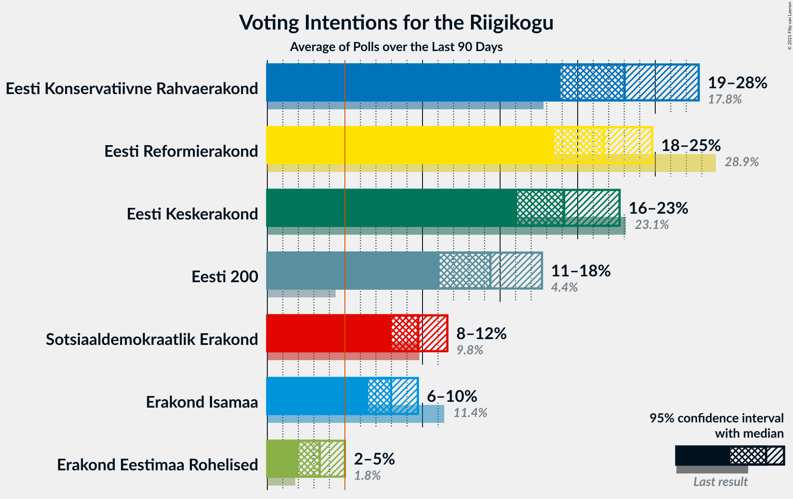
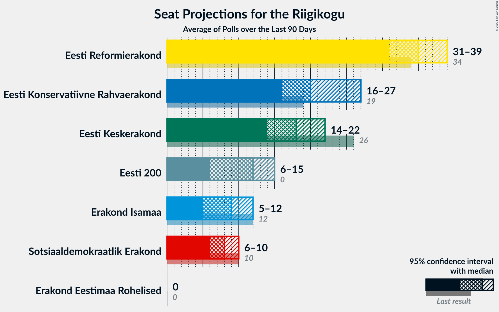
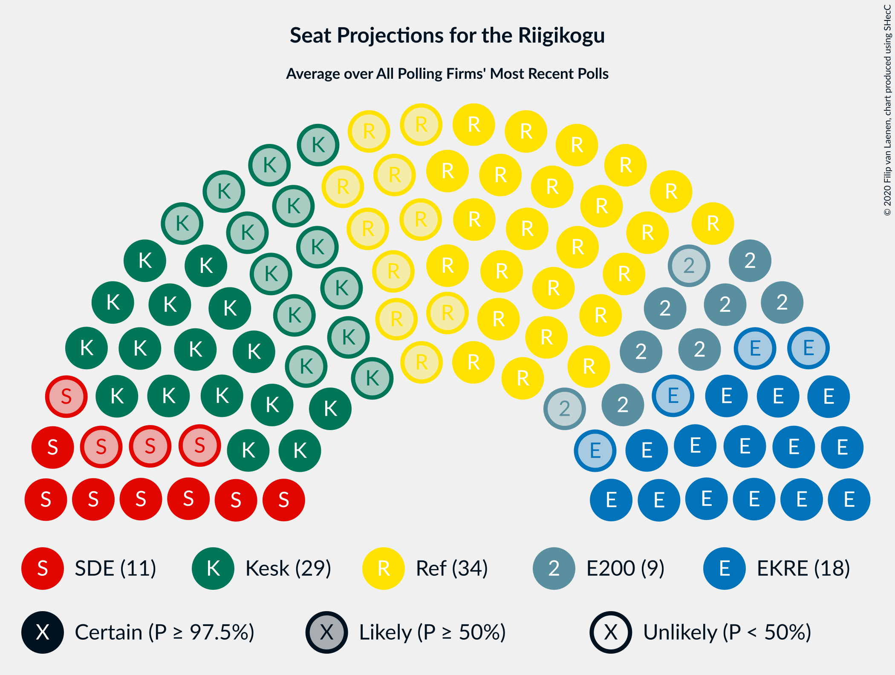
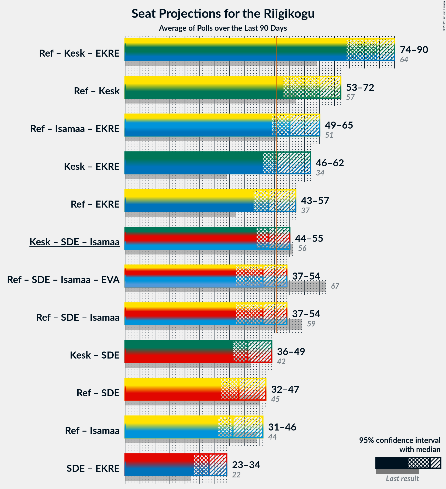

# Overview

The table below lists the most recent polls (less than 90 days old) registered and analyzed so far.

| Period     | Polling firm/Commissioner(s) | Ref | Kesk | EKRE | I | SDE | E200 | Rohelised | EVA |
|:----------:|:----------------------------:|:--:|:--:|:--:|:--:|:--:|:--:|:--:|:--:|
| 3 March 2019 | General Election | 28.9%   34 | 23.1%   26 | 17.8%   19 | 11.4%   12 | 9.8%   10 | 4.4%   0 | 1.8%   0 | 1.2%   0 |
| N/A | [Poll Average](average.html) | 21–34%   23–39 | 12–20%   12–21 | 17–24%   17–26 | 5–8%   0–8 | 5–10%   0–9 | 15–24%   15–27 | 2–5%   0 | N/A   N/A |
| [6–11 April 2022](2022-04-11-Norstat.html) | Norstat   MTÜ Ühiskonnauuringute Instituut | 29–35%   32–40 | 14–18%   14–19 | 18–23%   19–25 | 4–7%   0–7 | 5–8%   0–7 | 14–19%   14–20 | 1–3%   0 | N/A   N/A |
| [19 March 2022](2022-03-19-Turu-uuringuteAS.html) | Turu-uuringute AS | 20–26%   22–29 | 12–17%   12–17 | 18–24%   20–26 | 5–9%   5–9 | 6–10%   6–10 | 19–25%   21–28 | 2–4%   0 | N/A   N/A |
| [10–16 March 2022](2022-03-16-KantarEmor.html) | Kantar Emor   ERR | 24–29%   26–32 | 16–20%   17–22 | 16–20%   17–22 | 5–7%   0–7 | 7–10%   6–9 | 17–21%   18–23 | 3–5%   0–4 | N/A   N/A |
| 3 March 2019 | General Election | 28.9%   34 | 23.1%   26 | 17.8%   19 | 11.4%   12 | 9.8%   10 | 4.4%   0 | 1.8%   0 | 1.2%   0 |

Only polls for which at least the sample size has been published are included in the table above.

**Legend:**
+ **Top half of each row:** Voting intentions (95% confidence interval)
+ **Bottom half of each row:** Seat projections for the Riigikogu (95% confidence interval)
+ **Ref:** Eesti Reformierakond
+ **Kesk:** Eesti Keskerakond
+ **EKRE:** Eesti Konservatiivne Rahvaerakond
+ **I:** Erakond Isamaa
+ **SDE:** Sotsiaaldemokraatlik Erakond
+ **E200:** Eesti 200
+ **Rohelised:** Erakond Eestimaa Rohelised
+ **EVA:** Eesti Vabaerakond
+ **N/A (single party):** Party not included the published results
+ **N/A (entire row):** Calculation for this opinion poll not started yet

