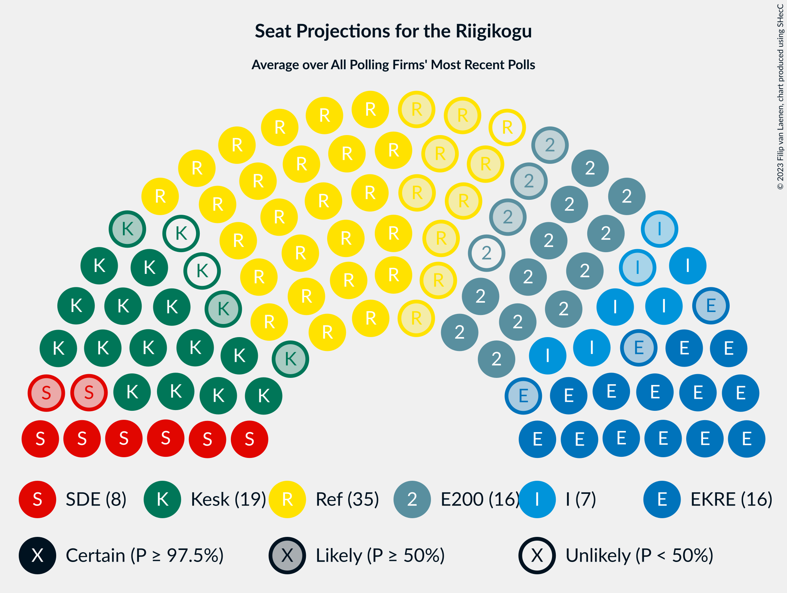

# Overview

The table below lists the most recent polls (less than 90 days old) registered and analyzed so far.

| Period     | Polling firm/Commissioner(s) | Ref | Kesk | EKRE | I | SDE | E200 | Rohelised | EVA |
|:----------:|:----------------------------:|:--:|:--:|:--:|:--:|:--:|:--:|:--:|:--:|
| 3 March 2019 | General Election | 28.9%   34 | 23.1%   26 | 17.8%   19 | 11.4%   12 | 9.8%   10 | 4.4%   0 | 1.8%   0 | 1.2%   0 |
| N/A | [Poll Average](average.html) | 27–38%   30–43 | 12–19%   12–20 | 16–22%   16–24 | 5–9%   5–8 | 5–9%   4–8 | 11–20%   11–22 | 1–4%   0 | N/A   N/A |
| [16–23 May 2022](2022-05-23-Norstat.html) | Norstat   MTÜ Ühiskonnauuringute Instituut | 32–38%   37–44 | 15–20%   15–21 | 16–21%   17–22 | 5–9%   5–8 | 5–8%   0–7 | 10–14%   10–15 | 1–3%   0 | N/A   N/A |
| [12–20 May 2022](2022-05-20-KantarEmor.html) | Kantar Emor   ERR | 31–35%   34–40 | 14–18%   14–18 | 15–19%   15–20 | 6–8%   5–8 | 6–8%   5–8 | 15–19%   15–20 | 2–4%   0 | N/A   N/A |
| [18 April 2022](2022-04-18-Turu-uuringuteAS.html) | Turu-uuringute AS | 26–34%   29–38 | 11–17%   11–18 | 17–23%   18–25 | 5–9%   4–9 | 5–9%   4–9 | 15–21%   15–23 | 1–3%   0 | N/A   N/A |
| 3 March 2019 | General Election | 28.9%   34 | 23.1%   26 | 17.8%   19 | 11.4%   12 | 9.8%   10 | 4.4%   0 | 1.8%   0 | 1.2%   0 |

Only polls for which at least the sample size has been published are included in the table above.

**Legend:**
+ **Top half of each row:** Voting intentions (95% confidence interval)
+ **Bottom half of each row:** Seat projections for the Riigikogu (95% confidence interval)
+ **Ref:** Eesti Reformierakond
+ **Kesk:** Eesti Keskerakond
+ **EKRE:** Eesti Konservatiivne Rahvaerakond
+ **I:** Erakond Isamaa
+ **SDE:** Sotsiaaldemokraatlik Erakond
+ **E200:** Eesti 200
+ **Rohelised:** Erakond Eestimaa Rohelised
+ **EVA:** Eesti Vabaerakond
+ **N/A (single party):** Party not included the published results
+ **N/A (entire row):** Calculation for this opinion poll not started yet

