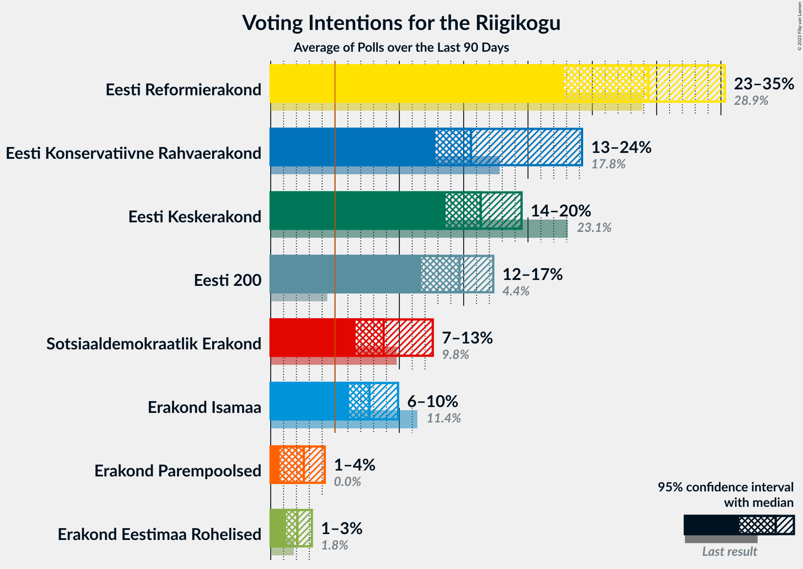

# Overview

The table below lists the most recent polls (less than 90 days old) registered and analyzed so far.

| Period     | Polling firm/Commissioner(s) | Ref | Kesk | EKRE | I | SDE | E200 | Rohelised | EVA |
|:----------:|:----------------------------:|:--:|:--:|:--:|:--:|:--:|:--:|:--:|:--:|
| 3 March 2019 | General Election | 28.9%   34 | 23.1%   26 | 17.8%   19 | 11.4%   12 | 9.8%   10 | 4.4%   0 | 1.8%   0 | 1.2%   0 |
| N/A | [Poll Average](average.html) | 26–36%   30–43 | 17–29%   19–32 | 14–21%   15–23 | 2–7%   0–6 | 7–11%   6–12 | 6–14%   5–16 | 1–4%   0 | 0–1%   0 |
| [14–20 July 2020](2020-07-20-Norstat.html) | Norstat   MTÜ Ühiskonnauuringute Instituut | 31–37%   35–43 | 21–26%   23–29 | 15–19%   15–20 | 4–7%   0–7 | 7–11%   6–10 | 5–9%   5–8 | 2–3%   0 | 0–1%   0 |
| [1–30 June 2020](2020-06-30-KantarEmor.html) | Kantar Emor   BNS and Postimees | 26–30%   29–36 | 17–21%   18–24 | 17–21%   18–24 | 4–6%   0–6 | 8–12%   8–12 | 11–15%   12–16 | 2–4%   0 | 0–1%   0 |
| [9–15 June 2020](2020-06-15-Turu-uuringuteAS.html) | Turu-uuringute AS   ERR | 30–36%   35–41 | 25–30%   27–34 | 14–19%   14–20 | 2–4%   0 | 7–10%   6–9 | 7–11%   7–11 | 1–3%   0 | 0–1%   0 |
| 3 March 2019 | General Election | 28.9%   34 | 23.1%   26 | 17.8%   19 | 11.4%   12 | 9.8%   10 | 4.4%   0 | 1.8%   0 | 1.2%   0 |

Only polls for which at least the sample size has been published are included in the table above.

**Legend:**
+ **Top half of each row:** Voting intentions (95% confidence interval)
+ **Bottom half of each row:** Seat projections for the Riigikogu (95% confidence interval)
+ **Ref:** Eesti Reformierakond
+ **Kesk:** Eesti Keskerakond
+ **EKRE:** Eesti Konservatiivne Rahvaerakond
+ **I:** Erakond Isamaa
+ **SDE:** Sotsiaaldemokraatlik Erakond
+ **E200:** Eesti 200
+ **Rohelised:** Erakond Eestimaa Rohelised
+ **EVA:** Eesti Vabaerakond
+ **N/A (single party):** Party not included the published results
+ **N/A (entire row):** Calculation for this opinion poll not started yet

