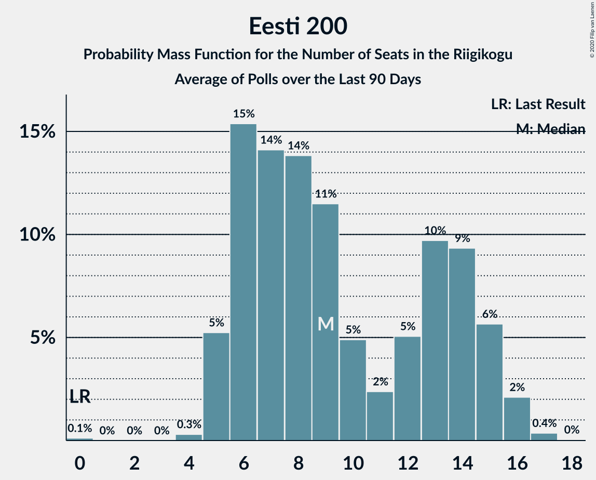

# Eesti 200

<a href="#voting-intentions">Voting Intentions</a> | <a href="#seats">Seats</a>

## Voting Intentions

Last result: **4.4%** (General Election of 3 March 2019)

### Confidence Intervals

| Period     | Polling firm/Commissioner(s) | Median | 80% Confidence Interval | 90% Confidence Interval | 95% Confidence Interval | 99% Confidence Interval |
|:----------:|:----------------:|:-----------:|:-----------------------:|:-----------------------:|:-----------------------:|:-----------------------:|
| N/A | [Poll Average](average.html) | 10.0% | 8.4–13.5% | 8.1–14.0% | 7.8–14.4% | 7.2–15.1% |
| [29–6 July 2020](2020-07-06-Norstat.html) | Norstat   MTÜ Ühiskonnauuringute Instituut | 9.6% | 8.5–10.9% | 8.2–11.3% | 7.9–11.6% | 7.4–12.2% |
| [1–30 June 2020](2020-06-30-KantarEmor.html) | Kantar Emor   BNS and Postimees | 12.9% | 11.8–14.2% | 11.5–14.6% | 11.2–14.9% | 10.7–15.5% |
| [16–22 June 2020](2020-06-22-Norstat.html) | Norstat   MTÜ Ühiskonnauuringute Instituut | 9.2% | 8.1–10.5% | 7.8–10.8% | 7.6–11.2% | 7.1–11.8% |
| [9–16 June 2020](2020-06-16-Norstat.html) | Norstat   MTÜ Ühiskonnauuringute Instituut | 7.4% | 6.4–8.6% | 6.2–8.9% | 5.9–9.2% | 5.5–9.8% |
| [9–15 June 2020](2020-06-15-Turu-uuringuteAS.html) | Turu-uuringute AS   ERR | 9.1% | 8.0–10.3% | 7.7–10.7% | 7.4–11.0% | 7.0–11.6% |
| [1–8 June 2020](2020-06-08-Norstat.html) | Norstat   MTÜ Ühiskonnauuringute Instituut | 7.2% | 6.2–8.4% | 6.0–8.7% | 5.7–9.0% | 5.3–9.6% |
| [25 May–1 June 2020](2020-06-01-Norstat.html) | Norstat   MTÜ Ühiskonnauuringute Instituut | 7.7% | 6.7–8.9% | 6.4–9.2% | 6.2–9.5% | 5.8–10.1% |
| [18–25 May 2020](2020-05-25-Norstat.html) | Norstat   MTÜ Ühiskonnauuringute Instituut | 7.3% | 6.3–8.5% | 6.1–8.8% | 5.8–9.1% | 5.4–9.7% |
| [14–20 May 2020](2020-05-20-KantarEmor.html) | Kantar Emor   BNS and Postimees | 14.0% | 12.8–15.3% | 12.4–15.7% | 12.2–16.0% | 11.6–16.6% |
| [12–18 May 2020](2020-05-18-Norstat.html) | Norstat   MTÜ Ühiskonnauuringute Instituut | 8.5% | 7.5–9.7% | 7.2–10.1% | 6.9–10.4% | 6.5–11.0% |
| [7–15 May 2020](2020-05-15-Turu-uuringuteAS.html) | Turu-uuringute AS   ERR | 8.3% | 7.2–9.5% | 7.0–9.8% | 6.7–10.1% | 6.2–10.8% |
| [6–12 May 2020](2020-05-12-Norstat.html) | Norstat   MTÜ Ühiskonnauuringute Instituut | 8.1% | 7.1–9.3% | 6.8–9.7% | 6.6–10.0% | 6.1–10.6% |
| [24 April–5 May 2020](2020-05-05-Norstat.html) | Norstat   MTÜ Ühiskonnauuringute Instituut | 8.6% | 7.6–9.8% | 7.3–10.2% | 7.0–10.5% | 6.5–11.1% |
| [21–27 April 2020](2020-04-27-Norstat.html) | Norstat   MTÜ Ühiskonnauuringute Instituut | 6.2% | 5.3–7.3% | 5.1–7.6% | 4.9–7.9% | 4.5–8.4% |
| [20–22 April 2020](2020-04-22-KantarEmor.html) | Kantar Emor   BNS and Postimees | 13.8% | 12.5–15.3% | 12.2–15.8% | 11.9–16.1% | 11.2–16.9% |
| [15–20 April 2020](2020-04-20-Norstat.html) | Norstat   MTÜ Ühiskonnauuringute Instituut | 6.5% | 5.6–7.6% | 5.3–7.9% | 5.1–8.2% | 4.7–8.8% |
| [7–14 April 2020](2020-04-14-Norstat.html) | Norstat   MTÜ Ühiskonnauuringute Instituut | 8.4% | 7.4–9.6% | 7.1–10.0% | 6.8–10.3% | 6.4–10.9% |
| [6–7 April 2020](2020-04-07-Turu-uuringuteAS.html) | Turu-uuringute AS   ERR | 11.0% | 9.8–12.4% | 9.5–12.8% | 9.2–13.1% | 8.7–13.8% |
| [31 March–6 April 2020](2020-04-06-Norstat.html) | Norstat   MTÜ Ühiskonnauuringute Instituut | 8.0% | 7.0–9.2% | 6.7–9.6% | 6.5–9.9% | 6.0–10.5% |
| [24–30 March 2020](2020-03-30-Norstat.html) | Norstat   MTÜ Ühiskonnauuringute Instituut | 7.7% | 6.7–8.9% | 6.4–9.2% | 6.2–9.5% | 5.8–10.1% |
| [18–23 March 2020](2020-03-23-Norstat.html) | Norstat   MTÜ Ühiskonnauuringute Instituut | 7.2% | 6.2–8.4% | 6.0–8.7% | 5.7–9.0% | 5.3–9.6% |
| [12–18 March 2020](2020-03-18-KantarEmor.html) | Kantar Emor   BNS and Postimees | 13.0% | 11.8–14.3% | 11.4–14.7% | 11.1–15.1% | 10.6–15.8% |
| [10–16 March 2020](2020-03-16-Turu-uuringuteAS.html) | Turu-uuringute AS   ERR | 12.1% | 10.9–13.5% | 10.6–13.9% | 10.3–14.2% | 9.7–14.9% |
| [10–16 March 2020](2020-03-16-Norstat.html) | Norstat   MTÜ Ühiskonnauuringute Instituut | 9.4% | 8.3–10.7% | 8.0–11.1% | 7.7–11.4% | 7.2–12.0% |
| [4–9 March 2020](2020-03-09-Norstat.html) | Norstat   MTÜ Ühiskonnauuringute Instituut | 8.7% | 7.7–10.0% | 7.3–10.3% | 7.1–10.6% | 6.6–11.2% |
| [26 February–2 March 2020](2020-03-02-Norstat.html) | Norstat   MTÜ Ühiskonnauuringute Instituut | 6.6% | 5.7–7.7% | 5.4–8.0% | 5.2–8.3% | 4.8–8.9% |
| [19–26 February 2020](2020-02-26-Norstat.html) | Norstat   MTÜ Ühiskonnauuringute Instituut | 7.5% | 6.5–8.7% | 6.2–9.0% | 6.0–9.3% | 5.6–9.9% |
| [13–18 February 2020](2020-02-18-Norstat.html) | Norstat   MTÜ Ühiskonnauuringute Instituut | 9.8% | 8.7–11.1% | 8.4–11.5% | 8.1–11.8% | 7.6–12.5% |
| [6–17 February 2020](2020-02-17-Turu-uuringuteAS.html) | Turu-uuringute AS   ERR | 9.8% | 8.6–11.2% | 8.2–11.7% | 7.9–12.0% | 7.4–12.8% |
| [4–11 February 2020](2020-02-11-Norstat.html) | Norstat   MTÜ Ühiskonnauuringute Instituut | 9.2% | 8.1–10.5% | 7.8–10.8% | 7.6–11.2% | 7.1–11.8% |
| [28 January–3 February 2020](2020-02-03-Norstat.html) | Norstat   MTÜ Ühiskonnauuringute Instituut | 8.5% | 7.5–9.7% | 7.2–10.1% | 6.9–10.4% | 6.5–11.0% |
| [1–31 January 2020](2020-01-31-KantarEmor.html) | Kantar Emor | 9.0% | 7.9–10.4% | 7.6–10.8% | 7.3–11.1% | 6.8–11.8% |
| [17–27 January 2020](2020-01-27-Turu-uuringuteAS.html) | Turu-uuringute AS   ERR | 8.0% | 6.9–9.4% | 6.6–9.8% | 6.4–10.1% | 5.9–10.8% |
| [23–27 January 2020](2020-01-27-Norstat.html) | Norstat   MTÜ Ühiskonnauuringute Instituut | 8.5% | 7.5–9.7% | 7.2–10.1% | 6.9–10.4% | 6.5–11.0% |
| [16–24 January 2020](2020-01-24-Norstat.html) | Norstat   MTÜ Ühiskonnauuringute Instituut | 7.2% | 6.2–8.4% | 6.0–8.7% | 5.7–9.0% | 5.3–9.6% |
| [8–14 January 2020](2020-01-14-Norstat.html) | Norstat   MTÜ Ühiskonnauuringute Instituut | 7.0% | 6.1–8.2% | 5.8–8.5% | 5.6–8.8% | 5.2–9.3% |
| [3–7 January 2020](2020-01-07-Norstat.html) | Norstat   MTÜ Ühiskonnauuringute Instituut | 7.3% | 6.3–8.5% | 6.1–8.8% | 5.8–9.1% | 5.4–9.7% |
| [18–23 December 2019](2019-12-23-Norstat.html) | Norstat   MTÜ Ühiskonnauuringute Instituut | 7.2% | 6.2–8.4% | 6.0–8.7% | 5.7–9.0% | 5.3–9.6% |
| [11–17 December 2019](2019-12-17-Norstat.html) | Norstat   MTÜ Ühiskonnauuringute Instituut | 6.8% | 5.9–7.9% | 5.6–8.3% | 5.4–8.5% | 5.0–9.1% |
| [5–12 December 2019](2019-12-12-KantarEmor.html) | Kantar Emor   BNS and Postimees | 7.7% | 6.8–8.7% | 6.6–8.9% | 6.4–9.2% | 6.0–9.7% |
| [28 November–9 December 2019](2019-12-09-Turu-uuringuteAS.html) | Turu-uuringute AS   ERR | 5.0% | 4.3–6.0% | 4.0–6.3% | 3.8–6.6% | 3.5–7.1% |
| [2–9 December 2019](2019-12-09-Norstat.html) | Norstat   MTÜ Ühiskonnauuringute Instituut | 6.6% | 5.7–7.7% | 5.4–8.0% | 5.2–8.3% | 4.8–8.9% |
| [25–29 November 2019](2019-11-29-Norstat.html) | Norstat   MTÜ Ühiskonnauuringute Instituut | 2.9% | 2.3–3.7% | 2.2–3.9% | 2.0–4.1% | 1.8–4.6% |
| [18–25 November 2019](2019-11-25-Norstat.html) | Norstat   MTÜ Ühiskonnauuringute Instituut | 5.0% | 4.2–6.0% | 4.0–6.3% | 3.8–6.5% | 3.5–7.1% |
| [11–15 November 2019](2019-11-15-Norstat.html) | Norstat   MTÜ Ühiskonnauuringute Instituut | 3.8% | 3.1–4.7% | 2.9–5.0% | 2.8–5.2% | 2.5–5.6% |
| [7–13 November 2019](2019-11-13-KantarEmor.html) | Kantar Emor   BNS and Postimees | 9.4% | 8.4–10.5% | 8.2–10.8% | 8.0–11.0% | 7.5–11.6% |
| [31 October–12 November 2019](2019-11-12-Turu-uuringuteAS.html) | Turu-uuringute AS   ERR | 7.3% | 6.3–8.4% | 6.1–8.7% | 5.8–9.0% | 5.4–9.6% |
| [5–11 November 2019](2019-11-11-Norstat.html) | Norstat   MTÜ Ühiskonnauuringute Instituut | 3.4% | 2.8–4.3% | 2.6–4.5% | 2.4–4.7% | 2.2–5.2% |
| [28 October–5 November 2019](2019-11-05-Norstat.html) | Norstat   MTÜ Ühiskonnauuringute Instituut | 5.0% | 4.2–6.0% | 4.0–6.3% | 3.8–6.5% | 3.5–7.1% |
| [22–28 October 2019](2019-10-28-Norstat.html) | Norstat   MTÜ Ühiskonnauuringute Instituut | 5.1% | N/A | N/A | N/A | N/A |
| [15–21 October 2019](2019-10-21-Norstat.html) | Norstat   MTÜ Ühiskonnauuringute Instituut | 4.5% | N/A | N/A | N/A | N/A |
| [10–16 October 2019](2019-10-16-KantarEmor.html) | Kantar Emor   BNS and Postimees | 9.5% | N/A | N/A | N/A | N/A |
| [9–14 October 2019](2019-10-14-Norstat.html) | Norstat   MTÜ Ühiskonnauuringute Instituut | 5.6% | N/A | N/A | N/A | N/A |
| [3–13 October 2019](2019-10-13-Turu-uuringuteAS.html) | Turu-uuringute AS   ERR | 7.0% | N/A | N/A | N/A | N/A |
| [1–8 October 2019](2019-10-08-Norstat.html) | Norstat   MTÜ Ühiskonnauuringute Instituut | 6.1% | N/A | N/A | N/A | N/A |
| [25–30 September 2019](2019-09-30-Norstat.html) | Norstat   MTÜ Ühiskonnauuringute Instituut | 6.2% | N/A | N/A | N/A | N/A |
| [18–23 September 2019](2019-09-23-Norstat.html) | Norstat   MTÜ Ühiskonnauuringute Instituut | 4.2% | N/A | N/A | N/A | N/A |
| [11–19 September 2019](2019-09-19-KantarEmor.html) | Kantar Emor   BNS and Postimees | 7.6% | N/A | N/A | N/A | N/A |
| [10–17 September 2019](2019-09-17-Norstat.html) | Norstat   MTÜ Ühiskonnauuringute Instituut | 5.2% | N/A | N/A | N/A | N/A |
| [5–16 September 2019](2019-09-16-Turu-uuringuteAS.html) | Turu-uuringute AS   ERR | 5.3% | N/A | N/A | N/A | N/A |
| [3–9 September 2019](2019-09-09-Norstat.html) | Norstat   MTÜ Ühiskonnauuringute Instituut | 5.0% | N/A | N/A | N/A | N/A |
| [27 August–2 September 2019](2019-09-02-Norstat.html) | Norstat   MTÜ Ühiskonnauuringute Instituut | 4.8% | N/A | N/A | N/A | N/A |
| [21–26 August 2019](2019-08-26-Norstat.html) | Norstat   MTÜ Ühiskonnauuringute Instituut | 4.5% | N/A | N/A | N/A | N/A |
| [15–21 August 2019](2019-08-21-KantarEmor.html) | Kantar Emor   BNS and Postimees | 6.8% | N/A | N/A | N/A | N/A |
| [9–20 August 2019](2019-08-20-Turu-uuringuteAS.html) | Turu-uuringute AS   ERR | 5.2% | N/A | N/A | N/A | N/A |
| [13–19 August 2019](2019-08-19-Norstat.html) | Norstat   MTÜ Ühiskonnauuringute Instituut | 4.1% | N/A | N/A | N/A | N/A |
| [5–12 August 2019](2019-08-12-Norstat.html) | Norstat   MTÜ Ühiskonnauuringute Instituut | 3.5% | N/A | N/A | N/A | N/A |
| [30 July–5 August 2019](2019-08-05-Norstat.html) | Norstat   MTÜ Ühiskonnauuringute Instituut | 4.2% | N/A | N/A | N/A | N/A |
| [22–30 July 2019](2019-07-30-Norstat.html) | Norstat   MTÜ Ühiskonnauuringute Instituut | 4.0% | N/A | N/A | N/A | N/A |
| [18–24 July 2019](2019-07-24-KantarEmor.html) | Kantar Emor   BNS and Postimees | 7.9% | N/A | N/A | N/A | N/A |
| [15–22 July 2019](2019-07-22-Norstat.html) | Norstat   MTÜ Ühiskonnauuringute Instituut | 4.4% | N/A | N/A | N/A | N/A |
| [8–15 July 2019](2019-07-15-Norstat.html) | Norstat   MTÜ Ühiskonnauuringute Instituut | 4.0% | N/A | N/A | N/A | N/A |
| [2–8 July 2019](2019-07-08-Norstat.html) | Norstat   MTÜ Ühiskonnauuringute Instituut | 4.3% | N/A | N/A | N/A | N/A |
| [26 June–1 July 2019](2019-07-01-Norstat.html) | Norstat   MTÜ Ühiskonnauuringute Instituut | 5.3% | N/A | N/A | N/A | N/A |
| [11–19 June 2019](2019-06-19-Norstat.html) | Norstat   MTÜ Ühiskonnauuringute Instituut | 12.4% | N/A | N/A | N/A | N/A |
| [6–13 June 2019](2019-06-13-KantarEmor.html) | Kantar Emor   BNS and Postimees | 8.3% | N/A | N/A | N/A | N/A |
| [4–11 June 2019](2019-06-11-Norstat.html) | Norstat   MTÜ Ühiskonnauuringute Instituut | 5.8% | N/A | N/A | N/A | N/A |
| [28 May–10 June 2019](2019-06-10-Turu-uuringuteAS.html) | Turu-uuringute AS   ERR | 4.2% | N/A | N/A | N/A | N/A |
| [27 May–3 June 2019](2019-06-03-Norstat.html) | Norstat   MTÜ Ühiskonnauuringute Instituut | 3.0% | N/A | N/A | N/A | N/A |
| [20–27 May 2019](2019-05-27-Norstat.html) | Norstat   MTÜ Ühiskonnauuringute Instituut | 4.6% | N/A | N/A | N/A | N/A |
| [14–20 May 2019](2019-05-20-Norstat.html) | Norstat   MTÜ Ühiskonnauuringute Instituut | 5.3% | N/A | N/A | N/A | N/A |
| [6–13 May 2019](2019-05-13-Norstat.html) | Norstat   MTÜ Ühiskonnauuringute Instituut | 5.1% | N/A | N/A | N/A | N/A |
| [7–9 May 2019](2019-05-09-KantarEmor.html) | Kantar Emor   BNS and Postimees | 12.0% | N/A | N/A | N/A | N/A |
| [29 April–7 May 2019](2019-05-07-Norstat.html) | Norstat   MTÜ Ühiskonnauuringute Instituut | 6.0% | N/A | N/A | N/A | N/A |
| [22–29 April 2019](2019-04-29-Norstat.html) | Norstat   MTÜ Ühiskonnauuringute Instituut | 7.2% | N/A | N/A | N/A | N/A |
| [15–22 April 2019](2019-04-22-Norstat.html) | Norstat   MTÜ Ühiskonnauuringute Instituut | 5.4% | N/A | N/A | N/A | N/A |
| [2–15 April 2019](2019-04-15-Turu-uuringuteAS.html) | Turu-uuringute AS   ERR | 8.1% | N/A | N/A | N/A | N/A |
| [8–15 April 2019](2019-04-15-Norstat.html) | Norstat   MTÜ Ühiskonnauuringute Instituut | 5.9% | N/A | N/A | N/A | N/A |
| [10–15 April 2019](2019-04-15-KantarEmor.html) | Kantar Emor   BNS and Postimees | 10.3% | N/A | N/A | N/A | N/A |
| [1–8 April 2019](2019-04-08-Norstat.html) | Norstat   MTÜ Ühiskonnauuringute Instituut | 4.8% | N/A | N/A | N/A | N/A |
| [25–29 March 2019](2019-03-29-Norstat.html) | Norstat   MTÜ Ühiskonnauuringute Instituut | 5.5% | N/A | N/A | N/A | N/A |
| [18–24 March 2019](2019-03-24-Norstat.html) | Norstat   MTÜ Ühiskonnauuringute Instituut | 7.2% | N/A | N/A | N/A | N/A |
| [14–21 March 2019](2019-03-21-KantarEmor.html) | Kantar Emor   BNS and Postimees | 10.0% | N/A | N/A | N/A | N/A |
| [5–18 March 2019](2019-03-18-Turu-uuringuteAS.html) | Turu-uuringute AS   ERR | 5.0% | N/A | N/A | N/A | N/A |
| [11–15 March 2019](2019-03-15-Norstat.html) | Norstat   MTÜ Ühiskonnauuringute Instituut | 6.5% | N/A | N/A | N/A | N/A |
| [12–13 March 2019](2019-03-13-KantarEmor.html) | Kantar Emor   BNS and Postimees | 8.5% | N/A | N/A | N/A | N/A |
| [5–11 March 2019](2019-03-11-Norstat.html) | Norstat   MTÜ Ühiskonnauuringute Instituut | 4.4% | N/A | N/A | N/A | N/A |

### Probability Mass Function

The following table shows the probability mass function per percentage block of voting intentions for the [poll average](average.html) for Eesti 200.

| Voting Intentions | Probability | Accumulated | Special Marks |
|:-----------------:|:-----------:|:-----------:|:-------------:|
| 3.5–4.5% | 0% | 100% | Last Result |
| 4.5–5.5% | 0% | 100% |  |
| 5.5–6.5% | 0% | 100% |  |
| 6.5–7.5% | 1.3% | 100% |  |
| 7.5–8.5% | 11% | 98.6% |  |
| 8.5–9.5% | 26% | 88% |  |
| 9.5–10.5% | 21% | 62% | Median |
| 10.5–11.5% | 9% | 41% |  |
| 11.5–12.5% | 10% | 32% |  |
| 12.5–13.5% | 14% | 23% |  |
| 13.5–14.5% | 7% | 9% |  |
| 14.5–15.5% | 2% | 2% |  |
| 15.5–16.5% | 0.2% | 0.2% |  |
| 16.5–17.5% | 0% | 0% |  |

## Seats

Last result: **0** seats (General Election of 3 March 2019)

### Confidence Intervals

| Period     | Polling firm/Commissioner(s) | Median | 80% Confidence Interval | 90% Confidence Interval | 95% Confidence Interval | 99% Confidence Interval |
|:----------:|:----------------:|:------:|:-----------------------:|:-----------------------:|:-----------------------:|:-----------------------:|
| N/A | [Poll Average](average.html) | 10 | 8–14 | 7–15 | 7–16 | 7–16 |
| [29–6 July 2020](2020-07-06-Norstat.html) | Norstat   MTÜ Ühiskonnauuringute Instituut | 9 | 8–11 | 8–11 | 7–12 | 7–13 |
| [1–30 June 2020](2020-06-30-KantarEmor.html) | Kantar Emor   BNS and Postimees | 14 | 12–16 | 12–16 | 12–16 | 10–17 |
| [16–22 June 2020](2020-06-22-Norstat.html) | Norstat   MTÜ Ühiskonnauuringute Instituut | 9 | 8–10 | 7–10 | 7–11 | 6–12 |
| [9–16 June 2020](2020-06-16-Norstat.html) | Norstat   MTÜ Ühiskonnauuringute Instituut | 6 | 5–8 | 5–8 | 5–9 | 5–10 |
| [9–15 June 2020](2020-06-15-Turu-uuringuteAS.html) | Turu-uuringute AS   ERR | 9 | 7–10 | 7–10 | 7–11 | 6–11 |
| [1–8 June 2020](2020-06-08-Norstat.html) | Norstat   MTÜ Ühiskonnauuringute Instituut | 5 | 5–6 | 5–6 | 5–7 | 5–7 |
| [25 May–1 June 2020](2020-06-01-Norstat.html) | Norstat   MTÜ Ühiskonnauuringute Instituut | 8 | 6–8 | 6–8 | 6–8 | 6–9 |
| [18–25 May 2020](2020-05-25-Norstat.html) | Norstat   MTÜ Ühiskonnauuringute Instituut | 7 | 5–8 | 5–8 | 5–8 | 5–9 |
| [14–20 May 2020](2020-05-20-KantarEmor.html) | Kantar Emor   BNS and Postimees | 15 | 13–16 | 13–17 | 13–17 | 12–18 |
| [12–18 May 2020](2020-05-18-Norstat.html) | Norstat   MTÜ Ühiskonnauuringute Instituut | 8 | 7–10 | 7–10 | 7–11 | 6–11 |
| [7–15 May 2020](2020-05-15-Turu-uuringuteAS.html) | Turu-uuringute AS   ERR | 8 | 6–9 | 6–9 | 6–10 | 6–10 |
| [6–12 May 2020](2020-05-12-Norstat.html) | Norstat   MTÜ Ühiskonnauuringute Instituut | 8 | 7–9 | 6–9 | 6–10 | 6–11 |
| [24 April–5 May 2020](2020-05-05-Norstat.html) | Norstat   MTÜ Ühiskonnauuringute Instituut | 8 | 7–10 | 7–10 | 6–11 | 6–11 |
| [21–27 April 2020](2020-04-27-Norstat.html) | Norstat   MTÜ Ühiskonnauuringute Instituut | 6 | 5–7 | 4–7 | 0–8 | 0–8 |
| [20–22 April 2020](2020-04-22-KantarEmor.html) | Kantar Emor   BNS and Postimees | 15 | 13–17 | 13–18 | 12–18 | 11–18 |
| [15–20 April 2020](2020-04-20-Norstat.html) | Norstat   MTÜ Ühiskonnauuringute Instituut | 6 | 5–7 | 5–8 | 4–8 | 0–8 |
| [7–14 April 2020](2020-04-14-Norstat.html) | Norstat   MTÜ Ühiskonnauuringute Instituut | 8 | 7–9 | 6–10 | 6–10 | 6–11 |
| [6–7 April 2020](2020-04-07-Turu-uuringuteAS.html) | Turu-uuringute AS   ERR | 11 | 10–12 | 9–13 | 9–13 | 8–14 |
| [31 March–6 April 2020](2020-04-06-Norstat.html) | Norstat   MTÜ Ühiskonnauuringute Instituut | 8 | 7–9 | 6–10 | 6–10 | 5–11 |
| [24–30 March 2020](2020-03-30-Norstat.html) | Norstat   MTÜ Ühiskonnauuringute Instituut | 8 | 6–9 | 6–9 | 6–9 | 5–10 |
| [18–23 March 2020](2020-03-23-Norstat.html) | Norstat   MTÜ Ühiskonnauuringute Instituut | 7 | 6–8 | 5–9 | 5–9 | 5–9 |
| [12–18 March 2020](2020-03-18-KantarEmor.html) | Kantar Emor   BNS and Postimees | 14 | 12–15 | 12–16 | 11–16 | 11–17 |
| [10–16 March 2020](2020-03-16-Turu-uuringuteAS.html) | Turu-uuringute AS   ERR | 12 | 10–14 | 10–15 | 10–15 | 9–15 |
| [10–16 March 2020](2020-03-16-Norstat.html) | Norstat   MTÜ Ühiskonnauuringute Instituut | 9 | 8–10 | 7–11 | 7–11 | 6–12 |
| [4–9 March 2020](2020-03-09-Norstat.html) | Norstat   MTÜ Ühiskonnauuringute Instituut | 8 | 7–10 | 7–10 | 7–11 | 6–11 |
| [26 February–2 March 2020](2020-03-02-Norstat.html) | Norstat   MTÜ Ühiskonnauuringute Instituut | 6 | 5–7 | 5–8 | 5–8 | 0–9 |
| [19–26 February 2020](2020-02-26-Norstat.html) | Norstat   MTÜ Ühiskonnauuringute Instituut | 7 | 6–8 | 5–9 | 5–9 | 5–9 |
| [13–18 February 2020](2020-02-18-Norstat.html) | Norstat   MTÜ Ühiskonnauuringute Instituut | 10 | 9–11 | 8–11 | 8–11 | 7–12 |
| [6–17 February 2020](2020-02-17-Turu-uuringuteAS.html) | Turu-uuringute AS   ERR | 9 | 8–11 | 8–11 | 7–12 | 7–13 |
| [4–11 February 2020](2020-02-11-Norstat.html) | Norstat   MTÜ Ühiskonnauuringute Instituut | 10 | 8–11 | 8–11 | 7–11 | 6–11 |
| [28 January–3 February 2020](2020-02-03-Norstat.html) | Norstat   MTÜ Ühiskonnauuringute Instituut | 8 | 7–9 | 7–9 | 6–10 | 6–10 |
| [1–31 January 2020](2020-01-31-KantarEmor.html) | Kantar Emor | 9 | 7–10 | 7–11 | 7–11 | 6–12 |
| [17–27 January 2020](2020-01-27-Turu-uuringuteAS.html) | Turu-uuringute AS   ERR | 8 | 6–8 | 6–10 | 6–11 | 5–11 |
| [23–27 January 2020](2020-01-27-Norstat.html) | Norstat   MTÜ Ühiskonnauuringute Instituut | 8 | 7–10 | 7–10 | 6–11 | 6–11 |
| [16–24 January 2020](2020-01-24-Norstat.html) | Norstat   MTÜ Ühiskonnauuringute Instituut | 7 | 6–8 | 5–8 | 5–9 | 4–10 |
| [8–14 January 2020](2020-01-14-Norstat.html) | Norstat   MTÜ Ühiskonnauuringute Instituut | 6 | 5–8 | 5–8 | 5–9 | 4–9 |
| [3–7 January 2020](2020-01-07-Norstat.html) | Norstat   MTÜ Ühiskonnauuringute Instituut | 7 | 6–8 | 5–9 | 5–9 | 5–9 |
| [18–23 December 2019](2019-12-23-Norstat.html) | Norstat   MTÜ Ühiskonnauuringute Instituut | 7 | 6–8 | 5–9 | 5–9 | 5–9 |
| [11–17 December 2019](2019-12-17-Norstat.html) | Norstat   MTÜ Ühiskonnauuringute Instituut | 6 | 5–7 | 5–8 | 5–8 | 4–9 |
| [5–12 December 2019](2019-12-12-KantarEmor.html) | Kantar Emor   BNS and Postimees | 7 | 6–8 | 6–8 | 6–9 | 5–9 |
| [28 November–9 December 2019](2019-12-09-Turu-uuringuteAS.html) | Turu-uuringute AS   ERR | 4 | 0–6 | 0–6 | 0–6 | 0–7 |
| [2–9 December 2019](2019-12-09-Norstat.html) | Norstat   MTÜ Ühiskonnauuringute Instituut | 6 | 6 | 6 | 6 | 6–7 |
| [25–29 November 2019](2019-11-29-Norstat.html) | Norstat   MTÜ Ühiskonnauuringute Instituut | 0 | 0 | 0 | 0 | 0 |
| [18–25 November 2019](2019-11-25-Norstat.html) | Norstat   MTÜ Ühiskonnauuringute Instituut | 4 | 0–5 | 0–6 | 0–6 | 0–7 |
| [11–15 November 2019](2019-11-15-Norstat.html) | Norstat   MTÜ Ühiskonnauuringute Instituut | 0 | 0 | 0 | 0 | 0–6 |
| [7–13 November 2019](2019-11-13-KantarEmor.html) | Kantar Emor   BNS and Postimees | 9 | 8–11 | 8–11 | 8–11 | 7–12 |
| [31 October–12 November 2019](2019-11-12-Turu-uuringuteAS.html) | Turu-uuringute AS   ERR | 7 | 6–8 | 5–8 | 5–9 | 5–9 |
| [5–11 November 2019](2019-11-11-Norstat.html) | Norstat   MTÜ Ühiskonnauuringute Instituut | 0 | 0 | 0 | 0 | 0 |
| [28 October–5 November 2019](2019-11-05-Norstat.html) | Norstat   MTÜ Ühiskonnauuringute Instituut | 5 | 0–5 | 0–5 | 0–7 | 0–7 |
| [22–28 October 2019](2019-10-28-Norstat.html) | Norstat   MTÜ Ühiskonnauuringute Instituut |  |  |  |  |  |
| [15–21 October 2019](2019-10-21-Norstat.html) | Norstat   MTÜ Ühiskonnauuringute Instituut |  |  |  |  |  |
| [10–16 October 2019](2019-10-16-KantarEmor.html) | Kantar Emor   BNS and Postimees |  |  |  |  |  |
| [9–14 October 2019](2019-10-14-Norstat.html) | Norstat   MTÜ Ühiskonnauuringute Instituut |  |  |  |  |  |
| [3–13 October 2019](2019-10-13-Turu-uuringuteAS.html) | Turu-uuringute AS   ERR |  |  |  |  |  |
| [1–8 October 2019](2019-10-08-Norstat.html) | Norstat   MTÜ Ühiskonnauuringute Instituut |  |  |  |  |  |
| [25–30 September 2019](2019-09-30-Norstat.html) | Norstat   MTÜ Ühiskonnauuringute Instituut |  |  |  |  |  |
| [18–23 September 2019](2019-09-23-Norstat.html) | Norstat   MTÜ Ühiskonnauuringute Instituut |  |  |  |  |  |
| [11–19 September 2019](2019-09-19-KantarEmor.html) | Kantar Emor   BNS and Postimees |  |  |  |  |  |
| [10–17 September 2019](2019-09-17-Norstat.html) | Norstat   MTÜ Ühiskonnauuringute Instituut |  |  |  |  |  |
| [5–16 September 2019](2019-09-16-Turu-uuringuteAS.html) | Turu-uuringute AS   ERR |  |  |  |  |  |
| [3–9 September 2019](2019-09-09-Norstat.html) | Norstat   MTÜ Ühiskonnauuringute Instituut |  |  |  |  |  |
| [27 August–2 September 2019](2019-09-02-Norstat.html) | Norstat   MTÜ Ühiskonnauuringute Instituut |  |  |  |  |  |
| [21–26 August 2019](2019-08-26-Norstat.html) | Norstat   MTÜ Ühiskonnauuringute Instituut |  |  |  |  |  |
| [15–21 August 2019](2019-08-21-KantarEmor.html) | Kantar Emor   BNS and Postimees |  |  |  |  |  |
| [9–20 August 2019](2019-08-20-Turu-uuringuteAS.html) | Turu-uuringute AS   ERR |  |  |  |  |  |
| [13–19 August 2019](2019-08-19-Norstat.html) | Norstat   MTÜ Ühiskonnauuringute Instituut |  |  |  |  |  |
| [5–12 August 2019](2019-08-12-Norstat.html) | Norstat   MTÜ Ühiskonnauuringute Instituut |  |  |  |  |  |
| [30 July–5 August 2019](2019-08-05-Norstat.html) | Norstat   MTÜ Ühiskonnauuringute Instituut |  |  |  |  |  |
| [22–30 July 2019](2019-07-30-Norstat.html) | Norstat   MTÜ Ühiskonnauuringute Instituut |  |  |  |  |  |
| [18–24 July 2019](2019-07-24-KantarEmor.html) | Kantar Emor   BNS and Postimees |  |  |  |  |  |
| [15–22 July 2019](2019-07-22-Norstat.html) | Norstat   MTÜ Ühiskonnauuringute Instituut |  |  |  |  |  |
| [8–15 July 2019](2019-07-15-Norstat.html) | Norstat   MTÜ Ühiskonnauuringute Instituut |  |  |  |  |  |
| [2–8 July 2019](2019-07-08-Norstat.html) | Norstat   MTÜ Ühiskonnauuringute Instituut |  |  |  |  |  |
| [26 June–1 July 2019](2019-07-01-Norstat.html) | Norstat   MTÜ Ühiskonnauuringute Instituut |  |  |  |  |  |
| [11–19 June 2019](2019-06-19-Norstat.html) | Norstat   MTÜ Ühiskonnauuringute Instituut |  |  |  |  |  |
| [6–13 June 2019](2019-06-13-KantarEmor.html) | Kantar Emor   BNS and Postimees |  |  |  |  |  |
| [4–11 June 2019](2019-06-11-Norstat.html) | Norstat   MTÜ Ühiskonnauuringute Instituut |  |  |  |  |  |
| [28 May–10 June 2019](2019-06-10-Turu-uuringuteAS.html) | Turu-uuringute AS   ERR |  |  |  |  |  |
| [27 May–3 June 2019](2019-06-03-Norstat.html) | Norstat   MTÜ Ühiskonnauuringute Instituut |  |  |  |  |  |
| [20–27 May 2019](2019-05-27-Norstat.html) | Norstat   MTÜ Ühiskonnauuringute Instituut |  |  |  |  |  |
| [14–20 May 2019](2019-05-20-Norstat.html) | Norstat   MTÜ Ühiskonnauuringute Instituut |  |  |  |  |  |
| [6–13 May 2019](2019-05-13-Norstat.html) | Norstat   MTÜ Ühiskonnauuringute Instituut |  |  |  |  |  |
| [7–9 May 2019](2019-05-09-KantarEmor.html) | Kantar Emor   BNS and Postimees |  |  |  |  |  |
| [29 April–7 May 2019](2019-05-07-Norstat.html) | Norstat   MTÜ Ühiskonnauuringute Instituut |  |  |  |  |  |
| [22–29 April 2019](2019-04-29-Norstat.html) | Norstat   MTÜ Ühiskonnauuringute Instituut |  |  |  |  |  |
| [15–22 April 2019](2019-04-22-Norstat.html) | Norstat   MTÜ Ühiskonnauuringute Instituut |  |  |  |  |  |
| [2–15 April 2019](2019-04-15-Turu-uuringuteAS.html) | Turu-uuringute AS   ERR |  |  |  |  |  |
| [8–15 April 2019](2019-04-15-Norstat.html) | Norstat   MTÜ Ühiskonnauuringute Instituut |  |  |  |  |  |
| [10–15 April 2019](2019-04-15-KantarEmor.html) | Kantar Emor   BNS and Postimees |  |  |  |  |  |
| [1–8 April 2019](2019-04-08-Norstat.html) | Norstat   MTÜ Ühiskonnauuringute Instituut |  |  |  |  |  |
| [25–29 March 2019](2019-03-29-Norstat.html) | Norstat   MTÜ Ühiskonnauuringute Instituut |  |  |  |  |  |
| [18–24 March 2019](2019-03-24-Norstat.html) | Norstat   MTÜ Ühiskonnauuringute Instituut |  |  |  |  |  |
| [14–21 March 2019](2019-03-21-KantarEmor.html) | Kantar Emor   BNS and Postimees |  |  |  |  |  |
| [5–18 March 2019](2019-03-18-Turu-uuringuteAS.html) | Turu-uuringute AS   ERR |  |  |  |  |  |
| [11–15 March 2019](2019-03-15-Norstat.html) | Norstat   MTÜ Ühiskonnauuringute Instituut |  |  |  |  |  |
| [12–13 March 2019](2019-03-13-KantarEmor.html) | Kantar Emor   BNS and Postimees |  |  |  |  |  |
| [5–11 March 2019](2019-03-11-Norstat.html) | Norstat   MTÜ Ühiskonnauuringute Instituut |  |  |  |  |  |

### Probability Mass Function

The following table shows the probability mass function per seat for the [poll average](average.html) for Eesti 200.

| Number of Seats | Probability | Accumulated | Special Marks |
|:---------------:|:-----------:|:-----------:|:-------------:|
| 0 | 0% | 100% | Last Result |
| 1 | 0% | 100% |  |
| 2 | 0% | 100% |  |
| 3 | 0% | 100% |  |
| 4 | 0% | 100% |  |
| 5 | 0% | 100% |  |
| 6 | 0.3% | 100% |  |
| 7 | 6% | 99.7% |  |
| 8 | 19% | 94% |  |
| 9 | 22% | 75% |  |
| 10 | 14% | 53% | Median |
| 11 | 5% | 39% |  |
| 12 | 5% | 34% |  |
| 13 | 12% | 29% |  |
| 14 | 8% | 17% |  |
| 15 | 5% | 9% |  |
| 16 | 4% | 4% |  |
| 17 | 0.4% | 0.4% |  |
| 18 | 0% | 0% |  |

