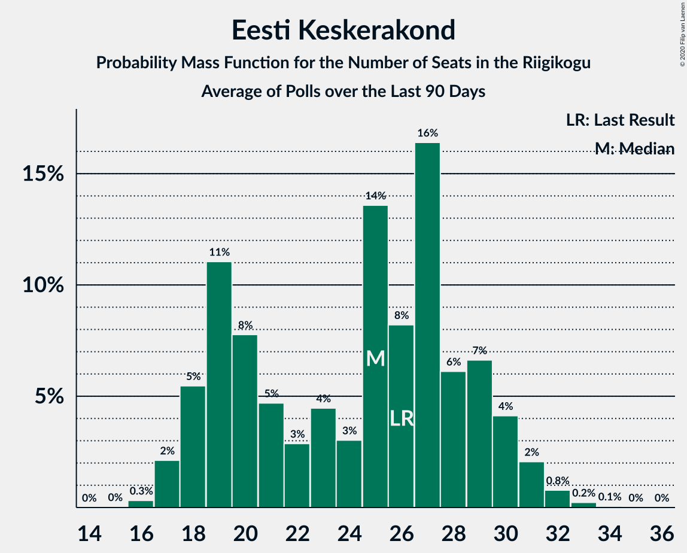

# Eesti Keskerakond

<a href="#voting-intentions">Voting Intentions</a> | <a href="#seats">Seats</a>

## Voting Intentions

Last result: **23.1%** (General Election of 3 March 2019)

### Confidence Intervals

| Period     | Polling firm/Commissioner(s) | Median | 80% Confidence Interval | 90% Confidence Interval | 95% Confidence Interval | 99% Confidence Interval |
|:----------:|:----------------:|:-----------:|:-----------------------:|:-----------------------:|:-----------------------:|:-----------------------:|
| N/A | [Poll Average](average.html) | 19.4% | 17.6–21.2% | 17.1–21.7% | 16.7–22.2% | 16.0–23.1% |
| [12–18 May 2021](2021-05-18-KantarEmor.html) | Kantar Emor   BNS and Postimees | 15.7% | N/A | N/A | N/A | N/A |
| [6–11 May 2021](2021-05-11-Turu-uuringuteAS.html) | Turu-uuringute AS | 20.0% | 18.4–21.7% | 18.0–22.1% | 17.6–22.6% | 16.9–23.4% |
| [4–10 May 2021](2021-05-10-Norstat.html) | Norstat   MTÜ Ühiskonnauuringute Instituut | 18.7% | 17.2–20.4% | 16.8–20.8% | 16.4–21.2% | 15.7–22.1% |
| [27 April–3 May 2021](2021-05-03-Norstat.html) | Norstat   MTÜ Ühiskonnauuringute Instituut | 20.7% | 19.1–22.4% | 18.7–22.9% | 18.3–23.3% | 17.6–24.2% |
| [20–26 April 2021](2021-04-26-Norstat.html) | Norstat   MTÜ Ühiskonnauuringute Instituut | 22.3% | N/A | N/A | N/A | N/A |
| [15–21 April 2021](2021-04-21-KantarEmor.html) | Kantar Emor   BNS and Postimees | 19.0% | 17.6–20.6% | 17.1–21.0% | 16.8–21.4% | 16.1–22.2% |
| [13–19 April 2021](2021-04-19-Norstat.html) | Norstat   MTÜ Ühiskonnauuringute Instituut | 19.3% | N/A | N/A | N/A | N/A |
| [8–14 April 2021](2021-04-14-Turu-uuringuteAS.html) | Turu-uuringute AS | 19.2% | 17.7–20.9% | 17.3–21.4% | 16.9–21.8% | 16.2–22.6% |
| [7–12 April 2021](2021-04-12-Norstat.html) | Norstat   MTÜ Ühiskonnauuringute Instituut | 17.3% | N/A | N/A | N/A | N/A |
| [30 March–5 April 2021](2021-04-05-Norstat.html) | Norstat   MTÜ Ühiskonnauuringute Instituut | 20.1% | N/A | N/A | N/A | N/A |
| [23–29 March 2021](2021-03-29-Norstat.html) | Norstat   MTÜ Ühiskonnauuringute Instituut | 20.7% | N/A | N/A | N/A | N/A |
| [17–22 March 2021](2021-03-22-Norstat.html) | Norstat   MTÜ Ühiskonnauuringute Instituut | 19.4% | 17.9–21.1% | 17.4–21.6% | 17.1–22.0% | 16.4–22.8% |
| [11–16 March 2021](2021-03-16-KantarEmor.html) | Kantar Emor   BNS and Postimees | 18.0% | 16.6–19.6% | 16.2–20.0% | 15.9–20.4% | 15.2–21.2% |
| [9–15 March 2021](2021-03-15-Turu-uuringuteAS.html) | Turu-uuringute AS | 20.0% | 18.4–21.7% | 18.0–22.2% | 17.6–22.6% | 16.9–23.4% |
| [10–15 March 2021](2021-03-15-Norstat.html) | Norstat   MTÜ Ühiskonnauuringute Instituut | 23.1% | 21.4–24.9% | 21.0–25.4% | 20.6–25.8% | 19.8–26.7% |
| [2–8 March 2021](2021-03-08-Norstat.html) | Norstat   MTÜ Ühiskonnauuringute Instituut | 17.0% | 15.5–18.6% | 15.2–19.1% | 14.8–19.5% | 14.1–20.3% |
| [23 February–1 March 2021](2021-03-01-Norstat.html) | Norstat   MTÜ Ühiskonnauuringute Instituut | 18.8% | 17.3–20.5% | 16.9–20.9% | 16.5–21.4% | 15.8–22.2% |
| [16–22 February 2021](2021-02-22-Norstat.html) | Norstat   MTÜ Ühiskonnauuringute Instituut | 19.3% | 17.8–21.0% | 17.3–21.5% | 17.0–21.9% | 16.3–22.7% |
| [17 February 2021](2021-02-17-Norstat.html) | Norstat   MTÜ Ühiskonnauuringute Instituut | 19.3% | 17.8–21.0% | 17.3–21.5% | 17.0–21.9% | 16.3–22.7% |
| [10–15 February 2021](2021-02-15-Turu-uuringuteAS.html) | Turu-uuringute AS | 17.0% | 15.6–18.6% | 15.2–19.1% | 14.8–19.5% | 14.1–20.3% |
| [9–15 February 2021](2021-02-15-Norstat.html) | Norstat   MTÜ Ühiskonnauuringute Instituut | 15.5% | 14.1–17.1% | 13.7–17.5% | 13.4–17.9% | 12.7–18.7% |
| [11–15 February 2021](2021-02-15-KantarEmor.html) | Kantar Emor   BNS and Postimees | 17.0% | 15.6–18.5% | 15.2–18.9% | 14.9–19.3% | 14.3–20.0% |
| [2–8 February 2021](2021-02-08-Norstat.html) | Norstat   MTÜ Ühiskonnauuringute Instituut | 20.7% | 19.1–22.4% | 18.7–22.9% | 18.3–23.3% | 17.6–24.2% |
| [26 January–1 February 2021](2021-02-01-Norstat.html) | Norstat   MTÜ Ühiskonnauuringute Instituut | 16.4% | 15.0–18.0% | 14.6–18.4% | 14.2–18.8% | 13.6–19.6% |
| [18–25 January 2021](2021-01-25-Norstat.html) | Norstat   MTÜ Ühiskonnauuringute Instituut | 18.7% | 17.2–20.4% | 16.8–20.8% | 16.4–21.2% | 15.7–22.1% |
| [12–21 January 2021](2021-01-21-Turu-uuringuteAS.html) | Turu-uuringute AS | 18.7% | 17.1–20.3% | 16.7–20.8% | 16.4–21.2% | 15.7–22.0% |
| [14–19 January 2021](2021-01-19-KantarEmor.html) | Kantar Emor   BNS and Postimees | 19.0% | 17.6–20.5% | 17.3–21.0% | 16.9–21.3% | 16.3–22.1% |
| [12–18 January 2021](2021-01-18-Norstat.html) | Norstat   MTÜ Ühiskonnauuringute Instituut | 21.8% | 20.2–23.5% | 19.7–24.0% | 19.3–24.5% | 18.6–25.3% |
| [5–11 January 2021](2021-01-11-Norstat.html) | Norstat   MTÜ Ühiskonnauuringute Instituut | 20.9% | 19.3–22.6% | 18.9–23.1% | 18.5–23.5% | 17.8–24.4% |
| [29 December 2020–4 January 2021](2021-01-04-Norstat.html) | Norstat   MTÜ Ühiskonnauuringute Instituut | 22.1% | 20.5–23.9% | 20.0–24.4% | 19.6–24.8% | 18.9–25.6% |
| [16–21 December 2020](2020-12-21-Norstat.html) | Norstat   MTÜ Ühiskonnauuringute Instituut | 20.9% | 19.3–22.6% | 18.9–23.1% | 18.5–23.5% | 17.8–24.4% |
| [9–14 December 2020](2020-12-14-Norstat.html) | Norstat   MTÜ Ühiskonnauuringute Instituut | 21.5% | 19.9–23.2% | 19.4–23.7% | 19.1–24.2% | 18.3–25.0% |
| [3–9 December 2020](2020-12-09-KantarEmor.html) | Kantar Emor   BNS and Postimees | 16.0% | 14.7–17.4% | 14.4–17.8% | 14.1–18.1% | 13.5–18.8% |
| [27 November–7 December 2020](2020-12-07-Turu-uuringuteAS.html) | Turu-uuringute AS | 25.0% | 23.2–26.9% | 22.7–27.5% | 22.2–27.9% | 21.4–28.9% |
| [1–7 December 2020](2020-12-07-Norstat.html) | Norstat   MTÜ Ühiskonnauuringute Instituut | 22.2% | 20.6–23.9% | 20.1–24.4% | 19.7–24.9% | 19.0–25.7% |
| [24–30 November 2020](2020-11-30-Norstat.html) | Norstat   MTÜ Ühiskonnauuringute Instituut | 22.8% | 21.2–24.6% | 20.7–25.1% | 20.3–25.5% | 19.5–26.4% |
| [17–23 November 2020](2020-11-23-Norstat.html) | Norstat   MTÜ Ühiskonnauuringute Instituut | 21.0% | 19.4–22.7% | 19.0–23.2% | 18.6–23.6% | 17.8–24.5% |
| [13–18 November 2020](2020-11-18-KantarEmor.html) | Kantar Emor   BNS and Postimees | 17.0% | 15.7–18.4% | 15.3–18.8% | 15.0–19.2% | 14.4–19.9% |
| [11–16 November 2020](2020-11-16-Norstat.html) | Norstat   MTÜ Ühiskonnauuringute Instituut | 19.6% | 18.1–21.3% | 17.6–21.8% | 17.3–22.2% | 16.5–23.0% |
| [30 October–9 November 2020](2020-11-09-Turu-uuringuteAS.html) | Turu-uuringute AS | 24.0% | 22.2–26.0% | 21.7–26.5% | 21.3–27.0% | 20.4–27.9% |
| [3–9 November 2020](2020-11-09-Norstat.html) | Norstat   MTÜ Ühiskonnauuringute Instituut | 24.5% | 22.8–26.3% | 22.3–26.8% | 21.9–27.3% | 21.1–28.2% |
| [27 October–2 November 2020](2020-11-02-Norstat.html) | Norstat   MTÜ Ühiskonnauuringute Instituut | 21.0% | 19.4–22.7% | 19.0–23.2% | 18.6–23.6% | 17.8–24.5% |
| [22–26 October 2020](2020-10-26-Norstat.html) | Norstat   MTÜ Ühiskonnauuringute Instituut | 20.3% | 18.7–22.0% | 18.3–22.5% | 17.9–22.9% | 17.2–23.7% |
| [14–20 October 2020](2020-10-20-Norstat.html) | Norstat   MTÜ Ühiskonnauuringute Instituut | 25.0% | 23.3–26.8% | 22.8–27.3% | 22.4–27.8% | 21.6–28.7% |
| [1–15 October 2020](2020-10-15-Turu-uuringuteAS.html) | Turu-uuringute AS | 25.0% | 23.2–26.9% | 22.6–27.5% | 22.2–28.0% | 21.4–28.9% |
| [8–14 October 2020](2020-10-14-KantarEmor.html) | Kantar Emor   BNS and Postimees | 17.0% | N/A | N/A | N/A | N/A |
| [6–13 October 2020](2020-10-13-Norstat.html) | Norstat   MTÜ Ühiskonnauuringute Instituut | 22.3% | 20.7–24.1% | 20.2–24.6% | 19.8–25.0% | 19.1–25.8% |
| [28 September–5 October 2020](2020-10-05-Norstat.html) | Norstat   MTÜ Ühiskonnauuringute Instituut | 21.2% | 19.6–22.9% | 19.2–23.4% | 18.8–23.9% | 18.0–24.7% |
| [23–28 September 2020](2020-09-28-Norstat.html) | Norstat   MTÜ Ühiskonnauuringute Instituut | 22.8% | 21.2–24.6% | 20.7–25.1% | 20.3–25.5% | 19.5–26.4% |
| [17–23 September 2020](2020-09-23-KantarEmor.html) | Kantar Emor   BNS and Postimees | 18.0% | N/A | N/A | N/A | N/A |
| [15–21 September 2020](2020-09-21-Norstat.html) | Norstat   MTÜ Ühiskonnauuringute Instituut | 21.6% | 20.0–23.3% | 19.5–23.8% | 19.2–24.3% | 18.4–25.1% |
| [7–17 September 2020](2020-09-17-Turu-uuringuteAS.html) | Turu-uuringute AS | 24.0% | 22.3–25.7% | 21.8–26.3% | 21.4–26.7% | 20.7–27.6% |
| [9–15 September 2020](2020-09-15-Norstat.html) | Norstat   MTÜ Ühiskonnauuringute Instituut | 22.5% | 20.9–24.3% | 20.4–24.8% | 20.0–25.2% | 19.3–26.1% |
| [2–9 September 2020](2020-09-09-Norstat.html) | Norstat   MTÜ Ühiskonnauuringute Instituut | 26.4% | 24.7–28.2% | 24.2–28.8% | 23.8–29.2% | 23.0–30.1% |
| [25–31 August 2020](2020-08-31-Norstat.html) | Norstat   MTÜ Ühiskonnauuringute Instituut | 24.8% | 23.1–26.6% | 22.6–27.1% | 22.2–27.6% | 21.4–28.5% |
| [17–25 August 2020](2020-08-25-Norstat.html) | Norstat   MTÜ Ühiskonnauuringute Instituut | 20.9% | 19.3–22.6% | 18.9–23.1% | 18.5–23.5% | 17.8–24.4% |
| [12–24 August 2020](2020-08-24-Turu-uuringuteAS.html) | Turu-uuringute AS   ERR | 27.0% | 25.3–28.9% | 24.8–29.4% | 24.4–29.9% | 23.5–30.8% |
| [13–19 August 2020](2020-08-19-KantarEmor.html) | Kantar Emor   BNS and Postimees | 16.6% | N/A | N/A | N/A | N/A |
| [10–17 August 2020](2020-08-17-Norstat.html) | Norstat   MTÜ Ühiskonnauuringute Instituut | 22.9% | 21.3–24.7% | 20.8–25.2% | 20.4–25.6% | 19.6–26.5% |
| [4–10 August 2020](2020-08-10-Norstat.html) | Norstat   MTÜ Ühiskonnauuringute Instituut | 19.4% | 17.9–21.1% | 17.4–21.6% | 17.1–22.0% | 16.4–22.8% |
| [27 July–3 August 2020](2020-08-03-Norstat.html) | Norstat   MTÜ Ühiskonnauuringute Instituut | 22.5% | 20.9–24.3% | 20.4–24.8% | 20.0–25.2% | 19.3–26.1% |
| [21–28 July 2020](2020-07-28-Norstat.html) | Norstat   MTÜ Ühiskonnauuringute Instituut | 24.1% | 22.4–25.9% | 21.9–26.4% | 21.6–26.9% | 20.8–27.7% |
| [16–22 July 2020](2020-07-22-KantarEmor.html) | Kantar Emor   BNS and Postimees | 17.0% | 15.7–18.4% | 15.3–18.8% | 15.0–19.1% | 14.4–19.8% |
| [14–20 July 2020](2020-07-20-Norstat.html) | Norstat   MTÜ Ühiskonnauuringute Instituut | 23.5% | 21.8–25.3% | 21.4–25.8% | 21.0–26.2% | 20.2–27.1% |
| [7–13 July 2020](2020-07-13-Norstat.html) | Norstat   MTÜ Ühiskonnauuringute Instituut | 23.2% | 21.6–25.0% | 21.1–25.5% | 20.7–25.9% | 19.9–26.8% |
| [29–6 July 2020](2020-07-06-Norstat.html) | Norstat   MTÜ Ühiskonnauuringute Instituut | 22.9% | 21.3–24.7% | 20.8–25.2% | 20.4–25.6% | 19.6–26.5% |
| [1–30 June 2020](2020-06-30-KantarEmor.html) | Kantar Emor   BNS and Postimees | 18.9% | 17.6–20.4% | 17.2–20.8% | 16.9–21.2% | 16.2–21.9% |
| [16–22 June 2020](2020-06-22-Norstat.html) | Norstat   MTÜ Ühiskonnauuringute Instituut | 26.0% | 24.3–27.8% | 23.8–28.4% | 23.4–28.8% | 22.6–29.7% |
| [9–16 June 2020](2020-06-16-Norstat.html) | Norstat   MTÜ Ühiskonnauuringute Instituut | 27.0% | 25.3–28.9% | 24.8–29.4% | 24.3–29.8% | 23.5–30.7% |
| [9–15 June 2020](2020-06-15-Turu-uuringuteAS.html) | Turu-uuringute AS   ERR | 27.2% | 25.4–29.1% | 25.0–29.6% | 24.5–30.0% | 23.7–30.9% |
| [1–8 June 2020](2020-06-08-Norstat.html) | Norstat   MTÜ Ühiskonnauuringute Instituut | 22.8% | 21.2–24.6% | 20.7–25.1% | 20.3–25.5% | 19.5–26.4% |
| [25 May–1 June 2020](2020-06-01-Norstat.html) | Norstat   MTÜ Ühiskonnauuringute Instituut | 24.5% | 22.8–26.3% | 22.3–26.8% | 21.9–27.3% | 21.1–28.2% |
| [18–25 May 2020](2020-05-25-Norstat.html) | Norstat   MTÜ Ühiskonnauuringute Instituut | 27.1% | 25.3–29.0% | 24.9–29.5% | 24.4–29.9% | 23.6–30.8% |
| [14–20 May 2020](2020-05-20-KantarEmor.html) | Kantar Emor   BNS and Postimees | 20.0% | 18.6–21.5% | 18.2–21.9% | 17.8–22.3% | 17.2–23.0% |
| [12–18 May 2020](2020-05-18-Norstat.html) | Norstat   MTÜ Ühiskonnauuringute Instituut | 26.0% | 24.3–27.8% | 23.8–28.4% | 23.4–28.8% | 22.6–29.7% |
| [7–15 May 2020](2020-05-15-Turu-uuringuteAS.html) | Turu-uuringute AS   ERR | 28.1% | 26.3–30.0% | 25.8–30.5% | 25.4–31.0% | 24.6–31.9% |
| [6–12 May 2020](2020-05-12-Norstat.html) | Norstat   MTÜ Ühiskonnauuringute Instituut | 24.8% | 23.1–26.6% | 22.6–27.1% | 22.2–27.6% | 21.4–28.5% |
| [24 April–5 May 2020](2020-05-05-Norstat.html) | Norstat   MTÜ Ühiskonnauuringute Instituut | 23.8% | 22.1–25.6% | 21.7–26.1% | 21.3–26.6% | 20.5–27.4% |
| [21–27 April 2020](2020-04-27-Norstat.html) | Norstat   MTÜ Ühiskonnauuringute Instituut | 27.6% | 25.8–29.5% | 25.3–30.0% | 24.9–30.5% | 24.1–31.4% |
| [20–22 April 2020](2020-04-22-KantarEmor.html) | Kantar Emor   BNS and Postimees | 17.8% | 16.3–19.4% | 15.9–19.9% | 15.6–20.3% | 14.9–21.1% |
| [15–20 April 2020](2020-04-20-Norstat.html) | Norstat   MTÜ Ühiskonnauuringute Instituut | 22.3% | 20.7–24.1% | 20.2–24.6% | 19.8–25.0% | 19.1–25.8% |
| [7–14 April 2020](2020-04-14-Norstat.html) | Norstat   MTÜ Ühiskonnauuringute Instituut | 23.5% | 21.8–25.3% | 21.4–25.8% | 21.0–26.2% | 20.2–27.1% |
| [6–7 April 2020](2020-04-07-Turu-uuringuteAS.html) | Turu-uuringute AS   ERR | 24.0% | 22.3–25.8% | 21.9–26.3% | 21.4–26.7% | 20.7–27.6% |
| [31 March–6 April 2020](2020-04-06-Norstat.html) | Norstat   MTÜ Ühiskonnauuringute Instituut | 25.7% | 24.0–27.5% | 23.5–28.1% | 23.1–28.5% | 22.3–29.4% |
| [24–30 March 2020](2020-03-30-Norstat.html) | Norstat   MTÜ Ühiskonnauuringute Instituut | 30.4% | 28.6–32.3% | 28.1–32.9% | 27.6–33.3% | 26.8–34.3% |
| [18–23 March 2020](2020-03-23-Norstat.html) | Norstat   MTÜ Ühiskonnauuringute Instituut | 26.1% | 24.4–27.9% | 23.9–28.5% | 23.5–28.9% | 22.7–29.8% |
| [12–18 March 2020](2020-03-18-KantarEmor.html) | Kantar Emor   BNS and Postimees | 17.0% | 15.6–18.5% | 15.2–18.9% | 14.9–19.3% | 14.3–20.1% |
| [10–16 March 2020](2020-03-16-Turu-uuringuteAS.html) | Turu-uuringute AS   ERR | 22.2% | 20.6–23.9% | 20.1–24.3% | 19.8–24.8% | 19.0–25.6% |
| [10–16 March 2020](2020-03-16-Norstat.html) | Norstat   MTÜ Ühiskonnauuringute Instituut | 26.3% | 24.6–28.2% | 24.1–28.7% | 23.7–29.1% | 22.8–30.0% |
| [4–9 March 2020](2020-03-09-Norstat.html) | Norstat   MTÜ Ühiskonnauuringute Instituut | 21.0% | 19.4–22.7% | 19.0–23.2% | 18.6–23.6% | 17.8–24.5% |
| [26 February–2 March 2020](2020-03-02-Norstat.html) | Norstat   MTÜ Ühiskonnauuringute Instituut | 24.2% | 22.5–26.0% | 22.1–26.5% | 21.6–27.0% | 20.9–27.8% |
| [19–26 February 2020](2020-02-26-Norstat.html) | Norstat   MTÜ Ühiskonnauuringute Instituut | 19.3% | 17.8–21.0% | 17.3–21.5% | 17.0–21.9% | 16.3–22.7% |
| [13–18 February 2020](2020-02-18-Norstat.html) | Norstat   MTÜ Ühiskonnauuringute Instituut | 22.4% | 20.8–24.2% | 20.3–24.7% | 19.9–25.1% | 19.2–26.0% |
| [6–17 February 2020](2020-02-17-Turu-uuringuteAS.html) | Turu-uuringute AS   ERR | 26.1% | 24.2–28.2% | 23.7–28.7% | 23.2–29.3% | 22.3–30.3% |
| [4–11 February 2020](2020-02-11-Norstat.html) | Norstat   MTÜ Ühiskonnauuringute Instituut | 20.0% | 18.4–21.7% | 18.0–22.2% | 17.6–22.6% | 16.9–23.4% |
| [28 January–3 February 2020](2020-02-03-Norstat.html) | Norstat   MTÜ Ühiskonnauuringute Instituut | 20.8% | 19.2–22.5% | 18.8–23.0% | 18.4–23.4% | 17.7–24.3% |
| [1–31 January 2020](2020-01-31-KantarEmor.html) | Kantar Emor | 17.0% | 15.5–18.8% | 15.1–19.3% | 14.7–19.7% | 14.0–20.5% |
| [17–27 January 2020](2020-01-27-Turu-uuringuteAS.html) | Turu-uuringute AS   ERR | 24.0% | 22.2–26.0% | 21.6–26.6% | 21.2–27.1% | 20.3–28.1% |
| [23–27 January 2020](2020-01-27-Norstat.html) | Norstat   MTÜ Ühiskonnauuringute Instituut | 19.3% | 17.8–21.0% | 17.3–21.5% | 17.0–21.9% | 16.3–22.7% |
| [16–24 January 2020](2020-01-24-Norstat.html) | Norstat   MTÜ Ühiskonnauuringute Instituut | 22.8% | 21.2–24.6% | 20.7–25.1% | 20.3–25.5% | 19.5–26.4% |
| [8–14 January 2020](2020-01-14-Norstat.html) | Norstat   MTÜ Ühiskonnauuringute Instituut | 24.4% | 22.7–26.2% | 22.2–26.7% | 21.8–27.2% | 21.0–28.0% |
| [3–7 January 2020](2020-01-07-Norstat.html) | Norstat   MTÜ Ühiskonnauuringute Instituut | 23.6% | 21.9–25.4% | 21.5–25.9% | 21.1–26.3% | 20.3–27.2% |
| [18–23 December 2019](2019-12-23-Norstat.html) | Norstat   MTÜ Ühiskonnauuringute Instituut | 22.0% | 20.4–23.7% | 19.9–24.2% | 19.5–24.7% | 18.8–25.5% |
| [11–17 December 2019](2019-12-17-Norstat.html) | Norstat   MTÜ Ühiskonnauuringute Instituut | 22.5% | 20.9–24.3% | 20.4–24.8% | 20.0–25.2% | 19.3–26.1% |
| [5–12 December 2019](2019-12-12-KantarEmor.html) | Kantar Emor   BNS and Postimees | 17.9% | 16.6–19.3% | 16.3–19.7% | 16.0–20.0% | 15.4–20.7% |
| [28 November–9 December 2019](2019-12-09-Turu-uuringuteAS.html) | Turu-uuringute AS   ERR | 25.0% | 23.4–26.9% | 22.9–27.4% | 22.5–27.8% | 21.7–28.7% |
| [2–9 December 2019](2019-12-09-Norstat.html) | Norstat   MTÜ Ühiskonnauuringute Instituut | 21.1% | 19.5–22.8% | 19.1–23.3% | 18.7–23.7% | 17.9–24.6% |
| [25–29 November 2019](2019-11-29-Norstat.html) | Norstat   MTÜ Ühiskonnauuringute Instituut | 23.5% | 21.8–25.3% | 21.4–25.8% | 21.0–26.2% | 20.2–27.1% |
| [18–25 November 2019](2019-11-25-Norstat.html) | Norstat   MTÜ Ühiskonnauuringute Instituut | 24.0% | 22.3–25.8% | 21.9–26.3% | 21.4–26.7% | 20.7–27.6% |
| [11–15 November 2019](2019-11-15-Norstat.html) | Norstat   MTÜ Ühiskonnauuringute Instituut | 26.0% | 24.3–27.8% | 23.8–28.4% | 23.4–28.8% | 22.6–29.7% |
| [7–13 November 2019](2019-11-13-KantarEmor.html) | Kantar Emor   BNS and Postimees | 16.1% | 14.9–17.4% | 14.5–17.8% | 14.2–18.1% | 13.7–18.7% |
| [31 October–12 November 2019](2019-11-12-Turu-uuringuteAS.html) | Turu-uuringute AS   ERR | 23.7% | 22.1–25.5% | 21.6–26.0% | 21.2–26.5% | 20.5–27.3% |
| [5–11 November 2019](2019-11-11-Norstat.html) | Norstat   MTÜ Ühiskonnauuringute Instituut | 24.3% | 22.6–26.1% | 22.1–26.6% | 21.7–27.1% | 21.0–27.9% |
| [28 October–5 November 2019](2019-11-05-Norstat.html) | Norstat   MTÜ Ühiskonnauuringute Instituut | 23.0% | 21.4–24.8% | 20.9–25.3% | 20.5–25.7% | 19.7–26.6% |
| [22–28 October 2019](2019-10-28-Norstat.html) | Norstat   MTÜ Ühiskonnauuringute Instituut | 23.5% | 21.8–25.3% | 21.4–25.8% | 21.0–26.2% | 20.2–27.1% |
| [15–21 October 2019](2019-10-21-Norstat.html) | Norstat   MTÜ Ühiskonnauuringute Instituut | 23.5% | 21.8–25.3% | 21.4–25.8% | 21.0–26.2% | 20.2–27.1% |
| [10–16 October 2019](2019-10-16-KantarEmor.html) | Kantar Emor   BNS and Postimees | 17.7% | 16.3–19.2% | 15.9–19.6% | 15.6–20.0% | 15.0–20.7% |
| [9–14 October 2019](2019-10-14-Norstat.html) | Norstat   MTÜ Ühiskonnauuringute Instituut | 26.0% | 24.3–27.8% | 23.8–28.4% | 23.4–28.8% | 22.6–29.7% |
| [3–13 October 2019](2019-10-13-Turu-uuringuteAS.html) | Turu-uuringute AS   ERR | 22.0% | 20.4–23.7% | 20.0–24.2% | 19.6–24.6% | 18.9–25.5% |
| [1–8 October 2019](2019-10-08-Norstat.html) | Norstat   MTÜ Ühiskonnauuringute Instituut | 22.2% | 20.6–24.0% | 20.1–24.4% | 19.7–24.9% | 19.0–25.7% |
| [25–30 September 2019](2019-09-30-Norstat.html) | Norstat   MTÜ Ühiskonnauuringute Instituut | 24.3% | 22.6–26.1% | 22.1–26.6% | 21.7–27.1% | 21.0–27.9% |
| [18–23 September 2019](2019-09-23-Norstat.html) | Norstat   MTÜ Ühiskonnauuringute Instituut | 20.7% | 19.1–22.4% | 18.7–22.9% | 18.3–23.3% | 17.6–24.2% |
| [11–19 September 2019](2019-09-19-KantarEmor.html) | Kantar Emor   BNS and Postimees | 16.6% | 15.3–18.1% | 14.9–18.5% | 14.6–18.9% | 14.0–19.6% |
| [10–17 September 2019](2019-09-17-Norstat.html) | Norstat   MTÜ Ühiskonnauuringute Instituut | 24.1% | 22.4–25.9% | 21.9–26.4% | 21.6–26.9% | 20.8–27.7% |
| [5–16 September 2019](2019-09-16-Turu-uuringuteAS.html) | Turu-uuringute AS   ERR | 22.0% | 20.4–23.7% | 20.0–24.2% | 19.6–24.6% | 18.9–25.5% |
| [3–9 September 2019](2019-09-09-Norstat.html) | Norstat   MTÜ Ühiskonnauuringute Instituut | 23.7% | 22.0–25.5% | 21.6–26.0% | 21.2–26.4% | 20.4–27.3% |
| [27 August–2 September 2019](2019-09-02-Norstat.html) | Norstat   MTÜ Ühiskonnauuringute Instituut | 24.6% | 22.9–26.4% | 22.4–26.9% | 22.0–27.4% | 21.2–28.3% |
| [21–26 August 2019](2019-08-26-Norstat.html) | Norstat   MTÜ Ühiskonnauuringute Instituut | 23.7% | 22.0–25.5% | 21.6–26.0% | 21.2–26.4% | 20.4–27.3% |
| [15–21 August 2019](2019-08-21-KantarEmor.html) | Kantar Emor   BNS and Postimees | 15.8% | 14.5–17.3% | 14.2–17.7% | 13.9–18.1% | 13.3–18.8% |
| [9–20 August 2019](2019-08-20-Turu-uuringuteAS.html) | Turu-uuringute AS   ERR | 22.7% | 21.1–24.5% | 20.6–25.0% | 20.2–25.4% | 19.4–26.3% |
| [13–19 August 2019](2019-08-19-Norstat.html) | Norstat   MTÜ Ühiskonnauuringute Instituut | 23.0% | 21.4–24.8% | 20.9–25.3% | 20.5–25.7% | 19.7–26.6% |
| [5–12 August 2019](2019-08-12-Norstat.html) | Norstat   MTÜ Ühiskonnauuringute Instituut | 22.0% | 20.4–23.7% | 19.9–24.2% | 19.5–24.7% | 18.8–25.5% |
| [30 July–5 August 2019](2019-08-05-Norstat.html) | Norstat   MTÜ Ühiskonnauuringute Instituut | 19.0% | 17.5–20.7% | 17.1–21.1% | 16.7–21.6% | 16.0–22.4% |
| [22–30 July 2019](2019-07-30-Norstat.html) | Norstat   MTÜ Ühiskonnauuringute Instituut | 17.8% | 16.3–19.4% | 15.9–19.9% | 15.5–20.3% | 14.9–21.1% |
| [18–24 July 2019](2019-07-24-KantarEmor.html) | Kantar Emor   BNS and Postimees | 15.3% | 14.1–16.7% | 13.8–17.1% | 13.5–17.4% | 12.9–18.0% |
| [15–22 July 2019](2019-07-22-Norstat.html) | Norstat   MTÜ Ühiskonnauuringute Instituut | 18.3% | 16.8–20.0% | 16.4–20.4% | 16.0–20.8% | 15.3–21.6% |
| [8–15 July 2019](2019-07-15-Norstat.html) | Norstat   MTÜ Ühiskonnauuringute Instituut | 16.4% | 15.0–18.0% | 14.6–18.4% | 14.2–18.8% | 13.6–19.6% |
| [2–8 July 2019](2019-07-08-Norstat.html) | Norstat   MTÜ Ühiskonnauuringute Instituut | 22.3% | 20.7–24.1% | 20.2–24.6% | 19.8–25.0% | 19.1–25.8% |
| [26 June–1 July 2019](2019-07-01-Norstat.html) | Norstat   MTÜ Ühiskonnauuringute Instituut | 20.8% | 19.2–22.5% | 18.8–23.0% | 18.4–23.4% | 17.7–24.3% |
| [11–19 June 2019](2019-06-19-Norstat.html) | Norstat   MTÜ Ühiskonnauuringute Instituut | 18.4% | N/A | N/A | N/A | N/A |
| [6–13 June 2019](2019-06-13-KantarEmor.html) | Kantar Emor   BNS and Postimees | 14.8% | N/A | N/A | N/A | N/A |
| [4–11 June 2019](2019-06-11-Norstat.html) | Norstat   MTÜ Ühiskonnauuringute Instituut | 21.5% | N/A | N/A | N/A | N/A |
| [28 May–10 June 2019](2019-06-10-Turu-uuringuteAS.html) | Turu-uuringute AS   ERR | 19.8% | N/A | N/A | N/A | N/A |
| [27 May–3 June 2019](2019-06-03-Norstat.html) | Norstat   MTÜ Ühiskonnauuringute Instituut | 23.2% | N/A | N/A | N/A | N/A |
| [20–27 May 2019](2019-05-27-Norstat.html) | Norstat   MTÜ Ühiskonnauuringute Instituut | 19.5% | N/A | N/A | N/A | N/A |
| [14–20 May 2019](2019-05-20-Norstat.html) | Norstat   MTÜ Ühiskonnauuringute Instituut | 21.5% | N/A | N/A | N/A | N/A |
| [6–13 May 2019](2019-05-13-Norstat.html) | Norstat   MTÜ Ühiskonnauuringute Instituut | 19.5% | N/A | N/A | N/A | N/A |
| [7–9 May 2019](2019-05-09-KantarEmor.html) | Kantar Emor   BNS and Postimees | 15.0% | N/A | N/A | N/A | N/A |
| [29 April–7 May 2019](2019-05-07-Norstat.html) | Norstat   MTÜ Ühiskonnauuringute Instituut | 19.9% | N/A | N/A | N/A | N/A |
| [22–29 April 2019](2019-04-29-Norstat.html) | Norstat   MTÜ Ühiskonnauuringute Instituut | 18.5% | N/A | N/A | N/A | N/A |
| [15–22 April 2019](2019-04-22-Norstat.html) | Norstat   MTÜ Ühiskonnauuringute Instituut | 20.3% | N/A | N/A | N/A | N/A |
| [2–15 April 2019](2019-04-15-Turu-uuringuteAS.html) | Turu-uuringute AS   ERR | 24.2% | N/A | N/A | N/A | N/A |
| [8–15 April 2019](2019-04-15-Norstat.html) | Norstat   MTÜ Ühiskonnauuringute Instituut | 19.5% | N/A | N/A | N/A | N/A |
| [10–15 April 2019](2019-04-15-KantarEmor.html) | Kantar Emor   BNS and Postimees | 17.0% | N/A | N/A | N/A | N/A |
| [1–8 April 2019](2019-04-08-Norstat.html) | Norstat   MTÜ Ühiskonnauuringute Instituut | 22.5% | N/A | N/A | N/A | N/A |
| [25–29 March 2019](2019-03-29-Norstat.html) | Norstat   MTÜ Ühiskonnauuringute Instituut | 20.5% | N/A | N/A | N/A | N/A |
| [18–24 March 2019](2019-03-24-Norstat.html) | Norstat   MTÜ Ühiskonnauuringute Instituut | 19.5% | N/A | N/A | N/A | N/A |
| [14–21 March 2019](2019-03-21-KantarEmor.html) | Kantar Emor   BNS and Postimees | 17.0% | N/A | N/A | N/A | N/A |
| [5–18 March 2019](2019-03-18-Turu-uuringuteAS.html) | Turu-uuringute AS   ERR | 24.0% | N/A | N/A | N/A | N/A |
| [11–15 March 2019](2019-03-15-Norstat.html) | Norstat   MTÜ Ühiskonnauuringute Instituut | 19.4% | N/A | N/A | N/A | N/A |
| [12–13 March 2019](2019-03-13-KantarEmor.html) | Kantar Emor   BNS and Postimees | 19.3% | N/A | N/A | N/A | N/A |
| [5–11 March 2019](2019-03-11-Norstat.html) | Norstat   MTÜ Ühiskonnauuringute Instituut | 21.2% | N/A | N/A | N/A | N/A |

### Probability Mass Function

The following table shows the probability mass function per percentage block of voting intentions for the [poll average](average.html) for Eesti Keskerakond.

| Voting Intentions | Probability | Accumulated | Special Marks |
|:-----------------:|:-----------:|:-----------:|:-------------:|
| 13.5–14.5% | 0% | 100% |  |
| 14.5–15.5% | 0.2% | 100% |  |
| 15.5–16.5% | 2% | 99.8% |  |
| 16.5–17.5% | 7% | 98% |  |
| 17.5–18.5% | 19% | 91% |  |
| 18.5–19.5% | 27% | 72% | Median |
| 19.5–20.5% | 24% | 45% |  |
| 20.5–21.5% | 14% | 21% |  |
| 21.5–22.5% | 5% | 6% |  |
| 22.5–23.5% | 1.1% | 1.3% | Last Result |
| 23.5–24.5% | 0.2% | 0.2% |  |
| 24.5–25.5% | 0% | 0% |  |

## Seats

Last result: **26** seats (General Election of 3 March 2019)

### Confidence Intervals

| Period     | Polling firm/Commissioner(s) | Median | 80% Confidence Interval | 90% Confidence Interval | 95% Confidence Interval | 99% Confidence Interval |
|:----------:|:----------------:|:------:|:-----------------------:|:-----------------------:|:-----------------------:|:-----------------------:|
| N/A | [Poll Average](average.html) | 21 | 19–23 | 18–24 | 17–25 | 17–26 |
| [12–18 May 2021](2021-05-18-KantarEmor.html) | Kantar Emor   BNS and Postimees |  |  |  |  |  |
| [6–11 May 2021](2021-05-11-Turu-uuringuteAS.html) | Turu-uuringute AS | 21 | 20–24 | 19–25 | 19–25 | 18–27 |
| [4–10 May 2021](2021-05-10-Norstat.html) | Norstat   MTÜ Ühiskonnauuringute Instituut | 20 | 18–22 | 17–22 | 17–23 | 16–24 |
| [27 April–3 May 2021](2021-05-03-Norstat.html) | Norstat   MTÜ Ühiskonnauuringute Instituut | 23 | 20–25 | 20–25 | 19–26 | 18–27 |
| [20–26 April 2021](2021-04-26-Norstat.html) | Norstat   MTÜ Ühiskonnauuringute Instituut |  |  |  |  |  |
| [15–21 April 2021](2021-04-21-KantarEmor.html) | Kantar Emor   BNS and Postimees | 21 | 19–23 | 18–24 | 18–24 | 17–25 |
| [13–19 April 2021](2021-04-19-Norstat.html) | Norstat   MTÜ Ühiskonnauuringute Instituut |  |  |  |  |  |
| [8–14 April 2021](2021-04-14-Turu-uuringuteAS.html) | Turu-uuringute AS | 21 | 19–23 | 18–24 | 18–24 | 17–25 |
| [7–12 April 2021](2021-04-12-Norstat.html) | Norstat   MTÜ Ühiskonnauuringute Instituut |  |  |  |  |  |
| [30 March–5 April 2021](2021-04-05-Norstat.html) | Norstat   MTÜ Ühiskonnauuringute Instituut |  |  |  |  |  |
| [23–29 March 2021](2021-03-29-Norstat.html) | Norstat   MTÜ Ühiskonnauuringute Instituut |  |  |  |  |  |
| [17–22 March 2021](2021-03-22-Norstat.html) | Norstat   MTÜ Ühiskonnauuringute Instituut | 20 | 19–23 | 18–23 | 18–24 | 17–25 |
| [11–16 March 2021](2021-03-16-KantarEmor.html) | Kantar Emor   BNS and Postimees | 20 | 18–21 | 17–22 | 17–22 | 16–24 |
| [9–15 March 2021](2021-03-15-Turu-uuringuteAS.html) | Turu-uuringute AS | 22 | 20–24 | 19–24 | 19–25 | 18–26 |
| [10–15 March 2021](2021-03-15-Norstat.html) | Norstat   MTÜ Ühiskonnauuringute Instituut | 25 | 23–28 | 23–28 | 22–29 | 21–30 |
| [2–8 March 2021](2021-03-08-Norstat.html) | Norstat   MTÜ Ühiskonnauuringute Instituut | 18 | 16–19 | 15–20 | 15–21 | 14–21 |
| [23 February–1 March 2021](2021-03-01-Norstat.html) | Norstat   MTÜ Ühiskonnauuringute Instituut | 20 | 18–22 | 17–23 | 17–23 | 16–24 |
| [16–22 February 2021](2021-02-22-Norstat.html) | Norstat   MTÜ Ühiskonnauuringute Instituut | 20 | 18–23 | 18–23 | 17–24 | 17–25 |
| [17 February 2021](2021-02-17-Norstat.html) | Norstat   MTÜ Ühiskonnauuringute Instituut | 21 | 19–23 | 18–23 | 18–24 | 17–25 |
| [10–15 February 2021](2021-02-15-Turu-uuringuteAS.html) | Turu-uuringute AS | 18 | 16–20 | 16–21 | 15–21 | 15–22 |
| [9–15 February 2021](2021-02-15-Norstat.html) | Norstat   MTÜ Ühiskonnauuringute Instituut | 16 | 14–18 | 14–18 | 13–19 | 13–20 |
| [11–15 February 2021](2021-02-15-KantarEmor.html) | Kantar Emor   BNS and Postimees | 18 | 16–20 | 16–21 | 15–21 | 15–22 |
| [2–8 February 2021](2021-02-08-Norstat.html) | Norstat   MTÜ Ühiskonnauuringute Instituut | 22 | 20–24 | 19–25 | 19–26 | 18–27 |
| [26 January–1 February 2021](2021-02-01-Norstat.html) | Norstat   MTÜ Ühiskonnauuringute Instituut | 18 | 16–20 | 15–20 | 15–21 | 14–22 |
| [18–25 January 2021](2021-01-25-Norstat.html) | Norstat   MTÜ Ühiskonnauuringute Instituut | 21 | 19–23 | 18–24 | 18–24 | 17–25 |
| [12–21 January 2021](2021-01-21-Turu-uuringuteAS.html) | Turu-uuringute AS | 21 | 19–23 | 18–24 | 18–24 | 17–25 |
| [14–19 January 2021](2021-01-19-KantarEmor.html) | Kantar Emor   BNS and Postimees | 21 | 19–23 | 18–23 | 18–23 | 17–24 |
| [12–18 January 2021](2021-01-18-Norstat.html) | Norstat   MTÜ Ühiskonnauuringute Instituut | 24 | 22–26 | 21–26 | 21–27 | 20–28 |
| [5–11 January 2021](2021-01-11-Norstat.html) | Norstat   MTÜ Ühiskonnauuringute Instituut | 23 | 21–25 | 20–26 | 20–26 | 19–28 |
| [29 December 2020–4 January 2021](2021-01-04-Norstat.html) | Norstat   MTÜ Ühiskonnauuringute Instituut | 24 | 22–26 | 21–27 | 21–28 | 20–29 |
| [16–21 December 2020](2020-12-21-Norstat.html) | Norstat   MTÜ Ühiskonnauuringute Instituut | 22 | 20–25 | 20–25 | 20–26 | 19–27 |
| [9–14 December 2020](2020-12-14-Norstat.html) | Norstat   MTÜ Ühiskonnauuringute Instituut | 24 | 22–26 | 21–26 | 21–27 | 20–28 |
| [3–9 December 2020](2020-12-09-KantarEmor.html) | Kantar Emor   BNS and Postimees | 17 | 15–18 | 15–19 | 15–19 | 14–20 |
| [27 November–7 December 2020](2020-12-07-Turu-uuringuteAS.html) | Turu-uuringute AS | 29 | 26–31 | 25–32 | 25–33 | 24–34 |
| [1–7 December 2020](2020-12-07-Norstat.html) | Norstat   MTÜ Ühiskonnauuringute Instituut | 23 | 22–25 | 21–26 | 20–27 | 20–28 |
| [24–30 November 2020](2020-11-30-Norstat.html) | Norstat   MTÜ Ühiskonnauuringute Instituut | 26 | 24–28 | 23–29 | 23–30 | 22–31 |
| [17–23 November 2020](2020-11-23-Norstat.html) | Norstat   MTÜ Ühiskonnauuringute Instituut | 23 | 21–25 | 20–26 | 20–26 | 19–27 |
| [13–18 November 2020](2020-11-18-KantarEmor.html) | Kantar Emor   BNS and Postimees | 18 | 16–20 | 16–20 | 16–21 | 15–21 |
| [11–16 November 2020](2020-11-16-Norstat.html) | Norstat   MTÜ Ühiskonnauuringute Instituut | 21 | 19–23 | 18–24 | 18–24 | 17–25 |
| [30 October–9 November 2020](2020-11-09-Turu-uuringuteAS.html) | Turu-uuringute AS | 28 | 25–30 | 25–31 | 24–32 | 23–33 |
| [3–9 November 2020](2020-11-09-Norstat.html) | Norstat   MTÜ Ühiskonnauuringute Instituut | 27 | 25–30 | 25–31 | 24–31 | 23–32 |
| [27 October–2 November 2020](2020-11-02-Norstat.html) | Norstat   MTÜ Ühiskonnauuringute Instituut | 24 | 21–26 | 21–26 | 20–27 | 19–28 |
| [22–26 October 2020](2020-10-26-Norstat.html) | Norstat   MTÜ Ühiskonnauuringute Instituut | 22 | 20–24 | 19–25 | 19–26 | 18–26 |
| [14–20 October 2020](2020-10-20-Norstat.html) | Norstat   MTÜ Ühiskonnauuringute Instituut | 27 | 25–30 | 25–30 | 24–31 | 23–32 |
| [1–15 October 2020](2020-10-15-Turu-uuringuteAS.html) | Turu-uuringute AS | 29 | 27–32 | 26–32 | 25–33 | 24–35 |
| [8–14 October 2020](2020-10-14-KantarEmor.html) | Kantar Emor   BNS and Postimees |  |  |  |  |  |
| [6–13 October 2020](2020-10-13-Norstat.html) | Norstat   MTÜ Ühiskonnauuringute Instituut | 25 | 23–28 | 23–28 | 22–29 | 21–30 |
| [28 September–5 October 2020](2020-10-05-Norstat.html) | Norstat   MTÜ Ühiskonnauuringute Instituut | 24 | 21–25 | 20–25 | 20–26 | 19–27 |
| [23–28 September 2020](2020-09-28-Norstat.html) | Norstat   MTÜ Ühiskonnauuringute Instituut | 26 | 24–29 | 23–29 | 23–30 | 22–31 |
| [17–23 September 2020](2020-09-23-KantarEmor.html) | Kantar Emor   BNS and Postimees |  |  |  |  |  |
| [15–21 September 2020](2020-09-21-Norstat.html) | Norstat   MTÜ Ühiskonnauuringute Instituut | 25 | 22–27 | 22–28 | 21–28 | 20–29 |
| [7–17 September 2020](2020-09-17-Turu-uuringuteAS.html) | Turu-uuringute AS | 28 | 25–30 | 25–31 | 24–32 | 23–33 |
| [9–15 September 2020](2020-09-15-Norstat.html) | Norstat   MTÜ Ühiskonnauuringute Instituut | 25 | 23–27 | 22–28 | 22–29 | 21–30 |
| [2–9 September 2020](2020-09-09-Norstat.html) | Norstat   MTÜ Ühiskonnauuringute Instituut | 29 | 27–32 | 26–32 | 26–33 | 25–34 |
| [25–31 August 2020](2020-08-31-Norstat.html) | Norstat   MTÜ Ühiskonnauuringute Instituut | 28 | 26–30 | 25–31 | 25–31 | 23–32 |
| [17–25 August 2020](2020-08-25-Norstat.html) | Norstat   MTÜ Ühiskonnauuringute Instituut | 22 | 20–25 | 20–25 | 20–26 | 19–27 |
| [12–24 August 2020](2020-08-24-Turu-uuringuteAS.html) | Turu-uuringute AS   ERR | 30 | 28–33 | 27–33 | 27–34 | 26–35 |
| [13–19 August 2020](2020-08-19-KantarEmor.html) | Kantar Emor   BNS and Postimees |  |  |  |  |  |
| [10–17 August 2020](2020-08-17-Norstat.html) | Norstat   MTÜ Ühiskonnauuringute Instituut | 25 | 23–27 | 22–28 | 22–28 | 21–29 |
| [4–10 August 2020](2020-08-10-Norstat.html) | Norstat   MTÜ Ühiskonnauuringute Instituut | 21 | 19–23 | 18–23 | 18–24 | 17–25 |
| [27 July–3 August 2020](2020-08-03-Norstat.html) | Norstat   MTÜ Ühiskonnauuringute Instituut | 24 | 23–27 | 22–27 | 21–28 | 20–29 |
| [21–28 July 2020](2020-07-28-Norstat.html) | Norstat   MTÜ Ühiskonnauuringute Instituut | 26 | 24–28 | 24–29 | 23–30 | 22–31 |
| [16–22 July 2020](2020-07-22-KantarEmor.html) | Kantar Emor   BNS and Postimees | 18 | 16–20 | 16–20 | 16–21 | 15–21 |
| [14–20 July 2020](2020-07-20-Norstat.html) | Norstat   MTÜ Ühiskonnauuringute Instituut | 26 | 24–28 | 23–28 | 22–29 | 21–30 |
| [7–13 July 2020](2020-07-13-Norstat.html) | Norstat   MTÜ Ühiskonnauuringute Instituut | 26 | 24–29 | 24–29 | 23–30 | 22–31 |
| [29–6 July 2020](2020-07-06-Norstat.html) | Norstat   MTÜ Ühiskonnauuringute Instituut | 25 | 23–27 | 22–28 | 22–28 | 21–30 |
| [1–30 June 2020](2020-06-30-KantarEmor.html) | Kantar Emor   BNS and Postimees | 21 | 19–23 | 19–24 | 18–24 | 17–25 |
| [16–22 June 2020](2020-06-22-Norstat.html) | Norstat   MTÜ Ühiskonnauuringute Instituut | 29 | 26–31 | 26–31 | 25–32 | 24–33 |
| [9–16 June 2020](2020-06-16-Norstat.html) | Norstat   MTÜ Ühiskonnauuringute Instituut | 30 | 28–31 | 28–32 | 27–33 | 26–34 |
| [9–15 June 2020](2020-06-15-Turu-uuringuteAS.html) | Turu-uuringute AS   ERR | 31 | 28–32 | 27–33 | 27–34 | 26–35 |
| [1–8 June 2020](2020-06-08-Norstat.html) | Norstat   MTÜ Ühiskonnauuringute Instituut | 27 | 24–29 | 24–29 | 23–30 | 22–31 |
| [25 May–1 June 2020](2020-06-01-Norstat.html) | Norstat   MTÜ Ühiskonnauuringute Instituut | 28 | 26–30 | 26–30 | 25–31 | 23–32 |
| [18–25 May 2020](2020-05-25-Norstat.html) | Norstat   MTÜ Ühiskonnauuringute Instituut | 31 | 28–34 | 28–34 | 27–34 | 27–36 |
| [14–20 May 2020](2020-05-20-KantarEmor.html) | Kantar Emor   BNS and Postimees | 22 | 20–24 | 20–25 | 20–25 | 19–26 |
| [12–18 May 2020](2020-05-18-Norstat.html) | Norstat   MTÜ Ühiskonnauuringute Instituut | 31 | 28–32 | 27–33 | 26–34 | 25–34 |
| [7–15 May 2020](2020-05-15-Turu-uuringuteAS.html) | Turu-uuringute AS   ERR | 31 | 29–34 | 28–34 | 28–35 | 27–36 |
| [6–12 May 2020](2020-05-12-Norstat.html) | Norstat   MTÜ Ühiskonnauuringute Instituut | 28 | 26–30 | 25–31 | 25–31 | 24–32 |
| [24 April–5 May 2020](2020-05-05-Norstat.html) | Norstat   MTÜ Ühiskonnauuringute Instituut | 27 | 24–29 | 24–29 | 23–30 | 23–32 |
| [21–27 April 2020](2020-04-27-Norstat.html) | Norstat   MTÜ Ühiskonnauuringute Instituut | 32 | 29–34 | 29–35 | 28–36 | 27–37 |
| [20–22 April 2020](2020-04-22-KantarEmor.html) | Kantar Emor   BNS and Postimees | 20 | 18–22 | 18–23 | 17–23 | 16–23 |
| [15–20 April 2020](2020-04-20-Norstat.html) | Norstat   MTÜ Ühiskonnauuringute Instituut | 24 | 22–27 | 22–28 | 22–28 | 21–28 |
| [7–14 April 2020](2020-04-14-Norstat.html) | Norstat   MTÜ Ühiskonnauuringute Instituut | 25 | 23–27 | 23–28 | 22–29 | 22–30 |
| [6–7 April 2020](2020-04-07-Turu-uuringuteAS.html) | Turu-uuringute AS   ERR | 27 | 25–30 | 24–30 | 23–31 | 23–32 |
| [31 March–6 April 2020](2020-04-06-Norstat.html) | Norstat   MTÜ Ühiskonnauuringute Instituut | 29 | 27–32 | 26–33 | 26–33 | 24–34 |
| [24–30 March 2020](2020-03-30-Norstat.html) | Norstat   MTÜ Ühiskonnauuringute Instituut | 35 | 33–38 | 32–38 | 32–39 | 30–40 |
| [18–23 March 2020](2020-03-23-Norstat.html) | Norstat   MTÜ Ühiskonnauuringute Instituut | 31 | 27–32 | 27–33 | 26–33 | 25–34 |
| [12–18 March 2020](2020-03-18-KantarEmor.html) | Kantar Emor   BNS and Postimees | 18 | 17–20 | 16–20 | 16–21 | 15–22 |
| [10–16 March 2020](2020-03-16-Turu-uuringuteAS.html) | Turu-uuringute AS   ERR | 25 | 21–26 | 21–27 | 21–27 | 20–28 |
| [10–16 March 2020](2020-03-16-Norstat.html) | Norstat   MTÜ Ühiskonnauuringute Instituut | 29 | 27–31 | 26–32 | 25–32 | 24–33 |
| [4–9 March 2020](2020-03-09-Norstat.html) | Norstat   MTÜ Ühiskonnauuringute Instituut | 23 | 21–25 | 20–26 | 20–27 | 19–28 |
| [26 February–2 March 2020](2020-03-02-Norstat.html) | Norstat   MTÜ Ühiskonnauuringute Instituut | 27 | 25–30 | 24–30 | 24–31 | 23–32 |
| [19–26 February 2020](2020-02-26-Norstat.html) | Norstat   MTÜ Ühiskonnauuringute Instituut | 21 | 19–22 | 18–23 | 18–24 | 17–25 |
| [13–18 February 2020](2020-02-18-Norstat.html) | Norstat   MTÜ Ühiskonnauuringute Instituut | 25 | 23–27 | 22–27 | 22–28 | 20–29 |
| [6–17 February 2020](2020-02-17-Turu-uuringuteAS.html) | Turu-uuringute AS   ERR | 29 | 26–31 | 25–33 | 25–33 | 25–34 |
| [4–11 February 2020](2020-02-11-Norstat.html) | Norstat   MTÜ Ühiskonnauuringute Instituut | 22 | 20–24 | 19–24 | 19–25 | 18–26 |
| [28 January–3 February 2020](2020-02-03-Norstat.html) | Norstat   MTÜ Ühiskonnauuringute Instituut | 22 | 20–23 | 20–24 | 20–25 | 19–26 |
| [1–31 January 2020](2020-01-31-KantarEmor.html) | Kantar Emor | 18 | 16–20 | 16–21 | 15–21 | 14–22 |
| [17–27 January 2020](2020-01-27-Turu-uuringuteAS.html) | Turu-uuringute AS   ERR | 26 | 25–30 | 25–30 | 24–31 | 23–32 |
| [23–27 January 2020](2020-01-27-Norstat.html) | Norstat   MTÜ Ühiskonnauuringute Instituut | 21 | 19–24 | 19–24 | 18–25 | 17–25 |
| [16–24 January 2020](2020-01-24-Norstat.html) | Norstat   MTÜ Ühiskonnauuringute Instituut | 25 | 23–27 | 22–28 | 21–29 | 21–31 |
| [8–14 January 2020](2020-01-14-Norstat.html) | Norstat   MTÜ Ühiskonnauuringute Instituut | 27 | 25–30 | 25–30 | 24–31 | 23–32 |
| [3–7 January 2020](2020-01-07-Norstat.html) | Norstat   MTÜ Ühiskonnauuringute Instituut | 26 | 24–28 | 23–29 | 23–29 | 22–30 |
| [18–23 December 2019](2019-12-23-Norstat.html) | Norstat   MTÜ Ühiskonnauuringute Instituut | 25 | 22–27 | 22–28 | 21–29 | 20–29 |
| [11–17 December 2019](2019-12-17-Norstat.html) | Norstat   MTÜ Ühiskonnauuringute Instituut | 25 | 23–27 | 23–27 | 22–28 | 21–29 |
| [5–12 December 2019](2019-12-12-KantarEmor.html) | Kantar Emor   BNS and Postimees | 19 | 17–20 | 17–21 | 16–21 | 16–22 |
| [28 November–9 December 2019](2019-12-09-Turu-uuringuteAS.html) | Turu-uuringute AS   ERR | 29 | 27–32 | 26–33 | 25–34 | 24–35 |
| [2–9 December 2019](2019-12-09-Norstat.html) | Norstat   MTÜ Ühiskonnauuringute Instituut | 23 | 23 | 23 | 23 | 20–23 |
| [25–29 November 2019](2019-11-29-Norstat.html) | Norstat   MTÜ Ühiskonnauuringute Instituut | 26 | 26 | 25–26 | 25–27 | 23–27 |
| [18–25 November 2019](2019-11-25-Norstat.html) | Norstat   MTÜ Ühiskonnauuringute Instituut | 26 | 24–29 | 24–30 | 24–31 | 23–32 |
| [11–15 November 2019](2019-11-15-Norstat.html) | Norstat   MTÜ Ühiskonnauuringute Instituut | 30 | 30 | 30 | 29–30 | 27–30 |
| [7–13 November 2019](2019-11-13-KantarEmor.html) | Kantar Emor   BNS and Postimees | 17 | 16–19 | 15–19 | 15–20 | 14–21 |
| [31 October–12 November 2019](2019-11-12-Turu-uuringuteAS.html) | Turu-uuringute AS   ERR | 26 | 24–28 | 24–29 | 23–30 | 22–31 |
| [5–11 November 2019](2019-11-11-Norstat.html) | Norstat   MTÜ Ühiskonnauuringute Instituut | 27 | 26–29 | 25–30 | 24–30 | 23–31 |
| [28 October–5 November 2019](2019-11-05-Norstat.html) | Norstat   MTÜ Ühiskonnauuringute Instituut | 23 | 23–26 | 23–28 | 23–32 | 23–32 |
| [22–28 October 2019](2019-10-28-Norstat.html) | Norstat   MTÜ Ühiskonnauuringute Instituut | 26 | 26–29 | 26–32 | 26–32 | 25–32 |
| [15–21 October 2019](2019-10-21-Norstat.html) | Norstat   MTÜ Ühiskonnauuringute Instituut | 26 | 24–29 | 23–29 | 23–30 | 22–31 |
| [10–16 October 2019](2019-10-16-KantarEmor.html) | Kantar Emor   BNS and Postimees | 19 | 17–21 | 17–21 | 16–21 | 15–22 |
| [9–14 October 2019](2019-10-14-Norstat.html) | Norstat   MTÜ Ühiskonnauuringute Instituut | 28 | 26–31 | 26–31 | 25–32 | 24–33 |
| [3–13 October 2019](2019-10-13-Turu-uuringuteAS.html) | Turu-uuringute AS   ERR | 24 | 23–27 | 22–27 | 22–28 | 21–29 |
| [1–8 October 2019](2019-10-08-Norstat.html) | Norstat   MTÜ Ühiskonnauuringute Instituut | 24 | 22–26 | 21–27 | 21–27 | 20–29 |
| [25–30 September 2019](2019-09-30-Norstat.html) | Norstat   MTÜ Ühiskonnauuringute Instituut | 27 | 25–29 | 25–30 | 24–30 | 23–32 |
| [18–23 September 2019](2019-09-23-Norstat.html) | Norstat   MTÜ Ühiskonnauuringute Instituut | 23 | 20–26 | 20–27 | 20–27 | 19–27 |
| [11–19 September 2019](2019-09-19-KantarEmor.html) | Kantar Emor   BNS and Postimees | 17 | 16–19 | 15–19 | 14–20 | 14–21 |
| [10–17 September 2019](2019-09-17-Norstat.html) | Norstat   MTÜ Ühiskonnauuringute Instituut | 26 | 25–29 | 24–29 | 23–30 | 23–32 |
| [5–16 September 2019](2019-09-16-Turu-uuringuteAS.html) | Turu-uuringute AS   ERR | 24 | 22–26 | 21–26 | 21–27 | 20–28 |
| [3–9 September 2019](2019-09-09-Norstat.html) | Norstat   MTÜ Ühiskonnauuringute Instituut | 27 | 24–28 | 24–29 | 23–30 | 22–31 |
| [27 August–2 September 2019](2019-09-02-Norstat.html) | Norstat   MTÜ Ühiskonnauuringute Instituut | 26 | 25–26 | 25–27 | 25–27 | 25–27 |
| [21–26 August 2019](2019-08-26-Norstat.html) | Norstat   MTÜ Ühiskonnauuringute Instituut | 27 | 27 | 27–30 | 27–31 | 27–31 |
| [15–21 August 2019](2019-08-21-KantarEmor.html) | Kantar Emor   BNS and Postimees | 16 | 16–17 | 16–17 | 16–17 | 15–21 |
| [9–20 August 2019](2019-08-20-Turu-uuringuteAS.html) | Turu-uuringute AS   ERR | 26 | 26 | 26–27 | 26–27 | 24–27 |
| [13–19 August 2019](2019-08-19-Norstat.html) | Norstat   MTÜ Ühiskonnauuringute Instituut | 26 | 26 | 26 | 25–28 | 24–29 |
| [5–12 August 2019](2019-08-12-Norstat.html) | Norstat   MTÜ Ühiskonnauuringute Instituut | 25 | 25 | 25 | 22–25 | 22–25 |
| [30 July–5 August 2019](2019-08-05-Norstat.html) | Norstat   MTÜ Ühiskonnauuringute Instituut | 21 | 19–23 | 18–24 | 18–24 | 17–25 |
| [22–30 July 2019](2019-07-30-Norstat.html) | Norstat   MTÜ Ühiskonnauuringute Instituut | 20 | 18–21 | 17–22 | 16–22 | 16–24 |
| [18–24 July 2019](2019-07-24-KantarEmor.html) | Kantar Emor   BNS and Postimees | 15 | 14–17 | 14–17 | 13–18 | 13–19 |
| [15–22 July 2019](2019-07-22-Norstat.html) | Norstat   MTÜ Ühiskonnauuringute Instituut | 20 | 18–21 | 18–22 | 17–23 | 16–24 |
| [8–15 July 2019](2019-07-15-Norstat.html) | Norstat   MTÜ Ühiskonnauuringute Instituut | 17 | 15–20 | 15–20 | 15–20 | 14–22 |
| [2–8 July 2019](2019-07-08-Norstat.html) | Norstat   MTÜ Ühiskonnauuringute Instituut | 24 | 23–27 | 22–27 | 21–28 | 21–29 |
| [26 June–1 July 2019](2019-07-01-Norstat.html) | Norstat   MTÜ Ühiskonnauuringute Instituut | 22 | 20–24 | 20–25 | 20–25 | 19–27 |
| [11–19 June 2019](2019-06-19-Norstat.html) | Norstat   MTÜ Ühiskonnauuringute Instituut |  |  |  |  |  |
| [6–13 June 2019](2019-06-13-KantarEmor.html) | Kantar Emor   BNS and Postimees |  |  |  |  |  |
| [4–11 June 2019](2019-06-11-Norstat.html) | Norstat   MTÜ Ühiskonnauuringute Instituut |  |  |  |  |  |
| [28 May–10 June 2019](2019-06-10-Turu-uuringuteAS.html) | Turu-uuringute AS   ERR |  |  |  |  |  |
| [27 May–3 June 2019](2019-06-03-Norstat.html) | Norstat   MTÜ Ühiskonnauuringute Instituut |  |  |  |  |  |
| [20–27 May 2019](2019-05-27-Norstat.html) | Norstat   MTÜ Ühiskonnauuringute Instituut |  |  |  |  |  |
| [14–20 May 2019](2019-05-20-Norstat.html) | Norstat   MTÜ Ühiskonnauuringute Instituut |  |  |  |  |  |
| [6–13 May 2019](2019-05-13-Norstat.html) | Norstat   MTÜ Ühiskonnauuringute Instituut |  |  |  |  |  |
| [7–9 May 2019](2019-05-09-KantarEmor.html) | Kantar Emor   BNS and Postimees |  |  |  |  |  |
| [29 April–7 May 2019](2019-05-07-Norstat.html) | Norstat   MTÜ Ühiskonnauuringute Instituut |  |  |  |  |  |
| [22–29 April 2019](2019-04-29-Norstat.html) | Norstat   MTÜ Ühiskonnauuringute Instituut |  |  |  |  |  |
| [15–22 April 2019](2019-04-22-Norstat.html) | Norstat   MTÜ Ühiskonnauuringute Instituut |  |  |  |  |  |
| [2–15 April 2019](2019-04-15-Turu-uuringuteAS.html) | Turu-uuringute AS   ERR |  |  |  |  |  |
| [8–15 April 2019](2019-04-15-Norstat.html) | Norstat   MTÜ Ühiskonnauuringute Instituut |  |  |  |  |  |
| [10–15 April 2019](2019-04-15-KantarEmor.html) | Kantar Emor   BNS and Postimees |  |  |  |  |  |
| [1–8 April 2019](2019-04-08-Norstat.html) | Norstat   MTÜ Ühiskonnauuringute Instituut |  |  |  |  |  |
| [25–29 March 2019](2019-03-29-Norstat.html) | Norstat   MTÜ Ühiskonnauuringute Instituut |  |  |  |  |  |
| [18–24 March 2019](2019-03-24-Norstat.html) | Norstat   MTÜ Ühiskonnauuringute Instituut |  |  |  |  |  |
| [14–21 March 2019](2019-03-21-KantarEmor.html) | Kantar Emor   BNS and Postimees |  |  |  |  |  |
| [5–18 March 2019](2019-03-18-Turu-uuringuteAS.html) | Turu-uuringute AS   ERR |  |  |  |  |  |
| [11–15 March 2019](2019-03-15-Norstat.html) | Norstat   MTÜ Ühiskonnauuringute Instituut |  |  |  |  |  |
| [12–13 March 2019](2019-03-13-KantarEmor.html) | Kantar Emor   BNS and Postimees |  |  |  |  |  |
| [5–11 March 2019](2019-03-11-Norstat.html) | Norstat   MTÜ Ühiskonnauuringute Instituut |  |  |  |  |  |

### Probability Mass Function

The following table shows the probability mass function per seat for the [poll average](average.html) for Eesti Keskerakond.

| Number of Seats | Probability | Accumulated | Special Marks |
|:---------------:|:-----------:|:-----------:|:-------------:|
| 15 | 0.1% | 100% |  |
| 16 | 0.2% | 99.9% |  |
| 17 | 3% | 99.7% |  |
| 18 | 6% | 97% |  |
| 19 | 18% | 91% |  |
| 20 | 20% | 73% |  |
| 21 | 21% | 53% | Median |
| 22 | 16% | 32% |  |
| 23 | 7% | 15% |  |
| 24 | 6% | 9% |  |
| 25 | 1.4% | 3% |  |
| 26 | 0.8% | 1.2% | Last Result |
| 27 | 0.4% | 0.5% |  |
| 28 | 0.1% | 0.1% |  |
| 29 | 0% | 0% |  |

