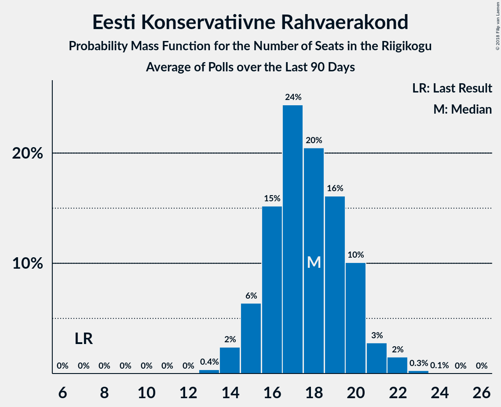

# Eesti Konservatiivne Rahvaerakond

<a href="#voting-intentions">Voting Intentions</a> | <a href="#seats">Seats</a>

## Voting Intentions

Last result: **17.8%** (General Election of 3 March 2019)

### Confidence Intervals

| Period     | Polling firm/Commissioner(s) | Median | 80% Confidence Interval | 90% Confidence Interval | 95% Confidence Interval | 99% Confidence Interval |
|:----------:|:----------------:|:-----------:|:-----------------------:|:-----------------------:|:-----------------------:|:-----------------------:|
| N/A | [Poll Average](average.html) | 16.9% | 14.9–19.6% | 14.5–20.1% | 14.1–20.6% | 13.4–21.4% |
| [1–30 June 2020](2020-06-30-KantarEmor.html) | Kantar Emor   BNS and Postimees | 18.9% | 17.6–20.4% | 17.2–20.8% | 16.9–21.2% | 16.2–21.9% |
| [16–22 June 2020](2020-06-22-Norstat.html) | Norstat   MTÜ Ühiskonnauuringute Instituut | 16.0% | 14.6–17.6% | 14.2–18.0% | 13.9–18.4% | 13.2–19.2% |
| [9–16 June 2020](2020-06-16-Norstat.html) | Norstat   MTÜ Ühiskonnauuringute Instituut | 16.3% | 14.9–17.9% | 14.5–18.3% | 14.1–18.7% | 13.5–19.5% |
| [9–15 June 2020](2020-06-15-Turu-uuringuteAS.html) | Turu-uuringute AS   ERR | 16.1% | 14.7–17.7% | 14.3–18.2% | 14.0–18.5% | 13.3–19.3% |
| [1–8 June 2020](2020-06-08-Norstat.html) | Norstat   MTÜ Ühiskonnauuringute Instituut | 20.3% | N/A | N/A | N/A | N/A |
| [25 May–1 June 2020](2020-06-01-Norstat.html) | Norstat   MTÜ Ühiskonnauuringute Instituut | 16.7% | N/A | N/A | N/A | N/A |
| [18–25 May 2020](2020-05-25-Norstat.html) | Norstat   MTÜ Ühiskonnauuringute Instituut | 12.4% | N/A | N/A | N/A | N/A |
| [14–20 May 2020](2020-05-20-KantarEmor.html) | Kantar Emor   BNS and Postimees | 21.9% | 20.5–23.5% | 20.1–23.9% | 19.7–24.3% | 19.1–25.0% |
| [12–18 May 2020](2020-05-18-Norstat.html) | Norstat   MTÜ Ühiskonnauuringute Instituut | 16.7% | 15.3–18.3% | 14.9–18.7% | 14.5–19.1% | 13.9–19.9% |
| [7–15 May 2020](2020-05-15-Turu-uuringuteAS.html) | Turu-uuringute AS   ERR | 15.5% | 14.1–17.1% | 13.8–17.5% | 13.4–17.9% | 12.8–18.7% |
| [6–12 May 2020](2020-05-12-Norstat.html) | Norstat   MTÜ Ühiskonnauuringute Instituut | 17.9% | 16.4–19.5% | 16.0–20.0% | 15.6–20.4% | 15.0–21.2% |
| [24 April–5 May 2020](2020-05-05-Norstat.html) | Norstat   MTÜ Ühiskonnauuringute Instituut | 19.2% | 17.7–20.9% | 17.2–21.4% | 16.9–21.8% | 16.2–22.6% |
| [21–27 April 2020](2020-04-27-Norstat.html) | Norstat   MTÜ Ühiskonnauuringute Instituut | 18.0% | 16.5–19.6% | 16.1–20.1% | 15.7–20.5% | 15.1–21.3% |
| [20–22 April 2020](2020-04-22-KantarEmor.html) | Kantar Emor   BNS and Postimees | 18.8% | 17.3–20.5% | 16.9–20.9% | 16.5–21.3% | 15.8–22.1% |
| [15–20 April 2020](2020-04-20-Norstat.html) | Norstat   MTÜ Ühiskonnauuringute Instituut | 18.1% | 16.6–19.7% | 16.2–20.2% | 15.8–20.6% | 15.2–21.4% |
| [7–14 April 2020](2020-04-14-Norstat.html) | Norstat   MTÜ Ühiskonnauuringute Instituut | 16.3% | 14.9–17.9% | 14.5–18.3% | 14.1–18.7% | 13.5–19.5% |
| [6–7 April 2020](2020-04-07-Turu-uuringuteAS.html) | Turu-uuringute AS   ERR | 17.0% | 15.5–18.6% | 15.2–19.1% | 14.8–19.5% | 14.1–20.3% |
| [31 March–6 April 2020](2020-04-06-Norstat.html) | Norstat   MTÜ Ühiskonnauuringute Instituut | 14.1% | 12.8–15.6% | 12.4–16.0% | 12.1–16.4% | 11.5–17.1% |
| [24–30 March 2020](2020-03-30-Norstat.html) | Norstat   MTÜ Ühiskonnauuringute Instituut | 15.9% | 14.5–17.5% | 14.1–17.9% | 13.8–18.3% | 13.1–19.1% |
| [18–23 March 2020](2020-03-23-Norstat.html) | Norstat   MTÜ Ühiskonnauuringute Instituut | 16.9% | 15.5–18.5% | 15.0–19.0% | 14.7–19.4% | 14.0–20.1% |
| [12–18 March 2020](2020-03-18-KantarEmor.html) | Kantar Emor   BNS and Postimees | 20.9% | 19.4–22.6% | 19.0–23.0% | 18.6–23.4% | 17.9–24.2% |
| [10–16 March 2020](2020-03-16-Turu-uuringuteAS.html) | Turu-uuringute AS   ERR | 20.2% | 18.7–21.8% | 18.2–22.3% | 17.9–22.7% | 17.1–23.5% |
| [10–16 March 2020](2020-03-16-Norstat.html) | Norstat   MTÜ Ühiskonnauuringute Instituut | 16.6% | 15.2–18.2% | 14.8–18.6% | 14.4–19.0% | 13.8–19.8% |
| [4–9 March 2020](2020-03-09-Norstat.html) | Norstat   MTÜ Ühiskonnauuringute Instituut | 16.4% | 15.0–18.0% | 14.6–18.4% | 14.2–18.8% | 13.6–19.6% |
| [26 February–2 March 2020](2020-03-02-Norstat.html) | Norstat   MTÜ Ühiskonnauuringute Instituut | 16.3% | 14.9–17.9% | 14.5–18.3% | 14.1–18.7% | 13.5–19.5% |
| [19–26 February 2020](2020-02-26-Norstat.html) | Norstat   MTÜ Ühiskonnauuringute Instituut | 18.4% | 16.9–20.1% | 16.5–20.5% | 16.1–20.9% | 15.4–21.7% |
| [13–18 February 2020](2020-02-18-Norstat.html) | Norstat   MTÜ Ühiskonnauuringute Instituut | 18.0% | 16.5–19.6% | 16.1–20.1% | 15.7–20.5% | 15.1–21.3% |
| [6–17 February 2020](2020-02-17-Turu-uuringuteAS.html) | Turu-uuringute AS   ERR | 17.5% | 15.8–19.3% | 15.4–19.8% | 15.0–20.2% | 14.2–21.1% |
| [4–11 February 2020](2020-02-11-Norstat.html) | Norstat   MTÜ Ühiskonnauuringute Instituut | 17.5% | 16.0–19.1% | 15.6–19.6% | 15.3–20.0% | 14.6–20.8% |
| [28 January–3 February 2020](2020-02-03-Norstat.html) | Norstat   MTÜ Ühiskonnauuringute Instituut | 15.6% | 14.2–17.2% | 13.8–17.6% | 13.5–18.0% | 12.8–18.8% |
| [1–31 January 2020](2020-01-31-KantarEmor.html) | Kantar Emor | 16.0% | 14.5–17.7% | 14.1–18.2% | 13.7–18.6% | 13.0–19.4% |
| [17–27 January 2020](2020-01-27-Turu-uuringuteAS.html) | Turu-uuringute AS   ERR | 17.9% | 16.3–19.8% | 15.9–20.3% | 15.5–20.7% | 14.7–21.6% |
| [23–27 January 2020](2020-01-27-Norstat.html) | Norstat   MTÜ Ühiskonnauuringute Instituut | 12.7% | 11.4–14.1% | 11.1–14.6% | 10.8–14.9% | 10.2–15.6% |
| [16–24 January 2020](2020-01-24-Norstat.html) | Norstat   MTÜ Ühiskonnauuringute Instituut | 14.6% | 13.2–16.1% | 12.9–16.6% | 12.5–16.9% | 11.9–17.7% |
| [8–14 January 2020](2020-01-14-Norstat.html) | Norstat   MTÜ Ühiskonnauuringute Instituut | 13.0% | 11.7–14.5% | 11.4–14.9% | 11.1–15.2% | 10.5–16.0% |
| [3–7 January 2020](2020-01-07-Norstat.html) | Norstat   MTÜ Ühiskonnauuringute Instituut | 15.8% | 14.4–17.4% | 14.0–17.8% | 13.7–18.2% | 13.0–19.0% |
| [18–23 December 2019](2019-12-23-Norstat.html) | Norstat   MTÜ Ühiskonnauuringute Instituut | 16.1% | 14.7–17.7% | 14.3–18.1% | 13.9–18.5% | 13.3–19.3% |
| [11–17 December 2019](2019-12-17-Norstat.html) | Norstat   MTÜ Ühiskonnauuringute Instituut | 13.5% | 12.2–15.0% | 11.8–15.4% | 11.5–15.8% | 10.9–16.5% |
| [5–12 December 2019](2019-12-12-KantarEmor.html) | Kantar Emor   BNS and Postimees | 15.6% | 14.4–16.9% | 14.1–17.2% | 13.8–17.6% | 13.2–18.2% |
| [28 November–9 December 2019](2019-12-09-Turu-uuringuteAS.html) | Turu-uuringute AS   ERR | 17.0% | 15.5–18.6% | 15.1–19.0% | 14.8–19.4% | 14.1–20.2% |
| [2–9 December 2019](2019-12-09-Norstat.html) | Norstat   MTÜ Ühiskonnauuringute Instituut | 16.3% | N/A | N/A | N/A | N/A |
| [25–29 November 2019](2019-11-29-Norstat.html) | Norstat   MTÜ Ühiskonnauuringute Instituut | 11.9% | N/A | N/A | N/A | N/A |
| [18–25 November 2019](2019-11-25-Norstat.html) | Norstat   MTÜ Ühiskonnauuringute Instituut | 12.2% | 11.0–13.6% | 10.6–14.0% | 10.3–14.4% | 9.7–15.1% |
| [11–15 November 2019](2019-11-15-Norstat.html) | Norstat   MTÜ Ühiskonnauuringute Instituut | 12.6% | N/A | N/A | N/A | N/A |
| [7–13 November 2019](2019-11-13-KantarEmor.html) | Kantar Emor   BNS and Postimees | 18.3% | 17.1–19.7% | 16.7–20.1% | 16.4–20.5% | 15.8–21.1% |
| [31 October–12 November 2019](2019-11-12-Turu-uuringuteAS.html) | Turu-uuringute AS   ERR | 17.6% | 16.1–19.2% | 15.7–19.6% | 15.3–20.0% | 14.7–20.8% |
| [5–11 November 2019](2019-11-11-Norstat.html) | Norstat   MTÜ Ühiskonnauuringute Instituut | 17.5% | N/A | N/A | N/A | N/A |
| [28 October–5 November 2019](2019-11-05-Norstat.html) | Norstat   MTÜ Ühiskonnauuringute Instituut | 15.8% | N/A | N/A | N/A | N/A |
| [22–28 October 2019](2019-10-28-Norstat.html) | Norstat   MTÜ Ühiskonnauuringute Instituut | 17.8% | N/A | N/A | N/A | N/A |
| [15–21 October 2019](2019-10-21-Norstat.html) | Norstat   MTÜ Ühiskonnauuringute Instituut | 15.6% | N/A | N/A | N/A | N/A |
| [10–16 October 2019](2019-10-16-KantarEmor.html) | Kantar Emor   BNS and Postimees | 16.8% | N/A | N/A | N/A | N/A |
| [9–14 October 2019](2019-10-14-Norstat.html) | Norstat   MTÜ Ühiskonnauuringute Instituut | 17.7% | N/A | N/A | N/A | N/A |
| [3–13 October 2019](2019-10-13-Turu-uuringuteAS.html) | Turu-uuringute AS   ERR | 17.0% | N/A | N/A | N/A | N/A |
| [1–8 October 2019](2019-10-08-Norstat.html) | Norstat   MTÜ Ühiskonnauuringute Instituut | 15.2% | N/A | N/A | N/A | N/A |
| [25–30 September 2019](2019-09-30-Norstat.html) | Norstat   MTÜ Ühiskonnauuringute Instituut | 15.6% | N/A | N/A | N/A | N/A |
| [18–23 September 2019](2019-09-23-Norstat.html) | Norstat   MTÜ Ühiskonnauuringute Instituut | 18.3% | N/A | N/A | N/A | N/A |
| [11–19 September 2019](2019-09-19-KantarEmor.html) | Kantar Emor   BNS and Postimees | 18.5% | N/A | N/A | N/A | N/A |
| [10–17 September 2019](2019-09-17-Norstat.html) | Norstat   MTÜ Ühiskonnauuringute Instituut | 17.1% | N/A | N/A | N/A | N/A |
| [5–16 September 2019](2019-09-16-Turu-uuringuteAS.html) | Turu-uuringute AS   ERR | 19.9% | N/A | N/A | N/A | N/A |
| [3–9 September 2019](2019-09-09-Norstat.html) | Norstat   MTÜ Ühiskonnauuringute Instituut | 15.1% | N/A | N/A | N/A | N/A |
| [27 August–2 September 2019](2019-09-02-Norstat.html) | Norstat   MTÜ Ühiskonnauuringute Instituut | 14.8% | N/A | N/A | N/A | N/A |
| [21–26 August 2019](2019-08-26-Norstat.html) | Norstat   MTÜ Ühiskonnauuringute Instituut | 15.2% | N/A | N/A | N/A | N/A |
| [15–21 August 2019](2019-08-21-KantarEmor.html) | Kantar Emor   BNS and Postimees | 17.4% | N/A | N/A | N/A | N/A |
| [9–20 August 2019](2019-08-20-Turu-uuringuteAS.html) | Turu-uuringute AS   ERR | 16.5% | N/A | N/A | N/A | N/A |
| [13–19 August 2019](2019-08-19-Norstat.html) | Norstat   MTÜ Ühiskonnauuringute Instituut | 16.9% | N/A | N/A | N/A | N/A |
| [5–12 August 2019](2019-08-12-Norstat.html) | Norstat   MTÜ Ühiskonnauuringute Instituut | 16.4% | N/A | N/A | N/A | N/A |
| [30 July–5 August 2019](2019-08-05-Norstat.html) | Norstat   MTÜ Ühiskonnauuringute Instituut | 12.8% | N/A | N/A | N/A | N/A |
| [22–30 July 2019](2019-07-30-Norstat.html) | Norstat   MTÜ Ühiskonnauuringute Instituut | 17.7% | N/A | N/A | N/A | N/A |
| [18–24 July 2019](2019-07-24-KantarEmor.html) | Kantar Emor   BNS and Postimees | 19.4% | N/A | N/A | N/A | N/A |
| [15–22 July 2019](2019-07-22-Norstat.html) | Norstat   MTÜ Ühiskonnauuringute Instituut | 16.6% | N/A | N/A | N/A | N/A |
| [8–15 July 2019](2019-07-15-Norstat.html) | Norstat   MTÜ Ühiskonnauuringute Instituut | 15.8% | N/A | N/A | N/A | N/A |
| [2–8 July 2019](2019-07-08-Norstat.html) | Norstat   MTÜ Ühiskonnauuringute Instituut | 18.0% | N/A | N/A | N/A | N/A |
| [26 June–1 July 2019](2019-07-01-Norstat.html) | Norstat   MTÜ Ühiskonnauuringute Instituut | 17.5% | N/A | N/A | N/A | N/A |
| [11–19 June 2019](2019-06-19-Norstat.html) | Norstat   MTÜ Ühiskonnauuringute Instituut | 13.9% | N/A | N/A | N/A | N/A |
| [6–13 June 2019](2019-06-13-KantarEmor.html) | Kantar Emor   BNS and Postimees | 16.8% | N/A | N/A | N/A | N/A |
| [4–11 June 2019](2019-06-11-Norstat.html) | Norstat   MTÜ Ühiskonnauuringute Instituut | 19.2% | N/A | N/A | N/A | N/A |
| [28 May–10 June 2019](2019-06-10-Turu-uuringuteAS.html) | Turu-uuringute AS   ERR | 18.8% | N/A | N/A | N/A | N/A |
| [27 May–3 June 2019](2019-06-03-Norstat.html) | Norstat   MTÜ Ühiskonnauuringute Instituut | 19.1% | N/A | N/A | N/A | N/A |
| [20–27 May 2019](2019-05-27-Norstat.html) | Norstat   MTÜ Ühiskonnauuringute Instituut | 16.8% | N/A | N/A | N/A | N/A |
| [14–20 May 2019](2019-05-20-Norstat.html) | Norstat   MTÜ Ühiskonnauuringute Instituut | 22.0% | N/A | N/A | N/A | N/A |
| [6–13 May 2019](2019-05-13-Norstat.html) | Norstat   MTÜ Ühiskonnauuringute Instituut | 16.3% | N/A | N/A | N/A | N/A |
| [7–9 May 2019](2019-05-09-KantarEmor.html) | Kantar Emor   BNS and Postimees | 17.0% | N/A | N/A | N/A | N/A |
| [29 April–7 May 2019](2019-05-07-Norstat.html) | Norstat   MTÜ Ühiskonnauuringute Instituut | 15.0% | N/A | N/A | N/A | N/A |
| [22–29 April 2019](2019-04-29-Norstat.html) | Norstat   MTÜ Ühiskonnauuringute Instituut | 19.1% | N/A | N/A | N/A | N/A |
| [15–22 April 2019](2019-04-22-Norstat.html) | Norstat   MTÜ Ühiskonnauuringute Instituut | 20.3% | N/A | N/A | N/A | N/A |
| [2–15 April 2019](2019-04-15-Turu-uuringuteAS.html) | Turu-uuringute AS   ERR | 16.2% | N/A | N/A | N/A | N/A |
| [8–15 April 2019](2019-04-15-Norstat.html) | Norstat   MTÜ Ühiskonnauuringute Instituut | 18.1% | N/A | N/A | N/A | N/A |
| [10–15 April 2019](2019-04-15-KantarEmor.html) | Kantar Emor   BNS and Postimees | 15.4% | N/A | N/A | N/A | N/A |
| [1–8 April 2019](2019-04-08-Norstat.html) | Norstat   MTÜ Ühiskonnauuringute Instituut | 14.8% | N/A | N/A | N/A | N/A |
| [25–29 March 2019](2019-03-29-Norstat.html) | Norstat   MTÜ Ühiskonnauuringute Instituut | 19.1% | N/A | N/A | N/A | N/A |
| [18–24 March 2019](2019-03-24-Norstat.html) | Norstat   MTÜ Ühiskonnauuringute Instituut | 18.8% | N/A | N/A | N/A | N/A |
| [14–21 March 2019](2019-03-21-KantarEmor.html) | Kantar Emor   BNS and Postimees | 18.0% | N/A | N/A | N/A | N/A |
| [5–18 March 2019](2019-03-18-Turu-uuringuteAS.html) | Turu-uuringute AS   ERR | 21.0% | N/A | N/A | N/A | N/A |
| [11–15 March 2019](2019-03-15-Norstat.html) | Norstat   MTÜ Ühiskonnauuringute Instituut | 12.6% | N/A | N/A | N/A | N/A |
| [12–13 March 2019](2019-03-13-KantarEmor.html) | Kantar Emor   BNS and Postimees | 18.1% | N/A | N/A | N/A | N/A |
| [5–11 March 2019](2019-03-11-Norstat.html) | Norstat   MTÜ Ühiskonnauuringute Instituut | 18.1% | N/A | N/A | N/A | N/A |

### Probability Mass Function

The following table shows the probability mass function per percentage block of voting intentions for the [poll average](average.html) for Eesti Konservatiivne Rahvaerakond.

| Voting Intentions | Probability | Accumulated | Special Marks |
|:-----------------:|:-----------:|:-----------:|:-------------:|
| 11.5–12.5% | 0% | 100% |  |
| 12.5–13.5% | 0.7% | 100% |  |
| 13.5–14.5% | 5% | 99.3% |  |
| 14.5–15.5% | 15% | 94% |  |
| 15.5–16.5% | 23% | 79% |  |
| 16.5–17.5% | 19% | 57% | Median |
| 17.5–18.5% | 15% | 38% | Last Result |
| 18.5–19.5% | 13% | 23% |  |
| 19.5–20.5% | 7% | 10% |  |
| 20.5–21.5% | 2% | 3% |  |
| 21.5–22.5% | 0.3% | 0.4% |  |
| 22.5–23.5% | 0% | 0% |  |

## Seats

Last result: **19** seats (General Election of 3 March 2019)

### Confidence Intervals

| Period     | Polling firm/Commissioner(s) | Median | 80% Confidence Interval | 90% Confidence Interval | 95% Confidence Interval | 99% Confidence Interval |
|:----------:|:----------------:|:------:|:-----------------------:|:-----------------------:|:-----------------------:|:-----------------------:|
| N/A | [Poll Average](average.html) | 18 | 15–23 | 15–23 | 14–23 | 13–24 |
| [1–30 June 2020](2020-06-30-KantarEmor.html) | Kantar Emor   BNS and Postimees | 21 | 19–23 | 19–23 | 18–24 | 17–25 |
| [16–22 June 2020](2020-06-22-Norstat.html) | Norstat   MTÜ Ühiskonnauuringute Instituut | 17 | 15–18 | 14–19 | 14–19 | 13–20 |
| [9–16 June 2020](2020-06-16-Norstat.html) | Norstat   MTÜ Ühiskonnauuringute Instituut | 16 | 15–19 | 14–19 | 14–20 | 13–21 |
| [9–15 June 2020](2020-06-15-Turu-uuringuteAS.html) | Turu-uuringute AS   ERR | 16 | 15–19 | 15–19 | 14–20 | 13–21 |
| [1–8 June 2020](2020-06-08-Norstat.html) | Norstat   MTÜ Ühiskonnauuringute Instituut |  |  |  |  |  |
| [25 May–1 June 2020](2020-06-01-Norstat.html) | Norstat   MTÜ Ühiskonnauuringute Instituut |  |  |  |  |  |
| [18–25 May 2020](2020-05-25-Norstat.html) | Norstat   MTÜ Ühiskonnauuringute Instituut |  |  |  |  |  |
| [14–20 May 2020](2020-05-20-KantarEmor.html) | Kantar Emor   BNS and Postimees | 24 | 22–26 | 22–27 | 21–27 | 21–28 |
| [12–18 May 2020](2020-05-18-Norstat.html) | Norstat   MTÜ Ühiskonnauuringute Instituut | 18 | 16–20 | 16–20 | 16–21 | 14–22 |
| [7–15 May 2020](2020-05-15-Turu-uuringuteAS.html) | Turu-uuringute AS   ERR | 16 | 14–17 | 14–18 | 13–19 | 12–19 |
| [6–12 May 2020](2020-05-12-Norstat.html) | Norstat   MTÜ Ühiskonnauuringute Instituut | 19 | 18–21 | 17–22 | 17–23 | 15–24 |
| [24 April–5 May 2020](2020-05-05-Norstat.html) | Norstat   MTÜ Ühiskonnauuringute Instituut | 21 | 18–23 | 18–24 | 18–24 | 17–25 |
| [21–27 April 2020](2020-04-27-Norstat.html) | Norstat   MTÜ Ühiskonnauuringute Instituut | 19 | 17–21 | 17–23 | 16–23 | 16–24 |
| [20–22 April 2020](2020-04-22-KantarEmor.html) | Kantar Emor   BNS and Postimees | 21 | 19–23 | 19–23 | 18–24 | 17–25 |
| [15–20 April 2020](2020-04-20-Norstat.html) | Norstat   MTÜ Ühiskonnauuringute Instituut | 19 | 18–22 | 17–22 | 16–22 | 16–23 |
| [7–14 April 2020](2020-04-14-Norstat.html) | Norstat   MTÜ Ühiskonnauuringute Instituut | 17 | 15–19 | 15–19 | 14–20 | 14–21 |
| [6–7 April 2020](2020-04-07-Turu-uuringuteAS.html) | Turu-uuringute AS   ERR | 18 | 16–21 | 16–21 | 16–22 | 15–23 |
| [31 March–6 April 2020](2020-04-06-Norstat.html) | Norstat   MTÜ Ühiskonnauuringute Instituut | 15 | 13–17 | 12–17 | 12–18 | 12–19 |
| [24–30 March 2020](2020-03-30-Norstat.html) | Norstat   MTÜ Ühiskonnauuringute Instituut | 17 | 15–19 | 15–19 | 14–20 | 14–21 |
| [18–23 March 2020](2020-03-23-Norstat.html) | Norstat   MTÜ Ühiskonnauuringute Instituut | 18 | 16–20 | 16–21 | 15–21 | 15–22 |
| [12–18 March 2020](2020-03-18-KantarEmor.html) | Kantar Emor   BNS and Postimees | 24 | 22–25 | 21–26 | 21–26 | 20–27 |
| [10–16 March 2020](2020-03-16-Turu-uuringuteAS.html) | Turu-uuringute AS   ERR | 22 | 19–24 | 18–25 | 18–25 | 18–26 |
| [10–16 March 2020](2020-03-16-Norstat.html) | Norstat   MTÜ Ühiskonnauuringute Instituut | 17 | 15–19 | 15–19 | 15–20 | 14–21 |
| [4–9 March 2020](2020-03-09-Norstat.html) | Norstat   MTÜ Ühiskonnauuringute Instituut | 16 | 15–19 | 15–20 | 15–20 | 14–22 |
| [26 February–2 March 2020](2020-03-02-Norstat.html) | Norstat   MTÜ Ühiskonnauuringute Instituut | 17 | 15–19 | 15–20 | 15–20 | 14–21 |
| [19–26 February 2020](2020-02-26-Norstat.html) | Norstat   MTÜ Ühiskonnauuringute Instituut | 19 | 18–21 | 17–22 | 17–22 | 16–23 |
| [13–18 February 2020](2020-02-18-Norstat.html) | Norstat   MTÜ Ühiskonnauuringute Instituut | 19 | 18–21 | 17–22 | 16–23 | 16–23 |
| [6–17 February 2020](2020-02-17-Turu-uuringuteAS.html) | Turu-uuringute AS   ERR | 18 | 17–20 | 16–21 | 15–21 | 15–23 |
| [4–11 February 2020](2020-02-11-Norstat.html) | Norstat   MTÜ Ühiskonnauuringute Instituut | 19 | 17–20 | 16–21 | 16–21 | 15–22 |
| [28 January–3 February 2020](2020-02-03-Norstat.html) | Norstat   MTÜ Ühiskonnauuringute Instituut | 16 | 15–18 | 14–18 | 14–18 | 13–19 |
| [1–31 January 2020](2020-01-31-KantarEmor.html) | Kantar Emor | 17 | 15–19 | 15–20 | 15–20 | 14–21 |
| [17–27 January 2020](2020-01-27-Turu-uuringuteAS.html) | Turu-uuringute AS   ERR | 20 | 18–23 | 17–23 | 17–23 | 16–24 |
| [23–27 January 2020](2020-01-27-Norstat.html) | Norstat   MTÜ Ühiskonnauuringute Instituut | 13 | 11–15 | 11–15 | 11–16 | 10–17 |
| [16–24 January 2020](2020-01-24-Norstat.html) | Norstat   MTÜ Ühiskonnauuringute Instituut | 15 | 14–17 | 13–17 | 13–18 | 12–19 |
| [8–14 January 2020](2020-01-14-Norstat.html) | Norstat   MTÜ Ühiskonnauuringute Instituut | 13 | 12–15 | 11–15 | 11–16 | 10–17 |
| [3–7 January 2020](2020-01-07-Norstat.html) | Norstat   MTÜ Ühiskonnauuringute Instituut | 16 | 15–18 | 14–18 | 14–19 | 13–21 |
| [18–23 December 2019](2019-12-23-Norstat.html) | Norstat   MTÜ Ühiskonnauuringute Instituut | 17 | 15–19 | 15–20 | 14–21 | 14–21 |
| [11–17 December 2019](2019-12-17-Norstat.html) | Norstat   MTÜ Ühiskonnauuringute Instituut | 14 | 13–16 | 12–16 | 11–17 | 11–18 |
| [5–12 December 2019](2019-12-12-KantarEmor.html) | Kantar Emor   BNS and Postimees | 16 | 15–17 | 14–18 | 14–18 | 13–19 |
| [28 November–9 December 2019](2019-12-09-Turu-uuringuteAS.html) | Turu-uuringute AS   ERR | 19 | 17–21 | 16–22 | 16–22 | 15–24 |
| [2–9 December 2019](2019-12-09-Norstat.html) | Norstat   MTÜ Ühiskonnauuringute Instituut |  |  |  |  |  |
| [25–29 November 2019](2019-11-29-Norstat.html) | Norstat   MTÜ Ühiskonnauuringute Instituut |  |  |  |  |  |
| [18–25 November 2019](2019-11-25-Norstat.html) | Norstat   MTÜ Ühiskonnauuringute Instituut | 12 | 11–14 | 11–15 | 10–15 | 10–16 |
| [11–15 November 2019](2019-11-15-Norstat.html) | Norstat   MTÜ Ühiskonnauuringute Instituut |  |  |  |  |  |
| [7–13 November 2019](2019-11-13-KantarEmor.html) | Kantar Emor   BNS and Postimees | 20 | 18–22 | 18–22 | 18–23 | 17–24 |
| [31 October–12 November 2019](2019-11-12-Turu-uuringuteAS.html) | Turu-uuringute AS   ERR | 18 | 17–20 | 16–21 | 16–22 | 15–23 |
| [5–11 November 2019](2019-11-11-Norstat.html) | Norstat   MTÜ Ühiskonnauuringute Instituut |  |  |  |  |  |
| [28 October–5 November 2019](2019-11-05-Norstat.html) | Norstat   MTÜ Ühiskonnauuringute Instituut |  |  |  |  |  |
| [22–28 October 2019](2019-10-28-Norstat.html) | Norstat   MTÜ Ühiskonnauuringute Instituut |  |  |  |  |  |
| [15–21 October 2019](2019-10-21-Norstat.html) | Norstat   MTÜ Ühiskonnauuringute Instituut |  |  |  |  |  |
| [10–16 October 2019](2019-10-16-KantarEmor.html) | Kantar Emor   BNS and Postimees |  |  |  |  |  |
| [9–14 October 2019](2019-10-14-Norstat.html) | Norstat   MTÜ Ühiskonnauuringute Instituut |  |  |  |  |  |
| [3–13 October 2019](2019-10-13-Turu-uuringuteAS.html) | Turu-uuringute AS   ERR |  |  |  |  |  |
| [1–8 October 2019](2019-10-08-Norstat.html) | Norstat   MTÜ Ühiskonnauuringute Instituut |  |  |  |  |  |
| [25–30 September 2019](2019-09-30-Norstat.html) | Norstat   MTÜ Ühiskonnauuringute Instituut |  |  |  |  |  |
| [18–23 September 2019](2019-09-23-Norstat.html) | Norstat   MTÜ Ühiskonnauuringute Instituut |  |  |  |  |  |
| [11–19 September 2019](2019-09-19-KantarEmor.html) | Kantar Emor   BNS and Postimees |  |  |  |  |  |
| [10–17 September 2019](2019-09-17-Norstat.html) | Norstat   MTÜ Ühiskonnauuringute Instituut |  |  |  |  |  |
| [5–16 September 2019](2019-09-16-Turu-uuringuteAS.html) | Turu-uuringute AS   ERR |  |  |  |  |  |
| [3–9 September 2019](2019-09-09-Norstat.html) | Norstat   MTÜ Ühiskonnauuringute Instituut |  |  |  |  |  |
| [27 August–2 September 2019](2019-09-02-Norstat.html) | Norstat   MTÜ Ühiskonnauuringute Instituut |  |  |  |  |  |
| [21–26 August 2019](2019-08-26-Norstat.html) | Norstat   MTÜ Ühiskonnauuringute Instituut |  |  |  |  |  |
| [15–21 August 2019](2019-08-21-KantarEmor.html) | Kantar Emor   BNS and Postimees |  |  |  |  |  |
| [9–20 August 2019](2019-08-20-Turu-uuringuteAS.html) | Turu-uuringute AS   ERR |  |  |  |  |  |
| [13–19 August 2019](2019-08-19-Norstat.html) | Norstat   MTÜ Ühiskonnauuringute Instituut |  |  |  |  |  |
| [5–12 August 2019](2019-08-12-Norstat.html) | Norstat   MTÜ Ühiskonnauuringute Instituut |  |  |  |  |  |
| [30 July–5 August 2019](2019-08-05-Norstat.html) | Norstat   MTÜ Ühiskonnauuringute Instituut |  |  |  |  |  |
| [22–30 July 2019](2019-07-30-Norstat.html) | Norstat   MTÜ Ühiskonnauuringute Instituut |  |  |  |  |  |
| [18–24 July 2019](2019-07-24-KantarEmor.html) | Kantar Emor   BNS and Postimees |  |  |  |  |  |
| [15–22 July 2019](2019-07-22-Norstat.html) | Norstat   MTÜ Ühiskonnauuringute Instituut |  |  |  |  |  |
| [8–15 July 2019](2019-07-15-Norstat.html) | Norstat   MTÜ Ühiskonnauuringute Instituut |  |  |  |  |  |
| [2–8 July 2019](2019-07-08-Norstat.html) | Norstat   MTÜ Ühiskonnauuringute Instituut |  |  |  |  |  |
| [26 June–1 July 2019](2019-07-01-Norstat.html) | Norstat   MTÜ Ühiskonnauuringute Instituut |  |  |  |  |  |
| [11–19 June 2019](2019-06-19-Norstat.html) | Norstat   MTÜ Ühiskonnauuringute Instituut |  |  |  |  |  |
| [6–13 June 2019](2019-06-13-KantarEmor.html) | Kantar Emor   BNS and Postimees |  |  |  |  |  |
| [4–11 June 2019](2019-06-11-Norstat.html) | Norstat   MTÜ Ühiskonnauuringute Instituut |  |  |  |  |  |
| [28 May–10 June 2019](2019-06-10-Turu-uuringuteAS.html) | Turu-uuringute AS   ERR |  |  |  |  |  |
| [27 May–3 June 2019](2019-06-03-Norstat.html) | Norstat   MTÜ Ühiskonnauuringute Instituut |  |  |  |  |  |
| [20–27 May 2019](2019-05-27-Norstat.html) | Norstat   MTÜ Ühiskonnauuringute Instituut |  |  |  |  |  |
| [14–20 May 2019](2019-05-20-Norstat.html) | Norstat   MTÜ Ühiskonnauuringute Instituut |  |  |  |  |  |
| [6–13 May 2019](2019-05-13-Norstat.html) | Norstat   MTÜ Ühiskonnauuringute Instituut |  |  |  |  |  |
| [7–9 May 2019](2019-05-09-KantarEmor.html) | Kantar Emor   BNS and Postimees |  |  |  |  |  |
| [29 April–7 May 2019](2019-05-07-Norstat.html) | Norstat   MTÜ Ühiskonnauuringute Instituut |  |  |  |  |  |
| [22–29 April 2019](2019-04-29-Norstat.html) | Norstat   MTÜ Ühiskonnauuringute Instituut |  |  |  |  |  |
| [15–22 April 2019](2019-04-22-Norstat.html) | Norstat   MTÜ Ühiskonnauuringute Instituut |  |  |  |  |  |
| [2–15 April 2019](2019-04-15-Turu-uuringuteAS.html) | Turu-uuringute AS   ERR |  |  |  |  |  |
| [8–15 April 2019](2019-04-15-Norstat.html) | Norstat   MTÜ Ühiskonnauuringute Instituut |  |  |  |  |  |
| [10–15 April 2019](2019-04-15-KantarEmor.html) | Kantar Emor   BNS and Postimees |  |  |  |  |  |
| [1–8 April 2019](2019-04-08-Norstat.html) | Norstat   MTÜ Ühiskonnauuringute Instituut |  |  |  |  |  |
| [25–29 March 2019](2019-03-29-Norstat.html) | Norstat   MTÜ Ühiskonnauuringute Instituut |  |  |  |  |  |
| [18–24 March 2019](2019-03-24-Norstat.html) | Norstat   MTÜ Ühiskonnauuringute Instituut |  |  |  |  |  |
| [14–21 March 2019](2019-03-21-KantarEmor.html) | Kantar Emor   BNS and Postimees |  |  |  |  |  |
| [5–18 March 2019](2019-03-18-Turu-uuringuteAS.html) | Turu-uuringute AS   ERR |  |  |  |  |  |
| [11–15 March 2019](2019-03-15-Norstat.html) | Norstat   MTÜ Ühiskonnauuringute Instituut |  |  |  |  |  |
| [12–13 March 2019](2019-03-13-KantarEmor.html) | Kantar Emor   BNS and Postimees |  |  |  |  |  |
| [5–11 March 2019](2019-03-11-Norstat.html) | Norstat   MTÜ Ühiskonnauuringute Instituut |  |  |  |  |  |

### Probability Mass Function

The following table shows the probability mass function per seat for the [poll average](average.html) for Eesti Konservatiivne Rahvaerakond.

| Number of Seats | Probability | Accumulated | Special Marks |
|:---------------:|:-----------:|:-----------:|:-------------:|
| 13 | 0.5% | 100% |  |
| 14 | 2% | 99.4% |  |
| 15 | 17% | 97% |  |
| 16 | 14% | 81% |  |
| 17 | 14% | 67% |  |
| 18 | 14% | 53% | Median |
| 19 | 8% | 39% | Last Result |
| 20 | 8% | 31% |  |
| 21 | 6% | 22% |  |
| 22 | 5% | 16% |  |
| 23 | 10% | 11% |  |
| 24 | 0.9% | 1.2% |  |
| 25 | 0.2% | 0.3% |  |
| 26 | 0.1% | 0.1% |  |
| 27 | 0% | 0% |  |

